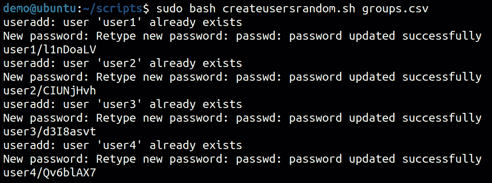

# 第十七章：高级 Shell 脚本示例

到目前为止，我们已经尽力展示了编写脚本的不同方式，并且我们通过许多示例演示了如何完成不同的任务。在本章中，我们将以更复杂的方式在**实际生活**中可以使用的**脚本**中实现所有这些。

我们在本章中要展示的脚本解决了系统管理员的日常问题，从创建新用户到处理**虚拟机**（**VMs**）。通过这些示例的演示，我们的目标不仅是展示脚本的工作原理，还包括其应该如何编写和处理的方法。

在本章中，我们将涵盖以下 Shell 脚本示例：

+   实施 Web 服务器服务和安全设置

+   从标准化输入文件中创建用户和组，使用标准化密码，并强制用户在下次登录时更改密码

+   从标准化输入文件中创建用户和组，并为每个用户生成一个随机密码

+   在**基于内核的虚拟机**（**KVM**）上进行脚本化的虚拟机安装

+   一个用于配置`sudo`权限的 shell 脚本

+   用于 VM 管理的 Shell 脚本

# 技术要求

在几乎所有其他章节中，我们都在使用一个通用的设置，只需要任何能够运行 Bash shell 的 Linux 发行版。在本章中，我们将稍作改变——必须这样做，这些脚本将必须在 Ubuntu 或任何其他基于 Debian 的发行版上运行。我们将在后续的示例中提到这些原因，当需要在其他 Linux 发行版上执行某些不同的操作时。因此，为了在本章中运行脚本，您需要以下内容：

+   安装了 Linux 的 VM——我们使用*Ubuntu 20.10*，但任何基于 Debian 的发行版都可以工作

+   了解我们在前几章中所做的所有事情，因为我们假设您已经理解了 Bash 脚本的工作原理

因此，请启动您的虚拟机，以便我们可以开始执行许多有用的操作！

# 实施 Web 服务器服务和安全设置

在这个特定的示例中，我们的想法是使用一个小的`shell`脚本来帮助我们配置已安装的 Web 服务器。我们将使我们的脚本能够更改服务器提供的网页所在位置，但您很快会发现，可以轻松地将任何其他选项添加到这个脚本中。

通过使用这个脚本，所有用户只需执行以下操作即可使系统运行起来：

+   安装 Web 服务器

+   运行脚本以更改网站文件位置

就像往常一样，当准备为用户进行简单操作时，主要问题是理解和隐藏所有复杂性，同时使管理员能够相对容易地添加新功能。我们如何做到这一点？继续阅读。

## 准备工作

这是我们的场景：

用户已经在他们的 Ubuntu 机器上安装了 Apache web 服务器。他们想要更改构成网站的文件的位置。

在我们深入讨论之前，我们必须明确这个任务的假设，就像几乎所有脚本一样。

首先，我们希望在运行脚本之前，web 服务器已经安装，并且我们假设它是 Apache。最简单的方法是使用以下命令：

```
sudo apt install apache2 -y
```

现在，我们等待包管理器完成它的工作。

我们的脚本无法与 nginx 或 `lighttpd` 等其他 web 服务器一起使用，因为配置是直接解析的，并且没有一种通用方式来设置我们所需要的参数。话虽如此，由于我们使用的解析方式非常基础，如果你需要修改这个脚本以使其与其他服务器兼容，可能只需要几分钟。

接下来，我们假设用户正在更改默认网站，即配置目录中的 `000-default.conf` 文件。这个值在我们的脚本中是硬编码的，这意味着如果你在同一台服务器上有多个网站，脚本只会更改被配置为默认的网站。

有时，管理员直接将网站添加到配置的这一部分，而不是为每个网站创建新的文件，这本应是应该做的。我们的脚本通过查找并替换文件中所有关于 `DocumentRoot` 指令的内容来完成任务。如果我们指定了多个 `DocumentRoot` 指令，脚本会将它们全部更改为相同的值。

另一个我们必须考虑的问题是错误检查。在脚本本身中，我们试图捕捉配置中是否有错误，但我们处理的方式仍有改进空间。虽然我们的脚本会尝试将文件恢复到修改前的状态，但我们并没有对更改的内容做任何真正的语法检查。如果用户在指定路径时出现错误，这可能会成为一个问题，但没有简单的解决办法；实现一个足够智能的检查来扫描有效路径，对于这样的任务来说过于复杂。

## 如何操作……

在本章的操作步骤中，我们将首先给出我们的脚本版本，然后解释我们认为重要的细节。所有的脚本中都会有大量的注释，我们强烈建议你在可能的情况下也这样做。注释也可以用于在创建脚本时，定义你想要做的所有事项的大致框架，然后再开始输入命令。

首先，让我们从脚本本身开始：

```
#!/bin/bash
# V1.0 / Jasmin Redzepagic / 01/11/2021
# Distribution allowed under GNU Licence V2.0

# Script configures apache DocumentRoot with a given path 
# and sets firewall accordingly
# Script is interactive, no arguments are accepted
# This script has to be run as root, we need to check that
if [[ $(id -u) -ne 0 ]] 
then 
    echo "This script needs to be run as root!" >&2 
    exit 1 
fi
# If there are multiple sites configured we will show a warning
if [[ $(ls /etc/apache2/sites-enabled/ | wc -l) -gt 1 ]] 
then 
echo "Warning: you may have more than one site!" >&2 
             exit 1 
fi
# First we are going to get what the root of the site is now
# When checking for DocumentRoot we are only checking 
# in default web site
HTTPDIR='grep DocumentRoot /etc/apache2/sites-available/000-\default.conf'
HTTPDIR="/$( cut -d '/' -f 2- <<< "$HTTPDIR" )"
# We are going to print current directory 
# that we read from inside the configuration file
echo "Current HTTPDIR is set as $HTTPDIR"
read -p  "Press Enter to accept current value or input absolute\
path for new DocumentRoot: " NEWDIR
# If user pressed enter we are going to 
# simply use the value we already read, 
# otherwise we use the new value
# Note: there is absolutely no sanity checking 
# if the given value is actually a path
NEWDIR=${NEWDIR:-$HTTPDIR}
echo "Directory is going to be set to $NEWDIR"
# Since we are dealing with a path we need to
# preprocess it before we use it in sed
# otherwise this is going to break
# There is an alternative, sed allows for 
# any other character in place of /
# but this is going to be a problem 
# if our path contains any nonstandard character
# so we simply escape all the slashes
# we need to use the _ character in this 
# case to be able to search for slash 
ESCNEWDIR=$(echo $NEWDIR | sed 's_/_\\/_g')
ESCHTTPDIR=$(echo $HTTPDIR | sed 's_/_\\/_g')
# before we change the configuration 
# we are going to back it up so we can restore if we need to 
cp /etc/apache2/sites-available/000-default.conf /etc/apache2/l\
sites-available/000-default.conf.backedup
sed -i "s/$ESCHTTPDIR/$ESCNEWDIR/g" /etc/apache2/sites-available/000-default.conf
# now we need to restart the service
# in order to use the new configuration.
systemctl reload apache2
# after every command we must check to see if there were any errors.
# In this particular case, we restore from backup if there were
if [ $? -ne 0 ]
 then 
     cp /etc/apache2/sites-available/000-default.conf. \
     backedup/etc/apache2/sites-available/000-default.conf
# we need to exit if we triggered this condition 
# since we are finished here, nothing was changed.
# before exit we need to reload apache once more 
# to make sure old configuration is used
# we are doing a start and stop here 
# because reload obviously failed in the step above 
     echo "Apache was not reloaded correctly, maybe there was \
     an error in the syntax"
     systemctl stop apache2
     systemctl start apache2
     return 1
fi
# if we came this far we need to get our firewall sorted out
# we are adding ports 80 and 443 as permitted. 
ufw allow http
ufw allow https
# alternative to this is ufw allow "Apache Full" 
# but using exact ports and aliases makes this easier to read. 
# end of script
```

我们在这里需要注意几件事。Apache 作为一个 Web 服务器，目前在所有发行版中默认是最常用的 Web 服务器，但 nginx 正在逐渐变得越来越受欢迎。需要记住的是，根据包含 `apache` 的发行版包的不同，它被称为 `apache2`（在基于 Debian 的发行版如 Ubuntu 上）或 `httpd`（在基于 Red Hat 的发行版如 **Red Hat Enterprise Linux**（**RHEL**）或 CentOS 上）。除了包名之外，配置文件在服务器本身的位置也有一点小差异，尽管语法完全相同。

另一个问题是防火墙。Ubuntu 使用 `ufw`，而 CentOS 使用 `firewalld`。第三个需要注意的大点是 `apparmor`（Ubuntu）和 `SELinux`（CentOS）。

我们版本的脚本适用于基于 Debian 的机器。如果我们想在例如 CentOS 上使用它，则需要做一些轻微的修改。

## 另见

+   [`www.digitalocean.com/community/questions/which-ufw-service-to-use-for-apache2`](https://www.digitalocean.com/community/questions/which-ufw-service-to-use-for-apache2)

+   [`www.tecmint.com/setup-ufw-firewall-on-ubuntu-and-debian/`](https://www.tecmint.com/setup-ufw-firewall-on-ubuntu-and-debian/)

# 创建用户和组，并强制用户在下次登录时更改密码

在 Linux 机器上，你最常做的事情之一就是创建大量用户。虽然有一种通过使用集中式数据库进行用户认证的方式可以避免这种情况，但实际上，这种方法通常只在大型部署的机器上使用，因此本地用户在大多数情况下仍然是常见的。

部署用户并为其分配密码是每个管理员在部署新服务器或桌面时都需要的功能。

## 准备工作

这个食谱需要做两件事。

由于脚本会更改系统上的用户，因此必须以管理员权限使用此脚本。同时，我们还需要提前准备一个包含用户列表的文件。

在展示我们的脚本之前，我们还必须提到，在获取脚本值时，读取和解析文件的方式不止一种。理解不同的做法对提升你的脚本能力非常有帮助。正因如此，在本食谱和下一个食谱中，我们决定避免使用 `for` 循环，而是选择使用数组和分隔符来解析文件。

## 如何实现……

正如我们已习惯的那样，我们在记录需要记住的事项之前，先开始编写脚本：

```
#!/bin/bash
# V1.0 / Jasmin Redzepagic / 01/11/2021
# Distribution allowed under GNU Licence V2.0
# script creates users from a csv file, and makes the user 
# change his password at next logon
# argument for the script is csv file name
# csv file is structured as follows: 
# user1,password1
# user2,password2
# ....
# First thing to do is check if we have any arguments supplied
if [ $# -eq 0 ]
  then
    echo "No arguments, proper usage is $0 <CSV file>"
fi
# next we need to get our information from the file
# here we are doing it one line at a time 
# and to do that we need to adjust the delimeter 
# that shell uses to understand how values are 
# separated. 
IFS=$'\n'
# Read the lines into an array
read -d '' -ra USRCREDS < $1
# Now we are going to deal with individual lines
# since right now our array contains both the user 
# and the appropriate password in one value
# separated by a , character 
# we chose to do this by telling the shell 
# we want to use , as a value separator
IFS=','
# Iterate over the lines
for USER in "${USRCREDS[@]}"
do
# Split values into separate variables
   read usr pass <<< "$USER"
# Create the user
   useradd -m $usr
# Set the password, we need to do this using passwd command
# alternative would be to use a hashing function
# passwd asks for password twice!
   echo "$pass"$'\n'"$pass" | passwd $usr
# then we expire the user password
   passwd --expire $usr
done
```

这里有几个概念需要提及。第一个是处理密码。任何密码在纯文本下可读的时间过长都会成为安全隐患，因此让用户尽早更改密码的想法是明智的。

为新用户创建密码时，我们基本上有两种选择——一种是提前创建用户和密码的列表，就像我们在这个示例中所做的，另一种是先创建用户列表，然后为他们分配随机密码，正如我们将在下一个食谱中做的那样。

每当你处理任何密码时，始终记住，一旦一个用户被攻破，你就面临着一个大大的安全问题，因为许多侵入系统的方法依赖于能够在本地运行应用程序。尽量减少除了用户之外的其他人知道账户密码的时间，绝不要以明文、可读的格式存储密码。

## 另请参见

+   https://linuxconfig.org/linux-reset-password-expiration-age-and-history

+   [`www.tecmint.com/force-user-to-change-password-next-login-in-linux/`](https://www.tecmint.com/force-user-to-change-password-next-login-in-linux/%0D)

# 从标准化输入文件创建用户和组，并为每个用户分配随机密码

在之前的示例中，我们探讨了创建新用户的一种方式。在这一部分，我们将基于相似的脚本，不仅创建新用户，还为其分配与用户一起提供的组，给管理员提供新用户密码的信息。

## 准备工作

我们正在创建用户，因此这个脚本必须在管理员账户下运行。在这种情况下，我们可能还希望将脚本的输出重定向到某个文件，因为新用户的密码是在脚本运行时创建的，而密码并没有存储在任何地方。如果我们不把它们保存到某处，它们就会丢失，并且在下次运行时重新创建。

## 如何操作……

在之前的示例中，我们提到过密码不应该存储在任何地方，但在创建新用户时，这是完全不可避免的。我们认为，处理密码的方式比提前准备密码更好，因为脚本运行时会生成密码，这样管理员可以从一开始就更好地控制它们：

```
#!/bin/bash
# V1.0 / Jasmin Redzepagic / 01/11/2021
# Distribution allowed under GNU Licence V2.0
# script creates users from a csv file 
# creating a group specified for each user
# and adding the user to a group
# password is generated and printed with the username
# argument for the script is csv file name
# csv file is structured as follows: 
# user1,group1
# user2,group2
# ....
# output is structured as: 
# user / password
# First thing to do is check if we have any arguments supplied
if [ $# -eq 0 ]
  then
    echo "No arguments, proper usage is $0 <CSV file>"
fi
# This script has to be run as root, we need to check that
if [[ $(id -u) -ne 0 ]] 
             then 
              echo "In order to add users and groups this \
              scripts needs to be run as root!" >&2 
              exit 1 
fi
# next we need to get our information from the file 
# here we are doing it one line at a time 
# and to do that we need to adjust the delimeter 
# that shell uses to understand how values are 
# separated. 
IFS=$'\n'
# Read the lines into an array
read -d '' -ra USRCREDS < $1
# Now we are going to deal with individual lines
# since right now our array contains both the user 
# and the appropriate password in one value
# separated by a , character 
# we chose to do this by telling the shell 
# we want to use , as a value separator
IFS=','
# Iterate over the lines
for USER in "${USRCREDS[@]}"
do
# Split values into separate variables
read usr grp <<< "$USER"
# Create the user
useradd -m $usr

# if the group does not exist, create it
getent group $grp || groupadd $grp
# add the user to a group
usermod -a -G $grp $usr
# now we create a random password
pass=$(cat /dev/urandom | tr -dc A-Za-z0-9 | head -c8)
# Set the password, we need to do this using passwd command
# alternative would be to use a hashing function
# passwd asks for password twice!
echo "$pass"$'\n'"$pass" | passwd $usr

# in the end we print user and password 

echo $usr/$pass
done
```

需要注意的是，这个脚本中我们依赖于许多命令返回的消息，而不是自己去检查。例如，如果用户已经创建，`useradd` 会生成一个错误信息，而不是由我们来处理：



图 17.1 – 脚本中命令提供的错误信息

## 另请参见

+   [`superuser.com/questions/533126/how-to-execute-command-and-if-it-fails-execute-another-command-and-return-1`](https://superuser.com/questions/533126/how-to-execute-command-and-if-it-fails-execute-another-command-and-return-1)

+   [`linux.die.net/man/4/urandom`](https://linux.die.net/man/4/urandom)

# 在 KVM 上进行脚本化的虚拟机安装

在某些环境中，另一个常见的任务是通过命令行创建新虚拟机。我们通常这样做的原因是灵活性和速度——使用**图形用户界面**（**GUI**）比使用**命令行界面**（**CLI**）慢**一个数量级**（**OOM**）。

KVM 提供了一个非常简单的命令行创建虚拟机的解决方案。用户只需要了解一些基本参数。

## 准备工作

当然，我们需要在运行这个脚本的服务器上有一个有效的 KVM。除此之外，我们的脚本假设用户理解 KVM 创建虚拟机所需的所有不同选项。在尝试理解脚本如何工作之前，请务必尽可能多地了解从命令行创建虚拟机的相关信息，以便了解不同选项的作用。同时，回顾一下`dialog`工具包的使用知识，因为这个脚本依赖于此进行输入。

## 如何操作……

这个小脚本中的唯一亮点是我们使用`dialog`分配值的方式。像往常一样，有几种方式可以做到这一点。我们使用的是最合乎逻辑的一种，至少对我们来说是这样：

```
#!/bin/bash
# V1.0 / Jasmin Redzepagic / 01/11/2021
# Distribution allowed under GNU Licence V2.0
# script creates a virtual machine on the host it is run on
# asking the user for parameters of the VM
# in this script we are going to use dialog to show
# how a script can get values that way
name=$(dialog --inputbox "What is the name of the VM?" 8 25 \
--output-fd 1)
cpus=$(dialog --inputbox "How many VCPUs?" 8 25  --output-fd 1)
mem=$(dialog --inputbox "Enter the amount of memory in MB" 8 25 \
--output-fd 1)
cdrom=$(dialog --inputbox "Path to CDROM:" 8 25 --output-fd 1)
disksize=$(dialog --inputbox "Enter the disk size:" 8 25 \
--output-fd 1)
osv=$(dialog --inputbox "What is the OS variant installed?" 8 \
25 --output-fd 1)
virt-install --name=$name --vcpus=$cpus --memory=$mem \
--cdrom=$cdrom --disk size=$disksize --os-variant=$osv
```

使用`dialog`时，必须处理用户输入的重定向方式。在这个示例中，我们使用`–output-fd 1`来告诉`dialog`将所有内容重定向到**标准输出**（**stdout**），我们可以在这里直接将值分配给变量。

## 另见

+   [`linux.die.net/man/1/dialog`](https://linux.die.net/man/1/dialog)

+   [`www.geeksforgeeks.org/creating-dialog-boxes-with-the-dialog-tool-in-linux/`](https://www.geeksforgeeks.org/creating-dialog-boxes-with-the-dialog-tool-in-linux/)

# 使用 Shell 脚本配置 SSH 密钥

处理密码的最安全方法是根本不使用它们。如果我们能够获取一个与用户账户相连接的公共密钥，且该用户可以在不使用密码的情况下登录，那么使用 SSH 密钥是一种避免使用密码的绝佳方式，并且由于只有他们的私钥能启用登录，这使得整个交易更加安全。

这个方案正是处理这样的任务，安装一台新的机器，这台机器将作为 LAMP 服务器，并允许用户完全不使用密码登录。

## 准备工作

实际上，如果我们有一些服务器需要安装且时间不多，像这样的脚本会被使用。与此类似的替代方案是使用像 Ansible 这样的适当编排工具，但尽管它是一个功能强大的工具，Ansible 对于小型部署来说太复杂了。

无论如何，这个脚本仅假设我们的服务器有一个有效的互联网连接，以便能够获取需要安装的软件包，并且我们已经从计划创建的用户那里获得了一个公共 SSH 密钥。

## 如何操作……

我们通过使用常规的明文文件来传输密钥。这是完全可以接受的，因为它实际上不包含任何可能带来安全问题的信息——为了使用 SSH 连接，用户必须拥有与我们正在使用的公共密钥对应的私钥。

由于这个密钥是——或者应该是——由唯一的一个特定用户控制的，因此我们在这里不担心安全性：

```
#!/bin/bash
# V1.0 / Jasmin Redzepagic / 01/11/2021
# Distribution allowed under GNU Licence V2.0
# script installs lamp, creates a user and assigns him SSH key
# key is provided in a file 
# script expects filename that contains SSH key
# First thing to do is check if we have any arguments supplied
if [ $# -eq 0 ]
  then
   echo "No arguments, proper usage is $0 <file containing SSH \
key>"
fi
# This script has to be run as root, we need to check that
if [[ $(id -u) -ne 0 ]] 
             then 
                          echo "In order to add services this \
scripts needs to be run as root!" >&2 
                          exit 1 
fi
# now we follow the standard installation procedure for LAMP
# first we aquire new updates
apt update
# then we install apache server
apt install apache2 –y
# we reconfigure the firewall to allow all the traffic in
ufw allow "Apache Full"
# then we install mysql server
# we could also install mariadb as the alternative
apt install mysql-server –y
# then we install php and required modules
apt install php libapache2-mod-php php-mysql –y
# we create our user
useradd lampuser
# we create directory for the ssh keys
mkdir /home/lampuser/.ssh
# we copy the key directly, allowing login without password
# note that user has no password by default, only ssh works
cp $1 /home/lampuser/.ssh/authorized_keys
# apply permissions to files in directory
chown -R lampuser:lampuser /home/lampuser/.ssh
chmod 700 /home/lampuser/.ssh
chmod 600 /home/lampuser/.ssh/authorized_keys
# add user to sudo group enabling sudo command
usermod -a -G sudo lampuser
# finally we run the secure installation to finish setting up \
mysql
mysql_secure_installation
```

## 另见

+   [`www.hostinger.com/tutorials/ssh-tutorial-how-does-ssh-work`](https://www.hostinger.com/tutorials/ssh-tutorial-how-does-ssh-work)

+   [`www.digitalocean.com/community/tutorials/how-to-install-linux-apache-mysql-php-lamp-stack-on-ubuntu-20-04`](https://www.digitalocean.com/community/tutorials/how-to-install-linux-apache-mysql-php-lamp-stack-on-ubuntu-20-04)

# 一个用于虚拟机管理的 shell 脚本

有些任务从命令行操作起来比较复杂，原因是我们有许多命令需要一遍又一遍地执行，并且还需要在后续步骤中重复使用某一步骤得到的值。

在这个教程中，我们将处理这样的任务，即对虚拟机进行基本的维护。我们的计划是创建一个脚本，帮助用户在本地服务器上运行的虚拟机上执行几个标准任务，简化管理任务，并避免记住长命令。我们的计划是让用户能够启动、停止、检查状态并恢复本地服务器上运行的虚拟机。该脚本将向用户提供虚拟机列表，并让他们有机会选择任何可用的虚拟机，或者将命令应用于所有虚拟机。

让我们看看这个任务需要什么。

## 准备工作

到此为止，你应该已经习惯了我们需要启用脚本运行的免责声明和要求。这次也不例外。首先，这个脚本需要一项重要的前提——服务器上必须安装支持 KVM 的软件，然后我们才能进行其他操作。在脚本中，我们使用一个命令来完成所有任务，但实际上，KVM 的安装和配置是必需的。

另一种选择是，这个脚本经过少量修改后，可以用于在其他 KVM 主机上执行任务，但我们将把这个作为一个练习留给你。

所以，在你开始运行脚本之前，先做一个简单的检查，确认一切正常，可以通过以下简单命令来实现：

```
virsh list –all 
```

这应该会返回服务器上所有虚拟机的列表。如果有任何错误，需要在你尝试运行脚本之前解决，因为该脚本依赖于这个命令的正常工作。

## 如何操作…

首先，我们将从脚本本身开始：

```
#!/bin/bash
# V1.0 / Jasmin Redzepagic / 01/11/2021
# Distribution allowed under GNU Licence V2.0
# Simple interface to virsh command
# this script enumerates all machines on this KVM host 
# and enables user to perform basic commands
# script is interactive and has no command line arguments
# in this script we are going to create a simple two level menu 
# that will first ask user what virtual machine he wants to \
  perform commands on. 
# User has to specify the machine from a list or type ALL
# if he wants to run the command on all the machines on the host
# we need to get the list of virtual
Machines
# notice we are not redirecting errors in order for the user
# to be able to see what actually happened 
virsh list --all 
# then we do some rudimentary error checking to make sure
# we are at least able to use virsh
if [ $? -ne 0 ]
 then 
    echo "Something is wrong with your KVM instance, exiting!"
    return 1
fi 
# if we come this far our script can talk to the user
read -p "Choose VM you want to change state of or type ALL for \
all machines:" HOSTN
echo -e "\n"
if [ $HOSTN == "ALL" ];
then
             echo "You chose all machines."
else
             echo "You chose: " $HOSTN "."
fi
echo "What do you want to do"
echo "1 = START"
echo "2 = STOP"
echo "3 = RESET"
echo "4 = STATUS"
echo -e "\n"
read CHOSENOP
if [ $HOSTN == "ALL" ]; # we are running the commands on all the machines
# every command is run in a loop on all the machines
then 
                if [ $CHOSENOP -eq 1 ];    # user chose start
                 then
                          for i in $(virsh list --name --all);
                          do 
                          echo "Starting  $i"                          
                          virsh start $i;
                          done
                          exit 0
               elif [ $CHOSENOP -eq 2 ]; # user chose stop
               then
                         for i in $(virsh list --name --all);
              do 
                         echo "Stopping  $i"                       virsh shutdown $i
done
                         exit 0
             elif [ $CHOSENOP -eq 3 ]; # user chose to revert \
to snapshot
               then
                          for i in $(virsh list --name --all);
                          do 
                          echo "Reverting $i to latest snapshot: "               
                          virsh snapshot-revert $i start;
                          done
                          exit 0
                elif [ $CHOSENOP -eq 4 ]; # user chose to \
                display status of machines
                then
                           for i in $(virsh list --name --all);
                           do 
                           echo "Status of $i: "
                           virsh dominfo $i;
                           done
                           exit 0
                else
# user made an invalid input
                          echo "Input was not valid!"
                          exit 0
               fi
else
# we do everything the same way but with a particular VM

             if [ $CHOSENOP -eq 1 ];
             then
                          echo "Starting $HOSTN"
                          virsh start $HOSTN                            
                          exit 0
             elif [ $CHOSENOP -eq 2 ];
             then
                          echo "Stopping $HOSTN"
                          virsh shutdown $HOSTN                
                           exit 0
             elif [ $CHOSENOP -eq 3 ];
             then
                          echo "Reverting $HOSTN to last \
                          snapshot"
                          virsh snapshot-revert $HOSTN                 
                          exit 0
             elif [ $CHOSENOP -eq 4 ];
             then
                          echo "Status of $HOSTN: "
                          virsh dominfo $HOSTN                
                          exit 0
              else
# user made an invalid input
                          echo "Input was not valid!"/ \
                          exit 0
              fi
fi
```

在这个具体的脚本中，我们需要决定的主要事项是如何处理两种不同的情况。第一种情况是：*我们是处理某个特定的虚拟机，还是所有虚拟机？* 第二种情况是：*需要执行什么操作？*

我们有几种方法可以做到这一点——我们选择了这种方法，因为它看起来最为合乎逻辑。我们首先给用户提供一份主机上所有虚拟机的列表，然后在他们决定要在哪台虚拟机上运行命令之后，我们再询问他们想要执行什么操作。

我们本可以反过来做，先让用户选择命令，再让他们选择想要执行命令的虚拟机。

我们决定的另一件事是如何显示机器的名称。我们将让用户自己正确输入机器名称，并且我们不做任何检查。可以做的一件事是尝试将用户输入与实际机器名称列表进行比较。这样，如果用户犯了错误，我们可以在脚本尝试对无效机器进行操作之前捕获这个错误。

在这个脚本中，以及几乎所有有很多逻辑判断且缺少足够检查的脚本中，可以做的一件事是对整个脚本进行`try`-`catch`循环，这样我们就可以在不让脚本完全崩溃、也不让我们陷入未知状态的情况下处理任何可能的错误。

## 另请参见

+   https://access.redhat.com/documentation/en-us/red_hat_enterprise_linux/6/html/virtualization_administration_guide/chap-virtualization_administration_guide-managing_guests_with_virsh

+   [`help.ubuntu.com/community/KVM/Virsh`](https://help.ubuntu.com/community/KVM/Virsh)
