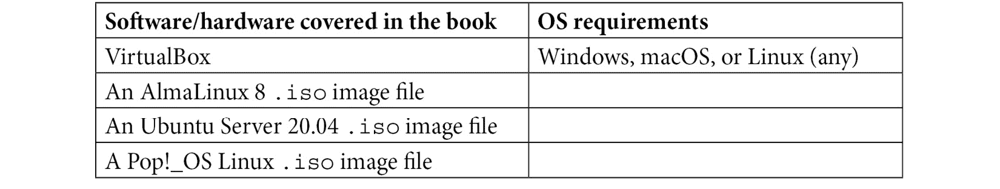

# 前言

欢迎，亲爱的读者，来到全球首本关于 systemd 及其生态系统的全面书籍。尽管 systemd 已经成为世界上最广泛使用的 Linux 初始化系统，但关于它的书籍并不多。当然，网络上有官方的 systemd 文档，但它简洁而直白，并没有提供太多实际的例子。还有一些不错的博客教程，但大多数只讲解基础知识。我只找到另外两本书，标题中包含 `systemd`，但这两本书都已过时，且也仅仅讲解基础内容。

我写这本书的目标是带你超越基础，向你展示如何成为一名更有效的 Linux 系统管理员。在每一章中，我们都将深入探讨 systemd 是如何实际工作的。请放心，本书将有大量的动手演示，向你展示如何让 systemd 按照你想要的方式运行。

# 本书适合谁阅读

如果你是 Linux 系统管理员，或者正在学习成为一名 Linux 系统管理员，那么这本书对你有帮助。如果你正在准备参加 Linux 认证考试，例如来自 CompTIA、Linux 专业学院或商业 Linux 发行版厂商的考试，这本书也是一个很好的学习辅导材料。

# 本书内容概述

*第一章*，*理解系统需要 systemd*，回顾了 Linux init 系统的历史，并解释了为什么旧的 init 系统需要被更强大的替代方案所取代。我们还将简要讨论围绕着转向 systemd 所产生的争议。

*第二章*，*理解 systemd 目录和文件*，探讨了包含 systemd 文件的各个目录。我们还将探讨各种 systemd 单元文件和配置文件，并解释每种类型的用途。最后，我们将简要了解与 systemd 相关的可执行文件。

*第三章*，*理解服务、路径和套接字单元*，探讨了服务、路径和套接字单元文件的内部工作原理。我们将查看每个单元文件中的各个部分，并了解一些你可以设置的参数。过程中，我还会给出一些关于如何查找各种参数作用的信息的提示。

*第四章*，*控制 systemd 服务*，探讨了如何控制 systemd 服务。我们将从如何列出系统中有哪些服务及其状态开始，然后介绍如何启用、禁用、启动、停止和重启服务。

*第五章*，*创建和编辑服务*，介绍了如何使用 systemctl 创建和编辑 systemd 服务文件。对于需要使用 Docker 容器的朋友，我将展示一种使用新的 `podman` Docker 替代工具，将容器轻松转化为服务的酷炫方法。我们还将讨论如何在服务文件添加或更改后重新加载它。

*第六章*，*理解 systemd 目标*，介绍了各种 systemd 目标。我们将解释它们是什么以及目标文件的结构。接着，我们将把 systemd 目标与旧版 SysVinit 的运行级别进行比较，并学习如何将系统从一个目标切换到另一个目标。

*第七章*，*理解 systemd 定时器*，介绍了如何创建 systemd 定时器。我们还将把 systemd 定时器与旧版 cron 系统进行比较，看看我们更喜欢哪个。

*第八章*，*理解 systemd 启动过程*，介绍了 systemd 启动过程，并将其与旧版 SysVinit 启动过程进行比较。

*第九章*，*设置系统参数*，介绍了如何使用 systemd 工具设置特定的系统参数。你一旦了解了如何使用 systemd 来做这件事，或许会发现 systemd 确实使这变得更加简便。

*第十章*，*理解关机与重启命令*，介绍了如何使用 `systemctl` 工具来关机和重启 Linux 系统。之后，我们将查看传统的 `shutdown` 命令是否仍然有效。

*第十一章*，*理解 cgroups 版本 1*，介绍了 cgroups 的概念及其简短历史。然后我们将探讨 cgroups 如何帮助提升 Linux 系统的安全性。

*第十二章*，*使用 cgroups 版本 1 控制资源使用*，介绍了如何使用 cgroups 来控制现代 Linux 系统上的资源使用情况。这包括如何控制内存和 CPU 使用，以及如何为用户分配资源。

*第十三章*，*理解 cgroups 版本 2*，介绍了 cgroups 版本 2。我们将探讨它与版本 1 的区别以及它如何对版本 1 进行了改进。之后，我们将简要介绍如何使用 cgroups 版本 2。作为额外的内容，我们还将展示如何轻松使用 cgroups 版本 2 完成在版本 1 中很难做到的事情，例如创建 `cpusets` 并将 CPU 核心分配到正确的 **非统一内存访问**（**NUMA**）节点。

*第十四章*，*使用 journald*，介绍了 journald 的基本用法以及它与传统 rsyslog 的区别。我们还将探讨为什么我们仍然需要 rsyslog。最重要的是，你将学会如何从系统日志中提取和格式化所需的数据。

*第十五章*，*使用 systemd-networkd 和 systemd-resolved*，展示了为什么你可能想要使用 systemd-networkd 和 systemd-resolved 而不是默认的 Network Manager，以及如何做到这一点。我们将深入探讨如何为不同场景设置 systemd-networkd，并说明在 Ubuntu 和 Red Hat 类型的发行版中，配置流程的不同之处。

*第十六章*，*理解通过 systemd 实现时间同步*，介绍了在 systemd 系统上保持准确时间的各种方法。我们将探讨 `ntp`、`chrony`、`systemd-timesyncd` 和精确时间协议。我们还将讨论每种方法的优缺点，并讲解如何配置它们。

*第十七章*，*理解 systemd 和引导加载程序*，讲解了如何使用 GRUB2 和 systemd-boot 设置机器以使用 EFI/UEFI 模式进行启动。然后，我们将介绍如何在设置为 UEFI 启动模式的机器上安装 Pop!_OS Linux，并简要讨论安全启动功能。

*第十八章*，*理解 systemd-logind*，介绍了如何使用和配置 systemd-logind。我们还将学习如何使用 loginctl 工具查看用户登录会话的信息、控制 logind 服务并终止问题用户的会话。最后，我们将简要了解 polkit，它是一种向特定用户授予管理员权限的替代方式。

# 充分利用本书

为了进行本书中的演示，你应该具备基本的 Linux 命令行操作能力，并且知道如何创建 VirtualBox 虚拟机。你可以从 [`www.virtualbox.org/`](https://www.virtualbox.org/) 下载 VirtualBox，并在 [`distrowatch.com/`](https://distrowatch.com/) 查找各种 Linux 发行版的下载链接。当你创建虚拟机时，确保为虚拟机分配足够的内存以确保运行效率，同时分配足够的磁盘空间来存放演示所需的所有内容。（我建议为文本模式虚拟机分配至少 2 GB 内存，为图形模式虚拟机分配至少 4 GB 内存，除非我为某些演示另行说明。虚拟磁盘大小设置为约 20 GB。）



当您安装 Ubuntu 发行版时，您会自动被加入到`sudo`组，从而获得完全的`sudo`权限。安装 AlmaLinux 时，您将有机会为 root 用户创建密码。我的建议是不要这样做，而是直接勾选安装程序中的**将此用户设置为管理员**选项。

# 下载示例代码文件

您可以从 GitHub 下载本书的示例代码文件，网址为：[`github.com/PacktPublishing/Linux-Service-Management-Made-Easy-with-systemd`](https://github.com/PacktPublishing/Linux-Service-Management-Made-Easy-with-systemd)。如果代码有更新，它将会在现有的 GitHub 库中进行更新。我们还提供了来自我们丰富图书和视频目录的其他代码包，网址为：[`github.com/PacktPublishing/`](https://github.com/PacktPublishing/)。快去查看吧！

# 实战代码

本书的《实战代码》视频可以在[`bit.ly/31jQdi0`](https://bit.ly/31jQdi0)查看。

# 下载彩色图片

我们还提供了一份包含本书中使用的截图/图表的彩色图像的 PDF 文件，您可以在这里下载：[`static.packt-cdn.com/downloads/9781801811644_ColorImages.pdf`](https://static.packt-cdn.com/downloads/9781801811644_ColorImages.pdf)。

# 使用的约定

本书中使用了若干文本约定。

`文本中的代码`：指示文本中的代码词汇、数据库表名、文件夹名称、文件名、文件扩展名、路径名、虚拟 URL、用户输入和 Twitter 用户名。

任何命令行输入或输出都以如下格式书写：

```
donnie@ubuntu20-04:~$ sudo systemctl daemon-reload
[sudo] password for donnie: 
donnie@ubuntu20-04:~$
```

**粗体**：表示新术语、重要词汇或屏幕上显示的词汇。例如，菜单或对话框中的词汇会以这种方式显示在文本中。以下是一个例子：*点击 Etcher 中的 Flash 以写入映像*。

提示或重要说明

显示方式如下。

# 联系我们

我们总是欢迎读者的反馈。

**一般反馈**：如果您对本书的任何内容有疑问，请在邮件主题中注明书名，并通过电子邮件联系我们：customercare@packtpub.com。

**勘误**：尽管我们已尽最大努力确保内容的准确性，但难免会出现错误。如果您在本书中发现错误，欢迎向我们报告。请访问[www.packtpub.com/support/errata](http://www.packtpub.com/support/errata)，选择您的书籍，点击“勘误提交表单”链接并输入详细信息。

**盗版**：如果您在互联网上发现任何我们作品的非法复制版本，我们将非常感激您能提供其位置地址或网站名称。请通过电子邮件联系版权@packt.com，并附上相关链接。

**如果你有兴趣成为作者**：如果你在某个领域有专长，并且有兴趣写作或为一本书做贡献，请访问 [authors.packtpub.com](http://authors.packtpub.com)。

# 分享你的想法

一旦你读完 *Linux 服务管理轻松掌握 systemd*，我们很想听听你的想法！请 [点击这里直接前往亚马逊评论页面](https://packt.link/r/1801811644)，并分享你的反馈。

你的评价对我们和技术社区都非常重要，将帮助我们确保提供优质的内容。
