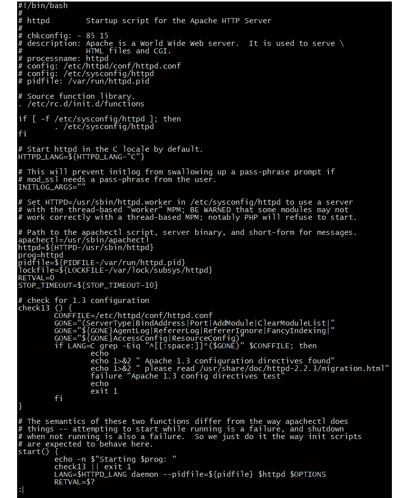
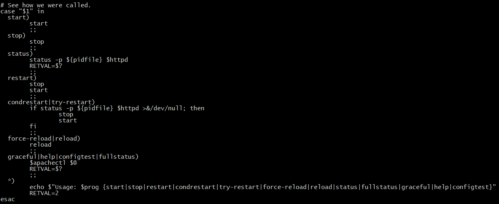
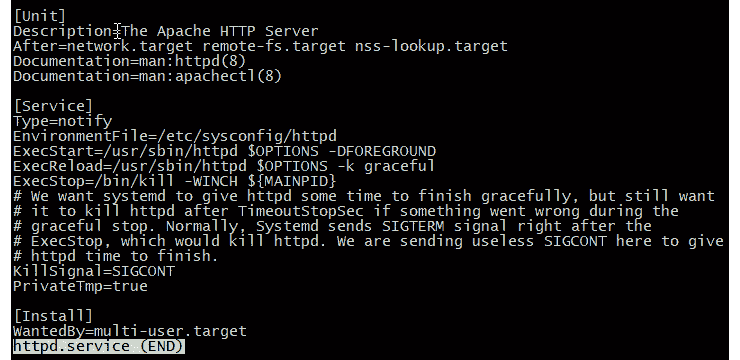

# *第一章*：理解 systemd 的需求

在本章中，我们将首先简要回顾一下 Linux `init` 系统的历史。然后，我们将讨论传统 `init` 系统的不足之处，以及为什么某些 Linux 工程师觉得有必要开发一种新型的 `init` 系统。最后，我们将讨论围绕 `systemd` 的争议。为了方便参考，以下是本章的主题列表：

+   Linux `init` 系统的历史

+   SysV `init` 和 upstart 的不足之处

+   `systemd` 的优点

+   `systemd` 的争议

好了，介绍性内容就到这里，我们进入正题。

# 技术要求

对于本章，你只需要一台运行 `systemd` 的 Linux 虚拟机。在阅读本章时，你可能想查看一下虚拟机上的一些文件。

# Linux `init` 系统的历史

那么，什么是 `init` 系统呢？`init` 是 *初始化*（initialization）的缩写。因此，`init` 系统就是在系统启动时初始化操作系统的系统。启动完成后，`init` 系统会继续工作，管理系统的进程和服务。每个系统进程都会被分配一个进程 ID（PID）。`init` 进程的 PID 总是 1，所有其他在系统上启动的进程都是 `init` 进程的子进程或孙进程。

多年来，Linux 基础操作系统的 `init` 系统一直是 SysV（*System 5* 的简称，其中 *V* 是罗马数字 5）。SysV `init` 最初是由贝尔实验室的工程师为 Unix 操作系统开发的，最早可以追溯到 1970 年代初期。（那时，我还是初中的小伙子，头发也还是满头茂盛。）

注意

其实，除了我在这里提到的几种 Linux `init` 系统外，还有一些其他的系统。但这些是在 `systemd` 时代之前最常用的。

SysV `init` 在其时代运行得很好，但它从未是完美的。如今，随着新一代高性能硬件的出现，SysV `init` 显示出了它的年代感和不足之处。首次尝试提出更好的方案是在 2009 年 7 月，当时 Ubuntu 工程师发布了第一个版本的 `init` 系统。尽管它比 SysV 更好，但仍然存在一些问题，尤其是早期版本有不少 BUG。

# SysV Init 和 upstart 的不足之处

SysV 的第一个问题是启动时间相对较长。当你启动一个 SysV 系统时，所有服务都必须按顺序启动。对于普通的桌面机器来说，这可能不算什么大问题，但对于需要运行多个服务的服务器来说，这就可能会成为一个问题。在这种情况下，每个服务都必须等着自己的轮次启动，这可能会耗费不少时间。

SysV 的下一个问题是它的复杂性。SysV 并不是通过简单易懂的配置文件来完成一切，而是通过复杂的 Bash shell 脚本来实现。控制系统服务的 `init` 脚本必须为每个服务分配一个优先级数字，以确保服务按正确的顺序启动和停止。以在 CentOS 5 机器上启动 Apache Web 服务器的 `init` 脚本为例。首先，我们可以看到它是一个相当长的脚本，如下所示：

```
[student@localhost init.d]$ pwd
/etc/init.d
[student@localhost init.d]$ ls -l httpd
-rwxr-xr-x 1 root root 3523 Sep 16  2014 httpd
[student@localhost init.d]$ wc -l httpd
131 httpd
[student@localhost init.d]$
```

你可以从 `wc -l` 输出中看到，它由 131 行组成。如你所见，其中 37 行是注释，这仍然剩下 94 行实际的代码：

```
[student@localhost init.d]$ grep ^# httpd | wc -l
37
[student@localhost init.d]$
```

打开来看，你会发现它非常复杂且繁琐。这只是它的第一部分：



图 1.1 – 一个老式的 SysV Init 脚本

脚本的结尾部分，你会看到控制 Apache 守护进程停止、启动、重启和重载的代码，如下所示：



图 1.2 – `init` 脚本的启动、停止、重启、重载部分

这段代码，或类似的代码，必须出现在每个 `init` 脚本中，以便人类用户能够控制守护进程。更复杂的是，开发者并不总是为不同的程序编写一致的代码。例如，一个守护进程的状态显示并不总是和另一个守护进程的状态显示相同。

然后，不同 Linux 发行版家族之间的不一致实现又带来了问题。使用 SysV 时，至少有三种不同的实现方式。红帽类发行版使用一种方法，Debian 类发行版使用另一种方法，而 Slackware 类发行版则使用第三种方法。例如，红帽控制服务的方法需要使用 `service` 和 `chkconfig` 命令。每次在 Debian 类系统上工作时，我总是需要查找服务管理命令，因为我总是记不住它们。而在 Slackware 上，则没有任何服务管理命令。要在 Slackware 机器上启用或禁用服务，只需要为相应的 `init` 脚本设置或移除可执行权限。

运行级别也是一个混淆源，因为每个发行版家族都有自己的一套运行级别定义。例如，以下是图形运行级别的定义：

+   红帽系列使用了运行级别 5。

+   Slackware 系列使用了运行级别 4。

+   Debian 系列没有为文本模式或图形模式指定特定的运行级别。相反，你通过启用或禁用 X 服务器守护进程来启用或禁用图形模式。

所以，你可以看到这一切都相当混乱，尤其是对于在混合环境中工作的人来说。显而易见，我们需要一些稍微不那么混乱的东西。

如果这还不够，性能问题也摆在了面前。SysV 在其时代表现良好，当时计算硬件还较为原始。但在现代硬件上，尤其是那些拥有多个 CPU 每个还拥有多个核心的机器，我们需要一些更加健壮的东西。Ubuntu 的 upstart 本应解决这一问题，但它并没有完全实现承诺。如今，Upstart 已经完全死掉，但仍然有一些死忠粉丝拒绝放弃 SysV。在企业中，`systemd` 是王者。

# `systemd` 的优点

我们刚刚看到了 SysV 和 Upstart 的问题。现在，让我们来看看是什么让 `systemd` 更好。

## `systemd` 的简洁性

与 SysV 相比，`systemd` 的配置确实简单得多。例如，看看在 CentOS 7 上使用 `systemd` 的 Apache 服务文件是多么简短：

```
[donnie@localhost ~]$ cd /lib/systemd/system
[donnie@localhost system]$ ls -l httpd.service
-rw-r--r--. 1 root root 752 Jun 26  2018 httpd.service
[donnie@localhost system]$ wc -l httpd.service
22 httpd.service
[donnie@localhost system]$
```

只有 22 行，其中 5 行是注释，如下所示：



图 1.3 – 一个 `systemd` 服务文件

我稍后会解释 `systemd` 文件中的所有内容。目前，我只想向你展示，`systemd` 服务文件比 SysV 的 `init` 脚本简单得多。（正如我们在接下来的章节中将看到的，学习如何使用 `systemd` 指令比学习如何为 `init` 脚本编写 shell 脚本代码要容易得多。）

## `systemd` 的一致性

下一个 `systemd` 优点是它的一致性。是的，朋友们，你们不再需要记住多套针对不同 Linux 发行版的系统管理命令了。相反，你现在只需在所有使用 `systemd` 的 Linux 发行版上使用相同的命令。因此，这消除了管理员的主要困扰来源，也为那些正在学习参加 Linux 认证考试的人们省去了麻烦。

## `systemd` 的性能

与 SysV 相比，`systemd` 可以并行启动服务，而不是像 SysV 那样一次启动一个。这使得启动时间比 SysV 更快。一旦机器启动，性能也比 SysV 更加稳定。

使用 `systemd`，我们有了一种更清洁的方式来终止进程。例如，如果你需要使用 `kill` 命令强制终止一个 SysV 机器上的 Apache Web 服务器服务，你只能终止 Apache 进程本身。如果 Web 服务器进程由于运行 CGI 脚本而产生了任何子进程，这些进程会继续一段时间，成为 *僵尸* 进程。但当你使用 `systemd` 杀死服务时，与该服务相关的所有进程也会被终止。

## `systemd` 安全性

一个额外的好处是，你可以配置 `systemd` 服务文件来控制系统安全的某些方面。以下是你可以做的一些操作：

+   你可以创建一个 `systemd` 服务，限制某些目录的访问，或者只能从特定网络地址访问或被访问。

+   通过使用命名空间，你可以有效地将服务与系统的其他部分隔离开。这也允许你在不运行 Docker 的情况下创建容器。

+   你可以使用 `cgroups` 来限制资源使用。这有助于防止某些类型的拒绝服务攻击。

+   你可以指定服务允许拥有的哪些根级内核能力。

有了这一切，你可以使 `systemd` 在某种程度上模拟一个强制访问控制系统，如 SELinux 或 AppArmor。

总的来说，`systemd` 比任何之前的 `init` 系统要好得多。但它并没有让所有人都满意。

# `systemd` 的争议

如果你在计算机领域待了有一段时间，可能会发现我们这些极客在操作系统问题上常常表现得非常激烈。上世纪 90 年代初，我终于将我的 8088 机器（只能运行文本模式）替换为能够运行图形界面的机器。我第一次尝试了 Windows 3.1，迅速决定我非常讨厌它。于是，我购买了 OS/2，并且它让我更加满意，我在自己组装的 486 机器上运行了好几年。但我所有的极客朋友都非常喜欢 Windows，他们不断和我争论 Windows 比其他操作系统好。我认为他们都疯了，我们常常因此发生激烈的争执。

然后，当我接触 Linux 时，我很快就意识到，你不应该去任何 Linux 论坛问哪个 Linux 发行版最适合新手入门。那样做只会引发争吵，让可怜的新手更加困惑。现在，争论的焦点是 `systemd` 是否是一个 *好东西*。以下是一些反对意见：

+   `systemd` 尝试做得太多，违反了 Unix 的理念——每个工具只做一件事，并且做到最好。

+   它由一个大公司（Red Hat）控制。

+   它是一个安全问题。

+   它的 `journald` 组件将系统日志保存为二进制格式，一些人认为这比 `rsyslog` 创建的纯文本文件更容易损坏。

如果你客观看待这些问题，可能会发现反对意见并没有那么严重：

+   是的，`systemd` 生态系统不仅仅包含 `init` 系统。它还包括网络、引导加载器、日志记录和登录组件。但这些组件都是可选的，并不是所有的 Linux 发行版在默认设置中都使用它们。

+   它主要是由 Red Hat 创建的，项目负责人是 Red Hat 的一名员工。但 Red Hat 将其发布在一个自由软件许可证下，这意味着没有任何一家公司能够完全控制它。即便 Red Hat 突然决定未来版本的 `systemd` 要变成专有软件，免费代码仍然存在，某人会将其分叉成一个新的免费版本。

+   是的，`systemd` 确实存在一些安全漏洞。但这同样适用于 OpenSSL、Bash shell，甚至是 Linux 内核本身。只有在这些漏洞没有被修复的情况下，才有理由抱怨 `systemd` 的安全性。

+   `journald`组件确实会创建二进制格式的日志文件。但仍然可以在`systemd`发行版上运行`rsyslog`，而且大多数都在运行。某些发行版，例如 Red Hat Enterprise Linux 8 系列，使用`journald`收集系统信息，然后让`journald`将信息传递给`rsyslog`，以创建正常的文本文件。因此，在 RHEL 8 中，我们获得了两全其美的方案。

在`systemd`发布不久后，一些从未尝试过它的人发布了博文，解释为什么`systemd`是纯粹的邪恶，并表示他们永远不会使用它。几年前，我在我的 BeginLinux Guru 频道上创建了一个`systemd`教程播放列表。第一个视频叫做*为什么选择 systemd？* 很多人在评论中说他们永远不会使用`systemd`，并表示他们会切换到非`systemd`的 Linux 发行版或 FreeBSD 类型的发行版，以避免使用它。

底线是：所有企业级 Linux 发行版现在都使用`systemd`。所以，我认为它可能会长期存在。

# 总结

在本章中，我们回顾了最常见的 Linux 初始化系统的历史。我们看到了遗留初始化系统的不足之处，也了解了为什么`systemd`是一个更好的替代品。最后，我们讨论了反对`systemd`的观点。

学习`systemd`的挑战之一是，直到现在，关于它并没有任何真正的全面文档。Red Hat 网站上有基本的使用文档，但甚至没有覆盖`systemd`生态系统的所有组件。我能找到的只有两本关于`systemd`的书，已经有几年历史了。（一本书是关于 Fedora 的，另一本是关于 Ubuntu 的。）即使这些书也遗漏了一些内容。所以，我给自己设定的挑战是创建一本全面的、实用的`systemd`指南。在接下来的章节中，我会尽力完成这个目标。

在下一章中，我们将快速浏览`systemd`的目录和文件。我在那里等你。

# 问题

1.  谁创建了最初的 SysV `init`系统？

    a. 贝尔实验室

    b. 红帽

    c. Debian

    d. Ubuntu

1.  以下关于 SysV 哪个是正确的？

    a. 它是一个现代化、强大的`init`系统。

    b. 启动机器时，它可以并行启动服务。

    c. 启动机器时，它只能按顺序启动服务。

    d. 它具有`systemd`所没有的安全功能。

1.  以下关于`systemd`哪个*不是*正确的？

    a. 它具有可以在某种程度上模拟强制访问控制系统的安全功能。

    b. 它可以并行启动服务。

    c. 它可以使用`cgroups`限制资源使用。

    d. 它是一个需要被替换的遗留系统。

# 答案

1.  A

1.  C

1.  D

# 深入阅读

+   Linux `init`系统概述：

    [`www.tecmint.com/best-linux-init-systems/`](https://www.tecmint.com/best-linux-init-systems/)

+   为什么`init`需要被`systemd`替换：

    [`www.tecmint.com/systemd-replaces-init-in-linux/`](https://www.tecmint.com/systemd-replaces-init-in-linux/)

+   Red Hat 的`systemd`文档：

    [`access.redhat.com/documentation/en-us/red_hat_enterprise_linux/8/html/configuring_basic_system_settings/index`](https://access.redhat.com/documentation/en-us/red_hat_enterprise_linux/8/html/configuring_basic_system_settings/index)

+   一些反对`systemd`的观点：

    [`textplain.net/blog/2015/problems-with-systemd-and-why-i-like-bsd-init/`](https://textplain.net/blog/2015/problems-with-systemd-and-why-i-like-bsd-init/)

    [`www.theregister.com/2014/10/21/unix_greybeards_threaten_debian_fork_over_systemd_plan/`](https://www.theregister.com/2014/10/21/unix_greybeards_threaten_debian_fork_over_systemd_plan/)
