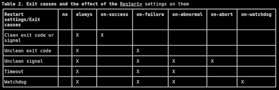

# *第四章*：控制 systemd 服务

现在我们已经了解了 `systemd` 服务，接下来是学习如何控制它们。在本章中，我们将专注于此。具体而言，我们将涵盖以下技能：

+   验证服务状态

+   启动、停止和重新加载服务

+   启用和禁用服务

+   杀死一个服务

+   屏蔽服务

这些技能非常实用，因为作为一名 Linux 服务器管理员，你会在日常工作中经常练习它们。所以，如果你准备好了，我们开始吧。

# 技术要求

本章所需的仅是某种虚拟机，并且你自己的用户账户需具有完全的 sudo 权限。对于我的演示，我将使用全新的 AlmaLinux 8，代表 RHEL（红帽企业版 Linux）方面，Ubuntu Server 20.04 代表 Ubuntu 方面。

查看以下链接以观看《代码实战》视频：[`bit.ly/3oev29P`](https://bit.ly/3oev29P)

关于 CentOS Linux 的说明

我知道，你可能习惯于在这些演示中看到 CentOS Linux。但在 2020 年底，Red Hat 公司宣布他们将在 2021 年底停止对 CentOS 8 企业版的支持。它的替代品 CentOS Stream 是一个滚动发布的发行版，可能不适合在企业中使用。幸运的是，其他组织提供了适合企业的 CentOS 8 替代品，包括 Oracle Enterprise Linux 8、Springdale Linux 8 和 Alma Linux 8。在撰写本文时，Rocky Linux 8 正在规划阶段，最终将由原 CentOS 项目的创始人发布。目前，还无法确定哪个将成为 CentOS 的最受欢迎替代品。（当然，还有 **Red Hat Enterprise Linux 8** (**RHEL 8**)，但你需要购买订阅才能进行有意义的操作。）

这将是一个动手操作，大家准备好了吗？如果你有精力，启动一个虚拟机并跟随我一起操作。

# 验证服务状态

我将在这次演示中使用 Alma Linux，原因稍后会变得明了。首先，让我们通过以下步骤安装 Apache Web 服务器：

```
sudo dnf install httpd
```

在你开始使用 Apache 之前，你需要知道它是否已启用，以便在重启机器时自动启动。你还需要知道它是否处于活动状态，即它是否正在运行。

要查看它是否已启用，请执行以下操作：

```
[donnie@localhost ~]$ systemctl is-enabled httpd
[sudo] password for donnie: 
disabled
[donnie@localhost ~]$
```

在这里，你可以看到我为何使用 RHEL 类型的发行版。当你在任何 RHEL 类型的机器上安装服务时，默认情况下它通常是`禁用`的。而在 Ubuntu 上安装服务时，默认情况下它通常是`启用`的。所以，通过在 Alma Linux 上进行此操作，我可以给你展示更多内容。

接下来，让我们通过以下操作查看 Apache 是否正在运行：

```
[donnie@localhost ~]$ systemctl is-active httpd
inactive
[donnie@localhost ~]$
```

好吧，它没有启用。现在，让我们同时查看这两项内容：

```
[donnie@localhost ~]$ systemctl status httpd
 httpd.service - The Apache HTTP Server
   Loaded: loaded (/usr/lib/systemd/system/httpd.service; disabled; vendor preset: disabled)
   Active: inactive (dead)
     Docs: man:httpd.service(8)
[donnie@localhost ~]$
```

关于这些命令，我有几点想让你注意。首先，如果你只是想查看有关服务的信息，你不需要 sudo 权限。其次，如果你想对服务进行任何操作，你不需要附加`.service`文件扩展名。我的意思是，你可以附加，且不会有任何问题，但其实不需要。如果有多个类型的单元文件同名，`systemctl`默认会调用`.service`单元。例如，`.service`单元、`.path`单元和`.socket`单元，如你在这里所看到的：

```
[donnie@localhost ~]$ ls -l /lib/systemd/system/cups.*
-r--r--r--. 1 root root 142 Aug 27  2020 /lib/systemd/system/cups.path
-r--r--r--. 1 root root 248 Aug 27  2020 /lib/systemd/system/cups.service
-r--r--r--. 1 root root 136 Aug 27  2020 /lib/systemd/system/cups.socket
[donnie@localhost ~]$
```

没有文件扩展名时，`systemctl`将显示有关`cups.service`的信息，如下所示：

```
[donnie@localhost ~]$ systemctl status cups
cups.service - CUPS Scheduler
   Loaded: loaded (/usr/lib/systemd/system/cups.service; enabled; vendor preset: enabled)
   Active: active (running) since Tue 2021-03-30 16:37:18 EDT; 33min ago
     Docs: man:cupsd(8)
 Main PID: 989 (cupsd)
   Status: "Scheduler is running..."
    Tasks: 1 (limit: 11274)
   Memory: 3.2M
   CGroup: /system.slice/cups.service
           └─989 /usr/sbin/cupsd -l
Mar 30 16:37:18 localhost.localdomain systemd[1]: Starting CUPS Scheduler...
Mar 30 16:37:18 localhost.localdomain systemd[1]: Started CUPS Scheduler.
Mar 30 16:38:14 localhost.localdomain cupsd[989]: REQUEST localhost - - "POST / HTTP/1.1" 200 362 Create-Printer-Subscriptions successful-ok
[donnie@localhost ~]$
```

这比`is-active`选项显示的有关正在运行服务的信息要多得多。顶部的`cups.service - CUPS Scheduler`一行来自`cups.service`文件`[Unit]`部分中的`Description=CUPS Scheduler`一行，关于手册页的信息来自`Documentation=man:cupsd(8)`一行。`Main PID:`这一行显示主 CUPS 进程的 PID 是`989`。通过这个方便的`ps aux`命令来验证：

```
[donnie@localhost ~]$ ps aux | grep 'cups'
root         989  0.0  0.5 340316 10196 ?        Ss   16:37   0:00 /usr/sbin/cupsd -l
donnie      8352  0.0  0.0 221904  1072 pts/1    R+   18:02   0:00 grep --color=auto cups
[donnie@localhost ~]$
```

确实，PID 是`989`。

暂时不用担心那一行`CGroup:`。我们稍后会讨论 cgroups。

最后你会看到系统日志条目，它们在服务启动时创建。在 RHEL 类型的系统上，你会在`/var/log/messages`文件中看到它们。在 Debian 及其后代系统（如 Ubuntu）上，你会在`/var/log/syslog`文件中看到它们。

要查看其他类型单元的信息，你需要附加文件扩展名，如下所示：

```
[donnie@localhost ~]$ systemctl status cups.path
 cups.path - CUPS Scheduler
   Loaded: loaded (/usr/lib/systemd/system/cups.path; enabled; vendor preset: enabled)
   Active: active (running) since Tue 2021-03-30 16:37:12 EDT; 1h 16min ago
Mar 30 16:37:12 localhost.localdomain systemd[1]: Started CUPS Scheduler.
[donnie@localhost ~]$
```

这样显示会更简短，因为`.path`单元的信息较少。

好的，我们已经有了一个好的开端。让我们回到那个 Apache 服务，看看我们能做些什么。

# 启动、停止和重新加载服务

我们已经看到，当你在 RHEL 类型的发行版上安装服务时，比如 Alma Linux，服务通常是禁用的，默认情况下没有激活。那么现在，我给你三个猜测的机会，猜猜启动服务的命令是什么。

放弃了吗？好的，下面是如何启动 Apache 的命令：

```
[donnie@localhost ~]$ sudo systemctl start httpd
[sudo] password for donnie: 
[donnie@localhost ~]$
```

嗯，这个很简单。让我们来看一下状态。这是命令输出的第一部分：

```
[donnie@localhost ~]$ sudo systemctl status httpd
 httpd.service - The Apache HTTP Server
   Loaded: loaded (/usr/lib/systemd/system/httpd.service; disabled; vendor preset: disabled)
   Active: active (running) since Tue 2021-03-30 18:35:05 EDT; 1min 8s ago
     Docs: man:httpd.service(8)
 Main PID: 8654 (httpd)
   Status: "Running, listening on: port 80"
. . .
. . .
```

你可以看到这里服务是激活的，但它仍然是禁用的。这意味着如果我重启机器，服务不会自动启动。要查看更多信息，可以使用`ps aux`命令，如下所示：

```
[donnie@localhost ~]$ ps aux | grep httpd
root        8654  0.0  0.6 275924 11196 ?        Ss   18:35   0:00 /usr/sbin/httpd -DFOREGROUND
apache      8655  0.0  0.4 289796  8160 ?        S    18:35   0:00 /usr/sbin/httpd -DFOREGROUND
apache      8656  0.0  0.5 1347588 10032 ?       Sl   18:35   0:00 /usr/sbin/httpd -DFOREGROUND
apache      8657  0.0  0.5 1347588 10032 ?       Sl   18:35   0:00 /usr/sbin/httpd -DFOREGROUND
apache      8658  0.0  0.6 1478716 12080 ?       Sl   18:35   0:00 /usr/sbin/httpd -DFOREGROUND
donnie      8924  0.0  0.0 221904  1044 pts/1    R+   18:39   0:00 grep --color=auto httpd
[donnie@localhost ~]$
```

这里列出的第一个进程，PID 为`8654`，属于 root 用户，是我们在`systemctl status`输出中看到的主要进程。接下来的四个进程，PID 从`8655`到`8658`，是每当有人连接到该服务器上的网站时使用的，属于非特权的`apache`用户。这是 Apache 内建的一个安全特性，几乎从一开始就存在，并且与`systemd`无关。以非特权用户身份运行这些进程有助于防止攻击者为了恶意目的控制系统。

注意

如果你想了解其余的`ps`输出是什么意思，可以通过以下命令查看`ps`的手册页：

`man ps`

要停止 Apache 服务，只需执行`sudo systemctl stop httpd`。 (是的，我敢打赌你没有预料到这一点。)

如果你更改了正在运行的服务的配置，你需要重新加载它。你可以使用`restart`选项，这将重新启动服务并使新的配置生效。某些服务，例如 Apache，还具有`reload`选项。这样可以在不中断正在运行的服务的情况下读取新的配置。但是请注意，并非所有情况都可以使用`reload`。例如，在 Apache 中，你可以使用`reload`来重新加载网站配置文件的更改，但在某些情况下，像启用或禁用 Apache 模块时，你需要使用`restart`来读取 Apache 配置的更改。要查看`reload`是否适用于某个特定服务，可以尝试查阅该服务的文档。

启动、停止、重启或重新加载服务的具体命令可以在其关联的`.service`文件中定义。以下是来自 Alma 机器上`httpd.service`文件的相关行：

```
[Service]
. . .
. . .
ExecStart=/usr/sbin/httpd $OPTIONS -DFOREGROUND
ExecReload=/usr/sbin/httpd $OPTIONS -k graceful
. . .
. . .
```

目前，不需要担心这里看到的启动和重新加载选项意味着什么，因为这些知识是 Apache 特有的，而不是`systemd`的内容。我要你注意的是`ExecReload=`这一行。我们可以看到 Apache 有自己的内建方式来重新加载配置。与此对比，你可以看到这个来自 Alma 机器的`sshd.service`文件：

```
[Service]
. . .
. . .
ExecStart=/usr/sbin/sshd -D $OPTIONS $CRYPTO_POLICY
ExecReload=/bin/kill -HUP $MAINPID
. . .
. . .
```

在这里，我们看到安全外壳（Secure Shell）服务没有自己的内部机制来重新加载配置。相反，它依赖于几乎在 Linux 中永远存在的传统`kill`工具。不过要意识到，`kill`并不总是意味着*杀死*。当你使用`kill`工具时，它会向进程发送一个信号，让它做某些事情。通常，你会发送一个信号来真正“杀死”进程。但你也可以用它发送`HUP`信号给服务，这会导致服务在不中断的情况下重新加载其配置。（如果你想知道，`HUP`是*挂断*（Hang Up）的缩写。这个信号最初的目的是通知正在运行的程序，当串行线路中断时。然而，`HUP`信号的用途已经改变，现在用于让服务重新加载配置。）你看到的`$MAINPID`实例是`systemd`用来访问主 Secure Shell 进程 PID 的环境变量。

可选地，你可以添加一行来定义当你发出`stop`命令时发生的事情。你在 Alma Linux 中看不到这一点，但在 Ubuntu 的`apache2.service`文件中可以看到，如下所示：

```
[Service]
. . .
. . .
ExecStart=/usr/sbin/apachectl start
ExecStop=/usr/sbin/apachectl stop
ExecReload=/usr/sbin/apachectl graceful
. . .
. . .
```

你没有看到`ExecRestart=`参数，因为没有这个参数。重启服务只是将其停止，然后再启动。

接下来，我们将了解如何启用和禁用服务。

# 启用和禁用服务

虽然 Apache 已经在运行，但如果我们重新启动 Alma Linux 机器，Apache 不会自动启动，直到你手动启动它。要开始这个演示，首先用以下命令停止 Apache：

```
sudo systemctl stop httpd
```

现在，通过以下方式启用它：

```
[donnie@localhost ~]$ sudo systemctl enable httpd
Created symlink /etc/systemd/system/multi-user.target.wants/httpd.service → /usr/lib/systemd/system/httpd.service.
[donnie@localhost ~]$
```

当我们启用 Apache 服务时，我们会在`/etc/systemd/system/multi-user.target.wants/`目录中创建一个指向`httpd.service`文件的符号链接。现在，我一直告诉你，单元文件位于`/lib/systemd/system/`目录。但细心的你会注意到，符号链接指向的是`/usr/lib/systemd/system/`目录中的服务文件。这是因为许多 Linux 发行版的新版已经删除了某些顶层目录，现在只使用一直位于`/usr/`目录下的相应目录。但天上的 Linux 大师们很贴心，为像我这样的老派程序员保留了这些顶层目录。他们通过在文件系统的根目录下创建符号链接来实现这一点，你可以在这里看到：

```
[donnie@localhost /]$ pwd
/
[donnie@localhost /]$ ls -l lib*
lrwxrwxrwx. 1 root root 7 Aug 14  2020 lib -> usr/lib
lrwxrwxrwx. 1 root root 9 Aug 14  2020 lib64 -> usr/lib64
[donnie@localhost /]$
```

所以，如果你像我一样总是忘记那些顶层目录不再存在了，没关系。符号链接完全有效。但我有些偏题了。

进入`/etc/systemd/system/multi-user.target.wants/`目录，你将看到通过`systemctl enable`命令创建的符号链接，如下所示：

```
[donnie@localhost ~]$ cd /etc/systemd/system/multi-user.target.wants/
[donnie@localhost multi-user.target.wants]$ ls -l httpd.service 
lrwxrwxrwx. 1 root root 37 Mar 30 19:22 httpd.service -> /usr/lib/systemd/system/httpd.service
[donnie@localhost multi-user.target.wants]$
```

好的，你现在可能在想那个 `multi-user.target.wants` 是怎么回事。那么，我稍后会详细介绍 `.target` 的概念。现在，只需接受多用户目标是操作系统完全启动并准备好正常操作的*运行级别*。`/etc/systemd/system/multi-user.target.wants/` 目录包含了在操作系统进入多用户模式时会自动启动的单元的符号链接。这个目录主要包含指向服务单元的符号链接，但有时也会包含指向其他类型单元的链接。在这台 Alma Linux 机器上，还有一个指向 `cups.path` 单元的链接，如下所示：

```
[donnie@localhost multi-user.target.wants]$ ls -l cups*
lrwxrwxrwx. 1 root root 33 Feb 11 18:14 cups.path -> /usr/lib/systemd/system/cups.path
lrwxrwxrwx. 1 root root 36 Feb 11 18:14 cups.service -> /usr/lib/systemd/system/cups.service
[donnie@localhost multi-user.target.wants]$
```

为了确定应该在哪里创建符号链接，`systemctl enable` 命令会从服务文件的 `[Install]` 部分获取设置。在 Alma 机器上的 `httpd.service` 文件底部，你可以看到这一行：

```
. . .
. . .
[Install]
WantedBy=multi-user.target
```

在 `accounts-daemon.service` 文件的底部，你会看到这一行：

```
. . .
. . .
[Install]
WantedBy=graphical.target
```

当该服务被启用时，它的符号链接位于 `/etc/systemd/system/graphical.target.wants/` 目录中。

请注意，当你启用一个尚未运行的服务时，直到你重启机器，服务才会自动启动。你可以在这里看到：

```
[donnie@localhost multi-user.target.wants]$ systemctl is-enabled httpd
enabled
[donnie@localhost multi-user.target.wants]$ systemctl is-active
 httpd
inactive
[donnie@localhost multi-user.target.wants]$
```

你可以发出单独的 `start` 命令来启动服务，或者你可以使用 `enable --now` 选项通过一个命令来启用并启动服务，如下所示：

```
[donnie@localhost multi-user.target.wants]$ sudo systemctl enable --now httpd
Created symlink /etc/systemd/system/multi-user.target.wants/httpd.service → /usr/lib/systemd/system/httpd.service.
[donnie@localhost multi-user.target.wants]$
```

当你禁用一个单元时，它的符号链接会被移除。我们可以通过 Apache 服务看到这一点：

```
[donnie@localhost multi-user.target.wants]$ sudo systemctl disable httpd
[sudo] password for donnie: 
Removed /etc/systemd/system/multi-user.target.wants/httpd.service.
[donnie@localhost multi-user.target.wants]$ ls -l httpd*
ls: cannot access 'httpd*': No such file or directory
[donnie@localhost multi-user.target.wants]$
```

如果服务正在运行，执行 `disable` 命令后它仍会保持运行。你可以发出单独的 `stop` 命令，或者使用 `disable --now` 选项同时禁用并停止服务。

现在，对于 Ubuntu 粉丝们，以下是安装 Apache 在你的 Ubuntu 机器上的命令：

```
sudo apt install apache2
```

如果你查看 Apache 网站上的官方文档，你会看到官方的做法是将 `httpd` 作为 Apache 服务的名称。出于某种我至今未能搞明白的原因，Debian 开发者在一些方面总是采取不同的做法。Ubuntu 源自 Debian，因此 Ubuntu 开发者通常延续 Debian 的传统。无论如何，你可以在 Ubuntu 机器上尝试前面的命令，只需将 `httpd` 替换为 `apache2`。你唯一会看到的真正区别是，在 Ubuntu 上首次安装 Apache 后，服务将自动启用并运行。

你还可以做的另一个酷炫的事情是禁用服务的手动启动、停止和重启功能。最好的例子是 RHEL 类型机器上的 `auditd` 服务。在我 Alma 机器上的 `auditd.service` 文件的 `[Unit]` 部分，我们可以看到执行这一操作的这一行：

```
[Unit]
. . .
. . .
RefuseManualStop=yes
. . .
. . .
```

尝试重新启动服务会给我以下错误信息：

```
[donnie@localhost ~]$ sudo systemctl restart auditd
Failed to restart auditd.service: Operation refused, unit auditd.service may be requested by dependency only (it is configured to refuse manual start/stop).
See system logs and 'systemctl status auditd.service' for details.
[donnie@localhost ~]$
```

奇怪的是，如果我使用老式的`service`命令（来自 SysV 时代），我可以手动停止或重新启动`auditd`服务，就像我们在这里看到的那样：

```
[donnie@localhost ~]$ sudo service auditd restart
Stopping logging:                                          [  OK  ]
Redirecting start to /bin/systemctl start auditd.service
[donnie@localhost ~]$
```

我可以理解为什么我们要限制停止或重新启动`auditd`的权限，因为它与系统安全相关。但我从未理解为什么 RHEL 的维护者阻止用户使用`systemctl`进行操作，却仍允许我们用`service`来做。这就是那种让人不禁想“嗯……”的事情。另一个有趣的现象是，当你在 Ubuntu 上安装`auditd`时，你不会看到禁用这些功能的那一行。因此，在 Ubuntu 上，你可以按正常方式使用`systemctl`来停止和重新启动`auditd`。

接下来，我们来看一下正确的杀死服务的方法。

# 杀死一个服务

我知道这很伤心，但即使在 Linux 上，事情有时也会崩溃。一个很好的例子就是 Firefox 浏览器。你有没有在不小心打开恶意网页时，浏览器完全卡住了的情况？就是说，你无法关闭标签页，电脑扬声器里传来刺耳的噪音，而且你也无法以正常方式关闭浏览器。你只能无奈地卡住。（如果你遇到过这种情况，不要觉得尴尬，这发生过在我们每个人身上。）在 Linux 机器上，你可以通过打开终端，使用`ps aux | grep firefox`来找到 Firefox 的 PID，然后发出`kill`命令来解决。比如说，假设 Firefox 的 PID 是`3901`，要终止它，只需执行：

```
kill 3901
```

默认情况下，这将向 Firefox 发送一个数字`15`，或者`SIGTERM`信号，给该进程一个机会通过关闭任何关联的文件或网络连接来进行自我清理。有时候，如果一个进程被严重锁定，数字`15`信号可能无法奏效。在这种情况下，你需要采取强力措施，使用数字`9`，或者`SIGKILL`信号，像这样：

```
kill -9 3901
```

数字`9`信号是你除非绝对必要，否则不想使用的信号。它会直接停止进程，而不给它们清理的机会。

注意

想了解更多关于各种 Linux 信号的信息，你可以查看你 Ubuntu 机器上的信号手册页面。（出于某种原因，Alma Linux 机器上的手册页面没有那么多信息。）命令是：

`man signal`

在 SysV 时期，你会使用相同的方法来终止有问题的服务，唯一不同的是你需要 `sudo` 权限来执行此操作，因为服务不会在你的用户帐户下运行。问题在于，有些服务会启动多个活动进程，而普通的 `kill` 命令可能无法终止它们所有。这些服务可能会以 *僵尸* 进程的形式继续存在，直到操作系统最终回收它们并将其清除。（当我说 *回收* 时，想象一下死神将尖木桩刺入僵尸心脏来最终杀死它们。哦，等等，刺心脏的是吸血鬼，而不是僵尸，所以算了。）一个很好的例子是 Apache 服务。我们已经看到，Apache 服务在启动时会生成多个进程，这仅仅是在没有运行任何活动网站的机器上。在实际的生产 Web 服务器上，Apache 可能会为 CGI 脚本、PHP 脚本或其他任何东西生成多个进程。如果你需要终止 Apache，务必确保那些脚本进程也被终止，特别是当它们可能正在做一些恶意的事情时。在我使用 `systemd` 的 Ubuntu 机器上，我会通过 `sudo systemctl kill apache2` 命令来完成这个操作。结果应该如下所示：

```
donnie@ubuntu2004:~$ systemctl is-active apache2
active
donnie@ubuntu2004:~$ sudo systemctl kill apache2
donnie@ubuntu2004:~$ systemctl is-active apache2
inactive
donnie@ubuntu2004:~$
```

与普通的 `kill` 命令一样，默认情况下它发送数字 `15`，即 `SIGTERM` 信号。如果你需要发送其他信号，请使用 `-s` 选项并指定信号名称。为了看到发生了什么，我将在我的 Ubuntu 机器上重新启动 Apache，并发送数字 `9`，即 `SIGKILL` 信号，像这样：

```
donnie@ubuntu2004:~$ systemctl is-active apache2
active
donnie@ubuntu2004:~$ sudo systemctl kill -s SIGKILL apache2
donnie@ubuntu2004:~$ systemctl is-active apache2
active
donnie@ubuntu2004:~$
```

哎呀，这对我们没有任何作用，是吧？为了查看原因，让我们看看 `apache2.service` 文件。在 `[Service]` 部分，你会找到答案：

```
[Service]
. . .
. . .
Restart=on-abort
```

`[Service]` 部分中的最后一行，即 `Restart=on-abort` 行，表示如果 Apache 收到不干净的杀死信号，它会自动重启。恰好 `SIGKILL` 被认为是不干净的信号。你可以在 `systemd.service` 手册页中查看对此的解释。打开该页面并向下滚动到表格 2，你会找到 `Restart=` 参数的不同选项，如下所示：



图 4.1 – 来自 systemd.service 手册页的表格 2

在 *表格 2* 上下的段落中，你会看到有关不同选项的解释，以及它们如何影响使用各种杀死信号。

在 Alma Linux 机器上，情况稍有不同。在它的 `httpd.service` 文件中，没有 `Restart=` 行。相反，我们看到这些行：

```
[Service]
. . .
. . .
# Send SIGWINCH for graceful stop
KillSignal=SIGWINCH
KillMode=mixed
```

`KillSignal=`行将默认的杀死动作从`SIGTERM`更改为`SIGWINCH`。这很奇怪，因为`SIGWINCH`应该只在进程所在的终端窗口大小发生变化时才会终止进程。而 Apache 通常并不在终端窗口中运行。不过，看起来 Red Hat 的某些人决定将`SIGWINCH`作为优雅地终止 Apache 的信号，所以就这么定了。`KillMode=mixed`行告诉`systemd`向主 Apache 进程发送`SIGTERM`信号，但向 Apache 控制组中的其余进程发送`SIGKILL`信号。`systemd.kill`手册页面没有说明当前面的`KillSignal=`行设置为`SIGWINCH`时这一行的作用，但我猜它会将`SIGTERM`替换为`SIGWINCH`。无论如何，让我们试着在 Alma 机器上终止 Apache，看看会发生什么：

```
[donnie@localhost ~]$ systemctl is-active httpd
active
[donnie@localhost ~]$ sudo systemctl kill httpd
[sudo] password for donnie: 
[donnie@localhost ~]$ systemctl is-active httpd
inactive
[donnie@localhost ~]$
```

它看起来和在 Ubuntu 机器上没什么区别。不过，向 Apache 发送`SIGKILL`信号时，你会看到不同的结果，如下所示：

```
[donnie@localhost ~]$ sudo systemctl kill -s SIGKILL httpd
[donnie@localhost ~]$ systemctl is-active httpd
failed
[donnie@localhost ~]$
```

如果没有 Ubuntu 在其`apache2.service`文件中的`Restart=on-abort`行，Alma 上的 Apache 服务在接收到`SIGKILL`信号时不会自动重启。请注意，`is-active`的输出显示为`failed`，而不是使用`SIGTERM`或`SIGWINCH`时显示的`inactive`。无论如何，服务并没有运行，因此最终结果是一样的。

好的，一切正常。但是，如果你想防止某个服务运行呢？嗯，你可以将它屏蔽，这就是我们接下来要看的内容。

# 屏蔽服务

假设你有一个服务，你希望它永远不启动，无论是手动启动还是自动启动。你可以通过像这样将其屏蔽来实现：

```
[donnie@localhost ~]$ sudo systemctl mask httpd
Created symlink /etc/systemd/system/httpd.service → /dev/null.
[donnie@localhost ~]$
```

这次，我们不是创建一个指向服务文件的符号链接，而是创建了一个指向`/dev/null`设备的符号链接。让我们尝试启动我们屏蔽的 Apache 服务，看看会发生什么：

```
[donnie@localhost ~]$ sudo systemctl start httpd
Failed to start httpd.service: Unit httpd.service is masked.
[donnie@localhost ~]$
```

如果你改变主意，只需使用`unmask`选项。

# 总结

我们在这一章里已经覆盖了很多内容，甚至做了一些有趣的实操。我们学习了如何启动、停止、重启和重新加载服务。我们还了解了如何启用和禁用服务，并查看了启用服务时创建的符号链接。最后，我们展示了如何终止服务，以及如何屏蔽服务。作为附带收获，我们了解了一些服务参数的作用，以及不同 Linux 发行版的维护者如何设置服务，使其在不同的发行版上行为有所不同。

但是，如果你不喜欢在你使用的发行版中服务的设置怎么办？不用担心，我们将在下一章讨论这个问题，届时我们会讲解如何编辑和创建服务单元文件。我在那时见。

# 问题

1.  当你运行`sudo systemctl enable httpd`命令时，这会为你做什么？

    a. 它会启动`httpd`服务。

    b. 它会导致`httpd`在启动机器时启动，并且还会立即启动。

    c. 它只会在你重启机器时启动 `httpd`。

    d. 它在 `/lib/systemd/system/` 目录下创建一个符号链接。

1.  使用普通的 `kill` 命令对服务的影响是什么？

    a. 它会干净地关闭服务。

    b. 它会关闭主服务进程，但可能不会关闭生成的进程。

    c. 它不会关闭一个服务。

    d. 你可以在没有 `sudo` 权限的情况下使用 `kill` 关闭一个服务。

1.  什么是 `SIGTERM` 信号？

    a. 它会立即杀死一个进程，不给它任何清理的机会。

    b. 当检测到终端窗口大小改变时，它会杀死一个进程。

    c. 它重新启动一个进程。

    d. 它优雅地终止一个进程，给它时间进行清理。

1.  如何仅用一条命令启用并启动 `httpd` 服务？

    a. 你不能

    b. `sudo systemctl enable httpd`

    c. `sudo systemctl start httpd`

    d. `sudo systemctl start --now httpd`

    e. `sudo systemctl enable --now httpd`

1.  `ExecRestart=` 参数为我们做了什么？

    a. 它定义了如何重新启动服务。

    b. 它定义了如何重新加载服务配置。

    c. 什么都没有，因为这个参数不存在。

    d. 它定义了如何启动一个服务。

# 答案

1.  c

1.  b

1.  d

1.  e

1.  c

# 深入阅读

我的 *管理服务* 视频：[`youtu.be/IuDmg75n6FU`](https://youtu.be/IuDmg75n6FU)

如何管理 `systemd` 服务：[`www.howtogeek.com/216454/how-to-manage-systemd-services-on-a-linux-system/`](https://www.howtogeek.com/216454/how-to-manage-systemd-services-on-a-linux-system/.)
