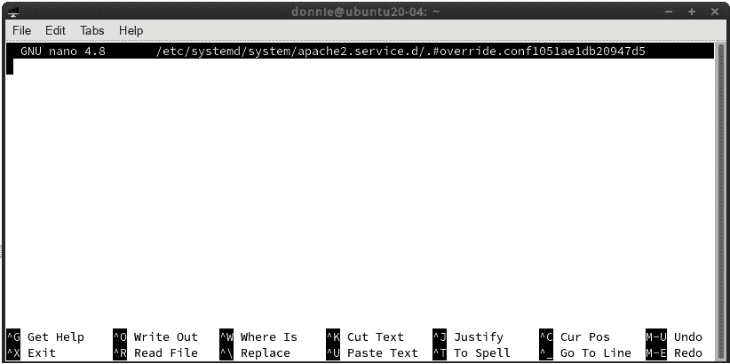
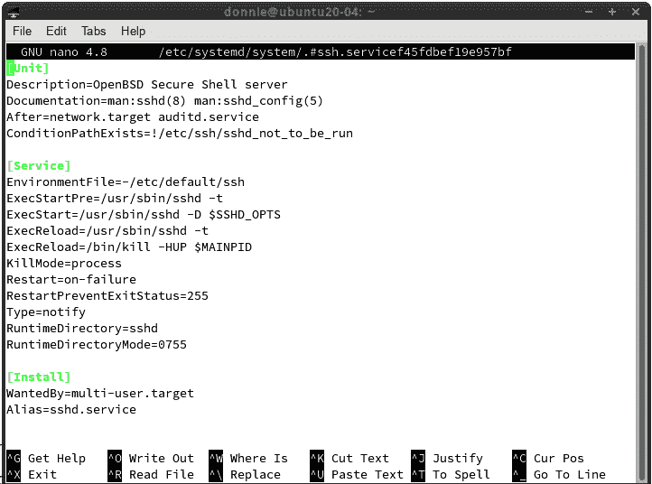
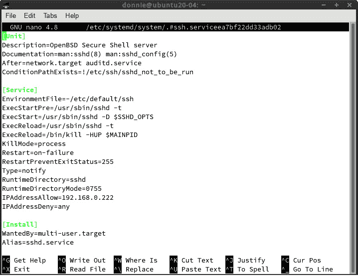
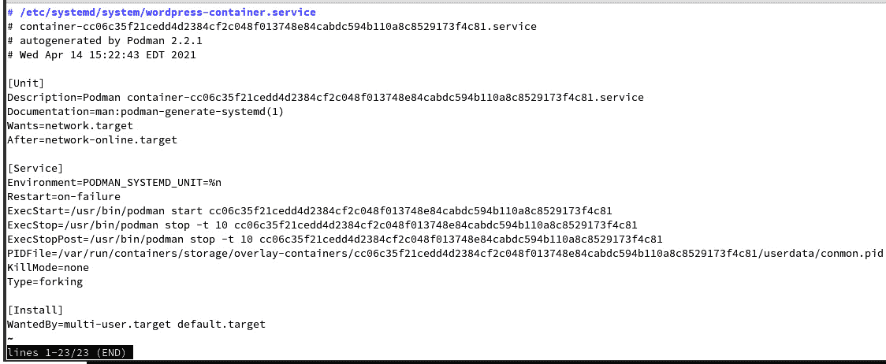

# *第五章*：创建和编辑服务

我们刚刚了解了`systemd`服务是什么以及如何控制它们。不过，有时你可能需要改变某个服务的行为，或者创建一个全新的服务。在这一章中，我们将学习如何正确编辑服务。接下来，我们将学习如何创建一个新的服务。本章的具体内容如下：

+   编辑现有服务

+   创建新服务

+   更改默认的 systemd 编辑器

+   使用 Podman 创建新的容器服务

如果你准备好了，那我们就开始吧。

# 技术要求

如前所述，我将使用 Alma Linux 8 虚拟机和 Ubuntu Server 20.04 虚拟机。为了进行安全 shell（Secure Shell）练习，你需要进入两台虚拟机的 VirtualBox 网络设置，并选择`ip a`。这样，你就可以从宿主机的命令行远程登录到虚拟机。

查看以下链接，观看“代码实战”视频：[`bit.ly/3xP0yOH`](https://bit.ly/3xP0yOH)

# 编辑现有服务

我们已经看到，服务的单元文件位于`/lib/systemd/system/`目录中，所以你可能首先会想到直接去那里，使用你喜欢的文本编辑器编辑文件。虽然这么做是可行的，但你不应该这样做。如果进行系统更新，它可能会覆盖你编辑的文件，从而丢失你的修改。

正确的方法是在`/etc/systemd/system/`目录中创建你服务文件的编辑版。你可以像编辑其他配置文件一样，使用你喜欢的文本编辑器进行编辑。事实上，这也是你*以前*必须做的事。当 Red Hat 发布 RHEL 7.2 时，他们在`systemctl`命令中添加了一个`edit`功能，这使得操作变得更容易。（当然，现在所有运行`systemd`的 Linux 发行版都可以使用这个`edit`功能。）

注

我注意到有些人喜欢将自己的自定义单元文件添加到`/lib/systemd/system/`目录中，这样它们就可以与操作系统安装的单元文件并列。如果你是其中之一，请理解这样做是*不*好的做法。这样做的风险是，在进行系统更新时，你的自定义单元文件可能会被删除或覆盖。而将自定义单元文件保存在`/etc/systemd/system/`目录中，会让你更容易跟踪哪些单元文件是你添加的，哪些是操作系统安装的。

现在，你可能会想知道如何了解可以对服务文件进行哪些更改。最简单的答案是阅读不同单元类型的 man 页面，查看可以添加、删除或修改的所有参数和选项。不过，如果像我一样，你会发现阅读这些 man 页面很容易让人昏昏欲睡。别误会，man 页面确实很有用。但如果你真的想学会如何让服务按照你的需求“唱歌跳舞”，最轻松的办法就是查看你系统中已经存在的服务文件，看看它们是如何设置的。然后，查看这些文件中列出的参数，并查阅相应的 man 页面，了解它们为你做了什么。我们在本章中会通过很多例子来说明这一点。

当你使用 `systemctl edit` 功能时，可以选择部分编辑文件或编辑整个文件。默认情况下，你将进行部分编辑。让我们从我能想到的最简单的例子开始。

## 对 [Install] 部分进行部分编辑

启动 Ubuntu 服务器虚拟机并向 `apache2.service` 文件添加一行 `Alias=`。首先这样做：

```
sudo systemctl edit apache2
```

你看到的内容类似于这样：



图 5.1 – Ubuntu 上的 systemd 服务编辑器

是的，看起来没什么，对吧？这只是一个在 nano 编辑器中打开的空文件。不过别担心，我们在这里要做的只是添加一个参数，且不需要看到整个服务文件就能做到这一点。由于我们使用的是 Ubuntu，Apache 服务的名称是 `apache2`。假设你刚从 Red Hat 环境过来，并且习惯了总是使用 `httpd` 作为 Apache 服务名。因此，每当你在 Ubuntu 机器上输入错误的服务名时，就会感到很沮丧。这就像是你一辈子都习惯开手动挡车，结果一上自动挡车就开始找离合器。（嗯，反正我是这么做的。）我们可以轻松解决这个问题，但首先我们来看一个已经存在的例子。

在另一个窗口中，查看 Ubuntu 机器上 `ssh.service` 文件的 `[Install]` 部分，如下所示：

```
. . .
. . .
[Install]
WantedBy=multi-user.target
Alias=sshd.service
```

最后的 `Alias=` 行就是我们的例子。现在，在 nano 窗口中输入以下内容：

```
[Install]
Alias=httpd.service
```

保存文件并通过按 *Ctrl* + *X* 键组合退出编辑器。当它询问是否保存已修改的缓冲区时，按 *y* 键。然后，按 *Enter* 键接受默认的文件名。接下来，查看 `/etc/systemd/system/` 目录。你会看到我们刚刚创建了一个新的 `apache2.service.d` 目录：

```
donnie@ubuntu20-04:/etc/systemd/system$ ls -l
total 104
drwxr-xr-x 2 root root 4096 Apr  5 16:55 apache2.service.d
. . .
. . .
```

在那个目录中，你将看到以下 `override.conf` 文件：

```
donnie@ubuntu20-04:/etc/systemd/system/apache2.service.d$ ls -l
total 4
-rw-r--r-- 1 root root 30 Apr  5 16:55 override.conf
donnie@ubuntu20-04:/etc/systemd/system/apache2.service.d$
```

这个文件包含了我们刚刚添加的参数，内容如下：

```
[Install]
Alias=httpd.service
```

就是这样——整个文件。当我们启动 Apache 时，这个参数将被添加到原始服务文件中已经存在的内容。其优点是，如果原始服务文件在系统更新中被替换，你将获得更新所做的更改，并且仍然保留这个修改。

但是，在你使用这个修改之前，你需要将它加载到系统中。你可以通过执行以下命令来做到这一点：

```
donnie@ubuntu20-04:~$ sudo systemctl daemon-reload
[sudo] password for donnie: 
donnie@ubuntu20-04:~$
```

每次修改或添加服务文件时，你都需要执行`daemon-reload`。当你添加`Alias=`时，还需要在`/etc/systemd/system/`目录中为其创建一个符号链接。你可以通过`ln -s`命令手动创建它，但其实不必。当你在服务文件的`[Install]`部分添加`Alias=`行时，启用服务时链接会自动创建。在 Ubuntu 机器上，Apache 服务已经启用并正在运行，因此我们只需要禁用并重新启用它。（注意，不需要停止服务。）那么，我们先禁用 Apache，像这样：

```
donnie@ubuntu20-04:/etc/systemd/system$ sudo systemctl disable apache2
Synchronizing state of apache2.service with SysV service script with /lib/systemd/systemd-sysv-install.
Executing: /lib/systemd/systemd-sysv-install disable apache2
Removed /etc/systemd/system/multi-user.target.wants/apache2.service.
donnie@ubuntu20-04:/etc/systemd/system$
```

现在，我们将重新启用它，像这样：

```
donnie@ubuntu20-04:/etc/systemd/system$ sudo systemctl enable apache2
Synchronizing state of apache2.service with SysV service script with /lib/systemd/systemd-sysv-install.
Executing: /lib/systemd/systemd-sysv-install enable apache2
Created symlink /etc/systemd/system/httpd.service → /lib/systemd/system/apache2.service.
Created symlink /etc/systemd/system/multi-user.target.wants/apache2.service → /lib/systemd/system/apache2.service.
donnie@ubuntu20-04:/etc/systemd/system$
```

你可以在输出中看到，`enable`命令读取了我们插入`[Install]`部分的`Alias=`行，并创建了一个指向原始`apache2.service`文件的`httpd.service`链接。我们可以通过以下`ls -l`命令来验证这一点：

```
donnie@ubuntu20-04:/etc/systemd/system$ ls -l httpd.service 
lrwxrwxrwx 1 root root 35 Apr  5 17:39 httpd.service -> /lib/systemd/system/apache2.service
donnie@ubuntu20-04:/etc/systemd/system$
```

现在是关键时刻了。我们能通过调用`httpd`服务名称来控制我们 Ubuntu 机器上的 Apache 吗？我们来看看：

```
donnie@ubuntu20-04:~$ systemctl status httpd
• apache2.service - The Apache HTTP Server
     Loaded: loaded (/lib/systemd/system/apache2.service; enabled; vendor preset: enabled)
    Drop-In: /etc/systemd/system/apache2.service.d
             └─override.conf
     Active: active (running) since Mon 2021-04-05 17:19:08 UTC; 34min ago
. . .
. . .
```

哦，没错。它运行得像冠军一样。（你难道不喜欢计划成功时的感觉吗？）要查看带有新编辑的服务文件，使用`systemctl cat`，像这样：

```
donnie@ubuntu20-04:~$ systemctl cat apache2
# /lib/systemd/system/apache2.service
[Unit]
Description=The Apache HTTP Server
. . .
. . .
[Install]
WantedBy=multi-user.target
# /etc/systemd/system/apache2.service.d/override.conf
[Install]
Alias=httpd.service
donnie@ubuntu20-04:~$
```

输出的顶部部分显示了原始的服务文件，底部部分显示了你创建的`override.conf`文件。

当然，你也可以走反方向。如果你习惯了 Ubuntu 的方式，而突然发现自己在 RHEL 类型的机器上管理 Apache，你可以在`httpd.service`文件中添加`Alias=apache2.service`行，然后禁用并重新启用 Apache 来创建链接。唯一的不同之处是，在 Ubuntu 机器上，`systemctl edit`会启动 nano 文本编辑器，而在 RHEL 类型的机器上，它可能会启动 vi 文本编辑器。（RHEL 类型的发行版最近才从 vi 切换为 nano 作为默认的 systemd 编辑器。）

专业提示

记住，对服务文件中`[Install]`部分所做的任何更改都会影响每次启用或禁用该服务时的行为。

好的，现在我们已经在`[Install]`部分添加了一个很酷的选项，让我们来添加一些到`[Service]`部分吧。

## 对`[Service]`部分进行局部编辑

让我们继续操作我们的 Ubuntu 服务器虚拟机，并在已经做过的基础上再添加一些内容。这次，我们将在 `[Service]` 部分添加一些选项，稍微增强一下安全性。不过，在此之前，让我们看看 Apache 的实际安全性如何。我们将通过 `systemd-analyze` 工具来检查。

在 `systemd-analyze` 的手册页上，你会看到这个工具有很多用途。目前，我们只介绍 `security` 选项。首先，通过执行以下命令来检查我们 Ubuntu 虚拟机上服务的整体安全配置：

```
donnie@ubuntu20-04:~$ systemd-analyze security
UNIT                                  EXPOSURE PREDICATE HAPPY
accounts-daemon.service                    9.6 UNSAFE  😨    
apache2.service                            9.2 UNSAFE  😨    
apport.service                             9.6 UNSAFE  😨    
. . .
. . .      🙂    
systemd-udevd.service                      8.4 EXPOSED 🙁    
thermald.service                           9.6 UNSAFE  😨    
unattended-upgrades.service                9.6 UNSAFE  😨    
user@1000.service                          9.4 UNSAFE  😨    
uuidd.service                              4.5 OK      🙂    
vgauth.service                             9.5 UNSAFE  😨    
donnie@ubuntu20-04:~$
```

这个命令会检查每个服务的安全性和沙盒设置，并为每个服务分配一个 `EXPOSURE` 分数。分数越高，服务就越不安全。所以，这就像高尔夫比赛一样，你需要尽可能获得最低分数。`HAPPY` 列本来应该显示不同程度的开心或难过表情符号，但粘贴到书中的时候表情符号无法显示。不过没关系，因为你可以在自己的虚拟机上看到这些表情。

现在，在你看到某个服务被标记为 `UNSAFE`（如我们这里看到的 Apache 服务）时，别太激动，你需要理解这只是检查了服务文件中的安全设置。它并没有考虑服务自身配置文件中的任何安全设置，也没有考虑可能嵌入在服务可执行文件中的安全选项，或者任何可能生效的**强制访问控制**（**MAC**）选项。不过，尽管如此，这仍然是一个有用的工具，可以为你提供加强安全设置的建议。

接下来，我们来看看一些针对 Apache 服务的建议：

```
donnie@ubuntu20-04:~$ systemd-analyze security apache2
  NAME                                                        DESCRIPTION                                                             EXPOSURE
✗ PrivateNetwork=                                             Service has access to the host's network                                     0.5
✗ User=/DynamicUser=                                          Service runs as root user                                                    0.4
✗ CapabilityBoundingSet=~CAP_SET(UID|GID|PCAP)                Service may change UID/GID identities/capabilities                           0.3
✗ CapabilityBoundingSet=~CAP_SYS_ADMIN                        Service has administrator privileges                                         0.3
✗ CapabilityBoundingSet=~CAP_SYS_PTRACE                       Service has ptrace() debugging abilities                                     0.3
. . .
. . .
```

这里的输出太多，无法全部显示，但没关系。让我们向下滚动一些，展示一些与我们想做的事情更相关的设置：

```
. . .
. . .
✓ PrivateMounts=                                              Service cannot install system mounts                                            
✓ PrivateTmp=                                                 Service has no access to other software's temporary files                       
✗ PrivateUsers=                                               Service has access to other users                                            0.2
✗ ProtectClock=                                               Service may write to the hardware clock or system clock                      0.2
✗ ProtectControlGroups=                                       Service may modify the control group file system                             0.2
✗ ProtectHome=                                                Service has full access to home directories                                  0.2
. . .
. . .
✗ ProtectSystem=                                              Service has full access to the OS file hierarchy                             0.2
. . .
. . .
```

当你看到条目前面有一个 `X` 时，意味着这个设置是不安全的。如果条目前有一个勾选标记，表示该参数已配置为安全设置。但是，如果你胡乱地将不安全的设置更改为安全的设置，可能会导致服务无法正常运行。一些所谓的不安全设置其实是服务正常运行所必需的。以 `User=/DynamicUser=` 设置为例。如果没有该参数，Apache 服务将以 root 权限运行。这不一定不好，因为 Apache 服务需要 root 权限来执行某些任务。如果你将该选项设置为非 root 用户，Apache 将无法启动。而且，Apache 开发者已经考虑到了这一点。他们的设置方式是，只有第一个 Apache 进程会以 root 权限运行，其他所有的 Apache 进程——即浏览器连接的进程——都不会以 root 权限运行。我们已经看到，在 RHEL 类型的发行版中，比如 Alma Linux，Apache 进程是以 `apache` 用户身份运行的。而在 Ubuntu 中，我们看到它们是以 `www-data` 账户运行的：

```
donnie@ubuntu20-04:/etc/apache2$ ps aux | grep apache
root        2290  0.0  0.2   6520  4480 ?        Ss   18:40   0:00 /usr/sbin/apache2 -k start
www-data    2291  0.0  0.2 752656  4344 ?        Sl   18:40   0:00 /usr/sbin/apache2 -k start
www-data    2292  0.0  0.2 752656  4344 ?        Sl   18:40   0:00 /usr/sbin/apache2 -k start
donnie      2554  0.0  0.0   6432   724 pts/0    S+   19:55   0:00 grep --color=auto apache
donnie@ubuntu20-04:/etc/apache2$
```

这个非根用户是在 Apache 配置文件中定义的。让我们看看我们的好朋友`grep`能否帮助我们找到这个设置的位置：

```
donnie@ubuntu20-04:/etc/apache2$ grep -r 'USER' *
apache2.conf:User ${APACHE_RUN_USER}
envvars:export APACHE_RUN_USER=www-data
donnie@ubuntu20-04:/etc/apache2$
```

所以，在 Ubuntu 机器上，非 root 的 `www-data` 用户定义在 `/etc/apache2/envvars` 文件中，并在 `/etc/apache2/apache2.conf` 文件中调用。（关于 Alma Linux 机器上这个设置的位置，我留给你自己去找。）总之，关于我们不能更改的设置就说到这里。接下来，我们来看看一些我们*可以*更改的设置。

提示：

在 RHEL 类型的机器上，接下来我将展示的所有内容已经由 SELinux 覆盖。但如果你希望获得双重保护，仍然可以使用这些设置。Ubuntu 和 SUSE 使用 AppArmor 而不是 SELinux。不幸的是，除非你自行创建自定义的 AppArmor 配置文件，否则 AppArmor 对 Apache 几乎没有任何保护。而在 `systemd` 中设置这些保护则要简单得多。

首先，让我们来看看如何保护用户的主目录。我们将再次使用 `sudo systemctl edit apache2` 命令，这将打开我们之前创建的 `override.conf` 文件。`[Install]` 部分仍然存在，我们只需添加一个 `[Service]` 部分，如下所示：

```
[Service]
ProtectHome=yes
ProtectSystem=strict
[Install]
Alias=httpd.service
```

默认情况下，Apache 服务可以读取或写入文件系统中的任何位置。`ProtectHome=yes` 设置可以防止 Apache 访问 `/root/`、`/home/` 和 `/run/user/` 目录，即使这些目录设置了全局可读权限。如果用户希望通过自己的主目录提供 Web 内容，同时防止 Apache 写入这些目录，我们还可以将此设置为 `read-only`。

`ProtectSystem=strict` 设置会使 Apache 只能对整个文件系统进行只读访问，除了 `/dev/`、`/proc/` 和 `/sys/` 目录。我们保存文件并重启 Apache，看看结果：

```
donnie@ubuntu20-04:~$ sudo systemctl daemon-reload
donnie@ubuntu20-04:~$ sudo systemctl restart apache2
Job for apache2.service failed because the control process exited with error code.
See "systemctl status apache2.service" and "journalctl -xe" for details.
donnie@ubuntu20-04:~$
```

哎呀，这不好。让我们检查一下状态，看看问题可能出在哪里：

```
donnie@ubuntu20-04:~$ sudo systemctl status apache2
. . .
. . .
Apr 10 21:52:20 ubuntu20-04 apachectl[3848]: (30)Read-only file system: AH00091: apache2: could not open error log file /var/log/apache2/error.log.
Apr 10 21:52:20 ubuntu20-04 apachectl[3848]: AH00015: Unable to open logs
Apr 10 21:52:20 ubuntu20-04 apachectl[3836]: Action 'start' failed.
Apr 10 21:52:20 ubuntu20-04 apachectl[3836]: The Apache error log may have more information.
. . .
. . .
donnie@ubuntu20-04:~$
```

所以，Apache 想要写入`/var/log/apache2/`目录中的日志文件，但它不能。让我们更改`ProtectSystem`设置，看看能否解决问题：

```
[Service]
ProtectHome=yes
ProtectSystem=full  
[Install]
Alias=httpd.service
```

将`ProtectSystem=`设置为`full`会使 Apache 对`/boot/`、`/usr/`和`/etc/`目录具有只读访问权限。通常，Apache 不需要写入这些目录，所以现在它应该能正常工作。我们试试看：

```
donnie@ubuntu20-04:~$ sudo systemctl daemon-reload
donnie@ubuntu20-04:~$ sudo systemctl restart apache2
donnie@ubuntu20-04:~$
```

没有错误信息，这很好。让我们检查一下状态：

```
donnie@ubuntu20-04:~$ sudo systemctl status apache2
● apache2.service - The Apache HTTP Server
     Loaded: loaded (/lib/systemd/system/apache2.service; enabled; vendor preset: enabled)
    Drop-In: /etc/systemd/system/apache2.service.d
             └─override.conf
     Active: active (running) since Sat 2021-04-10 21:58:22 UTC; 4s ago
. . .
. . .
```

好的，这没问题。所以，太棒了！我们搞定了，宝贝！但说实话，看看`systemd.exec`手册页，你会看到更多你可能用得上的安全设置。

注意

你可以看到，我不小心使用了`sudo`来查看服务状态。习惯性地在使用`systemctl`时加上`sudo`，但幸运的是，即使在不需要时使用它也不会造成任何问题。

仅为好玩，我们再添加一些安全选项，然后再次检查安全状态。这次，我们会让我们的`[Service]`部分看起来像这样：

```
[Service]
ProtectHome=yes
ProtectSystem=full
PrivateDevices=yes
ProtectKernelTunables=yes
ProtectKernelModules=yes
ProtectControlGroups=yes
SystemCallFilter=@system-service
SystemCallErrorNumber=EPERM
NoNewPrivileges=yes
```

我留给你去阅读这些新参数的`systemd.exec`手册页。

编辑完成后，重新启动 Apache，确保它能正常启动。然后，再次运行`systemd-analyze security apache2.service`。你应该会看到整体的安全评分比之前有所提升。

你可以在服务文件中设置更多与安全相关的参数。不过要记住，大多数服务要求某些设置保持在`UNSAFE`模式下才能正常运行。最好的方法是，在虚拟机上尝试不同服务的这些设置。这样，你就能清楚地了解哪些设置适用于不同的服务。而且，为了安全起见，在将任何服务修改投入生产环境之前，务必进行彻底的测试。

接下来，让我们来看一下如何对 Secure Shell 服务进行完全编辑。

## 进行完全编辑

部分编辑非常适用于当你只需要添加一个服务文件中尚未存在的参数时。但是，如果你需要删除一个参数、更改参数的值，或添加一个与其他现有参数冲突的参数，这时就需要进行完全编辑。进行完全编辑的另一个原因是，你可能希望将整个文件展现在眼前，这样你就能清楚地了解自己在做什么。例如，要对`ssh.service`文件进行完全编辑，只需使用`--full`选项，如下所示：

```
donnie@ubuntu20-04:~$ sudo systemctl edit --full ssh.service
```

这次，你将看到整个`ssh.service`文件，如下所示：



图 5.2 – 使用--full 选项编辑服务文件

这次，我们来设置 Secure Shell 服务的访问控制。

专业提示

如果你在 Linux 圈子里待了有一段时间，可能会对`tcpwrappers`这个概念有所了解。它的名字很奇怪，但概念很简单。你只需要在`/etc/hosts.allow`文件中配置希望允许访问特定网络服务的 IP 地址，然后在`/etc/hosts.deny`文件中拒绝所有其他 IP 地址。这个方法在 Ubuntu 中依然有效，但 Red Hat 在 RHEL 8 中已移除`tcpwrappers`。所以，如果你想在任何 RHEL 8 类型的发行版上配置访问控制（比如我们使用的 Alma Linux 8），你需要通过配置服务文件来实现。在 Ubuntu 上，你可以使用任意一种方法。

假设你只想允许来自一台特定桌面机器的 SSH 登录。为此，我们将在`ssh.service`文件的`[Service]`部分使用`IPAddressAllow=`和`IPAddressDeny=`参数。（当然，如果你想在 Alma Linux 机器上尝试，应该是`sshd.service`文件。）像我刚才展示的那样打开文件进行编辑，并在`[Service]`部分的末尾添加两行，使用你自己主机的 IP 地址填写`IPAddressAllow=`行。这两行应该像这样：

```
IPAddressAllow=192.168.0.222
IPAddressDeny=any
```

整个文件现在应该看起来像这样：



图 5.3 - 编辑后的 ssh.service 文件

如果你只插入`IPAddressAllow=`行，而不插入`IPAddressDeny=`行，你会发现没有任何东西被阻止。因此，每当你想设置访问白名单时，都需要同时使用这两行。

保存文件并执行`sudo systemctl daemon-reload`。然后，重启或重新加载安全外壳服务。如果你使用了正确的主机 IP 地址，你应该能够通过 SSH 登录。为了真正测试这个功能，再次编辑文件，并使用错误的主机 IP 地址。这次，你应该会被阻止进行 SSH 登录。不过要注意，你不需要再次执行`daemon-reload`命令。这个新设置在保存文件后会立即生效。因此，如果你在远程操作，并且输入了错误的主机 IP 地址，你将会被锁定。在实际操作中，你需要进入服务器机房，从服务器的本地终端正确配置。

当你进行完整编辑时，修改后的原始服务文件副本将被保存到`/etc/systemd/system/`目录，如下所示：

```
donnie@ubuntu20-04:~$ cd /etc/systemd/system/
donnie@ubuntu20-04:/etc/systemd/system$ ls -l ssh.service 
-rw-r--r-- 1 root root 586 Apr 11 20:07 ssh.service
donnie@ubuntu20-04:/etc/systemd/system$
```

只要这个文件存在，它将始终覆盖`/lib/systemd/system/`目录中的原始文件。

接下来，让我们来看一下如何创建一个全新的服务。

# 创建一个新服务

要从头开始创建一个全新的服务，使用`--force`和`--full`选项组合，如下所示：

```
donnie@ubuntu20-04:~$ sudo systemctl edit --force --full timestamp.service
```

这将在`/etc/systemd/system/`目录下创建一个新的服务文件，正如我们之前看到的那样。

在这个演示中，我们将创建一个服务，将定期的时间戳写入我们的系统日志文件。我们的 `timestamp.service` 文件将如下所示：

```
[Unit]
Description=Service Creation Demo
Wants=network.target
After=syslog.target network-online.target
[Service]
ExecStart=/usr/local/bin/timestamp.sh
Restart=on-failure
RestartSec=20
KillMode=process
[Install]
WantedBy=multi-user.target
```

这里，我们看到 `RestartSec=` 参数，这是我们以前没有见过的。它与 `Restart=` 行一起工作，表示在重启崩溃的服务之前等待指定的秒数。在这里，我们设定等待 20 秒。我们没有看到 `Type=` 行，因为我们不需要它。如果没有这一行，`systemd` 会使用默认的 `Type=simple`，这正是我们需要的。（我留给你去阅读 `systemd.service` 手册页中的 `simple` `Type` 部分。）

接下来，我们将创建 `timestamp.sh` 脚本，该脚本每 60 秒将时间戳写入系统日志文件。让我们将它做成这样：

```
#!/bin/bash
echo "Starting the timestamp service" | systemd-cat -p info
while :
do
        echo "timestamp.service: The current time is $(date '+%m-%d-%Y %H:%M:%S')" | systemd-cat -p info
        sleep 60
done
```

如你所见，这只是一个简单的 `while` 循环，它每隔 60 秒将当前时间传递给 `systemd-cat` 工具。然后，`systemd-cat` 将 `timestamp` 消息发送到系统日志文件。`-p info` 选项将该消息标记为 `info` 级别的优先级。

接下来，使脚本文件可执行，并将其复制到 `/usr/local/bin/` 目录。然后，启动服务：

```
donnie@ubuntu20-04:~$ chmod u+x timestamp.sh 
donnie@ubuntu20-04:~$ sudo cp timestamp.sh /usr/local/bin
donnie@ubuntu20-04:~$ sudo systemctl start timestamp
donnie@ubuntu20-04:~$
```

如果你真的想启用该服务，可以启用它，但目前我们不需要它。

状态应该如下所示：

```
donnie@ubuntu20-04:~$ systemctl status timestamp
● timestamp.service - Service Creation Demo
     Loaded: loaded (/etc/systemd/system/timestamp.service; disabled; vendor preset: enabled)
     Active: active (running) since Sun 2021-04-11 21:57:26 UTC; 13min ago
   Main PID: 14293 (timestamp.sh)
      Tasks: 2 (limit: 2281)
     Memory: 820.0K
     CGroup: /system.slice/timestamp.service
             ├─14293 /bin/bash /usr/local/bin/timestamp.sh
             └─14411 sleep 60
Apr 11 22:00:26 ubuntu20-04 cat[14335]: timestamp.service: The current time is 04-11-2021 22:00:26
. . .
. . .
```

要在日志文件中查看时间戳，执行以下操作：

`donnie@ubuntu20-04:~$ journalctl -xe`

或者，你可以通过在 Ubuntu 机器上执行 `sudo tail -f /var/log/syslog`，或在 Alma 机器上执行 `sudo tail -f /var/log/messages` 来实时查看它们的添加情况。当你看到足够的信息时，只需按 *Ctrl* + *C* 退出。

# 更改默认的 systemd 编辑器

到目前为止，我一直在展示如何在 nano 文本编辑器中完成这些操作，nano 是大多数现代 Linux 发行版的默认 `systemd` 编辑器。但是，如果你不喜欢 nano，而想使用其他编辑器呢？假设你最喜欢的文本编辑器是 Vim，你想用它来替代 nano。

使用替代文本编辑器的一种方法是每次运行 `systemctl edit` 命令时指定替代编辑器，像这样：

```
[donnie@localhost ~]$ sudo EDITOR=vim systemctl edit --full sshd
[donnie@localhost ~]$
```

这样可以，但每次运行 `systemctl edit` 命令时都这样做可能会有点麻烦。幸运的是，一旦你知道如何操作，修改默认编辑器非常简单。

首先，编辑位于你个人主目录中的 `.bashrc` 文件。在文件的最底部，添加这一行：

```
export SYSTEMD_EDITOR=vim
```

保存文件后，重新加载新的配置：

```
[donnie@localhost ~]$ source .bashrc
[donnie@localhost ~]$
```

接下来，打开 `sudoers` 文件：

```
[donnie@localhost ~]$ sudo visudo
```

向下滚动到你看到 `Defaults` 行的位置，然后添加这一行：

```
Defaults   env_keep += "SYSTEMD_EDITOR"
```

保存文件后，尝试运行 `systemctl edit` 命令。你现在应该看到 vim 而不是 nano。

我们已经看到了一些很酷的东西，但我们才刚刚开始。为了达到极致的酷，我们来看看如何使用 `podman` 自动为我们创建容器服务文件。

# 使用 podman 创建新的容器服务

容器技术已经存在很长时间了，但直到 Docker 推出了其新的容器管理系统，容器才变得非常流行。原始的 Docker 系统确实很酷，但它有一些不足，尤其是在安全性方面。为此，Red Hat 的好心人开发了自己的 Docker 替代品，叫做 `podman`。`podman` 提供了大大增强的安全性，并且具备 Docker 中没有的酷功能。唯一的问题是，`podman` 目前仅在 RHEL 类型和 Fedora 发行版上可用，而其他所有人仍然使用 Docker。因此，我们将在 Alma Linux 机器上演示这些操作。

要在你的 Alma 机器上安装 `podman`，请执行：

```
[donnie@localhost ~]$ sudo dnf install podman-docker
```

这将安装 `podman` 包，并附带一个 shell 脚本，任何时候你不小心输入 `docker` 时，它会调用 `podman`。（实际上，这可能不是偶然的。你可能有一些 shell 脚本会调用 `docker` 命令，安装 `podman-docker` 包将避免你修改它们以使用 `podman` 命令。）为了避免混淆，接下来的演示中，我将只展示 `podman` 命令。

`podman` 工具通常不需要管理员权限，这是它相对于 Docker 的一个优势。但是，为了使其正常工作，我们需要在 root 用户账户下创建 Docker 容器。我们可以通过进入 root 用户 shell 来完成这项操作，也可以在普通用户 shell 中执行 `sudo` 来运行 `podman` 命令。由于除非必要，我通常不喜欢进入 root shell，因此我们将使用 `sudo` 来执行。

让我们创建一个 `wordpress` 容器，像这样：

```
[donnie@localhost ~]$ sudo podman run -d -p 8080:80 --name wordpress wordpress
```

WordPress 是一个免费的开源博客平台。在这里，我们以 `detached`（后台）模式运行一个 `wordpress` 容器，并使用 `-d` 参数。我们没有将默认的 `80` 端口暴露给网络，而是暴露了 `8080` 端口。（请注意，如果启动失败，可能是因为端口 `8080` 已经有其他应用在监听。如果是这种情况，请尝试使用其他端口。）`--name` 参数设置了容器的名称，我们稍后将在命令中使用该名称来创建服务文件。

我们将通过 `sudo podman ps` 来验证它是否正在运行：

```
[donnie@localhost ~]$ sudo podman ps
CONTAINER ID  IMAGE                               COMMAND               CREATED        STATUS            PORTS                 NAMES
cc06c35f21ce  docker.io/library/wordpress:latest  apache2-foregroun...  2 minutes ago  Up 2 minutes ago  0.0.0.0:8080->80/tcp  wordpress
[donnie@localhost ~]$
```

你也可以尝试从主机的网页浏览器访问 WordPress，但你首先需要在 Alma 机器的防火墙上打开 `8080/tcp` 端口，方法如下：

```
[donnie@localhost ~]$ sudo firewall-cmd --permanent --add-port=8080/tcp
success
[donnie@localhost ~]$ sudo firewall-cmd --reload
success
[donnie@localhost ~]$
```

然后，打开主机的网页浏览器，访问 Alma 机器的 IP 地址上的 `8080` 端口。URL 应该像这样：

[`192.168.0.9:8080/`](http://192.168.0.9:8080/)

这应该会弹出 WordPress 的初始界面，引导你完成设置过程。

好的，这很棒，但问题是当你重启机器时，容器不会自动启动。为了解决这个问题，我们将使用 `sudo podman generate systemd` 命令来创建服务文件，方法如下：

```
[donnie@localhost ~]$ sudo podman generate systemd wordpress | sudo tee /etc/systemd/system/wordpress-container.service
```

注意，在 `/etc/` 目录中，使用 `sudo` 进行正常的重定向操作（使用 `>` 符号）效果不好，但将输出通过管道传递到 `tee` 工具就能正常工作。正如你所看到的，`tee` 工具将输出发送到屏幕和指定的文件。

执行 `systemctl cat wordpress-container` 将显示生成的服务文件：



图 5.4 – podman 生成的服务文件

如果这还不够顺畅，那我就不知道什么才算顺畅了。让我们启用该服务并重启，看看会发生什么：

```
[donnie@localhost ~]$ sudo systemctl daemon-reload
[donnie@localhost ~]$ sudo systemctl enable wordpress-container
Created symlink /etc/systemd/system/multi-user.target.wants/wordpress-container.service → /etc/systemd/system/wordpress-container.service.
Created symlink /etc/systemd/system/default.target.wants/wordpress-container.service → /etc/systemd/system/wordpress-container.service.
[donnie@localhost ~]$ sudo shutdown -r now
```

重启完成后，执行 `sudo podman ps` 命令应该会显示容器正在运行：

```
[donnie@localhost ~]$ sudo podman ps
[sudo] password for donnie: 
CONTAINER ID  IMAGE                               COMMAND               CREATED         STATUS                 PORTS                  NAMES
cc06c35f21ce  docker.io/library/wordpress:latest  apache2-foregroun...  12 minutes ago  Up About a minute ago  0.0.0.0:8080->80/tcp  wordpress
[donnie@localhost ~]$
```

（你这里只需要使用 `sudo`，因为容器是在 root 用户账户下运行的。）

当然，`systemctl status` 也应该显示该服务正在运行：

```
[donnie@localhost ~]$ systemctl status wordpress-container
● wordpress-container.service - Podman container-cc06c35f21cedd4d2384cf2c048f013748e84cabdc594b110a8c8529173f4c81.service
   Loaded: loaded (/etc/systemd/system/wordpress-container.service; enabled; vendor preset: disabled)
   Active: active (running) since Wed 2021-04-14 15:27:37 EDT; 2min 38s ago
. . .
. . .
```

好的，一切正常。但是，如果你需要创建一个容器服务，并希望从你自己的用户账户运行，而不需要根权限呢？好吧，我们也为你提供了这种方法。只需在你自己的主目录中创建服务文件，并从那里运行。

我们将像之前一样开始，只是使用不同的容器名称，并从正常的用户 shell 中启动，如下所示：

```
[donnie@localhost ~]$ podman run -d -p 9080:80 --name wordpress-noroot wordpress
```

这次我们使用了不同的网络端口，以避免与之前的设置冲突。现在，让我们停止容器：

```
[donnie@localhost ~]$ podman container stop wordpress-noroot
a6e2117dd4d5148d01a55d64ad8753c03436bfd9a573435e95d927f74 dc48f9e
[donnie@localhost ~]$
```

接下来，我们将在用户的正常主目录下创建一个子目录：

```
[donnie@localhost ~]$ mkdir -p .config/systemd/user/
[donnie@localhost ~]$
```

我们将生成服务文件，跟之前一样：

```
[donnie@localhost ~]$ podman generate systemd wordpress-noroot > .config/systemd/user/wordpress-noroot.service
[donnie@localhost ~]$
```

我之前忘了提到，这些生成的服务文件在 `[Install]` 部分有一个小的不同。你将看到两个目标，而不是只有一个，如下所示：

```
. . .
. . .
[Install]
WantedBy=multi-user.target default.target
```

`Default.target` 是在你希望从自己的用户账户运行服务时需要使用的。从现在开始，管理命令大致相同，唯一的区别是你不需要使用 `sudo`，而且需要使用 `--user` 选项来告诉 `systemd` 服务单元文件位于你自己的主目录中。让我们加载新的服务文件并检查状态：

```
[donnie@localhost ~]$ systemctl --user daemon-reload
[donnie@localhost ~]$ systemctl --user status wordpress-noroot
● wordpress-noroot.service - Podman container-a6e2117dd4d5148d01a55d64ad8753c03436bfd9a573435e95d927f74dc48f9e.service
   Loaded: loaded (/home/donnie/.config/systemd/user/wordpress-noroot.service; disabled; vendor preset: enabled)
   Active: inactive (dead)
. . .
. . .
```

让我们启用它并启动，然后再次检查状态：

```
[donnie@localhost ~]$ systemctl --user enable --now wordpress-noroot
Created symlink /home/donnie/.config/systemd/user/multi-user.target.wants/wordpress-noroot.service → /home/donnie/.config/systemd/user/wordpress-noroot.service.
Created symlink /home/donnie/.config/systemd/user/default.target.wants/wordpress-noroot.service → /home/donnie/.config/systemd/user/wordpress-noroot.service.
[donnie@localhost ~]$ systemctl --user status wordpress-noroot
● wordpress-noroot.service - Podman container-a6e2117dd4d5148d01a55d64ad8753c03436bfd9a573435e95d927f74dc48f9e.service
   Loaded: loaded (/home/donnie/.config/systemd/user/wordpress-noroot.service; enabled; vendor preset: enabled)
   Active: active (running) since Wed 2021-04-14 15:44:26 EDT; 12s ago
. . .
. . .
```

如果你拥有根权限，可以在防火墙上打开端口 `9080/tcp`，并从外部机器访问 WordPress，就像我们之前做的那样。

目前，我们的无根 WordPress 服务在启动机器时不会自动启动。但它会在你登录机器时启动，并在你登出时停止。通过对你自己的用户账户执行以下操作来修复这个问题：

```
[donnie@localhost ~]$ loginctl enable-linger donnie
[donnie@localhost ~]$
```

现在，容器服务将在我登出时继续运行，并且在我重启机器时会自动启动。

# 总结

在这一章中，我们学习了如何编辑和创建服务单元文件。过程中，我们介绍了可以设置的各种参数，包括一些与安全相关的参数。我们还看到，在将任何修改投入生产之前，测试服务文件的更改是非常重要的。当然，我一直强调的那一点是，掌握如何使用`systemd`手册页的重要性。

在下一章，我们将讨论`systemd`目标。到时候见。

# 问题

1.  如何对`ssh.service`文件进行部分编辑？

    a) `sudo systemctl edit --partial ssh.service`

    b) `sudo systemctl edit ssh.service`

    c) `sudo systemedit ssh.service`

    d) `sudo systemedit --partial ssh.service`

1.  如何创建一个全新的服务？

    a) `sudo systemctl edit --new newservice.service`

    b) `sudo systemctl edit --full newservice.service`

    c) `sudo systemctl edit --full --force newservice.service`

    d) `sudo systemctl edit newservice.service`

1.  如何为服务创建访问白名单？

    a) 只需在`[Service]`部分插入`IPAddressAllow=`指令。

    b) 在`[Service]`部分同时插入`IPAddressAllow=`指令和`IPAddressDeny=`指令。

    c) 只需在`[Unit]`部分插入`IPAddressAllow=`指令。

    d) 在`[Unit]`部分同时插入`IPAddressAllow=`指令和`IPAddressDeny=`指令。

# 答案

b

c

b

# 进一步阅读

+   如何创建`systemd`服务文件：[`linuxconfig.org/how-to-create-systemd-service-unit-in-linux`](https://linuxconfig.org/how-to-create-systemd-service-unit-in-linux)

+   保护和沙盒化应用程序及服务：[`www.redhat.com/sysadmin/mastering-systemd`](https://www.redhat.com/sysadmin/mastering-systemd)

+   使用`systemd`单元文件管理`podman`容器：[`youtu.be/AGkM2jGT61Y`](https://youtu.be/AGkM2jGT61Y)
