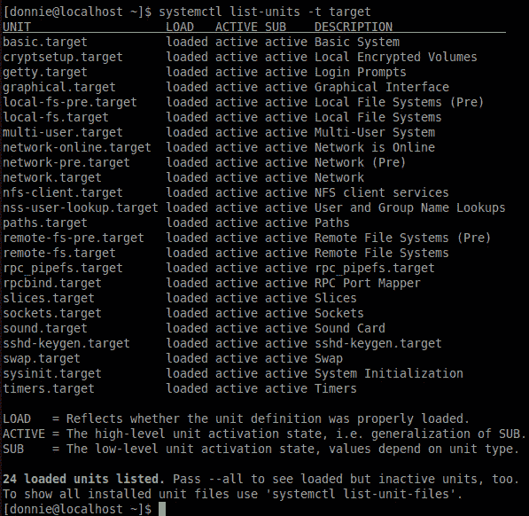
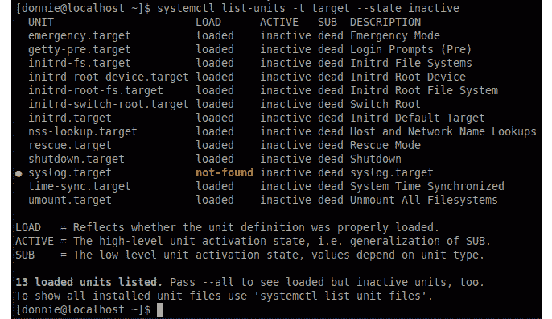
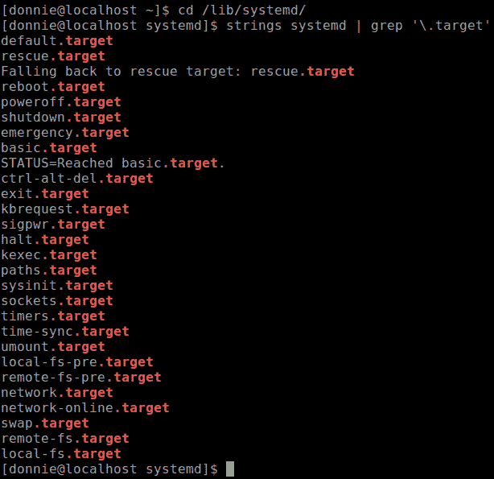
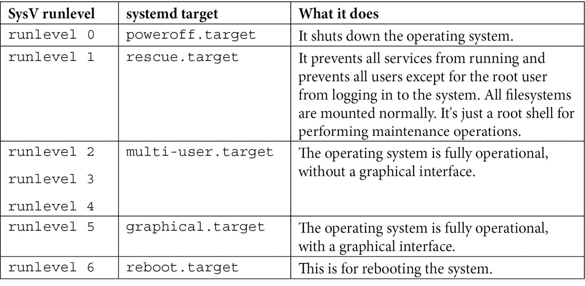
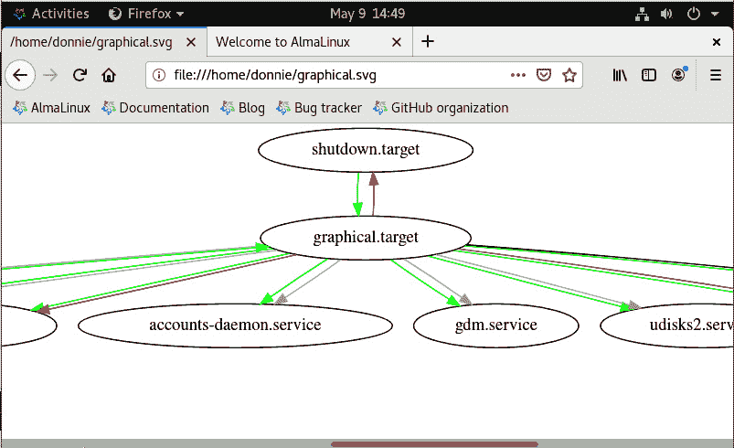
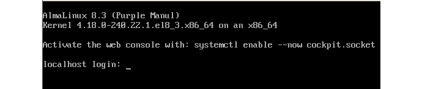

# 第六章：理解`systemd` targets

在本章中，我们将看看`systemd` targets 是什么，以及它们能为我们做些什么。现在，我得告诉你，这个话题有些困惑，我希望能澄清这一点。

本章涵盖的特定主题包括以下内容：

+   理解`systemd` targets 的目的

+   理解 target 文件的结构

+   将`systemd` targets 与 SysVinit 运行级别进行比较

+   理解 target 依赖关系

+   更改默认 target

+   临时更改 target

理解 targets 非常重要，它可以在服务器机房或在你自己家里为你提供帮助。如果你准备好了，我们就开始吧。

# 技术要求

对于本章，您需要一台运行带有图形桌面环境的虚拟机。我将使用我的*AlmaLinux 虚拟机*，它运行的是*Gnome 3 桌面*。

查看以下链接以观看《代码实战》视频：[`bit.ly/3Dgar9d`](https://bit.ly/3Dgar9d)

一如既往，这是实践操作，随时跟着做吧。

# 理解`systemd` targets 的目的

`systemd`的遗产，我们有*targets*代替了运行级别。许多这些 targets 执行着运行级别曾经执行的相同功能。这部分很容易理解。

困惑之处在于，targets 不仅仅是运行级别。正如我们很快会看到的，targets 有很多种，每种都有其特定的目的。在`systemd`中，target 是一个单元，它将其他`systemd`单元组合在一起，达到特定的目的。一个 target 可以组合的单元包括服务、路径、挂载点、套接字，甚至其他 targets。

通过执行`systemctl list-units -t target`命令，您可以查看系统上所有活动的 targets，结果应该是这样的：



图 6.1 – AlmaLinux 中的活动 targets

添加`--inactive`选项来查看非活动的 targets：



图 6.2 – AlmaLinux 中的非活动 targets

你可能通过查看这些 targets 的名称就能大致猜到它们在做什么。对于那些不那么明显的，您可以查看`systemd.special`手册页，或搜索具有特定 target 名称的手册页。

接下来，让我们深入看看这些 target 文件，看看我们能发现什么。

# 理解 target 文件的结构

正如我之前所说，学习`systemd`的最好方式是查看各种单元文件的示例。在本节中，我们将查看一些`.target`文件。

## 理解`sockets.target`文件

让我们从` sockets.target`文件开始，它是我们拥有的最简单的 target 之一：

```
[Unit]
Description=Sockets
Documentation=man:systemd.special(7)
```

对，只有这些，整个文件。`[Unit]` 部分是它唯一的部分，只包含 `Description=` 行和 `Documentation=` 行。乍一看，你可能会觉得这肯定对我们没有任何作用。但你错了。查看 `/etc/systemd/system/sockets.target.wants` 目录，你会看到这个目标只是我们需要运行的所有套接字的集合：

```
[donnie@localhost sockets.target.wants]$ ls -l
total 0
lrwxrwxrwx. 1 root 43 May  1 17:27 avahi-daemon.socket -> /usr/lib/systemd/system/avahi-daemon.socket
lrwxrwxrwx. 1 root 35 May  1 17:31 cups.socket -> /usr/lib/systemd/system/cups.socket
. . .
. . .
lrwxrwxrwx. 1 root 39 May  1 17:34 sssd-kcm.socket -> /usr/lib/systemd/system/sssd-kcm.socket
lrwxrwxrwx. 1 root 40 May  1 17:27 virtlockd.socket -> /usr/lib/systemd/system/virtlockd.socket
lrwxrwxrwx. 1 root 39 May  1 17:27 virtlogd.socket -> /usr/lib/systemd/system/virtlogd.socket
[donnie@localhost sockets.target.wants]$
```

为了查看这如何工作，让我们看一下 `cups.socket` 文件：

```
[Unit]
Description=CUPS Scheduler
PartOf=cups.service
[Socket]
ListenStream=/var/run/cups/cups.sock
[Install]
WantedBy=sockets.target
```

你可以在 `[Install]` 部分看到这个套接字是由 `sockets.target` 所需要的。换句话说，这个 `sockets.target` 的套接字会被激活。当然，`sockets.target` 在几乎所有 Linux 系统上默认都是激活的，所以你通常不需要自己去激活它。`cups.socket` 通常也是默认激活的，但你可能并不总是需要它。假设你正在运行一个文本模式的服务器，而且你确定你永远不会从中打印任何东西。你可以像禁用服务一样禁用 `cups.socket`：

```
[donnie@localhost ~]$ sudo systemctl disable --now cups.socket 
[sudo] password for donnie: 
Removed /etc/systemd/system/sockets.target.wants/cups.socket.
[donnie@localhost ~]$
```

当你这样做时，相关的 `cups.service` 仍然在运行，所以你还需要停止并禁用它。如果你改变主意，随时可以重新启用该服务和套接字。

## 理解 `sshd.service` 文件中的依赖关系

我们已经查看过 `sshd.service` 文件，但再看一遍还是很有价值的。为了节省空间，我将只展示 `[Unit]` 和 `[Install]` 部分，这也是我们需要查看的两个部分。

### `[Unit]` 和 `[Install]` 部分

以下是 `sshd.service` 文件中的 `[Unit]` 和 `[Install]` 部分：

```
[Unit]
Description=OpenSSH server daemon
Documentation=man:sshd(8) man:sshd_config(5)
After=network.target sshd-keygen.target
Wants=sshd-keygen.target
. . .
. . .
[Install]
WantedBy=multi-user.target
```

我们已经在 `[Install]` 部分看到了 `WantedBy=multi-user.target` 这一行，意味着当机器启动到多用户模式时，安全 shell 服务会自动启动。

在 `sshd.service` 文件的 `[Unit]` 部分，我们看到 `sshd.service` 直到 `network.target` 和 `sshd-keygen.target` 启动后才会启动。

现在，让我们看看 `network.target` 文件里有什么。

### 理解被动目标

`network.target` 文件是这样的：

```
[Unit]
Description=Network
Documentation=man:systemd.special(7)
Documentation=https://www.freedesktop.org/wiki/Software/systemd/NetworkTarget
After=network-pre.target
RefuseManualStart=yes
```

这里有一个有趣的地方，就是我们在文件末尾看到的 `RefuseManualStart=yes` 这一行。这意味着这个目标会自动启动，我们不能手动启动它。这就是为什么我们将 `network.target` 视为 *被动* 目标的原因。我们还看到 `network.target` 会在 `network-pre.target` 启动后启动，而 `network-pre.target` 也是一个被动目标。

更有趣且稍显好奇的是，`network.target` 似乎并没有为我们做任何事情。我的意思是，这里没有任何真正做事的代码；它似乎并没有启动任何服务，并且在 `/etc/systemd/system/` 目录下也没有 `.wants` 目录，无法让我们向其中添加服务。我们可以在这里看到：

```
[donnie@localhost system]$ pwd
/etc/systemd/system
[donnie@localhost system]$ ls -l network.target.wants
ls: cannot access 'network.target.wants': No such file or directory
[donnie@localhost system]$
```

那么，这里到底发生了什么呢？嗯，这是一个需要一点侦探工作才能找出答案的问题，因为 `systemd` 的开发者没有很好地记录这一点。答案是，多个目标被*硬编码*到 `systemd` 可执行文件中。`network.target` 就是一个例子。为了更好地理解这一点，我们可以使用 `strings` 工具来查看可能存在于 `systemd` 可执行文件中的任何文本字符串。使用命令如下：

```
[donnie@localhost systemd]$ pwd
/lib/systemd
[donnie@localhost systemd]$ strings systemd | grep '\.target'
```

输出应类似如下：



图 6.3 – 硬编码进 systemd 可执行文件的目标

要理解，并非所有这些硬编码的目标都是被动目标。例如，在列表的顶部，你会看到一些与关闭机器、电源重启或抢救机器相关的目标。（我指的是从`emergency.target`到其他所有目标。）这些目标是我们可以自己调用的。

被动目标在系统初始化部分的引导过程中会自动启动。当机器能够访问网络时，`network.target` 会被激活。通过在`sshd.service`文件的`[Unit]`部分中加入`After=network.target`，我们确保在网络激活并可用之后，安全外壳服务才会启动。

### 理解服务模板

为了刷新记忆，让我们再看一下我们`sshd.service`文件中的`[Unit]`部分：

```
[Unit]
Description=OpenSSH server daemon
Documentation=man:sshd(8) man:sshd_config(5)
After=network.target sshd-keygen.target
Wants=sshd-keygen.target
```

我们看到 `sshd.service` 要求 `sshd-keygen.target`，并且在 `sshd-keygen.target` 启动之前不会启动。让我们来看一下 `sshd-keygen.target` 文件：

```
[Unit]
Wants=sshd-keygen@rsa.service
Wants=sshd-keygen@ecdsa.service
Wants=sshd-keygen@ed25519.service
PartOf=sshd.service
```

我们看到 `sshd.target` 要求三次调用 `sshd-keygen@.service`。文件名中的 `@` 符号表示这是一个服务*模板*。当我们调用服务模板时，会将一个变量的值放在 `@` 符号后面，这样我们就可以用不同的参数多次运行同一个服务。为了说明我说的是什么，我们来看一下 `sshd-keygen@.service` 文件：

```
[Unit]
Description=OpenSSH %i Server Key Generation
ConditionFileNotEmpty=|!/etc/ssh/ssh_host_%i_key
[Service]
Type=oneshot
EnvironmentFile=-/etc/sysconfig/sshd
ExecStart=/usr/libexec/openssh/sshd-keygen %i
[Install]
WantedBy=sshd-keygen.target
```

首先要注意的是 `%i` 变量。在 `sshd-keygen.target` 文件中，我们看到该变量的三个值分别是 `rsa`、`ecdsa` 和 `ed25519`。这些值代表了我们希望在系统中拥有的三种安全外壳密钥类型。

`ConditionFileNotEmpty=|!/etc/ssh/ssh_host_%i_key` 这一行验证这三个密钥文件是否已存在。在我的 AlmaLinux 系统上，这些密钥如下所示：

```
[donnie@localhost ~]$ cd /etc/ssh
[donnie@localhost ssh]$ ls -l *key
-rw-r-----. 1 root ssh_keys  492 Feb 11 18:29 ssh_host_ecdsa_key
-rw-r-----. 1 root ssh_keys  387 Feb 11 18:29 ssh_host_ed25519_key
-rw-r-----. 1 root ssh_keys 2578 Feb 11 18:29 ssh_host_rsa_key
[donnie@localhost ssh]$
```

在这个 `ConditionFileNotEmpty=` 行中，`!` 表示我们正在寻找这三个密钥文件的*缺失*。在 `!` 前面的管道符号 (`|`) 是*触发*符号。当你将这两个符号结合在一起时，如果这三个密钥文件已经存在，就什么也不会发生。但如果密钥文件*不存在*，`|` 符号将使该服务运行，以创建这些文件。

在`[Service]`部分，我们看到`ExecStart=/usr/libexec/openssh/sshd-keygen %i`这一行。这将导致每次`%i`变量在`sshd-keygen.target`中定义的每个值都会运行一次`sshd-keygen`命令。每次运行时，它都会创建我们需要的三个密钥文件之一。

这里最后需要查看的是`Type=oneshot`这一行，它也位于`[Service]`部分。这会使服务作为一个普通脚本运行，执行一些指定的单次任务，而不是作为一个持续运行的守护进程。当指定的命令执行完毕后，服务会关闭。

好了，我们已经看到了什么是目标，并且也看了一些简单的示例。现在，让我们来看看取代旧式运行级别的目标。

# 将 systemd 目标与 SysVinit 运行级别进行比较

旧的 SysV 运行级别定义了操作系统达到某个状态时需要运行的服务。这个概念很简单，除了有四组不同的运行级别定义，Linux 用户需要了解这些定义。首先是通用定义集，这是由 Linux 基金会的大师们作为*Linux 标准基础*的一部分创建的。Red Hat 的定义几乎与通用定义一样。*Slackware*和*Debian*的开发者则从左场出来，创建了他们自己的定义，这些定义与通用定义完全不同。（当然，Slackware 和 Debian 是两种最古老的存活 Linux 发行版，所以他们可能在 Linux 基金会的专家们创建通用定义之前就创建了自己的定义。）这让新 Linux 用户有些困惑，尤其是对于那些需要为 Linux 专业认证考试做准备的人来说。这也让开发者创建能在所有不同 Linux 发行版系列上运行的新服务变得有点困难。幸运的是，目前我们只需要考虑通用定义，以及它们与`systemd`目标的比较。我们来看看下面的表格：



在`systemd`中，有一些运行级别类型的目标，它们没有对应的 SysV 版本：

+   `emergency.target`类似于`rescue.target`，只是文件系统以只读方式挂载。

+   `hibernate.target`保存系统状态，然后关闭机器。

+   `suspend.target`仅仅是将系统置于睡眠状态，而不关闭电源。

`hibernate.target`和`suspend.target`，它们在 Linux 的服务器实现中不需要，但对于越来越多在笔记本和台式计算机上使用 Linux 的人来说，这些功能是非常有帮助的。在 systemd 之前，实施这些功能没有一个好的、标准化的方式。

请注意，在官方的通用定义集中，`runlevel 2`和`runlevel 4`并不完全对应于多用户目标。由于某些原因，每次解释运行级别与目标的关系时，总是将运行级别 2 和 4 放在这里，我也不太清楚为什么。

SysV 和 `systemd` 之间的一个重大区别是，在 SysV 中，每个运行级别都是一个独立的单元。所以，如果你将机器设置为启动到 `runlevel 5`，它会直接进入 `runlevel 5`。在 `systemd` 中，一个目标可以依赖于另一个目标，而后者又可能依赖于另一个目标。以这个 `graphical.target` 单元文件为例：

```
[Unit]
Description=Graphical Interface
Documentation=man:systemd.special(7)
Requires=multi-user.target
Wants=display-manager.service
Conflicts=rescue.service rescue.target
After=multi-user.target rescue.service rescue.target display-manager.service
AllowIsolate=yes
```

`Requires=multi-user.target` 行意味着，除非 `multi-user.target` 已经在运行，否则 `graphical.target` 将无法启动。所有在多用户模式下启动的服务将在图形模式下继续运行。`Wants=display-manager.service` 行意味着它希望启动显示管理器，但如果显示管理器没有启动，它不会失败。

`Conflicts=rescue.service rescue.target` 行告诉 `systemd`，如果启动了 `rescue.service` 或 `rescue.target`，则关闭 `graphical.target`；如果启动了 `graphical.target`，则关闭 `rescue.service` 或 `rescue.target`。当然，`shutdown.target` 也是一个冲突项，但我们不需要列出它。`Conflicts=shutdown.target` 参数已经隐含在其中。

`After=` 行似乎有点奇怪，对吧？我的意思是，确实可以理解在 `multi-user.target` 和 `display-manager.service` 启动完成之前，`graphical.target` 无法运行。但是 `rescue.service` 和 `rescue.target` 呢？为什么需要这些抢救单元在启动 `graphical.target` 之前运行呢？实际上，我们并不需要它们。只是 `After=` 指令也影响着在关闭目标时会发生什么。在这种情况下，该指令表示，如果你决定从 `graphical.target` 切换到 `rescue.target`，`rescue.target` 和 `rescue.service` 需要等到 `graphical.target` 关闭后才会启动。所以，通过从图形模式切换到抢救模式，`After=` 行以相反的方式运作。

最后一行是 `AllowIsolate=yes`。这意味着我们可以根据需要从这个目标切换到另一个目标。例如，如果我们需要从图形模式切换到纯命令行模式，我们可以 *孤立* 到 `multi-user.target`。（是的，术语有点奇怪，但就是这样。）在我们继续之前，让我们再多谈谈 *依赖关系*。

# 理解目标依赖关系

在这个 `graphical.target` 文件中，`Requires=multi-user.target` 行表示，`multi-user.target` 必须在 `graphical.target` 启动之前已经运行。所以，`multi-user.target` 是 `graphical.target` 的依赖项。现在，让我们看看 `multi-user.target` 文件：

```
[Unit]
Description=Multi-User System
Documentation=man:systemd.special(7)
Requires=basic.target
Conflicts=rescue.service rescue.target
After=basic.target rescue.service rescue.target
AllowIsolate=yes
```

在这里，我们看到 `multi-user.target` 需要 `basic.target`。所以，让我们看看 `basic.target` 文件，看看它需要什么：

```
[Unit]
Description=Basic System
Documentation=man:systemd.special(7)
Requires=sysinit.target
Wants=sockets.target timers.target paths.target slices.target
After=sysinit.target sockets.target paths.target slices.target tmp.mount
```

好的，`basic.target` 需要 `sysinit.target`。那么，让我们看看 `sysinit.target` 需要什么：

```
[Unit]
Description=System Initialization
Documentation=man:systemd.special(7)
Conflicts=emergency.service emergency.target
Wants=local-fs.target swap.target
After=local-fs.target swap.target emergency.service emergency.target
```

`sysinit.target`并不*要求*任何内容，但它*需要*`local-fs.target`和`swap.target`。这些链式目标中的一些在`/etc/systemd/system/`目录下有自己的`.wants`目录，里面包含指向将要启动的服务的符号链接。例如，这里是`/etc/systemd/system/sysinit.target.wants/`目录的内容：

```
[donnie@localhost sysinit.target.wants]$ ls -l
total 0
lrwxrwxrwx. 1 root 44 May  1 17:22 import-state.service -> /usr/lib/systemd/system/import-state.service
lrwxrwxrwx. 1 root 44 May  1 17:27 iscsi-onboot.service -> /usr/lib/systemd/system/iscsi-onboot.service
. . .
. . .
lrwxrwxrwx. 1 root 56 May  1 17:21 selinux-autorelabel-mark.service -> /usr/lib/systemd/system/selinux-autorelabel-mark.service
[donnie@localhost sysinit.target.wants]$
```

尝试弄清楚一个目标的所有依赖项可能看起来像是一个复杂的操作，但实际上并不是。要查看`graphical.target`的依赖项，我们只需执行`systemctl list-dependencies graphical.target`，像这样：

```
[donnie@localhost ~]$ systemctl list-dependencies graphical.target 
graphical.target
● ├─accounts-daemon.service
● ├─gdm.service
● ├─rtkit-daemon.service
● ├─systemd-update-utmp-runlevel.service
● ├─udisks2.service
● └─multi-user.target
●   ├─atd.service
●   ├─auditd.service
●   ├─avahi-daemon.service
. . .
. . .
```

整个输出太长，无法在此列出，但你大概明白了。

`--after`和`--before`选项显示必须在目标启动*之前*或*之后*启动的依赖项。（不，我没有搞错。`--after`选项表示目标必须在列出的依赖项之后启动，而`--before`选项表示目标必须在列出的依赖项之前启动。）举个简单的例子，看看在`network.target`启动之前，必须先启动哪些内容：

```
[donnie@localhost ~]$ systemctl list-dependencies --after network.target 
network.target
● ├─NetworkManager.service
● ├─wpa_supplicant.service
● └─network-pre.target
●   ├─firewalld.service
●   └─nftables.service
[donnie@localhost ~]$
```

如果你愿意，你还可以创建一个图形化表示来展示目标的依赖项。为此，首先需要安装`graphviz`包。在 AlmaLinux 机器上执行的命令是：

```
sudo dnf install graphviz
```

接下来，我们使用`systemd-analyze`来创建显示`graphical.target`依赖项的图形文件。命令如下所示：

```
[donnie@localhost ~]$ systemd-analyze dot graphical.target | dot -Tsvg > graphical.svg
   Color legend: black     = Requires
                 dark blue = Requisite
                 dark grey = Wants
                 red       = Conflicts
                 green     = After
[donnie@localhost ~]$
```

最后，在*Firefox*中打开生成的`graphical.svg`文件。可以调整图像大小以适应屏幕，或者使用底部的滑块查看图像的不同部分：



图 6.4 – graphical.target 依赖项

（注意，您的图形可能与我的不完全相同。我不知道为什么，但事实就是如此。）

我想表达的观点是，目标可以有一整条依赖链。这使得我们可以拥有更模块化的配置，从而无需为每个目标文件创建其完整的依赖列表。这与 SysV 的工作方式相反。对于 SysV，每个运行级别都有一个符号链接目录，指向为该指定运行级别启动的所有服务。

现在我们已经了解了什么是目标以及它们是如何构建的，让我们看看如何设置默认目标。

# 更改默认目标

当你安装 Linux 操作系统时，安装程序将根据是否选择安装图形桌面环境来配置`multi-user.target`或`graphical.target`为默认目标。当你启动 Linux 机器时，默认目标可能非常明显。如果出现图形桌面，你可以放心地认为`graphical.target`已设置为默认目标：


图 6.5 – 带有 Gnome 3 桌面的 AlmaLinux

然而，如果没有显示图形桌面，这并不一定意味着机器以 `multi-user.target` 作为其默认设置。可能是 `graphical.target` 是默认设置，并且图形显示管理器未能启动。（我曾经见过视频卡驱动程序配置错误时发生几次。）

要查看设置为默认的目标，请使用 `systemctl get-default`：

```
[donnie@localhost system]$ systemctl get-default
graphical.target
[donnie@localhost system]$
```

您还可以通过查看 `/etc/systemd/system/default.target` 符号链接来查看默认设置，看起来像这样：

```
[donnie@localhost system]$ ls -l default.target 
lrwxrwxrwx. 1 root 40 May  4 18:30 default.target -> /usr/lib/systemd/system/graphical.target
[donnie@localhost system]$
```

我们看到符号链接指向 `graphical.target` 文件。

现在，假设您不再希望此计算机启动到图形模式。只需将其设置为多用户模式，就像这样：

```
[donnie@localhost system]$ sudo systemctl set-default multi-user
[sudo] password for donnie: 
Removed /etc/systemd/system/default.target.
Created symlink /etc/systemd/system/default.target → /usr/lib/systemd/system/multi-user.target.
[donnie@localhost system]$
```

您可以看到 `default.target` 符号链接现在指向 `multi-user.target` 文件。现在重新启动此计算机，图形桌面将不会启动。验证此操作有效后，继续通过以下方式将其切换回图形模式：

```
[donnie@localhost ~]$ sudo systemctl set-default graphical
Removed /etc/systemd/system/default.target.
Created symlink /etc/systemd/system/default.target → /usr/lib/systemd/system/graphical.target.
[donnie@localhost ~]$
```

然后重新启动机器以返回到图形模式。

好的，这一切都很好。但是有时我们可能只是想暂时切换到另一个目标，而不更改默认设置。让我们看看如何操作。

# 临时更改目标

您还可以在不更改默认设置的情况下从一个目标切换到另一个目标。这在某些情况下非常方便。例如，假设您正在设置一个带有 *Nvidia* 显卡的游戏电脑。现在，如果您的 Linux 计算机只是用来上网或进行普通办公工作，那么随 Linux 发行版提供的开源 Nvidia 驱动程序完全足够。然而，对于游戏来说，开源驱动可能无法提供您真正需要的游戏性能。为了解决这个问题，您将访问 Nvidia 网站并下载他们的专有驱动程序。安装过程的第一步是将机器从图形模式切换到文本模式。使用 `systemd`，我们将使用 `systemctl isolate` 选项，就像这样：

```
[donnie@localhost ~]$ sudo systemctl isolate multi-user
```

这将关闭图形服务器，并将您带回文本模式登录提示符：



图 6.6 – Alma Linux 上的文本模式登录

要返回到图形模式，您可以重新启动机器，假设仍将 `graphical.target` 设置为默认。或者，您可以再次运行 `isolate` 命令，如下所示：

```
[donnie@localhost ~]$ sudo systemctl isolate graphical
```

请注意，有时候切换回图形模式可能会有些古怪，因此您可能会发现最好的方法是重新启动。此外，如果您安装了视频驱动程序，无论如何都需要重新启动。

现在，如果你像我一样是个年纪较大的老家伙，你可能已经习惯了老式的做法，以至于不能适应新的方式。好消息是，你仍然可以使用旧的 SysV 命令来更改目标，如果你真的想的话。为了支持这种方式，`systemd`的开发者创建了指向相应目标的符号链接。它们看起来是这样的：

```
[donnie@localhost ~]$ cd /lib/systemd/system
[donnie@localhost system]$ ls -l runlevel*.target
lrwxrwxrwx. 1 root 15 Apr  7 04:46 runlevel0.target -> poweroff.target
lrwxrwxrwx. 1 root 13 Apr  7 04:46 runlevel1.target -> rescue.target
lrwxrwxrwx. 1 root 17 Apr  7 04:46 runlevel2.target -> multi-user.target
lrwxrwxrwx. 1 root 17 Apr  7 04:46 runlevel3.target -> multi-user.target
lrwxrwxrwx. 1 root 17 Apr  7 04:46 runlevel4.target -> multi-user.target
lrwxrwxrwx. 1 root 16 Apr  7 04:46 runlevel5.target -> graphical.target
lrwxrwxrwx. 1 root 13 Apr  7 04:46 runlevel6.target -> reboot.target
[donnie@localhost system]$
```

旧版的`init`和`telinit`命令仍然存在，所以你可以使用其中任一命令来更改运行级别。例如，你可以使用这两个命令中的任意一个从图形模式切换到多用户模式：

```
sudo init 3
sudo telinit 3
```

要返回图形模式，只需再次运行这些命令，将`3`替换为`5`。

说笑归说笑，很高兴他们为那些真正需要的人包括了向后兼容的内容。不过，你仍然应该习惯现代的`systemctl isolate`方式，因为`systemd`的开发者随时可能会移除这些向后兼容的内容。

好的，我想这差不多涵盖了所有内容。让我们结束这一章并收尾。

# 总结

和往常一样，我们覆盖了大量内容并看到了很多酷的东西。我们了解了`systemd`目标的目的及其结构。然后，我们比较了`systemd`目标和旧版 SysVinit 运行级别的异同，并看了如何查看目标的依赖关系。最后，我们讨论了如何设置默认的运行级别以及如何临时更改运行级别。

在下一章中，我们将讨论`systemd`定时器。下章见。

# 问题

1.  什么是目标？

    a) 它只是旧式运行级别的另一种名称。

    b) 它是一个将其他单元组合在一起以实现特定目的的单元。

    c) 它是一个启动服务的单元。

    d) 它是一个监听网络连接的单元。

1.  什么是被动目标？

    a) 它是一个你无法自己启动的目标。

    b) 它是一个占位目标，不做任何事情。

    c) 被配置为`TargetMode=passive`的目标是被动目标。

    d) 它是一个仅在后台运行的目标。

1.  如何从图形模式切换到文本模式？

    a) `sudo systemctl isolate text-mode`

    b) `sudo systemctl 3`

    c) `sudo systemctl isolate multi-user`

    d) `sudo runlevel multi-user`

1.  SysV 运行级别和`systemd`目标之间的主要区别是什么？

    a) SysV 运行级别相互依赖，`systemd`目标是独立的单元。

    b) `systemd`目标是相互依赖的。每个 SysV 运行级别都有自己完整的服务列表。

    c) SysV 运行级别比`systemd`目标运行得更高效。

    d) 没有真正的区别。

1.  以下哪个命令可以显示默认目标？

    a) `systemctl show-target`

    b) `systemctl show-default`

    c) `systemctl default`

    d) `systemctl get-default`

# 答案

1.  b

1.  a

1.  c

1.  b

1.  d

# 进一步阅读

`network.target`的解释：

[`www.freedesktop.org/wiki/Software/systemd/NetworkTarget/`](https://www.freedesktop.org/wiki/Software/systemd/NetworkTarget/)

启动 CentOS 进入紧急模式或恢复模式：

[`www.thegeekdiary.com/how-to-boot-into-rescue-mode-or-emergency-mode-through-systemd-in-centos-rhel-7-and-8/`](https://www.thegeekdiary.com/how-to-boot-into-rescue-mode-or-emergency-mode-through-systemd-in-centos-rhel-7-and-8/)

启动 Ubuntu 进入紧急模式或恢复模式：

[`linuxconfig.org/how-to-boot-ubuntu-18-04-into-emergency-and-rescue-mode`](https://linuxconfig.org/how-to-boot-ubuntu-18-04-into-emergency-and-rescue-mode)
