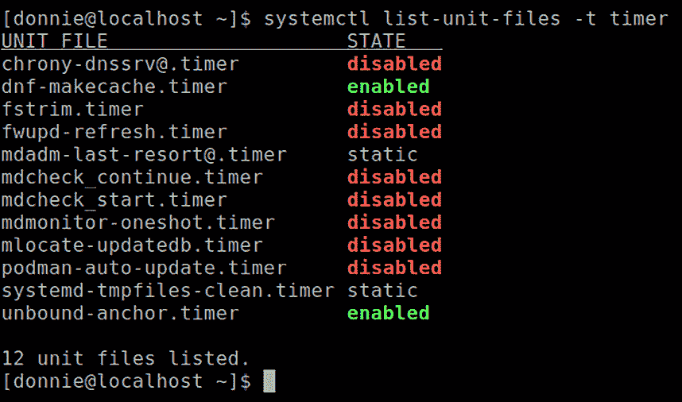
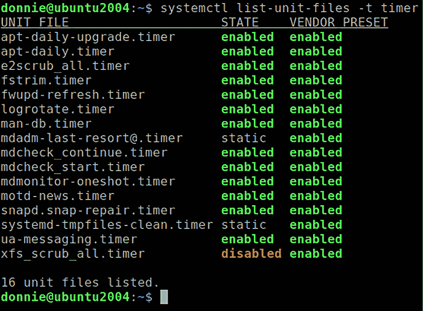
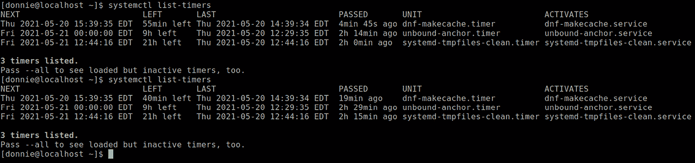

# *第七章*: 理解 systemd 定时器

繁忙的系统管理员喜欢找到方法简化他们的工作。一个方法是通过设置自动执行的计划来将尽可能多的日常任务自动化。在本章中，我们将学习如何使用 `systemd` 定时器来做到这一点。我们将探讨的具体主题包括以下内容：

+   将 `systemd` 定时器与 `cron` 进行比较

+   理解定时器选项

+   创建定时器

如果你准备好了，那我们就开始吧。

# 技术要求

一如既往，我们将使用 Ubuntu Server 20.04 虚拟机和 Alma Linux 8 虚拟机进行演示。所有内容都是动手操作，因此可以随时在你自己的虚拟机上跟着做。

查看以下链接以观看“代码实战”视频：[`bit.ly/31pQdfS`](https://bit.ly/31pQdfS)

# 将 `systemd` 定时器与 `cron` 进行比较

`cron` 调度工具家族自 1975 年 5 月以来便成为了 Unix 和类 Unix 操作系统的一部分。在 1980 年代，作为理查德·斯托曼（Richard Stallman）倡导的 *自由软件* 运动的一部分，几种自由软件版本的 `cron` 被创建。互联网名人堂成员**保罗·维克西**（Paul Vixie）于 1987 年创建了自己版本的 `cron`，该版本在 Linux 世界中成为了最广泛使用的版本。（实际上，如果你查看 `cron` 的手册页，你仍然可以在底部的 **Authors** 部分看到保罗·维克西的名字。）

`cron` 的一个大优点是它的极简性。创建一个 `cron` 作业所需要的仅仅是一行简单的代码，通常看起来像这样：


图 7.1 – 一个 cron 作业示例

在这个非常简单的示例中，我从我一台古老的 CentOS 6 虚拟机上拿到的，我在每小时的 25 分钟和 55 分钟运行一个简单的任务。每小时两次，这个 `cron` 作业会将一条消息插入到系统日志文件中。任何非特权用户只要需要，都可以创建 `cron` 作业来执行一些非特权任务，而拥有适当 root 权限的用户则可以创建系统级作业。作业可以设置为在一周中的特定日子、一个月中的特定日子、特定时间或重启机器时运行。这里有很多灵活性，而且一切都非常容易设置。

`cron` 的另一个优点是它在 Unix 和类 Unix 操作系统的世界中无处不在，而 `systemd` 仅存在于 Linux 世界中。如果你是一个管理着混合 Unix 和 Linux 服务器的大型系统管理员，你可能会发现继续使用 `cron` 更为方便。

设置 `systemd` 定时器并不难，但确实需要花费更多的时间和精力。首先，你不能直接从 `systemd` 定时器访问命令或脚本。你首先需要创建一个 `systemd` 服务，然后从定时器中调用该服务。然而，使用 `systemd` 定时器有很多优点，因此学习如何使用它们可能值得付出这些努力。

使用 `systemd` 定时器，你可以在设置任务调度时获得更多的灵活性和准确性。你为定时器创建的服务可以利用资源管理、安全性以及所有使用 `systemd` 时带来的好处。你可以创建在某个预定义事件发生时触发的定时器，或者可以指定你希望定时器触发的日历和时钟时间。作为额外的好处，`systemd` 会在系统日志文件中记录定时器事件的完成情况。而在使用 `cron` 任务时，你是没有这些功能的。

所以，你现在可能在想应该使用这两种任务调度系统中的哪一个。实际上，`cron` 仍然会预装在现代 Linux 系统上。如果你只是需要快速创建一个简单的任务，使用 `cron` 完全没有问题。但如果你需要设置一些更复杂的任务调度，那么一定要使用 `systemd` 定时器。即使你只需要做一些简单的事情，设置一个定时器也可能会让你更熟悉这个过程，值得一试。

好了，这部分介绍大概够了。接下来我们来看看如何查看你系统上 `systemd` 定时器的信息。

## 查看定时器信息

当你首次安装 Linux 操作系统时，会发现系统上已经有一些活跃的定时器来处理某些管理任务。你可以通过使用 `systemctl list-unit-files -t timer` 命令查看它们。在你的 Alma Linux 系统上，输出应该如下所示：



图 7.2 – Alma Linux 上的定时器

我们看到安装了 12 个定时器，但只有两个是启用的。两个是静态的，这意味着它们无法启用或禁用，其他的都被禁用了。

在 Ubuntu 服务器上，我们看到启用的定时器更多：



图 7.3 – Ubuntu 服务器上的定时器

`systemctl list-timers` 命令展示了六个信息字段，内容如下：



图 7.4 – systemctl list-timers

这六个字段分别是：

+   **下次运行时间**：这显示定时器下次预定的运行时间。

+   **剩余时间**：这显示定时器下次运行前剩余的时间。

+   **上次运行时间**：这显示定时器最后一次运行的时间。

+   **已过时间**：这显示自定时器最后一次运行以来已经过去的时间。

+   **单元**：这是定时器的单元文件名称。

+   **激活服务**：这是定时器运行的服务名称。通常它与定时器的名称相同，但不一定是。

你可以通过 `systemctl status` 查看一些信息，像这样：

```
[donnie@localhost ~]$ systemctl status dnf-makecache.timer
• dnf-makecache.timer - dnf makecache --timer
   Loaded: loaded (/usr/lib/systemd/system/dnf-makecache.timer; enabled; vendor preset: enabled)
   Active: active (waiting) since Thu 2021-05-20 12:29:35 EDT; 2h 55min ago
  Trigger: Thu 2021-05-20 15:39:35 EDT; 14min left
May 20 12:29:35 localhost.localdomain systemd[1]: Started dnf makecache --timer.
[donnie@localhost ~]$
```

就像你可以使用服务和目标一样，你也可以查看定时器的依赖树，方法如下：

```
[donnie@localhost ~]$ systemctl list-dependencies dnf-makecache.timer
dnf-makecache.timer
• ├─network-online.target
• │ └─NetworkManager-wait-online.service
• └─sysinit.target
•   ├─dev-hugepages.mount
•   ├─dev-mqueue.mount
•   ├─dracut-shutdown.service
•   ├─import-state.service
•   ├─iscsi-onboot.service
•   ├─kmod-static-nodes.service
•   ├─ldconfig.service
. . .
. . .
```

我们已经看到几种查看系统上定时器信息的方法。接下来，我们来看一些配置选项。

# 理解定时器选项

解释定时器选项的最佳方式是查看一些已经存在于我们系统中的定时器示例。我们将首先查看 Alma Linux 机器上的一个定时器。

## 理解单调定时器

有两种方法可以指定你希望服务自动运行的时间。在这一部分，我们将介绍*单调*方法。这意味着你不需要配置作业在特定的日历时间和时钟时间运行，而是配置作业在某种作为起始点的事件之后运行。起始点可以是系统启动、定时器激活、定时器关联服务上次运行后的时间，或者其他几种情况（你可以通过查看`systemd.timer`的手册页来查看所有单调起始点）。作为单调定时器的示例，我们来看看 Alma Linux 机器上的`dnf-makecache.timer`。

类似 Red Hat 的操作系统，如 Alma Linux，使用`dnf`工具进行更新和包管理。和所有 Linux 包管理系统一样，`dnf`维护一个关于发行版包仓库中内容的本地缓存。定期需要刷新缓存。我们可以手动执行`sudo dnf makecache`命令来实现，但 Red Hat 类系统都自带一个定时器来自动执行这一操作。以下是该定时器的样子：

```
[Unit]
Description=dnf makecache --timer
ConditionKernelCommandLine=!rd.live.image
# See comment in dnf-makecache.service
ConditionPathExists=!/run/ostree-booted
Wants=network-online.target
[Timer]
OnBootSec=10min
OnUnitInactiveSec=1h
Unit=dnf-makecache.service
[Install]
WantedBy=timers.target
```

在`[Unit]`部分，我们看到：

+   `ConditionKernelCommandLine=!rd.live.image`：如果机器是从某种实时媒体（例如实时 DVD）启动的，这条指令会阻止定时器运行。

+   `ConditionPathExists=!/run/ostree-booted`：该指令会查找`/run/ostree-booted`目录，如果该目录存在，定时器就不会运行。（根据`ostree`的手册页，你会使用`ostree`来管理不同版本的文件系统树。这些文件系统树是以只读方式挂载的，因此尝试更新它们的缓存效果不大。）

+   `Wants=network-online.target`：这会阻止定时器在网络服务可用之前运行。（你已经看到了一些使用`systemd`定时器可以做的事情，而这些是`cron`做不到的。）

接下来，我们看到`[Timer]`部分，其中有两个单调定时器设置的示例。正如我之前提到的，单调定时器是相对于某个起始点来定义的，而不是由日历和时钟时间来决定的：

+   `OnBootSec=10min`：正如我们稍后会看到的，这个定时器会激活`dnf-makecache.service`。这一行使得该服务在系统启动后 10 分钟运行。

+   `OnUnitInactiveSec=1h`：这一行表示定时器会在上次运行后的一个小时再次运行`dnf-makecache.service`。换句话说，这一行使得该服务大约每小时运行一次。

+   `Unit=dnf-makecache.service`：在这种情况下，这一行并不是必需的。默认情况下，定时器会激活与定时器同名的服务。只有在定时器激活一个与其名称不同的服务时，你才需要这行。不过，有些人喜欢在任何情况下都使用这个参数，这也是可以的。

    注释

    你可以在`systemd.timer`手册页中查看其余的单调定时器参数。

`[Install]`部分是相当标准的内容。我们看到的只是`WantedBy=timers.target`这一行，它使得定时器在`timers.target`启动时运行。

既然提到这个，我们不妨看看这个定时器启动的`dnf-makecache.service`：

```
[Unit]
Description=dnf makecache
ConditionPathExists=!/run/ostree-booted
After=network-online.target
[Service]
Type=oneshot
Nice=19
IOSchedulingClass=2
IOSchedulingPriority=7
Environment="ABRT_IGNORE_PYTHON=1"
ExecStart=/usr/bin/dnf makecache --timer
```

在`[Service]`部分，我们看到了一些在服务文件中没有见过的内容：

+   `Type=oneshot`：好了，实际上我们之前已经见过这个。这里我只是想说明，对于定时器调用的服务，需要使用`oneshot`类型。（当你仔细想想时，实际上是很有道理的。）

+   `Nice=19`：这会使服务以`19`的优先级运行，即以最低的优先级运行。（Nice 值的范围从`-20`到正`19`。虽然这看起来有点不符合直觉，但`-20`表示可以分配给进程的最高优先级，而正`19`表示最低优先级。）这个设置有助于防止该服务影响到可能更重要的其他进程。

+   `IOSchedulingClass=2`：这设置了我们想要使用的输入/输出调度程序方案类型。值为`2`意味着我们希望使用`best-effort`类型的调度类。（你可以在`systemd.exec`手册页中查看其他`IOSchedulingClass`类型。）

+   `IOSchedulingPriority=7`：`IOSchedulingPriority`的值范围从`0`到`7`，其中`0`是最高优先级，`7`是最低优先级。这是另一种避免该服务影响系统其他部分的方式。

+   `ExecStart=/usr/bin/dnf makecache --timer`：这里的`--timer`选项与`systemd`定时器无关。实际上，这是一个与`dnf`命令一起使用的选项。根据`dnf`手册，`--timer`使`dnf`更加关注资源使用，因此如果计算机正在使用电池电源时，它不会运行。它还会使`dnf makecache`命令在最近已经执行过时立即中止。

这个服务文件的`[Install]`部分因为缺失而显得尤为显眼。没有`[Install]`部分使得这是一个*静态*类型的服务，你不能启用它。相反，它会在`dnf-makecache.timer`激活时自动运行。

好的，以上就是这个例子的内容。接下来，我们将探讨指定任务运行时间的其他方式。

## 理解实时定时器

你可以使用*实时*定时器来在任何日历日期和任何时刻运行任务。对于我们第一个简单的例子，我们来看看 Alma 机器上的`fstrim.timer`：

```
[Unit]
Description=Discard unused blocks once a week
Documentation=man:fstrim
[Timer]
OnCalendar=weekly
AccuracySec=1h
Persistent=true
[Install]
WantedBy=timers.target
```

下面是详细解释：

+   `OnCalendar=weekly`：你将使用`OnCalendar`参数来指定你希望任务运行的时间。将该任务设置为每周运行意味着它将在每周一的午夜运行。（稍后我们会看到这些参数是在哪里定义的。）

+   `AccuracySec=1h`：这定义了任务允许延迟的时间。一小时的延迟意味着这个任务可能在周一凌晨到一点之间的任何时候运行。如果你省略这一行，默认的延迟时间为一分钟。如果你希望任务准确地在周一午夜运行，可以将`1h`改为`1us`，这将提供最高精度。

+   `Persistent=true`：那么，如果你的机器在周一凌晨关机，会发生什么呢？没有这一行的话，这个任务将被跳过。有了这一行，当你下次启动机器时，任务将会运行。

如你所见，这个计时器中没有`Unit=`行，正如我们在之前的例子中看到的那样。所以，默认情况下，这个`fstrim.timer`将激活`fstrim.service`，它会清理存储驱动器上未使用的块。以下是服务的样子：

```
[Unit]
Description=Discard unused blocks
[Service]
Type=oneshot
ExecStart=/usr/sbin/fstrim -av
```

好的，这里没有什么新内容。它只是一个标准的静态`oneshot`类型服务，就像我们在之前的例子中看到的那样。

在 Alma 机器上，默认情况下`fstrim.timer`是禁用的，正如我们所看到的那样：

```
[donnie@localhost ~]$ systemctl is-enabled fstrim.timer
disabled
[donnie@localhost ~]$
```

如果你正在使用固态硬盘或精简配置的存储，`fstrim.timer`非常有用。如果需要启用该计时器，只需像启用服务一样进行操作，示例如下：

```
[donnie@localhost ~]$ sudo systemctl enable --now fstrim.timer
[sudo] password for donnie: 
Created symlink /etc/systemd/system/timers.target.wants/fstrim.timer → /usr/lib/systemd/system/fstrim.timer.
[donnie@localhost ~]$
```

在 Ubuntu 机器上，你会看到`fstrim.timer`默认是启用的：

```
donnie@ubuntu2004:~$ systemctl is-enabled fstrim.timer
enabled
donnie@ubuntu2004:~$
```

接下来，我们来仔细看看如何定义`OnCalendar`的时间。

## 理解实时计时器的日历事件

好的，事情可能会变得有点复杂。我的意思是，配置`cron`任务的时间是简单直接的。理解如何为`systemd`计时器设置时间则需要一些时间来适应。最好的办法是打开`systemd.time`的手册页面，滚动到**CALENDAR EVENTS**部分。那里的解释可能不够清晰，但你基本可以通过查看示例来理解。让我们看看能否弄清楚其中的含义。

在我们刚刚查看的`fstrim.timer`例子中，我们看到`OnCalendar=weekly`行，这使得任务每周一凌晨运行。在`systemd.time`的手册页面中，你将看到所有预定义事件时间的完整列表：

```
minutely → *-*-* *:*:00
hourly → *-*-* *:00:00
daily → *-*-* 00:00:00
monthly → *-*-01 00:00:00
weekly → Mon *-*-* 00:00:00
yearly → *-01-01 00:00:00
quarterly → *-01,04,07,10-01 00:00:00
semiannually → *-01,07-01 00:00:00
```

其中大部分很容易理解。唯一可能让你有些困惑的是`quarterly`和`semiannually`。`quarterly`任务将在每年 1 月、4 月、7 月和 10 月的第一天午夜运行，如`01,04,07,10`部分所示。`semiannually`任务将在每年 1 月和 7 月的第一天午夜运行，如`01,07`部分所示。

向下滚动`systemd.time`页面，你会看到一大堆关于如何设置任务时间的例子。与其尝试展示整个列表，我只会给你一个例子，然后为你逐一解释。来看看：

```
2003-03-05 → 2003-03-05 00:00:00
```

左侧显示的是日期和时间，像人类通常写的那样。右侧显示的是你将用作`OnCalendar=`参数的值。我选择这个例子是因为它用了所有的字段。（是的，我知道 2003 年已经过去，但这就是 man 页面里的内容。）要创建一个任务，使其在 2003 年 3 月 3 日的午夜运行，`OnCalendar=`行应如下所示：

```
OnCalendar=2003-03-05 00:00:00
```

由于这是几年前的设置，让我们修正它，让任务在未来运行：

```
OnCalendar=2525-03-05 00:00:00
```

啊，是的。*在 2525 年，如果人类仍然活着，如果女性还能存活……*（除了我，谁还记得那首傻歌？）

说真的，这并不像最初看起来那么难。我们有`Year-Month-Date`，然后是 24 小时格式的`Hour:Minute:Second`。所以，实际上，这非常简单。现在，假设我们希望任务每天晚上 6:15 运行。我们只需用标准的通配符符号（ `*` ）替换`Year-Month-Date`字段，并更改时间：

```
OnCalendar=*-*-* 18:15:00
```

这不错，但我改变了主意，不想每天都运行。我想我会改成每月的第五天运行，就像这样：

```
OnCalendar=*-*-05 18:15:00
```

不，还是不够频繁。让我们让任务在每月的第五、第十和第十五天运行：

```
OnCalendar=*-*-05,10,15 18:15:00
```

`Day-of-Week`字段是可选的。让我们让任务在每月的第五、第十和第十五天运行，但只有在这些日子恰好是周一或周三时才运行：

```
OnCalendar=Mon,Wed *-*-05,10,15 18:15:00
```

更好的是，我们就让它每周一和周三运行：

```
OnCalendar=Mon,Wed *-*-* 18:15:00
```

你可以使用波浪号（ `~` ）符号来表示从每个月的最后一天起回溯指定的天数。如果你希望任务在每年二月的倒数第三天运行，只需要这样做：

```
OnCalendar=*-02~03 18:15:00
```

现在，让我们让任务在每年五月的最后一个周一运行：

```
OnCalendar=Mon *-05~07/1 18:15:00
```

最后，让我们更疯狂一些，让任务每十分钟运行一次：

```
OnCalendar=*:00/10
```

好的，这些应该足够给你一个线索。如果你需要查看更多例子，只需查看`systemd.time`的 man 页面。

# 创建定时器

创建你自己的定时器是一个两阶段的过程。你首先创建你想要运行的服务，然后创建并启用定时器。

## 创建系统级定时器

假设你是一个注重安全的人，怀疑有人可能会试图在你的机器上植入 rootkit。你想设置 Rootkit Hunter，每天在工作时间结束后运行一次。

注：

我想用 Ubuntu 和 Alma Linux 都试试。不幸的是，Ubuntu 的 Rootkit Hunter 包存在一个 bug，导致 Rootkit Hunter 无法更新其签名数据库。这也不太令人惊讶，因为 Ubuntu 的质量控制一直不算完美。所以，在这个例子中，我们就选择 Alma 来演示。

由于 Ubuntu 中的 Rootkit Hunter 包存在 bug，我们将在 Alma 机器上执行此操作。Rootkit Hunter 不在常规的 Alma 软件源中，因此你首先需要安装 EPEL 软件源，方法如下：

```
sudo dnf install epel-release
sudo dnf update
sudo dnf install rkhunter
```

通过执行以下命令创建`rkhunter.service`文件：

```
sudo systemctl edit --full --force rkhunter.service
```

使文件看起来像这样：

```
[Unit]
Description=Rootkit Hunter
[Service]
Type=oneshot
ExecStartPre=/usr/bin/rkhunter --propupd
ExecStartPre=/usr/bin/rkhunter --update
ExecStart=/usr/bin/rkhunter -c --cronjob --rwo
```

在实际扫描之前，我们需要创建`rkhunter.dat`文件，用于存储文件属性并更新 rootkit 签名数据库。我们将通过两个`ExecStartPre=`行来完成。`ExecStart=`行中有三个选项，如下所示：

+   `-c`：这是*检查*选项，执行实际的扫描。

+   `--cronjob`：通常，Rootkit Hunter 在扫描过程中会暂停几次并等待用户输入。此选项会让 Rootkit Hunter 在不暂停的情况下完成扫描。

+   `--rwo`：这个选项让 Rootkit Hunter 只报告它找到的任何问题。

在创建定时器之前，最好先手动启动服务，以验证它是否正常工作。我们将使用以下命令进行验证：

```
[donnie@localhost ~]$ sudo systemctl start rkhunter
```

运行完成后，查看`/var/log/rkhunter/rkhunter.log`文件，验证是否存在任何问题。如果一切正常，我们就准备创建定时器。可以使用以下命令：

```
[donnie@localhost ~]$ sudo systemctl edit --full --force rkhunter.timer
```

为了演示，设置`OnCalendar=`时间为未来几分钟。这样，你就不需要等待太久它就能运行。完成后，文件应如下所示：

```
[Unit]
Description=Rootkit Hunter
[Timer]
OnCalendar=*-*-* 17:50:00
Persistent=true
[Install]
WantedBy=timer.target
```

执行`daemon-reload`，然后启用定时器：

```
[donnie@localhost ~]$ sudo systemctl daemon-reload
[donnie@localhost ~]$ sudo systemctl enable --now rkhunter.timer
Created symlink /etc/systemd/system/timer.target.wants/rkhunter.timer → /etc/systemd/system/rkhunter.timer.
[donnie@localhost ~]$
```

现在只需要等待定时器运行，看看它是否能正常工作。运行完成后，你可以在`/var/log/rkhunter/rkhunter.log`文件中查看结果。

接下来，让我们允许一个普通的非特权用户创建一个定时器。

## 创建一个用户级别的定时器

你可以在 Ubuntu 或 Alma 虚拟机上尝试此演示。我已经有一段时间没有使用 Ubuntu 机器了，所以我选择使用它。

假设你是一个普通用户，想要将你的主目录备份到便捷的移动硬盘上。你将把它插入电脑的 USB 端口，系统会自动将其挂载到`/media/backup/`目录下。

注意

如果你没有便携式备份硬盘，可以通过手动创建备份目录并设置权限，使普通用户能够写入目录，像这样：

**sudo mkdir /media/backup**

**sudo chmod 777 /media/backup**

现在，只需创建服务和定时器。任何非特权用户都可以通过使用`--user`选项来完成这一操作。

和之前一样，我们从创建服务开始，像这样：

```
donnie@ubuntu2004:~$ systemctl edit --user --full --force backup.service
```

这将自动在`/home/donnie/.config/`目录下创建必要的文件和目录。我将使用`rsync`来做备份，所以我的`backup.service`文件将如下所示：

```
[Unit]
Description=Backup my home directory
[Service]
Type=oneshot
ExecStart=/usr/bin/rsync -a /home/donnie /media/backup
```

我想确保这个可以正常工作，所以我会先执行`daemon-reload`，然后手动运行服务，确保没问题后再创建定时器：

```
donnie@ubuntu2004:~$ systemctl daemon-reload --user
donnie@ubuntu2004:~$ systemctl start --user backup.service
donnie@ubuntu2004:~$
```

如果运行成功，我应该会在`/media/backup/`目录下看到`donnie/`目录：

```
donnie@ubuntu2004:~$ ls -l /media/backup/
total 20
drwxr-xr-x 6 donnie donnie  4096 May 21 15:58 donnie
drwx------ 2 root   root   16384 May 22 15:34 lost+found
donnie@ubuntu2004:~$
```

到目前为止，一切顺利。让我们看看`donnie/`目录里有什么：

```
donnie@ubuntu2004:~$ ls -la /media/backup/donnie/
total 44
drwxr-xr-x 6 donnie donnie 4096 May 21 15:58 .
drwxrwxrwx 4 root   root   4096 May 22 15:49 ..
-rw------- 1 donnie donnie 3242 May 21 22:07 .bash_history
-rw-r--r-- 1 donnie donnie  220 Feb 25  2020 .bash_logout
-rw-r--r-- 1 donnie donnie 3771 Feb 25  2020 .bashrc
drwx------ 2 donnie donnie 4096 Jan  6 01:47 .cache
drwxr-xr-x 4 donnie donnie 4096 May 21 20:30 .config
-rw------- 1 donnie donnie  263 Apr  3 19:00 .lesshst
drwxrwxr-x 3 donnie donnie 4096 May 21 15:58 .local
-rw-r--r-- 1 donnie donnie  807 Feb 25  2020 .profile
-rw-r--r-- 1 donnie donnie    0 Jan  6 01:47 .sudo_as_admin_successful
drwxr-xr-x 3 donnie donnie 4096 Jan  6 01:56 snap
donnie@ubuntu2004:~$
```

很好。备份服务已启动，我也达到了预期效果。现在，是时候创建定时器了：

```
donnie@ubuntu2004:~$ systemctl edit --user --full --force backup.timer
```

我只需要让它每天午夜运行，所以我会这样设置：

```
[Unit]
Description=Back up my home directory
[Timer]
OnCalendar=daily
Persistent=true
[Install]
WantedBy=timer.target default.target
```

当然，如果你不想等到午夜再检查是否有效，只需将`OnCalendar=`时间设置为你想要的任何时间。

请注意，当我们使用`--user`选项时，需要在`WantedBy=`行中有`default.target`。

接下来，我将执行`daemon-reload`并启用定时器：

```
donnie@ubuntu2004:~$ systemctl daemon-reload --user
donnie@ubuntu2004:~$ systemctl enable --user --now backup.timer
Created symlink /home/donnie/.config/systemd/user/timer.target.wants/backup.timer → /home/donnie/.config/systemd/user/backup.timer.
Created symlink /home/donnie/.config/systemd/user/default.target.wants/backup.timer → /home/donnie/.config/systemd/user/backup.timer.
donnie@ubuntu2004:~$
```

我还可以使用`--user`选项查看有关该定时器的信息：

```
donnie@ubuntu2004:~$ systemctl list-timers --user
NEXT                        LEFT    LAST                        PASSED    UNIT         ACTIVATES     
Sun 2021-05-23 00:00:00 UTC 7h left Sat 2021-05-22 15:47:05 UTC 41min ago backup.timer backup.service
1 timers listed.
Pass --all to see loaded but inactive timers, too.
donnie@ubuntu2004:~$
```

目前来看，这个定时器只会在我登录到系统时运行。为了确保即使我未登录时它也能运行，我将为自己启用`linger`功能：

```
donnie@ubuntu2004:~$ loginctl enable-linger donnie
donnie@ubuntu2004:~$
```

好的，我想这一章就到此为止了。我们来总结一下。

# 总结

在这一章中，我们探讨了`systemd`定时器，并将其与传统的`cron`系统进行了比较。我们查看了不同的定时器选项以及指定定时器运行时间的不同方式。最后，我们还了解了如何为系统级和用户级任务创建定时器。

在下一章中，我们将简要了解`systemd`下的启动过程。我在那儿见。

# 问题

1.  `cron`和`systemd`定时器有什么不同？

    a. 设置`systemd`定时器要简单得多。

    b. 非特权用户可以设置自己的`cron`任务，但无法设置自己的定时器。

    c. `cron`任务可以直接运行命令或脚本，但`systemd`定时器只能运行关联的服务。

    d. 非特权用户可以设置自己的`systemd`定时器，但无法设置自己的`cron`任务。

1.  什么时候作业会运行的两种指定方式是什么？（选择两个）

    a. 单调时间

    b. 实时钟

    c. 日历时间

    d. 实时

1.  以下哪个 man 页面会告诉你如何格式化`OnCalendar=`参数的时间？

    a. `systemd.time`

    b. `systemd.timer`

    c. `systemd.unit`

    d. `systemd.exec`

1.  以下哪种时间配置等同于每月设置？

    a. `*-01-01 00:00:00`

    b. `*-*-* 00:00:00`

    c. `*-*-01 00:00:00`

    d. `*-01-01 00:00:00`

# 答案

1.  c

1.  a, d

1.  a

1.  c

# 进一步阅读

+   比较`systemd`定时器与`cron`：

    [`trstringer.com/systemd-timer-vs-cronjob/`](https://trstringer.com/systemd-timer-vs-cronjob/)

    [`medium.com/horrible-hacks/using-systemd-as-a-better-cron-a4023eea996d`](https://medium.com/horrible-hacks/using-systemd-as-a-better-cron-a4023eea996d)

+   使用`systemd`定时器与 Docker 结合：

    [`matthiasadler.info/blog/running-scheduled-tasks-in-docker-containers-with-systemd/`](https://matthiasadler.info/blog/running-scheduled-tasks-in-docker-containers-with-systemd/)

)

+   使用`systemd`定时器作为`cron`替代：

    [`www.maketecheasier.com/use-systemd-timers-as-cron-replacement/`](https://www.maketecheasier.com/use-systemd-timers-as-cron-replacement/)

)
