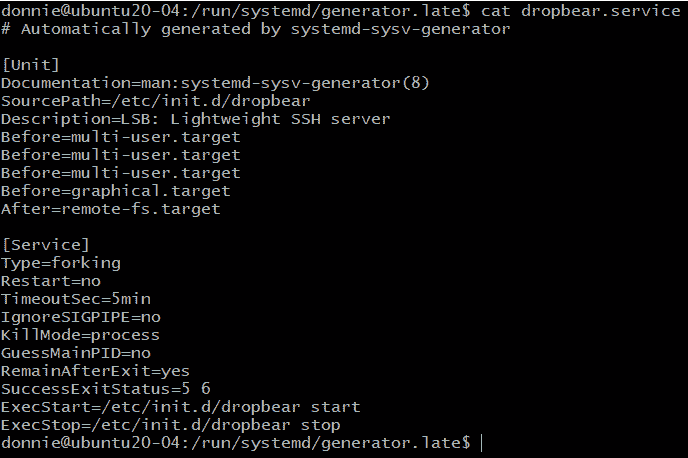

# *第八章*：理解 systemd 启动过程

在本章中，我们将简要了解`systemd`的启动过程。你可能觉得这有些枯燥，但我可以向你保证，它并不会。我的目标是给你提供一些实用信息，使得启动过程更高效，而不是让你经历一段枯燥无味的启动过程。之后，我还将展示一些`systemd`如何在一定程度上与传统的**System V** (**SysV**) 兼容。本章的具体内容包括以下几部分：

+   比较 SysV 启动和`systemd`启动

+   分析启动性能

+   Ubuntu Server 20.04 上的一些差异

+   理解`systemd`生成器

请注意，本章不会讨论引导程序，因为我们会留到后面再讲。

好了——如果你准备好了，我们就开始吧。

# 技术要求

技术要求和以往一样——只需启动一个 Ubuntu 和一个 Alma **虚拟机** (**VM**)，这样你就可以跟着操作。

请查看以下链接，观看《代码实战》视频：[`bit.ly/3phdZ6o`](https://bit.ly/3phdZ6o)

# 比较 SysV 启动和 systemd 启动

不管运行哪个操作系统，计算机的启动过程基本上都是一样的。你打开电源开关，然后进入机器的`systemd`启动序列。

## 理解 SysV 和 systemd 启动过程的相似性

一旦机器能够访问到机器硬盘的 MBR，操作系统就开始加载。在`/boot/`目录中，你会看到一个压缩的 Linux 内核文件，文件名通常包含`vmlinuz`。你还会看到文件名中有`initramfs`或`initrd`。该过程的第一步是将 Linux 内核镜像解压并加载到系统内存中。在此阶段，内核仍然无法访问根文件系统，因为它无法访问所需的驱动程序。这些驱动程序位于初始 RAM 磁盘镜像中。所以，下一步是加载这个初始 RAM 磁盘镜像，它将建立一个内核可以访问的临时根文件系统。一旦内核加载了适当的驱动程序，镜像将被卸载。启动过程接着继续，访问机器根文件系统中的所需内容。

接下来，情况就不同了。为了展示如何不同，让我们快速浏览一下 SysV 启动过程。

## 理解 SysV 启动过程

我不会深入探讨 SysV 启动过程的细节，因为没有必要。我只想给你提供足够的信息，让你能理解它与`systemd`启动的不同之处。

`init` 进程（始终为 `PID 1`）是第一个启动的进程。这个 `init` 进程将通过一系列复杂的、盘根错节的 bash 脚本来控制其余的启动过程，这些脚本位于 `/etc/` 目录下。在某个时刻，`init` 进程将从 `/etc/inittab` 文件中获取关于默认运行级别的信息。一旦基本系统初始化完成，系统服务将根据默认运行级别启用的内容，从 `/etc/init.d/` 目录下的 bash 脚本启动。

在 SysV 机器上，启动过程可能相当慢，因为所有服务都是串行启动的——换句话说，SysV 在启动时一次只能启动一个服务。当然，我可能把 SysV 描述得比实际情况更糟糕了。尽管按今天的标准它已经过时，但在其时代，它确实能很好地与当时的硬件配合工作。我的意思是，当你谈论的是一台配备单核 750 **兆赫** (**MHz**) Pentium III 处理器和 512 **兆字节** (**MB**) 内存的服务器时，反正没有太多办法能加快它的速度。（我现在还收藏着几台这样的旧机器，但已经很久没启动过它们了。）

正如我所说的，这只是一次快速的概览。就我们当前的目的来说，这就是你需要了解的关于 SysV 启动的所有内容。接下来，让我们跳过这个话题，看看 `systemd` 启动过程是如何工作的。

## 理解 systemd 启动过程

在 `systemd` 中，`systemd` 进程是第一个启动的进程。它也以 `PID 1` 运行，就像我们在 Alma 机器上看到的那样：

```
[donnie@localhost ~]$ ps aux
USER         PID %CPU %MEM    VSZ   RSS TTY      STAT START   TIME COMMAND
root           1  1.9  0.8 186956 15088 ?        Ss   14:18   0:07 /usr/lib/systemd/systemd --switched-root --system --deserialize 17
. . .
. . .
```

奇怪的是，在 Ubuntu 机器上，`PID 1` 仍然显示为 `init` 进程，就像我们在这里看到的那样：

```
donnie@ubuntu20-04:~$ ps aux
USER         PID %CPU %MEM    VSZ   RSS TTY      STAT START   TIME COMMAND
root           1  1.2  0.5 101924 11308 ?        Ss   18:26   0:04 /sbin/init maybe-ubiquity
. . .
. . .
```

这是因为 Ubuntu 开发者出于某种奇怪的原因，创建了一个指向 `systemd` 可执行文件的 `init` 符号链接，正如我们在这里看到的：

```
donnie@ubuntu20-04:~$ cd /sbin
donnie@ubuntu20-04:/sbin$ ls -l init
lrwxrwxrwx 1 root root 20 Mar 17 21:36 init -> /lib/systemd/systemd
donnie@ubuntu20-04:/sbin$
```

我不知道为什么 Ubuntu 开发者认为有必要这样做。不过它确实能工作，所以没问题。

与运行复杂的 bash 脚本初始化系统不同，`systemd` 运行目标（targets）。它首先查看 `default.target` 文件，检查它是设置为 `graphical` 还是 `multi-user`。正如我在 *第六章* 中提到的，*理解 systemd 目标*，依赖关系链从默认目标开始并向后延伸。假设我们的机器将图形目标设为默认。在 `graphical.target` 文件中，我们会看到以下一行：

```
Requires=multi-user.target
```

这意味着图形目标必须等到多用户目标启动后才能启动。在 `multi-user.target` 文件中，我们看到这一行：

```
Requires=basic.target
```

现在，如果我们继续追溯这个链条的起源，我们会发现基本目标 *Requires* `sysinit.target` 文件，而该文件又 *Wants* `local-fs.target` 文件，后者会在 `local-fs-pre.target` 文件之后启动。

那么，这一切到底意味着什么呢？实际上，一旦`systemd`进程确定了默认目标，它会按照以下顺序加载启动目标：

1.  `local-fs-pre.target`

1.  `local-fs.target`

1.  `sysinit.target`

1.  `basic.target`

1.  `multi-user.target`

1.  `graphical.target`（如果启用了的话）

好的—我知道了。你现在可能在喊：*但是 Donnie，你说过 systemd 是并行启动进程，而不是按顺序启动的。* 的确，`systemd`会并行启动它的启动进程。记住我之前告诉过你的，目标是一个*集合*，由其他`systemd`单元组成，目的是为了特定的功能。在每个目标内，进程是并行启动的。

注意

你可以在`bootup`手册页上看到这个启动链的图形化表示。

我之前也提到过，其中一些目标是硬编码到`systemd`可执行文件中的。这意味着其中一些目标没有自己的`.target`文件，而其他的则有`.target`文件，似乎没有任何作用。有几种方法可以查看这些硬编码目标的情况。第一种方法是使用`systemctl list-dependencies`查看目标。以下是查看`local-fs.target`文件时的输出：

```
[donnie@localhost ~]$ systemctl list-dependencies local-fs.target
local-fs.target
  ├─-.mount
  ├─boot.mount
  ├─ostree-remount.service
  └─systemd-remount-fs.service
[donnie@localhost ~]$
```

这个目标启动了挂载文件系统的服务。我们看到它挂载了`boot`分区，表示为`boot.mount`。然后它挂载了`root`文件系统，表示为`-.mount`。

我之前向你展示过如何查看硬编码到`systemd`可执行文件中的目标列表。我们也可以查找仅针对某个目标的特定信息。以下是查看`local-fs.target`文件的方式：

```
[donnie@localhost systemd]$ strings /lib/systemd/systemd | grep -A 100 'local-fs.target'
local-fs.target
options
fstype
Failed to parse /proc/self/mountinfo: %m
Failed to get next entry from /proc/self/mountinfo: %m
. . .
. . .
mount_process_proc_self_mountinfo
mount_dispatch_io
mount_enumerate
mount_enumerate
mount_shutdown
[donnie@localhost systemd]$
```

默认情况下，`grep`只会显示它找到搜索词的行。`-A`选项使它显示搜索词所在行后指定数量的行。我这里使用的`-A 100`选项告诉`grep`显示`local-fs.target`所在行后面的 100 行。虽然我们看不到具体的程序代码，但嵌入的文本字符串能让我们大致了解发生了什么。我的 100 行选择完全是随意的，但你可以根据需要增加行数，直到看到与挂载文件系统无关的行。

获取这些硬编码目标的第三种方式是查看`bootup`和`systemd.special`的手册页。虽然这两个手册页没有提供太多细节，但你仍然可以从中学到一些东西。

现在，问题解决后，我们来看一下如何分析启动问题。

# 分析启动性能

假设你的服务器启动时间比预期的要长，你想知道为什么。幸运的是，`systemd`附带了内置的`systemd-analyze`工具，可以帮助你。

让我们从这里开始，看看我的 AlmaLinux 机器启动 GNOME 3 桌面的时间：

```
[donnie@localhost ~]$ systemd-analyze
Startup finished in 2.397s (kernel) + 19.023s (initrd) + 1min 26.269s (userspace) = 1min 47.690s
graphical.target reached after 1min 25.920s in userspace
[donnie@localhost ~]$
```

如果你没有指定选项，`systemd-analyze`将默认使用`time`选项。（你如果真的想，也可以输入`systemd-analyze time`，但你会看到与这里相同的结果。）输出的第一行显示了内核、初始 RAM 磁盘镜像和用户空间加载所需的时间。第二行显示了图形目标启动所需的时间。实际上，整体启动时间看起来并不算太差，特别是考虑到我用来运行这个虚拟机的主机的年代。（这台主机大约是 2009 年左右的戴尔，搭载的是一颗老式的 Core 2 Quad **中央处理器**（**CPU**）。）如果我在一台较新的主机上运行这个虚拟机，或者直接在裸机上运行 Alma，启动时间可能会稍微快一点。还有一个因素是，这个虚拟机运行的是资源消耗较大的 GNOME 3 桌面环境。我个人更喜欢轻量级的桌面环境，可能会稍微缩短启动时间。不幸的是，**Red Hat Enterprise Linux 8**（**RHEL 8**）及其所有免费的子版本仅提供 GNOME 3 桌面环境。（如果你安装了第三方的**Extra Packages for Enterprise Linux**（**EPEL**）库，确实可以安装轻量级的**XForms Common Environment**（**XFCE**）桌面，但这超出了本书的范围。）

现在，假设这台机器的启动过程确实太慢了，如果可能的话你想加速它。首先，我们使用`blame`选项来查看我们要*责怪*谁：

```
[donnie@localhost ~]$ systemd-analyze blame
     1min 4.543s plymouth-quit-wait.service
         58.883s kdump.service
         32.153s wordpress-container.service
         32.102s wordpress2-container.service
         18.200s systemd-udev-settle.service
         14.690s dracut-initqueue.service
         13.748s sssd.service
         12.638s lvm2-monitor.service
         10.781s NetworkManager-wait-online.service
         10.156s tuned.service
          9.504s firewalld.service
. . .
. . .
```

这个`blame`选项会显示在启动过程中所有已启动的服务，以及每个服务启动所需的时间。服务按启动所需时间的降序排列。查看整个列表，看看是否有你可以安全禁用的服务。例如，在列表的下方，你会看到`wpa_supplicant.service`正在运行，正如我在这里所示：

```
[donnie@localhost ~]$ systemd-analyze blame | grep 'wpa_supplicant'
           710ms wpa_supplicant.service
[donnie@localhost ~]$
```

如果你使用的是桌面计算机或笔记本电脑，并且可能需要使用无线适配器，这样做是很好的，但如果是在没有无线功能的服务器上，则没有必要。因此，你可以考虑禁用这个服务。（当然，这个服务启动只用了 710 **毫秒**（**ms**），但这仍然是个时间。）

注意

禁用不必要的服务对性能和安全性都有好处。一个一直存在的安全基本原则是，你应该始终最小化系统上运行的服务数量。这可以减少潜在攻击者的攻击路径。

如果你想查看每个目标在启动过程中花了多长时间，可以使用`critical-chain`选项，如下所示：

```
[donnie@localhost ~]$ systemd-analyze critical-chain
The time after the unit is active or started is printed after the "@" character.
The time the unit takes to start is printed after the "+" character.
graphical.target @2min 1.450s
. . .
. . .
                    └─local-fs-pre.target @26.988s
                      └─lvm2-monitor.service @4.022s +12.638s
                                              └─dm-event.socket @3.973s
                                                └─-.mount
                                                  └─system.slice
                                                    └─-.slice
[donnie@localhost ~]$
```

由于格式原因，我只能向你展示输出的一个小部分，所以请自己尝试一下，看看完整的输出内容。

这些命令在 Ubuntu 机器上与在 Alma 机器上执行时相同，但在 Ubuntu Server 20.04 上默认目标的设置有所不同。让我们来看一下。

# Ubuntu Server 20.04 的一些差异

我的 Ubuntu Server 20.04 机器，完全以文本模式运行，启动速度明显更快，正如你在这里看到的：

```
donnie@ubuntu20-04:~$ systemd-analyze
Startup finished in 8.588s (kernel) + 44.944s (userspace) = 53.532s
graphical.target reached after 38.913s in userspace
donnie@ubuntu20-04:~$
```

我必须承认，自从 Ubuntu Server 20.04 发布以来，我并没有使用太多，我仍然会遇到一些让我惊讶的新特性。在为本章配置虚拟机之前，我从未注意到 Ubuntu Server 20.04 默认使用 `graphical.target`，尽管没有安装图形界面。解释是，`accounts-daemon.service` 文件是由图形目标启动的，而不是由多用户目标启动的，正如我们在这里看到的：

```
donnie@ubuntu20-04:/etc/systemd/system/graphical.target.wants$ ls -l
total 0
lrwxrwxrwx 1 root 43 Feb  1 17:27 accounts-daemon.service -> /lib/systemd/system/accounts-daemon.service
donnie@ubuntu20-04:/etc/systemd/system/graphical.target.wants$
```

如果你查看 `graphical.target` 文件，你会看到它只*想要* `display-manager.service` 文件，而不是*要求*它，正如这行所示：

```
Wants=display-manager.service
```

所以，即使该虚拟机上没有显示管理器，它仍然能够顺利进入 `graphical.target`。但让我们回到那个 `accounts-daemon.service` 文件。它到底是什么呢？根据 [`www.freedesktop.org/wiki/Software/AccountsService/`](https://www.freedesktop.org/wiki/Software/AccountsService/) 上的官方文档，"*AccountsService 是一个 D-Bus 服务，用于访问用户账户及与这些账户相关的信息。*" 是的，我知道——这并不是一个很好的解释。更好的解释是，它是一个服务，允许你通过 **图形用户界面**（**GUI**）类型的工具来管理用户和用户账户。那么，为什么在没有图形界面的情况下，我们会在 Ubuntu Server 上启用它呢？这是个好问题，我没有一个很好的答案。这不是我们需要在文本模式服务器上运行的东西。不过，没关系，我们马上就会处理这个问题。

那么，D-Bus 到底是什么？

`accounts-daemon.service` 文件是一个服务，旨在通过 D-Bus 消息启动。我们可以在 `accounts-daemon.service` 文件的 `[Service]` 部分的 `Type=dbus` 行中看到这一点：

```
[Service]
Type=dbus
BusName=org.freedesktop.Accounts
ExecStart=/usr/lib/accountsservice/accounts-daemon
Environment=GVFS_DISABLE_FUSE=1
Environment=GIO_USE_VFS=local
Environment=GVFS_REMOTE_VOLUME_MONITOR_IGNORE=1
```

然而，我们在 `[Install]` 部分看到，出于性能原因，我们仍然会在启动过程中启动这个服务：

```
[Install]
# We pull this in by graphical.target instead of waiting for the bus
# activation, to speed things up a little: gdm uses this anyway so it is nice
# if it is already around when gdm wants to use it and doesn't have to wait for
# it.
WantedBy=graphical.target
```

（这里提到的 `gdm` 代表 **GNOME 显示管理器**，它负责具有 GNOME 3 桌面系统的用户登录操作。）

如我之前所说，我们不需要在文本模式服务器上运行这个 `accounts-daemon.service` 文件。所以，让我们将这个 Ubuntu 机器的 `default.target` 文件设置为 `multi-user`，这将阻止 `accounts-daemon.service` 文件在我们启动机器时自动启动。你可能记得，这是执行该操作的命令：

```
donnie@ubuntu20-04:~$ sudo systemctl set-default multi-user
```

现在，当你重新启动机器时，你应该会发现它启动得更快。万一`accounts-daemon.service`被需要，D-Bus 消息会启动它。

出于好奇，我创建了一个没有 GNOME 桌面的全新 AlmaLinux 虚拟机，看看它是否也会默认使用`graphical.target`。结果发现没有 GNOME 的 Alma 默认使用`multi-user.target`，并且甚至没有安装`AccountsService`包。（因此，没有 GUI 类型的用户管理工具，`accounts-daemon.service`文件甚至不需要。）

接下来，让我们用`systemd`生成器*激发*一些真正的兴奋。

# 理解 systemd 生成器

`systemd`生成器可以让忙碌的管理员的工作变得更轻松，还能提供与传统 SysV 的向后兼容性。我们首先来看看生成器如何简化磁盘和分区配置。

## 理解挂载单元

查看任一虚拟机的`/lib/systemd/system/`目录，你会看到在安装操作系统时创建的几个挂载单元文件，下面是这台 Alma 机器的示例：

```
[donnie@localhost system]$ ls -l *.mount
-rw-r--r--. 1 root 750 Jun 22  2018 dev-hugepages.mount
-rw-r--r--. 1 root 665 Jun 22  2018 dev-mqueue.mount
-rw-r--r--. 1 root 655 Jun 22  2018 proc-sys-fs-binfmt_misc.mount
-rw-r--r--. 1 root root 795 Jun 22  2018 sys-fs-fuse-connections.mount
-rw-r--r--. 1 root root 767 Jun 22  2018 sys-kernel-config.mount
-rw-r--r--. 1 root root 710 Jun 22  2018 sys-kernel-debug.mount
-rw-r--r--. 1 root root 782 May 20 08:24 tmp.mount
[donnie@localhost system]$
```

除了`tmp.mount`文件外，所有这些挂载单元都是内核功能，与我们想要挂载的磁盘和分区无关。与 Ubuntu 不同，Alma 将`/tmp/`目录挂载在自己的分区上，这也是为什么在 Ubuntu 机器上看不到`tmp.mount`文件的原因。让我们瞥一眼`tmp.mount`文件，看看里面有什么。这里是`[Unit]`部分：

```
[Unit]
Description=Temporary Directory (/tmp)
Documentation=man:hier(7)
Documentation=https://www.freedesktop.org/wiki/Software/systemd/APIFileSystems
ConditionPathIsSymbolicLink=!/tmp
DefaultDependencies=no
Conflicts=umount.target
Before=local-fs.target umount.target
After=swap.target
```

`ConditionPathIsSymbolicLink=!/tmp`行防止系统挂载`/tmp/`，如果`/tmp`被发现是一个符号链接而不是实际的`mount`点目录。（记住，`!`符号表示否定操作。）接下来我们看到该挂载单元与`umount.target`文件存在`Conflicts`，这意味着`umount`操作将*卸载*`/tmp/`。

接下来，我们来看看`[Mount]`部分的内容：

```
[Mount]
What=tmpfs
Where=/tmp
Type=tmpfs
Options=mode=1777,strictatime,nosuid,nodev
```

`What=`和`Type=`行表示这是一个*临时文件系统*。`Where=`行定义了挂载点目录。最后是`Options=`行，其中包含以下选项：

+   `mode=1777`：这个选项设置了挂载点目录的权限值。`777`部分为所有人设置了完全的读、写和执行权限。`1`部分设置了*粘滞位*，它防止用户删除彼此的文件。

+   `strictatime`：这个选项使得内核在此分区上的所有文件上保持完整的访问时间（`atime`）更新。

+   `nosuid`：如果此分区上的任何文件设置了**设置用户 ID**（**SUID**）位，此选项会阻止 SUID 执行任何操作。（SUID 位是一种提升非特权用户权限的方式，如果它被设置在不应设置的文件上，可能会成为安全问题。）

+   `nodev`：这个安全功能防止系统识别此分区上的任何字符设备或块设备文件。（你应该只在`/dev/`目录下看到设备文件。）

最后，我们有`[Install]`部分，内容如下：

```
[Install]
WantedBy=local-fs.target
```

所以，这个分区是在启动过程一开始通过 `local-fs.target` 文件挂载的。

好的——现在你已经基本了解了挂载单元文件的样子。你现在可能在想：*我们的普通磁盘分区的挂载单元文件在哪儿？* 啊，我很高兴你问了。

虽然可以手动为你的普通磁盘分区创建挂载单元文件，但这并非必要。事实上，`systemd.mount` 的手册页不推荐这样做。在该手册页的 `FSTAB` 部分，你会看到，配置 `/etc/fstab` 文件中的分区是完全可能的，而且是*推荐*的，和你以往的做法一样。`systemd` 生成器会根据 `fstab` 文件中的信息动态生成适当的挂载单元文件。例如，这是 Alma 机器的 `fstab` 文件：

```
/dev/mapper/almalinux-root /      xfs     defaults        0 0
UUID=42b88c40-693d-4a4b-ac60-ae042c742562 /boot  xfs     defaults        0 0
/dev/mapper/almalinux-swap none   swap    defaults        0 0
```

这两行 `/dev/mapper` 表示根文件系统分区和交换分区以逻辑卷的形式挂载。我们还看到根分区格式化为 `xfs` 分区。`UUID=` 行表示 `/boot/` 分区以普通分区的形式挂载，并由其**全局唯一标识符**（**UUID**）编号标识。（这很有道理，因为 Linux 系统无法从逻辑卷启动。）

好的——SysV 系统会直接从 `fstab` 文件获取信息并加以使用。正如我之前提到的，`systemd` 会使用这些信息并动态生成挂载单元文件，这些文件位于 `/run/systemd/generator/` 目录下，正如我们在这里看到的：

```
[donnie@localhost ~]$ cd /run/systemd/generator/
[donnie@localhost generator]$ ls -l
total 12
-rw-r--r--. 1 root root 254 Jun 15 14:16  boot.mount
-rw-r--r--. 1 root root 235 Jun 15 14:16 'dev-mapper-almalinux\x2dswap.swap'
drwxr-xr-x. 2 root root  80 Jun 15 14:16  local-fs.target.requires
-rw-r--r--. 1 root root 222 Jun 15 14:16  -.mount
drwxr-xr-x. 2 root root  60 Jun 15 14:16  swap.target.requires
[donnie@localhost generator]$
```

很明显，这些文件中哪些是对应 `/boot/` 和 `swap` 分区的。不是那么明显的是，`-.mount` 文件对应的是根文件系统分区。让我们来看一下 `boot.mount` 文件，看看里面有什么：

```
# Automatically generated by systemd-fstab-generator
[Unit]
SourcePath=/etc/fstab
Documentation=man:fstab(5) man:systemd-fstab-generator(8)
Before=local-fs.target
[Mount]
Where=/boot
What=/dev/disk/by-uuid/42b88c40-693d-4a4b-ac60-ae042c742562
Type=xfs
```

从你在之前的示例和 `fstab` 文件中看到的内容，你应该能搞明白这里发生了什么。

你可能想看看 `-.mount` 文件里面的内容，但你不能像平常那样去查看。如果你尝试的话，会得到如下结果：

```
[donnie@localhost generator]$ cat -.mount
cat: invalid option -- '.'
Try 'cat --help' for more information.
[donnie@localhost generator]$
```

无论你尝试哪种命令行工具，这都会发生。这是因为文件名前缀中的 `–` 符号使得 Bash shell 认为我们正在处理一个选项开关。要使其正常工作，只需在文件名前加上 `./`，这样你就会使用绝对路径。命令看起来会是这样的：

```
[donnie@localhost generator]$ cat ./-.mount
# Automatically generated by systemd-fstab-generator
[Unit]
SourcePath=/etc/fstab
Documentation=man:fstab(5) man:systemd-fstab-generator(8)
Before=local-fs.target
[Mount]
Where=/
What=/dev/mapper/almalinux-root
Type=xfs
[donnie@localhost generator]$
```

好的——我想这已经涵盖了挂载单元的内容。现在让我们切换到 Ubuntu Server 20.04 机器，查看 `systemd` 的一个向后兼容性功能。

## 理解向后兼容性

你还可以使用 `systemd` 生成器来控制来自老式 SysV `init` 脚本的服务。你在 Red Hat 类型的系统上可能不会看到这种情况，但在 Debian 和 Ubuntu 系统上会看到。（出于某些奇怪的原因，Debian 和 Ubuntu 的维护者仍然没有将所有服务转换为原生的 `systemd` 服务。）为了演示，可以通过以下方式禁用并停止 Ubuntu 机器上的正常 `ssh` 服务：

```
donnie@ubuntu20-04:~$ sudo systemctl disable --now ssh
```

接下来，安装 `Dropbear`，它是一个轻量级的替代 OpenSSH 的包。可以通过以下两条命令来安装：

```
sudo apt update
sudo apt install dropbear
```

安装完成后，你应该能看到 Dropbear 服务已经启用并正在运行：

```
donnie@ubuntu20-04:~$ systemctl status dropbear
  dropbear.service - LSB: Lightweight SSH server
     Loaded: loaded (/etc/init.d/dropbear; generated)
     Active: active (running) since Tue 2021-06-15 16:15:40 UTC; 3h 40min ago
. . .
. . .
```

到目前为止，一切看起来都正常，除了它如何通过 `/etc/init.d/dropbear` 的 `init` 脚本加载服务这一部分。如果你在 `/lib/systemd/system/` 目录下查找 `dropbear.service` 文件，你是找不到的。相反，你会在 `/etc/init.d/` 目录下看到 `dropbear` 的 `init` 脚本：

```
donnie@ubuntu20-04:~$ cd /etc/init.d
donnie@ubuntu20-04:/etc/init.d$ ls -l dropbear
-rwxr-xr-x 1 root root 2588 Jul 27  2019 dropbear
donnie@ubuntu20-04:/etc/init.d$
```

当 Dropbear 服务启动时，`systemd` 会在 `/run/systemd/generator.late/` 目录下生成一个 `dropbear.service` 文件，如下所示：

```
donnie@ubuntu20-04:/run/systemd/generator.late$ ls -l dropbear.service
-rw-r--r-- 1 root root 513 Jun 15 16:16 dropbear.service
donnie@ubuntu20-04:/run/systemd/generator.late$
```

这个文件并不是永久保存到磁盘的，它仅在系统运行时有效。查看文件，你会看到它只是一个普通的服务单元文件：



图 8.1 – 生成的 Dropbear 服务文件

好吧——也许这并不是 *完全* 正常。（我不明白为什么它会把 `Before=multi-user.target` 这一行列出三次。）此外，它缺少 `[Install]` 部分，因为这个文件实际上是用于静态服务的。

如果你真的想要，你可以通过执行一个普通的 `sudo systemctl edit --full dropbear` 命令来让系统创建一个正常的 `dropbear.service` 文件，放在 `/etc/systemd/system/` 目录下。删除 `[Unit]` 部分中的 `SourcePath=/etc/init.d/dropbear` 行，因为你不再需要它。接着，将以下行插入到 `[Service]` 部分：

```
EnvironmentFile=-/etc/default/dropbear
```

这将允许你在 `/etc/default/dropbear` 文件中设置某些 Dropbear 参数，该文件已经存在。（查看 `Dropbear` 手册页以了解可以设置哪些选项。）

然后，添加 `[Install]` 部分，看起来应该像这样：

```
[Install]
WantedBy=multi-user.target
```

保存文件并执行 `sudo systemctl daemon-reload` 命令。然后，启用 Dropbear 并重新启动虚拟机以验证它是否正常工作。最后，查看 `/run/systemd/generator.late/` 目录。你会发现 `dropbear.service` 文件不再存在，因为 `systemd` 不再使用 `dropbear` 的 `init` 脚本。相反，它正在使用你刚刚在 `/etc/systemd/system/` 目录下创建的 `dropbear.service` 文件。如果需要，你现在可以像编辑其他服务文件一样编辑这个服务文件。

# 总结

是的，女士们，先生们，我们再次涵盖了很多内容并看到了很酷的东西。我们从 SysV 和`systemd`的启动过程概述开始，然后了解了一些分析启动性能的方法。接着，我们探讨了 Ubuntu Server 启动配置的一个特殊情况。最后，我们总结了`systemd`生成器的两个用途。

在下一章，我们将使用一些`systemd`工具来设置某些系统参数。到时候见。

# 问题

1.  `systemd`如何处理仍然使用传统`init`脚本的服务？

    a. 它直接使用`init`脚本。

    b. 它在`/etc/systemd/system/`目录下创建并保存一个服务单元文件。

    c. 它会在`/run/systemd/generator.late/`目录中动态生成一个服务单元文件。

    d. 它不会运行只有`init`脚本的服务。

1.  在`systemd`系统上，推荐的磁盘分区配置方式是什么？

    a. 为每个分区手动创建挂载单元文件。

    b. 按照通常的方式编辑`/etc/fstab`文件。

    c. 手动在`/dev/`目录下创建分区设备文件。

    d. 使用`mount`工具。

1.  以下哪个文件代表根文件系统？

    a. `root.mount`

    b. `-.mount`

    c. `/.mount`

    d. `rootfs.mount`

1.  以下哪个命令可以显示每个服务在启动过程中需要的时间？

    a. `systemctl blame`

    b. `systemctl time`

    c. `systemd-analyze`

    d. `systemd-analyze time`

    e. `systemd-analyze blame`

# 答案

1.  c

1.  b

1.  b

1.  e

# 深入阅读

D-Bus 文档：

[`www.freedesktop.org/wiki/Software/dbus/`](https://www.freedesktop.org/wiki/Software/dbus/)

`AccountsService`文档：

[`www.freedesktop.org/wiki/Software/AccountsService/`](https://www.freedesktop.org/wiki/Software/AccountsService/)

清理 Linux 启动过程：

[`www.linux.com/topic/desktop/cleaning-your-linux-startup-process/`](https://www.linux.com/topic/desktop/cleaning-your-linux-startup-process/)
