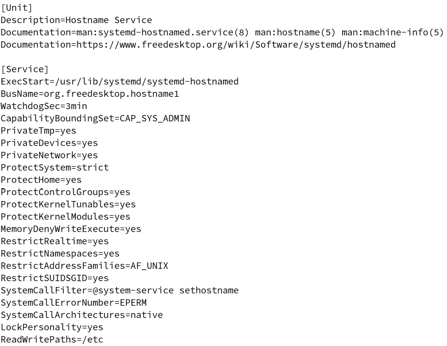

# *第九章*：设置系统参数

在本章中，我们将介绍如何使用`systemd`实用程序设置某些以前必须通过编辑配置文件或创建符号链接来设置的参数。我们还将查看在使用这些实用程序时涉及的服务。

在本章中，我们将涵盖以下主题：

+   设置地区设置参数

+   设置时间和时区参数

+   设置主机名和机器信息

如果您准备好了，让我们开始吧！

# 技术要求

技术要求与前几章相同。因此，启动您的 Ubuntu 服务器和 AlmaLinux 虚拟机，并跟随进行操作。

查看以下链接以查看代码演示视频：[`bit.ly/3xKA7K0`](https://bit.ly/3xKA7K0)

# 设置地区设置参数

计算机被全世界的人们使用，他们来自许多不同的文化和语言背景。（我知道你已经知道这一点，但我还是要告诉你。）幸运的是，所有主要的操作系统都有方法来适应几乎地球上所有语言的用户。在 Unix 和 Linux 系统上，`locale`参数集帮助我们处理这个问题。让我们开始仔细看一看。

## 理解地区设置

`locale`是一组定义了对用户可能重要的许多内容的参数。这些参数包括用户的首选语言、字符编码、货币格式以及其他几个内容。

通常在安装操作系统时设置`locale`，之后就不必再操作它了。Linux 安装程序没有一个专门的屏幕显示“选择您的 locale”，但它们有一个供您选择键盘布局和另一个供您选择时区的屏幕。在我的情况下，我会选择美国英语键盘布局和美国东部时区。通过这些信息，安装程序可以确定我想要使用一个设置为美国的 locale。

在 Debian/Ubuntu 和 Red Hat 系统上实现`locale`时存在一些差异。一个差异在于`locale`的定义位置。在 Red Hat 类型的系统上，例如我的 Alma 虚拟机，以及我用来撰写本文的 openSUSE 主机，`locale`设置在`/etc/locale.conf`文件中，正如我们在这里看到的：

```
[donnie@localhost ~]$ cd /etc
[donnie@localhost etc]$ ls -l locale.conf
-rw-r--r--. 1 root root 19 May  6 19:06 locale.conf
[donnie@localhost etc]$
```

在`locale.conf`文件中，我们只看到这一行：

```
LANG="en_US.UTF-8"
```

因此，`locale`由`LANG=`参数设置，由两部分组成。第一部分（`en_US`）定义了我想使用的语言和地区，而第二部分（`UTF-8`）定义了我想使用的字符集。

好的，语言和地区部分是显而易见的。那么，字符集是什么呢？它其实就是操作系统能够显示的字符集合。字符集包括字母数字字符、标点符号和其他各种特殊字符。就像计算机上的其他一切一样，字符——也叫做*码点*——由一串 0 和 1 组成。字符集定义了这些 0 和 1 的组合，从而构成每个字符。早期的字符集，比如旧的 EBCDIC 和 ASCII 集，在它们能够显示的字符数量上是有限的。更糟糕的是，EBCDIC 集的设计有缺陷，导致程序员难以使用。UTF-8 就是为了弥补这些不足而设计的。

在 Ubuntu Server 中，`locale`设置保存在`/etc/default/locale`文件中。*如果*Ubuntu 安装程序工作正常——稍后我会详细说明——那么该文件应该看起来像这样：

```
donnie@ubuntu2:~$ cat /etc/default/locale
LANG=en_US.UTF-8
donnie@ubuntu2:~$
```

唯一的区别是，在 Ubuntu 的文件中，`locale`的规范没有像 Alma 机器中那样被双引号括起来。

接下来，让我们看看`locale`设置中包含了什么。我们可以使用`locale`工具来查看，方法如下：

```
[donnie@localhost ~]$ locale
LANG=en_US.UTF-8
LC_CTYPE="en_US.UTF-8"
LC_NUMERIC=en_US.UTF-8
LC_TIME="en_US.UTF-8"
LC_COLLATE="en_US.UTF-8"
LC_MONETARY="en_US.UTF-8"
. . .
. . .
LC_ADDRESS="en_US.UTF-8"
LC_TELEPHONE="en_US.UTF-8"
LC_MEASUREMENT="en_US.UTF-8"
LC_IDENTIFICATION="en_US.UTF-8"
LC_ALL=
[donnie@localhost ~]$
```

要了解这些设置的具体内容，你需要查阅`locale`的手册页面。唯一的难点是，实际上有多个`locale`手册页面，正如你在这里看到的：

```
[donnie@localhost ~]$ whatis locale
locale (7)           - description of multilanguage support
locale (1)           - get locale-specific information
locale (5)           - describes a locale definition file
locale (1p)          - get locale-specific information
locale (3pm)         - Perl pragma to use or avoid POSIX locales for built-in operations
[donnie@localhost ~]
```

在这种情况下，我们需要的是数字`5`的手册页面。可以通过以下方式打开：

```
[donnie@localhost ~]$ man 5 locale
```

仅仅因为我能读懂你的想法，我已经知道你接下来的问题是什么了。*这些 locale 设置究竟影响什么呢？* 啊，很高兴你问了。（希望我能读懂你心思的事不会让你觉得太诡异。）

各种`locale`设置会影响`awk`、`grep`和`sort`等工具如何显示它们的输出。在桌面计算机上，它们可能会被显示管理器用于登录目的。最后，正如我将要演示的，它们还被某些 Shell 编程函数所使用。我将在 Alma 机器上演示，因为它已经有多个不同的 locale 可供使用。Bash shell 的`printf`函数为我们提供了一个完美的演示。（注意，你可能需要根据你自己的 locale 对这个演示做一些修改。）

在 Alma 机器的命令行上，我们来看看默认的`en_US.UTF-8` locale 是如何与`printf`一起工作的，试着打印一个十进制数字：

```
[donnie@localhost ~]$ printf "%.2f\n" 3.14
3.14
[donnie@localhost ~]$
```

之所以有效，是因为在美国，句点（`.`）是小数点符号。而在大多数欧洲国家，逗号（`,`）则是小数点符号。我们可以仅更改一个单独的`locale`设置，所以我们暂时将`LC_NUMERIC`设置改为欧洲格式，看看会发生什么：

```
[donnie@localhost ~]$ export LC_NUMERIC="en_DK.utf8"
[donnie@localhost ~]$ printf "%.2f\n" 3.14
-bash: printf: 3.14: invalid number
0,00
[donnie@localhost ~]$
```

这次，`printf`给出了一个无效数字的错误。这是因为它现在期待看到欧洲的数字格式。如果我们再次尝试使用逗号，它应该能正常工作。我们来看看结果：

```
[donnie@localhost ~]$ printf "%.2f\n" 3,14
3,14
[donnie@localhost ~]$
```

是的，它像冠军一样工作。别担心那个`LC_NUMERIC`设置——它会在你退出终端窗口后消失。

到目前为止，我们只使用了传统的`locale`工具，它已经存在很久了。为了将这个话题与`systemd`相关联，让我们使用`localectl`来查看默认的`locale`设置：

```
[donnie@localhost ~]$ localectl
   System Locale: LANG=en_US.UTF-8
       VC Keymap: us
      X11 Layout: us
[donnie@localhost ~]$
```

它是有效的，但没有提供像传统的`locale`工具那样多的信息。

接下来，让我们学习如何更改默认的区域设置。

## 更改 Alma 机器上的默认区域设置

我们将继续使用 Alma 机器进行操作，因为它已经安装了多个区域设置。

在你更改默认区域设置之前，你需要检查你想要的区域设置是否已安装在系统中。你可以通过`locale -a`命令或者`localectl list-locales`命令来查看。无论哪种方式，你都会得到相同的输出，内容大致如下：

```
[donnie@localhost ~]$ localectl list-locales
C.utf8
en_AG
en_AU
en_AU.utf8
. . .
. . .
en_ZA.utf8
en_ZM
en_ZW
en_ZW.utf8
[donnie@localhost ~]$
```

有两种方法可以更改`locale`设置。你可以直接打开`/etc/locale.conf`文件并修改设置，但那样太无趣了，不是吗？相反，让我们用便捷的`localectl`工具来完成这项工作，像这样：

```
[donnie@localhost ~]$ sudo localectl set-locale en_CA.utf8
[sudo] password for donnie:
[donnie@localhost ~]$ cat /etc/locale.conf
LANG=en_CA.utf8
[donnie@localhost ~]$
```

所以，我已经将机器设置为加拿大英语。

奇怪的是，之前存在的双引号现在消失了。所以，我猜它们其实并不需要。另外，请注意，直到我们退出机器并重新登录后，这个设置才会生效。一旦重新登录，我们会看到区域设置已改变，但键盘映射设置并没有变化：

```
[donnie@localhost ~]$ localectl
   System Locale: LANG=en_CA.utf8
       VC Keymap: us
      X11 Layout: us
[donnie@localhost ~]$
```

`localectl list-keymaps`命令可以显示可用的键盘映射设置。假设我想将键盘映射更改为加拿大的，以匹配我的区域设置。我会像这样操作：

```
[donnie@localhost ~]$ sudo localectl set-keymap ca
[donnie@localhost ~]$ sudo localectl set-x11-keymap ca
[donnie@localhost ~]$
```

退出并重新登录后，`localectl`的状态将如下所示：

```
[donnie@localhost ~]$ localectl
   System Locale: LANG=en_CA.utf8
       VC Keymap: ca
      X11 Layout: ca
[donnie@localhost ~]$
```

每当你使用`localectl`更改任何设置时，执行操作的是`systemd-localed.service`。由于格式问题，我无法展示完整的`systemd-localed.service`文件，所以我只会展示相关部分：

```
[Unit]
Description=Locale Service
Documentation=man:systemd-localed.service(8) man:locale.conf(5) man:vconsole.conf(5)
Documentation=https://www.freedesktop.org/wiki/Software/systemd/localed
[Service]
ExecStart=/usr/lib/systemd/systemd-localed
BusName=org.freedesktop.locale1
. . .
. . .
SystemCallArchitectures=native
LockPersonality=yes
ReadWritePaths=/etc
```

我希望你注意到这里的两点。首先，在`[Service]`部分，注意到`BusName=org.freedesktop.locale1`这一行。没有`Type=dbus`这一行，但没关系。只要有`BusName=`这一行，它就自动成为一种`dbus`类型的服务。另外，请注意没有`[Install]`部分，这使得它成为一个静态类型的服务，我们无法启用它。相反，每当你使用`localectl`更改设置时，`localectl`会通过发送`dbus`消息来启动该服务。

一旦你看到你想看的内容，就可以随时返回到正常设置。

接下来，让我们看看在 Ubuntu 上，这个过程是如何不同的。

## 更改 Ubuntu 上的默认区域设置

Ubuntu 提供了多种`locale`定义，但你必须先构建它们才能使用。在`/etc/locale.gen`文件中，你会看到一个可以构建的区域设置列表。以下是文件顶部的内容：

```
donnie@ubuntu20-04:/etc$ cat locale.gen
# This file lists locales that you wish to have built. You can find a list
# of valid supported locales at /usr/share/i18n/SUPPORTED, and you can add
# user defined locales to /usr/local/share/i18n/SUPPORTED. If you change
# this file, you need to rerun locale-gen.
# aa_DJ ISO-8859-1
# aa_DJ.UTF-8 UTF-8
# aa_ER UTF-8
# aa_ER@saaho UTF-8
# aa_ET UTF-8
# af_ZA ISO-8859-1
. . .
. . .
```

*如果*Ubuntu 安装程序正常工作，你应该看到文件中的所有`locale`列表都被注释掉了，只有一个没有被注释，它就是在你的系统上构建的那个。在我之前展示的 Ubuntu 机器上，`en_US.UTF-8`是唯一一个没有被注释掉的，如我们在这里看到的：

```
. . .
. . .
# en_US ISO-8859-1
# en_US.ISO-8859-15 ISO-8859-15
en_US.UTF-8 UTF-8
# en_ZA ISO-8859-1
# en_ZA.UTF-8 UTF-8
# en_ZM UTF-8
. . .
. . .
```

所以，只有这个语言环境被构建出来。

现在，记住，我说过这将是*如果*Ubuntu 安装程序正常工作的情况。这台虚拟机是我为本章设置的第二台 Ubuntu 机器，这次安装程序确实正常工作。当我设置第一台 Ubuntu 虚拟机时，安装程序*没有*正常工作，且没有构建任何语言环境。当我查看`/etc/default/locale`文件时，我看到的是：

```
donnie@ubuntu20-04:~$ cat /etc/default/locale
LANG=C.UTF-8
donnie@ubuntu20-04:~$
```

在这个`/etc/locale.gen`文件中，所有的语言环境列表都被注释掉了，这告诉我没有构建任何语言环境。所以，这台 Ubuntu 机器默认使用的是通用的`C`语言环境，这可能在所有情况下都不适用。为了更改它，我将打开`/etc/locale.gen`文件，在文本编辑器中删除`en_US.UTF-8 UTF-8`行前面的注释符号。接下来，我将生成语言环境，像这样：

```
donnie@ubuntu20-04:~$ sudo locale-gen
Generating locales (this might take a while)...
  en_US.UTF-8... done
Generation complete.
donnie@ubuntu20-04:~$
```

最后，我将像在 Alma 机器上做的那样设置默认的语言环境和键盘映射设置：

```
donnie@ubuntu20-04:~$ sudo localectl set-locale en_US.UTF-8
donnie@ubuntu20-04:~$ sudo localectl set-keymap us
donnie@ubuntu20-04:~$ sudo localectl set-x11-keymap us
donnie@ubuntu20-04:~$
```

在我登出并重新登录后，一切恢复正常，就像我们在这里看到的：

```
donnie@ubuntu20-04:~$ localectl
   System Locale: LANG=en_US.UTF-8
       VC Keymap: us
      X11 Layout: us
donnie@ubuntu20-04:~$
```

现在，我得说，我完全不知道为什么 Ubuntu 安装程序没有为这台机器正确设置语言环境。我只知道，使用 Ubuntu 时，我已经习惯了偶尔会遇到一些奇怪的问题。

好吧，我认为`locale`部分大致讲完了。现在，让我们来谈谈设置时间和时区信息。

# 设置时间和时区参数

在计算机的石器时代，保持计算机的准确时间并不是那么重要。为了设置我那台老旧的 8088 处理器驱动的三洋 PC 克隆机的时间，我只是输入手表上的时间。那并不是最准确的方式，但也没关系。设置计算机时间的唯一真正理由就是为了给我创建的文件加上相对准确的时间戳。

如今，计算机上的准确时间保持对许多原因来说至关重要。幸运的是，我们现在有了`systemd`套件，它包括了`timedatectl`工具和`systemd-timedated.service`来帮助我们。在这一章中，我们将讨论`timedatectl`，但我们会将`systemd-timedated.service`的讨论留到*第十七章*，*理解 systemd 和引导加载程序*。

要查看你机器的时间保持状态，只需使用`timedatectl`，正如我在这里展示的那样：

```
[donnie@localhost ~]$ timedatectl
               Local time: Sun 2021-06-20 17:34:08 EDT
           Universal time: Sun 2021-06-20 21:34:08 UTC
                 RTC time: Sun 2021-06-20 21:33:06
                Time zone: America/New_York (EDT, -0400)
System clock synchronized: yes
              NTP service: active
          RTC in local TZ: no
[donnie@localhost ~]$
```

`Local time`是我所在时区的时间，即**东部夏令时**（**EDT**）。这是操作系统中设置的时间。

`Universal time`（**UTC**）是格林威治（英国）的时间，这是作为全球参考的时区。（UTC 以前被称为**格林威治标准时间**，或**GMT**。）

`RTC`，即实时时钟，是设置在计算机硬件时钟中的时间。你可以看到 RTC 时间与 UTC 时间几乎一致。两者中，UTC 通常更为准确，因为它会定期从互联网上或本地网络上的时间服务器获取当前时间。操作系统会在较少的时间间隔内从 UTC 更新时间 RTC。虽然可以将 RTC 时间配置为从本地时间更新，但这样会导致设置时区和判断何时切换夏令时出现问题。

我们还可以看到系统时钟已同步，**NTP 服务**处于活动状态，并且 RTC*未*设置为本地时间。

在`timedatectl`的手册页中，你会找到如何手动更改系统时间的说明。多年前，当我刚接触 Linux 时，我曾经需要经常手动设置时间，因为当机器的时钟偏差超过几分钟时，旧版的 NTP 服务不会自动设置时间。现代的 NTP 服务运行得要好得多。现在，只要启动机器时有可用的 NTP 服务器，NTP 服务就会正确地设置时间，无论机器时钟有多偏差。因此，你很可能永远不需要手动设置时间。

你也可能永远不需要手动设置时区，因为这通常是在安装操作系统时自动设置的。然而，可能会有一些情况需要手动设置时区，比如如果你需要将服务器从一个时区迁移到另一个时区。为此，你需要查看可用时区的列表，如下所示：

```
[donnie@localhost ~]$ timedatectl list-timezones
Africa/Abidjan
Africa/Accra
Africa/Addis_Ababa
Africa/Algiers
Africa/Asmara
. . .
. . .
```

这是一长串列表，所以让我们使用好朋友`grep`来缩小范围。假设我只对美国的时区感兴趣。那么我的`grep`过滤器会是这样：

```
[donnie@localhost ~]$ timedatectl list-timezones | grep 'America'
America/Adak
America/Anchorage
America/Anguilla
America/Antigua
America/Araguaina
America/Argentina/Buenos_Aires
America/Argentina/Catamarca
America/Argentina/Cordoba
America/Argentina/Jujuy
. . .
. . .
```

好的，这样的描述并没有像我想的那样缩小范围，因为`America`包含了北美和南美的多个时区。而且，我们不仅要选择具体的时区名称，还必须选择一个位于目标时区的城市。在我的情况下，尽管我位于美国乔治亚州的东南角，但我必须选择`America/New_York`作为我的时区，因为纽约恰好处于东部时区。假设出于某种疯狂的原因，我决定搬到西海岸。要更改我计算机的时区，我需要做如下操作：

```
[donnie@localhost ~]$ sudo timedatectl set-timezone America/Los_Angeles
[sudo] password for donnie:
[donnie@localhost ~]$
```

状态现在将显示如下：

```
[donnie@localhost ~]$ timedatectl
               Local time: Sun 2021-06-20 15:13:41 PDT
           Universal time: Sun 2021-06-20 22:13:41 UTC
                 RTC time: Sun 2021-06-20 22:12:40
                Time zone: America/Los_Angeles (PDT, -0700)
System clock synchronized: yes
              NTP service: active
          RTC in local TZ: no
[donnie@localhost ~]$
```

所以，我现在已经设置为太平洋夏令时。

在`timedatectl`的手册页中，你会看到一些命令在 Ubuntu 上有效，但在 Alma 上不起作用。这是因为 Ubuntu 被配置为使用`systemd-timesyncd.service`作为其时间同步服务，而 Alma 被配置为使用`chronyd`。在 Ubuntu 机器上，你可以像这样查看时间同步服务的状态：

```
donnie@ubuntu20-04:~$ timedatectl timesync-status
       Server: 91.189.94.4 (ntp.ubuntu.com)
Poll interval: 34min 8s (min: 32s; max 34min 8s)
         Leap: normal
      Version: 4
      Stratum: 2
    Reference: 83BC03DC
    Precision: 1us (-23)
Root distance: 52.680ms (max: 5s)
       Offset: -417us
        Delay: 116.531ms
       Jitter: 5.671ms
 Packet count: 14
    Frequency: -5.210ppm
donnie@ubuntu20-04:~$
```

这基本涵盖了时间同步的内容。接下来我们来设置`hostname`和机器信息。

# 设置主机名和机器信息

在计算机上设置一个合适的主机名在商业世界中非常有用。它允许计算机在`IPv6`地址中注册。) 在我们了解如何设置这些信息之前，先来看看如何查看这些信息。（注意，这个主机名可以通过使用**动态域名服务**（**DDNS**）或使用像 Puppet、Chef 或 Ansible 这样的编排工具自动注册。）

## 查看信息

计算机的主机名设置在`/etc/hostname`文件中，正如我们在我的 Alma 机器上看到的那样：

```
[donnie@localhost ~]$ cd /etc
[donnie@localhost etc]$ cat hostname 
localhost.localdomain
[donnie@localhost etc]$
```

大多数 Linux 操作系统的安装程序允许你在系统安装过程中设置自定义的主机名。我在这台虚拟机上没有这么做，所以它使用了默认的`localhost.localdomain`。在这种情况下，`localhost`部分是实际的主机名，而`localdomain`部分是计算机所属的网络域名。在实际网络中，域名部分对每台计算机来说是相同的，而`主机名`部分对于每台计算机来说是唯一的。在家庭网络或任何不需要完整 FQDN 的情况下，你可以只使用一个没有域名的主机名。

在一台旧的 SysV 机器上，你所拥有的只是设置在`/etc/hostname`文件中的主机名或 FQDN。而在`systemd`中，事情要复杂得多。在 Alma 机器上，让我们看看`hostnamectl`命令给我们提供的额外信息：

```
[donnie@localhost ~]$ hostnamectl
   Static hostname: localhost.localdomain
         Icon name: computer-vm
           Chassis: vm
        Machine ID: 3a17f34dc2694acda37caa478a339408
           Boot ID: 37c1204df0ea439388727dce764f322f
    Virtualization: oracle
  Operating System: ]8;;https://almalinux.org/AlmaLinux 8.3 (Purple Manul)]8;;
       CPE OS Name: cpe:/o:almalinux:almalinux:8.3:GA
            Kernel: Linux 4.18.0-240.22.1.el8_3.x86_64
      Architecture: x86-64
[donnie@localhost ~]$
```

下面是详细信息：

+   `静态主机名`：这是设置在`/etc/hostname`文件中的主机名或 FQDN。

+   `图标名称`：某些图形应用程序会将计算机表示为图标。`图标名称`是显示在此计算机图标上的名称。我没有在这台虚拟机上设置`图标名称`，所以它默认为`computer-vm`。（系统自动检测到这是虚拟机，这也解释了`vm`部分的含义。）

+   `机箱`：这表示我们使用的计算设备类型。我也没有设置这个，所以它默认为`vm`，即*虚拟机*。（大多数时候，`systemd`可以自动检测正确的`机箱`类型。）

+   `机器 ID`：这个十六进制数字是一个唯一的数字，它在系统安装或第一次启动时分配给计算机。根据`machine-id`手册页，这个 ID 号应该视为机密信息，不应暴露给不受信任的网络。这个 ID 号存储在`/etc/machine-id`文件中。

+   `启动 ID`：这个数字每次启动计算机时都会变化。`hostnamectl`命令从`/proc/sys/kernel/random/boot_id`文件中提取这个数字。

+   `虚拟化`：这一行只会出现在虚拟机中。我在 Oracle VirtualBox 下运行这台虚拟机，所以此参数显示为`oracle`。

+   `操作系统`：操作系统信息来自`/etc/os-release`文件。

+   `CPE OS Name`：这是操作系统的名称，采用**通用平台枚举**（**CPE**）格式。（我在这里不会深入讲解 CPE 的细节，但你可以通过在*进一步阅读*部分中点击链接来了解相关信息，这个链接位于本章的末尾。）

+   `Kernel`：这是正在运行的 Linux 内核的版本。你可以使用`uname -r`命令查看相同的信息。

+   `Architecture`：这显示了计算机中的 CPU 类型。你可以使用`uname -m`命令查看相同的信息。

只是为了好玩，让我们看看我主机的`hostnamectl`输出，这台主机运行的是 openSUSE 15.2：

```
donnie@localhost:~> hostnamectl
   Static hostname: n/a
Transient hostname: localhost.localdomain
         Icon name: computer-desktop
           Chassis: desktop
        Machine ID: 3d824afd08e94e34afeefca4f6fe0c95
           Boot ID: 32a49640e4fb4bc293b7cf312b80a2d7
  Operating System: openSUSE Leap 15.2
       CPE OS Name: cpe:/o:opensuse:leap:15.2
            Kernel: Linux 5.3.18-lp152.78-default
      Architecture: x86-64
donnie@localhost:~>
```

这里有一些差异，我希望你注意。首先，没有`Static hostname`值。与 AlmaLinux 安装程序不同，如果在安装过程中没有分配主机名，openSUSE 安装程序不会将任何内容写入`/etc/hostname`文件。文件存在，但里面什么也没有，正如你在这里看到的：

```
donnie@localhost:~> cat /etc/hostname 
donnie@localhost:~>
```

我们没有`Static hostname`值，而是有一个`Transient hostname`值。这个`Transient hostname`值是由 Linux 内核维护的动态主机名。它通常从`/etc/hostname`文件中设置的`Static hostname`属性中提取。如果`hostname`文件中没有内容，`Transient hostname`将默认为`localhost.localdomain`，除非由 DHCP 或 mDNS 服务器分配主机名。

最后，`Icon name`和`Chassis`反映了这是一台桌面计算机，运行在裸机上。（今天，这台裸机是一台 2009 年款的惠普工作站，配有一对 AMD Opteron 四核处理器。虽然它已经很旧，但仍然能够完成任务。）同样，系统自动检测到了正确的`Chassis`值，正如它在虚拟机中所做的那样。

注意

要查看其他可用的`Chassis`类型，请查看`machine-info`手册页面。

现在我们已经*查看*了如何查看主机名和机器信息，接下来让我们学习如何设置它。

## 设置信息

`systemd`机器上有三种类型的主机名，你已经看到其中的两种。除了`Static hostname`和`Transient hostname`，还有`Pretty hostname`。为了说明*pretty*概念，让我们看看`Static hostname`和`Transient hostname`的标准。

在`hostname`文件的手册页中，你可以通过`man 5 hostname`命令访问，里面会列出创建主机名的标准。以下是其中的详细内容：

+   **要求**：主机名不能超过 64 个字符。

+   **建议**：

    1.  只使用来自旧的 7 位 ASCII 字符集的字符。（请参阅*进一步阅读*部分中的链接，查看哪些字符属于该字符集。）

    1.  所有字母应为小写。

    1.  主机名中不能包含空格或点（唯一的点应该位于主机名和域名之间，以及域名的两个部分之间）。

    1.  使用与 DNS 域名标签兼容的格式。

所以，在创建传统主机名时，你有一些限制。现在，借助`Pretty hostname`，你可以创建一个更加人性化的主机名，比如`Donnie's Computer`。（好吧，我没有发挥太多想象力，但你明白我的意思。）

当你使用`hostnamectl`设置主机名时，默认情况下会同时设置所有三种`hostname`类型。例如，假设我想让我的电脑命名为`Donnie's Computer`。我会使用如下命令：

```
[donnie@localhost ~]$ sudo hostnamectl set-hostname "Donnie's Computer"
[sudo] password for donnie: 
[donnie@localhost ~]$
```

现在，让我们查看`hostnamectl`的信息：

```
[donnie@localhost ~]$ hostnamectl
   Static hostname: DonniesComputer
   Pretty hostname: Donnie's Computer
         Icon name: computer-vm
           Chassis: vm
        Machine ID: 3a17f34dc2694acda37caa478a339408
           Boot ID: 7dae067e901a489580025ebdbec19211
    Virtualization: oracle
  Operating System: ]8;;https://almalinux.org/AlmaLinux 8.3 (Purple Manul)]8;;
       CPE OS Name: cpe:/o:almalinux:almalinux:8.3:GA
            Kernel: Linux 4.18.0-240.22.1.el8_3.x86_64
      Architecture: x86-64
[donnie@localhost ~]$
```

在这里，你可以看到`hostnamectl`自动将`Pretty hostname`转换成了适用于`Static hostname`的格式，只是它仍然允许使用大写字母。登出并重新登录后，新的`Static hostname`值将在命令提示符中显示，效果如下：

```
[donnie@localhost ~]$ exit
logout
Connection to 192.168.0.9 closed.
donnie@localhost:~> ssh donnie@192.168.0.9
donnie@192.168.0.9's password: 
Last login: Wed Jun 23 13:31:57 2021 from 192.168.0.222
[donnie@DonniesComputer ~]$
```

好的，这对于家用电脑来说很棒，但对于企业网络来说就不太适用了。这次，我们来创建一个适合 DNS 使用的 FQDN。假设我的本地网络已经设置为`tevault.com`域，并且我想将这台电脑命名为`development-1`。我用来创建 FQDN 的命令如下所示：

```
[donnie@DonniesComputer ~]$ sudo hostnamectl set-hostname development-1.tevault.com
[sudo] password for donnie: 
[donnie@DonniesComputer ~]$
```

再次使用`hostnamectl`，你会看到`Pretty hostname`现在已经消失：

```
[donnie@DonniesComputer ~]$ hostnamectl
   Static hostname: development-1.tevault.com
         Icon name: computer-vm
           Chassis: vm
        Machine ID: 3a17f34dc2694acda37caa478a339408
           Boot ID: 7dae067e901a489580025ebdbec19211
    Virtualization: oracle
  Operating System: ]8;;https://almalinux.org/AlmaLinux 8.3 (Purple Manul)]8;;
       CPE OS Name: cpe:/o:almalinux:almalinux:8.3:GA
            Kernel: Linux 4.18.0-240.22.1.el8_3.x86_64
      Architecture: x86-64
[donnie@DonniesComputer ~]$
```

登出并重新登录后，我将在命令提示符中看到正确的 DNS 友好型主机名：

```
[donnie@DonniesComputer ~]$ exit
logout
Connection to 192.168.0.9 closed.
donnie@localhost:~> ssh donnie@192.168.0.9
donnie@192.168.0.9's password: 
Last login: Wed Jun 23 14:34:24 2021 from 192.168.0.222
[donnie@development-1 ~]$
```

如果我只想设置一个`Pretty hostname`值，我可以这样做：

```
[donnie@development-1 ~]$ sudo hostnamectl set-hostname --pretty "Development 1"
[sudo] password for donnie: 
[donnie@development-1 ~]$
```

你可以使用`hostnamectl`设置其他几个选项，具体内容可以查看`machine-info`的手册页。`hostnamectl`的手册页向你展示了设置这些附加参数的命令。例如，让我们将这个虚拟机的位置设置为我现在的位置，也就是人声鼎沸的乔治亚州圣玛丽斯：

```
[donnie@development-1 ~]$ sudo hostnamectl set-location "Saint Marys GA"
[donnie@development-1 ~]$
```

现在，`hostnamectl`的输出中将显示位置。此外，当你第一次使用`hostnamectl`添加这些附加参数时，它会创建一个`/etc/machine-info`文件，该文件之前并不存在。以下是我添加了`Pretty hostname`值和位置后文件的样子：

```
[donnie@development-1 ~]$ cat /etc/machine-info 
PRETTY_HOSTNAME="Development 1"
LOCATION="Saint Marys GA"
[donnie@development-1 ~]$
```

很酷。乔治亚州圣玛丽斯现在已经是世界闻名了。

正如我们之前在`localectl`中看到的，使用`hostnamectl`更改参数时，会调用一个 dbus 类型的服务。在这种情况下，是`systemd-hostnamed.service`。它的样子如下：



图 9.1 - `systemd-hostnamed.service`文件

请注意，许多与安全相关的参数已经设置，这使得此服务几乎获得了与优秀的强制访问控制系统（如 SELinux）相同的保护。`ProtectHome=yes` 行和 `ProtectSystem=strict` 行使得大部分机器的文件系统对该服务不可访问，但底部的 `ReadWritePaths=/etc` 行提供了一个例外。`ReadWritePaths=/etc` 允许该服务读取或写入 `/etc/` 目录中的文件。（我们在 *更改 Alma 机器的默认区域设置* 部分中查看过的 `systemd-localed.service` 就是这样设置的，但当时我没有指出这一点。）

好的，我想这章差不多到此为止了。我们总结一下，然后继续前进。

# 总结

正如我们所看到的，在本章中有一些很酷的内容。我们首先了解了什么是区域设置，以及如何在 `systemd` 系统中设置默认区域设置。接着，我们学习了如何设置时间和时区，并最终通过设置主机名和机器信息来结束这一部分。下一章，我们将给大脑稍作休息，讨论一些更简单的内容——即我们将探讨关机或重启系统的各种方法。我们下章见！

# 问题

1.  以下哪条命令可以显示系统上安装了哪些区域设置？

    1.  `systemctl list-locales`

    1.  `locale list-locales`

    1.  `localectl list-locales`

    1.  `localectl -a`

1.  当你使用 `localectl` 或 `hostnamectl` 设置参数时，调用的是哪种服务？

    1.  `dbus`

    1.  `oneshot`

    1.  `notify`

    1.  `forking`

1.  如果计算机的 `hostname` 文件中没有任何内容，会发生什么？

    1.  它将默认的 `Static hostname` 值设置为 `localhost.localdomain` 或从本地 DHCP 或 mDNS 服务器获得的任何值。

    1.  计算机将没有主机名。

    1.  它将 `Pretty hostname` 设置为 `localhost.localdomain`。

    1.  它将默认的 `Transient hostname` 值设置为 `localhost.localdomain` 或从本地 DHCP 或 mDNS 服务器获得的任何值。

1.  计算机的硬件时钟通常显示什么时间？

    1.  本地时间

    1.  UTC 时间

# 答案

1.  C

1.  A

1.  D

1.  B

# 进一步阅读

要了解本章所涉及的主题，请查看以下资源：

+   设置区域设置：

    [`www.tecmint.com/set-system-locales-in-linux/`](https://www.tecmint.com/set-system-locales-in-linux/)

+   定义区域和语言设置：

    [`www.shellhacks.com/linux-define-locale-language-settings/`](https://www.shellhacks.com/linux-define-locale-language-settings/)

+   Eric S. Raymond 的 Jargon 文件中关于 EBCDIC 的条目：

    [`www.catb.org/jargon/html/E/EBCDIC.html`](http://www.catb.org/jargon/html/E/EBCDIC.html)

+   ASCII 字符集：

    [`www.asciitable.com/`](http://www.asciitable.com/)

+   **通用平台枚举**（**CPE**）：

    [`csrc.nist.gov/projects/security-content-automation-protocol/specifications/cpe`](https://csrc.nist.gov/projects/security-content-automation-protocol/specifications/cpe)

+   配置主机名：

    [`access.redhat.com/documentation/en-us/red_hat_enterprise_linux/7/html/networking_guide/ch-configure_host_names#sec-Recommended_Naming_Practices`](https://access.redhat.com/documentation/en-us/red_hat_enterprise_linux/7/html/networking_guide/ch-configure_host_names#sec-Recommended_Naming_Practices)
