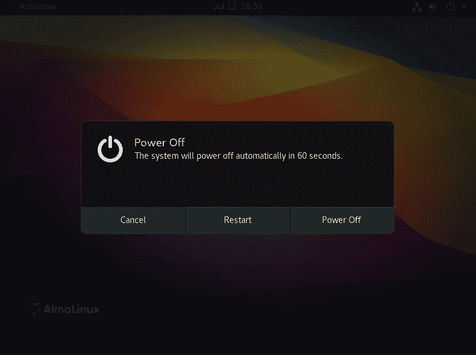

# 第十章：理解关机和重启命令

到了你职业生涯的这个阶段，你很可能已经知道如何使用基本命令来关闭或重启文本模式的 Linux 服务器。在本章中，我们将探讨一些更具体的 systemd 方法。所以，请耐心等待。你可能会学到一些以前不知道的内容。

本章的具体内容包括以下几个主题：

+   使用 `systemctl` 关机

+   使用 `systemctl` 停止系统

+   使用 `systemctl` 重启

+   使用 `shutdown` 而非 `systemctl`

如果你准备好了，我们开始吧。

# 技术要求

虽然你的虚拟机都能同样有效地工作，但你只需要一个文本模式虚拟机，因此如果不需要，完全可以不启动 Alma 桌面虚拟机。在本章的后面，我们将使用一些 shell 脚本。如果你不想手动输入这些脚本，可以直接从我们的 Git 仓库下载它们。

查看以下链接，观看《Code in Action》视频：[`bit.ly/3G6nbkD`](https://bit.ly/3G6nbkD)

注意

在本书中，我一直使用 AlmaLinux 8 来替代即将被停用的 CentOS 8。（当然，根据你阅读本书的时间，CentOS 8 可能已经被停用。）

在我开始写这章之前的几天，Rocky Linux 8 的稳定版本终于发布了。使用它就像使用 AlmaLinux，或者任何其他 RHEL 8 克隆一样。不过，如果你关注安全性，Rocky 确实有一个巨大的优势。与其他 RHEL 8 克隆不同，Rocky 自带一套 OpenSCAP 配置文件，你可以在安装操作系统时或安装后应用这些配置文件。现在来看，Rocky Linux 是唯一完全支持 OpenSCAP 的 RHEL 8 克隆。（如果你想了解更多关于 OpenSCAP 的内容，一定要查看我另一本书《*Mastering Linux Security and Hardening*》，也是由 Packt Publishing 出版的。）

好的，如果你准备好了，我们就开始吧。

# 使用 systemctl 关机

使用 systemd 关机其实非常简单，但有一些你可能不知道的选项。我们从关闭并关机的基本命令开始，命令如下：

```
donnie@ubuntu20-04:~$ sudo systemctl poweroff
```

那么，究竟发生了什么呢？如果你打开 `systemctl` 的手册页面，并向下滚动到 `poweroff` 项目，你会看到这个命令启动了 `poweroff.target`，其内容如下：

```
[Unit]
Description=Power-Off
Documentation=man:systemd.special(7)
DefaultDependencies=no
Requires=systemd-poweroff.service
After=systemd-poweroff.service
AllowIsolate=yes
JobTimeoutSec=30min
JobTimeoutAction=poweroff-force
[Install]
Alias=ctrl-alt-del.target
```

在`[Unit]`部分，你可以看到它*要求*`systemd-poweroff.service`，这意味着该服务将会启动。在`[Unit]`部分的底部，你会看到两个新参数。`JobTimeoutSec=30min`这一行给了 systemd 足够的时间来优雅地关闭所有正在运行的服务，然后再关闭电源。`JobTimeoutAction=poweroff-force`这一行意味着，如果所有服务在 30 分钟的时间窗口内没有优雅地关闭，那么 systemd 将强制关闭电源。在`[Install]`部分，我们看到了`Alias=ctrl-alt-del.target`这一行。这看起来有点奇怪，因为*Ctrl* + *Alt* + *Del*按键组合是用来重启机器的，而不是用来关闭机器的。此次不仅仅是 Ubuntu 的奇怪之处——在 Alma 机器上也是一样的。不过，这个问题其实很好解释。只是如果系统在关闭过程中挂起，按下*Ctrl* + *Alt* + *Del*组合键 7 次（在 2 秒内）将迫使机器重启。你然后可以直接启动到 GRUB 命令提示符，从那里关闭机器。（你可以在`systemd`的手册页中了解更多关于*Ctrl* + *Alt* + *Del*的信息。）

请记住，使用*Ctrl* + *Alt* + *Del*重启机器不需要管理员权限。这通常不是问题，因为关键任务的服务器应该被锁在一个安全的房间内，只有授权人员才能接触到它们。即便如此，你可能还是希望对重启服务器的权限进行一些限制。如果是这种情况，可以通过屏蔽`ctrl-alt-del.target`来禁用*Ctrl* + *Alt* + *Del*重启功能。执行此操作的命令是：

```
donnie@ubuntu20-04:~$ sudo systemctl mask ctrl-alt-del.target
```

现在，你可以无限次地按*Ctrl* + *Alt* + *Del*键组合，什么也不会发生。

在带有图形界面的桌面计算机上，*Ctrl* + *Alt* + *Del*键序列由桌面配置控制，在不同的桌面环境中可能有所不同。在 Alma 机器上，使用 Gnome 3 环境，按下*Ctrl* + *Alt* + *Del*会弹出正常的关机菜单，如下所示：



图 10.1 – Alma 机器上的 Gnome 3 关机菜单

在桌面计算机上屏蔽`ctrl-alt-del.target`并不会影响这一行为。

`systemd-poweroff.service`只有一个`[Unit]`部分，具体如下：

```
[Unit]
Description=Power-Off
Documentation=man:systemd-halt.service(8)
DefaultDependencies=no
Requires=shutdown.target umount.target final.target
After=shutdown.target umount.target final.target
SuccessAction=poweroff-force
```

该服务依赖于`shutdown.target`、`umount.target`和`final.target`。如果我们查看这些目标的单元文件，可以看到它们似乎什么也不做。例如，下面是`shutdown.target`文件的内容：

```
[Unit]
Description=Shutdown
Documentation=man:systemd.special(7)
DefaultDependencies=no
RefuseManualStart=yes
```

我们的好朋友`strings`显示，`shutdown.target`在`systemd`可执行文件中有定义，如下所示：

```
donnie@ubuntu20-04:/lib/systemd$ strings systemd | grep 'shutdown.target'
shutdown.target
donnie@ubuntu20-04:/lib/systemd$
```

同样的情况也适用于`umount.target`，如下所示：

```
donnie@ubuntu20-04:/lib/systemd$ strings systemd | grep 'umount.target'
umount.target
donnie@ubuntu20-04:/lib/systemd$
```

最后，我们看到了`final.target`，如下所示：

```
[Unit]
Description=Final Step
Documentation=man:systemd.special(7)
DefaultDependencies=no
RefuseManualStart=yes
After=shutdown.target umount.target
```

虽然它看起来也没有做任何事情，但它并没有在`systemd`可执行文件中定义，如下所示：

```
donnie@ubuntu20-04:/lib/systemd$ strings systemd | grep 'final.target'
donnie@ubuntu20-04:/lib/systemd$
```

所以，我不知道 `final.target` 是在哪里定义的，但没关系。对于我们现在讨论的内容，这不重要。我也没找到关于 `final.target` 实际作用的任何信息，除了在 `systemd.special` 手册页面中的这段简短描述：

*“一个特殊的目标单元，在关机逻辑中使用，并且在所有正常服务终止并且所有挂载卸载后，可能会用来拉入一些延迟的服务。”*

我不知道那些 *延迟服务* 是什么，但没关系。对于我们当前的讨论，这不重要。

根据 `systemctl` 手册页面，`systemctl poweroff` 命令应该会向所有已登录系统的用户发送一个 `wall` 消息。然而，这是错误的。没有消息被发送出去，也没有选项可以让它发生。

通常，`systemctl poweroff` 命令会以有序的方式关闭正在运行的服务并卸载所有挂载的文件系统。使用 `--force` 选项则会在不先关闭服务的情况下直接关机。如果你有一个挂起的服务无法正常停止，这个选项会非常有用。使用 `--force` 选项 *两次* 会在不关闭服务或卸载任何挂载的文件系统的情况下直接关机。当然，除非是绝对紧急的情况，否则不推荐这样做，因为这可能会损坏文件系统并导致数据丢失。另一方面，如果 `systemd` 进程崩溃，使用 `--force --force` 可能会很有用。因为 `--force --force` 允许 `systemctl` 可执行文件在不与 `systemd` 进程联系的情况下关机。

好吧，让我们 *结束* 关于 `poweroff` 的讨论。接下来，我们简单聊一下如何停止系统。

# 使用 systemctl 停止

使用 `sudo systemctl halt` 命令会停止操作系统，但不会关闭计算机。因为我能读懂你的心思，我知道你现在一定在想，*但 Donnie，我为什么要停止操作系统却让计算机继续运行呢？* 嗯，我不知道。这是我在整个 Linux 生涯中从未弄明白的事。

但说实话，`halt.target` 的作用几乎和 `poweroff.target` 一样。所以，如果你真的感兴趣，我把相关单元文件的查阅留给你。

好吧，让我们 *重新启动* 这个话题，聊聊重启的事情。

# 使用 systemctl 重启

你永远猜不到用来重启系统的命令是什么。好吧，如果你说是 `sudo systemctl reboot`，那你赢得了今天的大奖。（可惜，这个大奖什么都没有，除了给出正确答案的成就感。）

再次提醒，我留给你去查看相关的`reboot.target`文件，因为它的工作方式与`poweroff.target`非常相似。唯一需要注意的不同之处是，这次在`[Install]`部分的`Alias=ctrl-alt-del.target`行实际上为我们做了些事情。在文本模式机器上，在本地终端按下*Ctrl* + *Alt* + *Del*组合键会重启机器。所以，是的，那个老三指礼仍然伴随着我们。（你甚至不需要输入管理员密码就能让它生效。所以，幸运的是，从远程终端按*Ctrl* + *Alt* + *Del*是不会生效的。）如果你想在你的 VirtualBox 虚拟机上尝试这个，你需要点击虚拟机的**输入**菜单，选择**键盘**，然后点击**插入 Ctrl-Alt-Del**。

再次，我读懂了你的心思。我知道你在想，*但是，Donnie，这些 systemctl 命令没有给我们提供以前`shutdown`命令中的那些酷选项*。是的，你说得对，这也是为什么我仍然使用旧的`shutdown`命令。接下来，让我们谈谈这些命令，好吗？

# 使用`shutdown`代替`systemctl`

我们在 SysV 系统上使用的旧`shutdown`命令有一些很酷的选项。我们可以安排将来的关机或重启，取消已安排的关机，向所有已登录的用户广播即将关机或重启的消息。而使用`systemctl`命令时，你无法执行这些操作。幸运的是，旧的`shutdown`选项依然存在，通过一个符号链接指向`systemctl`可执行文件，正如我们在这里看到的：

```
donnie@ubuntu20-04:~$ cd /usr/sbin/
donnie@ubuntu20-04:/usr/sbin$ ls -l shutdown
lrwxrwxrwx 1 root root 14 May 27 11:16 shutdown -> /bin/systemctl
donnie@ubuntu20-04:/usr/sbin$
```

即使你不能在`systemctl`中使用旧的`shutdown`选项，你仍然可以通过指向`systemctl`的`shutdown`链接使用它们。（奇怪，但是真的。）现在，我知道你这些老手可能已经知道这些`shutdown`命令了，没关系。如果你只是想略过这部分，也不会让我觉得不开心。另一方面，如果你能耐心看到最后，你会发现一些你目前可能还不知道的酷东西。如果你是 Linux 新手，这里几乎可以保证有一些有用的信息。所以，走吧。

每当你执行`shutdown`命令时，都可以指定关闭的时间。例如，要立即关闭机器，只需执行：

```
donnie@ubuntu20-04:~$ sudo shutdown now
```

在旧的 SysV 系统上，这个命令只会停止操作系统。要关闭机器，你需要使用`-h`选项。在一个 systemd 系统上，这个命令会关闭机器，因此不再需要`-h`选项开关。（奇怪的是，`-h`选项仍然在`shutdown`的手册页面中提到，尽管它现在已经不再起作用。）

你还可以指定关闭操作的时间，使用 24 小时制时间格式。例如，要在下午 6:00 关闭机器，可以执行以下命令：

```
donnie@ubuntu20-04:~$ sudo shutdown 18:00
Shutdown scheduled for Sun 2021-06-27 18:00:00 EDT, use 'shutdown -c' to cancel.
donnie@ubuntu20-04:~$
```

在计划关机时间前大约 25 分钟，系统会开始向所有已登录的用户发送广播消息，如我们在 Goldie 的例子中所见：

```
goldie@ubuntu20-04:~$
Broadcast message from root@ubuntu20-04 on pts/0 (Sun 2021-06-27 17:50:00 EDT):
The system is going down for poweroff at Sun 2021-06-27 18:00:00 EDT!
Broadcast message from root@ubuntu20-04 on pts/0 (Sun 2021-06-27 17:51:00 EDT):
The system is going down for poweroff at Sun 2021-06-27 18:00:00 EDT!
```

系统将继续发送广播消息，直到实际关机发生。消息发送的频率取决于关机计划发生的时间。如果在最后十分钟内，消息会每分钟发送一次。幸运的是，Goldie 只需按下*Enter*键，就能重新获得命令提示符，这样她就可以完成她正在做的事情。（顺便说一下，*Goldie*是我的最小猫咪的名字。你永远猜不到她是什么颜色的。）

如果你改变主意并想取消关机，可以使用`-c`选项开关，如下所示：

```
donnie@ubuntu20-04:~$ sudo shutdown -c
donnie@ubuntu20-04:~$
```

你还可以通过在`shutdown`命令后简单地添加自定义广播消息来发送你的消息：

```
donnie@ubuntu20-04:~$ sudo shutdown 18:45 "At 6:45 PM, this server will go down for maintenance. So, get your work done and log off."
Shutdown scheduled for Sun 2021-06-27 18:45:00 EDT, use 'shutdown -c' to cancel.
donnie@ubuntu20-04:~$
```

在计划关机时间前五分钟，`nologin`文件将在`/run/`目录下创建，如我们所见：

```
donnie@ubuntu20-04:/run$ ls -l no*
-rw-r--r-- 1 root root 121 Jun 27 18:40 nologin
donnie@ubuntu20-04:/run$
```

这将阻止其他用户登录。下次启动系统时，`nologin`文件会被删除。

每次你安排未来的关机任务时，都会在`/run/systemd/shutdown/`目录中创建一个`scheduled`文件。打开文件，你会看到类似这样的内容：

```
donnie@ubuntu20-04:/run/systemd/shutdown$ cat scheduled
USEC=1624917600000000
WARN_WALL=1
MODE=poweroff
donnie@ubuntu20-04:/run/systemd/shutdown$
```

`USEC=`行指定了计划关机的时间，采用 Unix 时间戳格式。如果你不知道系统计划关机的时间，并且想查找，可以使用一个 shell 脚本将其转换为人类可读的格式。下面是一个使用`perl`命令进行实际转换的脚本示例：

```
#!/usr/bin/bash
if [ -f /run/systemd/shutdown/scheduled ]; then
        perl -wne 'm/^USEC=(\d+)\d{6}$/ and printf("Shutting down at: %s\n", scalar localtime $1)' < /run/systemd/shutdown/scheduled
else
        echo "No shutdown is scheduled."
fi
exit
```

将文件保存为`scheduled_shutdown_1.sh`，并设置可执行权限，如下所示：

```
donnie@ubuntu20-04:~$ chmod u+x scheduled_shutdown_1.sh
donnie@ubuntu20-04:~$
```

你可以根据需要安排关机时间，然后运行脚本。输出结果应该类似如下：

```
donnie@ubuntu20-04:~$ ./scheduled_shutdown_1.sh
Shutting down at: Tue Jun 29 19:05:00 2021
donnie@ubuntu20-04:~$
```

如果系统上没有安装`perl`，或者你不想使用`perl`，你也可以使用`awk`来执行转换。使用`awk`的脚本如下所示：

```
#/bin/bash
if [ -f /run/systemd/shutdown/scheduled ]; then
        date -d "@$( awk -F '=' '/USEC/{ $2=substr($2,1,10); print $2 }' /run/systemd/shutdown/scheduled )"
else
        echo "No shutdown is scheduled."
fi
exit
```

这两个脚本都设置为查找`scheduled`文件，并且只有在`scheduled`文件存在时才会运行转换命令。如果文件不存在，脚本会通知你并优雅地退出。

要重启机器，只需使用带有`-r`选项的`shutdown`命令，像这样：

```
donnie@ubuntu20-04:~$ sudo shutdown -r now
```

你也可以像安排关机操作一样安排重启并发送自定义广播消息。

注意

你们这些老前辈可能记得，在 SysV 系统上，有一个 `f` 选项可以和 `-r` 选项一起使用。执行 `sudo shutdown -rf now` 命令时，系统会重启，并在挂载文件系统之前执行 `fsck` 操作。这个 `f` 选项现在已经不再使用了，因为 systemd 系统默认每次启动时都会对所有支持的文件系统执行 `fsck` 操作。这是因为如果检测到任何支持的文件系统，`systemd-fsckd.service` 会作为启动过程的一部分运行。（这里所说的*支持的*文件系统，是指 `fsck` 适用于 `ext4` 文件系统，这是 Ubuntu 的默认文件系统，但不适用于 `xfs` 文件系统，这是 RHEL 及其衍生版的默认文件系统。所以，如果你看到 `systemd-fsckd.service` 在你的 Alma 系统上没有运行，也不必太失望。）

在 *第七章*，*理解 systemd 定时器* 中，我们学习了如何设置一个在你启动计算机时自动运行的任务。现在，让我们看看如何设置一个在关机时运行的任务。

# 在关机前运行任务

假设你想要每次关机时自动运行某个任务。（我让你发挥想象力，想想这个任务可能是什么。）为了实现这一点，只需创建一个自定义服务，并将其设置为`WantedBy` `the` `shutdown.target`。让我们来看一下如何操作。

我们将通过创建一个虚拟的 shell 脚本来演示这一点，该脚本与我们的新服务配合使用。在 `/usr/local/bin/` 目录下，创建一个 `script.sh` 文件，内容如下：

```
#!/bin/bash
# Run script with systemd only at shutdown, and not for reboot.
systemctl list-jobs | egrep -q 'reboot.target.*start' && echo "Testing myscript.service for reboot" > /root/reboot_test.txt
systemctl list-jobs | egrep -q 'shutdown.target.*start' && echo "Testing myscript.service for shutdown" > /root/shutdown_test.txt
```

第一个 `systemctl list-jobs` 命令会在正在运行的任务列表中查找 `reboot.target.*start*` 这个文本字符串。如果找到了这个文本字符串，`&&` 运算符将触发 `echo` 命令的运行。`echo` 输出将会写入 `/root/` 目录下的 `reboot_test.txt` 文件。然而，这实际上永远不会发生，因为该服务仅会由 `shutdown.target` 激活，而不是由 `reboot.target` 激活。下一行是相同的，只不过它是查找 `shutdown.target.*start*` 这个文本字符串。如果找到了该字符串，`echo` 命令的输出将会发送到 `/root/shutdown_test.txt` 文件。保存文件后，设置可执行权限，方法是：

```
donnie@ubuntu20-04:/usr/local/bin$ sudo chmod u+x script.sh
```

接下来，使用 `sudo systemctl edit --full --force myscript.service` 创建该服务。添加以下内容：

```
[Unit]
Description=Run this service only when shutting down
DefaultDependencies=no
Conflicts=reboot.target
Before=poweroff.target halt.target shutdown.target
Requires=poweroff.target
[Service]
Type=oneshot
ExecStart=/usr/local/bin/script.sh
RemainAfterExit=yes
[Install]
WantedBy=shutdown.target
```

`ExecStart=` 行激活我们的 shell 脚本。在 `[Install]` 部分，我们看到该服务的 `WantedBy` 是 `shutdown.target`。

一旦保存了这个文件，进行正常的 `sudo systemctl daemon-reload` 和 `sudo systemctl enable myscript.service` 操作。为了测试，首先关机，然后重新启动。你应该能在 `/root/` 目录下看到 `shutdown_test.txt` 文件：

```
donnie@ubuntu20-04:~$ sudo ls -l /root/
[sudo] password for donnie:
total 8
-rw-r--r-- 1 root root   38 Jun 29 18:19 shutdown_test.txt
drwxr-xr-x 3 root root 4096 Jun  3 20:20 snap
donnie@ubuntu20-04:~$ sudo cat /root/shutdown_test.txt
Testing myscript.service for shutdown
donnie@ubuntu20-04:~$
```

接下来，重新启动机器。这次您会发现没有文件被创建，证明此服务仅在关机时运行，而不是在重启时运行。

好了，我想这就是全部了。让我们结束这一章节。

# 总结

和往常一样，我们在本章看到了一些很酷的东西。我们开始查看用于关闭、停机或重启机器的`systemctl`命令。然后我们看到旧式的`shutdown`命令仍然有效，并且您可以继续使用您一直习惯使用的调度和消息功能。最后，我们创建了一个服务，该服务会在您关闭机器时运行一个作业。

我意识到你们中很多人可能已经熟悉我在本章中呈现的内容，但我在最后展示了一些很酷的东西，希望你们喜欢。

这就是*掌握 systemd*第一部分的结束。在第二部分中，我们将深入探讨*cgroups*的奥秘。到那时见。

# 问题

1.  Linux 机器重启命令是什么？

    a) `sudo shutdown now`

    b) `sudo systemctl -r now`

    c) `sudo systemctl reboot now`

    d) `sudo systemctl reboot`

    e) `sudo shutdown --reboot`

1.  在预定关机时间的 5 分钟前会发生什么？

    a) 在`/run/systemd/shutdown/`目录中创建了一个`scheduled`文件。

    b) 在`/run/`目录中创建了一个`scheduled`文件。

    c) 在`/run/systemd/shutdown/`目录中创建了一个`nologin`文件。

    d) 在`/run/`目录中创建了一个`nologin`文件。

1.  当您安排将来的关机时，以下哪些情况会发生？

    a) 在`/run/systemd/shutdown/`目录中创建了一个`nologin`文件。

    b) 在`/run/systemd/shutdown/`目录中创建了一个`scheduled`文件。

    c) 在`/run/systemd/`目录中创建了一个`nologin`文件。

    d) 在`/run/`目录中创建了一个`scheduled`文件。

1.  如果执行`sudo systemctl poweroff --force --force`命令会发生什么？

    a) 使用两次`--force`选项会导致错误消息。

    b) 系统会忽略第二个`--force`选项。

    c) 您可能会损坏文件系统，这可能导致数据丢失。

    d) 如果第一个`--force`选项不能确保`power off`命令生效，那么第二个选项肯定会。

# 答案

1.  d

1.  d

1.  b

1.  c

# 进一步阅读

`/tmp/`目录，在每次关闭机器时都会被清空：

[`www.golinuxcloud.com/run-script-with-systemd-at-shutdown-only-rhel/`](https://www.golinuxcloud.com/run-script-with-systemd-at-shutdown-only-rhel/)

**如何检查延迟关机的时间**：您可以通过简单的 DuckDuckGo 搜索找到很多关于 Linux 管理的答案，就像我在这里做的那样。学习如何使用 DuckDuckGo。它可能是 Linux 管理员的好朋友：

[`unix.stackexchange.com/questions/229745/systemd-how-to-check-scheduled-time-of-a-delayed-shutdown`](https://unix.stackexchange.com/questions/229745/systemd-how-to-check-scheduled-time-of-a-delayed-shutdown)
