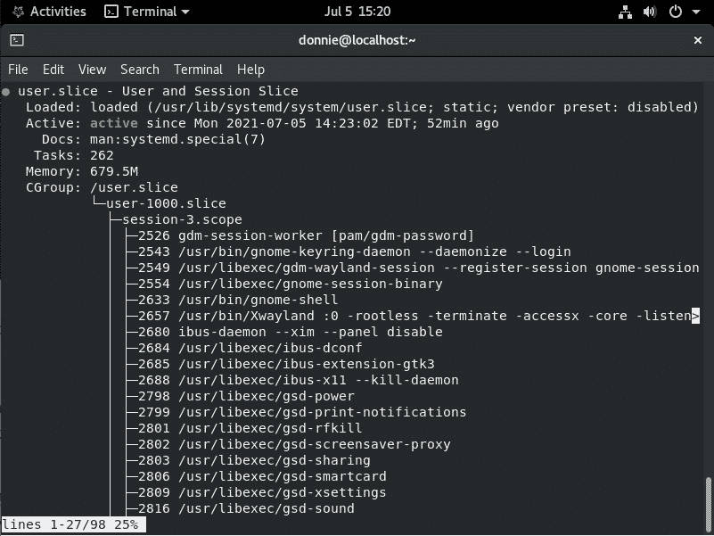
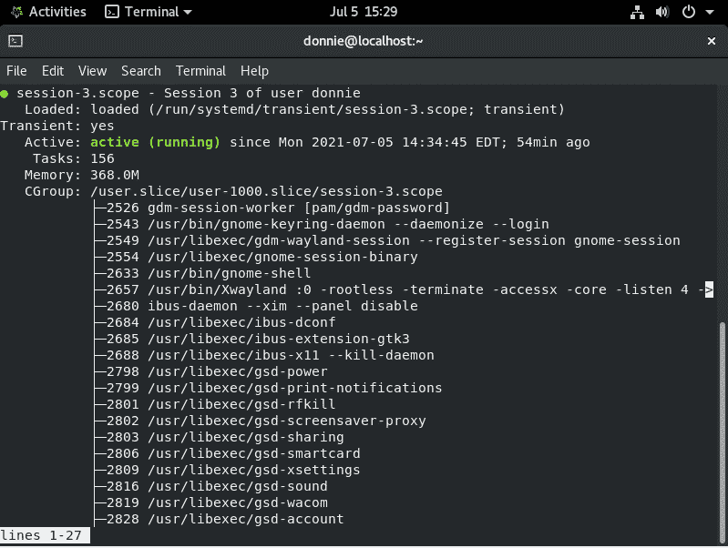
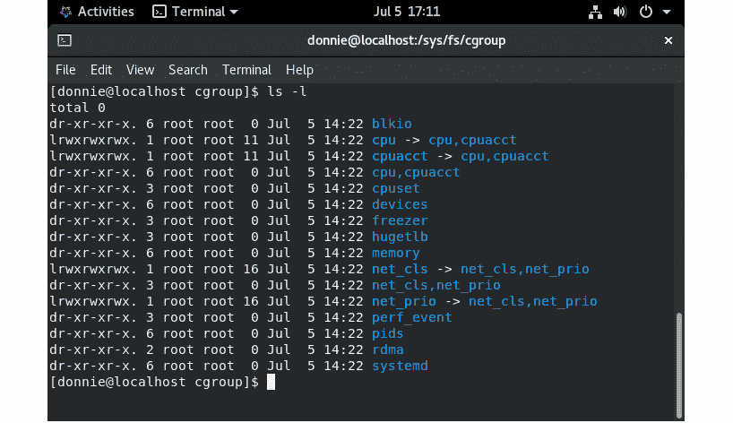
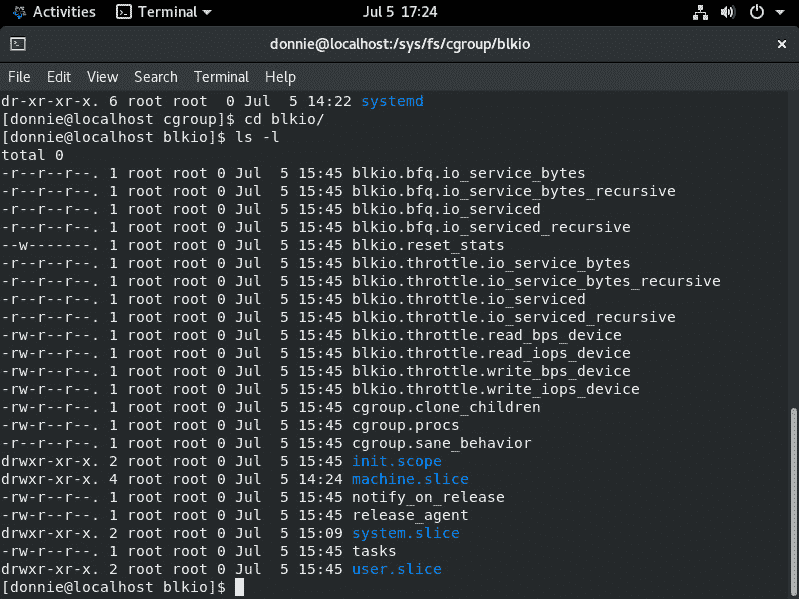

# *第十一章*：理解 cgroups 版本 1

在本章中，我们将介绍`cgroups`。 (更具体地说，我们将关注 cgroups 版本 1。) 你将学习什么是 cgroups，它们是如何构建的，以及你如何通过利用它们来获得好处。我们还将简要回顾 cgroups 的历史。

现在，我必须告诉你，讨论 cgroups 可能变得相当复杂和曲折。你可能已经见过一些在线的 cgroups 教程，它们让你只觉得头痛。我的目标是尽可能剥去复杂性，为你提供足够的信息，帮助你管理 systemd 机器上的资源。

具体主题包括：

+   理解 cgroups 的历史

+   理解 cgroups 的目的

+   理解 cgroups 版本 1 的结构

+   理解 cgroup 版本 1 文件系统

好的，如果你准备好了，我们开始吧！

# 技术要求

为了让内容更加有趣，我们将使用在*第五章*中设置的同一台 Alma 虚拟机，*创建和编辑服务*。你可能还记得，在那台虚拟机上，我们设置了一个以系统模式运行的 WordPress 容器服务，和一个以用户模式运行的 WordPress 容器服务。如果你没有那台虚拟机，可以返回到*第五章*，*创建和编辑服务*，并按照步骤创建 WordPress 容器服务。和往常一样，本章将是动手实践的。所以启动那台虚拟机，我们一起深入研究吧。

请查看以下链接，观看“代码实践”视频：[`bit.ly/3ltmKsO`](https://bit.ly/3ltmKsO)

# 理解 cgroups 的历史

这可能会让你震惊，但 cgroups 技术最初并不是 systemd 的一部分，也不是由 Red Hat 发明的。它实际上是 Linux 内核中的一个组件，可以在非 systemd 的 Linux 发行版上运行。一对 Google 工程师早在 2006 年就开始了 cgroups 的开发，早于 Red Hat 工程师开始开发 systemd 四年。第一款包含 cgroups 技术的企业级 Linux 发行版是*Red Hat Enterprise Linux 6*，它使用的是混合 upstart/SysV 设置，而不是 systemd。在 RHEL 6 中使用 cgroups 是可选的，你必须经历一些复杂的步骤才能设置它们。

如今，cgroups 在所有主要的企业级 Linux 发行版中默认启用，并且与 systemd 紧密集成。RHEL 7 是第一款使用 systemd 的企业级发行版，也是第一款始终启用 cgroups 的企业级发行版。

目前有两个版本的 cgroups 技术。版本 1 在大多数情况下表现良好，但它确实存在一些缺陷，我这里不详细讨论。版本 2 是在 2013 年由 Facebook 的一位工程师开发的。在本章中，我将仅讨论版本 1。尽管版本 2 可能更好，但它仍未得到广泛应用，许多容器技术仍然依赖版本 1。目前所有企业级 Linux 发行版的默认版本都是版本 1。

注意

Fedora、Arch 和 Debian 11 是我所知道的唯一默认运行 cgroups 版本 2 的 Linux 发行版。我还看到一些猜测认为，下一版本的非 LTS 版 Ubuntu，即 Ubuntu 21.10，将会默认配备版本 2。（当然，当你读到这篇文章时，你可能已经知道确切的情况。）那么，你应该学习哪个版本呢？嗯，如果你是负责管理主要企业级 Linux 发行版的管理员，你就应该集中精力学习版本 1。如果你是开发者，你可能希望从版本 2 开始学习，因为版本 2 才是未来的趋势。

现在我们已经介绍了 cgroups 的历史，我想是时候做点历史性工作，解释一下它们是什么以及我们为什么需要它们了。那么，请允许我做一下这个解释。

# 理解 cgroups 的目的

在单核 CPU 时代，资源管理并不是一件大事。服务器通常配备一到四个单核 CPU，因此它们在能够同时运行的服务数量上本就有限。那时候，我们所需的资源管理工具只是一些简单的工具，如`nice`、`renice`和`ulimit`。

如今，情况完全不同了。服务器现在配备了一个或多个多核 CPU 和大量内存。（目前最强的服务器 CPU 是 AMD Epyc，它现在有一个 64 核版本，能够同时运行 128 个线程。是的，这足以让我们这些极客垂涎三尺。）虽然这看起来似乎有些违反直觉，但在这些强大系统上进行资源管理比旧系统更为重要。这是因为现在一台服务器可以同时运行多个服务、多个虚拟机、多个容器和多个用户账户。一整间只能运行一两个服务的老旧物理服务器，如今可以被一台物理服务器所替代。我们曾经使用的那些简单的资源管理工具仍然有用，但我们现在需要更强大的工具，以确保所有进程和用户能够和谐共处。cgroups 应运而生。

使用 cgroups，管理员可以：

+   按照进程或用户来管理资源使用。

+   跟踪多租户系统中用户的资源使用情况，以提供准确的计费。

+   更容易地将正在运行的进程相互隔离。这不仅能提高安全性，还能使我们拥有比以前更好的容器化技术。

+   由于更好的资源管理和进程隔离，运行密集堆叠了虚拟机和容器的服务器。

+   通过确保进程始终在同一 CPU 核心或一组 CPU 核心上运行，从而提高性能，而不是让 Linux 内核将它们移动到不同的核心。

+   白名单或黑名单硬件设备。

+   设置网络流量整形。

现在我们已经了解了 cgroups 的目的，我的目标是向你展示 cgroups 的结构。

# 理解 cgroups 版本 1 的结构。

要理解 cgroups 的结构，你需要了解一些 cgroups 的术语。我们从几个你需要知道的术语开始：

+   **cgroups**：*cgroup*一词有两种不同的含义。我们最关心的是，cgroup 是一个进程集合。每个 cgroup 中的进程都受限于在*cgroup 文件系统*中定义的限制和参数。（稍后我们会更详细地讨论 cgroup 文件系统。）*cgroup*这个词还可以指代实现 cgroups 技术的 Linux 内核代码。

+   `httpd.service` 或 `apache2.service`。（好吧，你已经知道这一点了，但我还是再告诉你一次。）

+   **scopes**：scope 是由某些外部方式启动的进程组。虚拟机、容器和用户会话都是 scope 的例子。

+   `-.slice`：这是*根* slice，它是整个 slice 层次结构的根。通常，它不会直接包含其他单元。不过，你可以用它来为整个 slice 树创建默认设置。

+   `system.slice`：默认情况下，由 systemd 启动的系统服务会在这里运行。

+   `user.slice`：默认情况下，用户模式服务会在这里运行。每个登录用户会自动分配一个隐式的 slice。

+   `machine-slice`：如果你运行的是容器或虚拟机，它们的服务会出现在这里。

此外，系统管理员可以定义自定义 slice，并将范围和服务分配到它们。

为了更直观地展示这一切，可以使用`systemd-cgls`命令作为普通用户。为了好玩，我们来看一下我们用来创建 WordPress 容器的 Alma 8 虚拟机，出自*第五章*，*创建和编辑服务*。`systemd-cgls`的输出应该像这样：

```
Control group /:
-.slice
├─user.slice
│ └─user-1000.slice
│   ├─user@1000.service
│   │ ├─wordpress-noroot.service
│   │ │ ├─ 918 /usr/bin/podman
│   │ │ ├─1013 /usr/bin/slirp4netns --disable-host-loopback --mtu 65520 --enabl>
│   │ │ ├─1019 containers-rootlessport
. . .
. . .
```

我在这台虚拟机上没有安装桌面环境，所以我们看不到在安装了桌面环境的机器上会看到的 Gnome 界面。不过，我们可以看到我们在*第五章*中创建的用户模式 WordPress 容器服务，*创建和编辑服务*。（如果你的虚拟机上安装了 Gnome，那也没关系。那只是意味着你需要稍微滚动一下才能看到你的 WordPress 容器服务。）

`systemd-cgls` 工具展示了系统上运行的 cgroups 的层次结构。列出的第一项是 `/` cgroup，这是根 cgroup 的标识。第二行开始列出根 slice（`-.slice`），直接下面是 `user.slice`。接下来，我们可以看到 `user-1000.slice`，这是 `user.slice` 的子级。在这种情况下，我是唯一登录到系统的用户，所以这个 slice 属于我。`user-1000.slice` 的名称对应于我的用户 ID 号，`1000`。之后，我们可以看到在我的 slice 中运行的服务，稍后我们会详细讲解。

注意

如果你想查看用户 slices，你需要从 cgroup 文件系统 *外部* 运行 `systemd-cgls` 命令。如果你进入 `/sys/fs/cgroup/` 目录，你将看不到用户 slices。越深入 cgroup 文件系统，你通过 `systemd-cgls` 能看到的内容就越少。

`user.slice` 是由 `/lib/systemd/system/user.slice` 单元文件定义的，该文件内容如下：

```
[Unit]
Description=User and Session Slice
Documentation=man:systemd.special(7)
Before=slices.target
```

在这里，我们可以看到，这个 slice 必须先完成启动，才能启动 `slices.target`。`slices.target` 文件内容如下所示：

```
[Unit]
Description=Slices
Documentation=man:systemd.special(7)
Wants=-.slice system.slice
After=-.slice system.slice
```

根据 `systemd.special` 手册页面，`slices.target` 负责在启动机器时设置将要运行的 slices。默认情况下，它会启动 `system.slice` 和根 slice（`-.slice`），正如我们在 `Wants=` 行和 `After=` 行中看到的那样。我们还可以将更多的 slices 添加到该列表中，正如我们刚刚在 `user.slice` 文件中看到的。稍后我们将查看 `-.slice` 和 `system.slice`。现在，让我们回到 `user.slice`。

在我的 `user-1000.slice` 中，列出的第一个服务是 `user@1000.service`。这个服务负责管理所有在我的 slice 中运行的其他服务。它是通过 `user@.service` 模板设置的。`user@.service` 文件的 `[Unit]` 部分如下所示：

```
[Unit]
Description=User Manager for UID %i
After=systemd-user-sessions.service
After=user-runtime-dir@%i.service
Requires=user-runtime-dir@%i.service
```

当该服务运行时，`%i` 变量将被替换为用户 ID 号码。文件中的 `[Service]` 部分如下所示：

```
[Service]
User=%i
PAMName=systemd-user
Type=notify
ExecStart=-/usr/lib/systemd/systemd --user
Slice=user-%i.slice
KillMode=mixed
Delegate=pids memory
TasksMax=infinity
TimeoutStopSec=120s
```

以下是详细信息：

+   `ExecStart=`：这一行使 systemd 为每个登录的用户启动一个新的 systemd 会话。

+   `Slice=`：这一行为每个用户创建一个独立的 slice。

+   `TasksMax=`：这一行设置为无限制，意味着用户可以运行的进程数量没有上限。

+   `Delegate=`：我们将在 *第十二章* 中讨论这一指令，*使用 cgroups 版本 1 控制资源使用*。

在 `systemd-cgls` 输出的下一个内容中，我们看到在我的用户 slice 中运行的所有服务都是 `user@1000.service` 的子级。当我向下滚动时，最终会跳过服务列表，看到我的登录会话的 *scope*。在这种情况下，我在本地终端的登录会话被标识为 `session-2.scope`，而远程登录会话则被标识为 `session-3.scope`。其内容如下所示：

```
. . .
. . .
├─session-2.scope
│   │ ├─ 794 login -- donnie
│   │ └─1573 -bash
│   └─session-3.scope
│     ├─ 1644 sshd: donnie [priv]
│     ├─ 1648 sshd: donnie@pts/0
│     ├─ 1649 -bash
│     ├─11493 systemd-cgls -l
│     └─11494 systemd-cgls -l
. . .
. . .
```

根据 `systemd.scope` 手册页，作用域不能通过创建单元文件来创建。相反，它们是在运行时通过编程创建的。所以，不要指望在 `/lib/systemd/system/` 目录中看到任何 `.scope` 文件。

在 `systemd-cgls` 输出的进一步部分，我们终于跨越了我的用户切片。接下来，我们可以看到我的用户切片后面是 `init.scope` 和 `system.slice`，如我们所见：

```
. . .
├─init.scope
│ └─1 /usr/lib/systemd/systemd --switched-root --system --deserialize 18
├─system.slice
│ ├─rngd.service
│ │ └─732 /sbin/rngd -f --fill-watermark=0
│ ├─systemd-udevd.service
│ │ └─620 /usr/lib/systemd/systemd-udevd
│ ├─wordpress-container.service
│ │ └─1429 /usr/bin/conmon --api-version 1 -c cc06c35f21cedd4d2384cf2c048f01374>
│ ├─polkit.service
│. . .
```

在这里，我们可以看到与我的用户会话无关的系统服务。我们在这里看到的一个服务是以系统模式运行的 WordPress 容器服务。

我有一个系统模式的容器服务在运行，这意味着在 `machine.slice` 中有一些内容，如我们所见：

```
. . .
. . .
└─machine.slice
  └─libpod-cc06c35f21cedd4d2384cf2c048f013748e84cabdc594b110a8c8529173f4c81.sco>
    ├─1438 apache2 -DFOREGROUND
    ├─1560 apache2 -DFOREGROUND
    ├─1561 apache2 -DFOREGROUND
    ├─1562 apache2 -DFOREGROUND
    ├─1563 apache2 -DFOREGROUND
    └─1564 apache2 -DFOREGROUND
```

`libpod` 分支代表了我们的 `podman-docker` 容器。（注意，用户模式的容器服务只会直接出现在用户切片下，而不会出现在这里的 machine 切片下。）

好的，让我们切换回运行 Gnome 桌面的 Alma 机器。如我们所见，`systemd-cgls` 的输出显示了更多的内容：

```
Control group /:
-.slice
├─user.slice
│ └─user-1000.slice
│   ├─user@1000.service
│   │ ├─gvfs-goa-volume-monitor.service
│   │ │ └─2682 /usr/libexec/gvfs-goa-volume-monitor
│   │ ├─xdg-permission-store.service
│   │ │ └─2563 /usr/libexec/xdg-permission-store
│   │ ├─tracker-store.service
│   │ │ └─3041 /usr/libexec/tracker-store
│   │ ├─evolution-calendar-factory.service
│   │ │ ├─2725 /usr/libexec/evolution-calendar-factory
. . .
. . .
```

在任何桌面机器上，你总是会有比严格文本模式机器更多的正在运行的服务。

接下来，为 Frank 创建一个新的用户账户。然后，让 Frank 通过远程 SSH 会话登录到这台机器。现在 `systemd-cgls` 的输出的顶部部分如下所示：

```
Control group /:
-.slice
├─user.slice
│ ├─user-1001.slice
│ │ ├─session-10.scope
│ │ │ ├─8215 sshd: frank [priv]
│ │ │ ├─8250 sshd: frank@pts/1
│ │ │ └─8253 -bash
│ │ └─user@1001.service
│ │   ├─pulseaudio.service
│ │   │ └─8248 /usr/bin/pulseaudio --daemonize=no --log-target=journal
│ │   ├─gvfs-daemon.service
. . .
. . .
```

现在，Frank 有了自己的用户切片，即 `user-1001.slice`。我们看到他已经远程登录，以及他用来登录的虚拟终端的名称。（如果你在想，*Frank* 是我曾经野生的 Flame Point 暹罗猫，他已经和我在一起很多年了。直到刚才，他还躺在我键盘应该放置的位置上睡觉，这让我打字时相当不方便。）

如果你不想查看整个 cgroups 树，你可以使用 `systemctl status` 来查看它的一部分。例如，要仅查看 `user.slice`，我会执行 `systemctl status user.slice`。输出将如下所示：



图 11.1 – 在 Gnome 桌面的 Alma Linux 上的 user.slice

在这里，我们看到 Frank 已经注销，而我现在是唯一登录的用户。（毕竟，Frank 是只猫，这意味着他大部分时间都在睡觉。）我们还可以查看其他切片的信息，以及作用域的信息。例如，执行 `systemctl status session-3.scope` 会显示我在用户切片下运行的会话作用域信息，看起来像这样：



图 11.2 – Alma Linux 上的会话范围

好的，这基本涵盖了 cgroups 的基本结构。现在，让我们继续深入看看 cgroup 文件系统。

# 理解 cgroup 文件系统

在任何运行 cgroups 的系统上，你都会在 `/sys/fs/` 虚拟文件系统下看到一个 `cgroup` 目录，如下所示：

```
[donnie@localhost ~]$ cd /sys/fs
[donnie@localhost fs]$ ls -ld cgroup/
drwxr-xr-x. 14 root root 360 Jul  3 15:52 cgroup/
[donnie@localhost fs]$
```

与所有虚拟文件系统一样，cgroup 文件系统仅在运行时存在于内存中，并在关机时消失。它没有在机器的硬盘上有永久副本。

当你查看 `/sys/fs/cgroup/` 目录时，你会看到类似这样的内容：



图 11.3 – Alma Linux 上的 cgroupfs

这些目录中的每一个都表示一个 cgroup *子系统*。（你也会看到它们被称为 *控制器* 或 *资源控制器*。）在这些目录中，每个都有一组文件，表示 cgroup 的 *可调参数*。这些文件包含有关你将设置的任何资源控制或调优参数的信息。（我们将在 *第十二章*中详细讨论，“使用 cgroups 版本 1 控制资源使用”。）例如，下面是 `blkio` 目录中的内容：



图 11.4 – blkio 文件系统

这些文件中的每一个都表示一个可以自定义调优的参数，以获得最佳性能。往下看，我们还会看到 `init.scope`、`machine.slice`、`system.slice` 和 `user.slice` 目录。每个目录都有一组可调参数。

当我们使用 `mount` 命令并通过 `grep` 管道过滤时，我们会看到每个资源控制器都挂载在其独立的虚拟分区上。它们的样子是这样的：

```
[donnie@localhost ~]$ mount | grep 'cgroup'
tmpfs on /sys/fs/cgroup type tmpfs (ro,nosuid,nodev,noexec,seclabel,mode=755)
cgroup on /sys/fs/cgroup/systemd type cgroup (rw,nosuid,nodev,noexec,relatime,seclabel,xattr,release_agent=/usr/lib/systemd/systemd-cgroups-agent,name=systemd)
. . .
. . .
cgroup on /sys/fs/cgroup/freezer type cgroup (rw,nosuid,nodev,noexec,relatime,seclabel,freezer)
[donnie@localhost ~]$
```

好的，我想这应该足以完成我们对 cgroups 版本 1 的基本介绍了。所以，让我们结束这一章并继续前进！

# 总结

在这一章中，我们回顾了 cgroups 技术的历史、cgroups 是什么，以及我们为什么需要它们。接着，我们看了 cgroups 的结构以及 cgroup 文件系统。

学习 cgroup 技术的一个主要挑战是，它没有很多可用的文档。我的意思是，你会看到很多博客文章和 YouTube 视频，但其中许多要么不够全面，要么已经过时。希望我能让你对 cgroup 技术以及它如何与 systemd 协同工作有更好的理解。

在下一章中，我们将探讨如何使用 cgroups 版本 1 控制资源使用情况。我会在那儿见。

# 问题

1.  cgroup 文件系统的默认位置是什么？

    a. `/proc/fs/cgroup/`

    b. `/sys/cgroup/`

    c. `/sys/fs/cgroup/`

    d. `/proc/cgroup/`

1.  你必须做什么才能使用 `systemd-cgls` 查看用户 slice？

    a. 仅从本地终端运行该命令。

    b. 仅在 cgroup 文件系统外部运行该命令。

    c. 使用 root 权限运行该命令。

    d. 你不能这么做。用户 slice 永远不会显示出来。

1.  如何创建你自己的 cgroup scope？

    a. 使用 `systemctl edit --full --force`，就像你操作其他 systemd 单元一样。

    b. 手动在 `/etc/systemd/system/` 目录中创建单元文件。

    c. 你不能这么做。Scopes 是程序化创建的，并且没有 `.scope` 单元文件。

    d. 手动在 `/lib/systemd/system/` 目录中创建单元文件。

1.  slice 的作用是什么？

    a. 它直接管理用户模式进程。

    b. 它直接管理系统模式进程。

    c. 它管理处于作用域或服务中的进程。

    d. 它管理用户登录会话。

# 答案

1.  c

1.  b

1.  c

1.  c

# 进一步阅读

请查看以下链接，了解有关 cgroups 的更多信息：

+   Linux 系统管理员的 cgroups 入门：

    [`www.redhat.com/sysadmin/cgroups-part-one`](https://www.redhat.com/sysadmin/cgroups-part-one)

+   在 kernel.org 上的 cgroups 文档：

    [`www.kernel.org/doc/Documentation/cgroup-v1/cgroups.txt`](https://www.kernel.org/doc/Documentation/cgroup-v1/cgroups.txt)
