# *第十二章*：使用 cgroups Version 1 控制资源使用

现在我们已经了解了`cgroups`是什么以及它们是如何结构化的，接下来该看看如何实际使用它们了。本章我们将覆盖以下具体内容：

+   了解资源控制器

+   控制 CPU 使用

+   控制内存使用

+   控制`blkio`的使用

+   了解`pam_limits`和`ulimit`

学习如何使用`cgroups`控制资源使用可以帮助你使数据中心运行得更安全、更高效。所以，系好安全带，让我们开始吧。

# 技术要求

为了最大限度地利用本章内容，你将需要一台较新的主机计算机，最好配有多核 CPU 和充足的内存。以我为例，我正在使用一台较新的戴尔工作站，配备了六核 Xeon CPU 和 32GB 内存。启用了超线程技术，这样我总共有 12 个 CPU 核心可以使用。

设置你的虚拟机使用至少两个 CPU 核心和适量的内存。我设置的是四个核心，如下所示：

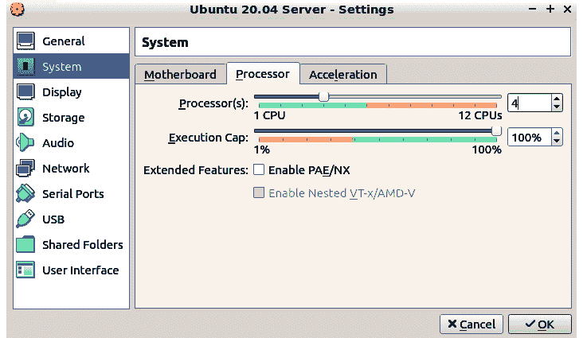

图 12.1 – 在 VirtualBox 中设置 CPU 核心

我还将我的虚拟机设置为使用 8GB 的内存，如下所示：

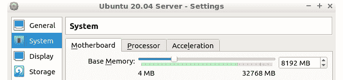

图 12.2 – 在 VirtualBox 中设置 RAM

像往常一样，我将使用我的 Ubuntu Server 20.04 和 AlmaLinux 8 虚拟机进行演示。

请查看以下链接，观看《代码实战》视频：[`bit.ly/3xJ61qi`](https://bit.ly/3xJ61qi)

现在我们已经完成了所有的设置，接下来让我们深入探讨。

# 了解资源控制器

对于这个 cgroups 功能，有一些不同的名称。我更倾向于使用*资源控制器*这个术语。在其他文档中，你可能会看到这些资源控制器被称为*子系统*或仅称为*控制器*。这些术语都指的是同一件事，即 cgroups 技术，它允许我们控制各种正在运行的进程的资源使用情况。在我们开始深入了解之前，先来看看我们有哪些资源控制器。

## 检查资源控制器

查看我们有哪些资源控制器的最好方法是安装一些 cgroup 工具。在 Ubuntu 机器上，执行以下命令：

```
donnie@ubuntu2004:~$ sudo apt install cgroup-tools
```

在 Alma 机器上，执行以下命令：

```
[donnie@localhost ~]$ sudo dnf install libcgroup-tools
```

在任何一台机器上，我们现在都可以使用`lssubsys`来查看我们的活动资源控制器，像这样：

```
donnie@ubuntu2004:~$ lssubsys
cpuset
cpu,cpuacct
blkio
memory
devices
freezer
net_cls,net_prio
perf_event
hugetlb
pids
rdma
donnie@ubuntu2004:~$
```

这里是每个资源控制器的简要描述：

+   `cpuset`：如果你在运行多个 CPU 核心的系统上，这可以让你将一个进程分配到特定的 CPU 核心或一组 CPU 核心。这通过强制进程使用已被填充了该进程需要的数据和指令的 CPU 缓存来提高性能。默认情况下，Linux 内核调度程序可以将进程从一个 CPU 核心移动到另一个核心，或从一组 CPU 核心移动到另一组。每当发生这种情况时，正在运行的进程必须访问主系统内存来重新填充 CPU 缓存。这会消耗额外的 CPU 周期，可能会影响性能。

+   `cpu,cpuacct`：以前，`cpu`和`cpuacct`有两个独立的控制器。现在，它们被合并成一个控制器。这个控制器让你控制进程或用户的 CPU 使用情况。在多租户系统中，它允许你监控用户的 CPU 使用情况，这对于计费非常有用。

+   `blkio`：这是**块输入/输出**的缩写。此控制器允许你设置进程和用户从块设备读取或写入数据的速度限制。（块设备是像硬盘或硬盘分区这样的设备。）

+   `memory`：正如你可能猜到的，这一项允许你设置进程或用户可以使用的系统内存限制。

+   `devices`：此项允许你控制对系统设备的访问。

+   `freezer`：这个名字听起来很奇怪，但它的用途很简单。它允许你挂起 cgroup 中运行的进程。当你需要将进程从一个 cgroup 移动到另一个时，这非常有用。准备好后，只需恢复进程。

+   `net_cls,net_prio`：此项允许你为网络数据包添加类标识符（`classid`）标签。Linux 流量控制器和 Linux 防火墙可以使用这些标签来控制和优先处理不同 cgroup 的网络流量。

+   `perf_event`：此项允许你使用`perf`工具监控 cgroup。

+   `hugetlb`：此项允许你的 cgroup 使用巨大页虚拟内存，并对其使用设置限制。（这有点超出了本书的范围，所以我们不再深入讨论。）

+   `pids`：此项允许你为在 cgroup 中运行的进程数量设置限制。

+   `rdma`：**远程直接内存访问**允许一台计算机直接访问另一台计算机的内存，而无需涉及任何一台计算机的操作系统。这主要用于并行计算集群，这也超出了本书的范围。

在`cgroups`手册页中，你会在*版本 1 控制器*部分看到对这些控制器的简短提及。要查看它们的详细描述，你需要查看与 Linux 内核源代码一起打包的文档。在 Alma 机器上，你可以通过安装一个单独的文档包来获得这些文档，方法是：

```
[donnie@localhost ~]$ sudo dnf install kernel-doc
```

在`/usr/share/doc/kernel-doc-4.18.0/Documentation/cgroup-v1/`目录中，你现在可以找到包含有关资源控制器的更详细解释的文本文件。（我也曾在 Ubuntu 机器上查找该文档包，但没能找到。）当然，必须提醒你，这些文档页面主要是为 Linux 内核程序员编写的，所以你可能不会从中获得太多信息。但谁知道呢？不妨快速浏览一下，看看是否有能帮助你的内容。（你也可能发现它们是很好的助眠工具，尤其在你失眠严重的夜晚。）

当你查看`/sys/fs/cgroup/`目录时，你会发现每个资源控制器都有自己的目录。以下是 Ubuntu 机器上的情况：

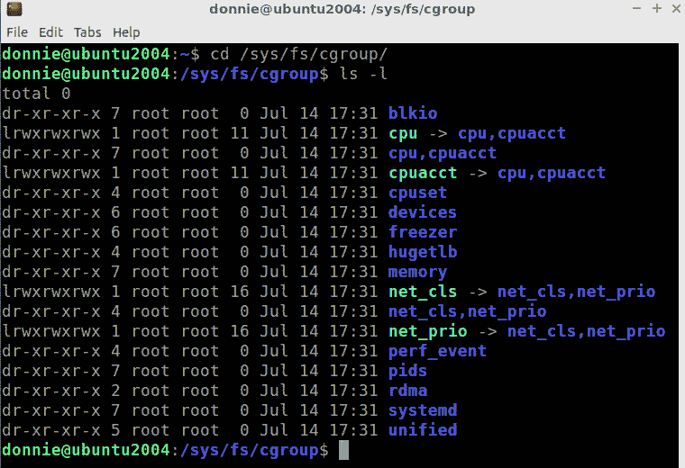

图 12.3 – Ubuntu 上的资源控制器

现在，我们暂时忽略屏幕底部的两个目录。（`systemd`目录是用于 root cgroup 的，`unified`目录是用于 Version 2 控制器的。）尽管我们在这里运行的是 cgroups Version 1，但仍然可以使用 Version 2 控制器。（你在 Alma 机器上看不到`unified`目录，因为 RHEL 8 类型的发行版默认没有启用 Version 2 控制器。）请注意，本章将只讨论 Version 1 控制器。

此外，注意我们有四个符号链接指向两个不同的目录。这是因为`cpu`和`cpuacct`控制器曾经是两个独立的控制器，但现在已经合并为一个控制器。`net_cls`和`net_prio`控制器也一样。这些符号链接为我们提供了一些向后兼容性。

注意

由于篇幅有限，我无法详细介绍所有这些资源控制器。所以我们将重点关注你最可能使用的*三大控制器*。它们分别是`cpu`、`memory`和`blkio`控制器。也正好，因为在 cgroups Version 1 中，这三个是你可以通过`systemd`直接配置的唯一资源控制器。（要使用其他 Version 1 控制器，你需要绕一些弯路并使用一些非 systemd 的管理工具。）

好了，理论部分先讲到这里。让我们开始动手操作吧。

## 为演示做准备

在前几个演示中，我们将使用`stress-ng`工具来模拟一些真实世界中的问题。在 Ubuntu 机器上，通过以下命令安装它：

```
donnie@ubuntu2004:~$ sudo apt install stress-ng
```

要在 Alma 机器上安装它，首先需要安装 EPEL 仓库。如果你还没有安装，请通过以下命令进行安装：

```
[donnie@localhost ~]$ sudo dnf install epel-release
```

然后，通过以下命令安装`stress-ng`包：

```
[donnie@localhost ~]$ sudo dnf install stress-ng
```

接下来，创建一个新的非特权用户账户。（我为 Vicky 创建了一个账户，她是我家的灰色小猫。）

然后，在主机上打开一个终端，并让新用户登录到虚拟机的远程会话。在主机上打开第二个终端，并以你自己的账户登录到虚拟机。把虚拟机的本地终端放到一边，因为你也会用到它。

现在我们已经准备好了，让我们来讨论一下`cpu`资源控制器。

# 控制 CPU 使用

你可以通过使用`systemctl set-property`命令或者编辑 systemd 单元文件来控制资源使用。对于第一个演示，我们将让 Vicky 给虚拟机的 CPU 施加一些压力。我们将通过使用`systemctl set-property`来配置`cpu`资源控制器来处理它。

## 控制 Vicky 的 CPU 使用

默认情况下，Linux 系统中的所有用户都可以无限制地使用系统资源。在多用户系统中，这可能会成为问题。任何用户都可能决定占用所有资源，这实际上可能导致对所有其他用户的拒绝服务（DoS）情况。在实际操作中，用户可能会通过做一些看似无害的事情，比如渲染一个大视频文件，来造成问题。授权用户也可能通过做一些不该做的事情，比如利用服务器资源进行加密货币挖矿，来造成拒绝服务（DoS）。无论如何，我们都希望限制用户可以使用的资源。我们将通过给用户的切片分配资源限制来实现这一点。

假设 Vicky 远程登录并占用了其他用户的所有 CPU 时间。通过让 Vicky 执行以下操作来模拟这一情况：

```
vicky@ubuntu2004:~$ stress-ng -c 4
```

该命令中的`-c 4`选项表示 Vicky 正在对 CPU 的四个核心进行压力测试。将该数字更改为您为自己的虚拟机分配的核心数。

在远程终端中，您已登录到自己的账户，打开`top`工具。它应该看起来像这样：

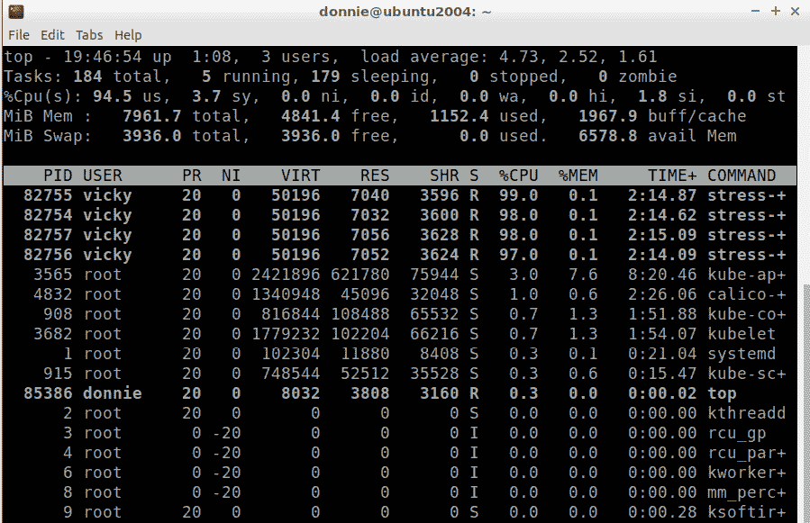

图 12.4 – 带有 Vicky 压力测试的`top`显示

在`top`显示的顶部，我们看到 Vicky 几乎占用了所有四个 CPU 核心的 100%。我还需要告诉你这不好吗？

保持`top`在您的远程终端上运行，然后转到虚拟机的本地终端。为了获得正确的结果，确保您不在`/sys/fs/cgroup/`文件系统中。使用`systemd-cgls`来查找 Vicky 的用户切片，应该像这样：

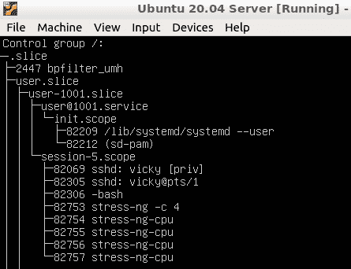

图 12.5 – Vicky 的用户切片

我们看到她的用户编号是`1001`，我们想让她知道谁才是这里的老板。我们不会让她继续这样占用 CPU 资源。所以，在本地终端上，通过以下命令将她的`CPUQuota`减少到`10%`：

```
donnie@ubuntu2004:~$ sudo systemctl set-property user-1001.slice CPUQuota=10%
```

该命令会在`/etc/systemd/`目录下创建一些新文件，这意味着您需要执行`sudo systemctl daemon-reload`，就像创建新的单元文件时一样。现在您应该看到 Vicky 的 CPU 使用率几乎降到零，正如我们在这里看到的：

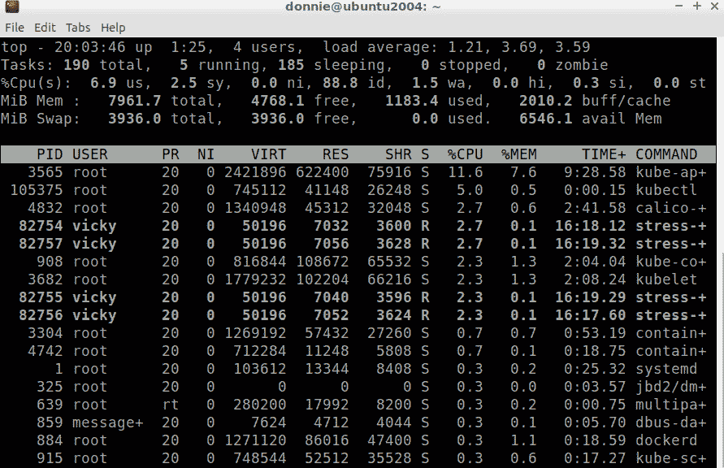

图 12.6 – 减少 Vicky 的 CPU 配额后

好吧，也许把 Vicky 的`CPUQuota`降到只有`10%`有点激进了。在实际生活中，你可以根据需要调整`CPUQuota`。在具有多个核心的机器上，有一个你应该知道的技巧。就是无论你给 Vicky 多少配额，都会分配到所有可用的 CPU 核心上。所以，在这种情况下，我们并不是给 Vicky 每个核心的 10%。相反，我们把这 10%分配到四个核心上，这使得她只能消耗每个核心大约 2.5%的 CPU 周期，如你在*图 12.6*中所见。另外，将 Vicky 的`CPUQuota`设置为`100%`并不会让她每个核心都使用 100%。相反，她只会使用每个核心约 25%的性能。要让她每个核心使用 50%，将`CPUQuota`设置为`200%`。在这台有四个核心的机器上，我们能设定的最大值是`400%`，这将让她每个核心使用 100%。

注意

请记住，我刚给你提供的数据是基于将四个核心分配给虚拟机。如果你分配了不同数量的核心给你自己的虚拟机，这些数据会有所不同。

当你第一次执行`systemctl set-property`命令时，你将在`/etc/systemd/`目录下创建`system.control/`目录，它看起来像这样：

```
 donnie@ubuntu2004:/etc/systemd$ ls -ld system.control/
drwxr-xr-x 3 root root 4096 Jul 14 19:59 system.control/
donnie@ubuntu2004:/etc/systemd$
```

在那个目录下，你会看到一个用于 Vicky 用户分片的目录。在她的用户分片目录下，你会看到 Vicky 的`CPUQuota`配置文件，如你所见：

```
donnie@ubuntu2004:/etc/systemd/system.control$ ls -l
total 4
drwxr-xr-x 2 root root 4096 Jul 14 20:25 user-1001.slice.d
donnie@ubuntu2004:/etc/systemd/system.control$ cd user-1001.slice.d/
donnie@ubuntu2004:/etc/systemd/system.control/user-1001.slice.d$ ls -l
total 4
-rw-r--r-- 1 root root 143 Jul 14 20:25 50-CPUQuota.conf
donnie@ubuntu2004:/etc/systemd/system.control/user-1001.slice.d$
```

在这里你可以看到，我刚刚把 Vicky 的配额设置到了`200%`：

```
donnie@ubuntu2004:/etc/systemd/system.control/user-1001.slice.d$ cat 50-CPUQuota.conf 
# This is a drop-in unit file extension, created via "systemctl set-property"
# or an equivalent operation. Do not edit.
[Slice]
CPUQuota=200%
donnie@ubuntu2004:/etc/systemd/system.control/user-1001.slice.d$
```

现在，请注意，当你第一次创建这个文件时，只需执行`daemon-reload`命令。任何后续使用`systemctl set-property`命令对此文件的更改将立即生效。

在 cgroup 文件系统中，在 Vicky 的用户分片目录下，你会看到她当前的`CPUQuota`设置在`cpu.cfs_quota_us`文件中。当设置为`200%`时，它看起来像这样：

```
donnie@ubuntu2004:/sys/fs/cgroup/cpu/user.slice/user-1001.slice$ cat cpu.cfs_quota_us 
200000
donnie@ubuntu2004:/sys/fs/cgroup/cpu/user.slice/user-1001.slice$
```

要得到实际的 200%数字，只需去掉`200000`中的最后三个零。

好了，我们完成了这个演示。在 Vicky 的窗口中，按*Ctrl* + *C*来停止压力测试。

接下来，让我们看看如何限制服务的 CPU 使用。

## 控制服务的 CPU 使用

对于这个演示，请在虚拟机的本地终端执行命令，并在你自己的远程终端上保持`top`命令运行。

这个演示的第一步是在虚拟机的本地终端创建`cputest.service`，就像这样：

```
donnie@ubuntu2004:~$ sudo systemctl edit --full --force cputest.service
```

文件的内容将如下所示：

```
[Unit]
Description=CPU stress test service
[Service]
ExecStart=/usr/bin/stress-ng -c 4
```

你看，这里没有什么花哨的东西。这足以完成工作。就像之前一样，修改`-c`选项以反映你为自己的虚拟机分配的核心数。接下来，执行`daemon-reload`，然后启动服务：

```
donnie@ubuntu2004:~$ sudo systemctl daemon-reload
donnie@ubuntu2004:~$ sudo systemctl start cputest.service 
donnie@ubuntu2004:~$
```

在顶部的显示中，你应该看到`cputest.service`占用了 100%的 CPU：

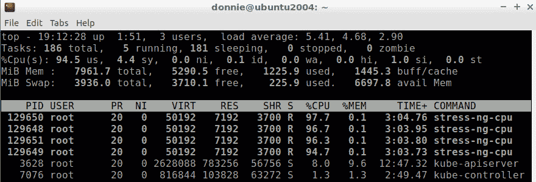

图 12.7 – 无限制的 cputest.service

接下来，让我们从命令行为这个服务设置`CPUQuota`。

### 从命令行设置 CPUQuota

为服务设置 `CPUQuota` 和为用户设置没有什么不同。假设我们只想为这个服务设置 90% 的 `CPUQuota`，我们可以像为 Vicky 设置一样，通过命令行来设置：

```
donnie@ubuntu2004:~$ sudo systemctl set-property cputest.service CPUQuota=90%
[sudo] password for donnie: 
donnie@ubuntu2004:~$
```

这样做会在 `/etc/systemd/system.control/` 目录中创建另一个目录：

```
donnie@ubuntu2004:/etc/systemd/system.control$ ls -l
total 8
drwxr-xr-x 2 root root 4096 Jul 15 19:15 cputest.service.d
drwxr-xr-x 2 root root 4096 Jul 15 17:53 user-1001.slice.d
donnie@ubuntu2004:/etc/systemd/system.control$
```

在 `/etc/systemd/system.control/cputest.service.d/` 目录下，您会看到 `50-CPUQuota.conf` 文件，它的设置与我们为 Vicky 创建的文件相同：

```
donnie@ubuntu2004:/etc/systemd/system.control/cputest.service.d$ cat 50-CPUQuota.conf 
# This is a drop-in unit file extension, created via "systemctl set-property"
# or an equivalent operation. Do not edit.
[Service]
CPUQuota=90%
donnie@ubuntu2004:/etc/systemd/system.control/cputest.service.d$
```

这使得`cputest.service`只能使用每个 CPU 核心的约 22.5%，正如我们在这里看到的：

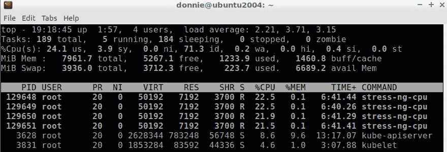

图 12.8 – 配置了 90% `CPUQuota` 的 cputest

在这里，在 cgroup 文件系统中，我们看到 `CPUQuota` 确实被设置为 `90%`：

```
donnie@ubuntu2004:/sys/fs/cgroup/cpu/system.slice/cputest.service$ cat cpu.cfs_quota_us 
90000
donnie@ubuntu2004:/sys/fs/cgroup/cpu/system.slice/cputest.service$
```

请注意，这个限制只对*服务*生效，而不对拥有该服务的 root 用户生效。root 用户仍然可以运行其他程序和服务，没有任何限制。

接下来，让我们在 `cputest.service` 文件中设置 `CPUQuota`。

### 在服务文件中设置 `CPUQuota`

首先，停止 `cputest.service`，像这样：

```
donnie@ubuntu2004:~$ sudo systemctl stop cputest.service 
donnie@ubuntu2004:~$
```

接下来，删除您使用 `systemctl set-property` 命令创建的 `cputest.service.d/` 目录：

```
donnie@ubuntu2004:/etc/systemd/system.control$ sudo rm -rf cputest.service.d/
donnie@ubuntu2004:/etc/systemd/system.control$
```

执行 `systemctl daemon-reload`，然后启动 `cputest.service`。您应该会看到服务现在再次占用了 CPU，就像最初一样。停止服务，然后通过以下方式编辑单元文件：

```
donnie@ubuntu2004:~$ sudo systemctl edit --full cputest.service
```

添加 `CPUQuota=90%` 这一行，文件现在应该看起来像这样：

```
[Unit]
Description=CPU stress test service
[Service]
ExecStart=/usr/bin/stress-ng -c 4
CPUQuota=90%
```

保存文件并启动服务。您应该会在 `top` 显示中看到新的设置已经生效。

就这些，简单吧？

注意

`systemd.resource-control` 手册页解释了您可以使用的各种指令来控制资源使用。当您阅读它时，请注意哪些指令适用于 cgroups 版本 1，哪些适用于 cgroups 版本 2。同时，请注意标记为*弃用*的指令。例如，您在网上找到的许多 cgroups 教程会告诉您使用 `CPUShares` 指令，但在此手册页中，该指令被列为弃用。（在 Linux 术语中，弃用的东西现在仍然有效，但将来某个时候会停止工作。在这种情况下，这些弃用的指令对版本 1 有效，但对版本 2 无效。）

我们不再需要 `cputest.service`，所以可以停止它。接下来，我们看看如何控制 Vicky 的内存使用情况。

# 控制内存使用

让我们首先让 Vicky 做一些占用系统内存的事情。和之前一样，我们将使用 `stress-ng` 工具来模拟，像这样：

```
vicky@ubuntu2004:~$ stress-ng --brk 4
```

等待片刻，您将在 `top` 显示中看到一些相当糟糕的情况：

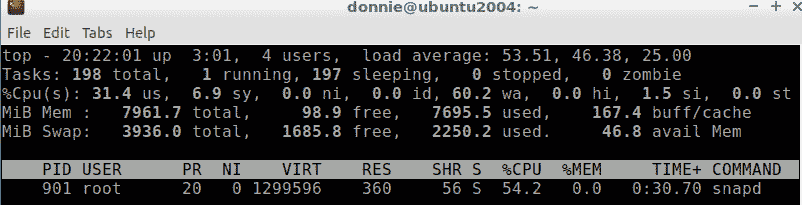

图 12.9 – Vicky 的内存使用情况的 top 显示

是的，只有 98.9 字节的空闲内存，而且负载平均值超高。事实上，大约 2 分钟后，这台虚拟机对任何命令完全没有响应。哎呀！

现在，要理解的是，我仍然为 Vicky 设置了 200%的`CPUQuota`。所以，CPU 使用率不是这里的问题。负载平均值表示有多少任务在等待 CPU 的处理。在`top`显示的顶部，如*图 12.9*所示，你看到的`53.51`是 1 分钟的平均值，`46.38`是 5 分钟的平均值，`25.00`是 15 分钟的平均值。这些负载平均值是分布在所有可用的 CPU 核心上的。这意味着，你的核心越多，负载平均值可以越高，而不影响系统性能。只有四个核心，我的虚拟机甚至无法处理像这样的负载平均值。通过占用所有的系统内存，Vicky 阻止了 CPU 及时处理任务。

为了在这个无响应的虚拟机上关闭 Vicky 的程序，我不得不通过点击`stress-ng`会话关闭她的远程终端窗口。我是说，根本没有其他办法。如果这种情况发生在物理服务器的本地终端上，你可能不得不采取极端措施，要么按下电源开关，要么拔掉电源线。即使在这个`stress-ng`进程上执行`kill`命令也不起作用，因为系统根本无法执行这个命令。

为了防止这种情况再次发生，让我们为 Vicky 设置一个 1GB 的内存限制，像这样：

```
donnie@ubuntu2004:~$ sudo systemctl set-property --runtime user-1001.slice MemoryMax=1G
[sudo] password for donnie: 
donnie@ubuntu2004:~$
```

`MemoryMax`，嗯？那可能是为我们老年人设计的一种增强记忆的营养补充品的名字。

说实话，你看我在使用`--runtime`选项，我以前没有用过。这个选项让设置变成临时的，这样当我重启这台机器时，设置就会消失。与其在`/etc/systemd/system.control/user-1001.slice.d/`目录中创建永久配置文件，这个方便的`--runtime`选项在`/run/systemd/system.control/user-1001.slice.d/`目录中创建了一个临时配置文件，内容如下：

```
donnie@ubuntu2004:/run/systemd/system.control/user-1001.slice.d$ cat 50-MemoryMax.conf 
# This is a drop-in unit file extension, created via "systemctl set-property"
# or an equivalent operation. Do not edit.
[Slice]
MemoryMax=1073741824
donnie@ubuntu2004:/run/systemd/system.control/user-1001.slice.d$
```

为了使设置永久生效，只需再次运行命令，不带`--runtime`选项，然后执行`daemon-reload`。

现在，当 Vicky 运行她那邪恶的内存占用程序时，她就不能锁死系统了。

# 控制 blkio 使用

在这种情况下，Vicky 再次试图为自己独占系统资源。这次，她从系统硬盘中读取了如此多的数据，以至于其他人都无法使用它。在我们进入这一点之前，你需要在虚拟机上安装`iotop`，以便你能够测量 Vicky 使用的带宽。在 Ubuntu 机器上，执行：

```
sudo apt install iotop
```

在 Alma 机器上，执行：

```
sudo dnf install iotop
```

在你运行`top`的远程登录窗口中，退出`top`，然后执行：

```
sudo iotop -o
```

现在我们已经设置好了，让我们来看看如何为 Vicky 设置`blkio`限制。

## 为 Vicky 设置 blkio 限制

在 Vicky 的远程登录窗口中，让她使用我们的好朋友`dd`来创建一个虚拟文件，像这样：

```
vicky@ubuntu2004:~$ dd if=/dev/zero of=afile bs=1M count=10000
10000+0 records in
10000+0 records out
10485760000 bytes (10 GB, 9.8 GiB) copied, 17.4288 s, 602 MB/s
vicky@ubuntu2004:~$
```

很好，Vicky 已经创建了一个全是零的 10GB 文件。接下来，让 Vicky 使用`dd`将文件内容复制到`/dev/null`设备，同时在我们自己的远程登录窗口中查看`iotop -o`显示。命令如下：

```
vicky@ubuntu2004:~$ dd if=afile of=/dev/null
20480000+0 records in
20480000+0 records out
10485760000 bytes (10 GB, 9.8 GiB) copied, 69.2341 s, 151 MB/s
vicky@ubuntu2004:~$
```

所以，看起来她以每秒 151 MB 的平均速率读取了这个文件。`iotop`的显示如下所示：

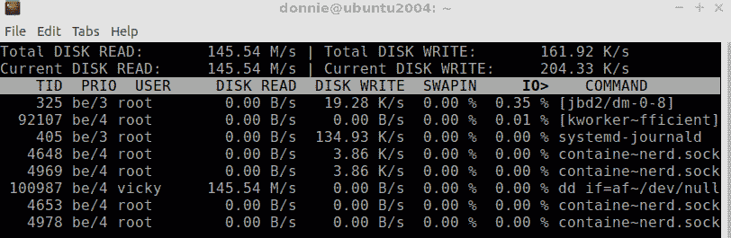

图 12.10 – Vicky 没有限制时的读取带宽

为了限制她的读取带宽，我们首先需要知道她是从哪里读取文件的。我们可以使用`lsblk`工具来获取线索，像这样：

```
donnie@ubuntu2004:~$ lsblk
NAME                      MAJ:MIN RM   SIZE RO TYPE MOUNTPOINT
loop0                       7:0    0  99.4M  1 loop /snap/core/11316
. . .
. . .
sda                         8:0    0     1T  0 disk 
├─sda1                      8:1    0     1M  0 part 
├─sda2                      8:2    0     1G  0 part /boot
└─sda3                      8:3    0     1T  0 part 
  └─ubuntu--vg-ubuntu--lv 253:0    0   200G  0 lvm  /
sdb                         8:16   0    10G  0 disk 
└─sdb1                      8:17   0    10G  0 part /media/backup
sr0                        11:0    1  1024M  0 rom  
donnie@ubuntu2004:~$
```

我们知道 Vicky 的文件在她自己的主目录下。我们在这里看到，`/home/`目录没有单独挂载。所以，它必须位于根分区，该分区作为逻辑卷挂载在`/dev/sda`驱动器上。现在，假设我们想将 Vicky 的读取带宽限制为每秒仅 1MB。命令如下：

```
donnie@ubuntu2004:~$ sudo systemctl set-property user-1001.slice BlockIOReadBandwidth="/dev/sda 1M"
[sudo] password for donnie: 
donnie@ubuntu2004:~$
```

注意，设备名称和速率限制设置都必须用一对双引号括起来。此外，请注意，我们为整个驱动器设置了带宽限制，而不仅仅是为特定的分区或逻辑卷设置。当然，我们在`/etc/systemd/system.control/`目录中创建了一个新的设置文件，因此一定要执行`daemon-reload`。

接下来，让 Vicky 重复她的`dd if=afile of=/dev/null`命令。请注意，凭借她的带宽限制，这将需要一段时间才能完成。在运行时，请注意 Vicky 在`iotop`窗口中的减少速度：

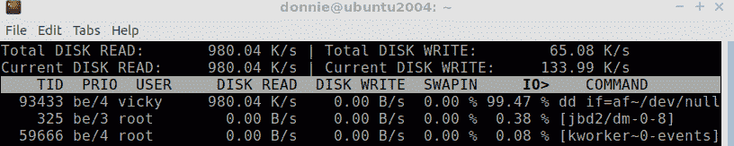

图 12.11 – Vicky 的带宽限制

是的，她的速度稍低于每秒 1MB，正是我们希望的状态。顺便说一句，如果你想在操作完成前中止它，也不要感到难过。以每秒 1MB 的速率，它将在很长时间后才会完成。

最后，在 Vicky 仍然登录的情况下，查看这个命令在 cgroup 文件系统中修改的属性文件：

```
donnie@ubuntu2004:/sys/fs/cgroup/blkio/user.slice/user-1001.slice$ cat blkio.throttle.read_bps_device 
8:0 1000000
donnie@ubuntu2004:/sys/fs/cgroup/blkio/user.slice/user-1001.slice$
```

在这个`blkio.throttle.read_bps_device`文件中，`8:0`表示`/dev/sda`设备的主设备号和次设备号，如下所示：

```
donnie@ubuntu2004:/dev$ ls -l sda
brw-rw---- 1 root disk 8, 0 Aug 19 14:01 sda
donnie@ubuntu2004:/dev$
```

## 为服务设置 blkio 限制

当然，你也可以为服务设置`BlockIOReadBandwidth`参数。例如，使用`set-property`选项为 Apache Web 服务器设置它。在 Ubuntu 机器上，命令如下：

```
donnie@ubuntu2004:~$ sudo systemctl set-property apache2.service BlockIOReadBandwidth="/dev/sda 1M"
```

在 AlmaLinux 机器上，命令如下：

```
[donnie@localhost ~]$ sudo systemctl set-property httpd.service BlockIOReadBandwidth="/dev/sda 1M"
```

如果你想在服务文件中设置这个`BlockIOReadBandwidth`参数，有一个技巧需要知道。当你在命令行上设置时，你必须将`/dev/sda 1M`部分用一对双引号括起来。但在服务文件中设置时，你*不*需要将`/dev/sda 1M`用双引号括起来。为了演示，让我们设置一个 FTP 服务器并对其设置`blkio`限制。在 Ubuntu 机器上，执行以下命令来安装 FTP 服务器：

```
donnie@ubuntu2004:~$ sudo apt install vsftpd
```

在 AlmaLinux 机器上，执行：

```
[donnie@localhost ~]$ sudo dnf install vsftpd
```

在任何一台机器上，通过以下操作编辑服务文件：

```
donnie@ubuntu2004:~$ sudo systemctl edit --full vsftpd
```

在`[Service]`部分，添加新的参数，但不要使用双引号：

```
[Service]
. . .
.. .
BlockIOReadBandwidth=/dev/sda 1M
```

运行`daemon-reload`并重新启动`vsftpd`服务。您应该能看到新的设置出现在 cgroup 文件系统中：

```
donnie@ubuntu2004:/sys/fs/cgroup/blkio/system.slice/vsftpd.service$ cat blkio.throttle.read_bps_device 
8:0 1000000
donnie@ubuntu2004:/sys/fs/cgroup/blkio/system.slice/vsftpd.service$
```

这里有比我们可以在这里介绍的更多的资源管理指令。要了解更多，请参考`systemd.resource-management`的 man 页面。

在我们结束本章之前，让我们有点不敬地谈谈`pam_limits`和`ulimit`，它们与 systemd 或 cgroups 完全无关。

# 理解 pam_limits 和 ulimit

在 cgroup 和 systemd 技术被发明之前，我们有其他方法来控制资源使用情况。这些方法仍然存在，并且我们可以使用它们来做一些 cgroups 做不到的事情。为了演示，让我们简要看一下这两种较旧的方法。

## ulimit 命令

`ulimit`命令允许我们动态控制 shell 会话和由 shell 会话启动的任何进程的资源使用情况。让我们使用`-a`选项查看当前 shell 会话的默认设置：

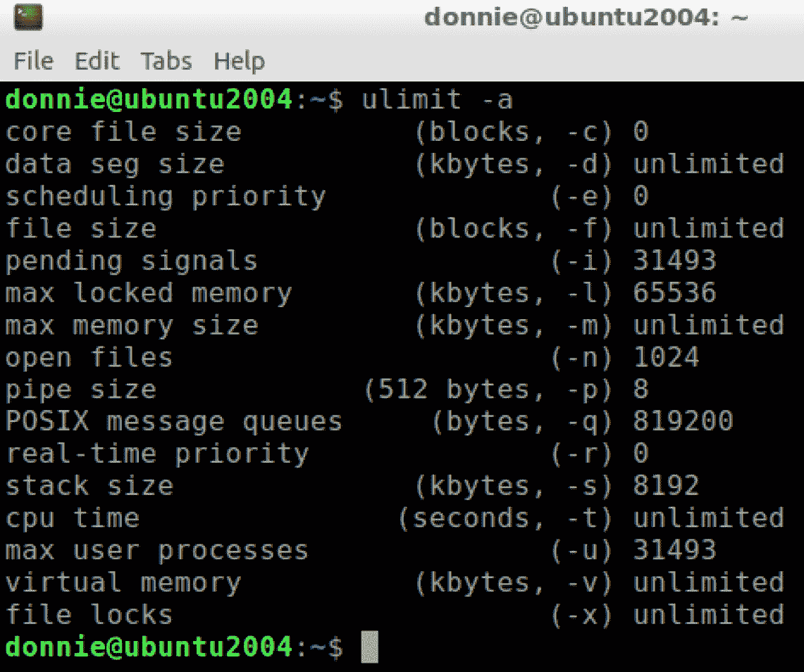

图 12.12 – 默认 ulimit 设置

正如您所看到的，执行`ulimit -a`命令还会显示我们用于设置各种限制的选项开关。关键在于，您可以作为普通用户设置或降低限制，但如果要增加任何限制，则需要使用`sudo`特权。例如，假设我们想将任何新文件的大小限制为仅为 10 MB。我们将使用`-f`选项，并以 1024 字节块的数量指定文件大小。10 MB 相当于 10,240 个块，因此我们的命令如下所示：

```
donnie@ubuntu2004:~$ ulimit -f 10240
donnie@ubuntu2004:~$
```

新的限制会显示在`ulimit -a`的输出中：

```
donnie@ubuntu2004:~$ ulimit -a
. . .
. . .
file size               (blocks, -f) 10240
. . .
. . .
```

现在，看看当我尝试增加这个限制时会发生什么：

```
donnie@ubuntu2004:~$ ulimit -f 20000
-bash: ulimit: file size: cannot modify limit: Operation not permitted
donnie@ubuntu2004:~$
```

因此，普通用户可以设置以前未设置的限制，但是增加现有限制需要`sudo`特权。但是，您可以通过关闭终端窗口并打开新窗口或注销并重新登录来将所有内容重置为默认设置。然后，只需设置一个新的限制，使其为所需的任何内容。

现在，当我尝试创建一个大小为 10 MB 的文件时，一切正常：

```
donnie@ubuntu2004:~$ dd if=/dev/zero of=afile bs=1M count=10
10+0 records in
10+0 records out
10485760 bytes (10 MB, 10 MiB) copied, 0.0440278 s, 238 MB/s
donnie@ubuntu2004:~$
```

但是当我尝试创建一个 11 MB 的文件时，情况就不那么顺利了：

```
donnie@ubuntu2004:~$ dd if=/dev/zero of=afile bs=1M count=11
File size limit exceeded (core dumped)
donnie@ubuntu2004:~$
```

对于需要测试新软件的开发人员或需要在 shell 脚本中设置资源限制的任何人来说，`ulimit`命令非常有用。要详细了解`ulimit`，请打开`bash-builtins`的 man 页面并搜索`ulimit`。

接下来，让我们谈谈如何使用配置文件来设置限制。

## pam_limits 模块

`pam_limits`模块是`/etc/security/limits.conf`文件的一部分，或通过在`/etc/security/limits.d/`目录中创建新的附加文件来实现。要了解其工作原理，打开`/etc/security/limits.conf`文件并查看已注释的示例。要获取更详细的说明，请查看`limits.conf`的 man 页面。

假设我们要阻止 Pogo 创建大于 20 MB 的任何文件。我们可以通过在 `/etc/security/limits.conf` 文件的底部添加一行来实现，内容如下：  

```
. . .
. . .
#<domain>      <type>  <item>         <value>
#
. . .
. . .
pogo            hard    fsize           20480
# End of file
```

以 Pogo 用户身份登录，并让他尝试创建一个文件：  

```
pogo@ubuntu2004:~$ dd if=/dev/zero of=afile bs=1M count=19
19+0 records in
19+0 records out
19922944 bytes (20 MB, 19 MiB) copied, 0.0989717 s, 201 MB/s
pogo@ubuntu2004:~$
```

一直重复这个命令，增加 `count=` 数量，直到出现错误。

好的，我想这一章的内容就差不多了。让我们结束这部分内容吧。  

# 摘要  

在这一章中，我们了解了使用 cgroups 版本 1 控制资源的基础知识。你在网络搜索中看到的很多信息已经过时并且有些混乱。我的目标是为你带来最新的信息，并以易于理解的方式呈现。  

我们首先查看了 cgroups 版本 1 控制器，并简要解释了每一个。然后，我们展示了如何控制用户和服务的 CPU 使用、内存使用以及块设备带宽使用。最后，我们通过展示旧的、非 cgroup 的限制设置方法来结束，这种方法依然有用。  

在下一章中，我们将探讨 cgroups 版本 2。到时见。  

# 问题  

1.  你的计算机有六个 CPU 核心。如果你想限制 Vicky 每个 CPU 核心的使用率为 16.66%，那么她的 `CPUQuota` 设置应为多少？  

    A. 16.66%  

    B. 33.00%  

    C. 100%  

    D. 200%  

1.  根据 `systemd.resource-control` 手册页，以下哪个指令代表限制某人内存使用的最现代方法？  

    A. `MemoryLimit`  

    B. `MemoryMax`  

    C. `LimitMemory`  

    D. `MaxMemory`  

1.  `--runtime` 选项对于 `systemctl set-property` 命令的作用是什么？  

    A. 它使新的设置变为永久。  

    B. 没有任何影响，因为它已经是默认行为。  

    C. 它使新的设置变为临时。  

    D. 它使得命令运行更快。  

1.  以下哪个关于 CPU 负载平均值的说法是正确的？  

    A. 拥有更多 CPU 核心的机器可以处理更高的 CPU 负载平均值。  

    B. CPU 负载平均值与机器拥有多少个 CPU 核心无关。  

    C. 过度的内存使用不会导致 CPU 负载平均值过高。  

    D. 高 CPU 负载平均值对任何机器没有影响。  

# 答案  

1.  C  

1.  B  

1.  C  

1.  A  

# 进一步阅读  

+   使用 `systemd` 的 cgroups 版本 1：  

    [`access.redhat.com/documentation/en-us/red_hat_enterprise_linux/8/html/managing_monitoring_and_updating_the_kernel/using-control-groups-version-1-with-systemd_managing-monitoring-and-updating-the-kernel`](https://access.redhat.com/documentation/en-us/red_hat_enterprise_linux/8/html/managing_monitoring_and_updating_the_kernel/using-control-groups-version-1-with-systemd_managing-monitoring-and-updating-the-kernel)  

+   Linux 内核完全公平调度器：  

    [`www.kernel.org/doc/html/latest/scheduler/sched-design-CFS.html`](https://www.kernel.org/doc/html/latest/scheduler/sched-design-CFS.html)  

+   对于仍需在具有多个 CPU 的机器上使用 RHEL 7 或 RHEL 7 克隆的人，以下是使用 `cpuset` 控制器的步骤：  

    [`www.redhat.com/en/blog/world-domination-cgroups-part-6-cpuset`](https://www.redhat.com/en/blog/world-domination-cgroups-part-6-cpuset)

+   如何永久设置`ulimit`值：

    [`linuxhint.com/permanently_set_ulimit_value/`](https://linuxhint.com/permanently_set_ulimit_value/)
