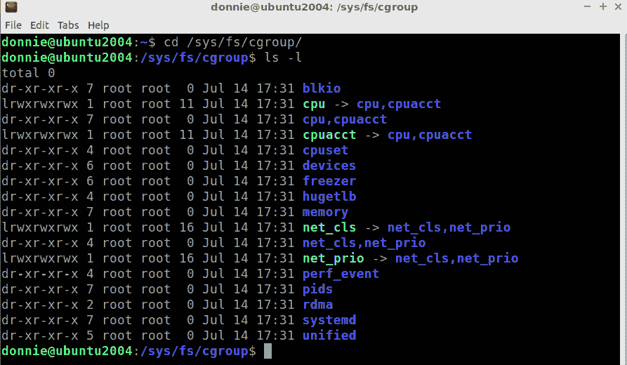
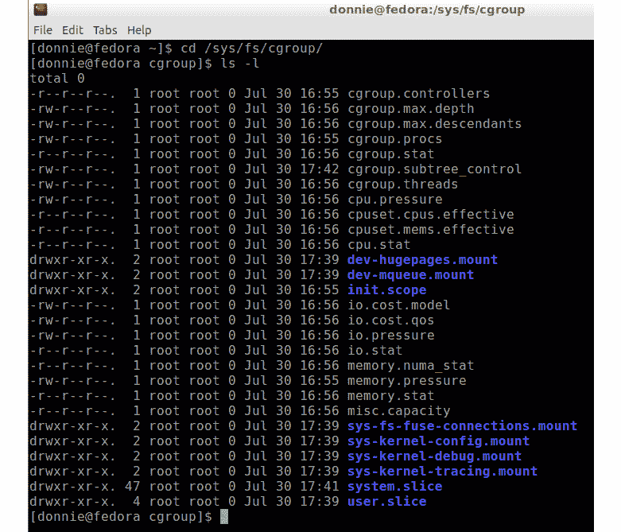
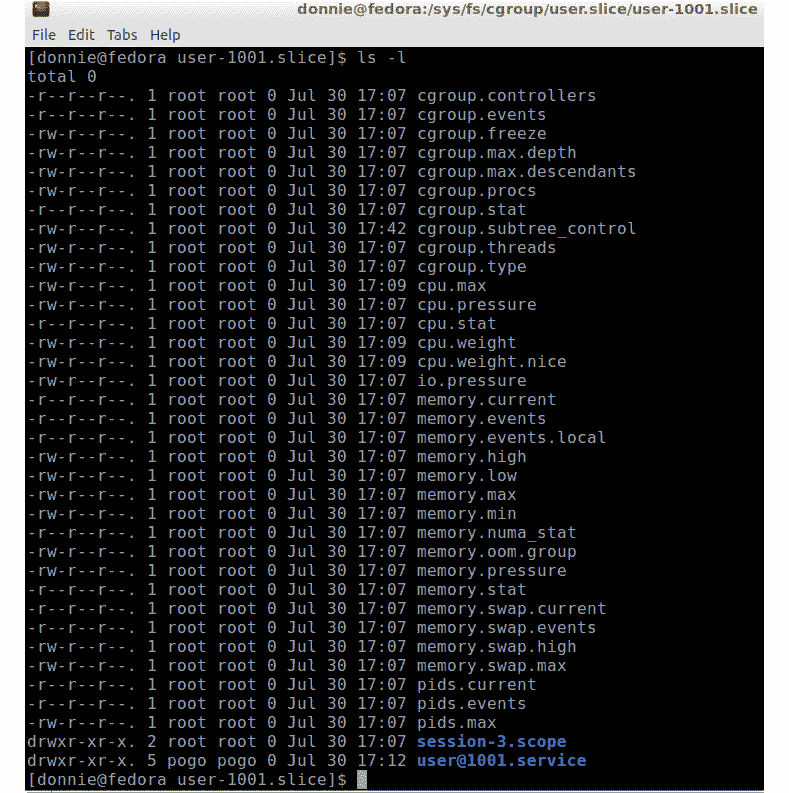

# 第十三章：理解 cgroup Version 2

在本章中，我们将讨论**cgroup** **Version 2**。我们将看到它与**cgroups** **Version 1**有何不同，以及它如何在 Version 1 的基础上进行改进。之后，我们将简要了解如何使用它。最后，我们将把**AlmaLinux**机器转换为使用 cgroup Version 2。学习如何使用 cgroup Version 2 将对新软件开发者以及希望为未来做好准备的**Linux**管理员非常有帮助。

顺便提一下，章节标题中的这个并不是打字错误。Version 2 的一个变化是官方名称的变化。所以，我们有*cgroups* Version 1 和*cgroup* Version 2。听起来很奇怪，但是真的。（我之前没有解释过这个，因为我不想引起更多混淆。）

本章中的具体主题包括：

+   理解 Version 2 的需求

+   理解 Version 2 的改进

+   设置无根容器的资源限制

+   理解**cpuset**

+   将 RHEL 8 类发行版转换为 cgroup Version 2

介绍完毕，让我们开始吧。

# 技术要求

这次，我们将使用一台**Fedora** **虚拟机**，该虚拟机配置为尽可能使用更多的 CPU 核心和内存。（我的虚拟机仍然设置为使用四个 CPU 核心和 8GB 内存。）因此，下载你喜欢的 Fedora 版本，并从中创建虚拟机。

对于*理解 cpuset*部分，最好使用至少有两个物理 CPU 的主机。我知道不是每个人都有机会使用这样的机器，但没关系。我有这样一台机器，所以我可以向你展示你需要看到的内容。

我们还将使用 AlmaLinux 机器进行几次简短的演示。

好的，让我们开始吧。

查看以下链接以观看《代码实战》视频：[`bit.ly/3xJNcDx`](https://bit.ly/3xJNcDx)

# 理解 Version 2 的需求

尽管 cgroups Version 1 已经相当不错，但它确实存在一些相当严重的缺陷。我们来快速看一下。

## Version 1 的复杂性

首先，Version 1 拥有过多的资源控制器和每个控制器上过多的属性。很少有人会使用我们在*第十二章*中介绍的那三个主要的控制器，资源使用控制通过 cgroups Version 1 来实现。Version 2 去除了一些不必要的控制器。

Version 1 层次结构的复杂性也过高，这使得它的使用有些混乱，并且可能影响性能。要理解我的意思，回想一下我们在 Version 1 的`cgroup`文件系统中看到的内容。你会发现，每个资源控制器都有自己的子目录，就像我们在这里看到的那样：



图 13.1 – Ubuntu 上 Version 1 的资源控制器

在*第十二章*，《使用 cgroups Version 1 控制资源使用》中，我们也看到，当我们为 Vicky 设置`CPUQuota`时，它出现在她的`user-1001.slice`子目录下，这个目录位于`cpu/user.slice`子目录下，像这样：

```
vicky@ubuntu2004:/sys/fs/cgroup/cpu/user.slice/user-1001.slice$ cat cpu.cfs_quota_us 
200000
vicky@ubuntu2004:/sys/fs/cgroup/cpu/user.slice/user-1001.slice$
```

然后，当我们设置`MemoryMax`限制时，它出现在`memory`子目录下，像这样：

```
vicky@ubuntu2004:/sys/fs/cgroup/memory/user.slice/user-1001.slice$ cat memory.max_usage_in_bytes 
30994432
vicky@ubuntu2004:/sys/fs/cgroup/memory/user.slice/user-1001.slice$
```

好的，你绝对猜不到，当我们设置 Vicky 的`BlockIOReadBandwidth`参数时发生了什么。没错，它出现在`blkio`子目录下，像这样：

```
vicky@ubuntu2004:/sys/fs/cgroup/blkio/user.slice/user-1001.slice$ cat blkio.throttle.read_bps_device 
8:0 1000000
vicky@ubuntu2004:/sys/fs/cgroup/blkio/user.slice/user-1001.slice$
```

所以你看，Vicky 的设置在三个不同的地方，这意味着操作系统必须查看所有三个地方才能获取完整的设置。

注意

我不小心用了 Vicky 的登录窗口，而不是我自己的截图工具，不过没关系。这说明 Vicky 可以查看她自己 cgroup 文件中的设置。当然，她无法更改设置，因为她没有正确的 root 权限。

## Version 1 属性文件名

Version 1 的另一个问题是，不同资源控制器的属性文件没有统一的命名规范。例如，在 Version 1 中，设置`MemoryMax`会将值放入`memory.max_usage_in_bytes`文件中，就像我们在这里为 Vicky 看到的那样：

```
donnie@ubuntu2004:/sys/fs/cgroup/memory/user.slice/user-1001.slice$ cat memory.max_usage_in_bytes 
30789632
donnie@ubuntu2004:/sys/fs/cgroup/memory/user.slice/user-1001.slice$
```

然而，Vicky 的`CPUQuota`设置出现在`cpu.cfs_quota_us`文件中，正如我们在这里看到的：

```
donnie@ubuntu2004:/sys/fs/cgroup/cpu/user.slice/user-1001.slice$ cat cpu.cfs_quota_us 
200000
donnie@ubuntu2004:/sys/fs/cgroup/cpu/user.slice/user-1001.slice$
```

正如我们稍后会看到的，命名约定在第 2 版中要一致得多。

好的，让我们从真正的根本问题入手，讨论一下*无 root 容器*。

## 不支持无 root 权限的容器

正如你在*第五章*《创建和编辑服务》中看到的，我们可以使用`podman`创建并运行**Docker**容器，而不需要 root 权限或 docker 组的成员资格。然而，在 cgroups Version 1 中，非特权用户无法在创建容器时设置运行时资源限制。例如，让我们去 AlmaLinux 机器，并为我的朋友 Pogo 创建一个新用户账户，操作如下：

```
[donnie@localhost ~]$ sudo useradd pogo
[donnie@localhost ~]$ sudo passwd pogo
```

看看这个可怜的家伙试图创建一个 50%的`CPUQuota`容器时发生了什么：

```
[pogo@localhost ~]$ podman run -it --cpu-period=100000 --cpu-quota=50000 ubuntu /bin/bash
Error: OCI runtime error: container_linux.go:367: starting container process caused: process_linux.go:495: container init caused: process_linux.go:458: setting cgroup config for procHooks process caused: cannot set cpu limit: container could not join or create cgroup
[pogo@localhost ~]$
```

唉，可怜的 Pogo 没有 root 权限。所以，他可以创建和运行`podman`容器，但无法为它们设置任何资源限制。

注意

事实上，在 cgroups Version 1 中，非特权用户确实可以为无 root 权限的`podman`容器设置运行时资源限制。但这需要你将此权限委派给非 root 用户。在 cgroups Version 1 中，这构成了安全隐患，因为它可能允许某人创建一个容器，进而冻结你的系统。所以，我们不打算这么做（稍后我们会详细讨论委派问题）。

现在，让我们来对比一下在运行纯 cgroup Version 2 环境的 Fedora 机器上看到的情况。

# 理解 cgroup Version 2 中的改进

版本 2 更加简化，易于理解。在写这篇文章时，我知道只有 **Arch**、**Debian 11** 和 Fedora 这三个 Linux 发行版默认运行 cgroup 版本 2（到你读这篇文章时，这个情况可能会有所变化）。

注意

你可以将 RHEL 8 类型的发行版，例如 **Alma** 和 **Rocky**，转换为纯版本 2 设置。不幸的是，RHEL 类型的发行版使用的是版本 2 的较旧实现，其中一些我们需要的资源控制器仍未启用。因此，为了查看我们需要看到的所有内容，我们将使用 Fedora。

首先，让我们登录到 Fedora 机器，并为我的朋友 Pogo 创建一个用户账户（Pogo 是那只从我家的猫门进来、晚上来吃猫粮的超棒负鼠——是的，是真的。）。然后，让 Pogo 从远程终端登录（请注意，在 Fedora 上，你可能需要先启动并启用 `sshd` 服务）。在你本地的终端中，查看 cgroup 文件系统，内容如下所示：



图 13.2 – Fedora 上的 cgroup 文件系统

我们在这里看到的属性文件是用于全局设置的，目前我们暂时不关心这些。真正需要你注意的是 `system.slice` 和 `user.slice` 子目录下的内容。我们先看一下 `user.slice` 子目录。

在 `user.slice` 子目录下，你会看到许多可以在用户切片级别设置的文件。底部，我们看到了 Pogo 和我自己的子目录，正如这里所示：

```
[donnie@fedora user.slice]$ ls -l
total 0
-r--r--r--. 1 root root 0 Jul 30 16:55 cgroup.controllers
. . .
. . .
-rw-r--r--. 1 root root 0 Jul 30 16:55 pids.max
drwxr-xr-x. 5 root root 0 Jul 30 17:24 user-1000.slice
drwxr-xr-x. 4 root root 0 Jul 30 17:09 user-1001.slice
[donnie@fedora user.slice]$
```

每个用户切片子目录都包含所有资源控制器的属性文件，如我们在这里看到的：



图 13.3 – 用户-1001.slice 的资源控制器

所以现在，特定用户的所有适用设置都将包含在该用户的 `user slice` 目录中。操作系统现在只需要在一个地方查找该用户的所有设置。

接下来，让 Pogo 从远程终端登录。然后，在你自己的终端窗口中，为 Pogo 设置 `CPUQuota`。好消息是，执行此操作的命令和版本 1 完全相同。如果你不记得了，命令是：

```
[donnie@fedora ~]$ sudo systemctl set-property user-1001.slice CPUQuota=40%
[sudo] password for donnie: 
[donnie@fedora ~]$
```

然后，执行 `daemon-reload`。完成后，查看 Pogo 用户切片目录中的 `cpu.max` 文件，其内容应该如下所示：

```
[donnie@fedora ~]$ cd /sys/fs/cgroup/user.slice/user-1001.slice/
[donnie@fedora user-1001.slice]$ cat cpu.max
40000 100000
[donnie@fedora user-1001.slice]$
```

`40000` 表示 40% 的 `CPUShare`，而 `100000` 表示测量 `CPUShare` 的时间间隔。默认的时间设置是 100 毫秒（你可以更改这个时间间隔，但你很可能永远不需要这样做）。

你也可以像设置版本 1 一样设置 Pogo 的内存限制，如我们在这里所示：

```
[donnie@fedora user-1001.slice]$ sudo systemctl set-property user-1001.slice MemoryMax=1G
[sudo] password for donnie: 
[donnie@fedora user-1001.slice]$
```

这次，设置出现在 Pogo 的 `memory.max` 文件中，如我们在这里看到的：

```
[donnie@fedora user-1001.slice]$ cat memory.max
1073741824
[donnie@fedora user-1001.slice]$
```

现在，理解这个 `MemoryMax` 设置是一个硬限制。换句话说，Pogo 绝对不能使用超过 `MemoryMax` 分配的内存。如果你查看 `systemd.resource-control` 的 man 页面，你会看到版本 2 中可用的一些其他选项，而版本 1 中没有。（请注意，该 man 页面总是将 cgroup 版本 2 称为 *统一控制组层次结构*。）其中一个参数是 `MemoryHigh`，它更像是一个软限制。如果不可避免，`MemoryHigh` 允许 Pogo 超过其内存分配，但他的进程会被限制，直到他的内存使用降回到分配的范围内。这使得系统更容易处理任何给定进程或用户的内存使用临时峰值。

版本 2 还具有 `MemoryLow` 和 `MemoryMin` 参数，当受保护进程的空闲内存降至指定阈值时，这些参数会导致进程从未受保护进程中回收内存。如果你想控制交换内存的使用，版本 2 允许你通过 `MemorySwapMax` 参数来实现。

设置 `block I/O` 使用限制有些不同，因为参数名称已经发生了变化。为了限制 Pogo 的读取带宽，我们首先使用 `df` 查看我们有哪些驱动器设备，如下所示：

```
[donnie@fedora ~]$ df -h | grep -v tmpfs
Filesystem      Size  Used Avail Use% Mounted on
/dev/sda2        21G  2.6G   18G  13% /
/dev/sda2        21G  2.6G   18G  13% /home
/dev/sda1       976M  256M  654M  29% /boot
[donnie@fedora ~]$
```

Fedora 的桌面版本现在默认使用 `btrfs` 文件系统，这就是为什么我们看到的是常规的驱动器分区而不是逻辑卷。（使用 `btrfs` 时无需使用逻辑卷，因为它具有内置的驱动器池机制。）如果你使用的是 `ext4` 和逻辑卷，情况就不一样了。不管怎样，我们看到 `/home/` 目录挂载在 `/dev/sda` 驱动器上，当然这就是 Pogo 的主目录所在。（正如我们在版本 1 中看到的，你可以对整个驱动器设置速率限制，但不能对该驱动器的特定分区设置限制。）

现在我们将使用 `IOReadBandwidthMax` 参数来限制 Pogo 文件传输的速率，像这样：

```
[donnie@fedora ~]$ sudo systemctl set-property user-1001.slice IOReadBandwidthMax="/dev/sda 1M"
[sudo] password for donnie: 
[donnie@fedora ~]$
```

请注意，由于 `/dev/sda 1M` 参数中有空格，因此在从命令行设置时，必须将其用一对双引号（`""`）括起来。

接下来，查看 Pogo 用户切片目录中的 `io.max` 文件，应该是这样的：

```
[donnie@fedora user-1001.slice]$ cat io.max
8:0 rbps=1000000 wbps=max riops=max wiops=max
[donnie@fedora user-1001.slice]$
```

在这里，我们看到了使用版本 2 的另一个好处。与版本 1 中有四个单独的属性文件来存放四个可用的参数设置不同，版本 2 将 `IOReadBandwidthMax`、`IOWriteBandwidthMax`、`IOReadIOPSMax` 和 `IOWriteIOPSMax` 设置放在了一个文件中。

另外，注意我们在 `io.max` 文件中看到的行首的 `8:0`，它表示整个 `sda` 驱动器的主设备号和次设备号，如下所示：

```
[donnie@fedora dev]$ pwd
/dev
[donnie@fedora dev]$ ls -l sd*
brw-rw----. 1 root disk 8, 0 Jul 31 14:30 sda
brw-rw----. 1 root disk 8, 1 Jul 31 14:30 sda1
brw-rw----. 1 root disk 8, 2 Jul 31 14:30 sda2
[donnie@fedora dev]$
```

好的，如果你真的想要，你可以像在 *第十二章* 中为 Vicky 所做的那样，尝试使用 `stress-ng` 来测试 Pogo，*使用 cgroups 版本 1 控制资源使用*，但我不会在这里重复相关的操作步骤。

设置服务限制时需要知道的主要事项是，每个系统服务在 `/sys/fs/cgroup/system.slice/` 目录下都有自己的子目录，正如我们在这里看到的：

```
[donnie@fedora system.slice]$ pwd
/sys/fs/cgroup/system.slice
[donnie@fedora system.slice]$ ls -l
total 0
drwxr-xr-x. 2 root root 0 Jul 31 14:30  abrtd.service
drwxr-xr-x. 2 root root 0 Jul 31 14:30  abrt-journal-core.service
drwxr-xr-x. 2 root root 0 Jul 31 14:30  abrt-oops.service
drwxr-xr-x. 2 root root 0 Jul 31 14:30  abrt-xorg.service
drwxr-xr-x. 2 root root 0 Jul 31 14:30  alsa-state.service
drwxr-xr-x. 2 root root 0 Jul 31 14:31  atd.service
drwxr-xr-x. 2 root root 0 Jul 31 14:30  auditd.service
. . .
. . . 
```

在这些子目录中，你会看到与 Pogo 相同的属性文件。此外，设置服务限制的过程与 Version 1 相同，所以我也不会重复这些内容。

注意

请注意，一些你习惯在 cgroups Version 1 下使用的参数，在 cgroups Version 2 中已经被重命名。具体来说，Version 1 中的 `CPUShares`、`StartupCPUShares` 和 `MemoryLimit` 参数已经分别被 `CPUWeight`、`StartupCPUWeight` 和 `MemoryMax` 替代。此外，所有以 `BlockIO` 前缀命名的 Version 1 参数，已被以 `IO` 前缀命名的参数替代。

好的，现在我们了解了 cgroup Version 2 文件系统，让我们看看能否让 Pogo 在无根容器上设置一些资源限制。

# 在无根容器上设置资源限制

刚才，我向你介绍了 *委派* 的概念。通常，你需要根权限才能设置任何资源限制。然而，你可以将这项工作委派给非特权用户。最好的消息是，与 cgroups Version 1 中的委派不同，cgroups Version 2 中的委派是完全安全的。

要查看默认设置，请打开 `/lib/systemd/system/user@.service` 文件，并在 `[Service]` 部分中查找 `Delegate=` 行。相关行应该像这样：

```
[Service]
. . .
. . .
Delegate=pids memory
. . .
. . .
```

默认情况下，Fedora 只允许非特权用户设置内存和最大运行进程数的资源限制。我们需要编辑这个配置，以包括 `cpu`、`cpuset` 和 `io` 资源控制器，像这样：

```
[donnie@fedora ~]$ sudo systemctl edit --full user@.service
```

编辑 `Delegate=` 行，使其看起来像这样：

```
Delegate=pids memory io cpu cpuset
```

保存文件并执行 `daemon-reload`。请注意，如果有用户已登录，他们可能需要注销并重新登录才能使其生效。

保持 Pogo 原来的登录窗口打开，然后为他再打开一个新的窗口。他将在一个窗口中创建一个容器，在第二个窗口中查看该容器信息。让 Pogo 创建一个 **Ubuntu** 容器，像这样：

```
[pogo@fedora ~]$ podman run -it --cpu-period=100000 --cpu-quota=50000 ubuntu /bin/bash
root@207a59e45e9b:/#
```

Pogo 正在设置一个 `CPUQuota` 为 `50%` 的限制，时间间隔为 100 毫秒。在 Pogo 的另一个登录窗口中，让他查看他的容器信息。他会首先执行 `podman ps`，像这样：

```
[pogo@fedora ~]$ podman ps
CONTAINER ID  IMAGE                            COMMAND     CREATED         STATUS             PORTS       NAMES
207a59e45e9b  docker.io/library/ubuntu:latest  /bin/bash   55 minutes ago  Up 55 minutes ago              funny_zhukovsky
[pogo@fedora ~]$
```

Pogo 没有为这个容器指定名称，因此 `podman` 随机分配了名称 `funny_zhukovsky`。（记住，Pogo 是一只负鼠，所以不要因为他忘记指定名称而太苛责他。）现在，让 Pogo 使用生成的容器名称来检查这个容器的内部工作：

```
[pogo@fedora ~]$ podman inspect funny_zhukovsky
```

这里输出很多内容，但你只需要关注两行。继续向下滚动，你应该能找到它们。它们应该像这样：

```
"CpuPeriod": 100000,
"CpuQuota": 50000,
```

到目前为止，一切都还好。但问题是，这个容器的属性文件深藏在 cgroup 文件系统中，难以找到。幸运的是，Pogo 比我想象的更聪明，所以他找到了一个作弊的方法。他知道`50000`这个文本字符串只会出现在他用户切片目录下的一个属性文件中，因此他使用`grep`命令来找到它，像这样：

```
[pogo@fedora ~]$ cd /sys/fs/cgroup/user.slice/user-1001.slice/
[pogo@fedora user-1001.slice]$ grep -r '50000' *
user@1001.service/user.slice/libpod-207a59e45e9b14c3397d9904b41ba601dc959d85962e6ede45a1b54463ae731b.scope/container/cpu.max:50000 100000
[pogo@fedora user-1001.slice]$
```

最后，Pogo 找到了属性文件：

```
[pogo@fedora container]$ pwd
/sys/fs/cgroup/user.slice/user-1001.slice/user@1001.service/user.slice/libpod-207a59e45e9b14c3397d9904b41ba601dc959d85962e6ede45a1b54463ae731b.scope/container
[pogo@fedora container]$ cat cpu.max
50000 100000
[pogo@fedora container]$
```

这就是关于无根容器的全部内容。接下来，我们来讨论`cpuset`。

# 理解 cpuset

当你处理一个运行大量容器和进程的服务器时，有时将某个容器或进程分配给特定的 CPU 核心或一组 CPU 核心会更有益。对于具有多个物理 CPU 的机器，分配内存节点也可能会有所帮助。为了理解我说的内容，可以在你的 Fedora 机器上安装`numactl`，像这样：

```
[donnie@fedora ~]$ sudo dnf install numactl
```

使用`-H`选项查看硬件列表，像这样：

```
[donnie@fedora ~]$ numactl -H
available: 1 nodes (0)
node 0 cpus: 0 1 2 3
node 0 size: 7939 MB
node 0 free: 6613 MB
node distances:
node   0 
  0:  10 
[donnie@fedora ~]$
```

有一个`NUMA`节点，即`节点 0`，并且它与四个 CPU 相关联。实际上，只有*一个 CPU*，它有*四个 CPU 核心*。我们还可以看到分配给这个节点的内存量。

所以，现在你可能会说，*但是 Donnie，什么是 NUMA？我为什么要关心它？* 好吧，**NUMA** 代表 **非一致性内存访问**。它与操作系统如何处理具有多个物理 CPU 的机器上的内存有关。在只有一个 CPU 的系统上，比如你的 Fedora 虚拟机，NUMA 对我们没有任何作用，因为只有一个内存节点。在具有多个 CPU 的机器上，每个 CPU 都有自己关联的内存节点。例如，看看这是我一块废旧主板的照片：


图 13.4 – 一块双 CPU 主板

有两个 CPU 插槽，每个插槽都有自己的一组内存插槽。每组内存构成一个 NUMA 节点。现在，我们来看一下我正在运行的多 CPU 系统，这是一个旧的**惠普**工作站，配备了两颗四核**AMD** **Opteron**处理器，并运行**Fedora 34**：

```
[donnie@fedora-teaching ~]$ numactl -H
available: 2 nodes (0-1)
node 0 cpus: 0 2 4 6
node 0 size: 7959 MB
node 0 free: 6982 MB
node 1 cpus: 1 3 5 7
node 1 size: 8053 MB
node 1 free: 7088 MB
node distances:
node   0   1 
  0:  10  20 
  1:  20  10 
[donnie@fedora-teaching ~]$
```

这次，我们看到了两个 NUMA 节点。偶数号的 CPU 核心被分配给`节点 0`，而奇数号的 CPU 核心被分配给`节点 1`。

默认情况下，大多数进程在启动时会随机选择一个 CPU 核心或一组 CPU 核心运行。有时，操作系统可能会将正在运行的进程从一个核心或一组核心移到另一个核心。像我这里的普通工作站，这并不重要。但如果是在运行大量进程的服务器上，这可能很重要。你可能通过将某些进程分配到专用的 CPU 核心和 NUMA 节点来提高效率和性能。如果你使用的是 cgroups 版本 1，那么你需要做很多繁琐的工作来使其生效，因为版本 1 的 `cpuset` 控制器无法直接与 `systemd` 配合使用。而使用 cgroup 版本 2，这就轻松多了。你只需要使用 `systemctl set-property` 来设置 `AllowedCPUs=` 和 `AllowedMemoryNodes=` 参数，或者在服务文件的 `[Service]` 部分中进行设置。

现在，即使你只有一个 CPU 的 Fedora 虚拟机，你仍然可以尝试这样做，看看效果如何。首先，通过以下命令安装 **Apache** 网络服务器：

```
[donnie@fedora ~]$ sudo dnf install httpd
[donnie@fedora ~]$ sudo systemctl enable --now httpd
```

接下来，将 Apache 服务分配给 CPU 核心 `0` 和 `2`，像这样：

```
sudo systemctl set-property httpd.service AllowedCPUs="0 2"
```

提醒

像之前一样，记得将任何包含空格的参数集用一对双引号括起来。

现在，假设这台虚拟机有多个 NUMA 节点，将 Apache 服务分配给 NUMA 节点 `0`，像这样：

```
sudo systemctl set-property httpd.service AllowedMemoryNodes=0
```

这两个命令将影响 `cpuset.cpus` 和 `cpuset.mems` 属性文件，如你所见：

```
[donnie@fedora httpd.service]$ pwd
/sys/fs/cgroup/system.slice/httpd.service
[donnie@fedora httpd.service]$ cat cpuset.cpus
0,2
[donnie@fedora httpd.service]$ cat cpuset.mems
0
[donnie@fedora httpd.service]$
```

在我可靠的双 CPU 惠普电脑上，我改动了 `httpd.service` 文件，添加了这两个参数。新增的两行如下：

```
. . .
. . .
[Service]
. . .
. . .
AllowedCPUs=0 2
AllowedMemoryNodes=0
. . .
. . .
```

所以，在这两个例子中，我允许 Apache 使用 CPU 核心 0 和 2，它们都与 NUMA `node 0` 相关联。

提示

你可以用逗号或空格分隔列表中的核心编号，或者使用连字符（-）列出 CPU 核心的范围。另外，注意，当你在单元文件中添加 `AllowedCPUs=` 参数时，不需要将 0 2 括在双引号中。

在执行 `daemon-reload` 并重新启动 Apache 服务后，我们应该能看到相应的属性文件出现在 `/sys/fs/cgroup/system.slice/httpd.service/` 目录下。再看一下 `cpuset.cpus` 文件的样子：

```
[donnie@fedora-teaching httpd.service]$ cat cpuset.cpus
0,2
[donnie@fedora-teaching httpd.service]$
```

很好。Apache 正在 `0` 和 `2` CPU 核心上运行，正如我们所希望的那样。现在，让我们查看 `cpuset.mems` 文件：

```
[donnie@fedora-teaching httpd.service]$ cat cpuset.mems
0
[donnie@fedora-teaching httpd.service]$
```

再次确认，这正是我们想要看到的。Apache 现在只能使用 NUMA `node 0`。因此，得益于 cgroup 版本 2，我们通过最小的努力就实现了酷炫的效果。

注意

NUMA 并不意味着在一个 CPU 上运行的进程无法访问另一个 CPU 所在 NUMA 节点的内存。默认情况下，任何进程都可以访问所有 NUMA 节点上的所有系统内存。你可以使用 `AllowedMemoryNodes` 参数来更改这一点。

所以，现在你可能在想，"*我能在我的 RHEL 8 类型机器上使用 cgroup 版本 2 吗？*"。好吧，我们来看看。

# 将 RHEL 8 类型的发行版转换为 cgroup 版本 2

将 Red Hat Enterprise Linux 8 类型的发行版转换为 cgroup Version 2 是一件简单的事情。第一步是编辑你 AlmaLinux 机器上的 `/etc/default/grub` 文件。找到以 `GRUB_CMDLINE_LINUX=` 开头的行，并在该行的末尾添加 `systemd.unified_cgroup_hierarchy=1`。整个行现在应该看起来像这样：

```
GRUB_CMDLINE_LINUX="crashkernel=auto resume=/dev/mapper/vl-swap rd.lvm.lv=vl/root rd.lvm.lv=vl/swap rhgb quiet systemd.unified_cgroup_hierarchy=1"
```

接下来，像这样重建 `GRUB` 配置：

```
[donnie@localhost ~]$ sudo grub2-mkconfig -o /boot/grub2/grub.cfg
```

重启机器后，查看 `/sys/fs/cgroup/` 目录。你现在应该会看到与 Fedora 机器上相同的文件系统。不过，如果你不能让之前的实验都成功运行，不要太失望。这是因为 RHEL 8 类型的发行版都使用较旧版本的 Linux 内核，尚未启用所有 cgroup 资源控制器。它们会在 RHEL 8 发行版中启用吗？也许吧。Red Hat 的政策是为每个主要的 RHEL 版本在整个十年的生命周期内坚持使用一个固定的内核版本。因此，所有 RHEL 8 类型的发行版将一直停留在旧的内核版本 *4.18*，直到它们在 2029 年达到生命周期终结。Red Hat 有时会将新内核的特性回溯到它们的旧版 RHEL 内核中，但不能保证会对任何更新的 cgroup Version 2 代码做同样的事。无论如何，一旦你在 AlmaLinux 机器上看到所需的内容后，可以删除你在 `grub` 文件中所做的修改，并重建 GRUB 配置。这将把机器转换回使用 cgroup Version 1。

那么，你已经了解足够的 cgroup 了吗？希望还没有，因为这是一个值得深入学习的内容。不过，还有很多内容需要我们继续讲解，接下来就让我们继续吧。

# 总结

在本章中，我们学习了关于 cgroup Version 2 的许多内容。我们从讨论 cgroups Version 1 的不足开始，并介绍了 cgroup Version 2 是如何改进的。接着，我们探讨了如何允许非特权用户在其容器上设置资源限制，以及如何使用 `cpuset` 资源控制器。最后，我们简要了解了如何将 RHEL 8 类型的机器转换为使用 cgroup Version 2。

再次提醒，你一定在想，如果 cgroup Version 2 如此优秀，为什么它还没有被广泛采用呢？其实是因为某些关键程序和服务，尤其是容器化服务，仍然是硬编码为使用 Version 1。幸运的是，情况正在改善，可以大胆预测，Version 2 会在我们有生之年成为标准。

好的，这就结束了本书的第二部分。让我们从第三部分开始，讨论 `journald`。下次见！

# 问题

1.  以下哪一项说法是正确的？

    A. 你可以在 cgroup Version 1 下安全地使用 `podman` 设置无根容器的资源限制。

    B. 你可以在 cgroup Version 2 下安全地使用 `podman` 设置无根容器的资源限制。

    C. 你不能为 `podman` 容器设置资源限制。

    D. 设置无根`podman`容器的资源限制无需特殊权限。

1.  `MemoryMax`和`MemoryHigh`有什么区别？

    A. `MemoryMax`是硬性限制，`MemoryHigh`是软性限制。

    B. `MemoryHigh`是硬性限制，`MemoryMax`是软性限制。

    C. 它们都执行相同的操作。

    D. 它们都没有任何作用。

1.  以下哪项关于委托的说法是正确的？

    A. 对于 cgroup 版本 1 和 cgroup 版本 2 都是完全安全的。

    B. 仅对 cgroup 版本 1 是安全的。

    C. 使用委托永远不安全。

    D. 仅对 cgroup 版本 2 是安全的。

1.  将 RHEL 8 类型系统转换为 cgroup 版本 2 的第一步是什么？

    A. 编辑`/etc/grub.cfg`文件。

    B. 编辑`/etc/default/grub`文件。

    C. 编辑`/boot/grub2/grub.cfg`文件。

    编辑`/boot/grub`文件。

# 答案

1.  B

1.  A

1.  D

1.  B

# 进一步阅读

一篇关于 cgroup 版本 2 的 Red Hat 博客文章：

[`www.redhat.com/en/blog/world-domination-cgroups-rhel-8-welcome-cgroups-v2`](https://www.redhat.com/en/blog/world-domination-cgroups-rhel-8-welcome-cgroups-v2)

一篇**Oracle**博客文章，讲述为什么版本 2 比版本 1 更好：

[`blogs.oracle.com/linux/post/cgroup-v2-checkpoint`](https://blogs.oracle.com/linux/post/cgroup-v2-checkpoint)

比较版本 1 和版本 2：

[`chrisdown.name/talks/cgroupv2/cgroupv2-fosdem.pdf`](https://chrisdown.name/talks/cgroupv2/cgroupv2-fosdem.pdf)

使用 cgroup 版本 2 进行无根 Docker 容器管理：

[`rootlesscontaine.rs/getting-started/common/cgroup2/`](https://rootlesscontaine.rs/getting-started/common/cgroup2/)

cgroup v2 在容器中的当前采用状态：

[`medium.com/nttlabs/cgroup-v2-596d035be4d7`](https://medium.com/nttlabs/cgroup-v2-596d035be4d7)
