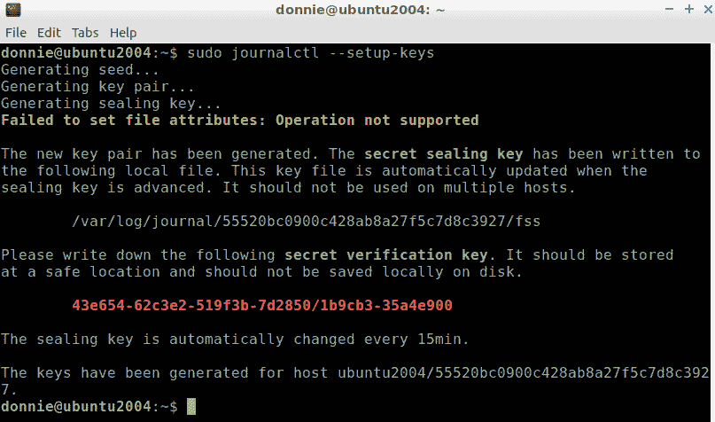

# *第十四章*：使用 journald

本章将关注一种新的日志记录方式。虽然 `journald` 日志系统不是 systemd 的 `init` 系统的一部分，但它是 `systemd` 生态系统的一部分。`journald` 系统相较于旧的 `rsyslog` 系统有其优势。然而，仍有几个主要原因使得我们还没有完全过渡到 `journald`。尽管如此，`journald` 仍然是一个重要工具，可以帮助繁忙的 Linux 管理员轻松查看系统发生了什么。

本章的具体主题包括：

+   理解 `rsyslog` 的优缺点

+   理解 `journald` 的优缺点

+   理解 Ubuntu 中的 `journald`

+   使用 `journalctl`

+   密封 `journald` 日志文件以确保安全

+   使用 `journald` 设置远程日志记录

# 技术要求

本章所需的只是你正常的 Ubuntu Server 20.04 和 Alma Linux 8 虚拟机。（你需要这两者，因为 `journald` 在每个系统中的实现方式不同。）现在，我们先来看看旧版的 `rsyslog`。

查看以下链接以观看 Code in Action 视频：[`bit.ly/3dbJmJR`](https://bit.ly/3dbJmJR)

# 理解 `rsyslog` 的优缺点

Fedora 是第一个将 `rsyslog` 作为默认日志系统的 Linux 发行版，早在 2007 年就推出了这一功能。它相比旧版 syslog 有不少改进，最终取代 syslog 成为 Linux、Unix 及类 Unix 操作系统上的标准日志系统。尽管现在有了 `journald`，`rsyslog` 仍然在我们身边，正如我们接下来所看到的。

`rsyslog` 的一个最佳特点也恰恰是它最大的弱点。也就是它以纯文本格式存储日志文件。从某种角度来说，这样很好，因为你可以使用常规的文本搜索和查看工具来查看日志文件，找到你需要的信息。less、head、tail、awk 和 grep 工具都是你处理这些纯文本日志文件时的好帮手。这也使得编写 shell 脚本来自动提取和解析信息变得非常简单。

但是使用纯文本日志文件还是存在一些问题。第一个问题是纯文本文件可能变得相当大，并最终消耗大量磁盘空间。为了解决这个问题，所有 Linux 发行版都配有 `logrotate` 系统，它会自动删除所有日志文件，只保留过去四周的文件。如果你需要保留比这更长时间的日志文件，你就需要编辑 `/etc/logrotate.conf` 文件，或者在 `logrotate` 自动删除它们之前将旧日志文件转移到其他地方。这也可能让查找变得有些尴尬。如果你在日志轮换发生后不久就搜索当前的日志文件，你会发现文件大部分是空的。然后，你就得通过归档文件查找你需要的内容。

第二个问题，至少根据 `journald` 的开发者所说，是 `rsyslog` 日志文件没有内置的方式来结构化显示，如以下 AlmaLinux 消息文件中的片段所示：

```
Jul 30 16:31:02 localhost rsyslogd[1286]: [origin software="rsyslogd" swVersion=
"8.1911.0-7.el8_4.2" x-pid="1286" x-info="https://www.rsyslog.com"] rsyslogd was
 HUPed
Jul 30 17:10:55 localhost journal[3086]: Could not delete runtime/persistent state file: Error removing file /run/user/1000/gnome-shell/runtime-state-LE.:0/screenShield.locked: No such file or directory
Jul 30 17:10:56 localhost NetworkManager[1056]: <info>  [1627679456.0025] agent-manager: agent[24ffba3d1b1cfac7,:1.270/org.gnome.Shell.NetworkAgent/1000]: agent registered
Jul 30 17:26:17 localhost systemd[1]: Starting dnf makecache...
Jul 30 17:26:17 localhost dnf[4951]: Metadata cache refreshed recently.
Jul 30 17:26:17 localhost systemd[1]: dnf-makecache.service: Succeeded.
```

你会看到这里每一条日志条目都以 `journald` 以 `rsyslog` 兼容格式显示日志数据开始。然而，`journald` 还包括一个 API，允许开发者为日志消息定义自定义字段，`journalctl` 工具则允许你以多种方式查看日志数据。

反对 `rsyslog` 的另一个论点是它的安全性。任何黑客如果突破系统并获得 root 权限，就可以轻松篡改纯文本日志文件，删除任何有关他或她恶意行为的记录。理论上，`journald` 创建的二进制日志文件更难被攻击者篡改。不过，这不意味着不可能吗？嗯，也许不是，因为稍后我们将看到如何验证 `journald` 的日志文件是否被篡改。另外，`lastlog`、`utmp`、`wtmp` 和 `btmp` 这些二进制日志文件在 Linux 中已经存在很多年，而且是可以被篡改的。可能稍微难一些，但并非不可能。

`rsyslog` 的最终问题是没有内置的搜索功能。是的，能够使用像 awk、grep 和 less 的内建搜索功能来搜索文本字符串或文本字符串模式是很好的。但如果有一个内置的功能可以让这些搜索变得更容易，不是很好吗？正如我们很快将看到的，`journald` 提供了这种能力。

注

我必须提到，并不是每个人都认为 `rsyslog` 不具备搜索和格式化功能是一个问题。`journald` 的开发者们当然*认为*这是一个问题。但很多文本处理和搜索工具几乎在每个 Linux 发行版上都已预装，使用起来也不难。即便是一个 shell 脚本初学者，也能轻松编写一个脚本，自动化从纯文本日志文件中查找和格式化相关信息的过程。例如，几年前，我写了一个这样的 shell 脚本，帮助一个朋友。（它是用来处理 Apache 日志文件的，但原则上仍然适用。）无论如何，你可以在这里查看我写的相关文章：

[`beginlinux.com/blog/2009/08/detect-cross-site-scripting-attacks-with-a-bash-shell-script/`](http://beginlinux.com/blog/2009/08/detect-cross-site-scripting-attacks-with-a-bash-shell-script/)。

（文章顶部写着是 *Mike* 发布的，但如果你向下滚动，你会看到是我写的。）

话虽如此，我还应该提到，有些事情仍然用纯文本文件处理起来有点困难，比如将它们转换为 JSON 格式。正如我们稍后将看到的那样，`journald` 在这方面要好得多。

`rsyslog`的另一个优点是，非常容易设置一个中央的`rsyslog`服务器，可以从网络上的其他计算机接收日志文件。当然，配置服务器以将来自不同机器的文件分离到自己的日志文件集中有点麻烦，但是一旦你知道如何做，它并不复杂。

# 理解`journald`的利弊

与`rsyslog`相比，`journald`将其日志文件存储为二进制格式。这使我们能够在更小的磁盘空间中存储更多的数据，从而减少了不断轮换日志文件的需求。减少轮换需求使我们能够长期保留日志文件，而不必担心将其移动到其他位置。

使用二进制文件还可以增加一点安全性。攻击者更难改变二进制文件，并且还有一种方法可以查看文件是否被更改。

`journalctl`实用程序具有内置的过滤和查看功能。我们甚至可以以 JSON 格式查看日志信息，这样可以更轻松地将日志数据导出到其他日志解析程序中。

关于`journald`的另一个很酷的事情是，它将系统日志文件和用户日志文件分开存储。每个用户都有自己的一套日志文件。具有管理员权限的用户可以查看系统和所有用户的文件，非特权用户只能查看自己的日志文件。而对于`rsyslog`，只有具有管理员权限的用户才能查看这些日志文件中的任何一个。

不幸的是，这片云的银边确实有点被玷污。可以设置一个中央日志服务器来接收来自其他机器的`journald`日志，但这个功能仍在开发中，尚未被视为生产就绪。因此，由于大多数第三方日志聚合工具仍然期望看到明文的`rsyslog`文件，`rsyslog`仍然存在，并且可能还会长期存在。在撰写本文时，我不知道任何已完全过渡到`journald`的 Linux 发行版。我所知道的每个 Linux 发行版都同时运行`journald`和`rsyslog`。

注意

刚才有人指出，Fedora 团队最初曾让 Fedora 21 只运行`journald`。然而，他们收到了很多关于此问题的投诉，因此他们进行了更新，重新引入了`rsyslog`。我不知道这一点，因为我几年前就因为其不稳定性问题而放弃了 Fedora。直到 Fedora 23 解决了不稳定性问题后，我才重新开始使用它。无论如何，你可以在这里详细了解一下这个事件的情况：

[`www.linuxquestions.org/questions/linux-newbie-8/where-are-var-log-dmesg-and-var-log-messages-4175533513/`](https://www.linuxquestions.org/questions/linux-newbie-8/where-are-var-log-dmesg-and-var-log-messages-4175533513/).

然而，各个发行版在处理这个问题上存在差异。在下一节中，我们将看看 Ubuntu 是如何处理的。

# 理解 Ubuntu 上的 journald

在 Ubuntu 系统上，`journald`和`rsyslog`服务默认都会启用，它们各自作为完全独立的实体运行。`journald`的日志是持久性的，这意味着它们会永久存储在磁盘上，而不是在每次关机时就被删除。`rsyslog`日志文件也会存在，并且每周都会进行轮换。

有两件事让`journald`日志文件保持持久性。首先，是`/etc/systemd/journald.conf`文件中的第一个配置选项，内容如下：

```
[Journal]
#Storage=auto
. . .
. . .
```

当你查看整个文件时，你会看到其中的每一行都被注释掉了。这仅仅意味着所有这些选项都被设置为默认值。如果要更改某些内容，只需取消注释该行并修改值即可。然而，我们不需要对`#Storage=auto`这一行做任何处理。这里的`auto`意味着，如果`/var/log/journal/`目录存在，`journald`就会将日志文件永久存储在那里。如果`/var/log/journal/`目录不存在，则会在每次启动机器时，在`/run/log/journal/`目录中创建一组临时日志文件。关机时，这些临时日志文件会被删除。在 Ubuntu 机器上，`/var/log/journal/`目录已经为你创建好，这意味着日志文件是持久性的。为了展示`journald`日志文件有多持久，我们来快速看看我用来写这篇文章的主机上有什么。这台机器运行的是`Lubuntu 18.04`，这只是带有替代桌面环境的 Ubuntu。我将使用没有任何选项的`journalctl`命令，像这样：

```
donnie@siftworkstation: ~
$ journalctl
-- Logs begin at Wed 2018-11-21 17:38:02 EST, end at Mon 2021-08-09 16:42:10 EDT. --
Nov 21 17:38:02 lubuntu1a kernel: microcode: microcode updated early to revision 0x713, date = 2018-01-26
. . .
. . .
```

在这里，我们可以看到日志始于 2018 年 11 月，差不多是三年前的事了。（我写这篇文章时是 2021 年 8 月。）三年的日志肯定会占用大量磁盘空间，对吧？嗯，让我们用`journalctl --disk-usage`命令来查明：

```
donnie@siftworkstation: ~
$ journalctl --disk-usage
Archived and active journals take up 904.1M in the file system.
donnie@siftworkstation: ~
$
```

所以，三年的`journald`日志文件甚至没有占用整整一个 GB 的磁盘空间。这比三年积累下来的`rsyslog`文本文件所需的空间要少得多。要查看实际的`journald`日志文件，可以进入`/var/log/journal/`目录。在那里，你会看到一个目录，目录名是一个相当长的十六进制数字，像这样：

```
donnie@siftworkstation: ~
$ cd /var/log/journal/
donnie@siftworkstation: /var/log/journal
$ ls
92fe2206f513462da1869220d8191c1e
donnie@siftworkstation: /var/log/journal
$ 
```

在该目录下，你会看到日志文件：

```
donnie@siftworkstation: /var/log/journal
$ cd 92fe2206f513462da1869220d8191c1e/
donnie@siftworkstation: /var/log/journal/92fe2206f513462da1869220d8191c1e
$ ls -l
total 925888
-rw-r-----+ 1 root systemd-journal 16777216 Nov 28  2018 system@00057bbf27f5178e-5ed563c9fd14588f.journal~
. . .
. . .
-rw-r-----+ 1 root systemd-journal  8388608 Aug  9 13:12 user-1000.journal
donnie@siftworkstation: /var/log/journal/92fe2206f513462da1869220d8191c1e
```

我们可以使用`wc -l`命令来轻松统计文件数量，像这样：

```
donnie@siftworkstation: /var/log/journal/92fe2206f513462da1869220d8191c1e
$ ls -l | wc -l
75
donnie@siftworkstation: /var/log/journal/92fe2206f513462da1869220d8191c1e
$ 
```

所以，这台机器上有 75 个`journald`日志文件。原因是`journald`配置为将信息存储在多个较小的文件中，而不是将所有内容存储在一个庞大的文件中。

注意

当我们南方人说某样东西是*big honkin'（超级大的）*时，我们的意思是它*真的很大*。

最酷的部分是，当你使用`journalctl`查看日志文件时，它会根据需要自动打开所有这些文件，而不是让你通过单独的命令打开每个文件。（这是`journald`相较于`rsyslog`的另一个巨大优势。）

如果你确实需要限制`journald`用于日志文件存储的磁盘空间，可以在`/etc/systemd/journald.conf`文件中设置适当的参数。（有关详细信息，请参见`journald.conf`的手册页。）另外，`journalctl`的手册页告诉你如何旋转日志文件，并使用`--vacuum-size=`, `--vacuum-time=`, 和`--vacuum-files=`选项删除旧的归档日志文件。让我们来看一个如何操作的示例。

首先，关闭虚拟机并为其拍摄快照。（你将需要大量日志文件来进行接下来的演示。）然后，重启虚拟机并确保持久化日志与瞬态日志是同步的，像这样：

```
donnie@ubuntu2004:~$ sudo journalctl --flush
donnie@ubuntu2004:~$
```

接下来，结合使用`--rotate`和`--vacuum-time`选项，将当前日志文件归档，创建新的空日志文件，并删除所有超过五天的旧归档日志文件，像这样：

```
donnie@ubuntu2004:~$ sudo journalctl --rotate --vacuum-time=5d
Deleted archived journal /var/log/journal/55520bc0900c428ab8a27f5c7d8c3927/system@a2d77617383f477da0a4d539e137b488-0000000000000001-0005b8317f856d88.journal (8.0M).
Deleted archived journal /var/log/journal/55520bc0900c428ab8a27f5c7d8c3927/user-1000@d713d47989e84072bc1445c9829a0c1f-0000000000000415-0005b8318153a5b1.journal (8.0M)
. . .
. . .
Vacuuming done, freed 2.1G of archived journals from /var/log/journal/55520bc0900c428ab8a27f5c7d8c3927.
Vacuuming done, freed 0B of archived journals from /var/log/journal.
Vacuuming done, freed 0B of archived journals from /run/log/journal.
donnie@ubuntu2004:~$
```

最后，关闭虚拟机，恢复快照，并重启虚拟机。

注意

如果你不希望你的 Ubuntu 机器持久存储`journald`日志文件，可以删除`/var/log/journal/`目录，或者进入`/etc/systemd/journald.conf`文件，将`#Storage=auto`行改为`Storage=volatile`。

关于 Ubuntu，我最后想提到的是，当你安装操作系统时，安装程序创建的用户会同时成为`sudo`和`adm`组的成员。你可能已经知道，`sudo`组的成员拥有完全的`sudo`权限。在大多数其他发行版中，你需要使用`sudo`来查看系统日志文件。而在 Ubuntu 机器上，`adm`组的成员可以在没有`sudo`权限的情况下查看所有`rsyslog`或`journald`日志。

好的，关于 Ubuntu 上的`journald`就讲到这里。现在，我们继续来看 RHEL 类型系统上的`journald`。

# 理解 RHEL 类型系统上的 journald

在 Red Hat 世界中，操作方式有一些显著的差异。首先，在你的 AlmaLinux 机器上，你会发现没有`/var/log/journal/`目录，这意味着`journald`日志文件只会在`/run/log/journal/`目录下创建，并且每次关闭或重启机器时都会消失。如果你想改变这一点，只需创建该日志子目录，像这样：

```
[donnie@localhost ~]$ sudo mkdir /var/log/journal
```

你会立即看到，`journald`日志文件现在变成持久存储了。

注意

在将`journald`日志文件设置为生产机器上的持久存储之前，评估是否真的需要这样做。

另一个重大区别是，在 RHEL 类型的系统上，`journald` 和 `rsyslog` 是协同工作的，而不是独立工作的。不是同时由 `journald` 和 `rsyslog` 收集来自操作系统其余部分的信息，而是只有 `journald` 在做这件事。然后，`rsyslog` 从 `journald` 获取信息并将其存储在正常的 `rsyslog` 文本文件中。我们可以看到在 `/etc/rsyslog.conf` 文件的顶部部分是如何启用这一功能的：

```
#### MODULES ####
. . .
. . .
module(load="imjournal"             # provides access to the systemd journal
       StateFile="imjournal.state") # File to store the position in the journal
. . .
. . .
```

与旧版的 `syslog` 服务（被 `rsyslog` 替代）不同，你可以通过添加新模块来扩展 `rsyslog` 的功能。在这里，我们可以看到 `imjournal` 模块，它使得 `rsyslog` 能够从 `journald` 服务接收数据。所以，在 RHEL 8 类型的机器上，`journald` 收集来自整个系统的数据并将其传递给 `rsyslog`。

最终的一个重大区别是，在 RHEL 类型的系统上，你需要适当的 `sudo` 权限才能查看所有的日志文件。虽然有 `adm` 组，但将自己添加到该组并不会对你有任何帮助。

现在我们已经了解了 Ubuntu 和 RHEL 上 `journald` 配置的差异，接下来我们来看一下如何使用 `journalctl`，它在所有发行版中都相同。

# 使用 journalctl

`journalctl` 工具非常有用，因为它具有很大的灵活性。让我们首先看看如何搜索和显示日志数据。我们将在 Ubuntu 机器上进行演示，因为 Ubuntu 的持久 `journald` 日志能提供更多内容供我们查看。

## 使用 journalctl 搜索和查看日志数据

查看日志文件的最简单命令就是 `journalctl`。正如我们所看到的，它会显示你在打开普通的 `rsyslog` 文件时通过 `less` 查看时几乎相同的信息。你还会看到 `journalctl` 的输出会自动传递到 `less` 中：

```
donnie@ubuntu2004:~$ journalctl
-- Logs begin at Tue 2021-01-05 20:46:55 EST, end at Tue 2021-08-10 14:23:17 ED>
Jan 05 20:46:55 ubuntu2004 kernel: Linux version 5.4.0-59-generic (buildd@lcy01>
Jan 05 20:46:55 ubuntu2004 kernel: Command line: BOOT_IMAGE=/vmlinuz-5.4.0-59-g>
Jan 05 20:46:55 ubuntu2004 kernel: KERNEL supported cpus:
Jan 05 20:46:55 ubuntu2004 kernel:   Intel GenuineIntel
Jan 05 20:46:55 ubuntu2004 kernel:   AMD AuthenticAMD
Jan 05 20:46:55 ubuntu2004 kernel:   Hygon HygonGenuine
. . .
. . .
Jan 05 20:46:55 ubuntu2004 kernel: BIOS-e820: [mem 0x00000000fffc0000-0x0000000>
Jan 05 20:46:55 ubuntu2004 kernel: BIOS-e820: [mem 0x0000000100000000-0x0000000>
Jan 05 20:46:55 ubuntu2004 kernel: NX (Execute Disable) protection: active
Jan 05 20:46:55 ubuntu2004 kernel: SMBIOS 2.5 present.
lines 1-26
```

与你习惯使用的 `rsyslog` 不同的一个大区别是，长行不会换行显示。相反，它们会超出可视窗口的右侧。要查看这些行的其余部分，你需要使用右方向键。除此之外，你可以使用通常在 `less` 工具中使用的搜索和导航命令。例如，要直接跳转到 `journalctl` 输出的底部，只需按下 *Shift* + *G* 键组合。（不过，要有耐心，因为 `journalctl` 需要读取我之前展示过的所有文件，这需要一些时间。）要跳转到特定的行，只需输入行号后跟小写的 `g`。要搜索文本字符串，按 `/` 键并输入搜索词。完成后，只需按 *Q* 键退出。

注意

我应该指出，由于我正在使用 Ubuntu 虚拟机，在其中我已经是 `adm` 组的成员，所以不需要 `sudo` 权限就能查看所有系统日志。如果你决定在 AlmaLinux 机器上尝试，你需要使用 `sudo`。否则，你只能看到你的用户日志。

如果你查看 `journalctl` 的手册页，你会看到很多显示和搜索选项。我无法向你展示所有的选项，但我们可以看一些示例。

在一台具有持久 `journald` 日志文件的机器上，你可能只想查看当前启动会话的日志条目。为了让它生效，重启你的机器几次，这样你就有更多日志可供查看。然后，使用 `journalctl -b`，像这样：

```
donnie@ubuntu2004:~$ journalctl -b
-- Logs begin at Tue 2021-01-05 20:46:55 EST, end at Tue 2021-08-10 15:03:43 ED>
Aug 10 14:20:38 ubuntu2004 kernel: Linux version 5.4.0-80-generic (buildd@lcy01>
Aug 10 14:20:38 ubuntu2004 kernel: Command line: BOOT_IMAGE=/vmlinuz-5.4.0-80-g>
. . .
. . .
```

在这里，你可以看到日志始于 2021 年 1 月，但它显示的第一个条目是当前日期 8 月 10 日下午 2:20，即我最后一次启动虚拟机时的时间。要查看上一次启动会话的日志条目，只需添加 `-1`，像这样：

```
donnie@ubuntu2004:~$ journalctl -b -1
-- Logs begin at Tue 2021-01-05 20:46:55 EST, end at Tue 2021-08-10 15:07:27 ED>
Aug 10 13:36:44 ubuntu2004 kernel: Linux version 5.4.0-80-generic (buildd@lcy01>
Aug 10 13:36:44 ubuntu2004 kernel: Command line: BOOT_IMAGE=/vmlinuz-5.4.0-80-g>
. . .
. . .
```

所以，看起来我今天下午 1:36 已经启动过这台机器。你也可以通过指定不同的数字来查看早期启动会话的文件。例如，你可以使用 `-2` 显示两次启动会话前的文件，使用 `-10` 显示 10 次启动会话前的文件，依此类推。

要查看所有启动的列表，使用 `--list-boots` 选项：

```
donnie@ubuntu2004:~$ journalctl --list-boots
-46 7c611db8974b4cdb897853c4367048cf Tue 2021-01-05 20:46:55 EST—Tue 2021-01-05 20:57:29 EST
-45 643f70296ebf4b5c8e798f8f878c0ac5 Thu 2021-02-11 16:16:06 EST—Thu 2021-02-11 20:03:42 EST
-44 139f7be3bc3d43c69421c68e2a5c76b8 Mon 2021-03-15 15:36:01 EDT—Mon 2021-03-15 16:42:32 EDT
. . .
. . .
-1 9a4781c6b0414e6e924cc391b6129185 Wed 2021-08-25 17:24:56 EDT—Wed 2021-08-25 21:48:06 EDT
  0 354575e3e3d747039f047094ffaaa0d2 Mon 2021-08-30 16:28:29 EDT—Mon 2021-08-30 16:39:49 EDT
donnie@ubuntu2004:~$
```

看起来自从我创建这台虚拟机以来，我已经启动了 47 次。你在第二个字段中看到的长十六进制数字是启动会话的 ID 号。

`-g` 选项允许你使用 grep 查找特定的文本字符串或 Perl 兼容的正则表达式。如果你的搜索词仅包含小写字母，则搜索将不区分大小写。如果搜索词包含任何大写字母，则搜索是区分大小写的。例如，使用 `journalctl -g fail` 将显示所有包含某种形式的*fail*的条目，无论 *fail* 是小写、大写还是大小写混合。但如果你使用 `journalctl -g Fail`，你只会看到包含具体字符串 `Fail` 的条目。如果你的搜索词仅包含小写字母，而你想使搜索区分大小写，只需使用 `--case-sensitive=` 选项，像这样：

```
donnie@ubuntu2004:~$ journalctl -g fail --case-sensitive=true
```

`journald` 日志消息的优先级等级与 `ryslog` 日志消息相同。唯一的区别是你现在可以在搜索中使用优先级的名称或数字。按重要性降序排列，优先级等级如下：

+   `0` 或 `emerg`：这是紧急级别，用于处理像内核崩溃之类的情况。（希望你很少会看到这些。）

+   `1` 或 `alert`：这些不算紧急，但依然是不好的消息。

+   `2` 或 `crit`：如果你看到一些关键消息，不要太惊讶。这些可能是由于用户输入密码时犯了小错误造成的。也可能是有人试图暴力破解密码，所以值得留意这些信息。

+   `3` 或 `err`：这些可能是由无法启动的服务、内存不足的程序、无法访问硬件设备等问题引起的。

+   `4` 或 `warning`：你会看到很多这样的消息，但大多数不用担心。通常，它们大多数是从启动计算机时生成的内核消息。

+   `5` 或 `notice`：这些不属于紧急消息，但你仍然需要*注意*它们。（看看我这么说的意思了吗？）

+   `6` 或 `info`：你看到的大多数日志消息应该是 `info` 级别的。

+   `7` 或 `debug`：这是最低的优先级。默认情况下，`rsyslog` 上没有启用，但 `journald` 上启用了。

现在，假设你只想查看 `emerg`（紧急）消息。使用 `-p` 选项，后面跟优先级的数字或名称，如下所示：

```
donnie@ubuntu2004:~$ journalctl -p 0
-- Logs begin at Tue 2021-01-05 20:46:55 EST, end at Tue 2021-08-31 14:50:38 EDT. --
-- No entries --
donnie@ubuntu2004:~$ journalctl -p emerg
-- Logs begin at Tue 2021-01-05 20:46:55 EST, end at Tue 2021-08-31 14:50:39 EDT. --
-- No entries --
donnie@ubuntu2004:~$
```

所以，没有紧急消息，这是一件好事。那么 `alert` 消息呢？我们来看一下：

```
donnie@ubuntu2004:~$ journalctl -p 1
-- Logs begin at Tue 2021-01-05 20:46:55 EST, end at Tue 2021-08-31 14:51:35 EDT. --
-- No entries --
donnie@ubuntu2004:~$
```

很好。也没有这些。但是从优先级 `2`（`crit`）开始往下的情况就不一样了，正如我们在这里看到的：

```
donnie@ubuntu2004:~$ journalctl -p 2
-- Logs begin at Tue 2021-01-05 20:46:55 EST, end at Tue 2021-08-31 14:51:38 EDT. --
Apr 03 17:09:22 ubuntu2004 sudo[185694]: pam_unix(sudo:auth): auth could not identify password for [donnie]
-- Reboot --
Jul 23 15:16:14 ubuntu2004 sudo[48285]: pam_unix(sudo:auth): auth could not identify password for [donnie]
-- Reboot --
Jul 27 15:27:54 ubuntu2004 sudo[156593]: pam_unix(sudo:auth): auth could not identify password for [donnie]
-- Reboot --
Aug 17 17:10:51 ubuntu2004 sudo[222044]: pam_unix(sudo:auth): auth could not identify password for [donnie]
donnie@ubuntu2004:~$
```

所以，存在一些 `critical` 消息。现在，事情变得有些复杂。因为当你指定一个优先级时，你会看到从该优先级到所有较高优先级的消息。所以，如果我现在指定等级 `3`（`err`），我也会看到等级 `2`（`crit`）的消息。如果只想看到等级 `3` 的消息，请指定一个范围，将等级 `3` 作为起点和终点，如下所示：

```
donnie@ubuntu2004:~$ journalctl -p 3..3
```

奇怪的是，`journalctl` 的手册页告诉你可以指定范围，但它并没有告诉你必须使用两个点。为了搞明白这点，我不得不进行一次 DuckDuckGo 搜索。

另一个来自 `rsyslog` 的概念是 *设施*。不同的 Linux 子系统生成不同类型的消息或设施。标准的设施有：

+   `auth`：由授权系统、登录、`su` 等生成的消息。

+   `authpriv`：由授权系统生成的消息，但仅限选定用户可读。

+   `cron`：由 cron 服务生成的消息。

+   `daemon`：由所有系统守护进程（如 `sshd`、`ftpd` 等）生成的消息。

+   `ftp`：由**文件传输协议**（**FTP**）服务生成的消息。

+   `kern`：由 Linux 内核生成的消息。

+   `lpr`：由行打印机排队系统生成的消息。

+   `mail`：由操作系统的内部邮件系统生成的消息。

+   `mark`：这些是可以插入到日志中的周期性时间戳。

+   `news`：这个功能处理来自 Usenet 新闻组服务的消息，这些服务也几乎已经消失了。所以，你很可能永远也看不到这些消息。

+   `syslog`：由 rsyslog 生成的消息。

+   `user`：由用户生成的消息。

+   `uucp`：来自 Unix 到 Unix 复制系统的消息。这个系统基本上已经废弃了，因此你可能永远看不到这些消息。

+   `local0` 到 `local7`：你可以使用这些来定义自定义设施。

要查看来自特定设施的消息，请使用 `--facility` 选项，如下所示：

```
donnie@ubuntu2004:~$ journalctl --facility uucp
-- Logs begin at Tue 2021-01-05 20:46:55 EST, end at Tue 2021-08-31 15:46:58 EDT. --
-- No entries --
donnie@ubuntu2004:~$
```

好的，我确实告诉过你，可能没有`uucp`消息。为了一个更现实的示例，我们来看看`auth`和`authpriv`消息，并比较它们之间的差异：

```
donnie@ubuntu2004:~$ journalctl --facility authpriv
. . .
. . .
donnie@ubuntu2004:~$ journalctl --facility auth
```

对于我们的最后一个示例，让我们做得更花哨一些。让我们查看自昨天以来优先级为`4`的`daemon`消息：

```
donnie@ubuntu2004:~$ journalctl --facility daemon -p 4..4 -S yesterday
```

好的，关于优先级和设施部分就讲到这里。

注意

要查看所有可用设施的列表，只需执行：

**journalctl --facility=help**

你还可以查看某个用户的日志条目。为此，你需要获取该用户的 UID，像这样：

```
donnie@ubuntu2004:~$ id frank
uid=1002(frank) gid=1002(frank) groups=1002(frank)
donnie@ubuntu2004:~$
```

所以，Frank 的 UID 是`1002`。现在，我们来看一下他的日志条目：

```
donnie@ubuntu2004:~$ journalctl _UID=1002
-- Logs begin at Tue 2021-01-05 20:46:55 EST, end at Tue 2021-08-10 15:47:17 ED>
Jul 23 15:10:01 ubuntu2004 systemd[40881]: Reached target Paths.
Jul 23 15:10:01 ubuntu2004 systemd[40881]: Reached target Timers.
. . .
. . .
```

好的，没问题。但我只想查看他今天的日志条目。我可以使用`-S`或`--since`选项来做到这一点：

```
donnie@ubuntu2004:~$ journalctl _UID=1002 -S today
-- Logs begin at Tue 2021-01-05 20:46:55 EST, end at Tue 2021-08-10 15:49:27 ED>
-- No entries --
lines 1-2/2 (END)
```

好吧，Frank 今天没有登录，这也不奇怪。记住，Frank 是一只猫，这意味着他大部分时间都在睡觉。

现在，假设你想查看关于 Apache Web 服务器服务的信息，但你想以 JSON 格式查看。好吧，我们来做这个：

```
donnie@ubuntu2004:~$ journalctl -u apache2 -o json
{"_EXE":"/usr/lib/systemd/systemd","SYSLOG_IDENTIFIER":"systemd","_CMDLINE":"/s>
{"__CURSOR":"s=a2d77617383f477da0a4d539e137b488;i=37181;b=88df3ae40cb9468a8d13a>
{"_HOSTNAME":"ubuntu2004","JOB_ID":"3311","__CURSOR":"s=a2d77617383f477da0a4d53>
. . .
. . .
```

这个输出不够美观吗？没问题，我们可以让它更美观：

```
donnie@ubuntu2004:~$ journalctl -u apache2 -o json-pretty
{
        "_UID" : "0",
        "_CMDLINE" : "/sbin/init maybe-ubiquity",
        "_CAP_EFFECTIVE" : "3fffffffff",
        "JOB_TYPE" : "start",
        "_PID" : "1",
        "_GID" : "0",
        "CODE_FILE" : "src/core/job.c",
        "__CURSOR" : "s=a2d77617383f477da0a4d539e137b488;i=3717c;b=88df3ae40cb9>
. . .
. . .
```

请注意，JSON 格式中显示的字段比标准默认格式中更多。这是因为`journalctl`的默认输出格式旨在模拟标准的`rsyslog`格式。

现在，假设你只想查看昨天的 Apache 信息，并且你希望将其保存为 JSON 文件，并同时在屏幕上查看输出。`--no-pager`选项允许你将`journalctl`的输出管道传输到另一个实用程序，就像我们在这里用 tee 实用程序所做的那样：

```
donnie@ubuntu2004:~$ journalctl -u apache2 -S yesterday -U today -o json --no-pager | tee apache2.json
```

你还可以使用`--no-pager`将输出传送到标准的 Linux 文本过滤和处理工具，例如 grep 或 awk。如果你需要编写用于 Nagios 或 Icinga 插件的 shell 脚本，这会很有用。

我可以给你更多的示例，但你应该已经明白了。再说，这也是自由软件世界中少数几个可以直接使用其他人编写的文档而无需改进的情况之一。所以，如果你想查看更多内容，我会把你引导到`journalctl`的手册页和*进一步阅读*部分的资源。

# 为了安全封印 journald 日志文件

我已经告诉你，恶意人员篡改文本模式下的`rsyslog`文件以删除他们的恶意活动是多么容易。而`journald`日志文件因为是二进制格式，已经更难篡改。通过*封印*它们，我们可以让篡改变得更加困难。（当然，前提是你有持久的`journald`日志。）

第一步是创建一组**前向安全封印**（**FSS**）密钥，像这样：

```
donnie@ubuntu2004:~$ sudo journalctl --setup-keys
```

此命令创建了两个密钥。*封印密钥*名为`fss`，并存储在与`journald`日志文件相同的目录中，如下所示：

```
donnie@ubuntu2004:~$ cd /var/log/journal/55520bc0900c428ab8a27f5c7d8c3927/
donnie@ubuntu2004:/var/log/journal/55520bc0900c428ab8a27f5c7d8c3927$ ls -l fss
-rw-------+ 1 root systemd-journal 482 Aug 10 16:50 fss
donnie@ubuntu2004:/var/log/journal/55520bc0900c428ab8a27f5c7d8c3927$
```

验证密钥仅以文本字符串的形式显示在你的屏幕上，如下所示：



Figure 14.1 – Creating the Forward Secure Sealing (FSS) keys

It says to write this key down, but I'd rather cheat by copying and pasting it into a text file that I can store in a secure location. (For this demo, you can just store the text file in your home directory.)

Now, you can periodically run a `verify` operation to ensure that nobody has tampered with your log files. Just copy and paste the verification key into the command, like this:

```
donnie@ubuntu2004:~$ sudo journalctl --verify --verify-key=43e654-62c3e2-519f3b-7d2850/1b9cb3-35a4e900
PASS: /var/log/journal/55520bc0900c428ab8a27f5c7d8c3927/user-1000@3ebae2fd52f7403bac3983eb8a90d2ef-0000000000052181-0005beefb66cbef3.journal
PASS: /var/log/journal/55520bc0900c428ab8a27f5c7d8c3927/user-1000@53aedefe543040f48dd89ba98d7f9aae-00000000000a33c1-0005c704cacbdd12.journal
. . .
. . .
```

That's about it for sealing your log files. Now, let's talk very briefly about setting up remote logging with `journald`.

# Setting up remote logging with journald

Sometimes, it's handy to set up a central log collection server and have all the other machines on the network send their log files to it.

As I've already said, `journald` remote logging is still in a proof-of-concept phase and isn't considered ready for production use. Also, most third-party log-aggregation utilities are still set up to use plaintext `rsyslog` files. So, if you have remote logging on your site or if you need to set up remote logging, you'll most likely use `rsyslog`.

However, I do realize that some of you might be interested in playing around with a remote `journald` logging setup. If that's the case, I'd like to direct your attention to the procedure that's linked in the *Further reading* section. However, be aware that you'll need to install security certificates on the `journald` log server and all of the clients. This procedure has you install certificates from *Let's Encrypt*, which requires you to have your machines in a domain that's registered on the public **Domain Name Service** (**DNS**) servers. If the Let's Encrypt installer can't find your machines on a public DNS server, the install operation will abort.

Fortunately, if you just want to set up centralized `journald` logging for an internal LAN, you can modify the procedure so that it uses certificates that you create locally from a local Certificate Authority server. (Showing you how to set up a local Certificate Authority is beyond the scope of this book, but you can read about it in my other book, *Mastering Linux Security and Hardening*.)

Well, I think that that should do it for `journald`. Let's wrap things up and move on.

# Summary

In this chapter, we covered the `journald` logging system and compared it to the tried-and-true `rsyslog`. First, we looked at the pros and cons of both `rsyslog` and `journald`. Then, we saw how the two logging systems are implemented in both Ubuntu and RHEL distros. After that, we saw the various viewing, searching, and formatting options that we can use with the `journalctl` utility. We wrapped up by learned how to make our `journald` log files more tamper-resistant and briefly discussed setting up a centralized `journald` log server.

In the next chapter, we'll look at using systemd's own network services. I'll see you there!

# Questions

请回答以下问题，测试你对本章内容的理解：

1.  `journald` 和 `rsyslog` 之间的主要区别是什么？

    A. `journald` 以纯文本格式存储文件，而 `rsyslog` 以二进制格式存储文件。

    B. 没有区别。

    C. `rsyslog` 以纯文本格式存储文件，而 `journald` 以二进制格式存储文件。

1.  以下哪项陈述是正确的？

    A. 基于现代 systemd 的 Linux 发行版仅包含 `rsyslog` 或 `journald`，但不会同时包含两者。

    B. `journald` 和 `rsyslog` 总是彼此独立工作。

    C. 基于现代 systemd 的 Linux 发行版同时包含 `rsyslog` 和 `journald`。

    D. `journald` 和 `rsyslog` 永远不能独立工作。

1.  `journald` 在 Ubuntu 和 RHEL 上的实现方式有什么两大区别？（选择 2 项。）

    A. 在 RHEL 上，`journald` 日志是持久的，但在 Ubuntu 上不是。

    B. 在 RHEL 上，`journald` 完全独立于 `rsyslog` 工作；在 Ubuntu 上，它们是一起工作的。

    C. 在 RHEL 上，`journald` 和 `rsyslog` 一起工作；在 Ubuntu 上，它们是独立工作的。

    D. 在 Ubuntu 上，`journald` 日志是持久的；在 RHEL 上，则不是。

    E. 没有区别。

1.  以下哪个命令可以删除所有 `journald` 日志文件，保留最新的 1GB？

    A. `sudo journalctl --vacuum-size=1G`

    B. `sudo journalctl --rotate`

    C. `sudo journalctl --size=1G`

    D. `sudo journalctl --clean=1G`

# 答案

1.  C

1.  C

1.  C, D

1.  A

# 进一步阅读

超快的 syslog 服务器（`rsyslog` 项目页面）：

+   [`www.rsyslog.com/`](https://www.rsyslog.com/)

+   为什么使用 `journald`？

+   [`www.loggly.com/blog/why-journald/`](https://www.loggly.com/blog/why-journald/)

+   理解 `journald`：

+   [`linuxconcept.com/tutorial/understanding-journald/`](https://linuxconcept.com/tutorial/understanding-journald/)

+   如何使用 `journalctl` 查看和操作 `systemd` 日志：

+   [`www.digitalocean.com/community/tutorials/how-to-use-journalctl-to-view-and-manipulate-systemd-logs`](https://www.digitalocean.com/community/tutorials/how-to-use-journalctl-to-view-and-manipulate-systemd-logs)

+   你知道 `journald` 可以输出 JSON 格式吗？

+   [`ailogs.design.blog/2020/02/01/linux-logs-did-you-know-systemd-journald-can-give-json-output/`](https://ailogs.design.blog/2020/02/01/linux-logs-did-you-know-systemd-journald-can-give-json-output/)

+   使用 `journald` 进行日志记录：

+   [`sematext.com/blog/journald-logging-tutorial/`](https://sematext.com/blog/journald-logging-tutorial/)

+   如何在 Ubuntu 20.04 上集中化日志：

+   [`www.digitalocean.com/community/tutorials/how-to-centralize-logs-with-journald-on-ubuntu-20-04`](https://www.digitalocean.com/community/tutorials/how-to-centralize-logs-with-journald-on-ubuntu-20-04)
