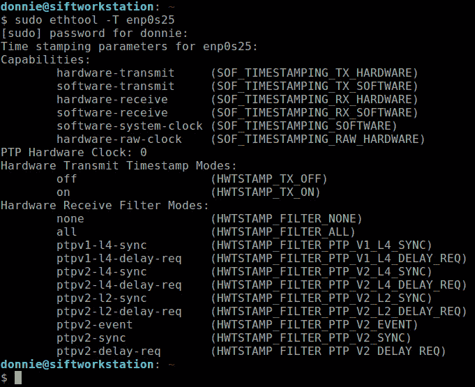

# 第十六章：理解使用 systemd 的时间同步

在现代计算机系统中，保持准确的时间至关重要。为了做到这一点，我们的计算机通过使用某种实现的 **网络时间协议** (**NTP**) 从时间服务器获取当前时间。在本章中，我们将研究这些不同的实现，并讨论每个实现的优缺点。

本章我们将讨论以下主题：

+   理解准确时间的重要性

+   比较 NTP 实现

+   理解 chrony

+   理解 `systemd-timesyncd`

+   理解 **精确时间协议** (**PTP**)

好的，开始吧！

# 技术要求

在 Ubuntu 和 RHEL 世界中，时间同步的方式有所不同。因此，我们将同时使用 Ubuntu 服务器和 *两个* AlmaLinux 虚拟机来观察这两者。

查看以下链接，观看《代码实战》视频：[`bit.ly/3Dh4byf`](https://bit.ly/3Dh4byf)

# 理解准确时间的重要性

计算机上的准确时间同步曾经并不是那么重要。我的第一份计算机工作是处理一对晶体管计算机，它们每台都和冰箱差不多大，处理能力比现代智能手机低了几个数量级。没有硬件时钟，也没有 NTP。每次我们重启这些庞然大物时，我们就看着那不怎么准的墙上时钟，手动输入从上面得到的时间。早期个人计算机的情况没有太大变化。就是说，你仍然需要手动设置时间，但它们最终配备了电池供电的硬件时钟，即使关机时钟也能继续保持。

如今，计算机保持准确的时间至关重要。科学计算、日志记录、数据库更新和金融交易都需要准确的时间。某些安全协议，如 Kerberos、DNSSEC 和 **传输层安全** (**TLS**) 也需要准确时间。现代股票交易所使用的自动化交易机器人也需要准确的时间。因此，出于这些和其他原因，人类发明了 NTP。

NTP 的基本概念很容易理解。每个现代操作系统都包括一个 NTP 客户端。每次启动计算机时，NTP 客户端都会从互联网上某个高精度的 NTP 服务器获取正确的时间。为了确保更高的时间准确性，一些组织可能会使用本地时间源，这可以是本地服务器，也可以是类似 GPS 时钟的设备。

有几种软件实现的 NTP。我们来快速比较一下它们。

# 比较 NTP 实现

`ntpd`。它创建于 1980 年代，并且长时间为我们提供了良好的服务。你可以在客户端机器上使用它来保持时间同步，或者可以将其设置为时间服务器。然而，它确实有几个缺点，包括在 2017 年代码审计中发现的许多安全问题。

`chrony` 实现可以作为客户端或服务器使用，它是从零开始创建的，旨在修复 `ntpd` 的不足。与 `ntpd` 不同，`chrony` 具有以下特点：

+   它在网络连接不稳定或长时间关闭的计算机上运行良好。

+   它在虚拟机中表现更好。

+   当硬件时钟振荡器的速度因温度变化而波动时，它能更好地调整自己。

+   它可以通过使用硬件时间戳和硬件参考时钟实现亚微秒级精度。

RHEL 7 及其克隆版本是首个将 `chrony` 作为默认时间同步工具而不是 `ntpd` 的 Linux 发行版。RHEL 8 和 SUSE 发行版也默认使用 `chrony`。

另一个替代方案是 `systemd-timesyncd`，它是 systemd 生态系统的一部分。与 `ntpd` 和 `chrony` 不同，`systemd-timesyncd` 是一个轻量级的实现，缺少 NTP 所具备的一些功能。例如，你不能用它来设置时间服务器，也不能与硬件时间戳或硬件参考时钟一起使用。所以，你可以忘记用 `systemd-timesyncd` 获取那种精确到亚微秒的准确度。另一方面，SNTP 和 `systemd-timesyncd` 可能在大多数情况下已经足够用了。Ubuntu 默认使用 `systemd-timesyncd`，大多数时候它能正常工作。如果不能，你可以轻松将你的机器切换到 `chrony`。

**精确时间协议**（**PTP**）不是 NTP 的实现。实际上，它是一个完全不同的协议，旨在实现极其—我指的是真正极其—精确的时间同步。要使用它，你必须在本地网络中拥有一个精确的时间源，并且必须有能够与之协作的交换机和路由器。它通过硬件时间戳和硬件参考时钟来实现皮秒级精度。

好的，这就是我们的概述。现在，让我们稍微谈一下 `chrony`。我们将在 AlmaLinux 机器上查看它，因为 Alma 默认使用它。

# 了解 AlmaLinux 机器上的 chrony。

`chrony` 系统中有两个组件。我们有作为守护进程的 `chronyd` 和作为用户界面的 `chronyc`。`chronyd` 组件可以在客户端或服务器模式下运行。首先，让我们看一下 `chronyd` 的单元文件。

## `chronyd.service` 文件

在 `/lib/systemd/system/chronyd.service` 文件中有一些有趣的内容。在 `[Unit]` 部分，我们有：

```
[Unit]
Description=NTP client/server
Documentation=man:chronyd(8) man:chrony.conf(5)
After=ntpdate.service sntp.service ntpd.service
Conflicts=ntpd.service systemd-timesyncd.service
ConditionCapability=CAP_SYS_TIME
```

`Conflicts=`行表示我们不能在同一台机器上运行多个 NTP 实现。如果 systemd 检测到`ntpd`或`systemd-timesyncd`正在运行，那么`chronyd`将无法启动。`ConditionCapability=`行表示这个服务是在一个非特权账户下运行的，尽管在这个单元文件或`/etc/chrony.conf`文件中并没有配置非特权用户账户。相反，`chronyd`被硬编码为在非特权的`chrony`账户下运行。我们可以通过简单的`ps aux`命令来确认这一点，如下所示：

```
[donnie@localhost ~]$ ps aux | grep chrony
chrony       727  0.0  0.1 128912  3588 ?        S    15:23   0:00 /usr/sbin/chronyd
donnie      1901  0.0  0.0  12112  1092 pts/0    R+   16:44   0:00 grep --color=auto chrony
[donnie@localhost ~]$
```

由于`chronyd`是以非特权用户账户运行的，我们需要为该非特权用户账户设置`CAP_SYS_TIME`能力，以便它能够设置系统时间。

接下来，我们来看一下`chronyd.service`文件的`[Service]`部分：

```
[Service]
Type=forking
PIDFile=/run/chrony/chronyd.pid
EnvironmentFile=-/etc/sysconfig/chronyd
ExecStart=/usr/sbin/chronyd $OPTIONS
ExecStartPost=/usr/libexec/chrony-helper update-daemon
PrivateTmp=yes
ProtectHome=yes
ProtectSystem=full
```

`ExecStart=`行使用从`EnvironmentFile=`行引用的文件中获取的选项来启动`chronyd`。如果我们查看该文件，会发现没有配置任何选项：

```
[donnie@localhost system]$ cd /etc/sysconfig/
[donnie@localhost sysconfig]$ cat chronyd 
# Command-line options for chronyd
OPTIONS=""
[donnie@localhost sysconfig]$
```

`ExecStartPost=`行中引用的`chrony-helper`程序是一个 shell 脚本，用于从 DHCP 或 DNS 服务器获取 NTP 服务器的地址。目前，这一行对我们没有任何作用。因为`chronyd`当前配置为连接一个列在`/etc/chrony.conf`文件中的 NTP 服务器池，如下所示：

```
[donnie@localhost sysconfig]$ cd /etc/
[donnie@localhost etc]$ cat chrony.conf 
# Use public servers from the pool.ntp.org project.
# Please consider joining the pool (http://www.pool.ntp.org/join.html).
pool 2.cloudlinux.pool.ntp.org iburst
. . .
. . .
```

在`[Service]`部分的底部，我们可以看到`PrivateTmp=yes`、`ProtectHome=yes`和`ProtectSystem=full`行，这些配置增加了安全性。

最后，这是`chronyd.service`文件的`[Install]`部分：

```
[Install]
WantedBy=multi-user.target
```

好的，这里没有什么特别的内容。它只是标准的`WantedBy=`行，用来使这个服务在多用户模式下运行。

接下来，我们来看一下`chrony.conf`文件。

## `chrony.conf`文件

大多数`chronyd`配置都在`/etc/chrony.conf`文件中进行。（唯一的例外是在一些少见的情况下，你可能需要在`/etc/sysconfig/chronyd`文件中配置某些选项。）我不会覆盖文件中的每个选项，因为你可以通过查看`chrony.conf`的手册页来了解它们。然而，我会指出一些你可能需要重新配置的地方。

默认情况下，`chrony.conf`配置为从一组位于互联网的时间服务器获取当前时间，如下所示：

```
pool 2.cloudlinux.pool.ntp.org iburst
```

`iburst`选项在末尾允许`chronyd`在首次启动机器时稍微加快时间同步的速度。大型组织可能会有本地时间服务器，以防止其网络上的所有机器都连接到互联网获取时间。在这种情况下，你需要用本地时间服务器的 IP 地址配置这一行。（当我们设置时间服务器时稍后会看到这一点。）

为了提高时间同步的准确性，你可以通过去掉以下行前面的`#`符号来启用硬件时间戳：

```
#hwtimestamp *
```

唯一的限制是，计算机中的网络接口适配器必须支持硬件时间戳。要验证这一点，可以使用`ethtool -T`命令，后跟网络接口适配器的名称。以下是在我的一台 2009 年款惠普机器上的示例：

```
donnie@localhost:~> sudo ethtool -T eth1
Time stamping parameters for eth1:
Capabilities:
 software-transmit     (SOF_TIMESTAMPING_TX_SOFTWARE)
 software-receive      (SOF_TIMESTAMPING_RX_SOFTWARE)
 software-system-clock (SOF_TIMESTAMPING_SOFTWARE)
PTP Hardware Clock: none
Hardware Transmit Timestamp Modes: none
Hardware Receive Filter Modes: none
donnie@localhost:~>
```

哦，这可不行。没有 PTP 硬件时钟，也没有硬件时间戳。我们来看看我的戴尔 Precision 工作站，它是几年前更新的：



图 16.1 - 我的戴尔 Precision T3610 工作站上的硬件时间戳

是的，这看起来确实好多了。我们看到了 PTP 硬件时钟和硬件时间戳。不好的一点是，目前我无法利用这个功能，因为这台机器运行的是 Lubuntu Linux。Lubuntu 就像 Ubuntu 一样，运行`systemd-timesyncd`，它无法利用硬件时间戳。但目前没关系。如果我真的需要，我可以很容易地将这台机器切换到`chrony`。（我稍后会展示如何做。）

现在，让我们跳到`chrony.conf`文件的底部，在那里我们看到这些行：

```
# Specify directory for log files.
logdir /var/log/chrony
# Select which information is logged.
#log measurements statistics tracking
```

在这里，我们可以看到它被配置为将`chronyd`日志存储在`/var/log/chrony/`目录中。但是，如果我们现在去那里，我们会看到一个空目录。这是因为底部的那一行，告诉`chronyd`记录哪些信息，已经被注释掉了。要改变这一点，只需删除行首的`#`符号，让它看起来像这样：

```
log measurements statistics tracking
```

然后，重新启动`chronyd`：

```
[donnie@localhost ~]$ sudo systemctl restart chronyd
[donnie@localhost ~]$
```

你现在应该能在`/var/log/chrony/`目录中看到日志文件：

```
[donnie@localhost ~]$ cd /var/log/chrony/
[donnie@localhost chrony]$ ls -l
total 12
-rw-r--r--. 1 chrony chrony 2603 Aug 24 14:29 measurements.log
-rw-r--r--. 1 chrony chrony 1287 Aug 24 14:29 statistics.log
-rw-r--r--. 1 chrony chrony  792 Aug 24 14:29 tracking.log
[donnie@localhost chrony]$
```

这基本上涵盖了基础内容。让我们通过设置一个`chronyd`时间服务器来让它更高级一些。

## 设置一个 chronyd 时间服务器

对于这个演示，你需要两台 Alma 虚拟机。我们将设置一台作为时间服务器，另一台使用时间服务器。（理想情况下，我们希望时间服务器有一个静态 IP 地址，但我们现在不考虑这一点。）

在时间服务器机器上，编辑`/etc/chrony.conf`文件。这里是你将要修改的那一行：

```
#allow 192.168.0.0/16
```

删除行首的`#`并更改网络地址，使其与你自己的地址匹配。对我来说，网络地址是正确的，但子网掩码是错误的。所以，我会将这一行改成这样：

```
allow 192.168.0.0/24
```

接下来，重新启动`chronyd`：

```
[donnie@localhost ~]$ sudo systemctl restart chronyd
[donnie@localhost ~]$
```

设置时间服务器的最后一步是打开适当的防火墙端口：

```
[donnie@localhost ~]$ sudo firewall-cmd --permanent --add-service=ntp
success
[donnie@localhost ~]$ sudo firewall-cmd --reload
success
[donnie@localhost ~]$
```

现在，切换到另一个 Alma 虚拟机并编辑其`/etc/chrony.conf`文件。注释掉`pool`行，并添加一行，指向时间服务器虚拟机的 IP 地址。现在这两行应该看起来像这样：

```
#pool 2.cloudlinux.pool.ntp.org iburst
server 192.168.0.14 iburst
```

保存文件并重新启动`chronyd`服务。当你查看`chronyd`的状态时，你应该能看到这台机器现在从你的时间服务器获取时间。它应该看起来像这样：

```
[donnie@logserver ~]$ systemctl status chronyd
● chronyd.service - NTP client/server
   Loaded: loaded (/usr/lib/systemd/system/chronyd.service; enabled; vendor preset: enabled)
   Active: active (running) since Tue 2021-08-24 14:59:43 EDT; 55s ago
 . . .
. . .
Aug 24 14:59:48 logserver chronyd[15558]: Selected source 192.168.0.14
Aug 24 14:59:48 logserver chronyd[15558]: System clock TAI offset set to 37 seconds
[donnie@logserver ~]$
```

注意

有时需要在这个命令前加上 sudo 才能查看网络时间源的信息。

就是这些。现在让我们换个话题，来看一下 `chronyc` 客户端工具。

## 使用 chronyc

你可以使用 `chronyc` 工具查看关于 `chronyd` 服务的信息，或者动态配置 `chronyd` 服务的某些方面。让我们从查看时间服务器的跟踪信息开始：

```
[donnie@localhost ~]$ chronyc tracking
Reference ID    : 32CDF46C (50-205-244-108-static.hfc.comcastbusiness.net)
Stratum         : 3
Ref time (UTC)  : Tue Aug 24 19:16:00 2021
System time     : 0.000093940 seconds fast of NTP time
Last offset     : -0.000033931 seconds
RMS offset      : 0.000185221 seconds
Frequency       : 10909.050 ppm fast
Residual freq   : +0.002 ppm
Skew            : 0.344 ppm
Root delay      : 0.016927114 seconds
Root dispersion : 0.018588312 seconds
Update interval : 128.6 seconds
Leap status     : Normal
[donnie@localhost ~]$
```

我不打算在这里讲解所有内容，而是让你通过查看 `chronyc` 手册页来阅读相关内容。然而，我确实想谈谈顶部的 `Reference ID` 行。

`Reference ID` 行只是告诉我们本地时间服务器所同步的远程时间服务器的主机名或 IP 地址。我们看到这个本地时间服务器同步到了一个远程时间服务器，该服务器由 Comcast 或者使用 Comcast 托管的某个组织运营。请注意，这个远程时间服务器是 `chrony.conf` 文件中配置的池的一部分。

现在，让我们来看一下我们设置的作为本地时间服务器客户端的 Alma 机器：

```
[donnie@logserver ~]$ chronyc tracking
Reference ID    : C0A8000E (192.168.0.14)
. . .
. . .
[donnie@logserver ~]$
```

正如预期的那样，我们看到了本地时间服务器的 IP 地址。

`sources` 命令将显示我们机器可以访问的所有时间服务器。以下是 Alma 机器默认池中的时间服务器：

```
[donnie@localhost ~]$ chronyc sources
210 Number of sources = 4
MS Name/IP address                 Stratum Poll Reach LastRx Last sample               
===============================================================================
^* 50-205-244-108-static.hf>    2   9   377   349   -551us[ -384us] +/-   43ms
^+ clock.nyc.he.net                    2   8   377    13  +1084us[+1084us] +/-   51ms
^+ t2.time.gq1.yahoo.com         2   9   377    92   +576us[ +576us] +/-   49ms
^+ linode.appus.org                   2   8   377    23   +895us[ +895us] +/-   70ms
[donnie@localhost ~]$
```

如前所述，我会让你查看 `chronyc` 手册页，了解所有字段的含义。

到目前为止，我们可以使用普通用户权限查看所有内容。查看其他类型的信息可能需要 `sudo` 权限，正如我们在时间服务器上看到的那样：

```
[donnie@localhost ~]$ sudo chronyc clients
[sudo] password for donnie: 
Hostname                      NTP   Drop Int IntL Last     Cmd   Drop Int  Last
===============================================================================
192.168.0.7                    29      0   8   -   129        0      0   -     -
localhost                       0      0   -   -     -       8      0   8   287
[donnie@localhost ~]$
```

非常酷。我们可以看到我们设置的作为本地时间服务器客户端的虚拟机的 IP 地址。

只是为了好玩，我们来看一下本地时间服务器做了多少工作：

```
[donnie@localhost ~]$ sudo chronyc serverstats
NTP packets received       : 84
NTP packets dropped        : 0
Command packets received   : 20
Command packets dropped    : 0
Client log records dropped : 0
[donnie@localhost ~]$
```

这显示了从客户端接收到的 NTP 包和命令包的数量。

这个命令远比我在这里展示的要复杂得多。你最好的选择是阅读 `chronyc` 手册页来了解它。

这就是 `chronyd` 和 `chronyc` 的内容了。那么，让我们切换到 Ubuntu 机器，看看 `systemd-timesyncd`。

# 理解 systemd-timesyncd

Ubuntu 默认使用 `systemd-timesyncd`。它是一个简单、轻量级的系统，易于配置。在我们深入之前，让我们快速查看一下 `systemd-timesyncd.service` 文件。

## `systemd-timesyncd.service` 文件

`/lib/systemd/system/systemd-timesyncd.service` 文件的 `[Unit]` 部分如下所示：

```
[Unit]
Description=Network Time Synchronization
Documentation=man:systemd-timesyncd.service(8)
ConditionCapability=CAP_SYS_TIME
ConditionVirtualization=!container
DefaultDependencies=no
After=systemd-sysusers.service
Before=time-set.target sysinit.target shutdown.target
Conflicts=shutdown.target
Wants=time-set.target time-sync.target
```

注意 `ConditionVirtualization=!container` 行。`ConditionVirtualization=` 部分检查操作系统是否在虚拟化环境中运行。在这种情况下，它检查是否在容器中运行。`!` 放在 `container` 前面表示否定。换句话说，如果 systemd 检测到该操作系统在容器中运行，那么 `systemd-timesyncd` 服务就不会启动。

在`[Service]`部分，你会看到比 Alma 机器上的`chronyd.service`文件中更多与安全相关的参数。由于数量众多，我只能在这里展示其中的一些：

```
[Service]
AmbientCapabilities=CAP_SYS_TIME
CapabilityBoundingSet=CAP_SYS_TIME
ExecStart=!!/lib/systemd/systemd-timesyncd
LockPersonality=yes
MemoryDenyWriteExecute=yes
NoNewPrivileges=yes
. . .
. . .
SystemCallFilter=@system-service @clock
Type=notify
User=systemd-timesync
WatchdogSec=3min
```

这很有道理，因为 Ubuntu 使用 AppArmor 作为其强制访问控制系统，而不是像 Alma 机器那样使用 SELinux。AppArmor 的默认配置提供的保护远不如 SELinux 的默认配置，因此在这个服务文件中加入更多的安全指令是合理的。此外，请注意`User=systemd-timesync`这一行，它配置了该服务的非特权用户账户。

`[Install]`部分与我们通常看到的略有不同：

```
[Install]
WantedBy=sysinit.target
Alias=dbus-org.freedesktop.timesync1.service
```

与作为`multi-user.target`的一部分启动不同，`systemd-timesyncd`作为`sysinit.target`的一部分启动。因此，它在启动过程中更早启动。

接下来，让我们简要地看一下如何配置`systemd-timesyncd`。

## timesyncd.conf 文件

当我说我们会*简要*讲解时，我确实是指*简要*。因为配置的内容不多。以下是`/etc/systemd/timesyncd.conf`文件的全部内容：

```
[Time]
#NTP=
#FallbackNTP=ntp.ubuntu.com
#RootDistanceMaxSec=5
#PollIntervalMinSec=32
#PollIntervalMaxSec=2048
```

一切都被注释掉了，这意味着所有设置都使用默认值。首先需要注意的是，`NTP=`这一行没有设置，`FallbackNTP=`这一行指向了一个时间服务器池[ntp.ubuntu.com](http://ntp.ubuntu.com)。因此，这台机器只会从该池中的一个时间服务器获取时间。剩下的三个参数设置了合理的默认值，通常你不需要更改它们。（我会让你去阅读`timesyncd.conf`手册页来了解它们。）

目前关于这个文件的内容已经足够了。现在，让我们看一下几个`timedatectl`选项。

## 使用 timedatectl

有两个`timedatectl`查看选项是特定于`systemd-timesyncd`的。`timesync-status`选项看起来像这样：

```
donnie@ubuntu2004-staticip:/etc/systemd$ timedatectl timesync-status
       Server: 91.189.94.4 (ntp.ubuntu.com)
Poll interval: 32s (min: 32s; max 34min 8s)
         Leap: normal                      
      Version: 4                           
      Stratum: 2                           
    Reference: 8CCBCC4D                    
    Precision: 1us (-23)                   
Root distance: 45.074ms (max: 5s)          
       Offset: -336.094ms                  
        Delay: 101.668ms                   
       Jitter: 1.560ms                     
 Packet count: 214                         
    Frequency: -500.000ppm                 
donnie@ubuntu2004-staticip:/etc/systemd$
```

在文件顶部，我们看到了这台机器访问的远程时间服务器，并且它是[ntp.ubunutu.com](http://ntp.ubunutu.com)池的成员。进一步来看，我们看到从时间服务器获取的`Rootdistance`为 45.07 毫秒，远低于`timesyncd.conf`文件中设置的五秒。

另一个`timedatectl`选项是`show-timesync`，其输出类似于以下内容：

```
donnie@ubuntu2004-staticip:~$ timedatectl show-timesync
FallbackNTPServers=ntp.ubuntu.com
ServerName=ntp.ubuntu.com
ServerAddress=91.189.89.198
RootDistanceMaxUSec=5s
PollIntervalMinUSec=32s
PollIntervalMaxUSec=34min 8s
PollIntervalUSec=32s
NTPMessage={ Leap=0, Version=4, Mode=4, Stratum=2, Precision=-23, RootDelay=1.129ms, RootDispersion=30.349ms, Reference=11FD227B, OriginateTimestamp=Tue 2021-08-24 17:16:48 EDT, ReceiveTimestamp=Tue 2021-08-24 17:16:48 EDT, TransmitTimestamp=Tue 2021-08-24 17:16:48 EDT, DestinationTimestamp=Tue 2021-08-24 17:16:48 EDT, Ignored=no PacketCount=1, Jitter=0 }
Frequency=-32768000
donnie@ubuntu2004-staticip:~$
```

这显示了与`timesync-status`选项相同的信息，只不过现在是机器可读的格式。

接下来，让我们编辑`/etc/systemd/timesyncd.conf`文件，使这台机器从我们的本地 AlmaLinux 时间服务器获取时间。我们只需取消注释`#NTP=`这一行，并添加 Alma 机器的 IP 地址。现在它应该看起来像这样：

```
NTP=192.168.0.14
```

在重启`systemd-timesyncd`服务后，我们应该看到这台机器现在从我们的本地时间服务器获取时间，正如我们在这里看到的：

```
donnie@ubuntu2004-staticip:~$ timedatectl timesync-status
       Server: 192.168.0.14 (192.168.0.14) 
Poll interval: 32s (min: 32s; max 34min 8s)
         Leap: normal                      
      Version: 4                           
      Stratum: 3                           
    Reference: 32CDF46C                    
    Precision: 1us (-25)                   
Root distance: 27.884ms (max: 5s)          
       Offset: -279.517ms                  
        Delay: 470us                       
       Jitter: 0                           
 Packet count: 1                           
    Frequency: -500.000ppm                 
donnie@ubuntu2004-staticip:~$
```

很有可能，`systemd-timedatectl`已经满足了你的所有需求。但如果你确实需要`chrony`带来的额外功能和精度呢？那么，让我们看看是否可以将我们的 Ubuntu 机器切换到`chrony`。

## 配置 Ubuntu 使用 chrony

第一步是停止并禁用`systemd-timesyncd`，如下面所示：

```
donnie@ubuntu2004-staticip:~$ sudo systemctl disable --now systemd-timesyncd
Removed /etc/systemd/system/dbus-org.freedesktop.timesync1.service.
Removed /etc/systemd/system/sysinit.target.wants/systemd-timesyncd.service.
donnie@ubuntu2004-staticip:~$
```

现在，安装`chrony`软件包，如下所示：

```
donnie@ubuntu2004-staticip:~$ sudo apt install chrony
```

由于这是 Ubuntu，`chronyd`服务将在安装完成后自动启用并启动。与在 Alma 机器上看到的唯一不同之处在于，Ubuntu 上的`chrony.conf`文件位于`/etc/chrony/`目录。

有时候，你只需要精确一些。那么，我们来聊一聊 PTP。

# 理解精确时间协议

对于许多金融、科学和企业应用，你必须获得最精确的时间。在这些情况下，从互联网上的远程时间服务器获取时间是不足够的。所以，你需要更好的解决方案。通过适当的硬件，**PTP**可以将你的网络时间同步到皮秒级精度。PTP 的整个解释相当复杂，因此让我简化一下。

## PTP 概述

与 NTP 不同，PTP 不能从互联网上的远程时间服务器获取时间。相反，PTP 只能在`同步`消息发送到网络的范围内使用。客户端设备将通过发送`延迟请求`消息进行响应，主时钟将通过`延迟响应`消息进行回应。携带这些消息的网络数据包都具有时间戳，这些时间戳将用于计算如何调整网络设备上的时间。为了使这一切正常工作，你的网络必须配置有能够传输这些消息的交换机和路由器。

除了主时钟之外，PTP 网络上还可以找到其他三种类型的时钟：

+   **普通时钟**：这些时钟位于终端用户设备上，如服务器、桌面客户端、物联网设备等。

+   **透明时钟**：这些是传递消息的网络交换机，用于在主时钟和普通时钟之间传输信息。透明时钟不能发送超出其 VLAN 边界的消息。

+   `延迟请求`消息。

可以将 Linux 服务器设置为边界时钟，但你可能不会这样做。很可能，你的组织将从其首选的网络设备供应商（如 Cisco 或 Juniper）处获得透明时钟和边界时钟。那么，你如何在 Linux 上使用 PTP 呢？通常，你只需要在服务器、桌面机器和物联网设备上设置 PTP，使它们从 PTP 服务器获取时间，而不是从 NTP 服务器获取时间。让我们来看看吧。

## 安装 PTP

要将 Linux 服务器、Linux 桌面或 Linux 物联网设备设置为从 PTP 源获取时间，你需要安装`linuxptp`软件包。在 Alma 机器上，你可以执行：

```
[donnie@logserver ~]$ sudo dnf install linuxptp
```

在 Ubuntu 机器上，你可以执行：

```
donnie@ubuntu2004:~$ sudo apt install linuxptp
```

接下来，停止并禁用你机器上正在运行的任何时间同步服务。如果你的机器正在运行`chronyd`，命令如下：

```
[donnie@logserver ~]$ sudo systemctl disable --now chronyd
```

如果你的机器正在运行`systemd-timesyncd`，命令如下：

```
donnie@ubuntu2004:~$ sudo systemctl disable --now systemd-timesyncd
```

安装`linuxptp`软件包会安装两个不同的服务，即`ptp4l`服务和`phc2sys`服务。在启用或启动 PTP 服务之前，我们需要先配置它们。让我们看看如何在 Alma 系统上配置。

## 在 AlmaLinux 上配置 PTP，使用软件时间戳

第一步是编辑`/etc/sysconfig/ptp4l`文件。第一次打开文件时，你会看到如下内容：

```
OPTIONS="-f /etc/ptp4l.conf -i eth0"
```

这个默认配置是为主服务器设置的，但它有错误的网络适配器名称。我们将添加`-s`选项使其以客户端模式运行，并更改网络适配器的名称。即使主机计算机的网络适配器支持硬件时间戳，你的虚拟机也无法使用硬件时间戳。为了解决这个问题，我们还将添加`-S`选项，使用软件时间戳。编辑后的行应该如下所示：

```
OPTIONS="-f /etc/ptp4l.conf -S -s -i enp0s3"
```

（当然，请使用你自己网络适配器的名称代替我的名称。）

现在，启用并启动`ptp4l`服务：

```
[donnie@logserver ~]$ sudo systemctl enable --now ptp4l
```

即使我的网络中没有 PTP 时间源，服务仍然在运行。不管怎样，`systemctl status`输出的最后一行显示`ptp4l`服务选择了最好的主时钟。我不知道那个时钟在哪里，但这并不重要。在实际场景中，你会知道，因为你会在处理一个真实的时钟：

```
[donnie@logserver ~]$ systemctl status ptp4l
● ptp4l.service - Precision Time Protocol (PTP) service
   Loaded: loaded (/usr/lib/systemd/system/ptp4l.service; enabled; vendor preset: disabled)
   Active: active (running) since Wed 2021-08-25 18:16:26 EDT; 8s ago
 Main PID: 1841 (ptp4l)
    Tasks: 1 (limit: 4938)
   Memory: 276.0K
   CGroup: /system.slice/ptp4l.service
           └─1841 /usr/sbin/ptp4l -f /etc/ptp4l.conf -S -s -i enp0s3
. . .
. . .
Aug 25 18:16:33 logserver ptp4l[1841]: [5697.998] selected local clock 080027.fffe.94a66f as best master
[donnie@logserver ~]$
```

好的，软件时间戳的部分没问题。现在，让我们来看一下硬件时间戳部分。

## 在 AlmaLinux 上配置 PTP，使用硬件时间戳

使用硬件时间戳能够提供最精确的时间同步。唯一的问题是，你的计算机上的网络接口适配器必须能够支持硬件时间戳。幸运的是，对于较新的计算机来说，这通常不是问题。（在*理解 chrony*部分，我向你展示了如何验证你的网络适配器是否支持硬件时间戳。）

第一步是编辑`/etc/sysconfig/ptp4l`文件，就像之前做的那样。这次，省略`-S`选项，使编辑后的行如下所示：

```
OPTIONS="-f /etc/ptp4l.conf -s -i enp0s3"
```

接下来，你需要配置并启用`phc2sys`服务，以便计算机时钟可以与网络适配器中的 PTP 硬件时钟同步。第一步是配置`/etc/sysconfig/phc2sys`文件。默认情况下，文件内容如下：

```
OPTIONS="-a -r"
```

将该行更改为如下所示：

```
OPTIONS="-c CLOCK_REALTIME -s enp0s3 -w"
```

以下是解释：

+   `-c CLOCK_REALTIME`：`-c`选项指定要同步的时钟。`CLOCK_REALTIME`是普通计算机时钟。

+   `-s enp0s3`：在这个文件中，`-s`指定了用于同步的设备。在本例中，我们使用的是位于`enp0s3`网络适配器中的 PTP 硬件时钟来同步普通系统时钟。

+   `-w`：这告诉`phc2sys`服务在尝试同步系统时钟之前，等待`ptp4l`服务进入同步状态。

最后的步骤是重启`ptp4l`服务，并启用并启动`phc2sys`服务。请注意，在你的虚拟机上这一步会失败，因为 VirtualBox 网络适配器没有 PTP 硬件时钟。当你看到你需要看到的内容时，禁用`ptp4l`和`phc2sys`服务，并重新启用`chronyd`服务。

接下来，我们看看如何在 Ubuntu 上执行这些操作。

## 在 Ubuntu 上配置带有软件时间戳的 PTP

在 Ubuntu 上没有补充的 PTP 配置文件，因此你需要编辑`ptp4l.service`文件。从以下操作开始：

```
donnie@ubuntu2004:~$ sudo systemctl edit --full ptp4l
```

在`[Service]`部分，你需要更改`ExecStart`行，格式如下：

```
ExecStart=/usr/sbin/ptp4l -f /etc/linuxptp/ptp4l.conf -i eth0
```

将其更改为类似这样的形式：

```
ExecStart=/usr/sbin/ptp4l -f /etc/linuxptp/ptp4l.conf -S -s -i enp0s3
```

最后，启用并启动`ptp4l`服务，就像你之前在 Alma 机器上所做的那样。

现在，让我们通过在 Ubuntu 上配置硬件时间戳来结束这部分内容。

## 在 Ubuntu 上配置带有硬件时间戳的 PTP

再次，从编辑`ptp4l.service`文件开始。这次，启用硬件时间戳，通过去掉`-S`选项，使得`ExecStart`行如下所示：

```
ExecStart=/usr/sbin/ptp4l -f /etc/linuxptp/ptp4l.conf -s -i enp0s3
```

接下来，通过以下操作编辑`phc2sys.service`文件：

```
donnie@ubuntu2004:~$ sudo systemctl edit --full phc2sys
```

在`[Service]`部分，将`ExecStart`行设置为如下所示：

```
ExecStart=/usr/sbin/phc2sys -c CLOCK_REALTIME -s enp0s3 -w
```

最后的步骤是重启`ptp4l`服务，并启用并启动`phc2sys`服务。遗憾的是，由于 VirtualBox 网络适配器中没有 PTP 硬件时钟，这一步也会失败。当你看到你想要看到的内容时，可以将虚拟机恢复到你之前使用的任何时间同步服务。

好了，时间同步部分就到这里。我认为是时候结束这一章了。

# 总结

正如往常一样，我们讨论了很多内容，并且过程中也很有趣。我们首先讨论了为什么准确的时间同步如此重要，然后简要概述了各种时间同步软件的实现。接着，我们详细了解了`chrony`和`systemd-timesyncd`。最后，我们快速了解了 PTP。

在下一章，我们将讨论 systemd 与引导管理器和引导加载程序的关系。我们在那里见。

# 问题

回答以下问题，测试你对本章内容的理解：

1.  在`chrony.conf`文件中，以下哪一行将允许`chronyd`作为时间服务器运行？

    A. `network 192.168.0.0/24`

    B. `allow 192.168.0.0/24`

    C. `permit 192.168.0.0/24`

    D. `listen 192.168.0.0/24`

1.  你将如何设置`systemd-timesyncd`作为时间服务器？（我们假设我们在`192.168.0.0/24`网络上。）

    A. 在`timesyncd.conf`文件中添加一行`network 192.168.0.0/24`。

    B. 在`timesyncd.conf`文件中添加一行`permit` `192.168.0.0/24`。

    C. 在`timesyncd.conf`文件中添加一行`allow` `192.168.0.0/24`。

    D. 你不能。

1.  在处理 PTP 时，以下哪种时钟类型允许消息在 PTP 主时钟和同一 VLAN 上的客户端机器之间流动？

    A. 边界时钟

    B. 大师时钟

    C. 路由器时钟

    D. 透明时钟

1.  在处理 PTP 时，哪项服务会使机器的系统时钟与网络适配器中的 PTP 硬件时钟同步？

    A. phc2sys

    B. ptp4l

    C. ptp

    D. 时钟

# 答案

1.  B

1.  D

1.  D

1.  A

# 进一步阅读

要了解本章所涵盖的更多内容，请查看以下资源：

+   GPS 时钟: [`timetoolsltd.com/category/gps-clocks/`](https://timetoolsltd.com/category/gps-clocks/)

+   `chrony` 与 `systemd-timesyncd`: [`unix.stackexchange.com/questions/504381/chrony-vs-systemd-timesyncd-what-are-the-differences-and-use-cases-as-ntp-cli`](https://unix.stackexchange.com/questions/504381/chrony-vs-systemd-timesyncd-what-are-the-differences-and-use-cases-as-ntp-cli)

+   `chrony` 与 `ntp`: [`chrony.tuxfamily.org/comparison.html`](https://chrony.tuxfamily.org/comparison.html)

+   PTP 与 NTP: [`www.masterclock.com/support/library/network-timing-ntp-vs-ptp`](https://www.masterclock.com/support/library/network-timing-ntp-vs-ptp)

+   Red Hat 官方`chrony`文档: [`access.redhat.com/documentation/en-us/red_hat_enterprise_linux/8/html/configuring_basic_system_settings/using-chrony-to-configure-ntp`](https://access.redhat.com/documentation/en-us/red_hat_enterprise_linux/8/html/configuring_basic_system_settings/using-chrony-to-configure-ntp)

+   精密时间协议简介: [`youtu.be/ovzt3IUFbyo`](https://youtu.be/ovzt3IUFbyo)

+   精密时间协议时钟类型: [`youtu.be/rbb9DcIGLKY`](https://youtu.be/rbb9DcIGLKY)
