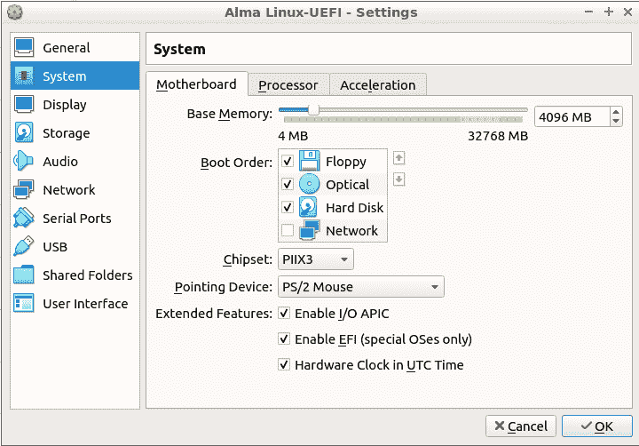
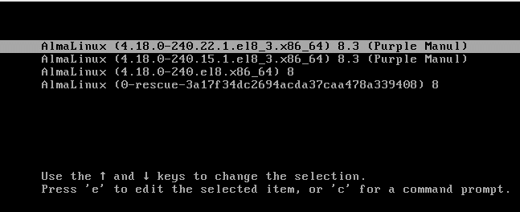
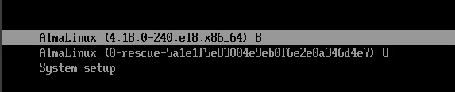
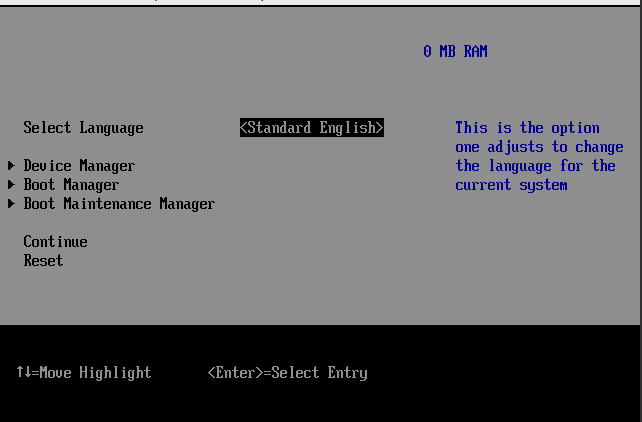
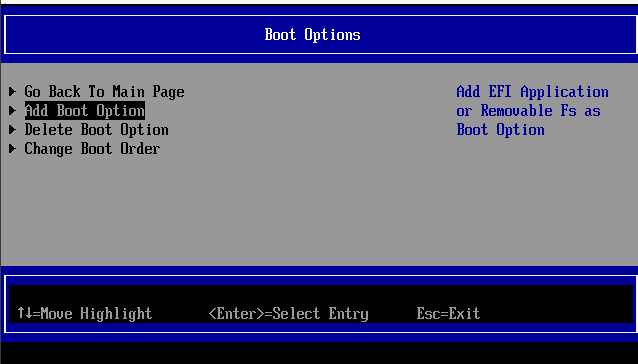
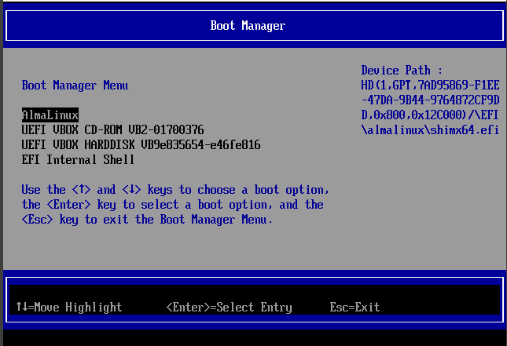
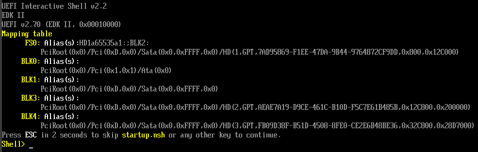
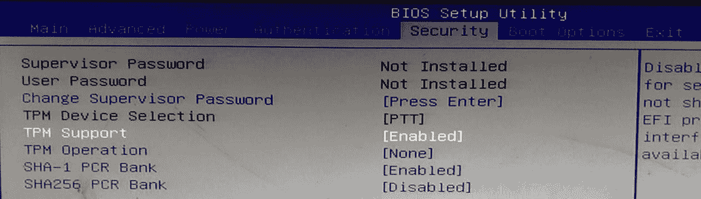

# *第十七章*：理解 systemd 和引导加载程序

引导加载程序对任何操作系统都是必需的，包括 Linux。在本章中，我们将讨论 GRUB2 和 systemd-boot 引导加载程序，并讨论它们之间的区别。熟悉本章内容可以帮助你选择最适合自己需求的引导加载程序，并解决可能出现的问题。

本章我们将涵盖以下主题：

+   理解基本的计算机架构

+   理解 GRUB2

+   理解 systemd-boot

+   理解安全启动

请注意，目前使用的引导加载程序有多个，其中一些是特定于嵌入式和物联网设备的。本章我们只会集中讨论 GRUB2 和 systemd-boot，它们用于服务器和普通工作站。

现在，让我们开始吧！

# 技术要求

我们将从一直使用的 Ubuntu Server 和 Alma 虚拟机开始。我们将用它们来看一个基于 BIOS 的普通 GRUB2 配置。

要查看 GRUB2 引导加载程序如何在基于 EFI 的机器上工作，你需要创建一对启用了 EFI 功能的 Alma 和 Ubuntu Server 虚拟机。为此，像平常一样创建 Alma 和 Ubuntu 虚拟机的初始 VirtualBox 设置。然后，在启动机器并安装操作系统之前，打开 **设置** 对话框。在 **系统** 菜单下，勾选 **启用 EFI** 复选框，如下所示：



图 17.1 – 勾选启用 EFI 框

然后，像平常一样安装操作系统。

要查看 systemd-boot 环境，你需要创建一个安装了 Pop!_OS Linux 的虚拟机。像为 Alma 和 Ubuntu 虚拟机一样启用 EFI 功能，并像平常一样安装操作系统。

注意

Pop!_OS Linux 是由计算机厂商 System76 基于 Ubuntu 源代码构建的。Pop!_OS 是我知道的唯一一款默认使用 systemd-boot 的 Linux 发行版。你可以使用 GRUB2 或 systemd-boot 安装 Clear Linux 和 Arch Linux，但安装它们比我们现在要处理的要复杂得多。

你可以从这里下载 Pop!_OS：

[`pop.system76.com/`](https://pop.system76.com/)

现在你已经有了虚拟机，让我们简要定义一下我们需要了解的几个术语。

查看以下链接，观看《代码实战》视频：[`bit.ly/3pkVA8D`](https://bit.ly/3pkVA8D)

# 理解基本的计算机架构

在我们讨论引导加载程序之前，我们需要定义一些描述基本计算机架构的术语：

+   `init` 系统。

+   **引导管理器**：当你第一次开启计算机时，引导管理器会显示一个引导菜单。如果你安装了多个操作系统，引导管理器会让你选择启动哪个系统。如果一个 Linux 发行版安装了多个内核，引导管理器也会让你选择启动哪个内核。

+   **BIOS**：**基本输入输出系统**（**BIOS**）是位于计算机主板上的固件。它包含了启动计算机的基本指令。计算机启动后，BIOS 将执行**上电自检**（**POST**），以验证硬件是否正常工作。然后，BIOS 会启动启动加载器。它在当时表现良好，但现在已经过时。一个问题是它无法处理大于两 TB 的硬盘。如果你在一台 BIOS 基础的机器上安装了三 TB 的硬盘，虽然可以使用这个硬盘，但其中一个 TB 的空间会浪费掉。BIOS 也无法处理安全启动功能。

+   **EFI/UEFI**：最初称为**可扩展固件接口**（**EFI**），但在版本 2 变体中名称被更改为**统一可扩展固件接口**（**UEFI**）。它已经取代了较新的计算机上的 BIOS。与 BIOS 不同，EFI/UEFI 在处理非常大的硬盘时表现良好。它还与安全启动功能兼容。

+   **MBR**：分区类型大致分为两类。**主引导记录**（**MBR**）类型是较旧的类型。它的主要缺陷是无法处理大于两 TB 的分区。即使你有一台基于 EFI/UEFI 的机器，可以支持大硬盘，MBR 仍然将你限制在较小的分区中。有点令人困惑的是，*MBR* 这个术语也指代硬盘的第一个 512 字节扇区，这里是 BIOS 基础机器上安装启动加载器的地方。

+   **GPT**：**GUID 分区表**（**GPT**）类型的分区已取代旧的 MBR 类型。它在处理大于两 TB 的分区时表现良好。（确切的最大分区大小取决于你用于格式化分区的文件系统。）在 EFI/UEFI 机器上，你需要将启动加载器安装在 GPT 分区中，而不是 MBR 中。（稍后我会解释为什么我使用*启动加载器*而不是*启动加载程序*。）

+   **GRUB2**：**GRUB2**（**Grand Unified Bootloader Version 2**）目前是笔记本、台式机和服务器上最流行的启动加载器。它在安装了多个操作系统的机器上表现良好。它不是 systemd 生态系统的一部分，但可以在 systemd 机器上使用。

+   **systemd-boot**：这个启动加载器是 systemd 生态系统的一部分。它目前还不被广泛使用，但未来有可能会变得流行。它比 GRUB2 更轻量级，配置更简单，也非常适合安装了多个操作系统的机器。

好的，现在我们已经弄清楚了术语，接下来看看 GRUB2。

# 理解 GRUB2

原始的 GRUB，现在被称为 *GRUB Legacy*，首次出现在 1995 年，作为替代旧的 LILO 启动加载程序。它易于使用，因为它配置简单，并且在所有使用它的 Linux 发行版中实现方式一致。与 LILO 不同，它可以启动非 Linux 操作系统。所以，你可以在同一台计算机上安装 Windows 和 Linux，GRUB 让你选择启动哪个系统。GRUB Legacy 在旧的基于 BIOS 的计算机上运行良好，但在新的 EFI/UEFI 计算机上无法使用。（实际上，Fedora 团队确实创建了一个可以与 EFI/UEFI 一起使用的 GRUB Legacy 分支版本，但他们在 2013 年放弃了这个版本，转而使用 GRUB2。）

GRUB2 不是 GRUB Legacy 的更新版本。相反，它是一个全新的启动加载程序，从头开始创建。现在，我得告诉你，它有优点也有缺点。优点是它可以与新的 EFI/UEFI 计算机一起工作。缺点是它的配置要复杂得多，而且不同的 Linux 发行版实现方式不同。因此，当你需要处理多个发行版时，可能会感到有些困惑。

几乎所有 Linux 发行版，包括我们一直在使用的 Ubuntu 和 Alma 发行版，都使用 GRUB2。在基于 BIOS 的机器上，GRUB2 被安装到主驱动器的 MBR 中，即驱动器的前 512 字节扇区。在 EFI/UEFI 机器上，GRUB2 被安装到一个特殊的 EFI 分区中，该分区必须是 GPT 类型的分区。（这个特殊的分区被称为 **EFI 系统分区** 或 **ESP**。）

现在，事情变得有些复杂。正如我所说的，与 GRUB Legacy 不同，GRUB2 在不同的 Linux 发行版中并不是以相同的方式实现的，稍后我们会看到。为了了解这一切是如何工作的，我们先从比较在基于 BIOS 和 EFI/UEFI 的 AlmaLinux 虚拟机上的 GRUB2 设置开始。

## 比较基于 BIOS 和 EFI/UEFI 系统的 GRUB2

在基于 BIOS 和 EFI/UEFI 的机器上，Linux 内核和 `initramfs` 文件被安装到 `/boot` 分区。但这里是相似之处的终点。我们来看一下在 BIOS 上是如何做的。

### 基于 BIOS 的 Alma 8 机器上的 GRUB2

在基于 BIOS 的机器上，`/boot` 分区通常是 `/dev/sda1`，如我们所见：

```
[donnie@alma-bios ~]$ mount | grep 'boot'
/dev/sda1 on /boot type xfs (rw,relatime,seclabel,attr2,inode64,logbufs=8,logbsize=32k,noquota)
[donnie@alma-bios ~]$
```

我们还看到 `/boot` 分区仅使用普通的 Linux 文件系统格式化。在 RHEL 类型的机器上，这通常是 `xfs`。在 Ubuntu 机器上，这通常是 `ext4`。

主引导记录（MBR），即启动加载程序安装的位置，并不是一个分区。相反，MBR 只是驱动器的前 512 字节。GRUB2 配置文件（`grub2.cfg`）位于 `/boot/grub2/` 目录下。在 RHEL 类型的机器上，`/etc/grub.cfg` 的符号链接指向实际的配置文件，如我们所见：

```
[donnie@alma-bios etc]$ sudo ls -l grub2.cfg 
lrwxrwxrwx. 1 root root 22 Mar 15 14:28 grub2.cfg -> ../boot/grub2/grub.cfg
[donnie@alma-bios etc]$
```

但请理解，如果你需要重新配置 GRUB2，你永远不会编辑这个 `grub.cfg` 文件。相反，你需要编辑 `/etc/default/grub` 文件。然后，你可以通过以下命令重新构建 `grub.cfg` 文件：

```
[donnie@alma-bios ~]$ sudo grub2-mkconfig -o /boot/grub2/grub.cfg
```

在 `/boot/` 目录下有一个 `efi/` 目录，但它并未被使用。它包含一些子目录，但没有文件，如下所示：

```
[donnie@alma-bios ~]$ sudo ls -l /boot/efi/EFI/almalinux
total 0
[donnie@alma-bios ~]$
```

每当我们启动机器时，都会看到一个包含不同引导选项的引导菜单：



图 17.2 – AlmaLinux 上的 GRUB2 引导菜单

这些菜单选项的配置文件位于 `/boot/loader/entries/` 目录下。该目录需要 root 权限才能进入。因此，为了简化操作，我们先进入 `root` shell：

```
[donnie@alma-bios ~]$ sudo su -
[sudo] password for donnie: 
Last login: Sat Aug 28 18:09:25 EDT 2021 on pts/0
[root@alma-bios ~]# cd /boot/loader/entries/
[root@alma-bios entries]#
```

现在，让我们看看我们有什么：

```
[root@alma-bios entries]# ls -l
total 16
-rw-r--r--. 1 root root 388 Apr  5 12:09 3a17f34dc2694acda37caa478a339408-0-rescue.conf
-rw-r--r--. 1 root root 368 Apr  5 13:20 3a17f34dc2694acda37caa478a339408-4.18.0-240.15.1.el8_3.x86_64.conf
-rw-r--r--. 1 root root 368 Apr 11 18:23 3a17f34dc2694acda37caa478a339408-4.18.0-240.22.1.el8_3.x86_64.conf
-rw-r--r--. 1 root root 316 Apr  5 12:09 3a17f34dc2694acda37caa478a339408-4.18.0-240.el8.x86_64.conf
[root@alma-bios entries]#
```

这些配置文件被称为 `BootLoaderSpec` (`BLS`) 文件。每当你启动机器时，GRUB2 会从这些 `BLS` 文件中获取信息，并用它来填充引导菜单。每次安装新的 Linux 内核时，都会自动生成一个新的 `BLS` 文件，即使是你自己编译的内核也是如此。如果你进行系统更新并且 `dnf` 删除了任何较旧的内核，那么那些较旧内核的 `BLS` 文件也会被删除。让我们看一下其中一个文件，看看里面有什么内容：

```
[root@alma-bios entries]# cat 3a17f34dc2694acda37caa478a339408-4.18.0-240.22.1.el8_3.x86_64.conf 
title AlmaLinux (4.18.0-240.22.1.el8_3.x86_64) 8.3 (Purple Manul)
version 4.18.0-240.22.1.el8_3.x86_64
linux /vmlinuz-4.18.0-240.22.1.el8_3.x86_64
initrd /initramfs-4.18.0-240.22.1.el8_3.x86_64.img $tuned_initrd
options $kernelopts $tuned_params
id almalinux-20210409120623-4.18.0-240.22.1.el8_3.x86_64
grub_users $grub_users
grub_arg --unrestricted
grub_class kernel
[root@alma-bios entries]#
```

正如我们所见，这个文件定义了要加载的内核和 `initramfs` 镜像，以及各种内核选项。但我们没有看到具体的内核选项。相反，我们看到的是以 `$` 为前缀的变量名。这意味着内核选项信息将从 `/boot/grub2/grub.cfg` 文件和 `/boot/grub2/grubenv` 文件中获取。

如果你在已经安装了其他操作系统的计算机上安装 Linux，那么该操作系统的引导菜单项也应该会自动创建。（即使另一个操作系统是 Windows，这也有效。）`/etc/grub.d/30_os-prober` 脚本是用来为你找到其他操作系统的。

注意

这与你可能习惯的情况不同。旧版 Linux 发行版，如 RHEL 7 系列的发行版，不使用 `BLS` 文件。相反，所有的引导菜单信息都列在 `grub.cfg` 文件中。Red Hat 在 Fedora 30 中首次引入了 `BLS` 文件，现在所有 RHEL 8 系列的发行版都使用它们。（正如我们稍后将看到的，即使是最新的 Ubuntu 发行版仍然没有使用它们。）

现在，让我们来看一下 EFI/UEFI 机器。

### 在基于 EFI/UEFI 的 Alma 机器上的 GRUB2

在我们的 EFI/UEFI 机器上，`/boot/` 分区挂载在 `/dev/sda2`，而 `/boot/efi/` 分区挂载在 `/dev/sda1`，如图所示：

```
[donnie@alma-efi ~]$ mount | grep 'boot'
/dev/sda2 on /boot type xfs (rw,relatime,seclabel,attr2,inode64,logbufs=8,logbsize=32k,noquota)
/dev/sda1 on /boot/efi type vfat (rw,relatime,fmask=0077,dmask=0077,codepage=437,iocharset=ascii,shortname=winnt,errors=remount-ro)
[donnie@alma-efi ~]$
```

`/boot/efi/` 分区是引导加载程序所在的位置。我们还可以看到，正常的引导分区使用的是常规的 `xfs` Linux 文件系统格式化，但 `/boot/efi/` 分区是使用 `vfat` 文件系统格式化的。`efi` 分区必须始终使用 `vfat` 格式化，因为其他格式无法正常工作。

接下来，我们看到 `/etc/` 目录中的符号链接有一个不同的名称，并且指向一个不同位置的 `grub.cfg` 文件：

```
[donnie@alma-efi etc]$ sudo ls -l grub2-efi.cfg 
lrwxrwxrwx. 1 root root 34 Mar 15 14:28 grub2-efi.cfg -> ../boot/efi/EFI/almalinux/grub.cfg
[donnie@alma-efi etc]$
```

正如之前所说，我们想要查看的目录需要 root 权限才能进入。为了简化操作，我们先进入 `root` shell：

```
[donnie@alma-efi ~]$ sudo su -
Last login: Sat Aug 28 17:52:08 EDT 2021 on pts/0
[root@alma-efi ~]#
```

仍然存在一个`/boot/grub2/`目录，但它唯一包含的内容是指向 GRUB 环境设置文件的符号链接：

```
[root@alma-efi ~]# cd /boot/grub2/
[root@alma-efi grub2]# ls -l
total 0
lrwxrwxrwx. 1 root root 28 Mar 15 14:28 grubenv -> ../efi/EFI/almalinux/grubenv
[root@alma-efi grub2]#
```

几乎所有其他重要的内容都在`/boot/efi/`目录中：

```
[root@alma-efi ~]# cd /boot/efi
[root@alma-efi efi]# ls
EFI
[root@alma-efi efi]# cd EFI/
[root@alma-efi EFI]# ls
almalinux  BOOT
[root@alma-efi EFI]#
```

在这个嵌套结构的底部，我们看到`/boot/efi/EFI/almalinux/`和`/boot/efi/EFI/BOOT/`目录。我们来看看`BOOT/`目录：

```
[root@alma-efi EFI]# ls -l BOOT/
total 1568
-rwx------. 1 root root 1237503 Mar 15 14:44 BOOTX64.EFI
-rwx------. 1 root root  362968 Mar 15 14:44 fbx64.efi
[root@alma-efi EFI]# 
```

`BOOTX64.EFI`文件是`shim`系统的一部分，允许 Linux 在启用了安全启动功能的机器上启动。（我们将在本章末讨论安全启动。）`fbx64.efi`文件是回退启动加载器。它的作用是重新创建内置于固件中的启动管理器选项，以防它们被意外删除。它通过扫描`BOOTX64.CSV`文件来完成这项工作，这些文件位于子目录中，包含任何已安装操作系统的条目。

现在，以下是我们在`almalinux/`目录中看到的内容：

```
[root@alma-efi EFI]# ls -l almalinux/
total 5444
-rwx------. 1 root root     122 Mar 15 14:44 BOOTX64.CSV
drwx------. 2 root root    4096 Mar 15 14:28 fonts
-rwx------. 1 root root    6572 Aug 26 18:13 grub.cfg
-rwx------. 1 root root    1024 Aug 28 17:51 grubenv
-rwx------. 1 root root 1900112 Mar 15 14:28 grubx64.efi
-rwx------. 1 root root 1171320 Mar 15 14:44 mmx64.efi
-rwx------. 1 root root 1240144 Mar 15 14:44 shimx64-almalinux.efi
-rwx------. 1 root root 1237503 Mar 15 14:44 shimx64.efi
[root@alma-efi EFI]#
```

除了我们在 BIOS 机器上看到的正常`GRUB2`文件外，我们还看到了几个特定于 EFI/UEFI 机器的文件：

+   `grubx64.efi`：这使得 GRUB2 能够在 EFI/UEFI 机器上运行。

+   `shim64-almalinux.efi`和`shimx64.efi`：这些文件与`BOOTX64.EFI`文件一起工作，使 Alma 能够在启用了安全启动的机器上运行。

+   `mmx64.efi`：这是*机器所有者密钥*系统的一部分，它也有助于安全启动。

+   `BOOTX64.CSV`：这个文件与回退启动加载器一起工作，并包含此 Alma 安装的启动菜单条目。（如果安装了多个操作系统，它们将有各自的`BOOTX64.CSV`文件。）如果你查看这个文件的内容，你会看到：

    ```
    [root@alma-efi almalinux]# cat BOOTX64.CSV 
    ´´shimx64.efi,AlmaLinux,,This is the boot entry for AlmaLinux
    [root@alma-efi almalinux]#
    ```

    注意

    需要记住的是，`BOOTX64.CSV`文件不是像大多数 Linux 配置文件那样的 ASCII 文本文件。（这可以解释你在代码中看到的那两个奇怪的问号。）相反，它是一个 UTF-16 Unicode 文件，正如我们在这里看到的：

    `BOOTX64.CSV`文件，你需要将其转换为 UTF-16 格式。假设你已经在主目录中创建了一个`boot.csv`文件。你可以使用`iconv`工具进行转换，如下所示：

    **[donnie@alma-efi ~]$ iconv -t UTF-16 < ~/boot.csv > BOOTX64.CSV**

    **[donnie@alma-efi ~]$**

    现在，你准备好将文件复制到正确的位置了。

接下来，我们有与 BIOS 机器上的启动菜单选项相同的`BLS`文件：

```
[donnie@alma-efi ~]$ sudo ls -l /boot/loader/entries/
[sudo] password for donnie: 
total 8
-rw-r--r--. 1 root root 388 Aug 26 18:10 5a1e1f5e83004e9eb0f6e2e0a346d4e7-0-rescue.conf
-rw-r--r--. 1 root root 316 Aug 26 18:10 5a1e1f5e83004e9eb0f6e2e0a346d4e7-4.18.0-240.el8.x86_64.conf
[donnie@alma-efi ~]$
```

当我们启动一个 EFI/UEFI 机器时，我们会看到启动菜单与在 BIOS 机器上的显示有所不同：



图 17.3 – EFI/UEFI 机器上的启动菜单

我们现在看到一个**系统设置**选项，它将我们带入到我们在这里看到的 EFI 管理工具：



图 17.4 – EFI 管理工具

这可以为我们做几件事情。如果我们选择**启动维护管理器**，我们会看到**启动选项**选项。如果选择它，我们会看到可以添加或删除启动选项，或更改默认启动顺序：



图 17.5 – 启动选项屏幕

如果我们需要从 DVD 或 USB 设备引导，而不是从默认设备引导，这可能会派上用场。

在**引导管理器**选项下，我们可以看到**EFI 内部 Shell**选项：



图 17.6 – 引导管理器屏幕

这个内部 Shell 可以帮助你排查启动问题，界面如下所示：



图 17.7 – EFI 内部 Shell

要查看你可以在这个 shell 中运行的命令，只需输入 `help`。我不会详细介绍这个 shell，因为你不会经常使用它。不过，我在*进一步阅读*部分链接了一个很好的教程。

好的，这就涵盖了 AlmaLinux 机器上的 GRUB2 部分。现在，让我们来看看 Ubuntu 机器上情况是如何有所不同的。

## BIOS 和 EFI/UEFI 系统上的 GRUB2（以 Ubuntu 为例）

最大的不同之处在于，Ubuntu 并没有像 RHEL 8 类发行版那样使用 `BootLoaderSpec` 文件。相反，所有菜单项都定义在 `/boot/grub/grub.cfg` 文件中。要查看这些菜单项，打开该文件并搜索以 `menuentry` 开头的段落。以下是其中一个菜单项的片段：

```
menuentry 'Ubuntu' --class ubuntu --class gnu-linux --class gnu --class os $menuentry_id_option 'gnulinux-simple-34969a2a-6e3f-4806-8260-e62b948678e3' {
        recordfail
        load_video
        gfxmode $linux_gfx_mode
        insmod gzio
. . .
. . .
        linux   /boot/vmlinuz-5.4.0-81-generic root=UUID=34969a2a-6e3f-4806-8260-e62b948678e3 ro  
        initrd  /boot/initrd.img-5.4.0-81-generic
}
```

唯一的另一个实际区别是，在 `/etc/` 目录下没有指向 `grub.cfg` 文件的符号链接。

接下来，让我们重启系统，看看好玩的内容。让我们来看一下*systemd-boot*。

# 理解 systemd-boot

这里需要注意的第一件事是名称，*systemd-boot*。这真让人震惊，我知道。我们有一个 systemd 组件，它的名称居然*没有*以字母 *d* 结尾。但说真的，systemd-boot 是 systemd 的一个组件，具有一些很酷的功能。与 GRUB2 相比，它更轻量，配置更简单，启动更快，并且能很好地与现代的安全启动（Secure Boot）实现兼容。与广泛的看法相反，systemd-boot 是一个*引导管理器*，而不是*引导加载器*。它可以自动探测机器上的其他操作系统并将其添加到引导菜单中。（GRUB2 只有在首次安装操作系统时才会这样做，而 systemd-boot 每次启动机器时都会这样做。）一旦你启动了机器并选择了所需的引导选项，systemd-boot 会将引导操作交给一个*真正的*引导加载器。

那么，为什么它没有被更广泛使用呢？其实是因为 systemd-boot*仅*在 EFI/UEFI 系统上工作。现在仍有很多旧的基于 BIOS 的计算机在使用，如果所有操作系统都切换到仅支持 EFI/UEFI 的引导加载器，那么这些旧机器就无法使用了。

注

你可以在 `systemd-boot` 手册页中阅读有关 systemd-boot 的各种功能。

对于我们的演示，我们将使用**Pop!_OS** Linux，这是 System76 公司的一款产品。System76 是一家计算机供应商，所以他们生产只能运行在新型机器上的操作系统是合情合理的。它基于 Ubuntu，因此你可以使用与你习惯使用的 Ubuntu 命令相同的命令，除了涉及引导加载器的命令。（在撰写本文时，它基于 Ubuntu 21.04。）

当我创建 Pop!_OS 虚拟机时，我只是接受了安装程序的默认分区设置。它长这样：

```
donnie@pop-os:~$ mount | grep 'sda'
/dev/sda3 on / type ext4 (rw,noatime,errors=remount-ro)
/dev/sda2 on /recovery type vfat (rw,relatime,fmask=0077,dmask=0077,codepage=437,iocharset=iso8859-1,shortname=mixed,errors=remount-ro)
/dev/sda1 on /boot/efi type vfat (rw,relatime,fmask=0077,dmask=0077,codepage=437,iocharset=iso8859-1,shortname=mixed,errors=remount-ro)
donnie@pop-os:~$
```

这里我们看到`/dev/sda1`被挂载为`/boot/efi/`，这是 EFI 系统分区，启动加载程序就存放在这里。我们还看到一个`/recovery/`分区，这是我在任何 Linux 机器上都没见过的东西。这个`/recovery/`分区包含了一个 Pop!_OS 的实时版本。如果你需要修复或重新安装操作系统而不丢失用户文件，就从这个分区启动。

与 GRUB2 不同，systemd-boot 在`/etc/`目录下没有任何配置文件。相反，它们都在`/boot/efi/`目录下。像之前一样，我们通过进入`root` shell 来简化操作：

```
donnie@pop-os:~$ sudo su -
[sudo] password for donnie: 
root@pop-os:~#
```

这是`/boot/efi/`目录下的内容：

```
root@pop-os:~# cd /boot/efi
root@pop-os:/boot/efi# ls -l
total 8
drwx------ 7 root root 4096 Aug 27 14:15 EFI
drwx------ 3 root root 4096 Sep  1 17:11 loader
root@pop-os:/boot/efi#
```

让我们先看一下`loader/`子目录：

```
root@pop-os:/boot/efi/loader# ls -l
total 12
drwx------ 2 root root 4096 Sep  1 15:45 entries
-rwx------ 1 root root   23 Sep  1 17:11 loader.conf
-rwx------ 1 root root  512 Aug 27 14:15 random-seed
root@pop-os:/boot/efi/loader#
```

稍后我们会回到这两个文件。首先，让我们看看`entries/`子目录：

```
root@pop-os:/boot/efi/loader/entries# ls -l
total 12
-rwx------ 1 root root 256 Sep  1 15:48 Pop_OS-current.conf
-rwx------ 1 root root 274 Sep  1 15:48 Pop_OS-oldkern.conf
-rwx------ 1 root root 299 Aug 27 10:13 Recovery-9C63-930A.conf
root@pop-os:/boot/efi/loader/entries#
```

这三个`BootLoaderSpec`文件代表了在你启动机器时，启动菜单上出现的三个选项。（我知道你还没见过启动菜单，不过没关系，我们很快就能解决这个问题。）开个玩笑，让我们先看看`Pop_OS-current.conf`文件：

```
root@pop-os:/boot/efi/loader/entries# cat Pop_OS-current.conf 
title Pop!_OS
linux /EFI/Pop_OS-bc156c8a-fcb8-4a74-b491-089c77362828/vmlinuz.efi
initrd /EFI/Pop_OS-bc156c8a-fcb8-4a74-b491-089c77362828/initrd.img
options root=UUID=bc156c8a-fcb8-4a74-b491-089c77362828 ro quiet loglevel=0 systemd.show_status=false splash
root@pop-os:/boot/efi/loader/entries#
```

与 GRUB2 不同，这里没有其他文件来存储内核选项。所以，所有选项都必须存储在这里。你可能觉得有点不寻常的是，这个`BLS`文件所调用的内核文件具有`.efi`的文件扩展名。稍后我会解释为什么会这样。

`/boot/efi/loader/random-seed`文件存储了一个随机种子值。（我敢打赌你绝对猜不到这个。）这允许机器以完全初始化的熵池启动，从而使`/dev/urandom`设备能够生成更好的随机数。通过允许系统生成更难破解的安全密钥，这增强了安全性。（不过请注意，这个功能在虚拟机上不起作用。）

接下来，让我们看看`/boot/efi/loader/loader.conf`文件：

```
root@pop-os:/boot/efi/loader# cat loader.conf 
default Pop_OS-current
root@pop-os:/boot/efi/loader#
```

等一下，这就这么简单？嗯，是的。（我不是告诉过你 systemd-boot 比 GRUB2 更容易配置吗？）不过，我确实发现了一个小问题。那就是，启动菜单不会显示，除非你在开机后迅速按下正确的按键。让我们编辑这个文件，让启动菜单显示五秒钟。编辑后的文件应该是这样：

```
default Pop_OS-current
timeout 5
```

好吧，那有点难。我希望你能处理好。不过，说正经的，还有一些选项你可以在`loader.conf`的手册页中阅读，配置起来都很简单。（顺便提一下，别急着重启机器。稍后我们还会做一次更改，然后你就可以重启了。）

在`/boot/efi/EFI/`目录下，我们看到了这些子目录：

```
root@pop-os:/boot/efi/EFI# ls -l
total 20
drwx------ 2 root root 4096 Aug 27 14:15 BOOT
drwx------ 2 root root 4096 Aug 27 14:15 Linux
drwx------ 2 root root 4096 Sep  1 15:45 Pop_OS-bc156c8a-fcb8-4a74-b491-089c77362828
drwx------ 2 root root 4096 Aug 27 14:13 Recovery-9C63-930A
drwx------ 2 root root 4096 Aug 27 14:15 systemd
root@pop-os:/boot/efi/EFI#
```

`Linux/`子目录是空的，所以我们不需要看它。在`BOOT/`子目录中，我们只看到一个文件：

```
root@pop-os:/boot/efi/EFI/BOOT# ls -l
total 92
-rwx------ 1 root root 94079 Jul 20 14:47 BOOTX64.EFI
root@pop-os:/boot/efi/EFI/BOOT#
```

正如我们在 Alma 和 Ubuntu 机器上看到的那样，我们有 `BOOTX64.EFI` 文件，这使得这台计算机能与安全启动一起工作。然而，我们没有备用引导程序文件。

在 `systemd/` 子目录中，我们看到使 systemd-boot 工作的可执行文件：

```
root@pop-os:/boot/efi/EFI/systemd# ls -l
total 92
-rwx------ 1 root root 94079 Jul 20 14:47 systemd-bootx64.efi
root@pop-os:/boot/efi/EFI/systemd#
```

最后，我们来看看 `Pop_OS-bc156c8a-fcb8-4a74-b491-089c77362828/` 子目录中的内容：

```
root@pop-os:/boot/efi/EFI/Pop_OS-bc156c8a-fcb8-4a74-b491-089c77362828# ls -l
total 240488
-rwx------ 1 root root       167 Sep  1 15:48 cmdline
-rwx------ 1 root root 108913836 Sep  1 15:48 initrd.img
-rwx------ 1 root root 107842809 Sep  1 15:48 initrd.img-previous
-rwx------ 1 root root  14750528 Sep  1 15:48 vmlinuz.efi
-rwx------ 1 root root  14739488 Sep  1 15:48 vmlinuz-previous.efi
root@pop-os:/boot/efi/EFI/Pop_OS-bc156c8a-fcb8-4a74-b491-089c77362828#
```

这与你在 GRUB2 机器上看到的完全不同。在这里，我们使用的是内建于 Linux 内核中的 *EFI Stub Loader* 功能。`vmlinuz.efi` 文件只是 `/boot/vmlinuz-5.11.0-7633-generic` 文件的副本，它是最新安装的 Linux 内核。通过将这个内核文件重命名为 `.efi` 文件扩展名，systemd-boot 实际上将这个内核文件变成了它自己的引导加载程序。（相当巧妙，不是吗？）`vmlinuz-previous.efi` 文件是 `/boot/vmlinuz-5.11.0-7620-generic` 文件的副本，它是第二旧的已安装内核。每次我们在这个 systemd-boot 机器上安装一个新内核时，原始副本将放入顶层的 `/boot/` 目录，而带 `.efi` 文件扩展名的副本将放入这个目录。

另一个要注意的地方是，这里没有我们在 Alma 和 Ubuntu 机器上看到的 `shimx64*.efi` 文件。这是因为 systemd-boot 不需要 shim 系统来与安全启动一起工作。（我将在 *理解安全启动* 部分更详细地解释这一点。）

好的，我们不再需要根 shell 了，所以输入 `exit` 回到你的普通用户 shell。

我想向你展示的最后一个 systemd-boot 组件是`bootctl`工具。要查看 systemd-boot 的状态，可以运行不带任何选项的命令：

```
donnie@pop-os:~$ sudo bootctl
System:
     Firmware: UEFI 2.70 (EDK II 1.00)
  Secure Boot: disabled
   Setup Mode: user
 Boot into FW: supported
Current Boot Loader:
      Product: systemd-boot 247.3-3ubuntu3.4pop0~1626806865~21.04~19f7a6d
     Features: P Boot counting
               P Menu timeout control
. . .
. . .
```

使用 `list` 选项来查看所有的启动菜单条目：

```
donnie@pop-os:~$ sudo bootctl list
Boot Loader Entries:
        title: Pop!_OS (Pop_OS-current.conf) (default)
           id: Pop_OS-current.conf
       source: /boot/efi/loader/entries/Pop_OS-current.conf
        linux: /EFI/Pop_OS-bc156c8a-fcb8-4a74-b491-089c77362828/vmlinuz.efi
       initrd: /EFI/Pop_OS-bc156c8a-fcb8-4a74-b491-089c77362828/initrd.img
      options: root=UUID=bc156c8a-fcb8-4a74-b491-089c77362828 ro quiet loglevel=0 systemd.show_status=false splash
. . .
. . .        
title: Reboot Into Firmware Interface
           id: auto-reboot-to-firmware-setup
       source: /sys/firmware/efi/efivars/LoaderEntries-4a67b082-0a4c-41cf-b6c7-440b29bb8c4f
```

使用`set-default`选项可以永久更改默认启动选项，或使用`set-oneshot`选项只为下一次启动设置默认启动选项。从输出的启动选项列表中获取你想使用的启动选项 ID，并通过任一选项指定，像这样：

```
donnie@pop-os:~$ sudo bootctl set-oneshot Pop_OS-oldkern.conf
donnie@pop-os:~$
```

现在，继续重新启动计算机。这次，你会看到启动菜单出现。五秒钟的菜单计时器到期后，你将看到计算机启动到你通过 `bootctl set-oneshot` 命令选择的备用内核。

你可以用 `bootctl` 做更多的事情，但我让你在 `bootctl` 手册页中自行阅读。

让我们通过简要地了解一下安全启动功能来结束本章。

# 理解安全启动

安全启动是一个 EFI/UEFI 功能，它防止计算机加载任何未由授权安全密钥签名的操作系统、操作系统模块或设备驱动程序。它有助于防止计算机加载各种类型的恶意软件，如 rootkit。要启用或禁用安全启动，请将计算机启动到设置屏幕，如我在我的最新款 Acer 电脑上所示：



图 17.8 – 启用安全启动的 UEFI 设置屏幕

出于某种奇怪的原因，即使这台机器使用的是 UEFI，它仍然被称为 *BIOS 设置实用程序*。我希望你注意到的是 **TPM 支持** 选项，它显示为 **[已启用]**。**TPM** 代表 **受信平台模块**，它是主板上的固件芯片，包含 Secure Boot 所需的签名密钥。

在 Windows 机器上，Secure Boot 是一个重要的功能，因为 Windows 传统上非常容易受到恶意软件的感染。Linux 则不太容易受到感染，尽管 Secure Boot 对其也可能有用。自从微软推出 Windows 8 以来，所有预装 Windows 的新计算机默认启用了 Secure Boot。目前，如果需要的话，仍然可以在 Windows 机器上禁用 Secure Boot。但在 Windows 11 中，这将不再是一个选项。

当 Secure Boot 最初面市时，它引起了 Linux 用户的极大不满和强烈反应。这是因为 Secure Boot 是通过查看机器引导程序的加密签名，然后将其与计算机 TPM 中的签名列表进行比较来工作的。好吧，听起来似乎没那么糟糕。糟糕的是，必要的签名和签名密钥在计算机制造时就已加载到 TPM 中，并且微软几乎控制了哪些签名和密钥会被加载。因此，一开始，Windows 是唯一一个在启用 Secure Boot 的机器上能保证启动的操作系统。Linux 开发者不得不想出一种方法，让 Linux 能与 Secure Boot 一起工作。当 Linux 用户得知这意味着必须让微软为 Linux 引导程序发布签名密钥时，他们更是痛苦万分。（没错，就是那个曾经有 CEO 说 Linux 是 *癌症* 的微软。）

在本章中，尽管你可能还没有意识到，我们已经看到 GRUB2 和 systemd-boot 如何以不同的方式处理 Secure Boot 功能。GRUB2 与 shim 系统配合使用，该系统使用预签名的 shim 文件。在 Alma 机器上，这些文件是 `/boot/efi/EFI/almalinux/` 目录下的 `shimx64.efi` 和 `shimx64-almalinux.efi` 文件。在 Ubuntu Server 机器上，我们只有 `/boot/efi/EFI/ubuntu/` 目录中的 `shimx64.efi` 文件。那么，为什么我们需要这个 shim 系统，而不是直接对 GRUB2 引导程序文件进行签名呢？有两个原因。一个是 GRUB2 本身已经相当臃肿，如果在其上增加 Secure Boot 代码，会使其更加臃肿。另一个原因是 GRUB2 的代码是按照 GPL3 开源许可证发布的。由于某些原因，我并不清楚，微软拒绝为任何 GPL3 许可下的内容提供签名密钥。因此，systemd-boot 是根据 GPL2 许可证发布的，而微软似乎更喜欢这个许可证。

当我们查看 Pop!_OS Linux 时，我指出它没有任何 `shimx64*.efi` 文件。由于 systemd-boot 是根据 GPL2 发布的，微软会为其文件签名，这使得 shim 系统变得不必要。

好的，我又在读你的心思了，希望这次是最后一次。你在想，*但，Donnie。如果我创建了一个内核模块，我需要它在安全启动的机器上加载怎么办？如果我在一个启用了安全启动的机器上安装了 Linux，然后决定不信任任何由微软颁发的签名密钥呢？我该怎么办？*

好吧，在这两种情况下，您都可以自己创建签名密钥并将其加载到 TPM 中。这是一个复杂的过程，我无法在这里详细讲解，所以我会参考《*Linux EFI 引导程序管理*》网站，该网站链接在“*进一步阅读*”部分。在它的*目录*中，您会看到指向“安全启动”页面的链接，您将在那里找到具体的操作流程。

好了，大家，这就是引导程序章节的全部内容。让我们总结一下，然后把这部分内容收尾整理好。

# 总结

正如往常一样，我们在这一章中涵盖了很多内容。我们首先概述了计算机架构，然后讨论了 GRUB2 引导程序在基于 BIOS 和 EFI/UEFI 计算机上的工作原理。接着，我们介绍了在 Pop!_OS Linux 机器上的 systemd-boot，并以对“安全启动”的讨论做了总结。

在下一章，也是我们最后一章中，我们将讨论 systemd-logind。到时候见。

# 问题

为了测试你对本章内容的掌握，请回答以下问题：

1.  以下哪个陈述是正确的？

    A. 只有 GPT 分区可以用于基于 BIOS 的计算机。

    B. 只有 GPT 分区才能用于安装 GRUB2。

    C. 只有 GPT 分区才能用于安装 systemd-boot。

    D. 只有 MBR 分区才能用于安装 systemd-boot。

1.  GRUB2 如何与安全启动兼容？

    A. 它使用了 shim 系统。

    B. 它的文件是由微软直接签名的。

    C. GRUB2 不能与安全启动兼容。

1.  systemd-boot 是如何工作的？

    A. 它使用`grubx64.efi`文件来激活引导程序。

    B. 它将内核文件复制到具有`.efi`文件扩展名的文件中，以便内核可以充当其自己的引导程序。

    C. 它直接从`/boot/`目录调用 Linux 内核。

    D. 它根本不起作用。

1.  要使安全启动工作，必须具备什么条件？

    A. 没有任何作用。它在所有计算机上都能工作。

    B. 机器具有 BIOS 芯片，并且启用了 TPM。

    C. 机器有 EFI/UEFI，并且启用了 TPM。

    D. 没有任何作用。它从未工作过。

# 答案

1.  C

1.  A

1.  B

1.  C

# 进一步阅读

若要了解更多关于本章所涵盖的主题，请查看以下资源：

+   家用和嵌入式系统的 15 款最佳引导程序：[`www.ubuntupit.com/best-linux-bootloader-for-home-and-embedded-systems/`](https://www.ubuntupit.com/best-linux-bootloader-for-home-and-embedded-systems/)

+   UEFI 交互式 Shell：[`linuxhint.com/use-uefi-interactive-shell-and-its-common-commands/`](https://linuxhint.com/use-uefi-interactive-shell-and-its-common-commands/)

+   什么是`vmlinux.efi`？：[`askubuntu.com/questions/330541/what-is-vmlinuz-efi`](https://askubuntu.com/questions/330541/what-is-vmlinuz-efi)

+   如何修改 systemd-boot: [`www.techrepublic.com/article/how-to-modify-systemd-boot-on-linux/`](https://www.techrepublic.com/article/how-to-modify-systemd-boot-on-linux/)

+   `Pop!_OS` 恢复分区: [`support.system76.com/articles/pop-recovery`](https://support.system76.com/articles/pop-recovery)

+   安全启动概述: [`www.dell.com/support/kbdoc/en-us/000145423/secure-boot-overview`](https://www.dell.com/support/kbdoc/en-us/000145423/secure-boot-overview)

+   安全启动的解释: [`docs.microsoft.com/en-us/windows-hardware/design/device-experiences/oem-secure-boot`](https://docs.microsoft.com/en-us/windows-hardware/design/device-experiences/oem-secure-boot)

+   安全启动 Linux: [`linuxhint.com/secure-boot-linux/`](https://linuxhint.com/secure-boot-linux/)

+   带安全启动的 Linux 安装: [`www.linux.org/threads/installing-linux-with-secure-boot-and-friends.29454/`](https://www.linux.org/threads/installing-linux-with-secure-boot-and-friends.29454/)

+   更改为 `BootLoaderSpec` 文件: [`fedoraproject.org/wiki/Changes/BootLoaderSpecByDefault`](https://fedoraproject.org/wiki/Changes/BootLoaderSpecByDefault)

+   管理 Linux 的 EFI 启动加载器: [`www.rodsbooks.com/efi-bootloaders/index.html`](https://www.rodsbooks.com/efi-bootloaders/index.html)

+   Ballmer：Linux 是一种癌症: [`www.theregister.com/2001/06/02/ballmer_linux_is_a_cancer/`](https://www.theregister.com/2001/06/02/ballmer_linux_is_a_cancer/)
