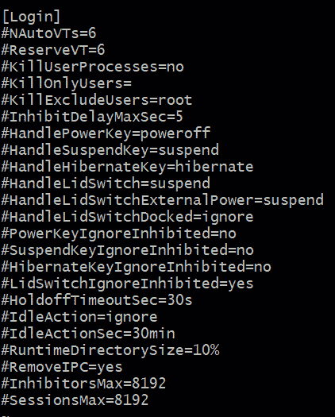
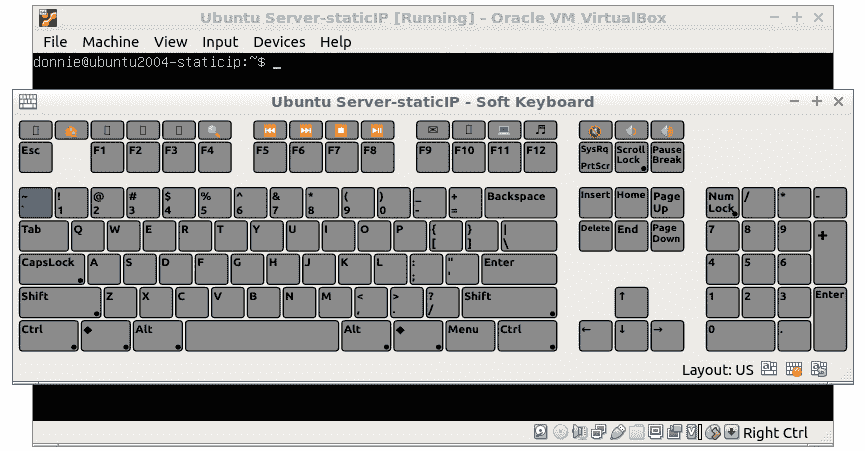
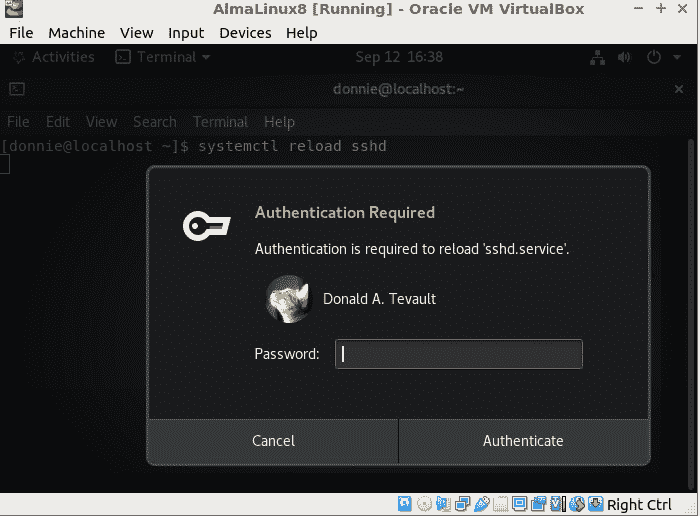

# 第十八章：理解 systemd-logind

是的，的确如此——systemd 中甚至有一种新的管理用户登录和用户会话的方式。在本章中，我们将深入探讨 `systemd-logind`，并向你展示一些相当巧妙的用户管理技巧。掌握这些技巧无疑能帮助你在商业环境中发挥作用。本章的具体主题包括：

+   理解需要一个新的登录服务

+   理解 `systemd-logind.service`

+   理解 `logind.conf`

+   理解 `loginctl`

+   理解 `polkit`

好的，让我们开始吧。

# 技术要求

对于本章，我们不需要任何复杂的配置。只需要使用你常规的 `logind.conf` 演示，因为在图形模式的机器上重启 `systemd-logind` 服务是有问题的（稍后我会详细解释）。在本章结束时，会有几个演示需要桌面界面，因此你需要一台带有 **Gnome 3** 桌面的 Alma 机器来进行这些演示。

好的，让我们开始查看 `systemd-logind.service` 文件。

查看以下链接，观看《代码演示》视频：[`bit.ly/3EiIHSD`](https://bit.ly/3EiIHSD)

# 理解需要一个新的登录服务

我知道，你在想，*为什么我们需要一个新的登录服务？* 其中一个原因是因为 `systemd` 和 `cgroups` 的紧密集成。`systemd-logind` 服务为我们做了很多事情，但它的主要工作是为每个登录系统的用户创建 cgroup 切片和范围。随着本章的展开，我们还会看到 `systemd-logind` 为我们做的一些其他事情。（想要了解 `systemd-logind` 所做所有事情的简短描述，请参阅 `systemd-logind` 的手册页。）

# 理解 systemd-logind.service

在 RHEL 类型系统和 Ubuntu 中，单元文件的设置有显著差异。我们首先来看 Alma 机器上 RHEL 类型的配置。

## Alma Linux 的 systemd-logind.service 文件

在 Alma 机器上，`/lib/systemd/system/systemd-logind.service` 文件的 `[Unit]` 部分如下所示：

```
[Unit]
Description=Login Service
Documentation=man:systemd-logind.service(8) man:logind.conf(5)
Documentation=https://www.freedesktop.org/wiki/Software/systemd/logind
Documentation=https://www.freedesktop.org/wiki/Software/systemd/multiseat
Wants=user.slice
After=nss-user-lookup.target user.slice
# Ask for the dbus socket.
Wants=dbus.socket
After=dbus.socket
```

以下是详细分解：

+   `Wants=user.slice`：这完全有道理。由于 systemd 与 cgroups 的紧密集成，必须为每个登录的用户创建一个用户切片。

+   `After=nss-user-lookup.target`：这是 `/etc/nsswitch.conf` 文件，我们接下来会讨论。

+   `Wants=dbus.socket` 和 `After=dbus.socket`：这个服务文件没有 `[Install]` 部分，因此当我们进入多用户或图形目标时，服务不会自动启动。相反，当第一个用户首次登录时，会生成一个 `dbus` 消息，从而自动启动该服务。

好的，让我们查看 `/etc/nsswitch.conf` 文件中的相关行。打开文件并查找这四行：

```
passwd:      sss files systemd
shadow:     files sss
group:       sss files systemd
. . .
. . .
gshadow:    files
```

在`passwd:`、`shadow:`和`group:`行中，`sss`表示用户和组信息将从`sssd`中提取，这使得你可以使用`/etc/passwd`、`/etc/group`、`/etc/shadow`和`/etc/gshadow`文件。如果系统在`sss`或`files`中找不到登录用户的信息，它会转向`systemd`。`systemd`设置允许系统验证动态用户，这些用户可能在服务单元文件中配置，并且在`/etc/passwd`或`/etc/shadow`文件中没有条目。

注意

*动态用户*，如前文所提到的，并不是用于普通的登录计算机的人的用户。它们是*系统账户*，用于以减少的权限运行服务。每当使用动态用户的服务启动时，动态用户就会动态创建，并在服务停止时被销毁。你永远不会在`/etc/passwd`、`/etc/group`、`/etc/gshadow`或`/etc/shadow`文件中看到动态用户的条目。

现在，让我们回到`systemd-logind.service`文件，看看`[Service]`部分。我不能一次性展示给你所有内容，所以这里是顶部部分：

```
[Service]
ExecStart=/usr/lib/systemd/systemd-logind
Restart=always
RestartSec=0
BusName=org.freedesktop.login1
WatchdogSec=3min
CapabilityBoundingSet=CAP_SYS_ADMIN CAP_MAC_ADMIN CAP_AUDIT_CONTROL CAP_CHOWN CAP_KILL CAP_DAC_READ_SEARCH CAP_DAC_OVERRIDE CAP_FOWNER CAP_SYS_TTY_CONFIG
. . .
. . .
```

这主要是我们之前讲过的标准内容，所以你应该已经掌握了。我要你注意的重点是`CapabilityBoundingSet=`行，它为该服务授予了许多 root 级别的能力。`[Service]`部分的第二部分包含了很多安全性和资源控制指令：

```
. . .
MemoryDenyWriteExecute=yes
RestrictRealtime=yes
RestrictNamespaces=yes
RestrictAddressFamilies=AF_UNIX AF_NETLINK
RestrictSUIDSGID=yes
SystemCallFilter=@system-service
SystemCallErrorNumber=EPERM
SystemCallArchitectures=native
LockPersonality=yes
FileDescriptorStoreMax=512
# Increase the default a bit in order to allow many simultaneous logins since we keep one fd open per session.
LimitNOFILE=16384
```

和往常一样，我会留给你自己查阅`systemd.directives`手册页面中的这些指令。

好的，这就是 Alma 机器上的`systemd-logind.service`文件。让我们看看 Ubuntu 机器上的文件。

## Ubuntu Server 的`systemd-logind.service`文件

Ubuntu 机器上的`systemd-logind.service`文件与 Alma 机器上的有很大不同。我们先来看一下`[Unit]`部分：

```
[Unit]
Description=Login Service
Documentation=man:systemd-logind.service(8) man:logind.conf(5)
Documentation=https://www.freedesktop.org/wiki/Software/systemd/logind
Documentation=https://www.freedesktop.org/wiki/Software/systemd/multiseat
Wants=user.slice modprobe@drm.service
After=nss-user-lookup.target user.slice modprobe@drm.service
ConditionPathExists=/lib/systemd/system/dbus.service
# Ask for the dbus socket.
Wants=dbus.socket
After=dbus.socket
. . .
```

我们看到的第一个区别是，`Wants=`行调用了`modprobe@.service`来加载`drm`内核模块。我不确定为什么这样，因为这看起来应该是在启动机器时加载的。实际上，这在 Alma 机器上似乎是这样，如我们所见：

```
[donnie@localhost ~]$ lsmod | grep drm
drm_kms_helper        233472  1 vmwgfx
syscopyarea            16384  1 drm_kms_helper
sysfillrect            16384  1 drm_kms_helper
sysimgblt              16384  1 drm_kms_helper
fb_sys_fops            16384  1 drm_kms_helper
drm                   569344  4 vmwgfx,drm_kms_helper,ttm
[donnie@localhost ~]$
```

出于我不明白的原因，Ubuntu 的开发人员决定在`systemd-logind`服务启动时加载`drm`模块，而不是在启动时加载。

Ubuntu 机器上的`[Service]`部分要大得多，因为它包含了比 Alma 机器上更多的安全指令。为什么？请记住，Alma 机器正在运行的`systemd-logind.service`文件为我们提供了一些 AppArmor 无法提供的良好的*强制访问控制*保护。以下是`[Service]`部分的一个片段，显示了 Ubuntu 的一些额外指令：

```
[Service]
BusName=org.freedesktop.login1
CapabilityBoundingSet=CAP_SYS_ADMIN CAP_MAC_ADMIN CAP_AUDIT_CONTROL CAP_CHOWN CAP_DAC_READ_SEARCH CAP_DAC_OVERRIDE CAP_FOWNER CAP_SYS_TTY_CONFIG CAP_LINUX_IMMUTABLE
DeviceAllow=block-* r
DeviceAllow=char-/dev/console rw
DeviceAllow=char-drm rw
DeviceAllow=char-input rw
…
…
# Increase the default a bit in order to allow many simultaneous logins since
# we keep one fd open per session.
LimitNOFILE=524288
```

和往常一样，我让你在手册页面中阅读这些安全指令。

接下来，我们来看一下`systemd-logind.service`的配置文件。

# 理解 logind.conf

`/etc/systemd/logind.conf` 文件是 `systemd-logind` 服务的配置文件。在我们深入之前，我建议你使用文本模式虚拟机进行本节操作。演示将要求你对 `logind.conf` 文件做几个修改，并且每次修改后都需要重启 `systemd-logind` 服务。如果你在图形模式的机器上进行操作，你会被登出桌面，然后需要重新登录。桌面不一定能正确恢复，你可能会需要重启机器。而在文本模式机器上就没有这个问题。因此，由于 Ubuntu Server 机器已经处于文本模式，我们将用它进行演示。

好消息是，`logind.conf` 文件在 Ubuntu 机器和 Alma 机器上是完全相同的。它看起来是这样的：



图 18.1 – logind.conf 文件

和 `/etc/systemd/` 下的所有配置文件一样，所有指令都被注释掉了。显示的值是编译进 `systemd-logind` 可执行文件中的默认值。你可能通过查看这些指令的名称就能猜出它们的作用，如果不太明白的部分，你可以查阅 `logind.conf` 的手册页。所以，与其详细介绍每个指令，我更想讲解几个较为有趣的指令。我们先从 *虚拟终端* 设置开始。

## 虚拟终端

在顶部，我们看到 `#NAutoVTs=6` 这一行。这设置了可用的 *虚拟终端* 数量。虚拟终端对桌面机器来说没什么用，因为你可以直接从 **F4** 终端通过 `ssh` 打开多个终端模拟器来连接到其他 GPU 挖矿设备。在图形模式的桌面机器上，一个虚拟终端通常保留给桌面。（它通常是 **F1** 终端，但不同的发行版可能会有所不同。）你可以在虚拟机上尝试这个，但是有一个小技巧。如果你的主机是运行 **Windows**，就像在裸机 Linux 上那样直接按 *Ctrl-Alt-Function* 键序列。但如果你的主机是运行 Linux，你需要打开 **VirtualBox** 的 **输入/键盘** 菜单，并启动 **软键盘**：



图 18.2 – 虚拟机的软键盘

然后，通过点击软键盘来执行你的 *Ctrl-Alt-Function* 键序列。如果你试图用普通键盘来做，主机机器会拦截这个键序列。

你可能永远不会编辑这一行，因为六个虚拟终端对于大多数人来说已经足够了。但如果你需要更多虚拟终端，你可以在这里添加。例如，假设你需要八个虚拟终端而不仅仅是六个，只需将 `#NAutoVTs=6` 改为 `#NAutoVTs=8`。然后，重启 `systemd-logind` 服务：

```
donnie@ubuntu20-04:/etc/systemd$ sudo systemctl restart systemd-logind
donnie@ubuntu20-04:/etc/systemd$
```

你可以通过按 *Ctrl + Alt + F7* 和 *Ctrl + Alt + F8* 来查看额外的两个虚拟终端。

接下来，让我们看看用户如何在退出后保持进程继续运行。

## 保持用户进程在退出后继续运行

以下三行是一起工作的：

```
#KillUserProcesses=no
#KillOnlyUsers=
#KillExcludeUsers=root
```

如果你像我一样是老一辈人，你可能还记得在旧的 SysV 时代它是如何工作的。你会登录到 Linux 服务器，从命令行启动一个进程，然后在进程仍在运行时退出。问题是，一旦你退出，进程就会停止。如果你远程登录并启动了一个进程，那么如果不小心关闭了本地机器的远程终端，或者本地机器重新启动，进程也会停止。为了确保进程在远程机器上继续运行，防止出现上述情况，你需要使用`screen`或`nohup`启动进程。现在，只要这三行保持不变，你就不必担心这个问题。为了演示，如果你还没有为 Frank 创建账户，可以在文本模式的 Ubuntu 机器上为他创建一个账户：

```
donnie@ubuntu20-04:~$ sudo adduser frank
```

然后，让他远程登录。让他在自己的主目录中创建`loop.sh`脚本，像这样：

```
#!/bin/bash
i=0
for i in {0..100000}
do
        echo $i >> number.txt
        sleep 5
done
exit
```

这是一个小小的循环，什么也不做，只是每隔五秒钟在文本文件中创建一个条目。没关系，因为它达到了我们的目的。（另外，请注意，我并没有上传这个脚本到`loop.sh`文件中：）

```
frank@ubuntu20-04:~$ chmod u+x loop.sh
frank@ubuntu20-04:~$ ls -l
total 4
-rwxr--r-- 1 frank 83 Sep  9 16:29 loop.sh
frank@ubuntu20-04:~$
```

现在，让 Frank 将脚本作为后台进程启动：

```
frank@ubuntu20-04:~$ ./loop.sh &
[1] 2446
frank@ubuntu20-04:~$
```

通过执行`tail -f number.txt`来验证脚本是否正在运行：

```
frank@ubuntu20-04:~$ tail -f number.txt
10
11
12
13
14
15
16
17
18
```

执行*Ctrl + C*来停止`tail -f`进程。然后，让 Frank 通过输入`exit`退出。

接下来，让 Frank 重新登录，然后再次让他执行`tail -f number.txt`。你应该能看到数字列表不断递增，这意味着即使 Frank 退出，进程仍然在继续。要停止该进程，使用`ps aux`获取`PID`号，然后在`kill`命令中使用该 PID 号：

```
frank@ubuntu20-04:~$ ps aux | grep loop.sh
frank       2446  0.1  1.5  32012 31120 ?        S    16:35   0:00 /bin/bash ./loop.sh
frank       2598  0.0  0.0   3304   736 pts/2    S+   16:46   0:00 grep --color=auto loop.sh
frank@ubuntu20-04:~$ kill 2446
frank@ubuntu20-04:~$
```

然后，让 Frank 通过输入`exit`退出。

现在，假设我们不希望 Frank 在退出后继续保持其进程运行。在你自己的终端中，打开`/etc/systemd/logind.conf`文件。将`#KillOnlyUsers=`这一行修改成如下所示：

```
KillOnlyUsers=frank
```

保存文件并重启`systemd-logind`服务：

```
donnie@ubuntu20-04:/etc/systemd$ sudo systemctl restart systemd-logind
donnie@ubuntu20-04:/etc/systemd$
```

请注意，这个服务没有`reload`选项。

回到 Frank 的终端，让他重新登录。让他像之前一样在后台启动`loop.sh`脚本。当你这次执行`tail -f number.txt`命令时，你应该能看到数字列表不再递增。

好的，现在我们暂时不需要 Frank 了，让他退出吧。

注意

几天前，就是我开始写这一章的那天，猫 Frank 决定帮忙。他按了一些键并删除了整段文字，用一串破折号替换了它。（幸好有**撤销**功能。）

接下来，让我们看一下几个*电源管理指令*。

## 电源管理指令

在 `/etc/systemd/logind.conf` 文件的更下方，您会看到 `HandlePowerKey=`, `HandleSuspendKey=`, `HandleHibernateKey=`, `HandleLidSwitch=`, `HandleLidSwitchExternalPower=` 和 `HandleLidSwitchDocked=` 等电源管理指令。您大概可以从这些指令的名称推测它们的作用，您也可以在 `logind.conf` 文件中看到默认设置。要查看可以为这些指令使用的其他设置，只需查看 `logind.conf` 的手册页。那是一个很好的写法，我在这里就不重复了。不过，我会给出一个例子。

假设您有一台笔记本电脑，并且您希望它在合上盖子时继续运行。只需查找这行：

```
#HandleLidSwitch=suspend
```

将其更改为如下所示：

```
HandleLidSwitch=ignore
```

我假设您在图形模式下运行笔记本电脑。（难道不是每个人都这样吗？）由于在图形模式下重启 `systemd-logind.service` 效果不佳，最佳选择是直接重启机器，以便新设置生效。现在，当您合上笔记本电脑的盖子时，它将继续像打开盖子时一样运行。（如果您真的想试试，可以在虚拟机上做这个。但由于您的虚拟机没有盖子，您不会看到任何变化。）

在我们的最后一个例子中，来做一些 *空闲操作*。

## 空闲操作指令

`IdleAction`，嗯？如果这不是个矛盾修饰法，那我就不知道什么才是了。但说正经的，您可以配置接下来的两个指令来控制当计算机在指定时间段内处于空闲状态时会发生什么：

```
#IdleAction=ignore
#IdleActionSec=30min
```

默认情况下，机器会一直运行，直到您关闭它。为了好玩，把这两行改成如下所示：

```
IdleAction=poweroff
IdleActionSec=3min
```

重启 `systemd-logind.service`，然后等待，不要触碰虚拟机。大约三分钟后，您应该会看到虚拟机自动关闭。当然，您不希望将虚拟机保持这种配置，因此重新启动虚拟机并将这些设置恢复为默认值。然后，再次重启 `systemd-logind.service`。

仍然有一些指令我没有覆盖，但您可以在 `logind.conf` 的手册页中阅读到。接下来，我们将继续介绍 `loginctl` 管理工具。

# 理解 `loginctl`

另一个好消息是，`loginctl` 在 Ubuntu 和 Alma 上的表现完全相同。您可以使用它来监视其他用户的活动，修改某个用户的登录环境设置，甚至作为安全工具清除恶意用户。

注意

对于这一部分，我们将继续使用 Ubuntu Server 机器。如果尚未创建 Pogo、Vicky 和 Frank 的用户帐户，请创建。通过本地终端登录，并再次通过远程终端登录。按 *Ctrl-Alt-F2* 在虚拟机上进入第二个虚拟终端，让 Vicky 在那里登录。然后，让 Pogo 和 Frank 从他们各自的远程终端登录。

在进入正题之前，我们需要定义几个术语：

+   **session**：每当用户登录系统时，都会创建一个*会话*。每个会话都会被分配一个十进制数字作为其 ID。

+   `seat0`是你永远会看到的唯一座位。创建新的座位涉及配置`udev`规则，而这超出了本书的范围。

执行`loginctl`没有任何选项或`loginctl list-sessions`会显示谁已登录以及他们是从哪里登录的：

```
donnie@ubuntu20-04:~$ loginctl
SESSION  UID USER   SEAT  TTY  
     10         1001 frank                 pts/1
     14         1003 vicky    seat0    tty2 
     16         1004 pogo                 pts/2
      3          1000 donnie  seat0    tty1 
      6          1000 donnie              pts/0
5 sessions listed.
donnie@ubuntu20-04:~$
```

你会看到，只有 Vicky 和我有指定的座位，而 Frank 和 Pogo 则必须站着。（是的，我知道，这是个糟糕的笑话。）但说正经的，Vicky 和我被分配到`seat0`，因为我们都从本地终端登录。我从`tty1`登录，它是默认的虚拟终端。然后，我按下*Ctrl-Alt-F2*切换到第二个虚拟终端（`tty2`），并让 Vicky 在那边登录。可能并不常见两个人登录到同一台本地机器的两个不同虚拟终端，但这种情况也是可能发生的。我现在这么做是为了展示，可以将多个用户分配到同一个座位。你还会看到，我有两个会话在进行，因为我既从本地终端登录，也通过远程`ssh`会话登录到了`pts/0`终端。Frank 和 Pogo 仅通过远程登录，这就是他们没有座位的原因。另请注意，每个会话在第一列都有自己分配的 ID 号。

注意

我刚刚向你展示了`list-sessions`选项在 Ubuntu 上的工作方式。在 RHEL 8 类型的发行版中，例如 Alma，任何远程登录的用户，`SEAT`和`TTY`列都会为空。（我也不知道为什么。）不过，当你使用`user-status`或`session-status`选项时，你会看到用户的`pts`信息，我接下来会解释。

使用`user-status`选项查看用户的详细信息。如果你没有指定用户名，系统会显示你自己账户的信息。现在，让我们看看我们无畏的负鼠 Pogo 到底在搞什么小动作：

```
donnie@ubuntu20-04:~$ loginctl user-status pogo
pogo (1004)
           Since: Sat 2021-09-11 16:50:45 EDT; 24min ago
           State: active
        Sessions: *16
          Linger: no
            Unit: user-1004.slice
                  ├─session-16.scope
                  │ ├─2211 sshd: pogo [priv]
                  │ ├─2302 sshd: pogo@pts/2
                  │ └─2303 -bash
                  └─user@1004.service
. . .
Sep 11 16:50:45 ubuntu20-04 systemd[2226]: Startup finished in 125ms.
donnie@ubuntu20-04:~$
```

为了查看稍少一些的信息，我们来看一下 Pogo 的`session-status`。我们看到他处于会话号`16`，所以命令和输出看起来会是这样：

```
donnie@ubuntu20-04:~$ loginctl session-status 16
16 - pogo (1004)
           Since: Sat 2021-09-11 16:50:45 EDT; 39min ago
          Leader: 2211 (sshd)
             TTY: pts/2
          Remote: 192.168.0.51
         Service: sshd; type tty; class user
           State: active
            Unit: session-16.scope
                  ├─2211 sshd: pogo [priv]
                  ├─2302 sshd: pogo@pts/2
                  └─2303 -bash
Sep 11 16:50:45 ubuntu20-04 systemd[1]: Started Session 16 of user pogo.
donnie@ubuntu20-04:~$
```

我们已经看过如何获取有关用户和会话的信息。接下来，让我们看看如何获取关于座位的信息。`list-seat`命令会显示所有可用的座位：

```
donnie@ubuntu20-04:~$ loginctl list-seats
SEAT 
seat0
1 seats listed.
donnie@ubuntu20-04:~$
```

除非你配置了一个或多个`udev`规则，否则`seat0`是你永远看到的唯一座位。现在，使用`seat-status`选项查看此座位包含的硬件：

```
donnie@ubuntu20-04:~$ loginctl seat-status seat0
seat0
        Sessions: *14 3
         Devices:
                  ├─/sys/devices/LNXSYSTM:00/LNXPWRBN:00/input/input0
                  │ input:input0 "Power Button"
                  ├─/sys/devices/LNXSYSTM:00/LNXSLPBN:00/input/input1
                  │ input:input1 "Sleep Button"
                  ├─/sys/devices/LNXSYSTM:00/LNXSYBUS:00/PNP0A03:00/LNXVIDEO:00/input/input4
                  │ input:input4 "Video Bus"
                  ├─/sys/devices/pci0000:00/0000:00:01.1/ata2/host1/target1:0:0/1:0:0:0/block/sr0
                  │ block:sr0
. . .
```

获取有关用户、会话和座位的信息还有其他一些选项，但你已经大致了解了。况且，你可以从`loginctl`的手册页中获取更多信息。

接下来，假设出于某种原因，你想把 Frank 踢出他的会话。只需使用`terminate-session`选项，后面跟上 Frank 的会话 ID 号，像这样：

```
donnie@ubuntu20-04:~$ sudo loginctl terminate-session 10
[sudo] password for donnie: 
donnie@ubuntu20-04:~$
```

在这里，你可以看到 Frank 的会话确实已经被终止：

```
frank@ubuntu20-04:~$ Connection to 192.168.0.49 closed by remote host.
Connection to 192.168.0.49 closed.
donnie@siftworkstation: ~
$ 
```

如果一个用户登录了多个会话，并且你希望关闭所有这些会话，可以使用 `terminate-user` 选项，像这样：

```
donnie@ubuntu20-04:~$ sudo loginctl terminate-user pogo
donnie@ubuntu20-04:~$
```

还有一些其他的管理命令，可能对你有帮助。它们很容易理解，并且在 `loginctl` 的手册页中有详细的说明。

接下来，我们介绍一个在 *某些* 场合可以替代 `sudo` 的酷工具。

# 理解 polkit

`systemd-logind` 确实提供对 `polkit` 功能的访问。PolicyKit 是 **Red Hat** 的一项创新，出现在多年前，并且可以在各种类似 Unix 的操作系统上使用。2012 年，发布了一个新版本，并改名为 *polkit*。开发者更改名称是为了提醒大家，这是一套全新的代码库，与旧版本不兼容。

`polkit` 服务与 `sudo` 类似，它允许通常没有特权的用户执行某些特权任务。不过，二者之间有一个重要的区别。

`sudo` 工具非常容易配置，你可以轻松地将几乎任何管理员权限授予任何用户。当你安装操作系统时，你会为自己配置完整的 `sudo` 权限，其他用户则没有权限。另一方面，`polkit` 默认配置了一些可以授予 root 权限的管理任务。你可以添加更多任务，有时你可能会需要这样做。但请记住，编写 `polkit` 的规则和操作比编写 `sudo` 的规则要复杂。因此，在尝试自己编写之前，你需要研究系统中已经存在的示例并阅读文档。我们在查看这些规则和操作之前，先来看一下 `polkit` 如何授予 root 权限。

我们将从 Alma Linux 机器开始。为了查看一些 `polkit` 目录的内容，我们需要 root 权限，所以让我们切换到 `root` shell：

```
[donnie@localhost ~]$ sudo su -
[sudo] password for donnie: 
[root@localhost ~]#
```

现在，查看 `/etc/polkit-1/rules.d/` 目录：

```
[root@localhost ~]# cd /etc/polkit-1/rules.d/
[root@localhost rules.d]# ls
49-polkit-pkla-compat.rules  50-default.rules
[root@localhost rules.d]#
```

我们需要的文件是 `50-default.rules` 文件，其内容如下所示：

```
[root@localhost rules.d]# cat 50-default.rules 
/* -*- mode: js; js-indent-level: 4; indent-tabs-mode: nil -*- */
// DO NOT EDIT THIS FILE, it will be overwritten on update
//
// Default rules for polkit
//
// See the polkit(8) man page for more information
// about configuring polkit.
polkit.addAdminRule(function(action, subject) {
    return ["unix-group:wheel"];
});
[root@localhost rules.d]#
```

请注意最后一行：

```
polkit.addAdminRule(function(action, subject) {
return ["unix-group:wheel"];
```

这意味着，如果 `polkit` 检测到某人试图执行管理员任务而没有使用 `sudo`，它会检查 wheel 组中是否有成员。如果 wheel 组中有成员，它将提示用户输入该成员的密码。如果 wheel 组没有成员，则表示 root 用户已设置密码。如果是这种情况，`polkit` 会提示输入 root 用户的密码。

在 Ubuntu 机器上，我们需要查看的文件位于 `/etc/polkit-1/localauthority.conf.d/` 目录下，并且我们不需要 root 权限即可访问：

```
donnie@ubuntu20-04:~$ cd /etc/polkit-1/localauthority.conf.d/
donnie@ubuntu20-04:/etc/polkit-1/localauthority.conf.d$ ls -l
total 8
-rw-r--r-- 1 root 267 Aug 16  2019 50-localauthority.conf
-rw-r--r-- 1 root root  65 Aug 16  2019 51-ubuntu-admin.conf
donnie@ubuntu20-04:/etc/polkit-1/localauthority.conf.d$
```

`50-localauthority.conf` 文件如下所示：

```
donnie@ubuntu20-04:/etc/polkit-1/localauthority.conf.d$ cat 50-localauthority.conf 
# Configuration file for the PolicyKit Local Authority.
#
# DO NOT EDIT THIS FILE, it will be overwritten on update.
#
# See the pklocalauthority(8) man page for more information
# about configuring the Local Authority.
#
[Configuration]
AdminIdentities=unix-user:0
donnie@ubuntu20-04:/etc/polkit-1/localauthority.conf.d$
```

这里只需要一行重要的内容，它会查找 root 用户（即 UID 为 `0` 的 `unix-user`）。另一个文件则查找 `sudo` 或 `admin` 组的成员：

```
donnie@ubuntu20-04:/etc/polkit-1/localauthority.conf.d$ cat 51-ubuntu-admin.conf 
[Configuration]
AdminIdentities=unix-group:sudo;unix-group:admin
donnie@ubuntu20-04:/etc/polkit-1/localauthority.conf.d$
```

目前，Red Hat 和 Ubuntu 系统之间最大的区别是，在 Red Hat 类型的系统中，wheel 组的成员具有完全的 sudo 权限。而在 Ubuntu 系统中，sudo 组或 admin 组的成员拥有完全的 sudo 权限。现在，让我们看看它是如何工作的。

在 Ubuntu 机器上，尝试不使用 sudo 重新加载`ssh`服务：

```
donnie@ubuntu20-04:~$ systemctl reload ssh
==== AUTHENTICATING FOR org.freedesktop.systemd1.manage-units ===
Authentication is required to reload 'ssh.service'.
Authenticating as: Donald A. Tevault (donnie)
Password: 
==== AUTHENTICATION COMPLETE ===
donnie@ubuntu20-04:~$
```

如你所见，polkit 要求输入我的密码，因为我是唯一一个属于 sudo 组的成员。现在，让我们尝试使用 polkit 查看防火墙配置：

```
donnie@ubuntu20-04:~$ iptables -L
Fatal: can't open lock file /run/xtables.lock: Permission denied
donnie@ubuntu20-04:~$
```

它失败了，因为 polkit 没有配置为与`iptables`命令一起使用。

接下来，让我们看看如果 Pogo 尝试使用 polkit 会发生什么。然而，为了使其正常工作，他的密码需要与您的密码不同。如果是相同的，请将其更改为其他密码：

```
donnie@ubuntu20-04:~$ sudo passwd pogo
New password: Retype new password: 
passwd: password updated successfully
donnie@ubuntu20-04:~$
```

现在，让我们让 Pogo 尝试重新加载`ssh`：

```
pogo@ubuntu20-04:~$ systemctl reload ssh
==== AUTHENTICATING FOR org.freedesktop.systemd1.manage-units ===
Authentication is required to reload 'ssh.service'.
Authenticating as: Donald A. Tevault (donnie)
Password: 
polkit-agent-helper-1: pam_authenticate failed: Authentication failure
==== AUTHENTICATION FAILED ===
Failed to reload ssh.service: Access denied
See system logs and 'systemctl status ssh.service' for details.
pogo@ubuntu20-04:~$
```

如前所述，polkit 要求输入我的密码，因为我是 sudo 组的成员，而 Pogo 不是。Pogo 不知道我的密码，所以他无法执行此命令。

在我们仍然使用 Ubuntu 机器时，让我们看看这些规则中的一些内容。我们将`cd`进入`/usr/share/polkit-1/rules.d/`目录，并查看`systemd-networkd.rules`文件：

```
// Allow systemd-networkd to set timezone, get product UUID,
// and transient hostname
polkit.addRule(function(action, subject) {
    if ((action.id == "org.freedesktop.hostname1.set-hostname" ||
         action.id == "org.freedesktop.hostname1.get-product-uuid" ||
         action.id == "org.freedesktop.timedate1.set-timezone") &&
        subject.user == "systemd-network") {
        return polkit.Result.YES;
    }
});
```

在这里，我们将 root 权限分配给`systemd-networkd`系统用户帐户，以便它可以在不提示密码的情况下执行这三项任务。（`return polkit.Result.YES;`这一行是防止它要求输入密码的原因。）

对于更复杂的情况，让我们`cd`进入`/usr/share/polkit-1/actions/`目录，并查看其中一个文件。我们将选择`com.ubuntu.languageselector.policy`文件，因为它是最短的。我们只需要查看`action id=`部分，它看起来是这样的：

```
. . .
 <action id="com.ubuntu.languageselector.setsystemdefaultlanguage">
    <description gettext-domain="language-selector">Set system default language</description>
    <message gettext-domain="language-selector">System policy prevented setting default language</message>
    <defaults>
      <allow_any>auth_admin</allow_any>
      <allow_inactive>no</allow_inactive>
      <allow_active>auth_admin_keep</allow_active>
    </defaults>
  </action>
. . .
```

底部的`<default>`段落是我们定义谁可以执行此操作的地方。下面是详细说明：

+   `<allow_any>`：此标签设置对任何客户端机器的授权。`auth_admin`设置要求用户输入管理员密码，然后才能执行该操作。

+   `<allow_inactive>`：此标签设置在本地控制台上处于非活动会话中的客户端的授权。此处设置为`no`，这会阻止这些客户端获得任何授权。

+   `<allow_active>`：这是为处于本地控制台活动会话中的客户端设置的。`auth_admin_keep`值要求用户输入管理员密码。它还允许用户在短时间内保持授权。

其他操作文件以类似的方式设置，我将留给你自己查看它们。有关规则和操作的更多详细信息，请参阅`polkit`的手册页。

每当有人尝试执行在`polkit`中配置的管理操作时，`polkit`服务都会通过`dbus`消息被激活，正如我们在其单元文件中的`Type=dbus`行所看到的那样：

```
donnie@ubuntu20-04:~$ cd /lib/systemd/system
donnie@ubuntu20-04:/lib/systemd/system$ cat polkit.service 
[Unit]
Description=Authorization Manager
Documentation=man:polkit(8)
[Service]
Type=dbus
BusName=org.freedesktop.PolicyKit1
ExecStart=/usr/lib/policykit-1/polkitd --no-debug
donnie@ubuntu20-04:/lib/systemd/system$
```

好的，Ubuntu 机器的部分就到这里。Alma 机器基本相同，不过你需要 root 权限才能`cd`进入`rules.d/`目录，如下所示：

```
[donnie@localhost system]$ cd /usr/share/polkit-1/
[donnie@localhost polkit-1]$ ls -l
total 8
drwxr-xr-x. 2 root    4096 Jul 23 15:51 actions
drwx------. 2 polkitd root  287 Jul 12 17:51 rules.d
[donnie@localhost polkit-1]$
```

现在，让我们转到 Alma 虚拟机的本地图形终端。如果你还在 root shell 中，输入`exit`以返回到自己的 shell。现在，尝试重新加载`sshd`，你会看到一个对话框弹出来，要求输入管理员密码：



图 18.3 – 图形 polkit 密码对话框

好的，我觉得关于 polkit 的内容差不多了。让我们总结一下学到的内容，完成这部分。

# 总结

和往常一样，本章我们学习了一些很酷的东西。我们从`systemd-logind.service`文件的讨论开始，了解了它在 Ubuntu 和 Alma 机器上的不同配置。接着我们研究了`logind.conf`文件，并尝试了一些配置选项。之后，我们玩了下`loginctl`，最后讨论了 polkit。

各位，今天的内容不仅仅是本章的总结，也是整本书的总结。希望你们和我一样，喜欢这趟穿越理想化的*systemd 世界*的旅程。保重，期待很快再见。

# 问题

1.  `systemd-logind`服务是如何激活的？

    A. 作为多用户目标的一部分

    B. 作为图形目标的一部分

    C. 当它收到`dbus`消息时

    D. 作为`sysinit`目标的一部分

1.  当两个不同的用户远程登录到 Linux 服务器时，会发生什么？

    A. 它们都分配给`seat0`。

    B. 一个分配给`seat0`，另一个分配给`seat1`。

    C. 它们都分配给`seat1`。

    D. 它们都没有分配座位。

1.  以下哪一文件中`systemd-logind`会查看如何进行用户认证？

    A. `/etc/nsswitch.conf`

    B. `/etc/default/nsswitch.conf`

    C. `/etc/sysconfig/nsswitch.conf`

    D. `/etc/authenticate.conf`

1.  关于 polkit，以下哪个说法是正确的？

    A. 在默认配置下，它只与预定义的一组管理命令一起工作。

    B. 在默认配置下，它与所有管理命令一起工作，就像 sudo 一样。

    C. 仅适用于 root 用户密码。

    D. 只能在文本模式机器上使用。

# 答案

1.  C

1.  D

1.  A

1.  A

# 进一步阅读

+   SSSD 主页: [`sssd.io/`](https://sssd.io/ )

+   关于座位和会话的解释: [`www.man7.org/linux/man-pages/man3/sd-login.3.html`](https://www.man7.org/linux/man-pages/man3/sd-login.3.html )

+   polkit 参考手册: [`www.freedesktop.org/software/polkit/docs/latest/polkit.8.html`](https://www.freedesktop.org/software/polkit/docs/latest/polkit.8.html)
