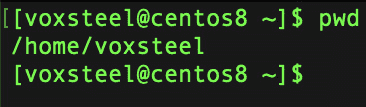
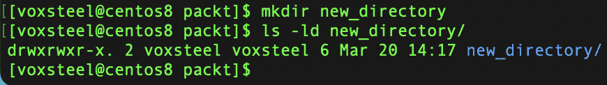
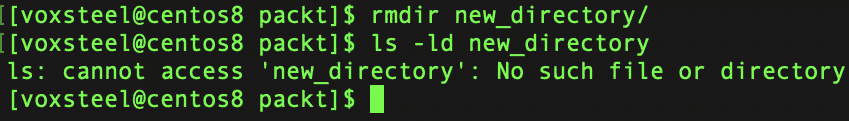
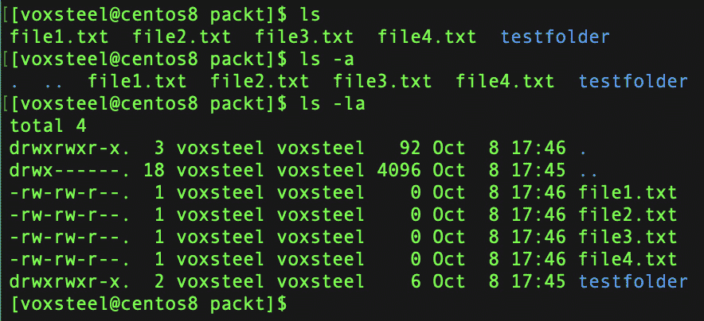
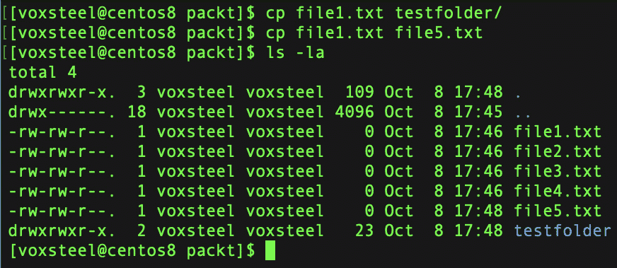
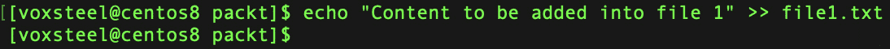
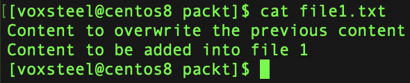
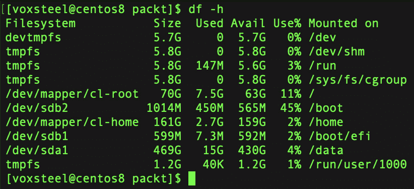
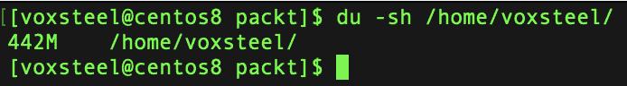
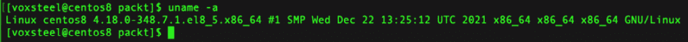

# 2

# Shell 及其命令

我们将在 shell 中做很多事情，比如安装软件包、创建新用户、创建目录、修改文件权限等。这些将是基础内容，但也是你首次与 shell 交互的机会，帮助你理解背后的工作原理并增加信心。为了提高我们在 shell 中的效率，我们将专门为它开设一章。

本章将涵盖以下主题：

+   对 shell 的基本定义，以便理解其工作原理，包括对其功能的概述和对最常见 shell 的描述

+   如何使用基本命令以熟悉 Linux（本章将使用 CentOS 8 版本）

+   使用命令改变文件和目录所有权的基本概念

# 什么是 shell？

被称为*shell*的计算机软件使操作系统的服务可供用户或其他程序访问。

shell 是一个程序，接收命令并将其发送到操作系统进行处理，简单来说就是这样。在交互式会话中，用户可以选择从键盘输入命令，或者可以将命令写入可以重复使用的 shell 脚本。在过去的 Unix 类型系统（如 Linux）中，它是唯一可访问的**用户界面**（**UI**）。如今，除了**命令行界面**（**CLI**）如 shell 外，我们还有**图形用户界面**（**GUI**）。

shell 的基本功能是启动系统中已经安装的命令行程序。它们还提供内建命令和脚本控制结构，如条件语句和循环。每个 shell 都有自己的实现方式。有些 shell 仍然支持 Bourne shell，这是由程序员 Steve Bourne 为早期 Unix 系统创建的原始 shell 之一，后来在`csh`/`tcsh`、`zsh`和`fish`等 shell 中得到了标准化，并故意使用不同的语法。

为了使用命令行 shell，用户必须了解命令、其调用语法以及 shell 特定脚本语言的基础知识。

Linux 用户可以使用多种 shell，包括以下几种：

+   `sh`：一种 POSIX 兼容的 Bourne shell。在现代的发行版中，它通常只是以兼容模式运行的**Bourne Again Shell**（**Bash**）。

+   `csh`/`tcsh`：这些来自**伯克利软件分发**（**BSD**）Unix 系统家族，但也可在 Linux 上使用；它们的脚本语法类似于 C 语言，并与 Bourne shell 不兼容。

+   `ksh`：一种 Bourne shell 的衍生版本，曾经非常流行。

+   `bash`：Bash 是最常见的 Linux shell，由 GNU 项目创建。

+   `zsh`和`fish`：这些是高度可定制且功能丰富的 shell，与`sh`衍生版本故意不同，需要学习，但有着庞大的爱好者社区。

它们都具有相似的特性，但每个都有自己独特的属性。

本书中，我们将假设你正在使用 Bash，因为它是大多数 Linux 发行版的默认 Shell。

Unix Shell 和 Bash 命令语言都是由 Brian Fox 为 GNU 项目开发的。它们旨在作为 Bourne Shell 的自由软件替代品。自 1989 年推出以来，它一直是大多数 Linux 发行版的默认登录 Shell。Linus Torvalds 将 Bash 和**GNU 编译器集合**（**GCC**）移植到 Linux，作为最初的应用之一。

Bash 具有以下特点：

+   Shell 会先检查命令是否是内建命令，如果不是，它会通过搜索一系列目录来查找程序。这个集合被称为搜索路径。通过在 Bash 中运行`echo $PATH`命令，你可以查看它。除了当前目录外，`home`目录及其子目录也包含在搜索路径中。你可以创建自己的程序，并通过输入其名称来调用它们。无论你在哪个目录中，只要程序存储在`bin`目录中，它都会被找到并启动。我们将在*第三章*中进一步了解 Linux 目录结构，*Linux* *文件系统*。

+   与其他 Linux 程序一样，Shell 有一个当前目录与之关联。在查找文件时，基于 Linux 的程序从当前目录开始。要将当前目录移动到 Linux 文件系统中的另一个位置，请使用`cd`命令。当前工作目录通常可以在现代 Shell 的命令提示符中看到。要检查 Shell 的版本，运行`echo $SHELL`命令。你将看到类似于`/bin/bash`的输出。

+   通过指定命令来执行命令。大多数 Linux 命令实际上就是 Shell 运行的程序。例如，以下`ls`命令扫描当前目录并列出文件名：`ls -la`。

+   命令通常包含参数字符串，例如文件名。例如，以下命令会切换到你`home`目录中的`tmp`目录。Shell 将波浪号字符解释为你的`home`目录：

    ```
    cd ~/tmp
    ```

+   某些命令需要多个参数。例如，复制命令需要两个参数：要复制的文件和目标位置。以下示范了如何将`file1`复制到新文件`file2`：

    ```
    cp file1 file2
    ```

+   某些命令的标志或选项参数通常以`-`开头。标志会改变被调用应用程序的行为。当使用以下命令时，`ls`会按创建时间输出文件的详细列表：

    ```
    ls -lt
    ```

+   通配符将由 Shell 扩展以匹配当前目录中的文件名。例如，要显示名为`anything.sh`的文件列表，可以输入以下命令：

    ```
    ls -l *.sh
    ```

+   `cat`是*concatenate*的缩写。运行以下命令将显示一个或多个文件的内容，而无需打开它们进行编辑：

    ```
    cat /etc/passwd
    ```

+   Shell 具有将一个程序的输出数据通过管道传输到另一个程序输入的能力。`|`是管道符号。为了计算`testfile.txt`中的单词数量，我们可以将文件连接并将输出传递给`wc`程序，如下所示：

    ```
    cat testfile.txt | wc -w
    ```

    ```
    1198
    ```

或者，要计算`testfile.txt`文件中的行数，我们可以使用以下命令：

```
cat testfile.txt | wc -l
289
```

+   你可以为你常用或难以输入的命令或命令组创建别名。例如，我们可以使用`top10`别名来查找当前目录中的前 10 个文件。`head`将仅显示前几行。别名是命令的快捷方式——例如，避免记住一个非常长的命令，你可以创建一个容易记住的别名。以下是一个示例：

    ```
    alias top10="du -hsx * | sort -rh | head -10"
    ```

+   一些变量是预定义的，例如`$HOME`，它是你的`home`目录。要查看分配的变量列表，请输入以下命令：

    ```
    set
    ```

+   **手册**（**man**）页就像一本包含每个命令的说明和描述的手册。运行以下命令查看 Bash 的手册页：

    ```
    bash-3.2$ man bash
    ```

+   可以编写 Shell 命令的*脚本*。这些脚本可以像已编译的程序一样被调用（即，只需命名它们）。例如，我们首先在`/bin`目录下创建一个包含以下内容的文件，以构建一个名为`top10.sh`的脚本，显示当前目录中最大的前 10 个文件：

    ```
    #! /bin/bash
    ```

    ```
    du -hsx * | sort -rh | head -10
    ```

+   接下来，我们必须使用`chmod`命令使文件具有可执行权限，才能正常运行它：

    ```
    chmod +x ~/bin/top10.sh
    ```

    ```
    ./top10.sh
    ```

查看`bash`的手册页获取更多详细信息（键入`man bash`）。

在 Bash 的额外机制中，键盘上的上箭头键使你能够访问和修改过去的命令。当你按下上箭头键时，最近的命令会再次显示在终端上。要访问之前的命令，请再次按下上箭头键。按*Enter*键重新运行该命令。使用*Delete*键从命令末尾删除字符，或使用退格键移动光标并通过插入或删除字符来修改命令的内容。

通过使用`history`命令，你可以查看命令历史记录。

你可以通过按`!`和行号重新执行任何历史命令，例如，`!345`。

现在你已经知道如何与 Shell 交互以及输入这些命令时发生了什么，在接下来的章节中，我们将尝试实践一些基本命令，让你在与终端交互时更加自信。

# 基本的 Shell 命令

下面是一些可能的命令概述。更多信息请查看每个命令的手册页。通过使用`man`命令，你可以在线查看这些内容。只需键入`man`，然后输入你希望查看的命令名称（例如，如果你想了解更多关于`cat`命令的信息，只需键入`man cat`）：

+   `pwd`: `pwd` 命令可以用来确定你当前所在的目录。其名称是 `/` 的缩写。你可以在以下屏幕截图中看到 `pwd` 命令的使用：



图 2.1 – pwd 命令，显示工作目录

+   `mkdir`: `mkdir` 是用于创建新目录的命令。你可以在命令行中输入 `mkdir packt` 来创建一个名为 packt 的目录。要列出已创建的目录，可以使用 `ls –ld <directory_name>` 命令。你可以在这里看到 `mkdir` 命令的使用：



图 2.2 – mkdir 命令

+   `rmdir`: 要删除一个目录，使用 `rmdir`。不过，`rmdir` 只能用于删除空目录。要删除文件和目录，使用 `rm -rf directoryname/`（其中 `–rf` 将递归删除目录内的所有文件和子目录）。要检查目录是否已被删除，可以使用 `ls –ld <directory_name>` 命令。这里显示了 `rmdir` 命令的使用：



图 2.3 – rmdir 命令

+   `touch`: 该命令最初的目的是将文件的修改日期设置为当前时间。但由于它在文件不存在时会创建一个文件，因此它常用于创建空文件。以下是一个示例：

    ```
    touch filename.txt
    ```

+   `ls`: 使用 `ls` 命令可以查看当前目录中的所有文件和目录。如果你想查看隐藏文件，可以使用 `ls -a` 命令。通过使用 `ls -la` 命令，你可以将所有文件和目录以列表的形式查看，如下所示：



图 2.4 – ls 命令

+   `cp`: 要从命令行复制文件，使用 `cp` 命令。它需要两个参数：第一个指定要复制的文件的位置，第二个指定复制到的位置。可以是一个新文件夹或新文件（如果需要文件副本）。你可以在这里看到 `cp` 命令的使用：



图 2.5 – cp 和 ls 命令

+   `mv`: 你可以使用 `mv` 命令将文件或目录从一个位置移动到另一个位置，甚至重命名文件。例如，你可以通过运行以下命令将文件 `file1.txt` 重命名为 `file2.txt`：

    ```
    mv file1.txt file2.txt
    ```

+   `rm`: `rm` 用于删除文件或目录，`-r` 或 `–f` 参数用于递归删除目录（`-r`）或强制删除文件或目录（`-f`）。和往常一样，可以使用 `man` 命令查看所有可用选项。

+   `locate`: `locate` 命令在你忘记文件位置时非常有用。使用 `-i` 参数可以忽略大小写敏感。因此，如果你想找到一个名为 `file1.txt` 的文件，可以运行 `locate -i file1.txt` 命令。这相当于 Windows 中的搜索功能。

这些是一些基本命令，展示了如何列出文件、检查当前工作目录、创建目录、将文件复制到另一个文件等等。在接下来的部分，我们将使用一些更高级的命令。

# 中级 shell 命令

在上一部分，我们使用了一些基本命令来熟悉终端。在这一部分，我们将熟悉更多的高级命令，如下所示：

+   `echo`：`echo` 命令允许你显示内容，可以将其添加到新文件或现有文件中，或替换文件内容。

+   如果你想向现有文件中添加内容，可以使用 `echo "content to be appended" >>file1.txt`。或者，你可以使用 `echo "this content will replace" > file1.txt` 来替换文件中的内容。

你可以在这里看到 `echo` 命令的使用：



图 2.6 – echo 命令

+   `cat`：`cat` 命令通常用于读取文件内容，如这里所示：



图 2.7 – cat 命令

你可以使用 `cat` 命令并将输出追加到新文件中，使用 `>>`。这对于任何输出都适用——例如，你可以使用 `ls –la >> files-directories.txt` 将 `ls –la` 命令的结果重定向到文件中。

+   `df`：一个用于快速查看文件系统和所有挂载驱动器的优秀命令是 `df` 命令（代表*disk-free*）。你可以看到整体磁盘大小、已用空间、可用空间、利用率百分比以及磁盘挂载的分区。我建议配合 `-h` 参数使用，这样数据对人类更加可读。你在这里看到的数据是从文件系统级别或挂载点中提取的：



图 2.8 – df 命令

+   `du`：在适当使用时，`du` 命令（代表磁盘使用）效果非常好。当你需要知道特定目录或子目录的大小时，这个命令非常合适。它只报告在执行时提供的统计数据，并且操作是基于对象的。例如，你可以使用 `du -sh /Documents` 命令来查看 Linux 的 `Documents` 文件夹占用了多少磁盘空间。结合 `-sh` 标志使用时，这个命令可以提供给定项目的摘要，以人类可读的形式显示（包括目录和所有子目录）。你可以在这里看到 `du` 命令的使用：



图 2.9 – du 命令

+   `uname`：`uname` 命令显示你的 Linux 发行版当前使用的操作系统信息。通过使用 `uname -a` 命令，可以打印出系统的大部分信息。它显示内核的发布日期、版本、处理器类型以及其他相关信息。你可以在这里看到 `uname` 命令的使用：



图 2.10 – uname 命令

+   `chmod`：用于修改文件系统对象的特殊模式标志和访问权限的系统调用和命令称为 `chmod`。这些最初统称为其模式，`chmod` 这个名字是 change mode（更改模式）的首字母缩写（更多细节请参见 *第七章*，*用户和* *组管理*）。

假设你希望更改名为 `file1.txt` 的文件权限，使得以下操作成为可能：

+   用户可以执行、读取和写入它

+   组内成员可以读取和使用它

+   其他人只能读取它

这个命令可以解决问题：

```
chmod u-rwx,g=rx,o=r file1.txt
```

在这个例子中使用的是符号权限表示法。`u`、`g` 和 `o` 分别代表 *用户*、*组* 和 *其他*。字母 `r`、`w` 和 `x` 分别代表 *读取*、*写入* 和 *执行*，而等号（`=`）表示 *准确地设置这些权限*。各个授权类之间没有空格，只有逗号分隔它们。

这里是使用八进制权限表示法的等效命令：

```
chmod 754 file1.txt
```

在这里，数字 `7`、`5` 和 `4` 分别代表用户、组和其他权限，顺序如此。每个数字由 `4`、`2`、`1` 和 `0` 组成，分别表示以下含义：

+   `4` 代表 *读取*

+   *写入* 的前缀是 `2`

+   `1` 代表 *执行*

+   `0` 代表 *无权限*

因此，`7` 由权限 `4`+`2`+`1`（读取、写入和执行）、`5`（读取、无写入和执行）和 `4`（读取、无写入和无执行）组成。

+   `chown`：要更改 Unix 和类 Unix 操作系统中系统文件和目录的所有者，请使用 `chown` 命令。这将把指定文件名或目录的所有权更改为用户（`voxsteel`）和组（`voxsteel`），如下所示：

    ```
    chown voxsteel:voxsteel <filename or directory name>
    ```

如果你是一个非特权用户，且希望修改你拥有的文件的组成员，可以使用 `chgrp`。

+   `chgrp`：可以使用 `chgrp` 命令将文件系统对象的组更改为其所属的组，如下例所示。文件系统对象有三组访问权限：一个是所有者权限，一个是组权限，一个是其他用户权限：

    ```
    chgrp groupname <filename> (or directory name)
    ```

使用关键词搜索手册页可以帮助你找到命令，即使你已经忘记了它的名字。`man -k` 是用于此的语法。例如，在终端运行此命令，将列出特定于终端的命令。

# 摘要

重定向、Bash 历史、命令别名、命令行技巧等等是本章中涉及的更复杂的 Shell 命令相关概念。如果你在记忆过程中遇到困难，不用担心；一开始面对如此大量的信息时感到不知所措是很正常的。我已经使用 Linux 专业工作超过 15 年，但仍然没有掌握所有的知识。

在下一章，我们将讨论文件系统、它们之间的区别，以及主系统目录的结构和它们的用途。
