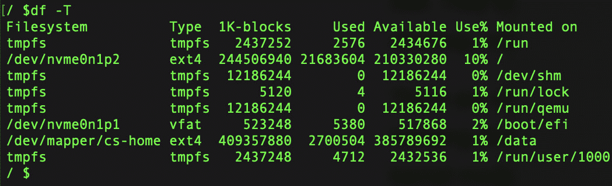
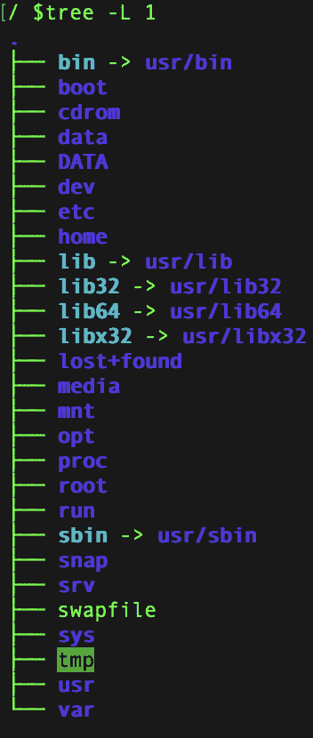
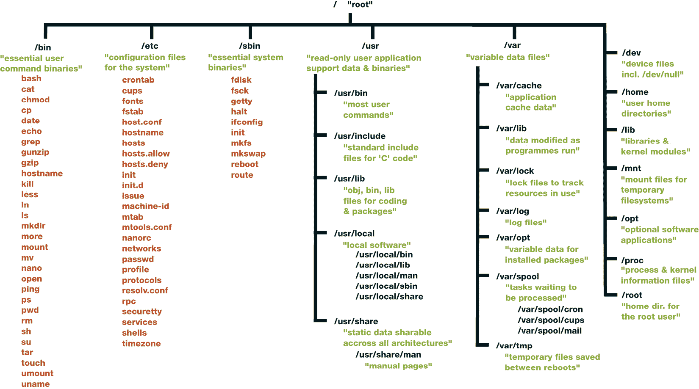
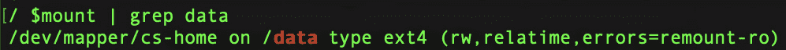
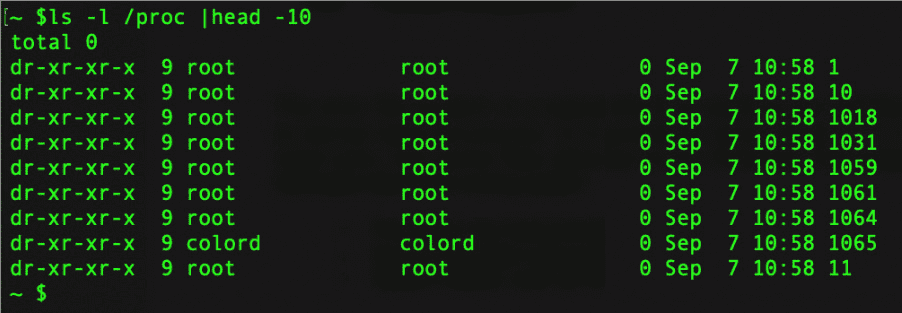
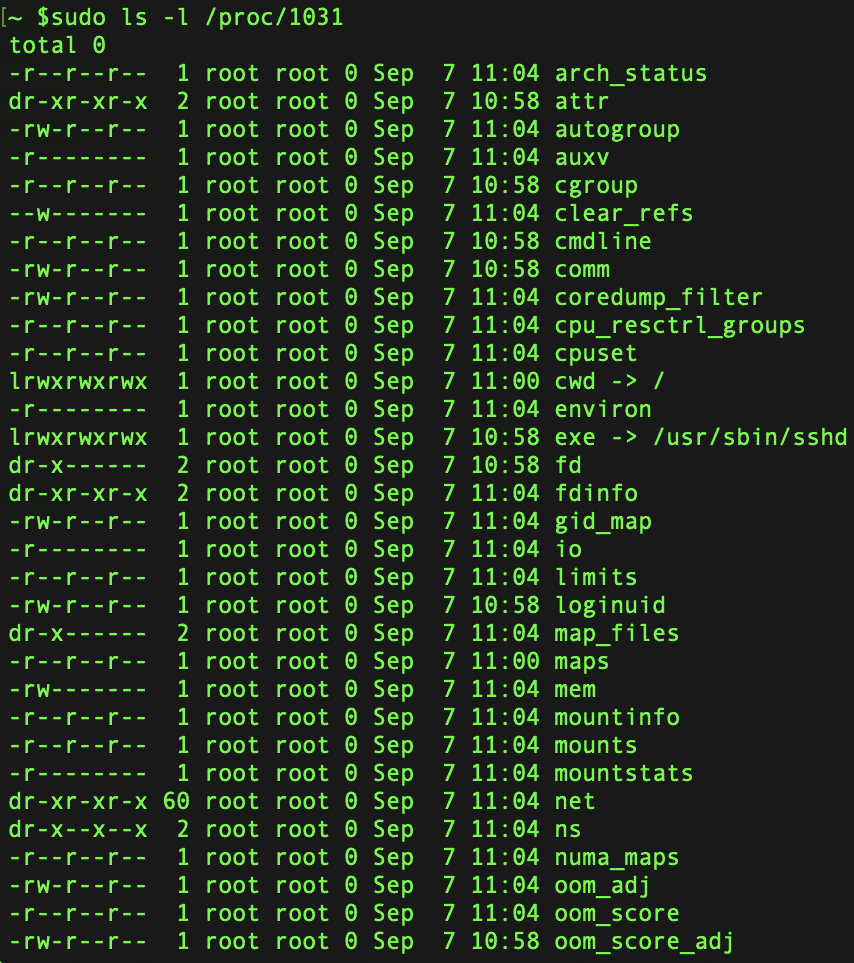
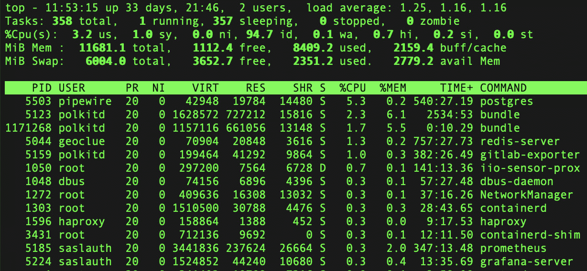

# 3

# Linux 文件系统

本章讨论的主题是文件和文件系统。Unix 的 *一切皆文件* 理念在 Linux 中延续，尽管这并非 100% 成立，但大多数 Linux 资源实际上是文件。

在本章中，我们将首先定义几个相关的概念。接着，我们将探讨 Linux 如何实现 *一切皆文件* 的概念。然后，我们将介绍内核用于报告正在运行的进程或连接的硬件的专用文件系统。接下来，我们将讨论普通文件和文件系统，这些通常与文档、数据和应用程序相关联。最后，我们将探讨标准的文件系统操作，并提供与其他可用替代方案的比较。了解每种文件系统类型的限制非常重要，这样你才能做出最佳决策。

在本章中，我们将涵盖以下主题：

+   可用文件系统类型及其之间的差异

+   目录树和标准目录

+   如何挂载/卸载文件系统

# 什么是文件系统？

文件系统（有时也称为 *文件系统*）负责计算机中数据的存储和检索。如果没有文件系统，计算机硬盘上保存的所有数据将被混在一起，无法找到特定的文件。相反，使用文件系统后，数据被轻松分隔并通过为每一部分命名来标识。每一组数据被称为 *文件*，这个名字最初来自于使用纸质存储的信息系统。*文件系统* 是指用于处理数据名称和数据块组的组织框架和逻辑原则的名称。

实际上，Linux 提供了多种文件系统；如果你不确定该使用哪个文件系统，我们将提供一个详尽的 Linux 支持文件系统的列表。

*Linux 文件系统有哪些类型*？

Linux 有多种文件系统可以选择，包括以下几种：

+   **ext**：专门为 Linux 构建的第一个文件系统叫做 *ext*，它是 *扩展文件系统*（extended filesystem）的缩写，发布于 1992 年。ext 开发者的主要目标是增加可编辑文件的最大大小，当时的限制为 64 MB。通过新创建的元数据结构，最大文件大小增大到了 2 GB。文件名的最大长度也同时增加到 255 字节。

+   **ext2**：这也被称为 *第二扩展系统*。ext2 由 Remy Card 开发，就像第一个文件系统一样，旨在取代 Linux 原始的扩展系统。它在存储容量和整体性能等方面引入了创新。最大文件大小显著增加到 2 TB，相较于上一版本的 2 GB。然而，文件名仍然保持为最多 255 字节。

+   **ext3**：ext3 是 ext2 的升级版，首次开发于 2001 年。2 TB 的最大文件大小没有变化，但 ext3 优于 ext2，因为它是一个日志记录文件系统。2 TB 的最大文件大小保持不变。这意味着如果计算机、硬盘或两者因为某种原因崩溃，或遇到断电等情况，文件可以通过重启后使用一个单独的日志进行修复和恢复，该日志包含崩溃前所做的更改。

ext3 支持三种日志记录级别：

+   **日志**：在发生断电的情况下，文件系统通过将用户数据和元数据写入日志来确保有效的文件系统恢复。在三种 ext3 日志记录模式中，这是最慢的。这种日志模式降低了在 ext3 文件系统中对任何文件所做的更改丢失的可能性。

+   `data=writeback` 模式下，仅元数据更新会被记录到日志中。数据更新则直接写入磁盘上的相应位置，而不先写入日志。由于减少了日志记录数据的开销，这种方法能为写密集型工作负载提供更好的性能。

**优点**：

+   对于写密集型工作负载，性能得到提升，因为数据直接写入磁盘，避免了额外的日志记录开销。

+   写入延迟较低，因为数据无需写入两次（一次到日志，再次到文件系统）。

**缺点**：

+   系统崩溃或断电时数据一致性降低。由于数据更新未被记录在日志中，崩溃时可能会发生数据丢失或不一致。

+   在数据完整性至关重要的场景中（例如数据库），`writeback` 模式可能不是最佳选择，因为它优先考虑性能而非数据一致性。

+   **有序**：该模式不会更新相关的文件系统元数据，而是先将文件数据的更改刷新到磁盘，然后再更新相关的文件系统元数据。这是 ext3 的默认日志记录模式。只有在断电时，正在写入磁盘的文件会*消失*，文件系统的架构不会受到损害。

+   **ext4**：*第四扩展文件系统*，通常称为 ext4，发布于 2008 年。由于它克服了 ext3 存在的一些缺点，ext4 成为了大多数 Linux 发行版的默认文件系统。相比 ext3，ext4 支持显著更大的文件系统和单个文件大小。它可以处理最大 1 exabyte（1 EB）的文件系统和最大 16 terabytes（16 TB）的单个文件。此外，ext4 中的目录最多可以包含 64,000 个子目录（相比之下，ext3 为 32,000 个）。

在 ext4 中，范围（Extent）取代了固定块，成为数据分配的主要方法。范围在硬盘上的起始和结束位置用于描述该范围。由于能够用单个 inode 指针条目表示非常长的物理连续文件，因此表示大文件中所有数据位置所需的指针数量可以大大减少。

+   **JFS**：JFS 代表 *日志文件系统*。它是由 IBM 开发的 64 位文件系统。1990 年，JFS 的第一个版本（也称为 *JFS1*）推出，用于 IBM 的 AIX 操作系统。

电源中断后的数据恢复简单且可靠。此外，与其他文件系统相比，JFS 需要更少的 CPU 功率。

+   **XFS**：SGI 从 1990 年代初期开始开发 XFS，旨在将其作为其 IRIX 操作系统的文件系统。为了应对最具挑战性的计算难题，XFS 被设计为一种高性能的 64 位日志式文件系统。XFS 在大文件操作和高端硬件性能方面具有优势。在 SUSE Linux Enterprise Server 中，XFS 是数据分区的默认文件系统。

+   **Btrfs**：Chris Mason 创建了名为 Btrfs 的 **写时复制**（**COW**）文件系统。它基于 Ohad Rodeh 的适用于写时复制的 B 树。Btrfs 是一种日志式文件系统，它通过将修改后的块写入新的区域而不是将其记录在日志中，来链接更改。新的更改在最后一次写入之前不会被提交。

+   **交换**：当计算机的可用内存开始变低时，系统会使用一个被称为交换文件的文件，在固态硬盘或硬盘上生成临时存储空间。该文件会用一个新的部分替代暂停程序中的一部分内存，从而释放内存供其他进程使用。

计算机通过使用交换文件可以利用比物理安装的更多的内存。换句话说，它能够运行比单纯依赖物理内存所提供的有限资源更多的程序。

由于交换文件并不保存在计算机的实际内存中，我们可以将其视为一种虚拟内存。当计算机使用交换文件时，操作系统实际上是在自欺欺人，认为它拥有比实际更多的内存。

Linux 兼容多种文件系统，包括 FAT 和 NTFS 文件系统，这些文件系统是其他操作系统（如 Windows）的标准。嵌入式开发者可能会支持这些文件系统，尽管在大多数情况下，会使用 Linux 文件系统，如 ext4、XFS 或 Btrfs，来作为存储分区。更好地理解现有替代方案的优点，将有助于你为特定应用选择合适的文件系统。

# 高可扩展性

通过利用分配组，XFS 提供了卓越的可扩展性。

支持 XFS 文件系统的块设备在创建文件系统时被划分为八个或更多相同大小的线性区域，它们被称为分配组。每个分配组控制其自身的空闲磁盘空间和 inode。由于分配组之间相对独立，内核可以同时处理多个分配组。这一特点使得 XFS 具备了高度的可扩展性。这些自治的分配组自然满足了多处理器系统的需求。

# 高性能

XFS 通过有效管理磁盘空间来提供高性能。

在分配组内，B+树管理着空闲空间和 inode。通过使用 B+树，XFS 的效率和可扩展性得到了显著提升。XFS 通过将分配过程分为两步来延迟管理分配。待处理的事务保存在 RAM 中，并预留了必要的空间。数据存储的精确位置（以文件系统块为单位）仍然由 XFS 来决定。这个选择会被推迟到最后一刻。如果在 XFS 选择存储位置时数据已过时，某些短暂的临时数据可能永远无法写入磁盘。XFS 通过这种方式提高了写入性能并减少了文件系统的碎片化。在写入操作发生崩溃时，延迟分配文件系统比其他文件系统更可能遭遇数据丢失。

## 我的系统使用哪种文件系统？

如果你不确定你的发行版使用的是哪种文件系统，或者你只是想知道自己安装的是哪种文件系统，可以在终端使用一些巧妙的命令来查找。

还有其他方法可以完成这一任务，但我们将在这里展示最简单的一种，使用 `df -T` 命令。



图 3.1 – 用于确定正在使用的文件系统类型的命令

在第二列标为 `Type` 的部分，你可以看到文件系统格式的描述。这时，你应该能够判断出你在 Linux 系统上挂载的是什么文件系统。

# FUSE 文件系统

作为用户，在与用户空间中的文件和目录交互时，你不需要过多担心底层的实现。通常，进程通过系统调用与内核交互，从而读取或写入已挂载的文件系统。然而，你确实可以访问一些看起来不属于用户领域的数据，特别是 `stat()` 系统调用，它返回 inode 号和链接计数。

即使在你不维护文件系统时，是否需要担心 inode 编号、链接计数和其他实现细节？不需要（在大多数情况下）。这些信息提供给用户模式程序的主要目的是为了保持向后兼容。此外，这些文件系统内部细节并非每个 Linux 文件系统都有，因为它们并没有标准化。VFS 接口层负责确保系统调用始终返回 inode 编号和链接计数；然而，这些数字的值可能代表某些意义，也可能不代表任何意义。

在非传统文件系统上，您可能无法执行典型的 Unix 文件系统操作。例如，您无法在挂载的 VFAT 文件系统上使用`ln`命令创建硬链接，因为该文件系统的目录条目结构不支持硬链接的概念。由于用户空间提供的系统调用具有高度抽象，因此在 Linux 系统上操作文件无需了解底层实现的任何知识。此外，文件名的格式灵活，并且支持使用大小写混合的文件名；这两个特点使得支持其他层次结构样式的文件系统变得简单。

注

请记住，特定文件系统的支持不一定需要包含在内核中。举一个例子，内核在用户空间文件系统中的作用仅限于作为系统调用的传导者。

# 目录树和标准目录

要查看根目录的主要结构，只需使用以下命令：`tree -L 1`。



图 3.2 – 查看目录结构树的命令

为了更好地理解 Linux 文件系统的运作方式，让我们参考 *图 3.2* 中显示的 Linux 文件系统图，看看每个文件夹的作用。并非所有这里提到的文件夹或前面示例中的文件夹都会出现在每个 Linux 发行版中，但绝大多数都会：

+   `/bin`：大多数二进制文件保存在此位置，这个位置发音为*bin*，并且常常被 Linux 终端命令和一些基本实用工具使用，例如`cd`（切换目录）、`pwd`（打印当前目录）、`mv`（移动）等。

+   `/boot`：所有与 Linux 启动相关的文件都可以在此文件夹中找到。大多数人（包括我）将此目录保存在硬盘的单独分区上，特别是如果他们计划使用双启动。记住，即使 `/boot` 物理上位于不同的分区，Linux 仍然认为它位于 `/boot`。

+   `/dev`：你的物理设备，例如硬盘、USB 驱动器和光盘，在这里挂载。此外，您的磁盘可能会有不同的分区，在这种情况下，您将看到`/dev/sda1`、`/dev/sda2`，以此类推。

+   `/etc`：此目录存储配置文件。用户可以将配置文件保存在自己的 `/home` 文件夹中，这样只会影响该用户，而存放在 `/etc` 中的配置通常会影响系统上的所有用户。

+   `/home`：因为此目录包含你所有的个人信息，所以你将大部分时间都待在这里。`/home/username` 目录包含 `Desktop`、`Documents`、`Downloads`、`Photos` 和 `Videos` 等子目录。

+   `/lib`：此目录包含所有的库文件。在安装 Linux 发行版时，通常会下载以 lib- 开头的附加库文件。你的 Linux 程序的运行依赖于这些文件。

+   `/media`：这是挂载外部设备（如 USB 驱动器和 CD-ROM）的地方。不同的 Linux 发行版之间可能有所不同。

+   `/mnt`：此目录基本上是其他文件夹或磁盘的挂载点。虽然可以用于任何用途，但通常用于网络位置。

+   `/opt`：此目录包含计算机的附加软件，这些软件并未被你所使用的发行版中的软件包管理工具管理。

+   `/proc`：*进程*文件夹包含各种文件，保存系统数据（记住，万物皆文件）。本质上，它为 Linux 内核——操作系统的核心——提供了一种与在 Linux 环境中运行的多个进程进行通信的机制。

+   `/root`：这是根用户的等效目录，通常被称为超级用户。除非你非常确信自己知道自己在做什么，否则不要随意操作此目录中的任何内容。

+   `/sbin`：此目录类似于`/bin`，但它包含的指令只能由*root*用户执行，有时也被称为*超级用户*。

+   `/tmp`：临时文件存储在这里，通常在计算机关机时被删除，因此你无需像在 Windows 中那样手动删除它们。

+   `/usr`：此目录包含在用户之间共享的文件和工具。

+   `/var`：系统在运行过程中用于存储信息的文件通常位于 Linux 及其他类 Unix 操作系统中根目录的 `/var` 子文件夹中。

我们现在已经涵盖了根目录，但许多子目录也包含其他文件和文件夹。你可以从下面的图示中大致了解基本的文件系统树形结构：



图 3.3 – 基本的文件系统结构（来源：[`en.wikipedia.org/wiki/Unix_filesystem`](https://en.wikipedia.org/wiki/Unix_filesystem)）

理解根目录结构将使你在 Linux 世界中生活更加轻松。

# 链接（硬链接和符号链接）

有两种替代方式来引用硬盘上的文件：硬链接和符号链接。文件系统通过不同的方式组织文件的位置，包括符号链接和硬链接。硬链接基本上指向文件的 inode，是该文件的同步副本。另一方面，符号链接直接指向文件，而文件再指向 inode，形成一个快捷方式。我们需要接下来讨论 inode，才能理解符号链接和硬链接是如何工作的。

## 什么是 inode？

Unix 风格的文件系统使用一种称为 inode 的数据结构来描述文件系统对象，如文件和目录。对象的数据属性和磁盘块位置存储在每个 inode 中。文件系统对象的属性可以包括元数据、所有者信息和权限信息。

inode 本质上是一个地址的数字等价物。操作系统可以通过 inode 获取有关文件的详细信息，包括权限、特权以及数据在硬盘上的精确位置。

## 什么是硬链接？

在计算机系统中，硬链接是一种特殊的链接，通过文件名直接指向特定的文件。即使文件名发生更改，硬链接仍然会继续指向原始文件，这与软链接不同。

在将目录项或文件链接到相同内存区域的两种方法进行比较时，硬链接更加可靠。与符号链接不同，硬链接防止文件被删除或移动。当多个硬链接指向同一个文件时，*别名效应* 可能会发生，文件会有多个标识符。专家一致认为，所有链接，无论是硬链接还是软链接，都是指针；然而，硬链接被认为比软链接更加永久。

## 什么是符号链接？

符号链接本质上是快捷方式，指向的是文件，而不是文件的 inode 值。此方法可以应用于目录，也可以用来引用位于不同硬盘和磁盘卷上的数据。如果原始文件被移动到其他文件夹，符号链接会被破坏或变成悬挂链接。这是因为符号链接指向的是原始文件，而不是文件的 inode 值。

因为符号链接指向原始文件，所以你对符号链接所做的任何更改，都应导致对实际文件的相应更改。

# 挂载和卸载文件系统

为了让计算机访问文件，文件系统必须被挂载。`mount` 命令将显示当前在系统上挂载（可用）的内容。

我创建了自己的 `/data` 文件夹，并将一个新的硬盘挂载到该文件夹：



图 3.4 – 显示挂载在 /data 上的文件系统的命令

要通过命令挂载文件系统，只需运行以下命令：

```
mount -t ext4 /dev/mapper/cs-home /data
```

为了在重启时自动挂载，你必须在`/etc/fstab`中定义这一条目。

如果你想挂载 CD-ROM，只需运行以下命令：

```
mount -t iso9660 /dev/cdrom /mnt/cdrom
```

若需更详细的信息，请查阅`mount`的手册页，或运行`mount -h`来获取帮助。

`cd`命令可以用来遍历你在挂载后创建的新可访问文件系统。

## 如何卸载文件系统

使用`umount`命令并指定挂载点或设备，你可以卸载（分离）文件系统。

例如，以下命令将卸载 CD-ROM：

```
umount /dev/cdrom
```

## 伪文件系统

进程信息伪文件系统是`proc`文件系统的另一种名称。它包含的是运行时的系统信息，而不是*实际的*文件（例如，系统内存、已挂载的设备、硬件配置等）。因此，它可以被看作是内核的命令和信息中心。该目录（`/proc`）被许多系统工具访问。`lsmod`命令列出内核加载的模块，`lspci`命令显示附加到 PCI 总线的设备。这两个命令分别等同于`cat /proc/modules`和`cat /proc/pci`。类 Unix 操作系统（例如 Linux）中的常见伪文件系统示例如下：

+   进程，最显著的用途

+   内核信息和参数

+   系统指标，例如 CPU 使用情况

## 进程

有关每个运行进程的所有信息都可以在`/proc/pid`文件中找到。这里展示了当前正在运行的一些 PID：



图 3.5 – 查看运行中的进程的命令

以 PID `1031`为例，看看里面有什么：



图 3.6 – 查看 PID 1031 进程内部内容的命令

最后，合成文件系统是一种提供类树形接口的文件系统，用于非文件对象，使它们看起来像是硬盘存储或长期存储文件系统中的普通文件。这种类型的文件系统也称为虚假文件系统。

## 内核和系统信息

`/proc`下的众多文件夹包含了大量关于内核和操作系统的知识。这里有太多内容无法一一列出，但我们会介绍一些，并简要说明它们包含的内容：

+   `/proc/cpuinfo`：关于 CPU 的信息

+   `/proc/meminfo`：关于物理内存的信息

+   `/proc/vmstats`：关于虚拟内存的信息

+   `/proc/mounts`：关于挂载信息

+   `/proc/filesystems`：关于已编译到内核中的文件系统以及当前加载的内核模块的信息

+   `/proc/uptime`：显示当前系统的运行时间

+   `/proc/cmdline`：内核命令行

## CPU 使用情况

在评估一个系统的整体性能时，了解 CPU 时间的使用情况至关重要。了解如何通过命令行监控 Linux 中的 CPU 利用率是每个使用 Linux 的人必备的知识，无论是爱好者还是系统管理员。

用于此目的的最常见命令之一是`top`：



图 3.7 – top 命令的输出

系统的响应应该是所有活动任务的全面总结，用户、进程、CPU 使用情况和内存消耗都可以查看。

# 总结

在本章中，我们探讨了 Linux 中的文件和文件系统。文件系统是一种强大而多功能的方式，用于以层次化的方式组织对信息的访问。在 Linux 中，文件系统是众多技术和持续努力的重点。有些是开源的，但也有一系列的商业选项。

在下一章中，我们将讨论进程和进程控制。
