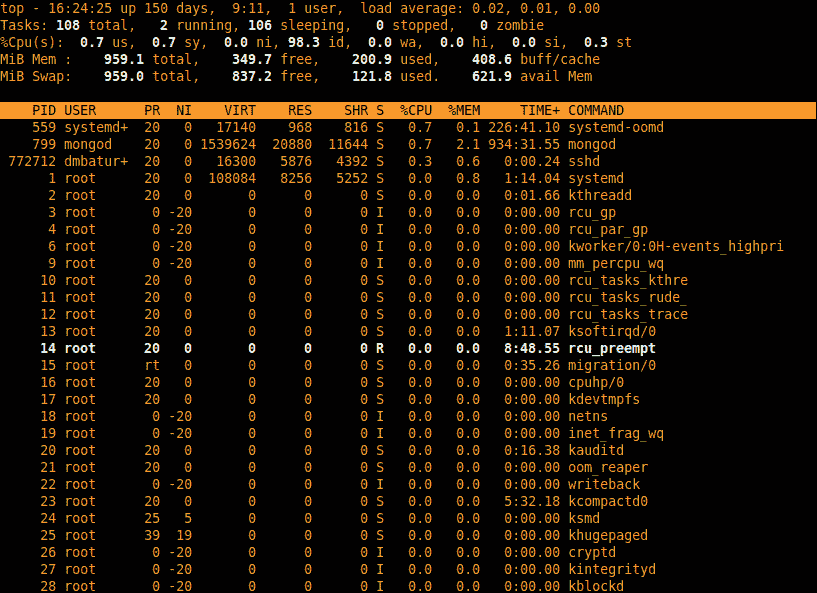

# 进程与进程控制

操作系统的主要作用是让应用程序能够在计算机上运行并使用其资源。系统管理员的角色往往归结为确保正确的进程在运行，并在它们没有运行时进行诊断。因此，理解操作系统如何启动和处理进程，以及如何启动、停止和监控它们是非常重要的。

本章将涉及以下主题：

+   可执行文件与进程

+   进程终止、退出码和信号

+   进程树

+   进程查找与监控

# 可执行文件与进程

程序作为*可执行文件*分发。在许多历史操作系统中，程序是从文件中直接按字节加载到内存的。这种方式实现简单，但有许多局限性（最明显的是要求具有固定的内存布局以及无法存储任何元数据），因此后来的系统发明了可执行文件的特殊格式。

例如，如果我们用文件命令检查 **Bourne Again Shell**（**Bash**）可执行文件，我们会看到如下内容：

```
$ file /bin/bash
/bin/bash: ELF 64-bit LSB pie executable, x86-64, version 1 (SYSV), dynamically linked, interpreter /lib64/ld-linux-x86-64.so.2, BuildID[sha1]=9c4cb71fe5926100833643a8dd221ffb879477a5, for GNU/Linux 3.2.0, stripped
```

如果你使用的是除 Debian 或 Red Hat 衍生版外的其他 Linux 发行版（这些是本书的主要重点），并且前面的命令对你无效，你可以使用 `which bash` 查找 bash 可执行文件的位置，或者选择其他可执行文件，如 `cat` 或 `ls`。

**ELF** 代表 **可执行与可链接格式**。它是 Linux 和许多其他类 Unix 操作系统的默认可执行文件格式（**LSB** 意味着 **Linux 标准基准**）。ELF 文件存储程序的可执行代码——被加载到内存中供 CPU 执行的机器指令。然而，它也可以存储调试信息，例如机器指令与它们编译自的程序源代码行之间的关联。ELF 文件还可以与其他 ELF 文件进行*链接*，这些文件被称为*共享库*——包含可执行代码但不作为程序运行，只作为可重用函数的集合存在。

你可以使用 `ldd` 命令查看库链接信息：

```
$ ldd /bin/bash
    linux-vdso.so.1 (0x00007ffc06ddb000)
    libtinfo.so.6 => /lib64/libtinfo.so.6 (0x00007f30b7293000)
    libc.so.6 => /lib64/libc.so.6 (0x00007f30b7000000)
    /lib64/ld-linux-x86-64.so.2 (0x00007f30b743e000)
```

如果你对 `libc.so.6` 执行 `file` 命令，这是 C 编程语言的标准库，你会看到它也是一个 ELF 文件：

```
$ file /lib64/libc.so.6
/lib64/libc.so.6: ELF 64-bit LSB shared object, x86-64, version 1 (GNU/Linux), dynamically linked, interpreter /lib64/ld-linux-x86-64.so.2, BuildID[sha1]=6f5ce514a9e7f51e0247a527c3a41ed981c04458, for GNU/Linux 3.2.0, not stripped
```

最后，ELF 存储元数据，如目标操作系统和 CPU 架构。文件命令不会猜测前面示例中的文件是针对 x86-64 上的 Linux 的，而是直接从 ELF 文件头获取信息。

在 `file /bin/bash` 的输出中，你可能会注意到一个不寻常的字段——`interpreter /lib64/ld-linux-x86-64.so.2`。Bash 是用 C 语言编写的，而 C 是一种编译型语言，不需要任何解释器。实际上，那个可执行文件包含机器代码，Linux 内核知道如何加载 ELF 文件；如果它不能这样做，就无法加载那个 `ld-linux` 解释器，从而导致一个“先有鸡还是先有蛋”的问题。

`ld-linux.so` 的作用不是解释可执行文件本身，而是正确解析来自共享库的函数引用。如果你对它运行 `file` 命令，你会看到它是 `static-pie linked` 而不是 `dynamically linked`，与 `/bin/bash` 不同 —— `static-pie` 意味着 `static` `position-independent executable`（静态位置无关可执行文件）：

```
$ file /lib64/ld-linux-x86-64.so.2
/lib64/ld-linux-x86-64.so.2: ELF 64-bit LSB shared object, x86-64, version 1 (GNU/Linux), static-pie linked, BuildID[sha1]=8fa0bd5df5fa6fff60bb4cbdd753621d00f94dfc, with debug_info, not stripped
```

内核不了解程序的库函数依赖关系，只能直接加载静态链接的 ELF 可执行文件。为了加载动态链接的可执行文件，它依赖于 `ld-linux.so` 辅助程序，但它为此重新使用了一种通用的解释器关联机制，而不是为这种情况发明一个专门的机制。

使用解释性语言编写的程序，如 Python、Ruby 或 shell，首先需要加载实际的解释器。这通过以 `#!` 开头的 *shebang 行* 来指定。

你可以通过创建一个简单的 shell 脚本来亲自尝试一下：

```
$ echo '#!/bin/bash' >> hello.sh
$ echo 'echo "hello world"' >> hello.sh
$ chmod +x ./hello.sh
$ ./hello.sh
hello world
```

如果一个文件具有可执行位（`+x`）并以 shebang 行开头，内核将首先加载它的解释器（在这个例子中是`/bin/bash`），然后将可执行文件作为参数传递给它。

一旦一个可执行文件被加载，无论是由内核本身直接加载还是通过解释器的帮助，它就变成了一个正在运行的*进程*。

# 进程终止和退出码

所有进程最终都必须终止，并且在许多情况下，进程执行无法继续，可能是由于其自身程序逻辑中的错误或环境问题（例如缺少文件）。用户也可能需要手动终止进程，无论是为了修改系统，还是为了防止一个行为异常的进程占用资源或干扰系统的正常运行。

在本节中，我们将学习如何检查已终止进程的退出码，以推测其终止的可能原因，以及如何与进程进行通信并强制它们终止。

## 退出码

大多数进程寿命较短 —— 它们完成工作后会自行终止。每个进程都有一个*退出码* —— 一个数字值，表示它是正常退出还是由于错误终止。按惯例，零退出码表示成功，任何非零退出码表示错误。非零退出码没有标准的含义 —— 具体含义在程序和操作系统之间有所不同，许多程序遇到错误时会直接以 `1` 退出，无论错误是什么。

在 bash 中，你可以通过名为 `$?` 的特殊变量来查看上一个命令的退出码。有一对 Unix 命令，它们的唯一目的是分别以成功和错误代码退出，`true` 和 `false`：

```
$ true
$ echo $?
0
$ false
$ echo $?
1
```

大多数时候，程序自己设置它们的退出代码。例如，在 Shell 脚本中，你可以使用`exit 1`来表示错误。在 C 语言中，你可以在`main()`函数中使用`return 1`来达到相同的效果。对于那些可以通过脚本非交互式执行的程序来说，遇到错误时退出时必须使用非零代码；否则，脚本作者将无法知道他们的脚本步骤是否成功或失败。

所有标准命令都会这样做。例如，让我们尝试以普通用户身份在`/etc/`目录下创建一个文件，并查看它在`$?`变量中留下的内容：

```
$ touch /etc/my_file
touch: cannot touch '/etc/my_file': Permission denied
$ echo $?
1
```

退出代码的最简单用例是使用`||`和`&&`操作符连接命令。它们可以在*错误时*和*成功时*调用 —— 在`cmd1 || cmd2`中，如果`cmd1`失败（即以非零代码退出），Shell 会执行`cmd2`；在`cmd1 && cmd2`中，则相反——只有当`cmd1`成功（以零代码退出）时，`cmd2`才会被执行：

```
$ touch /etc/my_file || echo "Fail!"
touch: cannot touch '/etc/my_file': Permission denied
Fail!
$ touch /tmp/my_file && echo "Success!"
Success!
```

对于我们示例中的文件权限错误等错误，内核仅仅是没有按照程序的请求去执行，而是允许程序继续正常运行。原因在于，这种错误通常是由于用户输入不正确而发生的，而程序逻辑是正确的，因此程序需要能够处理这些错误并通知用户。然而，在其他情况下，内核会通过生成*信号*来中断进程。

## 信号

信号是进程执行过程中可能出现的一种特殊情况。POSIX 标准定义了许多信号。有些信号与特定的程序逻辑错误相关，例如`SIGILL` — *非法指令*（例如尝试除以零时引发）— 或`SIGSEV` — *内存段错误*（例如尝试读取或修改未分配给进程的内存）。其他信号则是由外部条件生成，用于强制进程处理这些信号，例如`SIGPIPE`，当网络套接字或本地管道被另一端关闭时会生成该信号。这些信号主要对软件开发人员有意义，但有些信号被设计为管理员的进程控制工具，如`SIGINT`（中断进程）、`SIGTERM`（请求进程清理其状态并终止）、以及`SIGKILL`（通知内核强制终止进程）。有人说信号是*发送到进程*的。这个术语对用户来说是一个不错的抽象，但实际上，当信号被生成时，是内核在执行控制，而不是进程。程序员可以预期某些信号，并为它们注册*信号处理程序*。例如，许多高级编程语言的解释器会处理`SIGILL`信号，并将其转换为异常，例如 Python 中的`ZeroDivisionError`。然而，如果程序员忘记或选择不为`SIGILL`注册处理程序，而程序又尝试除以零，那么内核会终止该进程。

如果你安装了 **GNU 编译器集合** (**GCC**)，你可以通过一个简单的 C 程序亲自验证：

```
$ echo "void main() { int x = 0 / 0; }" >> sigill.c
$ gcc -o sigill ./sigill.c
./sigill.c: In function 'main':
./sigill.c:1:25: warning: division by zero [-Wdiv-by-zero]
    1 | void main() { int x = 0 / 0; }
    |                         ^
$ ./sigill
Floating point exception (core dumped)
$ echo $?
136
```

GCC 友好地警告你程序有误，但如果你仍然尝试运行它，内核会强制终止它并将错误代码设置为非零值。

像 `SIGILL` 或 `SIGPIPE` 这样的信号是无论用户意愿如何都会发生的，但也有一些信号类别是用户（或代表用户的进程）主动触发的。

## kill 命令

发送信号给进程的命令叫做 **kill**。这个名字有些误导；它通常用于强制终止进程，但也可以发送其他信号。

为了说明其用法，让我们学习如何将一个进程发送到后台。在 bash 中，你可以通过在命令后面添加一个 & 符号来实现。使用 `jobs` 命令，你可以看到后台进程的列表，通过使用 `fg <job number>`，你可以将某个编号的任务带到前台。以下是如何将一个 `cat` 进程发送到后台，然后再将其带回前台：

```
$ cat &
[1] 22501
[1]+  Stopped                 cat
$ jobs
[1]+  Stopped                 cat
$ fg 1
cat
hello world
hello world
^C
$
```

当你按下 *Ctrl* + *C* 在 shell 中终止进程时，你实际上是在要求你的 shell 发送 `SIGINT` 信号——一个中断执行的信号。如果一个进程在后台运行，我们不能用 *Ctrl* + *C* 来中断它。然而，通过 `kill`，我们可以手动发送信号：

```
$ cat &
[1] 22739
[1]+  Stopped                 cat
$ kill 22739
$ jobs
[1]+  Stopped                 cat
$ fg 1
cat
Terminated
```

发生的事情是——当我们运行 `cat &` 时，shell 告诉我们它的 *后台任务编号* (`1`) 和 `22739`，不过它也可以是任何数字。然后我们使用 `kill 22739` 向该进程发送信号，确实，当我们尝试将它带到前台时，shell 告诉我们它在后台时已经被终止。

默认情况下，`kill` 命令会发送 `SIGTERM` 信号。`SIGINT` 和 `SIGTERM` 都可以被进程捕获或忽略。通过向进程发送这些信号，你请求它终止；一个行为规范的进程应该遵从并可能利用这个机会在终止之前完成当前任务——例如，完成写入文件的数据。这意味着，在 shell 中按下 *Ctrl* + *C* 组合键或使用默认选项的 `kill` 命令都不适合强制终止一个行为不当的进程。

要强制一个进程退出，你应该使用 `kill -SIGKILL <PID>`，或者它的数字等效命令 `kill -9 <PID>`。不过，这应该是你的最后手段，因为内核会立即结束该进程，这可能会导致其文件处于不一致的状态。

如果你运行 `kill -l`，你将看到一长串可用的信号列表：

```
$ kill -l
 1) SIGHUP     2) SIGINT     3) SIGQUIT     4) SIGILL     5) SIGTRAP
 6) SIGABRT     7) SIGBUS     8) SIGFPE     9) SIGKILL    10) SIGUSR1
11) SIGSEGV    12) SIGUSR2    13) SIGPIPE    14) SIGALRM    15) SIGTERM
16) SIGSTKFLT    17) SIGCHLD    18) SIGCONT    19) SIGSTOP    20) SIGTSTP
21) SIGTTIN    22) SIGTTOU    23) SIGURG    24) SIGXCPU    25) SIGXFSZ
26) SIGVTALRM    27) SIGPROF    28) SIGWINCH    29) SIGIO    30) SIGPWR
31) SIGSYS    34) SIGRTMIN    35) SIGRTMIN+1    36) SIGRTMIN+2    37) SIGRTMIN+3
38) SIGRTMIN+4    39) SIGRTMIN+5    40) SIGRTMIN+6    41) SIGRTMIN+7    42) SIGRTMIN+8
43) SIGRTMIN+9    44) SIGRTMIN+10    45) SIGRTMIN+11    46) SIGRTMIN+12    47) SIGRTMIN+13
48) SIGRTMIN+14    49) SIGRTMIN+15    50) SIGRTMAX-14    51) SIGRTMAX-13    52) SIGRTMAX-12
53) SIGRTMAX-11    54) SIGRTMAX-10    55) SIGRTMAX-9    56) SIGRTMAX-8    57) SIGRTMAX-7
58) SIGRTMAX-6    59) SIGRTMAX-5    60) SIGRTMAX-4    61) SIGRTMAX-3    62) SIGRTMAX-2
63) SIGRTMAX-1    64) SIGRTMAX
```

其中一些信号没有预定义的含义，而是特定于应用程序的。例如，在 `SIGUSR1` 和 `SIGUSR2` 中，`USR` 代表 *用户定义*。大多数进程会忽略它们，但有些进程会用它们让系统管理员强制重新加载配置或执行其他操作。

现在，我们知道如何检查已终止进程的错误代码，并了解它们是正常退出还是失败退出。我们还学会了操作系统内核如何通过信号与进程通信，以及如何使用 `kill` 命令要求内核让进程退出或强制终止一个表现不正常的进程。现在，让我们学习如何探索正在运行的进程及它们之间的关系。

# 进程树

我们已经看到，shell 知道你运行的命令的 PID，并且可以在你按下*Ctrl* + *C*时发送信号终止它们。这意味着它对你要求它启动的进程有一定的控制权。事实上，所有你从 shell 启动的内容都成为该 shell 进程的*子进程*。

shell 本身是一个子进程——如果你在 Linux 桌面上，它是你的终端模拟器的子进程；如果你通过 SSH 远程连接，它是 OpenSSH 守护进程的子进程。然而，所有进程是否有父进程，或者是否可以存在没有父进程的多个进程呢？

事实上，所有进程都有一个父进程，所有正在运行的进程关系形成一棵以单一根节点（PID = 1）为根的树。由于历史原因，所有进程的父进程通常被称为*init 进程*。在通用 Linux 发行版中，这个进程长期以来是 System V init，因此有了这个术语。

PID=1 的进程可以是任何东西。当你启动一个 Linux 系统时，你可以告诉它加载哪个可执行文件作为 PID=1。例如，一种将系统启动到救援模式的方法是将`init=/bin/bash`附加到 GRUB 命令行（但你最好使用发行版启动菜单中的内建救援选项，因为它可能会传递额外的有用参数）。这将使你的内核进入单用户 shell 会话，而不是启动正常的引导过程。一些仅将 Linux 用作硬件抽象层的嵌入式系统可能会启动自定义进程。但是，通常情况下，PID=1 的进程作为服务管理器。

System V init 作为事实标准的服务管理器已经存在了二十多年，但大多数现代发行版使用 systemd，而有些则选择其他替代旧版 System V init 的方案，如 OpenRC。

`init` 进程是唯一一个由内核直接启动的进程。其他所有进程都是由 `init` 进程启动的：登录管理器、SSH 守护进程、Web 服务器、数据库系统——所有你能想到的东西。你可以使用 `pstree` 命令查看完整的进程树。以下是一个小型 Web 服务器的进程树：

```
$ pstree
systemd─┬─NetworkManager───2*[{NetworkManager}]
     ├─2*[agetty]
     ├─auditd───{auditd}
     ├─chronyd
     ├─crond
     ├─dbus-broker-lau───dbus-broker
     ├─do-agent───5*[{do-agent}]
     ├─droplet-agent───8*[{droplet-agent}]
     ├─nginx───nginx
     ├─sshd───sshd───sshd───bash───pstree
     ├─systemd───(sd-pam)
     ├─systemd-homed
     ├─systemd-hostnam
     ├─systemd-journal
     ├─systemd-logind
     ├─systemd-oomd
     ├─systemd-resolve
     ├─systemd-udevd
     └─systemd-userdbd───3*[systemd-userwor]
```

在这里，你可以看到 `pstree` 是一个 bash 会话的子进程，而该 bash 会话本身是 `sshd`（一个 OpenSSH 进程）的子进程，而 `sshd` 又是 `systemd` 的子进程——进程树的根。

然而，大多数时候，你会关注寻找特定的进程及其资源使用情况。

# 进程搜索与监控

`pstree`命令是可视化所有运行中进程及其相互关系的好方法，但在实际操作中，大多数时候管理员都在寻找特定的进程，或者需要了解它们的资源使用情况，而不仅仅是它们的存在。让我们来学习一些用于这些任务的工具——`ps`命令用于搜索进程，`top`命令用于实时监控资源使用情况，以及这些工具所使用的底层内核接口。

## `ps`命令

**PS**是**进程选择**或**进程快照**的缩写。它是一个允许你检索和过滤正在运行的进程信息的工具。

不带任何参数运行`ps`将得到一个非常有限的选择——只显示由你的用户运行并且附加到*终端*的进程（即不是那些关闭所有输入和输出，仅通过网络或本地套接字与其他进程通信的进程——通常是守护进程，但图形用户界面程序也可能有类似的行为）。

有些许令人困惑的是，`ps`本身总是出现在这样的列表中，因为当它收集这些信息时，它本身就是一个正在运行的进程：

```
$ ps
    PID TTY          TIME CMD
 771681 pts/0    00:00:00 bash
 771705 pts/0    00:00:00 ps
```

`PID`字段当然是进程标识符——是内核在进程启动时分配给每个进程的唯一数字。如果存在，`TTY`字段表示终端——它可以是一个真实的串行控制台（通常是`ttyS*`或`ttyUSB*`），一个物理显示器上的虚拟控制台（`tty*`），或者与 SSH 连接或终端模拟器相关的纯虚拟伪终端（`pts/*`）。

`CMD`字段显示启动进程时使用的命令及其参数（如果有使用的话）。

`ps`命令有许多选项。你应该立刻了解的两个选项是`a`和`x`——这些选项移除了*由我拥有的*和*具有* *终端*的限制。

查看系统上每个进程的常用命令是`ps ax`。我们来试试运行它：

```
$ ps ax
    PID TTY    STAT    TIME COMMAND
    1 ?        Ss    1:13 /usr/lib/systemd/systemd --switched-root --system --deserialize 30
    2 ?        S       0:01 [kthreadd]
    3 ?        I<      0:00 [rcu_gp]
    4 ?        I<      0:00 [rcu_par_gp]
               …
    509 ?      Ss      7:33 /usr/lib/systemd/systemd-journald
    529 ?      S       0:00 [jbd2/vda2-8]
    530 ?      I<      0:00 [ext4-rsv-conver]
    559 ?      Ss    226:16 /usr/lib/systemd/systemd-oomd
    561 ?      Ss      0:49 /usr/lib/systemd/systemd-userdbd
    562 ?      S<sl    1:17 /sbin/auditd
    589 ?      Ss      0:10 /usr/lib/systemd/systemd-homed
    590 ?      Ss      0:02 /usr/lib/systemd/systemd-logind
```

`STAT`字段告诉我们进程的状态。`S`状态意味着进程处于可中断的睡眠状态——它在等待外部事件。当前正在执行的进程会显示为`R`状态——运行状态。`I`状态是特别的；它表示空闲的内核线程。最令人担忧的状态是`D`——不可中断的睡眠状态。如果进程正在等待输入/输出操作完成，它就处于不可中断的睡眠状态。因此，如果有大量这样的进程，可能意味着输入/输出系统过载。

请注意，有一些带方括号的命令名称在`pstree`的输出中看不到。实际上，它们是内核服务，被设计成类似进程的形式，以便于监控，或者是出于其内部的原因。

如果你还想查看每个进程的所有者，可以在命令中添加`u`：

```
$ ps axu
USER         PID %CPU %MEM    VSZ   RSS TTY      STAT START   TIME COMMAND
root        1  0.0  0.8 108084  8340 ?        Ss   Apr01   1:13 /usr/lib/systemd/systemd --switched-root --system --deserialize 30
root        2  0.0  0.0      0     0 ?     S    Apr01   0:01 [kthreadd]
```

还有许多其他的选择和格式选项，您可以在官方文档中找到。

## 进程监控工具

`ps`命令提供了进程、CPU 和内存消耗的静态视图。如果你想找出导致 CPU 使用率峰值的原因，那就非常不方便——你需要碰运气，正好在峰值发生时运行`ps`。这就是人们编写持续监控进程并按资源消耗排序显示它们的工具的原因。

这种类型的工具中最古老的之一是`top`。它在 Linux 发行版的仓库中广泛提供，甚至可能在你的系统中默认安装。它显示一个交互式的进程列表，消耗最大资源的进程会自动排到最上面。



图 4.1 – top 命令输出

还有其他受它启发的工具，例如`htop`，它提供了不同的用户界面和附加功能。还有一些工具监控`top`或`htop`不监控的资源使用类型，例如`iotop`，这是一个监控进程输入/输出活动的工具。

## `/proc`文件系统

最后，让我们检查最低级的进程信息接口——`/proc`文件系统。它是一个*虚拟文件系统*的例子，并很好地展示了 Unix 类操作系统广泛使用的*一切皆文件*原则。

对用户而言，`/proc`看起来像是一个包含文件的目录。这些文件中有些与进程无关，而是包含其他系统信息——例如，`/proc/version`包含正在运行的内核版本。以下是来自 Fedora 35 系统的示例：

```
$ cat /proc/version
Linux version 5.16.18-200.fc35.x86_64 (mockbuild@bkernel01.iad2.fedoraproject.org) (gcc (GCC) 11.2.1 20220127 (Red Hat 11.2.1-9), GNU ld version 2.37-10.fc35) #1 SMP PREEMPT Mon Mar 28 14:10:07 UTC 2022
```

然而，这些文件并不是磁盘上的文件，甚至连根用户也无法写入或删除它们。内核只是让它们看起来像文件，以便用户可以使用熟悉的工具来读取它们。

每当一个进程启动时，内核会添加一个名为`/proc/<PID>/`的子目录。例如，让我们来看一下`init`进程的目录：

```
$ sudo ls /proc/1/
arch_status  auxv     cmdline      cpu_resctrl_groups  environ  fdinfo    
latency   map_files  mountinfo     net     oom_adj       pagemap    
projid_map  schedstat  smaps      stat syscall         timers        wchan
attr         cgroup     comm       cpuset          exe      gid_map    
limits      maps         mounts     ns        oom_score       
patch_state    root        sessionid  smaps_rollup  statm   task         
timerslack_ns
autogroup    clear_refs  coredump_filter  cwd              fd       io    
loginuid  mem         mountstats  numa_maps  oom_score_adj  personality    
sched        setgroups  stack         status  timens_offsets  uid_map
```

这个接口对于最终用户来说大多数时候太低级了。例如，启动时传递给进程的环境变量可以在名为`environ`的文件中找到，但让我们试着读取它看看：

```
$ sudo cat /proc/1/environ
TERM=vt220BOOT_IMAGE=(hd0,gpt2)/vmlinuz-5.16.18-200.fc35.x86_64
```

该输出似乎是乱码——变量没有分隔符。实际上，这不是一个 bug；该文件只是以进程内存中的原始格式包含了进程环境数据，变量对之间由不可打印的空字节分隔，符合 C 编程语言的约定。

同样适用于`/proc/1/cmdline`——这个文件包含启动该进程时使用的完整命令：

```
$ sudo cat /proc/1/cmdline
/usr/lib/systemd/systemd--switched-root--system--deserialize30
```

然而，它是可以识别的，并且正是`ps`命令执行进程命令的地方；它只是将空字节替换为空格，以使其正确且易于阅读：

```
$ ps ax | grep systemd
   1 ?     Ss     1:14 /usr/lib/systemd/systemd --switched-root --system --deserialize 30
```

因此，了解原始的`/proc`接口是有好处的，但将其作为进程信息的来源是不现实的。像`ps`和`pstree`这样的工具可以以更易读的形式呈现它，并允许你进行过滤。然而，重要的是要理解这些工具除了使用`/proc`外，并不使用任何特殊的内核接口，在紧急情况下，你始终可以从`/proc`中获取相同的信息，甚至不需要任何工具。

# 摘要

在这一章中，我们学到了进程启动并不是一项简单的操作，即使是本地代码二进制文件也并非只是逐字节加载到内存中。我们学会了如何使用`pstree`命令探索进程树，如何使用`kill`强制终止或重新加载进程，以及如何检查和解释退出代码。

我们还学到了内核通过 POSIX 信号与运行中的进程进行通信，不同的信号有不同的含义，并且有比`kill`命令允许用户发送的更多信号。除了由用户或用户空间工具发送的`SIGTERM`或`SIGKILL`，还有许多信号是内核用来指示程序错误和特殊条件的。其中包括`SIGILL`，用于表示程序尝试执行非法 CPU 指令，以及`SIGPIPE`，用于表示连接被另一方关闭的情况。

在下一章中，我们将学习如何发现和检查运行 Linux 的机器中安装的硬件。
