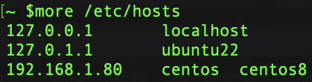
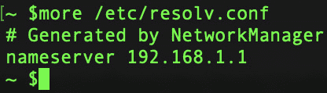
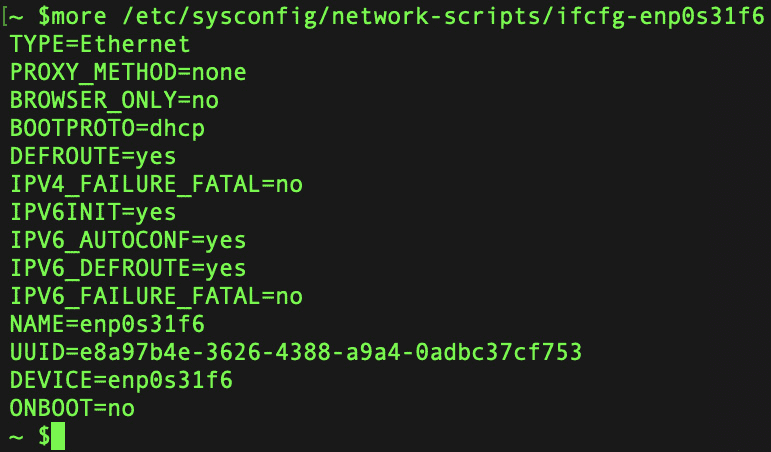
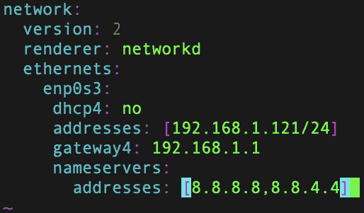
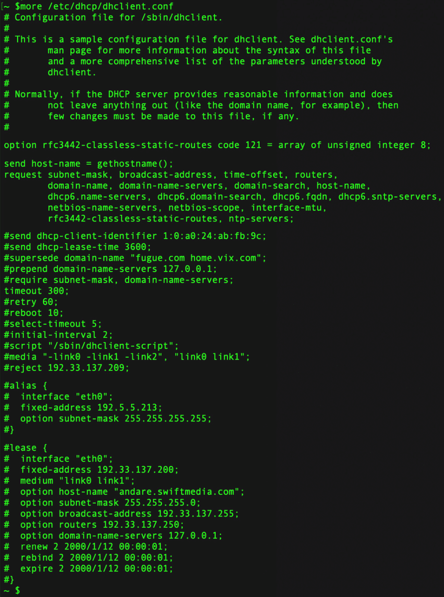

# 6

# 基本系统设置

Linux 是一个高度可定制的操作系统，它提供了大量的配置选项，允许用户根据其特定需求定制系统。在本章中，我们将探讨 Linux 中一些基本系统配置设置以及如何定制它们以改善系统性能、安全性和可用性。

在对配置文件进行任何更改之前，您应始终备份。在复制时，附加 `.bak` 扩展名以便知道这是一个备份副本。

在修改这些文件时，几乎可以肯定会出现错误。在进行任何更改之前，备份任何配置文件非常重要。

由于不可能涵盖 Linux 中的每个配置文件，我们将专注于最常见的配置而非：

+   `hosts` 配置文件

+   `resolv` 配置文件

+   `network-scripts` 配置文件

+   `dhclient` 配置文件

+   `sysctl` 配置文件

# 基本设置概述

Linux 具有各种基本设置，您可以配置以自定义系统的行为。这些设置通常位于配置文件中，它们可以影响操作系统的各个方面：

+   在大多数现代 Linux 发行版中，`timedatectl` 命令。此命令允许用户设置系统的时区，日期和时间。

+   `hostnamectl` 命令。此命令允许用户设置主机名，静态 IP 地址和域名。

+   `useradd` 和 `groupadd` 命令用于分别创建新用户和组。`usermod` 和 `groupmod` 命令用于修改现有用户和组。

+   `ifconfig` 命令可用于配置网络接口，而 `ip` 命令可用于管理 IP 地址、路由和网络设备。**NetworkManager** 服务是 Linux 中管理网络连接和设置的常用工具。

+   **系统安全配置**：Linux 以其强大的安全功能而闻名，许多系统配置设置都专注于增强系统安全性。一些关键的安全配置设置包括配置防火墙，管理用户权限，配置 **安全增强 Linux** (**SELinux**)，以及设置系统审计和监控。

+   `sysctl` 命令或通过修改 `/etc/sysctl.conf` 文件。

例如，要增加系统允许的最大打开文件数，可以设置 `fs.file-max` 参数：

```
# Increase the maximum number of open files
sysctl -w fs.file-max=100000
```

+   **CPU 缩放**：Linux 提供了控制 CPU 频率和节能功能的 CPU 缩放机制。调整 CPU 缩放可以帮助在功耗效率和性能之间取得平衡。

例如，要将 CPU 管理器设置为性能模式（始终最大频率），可以使用 `cpufreq-set` 命令（可能需要安装 `cpufrequtils`）：

```
cpufreq-set -r -g performance
```

+   **I/O 调度器**：Linux 内核提供了多种 I/O 调度器，每种调度器都针对特定的存储设备和访问模式设计。选择适合您存储的调度器可以提升 I/O 性能。

例如，要为特定的块设备（如 SSD）设置 I/O 调度器，可以使用以下命令：

```
echo "deadline" > /sys/block/sdX/queue/scheduler
```

+   **交换配置**：当物理内存（RAM）已满时，会使用交换空间。然而，过度交换可能会显著影响性能。调整交换行为（swapiness）可以控制内存交换的倾向。

例如，要减少交换空间的使用（减少交换的激烈程度），可以在 `/etc/sysctl.conf` 中设置一个较低的值（例如，`10`）：

```
vm.swappiness=10
```

+   **文件系统挂载选项**：文件系统的挂载选项会根据使用情况影响性能。有些选项可以优化读写操作或增强数据安全性。

作为示例，对于一个 SSD 挂载的文件系统，您可以设置 `noatime` 选项，以避免更新访问时间戳，从而提高读取性能：

```
UUID=YOUR_UUID /mnt/ssd ext4 defaults,noatime 0 2
```

+   **网络设置**：微调网络参数可以提升网络性能并减少延迟。

例如，要增加 TCP 缓冲区大小，可以在 `/etc/sysctl.conf` 中设置如下：

```
net.core.rmem_max = 16777216
net.core.wmem_max = 16777216
```

系统性能配置是一个迭代和适应的过程，需要深入了解系统的组件和工作负载。通过进行明智且有针对性的调整，系统管理员可以创建高效、稳定且响应迅速的系统，以满足用户和应用程序的需求。

注意

在进行更改之前，请记得备份配置文件，并在修改后彻底测试系统，以确保实现期望的性能提升。最佳设置可能会根据具体的硬件、工作负载和用户需求而有所不同。定期的监控和性能分析可以帮助您识别性能瓶颈，并进一步优化配置。

# hosts 配置文件

Linux `hosts` 文件是一个简单的文本文件，用于将主机名映射到 IP 地址。它位于 `/etc` 目录中。该文件包含 IP 地址及其对应的主机名。当用户尝试访问一个主机名时，系统会检查 `hosts` 文件，以确定与该主机名关联的 IP 地址。

`hosts` 文件首先用于进行映射。这在某些情况下很有用，比如需要将特定的主机名重定向到另一个 IP 地址，或者在网站上线之前进行测试。

`hosts` 文件由多个数据列组成，列与列之间由空格分隔。第一列包含 IP 地址，第二列包含主机名。可以使用额外的列来指定主机名的别名。例如，`hosts` 文件中的以下一行将 `192.168.1.80` 的 IP 地址映射到 `centos` 主机名，并将 `centos8` 设置为别名：



图 6.1 – hosts 文件的内容

例如，如果你想要通过 CentOS (`192.168.1.80`) 进行 SSH 连接，你无需记住 IP 地址，只需要知道你分配给该服务器的名称即可。

对于 `ping` 命令也是适用的。你只需记住名称，而不是 IP 地址。当使用 `ping` 时，这是一个示例：

```
ping centos8
```

你可以使用文本编辑器（如 nano 或 Vim）编辑 `hosts` 文件。需要注意的是，`hosts` 文件需要 root 权限才能编辑。因此，在编辑文件之前，你必须使用 `sudo` 命令或切换到 root 用户。

除了将主机名映射到 IP 地址外，`hosts` 文件还可以用于阻止访问特定网站。通过将主机名映射到回环地址（`127.0.0.1`），你可以有效地阻止访问该网站。例如，`hosts` 文件中的以下行将阻止访问 `example.com` 网站：

```
127.0.0.1 example.com
```

总结来说，Linux `hosts` 文件是一个简单而强大的工具，用于将主机名映射到 IP 地址并覆盖 DNS 解析过程。它可以用于将流量重定向到不同的 IP 地址、在网站上线之前进行测试以及阻止访问特定网站。了解如何使用 `hosts` 文件有助于你排查网络问题并提高系统的安全性。

# resolv 配置文件

`resolv.conf` 文件是 Linux 系统中一个重要的配置文件，用于配置 DNS 解析设置。DNS 负责将人类可读的域名（例如 `www.example.com`）转换为计算机能够理解的 IP 地址。这一转换对于访问网站、服务和其他网络资源至关重要。该文件位于 `/etc` 目录下，包含系统用来解析域名的 DNS 服务器信息。

`resolv.conf` 文件被各种网络程序使用，包括系统解析库、Web 浏览器和电子邮件客户端。当用户尝试访问一个网站或使用主机名连接到远程服务器时，系统会使用 `resolv.conf` 文件来查找相应的 IP 地址。

`resolv.conf` 文件由多个指令组成，这些指令定义了要使用的 DNS 服务器以及要附加到主机名的搜索域。以下是 `resolv.conf` 文件中最常用的指令：

+   `nameserver`：此指令指定用于名称解析的 DNS 服务器的 IP 地址。你可以在文件中指定多个 nameserver，系统将按列表中的顺序使用它们。例如，`resolv.conf` 文件中的以下行指定了 IP 地址为 `192.168.1.1` 的 DNS 服务器：



图 6.2 – resolv.conf 文件内容

+   `search`：该指令指定要附加到不完全限定的主机名的搜索域。例如，如果搜索域设置为 `example.com`，而用户尝试访问 `www` 主机名，则系统将尝试解析 `www.example.com`。你可以在文件中指定多个搜索域，系统将按列出的顺序使用它们。例如，`resolv.conf` 文件中的以下行指定了搜索域为 `example.com`：

    ```
    search example.com
    ```

+   `options`：该指令指定用于名称解析的附加选项，如超时和重试值。例如，`resolv.conf` 文件中的以下行指定了 `5` 秒的超时和 `2` 次重试：

    ```
    options timeout:5 retries:2
    ```

你可以使用文本编辑器（如 nano 或 Vim）编辑 `resolv.conf` 文件。编辑时需要 root 权限。需要注意的是，`resolv.conf` 文件可能会被各种工具自动生成，如 **动态主机配置协议**（**DHCP**）客户端或 NetworkManager 服务。因此，对该文件的任何更改可能会被这些工具覆盖。

总之，Linux 的 `resolv.conf` 文件是一个重要的配置文件，用于定义要使用的 DNS 服务器以及附加到主机名的搜索域。了解如何配置 `resolv.conf` 文件可以帮助你排查网络问题，并提高系统的性能和安全性。

# 网络脚本配置文件

在 Linux 中，`network-scripts` 用于配置网络接口。这些脚本位于 `/etc/sysconfig/network-scripts` 目录下，并定义每个接口的网络设置，如 IP 地址、网络掩码、网关和 DNS 服务器（网络文件配置路径特定于 CentOS）。

`network-scripts` 是用 Bash 编写的，并包含多个配置文件，每个文件对应一个特定的网络接口。最常用的配置文件是用于以太网接口的 `ifcfg-ethX` 和用于无线接口的 `ifcfg-wlanX`，其中 `X` 为接口编号。

`ifcfg-ethX` 配置文件包含以下参数：

+   `DEVICE`：该参数指定网络接口的名称，例如 `DEVICE=eth0`。

+   `BOOTPROTO`：该参数指定接口是否使用 DHCP 或静态 IP 地址。如果使用 DHCP，则该参数的值设置为 `dhcp`。如果使用静态 IP 地址，则该参数的值设置为 `static`。

+   `IPADDR`：该参数指定接口的 IP 地址。

+   `NETMASK`：该参数指定接口的网络掩码。

+   `GATEWAY`：该参数指定接口的默认网关。

+   `DNS1`、`DNS2` 和 `DNS3`：这些参数指定用于名称解析的 DNS 服务器的 IP 地址。

`ifcfg-wlanX` 配置文件包含类似的参数，但还包括一些额外的无线设置参数，如 ESSID 和加密方式。

你可以使用文本编辑器（如 nano 或 Vim）编辑`network-scripts`配置文件。需要注意的是，配置文件所做的更改不会生效，直到网络服务被重启。你可以通过运行`service network restart`或`systemctl restart network`命令来重启网络服务，具体取决于你使用的 Linux 发行版。

除了配置文件，`network-scripts`目录还包含在启动或停止网络服务时执行的脚本。这些脚本可用于执行额外的网络配置任务，例如设置虚拟接口或配置网络桥接。

总结来说，Linux 的`network-scripts`配置文件用于配置网络接口，并定义网络设置，如 IP 地址、子网掩码、网关和 DNS 服务器。了解如何配置这些文件可以帮助你排查网络问题，并提高系统的性能和安全性。

来自 CentOS 的`network-scripts`配置文件示例如下，该文件是自动生成的：



图 6.3 – 网络配置文件

如你所见，DHCP 已启用，并且没有静态预留，网络卡的名称是`enp0s31f6`。

如果我们想进行静态 IP 预留，应该像这样使用：

```
HWADDR=$SOMETHING
TYPE=Ethernet
BOOTPROTO=none // turns off DHCP
IPADDR=192.168.1.121 // set your IP
PREFIX=24 // subnet mask
GATEWAY=192.168.1.1
DNS1=1.1.1.2 // set your own DNS
DNS2=8.8.8.8
DNS3=8.8.4.4
DEFROUTE=yes
IPV4_FAILURE_FATAL=no
NAME=enp0s31f6
DEVICE=enp0s31f6
ONBOOT=yes // starts on boot
```

在 Ubuntu 17 中，网络配置通过 Netplan 完成，这是一个基于 YAML 的框架。你可以在这里进行所有的 DNS、网关、子网掩码和 IP 配置。

`/etc/netplan`是网络配置文件所在的位置。

使用 Netplan 配置网络接口的示例配置文件如下所示：



图 6.4 – Ubuntu Netplan 配置文件

要使更改生效，请使用`netplan` `apply`命令重启网络。

# dhclient 配置文件

Linux 中的`dhclient`配置文件位于`/etc/dhcp/dhclient.conf`。该文件由`dhclient`程序用于配置 Linux 系统上的 DHCP 客户端设置。

`dhclient.conf`文件包含各种配置选项，控制 DHCP 客户端与 DHCP 服务器的交互。以下是`dhclient.conf`文件中可以设置的一些常见配置选项：

+   `dhclient.conf`文件允许你为各种 DHCP 请求设置超时值。你可以为`DHCPDISCOVER`、`DHCPREQUEST`和`DHCPACK`消息设置超时值。

+   **租约时间**：你可以设置 DHCP 客户端可以使用分配的 IP 地址的时间长度。

+   `dhclient.conf`文件允许你指定 DHCP 客户端应该使用的 DNS 服务器。

+   **主机名**：你可以设置 DHCP 客户端在请求 IP 地址时使用的主机名。

+   **客户端标识符**：你可以指定 DHCP 客户端在与 DHCP 服务器通信时使用的客户端标识符。

+   `dhclient.conf` 文件还允许你设置特定厂商的选项，用于配置各种网络设置。

需要注意的是，`dhclient.conf` 文件的语法可能会有所不同，这取决于所使用的 dhclient 版本。最好查阅你所使用的 `dhclient` 版本的文档，以确保使用正确的语法。

以下是 Ubuntu 中默认的 `dhclient.conf` 文件的样子：



图 6.5 – DHCP 配置文件

总结来说，`dhclient.conf` 配置文件在管理系统的 DHCP 客户端行为中起着至关重要的作用。通过自定义 `dhclient.conf` 文件，管理员可以微调各种设置和选项，确保最佳的网络连接性和地址分配。

正确配置 `dhclient.conf` 可以显著提高网络的稳定性、安全性和性能。例如，管理员可以优先选择某些 DNS 服务器以加快解析速度，强制设置特定的租期以高效管理 IP 地址分配，并在主 DHCP 服务器不可用时设置备用机制。

# sysctl 配置文件

Linux `sysctl` 配置文件位于 `/etc/sysctl.conf`。该文件用于在运行时配置内核参数。`sysctl.conf` 文件包含一组表示各种内核参数的键值对。

`sysctl.conf` 文件分为多个部分，每个部分包含一组键值对，代表特定的内核参数组。每个键值对由内核参数的名称及其值组成。该值可以是数字值或字符串。

以下是一些可以使用 `sysctl.conf` 文件配置的内核参数示例：

+   `net.ipv4.ip_forward`：该参数启用或禁用 IP 转发。值为 `1` 时启用 IP 转发，值为 `0` 时禁用它。

+   `net.ipv4.tcp_syncookies`：该参数启用或禁用 TCP SYN Cookies。值为 `1` 时启用 TCP SYN Cookies，值为 `0` 时禁用它们。

+   `kernel.core_pattern`：该参数指定用于命名 core dump 文件的模式。默认模式为 `core`，但你可以指定不同的模式。

+   `kernel.shmmax`：该参数指定共享内存段的最大大小（以字节为单位）。

+   `vm.swappiness`：该参数控制内核交换未使用的内存页到磁盘的程度。较高的值意味着内核会更积极地交换内存页，而较低的值则意味着内核交换内存页的行为会更为保守。

要应用对 `sysctl.conf` 文件所做的更改，您可以使用带有 `-p` 选项的 `sysctl` 命令，这将从文件中加载设置到内核中。需要注意的是，有些内核参数只能在启动时设置，不能通过 `sysctl.conf` 文件在运行时更改。

根据您的系统和内核，`sysctl.conf` 文件可能被称为或位于以下位置：

+   `/etc/sysctl.d/*.conf`

+   `/run/sysctl.d/*.conf`

+   `/usr/local/lib/sysctl.d/*.conf`

+   `/usr/lib/sysctl.d/*.conf`

+   `/lib/sysctl.d/*.conf`

+   `/etc/sysctl.conf`

Linux 通常会按照这个顺序读取这些文件。在其他文件夹中具有相同名称的剩余文件在它第一次发现具有有效条目的真实文件时将被忽略。

如果你不知道自己在做什么，那么玩弄 `etc/sysctl.conf` 文件可能会造成严重后果。您可以通过运行 `sysctl --system` 命令观察操作系统尝试加载的命令和文件以及它们的顺序。但请谨慎使用这个命令。这个命令会在您的操作系统上进行实际加载和操作，因为它不是一个干运行的命令，如果您不确定它是否应该执行操作，您将面临误配置设置的风险。

# 摘要

总之，Linux 提供了大量的配置设置，可以用来定制系统以满足特定的需求。了解如何配置基本的系统设置，比如系统时间、主机名、用户和组设置、网络设置、安全设置和性能设置，可以帮助提高系统的性能、安全性和可用性。通过定制这些设置，用户可以创建一个符合其特定要求并提高其生产力的 Linux 系统。

在下一章节中，我们将讨论用户和组管理。
