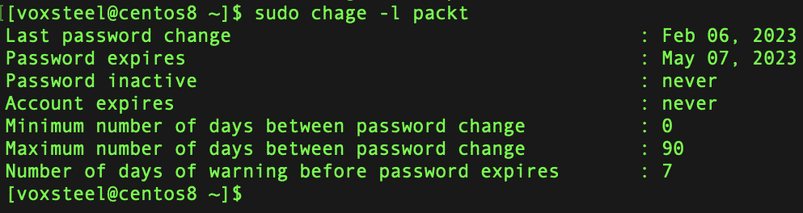
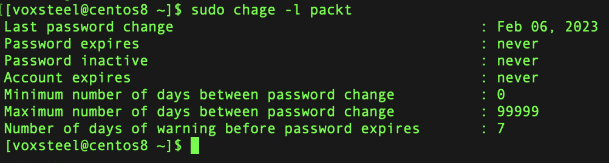
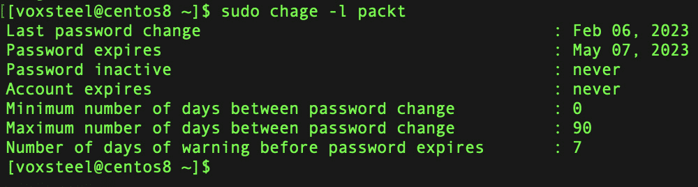
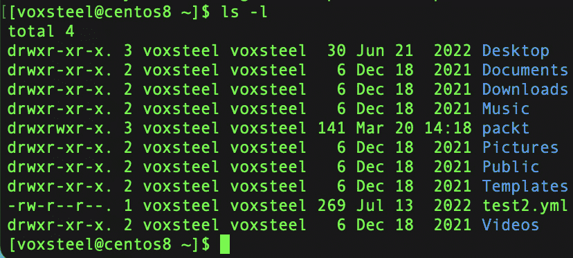
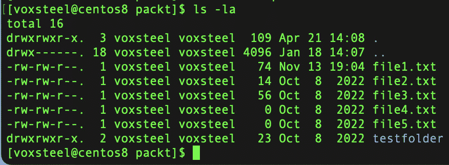

# 第七章：用户和组管理

如果你管理 Linux 服务器，那么这些服务器的用户既可能是你最大的资产，也可能是你最大的头痛。你将在职业生涯中负责添加大量新用户、管理他们的密码、在他们离开组织时删除他们的账户，以及在网络上提供和撤销对资源的访问权限。即使是在你是唯一用户的服务器上，你仍然需要管理用户账户。因为即使是系统进程，也是在用户身份下运行的。如果你想高效管理 Linux 服务器，你还需要了解如何管理权限、实施密码策略，并限制能够执行管理员命令的人员数量。在本章中，我们将详细讲解这些内容，以帮助你扎实掌握如何管理用户及其消耗的资源。

在本章中，我们将学习如何执行以下操作：

+   创建用户和组

+   修改用户和组

+   删除用户和组

+   列出所有用户

+   将用户添加到一个组

+   将用户从一个组中移除

# 账户/组管理概述

作为一个多用户操作系统，Linux 允许多个用户同时在一台机器上登录和工作。请注意，绝不应让用户共享同一账户的登录信息。最好为需要访问机器的每个用户创建独立账户。

访问特定的系统资源，如目录和文件，可能需要由两个或更多用户共享。我们可以通过 Linux 的用户和组管理功能来实现这两个目标。

普通用户和根用户（超级用户）是 Linux 系统中的两类用户。

Linux 操作系统的一个基本组件是用户和组账户的管理。用户和组账户的自定义权限是通过每个用户使用不同的凭证登录操作系统来维护的。添加新用户需要特定的权限（超级用户权限）；其他用户或组管理操作，如账户删除、账户更新以及组的添加和删除，也需要相同的权限。

这些操作通过以下命令来执行：

+   `adduser`: 向系统添加一个用户

+   `userdel`: 删除一个用户账户及相关文件

+   `addgroup`: 向系统添加一个组

+   `delgroup`: 从系统中删除一个组

+   `usermod`: 修改用户账户

+   `chage`: 此命令用于更改密码过期时间并查看用户密码过期信息

+   `passwd`: 此命令用于创建或更改用户账户的密码

+   `sudo`: 以其他用户身份运行一个或多个命令（通常通过运行 `sudo su <用户名>` 命令来获得超级用户权限）

与这些操作相关的文件包括`/etc/passwd`（用户信息）、`/etc/shadow`（加密密码）、`/etc/group`（组信息）和`/etc/sudoers`（`sudo`配置）。

超级用户访问可以通过使用`su`命令切换为 root 用户，或者使用`sudo su`命令获取 root 权限来实现。

这些是用户账户信息的默认位置：

+   用户账户属性：`/etc/passwd`

+   用户密码属性：`/etc/shadow`

创建用户时，会同时创建一个具有相同用户名的组。每个用户都有一个主目录；对于 root 用户，它位于`/root`；对于其他所有用户，它位于`/home/`。

`/etc/passwd`文件包含所有账户的详细信息。该文件具有以下结构，并为每个系统用户账户包含一个记录（字段由冒号分隔）：

```
<username>:<x>:<UID>:<GID>:<Comment>:<Home directory>:<Default shell>
```

让我们仔细查看前面的代码：

+   `<username>`和`<Comment>`字段是不言自明的

+   `x`出现在第二个字段，表示在`/etc/shadow`中的加密密码，这是登录`<username>`所必需的

+   `<UID>`和`<GID>`条目包含整数，分别反映`<usernameprimary>`组 ID 和用户 ID

+   `<Home directory>` 显示当前用户的主目录的完整路径

+   当用户登录系统时，`<Default shell>`是分配给他们的 shell

现在我们已经概述了用于管理账户/组的命令，让我们开始操作它们。

# 如何添加一个新账户

有两个命令，`adduser`和`useradd`，可以在 Linux 中用来创建新用户。这两个命令实现相同的功能（虽然方式不同），并且它们的名称非常相似，刚开始可能会让人感到困惑。我将首先介绍`useradd`命令，然后再说明`adduser`是如何不同的。你可能更喜欢后者，但我们稍后会讨论这个问题。

## 使用 useradd

如果你没有 root 权限，则需要`sudo`权限才能添加账户。这必须在`/etc/sudoers`中定义。

首先，这是一个可以使用的`useradd`命令的示例：

```
sudo  useradd -d /home/packt -m packt
```

我通过使用此命令设置了一个名为`packt`的新用户。我确认希望为该用户创建主目录，通过使用`-d`选项，并在接下来的命令中指定`/home/packt`作为用户的主目录。如果我没有使用`-m`参数，系统将不知道在过程中我希望创建主目录；那时，我就必须手动创建目录。最后，我宣布了我将用于新用户的用户名（在这种情况下是`packt`）。随着我们继续阅读本书，我们会遇到一些需要根权限才能执行的命令。前面的命令就是一个例子。我将为需要特定权限的命令加上`sudo`前缀，因为这是执行该命令的标准方式。当你看到这个前缀时，它意味着该命令只能通过根用户权限执行。你也可以通过以 root 身份登录（如果启用了 root 访问）或切换到 root 模式来执行这些命令。这两种方式都可以。然而，强烈建议你不要使用 root 账户登录，而是使用`sudo`。我之前已经解释过了。

以下命令可以用来为新创建的`packt`账户设置密码：

```
~ $sudo passwd packt
Changing password for user packt.
New password:
Retype new password:
passwd: all authentication tokens updated successfully.
```

另一个命令是`adduser`，它会自动为你创建一切，包括主目录和组，并会要求你设置密码。

## 使用 adduser

`adduser`命令是建立用户账户的另一种选择，正如前面提到的那样。当你第一次使用此命令时，它带来的不同之处（以及提供的便利性）应该会立即显现。执行`adduser`命令，并提供你要创建的新用户的用户名。试试看吧：

```
~ $sudo adduser packt2
Adding user `packt2' ...
Adding new group `packt2' (1004) ...
Adding new user `packt2' (1003) with group `packt2' ...
The home directory `/home/packt2' already exists.  Not copying from `/etc/skel'.
New password:
Retype new password:
passwd: password updated successfully
Changing the user information for packt2
Enter the new value, or press ENTER for the default
        Full Name []:
        Room Number []:
        Work Phone []:
        Home Phone []:
        Other []:
Is the information correct? [Y/n]
```

从结果来看，`adduser`命令为我们做了大量工作。该命令将文件从`/etc/skel`复制到新用户的主目录，并默认将用户的主目录设置为`/home/packt2`。用户账户也被分配了下一个可用的`1004`。事实上，`adduser`和`useradd`命令都从`/etc/skel`目录复制文件；然而，`adduser`命令在执行的任务上更加详细。

# 如何删除一个账户

当用户不再需要访问系统时，删除或禁用他们的账户是非常必要的，因为未管理的账户往往会成为安全隐患。这可以通过登录到系统的管理面板并选择`userdel`命令来删除用户账户。然而，在删除账户之前，有一个关键问题你应该自己问自己。你（或其他人）是否预计在某种程度上需要访问该用户的文件？绝大多数公司都有数据保存政策，规定了用户离职时如何处理其数据。这些文件有时会被复制并保存到档案中以供长期保存。经理、同事或新员工常常需要访问前用户的文件，可能是为了继续前用户在某个项目中的工作。开始管理用户之前，了解这项政策非常重要。如果你还没有一个明确描述用户离职时文件保留要求的政策，强烈建议你与管理团队合作制定这样的政策。使用`userdel`命令时，用户的主目录内容不会被删除，因为这种行为不是默认的。在这一节中，我们将通过执行以下命令将`packt2`从系统中删除：

```
sudo userdel packt2
```

在这种情况下，`packt2`用户的主文件夹将保留。

如果我们希望一次性删除该账户的主文件夹，我们需要使用`–r`参数：

```
sudo userdel –r packt2
```

在删除用户账户之前，请记得检查其主文件夹中的文件是否需要。删除后，如果没有备份，这些文件将无法恢复：

```
su - packt2
su: user packt2 does not exist
```

总之，在 Linux 中删除用户账户涉及备份数据、终止进程、将用户从组中移除、删除主目录、更新系统文件，并进行最终清理。通过遵循这些步骤，你可以在有效管理相关文件和权限的同时，安全地删除一个账户。

# 理解/etc/sudoers 文件

在这一节中，我们将看看如何使用之前创建的普通用户账户来进行用户管理操作。

我们必须在`/etc/sudoers`中为`packt`做一个特殊的权限条目，以便赋予它特殊的访问权限：

```
packt ALL=(ALL) ALL
```

让我们分析这一行的语法：

+   首先，我们声明该规则适用于哪个用户（`packt`）。

+   如果第一个`ALL`存在，那么所有使用相同`/etc/sudoers`文件的主机都将受到此规则的约束。由于不同机器之间不再共享同一文件，因此此术语现在指代当前主机。

+   接下来，`(ALL) ALL`告知我们，任何用户都可以作为`packt`用户执行任何命令。从功能上讲，这与`(root) ALL`类似。

使用组来管理权限非常重要，因为这样会使工作变得更加轻松。想象一下，如果你只需将一个用户从`sudo`组中移除，而不是从 100 个不同的位置逐一删除该用户，那该有多简单。

# 切换用户

我们现在已经准备好开始使用`packt`帐户执行用户管理任务。要执行此操作，请使用`su`命令切换到该帐户。值得注意的是，如果你使用的是 CentOS 或类似的操作系统，今后你无需再使用 root 帐户：

```
su -l packt
```

我们可以通过使用`sudo`命令检查我们新创建的`packt`帐户的权限。我们来创建另一个名为`packtdemo`的帐户，好吗？

```
~ $sudo adduser packtdemo
Adding user `packtdemo' ...
Adding new group `packtdemo' (1005) ...
Adding new user `packtdemo' (1004) with group `packtdemo' ...
The home directory `/home/packtdemo' already exists.  Not copying from `/etc/skel'.
New password:
Retype new password:
passwd: password updated successfully
Changing the user information for packtdemo
Enter the new value, or press ENTER for the default
Full Name []:
Room Number []:
Work Phone []:
Home Phone []:
Other []:
Is the information correct? [Y/n]
```

对用户的主文件夹、默认 shell 以及为用户帐户添加描述的更改都可以通过`usermod`命令来完成。

最初，`/etc/passwd`文件看起来是这样的：

```
~ $grep packtdemo /etc/passwd
packtdemo:x:1004:1005:,,,:/home/packtdemo:/bin/bash
```

让我们尝试添加描述并更改 shell：

```
~ $sudo usermod --comment "Demo account for packt" --shell /bin/sh packtdemo
~ $grep packtdemo /etc/passwd
packtdemo:x:1004:1005:Demo account for packt:/home/packtdemo:/bin/sh
```

在与支持人员合作时，切换到另一个用户帐户通常非常有益（尤其是在排除权限问题时）。举个例子，假设有用户向你抱怨他们无法访问特定目录中的文件，或者无法执行某个命令。在这种情况下，你可以尝试通过登录到服务器，切换到遇到问题的用户帐户，然后尝试访问相关文件来复制这个问题。通过这种方式，你不仅可以亲自查看他们的问题，还能在向他们反馈之前测试你的解决方案是否解决了他们的问题。

你可以通过运行`sudo su`或`su –`命令切换到 root 用户，或者直接使用`su`命令。

仅使用`su`命令可以切换到另一个用户，同时保持当前环境，而`su –`则模拟目标用户的完整登录环境，包括设置他们的主目录、环境变量，并启动一个新的登录 shell。选择这两个命令之一取决于你作为被切换用户需要完成的具体要求或任务。

# 管理帐户密码

如果你记得的话，`passwd`命令可以让我们更改当前登录系统的用户密码。此外，我们还可以通过在以 root 身份登录的情况下运行`passwd`命令并提供用户名来更改任何用户帐户的密码。不过，这只是该命令的功能之一。

## 锁定/解锁用户帐户

锁定和解锁用户帐户是`passwd`命令的一项功能，我们尚未讨论过。你可以使用这个命令来执行这两项操作。有很多不同的使用场景需要实现类似的功能。例如，如果某人将长期外出，你可能想锁定他们的帐户，以便在这段时间内其他用户无法访问。

当您想要锁定帐户时，使用`-l`选项。例如，要锁定`packt`用户的帐户，我们使用以下命令：

```
sudo passwd -l packt
```

按照以下方式解锁：

```
sudo passwd –u packt
```

## 设置密码过期

接下来，我们将讨论如何实际执行设置密码过期的步骤。

更具体地说，`chage`命令使我们能够做到这一点。我们可以使用`chage`来更改用户密码的有效期限，它还提供了一种比直接读取`/etc/shadow`文件查看当前密码过期信息更为用户友好的替代方法。通过给定用户名并使用`chage`命令的`-l`选项，我们可以查看相关信息：

```
sudo chage -l packt
```

并不需要以`root`身份或使用`sudo`命令运行`chage`。查看自己登录的密码过期信息不需要提升权限。但是，如果要访问除自己之外的任何用户帐户的信息，则需要使用`sudo`：

```
~ $sudo chage -l packt
```



图 7.1 – 显示用户帐户的密码相关信息和过期策略

在输出中，我们能够查看诸如密码过期日期、在密码必须更改之前可以经过的最大天数等值。基本上，这与保存在`/etc/shadow`中的信息相同，但它以更易于理解的格式呈现。如果您想修改这些信息，`chage`工具仍然是您的最佳选择。我给出的第一个示例是一个相当典型的例子。您应该绝对要求新用户在创建用户帐户后第一次登录时重置密码。不幸的是，并非每个人都愿意做必要的操作。通过使用`chage`命令，您可以要求用户在第一次成功登录系统时更改密码。这是通过将他们的密码过期前天数更改为`0`来实现的，具体操作如下：

```
sudo chage –d 0 packt
```

与之前的输出结果相比，结果如下所示：

```
~ $sudo chage -l packt
```



图 7.2 – 显示用户帐户的密码相关信息和过期策略

以下指令允许您配置用户帐户，以便在经过特定天数后要求更换密码：

```
sudo chage -M 90 <username>
```

在上述代码中，我正在将用户帐户配置为在 90 天后失效，并要求在此时更换密码。当用户登录时，他们将在密码必须更改前的七天内收到警告通知。这是密码过期前七天会出现的消息：



图 7.3 – 显示用户账户的密码相关信息和过期策略

出于安全原因，设置密码过期策略是一个好习惯。

# 组管理

现在我们已经了解如何创建新的用户账户，管理现有的用户账户，并在用户账户之间切换，接下来我们需要学习如何管理组。Linux 对组的实现与其他操作系统并没有太大不同，本质上执行着相同的功能。借助组来控制用户对服务器资源的访问会更加高效。你可以通过简单地将用户添加到某个资源（如文件或目录）所分配的组中，或者将其从该组中移除，从而授予或拒绝用户访问权限。通过将组分配给特定资源，便能实现这一目标。在 Linux 中，文件和目录都拥有一个用户和一个组来声明其所有权。使用 Linux 时，所有权是以一对一的方式分配的，意味着每个文件或目录只与一个用户和一个组相关联。你可以在 Linux 系统上通过列出某个目录中的项目来验证这一点，如下所示：

```
ls –l
```



图 7.4 – 列出文件夹的内容

如果你有兴趣了解当前在服务器上活跃的组，你只需要使用`cat`命令来读取`/etc/group`文件的内容。`/etc/group`文件与我们之前讲解过的`/etc/passwd`文件类似，存储了有关系统中已创建组的信息。你可以随时查看这个文件，文件路径为：

要创建一个组，使用`sudo addgroup <``groupname>`命令：

```
sudo addgroup packtgroup
Adding group `packtgroup' (GID 1006) ...
Done.
```

要查看文件内容，可以运行以下命令：

```
cat /etc/group
packtgroup:x:1006:
packt:x:1007:
packtdemo:x:1005:
packt2:x:1004:
```

每一行的结构如下：

```
<Group name>:<Group password>:<GID>:<Group members>
```

查看上面的语法，我们可以看到以下内容：

+   该组的名称是`<``Group name>`

+   如果`<``Group password>`旁边有一个`x`，则表示该组密码未使用

+   `<Group members>`是一个由逗号分隔的列表，列出了`<``Group name>`组的成员用户

使用`sudo delgroup <groupname>`命令来删除一个组。

每一行`/etc/group`文件中包含组信息，包含组名和与其相关联的用户账户：

```
packt:x:1007:
packtdemo:x:1005:
packt2:x:1004:
```

接下来，我们将查看`usermod`命令，它实际上允许你将用户与组关联，并且是我们下一个议题。`usermod`命令有多种用途，适用范围广泛（将用户添加到组只是其中的一种功能）。如果我们想将一个用户（`packt`）添加到我们的`packtgroup`组中，我们可以执行以下命令：

```
sudo usermod –aG packtgroup packt
```

`-aG` 选项用于将用户添加到特定的组中。`-a` 标志表示 *追加*，意味着用户将被添加到该组，而不会将其从其他已加入的组中移除。`G` 标志指定组名。

如果你想修改用户所属的主组，可以使用 `-g` 选项（注意这里使用小写字母 `g` 而不是大写字母 `G`，正如我们之前所做的）：

```
sudo usermod –g <groupname> <username>
```

组是管理安全权限的最简单方式。想象一下，将一个用户从一个分配给 100 个资源的组中移除，而不是删除该用户 100 次。

# 权限

在 Linux 中，每个文件、目录和其他系统对象都有一个指定的所有者和组。这是系统安全性中最基本的方面，旨在防止用户之间的相互干扰。可以向所有者、组成员和其他用户授予不同的读取、写入或执行文件的权限。在 Linux 中，这通常被称为文件权限。

以下命令用于管理所有权和设置权限：

+   使用 `chmod` 更改文件权限

+   使用 `chown` 更改文件所有者

+   使用 `chgrp` 更改组所有权

+   使用 `id` 打印用户和组 ID

通常，创建文件的用户是其所有者，且与该所有者关联的组是其主组（至少在最初是这样）。让我们在 `/tmp` 目录下创建一个 `testfile` 文件作为示例：

```
$echo "This is a test file" >  testfile
$ls -l testfile
-rw-rw-r-- 1 packt packt 20 Feb  6 16:37 testfile
```

输出的第一个字符显示 `testfile` 是一个普通文件（即不是目录或其他类型的系统对象）。接下来的九个字符（分为三组，每组三个字符）显示系统所有者、组所有者和其他用户的读（`r`）、写（`w`）和执行（`x`）权限。

输出的前三个字符（`rw-`）表示文件所有者（用户 `packt`）可以读写该文件。接下来的三个字符表示组所有者的权限。最后一组字符（`r—`）意味着其他用户只能读取该文件；他们不能写入或执行该文件。

我们将使用 `chmod` 来修改文件的权限。符号表示法指示新的权限将应用于谁，必须在此命令后给出：

+   `u` 代表用户

+   `g` 代表组

+   `o` 代表所有其他用户

+   `a` 代表所有用户

权限类型如下：

+   `+r` 添加读权限

+   `-r` 移除读权限

+   `+w` 添加写权限

+   `-w` 移除写权限

+   `+x` 添加执行权限

+   `-x` 移除执行权限

+   `+rw` 添加读写权限

+   `+rwx` 添加读、写和执行权限

所有这些权限可以通过数字表示，如下所示：

读 – `4` ：写 – `2` ：执行 – `1`

例如，`chmod 754 testfile` 将会为 `testfile` 设置 `rwx` 权限给所有者，`rx` 给组，只有 `r` 给其他用户：

```
ls -la testfile
-rwxr-xr--  1 voxsteel voxsteel  0 26 Jun 14:27 testfile
```

总结一下，授予正确的权限对于安全至关重要，并且可以避免造成任何不必要的损害。以下是查看权限的示例：



图 7.5 – 列出文件夹的内容及其权限

总结一下，授予正确的权限对于安全至关重要，以防止系统上的任何不必要的活动。

# 更改组

现在讨论`chgrp`命令，将`packtgroup`设为`testfile`的新所有者。命令执行后，我们指定组名和需要更改所有权的文件名（在这种情况下是`testfile`）：

```
sudo chgrp packtgroup testfile
```

现在让我们检查用户`packtdemo`写入该文件的能力。应该会出现权限拒绝错误。我们可以为组设置相关权限，允许`packtdemo`写入该文件：

```
sudo chmod g+w testfile
```

然后再次使用`usermod`命令将账户添加到`packtgroup`，这次使用`-aG`组合选项，如下所示：

```
sudo usermod -aG packtgroup packtdemo
```

*附加到组*的缩写是`-aG`。

目前，`packtgroup`被视为用户`packtdemo`的附属组或辅助组。当`packtdemo`下次登录时，更新后的访问权限将生效。

我们可以使用`chown`，后面跟着用户名和文件名，按此顺序操作，将`packtdemo`设为`testfile`的所有者，而不仅仅是将用户添加到`packtgroup`组：

```
sudo chown packtdemo testfile
```

请记住，前面提到的命令将阻止`packt`用户访问`testfile`，因为该账户不再是文件的所有者，也不是`packtgroup`组的成员。

除了典型的`rwx`文件权限外，`setuid`、`setgid`和粘性位是三个额外的权限，值得关注。让我们逐一查看它们。

任何用户如果在文件上设置了`setuid`位，就可以使用文件所有者的权限运行该可执行文件。

任何用户如果在文件上设置了`setgid`位，就可以使用该组的权限运行该可执行文件。

当这些特定权限被误用时，会带来安全风险。例如，如果任何用户被允许以超级用户权限运行命令，那么该用户就能够访问属于 root 及其他用户的文件。很容易理解，这可能会迅速对系统造成破坏：关键文件可能被删除，某些目录可能被完全清除，甚至硬件可能会出现异常。所有这些都可能是由一个恶意或粗心的人引起的。因此，`setuid`和`setgid`位必须非常小心地使用。

在`/usr/bin/passwd`中，`setuid`位是必需的，并且是一个可接受的用例。虽然 root 拥有这个文件，但任何用户都可以使用它来更改自己的密码（但不能更改其他用户的密码）。

当在目录上设置粘滞位时，除非是文件的所有者、目录的所有者或 root 用户，否则任何人都不能删除该目录中的文件。这通常用于防止用户删除共享目录中其他用户的文件。

`testfile`的`setuid`位设置如下：

```
sudo chmod u+s testfile
```

`testfile`的`setgid`位设置如下：

```
sudo chmod g+s testfile
```

要创建一个名为`packtdir`的目录并设置粘滞位，可以使用以下命令：

```
sudo mkdir packtdir
sudo chmod +t packtdir
```

回到`/etc/sudoers`，我们还可以通过使用`/etc/sudoers`文件授予某个组中的每个用户超级用户权限。例如，以下命令指定属于`packtgroup`的用户被允许运行`updatedb`（更具体地说，是`/usr/bin/updatedb`）：

```
/usr/bin/updatedb %packtgroup ALL=(ALL)
```

组名必须以`%`符号为前缀，这是组成员和单个用户之间唯一的区别。在这种情况下，命令别名也是适用的。

在命令行中简单地输入`sudo -l`并按*Enter*键，可以显示调用用户在`/etc/sudoers`中被允许的命令。

使用组可以节省大量时间。想象一下，给一个组分配运行某些命令的权限，而不是一个一个地分配给 100 个用户。

# 总结

在与 Linux 管理相关的领域，如系统管理和网络安全中，管理用户和权限是你经常需要做的事情。随着新用户加入组织，旧用户离开，这将成为你思维工具箱中的一部分。然而，即使你是唯一使用服务器的人，你仍然需要管理权限。这是因为如果进程被拒绝访问它们执行任务所需的资源，它们将无法正常运行。

在本章中，我们深入探讨了管理用户、组和权限的过程，并覆盖了许多内容。我们详细讲解了创建新用户、删除现有用户、分配权限以及使用`sudo`命令管理管理员访问权限的过程。将这些概念应用到你自己的服务器上。

在下一章中，我们将讨论软件安装和软件包仓库。
