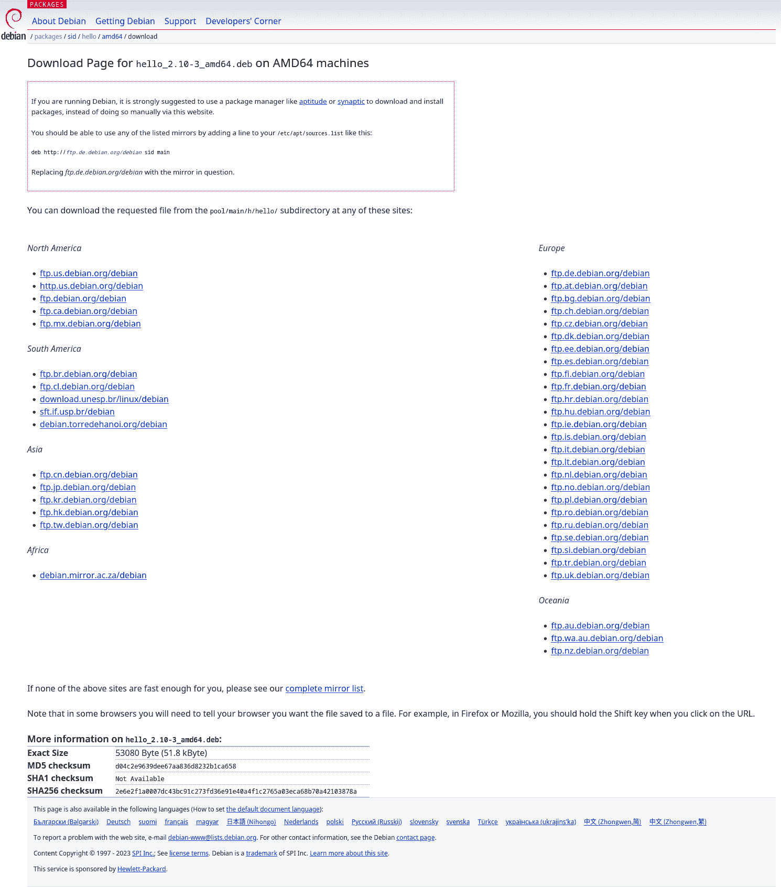

# 8

# 软件安装与软件包仓库

大多数 Linux 发行版默认只安装最基本的系统软件，并假设用户会稍后安装额外的软件。如今，在 Linux 上安装软件非常简单，得益于软件包仓库和高级软件包管理工具，这些工具可以通过网络搜索、下载和安装软件包。然而，了解软件包文件的内部组织结构以及软件包管理器的工作原理非常重要，因为这有助于管理员检查软件包、诊断问题，并在发生安装问题时进行修复。

本章将涵盖以下主题：

+   软件安装、软件包和依赖关系

+   软件包文件

+   软件包仓库和高级软件包管理工具

+   系统升级

# 软件安装、软件包和依赖关系

软件包的定义相当广泛。在计算机早期，计算机专门用于解决数学问题，大多数程序都是从头编写的，并且仅在特定计算机上运行，因此没有安装的需求，也就没有软件包的概念。在那之后的很长一段时间里，软件仍然与可执行文件同义。安装由单个可执行文件组成的软件产品非常简单——只需将其复制到目标计算机上。

这种软件今天仍然存在。例如，**jq**（一个用于从 JSON 文件中提取数据的流行工具）的维护者提供了独立的、静态链接的可执行文件，将程序和它所需的所有库合并成一个单一文件，可以在任何 Linux 系统上运行，因此任何用户都可以从其网站 ([`stedolan.github.io/jq/download/`](https://stedolan.github.io/jq/download/)) 下载并开始使用。

然而，许多软件项目由多个可执行文件组成，并且通常还需要数据文件。例如，一个拼写检查程序，如**Aspell**，需要字典文件才能工作。在视频游戏中，可执行文件通常只是一个很小的部分，相比于游戏资产（如模型、纹理和声音文件）来说，它往往是最小的。为了使软件产品按预期工作，所有这些文件需要作为软件包一起分发和安装。

在早期的操作系统中，安装通常只是将软件产品的所有文件复制到一个目录中。这也是许多 Linux 系统中仍然存在的 `/opt` 目录的目的。为了安装一个假设的软件包 Foo 1.0，管理员可能会将其发布包（例如 `foo_1.0.tar.gz`）解压到 `/opt/foo/` 目录（通常使用 `tar --xf foo_1.0.tar.gz --directory /opt/foo/`），并且 `/opt/foo` 目录中的结构将完全由 Foo 的应用开发人员定义，而不是由操作系统本身定义。

在现代操作系统中，仅仅复制文件通常是不够的，因为它不能将新安装的软件正确地集成到操作系统中。即使是提供单一控制台命令的软件包，也需要将其放置在一个已经在`$PATH`中的目录下，或者相应地修改`$PATH`环境变量。带有图形用户界面的软件还需要正确地将自己注册到桌面环境的应用菜单中，并可以选择性地创建桌面图标。

因此，操作系统开始要求软件包具有特定的结构。在 Microsoft Windows 和许多其他系统中，软件包通常仍然作为定制的可执行程序提供，这些程序会解压并复制文件，还会执行脚本将软件包注册到操作系统中。Linux 软件的开发者有时也会采用这种方法，并且有一些用于创建可执行安装程序的框架，例如**makeself** ([`makeself.io/`](https://makeself.io/))。

这种方法使软件包作者可以完全控制安装过程，但也有许多缺点。首先，通过这种方式安装的软件卸载并不总是可靠的。如果安装程序的开发者没有小心清理所有在安装时创建的文件，用户可能会留下需要手动删除的残余文件。

第二，每个软件包需要实现自己的更新检查和安装机制。在宽带互联网普及之前，软件更新通常通过软盘或 CD 等物理介质分发，这并不是一个大问题；但如今，大多数用户都有常规的互联网接入，他们能够受益于在线更新，许多软件产品，如网页浏览器，必须保持最新，以防止安全威胁。

第三，很少有程序是从零开始编写的，大多数程序都会大量使用第三方库，因此它们有依赖关系。确保库代码可供程序调用的一种方法是将其作为可执行文件的一部分。这种方法称为静态链接。它的优点是不会出现错误安装此类可执行文件的情况，但缺点是会大大增加内存和磁盘空间的消耗。由于这个原因，大多数程序都是与外部库文件动态链接的，但为了使它们正常工作，程序需要确保系统中存在所有所需库的正确版本的文件。如果每个软件包都是独立的并且负责自己的安装，那么唯一的方法就是将所有库文件与软件包捆绑在一起（在磁盘空间使用方面，这比静态链接仅略有改善），或者要求用户手动查找并安装所有库文件（这对用户来说非常不方便）。

对于不可重新分发且通常没有源代码形式的专有软件，通常唯一的选择是将所有依赖项捆绑在一起，因为可执行文件需要针对不同的库版本重新编译。不同的 Linux 发行版可能由于不同的发布周期和软件包含策略而包括不同版本的库（一些发行版专注于稳定性，只会包含较旧但经过验证的版本，而其他发行版则可能选择包含最新的库，即使它们没有经过充分测试）。

然而，对于那些可以修改并重新分发的源代码形式的开源软件，有更多的可能性可以重用库文件并创建一个统一的系统。为了使这一点成为可能，发行版维护者开发了现代包管理器。

# 包管理器

包管理器是负责安装、升级和卸载软件包的程序。在旧有方法中，软件开发人员负责安装过程，他们可以自由选择是将软件分发为解压并安装文件的可执行文件，还是分发为用户必须手动解压的归档文件，归档和压缩算法的选择也由开发人员决定。

相比之下，包管理器通常对软件包有非常精确的定义。为了使一个软件项目能够通过包管理器进行安装，其维护者必须创建一个包文件，遵循一组关于内部结构的指南。除了软件产品正常运行所需的文件，包文件还包含以特定格式存储的元数据。元数据文件包含有关包的信息，例如名称、版本、许可证和它所依赖的其他包列表。

包管理器限制了软件产品作者在安装时可以做的事情。例如，用户无法指定自定义的安装目录或选择不安装某些文件。

但由于包管理器完全控制安装过程且包内的每个文件都被记录，因此它们可以可靠地安装和卸载软件，并确保卸载后没有遗留文件。

一个更大的优势是，包管理器可以自动跟踪包的依赖关系，防止用户在所有依赖项安装之前安装某个包，或自动安装这些依赖项。

不同的 Linux 发行版使用不同的包管理器。其中一些使用两个不同的工具来管理软件的安装和升级：一个低级包管理器，负责处理包文件，和一个高级工具，用于自动下载包并管理升级。

从历史上看，这曾是主流做法：在宽带互联网普及之前，自动下载是不可行的，因此在 1990 年代开发的第一个软件包管理器只支持处理本地软件包文件。这个类别中最流行的两个项目是 **rpm**（由 Red Hat 开发）和 **dpkg**（由 Debian 项目开发）。为了实现网络上的自动安装和自动系统升级，它们需要与高级工具如 YUM、DNF、Zypper 或 **高级软件包工具**（**APT**）结合使用。

一些在 2000 年代及以后的 Linux 发行版使用的是结合了两者功能的软件包管理器，能够同时处理本地软件包文件和远程源。

我们可以通过以下表格展示不同发行版中低级和高级软件包管理器的现状：

| **发行版** | **高级** **软件包管理器** | **低级** **软件包管理器** |
| --- | --- | --- |
| Debian | APT | `dpkg` |
| Ubuntu |
| Linux Mint |
| Fedora | DNF | `rpm` |
| Red Hat Enterprise Linux | DNF, YUM |
| openSUSE, SUSE Linux Enterprise Server | Zypper |
| Mageia | DNF, urpmi |
| Arch Linux | pacman |
| NixOS | Nix |
| Guix | Guix |

表 8.1 – 不同 Linux 发行版使用的软件包管理器

我们将专注于最流行的低级软件包管理器：`rpm` 和 `dpkg`。它们各自并没有本质上优于对方，但它们的软件包文件格式和软件包管理工具界面的设计选择是非常不同的。我们将对两者进行比较和对比。

# 软件包文件

按照惯例，软件包作为一种特殊格式的文件出现，文件中包含需要安装到系统中的软件项目文件以及软件包管理器的元数据，如文件校验和、依赖列表和软件包的系统要求（如 CPU 架构）。我们将查看 `.rpm` 和 `.deb` 软件包文件，并比较它们的实现细节。

## 检查软件包文件

首先，我们将检查软件包文件，了解其中的内容，并学习如何检查和解压它们。

请注意，通常情况下，您不需要手动下载和解压软件包文件！我们这么做只是为了教学目的。

### 检查 Debian 软件包

我们将使用 GNU `hello` 软件包进行实验。GNU hello 是一个简单的示例程序，只会打印 `hello world` —— 它的真正目的是作为开发和打包实践的示例，向新开发者展示如何编写构建脚本、实现国际化等。

您可以在最新的不稳定版 Debian 中找到 GNU `hello` 软件包，链接：[`packages.debian.org/sid/hello`](https://packages.debian.org/sid/hello)。


图 8.1 – Debian 软件包仓库网站上的 hello 软件包信息页面

通过访问架构特定的下载链接，如 [`packages.debian.org/sid/amd64/hello/download`](https://packages.debian.org/sid/amd64/hello/download)，并从显示的截图中任何镜像站点下载包文件：



图 8.2 – Debian Sid 上 x86_64 机器的 hello 包下载页面

在写作时，最新版本是 2.10，因此我使用了这个链接，但不能保证未来版本能继续使用该链接：

```
$ wget http://ftp.us.debian.org/debian/pool/main/h/hello/hello_2.10-2_amd64.deb
```

使用 `dpkg --info` 命令，我们可以查看我们刚下载的包的信息：

```
$ dpkg --info ./hello_2.10-2_amd64.deb
new Debian package, version 2.0.
size 56132 bytes: control archive=1868 bytes.
Package: hello
Version: 2.10-2
Architecture: amd64
Maintainer: Santiago Vila <sanvila@debian.org>
Installed-Size: 280
Depends: libc6 (>= 2.14)
Conflicts: hello-traditional
Breaks: hello-debhelper (<< 2.9)
Replaces: hello-debhelper (<< 2.9), hello-traditional
Section: devel
Priority: optional
Homepage: http://www.gnu.org/software/hello/
Description: example package based on GNU hello
The GNU hello program produces a familiar, friendly greeting. It allows non-programmers to use a classic computer science tool which would otherwise be unavailable to them.
.
Seriously, though: this is an example of how to do a Debian package.
It is the Debian version of the GNU Project's `hello world' program (which is itself an example for the GNU Project).
```

`dpkg` 从哪里获取这些信息？注意输出中的 `control archive=1868 bytes` 部分。一个 Debian 包文件是一个 `ar` 压缩包，它由两个连接在一起的 `tar` 压缩包组成。我们当然可以使用 `ar` 工具提取它们，或者甚至用 `dd`（因为其格式简单，并且 `dpkg` 会告诉我们每个归档文件的字节长度），手动解压它们，但幸运的是，`dpkg` 提供了内建的功能来处理这些。使用 `dpkg --control`（`dpkg -e`），我们可以提取控制归档——即包含包元数据的部分：

```
$ dpkg --control ./hello_2.10-2_amd64.deb
```

如果我们没有指定自定义输出目录，`dpkg` 会将其解压到一个名为 `DEBIAN` 的子目录中。它将包含两个文件：`control` 和 `md5sums`。`control` 文件就是 `dpkg --info`（`dpkg -l`）获取字段及其值的来源：

```
$ cat DEBIAN/control
Package: hello
Version: 2.10-2
Architecture: amd64
Maintainer: Santiago Vila <sanvila@debian.org>
Installed-Size: 280
Depends: libc6 (>= 2.14)
Conflicts: hello-traditional
Breaks: hello-debhelper (<< 2.9)
Replaces: hello-debhelper (<< 2.9), hello-traditional
Section: devel
Priority: optional
Homepage: http://www.gnu.org/software/hello/
Description: example package based on GNU hello
The GNU hello program produces a familiar, friendly greeting. It allows non-programmers to use a classic computer science tool which would otherwise be unavailable to them.
.
Seriously, though: this is an example of how to do a Debian package.
It is the Debian version of the GNU Project's `hello world' program (which is itself an example for the GNU Project).
```

`md5sums` 文件包含包内所有文件的哈希值：

```
$ cat DEBIAN/md5sums
6dc2cf418e6130569e0d3cfd2eae0b2e usr/bin/hello
9dbc678a728a0936b503c0aef4507f5d usr/share/doc/hello/NEWS.gz
1565f7f8f20ee557191040f63c1726ee
usr/share/doc/hello/changelog.Debian.gz
31aa50363c73b22626bd4e94faf90da2 usr/share/doc/hello/changelog.gz
bf4bad78d5cf6787c6512b69f29be7fa usr/share/doc/hello/copyright
c5162d14d046d9808bf12adac2885473 usr/share/info/hello.info.gz
0b430a48c9a900421c8d2a48e864a0a5 usr/share/locale/bg/LC_MESSAGES/hello.mo
0ac1eda691cf5773c29fb65ad5164228 usr/share/locale/ca/LC_MESSAGES/hello.mo
...
usr/share/locale/zh_TW/LC_MESSAGES/hello.mo
29b51e7fcc9c18e989a69e7870af6ba2 usr/share/man/man1/hello.1.gz
```

MD5 哈希算法已不再具备密码学安全性，不能用于保护文件和消息免受恶意修改。然而，在 Debian 包中，它仅用于防止意外的文件损坏，因此不构成安全问题。防止恶意修改是通过 GnuPG 数字签名来提供的，这些签名会被高级工具 APT 检查。

如果你只想列出数据归档中的文件，可以使用 `dpkg --contents`（`dpkg -c`）：

```
$ dpkg --contents ./hello_2.10-2_amd64.deb
drwxr-xr-x root/root  0 2019-05-13 14:06 ./
drwxr-xr-x root/root 0 2019-05-13 14:06 ./usr/
drwxr-xr-x root/root 0 2019-05-13 14:06 ./usr/bin/
-rwxr-xr-x root/root31360 2019-05-13 14:06
./usr/bin/hello
drwxr-xr-x root/root 0 2019-05-13 14:06 
./usr/share/
drwxr-xr-x root/root 0 2019-05-13 14:06 
./usr/share/doc/
drwxr-xr-x root/root 0 2019-05-13 14:06 ./usr/share/doc/hello/
-rw-r--r-- root/root 1868 2014-11-16 06:51 ./usr/share/doc/hello/NEWS.gz
-rw-r--r-- root/root 4522 2019-05-13 14:06 ./usr/share/doc/hello/changelog.Debian.gz
-rw-r--r-- root/root 4493 2014-11-16 07:00 ./usr/share/doc/hello/changelog.gz
-rw-r--r-- root/root 2264 2019-05-13 13:00 ./usr/share/doc/hello/copyright
drwxr-xr-x root/root 0 2019-05-13 14:06 ./usr/share/info/
-rw-r--r-- root/root  11596 2019-05-13 14:06
./usr/share/info/hello.info.gz
drwxr-xr-x root/root 0 2019-05-13 14:06 ./usr/share/locale/
…
```

也可以使用 `dpkg --extract`（`dpkg -x`）解压包文件的数据归档部分，但在这种情况下，你需要指定解压的位置。要解压到当前目录，可以使用点（`.`）快捷方式：

```
$ dpkg --extract ./hello_2.10-2_amd64.deb .
```

现在，让我们继续检查 RPM 包文件，并将其与我们在 Debian 包中看到的内容进行比较。

### 检查 RPM 包

我们将以 Fedora 为例，展示使用 RPM 包的分发版。要在网上查找 Fedora 存储库，可以访问 [`packages.fedoraproject.org/`](https://packages.fedoraproject.org/)。在搜索框中输入包的名称（在本例中是 `hello`），即可看到包的信息页面。


图 8.3 – Fedora 包存储库网站上的 hello 包信息页面

Fedora 使用 Rawhide 作为最新不稳定版本的代号。在撰写本文时，正在开发的版本是 37。要查找软件包下载链接，请转到 **Builds** 标签页，然后在那里找到最新构建的链接。我们可以使用以下命令下载该软件包以进行检查：

```
$ wget https://kojipkgs.fedoraproject.org//packages/hello/2.10/8.fc37/x86_64/hello-2.10-8.fc37.x86_64.rpm
```

注意

我们提供了从 Fedora 37 直接链接到软件包的示例，但由于所有网址和软件包版本都可能发生变化，所以下面的命令不保证永远有效——如果你想下载软件包，请改为访问[packages.fedoraproject.org](http://packages.fedoraproject.org) 网站。

所有 RPM 查询都可以通过 `--query` 选项来执行。RPM 的一个优点是，所有查询选项都可以用于检查软件包文件或已安装的软件包，具体取决于参数。如果你只给出软件包名称，它将查找已安装的软件包，但如果指定软件包文件路径，它将检查该文件。

例如，使用 `rpm --query --info`，我们可以读取软件包的元数据。或者，该命令可以缩写为 `rpm -qi`：

```
$ rpm --query --info ./hello-2.10-8.fc37.x86_64.rpm
Name        : hello
Version     : 2.10
Release     : 8.fc37
Architecture: x86_64
Install Date: (not installed)
Group       : Unspecified
Size        : 183537
License     : GPLv3+ and GFDL
Signature   : (none)
Source RPM  : hello-2.10-8.fc37.src.rpm
Build Date  : Thu 21 Jul 2022 03:15:21 PM IST
Build Host  : buildvm-x86-27.iad2.fedoraproject.org
Packager    : Fedora Project
Vendor      : Fedora Project
URL         : https://www.gnu.org/software/hello/
Bug URL     : https://bugz.fedoraproject.org/hello
Summary     : Prints a familiar, friendly greeting
Description :
The GNU Hello program produces a familiar, friendly greeting.
Yes, this is another implementation of the classic program that prints "Hello, world!" when you run it.
However, unlike the minimal version often seen, GNU Hello processes its argument list to modify its behavior, supports greetings in many languages, and so on. The primary purpose of GNU Hello is to demonstrate how to write other programs that do these things; it serves as a model for GNU coding standards and GNU maintainer practices.
```

使用 `rpm --query --list`（简写为 `rpm -ql`），我们可以获取软件包中包含的文件列表：

```
$ rpm --query --list ./hello-2.10-8.fc37.x86_64.rpm
/usr/bin/hello
/usr/lib/.build-id
/usr/lib/.build-id/d2
/usr/lib/.build-id/d2/847d989fd9b360c77ac8afbbb475415401fcab
/usr/share/info/hello.info.gz
/usr/share/licenses/hello
/usr/share/licenses/hello/COPYING
/usr/share/locale/bg/LC_MESSAGES/hello.mo
/usr/share/locale/ca/LC_MESSAGES/hello.mo
…
/usr/share/locale/zh_CN/LC_MESSAGES/hello.mo
/usr/share/locale/zh_TW/LC_MESSAGES/hello.mo
/usr/share/man/man1/hello.1.gz
```

将其与 `dpkg --contents` 的输出进行比较，后者列出了每个文件的 MD5 校验和。与 Debian 软件包不同，RPM 软件包不会为每个文件包含哈希值，而是为软件包归档文件包含一个单一的哈希值。

`rpm` 命令本身并未提供解包 RPM 软件包的选项。相反，它提供了两个工具来提取数据部分：`rpm2cpio` 和 `rpm2archive`。

与 Debian 软件包不同，RPM 软件包不会将元数据作为归档内的文件存储，而是使用自定义的 RPM 文件头来存储这些信息。该头之后的归档仅包含必须安装的文件。此外，虽然 `dpkg` 使用熟悉的 `tar` 归档格式将多个文件打包成一个，但 RPM 使用的是一个较不常见的 CPIO 格式。

`cpio` 命令较难使用。特别是，它需要用户输入每个必须包含在归档中的文件路径，因此不适合手动使用，并且只能合理地与其他工具（如 `find`）结合使用。由于这个原因，`tar` 更受欢迎，因为 TAR 归档工具可以通过一条命令轻松地打包整个目录，例如 `tar cvf file.tar /path/to/directory`。然而，CPIO 归档文件格式更容易实现，不同厂商的实现之间没有差异，而且对特殊文件（如链接和设备文件）有更好的支持，这也是一些项目选择在内部使用它的原因。那些项目包括 Linux 内核，它使用 CPIO 格式来处理初始 RAM 磁盘，以及 RPM，它使用 CPIO 格式来处理软件包文件。

幸运的是，`rpm2archive` 工具可以将 RPM 软件包转换为压缩的 `tar` 归档文件，因此你无需学习如何使用 `cpio` 来从 RPM 软件包中提取文件：

```
$ rpm2archive hello-2.10-8.fc37.x86_64.rpm
$ tar xvfz ./hello-2.10-8.fc37.x86_64.rpm.tgz
./usr/bin/hello
./usr/lib/.build-id/
./usr/lib/.build-id/d2/
./usr/lib/.build-id/d2/847d989fd9b360c77ac8afbbb475415401fcab
./usr/share/info/hello.info.gz
./usr/share/licenses/hello/
./usr/share/licenses/hello/COPYING
./usr/share/locale/bg/LC_MESSAGES/hello.mo
./usr/share/locale/ca/LC_MESSAGES/hello.mo
...
```

现在，让我们继续学习如何检查系统中已安装的软件包。

## 检查已安装的软件包

软件项目文件和我们在软件包文件中看到的元数据都会在软件包安装时保留在系统中。让我们学习如何访问已安装软件包的信息，并与我们在软件包文件中看到的内容进行比较。

### 列出所有已安装的软件包

`dpkg`和`rpm`都提供了列出系统中所有已安装软件包的选项。由于这些列表即使在小型安装中也会非常长，因此你可能希望将它们与分页命令（如`less`）或过滤器（如`head`、`tail`或`grep`）一起使用。

对于 Debian 系统，列出所有已安装软件包的命令是`dpkg --list`，或者简写为`dpkg -l`。默认情况下，列表按字母顺序排序：

```
$ dpkg -l | head
Desired=Unknown/Install/Remove/Purge/Hold
| Status=Not/Inst/Conf-files/Unpacked/halF-conf/Half-inst/trig-aWait/Trig-pend
|/ Err?=(none)/Reinst-required (Status,Err: uppercase=bad)
||/ Name                                 Version                             
Architecture Description
ii  adduser                              3.118                               
all          add and remove users and groups
ii  adwaita-icon-theme                   3.30.1-1                            
all          default icon theme of GNOME
ii  ansible                              2.9.27-1ppa~trusty                  
all          Ansible IT Automation
ii  apparmor                             2.13.2-10                           
amd64        user-space parser utility for AppArmor
ii  apt                                  1.8.2.3                             
amd64        commandline package manager
```

对于基于 RPM 的发行版，命令是`rpm --query --all`，或者`rpm -qa`。请注意，RPM 默认不按字母顺序排序该输出：

```
$ rpm --query --all | head
shared-mime-info-2.1-3.fc35.x86_64
xorg-x11-drv-vmware-13.2.1-16.fc35.x86_64
xorg-x11-drv-qxl-0.1.5-20.fc35.x86_64
irqbalance-1.7.0-8.fc35.x86_64
ipw2200-firmware-3.1-22.fc35.noarch
ipw2100-firmware-1.3-29.fc35.noarch
gpg-pubkey-9867c58f-601c49ca
gpg-pubkey-d651ff2e-5dadbbc1
gpg-pubkey-7fac5991-4615767f
gpg-pubkey-d38b4796-570c8cd3
```

如果你仅想检查某个软件包是否已安装，RPM 提供了一个选项，仅检查这一点，而不输出其他任何信息，即`rpm --query`（`rpm -q`）：

```
$ rpm -q rpm
rpm-4.17.1-3.fc36.x86_64
$ rpm -q no-such-package
package no-such-package is not installed
```

Debian 系统上的等效命令是`dpkg --status`（`dpkg -s`），如果软件包已安装，它也会打印该软件包的信息：

```
$ dpkg -s dpkg
Package: dpkg
Essential: yes
Status: install ok installed
Priority: required
Section: admin
Installed-Size: 6693
Maintainer: Dpkg Developers <debian-dpkg@lists.debian.org>
Architecture: amd64
Multi-Arch: foreign
Version: 1.19.7
Depends: tar (>= 1.28-1)
Pre-Depends: libbz2-1.0, libc6 (>= 2.15), liblzma5 (>= 5.2.2), libselinux1 (>= 2.3), zlib1g (>= 1:1.1.4)
Suggests: apt, debsig-verify
Breaks: acidbase (<= 1.4.5-4), amule (<< 2.3.1+git1a369e47-3), beep (<< 1.3-4), im (<< 1:151-4), libapt-pkg5.0 (<< 1.7~b), libdpkg-perl (<< 1.18.11), lsb-base (<< 10.2019031300), netselect (<< 0.3.ds1-27), pconsole (<< 1.0-12), phpgacl (<< 3.3.7-7.3), pure-ftpd (<< 1.0.43-1), systemtap (<< 2.8-1), terminatorx (<< 4.0.1-1), xvt (<= 2.1-20.1)
Conffiles:
 /etc/alternatives/README 7be88b21f7e386c8d5a8790c2461c92b
 /etc/cron.daily/dpkg f20e10c12fb47903b8ec9d282491f4be
 /etc/dpkg/dpkg.cfg f4413ffb515f8f753624ae3bb365b81b
 /etc/logrotate.d/alternatives 5fe0af6ce1505fefdc158d9e5dbf6286
 /etc/logrotate.d/dpkg 9e25c8505966b5829785f34a548ae11f
Description: Debian package management system
This package provides the low-level infrastructure for handling the installation and removal of Debian software packages.
.
For Debian package development tools, install dpkg-dev.
Homepage: https://wiki.debian.org/Teams/Dpkg
```

如果某个软件包未安装，该命令会打印一个错误：

```
$ dpkg -s no-such-package
dpkg-query: package 'no-such-package' is not installed and no information is available
Use dpkg --info (= dpkg-deb --info) to examine archive files.
```

如果你想获取 RPM 系统中已安装软件包的信息，可以使用与我们检查软件包文件时相同的`rpm -qi`命令；只需给出软件包的名称，而不是文件路径：

```
$ rpm --query --info rpm
Name        : rpm
Version     : 4.17.1
Release     : 3.fc36
Architecture: x86_64
Install Date: Tue 09 Aug 2022 03:05:25 PM IST
Group       : Unspecified
Size        : 2945888
License     : GPLv2+
Signature   : RSA/SHA256, Tue 02 Aug 2022 02:11:12 PM IST,
Key ID 999f7cbf38ab71f4
Source RPM  : rpm-4.17.1-3.fc36.src.rpm
Build Date  : Tue 02 Aug 2022 01:31:56 PM IST
Build Host  : buildhw-x86-11.iad2.fedoraproject.org
Packager    : Fedora Project
Vendor      : Fedora Project
URL         : http://www.rpm.org/
Bug URL     : https://bugz.fedoraproject.org/rpm
Summary     : The RPM package management system
Description :
The RPM Package Manager (RPM) is a powerful command line driven package management system capable of installing, uninstalling, verifying, querying, and updating software packages. Each software package consists of an archive of files along with information about the package like its version, a description, etc.
```

如果你需要找出某个文件来自哪个软件包（或者它是否根本不属于任何软件包），也有相应的命令。对于 RPM，命令是`rpm --query --file`（`rpm -qf`）：

```
$ rpm --query --file /usr/bin/rpm
rpm-4.17.1-3.fc36.x86_64
$ touch /tmp/test-file
$ rpm --query --file /tmp/test-file 
file /tmp/test-file is not owned by any package
```

对于`dpkg`，命令是`dpkg --search`（`dpkg -S`）：

```
$ dpkg -S /usr/bin/dpkg
dpkg: /usr/bin/dpkg
$ touch /tmp/test-file
$ dpkg -S /tmp/test-file 
dpkg-query: no path found matching pattern /tmp/test-file
```

使用 RPM，同样可以轻松列出属于某个软件包的所有文件，命令与我们之前列出软件包内容的命令相同：

```
$ rpm --query --list rpm
/etc/rpm
/usr/bin/rpm
/usr/bin/rpm2archive
/usr/bin/rpm2cpio
/usr/bin/rpmdb
/usr/bin/rpmkeys
/usr/bin/rpmquery
/usr/bin/rpmverify
…
```

对于`dpkg`，等效命令是`dpkg --listfiles`（`dpkg -L`）。然而，`dpkg`还会列出该软件包文件或子目录所在的所有目录，甚至包括像`/etc`这样的顶层目录，而 RPM 只会显示因安装软件包而创建的文件和目录：

```
$ dpkg -L dpkg | head
/.
/etc
/etc/alternatives
/etc/alternatives/README
/etc/cron.daily
/etc/cron.daily/dpkg
/etc/dpkg
/etc/dpkg/dpkg.cfg
/etc/dpkg/dpkg.cfg.d
/etc/logrotate.d
```

然而，安装和移除软件包是比检查已安装软件包更为频繁的任务——让我们来学习如何执行这些操作。

## 安装和移除软件包文件

即使是`dpkg`的手册页也警告说，解压软件包到根目录并不是正确的安装方法。软件包的安装之所以不简单，仅仅将文件从软件包复制到正确的位置是远远不够的，原因有很多。

除了复制文件之外，包管理器还会在内部数据库中记录软件包及其文件——这就是为什么像`dpkg --listfiles`和`rpm --query --files`这样的命令能够正常工作，也解释了为什么包管理器可以可靠地删除软件包而不会留下任何未使用的文件。

然而，包管理器也会包括一些保护机制，防止用户安装在系统上无法正常工作的包。例如，如果你尝试在 x86_64（Intel 或 AMD64）机器上安装一个为 ARM64 架构构建的软件包，会发生以下情况：

```
$ wget http://ftp.us.debian.org/debian/pool/main/h/hello/hello_2.10-2_arm64.deb
$ sudo dpkg --install ./hello_2.10-2_arm64.deb
dpkg: error processing archive ./hello_2.10-2_arm64.deb (--install):
package architecture (arm64) does not match system (amd64)
Errors were encountered while processing:
./hello_2.10-2_arm64.deb
```

它们还会保护系统免受删除不应删除的软件包的尝试，或者至少会警告用户删除的后果。由于它们跟踪包之间的所有依赖关系，它们可以强制删除那些在依赖的包被删除后会损坏的包，但默认情况下，如果其他包依赖于某个包，它们将拒绝删除该包。

在基于 Debian 的 Linux 发行版中，有一个概念叫做“基本软件包”，这些软件包会被保护，无法被删除。例如，如果你尝试删除 Bash，系统会报错，因为它是默认的系统 shell：

```
$ sudo dpkg --remove bash
dpkg: error processing package bash (--remove):
 this is an essential package; it should not be removed
Errors were encountered while processing:
 bash
```

如果一个包不是基本包，你将看到一份依赖包列表，显示哪些包阻止它被删除：

```
$ sudo dpkg --remove gcc
dpkg: dependency problems prevent removal of gcc:
musl-tools depends on gcc.
g++ depends on gcc (= 4:8.3.0-1).
dkms depends on gcc.
build-essential depends on gcc (>= 4:8.3).
```

RPM 也有类似的功能，它不会允许用户安装有未满足（或者在不同架构下是无法满足的）依赖关系的软件包，或者删除基本软件包。

这就是如果你尝试安装一个为不同架构构建的软件包时可能发生的情况：

```
$ sudo rpm --install hello-2.10-8.fc37.aarch64.rpm
error: Failed dependencies:
ld-linux-aarch64.so.1()(64bit) is needed by hello-2.10-8.fc37.aarch64
ld-linux-aarch64.so.1(GLIBC_2.17)(64bit) is needed by hello-2.10-8.fc37.aarch64
```

如果你尝试删除 `rpm` 本身，这就是你将得到的结果：

```
$ sudo rpm --erase rpm
error: Failed dependencies:
rpm is needed by (installed) policycoreutils-3.3-4.fc36.x86_64
rpm is needed by (installed) cmake-rpm-macros-3.22.2-1.fc36.noarch
rpm is needed by (installed) kde-filesystem-4-67.fc36.x86_64
rpm is needed by (installed) color-filesystem-1-28.fc36.noarch
rpm is needed by (installed) efi-srpm-macros-5-5.fc36.noarch
rpm is needed by (installed) lua-srpm-macros-1-6.fc36.noarch
rpm > 4.15.90-0 is needed by (installed) python3-rpm-generators-12-15.fc36.noarch
rpm = 4.17.1-3.fc36 is needed by (installed) rpm-libs-4.17.1-3.fc36.x86_64
rpm = 4.17.1-3.fc36 is needed by (installed) rpm-build-4.17.1-3.fc36.x86_64
rpm is needed by (installed) rpmautospec-rpm-macros-0.3.0-1.fc36.noarch
rpm is needed by (installed) python3-rpmautospec-0.3.0-1.fc36.noarch
rpm >= 4.9.0 is needed by (installed) createrepo_c-0.20.1-1.fc36.x86_64
rpm >= 4.15 is needed by (installed) fedora-gnat-project-common-3.15-4.fc36.noarch
rpm >= 4.11.0 is needed by (installed) redhat-rpm-config-222-1.fc36.noarch
```

然而，在现代系统中，无论是使用 `rpm` 还是 `dpkg` 安装或删除包，已经不再是常规操作，而是例外。虽然它们防止安装缺少依赖关系的软件包，但它们并不会自动安装这些依赖关系，因此尝试安装依赖关系很多的软件包是一项非常繁琐的任务。如果你要升级系统，你还必须逐一升级所有软件包及其依赖项。这也是包仓库和高级包管理器发明的主要原因。

# 包仓库和高级包管理器

Linux 发行版的在线包集合几乎与发行版本身一样存在了很久。它们节省了用户搜索编译包或从源代码构建软件的时间，但如果某个包有依赖关系，用户仍然需要逐一下载它们。

发行版维护者的下一步是为整个包集合创建一种机器可读的元数据格式，并提供一个工具来自动化该过程。由于每个包都包含关于其依赖关系的信息，在最简单的情况下，你只需下载所有依赖包。

事实上，这要复杂得多。包可能会冲突（例如，因为它们提供了同名的可执行文件），因此必须有防范措施来避免安装冲突的包。如果用户尝试安装一个来自仓库外的包，仓库可能没有正确版本的依赖包。现代高阶包管理器会检查这些以及其他许多潜在问题，因此大多数时候用户只需要说“*我想安装某个包*”，工具就会自动完成安装所需的所有操作。

## 包仓库

现代意义上的包仓库是一个包含机器可读索引的包集合。仓库索引包含有关每个包的信息。本质上，索引汇总了我们在使用`dpkg --info`和`rpm --query --info`查看包时所见的包元数据文件。

关于分发包的信息的网站，如[`www.debian.org/distrib/packages`](https://www.debian.org/distrib/packages)和[`packages.fedoraproject.org/`](https://packages.fedoraproject.org/)，实际上是从它们的包仓库索引生成的。当我们使用它们查找并下载包时，本质上是手动完成了高阶包管理器可以自动完成的任务。

每个发行版都有其官方仓库，流行发行版还存在社区或供应商支持的仓库。

### 基于 Debian 的发行版仓库

基于 Debian 的发行版中的仓库配置可以在`/etc/apt/`目录下找到。主文件是`/etc/apt/sources.list`，但在`/etc/apt/sources.list.d`中可能还有其他文件。

这是一个来自 Debian 10（Buster）系统的`sources.list`文件示例。请注意，除了远程仓库外，还可以指定指向本地媒体（如光盘驱动器）上的仓库的路径。如果您从 CD 或 DVD 安装 Debian 系统，安装程序将把它作为一个仓库条目添加，以便您以后可以从该光盘上安装其他包：

```
$ cat /etc/apt/sources.list
#deb cdrom:[Debian GNU/Linux 10.5.0 _Buster_ - Official amd64 NETINST 20200801-11:34]/ buster main
#deb cdrom:[Debian GNU/Linux 10.5.0 _Buster_ - Official amd64 NETINST 20200801-11:34]/ buster main
deb http://deb.debian.org/debian/ buster main
deb-src http://deb.debian.org/debian/ buster main
deb http://security.debian.org/debian-security buster/updates main
deb-src http://security.debian.org/debian-security buster/updates main
# buster-updates, previously known as 'volatile'
deb http://deb.debian.org/debian/ buster-updates main
deb-src http://deb.debian.org/debian/ buster-updates main
```

Debian 还使用不同的仓库组件，您可以启用或禁用它们。在这个例子中，只有`main`仓库被启用。`main`仓库包含基本包。除此之外，还有`contrib`和`non-free`仓库。`contrib`仓库包含一些附加包，但这些包的维护不如`main`仓库中的包那样活跃。`non-free`仓库包含那些许可证不符合自由软件标准的包——这些包是可再分发的，但可能对修改或修改版本的分发有一定限制，或者没有源代码。

无论好坏，许多设备所需的固件文件都在非自由许可证下，因此实际上，您可能始终会在 Debian 仓库配置行中使用`main contrib non-free`，而不仅仅是`main`。

请注意，发行版版本（在此为`buster`）在配置文件中是硬编码的，你需要手动更改它以升级到新的发行版版本。

仓库 URL 也会明确设置，通常是安装时选择的镜像站点。

### RPM 包仓库

Fedora 和 Red Hat Enterprise Linux（及其衍生版，如 CentOS 和 Rocky Linux）将仓库文件保存在`/etc/yum.repos.d/`目录中。通常每个仓库对应一个文件。以下是一个基础 Fedora 仓库文件的示例：

```
$ cat /etc/yum.repos.d/fedora.repo
[fedora]
name=Fedora $releasever - $basearch
#baseurl=http://download.example/pub/fedora/linux/releases/$releasever/Everything/$basearch/os/
metalink=https://mirrors.fedoraproject.org/metalink?repo=fedora-$releasever&arch=$basearch
enabled=1
countme=1
metadata_expire=7d
repo_gpgcheck=0
type=rpm
gpgcheck=1
gpgkey=file:///etc/pki/rpm-gpg/RPM-GPG-KEY-fedora-$releasever-$basearch
skip_if_unavailable=False
[fedora-debuginfo]
name=Fedora $releasever - $basearch – Debug
#baseurl=http://download.example/pub/fedora/linux/releases/$releasever/Everything/$basearch/debug/tree/
metalink=https://mirrors.fedoraproject.org/metalink?repo=fedora-debug-$releasever&arch=$basearch
enabled=0
metadata_expire=7d
repo_gpgcheck=0
type=rpm
gpgcheck=1
gpgkey=file:///etc/pki/rpm-gpg/RPM-GPG-KEY-fedora-$releasever-$basearch
skip_if_unavailable=False
[fedora-source]
name=Fedora $releasever – Source
#baseurl=http://download.example/pub/fedora/linux/releases/$releasever/Everything/source/tree/
metalink=https://mirrors.fedoraproject.org/metalink?repo=fedora-source-$releasever&arch=$basearch
enabled=0
metadata_expire=7d
repo_gpgcheck=0
type=rpm
gpgcheck=1
gpgkey=file:///etc/pki/rpm-gpg/RPM-GPG-KEY-fedora-$releasever-$basearch
skip_if_unavailable=False
```

请注意，Fedora 版本并没有明确引用；相反，有一些占位符变量，如`$releasever`和`$basearch`。这些高级管理工具会自动用安装系统中的数据替换这些变量。

还有一个选项可以让系统使用镜像列表而不是单一镜像，以确保可靠性和负载均衡。你可以在`baseurl`选项中指定一个特定的镜像，或者链接到 Metalink 协议以自动获取镜像列表。

## 高级包管理器

如我们之前讨论的，`rpm`和`dpkg`都是在一个时代里开发的，那时大多数用户都无法通过网络自动下载软件包，因为大多数计算机的互联网连接都很慢且不稳定，通常通过拨号调制解调器连接。到 90 年代末，互联网连接速度显著提高，因此在线软件包仓库成为了一个逻辑上的可能性。

Debian 项目于 1998 年开发了其高级包管理器 APT，之后大多数基于 Debian 的发行版都在使用它。

基于 RPM 的发行版独立开发了多个高级包管理器。其原因之一是许多基于 RPM 的发行版是在 90 年代独立创建的，而大多数基于 Debian 的发行版是 Debian 本身的分支，创建时间较晚，并且是在 APT 引入后创建的。

由 Red Hat 公司自己维护的 Linux 发行版经历了多个高级包管理器的更替，最初使用的是`up2date`，该工具主要面向付费客户。后来，该工具被 YUM 取代，YUM 来自一个已经停用的名为 Yellow Dog Linux 的发行版。其名字最初代表的是 Yellow Dog Updater, Modified。后来，它被 DNF 替代——自 2010 年代中期起在 Fedora 中使用，2019 年在 Red Hat Enterprise Linux 第八版中也开始使用 DNF。较旧但仍然支持的 Red Hat Enterprise Linux 及其衍生版继续使用 YUM。幸运的是，虽然 YUM 和 DNF 在内部实现上有很大不同，但它们的用户界面几乎相同——当然，DNF 有一些新的功能。DNF 的名字并没有官方的含义，但最初是来源于**DaNdiFied YUM**。

APT 和 YUM/DNF 的设计选择差异很大，切换时你需要意识到这些差异。让我们学习如何使用它们来安装软件包。

### 使用 YUM 或 DNF 安装和删除包

安装包的命令是 `dnf install`。安装包需要管理员权限，所以你需要记得用 `sudo` 来执行所有这类命令。

当你运行安装命令时，YUM 和 DNF 会自动从仓库下载包索引文件，因此你无需采取任何措施来确保你拥有最新的仓库元数据。这种方法的一个缺点是，有时你可能需要等待它下载这些元数据，在非常慢的连接上可能需要几分钟或更长时间。

然而，安装过程是完全自动化的。YUM 和 DNF 会显示一个将被下载和安装的包列表，以及它们需要的空间。如果你说 `yes`，它就会继续下载和安装：

```
$ sudo dnf install hello
Last metadata expiration check: 0:44:59 ago on Mon 17 Oct 2022 10:06:44 AM IST.
Dependencies resolved.
=====================================================================
 Package      Architecture  Version              Repository     Size
=====================================================================
Installing:
 hello        x86_64        2.10-7.fc36          fedora         70 k
Transaction Summary
=====================================================================
Install  1 Package
Total download size: 70 k
Installed size: 179 k
Is this ok [y/N]: y
Downloading Packages:
hello-2.10-7.fc36.x86_64.rpm         278 kB/s |  70 kB     00:00
---------------------------------------------------------------------
Total                                147 kB/s |  70 kB     00:00
Running transaction check
Transaction check succeeded.
Running transaction test
Transaction test succeeded.
Running transaction
Preparing        :                                             1/1 
Installing       : hello-2.10-7.fc36.x86_64                   1/1 
Running scriptlet: hello-2.10-7.fc36.x86_64                    1/1 
Verifying        : hello-2.10-7.fc36.x86_64                1/1
Installed:
  hello-2.10-7.fc36.x86_64
Complete!
```

删除包也很简单。只需运行 `dnf remove hello`。

与 RPM 不同，DNF 和 YUM 确实有保护包的概念，因此它们会直接拒绝删除像 `bash` 或 `rpm` 这样的关键包：

```
$ sudo dnf remove bash
Error:
 Problem: The operation would result in removing the following protected packages: dnf
(try to add '--skip-broken' to skip uninstallable packages)
```

这种防止用户错误操作的保护，是使用 YUM 或 DNF 删除包的一个重要原因，尽管技术上 RPM 足以完成这项任务。

### 使用 APT 安装和删除包

APT 使用不同的元数据下载方法：它将该操作留给用户。与 YUM 和 DNF 不同，APT 永远不会自动下载仓库索引，因此在新部署的基于 Debian 的系统中，尝试搜索或安装包时会出现 *包未找到* 错误。

注意

APT 包含用于不同目的的子工具：`apt-get` 用于仓库索引更新和包操作（如安装、删除或列出包文件），`apt-cache` 用于包搜索。在现代 Debian 版本中，你会发现一个名为 `apt` 的综合工具。你也可以使用一个名为 `aptitude` 的替代前端，我们稍后会讨论它。

在你安装任何东西之前，你需要强制下载仓库索引，方法是运行 `apt-get update` 或 `apt update`。其名称中的 `update` 仅指元数据更新，而不是包更新：

```
$ sudo apt-get update
Get:1 http://deb.debian.org/debian buster InRelease [122 kB]
Get:2 http://security.debian.org/debian-security buster/updates InRelease [34.8 kB]

                                             Get:3 http://deb.debian.org/debian buster-updates InRelease [56.6 kB]
...
```

之后，你可以使用 `apt-cache search` 或 `apt search` 来搜索包，并用 `apt install` 或 `apt-get install` 来安装它们。

例如，使用以下命令，你可以从仓库中自动安装 `hello` 包，无需手动下载：

```
$ sudo apt install hello
Reading package lists... Done
Building dependency tree       
Reading state information... Done
The following NEW packages will be installed:
  hello
0 upgraded, 1 newly installed, 0 to remove and 124 not upgraded.
Need to get 56.1 kB of archives.
After this operation, 287 kB of additional disk space will be used.
Get:1 http://deb.debian.org/debian buster/main amd64 hello amd64 2.10-2 [56.1 kB]
Fetched 56.1 kB in 0s (1,385 kB/s)
Selecting previously unselected package hello.
(Reading database ... 113404 files and directories currently installed.)
Preparing to unpack .../hello_2.10-2_amd64.deb …
Unpacking hello (2.10-2) …
Setting up hello (2.10-2) …
Processing triggers for man-db (2.8.5-2) …
$ hello
Hello, world!
```

APT 还包括对移除关键包的保护。例如，尝试移除 `bash` 时，需要进行特殊确认：

```
$ sudo apt remove bash
Reading package lists... Done
Building dependency tree       
Reading state information... Done
The following packages will be REMOVED:
  bash
WARNING: The following essential packages will be removed.
This should NOT be done unless you know exactly what you are doing!
  bash
0 upgraded, 0 newly installed, 1 to remove and 124 not upgraded.
After this operation, 6,594 kB disk space will be freed.
You are about to do something potentially harmful.
To continue type in the phrase 'Yes, do as I say!'
 ?]
```

不用多说，除非你完全确认你所做的操作是安全的，否则不应这么做——例如，如果你已经确保每个用户使用的是 Bash 以外的 shell，且系统中没有任何脚本需要 Bash 而是需要 POSIX Bourne shell。

删除非关键包，如 `hello`，不会引发任何类似错误：

```
$ sudo apt-get remove hello
Reading package lists... Done
Building dependency tree... Done
Reading state information... Done
The following packages will be REMOVED:
  hello
0 upgraded, 0 newly installed, 1 to remove and 0 not upgraded.
After this operation, 284 kB disk space will be freed.
Do you want to continue? [Y/n] Y
(Reading database ... 72242 files and directories currently installed.)
Removing hello (2.10-3) ...
$ hello
bash: /usr/bin/hello: No such file or directory
```

还有一个`apt-get purge`命令，它不仅移除可执行文件和数据文件，还会移除与软件包相关的所有配置文件。大多数情况下，`apt-get remove`就足够了，但如果要删除像 Web 服务器这样的软件包，你可能更倾向于使用`apt-get` `purge`。

## 搜索软件包

APT 和 YUM/DNF 都提供了搜索命令，因此如果你不知道软件包的确切名称，可以进行搜索。然而，它们会在每个字段中搜索一个模式，但默认只显示软件包名称和简短描述，因此搜索结果可能看起来很奇怪，并且包含一些与你请求无关的条目。

例如，我们在 Debian 系统中尝试搜索`hello`软件包：

```
$ apt-cache search hello
junior-system - Debian Jr. System tools
elpa-find-file-in-project - quick access to project files in Emacs
python-flask - micro web framework based on Werkzeug and Jinja2 - Python 2.7
...
libghc-lambdabot-misc-plugins-prof - Lambdabot miscellaneous plugins; profiling libraries
hello - example package based on GNU hello
hello-traditional - example package not using any helper package
iagno - popular Othello game for GNOME
```

有时，你可能需要搜索提供特定命令或库文件的软件包（例如，如果你遇到脚本错误，提示未找到某个文件）。

在 YUM 和 DNF 中，有一个内置选项：`whatprovides`。它支持精确的文件路径和通配符匹配。假设你想安装一个提供`hello`命令的软件包。命令的可执行文件通常位于某个`bin/`目录中，但我们并不知道它是在`/bin`、`/usr/bin`、`/usr/sbin`，还是其他地方。然而，我们可以搜索`*/bin/hello`来查找任何包含该名称的可执行文件。虽然这会包括一些无关的结果，但它会告诉我们我们想知道的内容：

```
$ dnf whatprovides '*/bin/hello'
hello-2.10-7.fc36.x86_64 : Prints a familiar, friendly greeting
Repo        : fedora
Matched from:
Filename    : /usr/bin/hello
rr-testsuite-5.5.0-3.fc36.x86_64 : Testsuite for checking rr functionality
Repo        : fedora
Matched from:
Filename    : /usr/lib64/rr/testsuite/obj/bin/hello
rr-testsuite-5.6.0-1.fc36.x86_64 : Testsuite for checking rr functionality
Repo        : updates
Matched from:
Filename    : /usr/lib64/rr/testsuite/obj/bin/hello
```

在基于 Debian 的系统中，事情就不那么简单了。你需要安装一个可选的`apt-file`工具（`apt-get install apt-file`），并运行`apt-file update`来下载额外的索引。

它也不支持通配符匹配，因此如果你不知道确切的路径，你需要提供一个与 Perl 兼容的正则表达式来进行搜索：

```
$ apt-file search --regexp '(.*)/bin/hello'
Searching, found 10 results so far ...    
hello: /usr/bin/hello                 
hello-traditional: /usr/bin/hello
libpion-dev: /usr/bin/helloserver
pvm-examples: /usr/bin/hello.pvm
pvm-examples: /usr/bin/hello_other
```

如你所见，YUM 和 DNF 开箱即用提供更多功能，而 APT 可能需要安装额外的软件包。不过，使用这些工具应该能够执行相同的搜索操作。

# 系统升级

高级包管理器的另一个优点是，它们可以自动升级整个系统（或者至少是从仓库安装的软件包）。

## 使用 YUM 或 DNF 升级系统

升级所有软件包的命令是`dnf upgrade`或`yum upgrade`。要强制下载仓库索引，可以添加`--refresh`。在某些情况下，你还需要移除冲突或过时的软件包以完成升级；在这种情况下，你可能需要使用`dnf` `upgrade --allowerasing`：

```
$ sudo dnf upgrade
Last metadata expiration check: 1:33:10 ago on Mon 17 Oct 2022 10:06:44 AM IST.
Dependencies resolved.
============================================================
Package                 Arch   Version         Repo     Size
============================================================
Installing:
kernel                  x86_64 5.19.15-201.fc36      updates  264 k
kernel-core             x86_64 5.19.15-201.fc36      updates   49 M
kernel-devel            x86_64 5.19.15-201.fc36      updates   16 M
kernel-modules          x86_64 5.19.15-201.fc36      updates   58 M
kernel-modules-extra    x86_64 5.19.15-201.fc36      updates  3.7 M
Upgrading:
amd-gpu-firmware        noarch 20221012-141.fc36     updates   15 M
ansible-srpm-macros     noarch 1-8.1.fc36            updates  8.5 k
appstream               x86_64 0.15.5-1.fc36         updates  668 k
bash                    x86_64 5.2.2-2.fc36          updates  1.8 M
...
Installing dependencies:
 iir1                    x86_64 1.9.3-1.fc36          updates   27 k
Removing:
kernel                  x86_64 5.19.11-200.fc36      @updates   0  
kernel-core             x86_64 5.19.11-200.fc36      @updates  92 M
kernel-devel            x86_64 5.19.11-200.fc36      @updates  65 M
kernel-modules          x86_64 5.19.11-200.fc36      @updates  57 M
kernel-modules-extra    x86_64 5.19.11-200.fc36      @updates 3.4 M
Removing dependent packages:
 kmod-VirtualBox-5.19.11-200.fc36.x86_64
                         x86_64 6.1.38-1.fc36         @@commandline
                                                               160 k
Transaction Summary
============================================================
Install   6 Packages
Upgrade  77 Packages
Remove    6 Packages
Total download size: 433 M
Is this ok [y/N]:
```

如果你选择`yes`，它将自动下载新版本的软件包，并用它们覆盖旧的软件包。

然而，升级 Fedora 系统到新发行版本需要一个不同的步骤。只有通过 DNF，并且需要从 Fedora 仓库获得的插件才能实现。将旧系统升级到 Fedora 36（2022 年当前版本）的命令序列如下：

```
$ sudo dnf upgrade --refresh
$ sudo dnf install dnf-plugin-system-upgrade
$ sudo dnf system-upgrade download --releasever=36
$ sudo dnf system-upgrade reboot
```

`dnf system-upgrade download --releasever=36` 命令将下载升级到新版本所需的所有软件包，并进行事务检查。在少数情况下，如果某些软件包在新 Fedora 版本中不可用，你需要将它们移除。如果检查成功，你可以通过 `dnf system-upgrade reboot` 启动升级过程——系统将以最小化环境启动以进行升级，完成后将正常启动到新的 Fedora 版本。

## 使用 APT 升级系统

APT 包含了不同功能的升级命令，而不是像 YUM 和 DNF 那样使用修饰符选项：

+   `apt upgrade` 和 `apt-get upgrade` 仅在有新版本时才会升级已安装的软件包，但不会执行其他操作

+   `apt full-upgrade` 或 `apt-get dist-upgrade` 可能会移除软件包，如果需要升级整个系统的话

大多数时候，你应该使用 `apt-get dist-upgrade`，因为当你在同一发行版版本内更新软件包时，软件包被移除的情况非常罕见；而如果你升级到一个新的发行版版本，就无法避免——在升级之前，你必须以某种方式移除这些软件包。

这就是一个典型的软件包更新示例：

```
$ sudo apt-get dist-upgrade
Reading package lists... Done
Building dependency tree       
Reading state information... Done
Calculating upgrade... Done
The following package was automatically installed and is no longer required:
  linux-image-4.19.0-10-amd64
Use 'sudo apt autoremove' to remove it.
The following NEW packages will be installed:
  linux-headers-4.19.0-22-amd64 linux-headers-4.19.0-22-common linux-image-4.19.0-22-amd64
The following packages will be upgraded:
  base-files bind9-host bzip2 curl ... open-vm-tools openjdk-11-jre openjdk-11-jre-headless
  openssl publicsuffix python-paramiko qemu-utils rsyslog tzdata unzip vim vim-common vim-runtime vim-tiny xxd xz-utils zlib1g zlib1g-dev
124 upgraded, 3 newly installed, 0 to remove and 0 not upgraded.
Need to get 186 MB of archives.
After this operation, 330 MB of additional disk space will be used.
Do you want to continue? [Y/n]
```

将基于 Debian 的系统升级到新发行版版本更为复杂。你需要查找新版本的代号，并在你的仓库配置文件中替换旧版本的代号。例如，如果你从 Debian 10 升级到 11，你需要将每个出现的 `buster`（Debian 10 的代号）替换为 `bullseye`（Debian 11 的代号），然后运行 `apt-get dist-upgrade` 并重启系统。

如你所见，系统级别的升级过程在 Red Hat 和基于 Debian 的发行版中概念上是相似的，尽管具体的命令和实现细节有所不同。

# 总结

在本章中，我们学习了流行 Linux 发行版中使用的低级和高级包管理工具。我们了解了如何使用 DNF 和 APT 安装和移除软件包，并如何执行系统升级。我们还学会了如何手动检查软件包文件并解释其内部结构——虽然这项任务不常见，但了解它对于深入理解软件包管理和软件包管理过程非常重要。然而，包管理工具提供了许多附加选项和功能，因此请确保阅读它们的文档。

在下一章，我们将学习 Linux 系统中的网络配置和调试。

# 进一步阅读

+   RPM 文档： [`rpm.org/documentation.xhtml`](http://rpm.org/documentation.xhtml)

+   dpkg： [`www.dpkg.org/`](https://www.dpkg.org/)

+   DNF 文档： [`dnf.readthedocs.io/en/latest/`](https://dnf.readthedocs.io/en/latest/)

+   APT 文档： [`wiki.debian.org/PackageManagement`](https://wiki.debian.org/PackageManagement)
