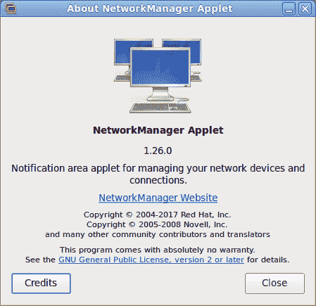
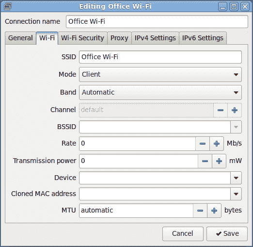
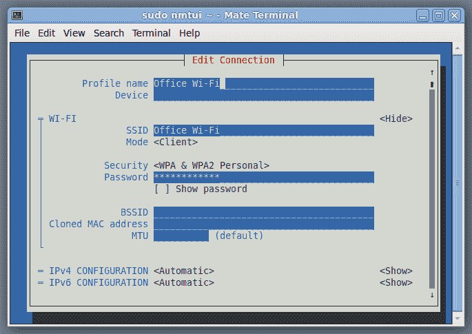

# 网络配置与调试

所有现代系统都联网，因此网络配置和故障排除是每个系统管理员的基本技能。在本章中，我们将了解 Linux 网络栈是如何工作的，以及如何使用相关工具来处理网络——包括通用工具和特定发行版工具。

本章将涵盖以下主题：

+   Linux 网络栈

+   Linux 中的网络接口和地址

+   路由与邻居表

+   NetworkManager

+   发行版特定的配置方法

+   网络故障排除

# Linux 网络栈

对于只通过应用程序与网络交互并通过图形用户界面配置网络访问的最终用户来说，他们操作系统的网络栈看起来像是一个单一的抽象。然而，对于管理员来说，理解其结构非常重要，因为栈的不同部分由不同的软件实现，并由不同的工具进行管理。

这与许多专有操作系统的 Linux 发行版形成对比，后者的绝大多数网络功能是内置的，且无法单独替换。在 Linux 发行版中，性能关键的功能由 Linux 内核本身实现，但许多其他功能，如通过 **动态主机配置协议** (**DHCP**) 动态配置 IP 地址和路由，则由第三方工具完成，并且可能有多个竞争的实现。

也有不同的工具用于管理 Linux 内核的网络功能。内核允许用户空间进程通过 *Netlink* 协议套接字检索和更改其网络配置，从技术上讲，任何人都可以编写一个管理 IP 地址和路由的工具。实际上，有两套网络管理工具：遗留工具（`ifconfig`、`vconfig`、`route`、`brctl` 等），这些工具仅保留以便兼容，并不支持内核网络栈的许多新特性；以及现代的 `iproute2` 工具包，它通过 `ip` 和 `tc` 工具提供对所有内核功能的访问。

有时，内核中可能存在多个相同或相似功能的实现。一个显著的例子是 Netfilter 防火墙子系统，它目前包含较旧的 `iptables` 框架和较新的 `nftables` 实现。

用户空间工具的不同实现可能是逐渐被更新替代方案所取代的遗留实现，或者也可能有多个具有不同设计目标的替代实现。例如，在 2022 年，ISC DHCP 服务器被其维护者宣布不再支持，并且他们开始从事更新的 Kea 项目。然而，Kea 并不是唯一的 ISC DHCP 服务器替代品。有人可能更愿意切换到其他项目。例如，小型网络可以从`dnsmasq`中受益，它将 DHCP 服务器与 DNS 转发和其他功能结合在一起，特别适合在硬件资源有限的小型办公室路由器上运行。

一些常用的 Linux 网络功能后端和管理工具总结如下表：

| **组件** | **实现** | **工具** |
| --- | --- | --- |
| 以太网 | Linux 内核 | 网络卡设置调整：`ethtool` MAC 地址设置，VLAN：`iproute2`（现代）；`vconfig`（遗留） |
| Wi-Fi（数据帧处理和转发） | Linux 内核 | `iw` |
| Wi-Fi（认证和接入点功能） | `hostapd` |
| IPv4 和 IPv6 路由 | Linux 内核 | `iproute2`（现代）`ifconfig`，`route`等（遗留） |
| 桥接（软件交换机） | Linux 内核 | `iproute2`（现代）；`brctl`（遗留） |
| QoS 和流量整形 | Linux 内核 | `tc`（`iproute2`的一部分） |
| IPsec（数据包加密和校验和计算） | Linux 内核 | `iproute2` |
| IPsec（IKE 会话管理） | strongSwan, Openswan, Raccoon（遗留）... |
| DHCP 客户端 | ISC DHCP, `dhcpcd` |
| DHCP 服务器 | ISC DHCP, ISC Kea, `dnsmasq` |

表 9.1 – Linux 网络栈组件

最后，还有一些高级管理工具，如 NetworkManager，它将多个工具和组件集中在一个用户界面下。我们先来了解网络栈的内核部分以及如何使用`iproute2`进行管理。然后，我们将看到如何通过不同发行版的高级工具简化和自动化管理。

# Linux 中的网络接口和地址

*网络接口*是指能够承载地址的物理和虚拟网络连接的通用术语。物理网卡和内核视角下的网络接口之间并不是一对一的关系。一块有四个端口的网卡是一个单独的 PCI 设备，但其每个端口都被内核视为一个独立的网络连接。

也有虚拟链接。有些虚拟链接与物理网络端口相关联，但其他类型的虚拟链接则完全独立。例如，MACVLAN 链接允许管理员使用不同的 MAC 地址从某些 IP 地址发送流量。由于以太网接口按定义不能拥有多个 MAC 地址，Linux 通过在物理以太网端口上创建虚拟接口并为其分配不同的 MAC 和 IP 地址来解决这个问题。使用 802.1Q VLAN 或 802.3ad QinQ（嵌套 VLAN）复用以太网流量，也通过创建与特定底层链接绑定的虚拟链接来完成。

然而，诸如 IPIP 和 GRE 等隧道协议的接口并未绑定到任何底层链接。它们需要隧道端点地址，但这些地址可以属于任何接口。也有一些虚拟接口用于本地进程通信或分配必须通过任何物理接口可达的地址：

| **链接类型** | **与物理设备的关系** |
| --- | --- |
| 以太网，Wi-Fi | 与物理卡或卡上的端口相关 |
| 802.1Q VLAN，802.3ad QinQ，MACVLAN | 绑定到单个物理链接 |
| IPIP，GRE，虚拟 | 纯虚拟 |

表 9.2 – 网络链接类型及其与物理设备的关系

在接下来的章节中，我们将学习如何检索网络接口的信息并配置它们。

## 发现物理网络设备

发现 Linux 系统中的所有物理网络设备可能是一个具有挑战性的任务。它们可以连接到不同的总线，包括 PCI 和 USB，这些总线使用不同的设备类别标识符。

请看以下来自笔记本的 PCI 设备列表：

```
$ lspci
00:00.0 Host bridge: Intel Corporation 11th Gen Core Processor Host Bridge/DRAM Registers (rev 01)
00:02.0 VGA compatible controller: Intel Corporation TigerLake-LP GT2 [Iris Xe Graphics] (rev 01)
00:04.0 Signal processing controller: Intel Corporation TigerLake-LP Dynamic Tuning Processor Participant (rev 01)
00:06.0 PCI bridge: Intel Corporation 11th Gen Core Processor PCIe Controller (rev 01)
...
00:14.3 Network controller: Intel Corporation Wi-Fi 6 AX201 (rev 20)
...
02:00.0 Non-Volatile memory controller: Samsung Electronics Co Ltd NVMe SSD Controller 980
03:00.0 Ethernet controller: Realtek Semiconductor Co., Ltd. RTL8111/8168/8411 PCI Express Gigabit Ethernet Controller (rev 15)
```

在这里，网络设备很容易通过视觉来识别。这里有一个 Wi-Fi 控制器（00:14.3）和一个以太网卡（03:00.0）。自动过滤掉所有非网络设备的内容稍微有点复杂。我们可以利用网络设备的 PCI 类别是`02xx`这一事实，并且可以通过`lspci -nn`命令在输出中包含设备类别号码：

```
$ lspci -nn | grep -E '\[02[0-9]+\]'
00:14.3 Network controller [0280]: Intel Corporation Wi-Fi 6 AX201 [8086:a0f0] (rev 20)
03:00.0 Ethernet controller [0200]: Realtek Semiconductor Co., Ltd. RTL8111/8168/8411 PCI Express Gigabit Ethernet Controller [10ec:8168] (rev 15)
```

鉴于此，要查看所有网络设备，您需要同时查看 PCI 和 USB 设备列表，因此使用高级第三方工具如`lshw`会更好。使用`lshw -class`命令，您可以一步查看所有可用的网络设备：无论是有线的还是无线的，连接到任何总线的设备。它还显示有关设备的许多附加信息：

```
$ sudo lshw -class network
  *-network
       description: Wireless interface
       product: Wi-Fi 6 AX201
       vendor: Intel Corporation
       physical id: 14.3
       bus info: pci@0000:00:14.3
       logical name: wlp0s20f3
       version: 20
       serial: 12:15:81:65:d2:2e
       width: 64 bits
       clock: 33MHz
       capabilities: pm msi pciexpress msix bus_master cap_list ethernet physical wireless
       configuration: broadcast=yes driver=iwlwifi driverversion=5.19.16-200.fc36.x86_64 firmware=71.058653f6.0 QuZ-a0-jf-b0-71.u latency=0 link=no multicast=yes wireless=IEEE 802.11
       resources: iomemory:600-5ff irq:16 memory:6013038000-601303bfff
  *-network
       description: Ethernet interface
       product: RTL8111/8168/8411 PCI Express Gigabit Ethernet Controller
       vendor: Realtek Semiconductor Co., Ltd.
       physical id: 0
       bus info: pci@0000:03:00.0
       logical name: enp3s0
       version: 15
       serial: 60:18:95:39:ca:d0
       capacity: 1Gbit/s
       width: 64 bits
       clock: 33MHz
       capabilities: pm msi pciexpress msix bus_master cap_list ethernet physical tp mii 10bt 10bt-fd 100bt 100bt-fd 1000bt-fd autonegotiation
       configuration: autonegotiation=on broadcast=yes driver=r8169 driverversion=5.19.16-200.fc36.x86_64 firmware=rtl8168h-2_0.0.2 02/26/15 latency=0 link=no multicast=yes port=twisted pair
       resources: irq:16 ioport:3000(size=256) memory:72004000-72004fff memory:72000000-72003fff
```

如您所见，`lshw`的输出还包括逻辑接口名称，而不仅仅是总线地址。Linux 中的每个网络接口都有一个唯一的名称，但它们的名称并不完全由硬件类型和总线端口决定。让我们更详细地讨论接口命名的问题。

## 网络接口名称

Linux 内核并不赋予网络接口名称任何特殊的意义。在一些操作系统中，接口名称完全由内核决定，第一块以太网设备可能始终被命名为 Ethernet0，管理员也无法更改该名称。而在 Linux 中情况并非如此，名称可以是任意的。事实上，大多数发行版包含了一个用户空间助手，在启动时根据默认策略或自定义配置重命名网络接口。以前，最常见的助手是 `udev`，现在通常是 `systemd-udevd`。

历史上，Ethernet 设备默认被命名为`ethX`，这是内核内建的命名方案。到 2020 年代，大多数发行版切换到 systemd 进行服务管理，并采用其**可预测网络接口名称**方案作为默认选项。

原始命名方案的问题在于内核的设备探测是非确定性的，因此在某些情况下，尤其是当新增网络卡或移除旧卡时，旧名称可能会被分配给不同的物理设备（例如，一块以前命名为 `eth2` 的卡可能会变成 `eth1`）。另一方面，如果一台机器只有一个网络接口，它就保证会被命名为 `eth0`。

systemd 的命名方案是可预测的，因为网络接口的名称在重启和硬件更换后保证保持不变。这样做的代价是用户和脚本编写者不能对名称做出任何假设。即使一台机器只有一个网络卡，它也可能被命名为，例如，`eno1`（以太网网络，板载，第 1 个）或 `enp3s0`（以太网网络，PCI，插槽 3:0）。

可以通过在 GRUB 配置中将 `net.ifnames=0` 添加到内核命令行，或者执行以下命令来切换回原始的命名方案：

```
$ sudo ln -s /dev/null /etc/systemd/network/99-default.link
```

还可以通过创建 systemd 链接文件，永久地为某些网络接口分配自定义名称。

## 使用 `ip` 命令

在现代 Linux 发行版中，所有网络发现和设置都通过 `iproute2` 包中的工具或如 NetworkManager 等高级工具完成。我们将忽略遗留工具，如 `ifconfig`，并专注于 `iproute2` 中的 `ip` 工具。

尽管该工具名为 `ip`，但它的功能要广泛得多，并为内核网络栈中与网络接口、地址和路由相关的所有特性提供接口。

需要注意的是，在某些发行版中，例如 Fedora，那个工具可能安装在`/sbin`或`/usr/sbin`等用于管理工具的目录下，并且这些目录通常不在普通用户的`$PATH`环境变量中。因此，从普通用户的 shell 中尝试执行该命令时，会出现命令未找到的错误，即便`iproute2`已安装。在这种情况下，你可能需要将`/sbin`添加到你的`$PATH`中，或者总是使用`sudo ip`来执行命令。更改网络设置的命令确实需要管理员权限，但查看网络设置的命令通常不需要。

请注意，你使用`ip`做出的更改仅在下一次重启之前保持有效，永久更改必须在特定发行版的配置文件中进行，或者添加到在启动时执行的脚本中。如果你在带有 NetworkManager 的桌面或笔记本电脑上进行实验，那么它可能会在 Wi-Fi 重新连接时覆盖你的更改。

## 发现和检查逻辑链路

要查看所有网络接口（包括物理接口和虚拟接口），可以运行`ip link list`或直接运行`ip link`。注意，`ip`允许缩写子命令和选项，因此你也可以写作`ip li li`，但为了更好的可读性，我们将在本章中使用完整形式：

```
$ ip link list
1: lo: <LOOPBACK,UP,LOWER_UP> mtu 65536 qdisc noqueue state UNKNOWN mode DEFAULT group default qlen 1000
    link/loopback 00:00:00:00:00:00 brd 00:00:00:00:00:00
2: ens192: <BROADCAST,MULTICAST,UP,LOWER_UP> mtu 1500 qdisc mq state UP mode DEFAULT group default qlen 1000
    link/ether 00:50:56:91:a2:b6 brd ff:ff:ff:ff:ff:ff
```

在这台虚拟机的输出中，我们看到回环设备（`lo`）和一张以系统 d 可预测网络接口命名规范命名的以太网卡（`ens192`）。

回环设备在每个 Linux 系统中都有。它的作用是使本地进程通过 IP 进行通信，并携带为此用途指定的地址：IPv4 的`127.0.0.1/8`和 IPv6 的`::1/128`。

`ens192`以太网设备的输出包含更多数据。在`link/ether`字段中，你可以看到它的 MAC 地址（`00:50:56:91:a2:b6`）。

你可能还会注意到输出中似乎冗余的`<...UP,LOWER_UP>`和`state UP`位。它们指的是该网络接口的不同状态：尖括号中的`UP`告诉我们该链路没有被管理员故意禁用，而`state UP`则表示实际状态（即它是否连接到其他网络设备—不论是物理电缆还是虚拟链路，虚拟机的情况也是如此）。

为了说明这一区别，让我们检查另一台机器上的物理网络，该网络没有连接到任何设备。要查看单个链路的信息，可以使用`ip link show <name>`：

```
$ /sbin/ip link show enp3s0
2: enp3s0: <NO-CARRIER,BROADCAST,MULTICAST,UP> mtu 1500 qdisc fq_codel state DOWN mode DEFAULT group default qlen 1000
    link/ether 60:18:95:39:ca:d0 brd ff:ff:ff:ff:ff:ff
```

如你所见，尖括号中的状态是`UP`，但`state DOWN`告诉我们它并未激活，而`NO-CARRIER`解释了原因——它已经断开连接（尽管连接了设备，网络链路也可能会处于断开状态，例如由于与另一端的设置不匹配）。

现在，让我们禁用一个链路，看看故意禁用的链路是什么样的。你可以使用`sudo ip link set dev <name> down`来实现：

```
$ ip link show eth2
6: eth2: <BROADCAST,MULTICAST,UP,LOWER_UP> mtu 1500 qdisc pfifo_fast state UP mode DEFAULT group default qlen 1000
    link/ether 00:50:56:9b:18:ed brd ff:ff:ff:ff:ff:ff
$ sudo ip link set dev eth2 down
$ ip link show eth2
6: eth2: <BROADCAST,MULTICAST> mtu 1500 qdisc pfifo_fast state DOWN mode DEFAULT group default qlen 1000
    link/ether 00:50:56:9b:18:ed brd ff:ff:ff:ff:ff:ff
```

你可以看到，当链路被断开时，`UP` 标记从尖括号内的部分消失了，`state` 字段也变成了 `DOWN`。

## 查看和更改以太网链路 MAC 地址

每个以太网和 Wi-Fi 卡都有一个全球唯一的、预烧录的 MAC 地址。为了确保如果它们连接到同一网络时不会发生冲突，制造商请求一块块的 MAC 地址，并跟踪他们分配给硬件产品的每个 MAC 地址，以确保每个地址不会被重复分配。

然而，最终用户可能有自己的原因来为网络接口分配 MAC 地址。例如，许多互联网服务提供商会注册用户路由器端口的第一个 MAC 地址，然后要求所有后续连接尝试使用相同的地址。如果用户更换或升级了路由器（或其中的网卡），通常更容易直接分配原端口的 MAC 地址，而不是请求 ISP 支持更新他们的记录。你可以使用 `ip link set dev <name>` `address <MAC>` 来更改 MAC 地址（直到下次重启）。

```
$ ip link show enp3s0
2: enp3s0: <NO-CARRIER,BROADCAST,MULTICAST,UP> mtu 1500 qdisc fq_codel state DOWN mode DEFAULT group default qlen 1000
    link/ether 60:18:95:39:ca:d0 brd ff:ff:ff:ff:ff:ff
$ sudo ip link set dev enp3s0 address de:ad:be:ef:ca:fe
$ /sbin/ip link show enp3s0
2: enp3s0: <NO-CARRIER,BROADCAST,MULTICAST,UP> mtu 1500 qdisc fq_codel state DOWN mode DEFAULT group default qlen 1000
    link/ether de:ad:be:ef:ca:fe brd ff:ff:ff:ff:ff:ff permaddr 60:18:95:39:ca:d0
```

注意到 `ip link show` 现在显示的是新手动分配的 MAC 地址（`de:ad:be:ef:ca:fe`）。

虽然 `ip` 只显示内核用于发送以太网帧的 MAC 地址，但你可以通过 `ethtool` 来检索默认的、预烧录的地址。你可以使用 `ethtool --show-permaddr` 或其简短版本 `ethtool -P`，如下所示：

```
$ ethtool --show-permaddr enp3s0
Permanent address: 60:18:95:39:ca:d0
$ ethtool -P enp3s0
Permanent address: 60:18:95:39:ca:d0
```

即使更改 MAC 地址不是很常见的任务，了解如何更改也很有用。接下来，我们将学习如何管理 IP 地址。

## 查看和更改 IP 地址

查看和更改 IP 地址的命令与查看和更改链路和 MAC 地址的命令相似，但使用的是 `address` 命令族，而不是 `link`。要查看所有链路上的地址，你可以运行 `ip address show`、仅运行 `ip address` 或简写版本 `ip a`：

```
$ ip address show
1: lo: <LOOPBACK,UP,LOWER_UP> mtu 65536 qdisc noqueue state UNKNOWN group default qlen 1000
    link/loopback 00:00:00:00:00:00 brd 00:00:00:00:00:00
    inet 127.0.0.1/8 scope host lo
       valid_lft forever preferred_lft forever
    inet6 ::1/128 scope host 
       valid_lft forever preferred_lft forever
2: ens192: <BROADCAST,MULTICAST,UP,LOWER_UP> mtu 1500 qdisc mq state UP group default qlen 1000
    link/ether 00:50:56:91:a2:b6 brd ff:ff:ff:ff:ff:ff
    inet 10.217.40.163/24 brd 10.217.40.255 scope global dynamic ens192
       valid_lft 58189sec preferred_lft 58189sec
    inet6 fe80::250:56ff:fe91:a2b6/64 scope link 
       valid_lft forever preferred_lft forever
```

你还可以将输出限制为仅显示一个接口，例如在 `ip address show lo` 中。

`ip address show` 的输出包括以太网和其他数据链路层接口的 MAC 地址，因此通常你可以使用该命令来代替 `ip link list`，除非你特别想从输出中排除 IP 地址。

可以使用 `-4` 和 `-6` 选项仅显示 IPv4 或仅显示 IPv6 地址。我们可以在回环接口（`lo`）上演示，因为它保证有 IPv4 和 IPv6 地址（除非明确禁用 IPv6）：

```
$ ip -4 address show lo
1: lo: <LOOPBACK,UP,LOWER_UP> mtu 65536 qdisc noqueue state UNKNOWN group default qlen 1000
    inet 127.0.0.1/8 scope host lo
       valid_lft forever preferred_lft forever
$ ip -6 address show lo
1: lo: <LOOPBACK,UP,LOWER_UP> mtu 65536 state UNKNOWN qlen 1000
    inet6 ::1/128 scope host 
       valid_lft forever preferred_lft forever
```

现在让我们来看一下如何添加和删除地址。为了进行安全实验，确保不会影响任何用于实际流量的网络接口，我们将创建一个虚拟接口。虚拟接口在概念上类似于回环接口。然而，同一系统中可以有多个虚拟接口，而回环接口只能有一个（这种情况是 Linux 独有的；许多其他操作系统允许多个回环接口，而不是使用不同类型的接口）：

```
$ sudo ip link add name dummy1 type dummy
$ sudo ip link set dev dummy1 up
$ ip link list type dummy
16: dummy1: <BROADCAST,NOARP,UP,LOWER_UP> mtu 1500 qdisc noqueue state UNKNOWN mode DEFAULT group default qlen 1000
    link/ether 9a:9c:10:42:a6:ea brd ff:ff:ff:ff:ff:ff
```

所有虚拟接口在 Linux 中默认处于 `DOWN` 状态，因此我们手动将 `dummy1` 链接置为启用状态。现在，它已准备好进行地址实验。

你可以使用 `ip address add <addr> dev <name>` 命令为网络接口分配一个地址。就像 MAC 地址一样，这些更改不会在重启后保存，因此这种方法仅适用于实验和故障排除会话。我们将使用来自 `192.0.2.0/24` 网络的地址——这是一个专门为示例和文档保留的网络：

```
$ sudo ip address add 192.0.2.1/24 dev dummy1
$ ip address show dev dummy1
16: dummy1: <BROADCAST,NOARP,UP,LOWER_UP> mtu 1500 qdisc noqueue state UNKNOWN group default qlen 1000
    link/ether 9a:9c:10:42:a6:ea brd ff:ff:ff:ff:ff:ff
    inet 192.0.2.1/24 scope global dummy1
       valid_lft forever preferred_lft forever
    inet6 fe80::989c:10ff:fe42:a6ea/64 scope link 
       valid_lft forever preferred_lft forever
```

请注意，第二次执行 `ip address add` 命令并使用不同的地址时，原地址不会被替换，而是会添加第二个地址。在 Linux 中，单个网络接口上的地址数量没有限制；你可以任意添加多个地址。如果你想替换地址，可以先添加新地址，然后删除旧地址。让我们来看一下如何将 `192.0.2.1` 替换为 `192.0.2.2`：

```
$ sudo ip address add 192.0.2.2/24 dev dummy1
$ sudo ip address show dummy1
16: dummy1: <BROADCAST,NOARP,UP,LOWER_UP> mtu 1500 qdisc noqueue state UNKNOWN group default qlen 1000
    link/ether 9a:9c:10:42:a6:ea brd ff:ff:ff:ff:ff:ff
    inet 192.0.2.1/24 scope global dummy1
       valid_lft forever preferred_lft forever
    inet 192.0.2.2/24 scope global secondary dummy1
       valid_lft forever preferred_lft forever
$ sudo ip address delete 192.0.2.1/24 dev dummy1
$ sudo ip address show dummy1
16: dummy1: <BROADCAST,NOARP,UP,LOWER_UP> mtu 1500 qdisc noqueue state UNKNOWN group default qlen 1000
    link/ether 9a:9c:10:42:a6:ea brd ff:ff:ff:ff:ff:ff
    inet 192.0.2.2/24 scope global dummy1
       valid_lft forever preferred_lft forever
```

也可以使用 `sudo ip address flush` `dev <name>` 命令一次性移除网络接口上的所有地址。

大多数时候，你将使用更高级的配置工具来配置 IP 地址，我们将在本章稍后讨论这些工具。然而，了解这些命令可以帮助你在故障排除会话或紧急配置更改期间验证地址配置并临时更改网络接口地址。

# 路由和邻居表

为了能够与网络上的其他主机通信，主机仅有地址是不够的。它还需要知道如何到达其他主机。现代网络使用分层协议栈，Linux 内核负责根据 OSI 模型的 **数据链路** 层和 **网络** 层。

在数据链路层，有以太网和 Wi-Fi 等协议——这两者都是多址广播网络，并要求在同一网络段内动态发现邻居。在数据链路层，主机通过其 MAC 地址来标识。数据链路层的直接通信仅在同一段内有效。如果网络层协议封装在数据链路层协议帧中并必须进一步传输，它将从原始帧中提取并重新封装到新帧中。

在数据链路层之上是网络层协议——IPv4 和 IPv6。IP 数据包可以发送到同一数据链路层段中的主机，也可以路由到其他网络，并且可能通过许多数据链路层连接到达目标。

然而，为了能够将 IP 数据包发送到另一台主机或路由器，内核需要在这些机器的 IP 地址和 MAC 地址之间建立关联，并维护这些关联的表格。

## ARP 和 NDP 邻居表

IPv4 和 IPv6 协议有许多相似之处，但使用不同的邻居发现机制。较老的 IPv4 协议使用 **地址解析协议**（**ARP**）来确定具有给定 IP 地址的主机的 MAC 地址。ARP 并非设计为可扩展的，而从 IPv4 的 32 位地址到 IPv6 的 128 位地址的转换要求开发新的协议，因此设计者利用这个机会修订了许多旧的假设并加入了许多新功能。最终的结果是 **邻居发现协议**（**NDP**），与 ARP 不同，它允许主机发现路由器、动态配置公网地址，并检测地址冲突。

要查看 ARP 表，可以运行 `ip -4 neighbor show`。你也可以简化为 `ip -4 neighbor` 或 `ip -4 neigh`。请注意，这些命令也支持英式拼写（`neighbour`），如果你更喜欢使用它的话。如果省略 `-4` 或 `-6`，该命令将显示两个协议的条目，因此如果你的系统未配置 IPv6 或不想过滤，可以省略 `-4`：

```
$ ip -4 neighbor show
10.217.32.199 dev eth1 lladdr 00:0c:29:62:27:03 REACHABLE
10.217.32.132 dev eth1  FAILED
10.217.32.111 dev eth1  FAILED
10.217.32.102 dev eth1 lladdr 00:50:56:85:d9:72 DELAY
10.217.32.201 dev eth1 lladdr 00:50:56:9b:dd:47 STALE
10.217.32.99 dev eth1 lladdr 00:0c:29:5f:92:1d REACHABLE
10.217.32.202 dev eth1 lladdr 00:50:56:9b:bc:28 STALE
10.217.32.117 dev eth1 lladdr 00:50:56:9b:7e:e3 REACHABLE
```

也可以过滤输出，仅显示一个网络接口的条目，例如，使用 `ip -4 neighbor show` `dev eth1`。

用于 MAC 地址的字段称为 **链路层地址**（**lladdr**）。原因是邻居表的输出格式对于多个数据链路层协议是相同的，而这些协议可能不会将其链路层地址称为 MAC 地址。还有一些情况，当 IPv4 主机的链路层地址本身就是一个 IPv4 地址时——例如，多点 GRE 隧道就是这样工作（它是动态多点 VPN 技术的一部分，此外还包括用于加密的 IPsec 和用于邻居发现的下一跳解析协议）。

每个关联是一个三元组而不是二元组：MAC 地址、IPv4 地址和网络接口。每个以太网接口属于其自己的数据链路层段，因此为了正确地发送 IP 数据包，系统需要知道从哪个网卡发送它。MAC 地址必须仅在同一段内唯一。

可以只显示具有特定状态的条目。例如，以下是如何仅查看最近发现或确认的地址关联：

```
ip neighbor show dev <name> nud reachable
```

过时的条目最终会从表中消失。当 IP 地址被移到具有不同 MAC 地址的机器上时，内核也最终会发现它。但是如果等待不可行，并且必须在最短的停机时间内移动 IP 地址，可以手动删除条目，并在看到该 IP 地址的流量后立即强制发出新的 ARP 请求。删除特定 IP 地址条目的命令如下：

```
sudo ip neighbor del dev <name> <IP address>
```

还有一个命令可以删除特定网络接口的所有条目：

```
ip neighbor flush dev <name>
```

尽管 ARP 和 NDP 协议的内部工作原理不同，我们讨论的所有命令都适用于 IPv4 和 IPv6 的邻居表。

## 路由和路由表

IPv4 和 IPv6 是路由协议，允许它们在由多个独立段组成的大型网络中使用，例如互联网。以太网网络段是平面的，并且没有分组 MAC 地址的机制：如果网络中有一百个主机，交换机必须维护一百条 MAC 地址表条目，每个主机也需要在其表中保持与所有需要通信的主机的 MAC 地址。该方法对最大网络规模有明显限制。它还使得不可能有多个路径通向网络的同一部分，因为数据链路层段中的所有主机必须直接通信。

相反，IP 网络被划分为子网，这些子网通过路由器连接——路由器是专门用于在主机之间转发数据包的设备（如今许多家庭/小型办公室和企业/服务提供商的路由器都运行 Linux）。IP 寻址架构最重要的特性是子网可以聚合。例如，如果一个网络内部由两个连续的子网组成，每个子网包含 32 个主机，比如`192.0.2.0/27`和`192.0.2.32/27`，那么其他网络可以将它视为一个包含 64 个主机的单一网络——`192.0.2.0/26`。

只连接到单一上游路由器（通常是互联网服务提供商）的主机和路由器，因而只能存储到整个 IP 范围的单一路由：对于 IPv4 是`0.0.0.0/0`，对于 IPv6 是`::/0`。这样的路由被称为**默认路由**。

### 查看路由表和路由

让我们检查连接到单个路由器的 Linux 主机的路由表。你可以通过`ip route show`或者`ip route`来查看 IPv4 路由。与`ip neigh`不同，后者显示 IPv4 和 IPv6 邻居，除非使用`-4`或`-6`进行过滤，该命令默认显示 IPv4 路由，需要`-6`选项来查看 IPv6 路由：

```
$ ip route show
default via 172.20.10.1 dev eth0 proto dhcp src 172.20.10.2 metric 100
172.20.10.0/28 dev eth0 proto kernel scope link src 172.20.10.2 metric 100
```

第一条条目是默认路由——指向`0.0.0.0/0`网络的路由，覆盖所有可能的 IPv4 地址。网关是`172.20.10.1`。出接口是`eth0`。从`proto dhcp`，我们可以推断它是从 DHCP 服务器接收到的。协议字段仅用于信息展示，内核不会使用它进行路由选择。内部，它是一个从`0`到`255`的数字，其中一些数字被映射到`/etc/iproute2/rt_protos`配置文件中的协议名称。

第二条通向`172.20.10.0/28`网络的路由是一个连接路由，它仅仅告诉系统可以通过某个网络接口直接与某个子网中的主机通信。注意，它没有网关，只有接口字段（`dev`）。如果我们检查该机器上的 IPv4 地址，我们会看到它的地址是`172.20.10.2/28`：

```
$ ip address show eth0
17: eth0: <BROADCAST,MULTICAST,UP,LOWER_UP> mtu 1500 qdisc fq_codel state UP group default qlen 1000
    link/ether 4e:79:75:4e:61:9a brd ff:ff:ff:ff:ff:ff
    altname enp0s20f0u3u3c4i2
    inet 172.20.10.2/28 brd 172.20.10.15 scope global dynamic noprefixroute eth0
       valid_lft 65207sec preferred_lft 65207sec
    inet6 fe80::a487:4fbe:9961:ced2/64 scope link noprefixroute 
       valid_lft forever preferred_lft forever
```

每当一个 IP 地址被添加到网络接口时，内核会计算它的子网地址并添加一条到该子网的路由。由于`172.20.10.0/28`子网比`0.0.0.0/0`子网小，因此该路由将用于与该子网的主机通信，而不是默认路由。这就是**最长匹配规则**。

内核协议号保留用于标记这些没有管理员直接请求而创建的辅助路由。你可以通过运行以下命令查看某个特定协议的路由：

```
$ ip route show proto kernel 
172.20.10.0/28 dev eth0 scope link src 172.20.10.2 metric 100
```

内核还可以告诉你它将使用哪个路由来访问某个主机或网络。例如，如果你想知道它如何到达一个`192.0.2.1`地址的主机，可以运行以下命令：

```
$ ip route get 192.0.2.1
192.0.2.1 via 172.20.10.1 dev eth0 src 172.20.10.2 uid 1000 cache
```

由于这台机器只有一条默认路由，因此每个主机的答案都是其默认网关——`172.20.10.1`。然而，在具有多条连接到多个网络的路由器上，`ip route get`命令会非常有用。

### 配置路由

许多主机系统只是从 DHCP 获取它们的默认路由，但 Linux 内核中的路由功能要复杂得多。

使用`ip`工具配置路由的一个问题是，和所有通过这种方式配置的内容一样，这些路由只有在下次重启之前有效，前提是网络状况完美。另一个问题是，如果一个网络接口停止工作（比如物理网络卡由于断开电缆，或虚拟链路因协议重置导致），与该接口相关的所有路由都会被永久删除，并需要通过用户空间程序恢复。在企业和服务提供商路由器中，用户空间程序通常是一个路由协议栈服务，例如 Free Range Routing 或 BIRD。这些路由协议栈服务实现了动态路由协议，还帮助管理静态路由并在网络接口状态变化时保持它们的活动状态。在主机系统上，可能是 NetworkManager 或其他网络配置前端。然而，了解如何手动创建路由在需要实验或进行紧急修复时仍然是有用的。

要创建一条具有特定网关地址的静态路由，你可以使用以下命令：

```
ip route add <network> via <gateway>
```

让我们在一个虚拟接口上演示一下。首先，我们将创建一个虚拟接口，并为其分配`192.0.2.1/24`地址，以强制内核创建一条到`192.0.2.0/24`的连接路由，并为我们的虚拟网关腾出空间。我们将使用`203.0.113.0/24`进行实验——这是另一个保留用于示例和文档的网络，保证不会出现在公共互联网中，因此我们可以确保不会干扰任何真实流量：

```
$ sudo ip link add name dummy1 type dummy
$ sudo ip link set dev dummy1 up
$ sudo ip address add 192.0.2.1/24 dev dummy1
```

现在我们可以添加一条路由，验证它是否存在，并尝试将`dummy1`停用，看看会发生什么：

```
$ sudo ip route add 203.0.113.0/24 via 192.0.2.10
$ ip route
default via 172.20.10.1 dev eth0 proto dhcp src 172.20.10.2 metric 100  
172.20.10.0/28 dev eth0 proto kernel scope link src 172.20.10.2 metric 100 
192.0.2.0/24 dev dummy1 proto kernel scope link src 192.0.2.1 
203.0.113.0/24 via 192.0.2.10 dev dummy1
$ sudo ip link set dev dummy1 down
$ ip route
default via 172.20.10.1 dev eth0 proto dhcp src 172.20.10.2 metric 100  
172.20.10.0/28 dev eth0 proto kernel scope link src 172.20.10.2 metric 100
```

你可以看到，新添加的路由在其条目中自动包含了正确的网络接口：`203.0.113.0/24 via 192.0.2.10 dev dummy1`。内核检查了到`192.0.2.10`的路由——我们设置的网关地址——并发现它可以通过`dummy1`访问（至少名义上是这样）。

当我们关闭`dummy1`时，内核也移除了与之相关的连接路由`192.0.2.0/24`。这使得`192.0.2.10`网关变得不可达，因此内核也移除了所有因该变化而导致网关不可达的路由。内核通常不允许用户创建网关不可达的路由，并且能够检测递归路由（即，网关无法通过连接路由直接访问的路由）。但是，通过在命令中添加一个特殊的`onlink`标志，可以禁用该可达性检查，例如：

```
sudo ip route add 203.0.113.0/24 via 192.0.2.10 onlink
```

如果你连接到以太网交换机或其他类型的多接入网络，你必须在路由中指定网关，因为仅仅通过以太网设备发送数据包是不可能的——数据包中必须有目的地址，因为同一段网络中可能有多个主机。然而，有些网络接口是点对点的，并且另一端只有一个系统。物理点对点连接，如串行广域网连接，现在已经几乎灭绝，但虚拟点对点连接很常见。如果你通过 PPPoE 连接到互联网，你可以只用`sudo ip route add 0.0.0.0/0 dev ppp0`或类似命令创建默认路由——不需要指定网关地址。

如果你只有一条通向某个网络的路由并且想要删除它，你只需使用`sudo ip route del <network>`，如果你有多条通向同一网络的路由，你需要指定网关或接口，才能准确删除你想要删除的路由，例如`sudo ip route del 203.0.113.0/24` `via 192.0.2.10`。

当存在多条路由指向同一目的地时，有两种情况。首先，可以通过为其设置`metric`命令来创建备份路由。例如，如果我们创建一条`metric`为`100`的路由，它会保留在路由表中，但在存在带有较低`metric`值的路由时不会被使用。如果某条路由消失，内核会自动开始使用备份路由。我们可以通过以下命令来演示：

```
$ sudo ip route add 203.0.113.0/24 via 192.0.2.10
$ sudo ip route add 203.0.113.0/24 via 192.0.2.20 metric 100
$ ip route
...
192.0.2.0/24 dev dummy1 proto kernel scope link src 192.0.2.1 
203.0.113.0/24 via 192.0.2.10 dev dummy1 
203.0.113.0/24 via 192.0.2.20 dev dummy1 metric 100 
$ ip route get 203.0.113.100
203.0.113.100 via 192.0.2.10 dev dummy1 src 192.0.2.1 uid 1000 cache
$ sudo ip route del 203.0.113.0/24 via 192.0.2.10
$ ip route get 203.0.113.100
203.0.113.100 via 192.0.2.20 dev dummy1 src 192.0.2.1 uid 1000 cache
```

其次，内核可以并行使用多条路由到相同的目的地进行负载均衡和冗余。如果不同路径的带宽不同，你可以为每个网关指定不同的权重，方法如下：

```
$ sudo ip route add 203.0.113.0/24 nexthop via 192.0.2.10 weight 1 nexthop via 192.0.2.20 weight 10
$ ip route 
...
192.0.2.0/24 dev dummy1 proto kernel scope link src 192.0.2.1 
203.0.113.0/24 
	nexthop via 192.0.2.10 dev dummy1 weight 1 
	nexthop via 192.0.2.20 dev dummy1 weight 10
```

请注意，这种负载均衡方法仅适用于具有直接路由连接的网络，因为属于同一连接的数据包将通过两条路径发送，而这些数据包的返回路径也是不可预测的。那些连接到多个 ISP，但使用 NAT 在所有内部网络主机之间共享公共 IPv4 地址的系统，需要更复杂的负载均衡配置，确保整个连接被平衡，并且每个数据包使用相同的外发路径，但这超出了本书的讨论范围。

还有一些特殊用途的路由，确保目标网络变得不可达。这些路由有两种类型：`blackhole` 和 `unreachable/prohibit/throw`。两者都会使内核丢弃发送到特定网络的所有数据包，但 `blackhole` 路由会让它默默丢弃数据包，而另一种类型则还会向源主机发送一个 ICMP 错误。

`blackhole` 路由通常用作一种粗糙但高效的外出流量过滤器。这些路由可以用来阻止网络内部的主机与已知的恶意目标通信，例如僵尸网络的指挥与控制节点。在遭遇传入的 DDoS 攻击时，它们还可以用来在路由器处阻止流量，使其无法到达目标，这样你可以重新配置目标主机以提高性能，或者至少避免在攻击结束前使其过载。你可以通过 `sudo ip route add` `blackhole <network>` 来创建一个 `blackhole` 路由：

```
$ sudo ip route add blackhole 203.0.113.0/24 
$ ip route
... 
blackhole 203.0.113.0/24
$ ping 203.0.113.10
ping: connect: Invalid argument
```

如果一个网络被黑洞化，你将无法从本地机器连接到该网络中的任何主机。对于使用该机器作为路由器的主机来说，情况看起来像是它们的数据包没有收到任何回复。

另外三种路由类型（`unreachable`、`discard` 和 `throw`）不能用于 DDoS 保护，因为当数据包的目标与这些路由匹配时，内核不仅会丢弃数据包，还会生成一个 ICMP 数据包通知发送方他们的数据包未能到达目标，这样只会通过生成更多的流量让情况变得更糟。它们最适合用于公司内部网络，用于执行政策，且易于调试。如果你不希望你的主机向一个假设的 `203.0.113.113` 主机发送任何流量，你可以运行 `sudo ip route add prohibit 203.0.113.113/32`，任何尝试连接到该主机的人将收到一条消息，提示该主机被管理策略禁止访问（而使用 `blackhole` 路由时，客户端无法轻易判断这是否是政策问题或网络问题）。

如你所见，`ip` 命令提供了丰富的功能，用于配置和查看路由表及邻居表。手动配置路由并不是一项常见任务，但知道如何操作仍然很重要，而路由和邻居表的查询命令在日常的诊断和调试工作中非常有用。

# NetworkManager

服务器和嵌入式设备通常具有固定的、静态分配的 IP 地址，但桌面计算机，尤其是笔记本电脑，可能需要动态连接到多种不同类型的网络。带有笔记本电脑的系统管理员可能需要连接到服务器机房中的有线以太网网络、办公室、家中以及公共场所（如咖啡馆）的 Wi-Fi 网络，还需要通过 VPN 隧道从家中连接到公司网络。由于许多笔记本电脑不再配备内置有线网络卡，因此可能需要使用 USB 以太网适配器，系统必须处理不仅是按需网络连接，还要处理热插拔网络设备。

通过配置文件和命令手动管理此类配置会很繁琐，因此人们创建了自动化的软件项目。这些项目依赖于常用的工具，如 `ip` 实用程序和第三方项目，如 strongSwan 或 `xl2tpd` 用于 VPN 连接，但将它们集成到统一的用户界面下，并包括一个事件处理机制，以应对热插拔硬件更改和用户连接到不同网络的请求。

最流行的解决方案是 NetworkManager 项目，该项目由 Red Hat 于 2004 年启动。如今，大多数 Linux 发行版至少在桌面安装中包含它。

使用 `dnf search NetworkManager`（在 Fedora 或 RHEL 上）或 `apt-cache search NetworkManager`（在基于 Debian 的发行版上），您将看到包含各种连接类型插件的包，这些插件从广泛使用且知名的 `NetworkManager-wifi` 或 `NetworkManager-openvpn` 到不常见且实验性的 `NetworkManager-iodine`——一种通过将数据传输到 DNS 包中来绕过防火墙的解决方案。

它还有多个用户界面。您可以在桌面环境面板的托盘区域看到的网络小程序就是 NetworkManager 的用户界面。在 MATE 桌面和许多其他桌面环境中，您可以验证通过右键点击网络图标并选择 **关于** 菜单项，您将看到如下屏幕：



图 9.1 – NetworkManager 小程序版本信息对话框

在右键菜单的 **编辑连接** 部分，您可以创建新连接或编辑现有连接：



图 9.2 – NetworkManager 连接编辑对话框

最新版本的 NetworkManager 将连接配置文件保存在专用目录中，而旧版本则使用特定于发行版的格式。如果保存了一个连接，可以在 `/etc/NetworkManager/system-connections` 目录下找到其文件。请注意，这些文件对于没有特权的用户是不可读的。您可以按照以下方式查看办公室 Wi-Fi 连接的文件：

```
$ sudo cat /etc/NetworkManager/system-connections/Office\ Wi-Fi.nmconnection
[connection]
id=Office Wi-Fi
uuid=6ab1d913-bb4e-40dd-85a7-ae03c8b62f06
type=wifi
[wifi]
mode=infrastructure
ssid=Office Wi-Fi
[wifi-security]
key-mgmt=wpa-psk
psk=SomePassword
[ipv4]
may-fail=false
method=auto
[ipv6]
addr-gen-mode=stable-privacy
method=auto
[proxy]
```

还有一个适用于 NetworkManager 的文本模式界面，可以在无头机器上提供类似 GUI 的体验。它通常不会默认安装，但在 Fedora 上，可以通过安装 `NetworkManager-tui` 包来获得。



图 9.3 – nmtui，NetworkManager 的基于文本的界面

最后，`nmcli` 工具允许从命令行管理 NetworkManager 连接。如果您已经创建了一个连接，可以通过 `nmcli connection up <name>` 启动它（类似于 `nmcli connection up "Office Wi-Fi"`），或使用 `nmcli connection down <name>` 将其关闭。如果没有 `nmtui` 或图形桌面环境可用，它还提供了交互式的连接编辑功能。

如您所见，NetworkManager 使得管理典型的网络配置变得简单，尤其是在桌面机器上。接下来，我们将学习不使用 NetworkManager 的基于发行版的特定配置方法。

# 基于发行版的特定配置方法

NetworkManager 被许多发行版在桌面系统上使用，但许多 Linux 发行版也使用自定义的网络配置文件和脚本。一些发行版仍在使用这些方法，而其他系统则迁移到 NetworkManager，但仍保留旧的配置方法，作为替代或在长期支持的旧版中使用。

## Debian

在 Debian 中，网络接口的配置文件是 `/etc/network/interfaces`。与 NetworkManager 的原生格式不同，这种方式允许将所有接口的配置保存在一个文件中。为了使配置更加模块化和易于阅读，可以将单个接口的配置文件存储在 `/etc/network/interfaces.d/` 目录中。

接口配置也通过链接名称而非任意描述和 UUID 来识别。例如，这是如何为一个内建的以太网设备 `eno1` 设置静态地址用于 IPv4 和 IPv6 的示例：

```
iface eno1 inet static
      address 203.0.113.123/24
      gateway 203.0.113.1
iface eno1 inet6 static
      address 2001:db8:abcd::123/64
      gateway 2001:db8:abcd::1
```

您还可以在接口启用和禁用时执行自定义命令，使用 `pre-up`、`up`、`down` 和 `post-down` 选项。例如，当 `eno1` 启动时，自动添加路由，可以运行以下命令：

```
iface eno1 inet static
      address 203.0.113.123/24
      gateway 203.0.113.1
      up ip route add 192.0.2.0/24 via 203.0.113.1
```

启用和禁用接口的工具分别命名为 `ifup` 和 `ifdown`。它们仅对特权用户可用，因此您需要使用 `sudo` 来运行它们，如 `sudo ifup eno1` 或 `sudo ifdown eno1`。

## 旧版基于 Red Hat 的发行版

Fedora 和 RHEL 8 及以上版本（以及其衍生版如 Rocky Linux）使用 NetworkManager 作为其网络配置系统。然而，直到 RHEL7，它们使用的是不同的系统。其配置文件目录是 `/etc/sysconfig/network-scripts`，每个接口都有自己的文件。例如，这是如何将 `203.0.113.113/24` 地址静态分配给一个内建以太网接口 `eno1`：

```
$ cat /etc/sysconfig/network-scripts/ifcfg-eno1
DEVICE=eno1
BOOTPROTO=none
ONBOOT=yes
PREFIX=24
IPADDR=203.0.113.113
```

一种 Red Hat 特定的方法，通过使用 `service network` `restart` 命令重新读取并应用所有旧式网络配置。

如您所见，特定于分发版的方法在概念上是相似的，尽管配置语法和相同意义选项的名称可以大相径庭。如果有疑问，您应该始终查阅文档。现在我们已经介绍了最常见的网络配置方法，接下来我们还应该学习如何验证配置是否按预期工作。

# 网络故障排除

网络故障排除是一个广泛的主题。然而，大多数时候，专家使用的工具与每个新手可用的工具相同，而且这些工具在基本使用层面上并不难学会。新手和专家之间的主要区别在于他们如何解读输出结果并选择正确的选项。

## 使用 ping

`ping` 工具的名称来源于声呐的声音——声呐是一种利用声波脉冲来探测水下物体的设备。该命令通过发送 ICMP 数据包并等待回复，隐喻性地探测远程主机。声呐的隐喻有些牵强，因为声波脉冲是被动反射的，而 ICMP 数据包的交换需要远程主机的配合。

尽管如此，运行正确实现的网络栈的主机在收到回显请求时，应该会回复一个 ICMP 回显应答数据包。在最基本的层面上，ping 一台主机可以告诉你该主机是否在线，以及是否存在通向它的有效网络路径。

默认情况下，Linux 版本的 `ping` 将无限期地继续发送回显请求。这与其他一些版本（如 Windows）不同，后者默认在发送有限数量的数据包后终止。如果您希望 Linux 的 `ping` 采用这种行为，您可以使用 `-c` 来指定请求次数，例如 `-c5`，以发送五个请求，如下所示：

```
$ ping -c5 9.9.9.9
PING 9.9.9.9 (9.9.9.9) 56(84) bytes of data.
64 bytes from 9.9.9.9: icmp_seq=1 ttl=56 time=31.1 ms
64 bytes from 9.9.9.9: icmp_seq=2 ttl=56 time=24.8 ms
64 bytes from 9.9.9.9: icmp_seq=3 ttl=56 time=21.7 ms
64 bytes from 9.9.9.9: icmp_seq=4 ttl=56 time=115 ms
64 bytes from 9.9.9.9: icmp_seq=5 ttl=56 time=22.8 ms
--- 9.9.9.9 ping statistics ---
5 packets transmitted, 5 received, 0% packet loss, time 4004ms
rtt min/avg/max/mdev = 21.666/43.061/115.059/36.145 ms
```

如果 ICMP 回显请求成功到达目标且目标回复，则对这些数据包的回复将来自目标地址。

如果数据包无法到达目标主机，因为没有到达它的路由，您将收到来自路径上最后一个路由器的回复，该路由器无法将数据包继续转发，因为它找不到路由。例如，考虑从私有网络中 ping 一台主机时的输出：

```
$ ping 10.217.32.33
PING 10.217.32.33 (10.217.32.33) 56(84) bytes of data.
From 10.217.41.49 icmp_seq=1 Destination Host Unreachable
From 10.217.41.49 icmp_seq=2 Destination Host Unreachable
```

在这种情况下，接收到我们的 ICMP 回显请求数据包并未能继续转发它们的最后一个路由器地址是 `10.217.41.49`，所以如果我们想检查为什么该主机不可访问，那么这个路由器将是我们的起点。

## 使用 traceroute

ping 可以告诉你主机是否可访问，如果不可访问，则可以指出 ICMP 回显数据包在网络中到达的具体位置。然而，它不能告诉你网络路径的具体情况。

为了发现数据包通过网络的路径，你可以改用 `traceroute` 工具。简而言之，该工具发送具有故意较小 TTL（针对 IPv4）或跳数（针对 IPv6）的数据包，并记录迫使路由器丢弃测试数据包并记录其 ICMP 错误信息的过程，从而记录数据包的路径。

每个 IP 数据包都有一个字段，显示它已经在路由器之间转发了多少次。在 IPv4 中，该字段的名称为 `0`，表示数据包被丢弃。每当路由器因该原因丢弃数据包时，它会通过 ICMP TTL 超时消息通知发送方。

因此，如果你故意将数据包的 TTL 设置为 `1`，它必定会被路径上的第一个路由器丢弃。通过关于丢弃数据包的 ICMP 响应，你可以了解到该路由器的地址。通过逐步增加 TTL 值重复这一过程，你可以了解路径上的每个路由器——或者至少是每个合作的路由器，它会发送 ICMP TTL 超时的回复。

在公共互联网和其他大型网络中，解读`traceroute`输出结果时存在许多微妙之处。一些路由器可能根本不会生成 ICMP TTL 超时消息，或者仅在其负载较低时生成这些消息，因此路径可能会显示出空白（你会看到 `* * *` 符号，表示该路由器从未生成这些响应——`traceroute` 在放弃之前会尝试三次探测）。由于某些网络段使用**多协议标签交换**（**MPLS**）而非 IP 路由，`traceroute` 显示的路径可能并非真实路径。然而，它仍然是一个有用的工具，在私有网络中，它的输出通常是实际路径。

以下是其输出的可能样式：

```
$ traceroute 10.217.32.179
traceroute to 10.217.32.179 (10.217.32.179), 30 hops max, 60 byte packets
1  10.217.133.1 (10.217.133.1)  86.830 ms  86.769 ms  98.345 ms
2  10.217.41.49 (10.217.41.49)  128.365 ms  128.359 ms  128.346 ms
3  10.217.32.179 (10.217.32.179)  134.007 ms  134.024 ms  134.017 ms
```

默认情况下，`traceroute` 会通过查找 PTR 记录来解析 IP 地址为域名。这可能会使其变慢，或者你可能希望查看原始地址。如果你更喜欢查看原始地址，可以通过 `-n` 选项禁用名称解析。

还有许多其他网络诊断工具。例如，像 *nmap* 这样的网络扫描器可以告诉你远程主机上正在运行哪些服务，并收集有关其操作系统和网络栈的信息。像 *tcpdump* 和 *Wireshark* 这样的数据包捕获和分析工具可以帮助你获取网络流量的详细图景。然而，即使只有 `ping` 和 `traceroute`，你也可以验证网络设置是否正常工作，或者收集调试信息与同事或支持技术人员共享。

# 总结

在本章中，我们学习了 Linux 网络栈的组成部分、管理工具以及不同类型的物理和虚拟网络接口。我们学习了如何分配和查看地址、查看和创建路由、使用 NetworkManager 和特定发行版的方法配置网络设置，并执行基本的故障排除程序。

在下一章中，我们将学习如何管理存储设备。
