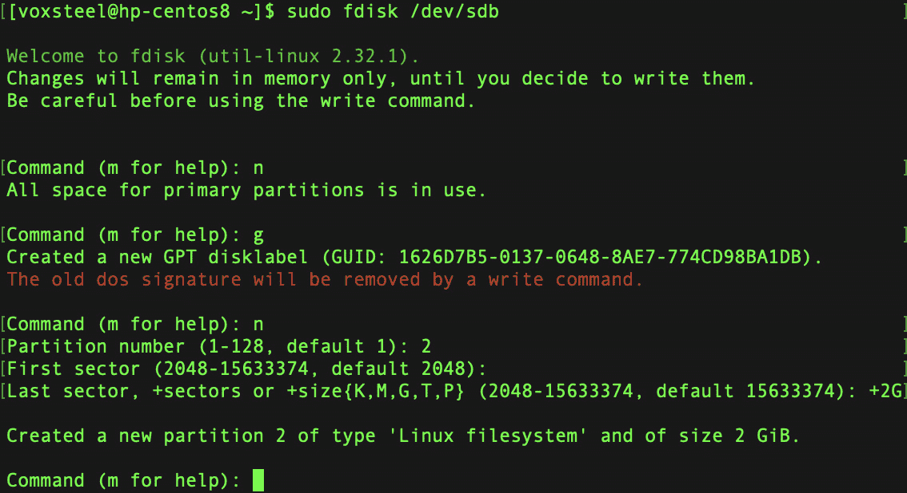

# 存储管理

感觉我们的服务器永远不会有足够的空间来存储所有需要存储的内容。尽管硬盘的存储容量不断增加，高容量硬盘如今比以往任何时候都更加实惠，但我们的服务器很快就会填满所有可用空间。作为服务器管理员，我们最好的努力一直是订购尽可能多存储的机器，但现实是，即使是最精心规划的企业，最终也会用完空间。到某个时候，肯定需要为你的服务器增加额外的存储空间。然而，存储管理不仅仅是将已满的硬盘替换为空硬盘。如果你尽早开始使用**逻辑卷管理器**（**LVM**）和其他类似技术，它们可以大大简化你的工作，因此提前规划非常重要。

本章中讨论的概念，包括 LVM 本身，将使你在管理服务器时拥有更大的自由。我还将解释一些在你处理服务器上的卷和存储时非常有用的其他概念。特别是，以下主题将会涵盖：

+   在文件系统中创建新卷

+   如何格式化和分区存储设备

+   如何挂载和卸载卷

+   学习如何使用`/etc/fstab`文件

+   使用**逻辑卷** **管理器**（**LVM**）

# 添加额外的存储卷

在某些时候，可能需要额外的服务器存储空间。通过安装更多的硬盘，可以扩展服务器的容量，这可以在独立机器上进行，或者通过使用云计算来实现。不管其名称是什么，在我们能够使用额外空间之前，我们需要弄清楚如何格式化和挂载设备。

使用 LVM（我们将在本章后面讲到），我们可以轻松地向现有卷中添加空间而不需要重新启动服务器。然而，在引入新设备时，必须遵循一套总体流程。以下是在升级系统存储容量时需要考虑的几个事项：

+   **你能告诉我你需要多少空间吗？** 如果你的虚拟化环境的存储池中有足够的空闲空间，你可以创建任何大小的虚拟磁盘。

+   `/dev/sdb1`、`/dev/sdb2`）。

+   **你希望为设备选择什么格式？** 目前，ext4 是最广泛使用的文件系统。然而，根据不同任务（例如 XFS），你可能会做出其他选择。如果不确定，请使用 ext4，但也可以研究其他选择，看看是否有更适合你的需求的文件系统。ZFS 是一个额外的选择；然而，它比许多其他文件系统更新。你可能已经知道这一点，但新手 Linux 用户可能会对 *文件系统* 这个术语感到困惑，因为它在不同的情境下有不同的含义。当讨论正常 Linux 系统的文件和目录结构时，我们 Linux 管理员通常使用 *文件系统* 这个术语。另一方面，这个术语也可以指代与发行版兼容的磁盘格式（例如 ext4 文件系统）。

+   **你希望将它挂载在哪里？** 由于新磁盘必须能够被系统以及可能的用户访问，因此你必须将它挂载（连接）到文件系统中的某个目录，用户或应用程序可以从该目录访问它。在本章中，我们还会介绍 LVM，通常情况下，你会希望将它添加到现有的存储组中。新的卷可以与任何你喜欢的目录一起使用，但我将在 *格式化和分区存储设备* 章节中介绍一些典型的目录。在 *挂载和卸载卷* 章节中，我们将详细讨论挂载和卸载过程。

让我们思考一下前两个问题的答案。为了确定你应该实施多少额外空间，你需要分析你的程序或公司的需求。对于实际的磁盘，你的选择仅限于购买哪种磁盘。使用虚拟磁盘时，你可以通过添加一个较小的磁盘来节省成本，以满足需求（你以后可以随时添加更多磁盘）。使用 LVM 与虚拟磁盘的主要优势是能够在不重启服务器的情况下增加文件系统的大小。如果你有一个 50 GB 的卷，并且希望将它做大，你可以创建两个 10 GB 的虚拟磁盘，并通过这种方式扩展它。

虽然 LVM 并不限于虚拟服务器，但它也可以用于物理服务器；然而，这样做可能需要重启，因为你需要打开机箱并物理连接硬盘。某些服务器可以添加或移除物理硬盘的功能称为 `fdisk -l`，你可以在终端中输入该命令。我们可以使用 `fdisk` 命令来查看新磁盘的名称，`fdisk` 更常用于创建和删除分区。如果你以 `root` 用户身份或使用 `sudo` 运行 `fdisk -l` 命令，你将获得以下详细信息：

```
sudo fdisk -l
```


图 10.1 – 列出所有磁盘

现在我们已经学会了如何列出所有磁盘，接下来我们将学习如何格式化和分区存储设备。

# 格式化和分区存储设备

磁盘必须在使用前进行格式化。找到设备的名称对于格式化正确的磁盘是必要的。如果你阅读了上一节，你就会知道 Linux 发行版中的驱动器遵循预定的命名约定。因此，你应该熟悉新磁盘的设备名称。你可以使用`sudo fdisk -l`命令查看连接到服务器的存储设备信息，如前所述：

```
sudo fdisk -l
```


图 10.2 – 列出所有磁盘

`/dev/sdb`设备是我新安装到服务器上的（见*图 10.2*）。我将在本章的练习中使用它。目前，它尚未分区。此时，很明显，在前面的例子中提到的存储设备`/dev/sdb`是全新的。为了避免丢失数据，我们必须小心，绝对不能格式化或重新分区错误的设备。由于`/dev/sdb`上没有任何分区（因为在我添加它之前这个磁盘并不存在），显然这是我们应该操作的磁盘。在此时，可以在其上创建一个或多个分区，距离实际使用它又近了一步。

使用带有`sudo`和设备名称选项的`fdisk`命令，我们可以对驱动器进行分区。以下是我用来访问磁盘`/dev/sdb`的命令：

```
sudo fdisk /dev/sdb
```

你会看到我没有指定分区号，因为`fdisk`直接操作磁盘（而且我们还没有创建任何分区）。在本节中，我将假设你可以访问一个尚未分区或完全可以擦除的驱动器。成功执行后，`fdisk`将显示一个介绍性消息并提示你操作。

要查看可用命令的列表，可以按键盘上的`m`键，如以下截图所示：


图 10.3 – `fdisk`的帮助菜单

在这里，我将演示创建新磁盘所需的步骤。需要了解的是，`fdisk`可能会对你的系统造成严重损害。在错误的硬盘上使用`fdisk`可能导致永久性数据丢失。管理员通常会熟练地使用像`fdisk`这样的工具，以至于使用它们变成了第二天性；然而，在执行任何此类指令之前，请再次检查你是否确实在操作正确的磁盘。分区表有两种类型 —— `fdisk`。使用 MBR 分区表时有一些限制。首先，MBR 限制最多只能有四个主分区。它还将磁盘使用限制为约 2 TB。如果你的磁盘小于 2 TB，应该没有问题，但大于 2 TB 的磁盘越来越常见。然而，GPT 并没有限制分区大小，因此，如果你有一个多 TB 大小的磁盘，那么 MBR 和 GPT 之间的选择已经为你决定了。此外，`fdisk`与 GPT 分区表一起使用时，允许你构建最多 128 个主分区。以下命令给出了如何操作特定硬盘`/dev/sdb`的选项：



图 10.4 – 创建新分区

我使用了 GPT，因此我输入了`g`：


图 10.5 – 创建新的 GPT 分区表

别忘了输入`w`以保存更改。

如果你犯了错误，可以再次运行`fdisk`。再次输入`fdisk`提示符后，如果你犯了错误或只是想重新开始，可以通过按`g`构建一个新的 GPT 布局，或者输入`o`来创建一个新的 MBR 布局。磁盘分区是一个两步过程，因此你需要重复之前的步骤。你可以自己多次尝试，直到掌握为止。

现在，使用`fdisk -l /dev/sdb`，我们可以看到有一个新分区`/dev/sdb2`，如下面的截图所示：


图 10.6 – 列出`/dev/sdb`硬盘的分区

既然我们已经学习了如何创建新分区，接下来我们将看到如何格式化它。

# 格式化新创建的分区

一旦你完成了磁盘分区的设计并对其满意，你的新分区就可以被格式化了。由于我已经分区了新硬盘，`sudo fdisk -l`的结果将会有所不同。

新分区`/dev/sdb2`已经创建，并反映在输出中。此时我们可以继续进行格式化操作。`mkfs`命令用于创建文件系统。为了执行此操作，必须使用正确的语法，即输入`mkfs`，后跟一个句点（`.`），然后是你希望创建的文件系统的名称。以这个代码为例，我们可以通过运行`sudo mkfs.ext4 /dev/sdb2`命令将`/dev/sdb2`格式化为`ext4`：


图 10.7 – 格式化分区

记得格式化分区，否则它将无法使用。

# 挂载和卸载卷

在服务器上添加和格式化新的存储卷之后的下一步是挂载设备。`mount` 命令完成了这个任务。通过这个命令，你可以将一个可移动驱动器（或网络共享）连接到服务器硬盘上的一个目录。挂载需要一个干净的目录。为了挂载设备，你必须使用 `mount` 命令指定一个挂载目录，我们稍后将通过一个示例来实践这个过程。挂载额外存储非常简单，只需执行 `mount` 命令并选择一个当前未挂载或没有数据的目录。`mount` 命令通常需要 root 权限才能执行。然而，在大多数情况下，只有 root 用户应该挂载卷（尽管也有一种解决方法可以允许普通用户挂载卷；我们暂时不讨论这个问题）。由于需要一个目录来挂载这些卷，接下来我将展示如何使用以下命令创建一个名为 `/usbpartition` 的目录：

```
sudo mkdir /usbpartition
sudo mount /dev/sdb2 /usbpartition
```

使用前面的命令，我将 `/dev/sdb2` 设备挂载到 `/usbpartition` 目录作为示例。显然，你需要将 `/dev/sdb2` 和 `/usbpartition` 替换为你自己选择的设备和目录。挂载通常需要 `-t` 选项来指定设备类型，但如果你忘记了服务器上安装了哪些设备，可以使用 `fdisk -l` 命令作为一个方便的提醒。由于我的磁盘是 ext4 格式化的，我应该使用以下带 `-t` 选项的 `mount` 命令：

```
sudo mount /dev/sdb2 -t ext4 /usbpartition
```

要检查是否正确挂载，可以使用以下命令：

```
mount –v | grep usbpartition
```

如果你已经完成了与某个卷的操作，可以使用 `umount` 命令卸载它（`unmount` 中的 *n* 被故意省略）：

```
umount /usbpartition
```

使用 `umount` 命令可以将存储设备从文件系统中移除，执行此命令也要求你以 root 用户身份登录或使用 `sudo`。为了让此命令生效，卷必须先关闭。如果出现设备或资源忙碌的错误消息，那就说明卷仍在使用中。卸载之后，你可以通过运行 `df -h` 命令来验证文件系统是否已经不再挂载，并且可以注意到它不再返回任何结果。当设备是手动挂载时，服务器重启时它们会自动卸载。接下来的部分我将展示如何更新 `/etc/fstab` 文件，以便在服务器启动时自动挂载该卷。

## 更新 `/etc/fstab` 文件

一个重要的 Linux 系统文件是 `/etc/fstab` 文件。你可以通过编辑此文件在启动时手动挂载额外的卷。然而，这个文件的主要功能是挂载你的主文件系统，因此在修改它时，任何错误都会导致服务器无法启动（完全无法启动）。因此需要非常小心。

根文件系统的位置是通过读取`/etc/fstab`文件来确定的，该文件在系统启动时被读取。此文件还用于确定交换分区的位置，并在启动时进行挂载。系统将按顺序读取并挂载该文件中的每个挂载点。该文件可以用于自动挂载几乎任何类型的存储设备。你甚至可以安装 Windows 服务器网络共享。换句话说，它没有道德观，不会做出判断（除非你打错了字）。

这是一个`/etc/fstab`文件的示例：


图 10.8 – `/etc/fstab`文件示例

编辑此文件时需要小心，因为不正确的设置可能导致系统无法启动或造成数据丢失。建议在进行任何更改之前备份该文件。

## 编辑`/etc/fstab`文件

正如我们之前提到的，任何手动挂载的设备在重启后不会自动挂载。

为了实现自动挂载，必须将设备添加到`/etc/fstab`文件中。

我在`/etc/fstab`文件中添加了一条记录，以便在启动时自动挂载`/dev/sdb2`到`/usbpartition/`，如下图所示：


图 10.9 – `/etc/fstab`文件示例

在我的机器上，第五列和第六列都为`0`，表示转储成功并且通过了检查。几乎总是设置为`0`，转储分区可以被备份程序检查，以查看文件系统是否需要备份（`0`表示不需要，`1`表示需要）。由于现在几乎没有人再使用这个功能，通常可以将其保留为`0`。文件系统会按照“通过”字段中指定的顺序进行检查。在系统崩溃或例行维护过程中，`fsck`工具会检查磁盘是否有文件系统问题。值可以是`0`或`1`。设置为`0`时，`fsck`将永远不会检查该分区。如果值为`1`，则会在其他任何操作之前检查该分区。

默认情况下，只有根用户可以修改`/etc/fstab`文件，因此在编辑时需要小心。错误修改此文件可能会导致系统启动过程或数据完整性出现严重问题。

# 使用 LVM

随着时间的推移，您所在组织的需求将不断发展。作为服务器管理员，我们不断努力在设置资源时考虑未来的扩展需求。不幸的是，预算限制和政策变动经常成为障碍。从长远来看，您会发现 LVM 是不可或缺的。Linux 在可扩展性和云部署方面的优势，归功于像 LVM 这样的技术。通过使用 LVM，您可以在不重新启动服务器的情况下扩展或收缩文件系统。考虑以下情境：假设您有一个关键任务应用程序在虚拟化的生产服务器上运行。可能在最初设置服务器时，您为该应用程序的数据目录分配了 300GB 的空间，认为它永远不会扩展到这么大的空间。随着公司发展，您的空间需求不仅增加了，还带来了危机。那么，您该怎么办？如果服务器最初配置为使用 LVM，那么添加一个新的存储卷，将其包含在 LVM 池中，并扩展分区，将无需重新启动。然而，如果没有 LVM，您就得为服务器安排停机时间，以便用传统方式添加更多存储，这可能需要几个小时。即便您的服务器不是虚拟化的，您仍然可以通过安装更多硬盘并将其保持待机状态来在线扩展文件系统，而无需使用它们。此外，如果服务器支持热插拔，您可以添加更多卷而不必关闭服务器。正因如此，我无法过分强调，在虚拟服务器的存储卷上尽可能使用 LVM 的重要性。再说一次，LVM 对于虚拟服务器上存储卷的设置至关重要。如果不使用，您将不得不花费周末的时间来添加磁盘，因为您在工作日已经耗尽了空间。

# LVM 入门

Linux 的服务器安装程序允许你选择 LVM 作为全新服务器设置的卷管理器。然而，LVM 应该广泛用于存储卷，尤其是那些将容纳用户和应用程序数据的卷。如果你希望 Ubuntu 服务器的根文件系统能够利用 LVM 的功能，LVM 是一个不错的选择。在开始使用 LVM 之前，我们需要牢牢掌握卷组、物理卷和逻辑卷的概念。你打算与 LVM 解决方案一起使用的逻辑卷和物理卷会被组织到卷组中。简而言之，卷组是整个 LVM 架构的总称。你可以将它视为一个容器，用于存放磁盘。例如，`vg-accounting`卷组就是这种类型的一个示例。会计部门会使用这个卷组来存储他们的记录。它将包括实际的磁盘空间和这些用户将访问的虚拟磁盘空间。值得注意的是，你不必局限于使用单一卷组，而可以创建多个卷组，每个卷组都有自己的磁盘和卷。物理卷是属于卷组的磁盘，可以是真实的，也可以是虚拟的。一个`vg-accounting`卷组理论上可以有三个 500GB 的硬盘，每个硬盘都会被视为物理卷。请记住，尽管这些磁盘是虚拟的，但在 LVM 的上下文中，它们仍然被称为物理卷。物理卷是属于卷组的存储设备。最后，逻辑卷的概念类似于分区。与传统的分区不同，逻辑卷可以跨越多个物理磁盘。例如，逻辑卷可以通过三个 500GB 的磁盘来设置，总共可以获得 1500GB 的存储空间。当它被挂载时，它就像一个普通硬盘上的分区一样工作，使用户能够像使用任何其他磁盘一样轻松地保存和访问文件。当卷的空间用尽时，你可以通过添加新磁盘并扩展分区来扩展它。尽管它实际上可能由多个硬盘组成，但对用户来说，它将显示为一个单一的统一空间。物理卷可以按照任何对你有意义的方式进行细分。用户将与逻辑卷进行交互，而这些逻辑卷是由底层的物理卷创建的。

在尚未使用 LVM 的服务器上安装 LVM 需要至少一个未使用的卷和必要的软件包，而这些软件包可能已经或未安装在服务器上。以下命令将告诉你服务器上是否已安装所需的`lvm2`软件包：

对于 Debian，请使用以下命令：

```
sudo apt search lvm2 | grep installed
```

对于 Redhat，请使用以下命令：

```
sudo yum list installed|grep lvm2
```

下一步是统计我们所有的磁盘。我们已经多次使用 `fdisk -l` 命令来显示这些磁盘的列表。例如，我的服务器现在有 `/dev/sdc`。磁盘名称会根据硬件或虚拟化平台的不同而有所不同，因此你需要调整以下命令，以适应你的配置。首先，我们必须通过创建物理卷来准备每个磁盘以供 LVM 使用。需要记住的是，设置 LVM 并不包括格式化存储设备或使用 `fdisk` 配置它。在这种情况下，格式化会在稍后进行。为了开始将我们的磁盘配置为 LVM 使用，我们将使用 `pvcreate` 命令。因此，我们必须对每个计划使用的磁盘执行 `pvcreate` 命令。为了用我的 USB 磁盘设置 LVM，我将执行以下操作：

```
sudo pvcreate /dev/sdc
```

如果你想检查一切是否正确配置，可以通过以 root 身份或使用 `sudo` 运行 `pvdisplay` 命令查看服务器的物理卷列表：


图 10.10 – pvdisplay 命令输出

由于这一页只能显示一个卷，因此截图中仅显示了这个卷。如果你向上滚动，将会看到更多来自 `pvdisplay` 命令的输出。我们有几个物理卷可用，但其中没有任何一个被放入卷组中。事实上，我们甚至还没有做一件简单的事情，那就是创建一个卷组。通过使用 `vgcreate` 命令，我们可以创建一个卷组，给它命名，并将我们的第一个磁盘添加到其中：

```
sudo vgcreate vg-packt /dev/sdc
```

此时，我正在创建一个名为 `vg-packt` 的卷组，并将创建的一个物理卷（`/dev/sdc`）分配给它。通过 `sudo vgdisplay` 命令，我们可以查看卷组的配置，包括它使用的磁盘数量（此时应该是 1）：

现在，唯一需要做的就是创建一个逻辑卷并进行格式化。我们为卷组分配的磁盘空间可以全部使用，或者部分使用。以下是我将用于将新添加的虚拟磁盘在卷组中分区为一个 5 GB 逻辑卷的命令：

```
sudo lvcreate -n packtvol1 -L 5g vg-packt
```

虽然命令看起来很复杂，实际上它非常简单。为了清晰起见，我在这个示例中使用 `-n` 选项给我的逻辑卷命名为 `packtvol1`。我使用 `-L` 选项后跟 `5g` 来指定只分配 5 GB 的空间。该逻辑卷所属的卷组作为最后一项列出。要查看该卷的详细信息，可以使用 `sudo` `lvdisplay` 命令：


图 10.11 – lvdisplay 命令输出

到目前为止，我们已经拥有了设置 LVM 所需的一切。像非 LVM 磁盘一样，在使用之前，我们必须格式化卷。

## 创建逻辑磁盘的格式

下一步是使用正确的格式来设置我们的逻辑卷。但是，为了确保格式化过程顺利进行，我们必须始终知道设备的名称。由于 LVM 的存在，这变得非常简单。你可以在输出中看到这一点（它位于*图 10.11*中的第三行，`lvdisplay`命令下提供）。让我们使用`ext4`文件系统来设置磁盘：

```
sudo mkfs.ext4 /dev/vg-packt/packtvol1
```

最后，这个存储设备可以像任何其他硬盘一样使用。我的将被挂载在`/mnt/lvm/packtvol1`，但你可以使用任何你喜欢的路径：

```
sudo mount /dev/vg-packt/packtvol1 /mnt/lvm/packtvol1
```

我们可以运行`df -h`来验证卷是否已挂载并显示正确的大小。在我们当前的 LVM 配置中，这没什么意义。我分配的 5 GB 可能不会持续太久，但我们有一些未使用的空间，可以好好利用：

```
~$ df –h | grep packtvol1
/dev/mapper/vg--packt-packtvol1   4.9GB   20M.  4.6GB  1%   /mnt/lvm/packtvol1
```

以下`lvextend`命令允许我扩展逻辑卷，以填充物理磁盘上的剩余空间：

```
sudo lvextend -n /dev/vg-packt/packtvol1 -l +100%FREE
```


图 10.12 – lvextend 命令

更具体来说，前面的`+100%FREE`选项指定了我们希望将所有剩余空间分配给逻辑卷。在我的例子中，这只有 2.5 GB，因为我使用了一个 USB 驱动器作为演示。

我为我的逻辑卷指定的物理驱动器上的所有空间都被用完了。然而，要小心，因为如果我分配了多个物理卷，命令也会占用所有的空间，使得逻辑卷的大小等于所有磁盘上的空间总和。即使你不打算一直这样做，对我来说也没关系，因为我只有一个物理卷。你可以再次使用`df -h`工具来验证可用的存储空间：

```
~$ df –h | grep packtvol1
/dev/mapper/vg--packt-packtvol1   4.9GB   20M.  4.6GB  1%   /mnt/lvm/packtvol1
```

不幸的是，我们添加的额外卷空间没有反映出来。`df`仍然返回其输出中的旧卷大小。原因是，我们没有调整位于这个逻辑磁盘上的`ext4`文件系统的大小，尽管我们有一个更大的逻辑卷，并且它已经获得了所有空间。我们将使用`resize2fs`命令来完成这个操作：

```
sudo resize2fs /dev/mapper/vg--packt-packtvol1
```


图 10.13 – resize2fs 命令

现在，使用`df -h`命令，我们可以看到所有空间都已经分配完毕：

```
~$ df –h | grep packtvol1
/dev/mapper/vg--packt-packtvol1   7.3GB   23M.  6.9GB  1%   /mnt/lvm/packtvol1
```

在本节中，我们学习了如何使用逻辑卷以及如何扩展文件系统。

## 使用 LVM 删除卷

最后但同样重要的是，你可能想知道删除逻辑卷或卷组时会发生什么。`lvremove`和`vgremove`命令正是为此而设计。尽管它们具有破坏性，但如果你需要删除逻辑卷或卷组时，这些命令会非常有用。以下语法将删除任何逻辑卷：

```
sudo lvremove vg-packt/packtvol1
```

给`lvremove`命令传递你想要删除逻辑卷的卷组名称，并加上一个斜杠，这就足够了。要删除整个卷组，以下命令应该可以完成：

```
sudo vgremove vg-packt
```

即使你可能不会经常移除逻辑卷，仍然有一些命令可以帮助你在需要退役 LVM 组件时进行操作。希望你现在能理解 LVM 为何如此出色。

Linux 中的`pvremove`命令用于从 LVM 中移除**物理卷**（**PV**）。在使用此命令之前，请确保要移除的 PV 不属于任何卷组，并且不包含任何活动的逻辑卷。否则，可能会发生数据丢失。

这项技术为你提供了前所未有的对服务器上数据的控制。Linux 在云端的多样性部分归功于 LVM 的适应性。如果你不熟悉 LVM，这些概念最初可能会显得陌生。然而，借助虚拟化，试验 LVM 是非常简单的。在你感到能够熟练地创建、编辑和删除卷组及逻辑卷之前，我建议你进行一些实践。那些最初不明显的概念，通过反复接触会变得清晰。

# 总结

保持平稳运行需要仔细的存储管理，因为文件系统满了会导致服务器停止工作。幸运的是，Linux 服务器提供了丰富的存储管理功能，其中一些功能是竞争系统所羡慕的。如果没有像 LVM 这样的创新，作为 Linux 服务器管理员的工作是不可能完成的。在本章中，我们深入研究了这些资源并学习了一些存储管理技巧。我们涵盖了广泛的主题，包括如何创建和管理分区、挂载和卸载卷、使用`fstab`文件、使用 LVM 以及检查磁盘使用情况。

在下一章，我们将讨论日志配置和远程日志。

# 第三部分：Linux 作为更大系统的一部分

所有现代 IT 基础设施由多个具有不同角色的机器组成，因此所有系统管理员都需要知道如何使基于 Linux 的系统协同工作。在本书的这一部分，你将学习如何在中央服务器上收集所有这些系统的日志消息，如何通过使用集中认证机制简化用户帐户和权限管理，如何创建具有自动故障转移和负载均衡的强大服务，并使用自动化工具同时管理多个系统。你还将学习如何保持系统的安全。

本部分包含以下章节：

+   *第十一章*，*日志配置和远程日志*

+   *第十二章*，*集中认证*

+   *第十三章*，*高可用性*

+   *第十四章*，*使用 Chef 自动化*

+   *第十五章*，*安全指南和最佳实践*
