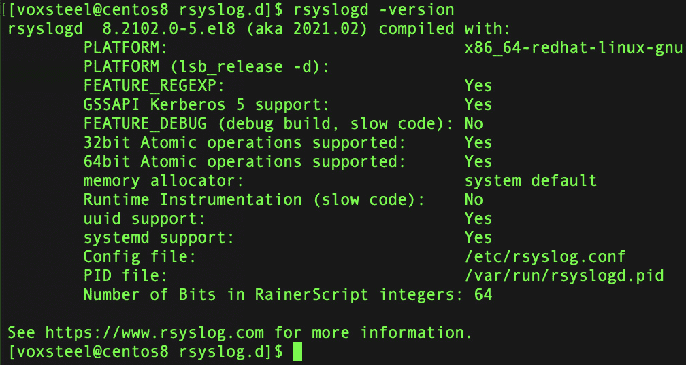
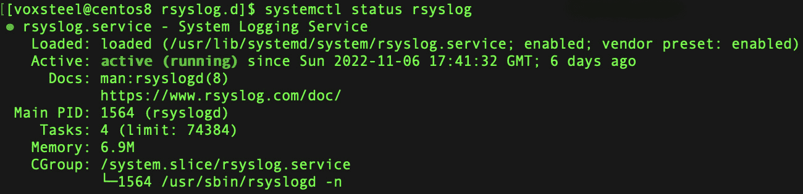
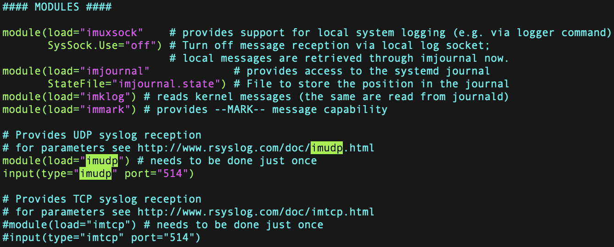
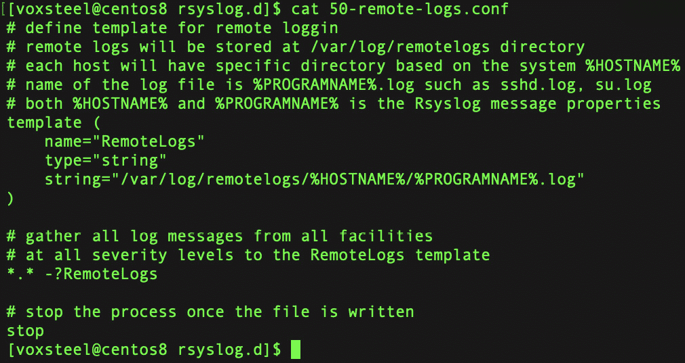
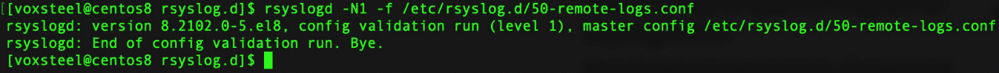
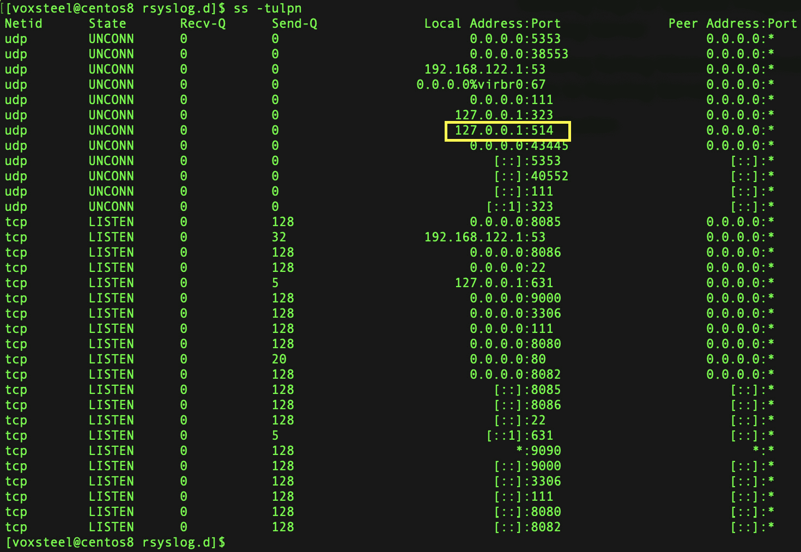
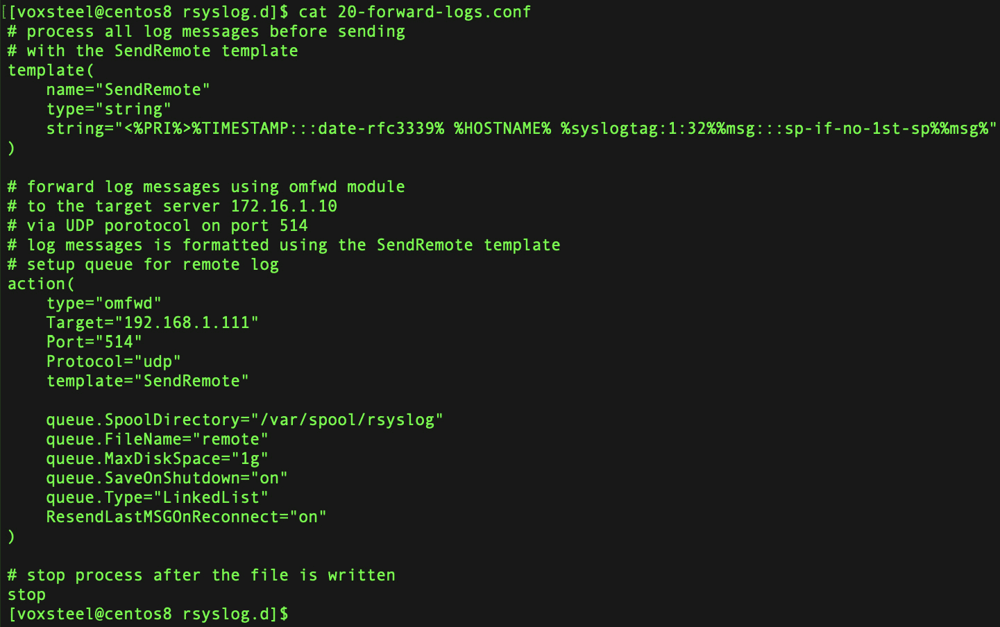

# 日志配置和远程日志记录

日志记录是任何操作系统中一个重要的方面，包括 Linux。它提供了一种收集和分析系统事件和活动的方式，这对故障排除、监控和审计目的非常有用。在本章中，我们将探索 Linux 中日志配置和远程日志记录的不同方面。

在本章中，我们将涵盖以下主题：

+   日志配置

+   日志轮换

+   Journald

+   日志转发

# 日志配置

Linux 使用 syslog 系统进行日志记录。syslog 守护进程收集来自系统不同部分的消息，并将其写入日志文件。syslog 配置文件通常位于 `/etc/syslog.conf` 或 `/etc/rsyslog.conf`，具体取决于发行版。该文件包含指定哪些消息需要记录以及将其存储在哪个位置的规则。

有一个关键参数叫做 `facility.severity`，它是 Linux 中日志配置的关键部分。它允许你控制哪些日志消息应该被记录以及它们应该存储在哪里。设施和严重性可以通过数字或符号名称来指定。例如，以下规则将所有来自 auth 设施且严重性级别为警告或更高的消息记录到 `/var/log/auth.log` 文件中：

```
auth.warning /var/log/auth.log
```

配置文件中的目标部分指定日志消息的存储位置。目标可以是一个文件、一个远程主机或一个处理消息的程序。目标的语法如下：

```
target_type(target_options)
```

目标类型可以是以下之一：

+   `file`：将消息存储在本地文件中

+   `remote`：使用 syslog 协议将消息发送到远程主机

+   `program`：将消息发送到本地程序进行处理

例如，以下规则使用 syslog 协议将所有严重性级别为错误或更高的消息发送到 IP 地址为 `192.168.1.100` 的远程主机：

```
*.err @192.168.1.100
```

修改 syslog 配置文件后，必须重新启动 syslog 守护进程才能应用更改。重启 syslog 守护进程的命令根据发行版的不同而有所不同。例如，在 Ubuntu 上，命令如下：

```
sudo service rsyslog restart
```

日志消息的主要关注点是日志数据。换句话说，日志数据是日志消息背后的解释。如果你在网站上使用了图像、文件或其他资源，托管你网站的服务器可能会跟踪这些事实。通过查看日志数据，你可以了解谁访问了某个资源——在这个例子中，就是用户的用户名。

*日志* 这个术语是指一组日志消息的缩写，这些消息可以拼凑在一起为一个事件提供上下文。

日志文件中的每一项条目大致可以分类为以下几种之一：

+   **信息**：这些消息故意含糊，旨在通知用户和管理员系统已经发生了积极的变化。例如，Cisco IOS 每次系统重启时会通知相关方。然而，需要注意的是，如果重启发生在不合适的时间，例如维护或工作时间之外，你可能需要引起关注。本书接下来的章节将教你应对这种情况所需的知识和技巧。

+   **调试**：当运行应用程序代码出现问题时，系统会发送调试信息，帮助开发人员识别和解决问题。

+   **警告**：当系统缺少或需要某些内容，但其缺失尚不足以阻止系统正常运行时，会发出警告。一些程序可能会在命令行上未收到预期的参数数量时向用户或操作员记录通知，尽管它们仍然可以正常运行。

+   **错误**：在发生错误时，计算机系统会将相关信息存储在日志中，以供稍后分析。例如，如果操作系统无法将缓冲区同步到磁盘，它可能会生成错误日志。不幸的是，许多错误信息仅提供了问题的大致概述，通常需要进一步调查才能找出问题的根源。

+   **警报**：警报的目的是引起你对一个重要事件的关注。在大多数情况下，通知来自与安全相关的设备和系统，尽管并非总是如此。所有进入网络的数据都可以通过放置在网络入口的**入侵防御系统**（**IPS**）进行检查。它检查数据包中包含的信息，以决定是否启用某个网络连接。如果检测到潜在的恶意连接，IPS 可以采取几种预定的反应方式。该行为和决策将被记录。

接下来，我们将快速浏览传输和收集日志数据的过程。然后，我们将讨论什么是日志消息。

# 日志数据是如何发送和收集的？

发送和收集日志数据很容易。Syslog 是一种用于在计算机网络中发送和收集日志数据的协议。它是一种标准协议，允许不同的设备将日志消息发送到中央日志服务器或设备。

下面是它通常如何工作的：

1.  一个设备生成日志消息。这可以是服务器、网络设备、应用程序或任何其他生成日志的设备。

1.  设备使用 syslog 协议将日志消息发送到 syslog 服务器。syslog 服务器可以位于本地或云端。

1.  syslog 服务器接收到日志消息并进行处理。它可以将日志消息存储在文件或数据库中，或者将其转发到其他系统以供进一步分析。

1.  syslog 服务器还可以对其接收到的日志消息应用过滤器和规则。例如，它可以丢弃不相关的日志消息，或者在发生严重错误时发送警报。

1.  系统管理员和分析人员可以访问存储在 syslog 服务器中的日志数据，用于故障排除、分析和报告。

以下是使用集中式日志收集器的一些优点：

+   它是您所有日志消息的集中存储库

+   日志可以存储在此处以供保存

+   这是您可以检查所有服务器日志信息的地方

日志分析对于应用程序和服务器架构的健康至关重要，但如果数据分散在多个位置，可能会变得繁琐。为什么不使用一个集中式日志本，而不是一堆独立的日志本呢？Rsyslog 可能就是您一直在寻找的解决方案。

使用集中式日志系统，您可以将所有服务器和程序的日志收集到一个集中区域。此外，本教程将帮助您通过使用 rsyslog 配置在 Linux 节点上实现集中式日志记录。

本节旨在提供一个实际示例。

# 检查所有服务器上的 rsyslog 服务

一个高性能的日志处理系统——rsyslog，已经预安装并准备好在 Debian 和 RHEL 系统上使用。

rsyslog 改进了 syslog 协议，提供了更多现代化和可靠的功能。这些额外功能包括大量的输入和输出、模块化设计以及卓越的过滤能力。

截至本文编写时，rsyslog 的最新版本是 v8.2112.0。因此，您将验证 rsyslog 服务的状态以及安装在计算机上的 rsyslog 版本。这将确保 rsyslog 正在以其最新版本运行。

打开命令提示符，并使用以下`sudo su`命令获取所有服务器的控制权限。当系统提示时，输入您的密码。

在以下截图中，您会发现 Centos 8 默认安装了 rsyslog v8.2102.0：



图 11.1 – 检查 rsyslog 版本

通过运行`systemctl status` `rsyslog`命令来检查 rsyslog 服务的状态：



图 11.2 – 检查 rsyslog 服务状态

如您所见，服务处于活动状态并正在运行。

要检查多个服务器上的 rsyslog 服务状态，您可以使用配置管理工具，如 Ansible，或者编写一个简单的 bash 脚本来自动化该过程。以下是如何使用 bash 脚本检查所有服务器上 rsyslog 服务的示例：

1.  创建一个名为`servers.txt`的文件，并将要检查的服务器列表逐行添加进去：

    ```
    server1.example.com
    ```

    ```
    server2.example.com
    ```

    ```
    server3.example.com
    ```

1.  创建一个新的 bash 脚本，命名为`check_rsyslog_service.sh`，并添加以下代码：

    ```
    #!/bin/bash
    ```

    ```
    while read server;
    ```

    ```
    do
    ```

    ```
    echo "Checking rsyslog service on $server"
    ```

    ```
    ssh $server "systemctl status rsyslog" ; done < servers.txt
    ```

1.  使脚本可执行：

    ```
    chmod +x check_rsyslog_service.sh
    ```

1.  运行脚本：

    ```
    ./check_rsyslog_service.sh
    ```

脚本将遍历 `servers.txt` 中的服务器列表，并通过 SSH 执行 `systemctl status rsyslog` 命令来检查每台服务器上 rsyslog 服务的状态。输出结果将在终端中显示。你可以修改脚本，在服务器上执行其他操作，比如重启 rsyslog 服务或更新 rsyslog 配置。

# 配置 rsyslog 进行集中日志记录

在你将 rsyslog 更新到最新版本后，可以设置使用 `central-rsyslog` 服务器进行集中式日志记录。

集中日志记录设置是通过启用 rsyslog UDP 输入模块 `imudp` 并构建 rsyslog 模板来接收来自其他服务器的日志消息来创建的。`imudp` 输入模块允许通过 UDP 广播 syslog 消息，供 `central-rsyslog` 服务器接收。

在保存文件并关闭编辑器之前，请在 `/etc/rsyslog.conf`（rsyslog 配置文件）中启用以下截图所示的选项。

`imudp` 输入模块需要配置为使用默认的 UDP 端口 `514` 才能正常工作：



图 11.3 – imudp 模块配置

然后，创建一个新的 rsyslog 模板（`/etc/rsyslog.d/50-remote-logs.conf`），并粘贴在*图 11.4*中指示的配置。

以下 rsyslog 模板将允许你从其他服务器收集日志，并将其存储在 `main-rsyslog` 服务器上的 `/var/log/remotelogs/` 目录中：



图 11.4 – 模板配置

要建立一个新的日志目录（`/var/log/remotelogs/`），并将其归 root 用户和 `adm` 组所有，可以运行以下指令。这样，rsyslog 服务将能够在 `/var/log/remotelogs` 文件夹中创建日志：

```
mkdir -p /var/log/remotelogs
```

然后，更改 `remotelogs` 文件夹的所有权：

```
chown -R root:adm /var/log/remotelogs/
```

要检查 rsyslog 设置（`/etc/rsyslog.conf` 和 `/etc/rsyslog.d/50-remote-logs.conf`），只需执行这里提供的 `rsyslogd` 命令：



图 11.5 – 检查语法

在仔细检查设置后，你可以使用以下命令重启 rsyslog 服务：

```
systemctl restart rsyslog
```

启用了 `imudp` 输入模块的 rsyslog 服务已暴露了 syslog 协议的默认 UDP 端口 `514`。现在，主机可以通过将日志发送到 `main-rsyslog` 服务器与其通信：

```
systemctl restart rsyslog
```

你可以通过运行以下 `ss` 命令来再次确认你的端口是否已正确打开：

```
ss -tulpn
```

这是输出结果：



图 11.6 – 查看监听端口的命令

Syslog 是一种简单高效的协议，用于在分布式网络环境中收集和管理日志数据。它提供了一个集中存储日志的位置，这使得系统管理、监控和故障排除变得更加容易。

# 向集中式 rsyslog 服务器发送日志

您已经通过在`main-rsyslog`服务器上配置 syslog，迈出了简化日志处理的第一步。但是，您如何确认`main-rsyslog`服务器正在接收日志？日志可以通过激活并配置 rsyslog 输出模块（`main-rsyslog`）从远程客户端系统发送到`main-rsyslog`服务器。

在此示例中，`client01`机器使用 rsyslog 输出模块`omfwd`，将日志传输到`main-rsyslog`服务器。

要处理消息和日志，必须安装`omfwd`模块（它应该已经安装）。该模块可以与 rsyslog 模板结合使用。最后，模块通过 rsyslog 操作对象将数据通过 UDP 和 TCP 协议传输到指定的目的地。

设置客户端机器，使其能够向`main-rsyslog`服务器提交日志。

在您喜欢的文本编辑器中创建一个新的 rsyslog 配置文件（`/etc/rsyslog.d/20-forward-logs.conf`），并输入如*图 11.7*所示的设置。

使用`SendRemote`模板，日志消息在通过 UDP 协议发送到`main-rsyslog`服务器（`192.168.1.111`）之前会先进行格式化。在这种情况下，IP 地址应该替换为您主 rsyslog 服务器的 IP 地址：



图 11.7 – SendRemote 模板

上面的截图显示了日志转发模板文件的内容。

通过运行以下命令检查语法是否正确：

```
rsyslogd -N1 -f /etc/rsyslog.d/20-remote-logs.conf
```

通过运行`sudo systemctl restart rsyslog`命令重新启动 rsyslog，并检查 syslog 服务器是否正在接收来自客户端的日志。

# 日志轮换

日志轮换是 Linux 系统中一个至关重要的过程，用于高效管理日志文件。随着应用程序和服务随着时间生成日志数据，日志文件可能会显著增长，占用磁盘空间，并可能导致性能问题。日志轮换允许定期压缩、归档和删除旧的日志文件，确保系统保持可管理的日志历史记录。

在 Linux 中，日志轮换通常由名为`logrotate`的日志轮换工具处理。`logrotate`的配置文件位于`/etc/logrotate.conf`，并且包含对`/etc/logrotate.d/`目录中单独的日志轮换配置文件的引用。

以下是如何在 Linux 中配置日志轮换的分步指南：

1.  `logrotate`是预安装的。然而，如果您的系统没有此工具，您可以使用特定于您 Linux 发行版的包管理器进行安装。例如，在基于 Debian/Ubuntu 的系统中，您可以通过以下命令进行安装：

    ```
    sudo apt-get update
    ```

    ```
    sudo apt-get install logrotate
    ```

1.  **创建日志轮换配置文件**：您可以为您的特定应用程序/服务创建一个新的日志轮换配置文件，或者使用默认的配置文件。建议为不同的应用程序创建单独的文件，以便于管理。

转到`/etc/logrotate.d/`目录并创建一个新的配置文件——例如，`myapp_logrotate`：

```
sudo nano /etc/logrotate.d/myapp_logrotate
```

1.  `logrotate`配置文件遵循特定的语法。以下是一个基本示例：

    ```
    /path/to/your/logfile.log {
    ```

    ```
    rotate <N>     # Number of log files to keep before removal
    ```

    ```
    daily          # Frequency of rotation (daily, weekly, monthly, etc.)
    ```

    ```
    missingok      # Don't throw an error if the log file is missing
    ```

    ```
    notifempty     # Do not rotate an empty log file
    ```

    ```
    compress       # Compress the rotated log files using gzip
    ```

    ```
    create <mode> <user> <group> # Create new empty log file with specified permissions, user, and group
    ```

    ```
    }
    ```

将`/path/to/your/logfile.log`替换为实际的日志文件路径。将`<N>`替换为在删除前要保留的日志文件数量（例如，`rotate 7`表示保留 7 天的日志）。将`<mode>`、`<user>`和`<group>`替换为适当的权限和新创建日志文件的所有权。

保存配置文件并退出文本编辑器。

1.  如果`logrotate`配置没有错误，可以运行以下命令：

    ```
    sudo logrotate -d /etc/logrotate.d/myapp_logrotate
    ```

`-d`标志用于调试，它将显示`logrotate`会做的事情，但不会实际旋转日志文件。

1.  **执行手动日志旋转**：一旦确认配置正确，您可以使用以下命令手动触发日志旋转：

    ```
    sudo logrotate /etc/logrotate.d/myapp_logrotate
    ```

1.  `logrotate`可以按常规间隔运行。您可以使用以下命令将条目添加到`crontab`中：

    ```
    sudo crontab -e
    ```

然后，添加以下行以在每天午夜运行`logrotate`：

```
0 0 * * * /usr/sbin/logrotate /etc/logrotate.conf
```

保存`crontab`并退出文本编辑器。

现在，您的日志文件将根据配置设置自动旋转和归档。您可以在`logrotate`配置文件中调整旋转频率和其他选项，以满足您的具体需求。

# Journald

日志是 systemd 的一部分。来自启用 systemd 的 Linux 机器各个部分的消息都会在这里收集。这包括来自内核和启动过程、syslog 以及其他服务的通知。

传统上，在 Linux 的启动过程中，操作系统的许多子系统和应用程序守护进程会将日志消息记录在文本文件中。每个子系统的消息会记录不同级别的详细信息。在故障排除时，管理员通常需要从多个文件中筛选出不同时间段的消息，并进行内容关联。日志记录功能通过集中记录所有系统和应用级消息消除了这个问题。

systemd-journald 守护进程负责日志。它从多个资源收集数据，并将收集到的消息插入到日志中。

当 systemd 使用内存中的日志时，日志文件会生成在`/run/log/journal`文件夹下。如果没有该目录，系统会创建一个。日志也可以使用持久化存储在`/var/log/journal`目录下生成；如果需要，systemd 会创建这个目录。如果此目录被销毁，日志将以非持久化方式写入`/run/log/journal`，systemd-journald 不会自动重新创建它。当守护进程重新启动时，目录会被重新创建。

`journalctl`命令对于调试服务和进程非常有用，因为它允许您查看和修改 systemd 日志。

接下来将介绍`journalctl`命令及其众多显示选项，以及如何查看 systemd 日志。由于每台机器有其独立的记录集，因此结果会有所不同。

要显示所有日志条目，使用不带任何选项的`journalctl`命令：

```
[voxsteel@centos8 ~]$ journalctl
-- Logs begin at Wed 2023-01-18 14:07:03 GMT, end at Wed 2023-01-18 14:09:39 GMT. --
Jan 18 14:07:03 centos8 kernel: microcode: microcode updated early to revision 0xd6, date = 2019-10-03Jan 18 14:07:03 centos8 kernel: Linux version 4.18.0-348.7.1.el8_5.x86_64 (mockbuild@kbuilder.bsys.centos.org) (gcc version 8.5.0 20210514 (Red Hat 8.5.0>Jan 18 14:07:03 centos8 kernel: Command line: BOOT_IMAGE=(hd1,gpt2)/vmlinuz-4.18.0-348.7.1.el8_5.x86_64 root=/dev/mapper/cl-root ro crashkernel=auto resu>Jan 18 14:07:03 centos8 kernel: x86/fpu: Supporting XSAVE feature 0x001: 'x87 floating point registers'Jan 18 14:07:03 centos8 kernel: x86/fpu: Supporting XSAVE feature 0x002: 'SSE registers'Jan 18 14:07:03 centos8 kernel: x86/fpu: Supporting XSAVE feature 0x004: 'AVX registers'Jan 18 14:07:03 centos8 kernel: x86/fpu: Supporting XSAVE feature 0x008: 'MPX bounds registers'Jan 18 14:07:03 centos8 kernel: x86/fpu: Supporting XSAVE feature 0x010: 'MPX CSR'Jan 18 14:07:03 centos8 kernel: x86/fpu: xstate_offset[2]:  576, xstate_sizes[2]:  256Jan 18 14:07:03 centos8 kernel: x86/fpu: xstate_offset[3]:  832, xstate_sizes[3]:   64Jan 18 14:07:03 centos8 kernel: x86/fpu: xstate_offset[4]:  896, xstate_sizes[4]:   64Jan 18 14:07:03 centos8 kernel: x86/fpu: Enabled xstate features 0x1f, context size is 960 bytes, using 'compacted' format.Jan 18 14:07:03 centos8 kernel: BIOS-provided physical RAM map:Jan 18 14:07:03 centos8 kernel: BIOS-e820: [mem 0x0000000000000000-0x0000000000057fff] usableJan 18 14:07:03 centos8 kernel: BIOS-e820: [mem 0x0000000000058000-0x0000000000058fff] reserveJan 18 14:07:03 centos8 kernel: BIOS-e820: [mem 0x0000000000059000-0x000000000009dfff] usableJan 18 14:07:03 centos8 kernel: BIOS-e820: [mem 0x000000000009e000-0x000000000009efff] reservedJan 18 14:07:03 centos8 kernel: BIOS-e820: [mem 0x000000000009f000-0x000000000009ffff] usableJan 18 14:07:03 centos8 kernel: BIOS-e820: [mem 0x00000000000a0000-0x00000000000fffff] reservedJan 18 14:07:03 centos8 kernel: BIOS-e820: [mem 0x0000000000100000-0x00000000c70fafff] usableJan 18 14:07:03 centos8 kernel: BIOS-e820: [mem 0x00000000c70fb000-0x00000000c7c7efff] reservedJan 18 14:07:03 centos8 kernel: BIOS-e820: [mem 0x00000000c7c7f000-0x00000000c7e7efff] ACPI NVS
```

输出显示日志数据的时间范围。列中包含以下按从左到右的顺序排列的数据：

+   日期和时间

+   主机

+   日志来源

+   日志消息

要显示与当前启动相关的日志，使用 `-b` 标签，如下所示：

```
[voxsteel@centos8 ~]$ journalctl -b
-- Logs begin at Wed 2023-01-18 14:07:03 GMT, end at Wed 2023-01-18 16:36:10 GMT. --
Jan 18 14:07:03 centos8 kernel: microcode: microcode updated early to revision 0xd6, date = 2019-10-03
Jan 18 14:07:03 centos8 kernel: Linux version 4.18.0-348.7.1.el8_5.x86_64 (mockbuild@kbuilder.bsys.centos.org) (gcc version 8.5.0 20210514 (Red Hat 8.5.0-4) (GCC)>
Jan 18 14:07:03 centos8 kernel: Command line: BOOT_IMAGE=(hd1,gpt2)/vmlinuz-4.18.0-348.7.1.el8_5.x86_64 root=/dev/mapper/cl-root ro crashkernel=auto resume=/dev/m>
Jan 18 14:07:03 centos8 kernel: x86/fpu: Supporting XSAVE feature 0x001: 'x87 floating point registers'
Jan 18 14:07:03 centos8 kernel: x86/fpu: Enabled xstate features 0x1f, context size is 960 bytes, using 'compacted' format.
Jan 18 14:07:03 centos8 kernel: BIOS-provided physical RAM map:
Jan 18 14:07:03 centos8 kernel: BIOS-e820: [mem 0x0000000000000000-0x0000000000057fff] usable
Jan 18 14:07:03 centos8 kernel: BIOS-e820: [mem 0x0000000000058000-0x0000000000058fff] reserved
Jan 18 14:07:03 centos8 kernel: BIOS-e820: [mem 0x00000000c7eff000-0x00000000c7efffff] usable
Jan 18 14:07:03 centos8 kernel: BIOS-e820: [mem 0x00000000c7f00000-0x00000000cc7fffff] reserved
```

如果你想查看过去 10 分钟内的日志，例如，可以使用 `journalctl -S "10` `minutes ago"`：

```
[voxsteel@centos8 ~]$ journalctl -S "10 minutes ago"
-- Logs begin at Wed 2023-01-18 14:07:03 GMT, end at Wed 2023-01-18 16:38:00 GMT. --
Jan 18 16:31:49 centos8 systemd[1]: run-docker-runtime\x2drunc-moby-586ec0d1511775a767ac92e0bc680e5ca772a18e59e31f9e358f9632834faede-runc.ucvxT5.mount: Succeeded.
Jan 18 16:32:54 centos8 dbus-daemon[1048]: [system] Activating service name='org.fedoraproject.Setroubleshootd' requested by ':1.30' (uid=0 pid=987 comm="/usr/sbi>
Jan 18 16:32:54 centos8 dbus-daemon[1048]: [system] Successfully activated service 'org.fedoraproject.Setroubleshootd'
Jan 18 16:32:55 centos8 setroubleshoot[45450]: AnalyzeThread.run(): Cancel pending alarm
Jan 18 16:32:55 centos8 dbus-daemon[1048]: [system] Activating service name='org.fedoraproject.SetroubleshootPrivileged' requested by ':1.1032' (uid=978 pid=45450>
Jan 18 16:32:56 centos8 dbus-daemon[1048]: [system] Successfully activated service 'org.fedoraproject.SetroubleshootPrivileged'
Jan 18 16:32:57 centos8 setroubleshoot[45450]: SELinux is preventing /usr/sbin/haproxy from name_connect access on the tcp_socket port 8082\. For complete SELinux >
Jan 18 16:32:57 centos8 setroubleshoot[45450]: SELinux is preventing /usr/sbin/haproxy from name_connect access on the tcp_socket port 8082.
```

如果你只想显示内核日志消息，可以使用 `-k` 选项，如下所示：

```
[voxsteel@centos8 ~]$ journalctl -k
-- Logs begin at Wed 2023-01-18 14:07:03 GMT, end at Wed 2023-01-18 16:46:01 GMT. --
Jan 18 14:07:03 centos8 kernel: microcode: microcode updated early to revision 0xd6, date = 2019-10-03
Jan 18 14:07:03 centos8 kernel: Linux version 4.18.0-348.7.1.el8_5.x86_64 (mockbuild@kbuilder.bsys.centos.org) (gcc version 8.5.0 20210514 (Red Hat 8.5.0-4) (GCC)>
Jan 18 14:07:03 centos8 kernel: Command line: BOOT_IMAGE=(hd1,gpt2)/vmlinuz-4.18.0-348.7.1.el8_5.x86_64 root=/dev/mapper/cl-root ro crashkernel=auto resume=/dev/m>
Jan 18 14:07:03 centos8 kernel: x86/fpu: Supporting XSAVE feature 0x001: 'x87 floating point registers'
Jan 18 14:07:03 centos8 kernel: x86/fpu: Supporting XSAVE feature 0x002: 'SSE registers'
Jan 18 14:07:03 centos8 kernel: x86/fpu: Supporting XSAVE feature 0x004: 'AVX registers'
```

你还可以使用以下命令根据优先级过滤日志消息：

```
journalctl -p <number or text priority>
```

以下是优先级级别：

+   `0` 或 `emerg`

+   `1` 或 `alert`

+   `2` 或 `crit`

+   `3` 或 `err`

+   `4` 或 `warning`

+   `5` 或 `notice`

+   `6` 或 `info`

+   `7` 或 `debug`

你可以使用 `man` `journalctl` 命令查找所有可用的 `journalctl` 参数。

# DMESG

**dmesg** 是 Linux 中的一个命令行工具，允许你查看内核环形缓冲区的消息。内核环形缓冲区是内存中的一个循环缓冲区，存储内核生成的消息，如硬件事件、设备驱动程序信息和系统错误消息。

`dmesg` 命令显示这个内核环形缓冲区的内容，允许你查看自系统上次启动以来生成的消息。这些消息对于调试系统问题、识别硬件问题和监控系统事件非常有用。

`dmesg` 的一些常见用例包括以下内容：

+   `dmesg` 可用于通过显示错误消息、警告和其他相关信息来识别和诊断系统问题。

+   `dmesg` 可以提供关于硬件设备和驱动程序的信息，例如设备何时被检测到或驱动程序加载失败时的情况。

+   `dmesg` 可用于监控系统事件，例如当用户插入 USB 设备或系统服务启动或停止时。

下面是一些常用选项，可与 `dmesg` 命令一起使用：

+   `-T`：以人类可读格式显示时间戳。

+   `-H`：以更易读的格式显示输出。

+   `-l level`：仅显示指定日志级别（`debug`、`info`、`notice`、`warning`、`err`、`crit`、`alert` 或 `emerg`）的消息。

+   `-k`：仅显示内核消息。

总体而言，`dmesg` 是一个强大的工具，可以帮助你排查系统问题并监控 Linux 系统中的事件。

`dmesg` 命令提供了一个观察 Linux 内部工作情况的窗口。这个 *故障排查者的朋友* 允许你读取和观察从内核的硬件设备和驱动程序发送的消息，这些消息来自内核的内部环形缓冲区。

# 理解 Linux 中的环形缓冲区

当计算机开机时，会按特定顺序发生多个事件；在 Linux 和类 Unix 系统中，这些活动分别被称为引导和启动。

在系统初始化（BIOS 或 UEFI、MBR 和 GRUB）完成后，内核被加载到内存中，初始内存磁盘（initrd 或 initramfs）与内核连接，并启动 systemd。

操作系统被交给启动程序，这些程序完成设置。当系统首次启动时，可能需要一段时间才能使日志守护进程（如 syslogd 和 rsyslogd）开始工作。内核有一个环形缓冲区，用作消息缓存，以确保在初始化阶段产生的关键错误消息和警告不会丢失。

环形缓冲区是一个特殊的内存区域，用于存储消息。它具有固定的大小和简单的结构。当缓冲区达到容量时，新的消息会替换掉旧的消息。它可以被概念化为*环形缓冲区*。

如设备驱动初始化消息、硬件消息和内核模块消息等信息都会保存在内核环形缓冲区中。环形缓冲区是开始故障排除硬件问题或其他启动问题的一个便捷位置，因为它存储着这些低级别的消息。

使用 `dmesg` 命令，你可以检查系统环形缓冲区中保存的消息日志：

```
dmesg -T | less
```

我添加了 `-T` 以以可读的格式显示时间戳，并使用 `less` 使其可滚动。

以下是前述命令的输出：

```
[Fri Jan 20 08:12:36 2023] wlp2s0: associate with d4:5d:64:e1:e0:2c (try 1/3)
[Fri Jan 20 08:12:36 2023] wlp2s0: RX AssocResp from d4:5d:64:e1:e0:2c (capab=0x1011 status=0 aid=5)
[Fri Jan 20 08:12:36 2023] wlp2s0: associated
[Fri Jan 20 08:12:36 2023] wlp2s0: Limiting TX power to 23 (23 - 0) dBm as advertised by d4:5d:64:e1:e0:2c
[Fri Jan 20 15:08:39 2023] atkbd serio0: Unknown key pressed (translated set 2, code 0x85 on isa0060/serio0).
[Fri Jan 20 15:08:39 2023] atkbd serio0: Use 'setkeycodes e005 <keycode>' to make it known.
[Mon Jan 23 06:27:58 2023] wlp2s0: deauthenticating from d4:5d:64:e1:e0:2c by local choice (Reason: 2=PREV_AUTH_NOT_VALID)
[Mon Jan 23 06:27:59 2023] wlp2s0: authenticate with d4:5d:64:e1:e0:2c
[Mon Jan 23 06:27:59 2023] wlp2s0: send auth to d4:5d:64:e1:e0:2c (try 1/3)
[Mon Jan 23 06:27:59 2023] wlp2s0: authenticated
[Mon Jan 23 06:27:59 2023] wlp2s0: associate with d4:5d:64:e1:e0:2c (try 1/3)
[Mon Jan 23 06:27:59 2023] wlp2s0: RX AssocResp from d4:5d:64:e1:e0:2c (capab=0x1011 status=0 aid=5)
[Mon Jan 23 06:27:59 2023] wlp2s0: associated
[Mon Jan 23 06:27:59 2023] wlp2s0: Limiting TX power to 23 (23 - 0) dBm as advertised by d4:5d:64:e1:e0:2cresume=/dev/mapper/cl-swap rd.lvm.lv=cl/root rd.lvm.lv=cl/swap rhgb quiet
[Wed Jan 18 14:06:39 2023] x86/fpu: Supporting XSAVE feature 0x001: 'x87 floating point registers'
```

`dmesg --follow` 命令是 `dmesg` 命令的一种变体，它会持续显示在内核环形缓冲区中生成的新消息。

当你在终端中运行 `dmesg --follow` 时，它将显示最近的内核消息，并继续实时显示任何新生成的消息。这对于监控系统事件的发生或诊断实时发生的问题非常有用。

`--follow` 选项等同于 `-w` 或 `--wait` 选项，它告诉 `dmesg` 等待将新消息添加到内核环形缓冲区，并在消息到达时显示它们。

下面是 `dmesg --follow` 命令的一些用例：

+   `dmesg --follow` 用于监控在插拔设备时或与硬件交互时产生的内核消息。

+   `dmesg --follow` 可以帮助你实时了解发生了什么，并识别可能导致问题的模式或问题。

+   `dmesg --follow` 用于监视在内核环形缓冲区中可能生成的任何错误消息或警告。

值得注意的是，因为 `dmesg --follow` 会持续显示新消息，输出可能很快变得压倒性，难以阅读。要停止 `dmesg` 命令的运行，你可以在终端中按 *Ctrl* + *C*：

```
dmesg –follow
[151557.551942] wlp2s0: Limiting TX power to 23 (23 - 0) dBm as advertised by d4:5d:64:e1:e0:2c
[176520.971449] atkbd serio0: Unknown key pressed (translated set 2, code 0x85 on isa0060/serio0).
[176520.971452] atkbd serio0: Use 'setkeycodes e005 <keycode>' to make it known.
[404479.355923] wlp2s0: deauthenticating from d4:5d:64:e1:e0:2c by local choice (Reason: 2=PREV_AUTH_NOT_VALID)
[404480.713565] wlp2s0: authenticate with d4:5d:64:e1:e0:2c
[404480.722235] wlp2s0: send auth to d4:5d:64:e1:e0:2c (try 1/3)
[404480.724148] wlp2s0: authenticated
[404480.724865] wlp2s0: associate with d4:5d:64:e1:e0:2c (try 1/3)
[404480.725868] wlp2s0: RX AssocResp from d4:5d:64:e1:e0:2c (capab=0x1011 status=0 aid=5)
[404480.727602] wlp2s0: associated
[404480.781339] wlp2s0: Limiting TX power to 23 (23 - 0) dBm as advertised by d4:5d:64:e1:e0:2c
```

请注意，你不会被带回到输入命令的提示符处。每当接收到新消息时，`dmesg` 会在终端底部显示这些消息。

例如，你可以使用以下命令查看最近的 15 条消息：

```
dmesg | tail -15
```

或者，你可以使用 `dmesg | grep -I memory` 命令搜索特定的术语（例如，`memory`）：

```
[    0.000000] Memory: 2839388K/12460644K available (12293K kernel code, 2261K rwdata, 7872K rodata, 2492K init, 13944K bss, 795924K reserved, 0K cma-reserved)
[    0.021777] Freeing SMP alternatives memory: 32K
[    0.048199] x86/mm: Memory block size: 128MB
[    4.052723] Freeing initrd memory: 53084K
[    4.215935] Non-volatile memory driver v1.3
[    6.181994] Freeing unused decrypted memory: 2036K
[    6.182301] Freeing unused kernel memory: 2492K
[    6.188636] Freeing unused kernel memory: 2012K
[    6.188833] Freeing unused kernel memory: 320K
[    8.302610] i915 0000:00:02.0: [drm] Reducing the compressed framebuffer size. This may lead to less power savings than a non-reduced-size. Try to increase stolen memory size if available in BIOS.
[   37.829370] PM: Saving platform NVS memory
[   37.837899] PM: Restoring platform NVS memory
```

使用 `man` 命令可以查找你可以用一个命令做的所有操作。`dmesg` 是一个非常强大的日志调查工具。

# 总结

在本章中，你了解了日志以及如何配置 rsyslog 实现集中式日志记录。通过使用各种 rsyslog 输入和输出插件，你将服务器日志通过网络传输到集中式 rsyslog 服务器。现在，你的 rsyslog 服务器是查找日志的唯一位置。

我们还提供了如何读取 systemd 日志的示例。`journalctl` 命令是一个强大的工具，用于诊断 Linux 服务的问题并查找操作系统中的故障。

最后，你了解了 `dmesg` 命令的强大功能及其使用方法。`dmesg` 是一个强大的工具，能够帮助你排查系统问题并监控 Linux 系统事件。

在下一章中，我们将讨论集中式认证，你可以使用一台服务器让所有客户端进行认证。
