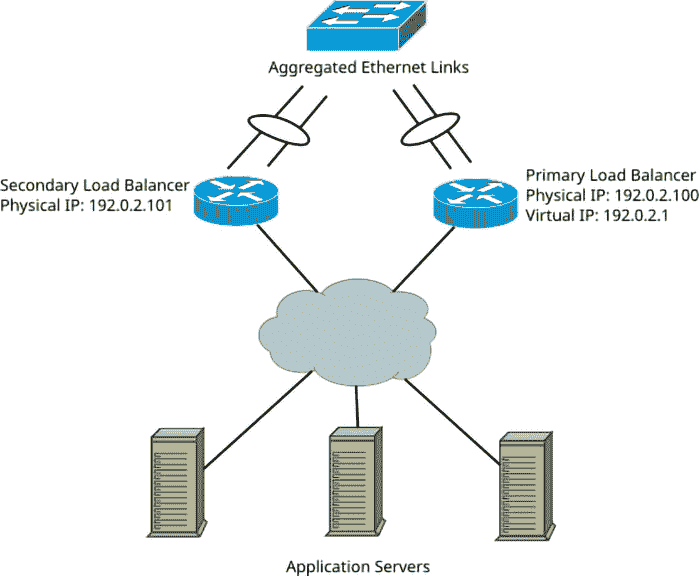

# 第十三章：高可用性

所有计算机硬件在性能和可靠性方面都有一定的限制，因此必须能够在不间断的情况下处理大量用户请求的系统，通常由多个独立的工作机器和专用的负载均衡节点组成，这些节点将负载分配到各个工作机器上。

Linux 在内核中包含负载均衡和冗余的功能，多个用户空间守护进程管理这些内置功能并实现额外的协议和特性。

在本章中，我们将学习以下内容：

+   不同类型的冗余和负载均衡

+   Linux 中的链路层和网络层冗余机制

+   使用 **Linux Virtual** **Server** (**LVS**) 进行传输层负载均衡

+   使用 Keepalived 在多个节点之间共享虚拟 IP 地址并自动化 LVS 配置

+   应用层负载均衡解决方案，以 HAProxy 为例

# 冗余和负载均衡的类型

在深入讨论具体的高可用性特性及其配置之前，让我们先讨论可能的冗余和负载均衡类型、它们的优点及其局限性。

首先，我们需要记住，现代的 TCP/IP 网络栈是 *分层的*。多种分层模型包括不同数量的层，但思路是相同的：上层的协议对任何下层的协议都不了解，反之亦然。最常用的模型是七层 **开放系统互联** (**OSI**) 模型和四层 DoD 模型（由美国国防部开发）。我们已在下表中对它们进行了总结：

| **OSI 模型** | **DoD 模型** | **目的** | **示例** |
| --- | --- | --- | --- |
| 物理 | 链路 | 传输代表比特流的电气/光学信号 | Ethernet, Wi-Fi |
| 数据链路 |
| 网络 | 互联网 | 在分段、路由的网络中传输数据包 | IPv4, IPv6 |
| 传输 | 传输 | 数据段的可靠传输（完整性检查、确认、拥塞控制等） | TCP, UDP, SSTP |
| 会话 | 应用 | 传输特定应用数据 | HTTP, SMTP, SSH |
| 表示层 |
| 应用层 |

表 13.1 — OSI 和 DoD 网络栈模型

由于网络栈是分层的，为了让网络抵御不同类型的故障，冗余可以并且应该在多个层级上实现。例如，通过两根电缆而不是一根将单个服务器连接到网络，可以保护它免受单根电缆断开或网络卡故障的影响，但不会保护用户免受服务器软件故障的影响——在这种情况下，服务器仍然会连接到网络，但无法处理任何请求。

这个问题通常可以通过设置多个服务器并引入专用的负载均衡节点来解决，该节点充当中介：它接收用户的连接并将负载分配到所有这些服务器上。

引入负载均衡器可以在传输层或应用层增加冗余，因为只要至少有一个服务器可用，系统就能继续提供服务。它还增加了超出单个服务器性能极限的总服务能力。

然而，负载均衡器本身成为了单点故障——如果其软件故障或与网络断开连接，整个服务将变得不可用。此外，它相比任何单独的服务器，还将承受最大的网络流量负载。这使得链路层和网络层冗余尤其重要。最后，为了确保用户发送到负载均衡器 IP 地址的请求始终被接受，公共地址通常在多个物理负载均衡服务器之间共享，形成一个集群，并使用**首跳冗余协议**（**FHRP**）：



图 13.1 — 典型的高可用性设置

*图 13.1* 显示了一个完全冗余的设置，包括三个应用服务器和两个负载均衡器，且通过聚合以太网链接保护免受电缆或网卡故障的影响。

在我们学习 Linux 中不同冗余类型及其实现之前，我们应该回顾一下术语。不同的协议和技术使用不同的节点角色名称，其中一些仍使用不准确且可能冒犯的术语，但了解这些术语对于理解它们的文档至关重要。

术语说明

为了描述冗余设置，我们默认使用*活动*/*备用*（*active*/*standby*）术语：只有一个*活动*节点在任何时刻执行工作，且一个或多个额外的*备用*节点在等待接管它的任务（如果它发生故障）。

许多较早的文献，包括协议标准、配置文件以及高可用性解决方案的官方文档，可能仍使用*主/从*（*master*/*slave*）术语。由于这些术语与人类奴隶制的关联以及其误导性——因为在大多数协议中，活动节点并没有控制备用节点——许多项目正在逐步淘汰这些术语。我们在讨论仍使用这些术语的协议和软件时，会为了与它们的文档一致而使用这些术语。

## 链路层冗余

电缆断开和以太网交换机端口故障是非常常见的，尤其是在户外安装和工业网络中。在这些情况下，拥有多个链路层连接非常有用。然而，单纯将一台 Linux 机器的两个不同网络卡连接到同一交换机的不同端口并不能使它们作为单一连接工作。用户需要显式地设置这两个网络卡，使它们协同工作。

幸运的是，Linux 支持多种方法将多个网卡一起使用——包括主动/备用模式和负载均衡配置。其中一些方法不需要以太网交换机的支持，甚至可以在非常基础的非托管交换机上使用。其他模式则要求交换机支持较旧的 EtherChannel 协议（由思科系统设计）或较新的、厂商中立的 IEEE 802.3ad **链路聚合控制协议** (**LACP**)，且端口必须显式配置以启用这些协议。我们可以将所有这些方法总结在以下表格中：

| **类型** | **操作** | **交换机要求** |
| --- | --- | --- |
| `active-backup` (`1`) | 一个网络卡保持禁用，而另一个处于工作状态 | 无；适用于任何交换机（即使是非托管交换机） |
| `802.3ad` (`4`) | 帧在所有端口间平衡分配 | 需要 803.3ad LACP 支持 |
| `balance-xor` (`2`) 和 `broadcast` (`3`) | 需要 EtherChannel 支持 |
| `balance-tlb` (`5`) 和 `balance-alb` (`6`) | 无 |

表 13.2 — Linux 中的链路层冗余方法

最简单的模式是 active-backup，它不需要对以太网交换机进行特殊设置，甚至可以与最简单、最便宜的非托管交换机一起使用。与 802.3ad LACP 等模式不同，它仅提供主动-备用冗余，而非负载均衡。使用以下命令，你可以将 `eth0` 和 `eth1` 网络接口通过 active-backup 方法连接到一个单一的 `bond0` 接口，在使用 NetworkManager 配置的系统上：

```
$ sudo nmcli connection add type bond con-name bond0 ifname bond0 bond.options "mode=active-backup"
$ sudo nmcli connection add type ethernet slave-type bond con-name bond0-port1 ifname eth0 master bond0
$ sudo nmcli connection add type ethernet slave-type bond con-name bond0-port2 ifname eth1 master bond0
$ sudo nmcli connection up bond0
```

现在，如果 `eth0` 或 `eth1` 中的任何一个与交换机物理断开，链路层连接将保持。

这种配置简单且对以太网交换机的要求低，但代价是浪费带宽。尽可能地，高性能服务器应使用当前行业标准的 802.3ad LACP 协议连接到以太网网络，这样它们可以利用多个链路的合并带宽，并自动排除故障链路，以提供冗余。

## 网络层冗余和负载均衡

如果一个系统有多个独立的互联网或内部网络连接，可以提供备用路由或在多个路由间平衡 IP 数据包。然而，实际上，网络层冗余通常仅被路由器使用，而非主机，其最简单的形式仅适用于拥有公共、全球路由地址的网络。

假设你的 Linux 系统连接了两个不同的路由器，一个具有 IPv4 地址 192.0.2.1，另一个具有 203.0.113.1。如果你希望其中一个连接完全不使用，仅作为备用连接，你可以创建两个具有不同*度量值*的默认路由，并将备用连接的度量值设置为更高。度量值的大小决定了路由的优先级，如果存在多个不同度量值的路由，内核将始终使用度量值最小的路由。当该路由消失时（例如，由于网络卡故障），内核将切换到使用仍可用的、度量值次小的路由。

例如，如果你希望`192.0.2.1`成为备用路由器，你可以使用以下命令：

```
$ sudo ip route add 0.0.0.0/0 via 192.0.2.1 metric 200
$ sudo ip route add 0.0.0.0/0 via 203.0.113.1 metric 100
```

这种方法的优点是，它与同一系统上设置的**网络地址转换**(**NAT**)兼容。如果你想创建负载均衡配置，则涉及更多的问题，因为网络层负载均衡是按数据包进行的，并且无法感知连接的概念。

从表面上看，多路径路由的配置相当简单。你可以指定任意数量的网关地址，并且可以选择性地为它们分配权重，以将更多流量导向更快的链路。例如，如果你希望`203.0.113.1`的流量是其他链接的两倍，你可以使用以下命令来实现：

```
$ sudo ip route add 0.0.0.0/0 nexthop via 192.0.2.1 weight 5 nexthop via 203.0.113.1 weight 10
```

问题在于，这种配置本身与 NAT 不兼容，因为它会将属于同一 TCP 连接或 UDP 流的包发送到不同的网关。如果你有一个公开路由的网络，这是正常且不可避免的。然而，如果你只有来自每个提供商的单个外部地址，并且必须使用 NAT 将私有网络映射到该单一的外发地址，则属于同一连接的包必须始终通过相同的网关流动，才能按预期工作。有一些方法可以使用基于策略的路由来设置每连接负载均衡，但这超出了本书的范围。如果你感兴趣，可以在其他来源中找到更多信息，例如*Policy Routing* *With* *Linux*，作者是*Matthew G. Marsh*，该书可以在线免费获取。

## 使用 LVS 进行传输层负载均衡

所有网络层机制的主要缺点是网络层是以单个数据包为单位进行操作的，并没有连接的概念。许多网络服务是面向连接的，因此至少，属于同一连接的所有数据包必须始终发送到同一台服务器。虽然 Linux 中的 NAT 实现足够智能，可以检测同一连接的多个数据包，但简单的负载均衡（基于一对多的 NAT）对于许多使用场景来说仍然过于简化。例如，它没有提供一种简单的方法来跟踪每台服务器接收到多少连接，也无法优先将新连接发送到负载最轻的服务器（即处理现有连接数最少的服务器）。

为了应对这种使用场景，Linux 包含了`ipvsadm`。

LVS 框架的关键概念是*虚拟服务器*和*真实服务器*。虚拟服务器是提供服务公共地址的 Linux 机器，接受连接并将这些连接分发到多个真实服务器。真实服务器可以运行任何操作系统和软件，并且可以不知道虚拟服务器的存在。

LVS 是一个灵活的框架，提供多种负载调度算法、负载均衡机制和配置选项，具有各自的优缺点。我们将详细探讨它们。

### 调度算法

有多种方法可以在多个服务器之间分配负载，每种方法都有其优缺点。我们可以通过以下表格进行总结：

| **算法** | **描述** |
| --- | --- |
| 轮询（`rr`） | 将连接均匀地分配到所有服务器。 |
| 加权轮询（`wrr`） | 这类似于轮询，但通过为某些服务器分配更高的权重值，允许将更多连接发送到这些服务器。 |
| 最少连接（`lc`） | 优先将新连接发送到当前连接数最少的服务器。 |
| 加权最少连接（`wlc`） | 默认调度算法。这类似于最少连接，但允许为服务器分配权重。 |
| 基于位置的最少连接（`lblc`） | 将具有相同目标 IP 地址的新连接发送到同一服务器，如果第一台服务器不可用或超载，则切换到下一台服务器。 |
| 基于位置的最少连接与复制（`lblcr`） | 将具有相同目标 IP 地址的新连接发送到同一服务器，如果该服务器未超载。否则，将它们发送到连接数最少的服务器。 |
| 目标地址哈希（`dh`） | 创建一个哈希表，将目标 IP 地址映射到服务器。 |
| 源地址哈希（`sh`） | 创建一个哈希表，将源 IP 地址映射到服务器。 |
| 最短预期延迟（`sed`） | 将新连接发送到具有最短预期延迟的服务器。 |
| 永不排队 (`nq`) | 将新连接发送到第一个空闲服务器，并在没有空闲服务器时切换到最短预期延迟。 |

表 13.3 – LVS 调度算法

选择正确的调度算法取决于服务类型；对于所有用例，没有一个算法本质上比其他算法更好。例如，轮询和加权轮询最适合服务于短连接的服务，例如提供静态页面或文件的 Web 服务器（例如内容分发网络）。

使用非常长寿命、持久连接的服务，如在线游戏服务器，可以从最少连接算法中受益。对于这类服务，使用轮询方法可能是适得其反的，因为新连接相对不频繁，但每个连接的资源消耗较高，可能会导致某些服务器过载或创建非常不平衡的负载分布。跟踪每个服务器活动连接数的最少连接算法旨在解决这个问题。

最后，如果响应延迟是服务质量的重要因素，则最短预期延迟和永不排队算法可以改善它，而轮询和最少连接则完全不考虑响应时间。

## LVS 负载平衡方法

首先，我们将审视 LVS 提供的负载平衡方法。它支持三种方法：直接路由、IP 隧道和 NAT。我们将总结它们之间的区别及其优缺点，并通过配置示例详细审查它们：

| **机制** | **实施** | **优势** | **劣势** |
| --- | --- | --- | --- |
| 直接路由 | 替换目标 MAC 地址 | 最佳性能；真实服务器直接向客户端发送回复 | 所有服务器必须在同一网络上，对 ARP 有困难 |
| IP 隧道 | 将客户端请求封装在隧道协议中发送 | 真实服务器直接向客户端发送回复，真实服务器可以在任何网络上 | 真实服务器必须支持 IPIP 隧道并且必须具有到虚拟服务器的隧道，返回数据包可能会被拒绝作为伪造 |
| NAT | 在幕后创建 NAT 规则 | 真实服务器不需要公共地址或任何特殊配置 | 相对资源密集，所有流量经过虚拟服务器，在实践中是最佳方法，尽管存在缺点 |

表 13.4 – LVS 负载平衡方法

让我们详细分析这些负载平衡机制，首先从 NAT 开始。

### NAT

由于两个因素，NAT 是 LVS 中最实用的负载平衡方法：真实服务器不需要具有公共可路由的 IP 地址，也不需要知道虚拟服务器或专门配置以与其配合。

在 IPv4 网络中，能够使用非公开的内部地址尤为重要，因为 IPv4 地址有限。真实服务器无需特殊配置，这也使得可以在其上使用任何操作系统，并简化了配置过程。

这种方法的另一个优势是，TCP 或 UDP 端口不需要在虚拟服务器和真实服务器上相同，因为虚拟服务器执行的是地址转换，而不是转发未经修改的 IP 数据包。

我们将设置虚拟服务器，以便在`192.168.56.100:80`上监听 HTTP 请求，并将这些请求转发到真实服务器的端口`8000`：

```
root@virtual-server# ipvsadm --add-service --tcp-service 192.168.56.100:80
root@virtual-server# ipvsadm --add-server --tcp-service 192.168.56.100:80 --real-server 10.20.30.2:8000 --masquerading
```

第一个命令创建一个虚拟服务器实例。第二个命令添加一个真实服务器以转发数据包——在我们的例子中是`10.20.30.2:8000`。最后，`--masquearding (-m)`选项告诉它在发送连接到该服务器时使用 NAT 方法。

我们在这里使用了`ipvsadm`命令行选项的长版本，但该命令也可以用短格式写出（指定轮询调度算法，`-s rr`）：

```
ipvsadm -A -t 192.168.56.100:80 -s rr.
```

现在，我们可以通过`ipvsadm –list`或`ipvsadm -l`命令来确保虚拟服务器已正确配置：

```
root@virtual-server# ipvsadm –list
IP Virtual Server version 1.2.1 (size=4096)
Prot LocalAddress:Port Scheduler Flags
  -> RemoteAddress:Port           Forward Weight ActiveConn InActConn
TCP  192.168.56.100:http rr
  -> 10.20.30.2:8000              Masq    1      0          0
```

现在，如果我们在客户端机器上运行`wget http://192.168.56.100:80`并在真实服务器上运行流量捕获工具，我们将看到以下输出：

```
root@real-server# tcpdump -n -i eth1 -q tcp port 8000
tcpdump: verbose output suppressed, use -v or -vv for full protocol decode
listening on eth1, link-type EN10MB (Ethernet), capture size 262144 bytes
23:56:16... IP 192.168.56.1.44320 > 10.20.30.2.8000: tcp 0
23:56:16... IP 10.20.30.2.8000 > 192.168.56.1.44320: tcp 0
23:56:16... IP 192.168.56.1.44320 > 10.20.30.2.8000: tcp 0
23:56:16... IP 192.168.56.1.44320 > 10.20.30.2.8000: tcp 129
```

在虚拟服务器上，我们将看到一个显著不同的输出：

```
root@virtual-server# tcpdump -n -i eth0 -q tcp port 80
tcpdump: verbose output suppressed, use -v[v]... for full protocol decode
listening on eth0, link-type EN10MB (Ethernet), snapshot length 262144 bytes
00:02:19... IP 192.168.56.1.32890 > 192.168.56.100.80: tcp 0
00:02:19... IP 192.168.56.100.80 > 192.168.56.1.32890: tcp 0
00:02:19... IP 192.168.56.1.32890 > 192.168.56.100.80: tcp 0
00:02:19... IP 192.168.56.1.32890 > 192.168.56.100.80: tcp 129
```

如您所见，虚拟服务器完全接管了客户端和真实服务器之间的通信。从理论上讲，这是一个缺点，因为它大大增加了通过虚拟服务器传输的流量。但实际上，即使在普通硬件上，Linux 的网络性能也相当不错，所以这不是一个严重的问题。而且，特定应用的负载均衡解决方案也通过服务器代理所有流量，因此这与使用像 HAProxy 这样的服务并无太大区别。由于数据包转发和端口/地址转换发生在内核空间，这种方法的性能优于用户空间的负载均衡应用。

我们将简要介绍其他负载均衡机制，但由于种种原因，它们比 NAT 实现起来要不太实用，通常无需使用。

### 直接路由

要为直接路由设置 LVS，我们需要在添加真实服务器时使用`--gatewaying (-g)`选项：

```
root@virtual-server# ipvsadm --add-service --tcp-service 10.20.30.1:8000
root@virtual-server# ipvsadm --add-server --tcp-service 10.20.30.1:8000 --real-server 10.20.30.2 --gatewaying
```

使用此配置，当虚拟服务器接收到`10.20.30.1:8000`的请求时，它将简单地将该数据包中的 MAC 地址更改为`10.20.30.2`真实服务器的 MAC 地址，并将其重新发送到以太网网络，供真实服务器接收。然后，真实服务器将直接回复客户端，而不会对虚拟服务器造成额外负载。

尽管理论上这种方法是性能最优且概念上最简单的，但在实际操作中，它对真实服务器提出了最严格的要求。最小的要求是所有真实服务器必须在同一广播网络段内。另一个要求是所有真实服务器还必须能够响应来自与服务 IP 相同的虚拟 IP 的数据包，通常是通过将虚拟服务 IP 分配为别名来实现。

然而，将相同的 IP 地址分配给多个主机会导致地址冲突。为了在存在地址冲突的情况下使网络正常工作，必须让所有节点（除了虚拟服务器）忽略虚拟 IP 的 ARP 请求。例如，可以使用`arptables`工具来实现这一点：

```
root@real-server# arptables -A IN -d 10.20.30.1 -j DROP
root@real-server# arptables -A OUT -d 10.20.30.1 -j mangle --mangle-ip-s 10.20.30.2
```

为了真正避免这种冲突并确保没有真实服务器响应虚拟 IP 的 ARP 请求，必须在分配地址之前插入这些规则。这个事实使得使用通常的网络配置方法（如分发特定脚本或 NetworkManager）正确配置真实服务器变得困难，甚至不可能。

这个事实使得尽管从理论上讲具有优势，但在大多数网络中实施这一方案变得不切实际。

### 隧道

要设置一个用于隧道的虚拟服务器，我们在添加真实服务器时需要使用`--ipip (-i)`选项：

```
root@virtual-server# ipvsadm --add-service --tcp-service 192.168.56.100:8000
root@virtual-server# ipvsadm --add-server --tcp-service 192.168.56.100:8000 --real-server 10.20.30.2 --ipip
```

然后，我们需要在真实服务器上设置一个 IPIP 隧道，以便它能够处理来自虚拟服务器的传入隧道流量，并为其分配虚拟服务器 IP：

```
root@real-server# ip tunnel add ipip1 mode ipip local 10.20.30.2
root@real-server# ip link set dev ipip1 up
root@real-server# ip address add 192.168.56.100/32 dev ipip1
```

现在，如果我们向虚拟服务器发起一个 HTTP 请求，并在真实服务器上进行流量捕获，我们将看到带有虚拟 IP 请求的传入 IPIP 数据包：

```
root@real-server# tcpdump -vvvv -n -i eth1
tcpdump: listening on eth1, link-type EN10MB (Ethernet), capture size 262144 bytes
01:06:05.545444 IP (tos 0x0, ttl 63, id 0, offset 0, flags [DF], proto IPIP (4), length 80)
    10.20.30.1 > 10.20.30.2: IP (tos 0x0, ttl 63, id 44915, offset 0, flags [DF], proto TCP (6), length 60)
    192.168.56.1.51886 > 192.168.56.106.8000: tcp 0
```

尽管理论上这种方法使真实服务器可以位于任何网络，但在实践中存在若干困难。首先，真实服务器的操作系统必须支持 IPIP 隧道。即使在 Linux 系统中，如果它们运行在容器内且没有创建隧道的权限，这也可能是一个严重的问题，即使主机系统内核已构建了 IPIP 支持。其次，由于应直接将回复发送给客户端，而不是通过隧道返回，因此在采取源 IP 伪造防护措施的网络中，这种方案会失败——而这些防护措施应该是存在的。

## 保存和恢复 LVS 配置

可以以一种格式导出当前的 LVS 配置，以便它能够从标准输入加载：

```
root@virtual-server# ipvsadm --save
-A -t 192.168.56.100:http -s wlc
-a -t 192.168.56.100:http -r 10.20.30.2:8000 -m -w 1
```

你可以将输出保存到文件中，然后将其输入到`ipvsadm –restore`：

```
root@virtual-server# ipvsadm –save > lvs.conf
root@virtual-server# cat lvs.conf | ipvsadm --restore
```

然而，在实践中，最好通过 Keepalived 或其他用户空间守护进程自动化 LVS 配置，正如我们将在本章稍后学习的那样。

## 额外的 LVS 选项

除了调度算法和真实服务器之间的负载均衡，LVS 还提供了一些额外的功能和选项。

### 连接持久性

默认情况下，LVS 将客户端的连接均衡到所有服务器，而不会将客户端与特定的服务器匹配。例如，这种方法适用于通过 HTTP 提供网页服务。然而，一些服务使用持久且有状态的连接，如果没有持久性机制，效果会很差。一个极端的例子是远程桌面连接：如果这种连接在多个服务器之间均衡，断开连接后将用户发送到另一台服务器，会创建一个全新的会话，而不是让用户回到已经运行的应用程序。

为了让 LVS 记住客户端与服务器的映射，并将来自同一客户端的新连接发送到同一服务器，你需要指定`--persistent`，并可选地指定持久性超时：

```
ipvsadm --add-service --tcp-service 192.168.56.100:80 --persistent 600
```

这个前述的命令会创建一个服务器，记住客户端到服务器的关联，持续`600`秒。

### 连接状态同步

LVS 的一个显著特点是其连接状态同步守护进程。在这种情况下，*守护进程*这个词部分上是个误用，因为它是在内核中实现的，并不是用户空间的进程。连接同步是单向的，具有专用的主（主控）节点和副本（备份）节点。

没有明确的对等配置。相反，连接状态通过 IP 组播发送到对等方。可以指定用于同步消息的网络接口：

```
root@first-virtual-server# ipvsadm --start-daemon=master --mcast-interface=eth0
root@second-virtual-server# ipvsadm --start-daemon=backup --mcast-interface=eth0
```

然而，仅仅通过连接状态同步是没有用的，除非还存在一个故障转移机制，它可以在主负载均衡器节点失败时，将虚拟 IP 转移到备份节点。

在下一部分，我们将学习如何使用 Keepalived 守护进程为 VRRP 配置故障转移。

# 使用 Keepalived 的主动/备份配置和负载均衡

一台被配置为负载均衡器的 Linux 服务器，为多个工作服务器提供服务，即使其中任何一个工作服务器失败，服务也能保持可用。然而，在这种方案中，负载均衡器本身成为了单点故障，除非管理员还采取措施为多个负载均衡器提供故障转移机制。

实现故障转移的常见方法是使用一个漂浮的*虚拟 IP 地址*。假设`www.example.com`被配置为指向`192.0.2.100`。如果你将该地址直接分配给`192.0.2.0/24`网络中的一个负载均衡服务器，它就成为了单点故障。然而，如果你设置了两个来自该网络的主地址的服务器（例如`192.0.2.10`和`192.0.2.20`），你可以使用一种特殊的故障转移协议，让两台或更多服务器决定哪个服务器持有虚拟`192.0.2.100`地址，并在主服务器失败时自动将其转移到其他服务器。

为此目的，最流行的协议叫做**虚拟路由冗余协议**（**VRRP**）。尽管它的名字中有“路由器”一词，但使用 VRRP 的机器不一定是路由器——尽管它最初是由路由操作系统实现的，但现在它的应用范围更广泛。

Linux 上最流行的 VRRP 实现是 Keepalived 项目。除了 VRRP 外，它还实现了 LVS 的配置前端，因此可以编写同时处理故障转移和负载均衡的配置文件，而无需手动使用`ipvsadm`设置 LVS。

## 安装 Keepalived

大多数 Linux 发行版都在其软件库中提供了 Keepalived，因此安装它是一个简单的过程。在 Fedora、RHEL 及其社区衍生版本如 Rocky Linux 上，可以使用以下命令安装它：

```
sudo dnf install keepalived
```

在 Debian、Ubuntu 和其他使用 APT 的发行版上，运行以下命令：

```
sudo apt-get install keepalived
```

现在我们已经安装了 Keepalived，让我们来看看 VRRP 协议的基础知识。

## VRRP 协议操作的基础知识

VRRP 和类似协议（例如较旧的**热备份路由器协议**（**HSRP**）和社区开发的**通用地址冗余协议**（**CARP**））基于选举主节点的思想，并通过监听其保持活动数据包来持续检查其状态。这些协议统称为**第一跳冗余协议**（**FHRPs**）。

最初，每个节点都假设可能是主节点，并开始传输保持活动的数据包（在 VRRP 术语中称为*广告*），其中包括 VRRP 实例的唯一标识符和优先级值。同时，它们都开始监听传入的 VRRP 广告数据包。如果一个节点接收到优先级值比自己更高的数据包，则该节点承担备份角色并停止传输保持活动的数据包。优先级最高的节点成为主节点，并分配虚拟地址给自己。

当选主节点继续定期发送 VRRP 广告数据包以表明其功能时，其他节点保持备份状态。如果原始主节点停止传输 VRRP 数据包，则会启动新的选举。

如果原始的主节点在故障后重新出现，有两种可能的情况。默认情况下，在 Keepalived 实现中，优先级最高的节点将始终抢占，并且在其宕机期间承担其角色的节点将返回备份状态。通常这是一个好主意，因为它可以在正常情况下保持主路由器的可预测性。然而，抢占也会导致额外的故障转移事件，可能会导致连接中断和短暂的服务中断。如果不希望发生这样的中断，可以禁用抢占。

## 配置 VRRP

让我们看一个简单的 VRRP 配置示例，然后详细查看其选项：

```
vrrp_instance LoadBalancers {
    state BACKUP
    interface eth1
    virtual_router_id 100
    priority 100
    advert_int 1
    nopreempt
    virtual_ipaddress {
        10.20.30.100/24
    }
}
```

您需要将该配置保存到 Keepalived 配置文件中 - 通常是`/etc/keepalived/keepalived.conf`。

Keepalived 配置文件可能包含一个或多个 VRRP 实例。它们的名称仅供信息参考，可以是任意的，只要它们在配置文件中是唯一的。

`state`选项定义了路由器的初始状态。将`BACKUP`指定给所有路由器是安全的，因为它们会自动选举活动路由器，即使它们的配置中没有任何一个具有`MASTER`状态。

VRRP 实例绑定到网络接口并且只存在于一个广播域中，因此我们需要指定 VRRP 广告包将从哪个网络接口发送。在这个示例中，它是`interface eth1`。

`virtual_router_id 100`。

接下来的两个参数是可选的。默认的 VRRP 路由器优先级是 100，除非另有指定。如果你希望手动指定路由器优先级，可以使用 1 到 254 之间的数字——优先级数字 `0` 和 `255` 是保留的，不能使用。较高的优先级值意味着路由器更有可能被选为活动（主）路由器。

广告包传输间隔（`advertise_interval`）默认为 1 秒，对于大多数安装来说，这是一个合理的设置。VRRP 不会产生太多流量，因此没有强烈的理由将间隔设置得更长。

最后，我们指定了一个虚拟地址，`10.20.30.100/24`。最多可以指定 20 个虚拟地址，地址之间用空格分隔。需要注意的一点是，所有虚拟地址不必属于同一网络，也不必与 VRRP 实例运行的网络接口的永久非浮动地址位于同一网络。通过将私有 IPv4 地址分配给两台路由器的 WAN 接口，并将互联网服务提供商分配的公共 IPv4 地址设置为虚拟地址，甚至可以创建冗余的互联网连接。

### 验证 VRRP 的状态

当你将示例配置保存到`/etc/keepalived/keepalived.conf`并使用`sudo systemctl start keepalived.service`启动进程（在带有 systemd 的 Linux 发行版中），你的服务器将成为活动（主）节点，并将虚拟地址分配给其网络接口，直到你将一个优先级更高的第二台服务器添加到同一网络。

验证此操作的最简单方法是查看我们配置 VRRP 运行的接口的 IP 地址：

```
$ ip address show eth1
3: eth1: <BROADCAST,MULTICAST,UP,LOWER_UP> mtu 1500 qdisc pfifo_fast state UP group default qlen 1000
  link/ether 08:00:27:33:48:b8 brd ff:ff:ff:ff:ff:ff
  inet 10.20.30.1/24 brd 10.20.30.255 scope global eth1
  valid_lft forever preferred_lft forever
  inet 10.20.30.100/24 scope global secondary eth1
  valid_lft forever preferred_lft forever
  inet6 fe80::a00:27ff:fe33:48b8/64 scope link
  valid_lft forever preferred_lft forever
```

你还可以使用流量捕获工具，如`tcpdump`，验证服务器是否确实正在发送 VRRP 广告包：

```
$ sudo tcpdump -i eth1
listening on eth1, link-type EN10MB (Ethernet), capture size 262144 bytes
04:38:54.038630 IP 10.20.30.1 > 224.0.0.18: VRRPv2, Advertisement, vrid 100, prio 100, authtype none, intvl 1s, length 20
04:38:55.038799 IP 10.20.30.1 > 224.0.0.18: VRRPv2, Advertisement, vrid 100, prio 100, authtype none, intvl 1s, length 20
04:38:56.039018 IP 10.20.30.1 > 224.0.0.18: VRRPv2, Advertisement, vrid 100, prio 100, authtype none, intvl 1s, length 20
```

然而，也有一种方法可以直接从 Keepalived 请求 VRRP 的状态数据。与一些其他服务不同，Keepalived（自 2.2.7 版本起）不包含套接字接口或命令行工具来与其交互，而是使用 POSIX 信号来触发状态文件的创建。这比专用工具要不太方便。

首先，你需要查找 Keepalived 进程的标识符（PID）。获取它的最佳方法是读取其 PID 文件，通常位于`/run/keepalived.pid`。

通过向进程发送 `SIGUSR1` 信号（`kill -USR1 <PID>`），会在 `/tmp/keepalived.data` 生成一个数据文件。此文件包含多个部分，我们立即感兴趣的部分是名为 **VRRP 拓扑** 的部分，用来查找 VRRP 实例的状态：

```
$ cat /run/keepalived/keepalived.pid
3241
$ sudo kill -USR1 3241
$ sudo cat /etc/keepalived.data
...
------< VRRP Topology >------
  VRRP Instance = LoadBalancers
   VRRP Version = 2
   State = MASTER
   Flags: none
   Wantstate = MASTER
   Last transition = ...
   Interface = eth1
   Using src_ip = 10.20.30.1
   Multicast address 224.0.0.18
   ...
   Virtual Router ID = 100
   Priority = 100
   ...
   Preempt = enabled
   Promote_secondaries = disabled
   Authentication type = none
   Virtual IP (1):
     10.20.30.100/24 dev eth1 scope global set
   ...
```

还可以通过向 Keepalived 进程发送 `SIGUSR2` 信号，要求其生成统计文件（`/tmp/keepalived.stats`）：

```
$ sudo kill -USR1 $(cat /run/keepalived.pid)
$ sudo cat /etc/keepalived.stats
VRRP Instance: LoadBalancers
  Advertisements:
    Received: 0
    Sent: 112
  Became master: 1
  Released master: 0
  Packet Errors:
    Length: 0
    TTL: 0
    Invalid Type: 0
    Advertisement Interval: 0
    Address List: 0
  Authentication Errors:
    Invalid Type: 0
    Type Mismatch: 0
    Failure: 0
  Priority Zero:
    Received: 0
    Sent: 0
```

虽然目前信息获取方式稍显笨拙，但您可以从这些数据文件中获取大量关于 VRRP 实例的信息。

## 配置虚拟服务器

正如我们之前所说，Keepalived 也可以创建和维护 LVS 配置。与手动配置 LVS 相比，它的优势在于，Keepalived 很容易在启动时启动，因为它总是与服务管理集成（通常是 systemd 单元），而 LVS 是内核组件，缺乏配置持久化机制。此外，Keepalived 还可以执行健康检查，并在服务器故障时重新配置 LVS 子系统。

为了演示，我们假设一个最小的负载均衡配置，使用加权轮询（Weighted Round Robin）负载均衡算法，NAT 作为负载均衡方法，两个具有相等权重的真实服务器：

```
global_defs {
  lvs_id WEB_SERVERS
}
virtual_server 192.168.56.1 80 {
    ! Weighted Round Robin
    lb_algo wrr
    lb_kind NAT
    protocol TCP
    ! Where to send requests if all servers fail
    sorry_server 192.168.56.250 80
    real_server 192.168.56.101 80 {
        weight 1
    }
    real_server 192.168.56.102 80 {
       weight 1
    }
}
```

我们在 *LVS 传输层负载均衡* 部分讨论的每个负载均衡算法都可以在 `lb_algo` 选项中指定，因此它可以是 `lb_algo wlc`（加权最少连接）等。

如果将该配置保存到 `/etc/keepalived/keepalived.conf` 并使用 `systemctl restart keepalived` 重启守护进程，您可以验证它是否创建了 LVS 配置：

```
$ sudo systemctl restart keepalived
$ sudo ipvsadm
IP Virtual Server version 1.2.1 (size=4096)
Prot LocalAddress:Port Scheduler Flags
  -> RemoteAddress:Port           Forward Weight ActiveConn InActConn
TCP  server:http wrr
  -> 192.168.56.101:http          Masq    1      0      0
  -> 192.168.56.102:http          Masq    1      0       0
```

现在我们已经知道如何进行基本的虚拟服务器配置，接下来让我们学习如何监控真实服务器的状态，并在服务器失败时将其排除。

### 服务器健康监控

LVS 本身纯粹是一个负载均衡解决方案，它不包含服务器健康监控组件。然而，在实际安装中，及时排除无法正常工作或正在进行计划维护的服务器是一项至关重要的任务，因为将用户请求指向无法正常工作的服务器会破坏高可用性配置的目标。Keepalived 包含监控功能，可以检测并移除未通过健康检查的服务器。

每个真实服务器都单独配置健康检查，尽管在大多数实际安装中，它们的配置应逻辑上保持一致，通常不建议为不同的服务器使用不同的健康检查设置。

#### TCP 和 UDP 连接检查

最简单但最不具体的健康检查类型是简单的连接检查。它有两种变体——`UDP_CHECK` 和 `TCP_CHECK`，分别适用于 UDP 和 TCP 协议。以下是该检查类型的配置示例：

```
real_server 192.168.56.101 80 {
    weight 1
    TCP_CHECK {
        connect_timeout 3
        retry 3
        delay_before_retry 2
    }
}
```

如你所见，不需要显式地指定用于连接检查的 TCP 端口：Keepalived 会使用服务器地址配置中指定的端口（在本例中为端口`80`）。

当你使用该配置启动 Keepalived 时，它将激活健康检查子系统并开始连接检查。如果`192.168.56.101`上没有运行 Web 服务器并且端口`80`没有监听，Keepalived 将在检查失败三次后（根据`retry`选项定义）将该服务器从 LVS 配置中移除。你将在系统日志中看到如下信息（例如，你可以使用`sudo journalctl -u keepalived`查看）：

```
Keepalived_healthcheckers: Activating healthchecker for service [192.168.56.101]:tcp:80 for VS [192.168.56.1]:tcp:80
Keepalived: Startup complete
Keepalived_healthcheckers: TCP_CHECK on service [192.168.56.101]:tcp:80 failed.
Keepalived_healthcheckers: Removing service [192.168.56.101]:tcp:80 from VS [192.168.56.1]:tcp:80
```

这种简单的 TCP 检查的优点是它适用于任何基于 TCP 的服务，无论其应用层协议是什么：你可以用它来检查 Web 应用程序，也可以用于 SMTP 服务器或任何自定义协议。然而，服务器对 TCP 连接的响应本身并不总是意味着它也正常运行。例如，Web 服务器可能会响应 TCP 连接，但每次请求都返回**500 内部服务器错误**的结果。

如果你希望对检查逻辑进行完美、精细的控制，Keepalived 提供了`MISC_CHECK`方法来满足这个需求。

#### 任意脚本检查

最通用的检查是`MISC_CHECK`，它没有任何内建的检查逻辑，而是依赖于外部脚本。例如，你可以让 Keepalived 执行`/tmp/my_check.sh`脚本，并在该脚本返回非零退出码时认为服务器不可用：

```
real_server 192.168.56.101 80 {
    MISC_CHECK {
        misc_path "/tmp/my_check.sh"
        misc_timeout 5
        user nobody
    }
}
```

使用这种类型的健康检查，你可以监控任何类型的服务器，尽管缺点是你必须在脚本中实现所有的检查逻辑。

#### HTTP 和 HTTPS 检查

虽然`MISC_CHECK`给你完全的控制权，但在大多数情况下，它也是一种过度设计。

作为具体性和灵活性之间的折衷，你还可以使用特定协议的检查。例如，`HTTP_GET`检查会向 URL 发起 HTTP 请求，并检查响应的哈希值，或其 HTTPS 等价物`SSL_CHECK`。

例如，假设你想提供一个简单的静态页面。在这种情况下，你可以通过使用`md5sum`命令手动计算该页面的 MD5 哈希值：

```
$ cat index.xhtml
<!DOCTYPE html>
<html>
  <body>
    <p>hello world</p>
  </body>
</html>
$ md5sum index.xhtml
fecf605e44acaaab933e7b509dbde185  index.xhtml
```

要计算动态生成页面的预期哈希值，你可以使用 Keepalived 自带的`genhash`工具。如果你用`--verbose`运行它，它将显示有关其执行的 HTTP 请求的详细信息：

```
$ genhash --verbose --server 192.168.56.101 --port 80 --url /index.xhtml
----------[    HTTP Header Buffer    ]----------
0000  48 54 54 50 2f 31 2e 30 - 20 32 30 30 20 4f 4b 0d   HTTP/1.0 200 OK.
...
----------[ HTTP Header Ascii Buffer ]----------
HTTP/1.0 200 OK
...
----------[        HTML Buffer        ]----------
0000  3c 21 44 4f 43 54 59 50 - 45 20 68 74 6d 6c 3e 0a   <!DOCTYPE html>.
...
---------[    HTML hash resulting    ]---------
0000  fe cf 60 5e 44 ac aa ab - 93 3e 7b 50 9d bd e1 85   ..`^D....>{P....
--------[ HTML hash final resulting ]--------
fecf605e44acaaab933e7b509dbde185
Global response time for [/index.xhtml] = 2468 usecs
```

然而，它只计算 HTTP 响应体的哈希值，而不是包括头部的完整响应，因此你不必非得使用它——如果你愿意，你可以通过任何其他 HTTP 请求工具来获取响应体。

一旦你有了预期的响应哈希值，你可以配置`HTTP_GET`检查定期发起请求并将其响应体与给定的 MD5 哈希值进行对比：

```
real_server 192.168.56.101 80 {
    weight 1
    HTTP_GET {
         url {
             path /index.xhtml
             digest fecf605e44acaaab933e7b509dbde185
        }
        connect_timeout 3
        retry 3
        delay_before_retry 2
    }
}
```

由于普通的、用户可见的页面可能随时变化，因此如果您希望使用哈希值检查，最好创建一个内容保持不变的特殊页面。否则，页面内容变化时哈希值会发生变化，从而导致检查失败。

### 邮件通知

还可以配置 Keepalived，当任何状态变化发生时，将邮件通知发送到一个或多个地址——即 VRRP 从主节点切换到备节点或反之，或者当实际服务器变得不可用并且失败检查时，或者通过之前失败的检查并重新添加到内核中的 LVS 配置时。

下面是一个配置示例：

```
global_defs {
    notification_email {
        admin@example.com
        webmaster@example.com
    }
    notification_email_from keepalived@example.com
    smtp_server 203.0.113.100
    smtp_connect_timeout 30
}
```

不幸的是，LVS 不支持 SMTP 验证，因此如果选择使用内置的邮件通知机制，您需要将服务器配置为开放转发，并采取适当措施确保只有运行 Keepalived 的服务器能够通过它发送邮件——例如，通过防火墙规则限制仅允许您的私人网络访问它。

# 应用层负载均衡

LVS 是一个灵活的负载均衡框架，且由于它是在内核中实现的，因此它是一种高性能的解决方案，因为它不需要上下文切换，也不需要在用户空间程序与内核之间进行数据传输。它在 TCP 或 UDP 协议层工作，使其不依赖于应用程序，能够与任何应用服务一起使用。

然而，它缺乏对应用协议的意识也是其最大弱点，因为这意味着它无法执行任何特定于协议的优化。例如，对于那些可能向多个用户返回相同回复的应用程序，一个显而易见的提高性能的方法是缓存回复。LVS 仅在 TCP 连接或 UDP 流上操作，因此它无法知道任何应用层协议中的请求或回复是什么样子的——它根本不检查 TCP 或 UDP 负载。

此外，许多现代应用层协议都进行了加密，因此无法查看服务器未启动或终止的连接的负载内容。

直接将连接从用户转发到实际服务器也有更多潜在的缺点。例如，这使得服务器暴露于基于 TCP 的攻击，如 SYN 洪水攻击，并且要求所有服务器或入口点的专用防火墙设置采取适当的安全措施。

解决这些问题的一种方法是使用一个用户空间的守护进程，它实现您运行的服务协议，终止 TCP 连接，并将应用层协议请求转发到目标服务器。

由于世界上大多数应用程序目前都是 Web 应用程序，因此大多数此类解决方案都针对 HTTP 和 HTTPS。它们提供内存中的响应缓存来加速回复，终止 SSL 连接，管理证书，并可以选择提供安全功能。HAProxy 和 Varnish 是 Web 应用负载均衡服务器的典型例子，尽管也有其他类似的解决方案。

也有针对其他协议的解决方案，提供高可用性和负载均衡。例如，OpenSIPS 和 FreeSWITCH 可以为使用 SIP 协议的 **互联网语音协议** (**VoIP**) 通话提供负载均衡。然而，此类解决方案超出了本书的范围。我们将快速了解 HAProxy 作为 Web 应用的高可用性解决方案之一。

## 使用 HAProxy 进行 Web 应用负载均衡

HAProxy 配置是一个庞大的主题，因为它包含了许多功能。我们将通过一个简单的配置示例来了解它的能力：

```
frontend main
    bind *:80
    acl url_static path_beg -i /static /images /javascript /stylesheets
    acl url_static path_end -i .jpg .gif .png .css .js
    use_backend static          if url_static
    default_backend             app
backend static
    balance     roundrobin
    server static 192.168.56.200:80 check
backend app
    balance     roundrobin
    server  srv1 192.168.56.101:5000 check
    server  srv2 192.168.56.102:5000 check
```

正如你所看到的，其核心功能是将前端（即负载均衡实例）与后端——实际应用服务器集合进行映射。

在这种情况下，一个前端映射到两个后端：一个专门用于提供静态文件的服务器和两个应用服务器。这仅在 HAProxy 中可行，因为它自己处理 HTTP 请求，发送新请求到其后端，并准备回复用户，而不是仅仅平衡连接。

# 总结

在本章中，我们学习了高可用性的概念：冗余、故障转移和负载均衡。我们还学习了如何通过创建绑定接口来配置链路层冗余，以及如何在网络层设置冗余路由。为了确保传输层冗余，我们学习了如何手动使用 `ipvsadm` 配置 LVS 子系统，或者使用 Keepalived，并学习了如何使用 VRRP 为负载均衡节点提供故障转移。最后，我们简要了解了 HAProxy 作为 Web 服务器的应用层负载均衡解决方案。

在下一章中，我们将学习如何使用配置自动化工具管理 Linux 系统。

# 进一步阅读

若想了解更多本章涉及的内容，请查看以下资源：

+   *策略路由* *与* *Linux*，作者：Matthew G. Marsh：[`web.archive.org/web/20230322065520/http://www.policyrouting.org/PolicyRoutingBook/ONLINE/TOC.xhtml`](https://web.archive.org/web/20230322065520/http://www.policyrouting.org/PolicyRoutingBook/ONLINE/TOC.xhtml)

+   Keepalived 文档：[`keepalived.readthedocs.io/en/latest/`](https://keepalived.readthedocs.io/en/latest/%0D)

+   HAProxy: [`www.haproxy.org/`](http://www.haproxy.org/)
