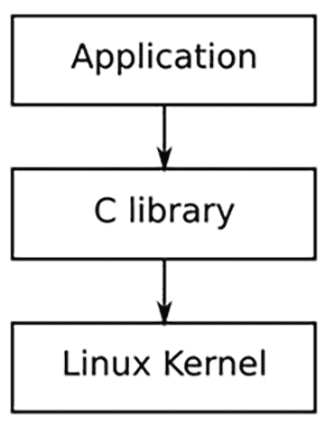
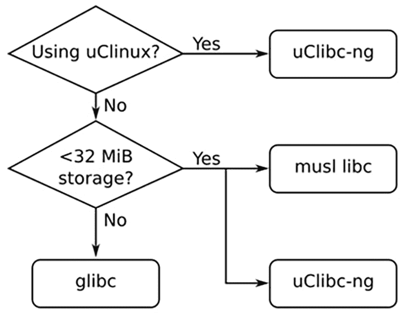

# 2

# 了解工具链

工具链是嵌入式 Linux 的第一个元素，也是你项目的起点。你将使用它来编译将在设备上运行的所有代码。你在这个早期阶段做出的选择将对最终结果产生深远的影响。

你的工具链应能够通过使用适合你处理器的最佳指令集，充分发挥硬件的效能。它应支持你所需的语言，并且具备**可移植操作系统接口**（**POSIX**）和其他系统接口的稳固实现。

你的工具链在整个项目中应该保持不变。换句话说，一旦选择了工具链，重要的是要坚持使用它。在项目中不一致地更改编译器和开发库将导致微妙的错误。尽管如此，还是建议在发现安全漏洞或错误时更新工具链。

获取工具链可以像下载并安装一个 TAR 文件那么简单，或者像从源代码构建整个工具链那样复杂。在本章中，我们采用第一种方法。稍后，在*第六章*中，我们将切换到使用构建系统生成的工具链。这是获取工具链的更常见方法。

本章将涵盖以下主题：

+   介绍工具链

+   寻找工具链

+   工具链的构成

+   与库的链接 ‒ 静态和动态链接

+   交叉编译的艺术

# 技术要求

我推荐使用 Ubuntu 24.04 或更高版本的 LTS 版本，因为本章中的练习是在撰写时对该 Linux 发行版进行过测试的。

这是在 Ubuntu 24.04 LTS 上安装本章所需的所有软件包的命令：

```
$ sudo apt-get install autoconf automake bison bzip2 cmake flex g++ gawk gcc gettext git gperf help2man libstdc++6 libtool libtool-bin make patch texinfo unzip wget xz-utils 
```

本章中使用的代码可以在本书的 GitHub 仓库的章节文件夹中找到：[`github.com/PacktPublishing/Mastering-Embedded-Linux-Development/tree/main/Chapter02`](https://github.com/PacktPublishing/Mastering-Embedded-Linux-Development/tree/main/Chapter02)。

# 介绍工具链

工具链是一组将源代码编译成可在目标设备上运行的可执行文件的工具。它包括一个编译器、一个链接器和运行时库。你需要一个工具链来构建嵌入式 Linux 系统的其他三个元素：

+   启动加载程序

+   内核

+   根文件系统

它必须能够编译用 C、C++ 和汇编语言编写的代码，因为这些是基础开源包中使用的语言。

通常，Linux 的工具链是基于 GNU 项目中的组件的，到目前为止仍然如此。然而，在过去几年里，**Clang** 编译器和相关的 **低级虚拟机**（**LLVM**）项目已经取得了长足的进展，LLVM 现在已成为 GNU 工具链的可行替代方案。LLVM 和基于 GNU 的工具链之间的一个主要区别在于许可证；LLVM 采用的是带有 LLVM 异常条款的 Apache 2.0 许可证，而 GNU 则使用 GPL。

Clang 也有一些技术优势，比如更快的编译速度、更好的诊断信息以及对最新 C 和 C++ 标准的更好支持。但**GCC**（**GNU C 编译器**）在与现有代码库的兼容性以及对更广泛架构和**操作系统**（**OS**）的支持方面具有优势。虽然 Clang 花费了几年时间才发展到现在的水平，但它现在可以编译嵌入式 Linux 所需的所有组件，并且是 GCC 的可行替代方案。欲了解更多信息，请参见[`docs.kernel.org/kbuild/llvm.html`](https://docs.kernel.org/kbuild/llvm.html)。

关于如何使用 Clang 进行交叉编译的详细说明可以在[`clang.llvm.org/docs/CrossCompilation.html`](https://clang.llvm.org/docs/CrossCompilation.html)找到。如果你希望将其作为嵌入式 Linux 构建系统的一部分，很多人正在研究如何将 Clang 与 Buildroot 和 Yocto 项目结合使用。我将在*第六章*中介绍嵌入式构建系统。与此同时，本章专注于 GNU 工具链，因为它仍然是 Linux 中最流行和成熟的工具链。

标准的 GNU 工具链包含三个主要组件：

+   **Binutils**：一组二进制工具，包括汇编器和连接器。

+   **GCC**：用于 C 和其他语言的编译器，包括 C++、Objective-C、Objective-C++、Java、Fortran、Ada、Go 和 D。它们都使用一个通用的后端生成汇编代码，并将其交给 GNU 汇编器处理。

+   **C 库**：基于 POSIX 规范的标准化 **应用程序接口**（**API**），它是应用程序访问操作系统内核的主要接口。我们将在本章稍后讨论几种需要考虑的 C 库。

除此之外，你还需要一份 Linux 内核头文件。内核头文件包含了访问内核时所需的定义和常量。你需要这些内核头文件来编译 C 库、程序和库。这些**用户空间**代码通过 Linux 帧缓冲驱动与 Linux 设备间接交互，例如用来显示图形。这与直接访问外设硬件的**内核空间**中的内核模块/驱动程序形成鲜明对比。

这不仅仅是将内核源代码的 include 目录中的头文件复制一遍的问题。这些头文件仅用于内核，它们包含的定义如果直接用于编译常规的 Linux 应用程序，会导致冲突。因此，你需要生成一组经过清理的内核头文件，我在*第五章*中做了说明。

在为用户空间编译时，内核头文件不需要来自你将要运行的 Linux 的确切版本。由于内核接口始终向后兼容，只要头文件来自与目标上运行的内核版本相同或更早的内核版本，就足够了。

大多数人认为**GNU 调试器**（**GDB**）也是工具链的一部分，因为它通常也是在这一点上构建的。当构建交叉编译器时，你还需要构建一个相应的交叉调试器，以便从主机机器远程调试目标上的代码。我将在*第十九章*中讲解 GDB。

现在我们已经讨论了内核头文件并了解了工具链的组成部分，让我们来看一下不同类型的工具链。

## 工具链的类型

对我们来说，工具链有两种类型：

+   **本地**：一种在与其生成的程序相同类型的系统（甚至是实际系统）上运行的工具链。这通常适用于桌面和服务器，并且在某些类型的嵌入式设备上越来越受欢迎。例如，运行 Debian ARM 版本的 Raspberry Pi 4 就有自托管的本地编译器。

+   **交叉**：一种在不同类型的系统上运行的工具链，它允许在快速的桌面 PC 上进行开发，然后将代码加载到嵌入式目标上执行。

几乎所有嵌入式 Linux 开发都是使用交叉开发工具链完成的。这部分是因为大多数嵌入式设备不适合开发，因为它们缺乏计算能力、内存和存储空间，但也因为它可以保持主机和目标环境的分离。当主机和目标使用相同的架构时（例如，x86_64），这一点尤其重要。在这种情况下，很容易在主机上本地编译并直接将二进制文件复制到目标上。

这种方法有一定的效果。然而，主机操作系统的分发版可能会比目标系统更频繁地收到更新，或者为目标系统构建代码的不同工程师可能会使用稍微不同版本的主机开发库。随着时间的推移，开发系统和目标系统将会出现分歧。如果你确保主机和目标的构建环境保持一致，你可以升级工具链。然而，更好的方法是将主机和目标分开，并使用交叉工具链来实现这一点。

有一种反对本地开发的观点。交叉开发需要跨平台编译所有你需要的库和工具。这一点我们将在稍后的章节中讨论，名为*交叉编译艺术*，交叉开发并不总是简单的，因为许多开源包并不是为这种方式的构建而设计的。

像 Buildroot 和 Yocto 项目这样的集成构建工具通过封装交叉编译大多数嵌入式系统所需的软件包规则来提供帮助。但是，如果你想编译大量的附加包，那么最好是本地编译它们。例如，使用交叉编译器为 Raspberry Pi 4 或 BeaglePlay 构建 Debian 发行版非常困难。相反，它们是本地编译的。

从零开始创建本地构建环境并不容易。你仍然需要首先使用交叉编译器在目标上创建本地构建环境，然后用它来构建软件包。接着，为了在合理的时间内完成本地构建，你需要一组配置良好的目标板或**快速模拟器**（**QEMU**）来模拟目标。

在本章中，我们将重点关注一个相对容易设置和管理的预构建交叉编译器环境。我们将首先看看是什么区分了不同的目标 CPU 架构。

## CPU 架构

工具链必须根据目标 CPU 的能力进行构建，这包括：

+   **CPU 架构**：ARM、RISC-V、PowerPC、**无互锁流水线阶段的微处理器**（**MIPS**）或 x86_64。

+   **大端或小端操作**：一些 CPU 可以在两种模式下操作，但机器代码对于每种模式是不同的。

+   **浮点支持**：并不是所有版本的嵌入式处理器都实现了硬件浮点单元。在这些情况下，工具链必须配置为调用软件浮点库。

+   **应用二进制接口（ABI）**：用于在函数调用之间传递参数的调用约定。

对于许多架构，ABI 在处理器家族中是常见的。一个显著的例外是 ARM。ARM 架构在 2000 年代后期过渡到**扩展应用二进制接口**（**EABI**），这导致了之前的 ABI 被称为**旧应用二进制接口**（**OABI**）。尽管 OABI 现在已经过时，但你仍然会看到对 EABI 的引用。从那时起，EABI 根据浮点参数的传递方式分为三种：softfloat、softfp 和 hardfp。

原始的 EABI 使用软件仿真（softfloat）或通用整数寄存器（softfp），而较新的 **扩展应用程序二进制接口硬浮点**（**EABIHF**）使用浮点寄存器（hardfp）。原始的 EABI 的 softfloat 和 softfp 模式是 ABI 兼容的。在 **softfloat** 模式下，编译器不会生成 **浮点单元**（**FPU**）指令。所有浮点运算都在软件中完成，这会导致性能不佳。在 **softfp** 模式下，浮动值通过栈或整数寄存器传递，以提高性能。由于 **hardfp** 模式省去了整数和浮点寄存器之间的拷贝，EABIHF 在浮点运算方面明显更快。

EABIHF 的缺点是 hardfp 模式与没有浮点单元的 CPU 不兼容。此时，你只能在两个不兼容的 ABI 之间进行选择。不能混合使用这两种模式，所以你必须在此时做出决定。

GNU 为工具链中每个工具的名称添加一个前缀，用于标识可以生成的各种组合。这个前缀由三到四个由短横线分隔的组件组成，如下所示：

+   **CPU**：例如 ARM、RISC-V、PowerPC、MIPS 或 x86_64 等 CPU 架构。如果 CPU 支持两种字节序模式，它们可能通过添加 `el` 来表示小端（little-endian）或 `eb` 来表示大端（big-endian）。例如小端 MIPS（`mipsel`）和大端 ARM（`armeb`）就是很好的例子。

+   **厂商**：标识工具链的提供者。例如，`buildroot`、`poky` 或者简单的 `unknown`。有时，它可能完全不显示。

+   **操作系统**：就我们而言，它总是 `linux`。

+   **用户空间**：用户空间组件的名称，可能是 `gnu` 或 `musl`。这里也可以附加 ABI。所以，对于 ARM 工具链，你可能会看到 `gnueabi`、`gnueabihf`、`musleabi` 或 `musleabihf`。

你可以通过使用 `gcc` 的 `-dumpmachine` 选项来找到构建工具链时使用的元组。例如，在主机计算机上，你可能会看到以下内容：

```
$ gcc -dumpmachine
x86_64-linux-gnu 
```

这个元组表示的是一个 `x86_64` CPU，一个 `linux` 内核和一个 `gnu` 用户空间。

**重要提示**

当在机器上安装了本地编译器时，通常会创建工具链中每个工具的链接，且不带前缀，这样你就可以通过 `gcc` 命令调用 C 编译器。

下面是使用交叉编译器的一个示例：

```
$ mipsel-unknown-linux-gnu-gcc -dumpmachine
mipsel-unknown-linux-gnu 
```

这个元组表示的是一个小端 MIPS CPU，`unknown` 的厂商，一个 `linux` 内核和 `gnu` 用户空间。你选择的用户空间（`gnu` 或 `musl`）决定了程序链接的 C 库（glibc 或 musl）。

## 选择 C 库

Unix 操作系统的编程接口是用 C 语言定义的，遵循 POSIX 标准。**C 库** 就是该接口的实现。它是 Linux 程序通向内核的门道。即使你用 Go 或 Python 等其他语言编写程序，相应的运行时支持库最终也会调用 C 库，如下所示：



图 2.1 – C 库

每当 C 库需要内核服务时，它将使用内核系统调用接口在用户空间和内核空间之间进行切换。虽然可以通过直接进行内核系统调用来绕过 C 库，但那样做既麻烦又几乎没有必要。

有几种 C 库可供选择。主要选项如下：

+   **glibc**：这是标准的 GNU C 库，网址是 [`gnu.org/software/libc/`](https://gnu.org/software/libc/)。它较大，直到最近才变得更加可配置，但它是 POSIX API 最完整的实现。许可证是 LGPL 2.1。

+   **musl libc**：这是一个相对较新的库，但作为一个小巧且符合标准的 glibc 替代品，它已经获得了很多关注。它是内存和存储有限的系统的好选择。它采用 MIT 许可证，并且可以在 [`musl.libc.org`](https://musl.libc.org) 获得。

+   **uClibc-ng**：*u* 实际上是希腊字母 *mu*，表示这是微控制器 C 库。uClibc-ng 可在 [`uclibc-ng.org`](https://uclibc-ng.org) 获取。它最初是为 uClinux（没有内存管理单元的微控制器上的 Linux）开发的，但后来已被改编为可以与完整的 Linux 一起使用。uClibc-ng 库是原 uClibc 项目的一个分支，而原项目已经停止维护。两者的许可证都是 LGPL 2.1。

那么，选择哪个呢？我的建议是，只有在使用 uClinux 时才使用 uClibc-ng。如果你的存储或内存非常有限，那么 musl libc 是一个不错的选择。否则，请使用 glibc，如下图所示：



图 2.2 – 选择 C 库

你选择的 C 库可能会限制你选择的工具链，因为并非所有预构建的工具链都支持所有 C 库。一旦你确定了工具链的需求，你该去哪里找呢？

# 寻找工具链

你有三个选择来获得交叉开发工具链：你可以找到一个已经构建好的工具链，与你的需求匹配；你可以使用一个由嵌入式构建工具生成的工具链（这部分内容在 *第六章* 中介绍）；或者你可以自己创建一个。

使用预构建的交叉工具链是一个有吸引力的选择，因为你只需要下载并安装它。但你会受到该工具链配置的限制，并且依赖于提供该工具链的人或组织。它很可能是以下之一：

+   一个 SoC 或板卡供应商。大多数供应商提供 Linux 工具链。

+   一个致力于为特定架构提供系统级支持的联盟。例如，Linaro（[`www.linaro.org`](https://www.linaro.org)）为 ARM 架构提供了预构建的工具链。

+   一个第三方 Linux 工具供应商，如西门子、Timesys 或 Wind River。

+   您的桌面 Linux 发行版的交叉工具包。例如，基于 Debian 的发行版提供用于交叉编译 ARM、PowerPC 和 MIPS 目标的工具包。

+   由集成嵌入式构建工具生成的二进制 SDK。Yocto 项目提供了可以下载的工具链，下载链接为[`downloads.yoctoproject.org/releases/yocto/yocto-<version>/toolchain/`](https://downloads.yoctoproject.org/releases/yocto/yocto-version/toolchain/)。 （请将`<version>`替换为有效的 Yocto 项目版本，如`5.0`）。

+   来自一个论坛的链接，您现在已经找不到了。

    **重要提示**

    在所有这些情况下，您必须决定所提供的预构建工具链是否符合您的要求。它是否使用您偏好的 C 库？供应商是否会为您提供安全修复和错误修复的更新？请记住我在*第一章*中的评论，关于支持和更新。如果您的回答是否定的，那么您应该考虑自己构建工具链。

不幸的是，构建一个工具链并不是一件容易的事。如果您真的想自己做所有事情，可以查看 Cross Linux From Scratch（[`trac.clfs.org`](https://trac.clfs.org)）。在这里，您将找到逐步指导，教您如何创建每个组件。

一个更简单的替代方法是使用 crosstool-NG，它将构建过程封装成一组脚本，并具有菜单驱动的前端界面。然而，仅仅做出正确选择，您仍然需要一定程度的知识。

使用像 Buildroot 或 Yocto 项目这样的构建系统会更简单，因为它们在构建过程中生成工具链。这是我首选的解决方案，正如我们将在*第六章*中看到的那样。

您将需要一个可用的交叉工具链才能完成下一节中的练习。我们将使用来自 Bootlin 的预构建工具链。Bootlin 的工具链是使用 Buildroot 构建的。

下载预构建的交叉工具链，以便用于*第二章*至*第五章*：

```
$ wget https://toolchains.bootlin.com/downloads/releases/toolchains/aarch64/tarballs/aarch64--glibc--stable-2024.02-1.tar.bz2 
```

要下载此工具链的最新版本，请访问[`toolchains.bootlin.com`](https://toolchains.bootlin.com)。选择架构为*aarch64*，选择 libc 为*glibc*。完成这些选择后，下载工具链的稳定版本。

通过将预构建的工具链提取并解压到您的主目录中，在您的 Linux 主机上安装工具链：

```
$ bzip2 -d aarch64--glibc--stable-2024.02-1.tar.bz2
$ tar -xvf aarch64--glibc--stable-2024.02-1.tar
<…> 
```

您将使用此工具链完成本章的其余部分。让我们首先看看它的内部结构。

# 工具链的结构

为了了解一个典型的工具链中包含了什么，让我们看看你从 Bootlin 下载的工具链。示例中使用的是 aarch64 工具链，它的前缀是`aarch64-buildroot-linux-gnu`。

aarch64 工具链位于`~/aarch64--glibc--stable-2024.02-1/bin`目录下。在这个目录中，你会找到交叉编译器`aarch64-buildroot-linux-gnu-gcc`。要使用它，你需要通过以下命令将该目录添加到你的路径中：

```
$ PATH=~/aarch64--glibc--stable-2024.02-1/bin:$PATH 
```

如果你下载了不同的版本，请确保将`2024.02-1`替换为稳定工具链的实际版本。

现在你可以编写一个简单的`helloworld`程序，在 C 语言中，它是这样的：

```
#include <stdio.h>
#include <stdlib.h>
int main (int argc, char *argv[])
{
    printf ("Hello, World!\n");
    return 0;
} 
```

然后像这样编译：

```
$ aarch64-buildroot-linux-gnu-gcc helloworld.c -o helloworld 
```

通过使用`file`命令打印文件类型，确认它是否已被交叉编译：

```
$ file helloworld
helloworld: ELF 64-bit LSB pie executable, ARM aarch64, version 1 (SYSV), dynamically linked, interpreter /lib/ld-linux-aarch64.so.1, for GNU/Linux 3.7.0,  not stripped 
```

现在你已经验证了交叉编译器的工作情况，让我们更仔细地看一下它。

## 了解你的交叉编译器

假设你刚刚收到了一个工具链，并且你想了解它是如何配置的。你可以通过查询`gcc`来获取很多信息。例如，要查看版本，可以使用`--version`：

```
$ aarch64-buildroot-linux-gnu-gcc --version
aarch64-buildroot-linux-gnu-gcc.br_real (Buildroot 2021.11-11272-ge2962af) 12.3.0
Copyright (C) 2022 Free Software Foundation, Inc.
This is free software; see the source for copying conditions.  There is NO
warranty; not even for MERCHANTABILITY or FITNESS FOR A PARTICULAR PURPOSE. 
```

要查看它是如何配置的，请使用`-v`：

```
$ aarch64-buildroot-linux-gnu-gcc -v
Using built-in specs.
COLLECT_GCC=/home/frank/aarch64--glibc--stable-2024.02-1/bin/aarch64-buildroot-linux-gnu-gcc.br_real
COLLECT_LTO_WRAPPER=/home/frank/aarch64--glibc--stable-2024.02-1/bin/../libexec/gcc/aarch64-buildroot-linux-gnu/12.3.0/lto-wrapper
Target: aarch64-buildroot-linux-gnu
Configured with: ./configure --prefix=/builds/buildroot.org/toolchains-builder/build/aarch64--glibc--stable-2024.02-1 --sysconfdir=/builds/buildroot.org/toolchains-builder/build/aarch64--glibc--stable-2024.02-1/etc --enable-static --target=aarch64-buildroot-linux-gnu --with-sysroot=/builds/buildroot.org/toolchains-builder/build/aarch64--glibc--stable-2024.02-1/aarch64-buildroot-linux-gnu/sysroot --enable-__cxa_atexit --with-gnu-ld --disable-libssp --disable-multilib --disable-decimal-float --enable-plugins --enable-lto --with-gmp=/builds/buildroot.org/toolchains-builder/build/aarch64--glibc--stable-2024.02-1 --with-mpc=/builds/buildroot.org/toolchains-builder/build/aarch64--glibc--stable-2024.02-1 --with-mpfr=/builds/buildroot.org/toolchains-builder/build/aarch64--glibc--stable-2024.02-1 --with-pkgversion='Buildroot 2021.11-11272-ge2962af' --with-bugurl=http://bugs.buildroot.net/ --without-zstd --disable-libquadmath --disable-libquadmath-support --enable-tls --enable-threads --without-isl --without-cloog --with-abi=lp64 --with-cpu=cortex-a53 --enable-languages=c,c++,fortran --with-build-time-tools=/builds/buildroot.org/toolchains-builder/build/aarch64--glibc--stable-2024.02-1/aarch64-buildroot-linux-gnu/bin --enable-shared --enable-libgomp
Thread model: posix
Supported LTO compression algorithms: zlib
gcc version 12.3.0 (Buildroot 2021.11-11272-ge2962af)
<…> 
```

输出内容很多，但需要注意的有以下几点：

+   `--with-sysroot`=`/builds/buildroot.org/toolchains-builder/build/aarch64--glibc--stable-2024.02-1/aarch64-buildroot-linux-gnu/sysroot`：构建时`sysroot`目录的位置。请参阅以下部分以了解详细说明。

+   `--enable-languages=c,c++,fortran`：启用 C 语言、C++语言和 Fortran 语言。

+   `--with-cpu=cortex-a53`：为 ARM Cortex-A53 核心生成代码。

+   `--enable-threads`：启用 POSIX 线程。

这些是编译器的默认设置。你可以在`gcc`命令行上覆盖其中的大部分。例如，如果你想为不同的 CPU 进行编译，可以通过在命令行添加`-mcpu=cortex-a72`来覆盖已配置的`--with-cpu`设置，如下所示：

```
$ aarch64-buildroot-linux-gnu-gcc -mcpu=cortex-a72 helloworld.c -o helloworld 
```

你可以使用`--target-help`打印出可用的架构特定选项，方法如下：

```
$ aarch64-buildroot-linux-gnu-gcc --target-help 
```

你可能会想，是否在此时完全正确地配置它很重要，因为你总是可以稍后更改它。答案取决于你预计如何使用它。如果你计划为每个目标创建一个新的工具链，那么一开始就设置好所有内容是有意义的，因为这样可以减少以后出错的风险。

我称之为 Buildroot 哲学，我们将在*第六章*中再次讨论。如果你想构建一个通用的工具链，并且准备在为特定目标构建时提供正确的设置，那么你应该使基础工具链通用，这也是 Yocto 项目处理事务的方式。

现在我们已经看到在构建时`sysroot`目录的位置，让我们来看一下安装在主机上的默认`sysroot`目录的内容。

## sysroot、库和头文件

工具链的`sysroot`目录包含库、头文件和其他配置文件的子目录。它可以在配置工具链时通过`--with-sysroot=`设置，或者可以在命令行中使用`--sysroot=`设置。你可以通过使用`-print-sysroot`查看默认`sysroot`的位置：

```
$ aarch64-buildroot-linux-gnu-gcc -print-sysroot
/home/frank/aarch64--glibc--stable-2024.02-1/aarch64-buildroot-linux-gnu/sysroot 
```

你将在`sysroot`中找到以下子目录：

+   `lib`：包含 C 库的共享对象和动态链接器/加载器`ld-linux`。

+   `usr/lib`：包含 C 库的静态库归档文件以及可能随后安装的其他库。

+   `usr/include`：包含所有库的头文件。

+   `usr/bin`：包含在目标设备上运行的实用程序，如`ldd`命令。

+   `usr/share`：用于本地化和国际化。

+   `sbin`：提供用于优化库加载路径的`ldconfig`工具。

这些工具中，有些在开发主机上用于编译程序，而其他工具，如共享库和`ld-linux`，在目标设备运行时需要。

## 工具链中的其他工具

以下是调用 GNU 工具链中各个其他组件的命令列表。像`aarch64-buildroot-linux-gnu-gcc`，这些工具都位于你添加到`PATH`中的`~/aarch64--glibc--stable-2024.02-1/bin/`目录中。以下是这些工具的简短描述：

+   `addr2line`：通过读取可执行文件中的调试符号表，将程序地址转换为源代码文件名和行号。在解码系统崩溃报告中打印的地址时非常有用。

+   `ar`：用于创建静态库的归档工具。

+   `as`：GNU 汇编器。

+   `c++filt`：解码 C++和 Java 符号。

+   `cpp`：C 预处理器，用于展开`#define`、`#include`和其他类似指令。你很少需要单独使用它。

+   `elfedit`：更新 ELF 文件的 ELF 头。

+   `g++`：GNU C++前端，假设源文件包含 C++代码。

+   `gcc`：GNU C 前端，假设源文件包含 C 代码。

+   `gcov`：代码覆盖工具。

+   `gdb`：GNU 调试器。

+   `gprof`：程序分析工具。

+   `ld`：GNU 链接器。

+   `nm`：列出目标文件中的符号。

+   `objcopy`：复制和转换目标文件。

+   `objdump`：显示目标文件中的信息。

+   `ranlib`：在静态库中创建或修改索引，使链接阶段更快。

+   `readelf`：显示 ELF 对象格式文件的信息。

+   `size`：列出各个段的大小以及总大小。

+   `strings`：显示文件中可打印字符的字符串。

+   `strip`：去除目标文件中的调试符号表，使其更小。通常，你会去除所有放置到目标上的可执行代码。

现在我们将从命令行工具切换话题，回到 C 库的主题。

## 查看 C 库的组件

C 库不是单一的库文件。它由四个主要部分组成，这些部分共同实现了 POSIX API：

+   `libc`：主要的 C 库，包含众所周知的 POSIX 函数，如`printf`、`open`、`close`、`read`、`write`等

+   `libm`：包含数学函数，如`cos`、`exp`、`log`

+   `libpthread`：包含所有以`pthread_`开头的 POSIX 线程函数

+   `librt`：具有 POSIX 的实时扩展，包括共享内存和异步 I/O

第一个库`libc`总是被链接的，但其他库必须显式地使用`-l`选项进行链接。`-l`的参数是库名称，去掉`lib`前缀。例如，一个通过调用`sin()`来计算正弦函数的程序将使用`-lm`链接`libm`：

```
$ aarch64-buildroot-linux-gnu-gcc myprog.c -o myprog -lm 
```

你可以通过使用`readelf`命令来验证该程序或任何其他程序已链接的库：

```
$ aarch64-buildroot-linux-gnu-readelf -a myprog | grep "Shared library"
0x0000000000000001 (NEEDED)             Shared library: [libm.so.6]
0x0000000000000001 (NEEDED)             Shared library: [libc.so.6] 
```

共享库需要一个运行时链接器，你可以通过以下方式暴露它：

```
$ aarch64-buildroot-linux-gnu-readelf -a myprog | grep "program interpreter"
      [Requesting program interpreter: /lib/ld-linux-aarch64.so.1] 
```

这非常有用，以至于我有一个名为`list-libs`的脚本文件，你可以在书籍代码档案中的`MELD/list-libs`找到它。它包含以下命令：

```
${CROSS_COMPILE}readelf -a $1 | grep "program interpreter"
${CROSS_COMPILE}readelf -a $1 | grep "Shared library" 
```

除了 C 库的四个组成部分外，我们还可以链接其他库文件。我们将在下一节中讨论如何做到这一点。

# 与库链接——静态链接和动态链接

你为 Linux 编写的任何应用程序，无论是 C 语言还是 C++，都会与 C 库`libc`链接。这是如此基本，以至于你甚至不需要告诉`gcc`或`g++`去做，因为它总是会链接`libc`。而你可能希望链接的其他库，则需要通过`-l`选项显式指定。

库代码可以通过两种不同的方式进行链接：

+   **静态链接**：这意味着所有应用程序调用的库函数及其依赖项都从库文件中提取，并绑定到你的可执行文件中。

+   **动态链接**：这意味着代码中会生成对库文件和其中函数的引用，但实际的链接是在加载时动态完成的。

你可以在书籍代码档案中的`MELD/Chapter02/library`找到接下来示例的代码。

## 静态库

静态链接在某些情况下非常有用。例如，如果你正在构建一个仅包含 BusyBox 和一些脚本文件的小型系统，将 BusyBox 静态链接会更简单，这样就避免了复制运行时库文件和链接器。由于你只链接应用程序使用的代码，而不是提供整个 C 库，二进制文件的体积也会更小。如果你需要在文件系统尚未可用时运行程序，静态链接也非常有用。

你可以通过在命令行中添加`-static`来静态链接所有的库：

```
$ aarch64-buildroot-linux-gnu-gcc -static helloworld.c -o helloworld-static 
```

你会注意到，二进制文件的大小显著增加：

```
$ ls -l helloworld*
-rwxrwxr-x 1 frank frank   8928 Apr 28 23:34 helloworld
-rw-rw-r-- 1 frank frank    123 Apr 28 23:30 helloworld.c
-rwxrwxr-x 1 frank frank 718472 Apr 28 23:33 helloworld-static 
```

静态链接会从一个通常命名为 lib<name>.a 的库文件中提取代码。在前面的例子中，它是 libc.a，位于<sysroot>/usr/lib 目录下：

```
$ export SYSROOT=$(aarch64-buildroot-linux-gnu-gcc -print-sysroot)
$ cd $SYSROOT
$  ls -l usr/lib/libc.a
-rw-r--r-- 1 frank frank 5551484 Mar  3  2024 usr/lib/libc.a 
```

注意，语法`export SYSROOT=$(aarch64-buildroot-linux-gnu-gcc -print-sysroot)`将`sysroot`的路径放入 shell 变量`SYSROOT`，这使得示例更加清晰。

创建静态库就像使用`ar`命令创建目标文件的归档一样简单。如果我有两个源文件`test1.c`和`test2.c`（此练习没有 Git 示例——你需要自己生成`test1.c`和`test2.c`文件），并且我想创建一个名为`libtest.a`的静态库，那么我会做以下操作：

```
$ aarch64-buildroot-linux-gnu-gcc -c test1.c
$ aarch64-buildroot-linux-gnu-gcc -c test2.c
$ aarch64-buildroot-linux-gnu-ar rc libtest.a test1.o test2.o
$ ls -l
total 24
-rw-rw-r--  1 frank frank 2392 Nov  9 09:28 libtest.a
-rw-rw-r--  1 frank frank  116 Nov  9 09:26 test1.c
-rw-rw-r--  1 frank frank 1080 Nov  9 09:27 test1.o
-rw-rw-r--  1 frank frank  121 Nov  9 09:26 test2.c
-rw-rw-r--  1 frank frank 1088 Nov  9 09:27 test2.o 
```

本书的 Git 仓库包含源代码和 makefile，帮助进行后续的链接练习：

```
$ cd MELD/Chapter02/library
$ tree
.
├── hello-arm
│   ├── hello-arm.c
│   └── Makefile
├── inc
│   └── testlib.h
├── shared
│   ├── Makefile
│   └── testlib.c
└── static
    ├── Makefile
    └── testlib.c 
```

编译静态`libtest.a`库：

```
$ cd static
$ CC=aarch64-buildroot-linux-gnu-gcc make
aarch64-buildroot-linux-gnu-gcc -Wall -g -I../inc -c testlib.c
ar rc libtest.a testlib.o 
```

编译`hello-arm.c`并将其与`libtest.a`链接，生成`hello-arm-static`可执行文件：

```
$ cd ../hello-arm
$ CC=aarch64-buildroot-linux-gnu-gcc make hello-arm-static
aarch64-buildroot-linux-gnu-gcc -c -Wall -I../inc -o hello-arm.o hello-arm.c
aarch64-buildroot-linux-gnu-gcc -o hello-arm-static hello-arm.o -L../static -ltest 
```

现在，让我们使用动态链接重新构建相同的程序。

## 共享库

部署库的更常见方法是将其作为共享对象在运行时链接，这样可以更高效地利用存储和系统内存，因为只需要加载一份代码副本。它还使得更新库文件变得更加容易，无需重新链接所有使用这些库的程序。

共享库的目标代码必须是位置无关的，以便运行时链接器可以在内存中的下一个空闲地址处找到它。为此，向`gcc`添加`-fPIC`参数，然后使用`-shared`选项进行链接：

```
$ aarch64-buildroot-linux-gnu-gcc -fPIC -c test1.c
$ aarch64-buildroot-linux-gnu-gcc -fPIC -c test2.c
$ aarch64-buildroot-linux-gnu-gcc -shared -o libtest.so test1.o test2.o 
```

这将生成共享库`libtest.so`。要将应用程序与此库链接，你需要像静态链接一样添加`-ltest`，但这次代码不会被包含在可执行文件中。相反，会有一个对库的引用，运行时链接器需要解析该引用。

编译共享的`libtest.so`库：

```
$ cd MELD/Chapter02/library
$ cd shared
$ CC=aarch64-buildroot-linux-gnu-gcc make
aarch64-buildroot-linux-gnu-gcc -Wall -g -fPIC -I../inc -c testlib.c
aarch64-buildroot-linux-gnu-gcc -shared -o libtest.so testlib.o 
```

编译`hello-arm.c`并将其与`libtest.so`链接，生成`hello-arm-shared`可执行文件：

```
$ cd ../hello-arm
$ CC=aarch64-buildroot-linux-gnu-gcc make hello-arm-shared
aarch64-buildroot-linux-gnu-gcc -c -Wall -I../inc -o hello-arm.o hello-arm.c
aarch64-buildroot-linux-gnu-gcc -o hello-arm-shared hello-arm.o -L../shared -ltest
$ ~/MELD/list-libs hello-arm-shared
      [Requesting program interpreter: /lib/ld-linux-aarch64.so.1]
 0x0000000000000001 (NEEDED)             Shared library: [libtest.so]
 0x0000000000000001 (NEEDED)             Shared library: [libc.so.6] 
```

本程序的运行时链接器是`/lib/ld-linux-aarch64.so.1`，必须在目标系统的文件系统中存在。链接器将在默认的搜索路径`/lib`和`/usr/lib`中查找`libtest.so`。如果你希望它在其他目录中查找库，可以将一个以冒号分隔的路径列表放入 shell 变量`LD_LIBRARY_PATH`中：

```
$ export LD_LIBRARY_PATH=/opt/lib:/opt/usr/lib 
```

由于共享库与可执行文件分开，你需要确保目标系统上安装了正确版本的共享库，以免遇到运行时错误。

### 理解共享库版本号

共享库的一个优点是它们可以独立于使用它们的程序进行更新。库更新有两种类型：

+   修复错误或以向后兼容的方式添加新功能的更新

+   破坏与现有应用程序兼容性的更新

GNU/Linux 有一个版本管理方案来处理这两种情况。

每个库都有一个发布版本和一个接口编号。发布版本仅仅是附加在库名称后的字符串。例如，JPEG 图像库`libjpeg`目前的版本是 8.2.2，因此库文件名为`libjpeg.so.8.2.2`。同时有一个名为`libjpeg.so`的符号链接指向`libjpeg.so.8.2.2`，这样在用`-ljpeg`编译程序时，链接的是当前版本。如果你安装了 8.2.3 版本，链接会被更新，你将链接到那个版本。

假设现在有了 9.0.0 版本，并且它破坏了向后兼容性。此时，`libjpeg.so`的链接指向`libjpeg.so.9.0.0`，这样所有新的程序都会链接到新版本。当`libjpeg`的接口发生变化时，结果将是编译错误，开发者可以修复这些错误。

在目标系统上没有重新编译的程序会以某种方式失败，因为它们仍然使用旧的接口。这时，名为**soname**的对象就派上用场了。soname 编码了库构建时的接口编号，运行时链接器在加载库时会用到它。它的格式为`<库名称>.so.<接口编号>`。对于`libjpeg.so.8.2.2`，soname 为`libjpeg.so.8`，因为在构建该`libjpeg`共享库时的接口编号是 8：

```
$ readelf -a /usr/lib/x86_64-linux-gnu/libjpeg.so.8.2.2 | grep SONAME
0x000000000000000e (SONAME)    Library soname: [libjpeg.so.8] 
```

用它编译的任何程序都会在运行时请求`libjpeg.so.8`，而这将是目标上的一个符号链接，指向`libjpeg.so.8.2.2`。当安装了`libjpeg`的 9.0.0 版本时，它的 soname 是`libjpeg.so.9`，因此同一个系统上可以安装两个不兼容的版本。用`libjpeg.so.8.*.*`链接的程序会加载`libjpeg.so.8`，而用`libjpeg.so.9.*.*`链接的程序会加载`libjpeg.so.9`。

这就是为什么当你查看`/usr/lib/x86_64-linux-gnu/libjpeg*`目录时，会看到这四个文件：

+   `libjpeg.a`：用于静态链接的库文件

+   `libjpeg.so -> libjpeg.so.8.2.2`：用于动态链接的符号链接

+   `libjpeg.so.8 -> libjpeg.so.8.2.2`：在运行时加载库时使用的符号链接

+   `libjpeg.so.8.2.2`：在编译和运行时使用的实际共享库

前两个仅在主机计算机上用于构建，而最后两个则在目标计算机上用于运行时。

虽然你可以直接从命令行调用各种 GNU 跨编译工具，但这种方法在像`helloworld`这样的小示例之外无法扩展。要真正有效地进行跨编译，我们需要将跨工具链与构建系统结合使用。

# 跨编译的艺术

拥有一个有效的跨工具链是开始这段旅程的起点，而不是终点。在某个时刻，你会希望开始为目标进行跨编译，编译你需要的各种工具、应用程序和库。其中许多将是开源软件包，每个包都有自己独特的编译方法和特殊性。

一些常见的构建系统包括：

+   纯 makefile，其中工具链通常由 `make` 变量 `CROSS_COMPILE` 控制

+   GNU **Autotools** 构建系统

+   **CMake**

无论是 Autotools 还是 makefile，都需要构建即使是一个基础的嵌入式 Linux 系统。CMake 是跨平台的，且在过去几年里得到了更多的采用，尤其在 C++ 社区中。在本节中，我们将介绍这三种构建工具。

## 简单的 makefile

一些重要的包非常容易进行交叉编译，包括 Linux 内核、U-Boot 启动加载程序和 BusyBox。对于这些，您只需将工具链前缀放入 `CROSS_COMPILE` 变量中，例如 `aarch64-buildroot-linux-gnu-`。注意末尾的连字符。

要编译 BusyBox，您需要输入：

```
$ make CROSS_COMPILE=aarch64-buildroot-linux-gnu- 
```

或者您可以将其设置为 shell 变量：

```
$ export CROSS_COMPILE=aarch64-buildroot-linux-gnu-
$ make 
```

在 U-Boot 和 Linux 的情况下，您还需要将 `make` 变量 `ARCH` 设置为它们支持的某个机器架构，我将在 *第三章* 和 *第四章* 中详细讲解。

Autotools 和 CMake 都可以生成 makefile。Autotools 仅生成 makefile，而 CMake 根据您要针对的目标平台（在我们的例子中严格是 Linux）支持其他构建项目的方式。我们先来看看使用 Autotools 进行交叉编译。

## Autotools

Autotools 这个名字指的是一组用于许多开源项目构建系统的工具。这些组件及其对应的项目页面如下：

+   GNU autoconf ([`www.gnu.org/software/autoconf/`](https://www.gnu.org/software/autoconf/) )

+   GNU automake (https://www.gnu.org/software/automake/)

+   GNU libtool ([`www.gnu.org/software/libtool/)`](https://www.gnu.org/software/libtool/))

+   gnulib ([`www.gnu.org/software/gnulib/)`](https://www.gnu.org/software/gnulib/))

Autotools 的作用是弥合包可能需要编译的不同类型系统之间的差异，考虑到不同版本的编译器、不同版本的库、头文件的位置差异以及与其他包的依赖关系。

使用 Autotools 的包附带一个名为 `configure` 的脚本，该脚本检查依赖关系并根据其查找的内容生成 makefile。`configure` 脚本还可能让您有机会启用或禁用某些功能。您可以通过运行 `./configure --help` 查找可用的选项。

要配置、构建并安装适用于本地操作系统的包，您通常需要运行以下三个命令：

```
$ ./configure
$ make
$ sudo make install 
```

Autotools 也可以处理交叉开发。您可以通过设置这些 shell 变量来影响配置脚本的行为：

+   `CC`：C 编译器命令

+   `CFLAGS`：额外的 C 编译器标志

+   `CXX`：C++ 编译器命令

+   `CXXFLAGS`：额外的 C++ 编译器标志

+   `LDFLAGS`：附加的链接器标志；例如，如果您的库位于非标准目录 `<lib dir>` 中，您可以通过添加 `-L<lib dir>` 将其加入库搜索路径。

+   `LIBS`：传递给链接器的附加库列表；例如，`-lm` 用于数学库

+   `CPPFLAGS`：C/C++ 预处理器标志；例如，你可以添加 `-I<include dir>` 来搜索非标准目录 `<include dir>` 中的头文件。

+   `CPP`：使用的 C 预处理器

有时，仅设置 `CC` 变量就足够了，如下所示：

```
$ CC=aarch64-buildroot-linux-gnu-gcc ./configure 
```

其他时候，可能会导致如下错误：

```
<…>
checking for suffix of executables...
checking whether we are cross compiling... configure: error: in '/home/frank/sqlite-autoconf-3440000':
configure: error: cannot run C compiled programs.
If you meant to cross compile, use '--host'.
See 'config.log' for more details 
```

失败的原因是，`configure` 通常会尝试通过编译代码片段并运行它们来发现工具链的能力，而如果程序是交叉编译的，这种方式无法正常工作。

**重要提示**

在交叉编译时，传递 `--host=<host>` 给 `configure`，以便 `configure` 搜索你的系统，找到目标 `<host>` 平台的交叉编译工具链。这样，`configure` 就不会尝试将非本地代码片段作为配置步骤的一部分来执行。

Autotools 理解在编译包时可能涉及的三种不同类型的机器：

+   **build**：构建包的计算机，默认为当前机器。

+   **host**：程序运行的计算机。对于本地编译，这一项留空，默认为与 build 相同的计算机。当你进行交叉编译时，设置为工具链的元组。

+   **target**：程序生成代码的计算机。在构建交叉编译器时，你需要设置此项。

要进行交叉编译，你只需要按如下方式覆盖 host：

```
$ CC=aarch64-buildroot-linux-gnu-gcc ./configure --host=aarch64-buildroot-linux-gnu 
```

最后要注意的一点是，默认的安装目录是 `<sysroot>/usr/local`。你通常会将其安装到 `<sysroot>/usr`，这样头文件和库就能从默认位置被提取。

配置典型 Autotools 包的完整命令如下：

```
$ CC=aarch64-buildroot-linux-gnu-gcc ./configure --host=aarch64-buildroot-linux-gnu --prefix=/usr 
```

让我们更深入地了解 Autotools，并使用它交叉编译一个流行的库。

### 一个例子：SQLite

SQLite 库实现了一个简单的关系型数据库，并且在嵌入式设备上非常流行。

首先，开始获取 SQLite 的副本：

```
$ wget http://www.sqlite.org/2023/sqlite-autoconf-3440000.tar.gz
$ tar xf sqlite-autoconf-3440000.tar.gz
$ cd sqlite-autoconf-3440000 
```

SQLite 版本 3.44.0 可能不再可用。如果是这样，请从 SQLite 下载页面下载一个更新版本的源代码：[`www.sqlite.org/download.html.`](https://www.sqlite.org/download.html.) 修改前面的 `tar` 和 `cd` 命令，以匹配新 tarball 的文件名。

接下来，运行 `configure` 脚本：

```
$ CC=aarch64-buildroot-linux-gnu-gcc ./configure --host=aarch64-buildroot-linux-gnu --prefix=/usr 
```

似乎可行！如果失败，终端会打印错误信息，并记录在 `config.log` 文件中。注意，已经创建了多个 makefile，现在你可以进行编译：

```
$ make 
```

最后，通过设置 make 变量 `DESTDIR`，你将其安装到工具链目录。如果不这样做，它会尝试将其安装到主机计算机的 `/usr` 目录中，而这不是你想要的：

```
$ make DESTDIR=$(aarch64-buildroot-linux-gnu-gcc -print-sysroot) install 
```

你可能会发现最终命令因为文件权限错误而失败，因为工具链安装在像 `/opt` 或 `/usr/local` 这样的系统目录中。在这种情况下，运行安装时你需要 root 权限。

安装后，你应该会发现各种文件已经被添加到你的工具链中：

+   `<sysroot>/usr/bin`：`sqlite3`：一个可以在目标上安装并运行的 SQLite 命令行界面

+   `<sysroot>/usr/lib`：`libsqlite3.so.0.8.6`，`libsqlite3.so.0`，`libsqlite3.so`，`libsqlite3.la`，`libsqlite3.a`：共享库和静态库

+   `<sysroot>/usr/lib/pkgconfig`：`sqlite3.pc`：如下一节所述的包配置文件

+   `<sysroot>/usr/include`：`sqlite3.h`，`sqlite3ext.h`：头文件

+   `<sysroot>/usr/share/man/man1`：`sqlite3.1`：手册页

现在，你可以通过在链接阶段添加 `-lsqlite3` 来编译使用 sqlite3 的程序：

```
$ aarch64-buildroot-linux-gnu-gcc -lsqlite3 sqlite-test.c -o sqlite-test 
```

在这里，`sqlite-test.c` 是一个假设的程序，它调用了 SQLite 函数。由于 `sqlite3` 已经安装到 `sysroot` 中，编译器将毫不费力地找到头文件和库文件。如果它们安装在其他位置，你需要添加 `-L<lib dir>` 和 `-I<include dir>`。

自然地，也会有运行时依赖项，你需要将适当的文件安装到目标目录，具体请参考 *第五章*。

要交叉编译一个库或包，首先需要交叉编译它的依赖项。Autotools 依赖于一个名为 `pkg-config` 的工具来收集 Autotools 交叉编译的包的关键信息。

## 包配置

跟踪包依赖关系相当复杂。包配置工具 `pkg-config` 帮助跟踪哪些包已安装以及每个包需要的编译标志，它通过在 `<sysroot>/usr/lib/pkgconfig` 中保持 Autotools 包的数据库来实现。例如，SQLite3 的配置文件名为 `sqlite3.pc`，其中包含其他依赖于它的包所需的关键信息：

```
cat $(aarch64-buildroot-linux-gnu-gcc -print-sysroot)/usr/lib/pkgconfig/sqlite3.pc
# Package Information for pkg-config
prefix=/usr
exec_prefix=${prefix}
libdir=${exec_prefix}/lib
includedir=${prefix}/include
Name: SQLite
Description: SQL database engine
Version: 3.44.0
Libs: -L${libdir} -lsqlite3
Libs.private: -lm -ldl -lpthread
Cflags: -I${includedir} 
```

你可以使用 `pkg-config` 提取你可以直接传递给 `gcc` 的信息。对于像 `libsqlite3` 这样的库，你需要知道库名（`--libs`）和任何特殊的 C 标志（`--cflags`）：

```
$ pkg-config sqlite3 --libs --cflags
Package sqlite3 was not found in the pkg-config search path.
Perhaps you should add the directory containing 'sqlite3.pc' to the PKG_CONFIG_PATH environment variable
No package 'sqlite3' found 
```

哎呀！失败了，因为它在查找主机的 `sysroot`，并且主机上没有安装 `libsqlite3` 的开发包。你需要通过设置 shell 变量 `PKG_CONFIG_LIBDIR` 来将其指向目标工具链的 `sysroot`：

```
$ export PKG_CONFIG_LIBDIR=$(aarch64-buildroot-linux-gnu-gcc -print-sysroot)/usr/lib/pkgconfig
$ pkg-config sqlite3 --libs --cflags
-lsqlite3 
```

现在输出是 `-lsqlite3`。在这种情况下，你已经知道了这一点，但通常来说你并不知道，所以这是一个非常有价值的技巧。最终的编译命令是：

```
$ export PKG_CONFIG_LIBDIR=$(aarch64-buildroot-linux-gnu-gcc -print-sysroot)/usr/lib/pkgconfig
$ aarch64-buildroot-linux-gnu-gcc $(pkg-config sqlite3 --cflags --libs) sqlite-test.c -o sqlite-test 
```

许多 `configure` 脚本会读取 `pkg-config` 生成的信息。正如我们接下来会看到的，这可能会导致交叉编译时出现错误。

## 交叉编译问题

`sqlite3` 是一个表现良好的包，能够顺利进行交叉编译，但并非所有包都是如此。典型的痛点包括：

+   自制的构建系统，例如 `zlib`，它有一个 `configure` 脚本，行为与前面所述的 Autotools `configure` 不同

+   `configure` 脚本读取 `pkg-config` 信息、头文件和来自主机的其他文件，而忽略 `--host` 覆盖选项

+   脚本强制尝试运行交叉编译的代码

每种情况都需要仔细分析错误。我们可以通过向 `configure` 脚本传递额外的参数来提供正确的信息，或者对代码应用补丁以完全避免该问题。请记住，一个软件包可能有许多依赖关系。对于有图形界面或处理多媒体内容的程序尤其如此。例如，MPlayer 有超过 100 个库的依赖关系。编译它们所有需要几周的时间。

因此，除非没有其他选择或要构建的软件包数量较少，否则我不推荐以这种方式手动为目标进行交叉编译。

更好的方法是使用像 Buildroot 或 The Yocto Project 这样的构建工具，或者通过为目标架构设置本地构建环境来完全避免这个问题。现在你可以明白为什么像 Debian 这样的发行版总是进行本地编译。

## CMake

CMake 更像是一个元构建系统，因为它依赖于底层平台的本地工具来构建软件。在 Windows 上，CMake 可以为 Microsoft Visual Studio 生成项目文件，在 macOS 上，它可以为 Xcode 生成项目文件。与各大平台的主要集成开发环境（IDE）整合不是一项简单的任务，这也解释了 CMake 作为领先的跨平台构建系统解决方案的成功。CMake 也可以在 Linux 上运行，在这里它可以与您选择的交叉编译工具链一起使用。

要为本地 Linux 操作系统配置、构建和安装包，请运行以下命令：

```
$ cmake .
$ make
$ sudo make install 
```

在 Linux 上，本地构建工具是 GNU `make`，因此 CMake 默认为我们生成 makefile 来进行构建。通常，我们希望执行外部构建，以便对象文件和其他构建产物与源文件分开。

要在名为`build`的子目录中配置一个外部构建，请运行以下命令：

```
$ mkdir build
$ cd build
$ cmake .. 
```

这将在项目目录中生成一个名为 `build` 的子目录，其中包含 `CMakeLists.txt` 文件。`CMakeLists.txt` 文件是 CMake 等价于 Autotools 项目的 `configure` 脚本。

然后我们可以从 `build` 目录内在源外构建项目，并像以前一样安装该包：

```
$ make
$ sudo make install 
```

CMake 使用绝对路径，因此一旦生成了 makefile，`build` 子目录就无法被复制或移动，否则任何后续的 `make` 步骤可能会失败。请注意，即使是外部构建，CMake 也默认将包安装到像 `/usr/bin` 这样的系统目录中。

要生成 makefile，以便 CMake 将包安装到 `build` 子目录中，请将之前的 `cmake` 命令替换为以下命令：

```
$ cmake .. -D CMAKE_INSTALL_PREFIX=../build 
```

我们不再需要在`make install`前加上`sudo`，因为我们不需要提升权限就可以将包文件复制到`build`目录。

同样，我们可以使用另一个 CMake 命令行选项来为交叉编译生成 makefile：

```
$ cmake .. -D CMAKE_C_COMPILER="/home/frank/aarch64--glibc--stable-<version>/bin/aarch64-buildroot-linux-gnu-gcc" 
```

但是，交叉编译时使用 CMake 的最佳实践是创建一个工具链文件，除了设置`CMAKE_C_COMPILER`和`CMAKE_CXX_COMPILER`外，还要为嵌入式 Linux 目标设置其他相关变量。

当我们以模块化的方式设计软件，并在库和组件之间强制定义良好的 API 边界时，CMake 效果最好。

这里列出了一些在 CMake 中反复出现的关键术语：

+   `target`：一个软件组件，如库或可执行文件。

+   `properties`：构建目标所需的源文件、编译器选项和链接库。

+   `package`：一个 CMake 文件，用于配置外部目标的构建，就像它在你的`CMakeLists.txt`中定义一样。

例如，如果我们有一个基于 CMake 的可执行文件`dummy`，并且它需要依赖 SQLite，我们可以定义以下的`CMakeLists.txt`：

```
cmake_minimum_required (VERSION 3.0)
project (Dummy)
add_executable(dummy dummy.c)
find_package (SQLite3)
target_include_directories(dummy PRIVATE ${SQLITE3_INCLUDE_DIRS})
target_link_libraries (dummy PRIVATE ${SQLITE3_LIBRARIES}) 
```

`find_package`命令查找一个包（在此例中为 SQLite3）并将其导入，这样外部目标就可以作为依赖项添加到`dummy`可执行文件的`target_link_libraries`链接列表中。

CMake 提供了许多用于流行 C 和 C++包的查找器，包括 OpenSSL、Boost 和 protobuf，使得本地开发比单纯使用 makefile 要高效得多。

`PRIVATE`限定符可以防止诸如头文件和标志等细节泄漏到`dummy`目标之外。当构建的目标是库而非可执行文件时，使用`PRIVATE`更有意义。把目标视作模块，并在使用 CMake 定义自己目标时尽量减少暴露的表面区域。只有在绝对必要时才使用`PUBLIC`限定符，并对仅包含头文件的库使用`INTERFACE`限定符。

将你的应用程序建模为一个依赖关系图，图中的边连接目标。这个图不仅应包含你的应用程序直接链接的库，还应包括任何传递依赖项。为了获得最佳效果，移除图中的任何循环或其他不必要的独立性。通常最好在开始编码之前执行这个步骤。适当的规划可以让你拥有一个干净、易于维护的`CMakeLists.txt`，而不是一个没人愿意触碰的复杂混乱的文件。

# 摘要

工具链始终是你的起点。之后的一切都依赖于有一个工作正常且可靠的工具链。

你可以从 Bootlin 或 Linaro 下载一个工具链，开始时什么都没有，并用它来编译目标上所需的所有包。或者，你也可以将工具链作为从源代码生成的发行版的一部分，使用 Buildroot 或 Yocto 项目等构建系统获取。

小心那些作为硬件包的一部分免费提供给你的工具链或发行版。它们通常配置不当且没有得到维护。

一旦你拥有了工具链，你就可以用它来构建嵌入式 Linux 系统的其他组件。在下一章中，你将了解引导加载程序，它将激活你的设备并开始启动过程。我们将在本章中构建的工具链上，构建一个适用于 BeaglePlay 的工作引导加载程序。

# 深入学习

+   *2023 年的工具链选项：编译器和库的新变化*，由 Bernhard “Bero” Rosenkränzer 主讲 – [`www.youtube.com/watch?v=Vgm3GJ2ItDA`](https://www.youtube.com/watch?v=Vgm3GJ2ItDA)

+   *现代 CMake 与模块化设计*，由 Mathieu Ropert 主讲 – [`www.youtube.com/watch?v=eC9-iRN2b04`](https://www.youtube.com/watch?v=eC9-iRN2b04)
