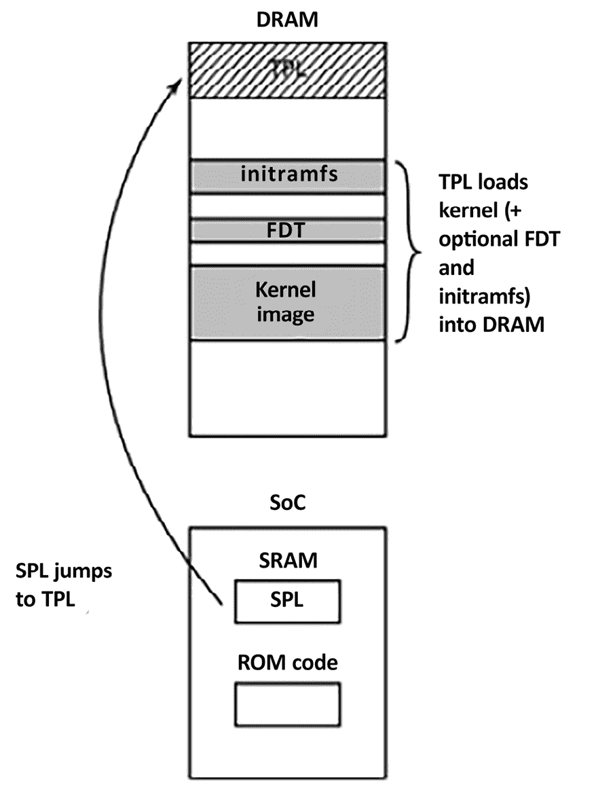

# 所有关于引导加载程序的内容

引导加载程序是嵌入式 Linux 的第二个元素。它是启动系统并加载操作系统内核的部分。在本章中，我们将探讨引导加载程序的作用，以及它如何通过一个名为**设备树**的数据结构将控制权从自己传递给内核，设备树也称为**扁平设备树**或**FDT**。

我将介绍设备树的基础知识，以便您能够理解设备树中描述的连接并将其与实际硬件关联起来。我将重点介绍一个流行的开源引导加载程序 U-Boot，并展示如何使用它启动目标设备。我还将展示如何使用 BeaglePlay 作为示例，自定义 U-Boot 以便在新设备上运行。

本章将涵盖以下内容：

+   引导加载程序的作用是什么？

+   启动顺序

+   从引导加载程序到内核的过渡

+   介绍设备树

+   U-Boot

# 技术要求

要进行示例操作，请确保您拥有以下内容：

+   一台安装有 `device-tree-compiler`、`git`、`make`、`patch` 和 `u-boot-tools` 的 Ubuntu 24.04 或更高版本 LTS 主机系统

+   一个来自*第二章*的 BeaglePlay Bootlin 工具链

+   一个 microSD 卡读卡器和卡片

+   一条 3.3 V 逻辑电平的 USB 到 TTL 串口电缆

+   BeaglePlay

+   一款能够提供 3 A 电流的 5 V USB-C 电源

本章的所有代码可以在书籍的 GitHub 仓库中的 `Chapter03` 文件夹中找到：[`github.com/PacktPublishing/Mastering-Embedded-Linux-Development/tree/main/Chapter03`](https://github.com/PacktPublishing/Mastering-Embedded-Linux-Development/tree/main/Chapter03)。

# 引导加载程序的作用是什么？

在嵌入式 Linux 系统中，引导加载程序有两个主要任务：将系统初始化到基本状态并加载内核。实际上，第一个任务在某种程度上是从属于第二个任务的，因为它只需要将系统启动到足以加载内核的程度。

当引导加载程序的第一行代码在开机或重启后执行时，系统处于非常简化的状态。**动态随机存取内存**（**DRAM**）控制器尚未设置，因此主内存不可访问。同样，其他接口也没有配置，因此通过**NAND**（**非与**）**闪存**控制器、**多媒体卡**（**MMC**）控制器等访问的存储也不可用。通常，开始时唯一可用的资源是一个 CPU 核心、一些片上**静态随机存取内存**（**SRAM**）和引导**只读存储器**（**ROM**）。

系统启动包括几个阶段的代码，每个阶段使系统的更多部分投入运行。引导加载程序的最后一步是将内核加载到 RAM 中，并为其创建一个执行环境。引导加载程序与内核之间的接口细节是架构特定的，但在每种情况下，它需要做两件事。首先，引导加载程序必须传递一个指针，指向包含硬件配置相关信息的结构。其次，它必须传递一个指针，指向内核命令行。

内核命令行是一个文本字符串，用于控制 Linux 的行为。一旦内核开始执行，引导加载程序就不再需要，所有它所占用的内存可以被回收。

引导加载程序的一个辅助任务是提供一个维护模式，用于更新引导配置、将新的引导映像加载到内存中，甚至可能执行诊断。通常通过一个简单的命令行用户界面来控制，通常是通过串行控制台。

# 启动序列

几年前，我们只需要将引导加载程序放置在处理器的复位矢量处的非易失性存储器中。当时**NOR**（**非或**）**闪存**存储器很常见，并且由于它可以直接映射到地址空间，因此是理想的存储方法。以下图示展示了这样一种配置，其中**复位矢量**位于`0xfffffffc`，位于闪存区域的顶部：


图 3.1 – NOR 闪存

引导加载程序被链接，以便在该位置有一个跳转指令，指向引导加载程序代码的起始位置。从那时起，运行在 NOR 闪存中的引导加载程序代码可以初始化 DRAM 控制器，使得主内存——**DRAM**——变得可用，然后它将自己复制到 DRAM 中。引导加载程序完全运行后，可以将内核从闪存加载到 DRAM 中，并将控制权转交给内核。

然而，一旦你远离像 NOR 闪存这样简单的线性可寻址存储介质，启动序列就会变成一个复杂的多阶段过程。具体细节因每个 SoC 而异，但它们通常会经过以下几个阶段。

## 阶段 1 – ROM 代码

在没有可靠外部存储器的情况下，复位或开机后立即运行的代码存储在 SoC 芯片上。这被称为**ROM 代码**。它在芯片制造时就被加载，因此 ROM 代码是专有的，不能被开源等效物替代。

ROM 代码不包括初始化内存控制器的代码，因为 DRAM 的配置高度依赖于设备，因此只能使用不需要内存控制器的 SRAM。大多数嵌入式 SoC 设计在芯片上都有少量的 SRAM，大小从最小的 4 KB 到几百 KB 不等。


图 3.2 – 阶段 1 – ROM 代码

ROM 代码可以从多个预编程位置之一加载一小段代码到 SRAM 中。例如，TI Sitara 芯片尝试从 NAND 闪存的前几页或通过**串行外设接口**（**SPI**）连接的闪存加载代码。它们还尝试从像 eMMC 芯片或 SD 卡这样的 MMC 设备的第一个分区中名为**MLO**（**Memory Loader**）的文件中加载代码。如果从所有这些存储设备读取失败，则尝试从以太网、USB 或 UART 读取字节流。后者主要用于在生产中将代码加载到闪存中，而不是用于正常操作。

大多数嵌入式 SoC 都有类似方式工作的 ROM 代码。在 SRAM 不足以加载诸如 U-Boot 之类的完整引导加载程序的 SoC 中，需要有一个称为**次级程序加载器**（**SPL**）的中间加载器。在 ROM 代码阶段结束时，SPL 存在于 SRAM 中，并且 ROM 代码跳转到该代码的开头。

## 第 2 阶段 – 次级程序加载器

SPL 必须设置内存控制器和系统的其他重要部分，以准备将**第三级程序加载器**（**TPL**）加载到 DRAM 中。SPL 的功能受 SRAM 大小的限制。它可以像 ROM 代码一样从存储设备列表中读取程序，再次使用从闪存设备起始处的预编程偏移量。

如果 SPL 内置文件系统驱动程序，它可以从磁盘分区读取像`u-boot.img`这样的众所周知的文件名。通常 SPL 不允许用户交互，但它可能会打印版本信息和进度消息，您可以在控制台上看到。以下图显示了第 2 阶段的架构：


图 3.3 – 第 2 阶段 – SPL

前面的图显示了从 ROM 代码到 SPL 的跳转。当 SPL 在 SRAM 中执行时，它将 TPL 加载到 DRAM 中。第二阶段结束时，TPL 存在于 DRAM 中，SPL 可以跳转到该区域。

SPL 可能是开源的，例如 Atmel AT91Bootstrap 就是如此，但它通常包含供应商提供的作为二进制 blob 的专有代码。

## 第 3 阶段 – 第三级程序加载器

此时，我们正在运行一个完整的引导加载程序，例如 U-Boot，稍后我们将在本章中详细了解。通常，有一个简单的命令行用户界面，可以让您执行维护任务，例如将新的引导和内核映像加载到闪存中，以及自动加载内核而无需用户干预。以下图解释了第 3 阶段的架构：



图 3.4 – 第 3 阶段 – TPL

上面的图示展示了从 SRAM 中的 SPL 到 DRAM 中的 TPL 的跳转。当 TPL 执行时，它将内核加载到 DRAM 中。如果需要，我们还可以选择将 FDT 和/或初始 RAM 磁盘附加到 DRAM 中的镜像中。无论哪种方式，在第三阶段结束时，内存中都有一个等待启动的内核。

嵌入式引导加载程序通常在内核运行后从内存中消失，不再参与系统的操作。在此之前，TPL 需要将引导过程的控制权交给内核。

# 从引导加载程序到内核的过渡

当引导加载程序将控制权交给内核时，它必须传递一些基本信息，包括以下内容：

+   机器号，在没有设备树支持的 PowerPC 和 Arm 平台上，用来标识 SoC 的类型

+   目前已检测到的硬件的基本信息，包括（至少）物理 RAM 的大小和位置以及 CPU 的时钟速度

+   内核命令行

+   可选地，设备树二进制文件的位置和大小

+   可选地，初始 RAM 磁盘的位置和大小，称为**初始 RAM 文件系统**（**initramfs**）

内核命令行是一个纯 ASCII 字符串，通过它可以控制 Linux 的行为，例如，指定包含根文件系统的设备名称。我们将在下一章详细介绍内核命令行。通常会提供根文件系统作为 RAM 磁盘，在这种情况下，引导加载程序的责任是将 RAM 磁盘镜像加载到内存中。我们将在*第五章*中介绍如何创建初始 RAM 磁盘。

这种信息传递方式取决于架构，并且近年来发生了变化。例如，在 PowerPC 中，引导加载程序通常只会传递指向板级信息结构的指针，而在 Arm 中，它传递指向 A 标签列表的指针。关于 A 标签格式的详细描述可以在内核源代码树中的`Documentation/arch/arm/booting.rst`找到。你可以浏览内核源代码树：[`github.com/torvalds/linux`](https://github.com/torvalds/linux)。

在这两种情况下，传递的信息量都非常有限，剩下的部分要么在运行时发现，要么作为**平台数据**硬编码到内核中。平台数据的广泛使用意味着每块开发板都必须有一个为该平台配置和修改过的内核。需要一种更好的方法，而这种方法就是设备树。

在 Arm 领域，摆脱 A 标签的转变始于 2013 年 2 月，当时 Linux 3.8 发布。今天，几乎所有 Arm 系统都使用设备树来收集硬件平台的具体信息。这使得单一内核二进制文件可以在多种 Arm 平台上运行。

现在我们已经了解了引导加载程序的作用、引导序列的各个阶段以及它如何将控制权交给内核，接下来让我们学习如何配置一个引导加载程序，以便它能够在流行的嵌入式 SoC 上运行。

# 介绍设备树

如果您正在使用 Arm 或 PowerPC SoC，您几乎可以肯定在某个时刻会遇到设备树。本节旨在为您提供一个快速概述，了解设备树是什么以及它们如何工作。我们将在本书的后续章节中反复讨论设备树的话题。

设备树是一种灵活的定义计算机系统硬件组件的方式。请记住，设备树只是静态数据，而不是可执行代码。通常，设备树由引导加载程序加载并传递给内核，尽管也可以将设备树与内核镜像捆绑在一起，以便支持那些无法单独加载设备树的引导加载程序。

该格式源自 Sun Microsystems 的引导加载程序 **OpenBoot**，并被正式化为 Open Firmware 规范（IEEE 标准 IEEE1275-1994）。它曾被用于基于 PowerPC 的 Macintosh 计算机，因此是 PowerPC Linux 移植的一个合乎逻辑的选择。从那时起，它已被大量采用，广泛用于许多 Arm Linux 实现，并在较小范围内应用于 MIPS、MicroBlaze、ARC 和其他架构。

我建议访问 [`www.devicetree.org`](https://www.devicetree.org) 获取更多信息。

## 设备树基础

Linux 内核包含大量的设备树源文件，位于 `arch/$ARCH/boot/dts` 目录下，这里是学习设备树的一个很好的起点。此外，U-Boot 源代码包含较少的源文件，位于 `arch/$ARCH/dts` 目录下。如果您从第三方获得了硬件，`dts` 文件是板卡支持包的一部分，因此您应该预期会收到它以及其他源文件。

设备树将计算机系统表示为一个层次结构中连接在一起的组件集合。每个设备树以一个根节点开始，该根节点由一个斜杠（`/`）表示，后续的子节点描述了系统的硬件。每个节点都有一个名称，并包含多个以 `name = "value"` 形式的属性。以下是一个简单的示例：

```
/dts-v1/;
/{
    model = "TI AM335x BeagleBone";
    compatible = "ti,am33xx";
    #address-cells = <1>;
    #size-cells = <1>;
    cpus {
        #address-cells = <1>;
        #size-cells = <0>;
        cpu@0 {
            compatible = "arm,cortex-a8";
            device_type = "cpu";
            reg = <0>;
        };
    };
    memory@80000000 {
        device_type = "memory";
        reg = <0x80000000 0x20000000>; /* 512 MB */
    };
}; 
```

在这里，我们有一个根节点，它包含一个 `cpus` 节点和一个 `memory` 节点。`cpus` 节点包含一个名为 `cpu@0` 的单一 CPU 节点。这些节点的名称通常包括一个 `@`，后面跟着一个地址，用以区分同类型的其他节点。如果节点有 `reg` 属性，则必须使用 `@`。

根节点和 CPU 节点都有一个 `compatible` 属性。Linux 内核使用这个属性通过将其与每个设备驱动程序在 `of_device_id` 结构中导出的字符串进行比较，从而找到匹配的设备驱动程序（更多内容请参见 *第十一章*）。

**重要提示**

传统上，`compatible` 属性的值由制造商名称和组件名称组成，以减少由不同制造商制造的类似设备之间的混淆，因此有 `ti,am33xx` 和 `arm,cortex-a8`。当有多个驱动程序可以处理此设备时，`compatible` 属性具有多个值是非常常见的。它们按照最适合的顺序列出。

CPU 节点和内存节点都有一个 `device_type` 属性，用于描述设备的类别。节点名称通常来源于 `device_type`。

## `reg` 属性

先前显示的 `memory` 和 `cpu` 节点具有 `reg` 属性，该属性引用寄存器空间中的一系列单元。`reg` 属性由两个值组成，表示实际物理地址和范围的大小（长度）。两者都写成零或多个称为单元的 32 位整数。因此，先前的 `memory` 节点引用了从 `0x80000000` 开始、长度为 `0x20000000` 字节的内存单元。

当地址或大小值无法用 32 位表示时，理解 `reg` 属性变得更加复杂。例如，在具有 64 位寻址的设备上，每个地址或大小值需要两个单元：

```
/{
    #address-cells = <2>;
    #size-cells = <2>;
    memory@80000000 {
        device_type = "memory";
        reg = <0x00000000 0x80000000 0 0x80000000>;
    };
}; 
```

关于所需单元数的信息存储在祖先节点的 `#address-cells` 和 `#size_cells` 属性中。换句话说，要理解 `reg` 属性，你必须向节点层次结构向后查找，直到找到 `#address-cells` 和 `#size_cells`。如果没有，则默认值为每个都是 `1` —— 但依赖默认值是设备树编写者的不良实践。默认值可能明显，也可能不明显，因此明确表示可以避免任何误解。

现在，让我们回到 `cpu` 和 `cpus` 节点。CPU 也有地址。在四核设备中，它们可能被寻址为 `0`、`1`、`2` 和 `3`。可以将其视为一个没有深度的一维数组，因此大小为零。因此，你可以看到在 `cpus` 节点中我们有 `#address-cells = <1>` 和 `#size-cells = <0>`。在子节点 `cpu@0` 中，我们通过 `reg = <0>` 为 `reg` 属性分配了一个单一值。

## 标签和中断

到目前为止描述的设备树结构假设存在单一的组件层次结构，实际上可能有几个。除了组件与系统其他部分之间的明显数据连接外，节点还可能连接到中断控制器、时钟源和电压调节器。

为了表达这些连接，我们可以向节点添加标签，并从其他节点引用该标签。这些标签有时被称为**phandles**，因为在编译设备树时，具有从另一个节点引用的节点会在称为 `phandle` 的属性中被分配一个唯一的数值。

如果你反编译设备树二进制文件，你可以看到 phandle。以包含一个可以生成`interrupts`和`interrupt-controller`的 LCD 控制器的系统为例：

```
/dts-v1/;
{
    intc: interrupt-controller@48200000 {
        compatible = "ti,am33xx-intc";
        interrupt-controller;
        #interrupt-cells = <1>;
        reg = <0x48200000 0x1000>;
    };
    lcdc: lcdc@4830e000 {
        compatible = "ti,am33xx-tilcdc";
        reg = <0x4830e000 0x1000>;
        interrupt-parent = <&intc>;
        interrupts = <36>;
        ti,hwmods = "lcdc";
        status = "disabled";
    };
}; 
```

这里，我们有一个`interrupt-controller@48200000`节点，标签为`intc`。`interrupt-controller`属性将其标识为一个中断控制器。像所有中断控制器一样，它有一个`#interrupt-cells`属性，告诉我们表示中断源需要多少个单元。在这个例子中，只有一个单元表示**中断请求**（**IRQ**）编号。

其他中断控制器可能会使用附加的单元来表征中断，例如，指示它是边沿触发还是电平触发。中断单元的数量及其含义在每个中断控制器的绑定文件中有所描述。设备树绑定可以在 Linux 内核源代码中的`Documentation/devicetree/bindings`目录下找到。

查看`lcdc@4830e000`节点，它有一个`interrupt-parent`属性，引用了它所连接的中断控制器，并使用标签。它还有一个`interrupts`属性，这里为`36`。注意，这个节点有自己的标签`lcdc`，该标签在其他地方也会使用。任何节点都可以有标签。

## 设备树包含文件

```
vexpress-v2p-ca9.dts:
```

```
/include/ "vexpress-v2m.dtsi" 
```

浏览内核中的`.dts`文件，你会发现一个借用自 C 语言的替代`include`语句；例如，这在`am335x-boneblack.dts`中：

```
#include "am33xx.dtsi"
#include "am335x-bone-common.dtsi" 
```

这是来自`am33xx.dtsi`的另一个例子：

```
#include <dt-bindings/gpio/gpio.h>
#include <dt-bindings/pinctrl/am33xx.h>
#include <dt-bindings/clock/am3.h> 
```

最后，`include/dt-bindings/pinctrl/am33xx.h`包含了普通的 C 宏：

```
#define PULL_DISABLE       (1 << 3)
#define INPUT_EN           (1 << 5)
#define SLEWCTRL_SLOW      (1 << 6)
#define SLEWCTRL_FAST             0 
```

如果使用 Kbuild 系统构建设备树源文件，所有这些问题都可以得到解决，Kbuild 系统会通过 C 预处理器（CPP）处理它们。CPP 将`#include`和`#define`语句处理成适合设备树编译器的文本。动机通过之前的例子进行了说明。这意味着设备树源文件可以使用与内核代码相同的常量定义。

当我们使用任何语法包含文件时，节点会彼此重叠，创建一个复合树，其中外层扩展或修改内层。例如，`am33xx.dtsi`是针对所有`am33xx` SoC 的通用文件，它像这样定义了第一个 MMC 控制器接口：

```
mmc1: mmc@48060000 {
    compatible = "ti,omap4-hsmmc";
    ti,hwmods = "mmc1";
    ti,dual-volt;
    ti,needs-special-reset;
    ti,needs-special-hs-handling;
    dmas = <&edma_xbar 24 0 0
            &edma_xbar 25 0 0>;
    dma-names = "tx", "rx";
    interrupts = <64>;
    reg = <0x48060000 0x1000>;
    status = "disabled";
}; 
```

请注意，`status`为`disabled`，这意味着没有设备驱动程序应该绑定到它，而且它的标签为`mmc1`。

BeagleBone 和 BeagleBone Black 都有一个连接到`mmc1`的 microSD 卡接口。这就是为什么在`am335x-bone-common.dtsi`中，通过与符号`&`一起使用它的标签`&mmc1`来引用相同的节点：

```
&mmc1 {
    status = "okay";
    bus-width = <0x4>;
    pinctrl-names = "default";
    pinctrl-0 = <&mmc1_pins>;
    cd-gpios = <&gpio0 6 GPIO_ACTIVE_LOW>;
}; 
```

通过使用与标签关联的符号（&）来引用节点，可以覆盖之前 `mmc1` 条目的属性。在这里，`status` 属性被设置为 `okay`，这使得 MMC 设备驱动程序在 BeagleBone 的两个变种上都在运行时与该接口绑定。此外，还在引脚控制配置 `mmc1_pins` 中添加了对标签的引用。遗憾的是，本文没有足够的篇幅来描述引脚控制和引脚复用。有关更多信息，可以参考 Linux 内核源代码中 `Documentation/devicetree/bindings/pinctrl` 目录下的文档。

然而，BeagleBone Black 上的 `mmc1` 接口连接到一个不同的电压调节器。这在 `am335x-boneblack.dts` 文件中有所体现，你会看到另一个对 `mmc1` 的引用，它通过 `vmmcsd_fixed` 标签将其与电压调节器关联：

```
&mmc1 {
    vmmc-supply = <&vmmcsd_fixed>;
}; 
```

因此，以这种方式分层设备树源文件为我们提供了灵活性，并减少了重复代码的需要。

## 编译设备树

引导加载程序和内核需要设备树的二进制表示形式，因此必须使用设备树编译器 `dtc` 来编译。编译后的结果是一个以 `.dtb` 结尾的文件，这被称为设备树二进制文件或设备树 Blob。

在 Linux 源代码中的 `scripts/dtc/dtc` 目录里有 `dtc` 的副本，而且它也可以作为包在许多 Linux 发行版中使用。你可以用它来编译一个简单的设备树（不使用 `#include`）：

```
$ dtc simpledts-1.dts -o simpledts-1.dtb
DTC: dts->dts on file "simpledts-1.dts" 
```

请注意，`dtc` 并不会提供有用的错误信息，只会检查语言的基本语法。因此，调试设备树源文件中的输入错误可能是一个漫长的过程。

要构建更复杂的示例，您必须使用 Kbuild 内核，如 *第四章* 所示。

与内核类似，引导加载程序可以使用设备树来初始化嵌入式 SoC 及其外设。当你从如 QSPI 闪存等大容量存储设备加载内核时，设备树至关重要。虽然嵌入式 Linux 提供了多种引导加载程序的选择，但我们这里只讨论其中一个。接下来我们将深入研究这个引导加载程序。

# U-Boot

我们将专注于 U-Boot，因为它支持多种处理器架构以及大多数单板和设备。U-Boot，或其全名 **Das U-Boot**，最初作为一个开源的嵌入式 PowerPC 板的引导加载程序诞生。随后，它被移植到基于 Arm 的板子，后来又移植到其他架构，包括 **无锁管道阶段的微处理器**（**MIPS**）和 **SuperH**（**SH**）。

U-Boot 已经存在很长时间，并且有一个活跃的社区。该项目由 DENX Software Engineering 主办并维护。有大量关于 U-Boot 的信息，好的入门点是 [`u-boot.readthedocs.io`](https://u-boot.readthedocs.io)。此外，还有一个邮件列表 [u-boot@lists.denx.de](https://u-boot@lists.denx.de)，你可以通过填写并提交 [`lists.denx.de/listinfo/u-boot`](https://lists.denx.de/listinfo/u-boot) 上的表格来订阅。

## 构建 U-Boot

首先获取源代码。像大多数项目一样，推荐的方式是克隆 Git 仓库，并检查你打算使用的标签：

```
$ git clone git://git.denx.de/u-boot.git u-boot-mainline
$ cd u-boot-mainline
$ git checkout v2024.04 
```

或者，你可以从 [`ftp.denx.de/pub/u-boot/`](https://ftp.denx.de/pub/u-boot/) 下载一个 tarball。

`configs` 目录中有超过 1,000 个用于常见开发板和设备的配置文件。在大多数情况下，你可以根据文件名大致猜测使用哪个配置文件。但你可以通过查看 `doc/board` 目录下的 `.rst` 文件获取更详细的信息。或者，你也可以在适当的网页教程或论坛中查找相关信息。

以 BeaglePlay 为例，我们会发现 `configs` 目录下有一个名为 `am62x_evm_a53_defconfig` 的配置文件。在同一目录中，还有一个名为 `am62x_evm_r5_defconfig` 的配置文件，它是针对 BeaglePlay 的 Arm Cortex-R5F 微控制器的。ROM 代码运行在 Arm Cortex-R5F 微控制器上，而 TPL 运行在主 Arm Cortex-A53 CPU 上。这里有两个 U-Boot SPL：一个运行在 R5 上，另一个运行在主 CPU 上。在 `doc/board/beagle/am62x_beagleplay.rst` 文件中有一个顺序图，详细解释了 BeaglePlay 独特的启动流程。仔细查看这个顺序图，确保你理解它。在本章的后续内容中，遇到不明确的地方，可以参考这个图进行澄清。

为 BeaglePlay 构建 U-Boot 是一个多阶段的过程。BeaglePlay 的 `am62x` SoC 中的 Arm Cortex-M4F 和 Cortex-R5F 是 32 位处理器，因此它们需要一个 32 位的工具链。一个名为 **TI Foundational Security**（**TIFS**）的软件组件运行在 M4 上。TIFS 启动 R5，并要求其加载一个固件映像到 TIFS 核心中。这意味着，在为 R5 生成启动加载器映像时，我们需要将 TIFS 二进制固件映像与 U-Boot SPL 一起捆绑。接下来，我们需要使用 64 位工具链为主 A53 CPU 构建 **Trusted Firmware-A**（**TF-A**）。最后，我们为主 CPU 配置并构建 U-Boot SPL 和 TPL。

### 获取 32 位工具链

打开您的浏览器，访问[`developer.arm.com/downloads/-/arm-gnu-toolchain-downloads`](https://developer.arm.com/downloads/-/arm-gnu-toolchain-downloads)。搜索**Downloads: 13.2.Rel1**，点击前面的加号展开该部分。然后点击`arm-gnu-toolchain-13.2.rel1-x86_64-arm-none-eabi.tar.xz`文件，在 x86_64 Linux 宿主的交叉工具链**AArch32 裸机目标**(**arm-none-eabi**)下下载工具链。

以下 R5 练习已使用该版本的 Arm GNU 工具链成功执行。我建议从该网页下载相同版本的工具链（如果它仍然可用），以避免任何问题。

在您的主目录中安装 32 位工具链：

```
$ cd ~
$ tar -xvf ~/Downloads/arm-gnu-toolchain-13.2.rel1-x86_64-arm-none-eabi.tar.xz 
```

将 32 位工具链添加到您的`PATH`环境变量中：

```
$ export PATH=${HOME}/arm-gnu-toolchain-13.2.Rel1-x86_64-arm-none-eabi/bin/:$PATH 
```

现在，您可以为 R5 构建 U-Boot 了。确保将前述命令中的`13.2.rel1`和`13.2.Rel1`替换为您下载的 32 位工具链的实际版本。

### 为 R5 构建 U-Boot SPL

当我在 2023 年 11 月编写这篇文章时，主线 U-Boot 对 BeaglePlay 的支持还很新。因此，我选择使用 BeagleBoard.org 为 BeaglePlay 提供的 U-Boot 分支。我建议从相同的 Git 仓库（如果仍然可用）构建 U-Boot 源代码，以避免任何问题。

将 U-Boot 分支克隆到您的主目录，并检出一个稳定的提交：

```
$ git clone https://github.com/beagleboard/u-boot u-boot-beagleplay
$ cd u-boot-beagleplay
$ git checkout f036fb 
```

安装为 BeaglePlay 构建 U-Boot 所需的包：

```
$ sudo apt install bison device-tree-compiler flex libncurses-dev libssl-dev python3-dev python3-setuptools swig 
```

为 R5 配置并构建 U-Boot：

1.  首先，为 R5 创建一个构建目录，向上一层共享构建产物：

    ```
    $ mkdir -p ../build_uboot/r5 
    ```

1.  接下来，为 32 位 Arm 设置`ARCH`和`CROSS_COMPILE`环境变量：

    ```
    $ export ARCH=arm
    $ export CROSS_COMPILE=arm-none-eabi- 
    ```

1.  选择`am62x_evm_r5_defconfig`进行构建：

    ```
    $ make am62x_evm_r5_defconfig O=../build_uboot/r5 
    ```

1.  运行`make menuconfig`进一步配置 U-Boot 以进行构建：

    ```
    $ make menuconfig O=../build_uboot/r5 
    ```

    +   进入**环境**子菜单。

    +   选择**环境位于 EXT4 文件系统中**。


图 3.5 – 选择环境位于 EXT4 文件系统中

1.  在该菜单页面上取消选择任何其他选项（例如，MMC、NAND 和 SPI）作为环境存储。

1.  在**环境的块设备名称**文本字段中输入`mmc`。


图 3.6 – 环境的块设备名称

1.  在**EXT4 中存储环境的设备和分区**文本字段中输入`1:2`。


图 3.7 – EXT4 中存储环境的设备和分区

1.  确保`/uboot.env`是**用于环境的 EXT4 文件名**文本字段。


图 3.8 – 环境

1.  退出**环境**子菜单。

1.  进入**SPL/TPL**子菜单。

1.  选择**支持 EXT 文件系统**。


图 3.9 – 选择支持 EXT4 文件系统

1.  退出**SPL/TPL**子菜单。

1.  进入**Boot Options**子菜单。

1.  选择**启用 bootcmd 的默认值**。


图 3.10 – 选择启用 bootcmd 的默认值。

1.  在**bootcmd value**文本字段中输入`echo 'no bootcmd yet'`。


图 3.11 – bootcmd value。


图 3.12 – 启动选项。

1.  退出`menuconfig`，并在询问是否保存新配置时选择**是**。

1.  最后，为 R5 构建 U-Boot：

    ```
    $ make O=../build_uboot/r5 
    ```

当 U-Boot 构建完成时，应该在`../build_uboot/r5/spl`目录下找到 R5 的 SPL 二进制文件。

请参考`doc/board/beagle/am62x_beagleplay.rst`中的启动流程序列图。

### 为 R5 生成镜像。

回顾一下，加载到 M4 中的 TIFS 固件镜像需要与 R5 的 U-Boot SPL 一起打包。我们直接从 TI 获取二进制 TIFS 固件镜像。

将 TI 固件仓库克隆到你的主目录：

```
$ cd ~
$ git clone https://github.com/TexasInstruments-Sandbox/ti-linux-firmware.git
$ cd ti-linux-firmware
$ git checkout c126d386 
```

将 M4 的 TIFS 固件镜像与 R5 的 U-Boot SPL 一起打包，需要一个名为`k3-image-gen`的工具。

将`k3-image-gen`仓库克隆到你的主目录：

```
$ cd ~
$ git clone git://git.ti.com/k3-image-gen/k3-image-gen.git
$ cd k3-image-gen
$ git checkout 150f195 
```

通过在`k3-image-gen`目录中运行`make`并将 U-Boot SPL 和 TIFS 固件镜像的路径作为参数传递，生成 R5 的合并镜像：

```
$ make SOC=am62x SBL=../build_uboot/r5/spl/u-boot-spl.bin SYSFW_PATH=../ti-linux-firmware/ti-sysfw/ti-fs-firmware-am62x-gp.bin 
```

现在，`k3-image-gen`目录中应该有一个`tiboot3.bin`文件。

请参考`doc/board/beagle/am62x_beagleplay.rst`中的启动流程序列图。

### 为主 A53 CPU 构建 TF-A。

BeaglePlay 中`am62x` SoC 的 A53 是 64 位 CPU，因此我们必须切换到 64 位工具链，以交叉编译源代码。我们将使用你在主目录中安装的*第二章*中的相同 64 位 Bootlin 工具链。

将该 64 位 Bootlin 工具链添加到你的`PATH`环境变量中：

```
$ export PATH=${HOME}/aarch64--glibc--stable-2024.02-1/bin/:$PATH 
```

确保将前述命令中的`2024.02-1`替换为你下载的实际 64 位工具链版本。

将 TF-A 源代码克隆到你的主目录，并检出一个稳定的发布标签：

```
$ cd ~
$ git clone https://github.com/ARM-software/arm-trusted-firmware.git
$ cd arm-trusted-firmware
$ git checkout v2.9 
```

为 A53 配置并构建 TF-A：

1.  为 64 位 Arm 设置`ARCH`和`CROSS_COMPILE`环境变量：

    ```
    $ export ARCH=aarch64
    $ export CROSS_COMPILE=aarch64-buildroot-linux-gnu- 
    ```

1.  为 A53 构建 TF-A，并指定`k3`作为平台，`lite`作为目标板：

    ```
    $ make PLAT=k3 TARGET_BOARD=lite 
    ```

当 TF-A 构建完成时，应该在`./build/k3/lite/release`目录下找到 A53 的`bl31.bin`文件。

请参考`doc/board/beagle/am62x_beagleplay.rst`中的启动流程序列图。

### 为主 A53 CPU 构建 U-Boot。

到目前为止执行的所有构建步骤都是 BeaglePlay 中`am62x` SoC 特有的。为大多数目标构建 U-Boot 只需要为主 CPU 编译 SPL 和 TPL。我们将使用你在主目录中安装的*第二章*中的相同 64 位 Bootlin 工具链。

将该 64 位 Bootlin 工具链添加到你的`PATH`环境变量中：

```
$ export PATH=${HOME}/aarch64--glibc--stable-2024.02-1/bin/:$PATH 
```

确保在上述命令中将`2024.02-1`替换为你下载的 64 位工具链的实际版本。

配置并为 A53 构建 U-Boot：

1.  首先，导航回 BeaglePlay 的`u-boot`源代码树：

    ```
    $ cd ~
    $ cd u-boot-beagleplay 
    ```

1.  接下来，在上一层级创建 A53 的构建目录：

    ```
    $ mkdir -p ../build_uboot/a53 
    ```

1.  设置`ARCH`和`CROSS_COMPILE`环境变量为 64 位 Arm：

    ```
    $ export ARCH=aarch64
    $ export CROSS_COMPILE=aarch64-buildroot-linux-gnu- 
    ```

1.  选择`am62x_evm_a53_defconfig`进行构建：

    ```
    $ make am62x_evm_a53_defconfig O=../build_uboot/a53 
    ```

1.  运行`make menuconfig`进一步配置 U-Boot 以进行构建：

    ```
    $ make menuconfig O=../build_uboot/a53 
    ```

1.  进入**环境**子菜单。

1.  选择**环境在 EXT4 文件系统中**。

1.  取消选择该菜单页面上的其他选项（例如 MMC、NAND 和 SPI）作为环境存储。

1.  在**环境的块设备名称**文本框中输入`mmc`。

1.  在**为 EXT4 存储环境的设备和分区**文本框中输入`1:2`。

1.  确保在**用于环境的 EXT4 文件名称**文本框中输入`/uboot.env`。

1.  退出**环境**子菜单。

1.  进入**SPL/TPL**子菜单。

1.  选择**支持 EXT 文件系统**。

1.  退出**SPL/TPL**子菜单。

1.  进入**启动选项**子菜单。

1.  选择**启用默认的 bootcmd 值**。

1.  在**bootcmd 值**文本框中输入`echo 'no bootcmd yet'`。

1.  退出`menuconfig`并在被询问是否保存新配置时选择**是**。

1.  最后，构建 U-Boot 以 A53 为目标，并将 TI 的 TF-A 和 DM 固件路径作为参数传递给`make`：

    ```
    $ make ATF=$HOME/arm-trusted-firmware/build/k3/lite/release/bl31.bin DM=$HOME/ti-linux-firmware/ti-dm/am62xx/ipc_echo_testb_mcu1_0_release_strip.xer5f O=../build_uboot/a53 
    ```

    **重要说明**

    在`make`命令中始终使用绝对路径，而非相对路径`./`，指向`ATF`和`DM`固件。否则，生成的 SPL 和 U-Boot 二进制文件在大小和内容上都会不正确。

编译结果如下：

+   `u-boot`：U-Boot 的 ELF 格式，适用于调试器

+   `u-boot.map`：符号表

+   `u-boot.bin`：U-Boot 的原始二进制格式，适合在你的设备上运行

+   `u-boot.img`：`u-boot.bin`加上 U-Boot 头部，适合上传到运行中的 U-Boot 副本

+   `u-boot.srec`：U-Boot 的摩托罗拉 S 记录格式（**SRECORD**或**SRE**），适合通过串行连接传输

BeaglePlay 还需要一个 SPL，如前所述。它与 U-Boot 同时构建，并命名为`tispl.bin`（在`doc/board/beagle/am62x_beagleplay.rst`中的启动流程图）：

```
$ cd ~
$ cd build_uboot/a53
$ ls -l tispl.bin
-rw-rw-r-- 1 frank frank 549508 Jun 29 20:31 tispl.bin
$ ls -l u-boot*
-rwxrwxr-x 1 frank frank 6779128 Jun 29 20:31 u-boot
-rw-rw-r-- 1 frank frank 1098236 Jun 29 20:31 u-boot.bin
-rw-rw-r-- 1 frank frank   18246 Jun 29 20:30 u-boot.cfg
-rw-rw-r-- 1 frank frank   11563 Jun 29 20:31 u-boot.cfg.configs
-rw-rw-r-- 1 frank frank   37485 Jun 29 20:31 u-boot.dtb
-rw-rw-r-- 1 frank frank 1060788 Jun 29 20:31 u-boot-dtb.img
-rw-rw-r-- 1 frank frank 1098236 Jun 29 20:31 u-boot-fit-dtb.bin
-rw-rw-r-- 1 frank frank 1060788 Jun 29 20:31 u-boot.img
-rw-rw-r-- 1 frank frank 1060788 Jun 29 20:31 u-boot.img_HS
-rw-rw-r-- 1 frank frank    1348 Jun 29 20:31 u-boot.lds
-rw-rw-r-- 1 frank frank  765615 Jun 29 20:31 u-boot.map
-rwxrwxr-x 1 frank frank  993104 Jun 29 20:31 u-boot-nodtb.bin
-rwxrwxr-x 1 frank frank  993104 Jun 29 20:31 u-boot-nodtb.bin_HS
-rw-rw-r-- 1 frank frank    1836 Jun 29 20:31 u-boot-spl-k3_HS.its
-rwxrwxr-x 1 frank frank 2979442 Jun 29 20:31 u-boot.srec
-rw-rw-r-- 1 frank frank  342412 Jun 29 20:31 u-boot.sym 
```

其他目标的过程类似。

## 安装 U-Boot

第一次在板上安装引导加载程序需要一些手动干预。如果板子有硬件调试接口，比如**联合测试动作组**（**JTAG**），通常可以直接将 U-Boot 的副本加载到 RAM 中并使其运行。之后，你可以使用 U-Boot 命令将其复制到闪存中。具体细节因板子而异，超出了本书的范围。

许多 SoC 设计内置了一个启动 ROM，可以用来从各种外部源读取启动代码，例如 SD 卡、串行接口或 USB 大容量存储。这正是 Beagle 上的 `am62x` 芯片的情况，它使得尝试新软件变得非常容易。

您需要一个 microSD 卡读卡器来将镜像写入卡中。读卡器有两种类型：外接读卡器，通过 USB 端口连接，以及许多笔记本电脑上内置的 SD 读卡器。Linux 会在插入卡片时为其分配一个设备名称。`lsblk` 命令是一个有用的工具，可以帮助您查找分配到哪个设备。例如，当我将一张名义上是 32 GB 的 microSD 卡插入读卡器时，看到的输出如下：

```
$ lsblk
NAME        MAJ:MIN RM   SIZE RO TYPE MOUNTPOINT
sda           8:0    1  29.8G  0 disk
└─sda1        8:1    1  29.8G  0 part /media/frank/6662-6262
nvme0n1     259:0    0 465.8G  0 disk
├─nvme0n1p1 259:1    0   512M  0 part /boot/efi
├─nvme0n1p2 259:2    0    16M  0 part
├─nvme0n1p3 259:3    0 232.9G  0 part
└─nvme0n1p4 259:4    0 232.4G  0 part / 
```

在这种情况下，`nvme0n1` 是我的 512 GB 硬盘，`sda` 是 microSD 卡。它只有一个分区，`sda1`，挂载为 `/media/frank/6662-6262` 目录。

如果我使用内置的 SD 卡槽，我会看到如下：

```
$ lsblk
NAME        MAJ:MIN RM   SIZE RO TYPE MOUNTPOINT
mmcblk0     179:0    1  29.8G  0 disk
└─mmcblk0p1 179:1    1  29.8G  0 part /media/frank/6662-6262
nvme0n1     259:0    0 465.8G  0 disk
├─nvme0n1p1 259:1    0   512M  0 part /boot/efi
├─nvme0n1p2 259:2    0    16M  0 part
├─nvme0n1p3 259:3    0 232.9G  0 part
└─nvme0n1p4 259:4    0 232.4G  0 part / 
```

在这种情况下，microSD 卡显示为 `mmcblk0`，分区为 `mmcblk0p1`。请注意，您使用的 microSD 卡可能与此卡格式不同，因此可能会看到不同数量的分区以及不同的挂载点。在格式化 SD 卡时，非常重要的一点是要确保它的设备名称。你绝对不想把硬盘当作 SD 卡误格式化了。

这种情况我不止一次遇到过。所以，在本书的代码仓库中，我提供了一个名为 `MELD/format-sdcard.sh` 的 shell 脚本，其中包含了足够的检查，以防止您（和我）使用错误的设备名称。参数是 microSD 卡的设备名称，第一个例子中的设备名称是 `sda`，第二个例子中的设备名称是 `mmcblk0`。以下是它的使用示例：

```
$ MELD/format-sdcard.sh mmcblk0 
```

该脚本创建了两个分区。第一个分区为 128 MB，格式化为 FAT32，用来存放引导加载程序；第二个分区为 1 GB，格式化为 ext4，您将在 *第五章* 中使用。该脚本会在应用到任何大于 128 GB 的驱动器时中止，因此如果您使用的是更大的 microSD 卡，请准备修改脚本。

格式化完 microSD 卡后，将其从读卡器中取出，然后重新插入。将鼠标移动到并点击显示在 Ubuntu 桌面左侧的 USB 驱动器图标之一，以便打开 `boot` 分区的窗口。在当前版本的 Ubuntu 中，这两个分区会挂载为 `/media/<user>/boot` 和 `/media/<user>/rootfs`。

将 `tiboot3.bin`、`tispl.bin` 和 `u-boot.img` 复制到 `boot` 分区，像这样：

```
$ cd ~
$ cd k3-image-gen
$ cp tiboot3.bin /media/$USER/boot/.
$ cd ~
$ cd build_uboot/a53
$ cp tispl.bin u-boot.img /media/$USER/boot/. 
```

右键点击两个 USB 驱动器图标中的任意一个，选择 **弹出** 来卸载 microSD 卡。最后，从主机的读卡器中取出 microSD 卡。

要从新准备的 microSD 卡启动 BeaglePlay：

1.  在 BeaglePlay 没有通电的情况下，将 microSD 卡插入 BeaglePlay 的读卡器。

1.  将 USB 到 TTL 串行线的 USB 端插入您的主机。确保您的电缆具有 3.3 V 的逻辑电平。

1.  三针 UART 连接器位于 BeaglePlay 的 USB-C 连接器旁边。不要将电缆的第四根红线连接上。红线通常表示电源，而在这种情况下不需要，且可能会损坏板子。

1.  将电缆中的 TX 线连接到 BeaglePlay 的 RX 引脚。

1.  将电缆中的 RX 线连接到 BeaglePlay 的 TX 引脚。

1.  将电缆中的 GND（黑色）线连接到 BeaglePlay 的 GND 引脚。

1.  一个串口应该会在你的 PC 上显示为 `/dev/ttyUSB0`。

1.  启动一个合适的终端程序，如`gtkterm`、`minicom`或`picocom`，并将其连接到 115,200 **比特每秒** (**bps**) 的端口，且不使用流控制。`gtkterm`可能是最容易设置和使用的：

    ```
    $ gtkterm -p /dev/ttyUSB0 -s 115200 
    ```

1.  如果你遇到权限错误，可能需要将自己添加到 `dialout` 组中才能使用该端口，或者用 `sudo` 启动 `gtkterm`。如果串口控制台上没有输出或出现乱码，可以交换 BeaglePlay 上 RX 和 TX 引脚连接的线。

1.  按住 BeaglePlay 上的 USR 按钮。

1.  使用 USB-C 启动开发板。

1.  大约 5 秒后松开按钮。

你应该在串口控制台上看到一些输出，后跟一个 U-Boot 提示符：

```
U-Boot SPL 2021.01-gf036fbdc25 (Jun 29 2024 - 18:54:55 -0700)
SYSFW ABI: 3.1 (firmware rev 0x0009 '9.0.4--v09.00.04 (Kool Koala)')
SPL initial stack usage: 13384 bytes
Trying to boot from MMC2
spl_load_fit_image: Skip load 'tee': image size is 0!
Loading Environment from EXT4... ** File not found /uboot.env **
** Unable to read "/uboot.env" from mmc1:2 **
Starting ATF on ARM64 core...
NOTICE:  BL31: v2.9(release):v2.9.0
NOTICE:  BL31: Built : 19:01:43, Jun 29 2024
U-Boot SPL 2021.01-gf036fbdc25 (Jun 29 2024 - 20:30:20 -0700)
SYSFW ABI: 3.1 (firmware rev 0x0009 '9.0.4--v09.00.04 (Kool Koala)')
Trying to boot from MMC2
U-Boot 2021.01-gf036fbdc25 (Jun 29 2024 - 20:30:20 -0700)
SoC:   AM62X SR1.0 GP
Model: BeagleBoard.org BeaglePlay
Board: BEAGLEPLAY-A0- rev 02
DRAM:  2 GiB
MMC:   mmc@fa10000: 0, mmc@fa00000: 1, mmc@fa20000: 2
Loading Environment from EXT4... ** File not found /uboot.env **
** Unable to read "/uboot.env" from mmc1:2 **
In:    serial@2800000
Out:   serial@2800000
Err:   serial@2800000
Error: Can't set serial# to SSSS
Net:   Could not get PHY for ethernet@8000000port@1: addr 0
am65_cpsw_nuss_port ethernet@8000000port@1: phy_connect() failed
No ethernet found.
Press SPACE to abort autoboot in 2 seconds
no bootcmd yet
=> 
```

按下键盘上的任意键以停止 U-Boot 在默认环境下自动启动。现在我们面前有了一个 U-Boot 提示符，让我们开始使用 U-Boot。

## 使用 U-Boot

在本节中，我将描述一些可以使用 U-Boot 执行的常见任务。

U-Boot 提供一个串口命令行界面，提供一个为每个板定制的命令提示符。在这些示例中，我使用`=>`作为命令提示符。输入`help`会列出当前版本的 U-Boot 中配置的所有命令。输入`help <command>`会列出关于某个特定命令的更多信息。

BeaglePlay 的默认命令解释器相当简单。你无法通过按左箭头或右箭头键来编辑命令行。按*Tab*键也无法完成命令输入，按上箭头键也无法查看命令历史。按下这些键中的任何一个会打断你当前输入的命令，你需要按*Ctrl + C*并重新开始。你唯一可以安全使用的行编辑键是退格键。

作为可选项，你可以配置一个不同的命令外壳程序叫做**Hush**，它具有更复杂的交互支持，包括命令行编辑。

默认的数字格式是十六进制。考虑以下命令：

```
=> nand read 82000000 400000 200000 
```

这将从 NAND 闪存的 `0x400000` 偏移处读取 `0x200000` 字节数据到 RAM 地址 `0x82000000`。

### 环境变量

U-Boot 广泛使用环境变量来存储并传递信息，甚至用于创建脚本。环境变量是简单的`name=value`对，存储在内存区域中。变量的初始值可能在板级配置头文件中这样编写：

```
#define CONFIG_EXTRA_ENV_SETTINGS
"myvar1=value1"
"myvar2=value2" 
```

你可以通过 U-Boot 命令行使用 `setenv` 创建和修改变量。例如，`setenv foo bar` 创建名为 `foo` 的变量，并赋值为 `bar`。请注意，变量名和值之间没有 `=` 符号。你可以通过设置变量为空字符串来删除该变量，例如使用 `setenv foo`。你可以使用 `printenv` 命令打印所有变量到控制台，或使用 `printenv foo` 打印单个变量。

如果 U-Boot 配置了存储环境的空间，你可以使用 `saveenv` 命令保存环境变量。如果是原始的 NAND 或 NOR 闪存，那么可以为此目的保留一个擦除块，通常还会使用另一个擦除块作为冗余副本，以防止损坏。如果有 eMMC 或 SD 卡存储，可以将其存储在保留的扇区阵列中，或存储在磁盘分区中的名为 `uboot.env` 的文件中。其他选项包括通过 I2C 或 SPI 接口连接的串行**电可擦可编程只读存储器**（**EEPROM**）或非易失性 RAM。

### 启动镜像格式

U-Boot 没有文件系统。相反，它通过一个 64 字节的头部标记信息块，以便跟踪内容。我们使用 `mkimage` 命令行工具为 U-Boot 准备文件，该工具随 `u-boot-tools` 包一起提供，适用于 Ubuntu。你也可以通过在 U-Boot 源代码树中运行 `make tools` 来获取 `mkimage`，然后通过 `tools/mkimage` 来调用它。以下是该命令的用法概述：

```
$ mkimage
Error: Missing output filename
Usage: mkimage -l image
          -l ==> list image header information
       mkimage [-x] -A arch -O os -T type -C comp -a addr -e ep -n name -d data_file[:data_file...] image
          -A ==> set architecture to 'arch'
          -O ==> set operating system to 'os'
          -T ==> set image type to 'type'
          -C ==> set compression type 'comp'
          -a ==> set load address to 'addr' (hex)
          -e ==> set entry point to 'ep' (hex)
          -n ==> set image name to 'name'
          -d ==> use image data from 'datafile'
          -x ==> set XIP (execute in place)
       mkimage [-D dtc_options] [-f fit-image.its|-f auto|-F] [-b <dtb> [-b <dtb>]] [-E] [-B size] [-i <ramdisk.cpio.gz>] fit-image
           <dtb> file is used with -f auto, it may occur multiple times.
          -D => set all options for device tree compiler
          -f => input filename for FIT source
          -i => input filename for ramdisk file
          -E => place data outside of the FIT structure
          -B => align size in hex for FIT structure and header
Signing / verified boot options: [-k keydir] [-K dtb] [ -c <comment>] [-p addr] [-r] [-N engine]
          -k => set directory containing private keys
          -K => write public keys to this .dtb file
          -G => use this signing key (in lieu of -k)
          -c => add comment in signature node
          -F => re-sign existing FIT image
          -p => place external data at a static position
          -r => mark keys used as 'required' in dtb
          -N => openssl engine to use for signing
       mkimage -V ==> print version information and exit
Use '-T list' to see a list of available image types 
```

例如，要为 32 位 Arm 处理器准备内核镜像，你可以使用以下命令：

```
$ mkimage -A arm -O linux -T kernel -C gzip -a 0x80008000 -e 0x80008000 -n 'Linux' -d zImage uImage 
```

在这个示例中，架构是 `arm`，操作系统是 `linux`，镜像类型是 `kernel`。此外，压缩方案是 `gzip`，加载地址是 `0x80008000`，入口点与加载地址相同。最后，镜像名称是 `Linux`，镜像数据文件名为 `zImage`，正在生成的镜像名为 `uImage`。

### 加载镜像

通常，你从可移动存储设备（如 SD 卡）或通过网络加载镜像。SD 卡在 U-Boot 中由 MMC 驱动程序处理。以下是从 microSD 卡加载文件到内存的示例：

```
=> mmc rescan
=> mmc list
mmc@fa10000: 0 (eMMC)
mmc@fa00000: 1 (SD)
mmc@fa20000: 2
=> fatload mmc 1:1 80000000 tiboot3.bin
329021 bytes read in 19 ms (16.5 MiB/s) 
```

`mmc rescan` 命令会重新初始化 MMC 驱动程序，可能是为了检测最近插入的 SD 卡。接下来，使用 `fatload` 从 SD 卡的 FAT 格式分区读取文件。请注意，`tiboot3.bin` 是 R5 的固件镜像，而不是 Linux 内核镜像，因此在此启动序列阶段无法执行它。`fatload` 命令的格式如下：

```
fatload <interface> [<dev[:part]> [<addr> [<filename> [bytes [pos]]]]] 
```

如果 `<interface>` 是 `mmc`，如我们的例子，那么 `<dev:part>` 是从零开始计数的 MMC 接口设备号和从一开始计数的分区号。因此，`<1:1>` 是第二个设备的第一个分区，对于 BeaglePlay 来说，`mmc 1` 是 microSD 卡（板载 eMMC 是 `mmc 0`）。选择的内存位置 `0x80000000` 位于当前未使用的 RAM 区域。

要通过网络加载内核镜像文件，必须使用**简单文件传输协议**（**TFTP**）。这需要你在开发系统上安装`tftpd`（TFTP 守护进程）并启动它。你还需要配置 PC 与目标开发板之间的任何防火墙，允许 TFTP 协议通过 UDP 端口`69`。

TFTP 的默认配置只允许访问`/var/lib/tftpboot`目录。接下来的步骤是将你要传输到目标的文件复制到该目录中。然后，假设你使用了一对静态 IP 地址，这样就不需要进一步的网络管理，加载内核镜像文件的命令序列如下所示：

```
=> setenv ipaddr 192.168.159.42
=> setenv serverip 192.168.159.99
=> tftp 82000000 uImage
link up on port 0, speed 100, full duplex
Using cpsw device
TFTP from server 192.168.159.99; our IP address is 192.168.159.42
Filename 'uImage'.
Load address: 0x82000000
Loading:
######################################################################################################################################################################################################################################################################################################################
3 MiB/s
done
Bytes transferred = 4605000 (464448 hex) 
```

最后，让我们看看如何将镜像写入 NAND 闪存并读取它们。这是通过`nand`命令来处理的。以下示例通过 TFTP 加载内核镜像并将其写入闪存：

```
=> tftpboot 82000000 uImage
=> nandecc hw
=> nand erase 280000 400000
NAND erase: device 0 offset 0x280000, size 0x400000
Erasing at 0x660000 -- 100% complete.
OK
=> nand write 82000000 280000 400000
NAND write: device 0 offset 0x280000, size 0x400000
4194304 bytes written: OK 
```

现在，你可以使用`nand read`命令从闪存加载内核：

```
=> nand read 82000000 280000 400000 
```

一旦内核加载到 RAM 中，我们就可以启动它。

## 启动 Linux

`bootm`命令启动内核镜像。其语法如下：

```
bootm <address of kernel> <address of ramdisk> <address of dtb> 
```

内核镜像的地址是必要的，但如果内核配置不需要`ramdisk`和`dtb`，则可以省略它们的地址。如果有`dtb`但没有`initramfs`，则第二个地址可以用破折号代替。示例如下：

```
=> bootm 82000000 – 83000000 
```

每次开机时输入一长串命令来启动开发板显然是不可接受的。让我们来看看如何自动化启动过程。

### 使用 U-Boot 脚本自动化启动

U-Boot 将一系列命令存储在环境变量中。如果名为`bootcmd`的特殊变量包含脚本，那么它将在开机后经过`bootdelay`秒的延迟后运行。如果你在串口控制台上观察，你会看到延迟倒计时到零。你可以在此期间按下任意键来终止倒计时，并进入 U-Boot 的交互式会话。

创建脚本的方式很简单，尽管不易阅读。你只需要将命令通过分号连接，每个命令前都必须加上一个*\\*转义字符。例如，要从闪存中的某个偏移位置加载内核镜像并启动，你可以使用如下命令：

```
setenv bootcmd nand read 82000000 400000 200000\;bootm 82000000 
```

现在我们知道如何在 BeaglePlay 上使用 U-Boot 启动内核。那么如何将 U-Boot 移植到一个没有 BSP 的新开发板上呢？我们将在本章剩余部分讨论这个问题。

## 将 U-Boot 移植到新开发板

假设你的硬件部门已经创建了一个名为**Nova**的新开发板，该板基于 BeaglePlay，并且你需要将 U-Boot 移植到该板上。你需要了解 U-Boot 代码的布局以及板卡配置机制的工作原理。在本节中，我将向你展示如何创建一个现有开发板的变体——BeaglePlay——并将其作为进一步定制的基础。

有相当多的文件需要修改。我已经将它们汇总成一个补丁文件，存放在书本代码库中的 `MELD/Chapter03/0001-BSP-for-Nova.patch`。你只需将该补丁应用到 BeaglePlay 的干净 U-Boot 分支副本上，并像下面这样重新构建：

```
$ cd ~
$ cd u-boot-beagleplay
$ patch -p1 < ~/MELD/Chapter03/0001-BSP-for-Nova.patch
$ rm -rf ../build_uboot/a53
$ mkdir ../build_uboot/a53
$ export PATH=${HOME}/aarch64--glibc--stable-2024.02-1/bin/:$PATH
$ export ARCH=aarch64
$ export CROSS_COMPILE=aarch64-buildroot-linux-gnu-
$ make nova_defconfig O=../build_uboot/a53
$ make ATF=$HOME/arm-trusted-firmware/build/k3/lite/release/bl31.bin DM=$HOME/ti-linux-firmware/ti-dm/am62xx/ipc_echo_testb_mcu1_0_release_strip.xer5f O=../build_uboot/a53 
```

如果你想使用不同版本的 U-Boot，你需要自己重新生成补丁，以确保它能够顺利应用。本节的其余部分描述了补丁是如何创建的。如果你想跳过这些细节，可以直接运行前面的命令，然后跳到本节 *构建与测试* 部分的结尾。若想按步骤跟着做，你需要一个没有应用 Nova BSP 补丁的干净 U-Boot 分支副本。我们将要处理的主要目录如下：

+   `arch`：包含特定于每个支持的架构的代码，这些代码位于 `arm`、`mips` 和 `powerpc` 目录中。在每个架构下，都有一个子目录对应架构家族中的每个成员。例如，在 `arch/arm/cpu` 中，有多个架构变体的目录，包括 `arm926ejs`、`armv7` 和 `armv8`。

+   `board`：包含特定于某个开发板的代码。如果有多个来自同一厂商的开发板，它们会被收集到一个子目录中。因此，基于 BeaglePlay 的 `am62x` EVM 开发板的代码位于 `board/ti/am62x`。

+   `common`：包含核心功能，包括命令外壳以及可以从中调用的每个命令，每个命令都在一个名为 `cmd_<command name>.c` 的文件中。

+   `doc`：包含多个 `.rst` 文件，描述了 U-Boot 的各个方面。如果你不知道如何继续进行 U-Boot 移植，这是一个很好的起点。

+   `include`：除了许多共享的头文件外，还包含一个重要的 `include/configs` 子目录，在这里你会找到大多数开发板的配置设置。

`Kconfig` 如何从 `Kconfig` 文件中提取配置信息，并将整个系统配置存储在一个名为 `.config` 的文件中，将在 *第四章* 中详细描述。每个开发板都有一个默认的配置，存储在 `configs/<board name>_defconfig` 中。对于 Nova 开发板，我们可以从 EVM 的配置开始进行复制：

```
$ cp configs/am62x_evm_a53_defconfig configs/nova_defconfig 
```

现在，编辑 `configs/nova_defconfig`，将 `CONFIG_TARGET_AM625_A53_EVM=y` 替换为 `CONFIG_TARGET_NOVA=y`，如下面所示：

```
CONFIG_ARM=y
CONFIG_ARCH_K3=y
CONFIG_TI_SECURE_DEVICE=y
CONFIG_TI_COMMON_CMD_OPTIONS=y
CONFIG_SPL_GPIO_SUPPORT=y
CONFIG_SPL_LIBCOMMON_SUPPORT=y
CONFIG_SPL_LIBGENERIC_SUPPORT=y
CONFIG_SYS_MALLOC_F_LEN=0x8000
CONFIG_NR_DRAM_BANKS=2
CONFIG_SOC_K3_AM625=y
CONFIG_K3_ATF_LOAD_ADDR=0x9e780000
CONFIG_TARGET_NOVA=y
CONFIG_ENV_SIZE=0x20000
<…> 
```

请注意，`CONFIG_ARM=y` 会导致包含 `arch/arm/Kconfig` 的内容。

我们现在完成了对 `configs/nova_defconfig` 的修改。

### 开发板特定文件

每个开发板都有一个名为 `board/<board name>` 或 `board/<vendor>/<board name>` 的子目录，应该包含以下内容：

+   `Kconfig`：包含开发板的配置选项。

+   `MAINTAINERS`：记录开发板是否目前正在维护，以及由谁维护。

+   `Makefile`：用于构建特定于开发板的代码。

此外，可能还会有一些用于开发板特定功能的源文件。

我们的 Nova 开发板基于 BeaglePlay，而 BeaglePlay 又基于 TI 的 `am62x` EVM。因此，我们应该复制 `am62x` 开发板的文件：

```
$ mkdir board/ti/nova
$ cp -a board/ti/am62x/* board/ti/nova
$ cd board/ti/nova
$ mv evm.c nova.c 
```

首先，修改 `board/ti/nova/Makefile`，使得编译的是 `nova.c` 而不是 `evm.c`：

```
<…>
obj-y   += nova.o 
```

将 `evm.c` 复制为 `nova.c` 让你可以改变 U-Boot 如何与自定义开发板交互。

接下来，编辑 `board/ti/nova/Kconfig`：

+   将 `prompt` 下的 `"TI K3 AM62x based boards"` 字符串更改为 `"TI K3 AM62x based Nova! board"`。

+   将 `TARGET_AM625_A53_EVM` 重命名为 `TARGET_NOVA`。

+   删除 `TARGET_AM625_R5_EVM` 及其所有项。

+   将 `SYS_BOARD` 设置为 `"nova"`，这样它就会构建 `board/ti/nova` 中的文件。

+   将 `SYS_CONFIG_NAME` 设置为 `"nova"`，以便它使用 `include/configs/nova.h` 作为配置文件。

修改后的 `board/ti/nova/Konfig` 应该如下所示：

```
<…>
if TARGET_NOVA
config SYS_BOARD
       default "nova"
config SYS_VENDOR
       default "ti"
config SYS_CONFIG_NAME
       default "nova"
source "board/ti/common/Kconfig"
endif
<…> 
```

现在，我们需要将 Nova 的 `Kconfig` 文件链接到 `Kconfig` 文件链中。首先，编辑 `arch/arm/Kconfig`，并在 `source "board/tcl/sl50/Kconfig"` 后插入 `source "board/ti/nova/Kconfig"`，如下所示：

```
<…>
source "board/st/stv0991/Kconfig"
source "board/tcl/sl50/Kconfig"
source "board/ti/nova/Kconfig"
source "board/toradex/colibri_pxa270/Kconfig"
source "board/variscite/dart_6ul/Kconfig"
<…> 
```

现在我们已经复制并修改了 Nova 开发板的特定文件，接下来处理头文件。

### 配置头文件

每个开发板在 `include/configs` 中都有一个头文件，包含了大部分的配置资料。该文件的名称由开发板的 `Kconfig` 文件中的 `SYS_CONFIG_NAME` 标识符决定。该文件的格式在 U-Boot 源码树顶层的 `README` 文件中有详细描述。对于我们的 Nova 开发板，只需将 `include/configs/am62x_evm.h` 复制到 `include/configs/nova.h` 并做一些修改，如下所示：

```
<…>
#ifndef __CONFIG_NOVA_H
#define __CONFIG_NOVA_H
#include <linux/sizes.h>
#include <config_distro_bootcmd.h>
#include <environment/ti/mmc.h>
#include <environment/ti/k3_dfu.h>
#undef CONFIG_SYS_PROMPT
#define CONFIG_SYS_PROMPT        "nova!> "
/* DDR Configuration */
#define CONFIG_SYS_SDRAM_BASE1          0x880000000
#define CONFIG_SYS_BOOTM_LEN            SZ_64M
#ifdef CONFIG_SYS_K3_SPL_ATF
#define CONFIG_SPL_FS_LOAD_PAYLOAD_NAME "tispl.bin"
#endif
#if defined(CONFIG_TARGET_NOVA)
#define CONFIG_SPL_MAX_SIZE             SZ_1M
#define CONFIG_SYS_INIT_SP_ADDR         (CONFIG_SPL_TEXT_BASE + SZ_4M)
#else
<…>
#endif /* __CONFIG_NOVA_H */ 
```

首先，将 `__CONFIG_AM625_EVM_H` 替换为 `__CONFIG_NOVA_H`。接下来，重新定义 `CONFIG_SYS_PROMPT`，以便我们能够在运行时识别该引导加载程序。最后，将 `CONFIG_TARGET_AM625_A53_EVM` 替换为 `CONFIG_TARGET_NOVA`，确保 `CONFIG_SPL_MAX_SIZE` 和 `CONFIG_SYS_INIT_SP_ADDR` 被正确地定义。

在源树完全修改后，我们现在准备为自定义开发板构建 U-Boot。

### 构建和测试

为了为 Nova 开发板构建 U-Boot：

1.  首先，返回到 BeaglePlay 的 U-Boot 源代码树：

    ```
    $ cd ~
    $ cd u-boot-beagleplay 
    ```

1.  接下来，为 64 位 Arm 设置 `ARCH` 和 `CROSS_COMPILE` 环境变量：

    ```
    $ export ARCH=aarch64
    $ export CROSS_COMPILE=aarch64-buildroot-linux-gnu- 
    ```

1.  清除任何先前的构建产物：

    ```
    $ rm -rf ../build_uboot/a53
    $ mkdir ../build_uboot/a53 
    ```

1.  选择 `nova_defconfig` 来进行构建：

    ```
    $ make nova_defconfig O=../build_uboot/a53 
    ```

1.  运行 `make menuconfig` 来进一步配置 U-Boot，以便进行构建：

    ```
    $ make menuconfig O=../build_uboot/a53 
    ```

1.  进入 **Environment** 子菜单。

1.  选择 **环境位于 EXT4 文件系统中**。

1.  在该菜单页中，取消选择任何其他环境存储选项（例如，MMC、NAND 和 SPI）。

1.  在 **环境的块设备名称** 文本框中输入 `mmc`。

1.  在 **存储环境的 EXT4 设备和分区** 文本框中输入 `1:2`。

1.  确保在 **要用于环境的 EXT4 文件的名称** 文本框中输入 `/uboot.env`。

1.  退出 **Environment** 子菜单。

1.  进入 **SPL/TPL** 子菜单。

1.  选择 **支持 EXT 文件系统**。

1.  退出 **SPL/TPL** 子菜单。

1.  进入 **启动选项** 子菜单。

1.  选择**启用 bootcmd 的默认值**。

1.  在 **bootcmd 值**文本字段中输入 `echo 'no bootcmd yet'`。

1.  退出 `menuconfig`，并在被问及是否保存新配置时选择**是**。

1.  保存修改后的 `defconfig`：

    ```
    $ make savedefconfig O=../build_uboot/a53 
    ```

1.  使用你的更改更新 `nova_defconfig`：

    ```
    $ cp ../build_uboot/a53/defconfig configs/nova_defconfig 
    ```

1.  最后，为 A53 构建 U-Boot，并将 TI 的 TF-A 和 DM 固件路径作为参数传递给 `make`：

    ```
    $ make ATF=$HOME/arm-trusted-firmware/build/k3/lite/release/bl31.bin DM=$HOME/ti-linux-firmware/ti-dm/am62xx/ipc_echo_testb_mcu1_0_release_strip.xer5f O=../build_uboot/a53 
    ```

1.  将 `tispl.bin` 和 `u-boot.img` 复制到你之前创建的 microSD 卡的 `boot` 分区：

    ```
    $ cd ~
    $ cd build_uboot/a53
    $ cp tispl.bin u-boot.img /media/$USER/boot/. 
    ```

将 microSD 卡重新插入 BeaglePlay，并在按住 USR 按钮的同时重新供电。你应该在串口控制台看到类似这样的输出（注意自定义命令提示符）：

```
<…>
U-Boot SPL 2021.01-gf036fbdc25-dirty (Jun 30 2024 - 18:37:39 -0700)
SYSFW ABI: 3.1 (firmware rev 0x0009 '9.0.4--v09.00.04 (Kool Koala)')
Trying to boot from MMC2
U-Boot 2021.01-gf036fbdc25-dirty (Jun 30 2024 - 18:37:39 -0700)
SoC:   AM62X SR1.0 GP
Model: BeagleBoard.org BeaglePlay
Board: BEAGLEPLAY-A0- rev 02
DRAM:  2 GiB
MMC:   mmc@fa10000: 0, mmc@fa00000: 1, mmc@fa20000: 2
Loading Environment from EXT4... ** File not found /uboot.env **
** Unable to read "/uboot.env" from mmc1:2 **
In:    serial@2800000
Out:   serial@2800000
Err:   serial@2800000
Error: Can't set serial# to SSSS
Net:   Could not get PHY for ethernet@8000000port@1: addr 0
am65_cpsw_nuss_port ethernet@8000000port@1: phy_connect() failed
No ethernet found.
Press SPACE to abort autoboot in 2 seconds
no bootcmd yet
nova!> 
```

你可以通过将这些更改提交到 Git 并使用 `git format-patch` 命令来创建一个补丁：

```
$ git add .
$ git commit -m "BSP for Nova"
<…>
$ git format-patch -1
0001-BSP-for-Nova.patch 
```

生成这个补丁完成了我们对 U-Boot 作为 TPL 的覆盖。U-Boot 也可以配置为完全跳过启动过程中的 TPL 阶段。接下来，让我们看看这种替代的 Linux 启动方式。

## Falcon 模式

我们已经习惯了现代嵌入式处理器启动的概念，即启动 ROM 加载 SPL，接着加载 `u-boot.bin`，然后再加载 Linux 内核。你可能在想，是否有办法减少步骤，从而简化并加速启动过程。答案是 U-Boot 的 Falcon 模式。

这个想法很简单：让 SPL 直接加载内核镜像，跳过 `u-boot.bin`。没有用户交互，也没有脚本。它只是从闪存或 eMMC 中的已知位置加载内核到内存，传递一个预先准备好的参数块，并开始运行。配置 Falcon 模式的细节超出了本书的范围。

**重要提示**

Falcon 模式的名称来源于游隼，它是所有鸟类中最快的，能够在俯冲时达到每小时超过 200 英里的速度。

# 总结

每个系统都需要一个引导加载程序来激活硬件并加载内核。U-Boot 受到了许多开发者的青睐，因为它支持多种有用的硬件，并且相对容易移植到新设备。

在这一章节中，我们学习了如何通过串口控制台从命令行交互式地检查和驱动 U-Boot。这些命令行练习包括使用 TFTP 通过网络加载内核，以便进行快速迭代。最后，我们学习了如何通过为我们的 Nova 板生成补丁，将 U-Boot 移植到新设备上。

近年来，嵌入式硬件的复杂性和种类不断增加，这导致了设备树的引入，作为描述硬件的一种方式。设备树仅仅是系统的文本表示，经过编译成设备树二进制文件，并在内核加载时传递给内核。由内核来解释设备树，并加载和初始化它在设备树中找到的设备驱动程序。

U-Boot 非常灵活，可以从大容量存储、闪存或网络加载映像并进行引导。经过了 Linux 引导过程的一些复杂细节后，在下一章，我们将讨论该过程的下一阶段。这是你嵌入式项目的第三个元素——内核。
