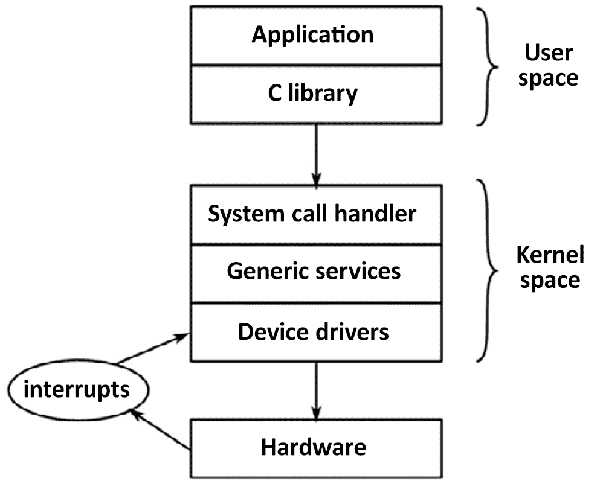
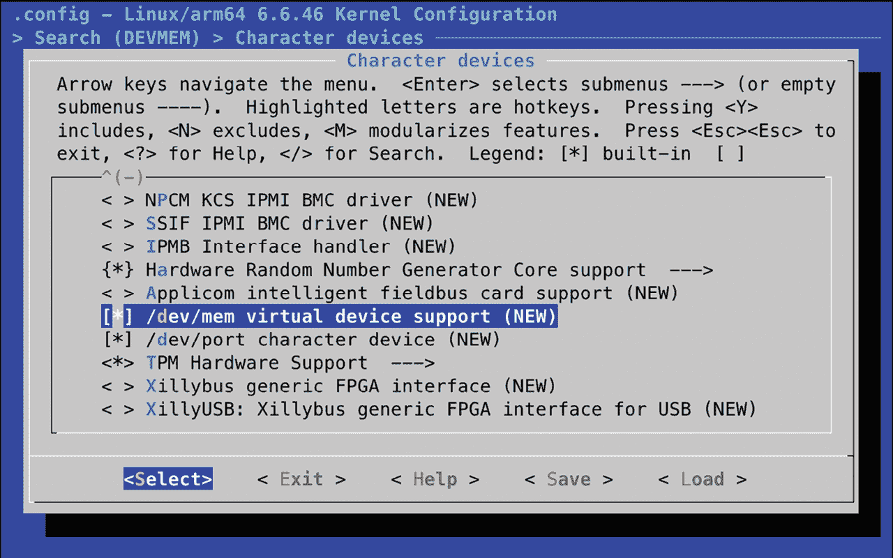
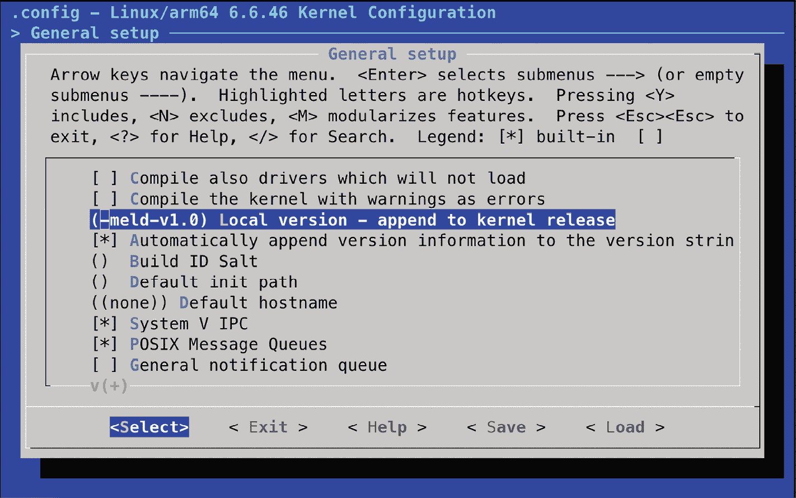

# 配置和构建内核

内核是嵌入式 Linux 的第三个组成部分。它是负责管理资源和与硬件接口的组件。因此，它几乎影响你最终软件构建的方方面面。每个完成的内核通常会为某些特定硬件进行配置。然而，设备树使我们能够使用通用内核，并通过 DTB 的内容将其定制为我们的硬件，就像我们在*第三章*中看到的那样。

在本章中，我们将探讨如何为一个开发板获取内核，如何配置和编译内核。我们将再次回顾引导过程，这次重点讨论内核的角色。我们还将探讨设备驱动程序以及它们如何从设备树中获取信息。

在本章中，我们将覆盖以下主题：

+   内核的作用是什么？

+   选择一个内核

+   配置内核

+   使用`Kbuild`进行编译

+   构建和启动内核

+   观察内核启动过程

+   将 Linux 移植到新板子上

# 技术要求

为了跟随示例，请确保你具备以下设备：

+   一个基于 Ubuntu 24.04 或更高版本 LTS 的主机系统

+   一个来自*第二章*的 Bootlin `aarch64`工具链

+   一个 microSD 卡读卡器和卡

+   一个安装了 U-Boot 的 microSD 卡，来自*第三章*

+   一条具有 3.3V 逻辑电平的 USB 至 TTL 串口电缆

+   Raspberry Pi 4

+   BeaglePlay

+   一个能够提供 3A 电流的 5V USB-C 电源供应器

本章使用的代码可以在本书 GitHub 仓库中的章节文件夹中找到：[`github.com/PacktPublishing/Mastering-Embedded-Linux-Development/tree/main/Chapter04`](https://github.com/PacktPublishing/Mastering-Embedded-Linux-Development/tree/main/Chapter04)。

# 内核的作用是什么？

Linux 始于 1991 年，当时 Linus Torvalds 开始为 Intel 386 和 486 架构的个人计算机编写操作系统。他受到四年前 Andrew S. Tanenbaum 编写的 MINIX 操作系统的启发。Linux 与 MINIX 在许多方面有所不同；主要的区别是，Linux 是一个 32 位虚拟内存内核，而且它的代码是开源的，后来以 GPL v2 许可证发布。他在 1991 年 8 月 25 日通过`comp.os.minix`新闻组发表了一篇著名的帖子，内容如下：

> 大家好，正在使用 minix 的朋友们——我正在为 386(486) AT 克隆机编写一个（免费的）操作系统（只是一个爱好，不会像 GNU 那样大而专业）。这个项目自四月以来一直在酝酿，现已开始准备就绪。我希望能得到关于 minix 中大家喜欢/不喜欢的反馈，因为我的操作系统在某些方面与它相似（例如相同的文件系统物理布局（出于实际原因）等）。

严格来说，Linus 并没有编写一个操作系统。他编写了一个内核，而内核只是操作系统的一个组成部分。为了创建一个完整的操作系统，其中包含用户空间命令和一个 shell 命令解释器，他使用了来自 GNU 项目的组件，特别是工具链、C 库和基本的命令行工具。这一区别至今仍然存在，并且赋予了 Linux 在使用方式上的极大灵活性。

**伯克利软件分发版**（**BSD**）比 Linux 早了很多年。BSD 起源于 1970 年代末期，加利福尼亚大学伯克利分校著名的计算机系统研究小组的一个研究项目。最初称为伯克利 Unix，BSD 基于贝尔实验室开发的原始 Unix 源代码。如今，BSD 已成为一个废弃的操作系统，但它的开源后代，如 FreeBSD、OpenBSD 和 NetBSD 仍在延续。最著名的例子是，苹果公司 macOS 和 iOS 操作系统中的开源系统 Darwin 就是 BSD 的衍生版本。

Linux 内核可以与 GNU 用户空间结合，创建一个完整的 Linux 发行版，运行在桌面和服务器上，这通常被称为 GNU/Linux。它还可以与 Android 用户空间结合，创建著名的移动操作系统，或者它可以与一个基于 BusyBox 的小型用户空间结合，创建一个紧凑的嵌入式系统。

与此对比的是 BSD 操作系统（FreeBSD、OpenBSD 和 NetBSD），在这些系统中，内核、工具链和用户空间被组合成一个统一的代码库。通过去除工具链，你可以部署更简洁的运行时镜像，而不需要编译器或头文件。通过将用户空间与内核解耦，你可以在初始化系统（`runit` 与 `systemd`）、C 库（`musl` 与 `glibc`）以及软件包格式（`.apk` 与 `.deb`）上获得更多选择。

内核有三个主要功能——管理资源、与硬件交互，并提供一个 API，为用户空间程序提供有用的抽象层，概述如下图：



图 4.1 − 用户空间、内核空间和硬件

运行在**用户空间**的应用程序运行在较低的 CPU 特权级别。它们几乎只能做一些库调用。用户空间和**内核空间**之间的主要接口是**C 库**，它将用户级函数（如 POSIX 定义的函数）转换为内核系统调用。系统调用接口使用架构特定的方法，如陷阱或软件中断，将 CPU 从低特权用户模式切换到高特权内核模式。运行在内核模式下的 CPU 可以访问所有内存地址和 CPU 寄存器。

系统调用处理程序将调用分派给适当的内核子系统。内存分配调用会交给内存管理器，文件系统调用会交给文件系统代码，依此类推。某些调用需要底层硬件的输入，并会传递给设备驱动程序。在某些情况下，硬件本身通过触发中断来调用内核函数。

**重要提示**

*图 4.1*中的图示表明，内核代码有第二个入口点：硬件中断。中断只能在设备驱动程序中处理，用户空间应用程序无法处理。

换句话说，你的应用程序所做的所有有用的事情，都是通过内核来完成的。因此，内核是系统中最重要的元素之一。所以，理解如何选择一个内核非常重要。

# 选择内核

下一步是为你的项目选择内核。需要平衡你总是使用最新软件版本的愿望与对供应商特定补丁的需求，以及对代码库长期支持的兴趣。

## 内核开发周期

Linux 的开发速度非常快，每 8 到 12 周就会发布一个新版本。版本号的构建方式多年来发生了变化。在 2011 年 7 月之前，使用三位数版本方案，版本号像 2.6.39。中间的数字表示它是开发者版本还是稳定版本。奇数（2.1.x、2.3.x、2.5.x）是给开发者的，偶数版本是给最终用户的。

从 2.6 版本开始，Linux 放弃了长生命周期的开发分支（奇数版本），因为它减缓了新功能对用户的发布速度。2011 年 7 月，从 2.6.39 到 3.0 的版本号变更，纯粹是因为 Linus 觉得版本号变得太大了。

在这两个版本之间，Linux 的功能或架构没有发生巨大变化。他还借此机会去掉了中间的数字。从那时起，Linus 已经将主版本号提升了三次：2015 年 4 月（从 3 升级到 4），2019 年 3 月（从 4 升级到 5），以及最近的 2022 年 10 月（从 5 升级到 6）。每次版本号的提升都是出于整洁的考虑，而不是因为有大的架构变化。

Linus 管理着开发内核树。你可以通过克隆 Git 树来关注他，方法如下：

```
$ git clone git://git.kernel.org/pub/scm/linux/kernel/git/torvalds/linux.git 
```

这将把源代码检出到一个名为`linux`的子目录。你可以通过时不时在该目录下运行`git pull`命令来保持最新。

内核开发的完整周期始于为期两周的合并窗口，在此期间，Linus 会接受用于新特性的补丁。合并窗口结束时，进入稳定化阶段。一旦合并窗口关闭，Linus 会发布带有版本号 `-rc1`、`-rc2` 等的每周发布候选版本，通常会发布到 `-rc7` 或 `-rc8`。在此期间，人们会测试候选版本并提交错误报告和修复。当所有重大错误都被修复后，内核正式发布。

在合并窗口期间合并的代码通常已经相当成熟。通常，它是从许多子系统和内核架构维护者的仓库中拉取的。通过保持短周期的开发，特性可以在准备好时进行合并。如果内核维护者认为某个特性不够稳定或不够完善，它可以被推迟到下一个版本。

跟踪每个版本之间的变化并不容易。你可以阅读 Linus 的 Git 仓库中的提交日志，但由于条目过多，很难获得整体概览。幸运的是，Linux 有一个**Kernel Newbies**网站（[`kernelnewbies.org`](https://kernelnewbies.org)），你可以在 [`kernelnewbies.org/LinuxVersions`](https://kernelnewbies.org/LinuxVersions) 上找到每个版本的简明概览。

## 稳定版和长期支持版发布

Linux 的快速变化速度是一件好事，因为它将新特性引入主线代码库，但它与嵌入式项目较长的生命周期并不完全匹配。内核开发者通过两种方式来解决这个问题：稳定版发布和长期支持版发布。在主线内核（由 Linus Torvalds 维护）发布后，它会被移到**稳定**树（由 Greg Kroah-Hartman 维护）。错误修复会应用到稳定版内核，而主线内核则进入下一个开发周期。

稳定版内核的点版本通过第三个数字来标记（例如 3.18.1、3.18.2 等）。在版本 3 之前，有四个版本号（例如 2.6.29.1、2.6.39.2 等）。

你可以通过以下命令获取稳定树：

```
$ cd ~
$ git clone git://git.kernel.org/pub/scm/linux/kernel/git/stable/linux-stable.git 
```

你可以使用 `git` `checkout` 来获取特定版本，例如 6.6.46：

```
$ cd linux-stable
$ git checkout v6.6.46 
```

稳定版内核通常只会更新到下一个主线版本（大约 8 到 12 周后），因此你会看到 [`www.kernel.org/`](https://www.kernel.org/) 上通常只有一个或两个稳定版内核。为了满足那些需要更长时间更新的用户，一些内核被标记为**长期支持**，并维持两年或更长时间。长期支持内核保证会发现并修复所有错误。每年至少会发布一个长期支持的内核版本。

以 2024 年 8 月查看[`www.kernel.org/`](https://www.kernel.org/)时，共有六个长期维护的内核版本：6.6、6.1、5.15、5.10、5.4 和 4.19。最老的版本已经维护了近六年，当前版本为 4.19.319。如果你正在构建一个需要长期维护的产品，那么最新的长期维护内核可能是一个不错的选择。

## 供应商支持

在理想的情况下，你应该能够从[`www.kernel.org/`](https://www.kernel.org/)下载内核，并为任何声称支持 Linux 的设备配置它。然而，现实中并非总是如此。事实上，主线 Linux 只对能运行 Linux 的众多设备中的一小部分提供了稳定支持。你可能会在一些独立的开源项目中找到对你的开发板或 SoC 的支持，比如 Linaro ([`www.linaro.org/`](https://www.linaro.org/)) 或 Yocto 项目 ([`www.yoctoproject.org/`](https://www.yoctoproject.org/))。有些公司提供嵌入式 Linux 的付费第三方支持。但在许多情况下，你将不得不依赖于 SoC 或开发板供应商提供的可用内核。

正如我们所知，一些供应商比其他供应商更擅长支持 Linux。在此阶段，我的建议是选择那些提供良好支持的供应商，或者更好的是，选择那些努力将其内核更改提交到主线的供应商。可以通过搜索 Linux 内核邮件列表或提交历史，查看候选的 SoC 或开发板是否有最近的活动。当主线内核中没有上游更改时，判断一个供应商是否提供良好支持，往往依赖于口碑。有些供应商因只发布一个内核代码版本后，就将所有精力转向更新的 SoC，声名狼藉。

## 许可证

Linux 源代码是按照 GPL v2 许可证授权的。这意味着你必须以许可证中规定的某种方式提供你的内核源代码。

内核的实际许可证文本位于文件 `COPYING` 中。它以 Linus 撰写的附录开始，声明通过系统调用接口从用户空间调用内核的代码不被视为内核的衍生作品，因此不受许可证约束。因此，专有应用程序运行在 Linux 上并没有问题。

然而，Linux 许可证中有一个领域引起了无休止的混淆和争议：内核模块。**内核模块**只是一个在运行时与内核动态链接的代码片段，从而扩展了内核的功能。**通用公共许可证**（**GPL**）并未区分静态链接和动态链接，因此，内核模块的源代码似乎受 GPL 的覆盖。在 Linux 的早期，关于这个规则的例外存在争议，例如与 **安德鲁文件系统**（**AFS**）相关的争论。因为这个代码早于 Linux，因此（有人辩称）它不是衍生作品，因此不受许可证的约束。

多年来，就其他代码片段进行过类似的讨论，结果现在已接受的做法是，GPL 不一定适用于内核模块。这一点通过内核中的`MODULE_LICENSE`宏进行了规定，该宏可以设置为`Proprietary`，表示该模块没有遵循 GPL 许可证。如果你打算使用相同的论据，可能需要阅读一封经常被引用的邮件线程，标题为*Linux GPL 和二进制模块例外条款？*，该邮件已存档于[`yarchive.net/comp/linux/gpl_modules.html`](https://yarchive.net/comp/linux/gpl_modules.html)。

GPL 应该被视为一件好事，因为它确保了我们在进行嵌入式项目时，总是能够获取内核的源码。没有它，嵌入式 Linux 将变得更加难以使用且更加支离破碎。

## 最佳实践

话虽如此，选择内核时，你需要权衡使用最新版本的好处与厂商特定增强功能和驱动程序稳定性的需求。此外，快速发展的 Linux 开发周期使得新特性能够迅速集成，并且有稳定的长期支持版本可供扩展维护。长期支持内核会获得超过两年的更新，非常适合长期项目。厂商支持也至关重要，因此，确保选择那些积极支持 Linux 并为主线内核做出贡献的厂商。最后，GPL v2 许可证确保了内核源码的获取，这使得在嵌入式项目中使用和维护内核变得更加容易。

# 配置内核

一旦决定了基于哪个内核来构建镜像，接下来的步骤是配置内核。

## 获取源码

本书中使用的三个目标（Raspberry Pi 4、BeaglePlay 和 QEMU）都得到了主线内核的良好支持。因此，使用来自[`www.kernel.org/`](https://www.kernel.org/)的最新长期支持内核是有意义的，在写作时，该内核版本为 6.6.46。当你自己操作时，应该检查是否有 6.6 内核的更新版本，并使用该版本，因为它会修复 6.6.46 发布后发现的错误。

**重要说明**

如果有更晚的长期发布版本，你可能希望考虑使用那个版本。但要注意，可能已经有一些变化，意味着以下命令序列无法完全按给定的方式工作。

要获取并提取 6.6.46 版本的 Linux 内核发布 tarball，可以使用以下命令：

```
$ cd ~
$ wget https://cdn.kernel.org/pub/linux/kernel/v6.x/linux-6.6.46.tar.xz
$ tar xf linux-6.6.46.tar.xz
$ mv linux-6.6.46 linux-stable 
```

要获取更新版本，只需将`linux-`后的`6.6.46`替换为所需的长期支持版本。

这里有大量代码。6.6 内核中有超过 81,000 个文件，包含 C 源代码、头文件和汇编代码，总计超过 2400 万行代码，根据 SLOCCount 工具的测量结果。尽管如此，了解代码的基本布局以及大概在哪个地方查找特定组件是很有价值的。主要的关注目录有：

+   `arch`：包含特定于体系结构的文件。每种体系结构都有一个子目录。

+   `Documentation`：包含内核文档。如果想找到有关 Linux 某方面更多信息，总是首先查看此处。

+   `drivers`：包含设备驱动程序，数以千计。每种类型的驱动程序都有一个子目录。

+   `fs`：包含文件系统代码。

+   `include`：包含内核头文件，包括在构建工具链时需要的文件。

+   `init`：包含内核启动代码。

+   `kernel`：包含核心功能，包括调度、锁定、定时器、电源管理以及调试/跟踪代码。

+   `mm`：包含内存管理。

+   `net`：包含网络协议。

+   `scripts`：包含许多有用的脚本，包括设备树编译器，在*第三章*中有描述。

+   `tools`：包含许多有用的工具，包括 Linux 性能计数器工具（`perf`），我将在*第二十章*中描述。

随着时间的推移，你会熟悉这种结构，并意识到，如果你要找特定 SoC 的串口代码，你会在`drivers/tty/serial`找到它，而不是在`arch/$ARCH/mach-foo`中，因为它是设备驱动，而不是特定于 CPU 架构的内容。

## 理解内核配置– Kconfig

Linux 的一个优点是可以根据不同的需求配置内核，从小型的专用设备（如智能恒温器）到复杂的移动电话。在当前版本中，有成千上万的配置选项。正确配置配置本身就是一项任务，但在深入讨论之前，我想先向你展示它是如何工作的，这样你可以更好地理解正在发生的事情。

配置机制被称为`Kconfig`，与之集成的构建系统被称为`Kbuild`。这两者的文档位于`Documentation/kbuild`中。`Kconfig`/`Kbuild`不仅在内核项目中使用，还包括 Crosstool-NG、U-Boot、Barebox 和 BusyBox 等其他项目。

配置选项在名为`Kconfig`的一系列文件中声明，使用的语法在`Documentation/kbuild/kconfig-language.rst`中描述。

在 Linux 中，顶层的`Kconfig`看起来像这样：

```
mainmenu "Linux/$(ARCH) $(KERNELVERSION) Kernel Configuration"
comment "Compiler: $(CC_VERSION_TEXT)"
source "scripts/Kconfig.include"
<…> 
```

`arch/Kconfig`的第一行是：

```
source "arch/$(SRCARCH)/Kconfig" 
```

该行包括依赖于启用了哪些选项的其他`Kconfig`文件的体系结构相关配置文件。

让体系结构发挥如此重要作用有三个含义：

+   首先，在配置 Linux 时必须指定一个体系结构，设置`ARCH=<architecture>`；否则，它将默认为本地机器体系结构。

+   其次，通常情况下，你设置的`ARCH`的值决定了`SRCARCH`的值，因此你很少需要显式设置`SRCARCH`。

+   第三，每种体系结构的顶级菜单布局都不同。

你在`ARCH`中设置的值是`arch`目录中找到的子目录之一，唯一的特殊情况是`ARCH=i386`和`ARCH=x86_64`都会引用`arch/x86/Kconfig`。

`Kconfig`文件大部分由`menu`和`endmenu`关键字划定的菜单组成。菜单项由`config`关键字标记。

下面是一个来自`drivers/char/Kconfig`的示例：

```
menu "Character devices"
<…>
config DEVMEM
    bool "/dev/mem virtual device support"
    default y
    help
      Say Y here if you want to support the /dev/mem device.
      The /dev/mem device is used to access areas of physical memory.
      When in doubt, say "Y".
<…>
endmenu 
```

紧跟在`config`后面的参数指定了一个变量，这里是`DEVMEM`。由于此选项是`bool`（布尔值），它只能有两个值：如果启用，它的值为`y`，如果未启用，则该变量根本不定义。屏幕上显示的菜单项名称是`bool`关键字后面的字符串。

此配置项及其他所有配置项存储在名为`.config`的文件中。

**提示**

`.config`中的前导点（`.`）表示它是一个隐藏文件，默认情况下，`ls`命令不会显示，除非你使用`ls -a`来显示所有文件。

与此配置项对应的行是：

```
CONFIG_DEVMEM=y 
```

除了`bool`之外，还有几种其他数据类型。以下是完整的列表：

+   `bool`：要么是`y`，要么未定义。

+   `tristate`：用于某个功能可以作为内核模块或内核映像的一部分进行构建的情况。其值为`m`表示作为模块，`y`表示构建为内核的一部分，若未启用该功能，则未定义。

+   `int`：使用十进制表示法的整数值。

+   `hex`：使用十六进制表示法的无符号整数值。

+   `string`：字符串值。

项目之间可能存在依赖关系，依赖关系通过`depends on`构造来表示，如下所示：

```
config MTD_CMDLINE_PARTS
    tristate "Command line partition table parsing"
    depends on MTD 
```

如果`CONFIG_MTD`在其他地方未启用，则该菜单选项不会显示，因此无法选择。

还有反向依赖关系。`select`关键字在启用某个选项时，会启用其他选项。`arch/$ARCH`中的`Kconfig`文件包含了许多`select`语句，启用了特定于架构的功能，下面是 Arm 架构的示例：

```
config ARM
    bool
    default y
    select ARCH_CLOCKSOURCE_DATA
    select ARCH_HAS_DEVMEM_IS_ALLOWED
<…> 
```

通过选择`ARCH_CLOCKSOURCE_DATA`和`ARCH_HAS_DEVMEM_IS_ALLOWED`，我们将这两个变量的值设置为`y`，以便将这些功能静态构建到内核中。

有几种配置工具可以读取`Kconfig`文件并生成`.config`文件。它们中的一些会在屏幕上显示菜单并允许你进行交互式选择。`menuconfig`可能是大多数人熟悉的工具，但也有`xconfig`和`gconfig`。

使用`menuconfig`之前，你需要先安装`ncurses`、`flex`和`bison`。以下命令在 Ubuntu 上安装所有这些依赖项：

```
$ sudo apt install libncurses5-dev flex bison 
```

你可以通过`make`命令启动`menuconfig`，请记住，在内核的情况下，你需要提供一个架构，如下所示：

```
$ cd ~
$ export PATH=${HOME}/aarch64--glibc--stable-2024.02-1/bin/:$PATH
$ export CROSS_COMPILE=aarch64-buildroot-linux-gnu-
$ cd linux-stable
$ mkdir ../build_arm64
$ make ARCH=arm64 menuconfig O=../build_arm64 
```

确保你的`PATH`变量指向你在*第二章*中下载的 64 位工具链。

这里你可以看到带有先前突出显示的`DEVMEM`配置选项的`menuconfig`：



图 4.2 − 选择 DEVMEM

位于项目前的星号（`*`）表示该驱动已被选择为静态编译到内核中。如果是`M`，则表示它已被选择为内核模块，以便在运行时插入内核中。

**提示**

你经常会看到类似于启用`CONFIG_BLK_DEV_INITRD`的指令，但由于有很多菜单可供浏览，找到设置该配置项的地方可能需要一段时间。所有配置编辑器都有一个搜索功能。你可以在`menuconfig`中通过按下斜杠键`*/`来访问它。在`xconfig`中，它位于**编辑**菜单下，但请确保在搜索配置项时不包括`CONFIG_`部分。

由于需要配置的内容太多，每次构建内核时从头开始是不现实的，因此在`arch/$ARCH/configs`中有一组已知的工作配置文件，每个文件包含适用于单个 SoC 或一组 SoC 的配置值。

你可以使用`make <配置文件名称>`命令来选择一个配置。例如，要配置 Linux 以支持广泛的 64 位 Arm SoC，你需要输入：

```
$ make ARCH=arm64 defconfig O=../build_arm64 
```

这是一个通用内核，适用于各种开发板。对于更专业的应用，比如使用厂商提供的内核，默认配置文件是板级支持包的一部分。在你开始构建内核之前，你需要确定使用哪个配置文件。

还有一个有用的配置目标叫做`oldconfig`。当你将配置迁移到新内核版本时使用它。该目标会采用一个现有的`.config`文件，并向你提问有关新配置选项的问题。将旧内核的`.config`文件复制到新源目录并运行`make ARCH=arm64 oldconfig`命令，以使其与新版本同步。

`oldconfig`目标也可以用来验证你手动编辑过的`.config`文件（忽略顶部出现的文本*自动生成的文件；请勿编辑*）。

如果你对配置进行了更改，那么修改后的`.config`文件将成为你的板级支持包的一部分，并需要放置在源代码管理之下。

当你开始构建内核时，会生成一个名为`include/generated/autoconf.h`的头文件。这个头文件包含每个配置值的`#define`，以便它可以包含在内核源代码中。

现在我们已经确定了内核并学会了如何配置它，我们将进行标识。

## 使用 LOCALVERSION 来标识你的内核

你可以通过使用`make kernelversion`和`make kernelrelease`目标来发现你构建的内核版本和发布版本：

```
$ make ARCH=arm64 kernelversion
6.6.46
$ make ARCH=arm64 kernelrelease O=../build_arm64
6.6.46 
```

这可以通过`uname`命令在运行时报告，并且也用于命名存储内核模块的目录。

如果你更改了默认配置，建议你附加版本信息，可以通过在`menuconfig`中设置`CONFIG_LOCALVERSION`来配置：

```
$ make ARCH=arm64 menuconfig O=../build_arm64 
```

例如，如果我想标记我正在构建的内核，使用标识符`meld`和版本`1.0`，那么我会在`menuconfig`中这样定义本地版本：



图 4.3 – 追加到内核发布版本

退出`menuconfig`并在被询问是否保存新配置时选择**是**。

运行`make prepare`以使用新的`kernelrelease`版本刷新`Makefile`：

```
$ make ARCH=arm64 prepare O=../build_arm64 
```

运行`make kernelversion`会产生与之前相同的输出，但如果我现在运行`make kernelrelease`，我会看到：

```
$ make ARCH=arm64 kernelrelease O=../build_arm64
6.6.46-meld-v1.0 
```

这是一个愉快的绕道，关于内核版本管理，但现在让我们回到配置内核以进行编译的正题。

## 何时使用内核模块

我已经多次提到内核模块了。桌面 Linux 发行版广泛使用它们，以便根据检测到的硬件和所需的功能在运行时加载正确的设备和内核功能。如果没有内核模块，每个驱动程序和功能都必须静态链接到内核中，这会使内核变得异常庞大。

另一方面，对于嵌入式设备，硬件和内核配置通常在构建内核时就已知，因此模块不是那么有用。事实上，它们会造成一个问题，因为它们在内核和根文件系统之间创建了版本依赖关系，如果其中一个更新而另一个没有更新，就可能导致引导失败。因此，嵌入式内核通常是构建时没有任何模块的。

以下是内核模块在嵌入式系统中是一个好主意的几个场景：

+   当你有专有模块时，出于前面部分提到的许可原因。

+   通过推迟加载非必要的驱动程序来减少启动时间。

+   当有多个驱动程序可能需要加载，而静态编译它们会占用太多内存时。例如，你有一个支持多种设备的 USB 接口。这基本上与桌面发行版中的相同论点。

+   接下来，让我们学习如何使用或不使用内核模块通过`Kbuild`编译内核映像。

# 使用 Kbuild 进行编译

内核构建系统（`Kbuild`）是一组`make`脚本，它从`.config`文件中获取配置信息，计算依赖关系，并编译所有必要的内容以生成内核映像。该内核映像包含所有静态链接的组件、可选的设备树二进制文件以及任何内核模块。依赖关系通过每个目录中的 Makefile 表示，包含可构建组件。例如，以下两行来自`drivers/char/Makefile`：

```
obj-y += mem.o random.o
obj-$(CONFIG_TTY_PRINTK) += ttyprintk.o 
```

`obj-y`规则无条件地编译文件以生成目标，因此`mem.c`和`random.c`始终是内核的一部分。在第二行中，`ttyprintk.c`依赖于一个配置参数。如果`CONFIG_TTY_PRINTK`为`y`，则它作为内置模块编译。如果为`m`，则编译为模块。如果该参数未定义，则完全不编译。

对于大多数目标，只需键入`make`（并设置合适的`ARCH`和`CROSS_COMPILE`）即可完成工作，但逐步执行是有教育意义的。请参见*第二章*的最后部分，了解`CROSS_COMPILE`的`make`变量的含义。

## 确定要构建的内核目标

要构建内核镜像，您需要了解引导加载程序的要求。以下是一个粗略的指南：

+   **U-Boot**：可以为 64 位 Arm 加载压缩的`Image.gz`文件。也可以使用`bootz`命令为 32 位 Arm 加载自解压的`zImage`文件。

+   **x86 目标**：需要一个`bzImage`文件。

+   **大多数其他引导加载程序**：需要一个`zImage`文件。

这是为 64 位 Arm 构建`Image.gz`文件的示例：

```
$ sudo apt install libssl-dev
$ PATH=~/aarch64--glibc--stable-2024.02-1/bin/:$PATH
$ cd ~
$ cd linux-stable
$ make -j<n> ARCH=arm64 CROSS_COMPILE=aarch64-buildroot-linux-gnu- Image.gz O=../build_arm64 
```

确保您的`PATH`变量指向您在*第二章*中下载的 64 位工具链。

**重要提示**

当您第一次在内核源树上运行`make`时，可能会提示您包括或省略各种功能、选项和插件。这些功能和选项大多数提供了更高的安全性，因此添加它们是没有坏处的。有一个显著的例外。在提示选择 GCC 插件时，确保选择`n`表示否，如下所示：

```
*
* GCC plugins
*
GCC plugins (GCC_PLUGINS) [Y/n/?] (NEW) n 
```

否则，构建将失败，因为`make`找不到`g++`。

请记住，在`make -j`后替换`<n>`为您主机上可用的 CPU 核心数，以加速构建过程。

**提示**

`-j<n>`选项告诉`make`并行运行多少个作业，这样可以减少构建所需的时间。`make -j4`将运行四个作业。一个粗略的指南是，运行的作业数应该与您主机上的 CPU 核心数相等。

目前，AArch64 内核不提供解压器，因此，如果使用压缩的`Image`目标（例如`Image.gz`），需要由引导加载程序执行解压（`gzip`等）。

无论我们目标的是哪种内核镜像格式，在生成可引导镜像之前，始终先生成这两个构建产物（`vmlinux`和`System.map`）。

## 构建构件

内核构建会在顶级目录中生成两个文件：`vmlinux`和`System.map`。第一个文件`vmlinux`是作为 ELF 二进制文件的内核。如果您在编译内核时启用了调试（`CONFIG_DEBUG_INFO=y`），它将包含可用于调试器（如`kgdb`）的调试符号。您还可以使用其他 ELF 二进制工具，例如`size`，来衡量每个段（`text`、`data`和`bss`）的长度，这些段组成了`vmlinux`可执行文件：

```
$ cd ~
$ cd build_arm64
$ aarch64-buildroot-linux-gnu-size vmlinux
   text    data     bss     dec     hex filename
25923719        15631632         620032 42175383        2838b97 vmlinux 
```

像内核这样的程序在内存中被划分为多个段。`text` 段包含可执行指令（代码）。`data` 段包含初始化的全局和静态变量。`bss` 段包含未初始化的全局和静态变量。`dec` 和 `hex` 值分别是文件大小的十进制和十六进制表示。

`System.map` 包含符号表，以人类可读的形式展示。

大多数引导加载程序无法直接处理 ELF 代码。因此，需要进一步的处理步骤，将 `vmlinux` 转换为适合各种引导加载程序的二进制文件，并放置在 `arch/$ARCH/boot` 目录中：

+   `Image`：将 `vmlinux` 转换为原始二进制格式。

+   `zImage`：对于 PowerPC 架构，这只是 `Image` 的压缩版本，意味着引导加载程序必须进行解压缩。对于其他所有架构，压缩后的 `Image` 会附加在一个解压缩并重定位它的代码存根上。

+   `uImage`：`zImage` 加上一个 64 字节的 U-Boot 头。

在构建过程中，你将看到正在执行的命令摘要：

```
$ make -j<n> ARCH=arm64 CROSS_COMPILE=aarch64-buildroot-linux-gnu- Image.gz O=../build_arm64
<…>
  CC      scripts/mod/empty.o
  HOSTCC  scripts/mod/mk_elfconfig
  CC      scripts/mod/devicetable-offsets.s
  UPD     scripts/mod/devicetable-offsets.h
  MKELF   scripts/mod/elfconfig.h
  HOSTCC  scripts/mod/modpost.o
  HOSTCC  scripts/mod/file2alias.o
  HOSTCC  scripts/mod/sumversion.o
<…> 
```

当内核构建失败时，有时查看实际执行的命令会很有用。为此，可以在命令行中添加 `V=1`：

```
$ make -j<n> ARCH=arm64 CROSS_COMPILE=aarch64-buildroot-linux-gnu- V=1 Image.gz O=../build_arm64 
```

在这一部分，我们了解了 `Kbuild` 如何将预编译的 `vmlinux` ELF 二进制文件转换为可引导的内核镜像。接下来，我们将探讨如何编译设备树。

## 编译设备树

```
dtbs target for arch/arm64/configs/defconfig:
```

```
$ make ARCH=arm64 dtbs CROSS_COMPILE=aarch64-buildroot-linux-gnu-  O=../build_arm64
  <…>
  DTC     arch/arm64/boot/dts/ti/k3-am625-beagleplay.dtb
  DTC     arch/arm64/boot/dts/ti/k3-am625-phyboard-lyra-rdk.dtb
  DTC     arch/arm64/boot/dts/ti/k3-am625-sk.dtb
  DTC     arch/arm64/boot/dts/ti/k3-am625-verdin-nonwifi-dahlia.dtb
  DTC     arch/arm64/boot/dts/ti/k3-am625-verdin-nonwifi-dev.dtb
  DTC     arch/arm64/boot/dts/ti/k3-am625-verdin-nonwifi-yavia.dtb
  DTC     arch/arm64/boot/dts/ti/k3-am625-verdin-wifi-dahlia.dtb
  DTC     arch/arm64/boot/dts/ti/k3-am625-verdin-wifi-dev.dtb
  DTC     arch/arm64/boot/dts/ti/k3-am625-verdin-wifi-yavia.dtb
  <…> 
```

编译后的 `.dtb` 文件会生成在 `../build_arm64` 输出目录中。

## 编译模块

如果你配置了一些功能作为模块进行构建，那么你可以使用 `modules` 目标单独构建它们：

```
$ make -j<n> ARCH=arm64 CROSS_COMPILE=aarch64-buildroot-linux-gnu- modules O=../build_arm64 
```

将 `make -j` 后面的 `<n>` 替换为主机机器上可用的 CPU 核心数，以加快构建速度。

编译后的模块具有 `.ko` 后缀，并生成在与源代码相同的目录中，这意味着它们散布在整个内核源代码树中。找到它们有点棘手，但你可以使用 `modules_install` 目标将它们安装到正确的位置。

默认位置是开发系统中的 `/lib/modules`，这几乎肯定不是你想要的位置。要将它们安装到根文件系统的暂存区，使用 `INSTALL_MOD_PATH` 提供路径：

```
$ mkdir ~/rootfs
$ make -j<n> ARCH=arm64 CROSS_COMPILE=aarch64-buildroot-linux-gnu- INSTALL_MOD_PATH=$HOME/rootfs modules_install O=../build_arm64 
```

内核模块被放置在相对于文件系统根目录的 `/lib/modules/<kernel version>` 目录下。

## 清理内核源代码

有三个用于清理内核源代码树的 `make` 目标：

+   **clean**：删除目标文件和大多数中间文件。

+   **mrproper**：删除所有中间文件，包括 `.config` 文件。使用此目标可以将源代码树恢复到克隆或提取源代码后立即的状态。Mr. Proper 是一种清洁产品，在一些地区很常见。`make mrproper` 的目的是对内核源代码进行彻底清理。

+   **distclean**：与 `mrproper` 相同，但还会删除编辑器备份文件、补丁文件和其他软件开发的产物。

# 构建和启动内核

构建和启动 Linux 高度依赖于设备。在本节中，我将展示如何在树莓派 4、BeaglePlay 和 QEMU 上实现。对于其他目标板，您必须咨询供应商或社区项目的相关信息（如果有的话）。

## 为树莓派 4 构建内核

尽管主线内核已支持树莓派 4，我更倾向于使用树莓派基金会的 Linux 分支（[`github.com/raspberrypi/linux`](https://github.com/raspberrypi/linux)）以保证稳定性。2024 年 8 月，该分支的最新长期支持内核版本为 6.6，因此我们将构建该版本。

由于树莓派 4 使用 64 位四核 Arm Cortex-A72 CPU，我们将使用*第二章**,*中的 Bootlin 工具链为其交叉编译一个 64 位内核。

安装构建内核所需的包：

```
$ sudo apt install libssl-dev 
```

现在你已经安装了所需的工具链和软件包，克隆内核仓库的`6.6.y`分支（一层深度）到一个名为`linux-rpi`的目录，并将一些预构建的二进制文件导出到`boot`子目录：

```
$ cd ~
$ git clone --depth=1 -b rpi-6.6.y https://github.com/raspberrypi/linux.git linux-rpi
$ git clone --depth=1 -b 1.20240529 https://github.com/raspberrypi/firmware.git firmware-rpi
$ mv firmware-rpi/boot .
$ rm -rf firmware-rpi
$ rm boot/kernel*
$ rm boot/*.dtb
$ rm boot/overlays/*.dtbo 
```

`--depth=n`参数指示 Git 在克隆时仅获取最后`n`个提交。

导航到新克隆的`linux-rpi`目录并构建内核：

```
$ PATH=~/aarch64--glibc--stable-2024.02-1/bin/:$PATH
$ cd ~
$ cd linux-rpi
$ make ARCH=arm64 CROSS_COMPILE=aarch64-buildroot-linux-gnu- bcm2711_defconfig O=../build_rpi
$ make -j<n> ARCH=arm64 CROSS_COMPILE=aarch64-buildroot-linux-gnu- O=../build_rpi 
```

将`make -j`后的`<n>`替换为主机机器上可用的 CPU 核心数，以加速构建过程。

构建完成后，将内核镜像、设备树二进制文件和启动参数复制到 boot 子目录：

```
$ cp ../build_rpi/arch/arm64/boot/Image ../boot/kernel8.img
$ cp ../build_rpi/arch/arm64/boot/dts/overlays/*.dtbo ../boot/overlays/
$ cp ../build_rpi/arch/arm64/boot/dts/broadcom/*.dtb ../boot/
$ cat << EOF > ../boot/config.txt
enable_uart=1
arm_64bit=1
EOF
$ cat << EOF > ../boot/cmdline.txt
console=serial0,115200 console=tty1 root=/dev/mmcblk0p2 rootwait
EOF 
```

上述命令都可以在脚本`MELD/Chapter04/build-linux-rpi4.sh`中找到。请注意，写入`cmdline.txt`的内核命令行必须全部在一行内。让我们将这些步骤分解为几个阶段：

1.  将树莓派基金会的`rpi-6.6.y`分支克隆到`linux-rpi`目录。

1.  将树莓派基金会的`1.20240529`标签的固件仓库克隆到`firmware-rpi`目录。

1.  将树莓派基金会的`firmware`仓库中的`boot`子目录移动到`boot`目录中。

1.  从`boot`目录删除现有的内核镜像、设备树二进制文件和设备树覆盖。

1.  从`linux-rpi`目录，构建树莓派 4 的 64 位内核、模块和设备树。

1.  将新构建的内核镜像、设备树二进制文件和设备树覆盖从./build_rpi/`arch/arm64/boot`复制到`boot`目录。

1.  将`config.txt`和`cmdline.txt`文件写入`boot`目录，以供树莓派 4 的引导加载程序读取并传递给内核。

让我们看一下`config.txt`中的设置。`enable_uart=1`这一行在启动过程中启用串口控制台，而默认情况下是禁用的。`arm_64bit=1`这一行指示树莓派 4 的引导加载程序以 64 位模式启动 CPU，并从名为`kernel8.img`的文件中加载内核镜像。

现在，我们来看一下`cmdline.txt`。`console=serial0,115200`和`console=tty1`内核命令行参数指示内核在启动过程中将日志消息输出到串口控制台。

## 启动 Raspberry Pi 4

Raspberry Pi 设备使用 Broadcom 提供的专有引导加载程序，而不是 U-Boot。与以前的 Raspberry Pi 型号不同，Raspberry Pi 4 的引导加载程序驻留在板载 SPI EEPROM 中，而不是在 microSD 卡上。我们仍然需要将 Raspberry Pi 4 的内核镜像和设备树 blob 放到 microSD 卡上，以便启动我们的 64 位内核。

在继续之前，你需要一张带有 FAT32 `boot`分区的 microSD 卡，分区足够大以容纳必要的内核构建文件。`boot`分区需要是 microSD 卡的第一个分区，1 GB 的分区大小足够。

有关如何将 USB 到 TTL 串口电缆连接到 Raspberry Pi 4 的指导，请参见[`learn.adafruit.com/adafruits-raspberry-pi-lesson-5-using-a-console-cable/connect-the-lead`](https://learn.adafruit.com/adafruits-raspberry-pi-lesson-5-using-a-console-cable/connect-the-lead)。

要准备一张 microSD 卡，加载你新构建的内核镜像并在 Raspberry Pi 4 上启动：

1.  首先，进入`boot`目录的上一级：

    ```
    $ cd ~ 
    ```

1.  接下来，将 microSD 卡插入卡读卡器，并将`boot`目录的所有内容复制到`boot`分区。

1.  卸载卡并将其插入 Raspberry Pi 4。

1.  将你的 USB 到 TTL 串口电缆连接到 40 针 GPIO 头的 GND、TXD 和 RXD 引脚。

1.  启动一个终端仿真器，如`gtkterm`。

1.  最后，启动 Raspberry Pi 4。

你应该能在串口控制台看到以下输出：

```
[    0.000000] Booting Linux on physical CPU 0x0000000000 [0x410fd083]
[    0.000000] Linux version 6.6.45-v8+ (frank@frank-nuc) (aarch64-buildroot-linux-gnu-gcc.br_real (Buildroot 2021.11-11272-ge2962af) 12.3.0, GNU ld (GNU Binutils) 2.41) #1 SMP PREEMPT Mon Aug 19 08:51:43 PDT 2024
[    0.000000] KASLR enabled
[    0.000000] random: crng init done
[    0.000000] Machine model: Raspberry Pi 4 Model B Rev 1.1
[    0.000000] efi: UEFI not found.
[    0.000000] Reserved memory: created CMA memory pool at 0x000000002ac00000, size 64 MiB
<…> 
```

该序列将以内核恐慌结束，因为内核无法在 microSD 卡上找到根文件系统。我将在本章后面解释什么是内核恐慌。

## 为 BeaglePlay 构建内核

下面是为 BeaglePlay 构建内核、模块和设备树的命令序列：

1.  首先，如果尚未添加，将 64 位 Arm 工具链添加到你的`PATH`中：

    ```
    $ PATH=~/aarch64--glibc--stable-2024.02-1/bin/:$PATH 
    ```

1.  接下来，返回主线 Linux 源树：

    ```
    $ cd ~
    $ cd linux-stable
    $ mkdir ../build_beagleplay 
    ```

1.  为 64 位 Arm 设置`ARCH`和`CROSS_COMPILE`环境变量：

    ```
    $ export ARCH=arm64
    $ export CROSS_COMPILE=aarch64-buildroot-linux-gnu- 
    ```

1.  运行`make defconfig`来配置一个适用于大多数 64 位 Arm SoC 的内核：

    ```
    $ make defconfig O=../build_beagleplay 
    ```

1.  运行`make menuconfig`继续配置内核：

    ```
    $ make menuconfig O=../build_beagleplay 
    ```

1.  进入**通用架构相关选项**子菜单。

1.  如果已选择**GCC 插件**，请取消选择。

1.  退出**通用架构相关选项**子菜单。

1.  进入**平台选择**子菜单。

1.  取消选择所有 SoC 的支持，除了**德州仪器公司 K3 多核 SoC 架构**。

1.  退出**平台选择**子菜单。

1.  进入**设备驱动程序** | **图形支持**子菜单

1.  取消选择**直接渲染管理器**。

1.  退出**图形支持**和**设备驱动程序**子菜单。

1.  退出`menuconfig`并在询问是否保存新配置时选择**是**。

1.  最后，为 BeaglePlay 构建内核、模块和设备树：

    ```
    $ make -j<n> O=../build_beagleplay 
    ```

将`make -j`后面的`<n>`替换为你主机上可用的 CPU 核心数，以加快构建速度。

## 启动 BeaglePlay

在继续之前，你需要一张已经安装了 U-Boot 的 microSD 卡，如*第三章*中的*安装 U-Boot*部分所描述：

1.  首先，进入`build_beagleplay`目录的上一层：

    ```
    $ cd ~ 
    ```

1.  接下来，将 microSD 卡插入卡读卡器，并将`build_beagleplay/arch/arm64/boot/Image.gz`和`build_beagleplay/arch/arm64/boot/dts/ti/k3-am625-beagleplay.dtb`文件复制到 FAT32 的`boot`分区中。

1.  卸载卡并将其插入 BeaglePlay。

1.  启动终端模拟器，如`gtkterm`，并准备在看到 U-Boot 消息出现时立即按下空格键。

1.  按住 USR 按钮并按下空格键启动 BeaglePlay。

1.  最后，在 U-Boot 提示符下输入以下命令：

    ```
    nova!> setenv bootargs console=ttyS2,115200n8
    nova!> fatload mmc 1 0x80000000 Image.gz
    nova!> fatload mmc 1 0x82000000 k3-am625-beagleplay.dtb
    nova!> setenv kernel_comp_addr_r 0x85000000
    nova!> setenv kernel_comp_size 0x2000000
    nova!> booti 0x80000000 - 0x82000000 
    ```

你应该在串行控制台看到以下输出：

```
Starting kernel ...
[    0.000000] Booting Linux on physical CPU 0x0000000000 [0x410fd034]
[    0.000000] Linux version 6.6.46 (frank@frank-nuc) (aarch64-buildroot-linux-gnu-gcc.br_real (Buildroot 2021.11-11272-ge2962af)
 12.3.0, GNU ld (GNU Binutils) 2.41) #1 SMP PREEMPT Mon Aug 19 11:24:56 PDT 2024
[    0.000000] KASLR disabled due to lack of seed
[    0.000000] Machine model: BeagleBoard.org BeaglePlay
[    0.000000] efi: UEFI not found.
<…> 
```

请注意，我们将内核命令行设置为`console=ttyS2`。这告诉 Linux 使用哪个 UART 设备来输出控制台信息。如果没有这个设置，我们将无法看到`Starting the kernel...`之后的任何信息，也无法知道系统是否正常工作。序列会以内核崩溃结束，正如 Raspberry Pi 4 所表现的一样。

## 为 QEMU 构建内核

这是为 QEMU 模拟的`virt`通用虚拟平台构建 Linux 的命令序列：

1.  如果你还没有添加 64 位 Arm 工具链到`PATH`，请首先添加：

    ```
    $ PATH=~/aarch64--glibc--stable-2024.02-1/bin/:$PATH 
    ```

1.  接下来，返回到主线 Linux 源码树：

    ```
    $ cd ~
    $ cd linux-stable
    $ mkdir ../build_qemu 
    ```

1.  为 64 位 Arm 设置`ARCH`和`CROSS_COMPILE`环境变量：

    ```
    $ export ARCH=arm64
    $ export CROSS_COMPILE=aarch64-buildroot-linux-gnu- 
    ```

1.  运行`make defconfig`来配置适用于大多数 64 位 Arm SoC 的内核：

    ```
    $ make defconfig O=../build_qemu 
    ```

1.  运行`make menuconfig`继续配置内核：

    ```
    $ make menuconfig O=../build_qemu 
    ```

1.  进入**平台选择**子菜单。

1.  取消选择除**ARMv8 软件模型（Versatile Express）**外的所有 SoC 支持。

1.  退出**平台选择**子菜单。

1.  选择**ACPI（高级配置和电源接口）支持**。

1.  退出`menuconfig`，并在被询问是否保存新配置时选择**Yes**。

1.  最后，为 QEMU 构建内核、模块和设备树：

    ```
    $ make -j<n> O=../build_qemu 
    ```

将`make -j`后面的`<n>`替换为你主机上可用的 CPU 核心数，以加快构建速度。

## 启动 QEMU

假设你已经安装了`qemu-system-aarch64`，你可以通过以下命令从主线内核源码树启动 QEMU：

```
$ qemu-system-aarch64 -M virt -cpu cortex-a53 -nographic -smp 1 -kernel ../build_qemu/arch/arm64/boot/Image -append "console=ttyAMA0" 
```

与 Raspberry Pi 4 和 BeaglePlay 一样，这将以内核崩溃并导致系统停止。要退出 QEMU，按*Ctrl + A*然后按*x*（分别按下两个键）。

# 观察内核启动过程

到此为止，你应该已经拥有了 Raspberry Pi 4、BeaglePlay 和 QEMU 的内核映像文件和设备树文件。让我们首先看一下内核崩溃。

## 内核崩溃

尽管在 QEMU 上起步顺利，但最终结果却不如人意：

```
[    0.393978] Kernel panic - not syncing: VFS: Unable to mount root fs on unknown-block(0,0)
[    0.394269] CPU: 0 PID: 1 Comm: swapper/0 Not tainted 6.6.46 #2
[    0.394443] Hardware name: linux,dummy-virt (DT)
<…>
[    0.396719] ---[ end Kernel panic - not syncing: VFS: Unable to mount root fs on unknown-block(0,0) ]--- 
```

这是一个内核恐慌的好例子。当内核遇到无法恢复的错误时，就会发生恐慌。默认情况下，它会在控制台打印一条消息，然后停止。你可以设置恐慌命令行参数，允许在重启前等待几秒钟。在这种情况下，无法恢复的错误是没有根文件系统，这说明没有用户空间来控制内核时，内核是无用的。你可以通过提供根文件系统来提供用户空间，根文件系统可以是一个 RAM 磁盘或可挂载的外部存储设备。我们将在下一章讨论如何创建根文件系统，但首先，我想描述一下导致恐慌的事件顺序。

## 早期用户空间

为了从内核初始化过渡到用户空间，内核必须挂载根文件系统并执行该根文件系统中的程序。这可以通过 RAM 磁盘或将真实的文件系统挂载到块设备上来实现。所有这些代码都位于`init/main.c`中，从`rest_init()`函数开始，`rest_init()`创建了第一个线程，PID 为 1，并运行`kernel_init()`中的代码。如果有 RAM 磁盘，它将尝试执行程序`/init`，该程序将负责设置用户空间。

如果内核无法找到并运行`/init`，它会尝试通过调用`init/do_mounts.c`中的`prepare_namespace()`函数来挂载文件系统。这需要一个`root=`命令行来提供用于挂载的块设备的名称，通常是以下形式：

```
root=/dev/<disk name><partition number> 
```

或者对于 SD 卡和 eMMC：

```
root=/dev/<disk name>p<partition number> 
```

例如，对于 SD 卡的第一个分区，应该是`root=/dev/mmcblk0p1`。如果挂载成功，它会尝试执行`/sbin/init`，然后是`/etc/init`、`/bin/init`，最后是`/bin/sh`，并在第一个成功的程序处停止。这个程序可以在命令行上被覆盖。对于 RAM 磁盘，使用`rdinit=`。对于文件系统，使用`init=`。

## 内核消息

内核开发人员喜欢通过广泛使用`printk()`和类似的函数打印有用的信息。这些消息按重要性进行分类，`0`为最高级别：

| **级别** | **值** | **含义** |
| --- | --- | --- |
| `KERN_EMERG` | `0` | 系统不可用 |
| `KERN_ALERT` | `1` | 必须立即采取行动 |
| `KERN_CRIT` | `2` | 严重条件 |
| `KERN_ERR` | `3` | 错误条件 |
| `KERN_WARNING` | `4` | 警告条件 |
| `KERN_NOTICE` | `5` | 正常但重要的条件 |
| `KERN_INFO` | `6` | 信息性 |
| `KERN_DEBUG` | `7` | 调试级别的消息 |

表 4.1 – 内核消息列表

它们首先被写入名为`__log_buf`的缓冲区，其大小是`CONFIG_LOG_BUF_SHIFT`的 2 的幂次方。例如，如果`CONFIG_LOG_BUF_SHIFT`是`16`，则`__log_buf`为 64KB。你可以使用`dmesg`命令转储整个缓冲区。

如果消息的级别低于控制台日志级别，则该消息会显示在控制台上并被放入 `__log_buf` 中。默认的控制台日志级别是 `7`。这意味着级别为 `6` 及以下的消息会显示，而 `KERN_DEBUG` 级别（即级别 `7`）的消息会被过滤掉。

你可以通过几种方式更改控制台日志级别，包括使用内核参数 `loglevel=<level>` 或命令 `dmesg -n <level>`。

## 内核命令行

内核命令行是一个字符串，由引导加载程序通过 `bootargs` 变量传递给内核，在 U-Boot 的情况下就是这样。它也可以在设备树中定义，或作为内核配置的一部分在 `CONFIG_CMDLINE` 中设置。

我们已经看过一些内核命令行的例子，但还有很多其他的。完整的列表可以在 `Documentation/admin-guide/kernel-parameters.txt` 中找到。以下是一些最常用的参数：

+   `debug`：将控制台日志级别设置为最高级别（`8`），确保在控制台上看到所有内核消息。

+   `init=`：从挂载的根文件系统中运行的 `init` 程序。默认为 `/sbin/init`。

+   `lpj=`：将 `loops_per_jiffy` 设置为给定的常数。在此列表后的段落中有关于此的详细说明。

+   `panic=`：当内核出现 panic 时的行为。如果该值大于零，则表示在重启前的等待秒数；如果为零，则表示永远等待（默认）；如果小于零，则会在没有任何延迟的情况下重启。

+   `quiet`：将控制台日志级别设置为静默，抑制所有非紧急信息。由于大多数设备具有串行控制台，因此输出所有这些字符串需要时间。因此，使用此选项减少消息数量会缩短启动时间。

+   `rdinit=`：从 RAM 磁盘中运行的 init 程序。默认为 `/init`。

+   `ro`：以只读模式挂载根设备。对 RAM 磁盘没有影响，RAM 磁盘始终是读写的。

+   `root=`：挂载根文件系统的设备。

+   `rootdelay=`：在尝试挂载根设备之前等待的秒数。默认为零。如果设备需要时间来探测硬件，则此参数非常有用。另见 `rootwait`。

+   `rootfstype=`：根设备的文件系统类型。在许多情况下，它会在挂载过程中自动检测，尽管对于 jffs2 文件系统是必需的。

+   `rootwait`：无限期等待根设备被检测到，通常在 MMC 设备中需要使用。

+   `rw`：以读写模式挂载根设备（默认）。

`lpj` 参数常与减少内核启动时间相关提及。在初始化过程中，内核会循环大约 250 毫秒来校准延迟循环。该值存储在变量 `loops_per_jiffy` 中，并以如下方式报告：

```
Calibrating delay loop... 996.14 BogoMIPS (lpj=4980736) 
```

如果内核始终运行在相同的硬件上，它将始终计算相同的值。通过在命令行中添加 `lpj=4980736`，你可以将启动时间缩短 250 毫秒。

在下一节中，我们将学习如何基于 BeaglePlay（我们假设的 Nova 开发板）将 Linux 移植到新开发板上。

# 将 Linux 移植到新板卡

将 Linux 移植到新板卡可以简单也可以复杂，这取决于你的板卡与现有开发板的相似程度。在*第三章*中，我们将 U-Boot 移植到名为 Nova 的新板卡上，该板卡基于 BeaglePlay。对内核代码几乎不需要做任何修改，因此非常容易。如果你正在将其移植到全新且创新的硬件上，那就需要做更多的工作。我这里只考虑简单的情况。关于附加硬件外设的主题，我们将在*第十二章*中进行更深入的讨论。

`arch/$ARCH` 中架构特定代码的组织在不同系统之间有所不同。x86 架构相对简洁，因为大多数硬件细节在运行时被检测到。PowerPC 架构将 SoC 和板卡特定的文件组织到 `platforms` 下的子目录中。另一方面，32 位 Arm 架构相对混乱，因为许多基于 Arm 的 SoC 之间存在很大的差异。与平台相关的代码被放置在名为 `mach-*` 的目录中，几乎每个 SoC 都有一个对应的目录。还有其他名为 `plat-*` 的目录，其中包含多个版本的 SoC 公共代码。

在接下来的章节中，我将解释如何为新的 64 位 Arm 板卡创建设备树。

## 新的设备树

首先要做的是为板卡创建一个设备树，并修改它以描述 Nova 板卡的附加或更改硬件。在这个简单的例子中，我们只是将 `k3-am625-beagleplay.dts` 复制到 `nova.dts`，并将模型名称更改为 Nova，如下所示：

```
/dts-v1/;
#include <dt-bindings/leds/common.h>
#include <dt-bindings/gpio/gpio.h>
#include <dt-bindings/input/input.h>
#include "k3-am625.dtsi"
/ {
    compatible = "beagle,am625-beagleplay", "ti,am625";
    model = "Nova";
<…> 
```

完成*为 BeaglePlay 构建内核*中的所有步骤。

向 `linux-stable/arch/arm64/boot/dts/ti/Makefile` 添加以下依赖：

```
dtb-$(CONFIG_ARCH_K3) += nova.dtb 
```

这个条目确保在选择 AM62x 目标时，Nova 的设备树会被编译。

如下所示构建 Nova 设备树二进制文件：

```
$ make ARCH=arm64 dtbs O=../build_beagleplay
  DTC     arch/arm64/boot/dts/ti/nova.dtb 
```

我们可以通过启动 BeaglePlay 来看到使用 Nova 设备树的效果。按照与*启动 BeaglePlay*相同的步骤操作。将同一张 microSD 卡插入读卡器，并将 `build_beagleplay/arch/arm64/boot/dts/ti/nova.dtb` 文件复制到 FAT32 `boot` 分区中。使用与之前相同的 `Image.gz` 文件，但加载 `nova.dtb` 替代 `k3-am625-beagleplay.dtb`。以下输出显示机器模型被打印出来的位置：

```
Starting kernel ...
[    0.000000] Booting Linux on physical CPU 0x0000000000 [0x410fd034]
[    0.000000] Linux version 6.6.46 (frank@frank-nuc) (aarch64-buildroot-linux-gnu-gcc.br_real (Buildroot 2021.11-11272-ge2962af)
 12.3.0, GNU ld (GNU Binutils) 2.41) #1 SMP PREEMPT Mon Aug 19 11:24:56 PDT 2024
[    0.000000] KASLR disabled due to lack of seed
[    0.000000] Machine model: Nova
<…> 
```

现在我们已经有了专门为 Nova 板卡准备的设备树，我们可以修改它，以描述 Nova 和 BeaglePlay 之间的硬件差异。内核配置也很可能需要做出相应的更改。在这种情况下，你需要基于 `arch/arm64/configs/defconfig` 的副本创建一个自定义配置文件。

# 总结

Linux 之所以强大，是因为它能够根据需求配置内核。获取内核源代码的权威来源是[`www.kernel.org/`](https://www.kernel.org/)，但你可能需要从设备厂商或支持该设备的第三方处获取特定 SoC 或开发板的源代码。为特定目标定制内核可能包括对核心内核代码的修改、为未包含在主线 Linux 中的设备添加驱动程序、一个默认的内核配置文件以及设备树源文件。

通常，你从目标开发板的默认配置开始，然后通过运行配置工具之一（如`menuconfig`）进行调整。在这个阶段，你应该考虑的一件事是内核特性和驱动程序是否应该被禁用、作为模块编译，或是内建到内核中。对于嵌入式系统来说，内核模块通常没有太大优势，因为嵌入式系统的特性和硬件通常是明确规定的。然而，模块提供了一种将专有代码导入内核的方式，并通过在启动后加载非必要的驱动程序来减少启动时间。完全禁用不使用的内核特性和驱动程序可以减少编译时间以及启动时间。

构建内核会生成一个压缩的内核镜像文件，文件名为`zImage`、`Image.gz`或`bzImage`，具体取决于你将使用的引导加载程序和目标架构。内核构建还会生成你配置的任何内核模块（`.ko`文件）和设备树二进制文件（`.dtb`文件），如果你的目标需要它们的话。

将 Linux 移植到一个新目标开发板可能非常简单，也可能非常困难，这取决于硬件与主线或厂商提供的内核有多大的差异。如果你的硬件基于一个众所周知的参考设计，那么可能只需要修改设备树或平台数据。你可能需要添加设备驱动程序，我们将在*第十一章*中讨论。不过，如果硬件与参考设计有很大不同，你可能需要额外的核心支持，这超出了本书的范围。

内核是基于 Linux 系统的核心，但它无法独立工作。它需要一个包含用户空间组件的根文件系统。根文件系统可以是 RAM 磁盘或通过块设备访问的文件系统，这将是下一章的主题。正如我们所见，没有根文件系统的内核启动会导致内核崩溃（kernel panic）。

# 深入学习

+   *你想构建一个嵌入式 Linux 系统吗？* 由 Jay Carlson 编写 – [`jaycarlson.net/embedded-linux/`](https://jaycarlson.net/embedded-linux/)

+   *嵌入式 Linux 培训* – [`bootlin.com/training/embedded-linux/`](https://bootlin.com/training/embedded-linux/%0D%0A)

+   *Linux 每周新闻* – [`lwn.net/`](https://lwn.net/)

+   *树莓派论坛* – [`forums.raspberrypi.com/`](https://forums.raspberrypi.com/)

+   *Linux Kernel Development, Third Edition*, by Robert Love
