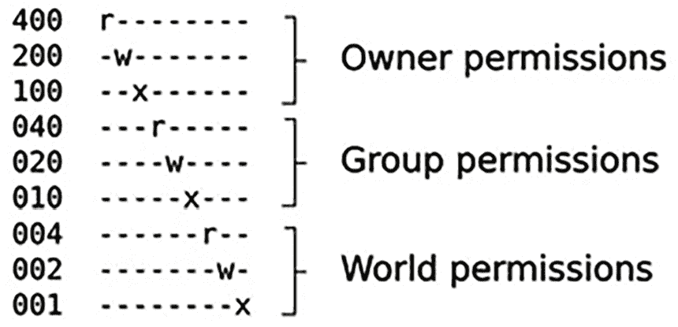

# 构建根文件系统

根文件系统是嵌入式 Linux 的第四个要素。阅读完本章后，你将能够构建、启动并运行一个简单的嵌入式 Linux 系统。

这里描述的技术通常被称为 **自己动手做**，或 **RYO**。在嵌入式 Linux 的早期，这是一种创建根文件系统的唯一方式。至今，仍然有一些使用场景适用 RYO 根文件系统——例如，当内存或存储非常有限时，用于快速演示，或在某些需求无法轻松通过标准构建系统工具覆盖的情况下。然而，这些场景相当罕见。

本章的目的在于教育性展示，并非构建日常嵌入式系统的配方。对于此类构建，请使用下一章中描述的工具。

我们的第一个目标是创建一个最小的根文件系统，使其能提供一个 shell 提示符。然后，基于此，我们将添加脚本来启动其他程序并配置网络接口和用户权限。对于 BeaglePlay 和 QEMU 目标都有示例。知道如何从头开始构建根文件系统是一个有用的技能。它将帮助你理解在后续章节中我们查看更复杂示例时发生了什么。

本章将涵盖以下主题：

+   根文件系统中应该包含什么？

+   将根文件系统传输到目标设备

+   创建引导 `initramfs`

+   `init` 程序

+   配置用户账户

+   更好的设备节点管理方式

+   配置网络

+   使用设备表创建文件系统镜像

+   使用 NFS 挂载根文件系统

+   使用 TFTP 加载内核

# 技术要求

为了跟随示例，确保你拥有以下内容：

+   一个 Ubuntu 24.04 或更高版本的 LTS 主机系统

+   一台 microSD 卡读卡器和卡

+   为 BeaglePlay 准备的 microSD 卡，来自*第四章*

+   来自*第四章*的 QEMU `Image` 文件

+   一条带有 3.3V 逻辑电平的 USB 到 TTL 串行电缆

+   一台 BeaglePlay

+   一款能够提供 3A 电流的 5V USB-C 电源

本章中使用的代码可以在书籍 GitHub 仓库的 `Chapter05` 文件夹中找到：[`github.com/PacktPublishing/Mastering-Embedded-Linux-Development/tree/main/Chapter05`](https://github.com/PacktPublishing/Mastering-Embedded-Linux-Development/tree/main/Chapter05)。

# 根文件系统中应该包含什么？

内核通过引导加载程序传递的指针获得一个根文件系统，通常是一个`initramfs`，或者通过挂载内核命令行中给出的块设备（使用`root=`参数）。一旦它有了根文件系统，内核就会执行第一个程序——默认名为`init`，正如在《第四章》中*早期用户空间*部分所描述的那样。然后，就内核而言，它的工作已经完成。由`init`程序来启动其他程序并让系统运行起来。

要构建一个最小化的根文件系统，你需要以下组件：

+   **init**：这是启动一切的程序，通常通过运行一系列脚本来实现。我将在《第十三章》中更详细地描述`init`的工作原理。

+   **shell**：为你提供命令提示符，并（更重要的是）运行`init`和其他程序调用的 Shell 脚本。

+   **守护进程**：这些是后台程序，为其他程序提供服务。典型的例子包括系统日志守护进程（`syslogd`）和安全外壳守护进程（`sshd`）。`init`程序必须启动守护进程的初始集合，以支持主系统应用程序。实际上，`init`本身就是一个守护进程。它是提供启动其他守护进程服务的守护进程。

+   **共享库**：大多数程序都与共享库链接，因此它们必须存在于根文件系统中。

+   **配置文件**：这些是一些文本文件，通常存储在`/etc`目录中，用于配置`init`和其他守护进程。

+   **设备节点**：这些是特殊文件，用于访问各种设备驱动程序。

+   **proc 和 sys**：这两个伪文件系统将内核数据结构表示为一系列目录和文件。许多程序和库函数依赖于`/proc`和`/sys`。

+   **内核模块**：需要安装在根文件系统中，通常位于`/lib/modules/<kernel version>`目录下。

此外，还有一些设备特定的应用程序，使设备能够完成其预定的工作，以及它们生成的运行时数据文件。

**重要提示**

在某些情况下，你可以将上述大多数程序合并为一个静态链接的程序，并启动该程序而不是`init`。例如，如果你的程序名为`/myprog`，你可以将以下命令添加到内核命令行：`init=/myprog`。

我在一个安全系统中只遇到过一次这样的配置，其中禁用了`fork`系统调用，从而使得无法启动任何其他程序。这种方法的缺点是你无法使用通常嵌入式系统中的许多工具。你必须自己做所有事情。

## 目录布局

Linux 内核并不关心文件和目录的布局，除非是存在名为`init=`或`rdinit=`的程序，因此你可以随意安排文件的存放位置。例如，比较运行 Android 的设备与桌面 Linux 发行版的文件布局，它们几乎完全不同。

然而，许多程序期望某些文件位于特定的位置，若设备使用类似的布局对开发人员有帮助。大多数 Linux 系统的基本布局在**文件系统层次标准**（**FHS**）中有所定义，详情请见[`refspecs.linuxfoundation.org/fhs.shtml`](https://refspecs.linuxfoundation.org/fhs.shtml)。FHS 涵盖了所有 Linux 操作系统的实现，从最大到最小。嵌入式设备通常根据其需求使用一个子集，但每个设备通常都包括以下内容：

+   `/bin`：所有用户都需要的程序

+   `/dev`：设备节点和其他特殊文件

+   `/etc`：系统配置文件

+   `/lib`：基本的共享库，包括构成 C 库的库文件

+   `/proc`：以虚拟文件形式呈现的进程信息

+   `/sbin`：系统管理员必需的程序

+   `/sys`：以虚拟文件形式呈现的设备及其驱动信息

+   `/tmp`：用于存放临时或易失性文件的地方

+   `/usr`：附加程序、库文件和系统管理员工具，分别存放在`/usr/bin`、`/usr/lib`和`/usr/sbin`目录中

    **重要提示**

    `/usr`目录包含所有系统范围内的只读文件，这些文件是由操作系统安装或提供的。过去，`/bin`、`/sbin`和`/lib`仅包含启动所需的可执行文件和库文件，而`/usr/bin`、`/usr/sbin`和`/usr/lib`包含所有其他可执行文件和二进制文件。这一区别后来模糊了，最终出现了将`/bin`、`/sbin`和`/lib`合并到`/usr/bin`、`/usr/sbin`和`/usr/lib`的现代趋势。如今，`/bin`、`/sbin`和`/lib`中的文件仅仅是指向它们在`/usr`中的对应文件的符号链接。`/usr/sbin`目录像`/sbin`目录一样，存放只能由`root`用户执行的命令。

+   `/var`：在运行时可以修改的文件和目录层次结构，例如日志信息，其中一些必须在启动后保留

这里有一些微妙的区别。`/bin`和`/sbin`的区别仅仅在于后者不需要包含在非 root 用户的搜索路径中。Red Hat 衍生的发行版用户对此应该比较熟悉。

## 临时目录

你应该首先在主机计算机上创建一个**临时**目录，用于汇总最终会被传输到目标设备的文件。在以下示例中，我使用了`~/rootfs`。你需要在其中创建一个骨架目录结构。请看下面：

```
$ mkdir ~/rootfs
$ cd ~/rootfs
$ mkdir bin dev etc home lib proc sbin sys tmp usr var
$ mkdir usr/bin usr/lib usr/sbin
$ mkdir var/log
$ ln -s lib lib64 
```

要更清晰地查看目录层次结构，可以使用便捷的`tree`命令，带上`-d`选项仅显示目录：

```
$ tree -d
.
├── bin
├── dev
├── etc
├── home
├── lib
├── lib64 -> lib
├── proc
├── sbin
├── sys
├── tmp
├── usr
│   ├── bin
│   ├── lib
│   └── sbin
└── var
    └── log 
```

并非所有目录具有相同的文件权限，目录中的个别文件可以比目录本身有更严格的权限。

## POSIX 文件访问权限

每个进程或运行程序都属于一个用户和一个或多个组。用户由一个称为**用户 ID**或**UID**的 32 位数字表示。关于用户的信息，包括从 UID 到名称的映射，保存在`/etc/passwd`中。同样，组由一个称为**组 ID**或**GID**的数字表示，信息保存在`/etc/group`中。始终存在一个`root`用户，其 UID 为 0，并且一个`root`组，其 GID 为 0。`root`用户也称为**超级用户**，因为在默认配置下，它可以绕过大部分权限检查并访问系统中的所有资源。Linux 系统中的安全性主要是关于限制对 root 账户的访问。

每个文件和目录还有一个所有者，并且属于恰好一个组。进程对文件或目录的访问级别由一组称为文件的**模式**的访问权限标志控制。有三组三位数：第一组适用于文件的*所有者*，第二组适用于与文件相同组的*成员*，最后一组适用于*其他所有人* - 世界上的其余人。这些位用于文件的**读**（`r`）、**写**（`w`）和**执行**（`x`）权限。三位数的组合产生 2³ = 8 个可能的值，表示为从 0 到 7 的八进制数字：

+   0: 没有权限

+   1: 仅执行 (--x)

+   2: 只写 (-w-)

+   3: 写和执行 (-wx)

+   4: 只读 (r--)

+   5: 读和执行 (r-x)

+   6: 读和写 (rw-)

+   7: 读、写和执行 (rwx)

由于三位数可以完美地放入八进制数字中，文件访问权限通常用八进制表示。

这里是一些常见的文件模式：

+   600: 所有者 - rw-, 组 - ---, 和其他人 - ---

+   644: 所有者 - rw-, 组 - r--, 和其他人 - r--

+   666: 所有者 - rw-, 组 - rw-, 和其他人 - rw-

+   700: 所有者 - rwx, 组 - ---, 和其他人 - ---

+   755: 所有者 - rwx, 组 - r-x, 和其他人 - r-x

+   775: 所有者 - rwx, 组 - rwx, 和其他人 - r-x

+   777: 所有者 - rwx, 组 - rwx, 和其他人 - rwx

八进制数字的第一个（最左边的）位是值为 4，第二个（中间的）位是值为 2，第三个（最右边的）位是值为 1，如下所示：



图 5.1 – 文件访问权限

如果集合中的三位数都设置了，则该集合的八进制值为 4 + 2 + 1 = 7。上述图表中的每一行包含 3 个集合，总共有 9 位。

有一个第四个前导的八进制数字，其值具有特殊意义：

+   **SUID (4)**: 如果文件是可执行的，它会在程序运行时将进程的有效 UID 更改为文件所有者的 UID。

+   **SGID (2)**：与 SUID 类似，这会将进程的有效 GID 更改为文件所属组的 GID。

+   **Sticky (1)**：在一个目录中，它限制删除操作，使得一个用户不能删除另一个用户拥有的文件。通常这会设置在`/tmp`和`/var/tmp`目录下。

SUID 位可能是最常用的。它赋予非 root 用户临时提升到超级用户的权限来执行任务。`ping`程序是一个很好的例子：`ping`打开一个原始套接字，这是一个特权操作。`ping`可执行文件由`root`用户拥有，并且设置了 SUID 位，这样当你运行`ping`时，无论你的 UID 是什么，它都会以 UID 0 执行。

要设置这个前导八进制数字，可以使用`chmod`命令的`4`、`2`和`1`值。例如，要在暂存根目录中的`/bin/ping`上设置 SUID，可以将`4`加到模式`755`前面，如下所示：

```
$ cd ~/rootfs
$ ls -l bin/ping
-rwxr-xr-x 1 root root 35712 Feb 6 09:15 bin/ping
$ sudo chmod 4755 bin/ping
$ ls -l bin/ping
-rwsr-xr-x 1 root root 35712 Feb 6 09:15 bin/ping 
```

请注意，第二个`ls`命令显示模式的前三个位为`rws`，而之前是`rwx`。那个`s`表示 SUID 位已设置。

## 暂存目录中的文件所有权权限

出于安全性和稳定性的考虑，必须注意将要放置在目标设备上的文件的所有权和权限。通常，你需要将敏感资源的访问限制为只有`root`用户才能访问，并尽可能减少非 root 用户运行程序的数量。最好是使用非 root 用户来运行程序，这样如果它们被外部攻击者攻破，它们提供给攻击者的系统资源将尽可能少。

例如，名为`/dev/mem`的设备节点提供对系统内存的访问，这是某些程序所必需的。但是，如果它对所有人都可读写，那么就没有安全性，因为任何人都可以访问内存中的所有内容。所以，`/dev/mem`应该由`root`所有，属于`root`组，并且设置模式为`600`，以拒绝除所有者外的所有人读写访问。

然而，暂存目录存在一个问题。你在那里创建的文件将属于你。但是，当它们被安装到设备上时，它们应该属于特定的所有者和组，通常是`root`用户。一个明显的解决方法是在此阶段将所有权更改为`root`，可以使用下面的命令：

```
$ cd ~/rootfs
$ sudo chown -R root:root * 
```

**重要提示**

不要运行前面的`sudo chown -R root:root *`命令。你可能会不可逆转地损坏你的文件系统。

问题在于，你需要`root`权限来运行`chown`命令。从那时起，你将需要`root`权限来修改暂存目录中的任何文件。不知不觉中，你可能就以`root`身份登录进行开发，这并不是一个好主意。我们将在创建独立的`initramfs`时重新审视这个问题。

## 根文件系统程序

现在，是时候开始为根文件系统填充必要的程序以及它们运行所需的支持库、配置文件和数据文件了。我将首先概述你需要的程序类型。

### init 程序

`init`是第一个运行的程序，因此它是根文件系统的重要组成部分。在本章中，我们将使用 BusyBox 提供的简单`init`程序。

### Shell

我们需要一个 Shell 来运行脚本并提供命令提示符，以便我们与系统进行交互。在生产设备中可能不需要交互式 Shell，但在开发、调试和维护中非常有用。嵌入式系统上常用的 Shell 有几种：

+   `bash`：这是我们在桌面 Linux 中都熟知并喜爱的“大怪兽”。它是 Unix Bourne shell 的超集，具有许多扩展或 bash 特性。

+   `ash`：这也是基于 Bourne shell 的，并且在 Unix 的 BSD 变种中有着悠久的历史。BusyBox 有一个版本的`ash`，它经过扩展，使其更加兼容`bash`。它比`bash`小得多，因此它是嵌入式系统中非常流行的选择。

+   `hush`：这是一款非常小的 shell，我们在*第三章*中简要地看过它。它在内存非常有限的设备上非常有用。BusyBox 中有一个版本的`hush`。

    **提示**

    如果你在目标设备上使用`ash`或`hush`作为 shell，确保在目标设备上测试你的脚本。仅仅在主机上使用`bash`测试它们，而在将它们复制到目标设备后却发现它们无法正常工作，这是很容易犯的错误。

### 实用工具

Shell 仅仅是启动其他程序的一种方式。Shell 脚本不过是一个程序列表，包含一些流程控制和在程序之间传递信息的方式。为了使一个 Shell 有用，你需要一些 Unix 命令行所依赖的实用程序。即使是一个基本的根文件系统，也需要大约 50 个实用程序。这带来了两个问题。首先，找到每个程序的源代码并交叉编译所有这些程序是一项大工程。其次，最终的程序集合会占用几十兆字节的存储空间。这在嵌入式 Linux 的早期是一个真正的问题，当时设备的存储容量只有几兆字节。BusyBox 正是为了应对这个问题而创建的。

### BusyBox 来拯救我们了！

BusyBox 的诞生与嵌入式 Linux 无关。Bruce Perens 在 1996 年启动了这个项目，为了使 Debian 安装程序能够从 1.44 MB 的软盘启动 Linux。巧合的是，这个存储大小与当时设备的存储容量差不多，因此嵌入式 Linux 社区迅速接受了它。从那时起，BusyBox 就一直是嵌入式 Linux 的核心。

BusyBox 从零开始编写，旨在执行那些基本 Linux 工具的基本功能。开发者运用了 80/20 原则：一个程序最有用的 80% 功能是由 20% 的代码实现的。因此，BusyBox 工具实现了桌面版工具功能的一个子集，但足以在大多数情况下满足需求。

另一个 BusyBox 使用的技巧是将所有工具合并到一个单一的二进制文件中，从而方便它们之间共享代码。具体操作如下：BusyBox 是一系列小工具的集合，每个小工具都以 `<applet>_main` 的形式导出其 `main` 函数。例如，`cat` 命令在 `coreutils/cat.c` 中实现，并导出 `cat_main`。BusyBox 的 `main` 函数根据命令行参数将调用调度到正确的小工具。

要读取文件，你可以通过启动 BusyBox 并指定你要运行的小工具的名称，后跟小工具需要的任何参数：

```
$ busybox cat my_file.txt 
```

你也可以运行 BusyBox 而不带任何参数，以获取已编译的所有小工具的列表。

这样使用 BusyBox 有点笨拙。让 BusyBox 运行 `cat` 小工具的更好方法是从 `/bin/cat` 创建一个符号链接到 `/bin/busybox`：

```
$ ls -l bin/cat bin/busybox
-rwxr-xr-x 1 root root 1137096 Aug 20 10:31 bin/busybox
lrwxrwxrwx 1 root root       7 Aug 20 10:31 bin/cat -> busybox 
```

当你在命令行输入`cat`时，实际运行的程序是 BusyBox。BusyBox 只需要检查传入的可执行文件路径（`/bin/cat`），提取应用程序名称（`cat`），然后进行表格查找，将`cat`与`cat_main`匹配。所有这些在 `libbb/appletlib.c` 中的这一段简化代码中有体现：

```
applet_name = argv[0];
applet_name = bb_basename(applet_name);
run_applet_and_exit(applet_name, argv); 
```

BusyBox 包含超过 300 个小工具，包括一个 `init` 程序、几个具有不同复杂度的 shell 以及用于大多数管理任务的工具。甚至还有一个简单版本的 `vi` 编辑器，方便你在设备上修改文本文件。一个典型的 BusyBox 二进制文件将只启用几十个小工具。

总结来说，典型的 BusyBox 安装由一个单一程序组成，每个小工具都有一个符号链接，但其行为与多个独立应用程序完全一致。

### 构建 BusyBox

BusyBox 使用与内核相同的 `Kconfig` 和 `Kbuild` 系统，因此交叉编译非常简单。通过克隆 BusyBox Git 仓库并检查你想要的版本（2024 年 8 月时最新版本是 `1_36_1`）来获取源码：

```
$ git clone git://busybox.net/busybox.git
$ cd busybox
$ git checkout 1_36_1 
```

你还可以从 [`busybox.net/downloads/`](https://busybox.net/downloads/) 下载相应的 TAR 文件。

使用默认配置来配置 BusyBox，这将启用几乎所有功能：

```
$ make distclean
$ make defconfig 
```

到此为止，你可能需要运行 `make menuconfig` 来微调配置。例如，你几乎肯定需要在 **设置 | 安装选项（“make install”行为）| ‘make install’ 的目标路径** 中设置安装路径，指向暂存目录。然后，你就可以按常规方式进行交叉编译。如果你的目标平台是 BeaglePlay，可以使用以下命令：

```
$ PATH=~/aarch64--glibc--stable-2024.02-1/bin/:$PATH
$ make ARCH=arm64 CROSS_COMPILE=aarch64-buildroot-linux-gnu- 
```

你可以以相同的方式为 QEMU 模拟的 64 位 Arm 通用虚拟平台交叉编译 BusyBox。

无论哪种情况，结果都是`busybox`可执行文件。对于像这样的默认配置构建，大小约为 1,100KB。如果这个文件太大，你可以通过更改配置来删除不需要的工具，从而减小它的体积。

要将 BusyBox 安装到暂存区，请使用以下命令：

```
$ make ARCH=arm64 CROSS_COMPILE=aarch64-buildroot-linux-gnu- install 
```

这将把二进制文件复制到**“make install”目标路径**中，并为其创建所有的符号链接。

现在，让我们来看看另一个替代品，ToyBox。

### ToyBox——BusyBox 的替代品

BusyBox 并不是唯一的选择。还有 ToyBox，你可以在[`landley.net/toybox/`](https://landley.net/toybox/)找到它。该项目由 Rob Landley 发起，他曾是 BusyBox 的维护者。ToyBox 的目标与 BusyBox 相同，但更加注重遵守标准（尤其是 POSIX-2008 和 LSB 4.1），而不太关注与 GNU 扩展兼容性。ToyBox 比 BusyBox 小，部分原因是它实现了更少的工具。

ToyBox 的许可证是 BSD，而不是 GPL v2，这使得它与那些采用 BSD 许可证用户空间的操作系统兼容，比如 Android。因此，ToyBox 与所有新的 Android 设备一起发布。从 0.8.3 版本开始，ToyBox 的`Makefile`可以构建一个完整的 Linux 系统，当只提供 Linux 和 ToyBox 的源代码时，它可以启动并进入 Shell 提示符。

## 根文件系统的库

程序是与库链接的。你可以将它们全部静态链接，这样就不会在目标设备上驻留任何库。如果你有超过两到三个程序，这会占用不必要的大量存储空间。为了减小程序的大小，你需要将共享库从工具链复制到暂存目录。但是，你怎么知道该复制哪些库呢？

一种选择是从你的工具链的`sysroot`目录复制所有的`.so`文件。与其试图预测要包含哪些库，不如假设你的镜像最终会需要它们所有。这种做法无疑是合理的，如果你正在创建一个供他人使用的多种应用平台，那么这种方法是正确的。然而，要注意，完整的 glibc 是相当庞大的。在 Buildroot 构建的 glibc 的情况下，库、区域设置和其他支持文件总共达到了 22MB。通过使用 musl 或 uClibc-ng，你可以大大减少这个大小。

另一个选择是只挑选你需要的那些库。为此，你需要一种发现库依赖关系的方法。让我们使用来自*第二章*的`readelf`命令来完成这项任务：

```
$ PATH=~/aarch64--glibc--stable-2024.02-1/bin/:$PATH
$ cd ~/rootfs
$ aarch64-buildroot-linux-gnu-readelf -a bin/busybox | grep "program interpreter"
      [Requesting program interpreter: /lib/ld-linux-aarch64.so.1]
$ aarch64-buildroot-linux-gnu-readelf -a bin/busybox | grep "Shared library"
 0x0000000000000001 (NEEDED)             Shared library: [libm.so.6]
 0x0000000000000001 (NEEDED)             Shared library: [libresolv.so.2]
 0x0000000000000001 (NEEDED)             Shared library: [libc.so.6]
 0x0000000000000001 (NEEDED)             Shared library: [ld-linux-aarch64.so.1] 
```

第一个`readelf`命令搜索`busybox`二进制文件中包含`program interpreter`的行。第二个`readelf`命令搜索`busybox`二进制文件中包含`Shared library`的行。现在，你需要在工具链的`sysroot`目录中找到这些文件，并将它们复制到暂存目录。记住，你可以这样找到`sysroot`：

```
$ aarch64-buildroot-linux-gnu-gcc -print-sysroot
/home/frank/aarch64--glibc--stable-2024.02-1/aarch64-buildroot-linux-gnu/sysroot 
```

为了减少输入，可以将`sysroot`路径保存在一个 shell 变量中：

```
$ export SYSROOT=$(aarch64-buildroot-linux-gnu-gcc -print-sysroot) 
```

我们来看一下`sysroot`中的`/lib/ld-linux-aarch64.so.1`：

```
$ cd $SYSROOT
$ ls -l lib/ld-linux-aarch64.so.1
-rwxr-xr-x 1 frank frank 202248 Mar  3 00:48 lib/ld-linux-aarch64.so.1 
```

对`libc.so.6`、`libm.so.6`和`libresolv.so.2`进行相同的操作，这样你就会得到四个文件的列表。现在，将每个文件复制到`rootfs`目录中：

```
$ cd ~/rootfs
$ cp $SYSROOT/lib/ld-linux-aarch64.so.1 lib
$ cp $SYSROOT/lib/libc.so.6 lib
$ cp $SYSROOT/lib/libm.so.6 lib
$ cp $SYSROOT/lib/libresolv.so.2 lib 
```

这些是`busybox`所需的共享库。对于每个你希望添加到`rootfs`目录中的程序，重复此过程。

**提示**

只有在需要最小化嵌入式系统占用空间时，做这个操作才有意义。这样做的风险是，你可能会错过通过`dlopen(3)`调用加载的库，主要是插件。我们将在本章稍后讨论配置网络接口时，探讨与**名称服务切换**（**NSS**）库的例子。

### 通过去除符号表减少文件大小

库和程序通常会在符号表中存储一些信息，用于调试和追踪。在生产系统中，你很少需要这些信息。节省空间的一种快速简便的方法是去除二进制文件中的符号表。这个例子展示了去除前的`libc`：

```
$ file rootfs/lib/libc.so.6
rootfs/lib/libc.so.6: ELF 64-bit LSB shared object, ARM aarch64, version 1 (GNU/Linux), dynamically linked, interpreter /lib/ld-linux-aarch64.so.1, for GNU/Linux 3.7.0, with debug_info, not stripped
$ ls -og rootfs/lib/libc.so.6
-rwxr-xr-x 1 1925456 Dec 12 05:43 rootfs/lib/libc.so.6 
```

现在，我们来看一下去除调试信息后的结果：

```
$ aarch64-buildroot-linux-gnu-strip rootfs/lib/libc.so.6
$ file rootfs/lib/libc.so.6
rootfs/lib/libc.so.6: ELF 64-bit LSB shared object, ARM aarch64, version 1 (GNU/Linux), dynamically linked, interpreter /lib/ld-linux-aarch64.so.1, for GNU/Linux 3.7.0, stripped
$ ls -og rootfs/lib/libc.so.6
-rwxr-xr-x 1 1392840 Dec 12 05:53 rootfs/lib/libc.so.6 
```

在这种情况下，我们在去除调试信息之前节省了 532,616 字节，即文件大小的约 28%。

**提示**

注意不要去除内核模块的调试符号。某些符号是模块加载器在重新定位模块代码时所必需的，如果这些符号被去除，模块将无法加载。使用此命令移除调试符号，同时保留用于重定位的符号：`strip --strip-unneeded <模块名>`。

## 设备节点

在 Linux 中，大多数设备通过设备节点来表示，符合 Unix 哲学中的*一切皆文件*（网络接口除外，网络接口是套接字）。设备节点可以指代块设备或字符设备。块设备是大容量存储设备，如 SD 卡或硬盘。字符设备几乎包括所有其他设备（同样，网络接口除外）。

设备节点的常规位置是`/dev`目录。例如，串口可以通过名为`/dev/ttyS0`的设备节点来表示。

设备节点是通过名为`mknod`（即“创建节点”）的程序创建的：

```
mknod <name> <type> <major> <minor> 
```

`mknod`的参数如下：

+   **名称**是你要创建的设备节点的名称。

+   **类型**是字符设备（c）或块设备（b）。

+   **主设备号**和**次设备号**是一对数字，内核通过它们将文件请求路由到相应的设备驱动代码。内核源文件中有一个标准主设备号和次设备号的列表：`Documentation/admin-guide/devices.txt`。

你需要为系统中要访问的所有设备创建设备节点。你可以手动使用下面示范的 `mknod` 命令来创建，或者可以使用稍后提到的设备管理器在运行时自动创建它们。

在最小化根文件系统中，你只需要两个节点来使用 BusyBox 启动：`console` 和 `null`。`console` 只需要对设备节点的所有者 `root` 可访问，因此其访问权限为 `600`（`rw-------`）。`null` 设备应该对所有人都可读可写，所以它的模式为 `666`（`rw-rw-rw-`）。使用 `-m` 选项设置 `mknod` 创建节点时的 `mode`。你需要是 `root` 用户才能创建设备节点：

```
$ cd ~/rootfs
$ sudo mknod -m 666 dev/null c 1 3
$ sudo mknod -m 600 dev/console c 5 1
$ ls -l dev
total 0
crw------- 1 root root 5, 1 Aug 20 11:06 console
crw-rw-rw- 1 root root 1, 3 Aug 20 11:06 null 
```

你可以使用标准的 `rm` 命令删除设备节点。没有 `rmnod` 命令，因为一旦创建，它们就只是文件。

## Proc 和 sysfs 文件系统

`proc` 和 `sysfs` 是两个伪文件系统，它们提供了一个观察内核内部工作原理的窗口。它们都将内核数据以文件的形式表示在一个目录层次结构中。当你读取这些文件时，看到的内容并不是来自磁盘存储。相反，它是由内核中的一个函数即时格式化的。有些文件也可以写入，这意味着当你写入新的数据时，内核函数会被调用。如果数据格式正确，并且你具有足够的权限，那么该函数将修改内核内存中存储的值。换句话说，`proc` 和 `sysfs` 提供了与设备驱动程序和其他内核代码交互的另一种方式。

**重要提示**

以下的 `mount` 命令适用于嵌入式目标设备，如 BeaglePlay 或 Versatile Express（QEMU）。请勿在主机机器上运行这些命令。

`proc` 和 `sysfs` 文件系统应该挂载在 `/proc` 和 `/sys` 目录下：

```
# mount -t proc proc /proc
# mount -t sysfs sysfs /sys 
```

虽然这两个文件系统的概念非常相似，但它们执行的是不同的功能。`proc` 从 Linux 初期就已经存在。它的最初目的是将关于进程的信息暴露给用户空间，因此得名。为了这个目的，系统为每个进程创建了一个名为 `/proc/<PID>` 的目录，目录中包含该进程的状态信息。进程列表命令（`ps`）通过读取这些文件来生成输出。

还有一些文件提供了关于内核其他部分的信息。例如，`/proc/cpuinfo` 提供关于 CPU 的信息，`/proc/interrupts` 包含中断信息，等等。最后，`/proc/sys` 目录包含显示和控制内核子系统状态和行为的文件，特别是调度、内存管理和网络。手册页是查看 `proc` 目录中文件的最佳参考。你可以通过输入 `man 5 proc` 查看这些信息。

`sysfs` 的作用是将内核 **驱动模型** 显示给用户空间。它导出一个与设备相关的文件层次结构，表示设备及其连接关系。关于 Linux 驱动模型的更多细节，我将在描述与设备驱动交互时讲解，在 *第十一章* 中详细说明。

### 挂载文件系统

`mount` 命令允许我们将一个文件系统附加到另一个目录，从而形成文件系统的层次结构。最上层的文件系统是由内核在启动时挂载的，称为 **根文件系统**。`mount` 命令的格式如下：

```
mount [-t vfstype] [-o options] device directory 
```

`mount` 的参数如下：

+   **vfstype** 是文件系统的类型。

+   **options** 是以逗号分隔的挂载选项列表。

+   **device** 是文件系统所在的块设备节点。

+   **directory** 是你希望将文件系统挂载到的目录。

在 `-o` 后有多种选项可供选择。查看 `mount(8)` 的手册页以获取更多信息。如果你想将包含 ext4 文件系统的 SD 卡的第一个分区挂载到名为 `/mnt` 的目录，请输入以下命令：

```
# mount -t ext4 /dev/mmcblk0p1 /mnt 
```

假设挂载成功，你将会在 `/mnt` 目录下看到存储在 SD 卡上的文件。在某些情况下，你可以省略文件系统类型，让内核探测设备，找出存储的内容。如果挂载失败，你可能需要先卸载分区，如果你的 Linux 发行版配置为在插入 SD 卡时自动挂载所有分区。

你注意到以下挂载 `proc` 文件系统的例子有什么奇怪的吗？没有像 `/dev/proc` 这样的设备节点，因为它是一个伪文件系统，而非真实的文件系统。但 `mount` 命令需要一个设备参数。因此，我们必须提供一个字符串来代替设备的位置，但这个字符串的内容其实不重要。这两个命令的效果完全相同：

```
# mount -t proc procfs /proc
# mount -t proc nodevice /proc 
```

`procfs` 和 `nodevice` 字符串会被 `mount` 命令忽略。挂载伪文件系统时，通常会使用文件系统类型代替设备。

## 内核模块

如果你有内核模块，它们需要使用 `modules_install` 内核构建目标安装到根文件系统中，正如我们在 *第四章* 中所看到的。这会将它们复制到 `/lib/modules/<kernel version>` 目录，并将 `modprobe` 命令所需的配置文件一并复制过去。

请注意，你刚刚在内核和根文件系统之间创建了一个依赖关系。如果你更新其中之一，你将需要更新另一个。

现在我们已经知道如何从 SD 卡挂载文件系统，接下来我们来看看挂载根文件系统的不同选项。替代方案（如 ramdisk 和 NFS）可能会让你感到惊讶，尤其是如果你对嵌入式 Linux 不熟悉的话。Ramdisk 可以保护原始源镜像不被损坏或磨损。我们将在*第九章*中了解更多关于闪存磨损的内容。网络文件系统允许更快速的开发，因为文件的更改会立即传播到目标设备。

# 将根文件系统传输到目标设备

在你的暂存目录中创建一个骨架根文件系统后，下一步是将其传输到目标设备。这里有三种可能性：

+   **initramfs**：这是一种由引导加载程序加载到 RAM 中的文件系统镜像。Ramdisks 容易创建，并且不依赖于大容量存储驱动程序。它们可以在主根文件系统需要更新时用作后备维护模式，甚至可以在较小的嵌入式设备中作为主根文件系统。Ramdisks 还常常作为主流 Linux 发行版中的早期用户空间使用。请记住，存储在 ramdisk 中的根文件系统内容是易失性的，因此在运行时对根文件系统所做的任何更改都会在系统重启时丢失。你需要其他存储类型来存储像配置参数这样的永久数据。

+   **磁盘镜像**：这是根文件系统的一个副本，已格式化并准备好加载到目标的存储设备上。它可以是一个 ext4 格式的镜像，准备复制到 SD 卡上，或者是 jffs2 格式，准备通过引导加载程序加载到闪存中。创建磁盘镜像可能是最常见的选择。关于不同类型的大容量存储，有更多的信息可以参考*第九章*。

+   **网络文件系统**：当暂存目录通过 NFS 服务器导出到网络，并在启动时由目标设备挂载时，就形成了网络文件系统。这通常在开发过程中使用，而不是通过反复创建磁盘镜像并将其重新加载到大容量存储设备上，因为后者会迅速变得繁琐。

我将从`intiramfs`开始，利用它来说明如何对根文件系统进行一些细微调整，比如添加用户名和设备管理器，以便自动创建设备节点。然后，我会展示如何创建磁盘镜像，以及如何使用 NFS 通过网络挂载根文件系统。

# 创建一个启动 initramfs

初始 RAM 文件系统或`initramfs`是一个压缩的 cpio 归档文件。cpio 是一种古老的 Unix 归档格式，类似于 TAR 和 ZIP，但它更容易解码，因此内核需要的代码较少。你需要在内核中配置`CONFIG_BLK_DEV_INITRD`以支持`initramfs`。

有三种不同的方式来创建引导 ramdisk：作为独立的 cpio 归档、作为嵌入在内核映像中的 cpio 归档，以及作为内核构建系统在构建过程中处理的设备表。第一种方式提供了最大的灵活性，因为我们可以随意混合和匹配内核和 ramdisk。然而，它意味着需要处理两个文件而不是一个，并且并非所有引导加载程序都有加载独立 ramdisk 的功能。

## 独立 initramfs

以下是创建归档、压缩它并添加一个 U-Boot 头以便加载到目标上的一系列指令：

```
$ cd ~/rootfs
$ find . | cpio -H newc -ov --owner root:root > ../initramfs.cpio
$ cd ..
$ gzip initramfs.cpio
$ mkimage -A arm64 -O linux -T ramdisk -d initramfs.cpio.gz uRamdisk 
```

注意，我们运行`cpio`时使用了`--owner root:root`选项。这是解决前面在*暂存目录中的文件所有权权限*部分提到的文件所有权问题的快速修复。它使得 cpio 归档中的所有内容都具有 UID 和 GID 为 0。

最终的 uRamdisk 文件大小约为 1.9 MB，没有内核模块。再加上 9.8 MB 的内核`Image.gz`文件和 1,061 KB 的 U-Boot。这样，我们总共需要 13 MB 的存储空间来引导这块板子。这个大小远远超过了最初的 1.44 MB 软盘。如果大小真的是一个问题，那么你可以使用以下某种方式：

+   通过去掉不需要的驱动程序和功能来使内核更小。

+   通过去掉不需要的工具来使 BusyBox 更小。

+   使用 musl libc 或 uClibc-ng 替代 glibc。

+   静态编译 BusyBox。

## 启动 initramfs

我们可以做的最简单的事情是通过控制台运行一个 shell，以便与目标进行交互。我们可以通过将`rdinit=/bin/sh`添加到内核命令行来实现这一点。接下来的两个部分将演示如何在 QEMU 和 BeaglePlay 上进行操作。

### 使用 QEMU 启动

QEMU 有一个`-initrd`选项，可以将`initramfs`加载到内存中。你应该已经使用*第四章*中的`aarch64-buildroot-linux-gnu`工具链编译了一个`Image`文件。从本章开始，你应该已经创建了一个包含用相同工具链编译的 BusyBox 的`initramfs`。现在，你可以使用`MELD/Chapter05/run-qemu-initramfs.sh`脚本或以下命令启动 QEMU：

```
$ cd ~
$ cd build_qemu
$ qemu-system-aarch64 -M virt -cpu cortex-a53 -nographic -smp 1 -kernel arch/arm64/boot/Image -append "console=ttyAMA0 rdinit=/bin/sh" -initrd ~/initramfs.cpio.gz 
```

你应该得到一个带有`#`提示符的`root` shell。

### 启动 BeaglePlay

对于 BeaglePlay，我们需要准备在*第四章*中使用的 microSD 卡，并使用`aarch64-buildroot-linux-gnu`工具链构建根文件系统。将你之前在本节中创建的`uRamdisk`复制到 microSD 卡的引导分区。启动 BeaglePlay 并进入 U-Boot 提示符。然后，输入以下命令：

```
nova!> fatload mmc 1 0x80000000 Image.gz
nova!> fatload mmc 1 0x82000000 k3-am625-beagleplay.dtb
nova!> setenv kernel_comp_addr_r 0x85000000
nova!> setenv kernel_comp_size 0x20000000
nova!> fatload mmc 1 0x83000000 uRamdisk
nova!> setenv bootargs console=ttyS2,115200n8 rdinit=/bin/sh
nova!> booti 0x80000000 0x83000000 0x82000000 
```

如果一切顺利，你将在串口控制台上看到一个带有`#`提示符的`root` shell。完成此步骤后，我们需要在两个平台上都挂载`proc`。

### 挂载 proc

你会发现`ps`命令在两个平台上都无法工作。这是因为`proc`文件系统尚未挂载。试着挂载它：

```
# mount -t proc proc /proc 
```

再次运行`ps`，你将看到进程列表。

作为改进，我们可以编写一个 Shell 脚本来挂载`proc`以及其他启动时需要完成的操作。然后，你可以在启动时运行这个脚本，而不是`/bin/sh`。以下代码片段演示了它是如何工作的：

```
#!/bin/sh
/bin/mount -t proc proc /proc
# Other boot-time commands go here
/bin/sh 
```

最后一行的`/bin/sh`启动一个新的 Shell，提供一个交互式的`root` Shell 提示符。以这种方式将 Shell 作为`init`程序非常方便，适用于快速修补，例如当你想要修复一个损坏的`init`程序的系统时。然而，在大多数情况下，你会使用一个`init`程序，我们将在本章的下一节中讨论。之前，我想先看一下加载`initramfs`的另外两种方式。

## 将 initramfs 构建到内核镜像中

到目前为止，我们已经将压缩后的`initramfs`作为单独的文件创建，并通过引导加载程序将其加载到内存中。一些引导加载程序可能不具备以这种方式加载`initramfs`文件的能力。为了应对这些情况，Linux 可以配置将`initramfs`合并到内核镜像中。为此，请更改内核配置，并将`CONFIG_INITRAMFS_SOURCE`设置为你之前为独立`initramfs`创建的压缩`initramfs.cpio.gz`归档文件的完整路径。如果你使用的是`menuconfig`，可以在**General setup | Initramfs source file(s)**中找到该字段。

完成这些更改后，构建内核。启动过程与之前相同，不同之处在于没有`-initrd`选项和需要传入的 ramdisk 文件。

对于 QEMU，输入以下命令：

```
$ qemu-system-aarch64 -M virt -cpu cortex-a53 -nographic -smp 1 -kernel arch/arm64/boot/Image -append "console=ttyAMA0 rdinit=/bin/sh" 
```

对于 BeaglePlay，在 U-Boot 提示符下输入以下命令：

```
nova!> fatload mmc 1 0x80000000 Image.gz
nova!> fatload mmc 1 0x82000000 k3-am625-beagleplay.dtb
nova!> setenv kernel_comp_addr_r 0x85000000
nova!> setenv kernel_comp_size 0x20000000
nova!> setenv bootargs console=ttyS2,115200n8 rdinit=/bin/sh
nova!> booti 0x80000000 - 0x82000000 
```

每次更改暂存目录的内容并重新构建内核时，请记得重新生成`initramfs.cpio`归档文件，并重新压缩`initramfs.cpio.gz`文件：

**提示**

如果在启动时遇到以下内核恐慌：

```
[    0.549725] Run /bin/sh as init process
[    0.573389] Kernel panic - not syncing: Attempted to kill init! exitcode=0x00000000
[    0.573688] CPU: 0 PID: 1 Comm: sh Not tainted 6.6.46 #13
…
[    0.576075] ---[ end Kernel panic - not syncing: Attempted to kill init! exitcode=0x00000000 ]--- 
```

确保在你的暂存目录中存在`dev/null`和`dev/console`设备节点。

## 使用设备表构建 initramfs

**设备表**是一个文本文件，列出了归档文件或文件系统镜像中包含的文件、目录、设备节点和链接。其显著优势是，它允许你创建由`root`用户或任何其他 UID 拥有的归档文件条目，而你自己不需要拥有`root`权限。你甚至可以在不需要`root`权限的情况下创建设备节点。所有这一切之所以可行，是因为归档文件只是一个数据文件，只有在 Linux 启动时展开时，才会使用你指定的属性创建实际的文件和目录。

内核有一个功能，允许我们在创建`initramfs`时使用设备表。你编写设备表文件后，再将`CONFIG_INITRAMFS_SOURCE`指向它。然后，当你构建内核时，它会根据设备表中的指令创建 cpio 归档文件。整个过程你都不需要`root`访问权限。

这是我们简单根文件系统的设备表。为了便于管理，它缺少大部分指向 BusyBox 的符号链接：

```
dir /bin 775 0 0
dir /sys 775 0 0
dir /tmp 775 0 0
dir /dev 775 0 0
nod /dev/null 666 0 0 c 1 3
nod /dev/console 600 0 0 c 5 1
dir /home 775 0 0
dir /proc 775 0 0
dir /lib 775 0 0
file /lib/libm.so.6 /home/frank/rootfs/lib/libm.so.6 755 0 0
file /lib/libresolv.so.2 /home/frank/rootfs/lib/libresolv.so.2 755 0 0
file /lib/libc.so.6 /home/frank/rootfs/lib/libc.so.6 755 0 0
file /lib/ld-linux-aarch64.so.1 /home/frank/rootfs/lib/ld-linux-aarch64.so.1 755 0 0 
```

语法非常直观：

+   `dir <name> <mode> <uid> <gid>`

+   `file <name> <location> <mode> <uid> <gid>`

+   `nod <name> <mode> <uid> <gid> <dev_type> <maj> <min>`

+   `slink <name> <target> <mode> <uid> <gid>`

命令`dir`、`nod`和`slink`在 cpio 归档中创建一个文件系统对象，包含给定的名称、模式、用户 ID 和组 ID。`file`命令将文件从源位置复制到归档中，并设置模式、用户 ID 和组 ID。

从头创建`initramfs.cpio`归档的任务，通过内核源代码中的一个脚本`gen_initramfs.sh`变得更加简单。首先，这个脚本从输入目录的内容生成一个设备表。然后，它将这个设备表转换成最终的 cpio 归档。

要从`rootfs`目录生成`initramfs.cpio`归档，并将所有由用户 ID`1000`和组 ID`1000`拥有的文件的所有权更改为用户 ID`0`和组 ID`0`，请输入以下命令：

```
$ cd ~
$ cp build_qemu/usr/gen_init_cpio linux-stable/usr/.
$ cd linux-stable
$ usr/gen_initramfs.sh -o ~/initramfs.cpio -u 1000 -g 1000 ~/rootfs 
```

## 旧版 initrd 格式

有一种较旧的 Linux ramdisk 格式，称为`initrd`。它是 Linux 2.6 之前唯一可用的格式，如果你使用的是 uClinux（没有 MMU 的 Linux 变种），仍然需要这种格式。它相当晦涩，因此我不会在这里介绍。

一旦我们的`initramfs`启动，系统需要开始运行程序。首先运行的程序是`init`程序。

# init 程序

在启动时运行一个 shell 或甚至是一个 shell 脚本对于简单的情况是可以的，但实际上，你需要更灵活的东西。通常，Unix 系统运行一个叫做`init`的程序，它负责启动和监控其他程序。多年来，有许多`init`程序，其中一些我将在*第十三章*中描述。目前，我将简要介绍 BusyBox 的`init`。

`init`程序首先读取`/etc/inittab`配置文件。这里是一个简单的例子，足以满足我们的需求：

```
::sysinit:/etc/init.d/rcS
::askfirst:-/bin/ash 
```

第一行在`init`启动时运行一个名为`rcS`的 shell 脚本。第二行将消息**Please press Enter to activate this console**打印到控制台，并在按下*Enter*后启动一个 shell。`/bin/ash`前的连字符`-`意味着它将成为一个登录 shell，在显示 shell 提示符之前，首先会读取`/etc/profile`和`$HOME/.profile`。

通过这种方式启动 shell 的一个优势是启用了作业控制。最直接的效果是，你可以使用*Ctrl + C*终止当前程序。也许你之前没注意到这一点，但等你运行`ping`程序时，你会发现你无法停止它！

如果根文件系统中没有`inittab`，BusyBox 的`init`会提供一个默认的`inittab`。它比前面的那个稍微复杂一些。

脚本`/etc/init.d/rcS`是放置需要在启动时执行的初始化命令的地方，例如挂载`proc`和`sysfs`文件系统：

```
#!/bin/sh
mount -t proc proc /proc
mount -t sysfs sysfs /sys 
```

确保你像这样使前面的`rcS`脚本可执行：

```
$ cd ~/rootfs
$ chmod +x etc/init.d/rcS 
```

你可以通过更改`-append`参数来尝试在 QEMU 上运行`init`，像这样：

```
-append "console=ttyAMA0 rdinit=/sbin/init" 
```

对于 BeaglePlay，你需要在 U-Boot 中设置`bootargs`变量，如下所示：

```
nova!> setenv bootargs console=ttyS2,115200n8 rdinit=/sbin/init 
```

现在，让我们仔细看看`init`在启动时读取的`inittab`。

## 启动守护进程

通常，你希望在启动时运行某些后台进程。例如，`syslogd`（日志守护进程）。`syslogd`的目的是收集来自其他程序，主要是其他守护进程的日志信息。自然，BusyBox 为此提供了一个小程序！

启动守护进程的方法很简单，只需在`etc/inittab`中添加一行，如下所示：

```
::respawn:/sbin/syslogd -n 
```

`respawn`意味着如果程序终止，它将被自动重启。`-n`表示它应作为前台进程运行。日志写入`/var/log/messages`。

**重要提示**

你可能还想以相同的方式启动`klogd`。`klogd`将内核日志信息发送到`syslogd`，以便它们能够被记录到永久存储中。

迄今为止，我提到的所有进程都以`root`身份运行，但这并不是理想的做法。

# 配置用户账户

正如我之前所说，将所有程序都以`root`身份运行并不是一个好习惯，因为如果其中一个程序被外部攻击破坏，那么整个系统都会面临风险。最好创建没有特权的用户账户，并在不需要完整`root`权限的地方使用它们。

用户名配置在`/etc/passwd`中。每个用户有一行，其中包含七个由冒号分隔的信息字段。它们的顺序是：

+   登录名

+   用于验证密码的哈希码，或更常见的是`x`，表示密码存储在`/etc/shadow`中

+   UID 或用户 ID

+   GID 或组 ID

+   注释字段（通常留空）

+   用户的主目录

+   用户将使用的 shell（可选）

这里是一个简单的示例，其中我们有`root`用户，UID 为 0，以及`daemon`用户，UID 为 1：

```
root:x:0:0:root:/root:/bin/sh
daemon:x:1:1:daemon:/usr/sbin:/bin/false 
```

将用户`daemon`的 shell 设置为`/bin/false`，确保任何尝试使用该用户名登录的行为都会失败。

各种程序需要读取`/etc/passwd`以查找用户名和 UID，因此该文件必须是全局可读的。如果密码哈希也存储在其中，就会产生问题，因为恶意程序可以复制该文件并通过各种破解程序发现实际的密码。为了减少敏感信息的暴露，密码存储在`/etc/shadow`中，并在密码字段中放置`x`，以表示这是情况。`/etc/shadow`文件只需要`root`访问，因此只要`root`用户没有被破坏，密码就会是安全的。

shadow 密码文件包含每个用户的一个条目，由九个字段组成。以下是一个示例，镜像了前面提到的密码文件：

```
root::10933:0:99999:7:::
daemon:*:10933:0:99999:7::: 
```

前两个字段是用户名和密码哈希。其余的七个字段与密码老化有关，这在嵌入式设备上通常不需要关注。如果你对详细信息感兴趣，可以参考`shadow(5)`的手册页。

在这个例子中，`root` 的密码为空，意味着 `root` 可以在不输入密码的情况下登录。为 `root` 设置空密码在开发过程中非常有用，但不适合生产环境。你可以通过在目标设备上运行 `passwd` 命令来生成或更改密码哈希，它将把新的哈希写入 `/etc/shadow`。如果你希望所有后续的根文件系统使用相同的密码，你可以将这个文件复制回暂存目录。

组名类似地存储在 `/etc/group` 中。每个组占一行，由四个字段组成，字段之间用冒号分隔。字段包括：

+   组名

+   组密码，或者通常是一个 `x`，表示没有组密码

+   GID 或者组 ID

+   属于该组的用户的逗号分隔列表（可选）

这是一个例子：

```
root:x:0:
daemon:x:1: 
```

## 向根文件系统添加用户帐户

首先，将 `etc/passwd`、`etc/shadow` 和 `etc/group` 文件添加到你的暂存目录，如前面部分所示。确保 `etc/shadow` 的权限是 `0600`。接下来，通过启动名为 `getty` 的程序来启动登录过程。BusyBox 中有一个 `getty` 版本，你可以通过在 `inittab` 文件中使用 `respawn` 关键字来启动它，`getty` 会在登录 shell 终止时重新启动。你的 `inittab` 文件应如下所示：

```
::sysinit:/etc/init.d/rcS
::respawn:/sbin/getty 115200 console 
```

然后，重新构建 ramdisk，并像之前一样使用 QEMU 或 BeaglePlay 进行测试。

在本章前面，我们学习了如何使用 `mknod` 命令创建设备节点。现在，让我们来看一些更简单的创建设备节点的方法。

# 更好的设备节点管理方式

使用 `mknod` 静态地创建设备节点既困难又不灵活。然而，还有其他方法可以根据需求自动创建设备节点：

+   `devtmpfs`：这是一种伪文件系统，你在启动时将其挂载到 `/dev` 上。内核会将其填充为内核当前已知的所有设备的设备节点。内核还会为运行时检测到的新设备创建节点。这些节点由 `root` 拥有，默认权限为 `0600`。一些知名的设备节点，如 `/dev/null` 和 `/dev/random`，会将默认权限覆盖为 `0666`。要查看如何做到这一点，可以查看 Linux 源码树中的 `drivers/char/mem.c` 文件，观察 `struct memdev` 如何被初始化。

+   `mdev`：这是一个 BusyBox 小程序，用于填充目录并根据需要创建设备节点。它有一个 `/etc/mdev.conf` 配置文件，其中包含有关节点的所有权和模式的规则。

+   `udev`：这是 `mdev` 的主流等效版本。你会在桌面 Linux 和一些嵌入式设备上找到它。它非常灵活，并且适用于高端嵌入式设备。它现在是 `systemd` 的一部分。

    **重要提示**

    尽管`mdev`和`udev`都会创建设备节点，但让`devtmpfs`来做这项工作，并使用`mdev/udev`作为上层实现设置所有权和权限的策略会更简单。`devtmpfs`的方法是生成用户空间启动前设备节点的唯一可维护方式。

在介绍`devtmpfs`之后，我将描述如何使用`mdev`在启动时分配设备节点的所有权和权限。

## 使用 devtmpfs

`devtmpfs`文件系统的支持由`CONFIG_DEVTMPFS`内核配置变量控制。它在 64 位 Arm 通用虚拟平台的默认配置中没有启用，因此如果你想在 QEMU 上尝试`devtmpfs`，你需要返回内核配置并启用此选项。

输入此命令以挂载`devtmpfs`：

```
# mount -t devtmpfs devtmpfs /dev 
```

你会注意到之后`/dev`中有更多的设备节点。要在启动时挂载`devtmpfs`，将上述命令添加到`/etc/init.d/rcS`：

```
#!/bin/sh
mount -t proc proc /proc
mount -t sysfs sysfs /sys
mount -t devtmpfs devtmpfs /dev 
```

如果你在内核配置中启用了`CONFIG_DEVTMPFS_MOUNT`，内核将在挂载根文件系统之后自动挂载`devtmpfs`。然而，当启动`initramfs`时，这个选项不起作用，就像我们在这里所做的那样。

## 使用 mdev

虽然`mdev`的设置稍微复杂一些，但它确实允许你在设备节点创建时修改它们的权限。你可以通过运行带有`-s`选项的`mdev`来开始，这将导致它扫描`/sys`目录，查找当前设备的信息。根据这些信息，它会将相应的节点填充到`/dev`目录中。

如果你想跟踪新设备的上线并为它们创建节点，你需要通过写入`/proc/sys/kernel/hotplug`来使`mdev`成为一个热插拔客户端。将以下两行添加到`/etc/init.d/rcS`：

```
#!/bin/sh
mount -t proc proc /proc
mount -t sysfs sysfs /sys
mount -t devtmpfs devtmpfs /dev
echo /sbin/mdev > /proc/sys/kernel/hotplug
mdev -s 
```

默认模式是`660`，所有权是`root:root`。你可以通过在`/etc/mdev.conf`中添加规则来更改此设置。例如，为了给`null`、`random`和`urandom`设备设置正确的模式，你可以将以下内容添加到`/etc/mdev.conf`：

```
null root:root 666
random root:root 444
urandom root:root 444 
```

格式在 BusyBox 源代码中的`docs/mdev.txt`中有文档说明，`examples`目录中还有更多示例。

## 静态设备节点到底有那么糟糕吗？

静态创建的设备节点相比于运行设备管理器有一个优势：它们在启动时不需要任何时间来创建。如果最小化启动时间是一个优先考虑的目标，那么使用静态创建的设备节点将节省可测量的时间。

# 配置网络

接下来，让我们看看一些基本的网络配置，以便我们能够与外界通信。我假设有一个以太网接口（`eth0`），并且我们只需要一个简单的 IPv4 配置。

这些示例使用了 BusyBox 中的网络工具，这些工具足以满足我们的简单用例。我们需要的只是那些老旧但可靠的`ifup`和`ifdown`程序。你可以查看这两个程序的手册页以获取详细信息。主要的网络配置存储在`/etc/network/interfaces`中。你需要在临时目录中创建这些目录：

```
etc/network
etc/network/if-pre-up.d
etc/network/if-up.d
var/run 
```

这是用于静态 IP 地址的`/etc/network/interfaces`：

```
auto lo
iface lo inet loopback
auto eth0
iface eth0 inet static
    address 192.168.1.101
    netmask 255.255.255.0
    network 192.168.1.0 
```

这是用于动态 IP 地址的`/etc/network/interfaces`，通过 DHCP 分配：

```
auto lo
iface lo inet loopback
auto eth0
iface eth0 inet dhcp 
```

你还需要配置一个 DHCP 客户端程序。BusyBox 提供了一个名为`udchpcd`的程序。它需要一个 shell 脚本，该脚本位于`/usr/share/udhcpc/default.script`。在 BusyBox 源代码的`examples/udhcp/simple.script`中有一个适当的默认脚本。

## glibc 的网络组件

glibc 使用一种称为**名称服务切换**（**NSS**）的机制来控制名称解析为数字的方式，以便进行网络和用户管理。用户名可以通过`/etc/passwd`文件解析为 UID，网络服务（如 HTTP）可以通过`/etc/services`解析为服务端口号。所有这些都由`/etc/nsswitch.conf`配置；详细信息请参见`nss(5)`手册页。以下是一个适用于大多数嵌入式 Linux 实现的简单示例：

```
passwd:    files
group:     files
shadow:    files
hosts:     files dns
networks:  files
protocols: files
services:  files 
```

一切都由`/etc`中相应命名的文件解析，除了主机名，如果它们不在`/etc/hosts`中，则可以通过 DNS 查找解析。

为了使其正常工作，你需要将这些文件填充到`/etc`目录中。网络、协议和服务在所有 Linux 系统中都是相同的，因此它们可以从开发机上的`/etc`复制过来。至少，`/etc/hosts`应包含回环地址：

```
127.0.0.1 localhost 
```

其他文件（`passwd`、`group`和`shadow`）在之前的*配置用户账户*部分中已有描述。

拼图的最后一块是执行名称解析的库。它们是按需加载的插件，基于`nsswitch.conf`的内容。这意味着当你使用`readelf`或`ldd`时，它们不会显示为依赖项。你只需要从工具链的`sysroot`中复制它们：

```
$ cd ~/rootfs
$ cp -a $SYSROOT/lib/libnss* lib
$ cp -a $SYSROOT/lib/libresolv* lib 
```

最后，我们的临时目录已经完成。让我们从中生成文件系统。

# 使用设备表创建文件系统映像

我们在之前的*创建引导 initramfs*部分中看到，内核可以选择使用设备表来创建`initramfs`。设备表非常有用，因为它允许非 root 用户创建设备节点，并为任何文件或目录分配任意的 UID 和 GID 值。相同的概念已经应用于创建其他文件系统映像格式的工具，如下所示，映射从文件系统格式到工具：

+   **jffs2**: `mkfs.jffs2`

+   **ubifs**: `mkfs:ubifs`

+   **ext2**: `genext2fs`

我们将在 *第九章* 中介绍 jffs2 和 ubifs，届时我们将讨论用于闪存的文件系统。ext2 是一种常用于托管闪存的格式，包括 SD 卡。以下示例使用 ext2 创建一个可以复制到 SD 卡的磁盘镜像。

首先，你需要在主机上安装 `genext2fs` 工具。在 Ubuntu 上，安装的软件包名为 `genext2fs`：

```
$ sudo apt install genext2fs 
```

`genext2fs` 使用设备表文件，格式为 `<name> <type> <mode> <uid> <gid> <major> <minor> <start> <inc> <count>`。各字段的含义如下：

+   **name**

+   **type**: 下面的某个类型：

+   `f`: 常规文件

+   `d`: 目录

+   `c`: 字符设备文件

+   `b`: 块设备文件

+   `p`: FIFO（命名管道）

+   **uid**: 文件的 UID

+   **gid**: 文件的 GID

+   **major** 和 **minor**: 设备编号（仅适用于设备节点）

+   **start**, **inc** 和 **count**: 允许你从 start 中的次要编号开始创建一组设备节点（仅适用于设备节点）

你不必像处理内核 `initramfs` 表那样为每个文件指定这些，只需要指向一个目录——暂存目录——并列出你需要在最终文件系统镜像中做出的更改和例外。

这里有一个简单的示例，它为我们填充了静态设备节点：

```
/dev d 755 0 0 - - - - -
/dev/null c 666 0 0 1 3 0 0 -
/dev/console c 600 0 0 5 1 0 0 -
/dev/ttyO0 c 600 0 0 252 0 0 0 - 
```

然后，你可以使用 `genext2fs` 生成一个 8 MB 的文件系统镜像（默认大小为 1,024 字节的 8,192 块）：

```
$ cd ~
$ genext2fs -b 8192 -d ~/rootfs -D ~/MELD/Chapter05/device-tables.txt -U rootfs.ext2 
```

现在，你可以将生成的 `rootfs.ext2` 镜像复制到 SD 卡或类似设备上，正如我们接下来的操作一样。

## 启动 BeaglePlay

名为 `MELD/format-sdcard.sh` 的脚本在 microSD 卡上创建了两个分区：一个用于启动文件，另一个用于根文件系统。假设你已经按照上一节所示创建了根文件系统镜像，你可以使用 `dd` 命令将其写入第二个分区。

**重要提示**

和往常一样，当像这样将文件直接复制到存储设备时，务必确认你知道哪个设备是 microSD 卡。

在这种情况下，我使用的是内建的读卡器，该设备名为 `/dev/mmcblk0`，因此命令是：

```
$ sudo dd if=rootfs.ext2 of=/dev/mmcblk0p2 
```

请注意，主机系统上的读卡器可能有不同的名称。

将 microSD 卡插入 BeaglePlay，并设置内核命令行为 `root=/dev/mmcblk1p2`。与之前的 Beagle 不同，BeaglePlay 上的 eMMC 是 `mmcblk0` 设备，而 microSD 是 `mmcblk1` 设备。以下是完整的 U-Boot 命令序列：

```
nova!> fatload mmc 1 0x80000000 Image.gz
nova!> fatload mmc 1 0x82000000 k3-am625-beagleplay.dtb
nova!> setenv kernel_comp_addr_r 0x85000000
nova!> setenv kernel_comp_size 0x20000000
nova!> setenv bootargs console=ttyS2,115200n8 root=/dev/mmcblk1p2 rootdelay=5 rootwait
nova!> booti 0x80000000 - 0x82000000 
```

这是一个从普通块设备（如 SD 卡）挂载 ext2 文件系统的示例。相同的原则也适用于其他类型的文件系统。我们将在 *第九章*中更详细地讨论这些内容。现在，让我们转变思路，看看如何通过网络挂载文件系统。

# 使用 NFS 挂载根文件系统

如果您的设备有网络接口，您可以通过**网络文件系统**（**NFS**）通过网络挂载根文件系统，以加速开发。这使您可以访问主机机器几乎无限的存储空间，因此您可以添加调试工具和具有大型符号表的可执行文件。作为附加福利，开发机器上对根文件系统的更新会立即反映在目标上。您还可以从主机访问目标的所有日志文件。

首先，您需要在主机机器上安装并配置 NFS 服务器。在 Ubuntu 上安装的包名为 `nfs-kernel-server`：

```
$ sudo apt install nfs-kernel-server 
```

NFS 服务器需要知道哪些目录被导出到网络。这由 `/etc/exports` 文件控制。每个导出都有一行，格式在 `exports(5)` 手册页中描述。要导出根文件系统，我主机上的 `exports` 文件包含以下内容：

```
/home/frank/rootfs *(rw,sync,no_subtree_check,no_root_squash) 
```

`*` 将目录导出到我的本地网络上的任何地址。如果需要，您可以在此时指定一个单一的 IP 地址或一个地址范围。后面跟着一系列括号内的选项。`*` 和开括号之间不能有任何空格。选项如下：

+   `rw`: 将目录导出为读写模式。

+   `sync`: 选择 NFS 协议的同步版本，它比异步版本更稳健，但速度稍慢。

+   `no_subtree_check`: 禁用子树检查，这对安全性有轻微影响，但在某些情况下可以提高可靠性。

+   `no_root_squash`: 允许来自用户 ID 0 的请求在不压缩为其他用户 ID 的情况下处理。这对于目标正确访问 `root` 拥有的文件是必要的。

修改 `/etc/exports` 后，重启 NFS 服务器以使更改生效：

```
$ sudo systemctl restart nfs-kernel-server 
```

现在，设置目标以通过 NFS 挂载根文件系统。为了使其生效，请在配置内核时启用 `CONFIG_ROOT_NFS`。然后，通过将以下内容添加到内核命令行来配置 Linux 在启动时进行挂载：

```
root=/dev/nfs rw nfsroot=<host-ip>:<root-dir> ip=<target-ip> 
```

选项如下：

+   `rw`: 以读写模式挂载根文件系统。

+   `nfsroot`: 指定主机的 IP 地址，后跟导出根文件系统的路径。

+   `ip`: 这是将分配给目标的 IP 地址。通常，网络地址在运行时分配，就像我们在*配置网络*部分看到的那样。然而，在这种情况下，接口必须在根文件系统挂载并且 `init` 启动之前进行配置。因此，它是在内核命令行中进行配置的。

    **重要提示**

    有关 NFS 根挂载的更多信息，请参阅内核源代码中的 `Documentation/admin-guide/nfs/nfsroot.rst`。

## 使用 BeaglePlay 进行测试

从 microSD 卡启动 BeaglePlay，并在 U-Boot 提示符下输入以下命令：

```
nova!> setenv serverip 192.168.1.119
nova!> setenv ipaddr 192.168.1.176
nova!> setenv npath <path to staging directory>
nova!> setenv bootargs console=ttyS2,115200n8 root=/dev/nfs ip=${ipaddr}:::::eth0 nfsroot=${serverip}:${npath},nfsvers=3,tcp rw
nova!> fatload mmc 1 0x80000000 Image.gz
nova!> fatload mmc 1 0x82000000 k3-am625-beagleplay.dtb
nova!> setenv kernel_comp_addr_r 0x85000000
nova!> setenv kernel_comp_size 0x20000000
nova!> booti 0x80000000 - 0x82000000 
```

将 `<path to staging directory>` 替换为你的临时目录的完整路径，并将 `serverip` 和 `ipaddr` 值修改为与 Linux 主机和 BeaglePlay 的 IP 地址相匹配。确保 BeaglePlay 在进行此操作之前能够 ping 通 `serverip`。

## 文件权限问题

你复制到临时目录中的文件将由你当前登录用户的 UID 所拥有（通常是 `1000`）。然而，目标设备并不知道这个用户。而且，目标创建的任何文件都将由目标设备配置的用户（通常是 root 用户）拥有。整个情况非常混乱。不幸的是，这没有简单的解决办法。

最佳解决方案是创建临时目录的副本，并将所有权更改为 UID 和 GID 为 `0`，使用命令 `sudo chown -R 0:0 *`。然后，将该目录作为 NFS 挂载进行导出。这虽然取消了在开发和目标系统之间共享根文件系统单一副本的便利性，但至少文件所有权将是正确的。

在嵌入式 Linux 中，通常将设备驱动程序静态链接到内核，而不是像模块一样在运行时从根文件系统动态加载它们。那么，如何在修改内核源代码或设备树二进制文件（DTBs）时获得 NFS 提供的快速迭代好处呢？答案是 TFTP。

# 使用 TFTP 加载内核

现在我们知道如何通过网络使用 NFS 挂载根文件系统，你可能会想是否有办法通过网络加载内核、设备树和 `initramfs`。如果可以做到这一点，那么唯一需要写入目标存储的组件就是引导加载程序。其他一切都可以从主机加载。这将节省时间，因为你不需要反复刷新目标。即使在闪存存储驱动程序仍在开发中时，你也可以继续工作（这种情况发生过）。

**简单文件传输协议**（**TFTP**）是解决方案。TFTP 是一种非常简单的文件传输协议，旨在与像 U-Boot 这样的引导加载程序易于实现。

首先，你需要在主机上安装 TFTP 守护进程。在 Ubuntu 上安装的包名为 `tftpd-hpa`：

```
$ sudo apt install tftpd-hpa 
```

按照如下所示修改 `/etc/default/tftpd-hpa` 的内容：

```
TFTP_USERNAME="tftp"
TFTP_DIRECTORY="/var/lib/tftpboot"
TFTP_ADDRESS="0.0.0.0:69"
TFTP_OPTIONS="--secure" 
```

创建 `/var/lib/tftpboot` 目录，并设置必要的所有权和权限：

```
$ sudo mkdir -p /var/lib/tftpboot
$ sudo chown -R nobody:nogroup /var/lib/tftpboot
$ sudo chmod -R 777 /var/lib/tftpboot 
```

在修改了 `/etc/default/tftpd-hpa` 后，重启 TFTP 服务器以使其生效：

```
$ sudo systemctl restart tftpd-hpa 
```

安装并运行 `tftpd-hpa` 后，将你希望加载到目标上的文件复制到 `/var/lib/tftpboot`。对于 BeaglePlay，这些文件将是 `Image` 和 `k3-am625-beagleplay.dtb`：

```
$ cd ~
$ cp build_beagleplay/arch/arm64/boot/Image /var/lib/tftpboot/.
$ cp build_beagleplay/arch/arm64/boot/dts/ti/k3-am625-beagleplay.dtb /var/lib/tftpboot/. 
```

然后，在 U-Boot 提示符下输入以下命令：

```
nova!> setenv serverip 192.168.1.119
nova!> setenv ipaddr 192.168.1.176
nova!> setenv npath <path to staging directory>
nova!> tftp 0x80000000 Image
nova!> tftp 0x82000000 k3-am625-beagleplay.dtb
nova!> setenv bootargs console=ttyS2,115200n8 root=/dev/nfs ip=${ipaddr}:::::eth0 nfsroot=${serverip}:${npath},nfsvers=3,tcp rw
nova!> booti 0x80000000 - 0x82000000 
```

将`<path to staging directory>`替换为你的临时目录的完整路径，并将`serverip`和`ipaddr`值更改为与你的 Linux 主机和 BeaglePlay 的 IP 地址匹配。你可能会发现` tftp`命令会无限期挂起，打印字母`T`，这意味着 TFTP 请求超时。这种情况发生的原因有很多，最常见的原因是：

+   `serverip`的 IP 地址不正确

+   TFTP 守护进程没有在服务器上运行。

+   服务器上的防火墙阻止了 TFTP 协议。大多数防火墙默认会阻止 TFTP 端口 69。

一旦你解决了连接问题，U-Boot 将从主机加载文件并以常规方式启动。

# 总结

Linux 的一个优点是它支持多种根文件系统，因此可以根据广泛的需求进行定制。我们已经看到，如何仅使用少量组件手动构建一个简单的根文件系统。BusyBox 在这方面特别有用。

通过一步步地执行这个过程，我们对 Linux 系统的一些基本工作原理有了了解，包括网络配置和用户账户。然而，随着设备变得越来越复杂，任务很快就变得难以管理。而且，始终存在一个担忧，那就是我们可能没有注意到实现中存在的安全漏洞。

在下一章中，我将向你展示如何使用嵌入式构建系统使创建嵌入式 Linux 系统的过程变得更加简单和可靠。我将从 Buildroot 开始，然后再介绍更复杂但更强大的 Yocto 项目。

# 进一步学习

+   *文件系统层次标准，版本 3.0*：[`refspecs.linuxfoundation.org/fhs.shtml`](https://refspecs.linuxfoundation.org/fhs.shtml)

+   *Ramfs、rootfs 和 initramfs*，由 Rob Landley 编写，Linux 源代码的一部分：[Documentation/filesystems/ramfs-rootfs-initramfs.rst](https://Documentation/filesystems/ramfs-rootfs-initramfs.rst)

# 加入我们在 Discord 上的社区

加入我们社区的 Discord 空间，与作者和其他读者进行讨论：[`packt.link/embeddedsystems`](https://packt.link/embeddedsystems)


