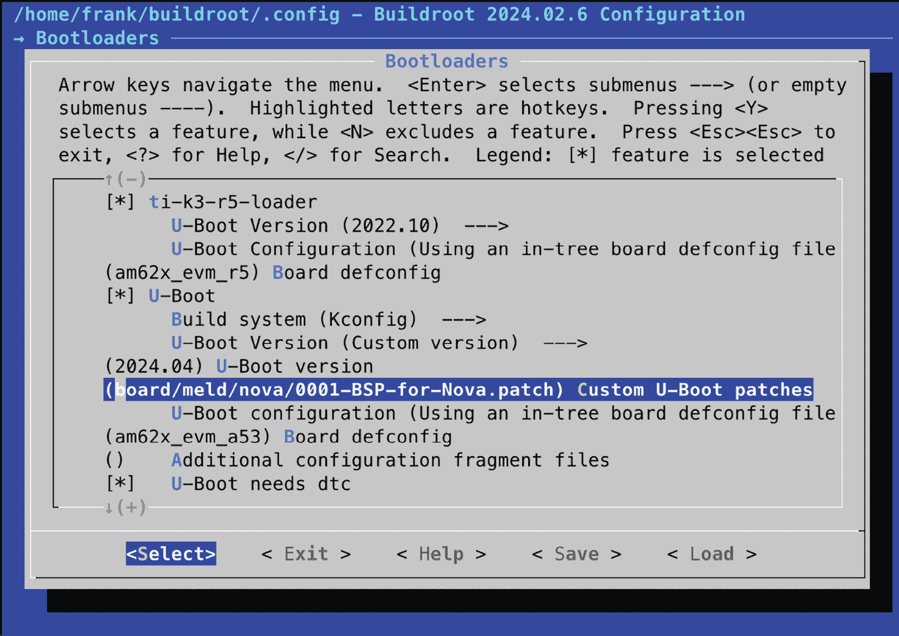
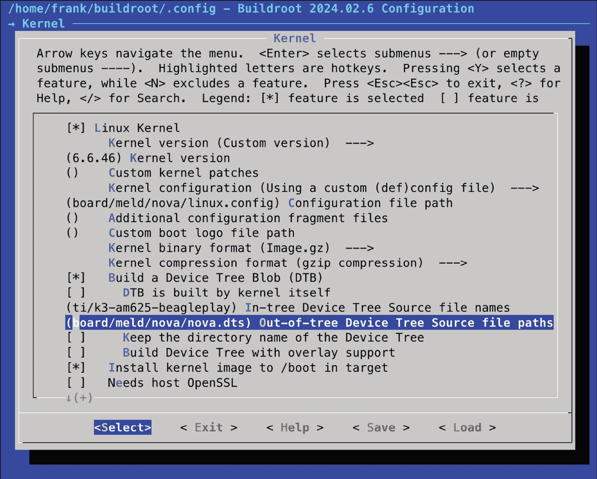
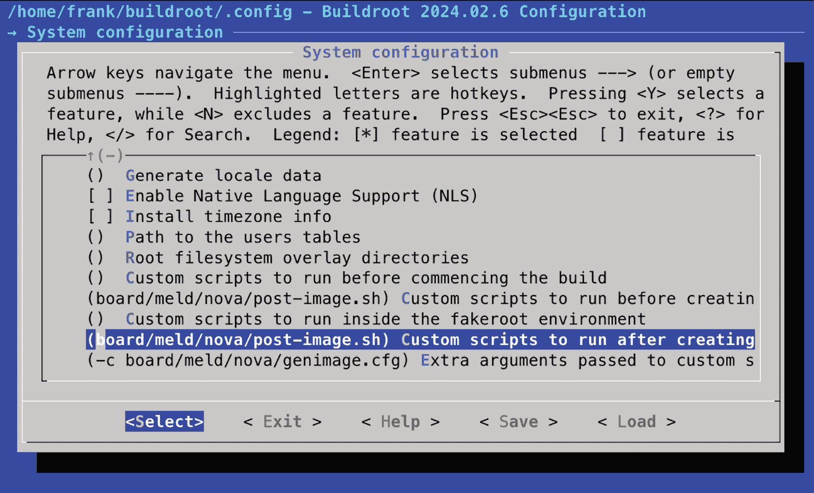

# 6

# 选择构建系统

前几章介绍了嵌入式 Linux 的前四个元素。你逐步构建了引导加载程序、内核和根文件系统，然后将它们组合成一个基本的嵌入式 Linux 系统。这是一个繁琐的过程！现在是时候通过尽可能地自动化来简化这个过程了。嵌入式 Linux 构建系统能够帮助实现这一点，我们将重点介绍两个：Buildroot 和 Yocto 项目。这两者都是复杂的工具，解释它们的工作原理需要整本书。

在本章中，我将仅介绍构建系统背后的基本思想，为*第七章*和*第八章*打下基础。首先，我将展示如何构建一个简单的镜像，以便对系统有一个整体的了解。然后，我将展示如何对前几章中的 Nova 开发板和 Raspberry Pi 4 示例做一些有用的修改。在接下来的章节中，我们将深入探讨 Yocto 项目，这是当前嵌入式 Linux 的主要构建系统。

本章我们将覆盖以下主题：

+   比较构建系统

+   分发二进制文件

+   介绍 Buildroot

+   介绍 Yocto 项目

# 技术要求

为了跟随示例，确保你拥有以下内容：

+   至少具有 90 GB 可用磁盘空间的 Ubuntu 24.04 或更高版本 LTS 主机系统

+   microSD 卡读卡器和卡片

+   适用于 Linux 的 balenaEtcher

+   一根以太网电缆和一个可用端口的路由器，用于网络连接

+   一根 3.3V 逻辑电平的 USB-to-TTL 串口线

+   Raspberry Pi 4

+   BeaglePlay

+   一款能够提供 3A 电流的 5V USB-C 电源

本章中使用的代码可以在本书 GitHub 仓库的本章文件夹中找到：[`github.com/PacktPublishing/Mastering-Embedded-Linux-Development/tree/main/Chapter06`](https://github.com/PacktPublishing/Mastering-Embedded-Linux-Development/tree/main/Chapter06)。

# 比较构建系统

在*第五章*中，我描述了手动创建镜像的过程，这就是**自定义构建**（**RYO**）过程。这种方法让你完全掌控软件，以便按需进行定制。如果你想做一些真正奇特却具有创新性的事情，或者你想将内存占用减少到最小，那么自定义构建就是最佳选择。但在大多数情况下，手动构建是浪费时间的，并且会产生不稳定、不可维护的系统。

构建系统的理念是自动化完成到目前为止描述的所有步骤。构建系统应当能够从上游源代码构建以下某些或所有内容：

+   工具链

+   引导加载程序

+   内核

+   根文件系统

从上游源代码构建非常重要，原因有几个。它能让你放心地在任何时候都可以重新构建，而无需依赖外部组件。这也意味着你可以在源代码层面进行调试，并在必要时满足分发代码给用户的许可证要求。

为了完成任务，构建系统必须能够：

+   从上游下载源代码，既可以直接从版本控制系统获取，也可以作为归档文件下载，并将其缓存到本地。

+   应用补丁以启用交叉编译、修复架构相关的错误、应用本地配置策略等。

+   构建各种组件及其编译时和运行时的依赖关系。

+   创建一个暂存区并组装根文件系统。

+   创建各种格式的镜像文件，准备好加载到目标设备上。

其他一些有用的功能包括：

+   添加你自己的软件包，包含应用程序或内核更改。

+   选择各种根文件系统配置文件：大或小，有或没有图形界面，及其他功能。

+   创建一个独立的 SDK，你可以将其分发给其他开发者，这样他们就不需要安装完整的构建系统。

+   跟踪你选择的各种软件包使用了哪些开源许可证。

+   提供一个友好的用户界面。

在所有情况下，构建系统将系统的组件封装为软件包，一些是针对主机的，一些是针对目标的。每个软件包都定义了一组规则，用于获取源代码、编译它，并将结果安装到正确的位置。软件包之间有依赖关系，并且有一个机制来解决这些依赖关系并构建所需的软件包集。

开源构建系统在过去几年中已经成熟，市面上有很多这样的系统，包括：

+   **Buildroot**：是一个易于使用的系统，使用 GNU Make 和 Kconfig ([`buildroot.org/`](https://buildroot.org/))。

+   **OpenEmbedded**：是一个强大的系统，也是 Yocto 的核心组件 ([`openembedded.org`](https://openembedded.org))。

+   **OpenWrt**：是一个面向构建无线路由器固件的构建工具 ([`openwrt.org/`](https://openwrt.org/))，开箱即用支持运行时软件包管理。它是 Buildroot 的衍生版本。

+   **PTXdist**：是由 Pengutronix 提供支持的开源构建系统 ([`www.ptxdist.org/`](https://www.ptxdist.org/))。

+   **Yocto**：通过元数据、工具和文档扩展了 OpenEmbedded 核心。它是目前最流行的嵌入式 Linux 构建系统 ([`www.yoctoproject.org/`](https://www.yoctoproject.org/))。

我将专注于其中的两个：Buildroot 和 Yocto。它们以不同的方式解决问题，并且有不同的目标。

Buildroot 的主要目标是构建根文件系统镜像，因此得名。但它也可以构建引导加载程序、内核，甚至工具链。它易于安装和配置。最重要的是，Buildroot 可以快速生成目标镜像。

Yocto 在定义目标系统方面更为通用，因此它可以构建更复杂的嵌入式设备。默认情况下，每个组件都作为二进制包使用 RPM 格式生成。然后将这些包组合起来，制作成文件系统镜像。你可以在文件系统镜像中安装一个包管理器，这样就可以在运行时更新包。换句话说，当你使用 Yocto 构建时，你是在创建你自己的定制 Linux 发行版。请记住，启用运行时包管理也意味着你需要提供并运行自己对应的包源库。

# 分发二进制文件

主流 Linux 发行版通常是由 RPM 或 DEB 格式的二进制（预编译）包集合构建而成的。**RPM** 代表 **Red Hat 包管理器**，用于 Red Hat、SUSE、Fedora 以及其他基于 RPM 的发行版。Debian 及其衍生发行版，包括 Ubuntu 和 Mint，使用 **Debian 包管理器**（**DEB**）格式。此外，还有一种适用于嵌入式设备的轻量级格式，称为 **Itsy 包**（**IPK**）格式，它基于 DEB。

在设备上包含包管理器的能力是构建系统之间的一个重要区别。一旦在目标设备上安装了包管理器，就可以轻松部署新包并更新现有的包。我将在*第十章*中讨论这方面的影响。

现在进入重点。我们将从 Buildroot 开始。作为两种构建系统中更简单的一个，Buildroot 比 Yocto 更容易上手，并且是为我们的三个目标生成可引导镜像的最快方法。

# 介绍 Buildroot

目前的 Buildroot 版本可以构建工具链、引导加载程序、内核和根文件系统。Buildroot 使用 GNU Make 作为其主要构建工具。在[`buildroot.org/docs.html`](https://buildroot.org/docs.html)上有很好的在线文档，以及在[`buildroot.org/downloads/manual/manual.html`](https://buildroot.org/downloads/manual/manual.html)上的*Buildroot 用户手册*。

## 背景

Buildroot 是最早的构建系统之一。它最初是因为 uClinux 和 uClibc 项目需要一种生成小型根文件系统进行测试的方法。Buildroot 于 2001 年底成为一个独立的项目，并在 2006 年继续发展，之后进入了一个休眠阶段。

然而，自从 Peter Korsgaard 在 2009 年接管管理工作以来，Buildroot 发展迅速，增加了对基于 glibc 的工具链的支持，并大幅增加了包和目标板的数量。Peter 目前仍然是 Buildroot 的首席维护者，并且在比利时 Barco 公司担任软件工程师时，拥有长久而辉煌的职业生涯。

Buildroot 是 OpenWrt 的祖先，OpenWrt 是另一个流行的构建系统，约在 2004 年从 Buildroot 分支出来。OpenWrt 的主要目标是为无线路由器生产软件，因此其软件包组合倾向于网络基础设施。它还具有一个运行时的 IPK 包管理器，允许设备在不完全重新刷写镜像的情况下进行更新或升级。Buildroot 和 OpenWrt 已经发生了如此大的分歧，以至于它们现在几乎是完全不同的构建系统。用一个构建的包无法与另一个系统兼容。

## 稳定版本和长期支持

Buildroot 开发者每年发布四次稳定版本，分别在二月、五月、八月和十一月。这些版本通过 Git 标签进行标记，形式为 `<year>.02`、`<year>.05`、`<year>.08` 和 `<year>.11`。每个 `<year>.02` 版本都会被标记为 **长期支持**（**LTS**），意味着在初始发布后的 12 个月内会有补丁发布来修复安全性和其他重要的 bug。`2017.02` 版本是第一个获得 LTS 标签的版本。

## 安装

你可以通过克隆仓库或下载档案来安装 Buildroot。以下是获取 `2024.02.6` 版本的示例，这是本文写作时的最新稳定版本：

```
$ git clone git://git.buildroot.net/buildroot -b 2024.02.6 
```

相应的 TAR 档案可以在 [`buildroot.org/downloads/`](https://buildroot.org/downloads/) 获取。

阅读《Buildroot 用户手册》中的 *系统要求* 部分，该手册可以在 [`buildroot.org/downloads/manual/manual.html`](https://buildroot.org/downloads/manual/manual.html) 上找到，并确保安装手册中列出的所有软件包。

## 配置

Buildroot 使用我在*理解内核配置*部分中描述的内核 Kconfig/Kbuild 机制。你可以通过直接使用`make menuconfig`（`xconfig` 或 `gconfig`）从零开始配置 Buildroot。或者你也可以选择 `configs` 目录中存储的 100 多个不同开发板的配置之一。输入 `make list-defconfigs` 会列出所有默认配置。

让我们从构建一个默认配置开始，这个配置可以在 64 位 Arm QEMU 模拟器上运行：

```
$ cd buildroot
$ make qemu_aarch64_virt_defconfig
$ make 
```

**重要提示**

不要使用 `-j` 选项告诉 GNU Make 要运行多少个并行任务。Buildroot 会自动充分利用你的 CPU 核心。如果你想限制任务数量，可以运行 `make menuconfig` 并在 **构建选项**下查找 **同时运行的任务数**。

构建过程可能需要一个小时，具体时间取决于你的主机系统有多少个 CPU 核心以及网络的速度。它将下载大约 502 MB 的代码，并消耗大约 12 GB 的磁盘空间。完成后，你会发现创建了两个新的目录：

+   `dl`：包含 Buildroot 所构建的上游项目的档案。

+   `output`：包含所有中间和最终编译的产物。

在 `output` 目录中，你会找到以下子目录：

+   `build`：包含每个组件的构建目录。

+   `host`：包含 Buildroot 在主机上所需的各种工具，包括工具链的可执行文件（位于 `output/host/usr/bin`）。

+   `images`：包含构建的最终结果。根据你在配置时选择的内容，你将找到引导加载程序、内核以及一个或多个根文件系统映像。

+   `staging`：是工具链 `sysroot` 的符号链接。这个链接的名称可能有些令人困惑，因为它并没有指向如 *第五章* 中定义的暂存区域。

+   `target`：是根目录的暂存区域。请注意，您不能将其用作根文件系统，因为文件的所有权和权限没有正确设置。Buildroot 使用前一章中描述的设备表，在创建 `image` 目录中的文件系统映像时设置所有权和权限。

## 运行

一些示例目标在 `board` 目录中有一个子文件夹，包含自定义配置文件和安装结果的相关信息。

对于你刚刚构建的系统，相关的文件是 `board/qemu/aarch64-virt/readme.txt`。这个 `readme.txt` 文件告诉你如何使用该目标启动 QEMU。假设你已经按照 *第一章* 中的描述安装了 `qemu-system-aarch64`，你可以使用以下命令运行 QEMU：

```
$ qemu-system-aarch64 -M virt -cpu cortex-a53 -nographic -smp 1 -kernel output/images/Image -append "rootwait root=/dev/vda console=ttyAMA0" -netdev user,id=eth0 -device virtio-net-device,netdev=eth0 -drive file=output/images/rootfs.ext4,if=none,format=raw,id=hd0 -device virtio-blk-device,drive=hd0 
```

在 `output/images` 中有一个名为 `start-qemu.sh` 的脚本，其中包含命令。当 QEMU 启动时，你应该能看到内核启动信息出现在启动 QEMU 的同一终端窗口中，随后是登录提示符：

```
Booting Linux on physical CPU 0x0000000000 [0x410fd034]
Linux version 6.1.44 (frank@frank-nuc) (aarch64-buildroot-linux-gnu-gcc.br_real (Buildroot 2024.02.6) 12.4.0, GNU ld (GNU Binutils) 2.40) #1 SMP Wed Oct  9 21:24:21 PDT 2024
random: crng init done
Machine model: linux,dummy-virt
efi: UEFI not found.
<…>
VFS: Mounted root (ext4 filesystem) readonly on device 254:0.
devtmpfs: mounted
Freeing unused kernel memory: 1280K
Run /sbin/init as init process
EXT4-fs (vda): re-mounted. Quota mode: disabled.
Saving 256 bits of creditable seed for next boot
Starting syslogd: OK
Starting klogd: OK
Running sysctl: OK
Starting network: udhcpc: started, v1.36.1
udhcpc: broadcasting discover
udhcpc: broadcasting select for 10.0.2.15, server 10.0.2.2
udhcpc: lease of 10.0.2.15 obtained from 10.0.2.2, lease time 86400
deleting routers
adding dns 10.0.2.3
OK
Welcome to Buildroot
buildroot login: 
```

使用无密码的 `root` 用户登录。

要退出 QEMU，输入 *Ctrl + A*，然后按 *x*。

## 定位真实硬件

配置和构建 Raspberry Pi 4 可启动映像的步骤几乎与构建 64 位 Arm QEMU 时相同：

```
$ cd buildroot
$ make clean
$ make raspberrypi4_64_defconfig
$ make 
```

最终的映像被写入名为 `output/images/sdcard.img` 的文件中。用于写入映像文件的 `post-image.sh` 脚本和 `genimage.cfg.in` 配置文件都位于 `board/raspberrypi4-64` 目录中。要将 `sdcard.img` 写入 microSD 卡并在 Raspberry Pi 4 上启动：

1.  将 microSD 卡插入你的 Linux 主机。

1.  启动 balenaEtcher。

1.  在 Etcher 中点击 **Flash from file** 按钮。

1.  定位并打开你为 Raspberry Pi 4 构建的 `sdcard.img` 映像。

1.  在 Etcher 中点击 **Select target** 按钮。

1.  选择你在 *步骤 1* 中插入的 microSD 卡。

1.  在 Etcher 中点击 **Flash** 按钮以写入映像。

1.  当 Etcher 完成闪存写入时，弹出 microSD 卡。

1.  将 microSD 卡插入 Raspberry Pi 4。

1.  通过 USB-C 端口为 Raspberry Pi 4 提供电源。

通过将树莓派 4 插入以太网并观察网络活动指示灯闪烁，确认树莓派 4 已成功启动。这个默认镜像非常简约，除了 BusyBox 几乎不包含其他内容。要通过 SSH 连接到树莓派 4，您需要在 Buildroot 镜像配置中添加一个 SSH 服务器，例如`dropbear`或`openssh`。

## 创建自定义 BSP

现在让我们使用 Buildroot 为我们的 Nova 开发板创建一个**板级支持包**（**BSP**），并使用前几章中相同版本的 U-Boot 和 Linux。您可以在本书本节中的`MELD/Chapter06/buildroot`下查看我对 Buildroot 所做的更改。

推荐存储更改的位置是：

+   `board/<organization>/<device>`：包含 Linux、U-Boot 以及其他组件的补丁、二进制文件、额外构建步骤和配置文件

+   `configs/<device>_defconfig`：包含该开发板的默认配置

+   `package/<organization>/<package_name>`：用于存放此开发板的任何附加包

创建一个目录来存储对 Nova 开发板的更改：

```
$ mkdir -p board/meld/nova 
```

将`nova_defconfig`从`MELD/Chapter06/buildroot/configs`复制到`buildroot`/`configs`：

```
$ cp ../MELD/Chapter06/buildroot/configs/nova_defconfig configs/. 
```

将`MELD/Chapter06/buildroot/board/meld/nova`中的内容复制到`buildroot/board/meld/nova`：

```
$ cp ../MELD/Chapter06/buildroot/board/meld/nova/* board/meld/nova/. 
```

清理之前构建的所有产物（更改配置时总是要这么做）：

```
$ make clean 
```

选择 Nova 配置：

```
$ make nova_defconfig 
```

`make nova_defconfig`命令将配置 Buildroot，以便构建一个针对 BeaglePlay 的镜像。这个配置是一个良好的起点，但我们仍然需要为 Nova 开发板定制它。我们从选择为 Nova 创建的自定义 U-Boot 补丁开始。

### U-Boot

在*第三章*中，我们为 Nova 创建了基于 TI 的 U-Boot 分支`f036fb`版本的自定义引导加载程序，并为其创建了一个补丁文件，保存为`MELD/Chapter03/0001-BSP-for-Nova.patch`。我们可以配置 Buildroot 来选择相同版本的 U-Boot 并应用我们的补丁。运行`make nova_defconfig`已经将 U-Boot 版本设置为`f036fb`。

将补丁文件复制到`board/meld/nova`：

```
$ cp ../MELD/Chapter03/0001-BSP-for-Nova.patch board/meld/nova/. 
```

现在运行`make menuconfig`并进入**引导加载程序**页面。从该页面，进入**自定义 U-Boot 补丁**，并验证我们的补丁路径，如下所示：



图 6.1 – 选择自定义 U-Boot 补丁

现在我们已经为 Nova 开发板打了 U-Boot 补丁，接下来的步骤是为内核打补丁。

### Linux

在*第四章*中，我们基于 Linux 6.6.46 版本的内核，并提供了一个新的设备树文件，来自`MELD/Chapter04/nova.dts`。运行`make nova_defconfig`已经将内核版本设置为 Linux 6.6.46，并将内核头文件使用的内核系列更改为与所构建内核匹配的版本。退出**引导加载程序**页面，并进入**内核**页面。确认**非树设备树源文件路径**的值已设置为`board/meld/nova/nova.dts`：



图 6.2 – 选择设备树源

现在我们已经定义了设备树，让我们构建包含内核和根文件系统的系统映像。

### 构建

在构建的最后阶段，Buildroot 使用一个名为`genimage`的工具来为 microSD 创建一个映像，我们可以直接将它复制到卡中。我们需要一个配置文件来以正确的方式布局映像。通过替换现有的`board/meld/nova/genimage.cfg`文件中的`"k3-am625-beagleplay.dtb"`为`"nova.dtb"`，如下所示：

```
image boot.vfat {
                vfat {
                                files = {
                                                "tiboot3.bin",
                                                "tispl.bin",
                                                "u-boot.img",
                                                "Image.gz",
                                                "nova.dtb",  // HERE
                                }
                }
                size = 16M
}
image sdcard.img {
                hdimage {
                }
                partition u-boot {
                                partition-type = 0xC
                                bootable = "true"
                                image = "boot.vfat"
                }
                partition rootfs {
                                partition-type = 0x83
                                image = "rootfs.ext4"
                }
} 
```

这将创建一个名为`sdcard.img`的文件，其中包含两个分区，分别为`u-boot`和`rootfs`。第一个分区包含`boot.vfat`中列出的启动文件，第二个分区包含名为`rootfs.ext4`的根文件系统映像，这将由 Buildroot 生成。

最后，我们需要一个`post-image.sh`脚本来调用`genimage`并创建 microSD 卡映像。请参见`board/meld/nova/post-image.sh`：

```
#!/bin/sh
BOARD_DIR="$(dirname $0)"
cp ${BUILD_DIR}/ti-k3-r5-loader-2022.10/tiboot3.bin $BINARIES_DIR/tiboot3.bin
GENIMAGE_CFG="${BOARD_DIR}/genimage.cfg" GENIMAGE_TMP="${BUILD_DIR}/genimage.tmp"
rm -rf "${GENIMAGE_TMP}"
genimage \
    --rootpath "${TARGET_DIR}" \
    --tmppath "${GENIMAGE_TMP}" \
    --inputpath "${BINARIES_DIR}" \
    --outputpath "${BINARIES_DIR}" \
    --config "${GENIMAGE_CFG}" 
```

这个脚本将 R5 固件映像复制到`output/images`目录，并使用我们的配置文件运行`genimage`。

请注意，`post-image.sh`需要具有可执行权限，否则构建将在最后失败：

```
$ chmod +x board/meld/nova/post-image.sh 
```

现在，运行`make menuconfig`并进入**系统配置**页面。在该页面，向下导航到**创建文件系统映像前要运行的自定义脚本**，注意到我们`post-image.sh`脚本的路径：



图 6.3 – 选择在创建文件系统映像后要运行的自定义脚本

最后，你只需输入`make`命令即可为 Nova 板构建 Linux。当构建完成后，你将在`output/images`目录中看到这些文件：

```
bl31.bin                 rootfs.ext2  tee-header_v2.bin    tispl.bin
boot.vfat                rootfs.ext4  tee-pageable_v2.bin  u-boot.img
Image.gz                 rootfs.tar   tee-pager_v2.bin    
nova.dtb                 sdcard.img   tiboot3.bin
r5-u-boot-spl.bin        tee.bin      ti-connectivity 
```

为了测试它，将 microSD 卡插入读卡器，并使用 balenaEtcher 将`output/images/sdcard.img`写入 microSD 卡，就像我们之前为 Raspberry Pi 4 所做的那样。无需像上一章那样先格式化 microSD 卡，因为`genimage`已创建了所需的磁盘布局。

我们已经展示了我们为 Nova 板创建的自定义配置有效，现在最好将我们的更改保存回`nova_defconfig`文件，以便我们和其他人可以再次使用它。你可以通过以下命令来实现：

```
$ make savedefconfig BR2_DEFCONFIG=configs/nova_defconfig 
```

现在你有了一个针对 Nova 板的自定义 Buildroot 配置。你可以通过输入以下命令来获取这个配置：

```
$ make nova_defconfig 
```

至此，我们已成功配置了 Buildroot。在接下来的部分，我们将学习如何将自己的代码添加到 Buildroot 映像中。

## 添加你自己的代码

假设你开发了一个程序，并且想将它包含在构建中。你有两种选择。首先，可以单独构建它，使用它自己的构建系统，然后将二进制文件作为覆盖层放入最终构建中。其次，创建一个 Buildroot 包，可以从菜单中选择并像其他任何包一样构建它。

### 覆盖

覆盖层（overlay）只是一个目录结构，它会在构建过程中稍后的阶段覆盖到 Buildroot 根文件系统上。它可以包含可执行文件、库文件和你可能想要包含的任何其他内容。请注意，任何编译过的代码必须与运行时部署的库兼容，这意味着它必须使用与 Buildroot 相同的工具链进行编译。使用 Buildroot 工具链非常简单，只需将其添加到`PATH`中：

```
$ PATH=<path_to_buildroot>/output/host/usr/bin:$PATH 
```

工具链的前缀是`<ARCH>-linux-`。因此，要编译一个简单的程序，你可以做类似下面的操作：

```
$ PATH=/home/frank/buildroot/output/host/usr/bin:$PATH
$ aarch64-linux-gcc helloworld.c -o helloworld 
```

一旦你用正确的工具链编译了你的程序，将可执行文件和其他支持文件安装到临时区，并将其标记为 Buildroot 的覆盖层。对于`helloworld`示例，你可以将其放在`board/meld/nova`目录下：

```
$ mkdir -p board/meld/nova/overlay/usr/bin
$ cp helloworld board/meld/nova/overlay/usr/bin 
```

最后，将`BR2_ROOTFS_OVERLAY`设置为指向覆盖层的路径。可以在`menuconfig`中通过**系统配置 | 根文件系统覆盖目录**选项进行配置。

### 添加一个包

```
<package_name>.mk.
```

**重要提醒**

请注意，Buildroot 包不包含代码，只是包含获取代码的指令，可能是下载一个 tar 包，执行`git clone`，或任何获取上游源代码所需的操作。

Makefile 是按照 Buildroot 预期的格式编写的，包含指令，允许 Buildroot 下载、配置、编译并安装程序。编写一个新的包的 Makefile 是一个复杂的操作，详细内容可以参考*Buildroot 用户手册*。

下面是一个示例，展示如何为像`helloworld`这样的简单程序创建一个包。首先，创建一个`package/helloworld`子目录，并在其中创建一个类似如下的`Config.in`文件：

```
config BR2_PACKAGE_HELLOWORLD
    bool "helloworld"
    help
      A friendly program that prints Hello World! every 10s 
```

第一行必须是`BR2_PACKAGE_<大写包名>`的格式。接下来是`bool`和包名，这将在配置菜单中显示。第二行是启用用户选择此包的部分。`help`部分是可选的，但通常是一个好主意，因为它起到了自我文档的作用。

通过编辑`package/Config.in`并引用配置文件，如下所示，将新包链接到**目标包**菜单中：

```
menu "My programs"
  source "package/helloworld/Config.in"
endmenu 
```

你可以将这个新的`helloworld`包附加到现有的子菜单中，但创建一个只包含我们包的新子菜单，并将其插入到**音频和视频应用**菜单之前会更加简洁。

在将**我的程序**菜单插入到`package/Config.in`后，创建一个`package/helloworld/helloworld.mk`文件，以提供 Buildroot 所需的数据：

```
HELLOWORLD_VERSION = 1.0.0
HELLOWORLD_SITE = /home/frank/MELD/Chapter06/helloworld
HELLOWORLD_SITE_METHOD = local
define HELLOWORLD_BUILD_CMDS
    $(MAKE) CC="$(TARGET_CC)" LD="$(TARGET_LD)" -C $(@D) all
endef
define HELLOWORLD_INSTALL_TARGET_CMDS
    $(INSTALL) -D -m 0755 $(@D)/helloworld $(TARGET_DIR)/usr/bin/helloworld
endef
$(eval $(generic-package)) 
```

你可以在书籍的代码档案中找到我的`helloworld`包，路径是`MELD/Chapter06/buildroot/package/helloworld`，程序的源代码位于`MELD/Chapter06/helloworld`。代码的位置是硬编码的本地路径名称。

在更现实的情况下，你会从源代码系统或某种中央服务器获取代码。有关如何操作的详细信息可以在*Buildroot 用户手册*中找到，其他包中也有大量示例。

## 许可证合规性

Buildroot 基于开源软件，所编译的包也是如此。在项目的某个阶段，你应该通过运行以下命令检查许可证：

```
$ make legal-info 
```

许可信息会被收集到`output/legal-info`目录中。用于编译主机工具的许可证摘要保存在`host-manifest.csv`中，目标系统上的摘要保存在`manifest.csv`中。更多信息请参考`README`文件和*Buildroot 用户手册*。

现在，让我们切换构建系统，开始学习 Yocto 项目。

# 介绍 Yocto 项目

Yocto 项目比 Buildroot 更加复杂。它不仅可以构建工具链、引导加载程序、内核和根文件系统，还能为你生成一个完整的 Linux 发行版，其中的二进制包可以在运行时安装。构建过程围绕着一组使用 Python 和 Shell 脚本编写的配方进行。Yocto 项目包括一个名为**BitBake**的任务调度器，它根据配方生成你所配置的内容。有关更多在线文档，请访问[`www.yoctoproject.org/`](https://www.yoctoproject.org/)。

## 背景

如果先了解背景，Yocto 项目的结构就更加清晰。它的根源在于**OpenEmbedded**（[`openembedded.org`](https://openembedded.org)），OpenEmbedded 源自多个项目，旨在将 Linux 移植到各种手持计算机上，包括 Sharp Zaurus 和 Compaq iPAQ。OpenEmbedded 于 2003 年诞生，作为这些手持计算机的构建系统。此后，其他开发者开始将它作为运行嵌入式 Linux 设备的通用构建系统。OpenEmbedded 由一个充满热情的程序员社区开发并持续发展。

OpenEmbedded 项目的目标是使用紧凑的 IPK 格式创建一组二进制包。这些包可以在运行时安装到目标系统上，以创建各种系统。它通过为每个包创建配方，并使用 BitBake 作为任务调度器来实现这一点。OpenEmbedded 非常灵活。通过提供正确的元数据，你可以根据自己的需求创建一个完整的 Linux 发行版。

2005 年，时任 OpenedHand 开发者的 Richard Purdie 创建了一个 OpenEmbedded 的分支，选择了更加保守的包，并创建了在一段时间内稳定的版本。他将其命名为**Poky**（发音类似 hockey），以一种日本小吃命名。虽然 Poky 是一个分支，但 OpenEmbedded 和 Poky 依然保持同步，分享更新并保持架构一致。英特尔在 2008 年收购了 OpenedHand，并于 2010 年将 Poky 移交给 Linux 基金会，成立了 Yocto 项目。

自 2010 年以来，OpenEmbedded 和 Poky 的通用组件已合并为一个名为 **OpenEmbedded Core** 或简称 **OE-Core** 的独立项目。

Yocto 项目汇集了多个组件，其中最重要的包括：

+   **OE-Core**：是与 OpenEmbedded 共享的核心元数据。

+   **BitBake**：是与 OpenEmbedded 和其他项目共享的任务调度器。

+   **Poky**：是参考发行版。Poky 的 Git 仓库还包括一个带有参考硬件机器的 `meta-yocto-bsp` 层。

+   **文档**：每个组件的用户手册和开发者指南。

+   **Toaster**：是一个基于 Web 的 BitBake 和其元数据的接口。

Yocto 提供了一个稳定的基础，可以按原样使用，也可以使用 **meta 层** 扩展，我将在本章稍后讨论。许多 SoC 厂商通过这种方式为其设备提供 BSP。Meta 层还可以用来创建扩展的或不同的构建系统。有些是开源的，比如 Poky，其他的是商业的，比如 Wind River Linux。Yocto 有一个品牌和兼容性测试方案，确保组件之间的互操作性。你会在各种网页上看到像“Yocto Project compatible”这样的声明。

因此，你应该将 Yocto 视为嵌入式 Linux 领域的基础，除了它本身作为一个完整的构建系统。

**重要说明**

你可能会好奇这个名字的由来。事实上，*yocto* 是 SI 前缀，表示 10^(-24)，就像 *micro* 表示 10^(-6) 一样。为什么选择 Yocto 这个名字？这个名字部分是为了表示它能够构建非常小的 Linux 系统（尽管公平地说，其他构建系统也可以做到）。它也是对已经停用的 Ångström 分发版的一个讽刺，该分发版基于 OpenEmbedded。一个 Ångström 是 10¹⁰，与 *yocto* 相比，差距巨大！

## 稳定发布和支持

通常，Yocto 每六个月发布一次：分别在四月和十月。它们通常以代号为人所知，但了解它们的 Yocto 和 BitBake 版本号也很有用。以下是本文撰写时六个最新版本的表格：

| **代号** | **发布日期** | **Yocto 版本** | **BitBake 版本** |
| --- | --- | --- | --- |
| Scarthgap | 2024 年 4 月 | 5.0 | 2.8 |
| Nanbield | 2023 年 11 月 | 4.3 | 2.6 |
| Mickledore | 2023 年 5 月 | 4.2 | 2.4 |
| Langdale | 2022 年 10 月 | 4.1 | 2.2 |
| Kirkstone | 2022 年 5 月 | 4.0 | 2.0 |
| Honister | 2021 年 10 月 | 3.4 | 1.52 |

表 6.1 – Yocto 的六个最新版本

稳定版本会在当前发布周期及下一个周期内提供安全性和关键性漏洞修复。换句话说，每个稳定版本会在发布后大约 12 个月内获得支持。除了稳定版本，Yocto 还提供 LTS（长期支持）版本。2020 年 4 月发布的 Yocto 3.1（dunfell）是第一个 LTS 版本。LTS 标识意味着该版本会获得缺陷修复和更新，支持周期为两年。因此，未来的计划是每两年选择一个 Yocto 的 LTS 版本。

与 Buildroot 类似，如果你希望继续获得支持，可以更新到下一个稳定版本，或者将更改回移植到当前版本。对于 Yocto，你还可以选择来自操作系统供应商（如西门子和 Wind River）的商业支持，通常支持几年。

## 安装 Yocto 项目

要获取 Yocto 项目的副本，克隆仓库时选择代号（此处为`scarthgap`）作为分支：

```
$ git clone -b scarthgap git://git.yoctoproject.org/poky.git 
```

由于我们要为 BeaglePlay 构建镜像，我们还需要克隆`meta-ti`仓库：

```
$ git clone -b scarthgap https://github.com/TexasInstruments-Sandbox/meta-ti 
```

由于`meta-ti-bsp`层依赖于`meta-arm`层，因此我们必须正确克隆该仓库：

```
$ git clone -b scarthgap git://git.yoctoproject.org/meta-arm 
```

请注意，`meta-ti`和`meta-arm`分支名称必须与 Yocto 的代号匹配，以确保这些附加层与 scarthgap 版本的 Yocto 兼容。定期运行`git pull`来获取所有远程分支的最新漏洞修复和安全补丁也是一个好习惯。

阅读*兼容的 Linux 发行版*和*构建主机包*部分，详见*Yocto 项目快速构建*指南（[`docs.yoctoproject.org/brief-yoctoprojectqs/`](https://docs.yoctoproject.org/brief-yoctoprojectqs/)）。确保在主机计算机上安装了你的 Ubuntu 主机发行版所需的基本包。下一步是进行配置。

**重要提示**

在撰写本文时，Ubuntu 24.04 LTS（Noble Numbat）尚未得到 Yocto 项目的官方支持。在 Noble Numbat 发布后，用户遇到了与权限相关的许多 BitBake 错误。这些错误是由于 AppArmor 对操作系统施加了更严格的安全限制所致。要暂时禁用这些 AppArmor 保护：

`$ echo 0 | sudo tee /proc/sys/kernel/apparmor_restrict_unprivileged_userns`

请记住，每次重启 Ubuntu 主机后，在使用 Yocto 之前都需要重新运行此命令。

## 配置

让我们从构建 64 位 Arm QEMU 模拟器开始。首先通过运行脚本来设置环境：

```
$ source poky/oe-init-build-env 
```

这将为你创建一个名为`build`的工作目录，并将其设为当前目录。所有的配置文件、中间文件和目标镜像文件都将存放在此目录中。每次想要继续该项目时，必须重新运行该脚本。

要选择不同的工作目录，可以将其作为参数添加到`oe-init-build-env`，如下所示：

```
$ source poky/oe-init-build-env build-qemu-arm64 
```

这将把您带到 `build-qemu-arm64` 目录。通过这种方式，您可以拥有多个构建目录，每个目录用于不同的项目。您可以通过传递给 `oe-init-build-env` 的参数选择要使用的目录。

最初，`build` 目录只包含一个名为 `conf` 的子目录，其中包含此项目的配置文件：

+   `local.conf`：包含您将要构建的设备的规格和构建环境。

+   `bblayers.conf`：包含您将要使用的元层的路径。我稍后会描述这些层。

目前，我们只需要通过去掉这一行开头的注释字符 (*#*)，在 `conf/local.conf` 中设置 `MACHINE` 变量为 `qemuarm64`：

```
MACHINE ?= "qemuarm64" 
```

现在我们已经准备好使用 Yocto 构建我们的第一个镜像。

## 构建中

要执行构建，您需要运行 BitBake 并告诉它您想要创建的根文件系统镜像。一些常见的镜像包括：

+   `core-image-minimal`：是一个小型的基于控制台的系统，适用于测试以及作为自定义镜像的基础。

+   `core-image-minimal-initramfs`：类似于 `core-image-minimal`，但构建为 RAM 磁盘。

+   `core-image-x11`：是一个基本镜像，通过 X11 服务器和 XTerminal 终端应用提供图形支持。

+   `core-image-full-cmdline`：是一个基于控制台的系统，提供标准的 CLI 体验，并完全支持目标硬件。

通过给 BitBake 最终目标，它将从后向前工作，并构建所有依赖项，从工具链开始。目前，我们只想创建一个最小的镜像，以查看它是如何工作的：

```
$ bitbake core-image-minimal 
```

第一次构建可能需要一些时间（即使有多个 CPU 核心和大量内存，可能也超过一个小时）。它将下载大约 4.9 GB 的源代码，并消耗大约 49 GB 的磁盘空间。当构建完成时，您将在 `build` 目录下找到几个新目录。

这些包括 `downloads`，它包含构建所需的所有源文件，以及 `tmp`，它包含大部分构建产物。在 `tmp` 目录下，您会找到以下内容：

+   `work`：包含构建目录和根文件系统的暂存区域。

+   `deploy`：包含要部署到目标的最终二进制文件：

+   `deploy/images/<machine name>`：包含目标的引导加载程序、内核和根文件系统镜像。

+   `deploy/rpm`：包含构成镜像的 RPM 软件包。

+   `deploy/licenses`：包含从每个软件包中提取的许可证文件。

当构建完成后，我们可以在 QEMU 上启动完成的镜像。

## 运行 QEMU 目标

当您构建 QEMU 目标时，会生成一个 QEMU 的内部版本。这免去了您为您的发行版安装 QEMU 包的需求。还有一个名为 `runqemu` 的包装脚本，用来运行这个内部版本的 QEMU。

要运行 QEMU 仿真，确保首先运行 `source oe-init-build-env build-qemu-arm64`，然后输入：

```
$ runqemu qemuarm64 
```

在这种情况下，QEMU 已配置为使用图形控制台，因此登录提示将出现在黑色帧缓冲区中。以 root 身份登录，无需密码。关闭帧缓冲窗口以退出 QEMU。

要在没有图形窗口的情况下启动 QEMU，请在命令行中添加`nographic`：

```
$ runqemu qemuarm64 nographic 
```

在`nographic`模式下，使用键序列*Ctrl + A*然后按*x*来关闭 QEMU。

`runqemu`脚本有许多其他选项。键入`runqemu help`以获取更多信息。

## 层

Yocto 元数据是按层结构组织的。每个层都是一个包含 BitBake 元数据的目录，元数据以食谱文件的形式存在。每个食谱文件用于构建一个单独的软件包。这些层叠加在一起，构建或“烘焙”所有软件食谱，最终生成一个完整的 Linux 镜像，就像烘焙一个蛋糕一样。根据约定，每个层的名称都以`meta`开头。核心层包括：

+   `meta`: 相当于一个未修改的 OpenEmbedded 核心。

+   `meta-poky`: 是特定于 Poky 发行版的元数据。

+   `meta-yocto-bsp`: 包含 Yocto 定期测试的参考机器的 BSP。

BitBake 搜索食谱的层列表存储在`<your build directory>/conf/bblayers.conf`中，默认情况下包括前面列出的所有三个层。

以这种方式构建食谱和其他配置数据使得通过添加新层来扩展 Yocto 变得非常容易。额外的层可以从 SoC 制造商、Yocto 项目本身以及一大批希望为 Yocto 和 OpenEmbedded 增值的人们那里获得。这里有一个有用的层列表：[`layers.openembedded.org/layerindex/`](https://layers.openembedded.org/layerindex/)。以下是一些示例：

+   `meta-qt5`: Qt 5 库和工具。

+   `meta-intel`: 为 Intel CPU 和 SoC 提供的 BSP。

+   `meta-raspberrypi`: 为 Raspberry Pi 开发板提供的 BSP。

+   `meta-ti`: 为 TI 基于 Arm 的 SoC 提供的 BSP。

添加一个层就像是将 meta 目录复制到合适的位置，并将其添加到`bblayers.conf`中一样简单。确保阅读每个层应附带的`README`文件，以了解该层对其他层的依赖关系以及与哪个版本的 Yocto 兼容。

为了说明层是如何工作的，假设我们为 Nova 开发板创建一个层，在本章后续部分中，我们将使用这个层来添加新特性。你可以在代码档案中的`MELD/Chapter06/meta-nova`下看到该层的完整实现。

每个 meta 层必须至少有一个名为`conf/layer.conf`的配置文件，并且还应该有一个`README`文件和一个许可证。

要创建我们的`meta-nova`层，请执行以下步骤：

```
$ source poky/oe-init-build-env build-nova
$ bitbake-layers create-layer nova
$ mv nova ../meta-nova 
```

这将把你放入一个名为`build-nova`的工作目录，并在`../meta-nova`下创建一个名为`meta-nova`的层，其中包含一个`conf/layer.conf`文件、一个大致的`README`文件和一个`COPYING.MIT`许可证。`layer.conf`文件如下所示：

```
# We have a conf and classes directory, add to BBPATH
BBPATH .= ":${LAYERDIR}"
# We have recipes-* directories, add to BBFILES
BBFILES += "${LAYERDIR}/recipes-*/*/*.bb \
            ${LAYERDIR}/recipes-*/*/*.bbappend"
BBFILE_COLLECTIONS += "nova"
BBFILE_PATTERN_nova = "^${LAYERDIR}/"
BBFILE_PRIORITY_nova = "6"
LAYERDEPENDS_nova = "core"
LAYERSERIES_COMPAT_nova = "scarthgap" 
```

层将自身添加到 `BBPATH` 中，并将其中包含的配方添加到 `BBFILES` 中。从代码中可以看到，配方位于以 `recipes-` 开头、文件名以 `.bb`（普通 BitBake 配方）或 `.bbappend`（扩展现有配方，通过覆盖或添加指令的配方）结尾的目录中。这个层的名称是 `nova`，并以优先级 `6` 被添加到 `BBFILE_COLLECTIONS` 的层列表中。层的优先级用于当同一配方出现在多个层时，优先级最高的层中的配方会生效。

在添加 Nova 层之前，我们必须先按照严格顺序添加 `meta-arm-toolchain`、`meta-arm` 和 `meta-ti-bsp` 层：

```
$ bitbake-layers add-layer ../meta-arm/meta-arm-toolchain
$ bitbake-layers add-layer ../meta-arm/meta-arm
$ bitbake-layers add-layer ../meta-ti/meta-ti-bsp 
```

现在将 Nova 层添加到你的构建配置中：

```
$ bitbake-layers add-layer ../meta-nova 
```

在从环境中加载后，确保从你的 `build-nova` 工作目录运行所有这些 `bitbake-layers add-layer` 命令。

确认你的层结构已正确设置，如下所示：

```
$ bitbake-layers show-layers
NOTE: Starting bitbake server...
layer                 path                                      priority
==========================================================================
core                  /home/frank/poky/meta                     5
yocto                 /home/frank/poky/meta-poky                5
yoctobsp              /home/frank/poky/meta-yocto-bsp           5
arm-toolchain         /home/frank/meta-arm/meta-arm-toolchain   5
meta-arm              /home/frank/meta-arm/meta-arm             5
meta-ti-bsp           /home/frank/meta-ti/meta-ti-bsp           6
nova                  /home/frank/meta-nova                     6 
```

在这里，你可以看到新添加的层。由于它的优先级是 `6`，它可以覆盖所有优先级较低的其他层中的配方。

使用这个空层进行构建。最终目标将是 Nova 板，但现在先通过在 `conf/local.conf` 中添加 `MACHINE ?= "beagleplay-ti"` 来为 BeaglePlay 构建。然后像之前一样使用 `bitbake core-image-minimal` 构建一个小镜像。

除了配方，层还可以包含 BitBake 类、配置文件、发行版等内容。接下来我将讲解配方，并展示如何创建自定义镜像和包。

### BitBake 和配方

BitBake 处理几种不同类型的元数据：

+   **配方**（以 `.bb` 结尾的文件）：包含有关构建软件单元的信息，包括如何获取源代码副本、对其他组件的依赖关系以及如何构建和安装它。

+   **附加**（以 `.bbappend` 结尾的文件）：覆盖或扩展配方的某些细节。`.bbappend` 文件将其指令附加到与之具有相同根名称的配方（`.bb`）文件的末尾。

+   **包含**（以 `.inc` 结尾的文件）：包含多个配方共享的信息，使它们能够共享信息。可以使用 **include** 或 **require** 关键字包含这些文件。区别在于，如果文件不存在，`require` 会产生错误，而 `include` 不会。

+   **类**（以 `.bbclass` 结尾的文件）：包含一些常见的构建信息，例如如何构建内核或如何构建 Autotools 项目。类通过 `inherit` 关键字被配方和其他类继承。类 `classes/base.bbclass` 会被每个配方隐式继承。

+   **配置**（以 `.conf` 结尾的文件）：定义控制项目构建过程的各种配置变量。

**配方**是一个任务集合，任务内容使用 Python 和 Shell 脚本的组合编写。这些任务有诸如`do_fetch`、`do_unpack`、`do_patch`、`do_configure`、`do_compile`和`do_install`等名称。你使用 BitBake 来执行这些任务。默认任务是`do_build`，它执行构建配方所需的所有子任务。你可以使用`bitbake -c listtasks <recipe>`列出配方中可用的任务。例如，要列出`core-image-minimal`中的任务：

```
$ bitbake -c listtasks core-image-minimal 
```

**重要提示**

`-c`选项告诉 BitBake 运行配方中的特定任务，而无需在任务名称的开头包含`do_`部分。

`do_listtasks`是一个特殊的任务，用于列出配方中定义的所有任务。这里是`fetch`任务，它用于下载配方的源代码：

```
$ bitbake -c fetch busybox 
```

要获取目标及其所有依赖项的代码（当你想确保已下载了即将构建的镜像的所有代码时，这很有用），请使用以下命令：

```
$ bitbake core-image-minimal --runall=fetch 
```

配方文件通常命名为`<package-name>_<version>.bb`。它们可能依赖于其他配方，这样 BitBake 可以计算出完成顶级任务所需执行的所有子任务。

要为我们在`meta-nova`中的`helloworld`程序创建一个配方，你需要创建如下的目录结构：

```
meta-nova/recipes-local/helloworld
├── files
│   └── helloworld.c
└── helloworld_1.0.bb 
```

配方是`helloworld_1.0.bb`，源代码保存在配方所在目录的`files`子目录中。该配方包含以下指令：

```
DESCRIPTION = "A friendly program that prints Hello World!"
SECTION = "examples"
LICENSE = "GPL-2.0-only"
LIC_FILES_CHKSUM = "file://${COMMON_LICENSE_DIR}/GPL-2.0-only;md5=801f80980d171dd6425610833a22dbe6"
SRC_URI = "file://helloworld.c"
S = "${WORKDIR}"
do_compile() {
    ${CC} ${CFLAGS} ${LDFLAGS} helloworld.c -o helloworld
}
do_install() {
    install -d ${D}${bindir}
    install -m 0755 helloworld ${D}${bindir}
} 
```

源代码的位置由`SRC_URI`设置。在这种情况下，`file://` URI 意味着代码是本地的，位于配方目录中。BitBake 将相对于包含配方的目录搜索`files`、`helloworld`和`helloworld-1.0`目录。需要定义的任务是`do_compile`和`do_install`，它们分别将源文件编译并安装到目标根文件系统中：`${D}`表示配方的暂存区，而`${bindir}`表示默认的`/usr/bin`二进制目录。

每个配方都有一个由`LICENSE`定义的许可证，这里设置为`GPL-2.0-only`。包含许可证文本及其校验和的文件由`LIC_FILES_CHKSUM`定义。如果校验和不匹配，BitBake 将终止构建，表示许可证已发生变化。请注意，MD5 校验和值和`COMMON_LICENSE_DIR`在同一行，且由分号分隔。许可证文件可能是包的一部分，或者可能指向`meta/files/common-licenses`中的标准许可证文本，正如这里所示。

商业许可证默认不允许，但可以很容易地启用它们。你需要在配方中指定许可证，如下所示：

```
LICENSE_FLAGS = "commercial" 
```

然后，在你的`conf/local.conf`中，明确允许此许可证，如下所示：

```
LICENSE_FLAGS_ACCEPTED = "commercial" 
```

为了确保我们的`helloworld`配方正确编译，可以让 BitBake 构建它：

```
$ bitbake helloworld 
```

如果一切顺利，你应该会看到它在`tmp/work/aarch64-poky-linux/helloworld`目录下创建了一个工作目录。你还应该能看到在`tmp/deploy/rpm/aarch64/helloworld-1.0-r0.aarch64.rpm`中为它创建了一个 RPM 包。

包尚未成为目标镜像的一部分。待安装包的列表保存在一个名为`IMAGE_INSTALL`的变量中。你可以通过将以下行添加到`conf/local.conf`来将它追加到该列表的末尾：

```
IMAGE_INSTALL:append = " helloworld" 
```

注意，开头的双引号和第一个包名之间需要有一个空格。现在该包将被添加到你`bitbake`的任何镜像中：

```
$ bitbake core-image-minimal 
```

如果你查看`deploy-ti/images/beagleplay-ti/core-image-minimal-beagleplay-ti.rootfs.tar.xz`，你会看到`/usr/bin/helloworld`确实已经被安装。

## 通过`local.conf`自定义镜像

在开发过程中，你可能经常需要向镜像中添加包或以其他方式调整它。正如我们刚刚看到的，你可以通过添加类似以下的语句，将包简单地追加到安装包列表中：

```
IMAGE_INSTALL:append = " helloworld" 
```

你可以通过`EXTRA_IMAGE_FEATURES`做更多广泛的更改。以下是一个简短的列表，应该能给你提供启用功能的想法：

+   `dbg-pkgs`：为镜像中安装的所有包安装调试符号包。

+   `debug-tweaks`：允许`root`用户无密码登录，并进行其他开发便利的更改。在生产镜像中绝对不要启用`debug-tweaks`。

+   `package-management`：安装包管理工具并保留包管理器数据库。

+   `read-only-rootfs`：使根文件系统为只读。我们将在*第九章*中详细讲解这一点。

+   `x11`：安装 X 服务器。

+   `x11-base`：安装带有最小环境的 X 服务器。

你可以通过这种方式添加更多功能。我建议你查看*Yocto 项目参考手册*中的*镜像特性*部分：[`docs.yoctoproject.org/ref-manual/`](https://docs.yoctoproject.org/ref-manual/)，并阅读`meta/classes-recipe/core-image.bbclass`中的代码。

## 编写镜像配方

修改`local.conf`的问题在于它是局部的。如果你想创建一个可以与其他开发者共享或加载到生产系统上的镜像，那么你应该将更改放在**镜像配方**中。

一个镜像配方包含了如何为目标创建镜像文件的指令，包括引导加载程序、内核和根文件系统镜像。按照约定，镜像配方通常放在名为`images`的目录中。你可以通过扫描`poky`目录和任何你克隆的附加层来获取所有可用镜像的列表：

```
$ cd ~
$ ls poky/meta*/recipes*/images/*.bb
$ ls meta*/recipes*/images/*.bb 
```

你会发现`core-image-minimal`的配方位于`poky`/`meta/recipes-core/images/core-image-minimal.bb`。

一种简单的方法是采用现有的镜像配方，并使用像你在`local.conf`中使用的语句进行修改。

假设你想要一个与 `core-image-minimal` 相同的镜像，但包括你的 `helloworld` 程序和 `strace` 工具。你可以通过一个两行的配方文件来实现这一点，文件中包含（使用 `require` 关键字）基本镜像并添加你需要的包。通常将镜像放在名为 `images` 的目录中，所以在 `meta-nova/recipes-local/images` 中添加配方 `nova-image.bb`，内容如下：

```
require recipes-core/images/core-image-minimal.bb
IMAGE_INSTALL:append = " helloworld strace" 
```

现在从你的 `local.conf` 文件中移除 `IMAGE_INSTALL:append` 行，并构建镜像：

```
$ bitbake nova-image 
```

这次，构建应该会更快，因为 BitBake 重用了之前构建过程中生成的中间构建对象。

BitBake 不仅可以为目标设备构建镜像，还可以为主机机器构建 SDK，以进行交叉开发。

## 创建 SDK

创建一个可以供其他开发人员安装的独立工具链非常有用。这样可以避免团队中的每个人都必须安装完整的 Yocto。理想情况下，你希望工具链包含目标设备上安装的所有库的开发库和头文件。你可以使用`populate_sdk`任务为任何镜像实现这一点，如下所示：

```
$ bitbake -c populate_sdk nova-image 
```

结果是一个自安装的 shell 脚本，位于 `deploy-ti/sdk` 目录下：

```
poky-<c_library>-<host_machine>-<target_image>-<target_machine>-toolchain-<version>.sh 
```

对于使用`nova-image`配方构建的 SDK：

```
poky-glibc-x86_64-nova-image-aarch64-beagleplay-toolchain-<version>.sh 
```

如果你只需要一个基本工具链，包含 C 和 C++ 交叉编译器、C 库和头文件，那么可以改用这个命令：

```
$ bitbake meta-toolchain 
```

安装 SDK，只需运行该 shell 脚本。默认的安装目录是`/opt/poky`，但安装脚本允许你更改此目录：

```
$ deploy-ti/sdk/poky-glibc-x86_64-nova-image-aarch64-beagleplay-toolchain-5.0.3.sh
Poky (Yocto Project Reference Distro) SDK installer version 5.0.3
=================================================================
Enter target directory for SDK (default: /opt/poky/5.0.3):
You are about to install the SDK to "/opt/poky/5.0.3". Proceed [Y/n]? Y
[sudo] password for frank:
Extracting SDK................................................................................................................done
Setting it up...done
SDK has been successfully set up and is ready to be used.
Each time you wish to use the SDK in a new shell session, you need to source the environment setup script e.g.
 $ . /opt/poky/5.0.3/environment-setup-aarch64-poky-linux 
```

为了使用工具链，首先源化环境并设置脚本：

```
$ source /opt/poky/<version>/environment-setup-aarch64-poky-linux 
```

**提示**

设置 SDK 环境的`environment-setup-*`脚本与在 Yocto 构建目录中使用的`oe-init-build-env`脚本不兼容。在执行任何一个脚本之前，最好先开启一个新的终端会话。

Yocto 项目生成的工具链没有有效的 `sysroot` 目录。我们知道这一点，因为将`-print-sysroot`选项传递给工具链的编译器时返回的是`/not/exist`：

```
$ aarch64-poky-linux-gcc -print-sysroot
/not/exist 
```

因此，如果你尝试交叉编译，它会像这样失败：

```
$ aarch64-poky-linux-gcc helloworld.c -o helloworld
helloworld.c:1:10: fatal error: stdio.h: No such file or directory
    1 | #include <stdio.h>
      |          ^~~~~~~~~
compilation terminated. 
```

这是因为编译器已经配置为支持多种 Arm 处理器，并且微调是在使用正确的标志启动编译器时完成的。相反，你应该使用在执行 `environment-setup` 脚本时创建的 shell 变量来进行交叉编译。这些变量包括：

+   `CC`: C 编译器

+   `CXX`: C++ 编译器

+   `CPP`: C 预处理器

+   `AS`: 汇编器

+   `LD`: 链接器

这是我们发现 `CC` 被设置为的值：

```
$ echo $CC
aarch64-poky-linux-gcc -mbranch-protection=standard -fstack-protector-strong -O2 -D_FORTIFY_SOURCE=2 -Wformat -Wformat-security -Werror=format-security --sysroot=/opt/poky/5.0.3/sysroots/aarch64-poky-linux 
```

只要使用`$CC`进行编译，应该一切正常：

```
$ $CC -O helloworld.c -o helloworld 
```

## 许可证审计

Yocto 项目要求每个软件包都有一个许可证。每个软件包在构建时都会将许可证副本放置在 `tmp/deploy/licenses/<package name>` 中。此外，镜像中使用的所有软件包和许可证的摘要会被放入目录：`<image name>-<machine name>.rootfs-<date stamp>`。对于我们刚刚构建的 `nova-image`，该目录将命名为类似以下的名称：

```
tmp/deploy/licenses/beagleplay/nova-image-beagleplay.rootfs-20241012221506 
```

这完成了我们对两种主流嵌入式 Linux 构建系统的概述。Buildroot 简单且快速，非常适合用于简单的单一用途设备。Yocto 更加复杂和灵活。尽管 Yocto 在社区和行业中得到了良好的支持，但这个工具仍然有一个非常陡峭的学习曲线。你可以预期，成为 Yocto 的熟练用户可能需要几个月的时间，甚至即便如此，它有时也会做出一些让你吃惊的事情。

# 总结

在本章中，你学习了如何使用 Buildroot 和 Yocto 项目来配置、定制和构建嵌入式 Linux 镜像。我们使用 Buildroot 创建了一个 BSP，其中包括自定义的 U-Boot 补丁和针对假设基于 BeaglePlay 的板子的设备树规格。接着，我们学习了如何以 Buildroot 包的形式将自己的代码添加到镜像中。你还接触了 Yocto 项目，我们将在接下来的两章中深入探讨。特别是，你学习了一些基本的 BitBake 术语，如何编写镜像配方，以及如何创建 SDK。

不要忘记，使用这些工具创建的任何设备都需要在现场维护一段时间，通常是多年。Yocto 和 Buildroot 都会在初始发布后的大约一年内提供点发布版本，且 Yocto 现在至少提供四年的长期支持。在这两种情况下，你都会发现需要自己维护版本或支付商业支持费用。第三种可能性，忽视问题，绝不是一个选项！

# 进一步学习

+   *Buildroot 用户手册，Buildroot 协会* – [`buildroot.org/downloads/manual/manual.html`](https://buildroot.org/downloads/manual/manual.html%0D%0A)

+   *Yocto 项目文档，Yocto 项目* – [`docs.yoctoproject.org/`](https://docs.yoctoproject.org/)
