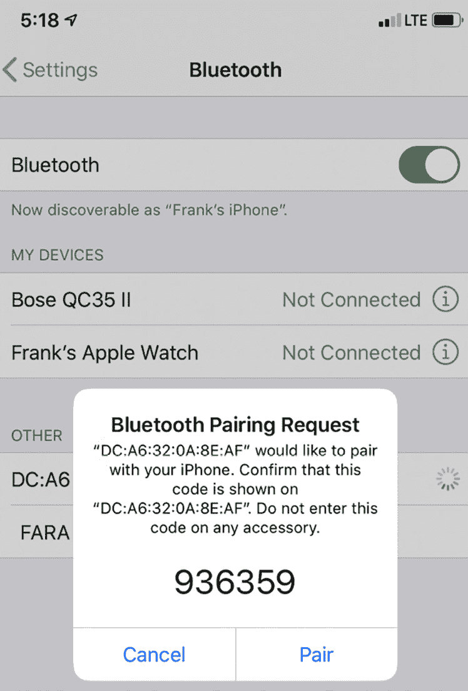

# 第七章：使用 Yocto 开发

在不支持的硬件上启动 Linux 可能是一个繁琐的过程。幸运的是，Yocto 提供了**板级支持包**（**BSPs**），可以帮助我们在 BeaglePlay 和 Raspberry Pi 4 等流行单板计算机上快速启动嵌入式 Linux 开发。基于现有的 BSP 层进行构建，让我们能够迅速利用复杂的内建外设，如蓝牙和 Wi-Fi。在本章中，我们将创建一个自定义应用层来实现这一目标。

接下来，我们将查看 Yocto 可扩展 SDK 启用的开发工作流。在目标设备上修改软件通常意味着需要更换 microSD 卡。由于重新构建和重新部署完整的镜像太过耗时，我将向你展示如何使用 `devtool` 快速自动化并反复测试你的工作。在此过程中，你还将学习如何将你的工作保存到自己的层中，避免工作丢失。

Yocto 不仅构建 Linux 镜像，还能构建整个 Linux 发行版。在我们动手构建自己的 Linux 发行版之前，我们将先讨论这样做的原因。我们所做的许多选择包括是否添加运行时软件包管理，以便在目标设备上进行快速应用开发。这需要维护软件包数据库和远程软件包服务器，我将在最后提到这一点。

本章我们将涵盖以下主题：

+   在现有 BSP 上构建

+   使用 `devtool` 捕获变更

+   构建你自己的发行版

+   配置远程软件包服务器

# 技术要求

为了跟随示例进行操作，请确保你具备以下设备：

+   一台运行 Ubuntu 24.04 或更高版本 LTS 的主机系统，并且至少有 90 GB 的可用磁盘空间

+   Yocto 5.0 (scarthgap) LTS 版本

+   一台 microSD 卡读卡器和卡

+   适用于 Linux 的 balenaEtcher

+   一根以太网线和一台带有可用端口的路由器，用于网络连接

+   一台 Wi-Fi 路由器

+   一部支持蓝牙的智能手机

+   Raspberry Pi 4

+   一台能够提供 3A 电流的 5V USB-C 电源

你应该已经在 *第六章* 中构建了 Yocto 的 5.0 (scarthgap) LTS 版本。如果还没有，请先参考 *兼容的 Linux 发行版* 和 *构建主机软件包* 部分，查阅 *Yocto 项目快速构建* 指南 ([`docs.yoctoproject.org/brief-yoctoprojectqs/)`](https://docs.yoctoproject.org/brief-yoctoprojectqs/)，然后按照 *第六章* 中的说明在你的 Linux 主机上构建 Yocto。

本章中使用的代码可以在本书的 GitHub 仓库的章节文件夹中找到：[`github.com/PacktPublishing/Mastering-Embedded-Linux-Development`](https://github.com/PacktPublishing/Mastering-Embedded-Linux-Development)。

# 在现有 BSP 上构建

一个 **BSP** 层为 Yocto 添加对特定硬件设备或设备系列的支持。这个支持通常包括引导加载程序、设备树二进制文件以及启动 Linux 所需的额外内核驱动程序。BSP 还可能包含任何附加的用户空间软件和外设固件，以充分启用和利用硬件的所有功能。按照惯例，BSP 层的名称以 `meta-` 前缀开始，后跟机器名称。找到适合你目标设备的最佳 BSP 是使用 Yocto 构建可启动镜像的第一步。

OpenEmbedded 层索引 ([`layers.openembedded.org/layerindex)`](https://layers.openembedded.org/layerindex)) 是开始查找优质 BSP 的最佳地方。你的板卡制造商或硅片供应商也可能提供 BSP 层。Yocto 项目为所有 Raspberry Pi 变种提供了一个 BSP。你可以在项目的源代码库中找到该 BSP 层及 Yocto 项目认可的所有其他层的 Git 仓库 ([`git.yoctoproject.org`](https://git.yoctoproject.org))。

## 构建现有的 BSP

以下练习假设你已经将 Yocto 的 scarthgap 版本克隆或解压到主机环境中名为 `poky` 的目录。在继续之前，我们还需要从 `poky` 目录向上克隆以下依赖层，这样 `layer` 和 `poky` 目录就能并排放置：

```
$ git clone -b scarthgap git://git.openembedded.org/meta-openembedded
$ git clone -b scarthgap git://git.yoctoproject.org/meta-raspberrypi 
```

请注意，依赖层的分支名称与 Yocto 版本匹配以确保兼容性。使用定期的 `git pull` 命令保持所有三个克隆与远程仓库同步并保持最新。`meta-raspberrypi` 层是所有 Raspberry Pi 的 BSP。一旦这些依赖关系就位，你可以构建一个为 Raspberry Pi 4 定制的镜像。但在此之前，让我们先看看 Yocto 的通用镜像配方：

1.  首先，导航到你克隆 Yocto 的目录：

    ```
    $ cd poky 
    ```

1.  接下来，进入包含标准镜像配方的目录：

    ```
    $ cd meta/recipes-core/images 
    ```

1.  列出核心镜像配方：

    ```
    $ ls -1 core*
    core-image-base.bb
    core-image-initramfs-boot.bb
    core-image-minimal.bb
    core-image-minimal-dev.bb
    core-image-minimal-initramfs.bb
    core-image-minimal-mtdutils.bb
    core-image-ptest-all.bb
    core-image-ptest.bb
    core-image-ptest-fast.bb
    core-image-tiny-initramfs.bb 
    ```

1.  显示 `core-image-base` 配方：

    ```
    $ cat core-image-base.bb
    SUMMARY = "A console-only image that fully supports the target device \
    hardware."
    IMAGE_FEATURES += "splash"
    LICENSE = "MIT"
    inherit core-image 
    ```

1.  请注意，这个配方继承自 `core-image`，因此它导入了 `core-image.bbclass` 的内容，我们稍后将查看它。

1.  显示 `core-image-minimal` 配方：

    ```
    $ cat core-image-minimal.bb
    SUMMARY = "A small image just capable of allowing a device to boot."
    IMAGE_INSTALL = "packagegroup-core-boot ${CORE_IMAGE_EXTRA_INSTALL}"
    IMAGE_LINGUAS = " "
    LICENSE = "MIT"
    inherit core-image
    IMAGE_ROOTFS_SIZE ?= "8192"
    IMAGE_ROOTFS_EXTRA_SPACE:append = "${@bb.utils.contains("DISTRO_FEATURES", "systemd", " + 4096", "", d)}" 
    ```

1.  与 `core-image-base` 一样，这个配方也继承自 `core-image` 类文件。

1.  显示 `core-image-minimal-dev` 配方：

    ```
    $ cat core-image-minimal-dev.bb
    require core-image-minimal.bb
    DESCRIPTION = "A small image just capable of allowing a device to boot and \
    is suitable for development work."
    IMAGE_FEATURES += "dev-pkgs" 
    ```

1.  导航到 poky/meta 下的 classes 目录：

    ```
    $ cd ../../classes-recipe 
    ```

1.  最后，显示 `core-image` 类文件：

    ```
    $ cat core-image.bbclass 
    ```

1.  请注意，在这个类文件的顶部列出了大量可用的 `IMAGE_FEATURES`，包括前面提到的 `dev-pkgs` 特性。

标准镜像，如 `core-image-minimal` 和 `core-image-minimal-dev`，是机器无关的。在 *第六章* 中，我们为 QEMU Arm 模拟器和 BeaglePlay 构建了 `core-image-minimal`。我们本可以同样为树莓派 4 构建一个 `core-image-minimal` 镜像。相比之下，BSP 层包括为特定板或一系列板设计的镜像配方。

现在，让我们看看 `meta-rasberrypi` BSP 层中的 `rpi-test-image` 配方，了解如何将 Wi-Fi 和蓝牙的支持添加到树莓派 4 的 `core-image-base` 中：

1.  首先，导航到克隆 Yocto 的目录上一级：

    ```
    $ cd ../../.. 
    ```

1.  接下来，进入 `meta-raspberrypi` BSP 层中存放树莓派镜像配方的目录：

    ```
    $ cd meta-raspberrypi/recipes-core/images 
    ```

1.  列出树莓派镜像配方：

    ```
    $ ls -1
    rpi-test-image.bb 
    ```

1.  显示 `rpi-test-image` 配方：

    ```
    $ cat rpi-test-image.bb
    # Base this image on core-image-base
    include recipes-core/images/core-image-base.bb
    COMPATIBLE_MACHINE = "^rpi$"
    IMAGE_INSTALL:append = " packagegroup-rpi-test" 
    ```

1.  注意，`IMAGE_INSTALL` 变量已被覆盖，以便它可以附加 `packagegroup-rpi-test` 并将这些包包含在镜像中。

1.  导航到 `metaraspberrypi/recipes-core` 下相邻的 `packagegroups` 目录：

    ```
    $ cd ../packagegroups 
    ```

1.  最后，显示 `packagegroup-rpi-test` 配方：

    ```
    $ cat packagegroup-rpi-test.bb
    DESCRIPTION = "RaspberryPi Test Packagegroup"
    LICENSE = "MIT"
    LIC_FILES_CHKSUM = "file://${COMMON_LICENSE_DIR}/MIT;md5=0835ade698e0bcf8506ecda2f7b4f302"
    PACKAGE_ARCH = "${MACHINE_ARCH}"
    inherit packagegroup
    COMPATIBLE_MACHINE = "^rpi$"
    OMXPLAYER  = "${@bb.utils.contains('MACHINE_FEATURES', 'vc4graphics', '', 'omxplayer', d)}"
    RDEPENDS:${PN} = "\
        ${OMXPLAYER} \
        bcm2835-tests \
        raspi-gpio \
        rpio \
        rpi-gpio \
        pi-blaster \
        python3-adafruit-circuitpython-register \
        python3-adafruit-platformdetect \
        python3-adafruit-pureio \
        python3-rtimu \
        connman \
        connman-client \
        wireless-regdb-static \
        bluez5 \
    "
    RRECOMMENDS:${PN} = "\
        ${@bb.utils.contains("BBFILE_COLLECTIONS", "meta-multimedia", "bigbuckbunny-1080p bigbuckbunny-480p bigbuckbunny-720p", "", d)} \
        ${MACHINE_EXTRA_RRECOMMENDS} \
    " 
    ```

1.  注意，`connman`、`connman-client` 和 `bluez5` 包已包含在运行时依赖项列表中，以便完全启用 Wi-Fi 和蓝牙功能。

最后，为树莓派 4 构建 `rpi-test-image`：

1.  首先，导航到克隆 Yocto 的目录上一级：

    ```
    $ cd ../../.. 
    ```

1.  接下来，设置你的 BitBake 工作环境：

    ```
    $ source poky/oe-init-build-env build-rpi 
    ```

1.  这会设置一堆环境变量并将你带入新创建的 `build-rpi` 目录。

1.  然后，向你的镜像中添加以下层：

    ```
    $ bitbake-layers add-layer ../meta-openembedded/meta-oe
    $ bitbake-layers add-layer ../meta-openembedded/meta-python
    $ bitbake-layers add-layer ../meta-openembedded/meta-networking
    $ bitbake-layers add-layer ../meta-openembedded/meta-multimedia
    $ bitbake-layers add-layer ../meta-raspberrypi 
    ```

    **重要提示**

    添加这些层的顺序很重要，因为 `meta-networking` 和 `meta-multimedia` 层都依赖于 `meta-python` 层。如果 `bitbake-layers add-layer` 或 `bitbake-layers show-layers` 因解析错误而失败，请删除 `build-rpi` 目录，并从 *步骤 1* 重新开始此练习。

1.  验证所有必要的层是否已添加到镜像中：

    ```
    $ bitbake-layers show-layers 
    ```

1.  命令的输出应如下所示：

    ```
    layer              path                                   priority
    ==================================================================
    core               /home/frank/poky/meta                         5
    yocto              /home/frank/poky/meta-poky                    5
    yoctobsp           /home/frank/poky/meta-yocto-bsp               5
    openembedded-layer /home/frank/meta-openembedded/meta-oe         5
    meta-python        /home/frank/meta-openembedded/meta-python     5
    networking-layer   /home/frank/meta-openembedded/meta-networking 5
    multimedia-layer   /home/frank/meta-openembedded/meta-multimedia 5
    raspberrypi        /home/frank/meta-raspberrypi                  9 
    ```

1.  观察前面 `bitbake-layers add-layer` 命令对 `bblayers.conf` 所做的更改：

    ```
    $ cat conf/bblayers.conf 
    ```

1.  上一步中的相同八个层应分配给 `BBLAYERS` 变量。

1.  列出 `meta-raspberrypi` BSP 层支持的机器：

    ```
    $ ls ../meta-raspberrypi/conf/machine 
    ```

1.  注意，存在 `raspberrypi4` 和 `raspberrypi4-64` 机器配置。

1.  将以下行添加到你的 `conf/local.conf` 文件中：

    ```
    MACHINE = "raspberrypi4-64" 
    ```

1.  这将覆盖你 `conf/local.conf` 文件中的以下默认设置：

    ```
    MACHINE ??= "qemux86-64" 
    ```

1.  设置 `MACHINE` 变量为 `raspberrypi4-64` 确保我们即将构建的镜像适用于树莓派 4。

1.  将以下行添加到你的 `conf/local.conf` 文件中：

    ```
    LICENSE_FLAGS_ACCEPTED = "synaptics-killswitch" 
    ```

1.  这将抑制以下构建错误：

    ```
    ERROR: Nothing RPROVIDES 'linux-firmware-rpidistro-bcm43455' 
    ```

1.  现在，将 `ssh-server-openssh` 添加到你 `conf/local.conf` 文件中 `EXTRA_IMAGE_FEATURES` 列表中：

    ```
    EXTRA_IMAGE_FEATURES ?= "debug-tweaks ssh-server-openssh" 
    ```

1.  这会在我们的镜像中添加一个 SSH 服务器，用于本地网络访问。

1.  最后，构建镜像：

    ```
    $ bitbake rpi-test-image 
    ```

第一次构建可能需要几分钟到几小时，具体取决于主机环境可用的 CPU 核心数量。

`TARGET_SYS`应该为`aarch64-poky-linux`，而`MACHINE`应该为`raspberrypi4-64`，因为该映像是为 Raspberry Pi 4 中的 Arm Cortex-A72 核心的 64 位目标架构构建的。

一旦映像构建完成，在`tmp/deploy/images/raspberrypi4-64`目录下应该会有一个名为`rpi-test-image-raspberrypi4-64.rootfs.wic.bz2`的文件：

```
$ ls -l tmp/deploy/images/raspberrypi4-64/rpi-test*wic.bz2 
```

注意到`rpi-test-image-raspberrypi4-64.rootfs.wic.bz2`是一个符号链接，指向同一目录下的实际映像文件。在`wic.bz2`扩展名之前，附加了表示构建日期和时间的整数。

现在，使用 Etcher 将该映像写入 microSD 卡并在你的 Raspberry Pi 4 上启动它：

1.  将 microSD 卡插入主机计算机。

1.  启动 Etcher。

1.  在 Etcher 中点击**Flash from file**。

1.  找到你为 Raspberry Pi 4 构建的`wic.bz2`映像并打开它。

1.  在 Etcher 中点击**Select target**。

1.  选择你在*步骤 1*中插入的 microSD 卡。

1.  在 Etcher 中点击**Flash**，将映像写入 microSD 卡。

1.  等 Etcher 完成烧录后，弹出 microSD 卡。

1.  将 microSD 卡插入你的 Raspberry Pi 4。

1.  通过 Raspberry Pi 4 的 USB-C 端口为其供电。

通过将 Raspberry Pi 4 连接到以太网，并观察网络活动指示灯是否闪烁，确认你的 Raspberry Pi 4 是否成功启动。

## 控制 Wi-Fi

在上一个练习中，我们为 Raspberry Pi 4 构建了一个可启动映像，其中包含了工作中的以太网、Wi-Fi 和蓝牙。现在设备已经启动并通过以太网连接到本地网络，我们来连接附近的 Wi-Fi 网络。我们将在本练习中使用`connman`，因为这是`meta-raspberrypi`层默认提供的工具。其他 BSP 层则依赖于不同的网络接口配置守护进程，例如`systemd-networkd`和`NetworkManager`。请按照以下步骤操作：

1.  我们构建的映像主机名为`raspberrypi4-64`，因此你应该能够以 root 用户通过 SSH 连接到设备：

    ```
    $ ssh root@raspberrypi4-64.local 
    ```

1.  当询问是否继续连接时，输入`yes`。你不会被提示输入密码。如果没有在`raspberrypi4-64.local`找到主机，可以使用`arp-scan`等工具定位你的 Raspberry Pi 4 的 IP 地址，然后通过该 IP 地址 SSH 连接，而不是通过主机名连接。

1.  一旦进入，验证 Wi-Fi 驱动是否已加载：

    ```
    root@raspberrypi4-64:~# lsmod | grep 80211
    cfg80211              753664  1 brcmfmac
    rfkill                 32768  6 nfc,bluetooth,cfg80211 
    ```

1.  启动`connman-client`：

    ```
    root@raspberrypi4-64:~# connmanctl
    connmanctl> 
    ```

1.  打开 Wi-Fi：

    ```
    connmanctl> enable wifi
    Enabled wifi 
    ```

1.  如果 Wi-Fi 已经开启，忽略`"``Error wifi: Already enabled"`。

1.  注册`connmanctl`作为连接代理：

    ```
    connmanctl> agent on
    Agent registered 
    ```

1.  扫描 Wi-Fi 网络：

    ```
    connmanctl> scan wifi
    Scan completed for wifi 
    ```

1.  列出所有可用的 Wi-Fi 网络：

    ```
    connmanctl> services
    *AO Wired ethernet_dca6320a8ead_cable
     RT-AC66U_B1_38_2G wifi_dca6320a8eae_52542d41433636555f42315f33385f3247_managed_psk
     RT-AC66U_B1_38_5G wifi_dca6320a8eae_52542d41433636555f42315f33385f3547_managed_psk 
    ```

1.  `RT-AC66U_B1_38_2G`和`RT-AC66U_B1_38_5G`是 ASUS 路由器的 Wi-Fi 网络 SSID。你的列表可能会有所不同。`*AO`标记在`Wired`前面表示设备当前通过以太网在线。

1.  连接到 Wi-Fi 网络：

    ```
    connmanctl> connect wifi_dca6320a8eae_52542d41433636555f42315f33385f3547_managed_psk
    Agent RequestInput wifi_dca6320a8eae_52542d41433636555f42315f33385f3547_managed_psk
     Passphrase = [ Type=psk, Requirement=mandatory ]
    Passphrase? somepassword
    Connected wifi_dca6320a8eae_52542d41433636555f42315f33385f3547_managed_psk 
    ```

1.  在 `connect` 后替换服务标识符为您在前一步中获得的服务标识符或目标网络。将您的 Wi-Fi 密码替换为 `somepassword`。

1.  再次列出服务：

    ```
    connmanctl> services
    *AO Wired ethernet_dca6320a8ead_cable
    *AR RT-AC66U_B1_38_5G wifi_dca6320a8eae_52542d41433636555f42315f33385f3547_managed_psk
     RT-AC66U_B1_38_2G wifi_ca6320a8eae_52542d41433636555f42315f33385f3247_managed_psk 
    ```

1.  这次，`*AR` 出现在您刚刚连接的 SSID 前面，表示该网络连接已经准备好。以太网优先于 Wi-Fi，因此设备会通过 `Wired` 保持在线。

1.  退出 `connman-client`：

    ```
    connmanctl> quit 
    ```

1.  将您的 Raspberry Pi 4 从以太网中拔出，从而关闭 SSH 会话：

    ```
    root@raspberrypi4-64:~# client_loop: send disconnect: Broken pipe 
    ```

1.  重新连接到您的 Raspberry Pi 4：

    ```
    $ ssh root@raspberrypi4-64.local 
    ```

1.  再次启动 `connman-client`：

    ```
    root@raspberrypi4-64:~# connmanctl
    connmanctl> 
    ```

1.  再次列出服务：

    ```
    connmanctl> services
    *AO RT-AC66U_B1_38_5G wifi_dca6320a8eae_52542d41433636555f42315f33385f3547_managed_psk 
    ```

1.  注意到 `Wired` 连接现在消失，而您之前连接的 Wi-Fi SSID 已被提升为在线状态。

`connman` 守护进程将您的 Wi-Fi 凭据保存在 `/var/lib/connman` 下的网络配置文件目录中，并且这些数据会在 microSD 卡上持久保存。这意味着 `connman` 会在您的 Raspberry Pi 4 启动时自动重新连接到您的 Wi-Fi 网络。电源重启后，您无需再次执行这些步骤。如果您愿意，可以保持以太网未插入。

## 控制蓝牙

除了 `connman` 和 `connman-client` 包之外，`meta-raspberrypi` 层还包括 `bluez5` 作为蓝牙栈。所有这些包以及所需的蓝牙驱动程序都包含在我们为 Raspberry Pi 4 构建的 `rpi-test-image` 中。让我们开始启用蓝牙并尝试与其他设备配对：

1.  启动您的 Raspberry Pi 4 并通过 SSH 连接：

    ```
    $ ssh root@raspberrypi4-64.local 
    ```

1.  验证蓝牙驱动程序是否已加载：

    ```
    root@raspberrypi4-64:~# lsmod | grep bluetooth
    bluetooth             643072  29 hci_uart,btbcm,bnep,rfcomm
    ecdh_generic           16384  1 bluetooth
    rfkill                 32768  7 nfc,bluetooth,cfg80211
    libaes                 12288  3 aes_arm64,bluetooth,aes_generic 
    ```

1.  初始化 HCI UART 驱动以实现蓝牙连接：

    ```
    root@raspberrypi4-64:~# btuart 
    ```

1.  启动 `connman-client`：

    ```
    root@raspberrypi4-64:~# connmanctl
    connmanctl> 
    ```

1.  打开蓝牙：

    ```
    connmanctl> enable bluetooth
    Enabled Bluetooth 
    ```

1.  如果蓝牙已开启，忽略 `"Error bluetooth: Already enabled"` 错误信息。

1.  退出 `connman-client`：

    ```
    connmanctl> quit 
    ```

1.  启动蓝牙 CLI：

    ```
    root@raspberrypi4-64:~# bluetoothctl
    Agent registered
    [CHG] Controller DC:A6:32:0A:8E:AF Pairable: yes 
    ```

1.  请求默认代理：

    ```
    [bluetooth]# default-agent
    Default agent request successful 
    ```

1.  开启控制器：

    ```
    [bluetooth]# power on
    Changing power on succeeded 
    ```

1.  显示控制器信息：

    ```
    [bluetooth]# show
    Controller DC:A6:32:0A:8E:AF (public)
    Name: BlueZ 5.72
    Alias: BlueZ 5.72
    Class: 0x00200000
    Powered: yes
    Discoverable: no
    DiscoverableTimeout: 0x000000b4
    Pairable: yes 
    ```

1.  开始扫描蓝牙设备：

    ```
    [bluetooth]# scan on
    Discovery started
    [CHG] Controller DC:A6:32:0A:8E:AF Discovering: yes
    …
    [NEW] Device DC:08:0F:03:52:CD Frank's iPhone
    … 
    ```

1.  如果您的智能手机在附近并且已启用蓝牙，它应当作为 `[NEW]` 设备出现在列表中。`Frank's` `iPhone` 后面的 `DC:08:0F:03:52:CD` 是我的智能手机的蓝牙 MAC 地址。

1.  停止扫描蓝牙设备：

    ```
    [bluetooth]# scan off
    …
    [CHG] Controller DC:A6:32:0A:8E:AF Discovering: no
    Discovery stopped 
    ```

1.  如果您有 iPhone 打开，请进入 **设置** 中的 **蓝牙** 以便接受来自您的 Raspberry Pi 4 的配对请求。

1.  尝试与您的智能手机配对：

    ```
    [bluetooth]# pair DC:08:0F:03:52:CD
    Attempting to pair with DC:08:0F:03:52:CD
    [CHG] Device DC:08:0F:03:52:CD Connected: yes
    Request confirmation
    [agent] Confirm passkey 936359 (yes/no): 
    ```

1.  将您的智能手机蓝牙 MAC 地址替换为 `DC:08:0F:03:52:CD`。

1.  在输入 `yes` 之前，接受来自智能手机的配对请求：



图 7.1 – 蓝牙配对请求

1.  输入 `yes` 以确认密码：

    ```
    [agent] Confirm passkey 936359 (yes/no): yes
    [CHG] Device DC:08:0F:03:52:CD ServicesResolved: yes
    [CHG] Device DC:08:0F:03:52:CD Paired: yes
    Pairing successful
    [CHG] Device DC:08:0F:03:52:CD ServicesResolved: no
    [CHG] Device DC:08:0F:03:52:CD Connected: no 
    ```

1.  连接到您的智能手机：

    ```
    [bluetooth]# connect DC:08:0F:03:52:CD
    Attempting to connect to DC:08:0F:03:52:CD
    [CHG] Device DC:08:0F:03:52:CD Connected: yes
    Connection successful
    [CHG] Device DC:08:0F:03:52:CD ServicesResolved: yes
    Authorize service 
    ```

1.  再次将您的智能手机蓝牙 MAC 地址替换为 `DC:08:0F:03:52:CD`。

1.  在提示授权服务时，输入 `yes`：

    ```
    [agent] Authorize service 0000110e-0000-1000-8000-
    00805f9b34fb (yes/no): yes
    [Frank's iPhone]# 
    ```

你的 Raspberry Pi 4 现在已经通过蓝牙与智能手机配对并连接。它应该出现在你智能手机的蓝牙设备列表中，显示为**BlueZ 5.72**。`bluetoothctl`程序有许多命令和子菜单，我们只是略微触及了表面。我建议输入`help`并浏览自文档，以了解你可以通过命令行做些什么。像`connman`一样，BlueZ 蓝牙栈是一个 D-Bus 服务，因此你可以通过 Python 或其他高级编程语言使用 D-Bus 绑定在 D-Bus 上与其进行编程通信。

## 添加自定义层

如果你使用的是 Raspberry Pi 4 来原型化新产品，那么你可以通过向`conf/local.conf`中的`IMAGE_INSTALL:append`变量分配的列表中添加包来快速生成自己的自定义镜像。虽然这种简单技巧有效，但在某个时候，你可能会想要开始开发自己的嵌入式应用。

如何构建这个额外的软件，以便将其包含在自定义镜像中？答案是创建一个自定义层，配合新配方来构建你的软件。

1.  首先，导航到你克隆 Yocto 的目录上一级。

1.  接下来，设置你的 BitBake 工作环境：

    ```
    $ source poky/oe-init-build-env build-rpi 
    ```

1.  这会设置一堆环境变量，并将你带回`build-rpi`目录。

1.  为你的应用创建一个新层：

    ```
    $ bitbake-layers create-layer ../meta-gattd
    NOTE: Starting bitbake server...
    Add your new layer with 'bitbake-layers add-layer ../meta-gattd' 
    ```

1.  这个层的名称是`meta-gattd`，用于 GATT 守护进程。你可以随意命名你的层，但请遵循`meta-`前缀约定。

1.  导航到新的层目录：

    ```
    $ cd ../meta-gattd 
    ```

1.  检查层的文件结构：

    ```
    $ tree
    .
    ├── conf
    │   └── layer.conf
    ├── COPYING.MIT
    ├── README
    └── recipes-example
        └── example
            └── example_0.1.bb 
    ```

1.  重命名`recipes-examples`目录：

    ```
    $ mv recipes-example recipes-gattd 
    ```

1.  重命名`example`目录：

    ```
    $ cd recipes-gattd
    $ mv example gattd 
    ```

1.  重命名示例配方文件：

    ```
    $ cd gattd
    $ mv example_0.1.bb gattd_0.1.bb 
    ```

1.  显示重命名后的配方文件：

    ```
    $ cat gattd_0.1.bb 
    ```

1.  你需要为这个配方填充构建软件所需的元数据，包括`SRC_URI`和`md5`校验和。

1.  现在，暂时将 gattd_0.1.bb 替换为我在`MELD/Chapter07/meta-gattd/recipes-gattd/gattd/gattd_0.1.bb`中提供的完成配方。

1.  为你的新层创建一个 Git 仓库，并将其推送到 GitHub。

1.  在你的 Git 仓库中创建一个`scarthgap`分支，并将其推送到 GitHub。

现在我们有了一个用于应用的自定义层，让我们将其添加到你的工作镜像中：

1.  首先，导航到你克隆 Yocto 的目录上一级：

    ```
    $ cd ../../.. 
    ```

1.  从 GitHub 克隆你的层或我的`meta-gattd`层：

    ```
    $ git clone -b scarthgap https://github.com/fvasquez/meta-gattd.git 
    ```

1.  将`fvasquez`替换为你的 GitHub 用户名，将`meta-gattd`替换为你层的仓库名称。

1.  接下来，设置你的 BitBake 工作环境：

    ```
    $ source poky/oe-init-build-env build-rpi 
    ```

1.  这会设置一堆环境变量，并将你带回`build-rpi`目录。

1.  然后，将新克隆的层添加到镜像中：

    ```
    $ bitbake-layers add-layer ../meta-gattd 
    ```

1.  将`meta-gattd`替换为你层的名称。

1.  验证所有必要的层是否已经添加到镜像中：

    ```
    $ bitbake-layers show-layers 
    ```

1.  列表中应该有总共九个层，包括你新的层。

1.  现在，将额外的软件包添加到你的`conf/local.conf`文件中：

    ```
    CORE_IMAGE_EXTRA_INSTALL += "gattd" 
    ```

1.  `CORE_IMAGE_EXTRA_INSTALL`是一个便利变量，用于向从`core-image`类继承的镜像中添加额外的软件包，像`rpi-test-image`那样。`IMAGE_INSTALL`是控制镜像中包含哪些软件包的变量。我们不能在`conf/local.conf`中使用`IMAGE_INSTALL += "gattd"`，因为它会替代`core-image.bbclass`中默认的惰性赋值。请改用`IMAGE_INSTALL:append = " gattd"`或`CORE_IMAGE_EXTRA_INSTALL += " gattd"`。

1.  最后，重新构建镜像：

    ```
    $ bitbake rpi-test-image 
    ```

如果你的软件成功构建并安装，它应该包含在完成的`rpi-test-image-raspberrypi4-64.rootfs.wic.bz2`镜像中。将该镜像写入 microSD 卡，并在你的 Raspberry Pi 4 上启动它查看。应该可以在`/usr/bin/gatt_server.py`找到一个 Python 脚本。

将软件包添加到`conf/local.conf`中，在开发的最初阶段是有意义的。当你准备好与团队分享你的成果时，你应该创建一个镜像配方，并将你的软件包放在那里。在上一章的结尾，我们完成了并编写了一个`nova-image`配方，将`helloworld`包添加到`core-image-minimal`中。

现在我们已经花了不少时间在实际硬件上测试新构建的镜像，是时候将注意力转回软件了。在接下来的部分，我们将介绍一个工具，它旨在简化我们在开发嵌入式软件时习惯的冗长编译、测试和调试周期。

# 使用 devtool 捕获更改

在上一章中，你学习了如何从头开始为`helloworld`程序创建一个配方。最初，复制粘贴的方式可以工作，但随着项目的增长和你需要维护的配方数量的增加，这种方式很快就会变得令人沮丧。我将在这里展示一种更好的方法来处理软件包配方——无论是你自己的，还是第三方贡献给上游的。它叫做`devtool`，是 Yocto 可扩展 SDK 的基石。

## 开发工作流程

在你开始使用`devtool`之前，确保你在一个新的层中进行工作，而不是修改树中的配方。否则，你可能会轻易地覆盖并丢失数小时的工作：

1.  首先，导航到克隆 Yocto 目录的上一级。

1.  接下来，设置你的 BitBake 工作环境：

    ```
    $ source poky/oe-init-build-env build-mine 
    ```

1.  这将设置一堆环境变量，并将你置于一个新的`build-mine`目录中。

1.  在`conf/local.conf`中为 64 位 Arm 设置`MACHINE`：

    ```
    MACHINE ?= "qemuarm64" 
    ```

1.  创建你的新层：

    ```
    $ bitbake-layers create-layer ../meta-mine 
    ```

1.  现在，添加你的新层：

    ```
    $ bitbake-layers add-layer ../meta-mine 
    ```

1.  检查你创建的新层是否位于你希望的位置：

    ```
    $ bitbake-layers show-layers 
    ```

`bitbake-layers show-layers`的输出应该如下所示：

```
layer              path                                   priority
==================================================================
core               /home/frank/poky/meta                         5
yocto              /home/frank/poky/meta-poky                    5
yoctobsp           /home/frank/poky/meta-yocto-bsp               5
meta-mine          /home/frank/meta-mine                         6 
```

为了获得一些开发工作流程的第一手经验，你需要一个目标设备来进行部署。这意味着要构建一个镜像：

```
$ devtool build-image core-image-full-cmdline 
```

第一次构建完整镜像通常需要几个小时。当完成时，继续启动它：

```
$ runqemu qemuarm64 nographic
<…>
Poky (Yocto Project Reference Distro) 5.0.4 qemuarm64 ttyAMA0
qemuarm64 login: root
root@qemuarm64:~# 
```

通过指定`nographic`选项，我们可以直接在一个独立的 shell 中运行 QEMU。这比应对模拟的图形输出更容易输入。以`root`身份登录，密码为空。现在保持 QEMU 运行，因为我们接下来的练习需要它。你可以通过`ssh root@192.168.7.2`登录到这个虚拟机。

`devtool`支持三种常见的开发工作流：

+   添加一个新配方。

+   修补现有配方构建的源代码。

+   升级配方以获取上游源的更新版本。

当你启动任何这些工作流时，`devtool`会为你创建一个临时工作区，以便你进行修改。这个沙盒包含配方文件和已获取的源代码。当你完成工作后，`devtool`会将你的更改集成回你的层，以便销毁工作区。

## 创建一个新配方。

假设有一个开源软件你想要，但没有人提交过 BitBake 配方。而且假设这个软件是`validator`文件签名、验证和安装工具。在这种情况下，你可以从 GitHub 下载`validator`的源 tarball 发布包，并为其创建一个配方。这正是`devtool add`所做的。

首先，`devtool add`会创建一个带有本地 Git 仓库的工作区。在这个新的工作区目录中，它会创建一个`recipes/validator`目录，并将 tarball 内容提取到`sources/validator`目录。`devtool`了解常见的构建系统，如 Autotools 和 CMake，并会尽力弄清楚这是什么类型的项目（在`validator`的情况下是 Autotools）。然后，它使用解析后的元数据和从以前的 BitBake 构建中缓存的已构建包数据来确定`DEPENDS`和`RDEPENDS`的值，以及要继承和要求的文件：

1.  首先，打开另一个 shell 并进入你克隆 Yocto 的目录上一级。

1.  接下来，设置你的 BitBake 环境：

    ```
    $ source poky/oe-init-build-env build-mine 
    ```

1.  这会设置一组环境变量，并将你带回`build-mine`工作目录。

1.  然后，使用源 tarball 发布包的 URL 运行`devtool add`：

    ```
    $ devtool add https://github.com/containers/validator/releases/download/0.2.2/validator-0.2.2.tar.xz 
    ```

1.  `devtool add`将生成一个配方，你可以用它来构建。

1.  在你构建新的配方之前，让我们先看看它：

    ```
    $ devtool edit-recipe validator 
    ```

1.  `devtool`会在编辑器中打开`recipes/validator/validator_0.2.2.bb`。注意，`devtool`已经为你填写了 MD5 校验和。

1.  将以下行添加到`validator_0.2.2.bb`的末尾：

    ```
    FILES:${PN} += "${datadir}"
    do_install:append() {
        rm -rf ${D}/usr/lib/dracut
    } 
    ```

1.  修正任何明显的错误，保存任何更改，然后退出编辑器。

1.  要构建你的新配方，请使用以下命令：

    ```
    $ devtool build validator 
    ```

1.  接下来，将编译好的`validator`可执行文件部署到目标模拟器：

    ```
    $ devtool deploy-target validator root@192.168.7.2 
    ```

1.  这会将必要的构建工件安装到目标模拟器上。

1.  从你的 QEMU shell 中，运行你刚刚构建和部署的`validator`可执行文件：

    ```
    root@qemuarm64:~# validator --help 
    ```

1.  如果你看到大量与`validator`相关的自文档，那么说明构建和部署成功。如果没有看到，使用`devtool`重复编辑、构建和部署步骤，直到你确信`validator`能够正常工作。

1.  一旦你满意了，清理你的目标仿真器：

    ```
    $ devtool undeploy-target validator root@192.168.7.2 
    ```

1.  将所有工作合并回你的层：

    ```
    $ devtool finish -f validator ../meta-mine 
    ```

1.  删除工作区中剩余的源代码：

    ```
    $ devtool reset validator 
    ```

如果你认为其他人可能从你的新配方中受益，那么可以将补丁提交到 Yocto。

## 修改由配方构建的源代码

假设你在`jq`（一个命令行 JSON 预处理器）中发现了一个 bug。你在[`github.com/stedolan/jq`](https://github.com/stedolan/jq)上搜索 Git 仓库，发现没有人报告这个问题。然后，你查看源代码。原来修复只需要几个小的代码修改，于是你决定自己给`jq`打补丁。这时，`devtool modify`就派上用场了。

这次，当`devtool`查看 Yocto 的缓存元数据时，它会发现`jq`已经有一个配方。如同`devtool add`，`devtool modify`会创建一个新的临时工作区，并在其中复制配方文件并提取上游源代码。`jq`是用 C 语言编写的，并位于名为`meta-oe`的现有 OpenEmbedded 层中。在我们能够修改软件包源代码之前，需要将此层以及`jq`的依赖项添加到我们的工作镜像中：

1.  首先，删除`build-mine`环境中的几个层：

    ```
    $ bitbake-layers remove-layer workspace
    $ bitbake-layers remove-layer meta-mine 
    ```

1.  接下来，从 GitHub 克隆`meta-openembedded`仓库（如果尚未存在）：

    ```
    $ git clone -b scarthgap https://github.com/openembedded/meta-openembedded.git ../meta-openembedded 
    ```

1.  然后，将`meta-oe`和`meta-mine`层添加到你的镜像中：

    ```
    $ bitbake-layers add-layer ../meta-openembedded/meta-oe
    $ bitbake-layers add-layer ../meta-mine 
    ```

1.  验证所有必要的层是否已被添加到镜像中：

    ```
    $ bitbake-layers show-layers 
    ```

1.  命令的输出应该如下所示：

    ```
    layer              path                                   priority
    ==================================================================
    core               /home/frank/poky/meta                         5
    yocto              /home/frank/poky/meta-poky                    5
    yoctobsp           /home/frank/poky/meta-yocto-bsp               5
    openembedded-layer /home/frank/meta-openembedded/meta-oe         5
    meta-mine          /home/frank/meta-mine                         6 
    ```

1.  在`conf/local.conf`中添加以下行，因为`onig`包是`jq`的运行时依赖：

    ```
    IMAGE_INSTALL:append = " onig" 
    ```

1.  重新构建你的镜像：

    ```
    $ devtool build-image core-image-full-cmdline 
    ```

1.  使用*Ctrl + A*和*x*从另一个终端退出 QEMU 并重启仿真器：

    ```
    $ runqemu qemuarm64 nographic 
    ```

像许多补丁工具一样，`devtool modify`使用你的提交信息来生成补丁文件名，因此请保持提交信息简洁且有意义。它还会根据你的 GitHub 历史自动生成补丁文件，并创建一个包含新补丁文件名的`.bbappend`文件。记得修剪和压缩你的 Git 提交，以便`devtool`能够将你的工作合理地划分为补丁文件：

1.  使用`devtool modify`命令并指定你希望修改的软件包名称：

    ```
    $ devtool modify jq 
    ```

1.  使用你喜欢的编辑器进行代码更改。使用标准的 Git 添加和提交工作流来跟踪你所做的更改。

1.  使用以下命令构建修改过的源代码：

    ```
    $ devtool build jq 
    ```

1.  接下来，将编译后的`jq`可执行文件部署到目标仿真器：

    ```
    $ devtool deploy-target jq root@192.168.7.2 
    ```

1.  这将必要的构建工件安装到目标仿真器中。

1.  如果连接失败，请删除过期仿真器的密钥，具体操作如下：

    ```
    $ ssh-keygen -f "/home/frank/.ssh/known_hosts" -R "192.168.7.2" 
    ```

1.  在路径中将`frank`替换为你的用户名。

1.  从你的 QEMU shell 中运行你刚刚构建并部署的 `jq` 可执行文件。如果你无法再复现该 bug，那么你的更改是有效的。否则，重复编辑、构建和部署步骤，直到你满意为止。

1.  一旦你满意了，清理你的目标仿真器：

    ```
    $ devtool undeploy-target jq root@192.168.7.2 
    ```

1.  将所有工作合并回你的层：

    ```
    $ devtool finish jq ../meta-mine 
    ```

1.  如果合并失败是因为 Git 源树有更改未提交，请删除或撤销任何剩余的 `jq` 构建工件，并再次尝试运行 `devtool finish`。

1.  删除工作区中剩余的源文件：

    ```
    $ devtool reset jq 
    ```

如果你认为其他人也能受益于你的补丁，可以将其提交给上游项目的维护者。

## 升级配方到新版本

假设你正在使用 mypy Python 静态类型检查器在目标设备上进行开发，并且 mypy 的新版本刚刚发布。这个最新版本的 mypy 有一个新特性，你迫不及待地想要使用它。在等待 mypy 配方维护者升级到新版本之前，你决定自己升级配方。你可能会认为，这就像在配方文件中修改版本号一样简单，但其实还涉及到源代码归档的校验和。如果这个繁琐的过程可以完全自动化，那该多好？猜猜 `devtool upgrade` 是用来做什么的？mypy 是一个 Python 3 模块，因此在你升级它之前，你的镜像需要包含 Python 3、mypy 以及 mypy 的依赖项。要获取它们，按照以下步骤操作：

1.  首先，从你的构建环境中删除几层：

    ```
    $ bitbake-layers remove-layer workspace
    $ bitbake-layers remove-layer meta-mine 
    ```

1.  接下来，将 meta-python 和 meta-mine 层添加到你的镜像中：

    ```
    $ bitbake-layers add-layer ../meta-openembedded/meta-python
    $ bitbake-layers add-layer ../meta-mine 
    ```

1.  3\. 验证所有必要的层是否已添加到项目中：

    ```
    $ bitbake-layers show-layers 
    ```

1.  命令的输出应如下所示：

    ```
    layer              path                                   priority
    ==================================================================
    core               /home/frank/poky/meta                         5
    yocto              /home/frank/poky/meta-poky                    5
    yoctobsp           /home/frank/poky/meta-yocto-bsp               5
    openembedded-layer /home/frank/meta-openembedded/meta-oe         5
    meta-python        /home/frank/meta-openembedded/meta-python     5
    meta-mine          /home/frank/meta-mine                         6 
    ```

1.  现在，应该有很多 Python 模块可以供你使用：

    ```
    $ bitbake -s | grep ^python3 
    ```

1.  其中一个模块是 `python3-mypy`。

1.  通过在 `conf/local.conf` 中搜索 `python3` 和 `python3-mypy`，确保它们都正在构建并安装到你的镜像中。如果它们不在那里，你可以通过向 `conf/local.conf` 添加以下行来包括它们：

    ```
    IMAGE_INSTALL:append = " python3 python3-mypy" 
    ```

1.  重新构建你的镜像：

    ```
    $ devtool build-image core-image-full-cmdline 
    ```

1.  从另一个 shell 使用 Ctrl + A 和 x 退出 QEMU，并重启仿真器：

    ```
    $ runqemu qemuarm64 nographic 
    ```

    **重要说明**

    在写作时，meta-python 中包含的 mypy 版本是 1.9.0，而 PyPI 上可用的最新版本是 1.12.1。

现在所有步骤都已到位，让我们进行升级：

1.  首先，使用包的名称和目标版本运行 devtool upgrade 进行升级：

    ```
    $ devtool upgrade python3-mypy --version 1.12.1 
    ```

1.  在构建你升级后的配方之前，我们先看一下它：

    ```
    $ devtool edit-recipe python3-mypy 
    ```

1.  devtool 会在编辑器中打开 `recipes/python3-mypy/python3-mypy_1.12.1.bb` 文件。这个配方中没有任何版本特定的修改内容，所以保存新文件并退出编辑器。

1.  要构建你的新配方，请使用以下命令：

    ```
    $ devtool build python3-mypy 
    ```

1.  接下来，将新的 mypy 模块部署到目标仿真器：

    ```
    $ devtool deploy-target python3-mypy root@192.168.7.2 
    ```

这会将必要的构建工件安装到目标仿真器上。

1.  如果连接失败，请按照这里所示删除过期的仿真器密钥：

    ```
    $ ssh-keygen -f "/home/frank/.ssh/known_hosts" -R "192.168.7.2" 
    ```

在路径中将 frank 替换为你的用户名。

1.  从你的 QEMU shell 中，检查部署了哪个版本的 mypy：

    ```
    root@qemuarm64:~# mypy --version
    mypy 1.12.1 (compiled: no) 
    ```

1.  如果输入 `mypy --version` 返回‘`1.12.1`’，那么升级成功。如果没有返回该版本，则使用 `devtool` 重复编辑、构建和部署步骤，直到找出问题所在。

1.  一旦你满意，清理你的目标模拟器：

    ```
    $ devtool undeploy-target python3-mypy root@192.168.7.2 
    ```

1.  清理你的工作空间：

    ```
    rm -rf workspace/sources/python3-mypy/build
    rm -rf workspace/sources/python3-mypy/mypy/__pycache__ 
    ```

1.  提交对 `SOURCES.txt` 的更改：

    ```
    cd workspace/sources/python3-mypy
    git add mypy.egg-info/SOURCES.txt
    git commit -m "add setup cfg to egg SOURCES" 
    ```

1.  将你所有的工作合并回到你的层中：

    ```
    $ cd ../../..
    $ devtool finish python3-mypy ../meta-mine 
    ```

`devtool finish` 将源代码移动到一个名为 attic 的文件夹中。

1.  如果合并失败，因为 GitHub 源代码树脏了，那么移除或撤销任何剩余的 `python3-mypy` 构建工件，然后再次尝试 `devtool finish`。

1.  删除工作空间中剩余的源代码：

    ```
    $ devtool reset python3-mypy 
    ```

如果你认为其他人也可能急于将他们的发行版升级到某个包的最新版本，那么提交一个补丁到 Yocto。

最后，我们来到了如何构建自己发行版的话题。这个功能是 Yocto 特有的，而在 Buildroot 中明显缺失。**发行版层**是一个强大的抽象，可以跨多个项目共享，针对不同硬件。

# 构建你自己的发行版

在上一章开始时，我告诉你关于发行版层，例如 `meta-poky` 和它们的 `conf/distro` 子目录中包含的发行版元数据。正如我们所见，你不需要自己的发行版层就能构建定制的镜像。你可以在不修改任何 Poky 发行版元数据的情况下，完成很多工作。但如果你想修改发行版政策（例如功能、C 库实现、包管理器选择等），那么你可以选择构建自己的发行版。

构建你自己的发行版是一个三步过程：

1.  创建一个新的发行版层。

1.  创建一个发行版配置文件。

1.  为你的发行版添加更多配方。

但在进入如何执行这些操作的技术细节之前，让我们先考虑一下，什么时候是自己制作发行版的合适时机。

## 什么时候该做，什么时候不该做

发行版设置定义了包格式（`rpm`、`deb` 或 `ipk`）、包源、`init` 系统（`systemd` 或 `sysvinit`）以及特定包版本。你可以通过从 Poky 继承并覆盖需要为你的发行版改变的部分，来在一个新层中创建自己的发行版。然而，如果你发现自己除了明显的本地设置（例如相对路径）之外，向构建目录的 `local.conf` 文件中添加了很多值，那么可能是时候从头开始创建你自己的发行版了。

## 创建一个新的发行版层

你知道如何创建一个层。创建发行版层没有什么不同。

1.  首先，导航到你克隆 Yocto 的目录的上一层。

1.  接下来，设置你的 BitBake 工作环境：

    ```
    $ source poky/oe-init-build-env build-rpi 
    ```

1.  这会设置一堆环境变量，并将你带回到之前的 `build-rpi` 目录。

1.  从你的 `build-rpi` 环境中删除 `meta-gattd` 层：

    ```
    $ bitbake-layers remove-layer meta-gattd 
    ```

1.  注释掉或删除 `conf/local.conf` 中的 `CORE_IMAGE_EXTRA_INSTALL`：

    ```
    #CORE_IMAGE_EXTRA_INSTALL += "gattd" 
    ```

1.  为我们的发行版创建一个新层：

    ```
    $ bitbake-layers create-layer ../meta-mackerel 
    ```

1.  现在，将我们的新层添加到 `build-rpi` 配置中：

    ```
    $ bitbake-layers add-layer ../meta-mackerel 
    ```

我们的发行版名称是 `mackerel`。创建我们自己的发行版层使我们能够将发行版策略与包配方（实现）分开。

## 配置你的发行版

在 `meta-mackerel` 发行版层的 `conf/distro` 目录中创建发行版配置文件。给它取与发行版相同的名字（例如：`mackerel.conf`）。

在 `conf/distro/mackerel.conf` 中设置所需的 `DISTRO_NAME` 和 `DISTRO_VERSSION` 变量：

```
DISTRO_NAME = "Mackerel (Mackerel Embedded Linux Distro)"
DISTRO_VERSION = "0.1" 
```

以下可选变量也可以在`mackerel.conf`中设置：

```
DISTRO_FEATURES: Add software support for these features.
DISTRO_EXTRA_RDEPENDS: Add these packages to all images.
DISTRO_EXTRA_RRECOMMENDS: Add these packages if they exist.
TCLIBC: Select this version of the C standard library. 
```

完成这些变量设置后，你可以在 `conf/local.conf` 中定义你想要的几乎任何变量。查看其他发行版的 `conf/distro` 目录，例如 Poky 的目录，看看它们是如何组织的，或者复制并使用 `poky/meta/conf/distro/defaultsetup.conf` 作为模板。如果你决定将发行版配置文件拆分成多个包含文件，确保将它们放在你层的 `conf/distro/include` 目录中。

## 向你的发行版添加更多的配方

向你的发行版层添加更多的发行版相关元数据。你将需要为额外的配置文件添加配方。这些是尚未通过现有配方安装的配置文件。更重要的是，你还需要添加附加文件来定制现有的配方，并将它们的配置文件添加到你的发行版中。

## 运行时包管理

在发行版镜像中包含一个包管理器非常适合启用安全的空中更新和快速的应用开发。当你的团队在软件上频繁更新（每天多次迭代）时，频繁的包更新是一种保持每个人同步并向前推进的方式。完整的镜像更新是不必要的（只有一个包发生变化）且具有干扰性（需要重启）。能够从远程服务器获取包并将其安装到目标设备上，被称为**运行时包管理**。

Yocto 支持不同的包格式（`rpm`、`ipk` 和 `deb`）以及不同的包管理器（`dnf` 和 `opkg`）。你为发行版选择的包格式决定了可以在其上使用的包管理器。

要为你的发行版选择包格式，可以在发行版的 `conf` 文件中设置 `PACKAGE_CLASSES` 变量。将以下行添加到 `meta-mackerel/conf/distro/mackerel.conf` 中：

```
PACKAGE_CLASSES ?= "package_ipk" 
```

现在，让我们回到 `build-rpi` 目录：

```
$ source poky/oe-init-build-env build-rpi 
```

我们的目标是 Raspberry Pi 4，因此请确保 `MACHINE` 在 `conf/local.conf` 中仍然正确设置：

```
MACHINE = "raspberrypi4-64" 
```

在你的构建目录的 `conf/local.conf` 中注释掉 `PACKAGE_CLASSES`，因为我们的发行版已经选择了 `package_ipk`：

```
#PACKAGE_CLASSES ?= "package_rpm" 
```

为了启用运行时包管理，将 `package-management` 添加到构建目录 `conf/local.conf` 中 `EXTRA_IMAGE_FEATURES` 的列表中：

```
EXTRA_IMAGE_FEATURES ?= "debug-tweaks ssh-server-openssh package-management" 
```

这将安装一个包含当前构建中所有包的包数据库到你的发行版镜像中。预填充的包数据库是可选的，因为你总是可以在发行版镜像部署到目标后初始化包数据库。

最后，在构建目录的 `conf/local.conf` 文件中设置 `DISTRO` 变量为我们发行版的名称：

```
DISTRO = "mackerel" 
```

这将你的构建目录的 `conf/local.conf` 文件指向我们的发行版配置文件。

最后，我们准备构建我们的发行版：

```
$ bitbake -c clean rpi-test-image
$ bitbake rpi-test-image 
```

我们正在用不同的包格式重新构建 `rpi-test-image`，所以这需要一些时间。完成的镜像这次会放在一个不同的目录中：

```
$ ls tmp-glibc/deploy/images/raspberrypi4-64/rpi-test-image*wic.bz2 
```

使用 Etcher 将镜像写入 microSD 卡，并在你的 Raspberry Pi 4 上启动。像之前一样插入以太网并通过 SSH 连接：

```
$ ssh root@raspberrypi4-64.local 
```

如果连接失败，请删除 Raspberry Pi 的过期密钥，如下所示：

```
$ ssh-keygen -f "/home/frank/.ssh/known_hosts" -R "raspberrypi4-64.local" 
```

在路径中将 `frank` 替换为你的用户名。

登录后，验证是否已安装 `opkg` 包管理器：

```
root@raspberrypi4-64:~# which opkg
/usr/bin/opkg 
```

没有远程包服务器，包管理器几乎没有用。

# 配置远程包服务器

设置 HTTP 远程包服务器并指向目标客户端比你想象的要简单。客户端的服务器地址配置在不同的包管理器之间有所不同。我们将手动配置 Raspberry Pi 4 上的 `opkg`。

让我们从包服务器开始：

1.  首先，导航到你克隆 Yocto 的目录的上一层。

1.  接下来，设置你的 BitBake 工作环境：

    ```
    $ source poky/oe-init-build-env build-rpi 
    ```

1.  这会设置一堆环境变量，并让你回到 `build-rpi` 目录。

1.  构建 `curl` 包：

    ```
    $ bitbake curl 
    ```

1.  填充包索引：

    ```
    $ bitbake package-index 
    ```

1.  定位包安装文件：

    ```
    $ ls tmp-glibc/deploy/ipk 
    ```

1.  在 ipk 中应该有三个目录，分别是 cortexa72、all 和 raspberrypi4_64。架构目录是 cortexa72，机器目录是 raspberrypi4_64。根据镜像的构建配置，这两个目录的名称可能会有所不同。

1.  导航到 `ipk` 目录，这是包安装文件所在的地方：

    ```
    $ cd tmp-glibc/deploy/ipk 
    ```

1.  获取你 Linux 主机的 IP 地址。

1.  启动 HTTP 包服务器：

    ```
    $ sudo python3 -m http.server --bind 192.168.1.69 80
    [sudo] password for frank:
    Serving HTTP on 192.168.1.69 port 80
    (http://192.168.1.69:80/) ... 
    ```

1.  将 `192.168.1.69` 替换为你的 Linux 主机的 IP 地址。

现在，让我们配置目标客户端：

1.  通过 SSH 重新连接到你的 Raspberry Pi 4：

    ```
    $ ssh root@raspberrypi4-64.local 
    ```

1.  编辑 `/etc/opkg/opkg.conf`，使其如下所示：

    ```
    src/gz all http://192.168.1.69/all
    src/gz cortexa72 http://192.168.1.69/cortexa72
    src/gz raspberrypi4_64 http://192.168.1.69/raspberrypi4_64
    dest root /
    option lists_dir /var/lib/opkg/lists 
    ```

1.  将 `192.168.1.69` 替换为你的 Linux 主机的 IP 地址。

1.  运行 `opkg update`：

    ```
    root@raspberrypi4-64:~# opkg update
    Downloading http://192.168.1.69/all/Packages.gz.
    Updated source 'all'.
    Downloading http://192.168.1.69/aarch64/Packages.gz.
    Updated source 'aarch64'.
    Downloading http://192.168.1.69/raspberrypi4_64/Packages.gz.
    Updated source 'raspberrypi4_64'. 
    ```

1.  尝试运行 `curl`：

    ```
    root@raspberrypi4-64:~# curl 
    ```

1.  由于没有安装 `curl`，命令应该会失败。

1.  安装 `curl`：

    ```
    root@raspberrypi4-64:~# opkg install curl
    Installing libcurl4 (7.69.1) on root
    Downloading http://192.168.1.69/aarch64/
    libcurl4_7.69.1-r0_aarch64.ipk.
    Installing curl (7.69.1) on root
    Downloading http://192.168.1.69/aarch64/curl_7.69.1-r0_aarch64.ipk.
    Configuring libcurl4.
    Configuring curl. 
    ```

1.  验证 `curl` 是否已安装：

    ```
    root@raspberrypi4-64:~# curl
    curl: try 'curl --help' for more information
    root@raspberrypi4-64:~# which curl
    /usr/bin/curl 
    ```

当你继续在 Linux 主机的 `build-rpi` 目录中工作时，你可以从 Raspberry Pi 4 检查更新：

```
root@raspberrypi4-64:~# opkg list-upgradable 
```

然后，你可以应用它们：

```
root@raspberrypi4-64:~# opkg upgrade 
```

这样比重写镜像、交换 microSD 卡并重新启动更快。

# 摘要

我知道这可能有点多，理解起来需要些时间。相信我——这只是个开始。Yocto 确实有一个陡峭的学习曲线。幸运的是，Yocto 有大量文档和友好的社区可以指导你。还有 `devtool` 来自动化许多复制粘贴开发中的枯燥和错误。如果你使用提供的工具，并不断将工作保存到自己的层中，Yocto 并不需要那么痛苦。不久之后，你将能够打造自己的发行版层并运行自己的远程包服务器。

远程包服务器只是部署包和应用程序的一种方式。我们将在稍后的*第十五章*中了解其他几种方法。尽管标题如此，但我们将在该章节中看到的一些技术（例如，conda）适用于任何编程语言。虽然包管理器在开发中非常有用，但在生产环境中运行的嵌入式系统上，运行时包管理并不常见。我们将在*第十章*中深入研究完整镜像和容器化空中更新机制。

# 深入学习

+   *过渡到自定义环境进行系统开发*，Yocto 项目 – [`docs.yoctoproject.org/transitioning-to-a-custom-environment.html`](https://docs.yoctoproject.org/transitioning-to-a-custom-environment.html)

+   *Yocto 项目开发任务手册*，Yocto 项目 – [`docs.yoctoproject.org/dev-manual/`](https://docs.yoctoproject.org/dev-manual/)

+   *使用 Devtool 简化你的 Yocto 项目工作流程*，Tim Orling 撰写 – [`www.youtube.com/watch?v=CiD7rB35CRE`](https://www.youtube.com/watch?v=CiD7rB35CRE)
