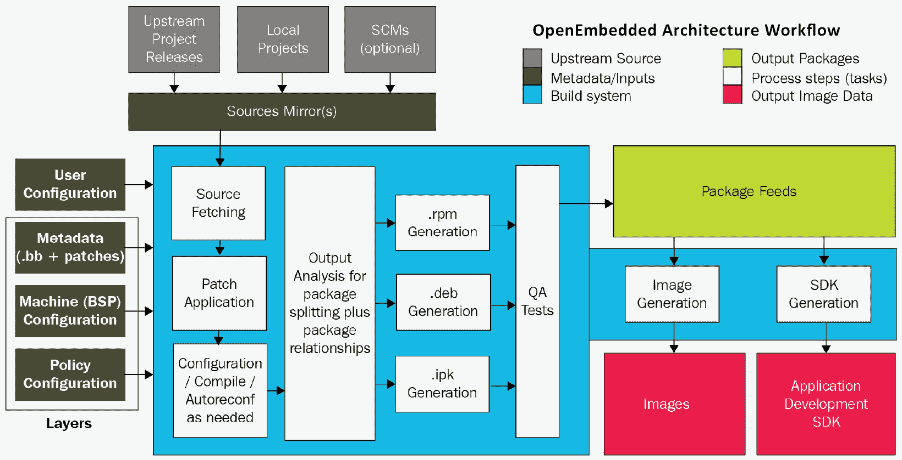
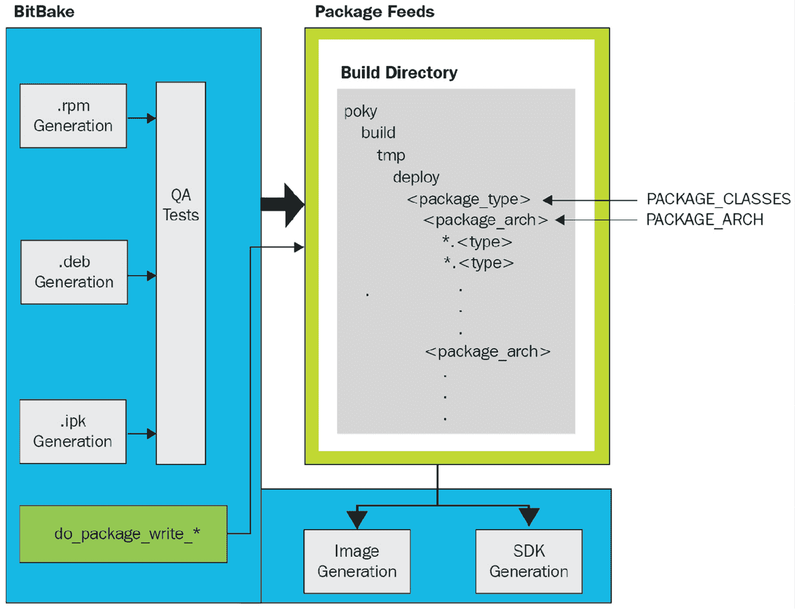
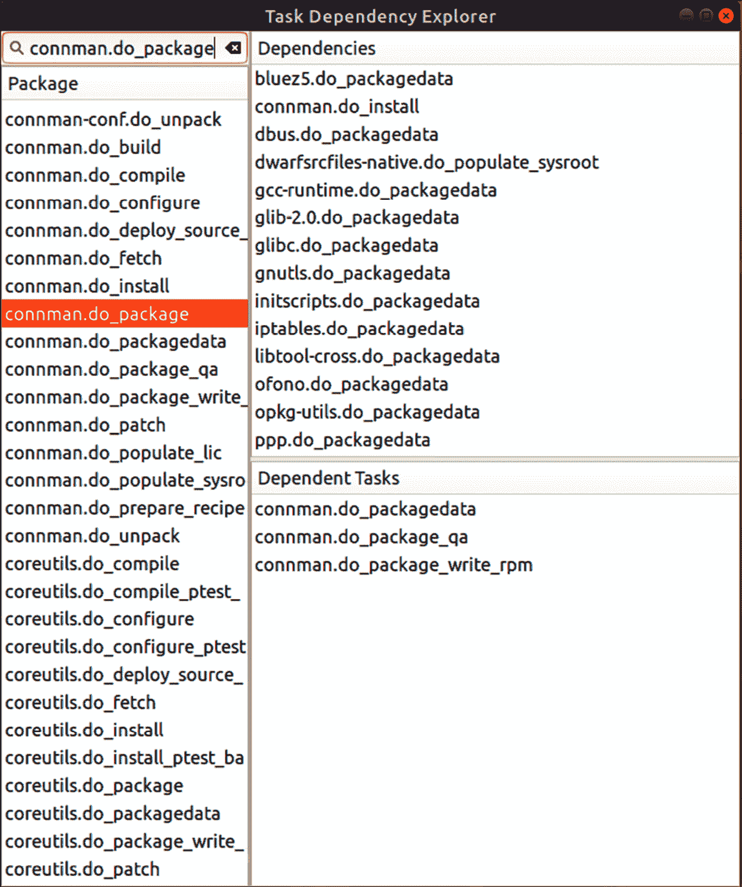

# 第八章：Yocto 的内部工作原理

在本章中，我们将深入探讨**Yocto**，嵌入式 Linux 的顶级构建系统。我们将从 Yocto 的架构开始，带你一步一步地了解整个构建工作流。接着，我们将讨论 Yocto 的多层架构以及为什么将元数据分离到不同的层中是个好主意。随着项目中**BitBake**层级的逐步增多，问题必然会出现。我们将探讨一些调试 Yocto 构建失败的方法，包括任务日志、`devshell`和依赖关系图。

拆解构建系统后，我们将重新回顾上一章中提到的 BitBake。此次，我们将更深入地讲解基本语法和语义，以便你能够从零开始编写自己的配方。我们将通过实际的配方、包含文件和配置文件中的 BitBake shell 和 Python 代码的真实示例，帮助你了解当你开始进入 Yocto 的元数据海洋时需要预期什么。

本章将覆盖以下主题：

+   拆解 Yocto 的架构与工作流

+   将元数据分离成层

+   排查构建失败

+   理解 BitBake 的语法和语义

# 技术要求

为了跟随本章中的示例，请确保你具备以下内容：

+   一个基于 Linux 的主机系统，至少有 90GB 的可用磁盘空间

+   Yocto 5.0 (scarthgap) LTS 版本

你应该已经在*第六章*中构建了 Yocto 的 5.0 (scarthgap) LTS 版本。如果尚未完成，请参阅*兼容的 Linux 发行版*和*构建主机包*部分，按照[*Yocto 项目快速构建*](https://docs.yoctoproject.org/brief-yoctoprojectqs/)指南中的说明在 Linux 主机上构建 Yocto。

本章中使用的代码可以在本书的 GitHub 仓库中的章节文件夹找到：[`github.com/PacktPublishing/Mastering-Embedded-Linux-Development`](https://github.com/PacktPublishing/Mastering-Embedded-Linux-Development)。

# 拆解 Yocto 的架构与工作流

Yocto 是一个复杂的系统，拆解它是理解它的第一步。构建系统的架构可以通过其工作流来组织。Yocto 的工作流来自于其基础的**OpenEmbedded**项目。源材料通过 BitBake 配方的元数据形式作为输入流入系统。构建系统利用这些元数据来获取、配置并编译源代码，最终生成二进制包。这些单独的输出包会在暂存区内汇集，最后生成完整的 Linux 镜像和 SDK，其中包括每个包的许可证信息：



图 8.1 – OpenEmbedded 架构工作流

以下是 Yocto 构建系统工作流的七个步骤，如前图所示：

1.  定义用于策略、机器和软件元数据的层。

1.  从软件项目的源 URI 拉取源代码。

1.  提取源代码，应用补丁，并编译软件。

1.  将构建产物安装到用于打包的暂存区域。

1.  将已安装的构建产物打包成根文件系统的包源。

1.  在提交二进制包源之前对其进行 QA 检查。

1.  并行生成完成的 Linux 镜像和 SDK。

除了第一步和最后一步，工作流中的所有步骤都是按每个包的基础进行操作的。在编译前后，可能会进行代码检查、清理和其他静态分析。单元测试和集成测试可以直接在构建机器上运行，也可以在作为目标 SoC 代替的 QEMU 实例上运行，或在目标设备本身上运行。当构建完成后，生成的镜像可以部署到一组专用设备上进行进一步的测试。作为嵌入式 Linux 构建系统的金标准，Yocto 是许多产品软件 CI/CD 管道中的关键组件。

Yocto 生成的包可以是 `rpm`、`deb` 或 `ipk` 格式。除了主二进制包外，构建系统默认尝试为一个配方生成所有以下包：

+   `dbg`：二进制文件，包括调试符号

+   `static-dev`：头文件和静态库

+   `dev`：头文件和共享库符号链接

+   `doc`：文档，包括手册页

+   `locale`：语言翻译信息

如果没有启用 `ALLOW_EMPTY` 变量，则不会生成不包含任何文件的包。默认生成的包集合由 `PACKAGES` 变量决定。这两个变量都定义在 `meta/classes-recipe/packagegroup.bbclass` 中，但其值可以被继承该 BitBake 类的包组配方重写。

构建 SDK 启用了一种全新的开发工作流，用于操作单独的包配方。在上一章的 *通过 devtool 捕获更改* 部分中，我们学习了如何使用 `devtool` 添加和修改 SDK 软件包，以便将它们重新集成到镜像中。

## 元数据

**元数据** 是输入到构建系统的内容。它控制了构建什么以及如何构建。元数据不仅仅是配方。BSP、策略、补丁和其他形式的配置文件也是元数据。构建哪个版本的包以及从哪里拉取源代码，当然也是元数据的形式。开发人员通过命名文件、设置变量和运行命令来做出这些选择。这些配置操作、参数值及其生成的产物是另一种形式的元数据。Yocto 解析所有这些输入，并将其转化为一个完整的 Linux 镜像。

开发人员在使用 Yocto 构建时首先做出的选择是目标机器架构。你可以通过在项目的 `conf/local.conf` 文件中设置 `MACHINE` 变量来指定这一点。在针对 QEMU 时，我喜欢使用 `MACHINE ?= "qemuarm64"` 来指定 `aarch64` 作为机器架构。Yocto 会确保正确的编译器标志从 BSP 传播到其他构建层。

特定架构的设置定义在名为 *tunes* 的文件中，这些文件位于 Yocto 的 `meta/conf/machine/include` 目录中，以及各个 BSP 层本身。每个 Yocto 版本都包含若干 BSP 层。我们在上一章中广泛使用了 `meta-raspberrypi` BSP 层。每个 BSP 的源代码都存储在其自己的 Git 仓库中。

要克隆 Xilinx 的 BSP 层，该层支持他们的 Zynq 系列 SoC，请使用以下命令：

```
$ git clone git://git.yoctoproject.org/meta-xilinx 
```

这是 Yocto 附带的众多 BSP 层中的一个例子。后续的练习中不需要使用此层，因此可以随意丢弃它。

元数据需要源代码来执行操作。BitBake 的 `do_fetch` 任务可以通过多种不同的方式获取配方源文件。以下是最常见的两种方法：

+   当别人开发了你需要的软件时，最简单的方式是告诉 BitBake 下载该项目的 tarball 发布版本。

+   要扩展其他人的开源软件，只需在 GitHub 上 fork 该仓库。然后，BitBake 的 `do_fetch` 任务可以使用 Git 从给定的 `SRC_URI` 克隆源文件。

如果你的团队负责该软件，你可以选择将其作为本地项目嵌入到你的工作环境中。你可以通过将其嵌套为子目录或使用 `externalsrc` 类将其定义为树外项目来实现。嵌入意味着源代码与您的层仓库绑定，不能轻易地在其他地方使用。使用 `externalsrc` 的树外项目需要在所有构建实例中具有相同的路径，这会破坏可重现性。这两种技术只是加速开发的工具，不应在生产环境中使用。

策略是作为发行层捆绑在一起的属性。这些策略包括 Linux 发行版所需的功能（例如 `systemd`）、C 库实现（如 `glibc` 或 `musl`）以及包管理器。每个发行层都有自己的 `conf/distro` 子目录。该目录中的 `.conf` 文件定义了分发或映像的顶级策略。有关发行层的示例，请查看 `meta-poky` 子目录。此 Poky 参考发行层包括用于构建默认、精简、前沿和替代版本的 `.conf` 文件，以便为目标设备构建。我们在上一章的 *构建你自己的发行版* 部分已经介绍过这一内容。

## 构建任务

我们已经看到 BitBake 的`do_fetch`任务是如何下载配方的源代码的。构建过程的下一步是提取、修补、配置和编译该源代码：`do_unpack`、`do_patch`、`do_configure`和`do_compile`。

`do_patch`任务使用`FILESPATH`变量和配方的`SRC_URI`变量来定位补丁文件并将其应用到目标源代码。`FILESPATH`变量位于`meta/classes/base.bbclass`中，定义了构建系统用来搜索补丁文件的默认目录集（*Yocto 项目参考手册*， [`docs.yoctoproject.org/ref-manual/index.html`](https://docs.yoctoproject.org/ref-manual/index.html)）。按照约定，补丁文件的名称以`.diff`和`.patch`结尾，并位于与相应配方文件相对应的子目录下。此默认行为可以通过定义`FILESEXTRAPATHS`变量并将文件路径追加到配方的`SRC_URI`变量中进行扩展和覆盖。

在修补源代码后，`do_configure`和`do_compile`任务配置、编译并链接它：



图 8.2 – 包源

当`do_compile`完成时，`do_install`任务将生成的文件复制到一个暂存区，在那里它们会为打包做准备。然后，`do_package`任务处理构建产物，并将它们组装成一个或多个包。在提交到包源区之前，`do_package_qa`任务会对包产物进行一系列质量检查。这些自动生成的质量检查定义在`meta/classes-global/insane.bbclass`中。最后，`do_package_write_*`任务创建各个包并将其发送到包源区。一旦包源区被填充，BitBake 就准备好进行镜像和 SDK 的生成。

## 镜像生成

生成镜像是一个多阶段的过程，依赖于多个变量来执行一系列任务。`do_rootfs`任务为镜像创建根文件系统。这些变量决定了哪些包将被安装到镜像中：

+   `IMAGE_INSTALL`: 安装到镜像中的包

+   `PACKAGE_EXCLUDE`: 从镜像中排除的包

+   `IMAGE_FEATURES`: 安装到镜像中的附加包

+   `PACKAGE_CLASSES`: 要使用的包格式（`rpm`、`deb`或`ipk`）

+   `IMAGE_LINGUAS`: 要包含支持包的语言（文化）

回想一下，我们在*第六章**中将软件包添加到`IMAGE_INSTALL`变量中*，作为*编写镜像配方*部分的一部分。`IMAGE_INSTALL`变量中的软件包列表会传递给包管理器（`dnf`、`apt`或`opkg`），以便将它们安装到镜像中。调用哪个包管理器取决于软件包源的格式：`do_package_write_rpm`、`do_package_write_deb`或`do_package_write_ipk`。无论目标是否包含运行时包管理器，软件包安装都会进行。如果镜像中没有包管理器，那么安装脚本和包元数据将在此阶段结束时被删除，以保证清洁并节省空间。

一旦软件包安装完成，软件包的后安装脚本将被执行。这些后安装脚本是与软件包一起提供的。如果所有后安装脚本成功运行，则会生成一个清单文件，并对根文件系统镜像执行优化操作。这个顶层的`.manifest`文件列出了所有已安装的软件包。默认的库大小和可执行文件启动时间优化由`ROOTFS_POSTPROCESS_COMMAND`变量定义。

现在根文件系统已经完全填充，`do_image`任务可以开始处理镜像。首先，执行`IMAGE_PREPROCESS_COMMAND`变量定义的所有预处理命令。接下来，系统创建最终的镜像输出文件。它通过为`IMAGE_FSTYPES`变量中指定的每种镜像类型（例如`cpio.lz4`、`ext4`和`squashfs-lzo`）启动一个`do_image_*`任务来实现。构建系统然后将`IMAGE_ROOTFS`目录的内容转换为一个或多个镜像文件。如果指定的文件系统格式允许，这些输出的镜像文件将被压缩。最后，`do_image_complete`任务通过执行`IMAGE_POSTPROCESS_COMMAND`变量定义的每个后处理命令完成镜像制作。

现在我们已经从头到尾梳理了 Yocto 的整个构建工作流，让我们来看看一些结构化大型项目的最佳实践。

# 将元数据分为多个层次

Yocto 元数据围绕以下概念进行组织：

+   **发行版**：操作系统功能，包括 C 库的选择、初始化系统和窗口管理器

+   **机器**：CPU 架构、内核、驱动程序和引导加载程序

+   **配方**：应用程序二进制文件和/或脚本

+   **镜像**：开发、制造或生产

这些概念直接映射到构建系统的实际副产品，从而为我们设计项目时提供指导。我们可以匆忙将所有内容组装到单一的层中，但那样很可能导致一个不灵活且无法维护的项目。硬件不可避免地会被修订，而一个成功的消费电子产品很快就会变成一系列产品。基于这些原因，最好从一开始就采用多层次的方法，这样我们最终得到的软件组件可以轻松修改、更换和重用。

最低要求是为你开始使用 Yocto 的每个主要项目创建单独的分发层、BSP 层和应用层。分发层构建你的目标操作系统（Linux 发行版），你的应用程序将在其上运行。帧缓冲和窗口管理器配置文件属于分发层。BSP 层指定启动加载程序、内核和设备树，这些是硬件操作所需的。应用层包含构建所有组成你自定义应用程序的软件包所需的食谱。

我们第一次遇到 `MACHINE` 变量是在*第六章**，*当时我们进行第一次的 Yocto 构建时。我们在上一章的末尾查看了 `DISTRO` 变量，当时我们创建了自己的分发层。本书中的其他 Yocto 练习依赖于 `meta-poky` 作为它们的分发层。层通过将它们插入到你当前构建目录中的 `conf/bblayers.conf` 文件中的 `BBLAYERS` 变量中来添加到你的构建中。以下是 Poky 默认的 `BBLAYERS` 定义示例：

```
BBLAYERS ?= " \
  /home/frank/poky/meta \
  /home/frank/poky/meta-poky \
  /home/frank/poky/meta-yocto-bsp \
  " 
```

不要直接编辑 `bblayers.conf` 文件，使用 `bitbake-layers` 命令行工具来处理项目层。不要冲动地直接修改 Poky 源代码树。始终在 Poky 上方创建自己的层（例如，`meta-mine`），并在此处进行更改。

在开发过程中，`BBLAYERS` 变量在你当前构建目录（例如，`build-mine`）中的 `conf/bblayers.conf` 文件中的样子应该是这样的：

```
BBLAYERS ?= " \
  /home/frank/poky/meta \
  /home/frank/poky/meta-poky \
  /home/frank/poky/meta-yocto-bsp \
  /home/frank/meta-mine \
  /home/frank/build-mine/workspace \
  " 
```

`workspace` 是我们在上一章遇到的一个特殊临时层，当时我们使用 `devtool` 进行实验。每个 BitBake 层无论是什么类型的层，其基本目录结构都是相同的。层目录的名称通常约定以 `meta` 为前缀。以下是一个虚拟层的例子：

```
$ tree meta-example
meta-example
├── classes
│ ├── class-a.bbclass
│ ├── ...
│ └── class-z.bbclass
├── conf
│ └── layer.conf
├── COPYING.MIT
├── README
├── recipes-a
│ ├── package-a
│ │ └── package-a_0.1.bb
│ ├── ...
│ └── package-z
│ └── package-z_0.1.bb
├── recipes-b
│ └── ...
└── recipes-c
 └── ... 
```

每个层次都必须有一个 `conf` 目录，其中包含一个 `layer.conf` 文件，这样 BitBake 才能设置路径和搜索模式，以查找元数据文件。我们在 *第六章**中仔细查看了 `layer.conf` 的内容，当时我们为我们的 Nova 板创建了一个 `meta-nova` 层。BSP 和分发层也可能在 `conf` 目录下有一个 `machine` 或 `distro` 子目录，其中包含更多的 `.conf` 文件。我们在前一章中检查了机器和分发层的结构，当时我们在 `meta-raspberrypi` 层之上构建并创建了我们自己的 `meta-mackerel` 分发层。

`classes` 子目录仅在定义了自己 BitBake 类的层中需要。配方按照类别组织，比如 *connectivity*，因此 `recipes-a` 实际上是 `recipes-connectivity` 的占位符，依此类推。一个类别可以包含一个或多个包，每个包都有自己的一组 BitBake 配方文件（`.bb`）。这些配方文件按包的发布版本号进行版本控制。同样，像 `package-a` 和 `package-z` 这样的名称只是实际包的占位符。

在这些不同的层次中，很容易迷失。即使你变得更加熟练使用 Yocto，仍然会有很多时候你会问自己，为什么某个特定的文件出现在你的镜像中。或者，更可能的情况是，你需要修改或扩展哪些配方文件来完成你需要做的事情？幸运的是，Yocto 提供了一些命令行工具来帮助你回答这些问题。我建议你探索 `recipetool`、`oe-pkgdata-util` 和 `oe-pkgdata-browser`，并熟悉它们。这样可以为你节省很多烦恼的时间。

# 构建失败的故障排除

在前两章中，我们学习了如何为 QEMU、Nova 板和 Raspberry Pi 4 构建可启动的镜像。但当事情出错时怎么办？在本节中，我们将介绍一些有用的调试技术，这些技术应该能让你应对 Yocto 构建失败时不再感到那么害怕。

要执行后续练习中的命令，你需要激活 BitBake 环境：

1.  首先，导航到你克隆 Yocto 的目录的上一级。

1.  接下来，设置你的 BitBake 工作环境：

    ```
    $ source poky/oe-init-build-env build-rpi 
    ```

这会设置一堆环境变量，并将你带回到我们在前一章中创建的 `build-rpi` 目录。

## 错误隔离

所以，你的构建失败了，但失败的原因在哪里呢？你有一个错误信息，但它是什么意思，来自哪里？不要绝望。调试的第一步是重现错误。一旦你能够重现错误，你就可以将问题缩小到一系列已知的步骤。回溯这些步骤就是找出故障的方式：

1.  首先，查看 BitBake 构建错误信息，看看是否能认出其中的任何包或任务名称。如果你不确定工作区中有哪些包，可以使用以下命令获取它们的列表：

    ```
    $ bitbake-layers show-recipes 
    ```

1.  一旦你确定了哪个软件包构建失败了，接下来可以在当前层中搜索与该软件包相关的任何配方或附加文件，如下所示：

    ```
    $ find ../poky -name "*connman*.bb*" 
    ```

1.  要搜索的软件包是 `connman`。前面 `find` 命令中的 `../poky` 参数假设你的构建目录与 `poky` 相邻，就像前一章中的 `build-rpi` 一样。

1.  接下来，列出所有可用的 `connman` 配方任务：

    ```
    $ bitbake -c listtasks connman 
    ```

1.  为了重现错误，你可以按照以下方式重新构建 `connman`：

    ```
    $ bitbake -c clean connman && bitbake connman 
    ```

现在你已经知道了构建失败的配方和任务，可以继续进行调试的下一个阶段。

## 转储环境

在调试构建失败时，你将需要查看 BitBake 环境中变量的当前值。我们从顶部开始，一步步往下看：

1.  首先，转储全局环境并搜索 `DISTRO_FEATURES` 的值：

    ```
    $ bitbake -e | less 
    ```

1.  输入 `/DISTRO_FEATURES=`（注意前面的斜杠）；`less` 应该跳转到一个类似这样的行：

    ```
    DISTRO_FEATURES="acl alsa argp bluetooth ext2 ipv4 ipv6 largefile pcmcia usbgadget usbhost wifi xattr nfs zeroconf pci 3g nfc x11 vfat largefile opengl ptest multiarch wayland vulkan pulseaudio sysvinit gobject-introspection-data ldconfig" 
    ```

1.  要转储 BusyBox 的软件包环境并定位其源代码目录，请使用以下命令：

    ```
    $ bitbake -e busybox | grep ^S= 
    ```

1.  要定位 ConnMan 的工作目录，请使用以下命令：

    ```
    $ bitbake-getvar -r connman WORKDIR 
    ```

1.  软件包的工作目录是 BitBake 构建过程中保存其配方任务日志的地方。

在 *步骤 1* 中，我们本可以将 `bitbake -e` 的输出通过管道传递给 `grep`，但 `less` 让我们更容易追踪变量的评估过程。输入 `/DISTRO_FEATURES`（不带尾部等号）来搜索更多该变量的出现位置。按 *n* 跳转到下一个出现位置，按 *N* 跳转回上一个出现位置。

相同的命令适用于图像以及软件包配方：

```
$ bitbake -e core-image-minimal | grep ^S= 
```

在这种情况下，目标环境的转储属于 `core-image-minimal`。

现在你知道了源代码和任务日志文件的位置，让我们来看看一些任务日志。

## 阅读任务日志

BitBake 会为每个 Shell 任务创建一个日志文件，并将其保存到软件包工作目录中的临时文件夹。以 ConnMan 为例，该临时文件夹的路径大致如下所示：

```
$ ./tmp-glibc/work/cortexa72-oe-linux/connman/1.42/temp 
```

日志文件名的格式是 `log.do_<task>.<pid>`。也有没有 `<pid>` 后缀的符号链接，它们指向每个任务的最新日志文件。日志文件包含任务运行的输出，通常这是调试问题所需的所有信息。如果没有，猜猜看你能做什么？

## 添加更多日志记录

从 Python 进行日志记录与从 Shell 进行日志记录有所不同。要从 Python 记录日志，你可以使用 BitBake 的 `bb` 模块，它调用了 Python 标准的 `logger` 模块，如下所示：

```
bb.plain -> none; Output: logs console
bb.note -> logger.info; Output: logs
bb.warn -> logger.warning; Output: logs console
bb.error -> logger.error; Output: logs console
bb.fatal -> logger.critical; Output: logs console
bb.debug -> logger.debug; Output: logs console 
```

要从 Shell 日志记录，你可以使用 BitBake 的 `logging` 类，其源代码可以在 `meta/classes-global/logging.bbclass` 找到。所有继承了 `base.bbclass` 的配方都自动继承了 `logging.bbclass`。这意味着以下所有日志记录函数应该已经可以在大多数 Shell 配方文件中使用：

```
bbplain -> Prints exactly what is passed in. Use sparingly.
bbnote -> Prints noteworthy conditions with the NOTE prefix.
bbwarn -> Prints a non-fatal warning with the WARNING prefix.
bberror -> Prints a non-fatal error with the ERROR prefix.
bbfatal -> Prints a fatal error and halts the build.
bbdebug -> Prints debug messages depending on log level. 
```

根据 `logging.bbclass` 源代码，`bbdebug` 函数的第一个参数是一个整数调试日志级别：

```
# Usage: bbdebug 1 "first level debug message"
# bbdebug 2 "second level debug message
bbdebug () {
    USAGE = 'Usage: bbdebug [123] "message"'
    …
} 
```

根据调试日志级别，`bbdebug` 消息可能会或可能不会输出到控制台。

## 从 devshell 运行命令

BitBake 提供了一个开发 shell，以便你可以在更交互的环境中手动运行构建命令。启动 `devshell` 需要一个终端复用器，比如 `tmux`。要安装 `tmux`，请使用以下命令：

```
$ sudo apt install tmux 
```

要进入构建 ConnMan 的 `devshell`，使用以下命令：

```
$ bitbake -c devshell connman 
```

首先，该命令提取并修补 ConnMan 的源代码。接下来，它会打开一个新的终端，进入 ConnMan 的源目录，并正确设置构建环境。一旦进入 `devshell`，你可以运行诸如 `./configure` 和 `make` 等命令，或者直接使用 `$CC` 调用交叉编译器。`devshell` 非常适合用来尝试修改诸如 `CFLAGS` 或 `LDFLAGS` 等值，这些值会作为命令行参数或环境变量传递给 CMake 和 Autotools 等工具。至少，如果你正在阅读的错误消息没有意义，你可以增加构建命令的详细程度。

## 图示依赖关系

有时，构建错误的原因无法在软件包的配方文件中找到，因为错误实际上发生在构建某个软件包的依赖项时。要获取 ConnMan 包的依赖项列表，请使用以下命令：

```
$ bitbake -v connman 
```

我们可以使用 BitBake 内置的任务资源管理器来显示和导航依赖关系：

```
$ bitbake -g connman -u taskexp 
```

上述命令在分析 ConnMan 后启动任务资源管理器的图形界面：

**重要提示**

一些较大的镜像，如 core-image-x11，具有复杂的软件包依赖树，这些树很可能会导致任务资源管理器崩溃。



图 8.3 – 任务资源管理器

现在，让我们暂时离开构建和构建失败的话题，深入探讨 Yocto 项目的核心内容。我指的是 BitBake 的元数据。

# 理解 BitBake 的语法和语义

BitBake 是一个任务运行器。它在这方面类似于 GNU Make，不同之处在于它操作的是配方（recipes）而不是 Makefile。这些配方中的元数据定义了使用 shell 和 Python 编写的任务。BitBake 本身是用 Python 编写的。Yocto 项目基于的 OpenEmbedded 项目由 BitBake 和大量用于构建嵌入式 Linux 发行版的配方组成。BitBake 的强大之处在于它能够在满足任务间依赖关系的同时并行运行任务。它基于层次和继承的元数据方法使得 Yocto 在扩展性上具有 Buildroot 构建系统无法比拟的优势。

在 *第六章*中，我们学习了五种类型的 BitBake 元数据文件：`.bb`、`.bbappend`、`.inc`、`.bbclass` 和 `.conf`。我们还编写了用于构建基本 `helloworld` 程序和 `nova-image` 镜像的 BitBake 食谱。现在，我们将更仔细地查看 BitBake 元数据文件的内容。我们知道任务是用 shell 和 Python 的混合语言编写的，但代码分布在哪里，为什么要这样做？有哪些语言构造可供我们使用？我们能用它们做什么？我们如何编排元数据来构建我们的应用程序？在你能够充分利用 Yocto 的强大功能之前，你需要学习如何读写 BitBake 元数据。为此，你需要学习 BitBake 的语法和语义。

## 任务

任务是 BitBake 需要按顺序执行以运行食谱的函数。回想一下，任务名称以 `do_` 前缀开头。以下是来自 `recipes-core/systemd` 的一个任务：

```
do_deploy () {
    install ${B}/src/boot/efi/systemd-boot*.efi ${DEPLOYDIR}
}
addtask deploy before do_build after do_compile 
```

在此示例中，定义了一个名为 `do_deploy` 的函数，并通过 `addtask` 命令立即将其提升为任务。`addtask` 命令还指定了任务间的依赖关系。例如，这个 `do_deploy` 任务依赖于 `do_compile` 任务完成，而 `do_build` 任务依赖于 `do_deploy` 任务完成。`addtask` 表示的依赖关系只能是食谱文件内部的依赖关系。

任务也可以使用 `deltask` 命令删除。这将停止 BitBake 将任务作为食谱的一部分执行。要删除之前的 `do_deploy` 任务，可以使用以下命令：

```
deltask do_deploy 
```

这将从食谱中删除任务，但原始的 `do_deploy` 函数定义仍然存在，并且仍然可以被调用。

## 依赖关系

为了确保高效的并行处理，BitBake 在任务级别处理依赖关系。我们看到 `addtask` 如何用于表示单个食谱文件内任务之间的依赖关系。不同食谱中的任务之间也存在依赖关系。实际上，这些任务间依赖关系正是我们通常在考虑包之间的构建时依赖和运行时依赖时所想到的。

### 任务间依赖关系

变量标志（**varflags**）是将属性或特性附加到变量的一种方式。它们的行为像哈希映射中的键，允许你将键设置为值并通过键检索值。BitBake 定义了一大套用于食谱和类的 varflags。这些 varflags 表示任务的组件和依赖关系。以下是一些 varflags 的示例：

```
do_patch[postfuncs] += "copy_sources"
do_package_index[depends] += "signing-keys:do_deploy"
do_rootfs[recrdeptask] += "do_package_write_deb do_package_qa" 
```

分配给 varflag 键的值通常是一个或多个其他任务。这意味着 BitBake 的 varflags 为我们提供了另一种表示任务间依赖关系的方式，这与 `addtask` 不同。`addtask` 命令指定任务的执行时机（例如，`before do_build after do_compile`）。大多数嵌入式 Linux 开发人员可能在日常工作中永远不需要接触 varflags。我在此引入它们，是为了让我们能够理解后面的 `DEPENDS` 和 `RDEPENDS` 示例。

### 构建时依赖关系

BitBake 使用 `DEPENDS` 变量来管理构建时依赖。任务的 `deptask` varflag 表示在执行该任务之前，必须完成 `DEPENDS` 中每个项的任务（*BitBake 用户手册*，[`docs.yoctoproject.org/bitbake/bitbake-user-manual/bitbake-user-manual-metadata.html#build-dependencies`](https://docs.yoctoproject.org/bitbake/bitbake-user-manual/bitbake-user-manual-metadata.html#build-dependencies)）：

```
do_package[deptask] += "do_packagedata" 
```

在这个示例中，`DEPENDS` 中每个项的 `do_packagedata` 任务必须在 `do_package` 执行之前完成。

另外，你可以绕过 `DEPENDS` 变量，使用 `depends` 标志显式定义构建时依赖：

```
do_patch[depends] += "quilt-native:do_populate_sysroot" 
```

在这个示例中，属于 `quilt-native` 命名空间的 `do_populate_sysroot` 任务必须在 `do_patch` 执行之前完成。配方的任务通常会被分组到各自的命名空间中，以便进行这种直接访问。

### 运行时依赖

BitBake 使用 `PACKAGES` 和 `RDEPENDS` 变量来管理运行时依赖。`PACKAGES` 变量列出了配方创建的所有运行时包。每个包可以有 `RDEPENDS` 运行时依赖。这些是必须安装的包，以便给定的包能够运行。任务的 `rdeptask` varflag 指定了在执行该任务之前，必须完成每个运行时依赖的任务（*BitBake 用户手册*，[`docs.yoctoproject.org/bitbake/bitbake-user-manual/bitbake-user-manual-metadata.html#runtime-dependencies`](https://docs.yoctoproject.org/bitbake/bitbake-user-manual/bitbake-user-manual-metadata.html#runtime-dependencies)）：

```
do_package_qa[rdeptask] = "do_packagedata" 
```

在这个示例中，`RDEPENDS` 中每个项的 `do_package_data` 任务必须在 `do_package_qa` 执行之前完成。

同样，`rdepends` 标志的作用类似于 `depends` 标志，允许你绕过 `RDEPENDS` 变量。唯一的区别是 `rdepends` 在运行时生效，而不是在构建时。

## 变量

BitBake 变量语法类似于 Make 的变量语法。BitBake 中变量的作用域取决于变量定义所在的元数据文件类型。在配方文件（`.bb`）中声明的每个变量都是局部的。在配置文件（`.conf`）中声明的每个变量都是全局的。镜像只是一个配方，因此一个镜像无法影响另一个配方中的内容。

### 赋值和展开

变量赋值和展开的工作方式与 shell 中相似。默认情况下，赋值会在语句解析后立即发生，并且是无条件的。`$` 字符触发变量展开。花括号是可选的，主要用于保护变量不被紧随其后的字符展开。展开的变量通常会用双引号括起来，以防止意外的词分割和通配符扩展：

```
OLDPKGNAME = "dbus-x11"
PROVIDES:${PN} = "${OLDPKGNAME}" 
```

变量是可变的，通常在引用时进行评估，而不是在赋值时进行评估，这一点与 Make 中的行为不同。这意味着，如果变量在赋值语句的右侧被引用，那么在左侧的变量展开之前，右侧引用的变量不会被评估。因此，如果右侧的值随着时间变化，那么左侧变量的值也会随之变化。

条件赋值仅在解析时变量未定义的情况下才定义该变量。这防止了在不希望发生的情况下进行重新赋值：

```
PREFERRED_PROVIDER_virtual/kernel ?= "linux-yocto" 
```

条件赋值通常用于 makefile 的顶部，以防止可能已被构建系统（例如`CC`、`CFLAGS`和`LDFLAGS`）设置的变量被覆盖。条件赋值确保我们不会在后续配方中向未定义的变量附加或前置值。

使用`??=`进行的延迟赋值与`?=`的行为相同，不同之处在于赋值发生在解析过程的末尾，而不是立即发生（BitBake 用户手册，超链接 "[`docs.yoctoproject.org/bitbake/bitbake-user-manual/bitbake-user-manual-metadata.html`](https://docs.yoctoproject.org/bitbake/bitbake-user-manual/bitbake-user-manual-metadata.html)#setting-a-weak-default-value"）：

```
TOOLCHAIN_TEST_HOST ??= "localhost" 
```

这意味着，如果一个变量名出现在多个延迟赋值的左侧，那么最后一个延迟赋值语句会“胜出”。

另一种形式的变量赋值会在解析时强制立即评估赋值的右侧：

```
target_datadir := "${datadir}" 
```

请注意，`:=`操作符用于立即赋值，它来源于 Make，而不是 shell。

### 添加和前置

在 BitBake 中，向变量或变量标志添加或前置值非常简单。以下两个操作符会在左侧的值和右侧附加或前置的值之间插入一个单独的空格：

```
CXXFLAGS += "-std=c++11"
PACKAGES =+ "gdbserver" 
```

请注意，当`+=`操作符应用于整数时，表示递增而不是附加，与应用于字符串值时的行为不同。

如果你希望省略单个空格，可以使用一些赋值操作符来实现：

```
BBPATH .= ":${LAYERDIR}"
FILESEXTRAPATHS =. "${FILE_DIRNAME}/systemd:" 
```

BitBake 元数据文件中会使用单空格版本的添加和前置赋值操作符。

### 覆盖

BitBake 提供了一种用于向变量添加或前置值的替代语法。这种连接方式被称为覆盖语法：

```
CFLAGS:append = " -DSQLITE_ENABLE_COLUMN_METADATA"
PROVIDES:prepend = "${PN}" 
```

尽管乍一看可能不太明显，前面两行并没有定义新变量。`：append`和`：prepend`后缀修改或覆盖现有变量的值。它们的作用更像是 BitBake 的`.=`和`=.`，与`+=`和`=+`操作符不同，后者在连接字符串时会省略单个空格。与这些操作符不同，覆盖是延迟的，因此赋值不会发生，直到所有解析完成。

最后，让我们看一个更高级的条件赋值形式，它涉及到在`meta/conf/bitbake.conf`中定义的`OVERRIDES`变量。`OVERRIDES`变量是一个以冒号分隔的条件列表，用于指定需要满足的条件。该列表用于在多个相同变量的版本之间进行选择，每个版本都有不同的后缀。这些后缀对应条件的名称。假设`OVERRIDES`列表包含`${TRANSLATED_TARGET_ARCH}`作为条件。现在，您可以定义一个针对目标 CPU 架构为`aarch64`的变量版本，例如`VALGRINDARCH:aarch64`变量：

```
VALGRINDARCH ?= "${TARGET_ARCH}"
VALGRINDARCH:aarch64 = "arm64"
VALGRINDARCH:x86-64 = "amd64" 
```

当`TRANSLATED_TARGET_ARCH`变量扩展为`aarch64`时，`VALGRINDARCH:aarch64`版本的`VALGRINDARCH`变量将优先于所有其他覆盖项。基于`OVERRIDES`选择变量值比其他条件赋值方法（例如 C 语言中的`#ifdef`指令）更加简洁和不易出错。

BitBake 还支持基于是否在`OVERRIDES`中列出特定项目来对变量值进行附加和预加操作（*BitBake 用户手册*，[`docs.yoctoproject.org/bitbake/bitbake-user-manual/bitbake-user-manual-metadata.html`](https://docs.yoctoproject.org/bitbake/bitbake-user-manual/bitbake-user-manual-metadata.html)#conditional-metadata）。以下是一些实际应用示例：

```
EXTRA_OEMAKE:prepend:task-compile = "${PARALLEL_MAKE} "
EXTRA_OEMAKE:prepend:task-install = "${PARALLEL_MAKEINST} "
DEPENDS = "attr libaio libcap acl openssl zip-native"
DEPENDS:append:libc-musl = " fts "
EXTRA_OECONF:append:libc-musl = " LIBS=-lfts "
EXTRA_OEMAKE:append:libc-musl = " LIBC=musl " 
```

注意`libc-musl`是将字符串值附加到`DEPENDS`、`EXTRA_OECONF`和`EXTRA_OEMAKE`变量的条件。与前面无条件覆盖语法的变量附加和预加操作一样，这种条件语法也是惰性求值的。赋值操作不会发生，直到食谱和配置文件被解析后。

基于`OVERRIDES`的条件附加和预加操作可能会比较复杂，并且可能会导致意外的结果。我建议在采用这些高级 BitBake 特性之前，先通过大量实践掌握基于`OVERRIDES`的条件赋值方法。

### 内联 Python

BitBake 中的`@`符号允许我们在变量内部注入并执行 Python 代码。每次扩展`=`运算符左侧的变量时，内联 Python 表达式都会被评估。在`:=`运算符右侧的内联 Python 表达式只会在解析时评估一次。以下是内联 Python 变量扩展的一些示例：

```
PV = "${@bb.parse.vars_from_file(d.getVar('FILE', False),d)[1] or '1.0'}"
BOOST_MAJ = "${@"_".join(d.getVar("PV").split(".")[0:2])}"
GO_PARALLEL_BUILD ?= "${@oe.utils.parallel_make_argument(d, '-p %d')}" 
```

注意，`bb`和`oe`是 BitBake 和 OpenEmbedded 的 Python 模块的别名。还要注意，`d.getVar("PV")`用于从任务的运行时环境中获取`PV`变量的值。`d`变量指的是一个数据存储对象，BitBake 将原始执行环境的副本保存到该对象中。这也是 BitBake 的 Shell 和 Python 代码相互操作的方式。

## 函数

函数是构成 BitBake 任务的基本单元。它们可以用 Shell 或 Python 编写，并定义在`.bbclass`、`.bb`和`.inc`文件中。

### Shell

用 shell 编写的函数作为函数或任务执行。作为任务运行的函数通常以 `do_` 前缀命名。这是一个 shell 中的函数样式：

```
meson_do_install() {
    DESTDIR='${D}' ninja -v ${PARALLEL_MAKEINST} install
} 
```

写函数时请记得保持与 shell 无关。BitBake 使用 `/bin/sh` 执行 shell 片段，具体是哪个 shell 取决于主机的发行版，可能是也可能不是 Bash shell。通过运行 `scripts/verify-bashisms` 这个 linter 来检查你的 shell 脚本，避免使用 Bash 特有的语法。

### Python

BitBake 理解三种类型的 Python 函数：纯 Python 函数、BitBake 风格函数和匿名函数。

#### 纯 Python 函数

**纯 Python 函数**是用常规 Python 编写的，并由其他 Python 代码调用。这里的“纯”是指该函数完全在 Python 解释器的执行环境内运行，而不是在函数式编程的意义上。下面是来自 `meta/recipes-connectivity/bluez5/bluez5.inc` 的一个示例：

```
def get_noinst_tools_paths (d, bb, tools):
    s = list()
    bindir = d.getVar("bindir")
    for bdp in tools.split():
        f = os.path.basename(bdp)
        s.append("%s/%s" % (bindir, f))
    return "\n".join(s) 
```

请注意，这个函数像真正的 Python 函数一样接受参数。我还想指出一些关于这个函数的值得注意的事情。首先，数据存储对象不可用，因此需要将其作为函数参数传入（此处是 `d` 变量）。其次，`os` 模块是自动可用的，因此无需导入或传入它。

纯 Python 函数可以通过内联 Python 被分配给 shell 变量，并使用 `@` 符号调用。实际上，这正是下行代码在该包含文件中发生的情况：

```
FILES:${PN}-noinst-tools = \
"${@get_noinst_tools_paths(d, bb, d.getVar('NOINST_TOOLS'))}" 
```

请注意，在 `@` 符号后，`d` 数据存储对象和 `bb` 模块在内联 Python 范围内自动可用。

#### BitBake 风格的 Python 函数

**BitBake 风格的 Python** 函数定义通过 `python` 关键字表示，而不是 Python 原生的 `def` 关键字。这些函数通过调用 `bb.build.exec_func()` 从其他 Python 函数中执行，包括 BitBake 自身的内部函数。与纯 Python 函数不同，BitBake 风格的函数不接受参数。没有参数并不成问题，因为数据存储对象始终作为全局变量（即 `d`）可用。虽然这种定义方式不如 Python 风格优雅，但 BitBake 风格在 Yocto 中占主导地位。下面是来自 `meta/classes/sign_rpm.bbclass` 的一个 BitBake 风格 Python 函数定义：

```
python sign_rpm () {
    import glob
    from oe.gpg_sign import get_signer
    signer = get_signer(d, d.getVar('RPM_GPG_BACKEND'))
    rpms = glob.glob(d.getVar('RPM_PKGWRITEDIR') + '/*')
    signer.sign_rpms(rpms,
                     d.getVar('RPM_GPG_NAME'),
                     d.getVar('RPM_GPG_PASSPHRASE'),
                     d.getVar('RPM_FILE_CHECKSUM_DIGEST'),
                     int(d.getVar('RPM_GPG_SIGN_CHUNK')),
                     d.getVar('RPM_FSK_PATH'),
                     d.getVar('RPM_FSK_PASSWORD'))
} 
```

#### 匿名 Python 函数

**匿名 Python 函数**看起来很像 BitBake 风格的 Python 函数，但它在解析时执行。由于它们首先执行，匿名函数非常适合在解析时完成的操作，例如初始化变量和其他设置。匿名函数的定义可以带有或不带有 `__anonymous` 函数名：

```
python __anonymous () {
    systemd_packages = "${PN} ${PN}-wait-online"
    pkgconfig = d.getVar('PACKAGECONFIG')
    if ('openvpn' or 'vpnc' or 'l2tp' or 'pptp') in pkgconfig.split():
        systemd_packages += " ${PN}-vpn"
    d.setVar('SYSTEMD_PACKAGES', systemd_packages)
}
python () {
    packages = d.getVar('PACKAGES').split()
    if d.getVar('PACKAGEGROUP_DISABLE_COMPLEMENTARY') != '1':
        types = ['', '-dbg', '-dev']
        if bb.utils.contains('DISTRO_FEATURES', 'ptest', True, False, d):
            types.append('-ptest')
        packages = [pkg + suffix for pkg in packages
                    for suffix in types]
        d.setVar('PACKAGES', ' '.join(packages))
    for pkg in packages:
        d.setVar('ALLOW_EMPTY_%s' % pkg, '1')
} 
```

匿名 Python 函数中的`d`变量代表整个配方的 datastore（数据存储）（*BitBake 用户手册*，[`docs.yoctoproject.org/bitbake/bitbake-user-manual/bitbake-user-manual-metadata.html`](https://docs.yoctoproject.org/bitbake/bitbake-user-manual/bitbake-user-manual-metadata.html)#anonymous-python-functions)。因此，当你在匿名函数作用域内设置一个变量时，该值将在其他函数运行时通过全局数据存储对象可用。

## RDEPENDS 重访

让我们回到运行时依赖的主题。这些是必须安装的包，以使某个特定包能够运行。这个列表在包的`RDEPENDS`变量中定义。以下是`populate_sdk_base.bbclass`中的一个有趣摘录：

```
do_sdk_depends[rdepends] = "${@get_sdk_ext_rdepends(d)}" 
```

这里是相应的内联 Python 函数定义：

```
def get_sdk_ext_rdepends(d):
    localdata = d.createCopy()
    localdata.appendVar('OVERRIDES', ':task-populate-sdk-ext')
    return localdata.getVarFlag('do_populate_sdk', 'rdepends') 
```

这里有很多内容需要解释。首先，函数会复制数据存储对象，以避免修改任务的运行时环境。回想一下，`OVERRIDES`变量是一个用于在多个版本的变量之间选择条件的列表。下一行将`task-populate-sdk-ext`的条件添加到本地复制数据存储的`OVERRIDES`列表中。最后，函数返回`do_populate_sdk`任务的`rdepends varflag`值。现在的区别是，`rdepends`是使用`_task-populate-sdk-ext`版本的变量进行评估的，例如以下内容：

```
SDK_EXT:task-populate-sdk-ext = "-ext"
SDK_DIR:task-populate-sdk-ext = "${WORKDIR}/sdk-ext" 
```

我发现这种临时使用`OVERRIDES`的方法既聪明又可怕。

BitBake 的语法和语义看起来可能很令人生畏。将 Shell 和 Python 结合起来，形成了一种有趣的语言特性混合。我们不仅知道如何定义变量和函数，而且还可以继承类文件、重载变量，并通过编程改变条件。这些高级概念会反复出现在`.bb`、`.bbappend`、`.inc`、`.bbclass`和`.conf`文件中，随着时间的推移，它们会变得越来越容易识别。当我们努力提高 BitBake 的熟练度，并开始发挥我们新获得的能力时，错误是难以避免的。

# 总结

尽管你可以使用 Yocto 构建几乎任何东西，但有时很难知道构建系统在做什么或者是怎么做的。不过，我们还是有希望的。有一些命令行工具可以帮助我们找到某个东西的来源以及如何修改它。我们也可以读取和写入任务日志。还有`devshell`，我们可以使用它从命令行配置和编译单个项目。如果我们从一开始就将项目分成多个层，那么我们可能会更好地利用我们所做的工作。

BitBake 结合了 Shell 和 Python，支持一些强大的语言构造，如继承、重载和条件变量选择。这既有好处也有坏处。好处在于层和配方是完全可组合和可定制的。

这不好，原因在于不同食谱文件和不同层次中的元数据可能会以奇怪且出乎意料的方式相互作用。将这些强大的语言特性与数据存储对象作为 Shell 和 Python 执行环境之间的门户功能结合，你将获得无数小时的乐趣。

这就结束了我们对 Yocto 项目及本书第二部分《构建嵌入式 Linux 镜像》的深入探讨。在本书的下一部分，我们将换个角度，研究*系统架构与设计决策*，从**第九章**开始。我们将在**第十章**中再次使用 Yocto，评估 Mender。

# 深入学习

+   *Yocto 项目概述与概念手册*，Yocto 项目 – [`docs.yoctoproject.org/overview-manual/`](https://docs.yoctoproject.org/overview-manual/)

+   *我希望自己早知道的 Yocto 项目知识*，Yocto 项目 – [`docs.yoctoproject.org/what-i-wish-id-known.html`](https://docs.yoctoproject.org/what-i-wish-id-known.html)

+   *BitBake 用户手册*，理查德·普迪（Richard Purdie）、克里斯·拉尔森（Chris Larson）和菲尔·布伦德尔（Phil Blundell）编著 – [`docs.yoctoproject.org/bitbake/`](https://docs.yoctoproject.org/bitbake/)

+   *使用 Yocto 项目的嵌入式 Linux 开发指南*，亚历克斯·冈萨雷斯（Alex Gonzalez）编著

# 加入我们的 Discord 社区

加入我们社区的 Discord 空间，与作者及其他读者进行讨论：[`packt.link/embeddedsystems`](https://packt.link/embeddedsystems)


