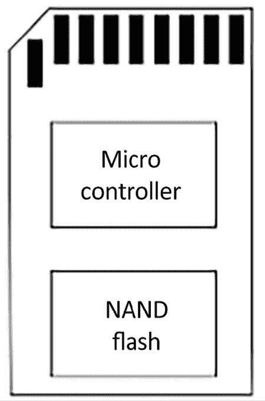

# 9

# 创建存储策略

嵌入式设备的海量存储选项对系统的其他部分有很大影响，特别是在系统的稳健性、速度和现场更新方法方面。大多数设备都以某种形式使用闪存。随着存储容量从几十兆字节增加到几十千兆字节，闪存的价格在过去几年中大幅下降。

本章我们将详细介绍闪存技术，并探讨不同的内存组织策略如何影响必须管理它的低级驱动程序软件，包括 Linux **内存技术设备**（**MTD**）层。

每种闪存技术都有不同的文件系统选择。我将描述在嵌入式设备上最常见的那些，并通过总结每种闪存类型的选择来完成这项调查。最后，我们将考虑一些技术，使闪存得到最佳利用，并将所有内容整合成一个连贯的存储策略。

本章将涵盖以下主题：

+   存储选项

+   从启动加载程序访问闪存

+   从 Linux 访问闪存

+   闪存文件系统

+   NOR 和 NAND 闪存文件系统

+   管理闪存的文件系统

+   只读压缩文件系统

+   临时文件系统

+   使根文件系统只读

+   文件系统选择

# 技术要求

为了跟随示例，请确保你已准备好以下内容：

+   一台安装有 `e2fsprogs`、`genext2fs`、`mtd-utils`、`squashfs-tools` 和 `util-linux` 或其等效工具的基于 Linux 的主机系统

+   一个 microSD 卡读卡器和卡片

+   适用于 Linux 的 balenaEtcher

+   来自 *第三章* 的 U-Boot 源代码树

+   来自 *第四章* 的 Linux 内核源代码树

+   一条带有 3.3V 逻辑电平引脚的 USB 到 TTL 串口电缆

+   一台 BeaglePlay

+   一款能够提供 3A 电流的 5V USB-C 电源

你应该已经在 *第三章* 中为 BeaglePlay 下载并构建了 U-Boot。你也应该已经获得了来自 *第四章* 的 Linux 内核源代码树。

Ubuntu 提供了创建和格式化各种文件系统所需工具的大部分软件包。要在 Ubuntu 24.04 LTS 系统上安装这些工具，请使用以下命令：

```
$ sudo apt install e2fsprogs genext2fs mtd-utils squashfs-tools util-linux 
```

`mtd-utils` 包含 `mtdinfo`、`mkfs.jffs2`、`sumtool`、`nandwrite` 和 UBI 命令行工具。

# 存储选项

嵌入式设备需要低功耗、物理紧凑、稳健且在可能达到几十年生命周期的情况下可靠的存储。几乎所有情况下，这意味着使用固态存储。固态存储在许多年前通过 **只读存储器**（**ROM**）引入，但过去 20 年里，它一直是某种类型的闪存。在这段时间里，闪存经历了多个发展阶段，从 NOR 到 NAND，再到像 eMMC 这样的管理闪存。

NOR 闪存价格昂贵，但可靠，可以映射到 CPU 地址空间，从而允许你直接从闪存中执行代码。NOR 闪存芯片的容量较小，通常从几兆字节到大约一吉字节。

NAND 闪存比 NOR 闪存便宜得多，并且具有从数十兆字节到数十吉字节不等的更高容量。然而，它需要大量的硬件和软件支持才能将其转化为有用的存储介质。

管理型闪存由一个或多个 NAND 闪存芯片组成，配备了一个控制器，该控制器处理闪存的复杂性，并提供类似硬盘的硬件接口。其吸引力在于，它将复杂性从驱动程序软件中移除，并使系统设计师免于应对闪存技术的频繁变化。

SD 卡、eMMC 芯片和 USB 闪存驱动器都属于这一类别。几乎所有当前一代的智能手机和平板电脑都配备了 eMMC 存储，这一趋势可能会扩展到其他类型的嵌入式设备。

嵌入式系统中很少使用硬盘驱动器。一个例外是机顶盒和智能电视中的数字视频录制，它们需要大量存储并具有快速写入时间。

在所有情况下，可靠性至关重要：你希望设备能够在电力故障和意外重启的情况下启动并进入功能状态。你应该选择在此类情况下表现良好的文件系统。你的存储设备技术选择将限制你对文件系统的选择。

本节将学习 NOR 闪存和 NAND 闪存之间的差异，并在选择管理型闪存技术时考虑我们的选择。

## NOR 闪存

NOR 闪存芯片中的存储单元被排列成擦除块，例如 128 KB。擦除一个块会将所有位设置为 1。它可以一次编程一个字（根据数据总线宽度，8、16 或 32 位）。每个擦除周期都会轻微损坏存储单元，经过一定次数的周期后，擦除块将变得不可靠，无法再使用。芯片的数据表中应提供最大擦除周期数，但通常在 1 K 到 1 M 之间。

数据可以逐字读取。芯片通常被映射到 CPU 地址空间，这意味着你可以直接从 NOR 闪存中执行代码。这使得它成为放置引导加载程序代码的一个方便位置，因为它只需要硬接地址映射，不需要额外的初始化。因此，支持这种 NOR 闪存的 SoC 通常会提供默认的内存映射，使其涵盖 CPU 的重置向量。

内核，甚至根文件系统，也可以位于闪存中，这样就避免了将它们复制到 RAM 中，从而创建了具有小内存占用的设备。这种技术被称为**就地执行**或**XIP**。它非常专业，我在这里不会进一步讨论。章节末尾的*进一步学习*部分包含了一些参考资料。

NOR 闪存芯片有一个标准的寄存器级接口，称为**通用闪存接口**（**CFI**），所有现代芯片都支持该接口。CFI 在标准 JESD68 中进行了描述，您可以从[`www.jedec.org/`](https://www.jedec.org/)获取。

现在我们已经了解了什么是 NOR 闪存，接下来让我们来看一下 NAND 闪存。

## NAND 闪存

NAND 闪存比 NOR 闪存便宜得多，且容量更大。第一代 NAND 芯片在现在所称的**单层单元**（**SLC**）组织中，每个存储单元存储一个比特。后来的几代芯片在**多层单元**（**MLC**）芯片中，每个存储单元存储两个比特，而现在的**三层单元**（**TLC**）芯片每个存储单元存储三个比特。随着每个存储单元存储比特数的增加，存储的可靠性下降，因此需要更复杂的控制器硬件和软件来补偿这一点。当可靠性成为问题时，应确保使用 SLC NAND 闪存芯片。

与 NOR 闪存类似，NAND 闪存也被组织成多个擦除块，大小范围从 16 KB 到 512 KB，再次地，擦除一个块会将所有位设置为 1。但是，在块变得不可靠之前，擦除周期的次数较少。TLC 芯片通常只有大约 1K 次擦除周期，而 SLC 芯片可高达 100K 次。NAND 闪存只能以页面（通常为 2 KB 或 4 KB）的形式进行读写。由于它们无法按字节逐一访问，因此无法映射到地址空间中，所以代码和数据必须先被复制到 RAM 中，才能进行访问。

数据传输到芯片以及从芯片传输的过程中容易发生比特翻转，这可以通过使用**错误修正码**（**ECC**）来检测和修正。SLC 芯片通常使用简单的**汉明码**，可以在软件中高效实现，并能修正页面读取中的单比特错误。MLC 和 TLC 芯片需要更复杂的代码，如**Bose-Chaudhuri-Hocquenghem**（**BCH**）码，可以修正每页最多 8 比特的错误。修正如此多的错误需要闪存控制器内部的硬件支持。

ECC 需要存储在某个地方，因此每页会有一个额外的存储区域，称为**带外**（**OOB**）区域或备用区域。SLC 设计通常每 32 字节主存储会有 1 字节 OOB。因此，对于一个 2 KB 页面设备，OOB 为每页 64 字节，对于一个 4 KB 页面，OOB 为每页 128 字节。MLC 和 TLC 芯片具有相对更大的 OOB 区域，以容纳更复杂的 ECC。以下图展示了一个具有 128 KB 擦除块和 2 KB 页面的芯片组织：


图 9.1 – OOB 区域

在生产过程中，制造商会测试所有的块，并通过在每个块的页面的 OOB 区域中设置标志来标记任何失败的块。发现全新芯片中有多达 2%的块以这种方式标记为坏是很常见的。在擦除区域之前保存 OOB 信息以进行分析在出现问题时是有用的。此外，在达到擦除周期限制之前，类似比例的块给出擦除错误是符合规范的。NAND 闪存驱动程序应检测到并标记其为坏块。

一旦在 OOB 区域为坏块标志和 ECC 字节留出空间后，仍然有一些字节剩余。一些闪存文件系统利用这些空闲字节来存储文件系统元数据。因此，系统的许多部分对 OOB 区域的布局感兴趣：SoC ROM 引导代码、引导加载程序、内核 MTD 驱动程序、文件系统代码以及创建文件系统映像的工具。由于标准化程度不高，因此很容易出现引导加载程序使用无法被内核 MTD 驱动程序读取的 OOB 格式的情况。您需要确保它们彼此一致。

访问 NAND 闪存芯片需要一个 NAND 闪存控制器，通常是 SoC 的一部分。您需要引导加载程序和内核中对应的驱动程序。NAND 闪存控制器处理芯片的硬件接口，传输页面的数据，可能包括用于错误校正的硬件。

NAND 闪存芯片有一个称为**开放 NAND 闪存接口**（Open NAND Flash Interface，ONFI）的标准寄存器级接口，大多数现代芯片都遵循这一标准。有关更多信息，请参阅[`onfi.org/`](https://onfi.org/)。

现代 NAND 闪存技术非常复杂。仅仅将 NAND 闪存存储器与控制器配对已不再足够。我们还需要一个接口来抽象掉大部分技术细节，例如错误校正。

## 管理型闪存

在操作系统中支持闪存存储器的负担变小了，特别是对于 NAND 闪存而言，如果有一个明确定义的硬件接口和一个隐藏存储器复杂性的标准闪存控制器。这就是管理型闪存存储器，它越来越普遍。实质上，它意味着将一个或多个闪存芯片与提供理想存储设备的微控制器结合起来，具有小的扇区大小，并且与传统文件系统兼容。嵌入式系统中最重要的芯片类型是**安全数字**（Secure Digital，SD）卡及其嵌入式变体称为 eMMC。

### 多媒体卡（MultiMediaCard）和安全数字卡（Secure Digital cards）

**多媒体卡**（**MMC**）由 SanDisk 和西门子于 1997 年推出，是一种使用闪存的封装存储形式。随后，在 1999 年，SanDisk、松下和东芝共同创建了 SD 卡，它基于 MMC，但增加了加密和**数字版权管理**（**DRM**）功能，因此才有了“安全”这一名称部分。这两种卡都是为了消费类电子产品，如数码相机、音乐播放器和类似设备而设计的。目前，SD 卡是消费类和嵌入式电子产品中占主导地位的管理型闪存，尽管加密功能很少被使用。SD 规范的新版本允许更小的封装（miniSD 和 microSD）和更大的容量：高容量的 SDHC 最高可达 32GB，扩展容量的 SDXC 可达 2TB。

MMC 和 SD 卡的硬件接口非常相似。可以在全尺寸的 SD 卡插槽中使用全尺寸的 MMC 卡（但反过来不可行）。早期的版本使用了 1 位的**串行外设接口**（**SPI**）。更近期的卡片使用了 4 位接口。

该指令集用于读取和写入 512 字节的扇区内存。封装内部包含一个微控制器和一个或多个 NAND 闪存芯片，具体如下图所示：



图 9.2 – SD 卡封装

微控制器实现了指令集并管理闪存，执行闪存翻译层的功能，如本章后续所述。它们已经预格式化为 FAT 文件系统：SDSC 卡使用 FAT16，SDHC 卡使用 FAT32，SDXC 卡使用 exFAT。NAND 闪存芯片的质量以及微控制器上的软件在不同卡片之间差异很大。是否有卡片足够可靠以供深度嵌入使用仍存疑，尤其是使用 FAT 文件系统时，它容易导致文件损坏。请记住，MMC 和 SD 卡的主要使用场景是作为数码相机、平板电脑和手机的可移动存储。

### eMMC

**嵌入式 MMC**或**eMMC**实际上是将 MMC 存储芯片封装成可以通过 4 位或 8 位接口焊接到主板上的存储器。它们通常用作操作系统的存储，因此这些组件能够执行该任务。芯片通常没有预格式化任何文件系统。

### 其他类型的管理型闪存

第一个管理型闪存技术之一是**紧凑型闪存**（**CF**），它使用了**个人计算机内存卡国际协会**（**PCMCIA**）硬件接口的一个子集。CF 通过**并行先进技术附件**（**PATA**）接口暴露内存，并且在操作系统中表现为标准硬盘。它们曾广泛应用于基于 x86 的单板计算机和专业视频及摄影设备中。

我们每天使用的另一种格式是**USB 闪存驱动器**。在这种情况下，内存是通过 USB 接口访问的，控制器实现了 USB 大容量存储规范以及闪存转换层和与闪存芯片的接口。USB 大容量存储协议基于 SCSI 磁盘命令集。与 MMC 和 SD 卡一样，它们通常预格式化为 FAT 文件系统。它们在嵌入式系统中的主要用例是与 PC 交换数据。

最近，作为一种新的管理型闪存存储选项，**通用闪存存储**（**UFS**）被加入到列表中。与 eMMC 类似，它是一个封装在芯片中的存储单元，安装在主板上。它具有高速串行接口，并且可以实现比 eMMC 更高的传输速率。它支持 SCSI 磁盘命令集。

现在我们知道了可用的闪存类型，让我们学习一下 U-Boot 如何从每种闪存中加载内核镜像。

# 从引导加载程序访问闪存内存

在*第三章*中，我提到了引导加载程序需要从各种闪存设备中加载内核二进制文件和其他镜像，并执行系统维护任务，如擦除和重新编程闪存内存。因此，引导加载程序必须具备支持读取、擦除和写入操作的驱动程序和基础设施，无论你使用的是 NOR、NAND 还是管理型内存。接下来的示例中我将使用 U-Boot。其他引导加载程序遵循类似的模式。

## U-Boot 和 NOR 闪存

U-Boot 在`drivers/mtd`中有 NOR CFI 芯片的驱动程序，并使用各种`erase`命令擦除内存，通过`cp.b`命令逐字节将数据复制到闪存单元。如果你的 NOR 闪存内存从`0x40000000`映射到`0x48000000`，其中 4MB 的内存从`0x40040000`开始用于存储内核镜像。此时，你可以使用这些 U-Boot 命令将新的内核加载到闪存中：

```
=> tftpboot 0x100000 uImage
=> erase 0x40040000 0x403fffff
=> cp.b 0x100000 0x40040000 $(filesize) 
```

上述示例中的`filesize`变量由`tftpboot`命令设置为刚刚下载的文件的大小。

## U-Boot 和 NAND 闪存

对于 NAND 闪存，你需要一个 NAND 闪存控制器的驱动程序，通常可以在 U-Boot 源代码中的`drivers/mtd/nand`目录找到。

你可以使用`nand`命令来管理内存，使用它的`erase`、`write`和`read`子命令。这个例子展示了一个内核镜像被加载到`0x82000000`的 RAM 中，然后再从`0x280000`偏移位置开始写入到闪存中：

```
=> tftpboot 0x82000000 uImage
=> nand erase 0x280000 0x400000
=> nand write 0x82000000 0x280000 $(filesize) 
```

U-Boot 还可以读取存储在 JFFS2、YAFFS2 和 UBIFS 文件系统中的文件。`nand write`会跳过标记为坏的块。

**重要提示**

如果你正在写入的数据属于文件系统，请确保文件系统也会跳过坏块。

## U-Boot 和 MMC、SD 以及 eMMC

U-Boot 在`drivers/mmc`中有多个 MMC 控制器的驱动程序。你可以通过用户界面级别使用`mmc read`和`mmc write`访问原始数据，从而处理原始内核和文件系统镜像。

U-Boot 还可以从 MMC 存储上的 FAT32 和 ext4 文件系统中读取文件。

U-Boot 需要驱动程序来访问 NOR、NAND 和管理闪存。你应使用哪个驱动程序取决于你选择的 NOR 芯片或 SoC 上的闪存控制器。从 Linux 访问原始 NOR 和 NAND 闪存涉及额外的软件层。

# 从 Linux 访问闪存

原始的 NOR 和 NAND 闪存由**内存技术设备**（**MTD**）子系统处理，该子系统为你提供了基本接口来读取、擦除和写入闪存块。对于 NAND 闪存，还有处理 OOB 区域的功能，用于识别坏块。

对于管理闪存，你需要驱动程序来处理特定的硬件接口。MMC/SD 卡和 eMMC 使用 `mmcblk` 驱动程序。而 CompactFlash 和硬盘则使用 `sd` SCSI 磁盘驱动程序。USB 闪存驱动器使用 `usb_storage` 驱动程序，并与 `sd` 驱动程序一起使用。

## 内存技术设备

MTD 子系统由 David Woodhouse 于 1999 年启动，并在这期间得到了广泛的发展。在本节中，我将重点介绍它如何处理两种主要技术，NOR 和 NAND 闪存。MTD 包含三层：一组核心功能、用于各种类型芯片的驱动程序集合以及以字符设备或块设备形式呈现闪存的用户级驱动程序：


图 9.3 – MTD 层

芯片驱动程序处于最低层，与闪存芯片进行接口。NOR 闪存芯片只需要少数几个驱动程序，足以涵盖 CFI 标准和变种，以及一些不符合标准的芯片，这些芯片现在大多已过时。对于 NAND 闪存，你需要一个用于你所使用的 NAND 闪存控制器的驱动程序。这个驱动程序通常作为板级支持包的一部分提供。目前主线内核的 `drivers/mtd/nand` 目录中大约有 40 个相关驱动程序。

### MTD 分区

在大多数情况下，你可能希望将闪存分区成多个区域，例如，提供引导加载程序、内核镜像或根文件系统的空间。在 MTD 中，有几种方法可以指定分区的大小和位置，主要的几种方法如下：

+   通过内核命令行使用 `CONFIG_MTD_CMDLINE_PARTS`

+   通过设备树使用 `CONFIG_MTD_OF_PARTS`

+   使用平台映射驱动程序

在第一个选项中，内核命令行选项为 `mtdparts`，该选项在 Linux 源代码中的 `drivers/mtd/parsers/cmdlinepart.c` 文件内定义：

```
<mtddef>  := <mtd-id>:<partdef>[,<partdef>]
<partdef> := <size>[@<offset>][<name>][ro][lk][slc]
<mtd-id>  := unique name used in mapping driver/device (mtd->name)
<size>    := standard linux memsize OR "-" to denote all remaining space
             size is automatically truncated at end of device
             if specified or truncated size is 0 the part is skipped
<offset>  := standard linux memsize
             if omitted the part will immediately follow the previous part
             or 0 if the first part
<name>    := '(' NAME ')' 
```

或许一个例子能帮助理解。假设你有一个 128 MB 的闪存芯片，需要将其分成五个分区。一个典型的命令行如下：

```
mtdparts=:512k(SPL)ro,780k(U-Boot)ro,128k(U-BootEnv),4m(Kernel),-(Filesystem) 
```

冒号前面的第一个元素是`mtd-id`，它通过数字或板支持包分配的名称来标识闪存芯片。如果只有一个芯片，如这里的情况，可以留空。如果有多个芯片，每个芯片的信息由分号分隔。然后，对于每个芯片，有一个逗号分隔的分区列表，每个分区都有以字节、KB（`k`）或 MB（`m`）为单位的大小和一个括号中的名称。`ro`后缀使分区对 MTD 只读，通常用于防止意外覆盖引导加载程序。芯片的最后一个分区的大小可能会被一个破折号（`-`）替代，表示它应该占用剩余的所有空间。

你可以通过读取`/proc/mtd`来查看运行时的配置摘要：

```
# cat /proc/mtd
dev: size erasesize name
mtd0: 00080000 00020000 "SPL"
mtd1: 000C3000 00020000 "U-Boot"
mtd2: 00020000 00020000 "U-BootEnv"
mtd3: 00400000 00020000 "Kernel"
mtd4: 07A9D000 00020000 "Filesystem" 
```

每个分区在`/sys/class/mtd`中有更详细的信息，包括擦除块大小和页面大小。可以通过`mtdinfo`来很好的总结：

```
# mtdinfo /dev/mtd0
mtd0
Name: SPL
Type: nand
272 Creating a Storage Strategy
Eraseblock size: 131072 bytes, 128.0 KiB
Amount of eraseblocks: 4 (524288 bytes, 512.0 KiB)
Minimum input/output unit size: 2048 bytes
Sub-page size: 512 bytes
OOB size: 64 bytes
Character device major/minor: 90:0
Bad blocks are allowed: true
Device is writable: false 
```

另一种指定 MTD 分区的方法是通过设备树。下面是一个例子，它创建了与命令行示例相同的分区：

```
nand@0,0 {
 #address-cells = <1>;
 #size-cells = <1>;
 partition@0 {
  label = "SPL";
  reg = <0 0x80000>;
 };
 partition@80000 {
  label = "U-Boot";
  reg = <0x80000 0xc3000>;
 };
 partition@143000 {
  label = "U-BootEnv";
  reg = <0x143000 0x20000>;
 };
 partition@163000 {
  label = "Kernel";
  reg = <0x163000 0x400000>;
 };
 partition@563000 {
  label = "Filesystem";
  reg = <0x563000 0x7a9d000>;
 };
}; 
```

第三种替代方法是将分区信息作为平台数据编码在`mtd_partition`结构中，如下面从`arch/arm/mach-omap2/board-omap3beagle.c`中提取的示例所示（`NAND_BLOCK_SIZE`在其他地方定义为 128 KB）：

```
static struct mtd_partition omap3beagle_nand_partitions[] = {
 {
  .name = "X-Loader",
  .offset = 0,
  .size = 4 * NAND_BLOCK_SIZE,
  .mask_flags = MTD_WRITEABLE, /* force read-only */
 },
 {
  .name = "U-Boot",
  .offset = 0x80000;
  .size = 15 * NAND_BLOCK_SIZE,
  .mask_flags = MTD_WRITEABLE, /* force read-only */
 },
 {
  .name = "U-Boot Env",
  .offset = 0x260000;
  .size = 1 * NAND_BLOCK_SIZE,
 },
 {
  .name = "Kernel",
  .offset = 0x280000;
  .size = 32 * NAND_BLOCK_SIZE,
 },
 {
  .name = "File System",
  .offset = 0x680000;
  .size = MTDPART_SIZ_FULL,
 },
}; 
```

平台数据已被弃用：你只能在未更新以使用设备树的旧 SoC 的 BSP 中找到它。

### MTD 设备驱动

MTD 子系统的上层包含一对设备驱动：

+   一个主设备号为`90`的字符设备。每个 MTD 分区号 N 有两个设备节点：`/dev/mtdN`（次设备号=N*2）和`/dev/mtdNro`（次设备号=(N*2 + 1)）。后者只是前者的只读版本。

+   一个主设备号为`31`，次设备号为 N 的块设备。设备节点形式为`/dev/mtdblockN`。

首先来看字符设备，因为它是两者中最常用的。字符设备的行为类似于存储中的文件，你可以轻松地从中读取文本并向其写入文本。

### MTD 字符设备，mtd

字符设备是最重要的：它们允许你将底层闪存内存作为字节数组进行访问，从而能够读取和写入（编程）闪存。它还实现了一些`ioctl`函数，允许你擦除块并管理 NAND 芯片上的 OOB 区域。以下列表摘自`include/uapi/mtd/mtd-abi.h`：

+   `MEMGETINFO`：获取基本的 MTD 特性信息。

+   `MEMERASE`：擦除 MTD 分区中的块。

+   `MEMWRITEOOB`：写入页面的带外数据。

+   `MEMREADOOB`：读取页面的带外数据。

+   `MEMLOCK`：锁定芯片（如果支持）。

+   `MEMUNLOCK`：解锁芯片（如果支持）。

+   `MEMGETREGIONCOUNT`：获取擦除区域的数量：如果分区中有不同大小的擦除块（这在 NOR 闪存中很常见，但在 NAND 中很少见），则返回非零值。

+   `MEMGETREGIONINFO`：如果`MEMGETREGIONCOUNT`非零，则可用于获取每个区域的偏移量、大小和块数。

+   `MEMGETOOBSEL`：已弃用。

+   `MEMGETBADBLOCK`：获取坏块标志。

+   `MEMSETBADBLOCK`：设置坏块标志。

+   `OTPSELECT`：如果芯片支持，则设置 OTP（一次性可编程）模式。

+   `OTPGETREGIONCOUNT`：获取 OTP 区域的数量。

+   `OTPGETREGIONINFO`：获取 OTP 区域的信息。

+   `ECCGETLAYOUT`：已弃用。

有一组称为`mtd-utils`的实用程序，用于操作闪存内存，这些实用程序使用这些`ioctl`函数。源代码可以在`git://git.infradead.org/mtd-utils.git`找到，并且在 Yocto 项目和 Buildroot 中作为包提供。基本工具在以下列表中列出。该包还包含 JFFS2 和 UBI/UBIFS 文件系统的实用程序，我将在后面介绍。对于这些工具中的每一个，MTD 字符设备是以下参数之一：

+   `flash_erase`：擦除一系列块。

+   `flash_lock`：锁定一系列块。

+   `flash_unlock`：解锁一系列块。

+   `nanddump:` 从 NAND 闪存转储内存，可以选择性地包括 OOB 区域。跳过坏块。

+   `nandtest`：测试并执行 NAND 闪存的诊断。

+   `nandwrite`：将数据从文件写入 NAND 闪存，跳过坏块。

    **提示**

    在写入新内容之前，您必须始终擦除闪存。

    `flash_erase` 是执行此操作的命令。

要编程 NOR 闪存，您只需使用类似 cp 的文件复制命令将字节复制到 MTD 设备节点。

不幸的是，这在 NAND 闪存上不起作用，因为在第一个坏块时复制会失败。相反，使用`nandwrite`，它会跳过任何坏块。要读取 NAND 闪存，您应该使用`nanddump`，它也会跳过坏块。

### MTD 块设备，mtdblock

`mtdblock` 驱动程序不常使用。它的作用是将闪存呈现为一个块设备，您可以用它来格式化并挂载文件系统。然而，它有严重的限制，因为它不处理 NAND 闪存中的坏块，不进行磨损均衡，也不处理文件系统块与闪存擦除块之间的大小不匹配。换句话说，它没有闪存转换层，而闪存转换层对可靠的文件存储至关重要。`mtdblock`设备唯一有用的情况是将只读文件系统（如 SquashFS）挂载在可靠的闪存上，如 NOR 闪存。

**提示**

如果您需要在 NAND 闪存上使用只读文件系统，应该使用本章后面描述的 UBI 驱动程序。

### 将内核异常日志记录到 MTD

内核错误或崩溃通常通过 `klogd` 和 `syslogd` 守护进程记录到一个循环内存缓冲区或文件中。在重启之后，如果是环形缓冲区，日志会丢失。即便是文件，也可能在系统崩溃之前未能正确写入。更可靠的方法是将崩溃和内核恐慌信息写入一个 MTD 分区作为一个循环日志缓冲区。你可以通过启用 `CONFIG_MTD_OOPS` 并将 `console=ttyMTDN` 添加到内核命令行来启用它，`N` 是 MTD 设备编号，用于将信息写入该设备。

### 模拟 NAND 内存

NAND 模拟器通过系统 RAM 模拟 NAND 芯片。其主要用途是测试必须了解 NAND 的代码，而没有访问物理 NAND 内存的能力。模拟坏块、位翻转和其他错误的功能使你能够测试一些难以通过真实闪存内存进行的代码路径。更多信息可以参考代码本身，它提供了关于如何配置驱动程序的全面描述。代码位于 `drivers/mtd/nand/nandsim.c`。通过 `CONFIG_MTD_NAND_NANDSIM` 内核配置来启用它。

## MMC 块驱动

MMC/SD 卡和 eMMC 芯片使用 `mmcblk` 块驱动访问。你需要一个主机控制器来匹配你所使用的 MMC 适配器，它是板支持包的一部分。驱动程序位于 Linux 源代码中的 `drivers/mmc/host` 下。

MMC 存储使用分区表进行分区，方式与硬盘完全相同。也就是说，通过使用 `fdisk` 或类似的工具。

我们现在知道了 Linux 如何访问每种类型的闪存。接下来，我们将查看闪存固有的问题以及 Linux 如何通过文件系统或块设备驱动来处理它们。

# 闪存内存的文件系统

在有效利用闪存作为大容量存储时面临几个挑战：擦除块的大小与磁盘扇区的大小不匹配、每个擦除块的擦除周期有限以及 NAND 芯片上需要处理坏块。这些差异通过 **闪存翻译层**（**FTL**）来解决。

## 闪存翻译层

闪存翻译层具有以下特点：

+   **子分配**：文件系统在使用较小的分配单元时表现最佳，传统上是 512 字节的扇区。这个大小远小于一个 128 KB 或更大的闪存擦除块。因此，擦除块需要被细分为更小的单元，以避免浪费大量空间。

+   **垃圾回收**：子分配的一个结果是，一旦文件系统使用了一段时间，擦除块将包含良好的数据和陈旧的数据的混合体。由于我们只能释放整个擦除块，因此回收这些空闲空间的唯一方法是将好的数据合并到一个地方，然后将现在空的擦除块返回到空闲列表中。这就是所谓的垃圾回收，通常它作为一个后台线程实现。

+   **磨损均衡**：每个块的擦除次数是有限制的。为了最大化芯片的使用寿命，重要的是要移动数据，以便每个块的擦除次数大致相同。

+   **坏块处理**：在 NAND 闪存芯片上，必须避免使用任何标记为坏的块，如果某个块无法擦除，也需要将其标记为坏块。

+   **鲁棒性**：嵌入式设备可能会在没有预警的情况下断电或重启。任何文件系统都应该能够在不损坏的情况下应对，通常通过集成日志或事务日志来实现。

部署闪存转换层有几种方式：

+   **在文件系统中**：如 JFFS2、YAFFS2 和 UBIFS。

+   **在块设备驱动程序中**：UBIFS 所依赖的 UBI 驱动程序实现了闪存转换层的一些方面。

+   **在设备控制器中**：如在管理闪存设备中。

当闪存转换层位于文件系统或块设备驱动程序中时，代码是内核的一部分，因此我们可以看到它的工作原理，并预期它会随着时间的推移得到改进。另一方面，如果 FTL 在一个管理的闪存设备内部，它就被隐藏起来，我们无法验证它是否按照我们的需求工作。不仅如此，将 FTL 放入磁盘控制器意味着它会错过文件系统层所持有的有用信息，比如哪些扇区属于已删除的文件。后者的问题通过添加命令来解决，这些命令可以在文件系统和设备之间传递这些信息。我将在稍后的 `TRIM` 命令部分描述它是如何工作的。然而，代码可见性的问题依然存在。如果你使用的是管理闪存，你只能选择一个你信任的制造商。

现在我们已经了解了文件系统的动机，接下来看看哪些文件系统最适合哪种类型的闪存。

# NOR 和 NAND 闪存存储器的文件系统

为了使用原始闪存芯片进行大规模存储，必须使用能够理解底层技术特性的文件系统。有三种这样的文件系统：

+   **JFFS2**（**日志闪存文件系统 2**）：这是第一个用于 Linux 的闪存文件系统，至今仍在使用。它适用于 NOR 和 NAND 存储器，但在挂载时速度较慢。

+   **YAFFS2**（**另一个闪存文件系统 2**）：这类似于 JFFS2，但专门用于 NAND 闪存存储器。它被 Google 作为 Android 设备上首选的原始闪存文件系统。

+   **UBIFS**（**无序块映像文件系统**）：它与 UBI 块驱动程序配合使用，创建一个可靠的闪存文件系统。它适用于 NOR 和 NAND 存储器。由于它通常比 JFFS2 或 YAFFS2 提供更好的性能，因此应该是新设计中的首选解决方案。

所有这些都使用 MTD 作为与闪存存储的公共接口。

## JFFS2

**日志闪存文件系统**起源于 1999 年为 Axis 2100 网络摄像头开发的软件。多年来，它是 Linux 上唯一的闪存文件系统，并已在许多不同类型的设备上部署。今天，它已不再是最佳选择，但我会首先介绍它，因为它展示了演变路径的开始。

JFFS2 是一个日志结构文件系统，使用 MTD 来访问闪存。在日志结构文件系统中，变更按顺序写入闪存作为节点。一个节点可能包含目录的变更，比如创建和删除的文件名，或者包含文件数据的变更。经过一段时间后，节点可能会被后续节点中的信息所替代，从而成为过时节点。NOR 和 NAND 闪存都被组织为擦除块。擦除一个块会将其所有位设置为 1。

JFFS2 将擦除块分类为三种类型：

+   **空闲的**：完全不包含任何节点。

+   **干净的**：只包含有效节点。

+   **脏的**：至少包含一个过时的节点。

在任何时候，只有一个块正在接收更新，这个块被称为开放块。如果电源丢失或系统重置，唯一可能丢失的数据是对开放块的最后一次写入。此外，节点在写入时会被压缩，从而增加闪存芯片的有效存储容量，如果你使用的是昂贵的 NOR 闪存内存，这一点非常重要。

当空闲块的数量降到某个阈值以下时，会启动一个垃圾回收内核线程，它会扫描脏块，将有效节点复制到开放块中，然后释放脏块。

与此同时，垃圾回收器提供了一种粗略的磨损均衡形式，因为它将有效数据从一个块循环到另一个块。开放块的选择方式意味着，只要一个块包含会时常变化的数据，它就会被大致擦除相同次数。有时，垃圾回收会选择一个干净的块，以确保那些包含静态数据且很少写入的块也能实现磨损均衡。

JFFS2 文件系统具有写透缓存，这意味着写入操作会同步地写入闪存，好像它们已经使用`-o` sync 选项挂载。虽然这种方式提高了可靠性，但也增加了写入数据的时间。小写入存在一个额外问题：如果写入的长度与节点头部的大小（40 字节）相当，开销会变得很高。一个著名的极限情况是类似`syslogd`产生的日志文件。

### 汇总节点

JFFS2 有一个显著的缺点：由于没有片上索引，目录结构必须在挂载时通过从头到尾读取日志来推导出来。在扫描结束时，你可以得到一个完整的有效节点目录结构的图像，但挂载时间与分区大小成正比。通常可以看到每兆字节挂载时间大约为一秒，这会导致总挂载时间达到几十秒或几百秒。

总结节点在 Linux 2.6.15 中成为一个可选项，用于减少挂载时扫描的时间。总结节点在打开的擦除块末尾写入，在它被关闭之前。总结节点包含挂载时扫描所需的所有信息，从而减少扫描时需要处理的数据量。总结节点可以通过牺牲约 5%的存储空间，减少挂载时间的 2 到 5 倍。它们通过`CONFIG_JFFS2_SUMMARY`内核配置来启用。

### 清洁标记

一个已擦除的块，所有位都设置为 1，无法与一个已经写入 1 的块区分开来，但后者的内存单元没有刷新，直到它被擦除后才能再次编程。JFFS2 使用一种名为**清洁标记**的机制来区分这两种情况。在成功擦除块后，清洁标记会被写入块的起始位置或块的第一页的 OOB 区域。如果存在清洁标记，则该块必须是清洁块。

### 创建 JFFS2 文件系统

在运行时创建一个空的 JFFS2 文件系统与擦除带有清洁标记的 MTD 分区，然后挂载它一样简单。没有格式化步骤，因为空的 JFFS2 文件系统完全由空闲块组成。例如，要格式化 MTD 分区 6，你可以在设备上输入以下命令：

```
# flash_erase -j /dev/mtd6 0 0
# mount -t jffs2 mtd6 /mnt 
```

`-j`选项添加清洁标记，挂载时使用`jffs2`类型将分区呈现为空文件系统。请注意，挂载的设备应指定为`mtd6`，而不是`/dev/mtd6`。或者，你可以使用`/dev/mtdblock6`设备节点。这只是 JFFS2 的一个特殊性。一旦挂载，你就可以像使用其他文件系统一样使用它。

你可以直接从开发系统的暂存区创建文件系统镜像，使用`mkfs.jffs2`将文件写出为 JFFS2 格式，并使用`sumtool`添加总结节点。这两者都属于`mtd-utils`包的一部分。

例如，要创建一个包含`rootfs`文件的镜像，目标是一个擦除块大小为 128 KB（`0x20000`）并带有总结节点的 NAND 闪存设备，你可以使用以下两个命令：

```
$ mkfs.jffs2 -n -e 0x20000 -p -d ~/rootfs -o ~/rootfs.jffs2
$ sumtool -n -e 0x20000 -p -i ~/rootfs.jffs2 -o ~/rootfs-sum.jffs2 
```

`-p` 选项会在镜像文件的末尾添加填充，以使其成为一个完整的擦除块数量。`-n` 选项会抑制在镜像中创建干净标记，这对于 NAND 设备来说是正常的，因为干净标记位于 OOB 区域。对于 NOR 设备，则可以省略 `-n` 选项。你可以使用设备表和 `mkfs.jffs2` 来设置文件的权限和所有权，方法是添加 `-D <device table>`。当然，Buildroot 和 Yocto Project 会为你自动完成这一切。

你可以从引导加载程序将镜像写入闪存。例如，如果你已将一个文件系统镜像加载到地址 `0x82000000` 的 RAM 中，并且想将其加载到从闪存芯片起始位置 `0x163000` 字节开始的闪存分区，该分区长度为 `0x7a9d000` 字节，你可以使用以下 U-Boot 命令：

```
nand erase clean 163000 7a9d000
nand write 82000000 163000 7a9d000 
```

你也可以通过 Linux 使用 `mtd` 驱动程序来执行相同的操作，如下所示：

```
# flash_erase -j /dev/mtd6 0 0
# nandwrite /dev/mtd6 rootfs-sum.jffs2 
```

要使用 JFFS2 根文件系统启动，你需要在内核命令行中传递 `mtdblock` 设备的分区信息，并且指定 `rootfstype`，因为 JFFS2 不能自动检测：

```
root=/dev/mtdblock6 rootfstype=jffs2 
```

在 JFFS2 引入后不久，另一种日志结构文件系统出现了。

## YAFFS2

YAFFS 文件系统由 Charles Manning 于 2001 年编写，用于处理当时 JFFS2 无法处理的 NAND 闪存芯片。之后，为了处理更大（2 KB）页面大小的变化，开发出了 YAFFS2。YAFFS 的官方网站是 [`yaffs.net/`](https://yaffs.net/)。

YAFFS 也是一个日志结构文件系统，遵循与 JFFS2 相同的设计原则。不同的设计决策意味着它具有更快的挂载时间扫描、更简单且更快速的垃圾回收，并且没有压缩，这提高了读写速度，但牺牲了存储利用效率。

YAFFS 并不限于 Linux，它已经移植到多种操作系统。它有双重许可：GPLv2（与 Linux 兼容）和适用于其他操作系统的商业许可证。不幸的是，YAFFS 代码从未合并到主线 Linux 中，因此你需要为内核打补丁。

要获取 YAFFS2 并为内核打补丁，请执行以下操作：

```
$ git clone git://www.aleph1.co.uk/yaffs2
$ cd yaffs2
$ ./patch-ker.sh c m <path to your link source> 
```

然后，你可以通过 `CONFIG_YAFFS_YAFFS2` 配置内核。

### 创建 YAFFS2 文件系统

与 JFFS2 一样，要在运行时创建 YAFFS2 文件系统，你只需要擦除分区并挂载它，但请注意，在这种情况下，你不会启用干净标记：

```
# flash_erase /dev/mtd/mtd6 0 0
# mount -t yaffs2 /dev/mtdblock6 /mnt 
```

要创建文件系统镜像，最简单的方式是使用 [`code.google.com/archive/p/yaffs2utils/`](https://code.google.com/archive/p/yaffs2utils/) 中的 `mkyaffs2` 工具：

```
$ mkyaffs2 -c 2048 -s 64 rootfs rootfs.yaffs2 
```

在这里，`-c`是页大小，`-s`是 OOB 大小。有一个名为`mkyaffs2image`的工具，它是 YAFFS 代码的一部分，但有一些缺点。首先，页大小和 OOB 大小是硬编码在源代码中的，因此如果你的内存与默认的 2,048 和 64 不匹配，你将需要编辑并重新编译。其次，OOB 布局与 MTD 不兼容，MTD 使用前两个字节作为坏块标记，而`mkyaffs2image`则用这些字节存储部分 YAFFS 元数据。

要从目标设备上的 Linux shell 提示符将映像复制到 MTD 分区，请按照以下步骤操作：

```
# flash_erase /dev/mtd6 0 0
# nandwrite -a /dev/mtd6 rootfs.yaffs2 
```

要使用 YAFFS2 根文件系统启动，请在内核命令行中添加以下内容：

```
root=/dev/mtdblock6 rootfstype=yaffs2 
```

在讨论原始 NOR 和 NAND 闪存的文件系统时，让我们来看一下其中一种更现代的选项。这个文件系统运行在 UBI 驱动程序之上。

## UBI 和 UBIFS

**未排序块映像**（**UBI**）驱动程序是一个闪存卷管理器，负责坏块处理和磨损均衡。它由 Artem Bityutskiy 实现，并首次出现在 Linux 2.6.22 中。与此同时，诺基亚的工程师们正在开发一个文件系统，旨在利用 UBI 的特性，称之为 UBIFS。它出现在 Linux 2.6.27 中。通过这种方式分离闪存转换层，使得代码更加模块化，也允许其他文件系统利用 UBI 驱动程序，正如我们稍后将看到的。

### UBI

UBI 通过将**物理擦除块**（**PEB**）映射到**逻辑擦除块**（**LEB**），提供了一个理想化、可靠的闪存芯片视图。坏块不会映射到 LEB，因此永远不会使用。如果一个块无法擦除，它将被标记为坏块，并从映射中删除。UBI 在 LEB 的头部记录每个 PEB 被擦除的次数，然后更改映射，确保每个 PEB 被擦除相同的次数。

UBI 通过 MTD 层访问闪存。作为额外功能，它可以将 MTD 分区划分为多个 UBI 卷，从而改善磨损均衡。假设你有两个文件系统：一个包含相对静态的数据，如根文件系统，另一个包含不断变化的数据。

如果它们存储在单独的 MTD 分区中，磨损均衡只会影响第二个分区。而如果选择将它们存储在同一个 MTD 分区中的两个 UBI 卷中，磨损均衡将覆盖存储的两个区域，从而延长闪存的使用寿命。下图展示了这种情况：


图 9.4 – UBI 卷

通过这种方式，UBI 实现了闪存转换层的两个要求：磨损均衡和坏块处理。

为了准备一个 MTD 分区用于 UBI，你不需要像在 JFFS2 和 YAFFS2 中那样使用 `flash_erase`。相反，你需要使用 `ubiformat` 工具，它会保留存储在 PEB 头部的擦除计数。`ubiformat` 需要知道 I/O 的最小单位，对于大多数 NAND 闪存芯片来说是页面大小，但一些芯片允许在子页（页面的一半或四分之一）中读取和写入。有关详细信息，请参考芯片的数据手册，如果不确定，请使用页面大小。此示例使用 2048 字节的页面大小准备 `mtd6`：

```
# ubiformat /dev/mtd6 -s 2048
ubiformat: mtd0 (nand), size 134217728 bytes (128.0 MiB), 1024 eraseblocks of 131072 bytes (128.0 KiB), min. I/O size 2048 bytes 
```

然后，你可以使用 `ubiattach` 命令来加载 UBI 驱动程序到一个已经按照这种方式准备好的 MTD 分区上：

```
# ubiattach -p /dev/mtd6 -O 2048
UBI device number 0, total 1024 LEBs (130023424 bytes, 124.0 MiB), available 998 LEBs (126722048 bytes, 120.9 MiB), LEB size 126976 bytes (124.0 KiB) 
```

这会创建 `/dev/ubi0` 设备节点，你可以通过它访问 UBI 卷。你可以在多个 MTD 分区上使用 `ubiattach`，这样它们可以通过 `/dev/ubi1`、`/dev/ubi2` 等进行访问。请注意，由于每个 LEB 都有一个包含 UBI 使用的元信息的头部，因此 LEB 比 PEB 小两个页面。例如，一个 PEB 大小为 128 KB，页面大小为 2 KB 的芯片，其 LEB 大小为 124 KB。这是创建 UBIFS 映像时需要了解的重要信息。

PEB 到 LEB 的映射会在附加阶段加载到内存中，这个过程的时间与 PEB 的数量成正比，通常需要几秒钟。在 Linux 3.7 中添加了一个新功能，叫做 UBI 快速映射，它会定期将映射信息检查点保存到闪存中，从而减少了附加时间。与此相关的内核配置选项是 `CONFIG_MTD_UBI_FASTMAP`。

在第一次附加到一个经过 `ubiformat` 格式化的 MTD 分区时，将没有卷。你可以使用 `ubimkvol` 创建卷。例如，假设你有一个 128 MB 的 MTD 分区，想将其分割为两个卷。第一个卷的大小为 32 MB，第二个卷将占用剩余的空间：

```
# ubimkvol /dev/ubi0 -N vol_1 -s 32MiB
Volume ID 0, size 265 LEBs (33648640 bytes, 32.1 MiB), LEB size 126976 bytes (124.0 KiB), dynamic, name "vol_1", alignment 1
# ubimkvol /dev/ubi0 -N vol_2 -m
Volume ID 1, size 733 LEBs (93073408 bytes, 88.8 MiB), LEB size 126976 bytes (124.0 KiB), dynamic, name "vol_2", alignment 1 
```

现在，你有一个包含两个节点的设备：`/dev/ubi0_0` 和 `/dev/ubi0_1`。你可以使用 `ubinfo` 来确认这一点：

```
# ubinfo -a /dev/ubi0
ubi0
Volumes count: 2
Logical eraseblock size: 126976 bytes, 124.0 KiB
Total amount of logical eraseblocks: 1024 (130023424 bytes, 124.0 MiB)
Amount of available logical eraseblocks: 0 (0 bytes)
Maximum count of volumes 128
Count of bad physical eraseblocks: 0
Count of reserved physical eraseblocks: 20
Current maximum erase counter value: 1
Minimum input/output unit size: 2048 bytes
Character device major/minor: 250:0
Present volumes: 0, 1
Volume ID: 0 (on ubi0)
Type: dynamic
Alignment: 1
Size: 265 LEBs (33648640 bytes, 32.1 MiB)
State: OK
Name: vol_1
Character device major/minor: 250:1
-----------------------------------
Volume ID: 1 (on ubi0)
Type: dynamic
Alignment: 1
Size: 733 LEBs (93073408 bytes, 88.8 MiB)
State: OK
Name: vol_2
Character device major/minor: 250:2 
```

到这个时候，你有一个 128 MB 的 MTD 分区，包含两个 UBI 卷，大小分别为 32 MB 和 88.8 MB。总可用存储空间为 32 MB 加 88.8 MB，总计为 120.8 MB。剩余空间 7.2 MB 被 UBI 头部占用，这些头部位于每个 PEB 的开头，同时空间还为在芯片生命周期中可能损坏的块进行预留。

### UBIFS

UBIFS 使用 UBI 卷来创建一个强大的文件系统。它通过添加子分配和垃圾回收功能，构建了一个完整的闪存转换层。与 JFFS2 和 YAFFS2 不同，它将索引信息存储在芯片上，因此挂载速度非常快，尽管不要忘记，事先附加 UBI 卷可能会耗费相当多的时间。它还允许像普通磁盘文件系统一样进行写回缓存，这样写入速度会更快，但在断电的情况下，未刷新到闪存的数据将会丢失。你可以通过小心使用 `fsync(2)` 和 `fdatasync(2)` 函数，在关键时刻强制刷新文件数据来解决这个问题。

UBIFS 具有日志功能，可以在断电时快速恢复。日志的最小大小为 4 MB，因此 UBIFS 不适用于非常小的闪存设备。

创建了 UBI 卷后，你可以使用卷的设备节点来挂载它们，例如 `/dev/ubi0_0`，或通过使用整个分区的设备节点加上卷名称来挂载，如下所示：

```
# mount -t ubifs ubi0:vol_1 /mnt 
```

为 UBIFS 创建文件系统镜像是一个两阶段的过程。首先，使用 `mkfs.ubifs` 创建一个 UBIFS 镜像，然后使用 `ubinize` 将其嵌入到 UBI 卷中。在第一阶段，`mkfs.ubifs` 需要通过 `-m` 参数告知页面大小，通过 `-e` 参数指定 UBI LEB 的大小，通过 `-c` 参数指定卷中最大擦除块的数量。如果第一个卷为 32 MB，且擦除块大小为 128 KB，那么擦除块的数量为 256。因此，要将 `rootfs` 目录的内容创建为名为 `rootfs.ubi` 的 UBIFS 镜像，可以输入以下命令：

```
$ mkfs.ubifs -r rootfs -m 2048 -e 124KiB -c 256 -o rootfs.ubi 
```

第二阶段要求你为 `ubinize` 创建一个配置文件，描述镜像中每个卷的特性。帮助页面（`ubinize -h`）提供了关于格式的详细信息。此示例创建了两个卷（`vol_1` 和 `vol_2`）：

```
[ubifsi_vol_1]
mode=ubi
image=rootfs.ubi
vol_id=0
vol_name=vol_1
vol_size=32MiB
vol_type=dynamic
[ubifsi_vol_2]
mode=ubi
image=data.ubi
vol_id=1
vol_name=vol_2
vol_type=dynamic
vol_flags=autoresize 
```

第二个卷具有自动调整大小的标志，因此会扩展以填满 MTD 分区上的剩余空间。只有一个卷可以拥有这个标志。从这些信息中，`ubinize` 将创建一个由 `-o` 参数指定的镜像文件，PEB 大小为 `-p`，页面大小为 `-m`，子页面大小为 `-s`：

```
$ ubinize -o ~/ubi.img -p 128KiB -m 2048 -s 512 ubinize.cfg 
```

要将此镜像安装到目标设备上，你可以在目标设备上输入以下命令：

```
# ubiformat /dev/mtd6 -s 2048
# nandwrite /dev/mtd6 /ubi.img
# ubiattach -p /dev/mtd6 -O 2048 
```

如果你想使用 UBIFS 根文件系统启动，你需要提供以下内核命令行参数：

```
ubi.mtd=6 root=ubi0:vol_1 rootfstype=ubifs 
```

UBIFS 完成了对原始 NOR 和 NAND 闪存文件系统的调查。接下来，我们将研究托管闪存的文件系统。

# 托管闪存的文件系统

随着托管闪存技术的趋势不断发展，特别是 eMMC，我们需要考虑如何有效地使用它们。虽然它们看起来具有与硬盘驱动器相同的特性，但底层的 NAND 闪存芯片存在大擦除块、擦除周期有限和坏块处理等限制。我们还需要在断电情况下确保系统的鲁棒性。

你可以使用任何常见的磁盘文件系统，但我们应该尝试选择一个能够减少磁盘写入并且在非计划性关机后能够快速重启的文件系统。

## Flashbench

为了充分利用底层的闪存存储器，你需要知道擦除块大小和页面大小。通常，制造商不会公布这些数字，但通过观察芯片或卡的行为，可以推测出这些参数。

Flashbench 就是这样一个工具。最初由 Arnd Bergman 编写，详细信息可以参阅 [`lwn.net/Articles/428584`](https://lwn.net/Articles/428584) 中的 LWN 文章。你可以从 [`github.com/bradfa/flashbench`](https://github.com/bradfa/flashbench) 获取代码。

这是在 SanDisk 4 GB SDHC 卡上的典型运行：

```
$ sudo ./flashbench -a /dev/mmcblk0 --blocksize=1024
align 536870912 pre 4.38ms on 4.48ms post 3.92ms diff 332µs
align 268435456 pre 4.86ms on 4.9ms post 4.48ms diff 227µs
align 134217728 pre 4.57ms on 5.99ms post 5.12ms diff 1.15ms
align 67108864 pre 4.95ms on 5.03ms post 4.54ms diff 292µs
align 33554432 pre 5.46ms on 5.48ms post 4.58ms diff 462µs
align 16777216 pre 3.16ms on 3.28ms post 2.52ms diff 446µs
align 8388608 pre 3.89ms on 4.1ms post 3.07ms diff 622µs
align 4194304 pre 4.01ms on 4.89ms post 3.9ms diff 940µs
align 2097152 pre 3.55ms on 4.42ms post 3.46ms diff 917µs
align 1048576 pre 4.19ms on 5.02ms post 4.09ms diff 876µs
align 524288 pre 3.83ms on 4.55ms post 3.65ms diff 805µs
align 262144 pre 3.95ms on 4.25ms post 3.57ms diff 485µs
align 131072 pre 4.2ms on 4.25ms post 3.58ms diff 362µs
align 65536 pre 3.89ms on 4.24ms post 3.57ms diff 511µs
align 32768 pre 3.94ms on 4.28ms post 3.6ms diff 502µs
align 16384 pre 4.82ms on 4.86ms post 4.17ms diff 372µs
align 8192 pre 4.81ms on 4.83ms post 4.16ms diff 349µs
align 4096 pre 4.16ms on 4.21ms post 4.16ms diff 52.4µs
align 2048 pre 4.16ms on 4.16ms post 4.17ms diff 9ns 
```

在这种情况下，`flashbench` 会在不同的二次幂边界前后读取 1,024 字节的块。当你跨越一个页面或擦除一个块边界时，边界后的读取时间会更长。最右边的列显示的是差异，也是最值得关注的地方。从底部开始，在 4 KB 时有一个大跳跃，这很可能是一个页面的大小。8 KB 处有第二次跳跃，从 52.4 微秒跳到 349 微秒。这是相当常见的，表明卡片可以使用多平面访问同时读取两个 4 KB 页面。之后，差异不再那么明显，但在 512 KB 处，差异从 485 微秒跳到 805 微秒，这可能是擦除块的大小。考虑到所测试的卡片相当陈旧，这些数字是可以预期的。

## 丢弃和 TRIM

通常，当你删除一个文件时，只有修改后的目录节点会被写入存储，而包含文件内容的扇区保持不变。当闪存翻译层位于磁盘控制器中时，像受控闪存一样，它并不知道这组磁盘扇区不再包含有效数据，因此它最终会复制过时的数据。

在过去的几年里，通过向磁盘控制器传递有关已删除扇区的信息的事务的增加，改善了这种情况。SCSI 和 SATA 规范有一个 `TRIM` 命令，MMC 也有一个类似的命令，称为 `ERASE`。在 Linux 中，这个功能被称为 **discard**。

要利用丢弃功能，你需要一个支持它的存储设备——大多数当前的 eMMC 芯片都支持——以及一个匹配的 Linux 设备驱动程序。你可以通过查看 `/sys/block/<block device>/queue/` 中的块系统队列参数来检查。

关注的项如下：

+   `discard_granularity`：设备的内部分配单元的大小。

+   `discard_max_bytes`：一次可以丢弃的最大字节数。

+   `discard_zeroes_data`：如果设置为 `1`，丢弃的数据将被设置为 0。

如果设备或设备驱动程序不支持丢弃，这些值将全部设置为 `0`。举个例子，这些是我在 BeagleBone Black 上看到的 2 GB eMMC 芯片的参数：

```
# grep -s "" /sys/block/mmcblk0/queue/discard_*
/sys/block/mmcblk0/queue/discard_granularity:2097152
/sys/block/mmcblk0/queue/discard_max_bytes:2199023255040
/sys/block/mmcblk0/queue/discard_zeroes_data:1 
```

更多信息可以在 `Documentation/block/queue-sysfs.txt` 内核文档文件中找到。

你可以通过在挂载文件系统时添加 `-o` discard 选项来启用丢弃。ext4 和 F2FS 都支持此功能。

**提示**

在使用 `-o` discard 挂载选项之前，确保存储设备支持丢弃，因为数据丢失可能会发生。

还可以通过命令行强制丢弃，无论分区如何挂载，使用 `fstrim` 命令，它是 `util-linux` 包的一部分。通常，你会定期运行这个命令来释放未使用的空间。`fstrim` 在已挂载的文件系统上操作，因此要修剪根文件系统，你需要输入以下命令：

```
# sudo fstrim -v /
/: 2061000704 bytes were trimmed 
```

上面的示例使用了`-v`详细模式选项，以便打印出已释放的字节数。在这种情况下，2,061,000,704 是文件系统中大约可用的空闲空间，因此它是可能已被修剪的最大存储量。

## Ext4

**扩展文件系统**（**ext**）自 1992 年以来一直是 Linux 桌面的主要文件系统。目前的版本（**ext4**）非常稳定，经过充分测试，并且拥有一个日志系统，可以在未计划的关机后快速且基本无痛地恢复。它是管理闪存设备的良好选择，你会发现它是配备 eMMC 存储的 Android 设备的首选文件系统。如果设备支持丢弃，你可以在其上通过`-o` discard 选项挂载 ext4 文件系统。

要在运行时格式化并创建 ext4 文件系统，输入以下命令：

```
# mkfs.ext4 /dev/mmcblk0p2
# mount -t ext4 -o discard /dev/mmcblk0p1 /mnt 
```

要在构建时创建文件系统镜像，可以使用来自[`github.com/bestouff/genext2fs`](https://github.com/bestouff/genext2fs)的`genext2fs`工具。在这个示例中，我使用`-B`选项指定了块大小，使用`-b`选项指定了镜像中的块数：

```
$ genext2fs -B 1024 -b 10000 -d rootfs rootfs.ext4 
```

`genext2fs`可以使用设备表来设置文件权限和所有权，具体操作参见*第五章*，使用`-D <文件表>`选项。

顾名思义，这将生成一个 ext2 格式的镜像。你可以通过如下方式使用`tune2fs`命令将其升级为 ext4（命令选项的详细信息可以在`tune2fs(8)`手册页中找到）：

```
$ tune2fs -j -J size=1 -O filetype,extents,uninit_bg,dir_index rootfs.ext4
$ e2fsck -pDf rootfs.ext4 
```

Yocto 项目和 Buildroot 在创建 ext4 格式镜像时完全按照这些步骤操作。

虽然日志是防止设备在没有预警的情况下关机时的资产，但它确实会为每次写入事务增加额外的写入周期，导致闪存逐渐磨损。如果设备是电池供电，尤其是当电池不可拆卸时，意外关机的几率较小，因此你可能希望不启用日志功能。

即使启用了日志系统，文件系统在意外断电时仍可能发生损坏。在许多设备中，长按电源按钮、拔掉电源线或取出电池都可能导致设备立即关机。

由于缓冲 I/O 的特性，在写入数据到闪存时，如果在写入完成之前断电，数据可能会丢失。出于这些原因，在挂载之前，最好以非交互方式运行`fsck`检查用户分区，修复任何文件系统损坏。否则，损坏可能会随着时间的推移积累，直到成为严重问题。

## F2FS

**Flash 友好文件系统**（**F2FS**）是一种日志结构文件系统，专为管理闪存设备设计，尤其是 eMMC 芯片和 SD 卡。它由三星开发，并在 Linux 3.8 中合并到主线内核。它被标记为实验性，这意味着它尚未广泛部署，但似乎一些 Android 设备已经在使用它。

F2FS 考虑了页面和擦除块的大小，并尽量在这些边界上对数据进行对齐。日志格式能够在断电情况下提供恢复能力，并且提供良好的写入性能。在一些测试中，F2FS 比 ext4 提高了两倍的性能。在`Documentation/filesystems/f2fs.txt`内核文档中有关于 F2FS 设计的详细描述，另外在本章的*进一步学习*部分也有相关参考资料。

`mkfs.f2fs`工具通过`-l`标签创建一个空的 F2FS 文件系统：

```
# mkfs.f2fs -l rootfs /dev/mmcblock0p1
# mount -t f2fs /dev/mmcblock0p1 /mnt 
```

目前没有工具可以用来离线创建 F2FS 文件系统镜像。

## FAT16/32

旧的 Microsoft 文件系统（FAT16 和 FAT32）继续作为大多数操作系统都能识别的常见格式发挥着重要作用。当你购买 SD 卡或 USB 闪存驱动器时，它几乎可以确定会被格式化为 FAT32，在某些情况下，卡上的微控制器是为 FAT32 访问模式进行优化的。此外，某些引导 ROM 要求使用 FAT 分区作为第二阶段引导加载程序。然而，FAT 格式显然不适合存储关键文件，因为它们容易损坏，且存储空间利用率差。

Linux 通过`msdos`和`vfat`文件系统支持 FAT16，但 FAT32 仅通过`vfat`文件系统得到支持。要挂载一个设备，比如 SD 卡，在第二个 MMC 硬件适配器上，输入以下命令：

```
# mount -t vfat /dev/mmcblock1p1 /mnt 
```

**重要提示**

过去，`vfat`驱动程序曾存在许可问题，这可能（或可能不会）侵犯微软持有的专利。

FAT32 在设备的容量上有 32 GB 的限制。更大容量的设备可以使用 Microsoft 的 exFAT 格式进行格式化，且这是 SDXC 卡的要求。exFAT 没有内核驱动程序，但可以通过用户空间 FUSE 驱动程序来支持。由于 exFAT 是微软的专有格式，如果你在设备上支持该格式，必然会涉及到许可问题。

这就是面向管理闪存的读写文件系统。那对于节省空间的只读文件系统呢？选择很简单：SquashFS。

# 只读压缩文件系统

如果存储空间不够用来放下所有数据，压缩数据是非常有用的。JFFS2 和 UBIFS 默认进行即时数据压缩。然而，如果文件永远不会被写入，通常根文件系统就是这种情况，你可以通过使用只读压缩文件系统来实现更好的压缩比。Linux 支持几种这种文件系统：`romfs`、`cramfs`和`squashfs`。前两者现在已经过时，因此我只描述 SquashFS。

## SquashFS

SquashFS 文件系统由 Phillip Lougher 在 2002 年编写，作为`cramfs`的替代品。它长期作为内核补丁存在，最终在 2009 年被合并到 Linux 主线版本 2.6.29 中。它非常易于使用。你可以通过`mksquashfs`创建一个文件系统镜像并将其安装到闪存中：

```
$ mksquashfs rootfs rootfs.squashfs 
```

结果文件系统是只读的，因此没有机制可以在运行时修改任何文件。更新 SquashFS 文件系统的唯一方法是擦除整个分区并编程一个新的镜像。

SquashFS 并不具备坏块感知能力，因此必须与可靠的闪存（如 NOR 闪存）一起使用。不过，只要使用 UBI 来创建一个模拟的可靠 MTD，它也可以用于 NAND 闪存。你需要启用`CONFIG_MTD_UBI_BLOCK`内核配置，它会为每个 UBI 卷创建一个只读的 MTD 块设备。以下图示展示了两个 MTD 分区，每个分区都有相应的`mtdblock`设备。第二个分区还用来创建一个 UBI 卷，该卷作为第三个可靠的`mtdblock`设备暴露，你可以将其用于任何不具备坏块感知的只读文件系统：


图 9.5 – UBI 卷

只读文件系统非常适合不可变的内容，但对于那些不需要在重启后保留的临时文件怎么办呢？这时 RAM 磁盘就派上用场了。

# 临时文件系统

总是有一些文件，它们的生命周期很短或在重启后没有意义。许多这样的文件被放入`/tmp`中，因此避免这些文件进入永久存储是有意义的。

临时文件系统（`tmpfs`）非常适合这个目的。你可以通过简单地挂载`tmpfs`来创建一个基于 RAM 的临时文件系统：

```
# mount -t tmpfs tmp_files /tmp 
```

和`procfs`及`sysfs`一样，`tmpfs`没有关联的设备节点，因此你必须提供一个占位符字符串，前面的示例中是`tmp_files`。

使用的内存量会随着文件的创建和删除而增减。默认的最大大小是物理 RAM 的一半。在大多数情况下，如果`tmpfs`的大小达到那么大，那将是一场灾难，因此最好使用`-o`大小参数来限制它。该参数可以用字节、KB（k）、MB（m）或 GB（g）来指定，例如：

```
# mount -t tmpfs -o size=1m tmp_files /tmp 
```

除了`/tmp`，`/var`的一些子目录也包含易失数据，通常做法是使用`tmpfs`来处理它们，方法可以是为每个子目录创建一个单独的文件系统，或者更经济地使用符号链接。Buildroot 就是这样做的：

```
/var/cache -> /tmp
/var/lock -> /tmp
/var/log -> /tmp
/var/run -> /tmp
/var/spool -> /tmp
/var/tmp -> /tmp 
```

在 Yocto 项目中，`/run`和`/var/volatile`是`tmpfs`挂载点，并有符号链接指向它们，如下所示：

```
/tmp -> /var/tmp
/var/lock -> /run/lock
/var/log -> /var/volatile/log
/var/run -> /run
/var/tmp -> /var/volatile/tmp 
```

在嵌入式 Linux 系统中，将根文件系统加载到 RAM 中并不罕见。这样，运行时可能发生的任何文件损坏都不会是永久性的。根文件系统不一定需要保存在 SquashFS 或`tmpfs`中以便得到保护。你只需要确保根文件系统是只读的。

# 使根文件系统只读

你需要确保目标设备能够应对意外事件，包括文件损坏，并且仍然能够启动并实现至少最低水平的功能。将根文件系统设置为只读是实现这一目标的关键部分，因为它消除了意外覆盖的风险。将其设置为只读非常简单，只需在内核命令行上将 `rw` 替换为 `ro`，或者使用本身为只读的文件系统，例如 SquashFS。然而，你会发现一些文件和目录传统上是可写的：

+   `/etc/resolv.conf`：该文件由网络配置脚本写入，用来记录 DNS 名称服务器的地址。此信息是易失性的，因此你只需将其作为符号链接指向临时目录，例如 `/etc/resolv.conf -> /var/run/resolv.conf`。

+   `/etc/passwd`：此文件与 `/etc/group`、`/etc/shadow` 和 `/etc/gshadow` 一起存储用户和组的名称及密码。它们需要与持久存储区域建立符号链接。

+   `/var/lib`：许多应用程序期望能够写入该目录并在此处保持永久数据。一种解决方案是在启动时将一组基本文件复制到 `tmpfs` 文件系统中，然后将 `/var/lib` 绑定挂载到新位置。你可以通过将一系列命令添加到启动脚本中来实现这一点：

    ```
    $ mkdir -p /var/volatile/lib
    $ cp -a /var/lib/* /var/volatile/lib
    $ mount --bind /var/volatile/lib /var/lib 
    ```

+   `/var/log`：这是 `syslogd` 和其他守护进程保存日志的地方。通常不建议将日志记录到闪存中，因为这会产生许多小的写入周期。一个简单的解决方法是使用 `tmpfs` 挂载 `/var/log`，使所有日志消息都为易失性数据。对于 `syslogd`，BusyBox 有一个可以将日志记录到循环环形缓冲区的版本。

如果你正在使用 Yocto 项目，你可以通过在 `conf/local.conf` 或你的镜像配方中添加 `IMAGE_FEATURES = "read-only-rootfs"` 来创建一个只读根文件系统。

# 文件系统选择

到目前为止，我们已经看过固态存储器背后的技术以及多种类型的文件系统。现在是时候总结可用的选择了。在大多数情况下，你将能够将存储需求分为以下三类：

+   **永久性可读写数据**：运行时配置、网络参数、密码、数据日志和用户数据

+   **永久性只读数据**：常量的程序、库和配置文件；例如，根文件系统

+   **易失性数据**：临时存储；例如，`/tmp`

可读写存储的选择如下：

+   **NOR**：UBIFS 或 JFFS2

+   **NAND**：UBIFS、JFFS2 或 YAFFS2

+   **eMMC**：ext4 或 F2FS

对于只读存储，你可以使用任何带有 `ro` 属性的挂载方式。此外，如果你想节省空间，可以使用 SquashFS。最后，对于易失性存储，只有一个选择：`tmpfs`。

# 总结

从一开始，闪存就成为了嵌入式 Linux 的首选存储技术。多年来，Linux 在从低级驱动程序到闪存感知文件系统的各个方面获得了非常好的闪存支持，最新的文件系统是 UBIFS。

随着新型闪存技术的引入速度不断加快，跟上顶端技术的变化变得越来越困难。系统设计师越来越多地转向使用 eMMC 形式的托管闪存，以提供一种稳定的硬件和软件接口，该接口与内部的内存芯片无关。嵌入式 Linux 开发者开始逐步掌握这些新型芯片。`TRIM` 在 ext4 和 F2FS 中的支持已经非常成熟，并且慢慢地开始进入芯片本身。此外，针对闪存优化的新文件系统的出现，例如 F2FS，标志着向前迈出了可喜的一步。

然而，事实依然是，闪存并不等同于硬盘驱动器。在减少文件系统写入次数时必须小心，尤其是当较高密度的 TLC 芯片可能仅支持 1,000 次擦除周期时。

在下一章中，我们将继续讨论存储选项的主题，并考虑在可能部署到远程位置的设备上保持软件更新的不同方法。

# 深入研究

+   *XIP：过去、现在……未来？*，作者：Vitaly Wool – [`archive.fosdem.org/2007/slides/devrooms/embedded/Vitaly_Wool_XIP.pdf`](https://archive.fosdem.org/2007/slides/devrooms/embedded/Vitaly_Wool_XIP.pdf)

+   *使用廉价闪存驱动器优化 Linux*，作者：Arnd Bergmann – [`lwn.net/Articles/428584/`](https://lwn.net/Articles/428584/)

+   *eMMC/SSD 文件系统调优方法*，Cogent Embedded, Inc. – [`elinux.org/images/b/b6/EMMC-SSD_File_System_Tuning_Methodology_v1.0.pdf`](https://elinux.org/images/b/b6/EMMC-SSD_File_System_Tuning_Methodology_v1.0.pdf)

+   *闪存友好文件系统 (F2FS)*，作者：Joo-Young Hwang – [`elinux.org/images/1/12/Elc2013_Hwang.pdf`](https://elinux.org/images/1/12/Elc2013_Hwang.pdf)

+   *F2FS 拆解*，作者：Neil Brown – [`lwn.net/Articles/518988/`](https://lwn.net/Articles/518988/)
