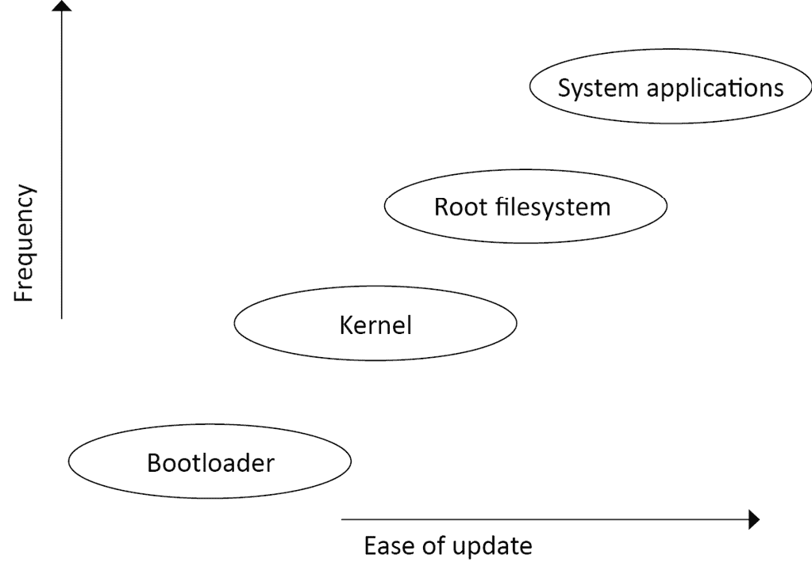
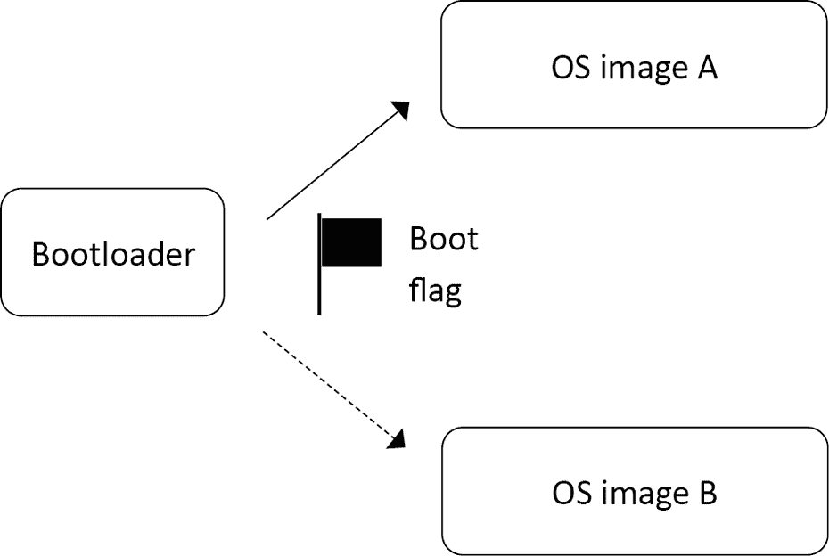
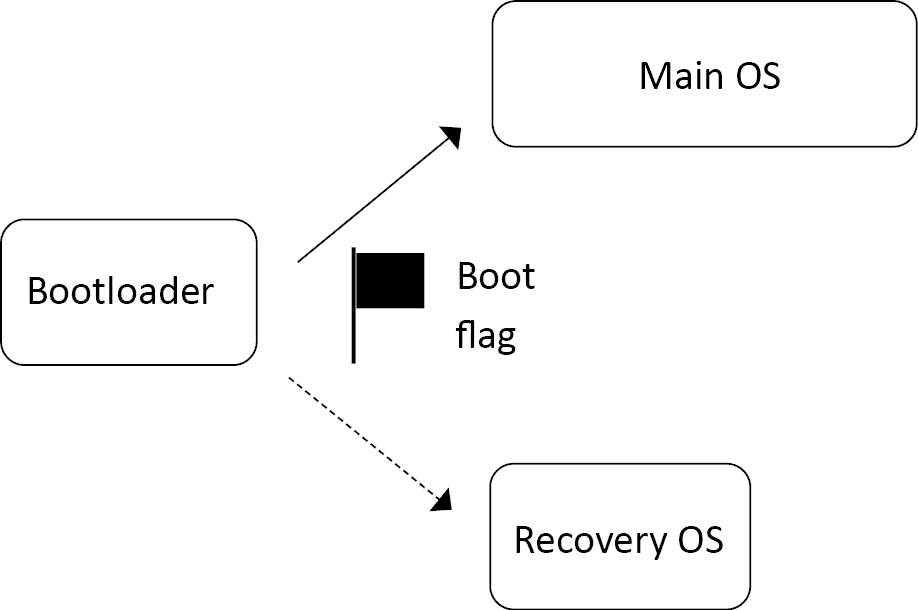
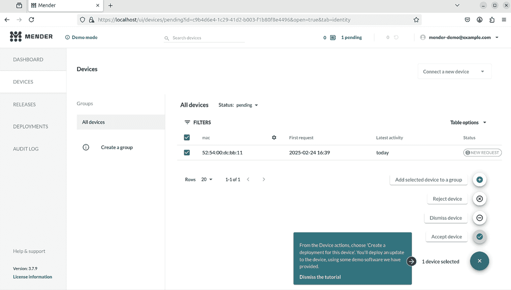
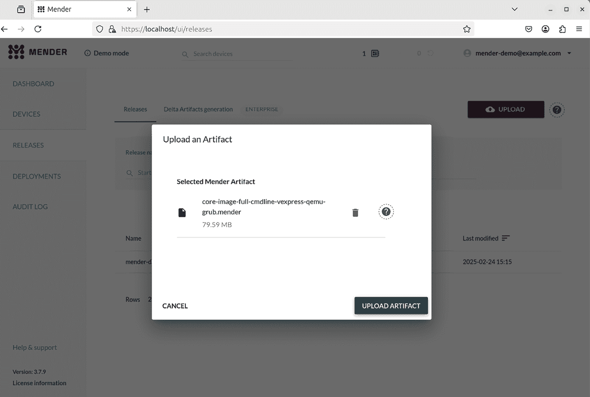
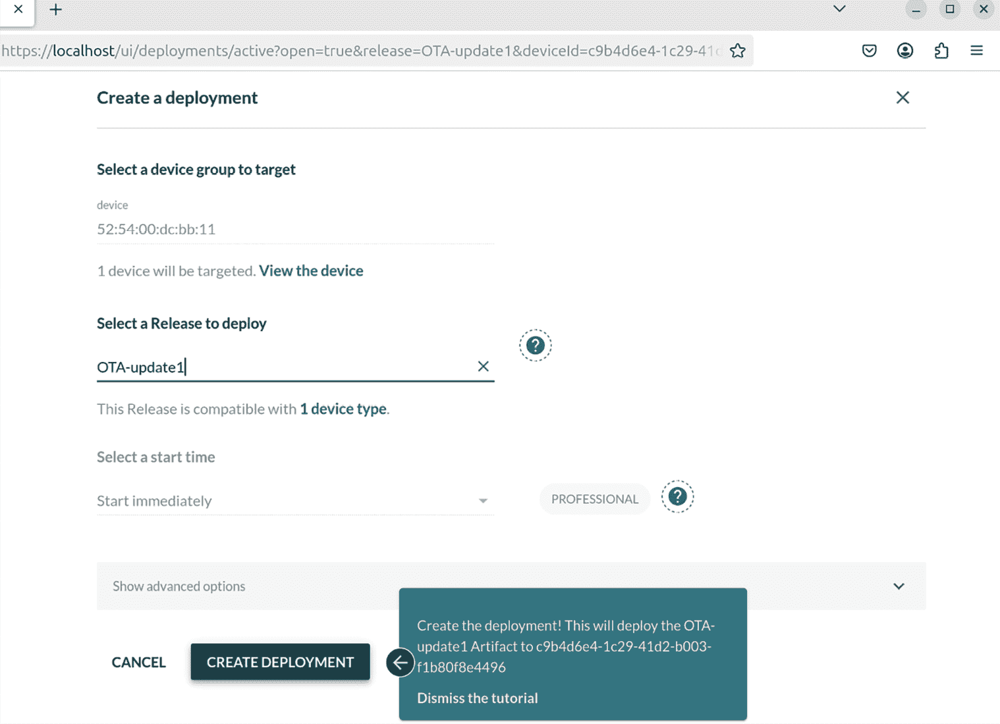
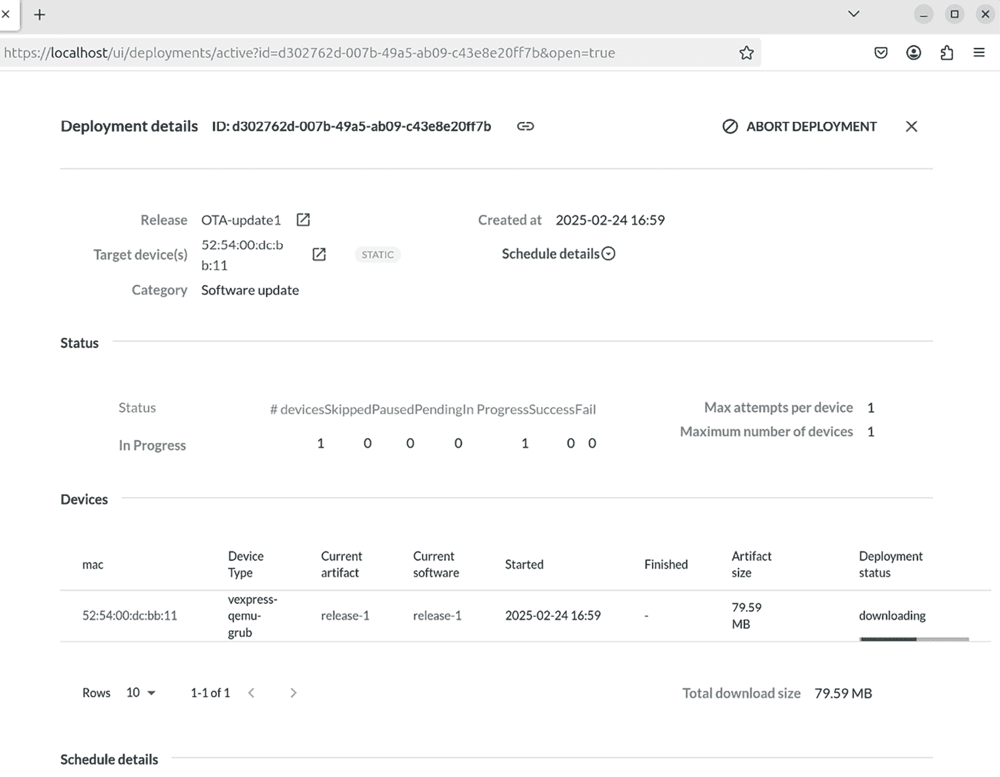

# 现场软件更新

在前几章中，我们讨论了为 Linux 设备构建软件的各种方法，以及如何为各种类型的大容量存储设备创建系统镜像。当你进入生产阶段时，你只需要将系统镜像复制到闪存中，它就可以准备好部署了。现在，我想考虑设备在首次发货后的生命周期。

随着我们进入 *物联网* 时代，我们创建的设备很可能会连接到互联网。同时，软件变得越来越复杂。更多的软件意味着更多的漏洞。连接到互联网意味着这些漏洞可能会被远程利用。因此，我们有一个共同的需求，即能够在 *现场* 更新软件。所谓“现场”是指“工厂之外”。软件更新带来的好处不仅仅是修复漏洞。它们为现有硬件增加新功能并随着时间的推移提高系统性能，从而带来了更多的价值。

本章将涵盖以下主题：

+   更新从哪里来源？

+   更新内容

+   软件更新基础

+   更新机制的类型

+   OTA 更新

+   使用 Mender 进行本地更新

+   使用 Mender 进行 OTA 更新

# 技术要求

为了跟上示例，请确保你拥有以下内容：

+   一台至少有 90 GB 空闲磁盘空间的 Ubuntu 24.04 或更高版本的 LTS 主机系统

+   Yocto 5.0（scarthgap）LTS 版本

你应该已经在 *第六章* 中构建了 Yocto 5.0（scarthgap）LTS 版本。如果没有，请在根据 *第六章* 中的说明在 Linux 主机上构建 Yocto 之前，参考 *Yocto 项目快速构建* 指南中的 *兼容的 Linux 发行版* 和 *构建主机包* 部分 ([`docs.yoctoproject.org/brief-yoctoprojectqs/)`](https://docs.yoctoproject.org/brief-yoctoprojectqs/))。

本章中使用的代码可以在本书 GitHub 仓库中的章节文件夹找到：[`github.com/PacktPublishing/Mastering-Embedded-Linux-Development/tree/main/Chapter10`](https://github.com/PacktPublishing/Mastering-Embedded-Linux-Development/tree/main/Chapter10)。

# 更新从哪里来源？

有许多方法可以进行软件更新。大体上，我将它们归类为以下几种：

+   **本地更新**：由技术人员执行，通过便携介质如 USB 闪存驱动器或 SD 卡携带更新，并需要逐一访问每个系统。

+   **远程更新**：由用户或技术人员在本地发起，但从远程服务器下载。

+   **空中下载更新**（**OTA**）**更新**：完全远程推送和管理，无需任何本地输入。

我将首先描述几种软件更新的方法，然后展示一个使用 Mender 的示例。

# 更新内容

嵌入式 Linux 设备在设计和实现上有很大的多样性。然而，它们都包含这些基本组件：

+   引导加载程序

+   内核

+   根文件系统

+   系统应用程序

+   特定设备的数据

有些组件比其他组件更难更新，如下图所示：



图 10.1 – 更新的组件

让我们逐个查看这些组件。

## 引导加载程序

引导加载程序是处理器上电后运行的第一段代码。处理器找到引导加载程序的方式非常依赖于设备，但在大多数情况下，只有一个这样的地点，因此只能有一个引导加载程序。如果没有备份，更新引导加载程序是有风险的：如果系统在过程中断电会发生什么？因此，大多数更新解决方案都不会更改引导加载程序。这并不是一个大问题，因为引导加载程序在开机时只运行很短的时间，通常不是导致运行时错误的主要源头。

## 内核

Linux 内核是一个关键组件，肯定需要不时进行更新。

内核有多个部分：

+   由引导加载程序加载的二进制映像，通常存储在根文件系统中。

+   许多设备还拥有一个**设备树二进制文件**（**DTB**），它向内核描述硬件，因此必须与内核一起更新。DTB 通常与内核二进制文件一起存储。

+   根文件系统中可能包含内核模块。

内核和 DTB 可以存储在根文件系统中（如果引导加载程序能读取该文件系统格式），也可以存储在专用分区中。在任何一种情况下，拥有冗余副本都是可能的并且更安全。

## 根文件系统

根文件系统包含使系统正常工作的基本系统库、工具和脚本。能够替换和升级所有这些是非常期望的。机制依赖于文件系统的实现。

嵌入式根文件系统的常见格式如下：

+   **RAM 磁盘**：从原始闪存内存或磁盘映像加载。要更新它，只需覆盖 RAM 磁盘映像并重启系统。

+   **只读压缩文件系统（squashfs）**：存储在闪存分区中。由于这些文件系统没有写功能，因此更新它们的唯一方法是将完整的文件系统映像写入分区。

+   **常见文件系统类型**：JFFS2 和 UBIFS 格式通常用于原始闪存内存。对于如 eMMC 和 SD 卡这样的管理型闪存内存，格式可能是 ext4 或 F2FS。由于这些文件系统在运行时可写，因此可以逐文件更新它们。

## 系统应用程序

系统应用程序是设备的主要载荷；它们实现了设备的主要功能。因此，它们可能会频繁更新以修复错误和添加功能。它们可能与根文件系统捆绑在一起，但也常常被放置在单独的文件系统中，以便更容易更新，并且可以保持系统文件（通常是开源的）与应用程序文件（通常是专有的）之间的分离。

## 特定设备的数据

这是运行时修改的文件组合。设备特定的数据包括配置设置、日志、用户提供的数据以及类似的文件。这些数据通常不需要更新，但在更新过程中需要被保留。这些数据需要存储在专用的分区中。

## 需要更新的组件

总结来说，更新可能包括内核、新版本的根文件系统和系统应用。设备会有其他分区，更新时不应该受到干扰，像设备运行时数据一样。

软件更新失败的代价可能是灾难性的。安全的软件更新在企业和家庭互联网环境中都是一个重要问题。在我们能够发货任何硬件之前，我们必须能够自信地更新软件。

# 软件更新基础

更新软件乍一看似乎是一个简单的任务：你只需要用新的文件覆盖旧的文件。但随着你工程师培训的展开，你开始意识到可能出错的地方。假如在更新过程中断电了怎么办？假如在更新测试中漏掉了一个 bug，导致部分设备无法启动怎么办？假如第三方发送了一个假更新，把你的设备纳入了僵尸网络怎么办？至少，软件更新机制必须是：

+   **健壮**，确保更新不会导致设备无法使用。

+   **故障安全**，确保在所有失败时仍有备份模式。

+   **安全**，以防止设备被安装未经授权的更新而被劫持。

换句话说，我们需要一个不容易受到墨菲定律影响的系统。墨菲定律表明，如果某件事有可能出错，那么它最终一定会出错。有些问题并非小事。将软件部署到现场设备与将软件部署到云端是不同的。嵌入式 Linux 系统需要在没有任何人工干预的情况下，检测并应对如内核崩溃或启动循环等意外情况。

## 提高更新的健壮性

你可能认为 Linux 系统更新的问题早已解决——我们都有定期更新的 Linux 桌面（不是吗？）。此外，数据中心里有大量的 Linux 服务器，也同样保持最新。然而，服务器和设备之间是有区别的。前者运行在一个受保护的环境中，不太可能突然失去电源或网络连接。如果更新确实失败了，仍然可以访问服务器，并使用外部机制重新安装。

另一方面，设备往往部署在远程站点，电力不稳定且网络连接差，这使得更新被中断的可能性大大增加。因此，考虑到在更新失败后，获取设备进行修复可能非常昂贵。比如，如果设备是一座山顶的环境监测站，或者是位于海底的油井阀门控制系统怎么办？因此，对于嵌入式设备来说，拥有一个健壮的更新机制尤为重要，以防系统无法使用。

这里的关键词是**原子性**。为了确保原子性，更新过程中不应有任何阶段是系统部分更新的。必须有一个单一且不可中断的更改，来将系统切换到新版本的软件。

这排除了最明显的更新机制：通过在文件系统的部分区域上提取归档文件来单独更新文件。若系统在更新过程中被重置，就无法确保文件的一致性。即使使用`apt`、`dnf`或`pacman`等包管理器也无法解决问题。如果你查看这些包管理器的内部工作机制，会发现它们的确是通过在文件系统上提取归档并运行脚本来配置软件包，既在更新之前，也在更新之后。包管理器在数据中心的受保护环境中，或者在你的桌面上是没问题的，但在设备上却不可行。

为了实现原子性，更新必须与正在运行的系统并行安装，然后切换到新版本的软件。在接下来的章节中，我们将描述实现原子性的两种不同方法。第一种方法是拥有两个根文件系统和其他主要组件的副本。一个副本是活动的，而另一个可以接收更新。当更新完成后，通过切换，重启时引导程序选择更新后的副本。这被称为**对称镜像更新**或**A/B 镜像更新**。这种方法的变种是使用一个特殊的**恢复模式**操作系统，负责更新主操作系统。原子性的保证由引导程序和恢复操作系统共同承担。这被称为**非对称镜像更新**。这是 Android 在 Nougat 7.x 版本之前采用的方法。第二种方法是，在系统分区的不同子目录中拥有两个或多个根文件系统副本，然后在启动时使用`chroot(8)`来选择其中一个副本。一旦 Linux 系统运行，更新客户端可以将更新安装到另一个根文件系统中，完成并检查所有内容后，可以切换并重启。这被称为**原子文件更新**，以**OSTree**为例。

## 使更新具备故障安全性

接下来需要考虑的问题是，如何从一个已正确安装但包含使系统无法启动的代码的更新中恢复。理想情况下，我们希望系统能够检测到这种情况，并回滚到先前的工作镜像。

有几种故障模式可能导致系统无法操作。第一个是内核 panic，通常由内核设备驱动程序中的 bug 或无法运行`init`程序引起。一个合理的起点是通过配置内核，在 panic 后的一定时间内重启。

你可以在构建内核时通过设置`CONFIG_PANIC_TIMEOUT`来实现，或者通过将内核命令行设置为`panic`来实现。例如，要在 panic 后 5 秒重启，可以将`panic=5`添加到内核命令行。

你可能希望进一步配置内核，使其在发生 Oops 错误时触发`panic`。请记住，Oops 是当内核遇到致命错误时生成的。在某些情况下，内核能够从错误中恢复，而在其他情况下则无法恢复。但无论如何，肯定是出现了问题，系统无法正常工作。要在内核配置中启用 Oops 触发 panic，请设置`CONFIG_PANIC_ON_OOPS=y`，或者在内核命令行中设置`oops=panic`。

第二种故障模式发生在内核成功启动`init`后，但由于某种原因，主应用程序无法运行。对此，你需要一个看门狗。**看门狗**是一个硬件或软件定时器，如果定时器未在过期前重置，则会重新启动系统。如果你使用的是`systemd`，你可以使用内置的看门狗功能，我将在*第十三章*中描述。如果没有，你可能需要启用内核源代码中`Documentation/watchdog`描述的 Linux 内置看门狗支持。

这两种故障都会导致**启动循环**：无论是内核 panic 还是看门狗超时，都会导致系统重启。如果问题持续存在，系统将不断重启。要打破启动循环，我们需要在引导加载程序中添加一些代码，检测这种情况并回滚到先前已知的正常版本。一个典型的方法是使用**启动计数**，每次启动时引导加载程序都会递增该计数器，并且一旦系统启动并运行，计数器会在用户空间中被重置为零。如果系统进入启动循环，计数器不会被重置，从而继续增加。然后，配置引导加载程序，当计数器超过阈值时采取补救措施。

在 U-Boot 中，这通过三个变量来处理：

+   `bootcount`：每次处理器启动时递增。

+   `bootlimit`：如果`bootcount`超过`bootlimit`，U-Boot 将执行`altbootcmd`中的命令，而不是`bootcmd`。

+   `altbootcmd`：包含备用启动命令，例如回滚到先前的版本或启动恢复模式操作系统。

为了实现这一功能，必须有一种方法允许用户空间程序重置引导计数。我们可以使用 U-Boot 工具，通过它在运行时访问 U-Boot 环境：

+   `fw_printenv`：打印 U-Boot 变量的值

+   `fw_setenv`：设置 U-Boot 变量的值

这两个命令需要知道 U-Boot 环境块存储的位置，相关的配置文件位于 `/etc/fw_env.config`。例如，如果 U-Boot 环境存储在 eMMC 内存的 `0x800000` 偏移位置，并且有一个备份副本在 `0x1000000`，那么配置文件会如下所示：

```
# cat /etc/fw_env.config
/dev/mmcblk0 0x800000 0x40000
/dev/mmcblk0 0x1000000 0x40000 
```

本节最后需要讨论的一个问题是：每次启动时递增引导计数，并在应用程序启动时重置它，这会导致不必要的写入环境块，从而加速闪存的损耗。为了防止在每次重启时发生这种情况，U-Boot 引入了一个名为 `upgrade_available` 的附加变量。如果 `upgrade_available` 为 `0`，则 `bootcount` 不会递增，因为没有未验证的升级需要防范。在安装更新后，`upgrade_available` 会被设置为 `1`，这样只有在需要时才会启用引导计数保护。

## 让更新变得安全

最后一个问题涉及更新机制本身的潜在滥用。当你实现更新机制时，主要目的是提供一种可靠的自动化或半自动化的方法来安装安全补丁和新功能。然而，其他人可能利用同样的机制安装未经授权的软件版本，并劫持设备。我们需要确保这种情况不会发生。

最大的安全漏洞是伪造的远程更新。为了防止这种情况发生，我们需要在下载开始之前验证更新服务器的身份。同时，我们还需要一个安全的传输通道，例如 HTTPS，以防止下载流的篡改。校验和提供了第二道防线。每个更新都会生成一个校验和，并发布到服务器上。只有在校验和与下载内容匹配时，更新才会被应用。当我描述 OTA 更新时，我会回到服务器身份验证的话题。

还有一个关于镜像真实性的问题。检测伪造更新的一种方法是在引导加载程序中使用安全启动协议。如果内核镜像在工厂时已经用数字密钥签名，引导加载程序可以在加载内核之前检查签名，并在验证失败时拒绝加载。如果制造商保持密钥的私密性，那么就无法加载未经授权的内核。U-Boot 实现了这样的机制，相关内容可以在在线文档中查看：[`docs.u-boot.org/en/latest/usage/fit/verified-boot.html`](https://docs.u-boot.org/en/latest/usage/fit/verified-boot.html.%0D%0A)

**重要提示**

安全启动：是好是坏？

如果我购买了一台具有软件更新功能的设备，那么我就是在信任该设备的供应商提供有用的更新。我绝对不希望一个恶意的第三方在我不知情的情况下安装软件。但是，我是否应该被允许自己安装软件呢？如果我完全拥有该设备，难道我不应有权修改它，包括加载新的软件吗？想想 TiVo 机顶盒，它最终促成了 GPL v3 许可证的诞生。记得 Linksys WRT54G Wi-Fi 路由器吗？当硬件访问变得容易时，它催生了一个全新的产业，包括 OpenWrt 项目。这是一个复杂的问题，位于自由与控制的交汇点。我的观点是，一些设备制造商将安全性作为借口，来保护他们（有时是劣质的）软件。

更新软件可能看起来平凡，但一个坏的更新可能会对你的业务造成灾难性的损害。2024 年 7 月的 CrowdStrike 宕机就是一个完美的例子。出于这个原因，使用蓝绿部署等安全技术逐步推出更新是非常重要的。这样，如果出了问题，你可以回滚软件发布，而不会影响到很多用户。那么，既然我们知道了所需的条件，我们如何在嵌入式 Linux 系统上更新软件呢？

# 更新机制的类型

在本节中，我将介绍三种应用软件更新的方法：对称或 A/B 镜像更新；不对称镜像更新，也称为*恢复模式更新*；最后是原子文件更新。

## 对称镜像更新

在此方案中，有两个操作系统副本，每个副本包括 Linux 内核、根文件系统和系统应用程序。它们在下面的图中标记为**A**和**B**：



图 10.2 – 对称镜像更新

对称镜像更新的工作原理如下：

1.  启动加载程序有一个标志，指示它应该加载哪个镜像。最初，标志被设置为**A**，因此启动加载程序加载操作系统镜像**A**。

1.  要安装更新，更新程序应用程序（操作系统的一部分）会覆盖操作系统镜像**B**。

1.  完成后，更新程序将引导标志更改为**B**并重新启动。

1.  现在，启动加载程序将加载新的操作系统。

1.  当安装进一步更新时，更新程序会覆盖镜像**A**并将引导标志更改为**A**，这样你就会在两个副本之间来回切换。

1.  如果更新在引导标志更改之前失败，启动加载程序将继续加载正常的操作系统。

有几个开源项目实现了对称镜像更新。其中之一是 **Mender** 客户端在独立模式下运行，我将在 *使用 Mender 进行本地更新* 部分中描述。另一个是 **SWUpdate** ([`github.com/sbabic/swupdate`](https://github.com/sbabic/swupdate))，它可以接收多个镜像更新的 CPIO 格式包，然后将这些更新部署到系统的不同部分。它允许你使用 Lua 语言编写插件进行自定义处理。

SWUpdate 还支持原始闪存内存，作为 MTD 闪存分区访问的文件系统，支持组织为 UBI 卷的存储，以及支持具有磁盘分区表的 SD/eMMC 存储。第三个例子是 **RAUC**，即 **稳健的自动更新控制器** ([`github.com/rauc/rauc`](https://github.com/rauc/rauc))。它也支持原始闪存存储、UBI 卷和 SD/eMMC 设备。图像可以使用 OpenSSL 密钥进行签名和验证。第四个例子是 **fwup** ([`github.com/fwup-home/fwup)`](https://github.com/fwup-home/fwup))，由长期的 Buildroot 贡献者 Frank Hunleth 提供。

这种方案有一些缺点。其中之一是通过更新整个文件系统镜像，更新包的大小较大，这可能会对连接设备的网络基础设施造成压力。可以通过仅发送已经更改的文件系统块来缓解这一问题，这需要通过对比新旧文件系统的二进制 `diff` 来完成。SWUpdate、RAUC 和 fwup 都支持这种 **增量更新**。Mender 的商业版也支持这一功能。

第二个缺点是需要为根文件系统及其他组件保留冗余副本的存储空间。如果根文件系统是最大的组件，它几乎会让你需要的闪存内存翻倍，以容纳两个副本。因此，采用非对称更新方案。

## 非对称镜像更新

你可以通过仅保留一个最小化的恢复操作系统用于更新主操作系统，如下所示，从而减少存储需求：



图 10.3 – 非对称镜像更新

要安装非对称更新，请执行以下操作：

1.  设置启动标志指向恢复操作系统并重新启动。

1.  一旦恢复操作系统启动，它可以将更新流式传输到主操作系统镜像。

1.  如果更新被中断，启动加载程序将再次启动到恢复操作系统，这样可以继续更新。

1.  只有当更新完成并经过验证后，恢复操作系统才会清除启动标志并重新启动——这时，将加载新的主操作系统。

1.  在正确但存在漏洞的更新情况下，回退的做法是将系统恢复到恢复模式，系统可以尝试进行修复，可能通过请求较早的更新版本来解决问题。

恢复操作系统通常比主操作系统小得多，可能只有几兆字节，因此存储开销并不大。值得一提的是，这是 Android 在 Nougat 版本之前采用的方案。对于非对称镜像更新的开源实现，请考虑 SWUpdate 或 RAUC。

这种方案的一个主要缺点是，在运行恢复操作系统时，设备无法操作。这样的方案也不允许更新恢复操作系统本身。这将需要类似 A/B 镜像更新的东西，从而败坏了整个目的。

## 原子文件更新

另一种方法是在单个文件系统的多个目录中具有根文件系统的冗余副本，然后在引导时使用 `chroot(8)` 命令选择其中一个。这允许一个目录树在另一个作为根目录被挂载时进行更新。此外，而不是复制在根文件系统版本之间未更改的文件，您可以使用链接。这将节省大量磁盘空间并减少更新包中要下载的数据量。这些是原子文件更新的基本思想。

**重要提示**

`chroot` 命令在现有目录中运行程序。该程序将此目录视为其根目录，因此无法访问更高级别的任何文件或目录。它经常用于在受限环境中运行程序，有时称为 **chroot 监狱**。

**libostree** 项目 ([`github.com/ostreedev/ostree`](https://github.com/ostreedev/ostree))，前身为 **OSTree**，是这一理念最流行的实现。 OSTree 大约在 2011 年开始，作为向 GNOME 桌面开发者部署更新和改进其持续集成测试的手段。

它后来被采用为嵌入式设备的更新解决方案。它是 **Automotive Grade Linux** (**AGL**) 中的一种更新方法，并且通过 `meta-updater` 层在 Yocto Project 中可用，该层由 **Advanced Telematic Systems** (**ATS**) 支持。

使用 OSTree，在目标上的文件存储在 `/ostree/repo/objects` 目录中。它们被命名，使得同一文件的多个版本可以存在于存储库中。然后，一组给定的文件被链接到一个部署目录中，该目录的名称类似于 `/ostree/deploy/os/29ff9…/`。这被称为 *checking out*，因为它与从 Git 存储库中检出分支的方式有一些相似之处。每个部署目录包含组成根文件系统的文件。它们可以有任意数量，但默认情况下只有两个。例如，这里有两个 `deploy` 目录，每个目录都链接回 `repo` 目录：

```
/ostree/repo/objects/...
/ostree/deploy/os/a3c83.../
 /usr/bin/bash
 /usr/bin/echo
/ostree/deploy/os/29ff9.../
 /usr/bin/bash
 /usr/bin/echo 
```

要从 OSTree 目录引导：

1.  引导加载程序使用 `initramfs` 引导内核，并在内核命令行中传递要使用的部署路径：

    ```
    bootargs=ostree=/ostree/deploy/os/deploy/29ff9... 
    ```

1.  `initramfs` 包含一个名为 `ostree-init` 的 `init` 程序，它读取命令行并执行 `chroot` 到指定的路径。

1.  当安装系统更新时，已更改的文件会由 OSTree 安装代理下载到 `repo` 目录中。

1.  完成后，将创建一个新的 `deploy` 目录，其中包含指向将构成新根文件系统的文件集合的链接。其中一些文件是新的，另一些则与之前相同。

1.  最后，OSTree 安装代理将更改启动加载程序的启动标志，以便在下次重启时，它将 `chroot` 到新的 `deploy` 目录。

1.  启动加载程序实现了对启动次数的检查，如果检测到启动循环，它将回退到先前的根目录。

尽管开发人员可以手动在目标设备上操作更新程序或安装客户端，但最终软件更新需要通过 OTA 自动进行。

# OTA 更新

更新 **OTA** 意味着能够通过网络将软件推送到设备或设备组，通常不需要终端用户与设备的互动。为了实现这一点，我们需要一个中央服务器来控制更新过程，并且需要一种协议来将更新下载到更新客户端。在典型的实现中，客户端会定期向更新服务器发送请求，检查是否有待处理的更新。轮询间隔需要足够长，以避免轮询流量占用网络带宽的显著部分，但又要足够短，以便及时传送更新。通常，几十分钟到几个小时的间隔是一个很好的折衷。来自设备的轮询消息包含某种唯一标识符，如序列号或 MAC 地址，以及当前的软件版本。通过这些信息，更新服务器可以判断是否需要更新。轮询消息还可以包含其他状态信息，如运行时间、环境参数或任何对设备的中央管理有用的信息。

更新服务器通常与一个管理系统连接，该系统将为其控制下的各个设备群体分配新的软件版本。如果设备群体很大，可能会分批发送更新，以避免过载网络。通常会有某种状态显示，展示设备的当前状态，并突出显示问题。

当然，更新机制必须是安全的，以防止虚假的更新被发送到终端设备。这涉及到客户端和服务器通过交换证书相互认证。然后，客户端可以验证下载的包是否由预期的密钥签名。

这里有三个开源项目的示例，你可以用来进行 OTA 更新：

+   管理模式下的 Mender

+   balena

+   Eclipse hawkBit ([`github.com/eclipse/hawkbit)`](https://github.com/eclipse/hawkbit) 与像 SWUpdate 或 RAUC 这样的更新客户端配合使用

我们将详细介绍 Mender。

# 使用 Mender 进行本地更新

说到理论，接下来我会展示这些原理在实践中的应用。第一组示例涉及 Mender。Mender 使用对称的 A/B 镜像更新机制，并在更新失败时提供回退功能。它可以在*独立模式*下进行本地更新，也可以在*托管模式*下进行 OTA 更新。我将从独立模式开始。

Mender 是由 Northern.tech 编写和支持的。关于该软件的更多信息可以在官网的**文档**部分找到（[`mender.io`](https://mender.io)）。我不会深入讲解软件的配置，因为我的目的是阐述软件更新的原理。我们从 Mender 客户端开始。

## 构建 Mender 客户端

Mender 客户端作为一个 Yocto 元层可用。这里的示例使用的是 The Yocto Project 的 scarthgap 版本，和我们在*第六章*中使用的版本相同。

首先通过以下方式获取`meta-mender`层：

```
$ git clone -b scarthgap https://github.com/mendersoftware/meta-mender 
```

在克隆`meta-mender`层之前，你需要先导航到`poky`目录的上一级，这样两个目录就会在同一层级并排放置。

Mender 客户端需要对 U-Boot 配置进行一些更改，以处理引导标志和引导计数变量。标准的 Mender 客户端层有一些子层，提供了 U-Boot 集成的示例实现，我们可以直接使用，例如`meta-mender-qemu`和`meta-mender-raspberrypi`。我们将使用 QEMU。

下一步是创建构建目录，并为此配置添加相关层：

```
$ source poky/oe-init-build-env build-mender-qemu
$ bitbake-layers add-layer ../meta-openembedded/meta-oe
$ bitbake-layers add-layer ../meta-mender/meta-mender-core
$ bitbake-layers add-layer ../meta-mender/meta-mender-demo
$ bitbake-layers add-layer ../meta-mender/meta-mender-qemu 
```

然后，我们需要通过向`conf/local.conf`添加一些设置来配置环境：

```
1 MENDER_ARTIFACT_NAME = "release-1"
2 INHERIT += "mender-full"
3 MACHINE = "vexpress-qemu"
4 INIT_MANAGER = "systemd"
5 IMAGE_FSTYPES = "ext4" 
```

从`conf/local.conf`中省略行号（*1* 到 *5*）。*第 2 行*包含一个名为`mender-full`的 BitBake 类，负责处理生成 A/B 镜像格式所需的特殊图像处理。*第 3 行*选择了一个名为`vexpress-qemu`的机器，它使用 QEMU 来模拟 Arm Versatile Express 开发板，而不是 Yocto 项目的默认开发板 Versatile PB。*第 4 行*选择了`systemd`作为初始化守护进程，替代默认的 System V `init`。我将在*第十三章*中更详细地描述`init`守护进程。*第 5 行*使得根文件系统镜像生成`ext4`格式。

现在我们可以构建镜像：

```
$ bitbake core-image-full-cmdline 
```

和往常一样，构建的结果保存在 `tmp/deploy/images/vexpress-qemu` 中。你会注意到与我们之前做过的 Yocto 项目构建相比，这里有一些新变化。这里有一个名为 `core-image-full-cmdline-vexpress-qemu-grub-<timestamp>.mender` 的文件，另一个文件名类似，但以 `.uefiimg` 结尾。`.mender` 文件是下一个小节中所需的：*使用 Mender 安装更新*。`.uefiimg` 文件是通过 Yocto 项目中的工具 `wic` 创建的。输出的是一个包含分区表的镜像，准备好可以直接复制到 SD 卡或 eMMC 芯片上。

我们可以使用 Mender 层提供的脚本运行 QEMU 目标，脚本会先启动 U-Boot，然后加载 Linux 内核：

```
$ ../meta-mender/meta-mender-qemu/scripts/mender-qemu
<…>
[  OK  ] Started Boot script to demo Mender OTA updates.
[  OK  ] Started Periodic Command Scheduler.
         Starting D-Bus System Message Bus...
[  OK  ] Started Getty on tty1.
         Starting IPv6 Packet Filtering Framework...
         Starting IPv4 Packet Filtering Framework...
         Starting Mender-configure device configuration...
[  OK  ] Started Serial Getty on ttyAMA0.
<…>
[  OK  ] Finished Wait for Network to be Configured.
[  OK  ] Started Time & Date Service.
[  OK  ] Finished Mender-configure device configuration.
Poky (Yocto Project Reference Distro) 5.0.7 vexpress-qemu ttyAMA0
vexpress-qemu login: 
```

如果不是登录提示符，而是出现类似这样的错误：

```
mender-qemu: 117: qemu-system-arm: not found 
```

然后在系统上安装 `qemu-system-arm` 并重新运行脚本：

```
$ sudo apt install qemu-system-arm 
```

以 `root` 用户身份登录，无需密码。查看目标上的分区布局，我们可以看到以下内容：

```
# fdisk -l /dev/mmcblk0
Disk /dev/mmcblk0: 1 GiB, 1073741824 bytes, 2097152 sectors
Units: sectors of 1 * 512 = 512 bytes
Sector size (logical/physical): 512 bytes / 512 bytes
I/O size (minimum/optimal): 512 bytes / 512 bytes
Disklabel type: gpt
Disk identifier: 00000000-0000-0000-0000-00004D9B9EF0
Device           Start     End Sectors  Size Type
/dev/mmcblk0p1   16384   49151   32768   16M EFI System
/dev/mmcblk0p2   49152  933887  884736  432M Linux filesystem
/dev/mmcblk0p3  933888 1818623  884736  432M Linux filesystem
/dev/mmcblk0p4 1818624 2097118  278495  136M Linux filesystem 
```

总共有四个分区：

+   **分区 1** 包含 U-Boot 启动文件。

+   **分区 2 和 3** 包含 A/B 根文件系统（此时相同）。

+   **分区 4** 只是一个扩展分区，包含剩余的空间。

运行 `mount` 命令可以看到，第二个分区被用作根文件系统，第三个分区用来接收更新：

```
# mount | head -1
/dev/mmcblk0p2 on / type ext4 (rw,relatime) 
```

现在 Mender 客户端已经安装，我们可以开始安装更新。

## 使用 Mender 安装更新

现在我们想对根文件系统进行更改，然后将其安装为更新：

1.  打开另一个终端，并进入工作构建目录：

    ```
    $ source poky/oe-init-build-env build-mender-qemu 
    ```

1.  复制我们刚刚构建的镜像。这将是我们要更新的实时镜像：

    ```
    $ cd tmp/deploy/images/vexpress-qemu
    $ cp core-image-full-cmdline-vexpress-qemu-grub.uefiimg \
    core-image-live-vexpress-qemu-grub.uefiimg
    $ cd - 
    ```

如果我们不这么做，QEMU 脚本将只加载 BitBake 生成的最新镜像，包括更新内容，这样就达不到演示的目的。

1.  接下来，修改目标的主机名，这样安装时会很容易看到。为此，编辑 `conf/local.conf` 并添加这一行：

    ```
    hostname:pn-base-files = "vexpress-qemu-release2" 
    ```

1.  现在我们可以像之前一样构建镜像：

    ```
    $ bitbake core-image-full-cmdline 
    ```

这次我们不关心 `.uefiimg` 文件，它包含一个全新的镜像。相反，我们只关心新的根文件系统，它位于 `core-image-full-cmdline-vexpress-qemu-grub.mender` 中。`.mender` 文件的格式是 Mender 客户端可以识别的。`.mender` 文件格式包括版本信息、头部和捆绑在一起的根文件系统镜像，并以压缩 `.tar` 格式打包。

1.  下一步是将新生成的工件部署到目标设备，并在设备上本地启动更新，但从服务器接收更新。通过按 *Ctrl + A* 然后 *x* 停止之前终端会话中启动的仿真器。这一步确保 QEMU 启动时使用的是之前的镜像，而不是最新的镜像。要用之前的镜像启动 QEMU：

    ```
    $ ../meta-mender/meta-mender-qemu/scripts/mender-qemu \
    core-image-live 
    ```

1.  检查网络配置，QEMU 的 IP 地址为 `10.0.2.15`，主机的 IP 地址为 `10.0.2.2`：

    ```
    # ping 10.0.2.2
    PING 10.0.2.2 (10.0.2.2) 56(84) bytes of data.
    64 bytes from 10.0.2.2: icmp_seq=1 ttl=255 time=0.842 ms
    ^C
    --- 10.0.2.2 ping statistics ---
    1 packets transmitted, 1 received, 0% packet loss, time 0ms
    rtt min/avg/max/mdev = 0.842/0.842/0.842/0.000 ms 
    ```

1.  现在，在另一个终端会话中，启动一个主机上的 Web 服务器，能够提供更新：

    ```
    $ cd tmp/deploy/images/vexpress-qemu
    $ python3 -m http.server
    Serving HTTP on 0.0.0.0 port 8000 (http://0.0.0.0:8000/) ... 
    ```

1.  它正在监听 `8000` 端口。完成 Web 服务器的操作后，按 *Ctrl + C* 来终止它。

1.  回到目标设备，执行此命令以获取更新：

    ```
    # mender-update --log-level info install \
    > http://10.0.2.2:8000/core-image-full-cmdline-vexpress-qemu-grub.mender
    Installing artifact...
    100%
    <…>
    Installed, but not committed.
    Use 'commit' to update, or 'rollback' to roll back the update.
    At least one payload requested a reboot of the device it updated. 
    ```

更新已写入第三个分区（`/dev/mmcblk0p3`），而我们的根文件系统仍然位于第二个分区（`/dev/mmcblk0p2`）。

1.  通过在 QEMU 命令行输入 `reboot` 重启 QEMU。注意，现在根文件系统已挂载在分区 3 上，且主机名已更改：

    ```
    # mount
    /dev/mmcblk0p3 on / type ext4 (rw,relatime)
    <…>
    # hostname
    vexpress-qemu-release2 
    ```

成功！

1.  还有一件事需要做。我们需要考虑启动循环的问题。使用 `grub-mender-grubenv-print` 查看相关的 U-Boot 变量：

    ```
    # grub-mender-grubenv-print upgrade_available
    upgrade_available=1
    # grub-mender-grubenv-print bootcount
    bootcount=1 
    ```

如果系统在重启时没有清除 `bootcount`，U-Boot 应该检测到并回退到先前的安装版本。

让我们测试 U-Boot 的回退行为：

1.  立即重启 QEMU 目标设备。

当目标设备再次启动时，我们看到 U-Boot 已回退到先前的安装版本：

```
# mount
/dev/mmcblk0p2 on / type ext4 (rw,relatime)
<…>
# hostname
vexpress-qemu 
```

1.  现在，让我们重复更新过程：

    ```
    # mender-update rollback
    Rolled back.
    # mender-update --log-level info install \
    > http://10.0.2.2:8000/core-image-full-cmdline-vexpress-qemu-grub.mender
    # reboot 
    ```

1.  这次，在重启后，提交更改：

    ```
    # mender-update commit
    Committed.
    # grub-mender-grubenv-print upgrade_available
    upgrade_available=0
    # grub-mender-grubenv-print bootcount
    bootcount=1 
    ```

一旦 `upgrade_available` 被清除，U-Boot 将不再检查 `bootcount`，因此设备将继续挂载此更新后的根文件系统。当加载进一步的更新时，Mender 客户端将清除 `bootcount` 并重新设置 `upgrade_available`。

这个例子使用了来自命令行的 Mender 客户端来本地启动更新。更新本身来自服务器，但也可以通过 USB 闪存驱动器或 SD 卡提供。我们本可以使用提到的其他镜像更新客户端：SWUpdate、RAUC 或 fwup。它们各有优点，但基本的技术方法是相同的。

# 使用 Mender 进行 OTA 更新

我们将再次使用设备上的 Mender 客户端，但这次以托管模式运行。此外，我们将配置一个服务器来部署更新，以便无需本地交互。Mender 提供了一个开源服务器用于此目的。有关如何设置此演示服务器的文档，请参见 [`docs.mender.io/2.4/getting-started/on-premise-installation.`](https://docs.mender.io/2.4/getting-started/on-premise-installation)

安装需要 Docker Engine 版本 19.03 或更高版本，还需要 Docker Compose 版本 1.25 或更高版本。有关每个版本的详细信息，请参见 Docker 官网 [`docs.docker.com/engine/install/`](https://docs.docker.com/engine/install/) 和 [`docs.docker.com/compose/install/`](https://docs.docker.com/compose/install/)。

要验证系统中安装的 Docker 和 Docker Compose 的版本，请使用以下命令：

```
$ docker --version
Docker version 26.1.3, build 26.1.3-0ubuntu1~24.04.1
$ docker-compose --version
docker-compose version 1.29.2, build unknown 
```

Docker Compose 从 2022 年开始与 Docker 一起捆绑。如果第二个命令失败，请尝试不带短横线调用 Docker Compose：

```
$ docker compose 
```

Mender 服务器还需要一个名为 `jq` 的命令行 JSON 解析器：

```
$ sudo apt install jq 
```

一旦安装了这三者，按照如下步骤安装 Mender 集成环境：

```
$ git clone -b \
3.7.9 https://github.com/mendersoftware/integration.git integration-3.7.9
$ cd integration-3.7.9
$ ./demo up
Starting the Mender demo environment...
<…>
Creating a new user...
****************************************
Username: mender-demo@example.com
Login password: F26E0B14587A
****************************************
Please keep the password available, it will not be cached by the login script.
Mender demo server ready and running in the background. Copy credentials above and log in at https://localhost
Press Enter to show the logs.
Press Ctrl-C to stop the backend and quit. 
```

当你运行`./demo up`时，你会看到脚本下载几百兆字节的 Docker 镜像，具体时间取决于你的网络连接速度。过一会儿，你会看到它创建了一个新的演示用户和密码。这意味着服务器已经启动并运行。

现在，Mender 网络界面已在`https://localhost/`上运行，打开浏览器访问该网址并接受弹出的证书警告。该警告出现是因为 Web 服务使用了一个浏览器无法识别的自签名证书。输入 Mender 服务器生成的用户名和密码登录页面。

现在我们需要对目标的配置进行更改，以便它可以轮询我们本地的服务器以获取更新。为了演示，我们通过在`hosts`文件中添加一行，将`docker.mender.io`和`s3.docker.mender.io`的服务器 URL 映射到`10.0.2.2`本地主机地址。使用 Yocto 项目进行此更改，请按照以下步骤操作：

1.  首先，导航到 Yocto 克隆目录的上一层目录。

1.  接下来，创建一个层，文件内容为追加创建`hosts`文件的配方，即`recipes-core/base-files/base-files_%.bbappend`。

1.  在`MELD/Chapter10/meta-ota`中已经有一个合适的层，你可以复制它：

    ```
    $ cp -a MELD/Chapter10/meta-ota . 
    ```

1.  源代码工作构建目录：

    ```
    $ source poky/oe-init-build-env build-mender-qemu 
    ```

1.  添加`meta-ota`层：

    ```
    $ bitbake-layers add-layer ../meta-ota 
    ```

现在你的层结构应该包含八个层，包括`meta-oe`、`meta-mender-core`、`meta-mender-demo`、`meta-mender-qemu`和`meta-ota`。

1.  使用以下命令构建新的镜像：

    ```
    $ bitbake core-image-full-cmdline 
    ```

1.  然后，制作一份副本。这将是我们这次会话的实时镜像：

    ```
    $ cd tmp/deploy/images/vexpress-qemu
    $ cp core-image-full-cmdline-vexpress-qemu-grub.uefiimg \
    core-image-live-ota-vexpress-qemu-grub.uefiimg
    $ cd - 
    ```

1.  停止任何你可能已启动的模拟器，方法是在该终端会话中按 *Ctrl + A* 然后按 *x*。

1.  启动实时镜像：

    ```
    $ ../meta-mender/meta-mender-qemu/scripts/mender-qemu \
    core-image-live-ota 
    ```

1.  几秒钟后，你会在 Web 界面的仪表板上看到一个新设备。这发生得非常快，因为 Mender 客户端被配置为每 5 秒轮询一次服务器，以演示系统。生产环境中会使用更长的轮询间隔——推荐使用 30 分钟。

1.  查看如何配置轮询间隔，可以通过查看目标上的`/etc/mender/mender.conf`文件来了解：

    ```
    # cat /etc/mender/mender.conf
    {
     "InventoryPollIntervalSeconds": 5,
     "RetryPollIntervalSeconds": 30,
     "ServerURL": "https://docker.mender.io",
     "TenantToken": "dummy",
     "UpdatePollIntervalSeconds": 5
    } 
    ```

注意文件中也有服务器 URL。

1.  返回 Web UI，点击绿色勾选按钮以授权新设备：



图 10.4 – 接受设备

1.  然后，点击设备条目查看详细信息。

再次创建一个更新并进行部署——这次是 OTA：

1.  更新`conf/local.conf`中的以下行：

    ```
    MENDER_ARTIFACT_NAME = "OTA-update1" 
    ```

1.  再次构建镜像：

    ```
    $ bitbake core-image-full-cmdline 
    ```

这将在`tmp/deploy/images/vexpress-qemu`目录下生成一个新的`core-image-full-cmdline-vexpress-qemu-grub.mender`文件。

1.  通过打开**发布**标签并点击紫色的**上传**按钮，将其导入到 Web 界面中。

1.  浏览`tmp/deploy/images/vexpress-qemu`中的`core-image-full-cmdline-vexpress-qemu-grub.mender`文件并上传它：



图 10.5 – 上传一个工件

Mender 服务器应该将文件复制到服务器数据存储中，并且一个名为**OTA-update1**的新工件应该出现在**发布**下。

要将更新部署到我们的 QEMU 设备，请执行以下操作：

1.  点击**设备**标签并选择设备。

1.  点击设备信息右下角的**为此设备创建部署**选项。

1.  选择**OTA-update1**工件并点击**创建部署**按钮：



图 10.6 – 创建一个部署

部署应该很快从**待定**转为**进行中**。

1.  点击**查看详情**按钮。



图 10.7 – 进行中

1.  大约 13 分钟后，Mender 客户端应该完成将更新写入备用文件系统镜像的操作。此时，QEMU 将重新启动并提交更新。网页 UI 应该显示**完成**，此时客户端正在运行**OTA-update1**。

Mender 很简洁，并被广泛应用于许多商业产品中，但有时我们只希望尽可能快速地将一个软件项目部署到少量流行的开发板上。

**提示**

在进行几次 Mender 服务器实验后，您可能想要清除状态并重新开始。您可以通过在`integration-3.7.9`目录下执行这两个命令来实现：

```
./demo down
./demo up 
```

容器是将软件部署到边缘设备的最快方式。我们将在*第十六章*中再次讨论容器化的软件更新。

# 使用 SWUpdate 进行本地更新

与 Mender 类似，SWUpdate 使用对称的 A/B 镜像更新机制，如果更新失败，则会回滚。SWUpdate 可以接收多个 CPIO 格式的镜像更新包，并将这些更新部署到系统的不同部分。它允许您用 Lua 语言编写插件进行自定义处理。Lua 是一种功能强大的脚本语言，容易嵌入到应用程序中。SWUpdate 是一个客户端解决方案，因此与 Mender 不同，它没有相应的企业托管计划需要支付费用。相反，您可以使用像 hawkBit 这样的工具部署自己的 OTA 服务器。

SWUpdate 项目 ([`github.com/sbabic/swupdate)`](https://github.com/sbabic/swupdate) 由 Stefano Babic 发起并且持续维护，Stefano 是 DENX Software Engineering 的员工，该公司也是 U-Boot 背后的团队。该项目有丰富的文档([`sbabic.github.io/swupdate/)`](https://sbabic.github.io/swupdate/)，从稳健和故障安全更新的动机开始，随后清晰地解释了各种更新策略。

# 总结

能够在现场设备上更新软件至少是一个有用的特性。如果设备连接到互联网，那么在现场更新软件就绝对是必须的。然而，往往这个特性被推到项目的最后部分，因为人们认为这不是一个难以解决的问题。在这一章中，我希望我已经阐明了设计一个有效且稳健的更新机制所涉及的各种问题。此外，还有多个开源选项可以直接使用。现在，你不必再重新发明轮子了。

最常用的两种方法是对称镜像（A/B）更新或它的变种，非对称（恢复）镜像更新。在这里，你可以选择 SWUpdate、RAUC、Mender 和 fwup。最近的一项创新是以 OSTree 形式出现的原子文件更新。原子文件更新减少了需要下载的数据量以及目标设备上需要安装的冗余存储空间。最后，随着 Docker 的普及，人们开始渴望容器化的软件更新。这就是 balena 所采用的方法。

通过访问每个站点并从 USB 存储器或 SD 卡上应用更新，在小范围内部署更新是很常见的。然而，如果你想部署到远程地点，或进行大规模部署，那么就需要一个 OTA 更新选项。

下一章将描述如何通过设备驱动程序控制系统的硬件组件，既包括作为内核一部分的传统驱动程序，也包括你如何在用户空间中控制硬件的程度。
