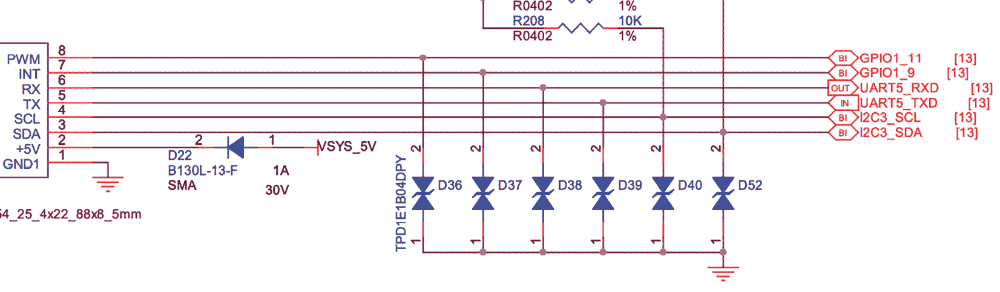
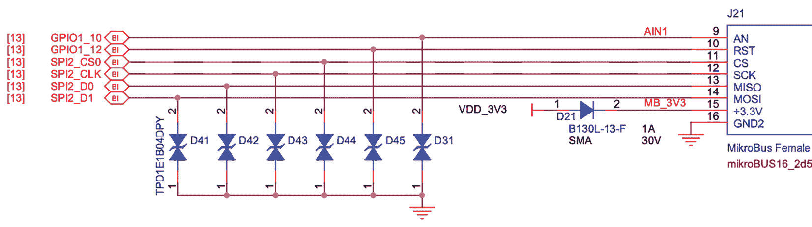
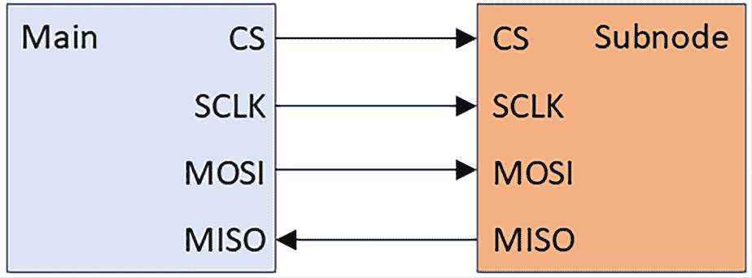

# 12

# 使用扩展板进行原型设计

**定制板的启用**是嵌入式 Linux 工程师一遍又一遍需要做的事情。假设一个消费电子产品制造商想要构建一款新设备，并且该设备需要运行 Linux。在硬件准备就绪之前，Linux 镜像的组装过程就已经开始，并且通过将 SBC 和扩展板拼接在一起的原型来完成。验证了概念验证后，初步的原型 PCB 将与外设一起制作。没有什么比看到定制板首次启动到 Linux 系统中更令人满意的经历了。

BeaglePlay 在单板计算机（SBC）中独树一帜，因为它具有一个 mikroBUS 插槽，可以快速实现即插即用的外设扩展。几乎任何硬件外设，都可以找到相应的 MikroE Click 扩展板。在本章中，我们将集成 GNSS 接收器、环境传感器模块和 OLED 显示屏与 BeaglePlay。利用 mikroBUS 消除了阅读原理图和布线面包板的需要，这样你就能将更多时间花在编写应用程序上，而不是在硬件调试上。

使用真实硬件进行快速原型设计涉及大量的试错。借助完整的 Debian Linux 发行版，我们可以使用主流工具，如 `git`、`pip3` 和 `python3`，直接在 BeaglePlay 上开发软件。

本章将涵盖以下主题：

+   将原理图映射到引脚

+   使用扩展板进行原型设计

+   测试硬件外设

# 技术要求

为了跟随示例，确保你拥有以下设备：

+   一台 Ubuntu 24.04 或更高版本的 LTS 主机系统

+   一个 microSD 卡读卡器和卡

+   适用于 Linux 的 balenaEtcher

+   一个 BeaglePlay

+   一个能够提供 3A 电流的 5V USB-C 电源

+   一个带有 3.3V 逻辑电平的 USB 转 TTL 串口电缆

+   一根以太网线和一个带有可用端口的路由器，用于网络连接

+   一个 MikroE-5764 GNSS 7 Click 扩展板

+   一个外部有源 GNSS 天线

+   一个 MikroE-5546 环境 Click 扩展板

+   一个 MikroE-5545 OLED C Click 扩展板

本章使用的代码可以在本书 GitHub 仓库的章节文件夹中找到：[`github.com/PacktPublishing/Mastering-Embedded-Linux-Development/tree/main/Chapter12`](https://github.com/PacktPublishing/Mastering-Embedded-Linux-Development/tree/main/Chapter12)。

# 将原理图映射到引脚

因为 BeaglePlay 的 **物料清单**（**BOM**）、PCB 设计文件和原理图都是开源的，任何人都可以将 BeaglePlay 制作为他们的消费产品的一部分。由于 BeaglePlay 主要用于开发，它包含了一些生产中可能不需要的组件，例如以太网端口、USB 端口和 microSD 卡槽。作为开发板，BeaglePlay 也可能缺少一个或多个应用所需的外设，例如传感器、LTE 调制解调器或 OLED 显示屏。

BeaglePlay 采用的是德州仪器的 AM6254 处理器，这是一款四核 64 位 Arm Cortex-A53 SoC，配备了**可编程实时单元**（**PRU**）和 M4 微控制器。与 Raspberry Pi 4 相似，BeaglePlay 具有内置 Wi-Fi 和蓝牙。与其他 SBC 不同，它还具有一个可编程无线电，支持亚 GHz 和 2.4 GHz 低功耗无线通信。虽然 BeaglePlay 非常多功能，但在某些情况下，你可能想围绕 AM6254 设计自己的定制 PCB，以降低最终产品的成本。

在 *第十一章* 中，我们讨论了如何将以太网适配器绑定到 Linux 设备驱动的示例。外设绑定通过设备树源代码或 C 结构体（即平台数据）进行。多年来，设备树源代码已成为绑定到 Linux 设备驱动的首选方式，特别是在 Arm SoC 上。与 U-Boot 一样，将设备树源代码编译为 DTB 也是 Linux 内核构建过程的一部分。

如果你需要从本地网络到云端传输大量数据包，那么运行 Linux 是一个明智的选择，因为它具有非常成熟的 TCP/IP 网络栈。BeaglePlay 的 Arm Cortex-A53 CPU 满足运行主流 Linux 的要求（足够的可寻址内存和内存管理单元）。这意味着你的产品可以受益于 Linux 内核的安全性和错误修复。

现在我们已经选择了 SBC，接下来让我们看看 BeaglePlay 的原理图。

## 阅读原理图

BeaglePlay 配备了 mikroBUS 插座以及 Grove 和 QWIIC 接口，用于连接附加板。在这三种标准中，mikroBUS 是唯一一个具有 UART、I2C 和 SPI 通信端口，以及**模拟到数字转换器**（**ADC**）、**脉冲宽度调制**（**PWM**）和 GPIO 功能的标准。在选择 SBC 进行开发时，可以考虑 I/O 扩展选项。更多选项意味着在原型设计时可以选择更多外设模块。

在有选择的情况下，我通常在生产中选择 SPI 而不是 UART 和 I2C。许多 SoC 上的 UART 数量有限，通常保留用于蓝牙和/或串行控制台。I2C 驱动程序和硬件可能存在严重的 Bug。有些 I2C 内核驱动实现得非常糟糕，当连接过多外设同时通信时，总线可能会锁死。其他时候，Bug 可能出现在硬件上。广受诟病的 Broadcom SoC 中的 I2C 控制器（例如 Raspberry Pi 4 中的控制器）在外设尝试执行**时钟拉伸**时容易出现故障。时钟拉伸是指 I2C 子节点设备临时减慢或停止总线时钟。

每个 mikroBUS 插座由两对 1x8 母头排针组成。我们可以在 BeaglePlay 的原理图第 22 页找到这两个排针条（[`github.com/beagleboard/beagleplay/blob/main/BeaglePlay_sch.pdf`](https://github.com/beagleboard/beagleplay/blob/main/BeaglePlay_sch.pdf)）。

这是 BeaglePlay 的 mikroBUS 插座的右侧排针：



图 12.1 – mikroBUS 插槽（右侧接头条带）

引脚 1 连接地，引脚 2 输出 5V。引脚 3（I2C3_SDA）和引脚 4（I2C3_CL）连接到 BeaglePlay 的 I2C3 总线。引脚 5（UART5_TXD）和引脚 6（UART5_RXD）连接到 BeaglePlay 的 UART5。引脚 7（GPIO1_9）和引脚 8（GPIO1_11）是 GPIO，其中引脚 7 作为中断使用，引脚 8 作为 PWM 使用。

这是 BeaglePlay 的 mikroBUS 插槽左侧接头条带：



图 12.2 – mikroBUS 插槽（左侧接头条带）

引脚 9（GPIO1_10）和引脚 10（GPIO1_12）是 GPIO，其中引脚 9 作为模拟输入，引脚 10 作为复位功能使用。引脚 11（SPI2_CS0）、12（SPI2_CLK）、13（SPI2_D0）和 14（SPI2_D1）连接到 BeaglePlay 的 SPI2 总线。最后，引脚 15 输出 3.3V，引脚 16 连接地。

请注意，SPI2 总线有 CS0、CLK、D0 和 D1 线路。CS 代表芯片选择。由于每个 SPI 总线都是主从节点接口，拉低 CS 信号线通常用于选择总线上要传输的外设。此种负逻辑被称为**低有效**。CLK 代表时钟，并且总是由总线主设备生成，在此案例中是 AM6254。通过 SPI 总线传输的数据与此 CLK 信号同步。SPI 支持比 I2C 更高的时钟频率。D0 数据线对应主设备输入，从设备输出（MISO）。

D1 数据线对应主设备输出，从设备输入（MOSI）。SPI 是一个全双工接口，这意味着主设备和选中的从设备可以同时发送数据。

这里是一个块图，展示了四个 SPI 信号的方向：



图 12.3 – SPI 信号

现在让我们启用 BeaglePlay 上的 mikroBUS。最快的方法是从 BeagleBoard.org 安装一个预构建的 Debian 镜像。

## 在 BeaglePlay 上安装 Debian

[BeagleBoard.org](https://BeagleBoard.org) 提供适用于其各种开发板的 Debian 镜像。Debian 是一个流行的 Linux 发行版，包含了一个全面的开源软件包集合。它是一个庞大的项目，全球各地的贡献者共同参与。为各种 BeagleBoard 构建 Debian 的方式不同于嵌入式 Linux 的标准做法，因为这个过程不依赖于交叉编译。与其尝试为 BeaglePlay 自己构建 Debian 镜像，不如直接从 BeagleBoard.org 下载一个已经完成的镜像。

要下载并解压 BeaglePlay 的 Debian Bookworm minimal eMMC flasher 镜像，请使用以下命令：

```
$ wget https://files.beagle.cc/file/beagleboard-public-2021/images/beagleplay-emmc-flasher-debian-12.7-minimal-arm64-2024-09-04-8gb.img.xz
$ xz -d beagleplay-emmc-flasher-debian-12.7-minimal-arm64-2024-09-04-8gb.img.xz 
```

如果上述链接损坏，请访问[`beagleboard.org/distros`](https://beagleboard.org/distros)获取当前可供下载的 Debian 镜像列表。[BeagleBoard.org](https://BeagleBoard.org)可能会删除一些过时的 Debian 镜像链接，因为长期维护 Debian 发布版本需要大量成本和劳动力。

在撰写时，基于 AM6254 的 BeaglePlay 板的最新 Debian 映像为 12.7。主版本号 12 表明 12.7 是 Debian Bookworm LTS 版本。由于 Debian 12.0 最初发布于 2023 年 6 月 10 日，Bookworm 应该从该日期起获得长达 5 年的更新。

**重要提示**

如果可能，请在本章的练习中下载版本 12.7（也称为 Bookworm），而不是从[BeagleBoard.org](https://BeagleBoard.org)获取最新的 Debian 映像。BeaglePlay 的引导加载程序、内核、DTB 和命令行工具经常变化，因此后续说明可能无法与较新的 Debian 版本一起使用。

现在，您有了 BeaglePlay 的 Debian 闪存映像，请将其写入 microSD 卡：

1.  将 microSD 卡插入 Linux 主机。

1.  启动 balenaEtcher。

1.  从**Etcher**中点击**从文件闪存**。

1.  找到您从 BeagleBoard.org 下载并打开的`img`文件。

1.  从**Etcher**中点击**选择目标**。

1.  选择您在*步骤 1*中插入的 microSD 卡。

1.  点击**从 Etcher 闪存**以写入映像。

1.  当 Etcher 完成烧录后，请弹出 microSD 卡。

接下来，从 microSD 引导闪存映像，并将 Debian 闪存到 BeaglePlay 的 eMMC。在继续之前，请确保您的 USB 到 TTL 串行电缆具有 3.3 V 逻辑电平。三针 UART 连接器位于 BeaglePlay 的 USB-C 连接器旁边。不要连接电缆的任何第四根红线。红线通常表示电源，在此情况下是不必要的，并可能损坏板子。

要将 Debian 映像从 microSD 复制到 BeaglePlay 的 eMMC：

1.  拔掉 BeaglePlay 的 USB-C 电源。

1.  将串行电缆的 USB 端插入主机。

1.  将串行电缆的 TX 线连接到 BeaglePlay 的 RX 引脚。

1.  将串行电缆的 RX 线连接到 BeaglePlay 的 TX 引脚。

1.  将串行电缆的 GND（黑色）线连接到 BeaglePlay 的 GND 引脚。

1.  启动适当的终端程序，如`gtkterm`、`minicom`或`picocom`，并以每秒 115,200 比特率（bps）无流控制的方式连接到端口。`gtkterm`可能是设置和使用最简单的：

    ```
    $ sudo gtkterm -p /dev/ttyUSB0 -s 115200 
    ```

1.  将 microSD 卡插入 BeaglePlay。

1.  在 BeaglePlay 上按住 USR 按钮。

1.  通过 USB-C 端口为 BeaglePlay 供电。

1.  一旦 BeaglePlay 开始从 microSD 卡引导，请释放 USR 按钮。

1.  等待以下提示：

    ```
    BeaglePlay microSD (extlinux.conf) (swap enabled)
    1:      microSD disable BCFSERIAL
    2:      copy microSD to eMMC (default)
    3:      microSD (debug)
    4:      microSD
    Enter choice: 2 
    ```

1.  输入`2`。

镜像复制需要几分钟时间。进度会在串行控制台上报告。如果串行控制台上出现乱码或没有输出，请交换 BeaglePlay 上 RX 和 TX 引脚连接的电缆。一旦 eMMC 刷写完成，关闭 BeaglePlay 电源并取出 microSD 卡。通过 USB-C 端口为 BeaglePlay 供电。将以太网电缆从 BeaglePlay 插入路由器的空闲端口。当板载以太网灯开始闪烁时，BeaglePlay 应该已经联网。互联网连接让我们可以安装包并从 Debian 内部获取 Git 仓库中的代码。

从你的 Linux 主机通过 SSH 连接到 BeaglePlay：

```
$ ssh debian@beaglebone.local 
```

在 `debian` 用户的密码提示符下输入 `temppwd`。按照提示更改密码。连接关闭后，使用新密码重新登录。

现在 Debian 已在你的目标设备上运行，我们来将 Linux 内核降级到带有必要 mikroBUS 驱动程序的版本。

# 使用扩展板进行原型设计

ClickID 是 MikroE 为 MikroE Click 扩展板提供的即插即用解决方案。ClickID 使 Linux 能够自动识别 Click 扩展板，并指示 mikroBUS 驱动程序加载正确的接口驱动程序（UART、I2C、SPI、ADC 或 PWM）以便与外设通信。关于外设的所有信息都存储在一个焊接在扩展板右下角的 EEPROM 芯片中。Linux 在启动时通过 1-Wire 与这个 EEPROM 通信，从而执行即插即用过程。并非所有 Click 扩展板都具有这个 EEPROM，因此并非所有板卡都支持 ClickID。

Debian 会自动升级包括 Linux 内核在内的包，而不会提示用户。这是一个问题，因为我们将使用较旧的 Linux 5.10 内核与 MikroE Click 扩展板进行通信。

要禁用 Debian 中的自动升级：

```
debian@BeagleBone:~$ sudo apt remove unattended-upgrades 
```

将 Linux 内核从 6.6 降级到 5.10：

```
debian@BeagleBone:~$ sudo apt update
debian@BeagleBone:~$ sudo apt install bbb.io-kernel-5.10-ti-k3-am62
debian@BeagleBone:~$ sudo apt remove bbb.io-kernel-6.6-ti
debian@BeagleBone:~$ sudo shutdown -r now 
```

一旦 BeaglePlay 恢复联网，重新 SSH 连接到 BeaglePlay。

要确认 BeaglePlay 上的 Linux 内核已构建了必要的 mikroBUS 驱动程序：

```
debian@BeagleBone:~$ dmesg | grep mikrobus
[    1.952311] mikrobus:mikrobus_port_register: registering port mikrobus-0
[    1.952373] mikrobus mikrobus-0: mikrobus port 0 eeprom empty probing default eeprom 
```

每个 ClickID EEPROM 都有一个清单部分，包含板卡特定信息，如引脚排列、接口或 Linux 驱动程序。即使你的 Click 扩展板没有 ClickID，可能也已经存在清单。

要在 BeaglePlay 上安装最新的清单：

```
debian@BeagleBone:~$ sudo apt update
debian@BeagleBone:~$ sudo apt install bbb.io-clickid-manifests 
```

要查看安装在 BeaglePlay 上的完整清单文件列表：

```
debian@BeagleBone:~$ ls /lib/firmware/mikrobus/ 
```

要加载带有 mikroBUS 驱动程序的清单，将该清单写入 `mikrobus-0/new_device` 条目：

```
debian@BeagleBone:~$ sudo su root
# cd /lib/firmware/mikrobus
# cat GNSS-7-CLICK.mnfb > /sys/bus/mikrobus/devices/mikrobus-0/new_device
# exit 
```

清单不会持久化，因此每次重启 BeaglePlay 时，你必须重新加载它。

即使你找不到 Click 扩展板的清单，也不必担心。BeagleBoard.org 创建了一个简单的 Python 工具，名为 Manifesto，用于创建新的 Click 扩展板清单（[`github.com/beagleboard/manifesto`](https://github.com/beagleboard/manifesto)）。

**重要提示**

如图所示手动加载 GNSS Click 7 清单完全没有必要，因为 GNSS Click 7 内置了 ClickID EEPROM。

许多 Click 附加板显示为 Linux **工业 I/O**（**IIO**）设备。`iio_info` 工具可用于发现启用 IIO 驱动的设备。

安装 `iio_info` 工具：

```
debian@BeaglePlay:~$ sudo apt install libiio-utils 
```

本书的代码仓库中有外设测试脚本。Debian 系统自带 Git，因此你可以克隆本书的仓库以获取代码：

```
debian@BeagleBone:~$ cd ~
debian@BeagleBone:~$ git clone https://github.com/PacktPublishing/Mastering-Embedded-Linux-Development MELD 
```

现在，我们准备好测试每个 Click 附加板。

# 测试硬件外设

我们将把三个外设连接到 BeaglePlay：一个 u-blox NEO-M9N GNSS 接收器，一个 Bosch BME680 环境传感器和一个深圳 Boxing World Technology PSP27801 OLED 显示器。在本书的代码仓库中，*Chapter12* 下有三个测试程序。`parse_nmea.py` 程序测试 NEO-M9N；`sensors.py` 程序测试 BME680；`display.py` 程序测试 PSP27801。虽然可以在单个 mikroBUS 插槽上堆叠多个 Click 附加板，但我们将逐个测试每个外设。

## 连接 GNSS Click 7 附加板。

**全球导航卫星系统**（**GNSS**）接收器通过 UART（串口）、I2C 或 SPI 发送 **国家海洋电子协会**（**NMEA**）数据。许多 GNSS 用户空间工具（如 `gpsd`）仅支持与串口连接的模块。

从 u-blox 产品页面下载 NEO-M9N 系列数据表：[`www.u-blox.com/en/product/neo-m9n-module`](https://www.u-blox.com/en/product/neo-m9n-module)。跳转到描述 SPI 的部分。该部分指出，由于 SPI 引脚与 UART 和 I2C 接口共享，SPI 默认为禁用。要启用 NEO-M9N 上的 SPI，我们必须将 D_SEL 引脚连接到 GND。拉低 D_SEL 将两个 UART 和两个 I2C 引脚转换为四个 SPI 引脚。这也解释了为什么 GNSS 7 Click 附加板默认通过 I2C 和 UART 进行操作。要选择 SPI 通信，必须插入跳线。

将 GNSS Click 7 附加板连接到 BeaglePlay：

1.  从 USB-C 电源断开 BeaglePlay。

1.  将 GNSS Click 7 附加板插入 BeaglePlay 上的 mikroBUS 插槽。

1.  将外部有源 GNSS 天线拧到 GNSS SMA 连接器上。

1.  通过 USB-C 端口为 BeaglePlay 供电。

1.  如果以太网电缆与 BeaglePlay 断开，请重新连接至路由器的空闲端口。

一旦 BeaglePlay 重新上线，通过 SSH 重新连接至 BeaglePlay。

确认 GNSS Click 7 附加板正确连接和识别：

```
debian@BeagleBone:~$ dmesg | grep mikrobus
[    1.969019] mikrobus:mikrobus_port_register: registering port mikrobus-0
[    1.969093] mikrobus mikrobus-0: mikrobus port 0 eeprom empty probing default eeprom
[    2.734524] mikrobus_manifest:mikrobus_manifest_attach_device: parsed device 1, driver=neo-8, protocol=4, reg=0
[    2.739995] mikrobus_manifest:mikrobus_manifest_attach_device: device 1, number of properties=1
[    2.740005] mikrobus_manifest:mikrobus_manifest_parse:  GNSS 7 Click manifest parsed with 1 devices
[    2.740073] mikrobus mikrobus-0: registering device : neo-8 
```

如果 `dmesg` 的输出看起来像上面所示，那么你已经成功将附加板连接到 BeaglePlay。

检查新连接的 GNSS 设备：

```
debian@BeagleBone:~$ ls /sys/class/gnss/gnss0/
dev  device  power  subsystem  type  uevent 
```

这意味着 GNSS 设备现在可以在 `/dev/gnss0` 中使用。

## 接收 NMEA 消息

最后，我们将安装 Python 测试程序并在目标设备上运行。该程序仅仅将 GNSS 模块的实时消息流输出到控制台。

NMEA 是大多数 GNSS 接收器支持的数据消息格式。NEO-M9N 默认输出 NMEA 语句。这些语句是以 `$` 字符开头，后跟逗号分隔的字段的 ASCII 文本。我们首先要做的是从 `/dev/gnss0` 接口读取 NMEA 语句流。原始的 NMEA 消息不容易阅读，因此我们将使用解析器为数据字段添加有用的注释。

将 GNSS 模块的 ASCII 输入流传输到 `stdout`：

```
debian@BeagleBone:~$ sudo cat /dev/gnss0
$GNRMC,201929.00,A,3723.40927,N,12204.29313,W,0.159,,181224,,,A,V*04
$GNVTG,,T,,M,0.159,N,0.294,K,A*3F
$GNGGA,201929.00,3723.40927,N,12204.29313,W,1,09,1.16,43.4,M,-30.0,M,,*41
$GNGSA,A,3,30,08,14,07,20,,,,,,,,2.10,1.16,1.75,1*0C
$GNGSA,A,3,,,,,,,,,,,,,2.10,1.16,1.75,2*04
$GNGSA,A,3,03,,,,,,,,,,,,2.10,1.16,1.75,3*06
$GNGSA,A,3,36,20,19,,,,,,,,,,2.10,1.16,1.75,4*0D
$GPGSV,3,1,11,04,13,142,,07,63,045,35,08,36,068,25,09,39,150,,1*61
$GPGSV,3,2,11,13,11,316,07,14,46,233,21,17,04,184,,20,19,269,19,1*62
$GPGSV,3,3,11,22,25,228,32,27,13,041,,30,60,318,28,1*5D
$GLGSV,1,1,00,1*78
$GAGSV,1,1,04,02,22,228,23,03,60,310,30,05,63,148,,16,77,040,33,7*76
$GBGSV,1,1,03,19,47,204,31,20,10,168,25,36,62,293,35,1*4E
$GNGLL,3723.40927,N,12204.29313,W,201929.00,A,A*66
<…> 
```

每秒钟您应该能看到一段 NMEA 语句。按 *Ctrl + C* 取消流并返回命令行提示符。

GitHub 仓库中包含一个 NMEA 解析器脚本。`parse_nmea.py` 脚本依赖于 `pynmea2` 库。

在 BeaglePlay 上安装 `pynmea2`：

```
debian@BeagleBone:~$ sudo apt install python3.11-venv
debian@BeagleBone:~$ python3 -m venv gnss-click
debian@BeagleBone:~$ source gnss-click/bin/activate
(gnss-click) $ pip3 install pynmea2 
```

将 `/dev/gnss0` 的输出通过管道传输到 NMEA 解析器：

```
(gnss-click) $ cd ~/MELD/Chapter12
(gnss-click) $ sudo cat /dev/gnss0 | ./parse_nmea.py 
```

解析后的 NMEA 输出如下：

```
<RMC(timestamp=datetime.time(20, 33, 31, tzinfo=datetime.timezone.utc), status='A', lat='3723.40678', lat_dir='N', lon='12204.28976', lon_dir='W', spd_over_grnd=0.389, true_course=None, datestamp=datetime.date(2024, 12, 18), mag_variation='', mag_var_dir='', mode_indicator='A', nav_status='V')>
<VTG(true_track=None, true_track_sym='T', mag_track=None, mag_track_sym='M', spd_over_grnd_kts=Decimal('0.389'), spd_over_grnd_kts_sym='N', spd_over_grnd_kmph=0.72, spd_over_grnd_kmph_sym='K', faa_mode='A')>
<GGA(timestamp=datetime.time(20, 33, 31, tzinfo=datetime.timezone.utc), lat='3723.40678', lat_dir='N', lon='12204.28976', lon_dir='W', gps_qual=1, num_sats='11', horizontal_dil='1.10', altitude=50.1, altitude_units='M', geo_sep='-30.0', geo_sep_units='M', age_gps_data='', ref_station_id='')>
<…> 
```

如果您的 GNSS 模块无法接收到卫星信号或获得固定位置，不要灰心。这可能有多种原因，例如选择了错误的 GNSS 天线，或者没有清晰的视距通向天空。射频很复杂，本章的目标只是证明我们能够让 GNSS 模块的通信正常工作。现在，我们可以尝试使用其他 GNSS 天线，并探索 NEO-M9N 的更多高级功能，如更丰富的 UBX 消息协议。

现在，NMEA 数据已经流入终端，我们的第一个项目完成了。我们成功验证了 AM6254 可以通过 I2C 和 UART 的组合与 NEO-M9N 进行通信。

## 连接 Environment Click 附加板

BME680 环境传感器测量温度、相对湿度、压力和气体。它通过 SPI 或 I2C 从 Environment Click 附加板与 AM6254 SoC 通信。与 GNSS 7 Click 相似，Environment Click 默认使用 I2C。要选择 SPI 通信，需要插入跳线。

将 Environment Click 附加板连接到 BeaglePlay：

1.  拔掉 BeaglePlay 的 USB-C 电源。

1.  将 Environment Click 附加板插入 BeaglePlay 上的 mikroBUS 插槽。

1.  通过 USB-C 端口为 BeaglePlay 供电。

1.  如果已断开，重新连接 BeaglePlay 的以太网电缆到路由器上的空闲端口。

BeaglePlay 恢复在线后，重新 SSH 连接到 BeaglePlay。

确认您的 Environment Click 附加板是否已正确连接和识别：

```
debian@BeagleBone:~$ dmesg | grep mikrobus
[    1.962765] mikrobus:mikrobus_port_register: registering port mikrobus-0
[    1.962829] mikrobus mikrobus-0: mikrobus port 0 eeprom empty probing default eeprom
[    2.413200] mikrobus_manifest:mikrobus_manifest_attach_device: parsed device 1, driver=bme680, protocol=3, reg=77
[    2.413212] mikrobus_manifest:mikrobus_manifest_parse:  Environment Click manifest parsed with 1 devices
[    2.413281] mikrobus mikrobus-0: registering device : bme680 
```

如果 `dmesg` 输出与上面显示的相似，则说明您已成功将附加板连接到 BeaglePlay。

检查您新连接的环境传感器：

```
debian@BeagleBone:~$ iio_info
Library version: 0.24 (git tag: v0.24)
Compiled with backends: local xml ip usb
IIO context created with local backend.
Backend version: 0.24 (git tag: v0.24)
Backend description string: Linux BeagleBone 5.10.168-ti-arm64-r118 #1bookworm SMP Thu Feb 6 01:00:48 UTC 2025 aarch64
IIO context has 2 attributes:
        local,kernel: 5.10.168-ti-arm64-r118
        uri: local:
IIO context has 2 devices:
        iio:device0: bme680
                4 channels found:
                        temp:  (input)
                        2 channel-specific attributes found:
                                attr  0: input value: 25020
                                attr  1: oversampling_ratio value: 8
                        pressure:  (input)
                        2 channel-specific attributes found:
                                attr  0: input value: 1014.370000000
                                attr  1: oversampling_ratio value: 4
                        resistance:  (input)
                        1 channel-specific attributes found:
                                attr  0: input value: 1183
                        humidityrelative:  (input)
                        2 channel-specific attributes found:
                                attr  0: input value: 42.810000000
                                attr  1: oversampling_ratio value: 2
                1 device-specific attributes found:
                                attr  0: oversampling_ratio_available value: 1 2 4 8 16
                No trigger on this device
<…> 
```

注意 `bme680` 会显示为 `iio:device0`。

## 读取传感器值

与其他 Linux IIO 设备一样，BME680 的寄存器值可以通过 `sysfs` 访问。

从 BME680 读取湿度、压力、气体和温度值：

```
$ cd /sys/bus/iio/devices/iio\:device0
$ cat in_humidityrelative_input
41.074000000
$ cat in_pressure_input
1014.350000000
$ cat in_resistance_input
3966
$ cat in_temp_input
24540 
```

一个持续轮询所有四个通道的脚本已包含在 GitHub 仓库中。该 `sensors.py` 脚本除了 Python 标准库外，没有其他依赖项。

要运行脚本，请执行以下操作：

```
$ cd ~/MELD/Chapter12
$ ./sensors.py 
```

随着传感器值流向终端，我们的第二个项目已经完成。我们成功验证了 AM6254 可以通过 I2C 与 BME680 通信。

## 连接 OLED C Click 扩展板

OLED C Click 配备了 Solomon Systech SSD1351 控制器，用于驱动 PSP27801 OLED 显示屏。你通过 SPI 将数据写入 SSD1351 内部的 128x128 像素 SRAM 显示缓冲区。SSD1351 支持两种颜色模式：65K（6:5:6）和 262K（6:6:6）。(r:g:b) 三元组表示每个像素的 RGB 组件使用了多少位。PSP27801 的分辨率为 96x96 像素，明显低于 SD1351 显示缓冲区的分辨率。

要将 OLED C Click 扩展板连接到 BeaglePlay，请按照以下步骤操作：

1.  从 USB-C 电源断开 BeaglePlay。

1.  将 OLED C Click 扩展板插入 BeaglePlay 的 mikroBUS 插槽。

1.  通过 USB-C 端口为 BeaglePlay 供电。

1.  如果以太网线从 BeaglePlay 断开，请将其重新连接到路由器的空闲端口。

一旦 BeaglePlay 重新上线，通过 SSH 连接回 BeaglePlay。

要确认 OLED C Click 扩展板已正确连接并被识别，请执行以下操作：

```
debian@BeagleBone:~$ dmesg | grep mikrobus
[    1.946050] mikrobus:mikrobus_port_register: registering port mikrobus-0
[    1.946117] mikrobus mikrobus-0: mikrobus port 0 eeprom empty probing default eeprom
[    3.553403] mikrobus_manifest:mikrobus_manifest_attach_device: parsed device 1, driver=fb_ssd1351, protocol=11, reg=0
[    3.553416] mikrobus_manifest:mikrobus_manifest_attach_device: device 1, number of properties=7
[    3.553430] mikrobus_manifest:mikrobus_manifest_attach_device: device 1, number of gpio resource=2
[    3.553437] mikrobus_manifest:mikrobus_manifest_parse:  OLEDC Click manifest parsed with 1 devices
[    3.553513] mikrobus mikrobus-0: registering device : fb_ssd1351
[    3.553520] mikrobus mikrobus-0:  adding lookup table : spi1.0 
```

如果 `dmesg` 输出的内容与上述相似，那么你已经成功将扩展板连接到 BeaglePlay。

要检查新连接的 OLED 显示屏，请按照以下步骤操作：

```
$ ls /sys/class/graphics/fb0
bits_per_pixel  console  dev     mode   pan     state      uevent
bl_curve        coursor  device  modes  power   stride     virtual_size
blank           debug    gamma   name   rotate  subsystem
$ cd /sys/class/graphics/fb0
$ cat name
fb_ssd1351
$ cat bits_per_pixel
16
$ cat virtual_size
128,128 
```

将 SSD1351 显示为 Linux 帧缓冲区，大大简化了我们与 OLED 显示屏的交互方式。你无需链接 mikroSDK 库并处理其笨重的 C API。只需直接以任何方式写入 `fb0` 设备即可。

## 显示动画

一个 OLED 显示屏测试脚本已包含在 GitHub 仓库中。该 `display.py` 脚本依赖于 `luma.core` 和 `numpy` 库：

要在 BeaglePlay 上安装 `luma.core` 和 `numpy`，请执行以下操作：

```
debian@BeagleBone:~$ python3 -m venv ./oledc-click
debian@BeagleBone:~$ source ./oledc-click/bin/activate
(oledc-click) $ pip install luma.core numpy 
```

要运行测试脚本，请执行以下操作：

```
(oledc-click) $ cd ~/MELD/Chapter12
(oledc-click) $ ./display.py 
```

OLED 显示屏上会显示一个连续的动画，涉及一个红色、一个绿色和一个蓝色的方块。当三个方块相互靠近时，它们重叠在一起形成一个位于中央的白色方块。然后，方块们分开并回到它们的起始位置，动画重复播放。

我们的第三个也是最后一个项目已经完成。我们成功地验证了 AM6254 可以通过 SPI 在 PSP27801 上显示动态图像。

# 总结

在这一章中，我们学习了如何将外设与 SoC 集成。为了做到这一点，我们首先需要从原理图和数据手册中获取知识。没有现成的硬件时，我们还必须选择并插入扩展板。最后，我们编写了简单的 Python 测试程序并运行，以验证外设功能。现在硬件已经正常工作，我们可以开始开发嵌入式应用程序了。

接下来的两章将讲解系统启动及你可以选择的不同`init`程序，从简单的 BusyBox `init`到更复杂的系统如 System V `init`和`systemd`。你选择的`init`程序会对产品的用户体验产生重大影响，包括启动时间和故障容错能力。

# 进一步学习

+   *SPI 接口简介*，作者：Piyu Dhaker – [`www.analog.com/en/analog-dialogue/articles/introduction-to-spi-interface.html`](https://www.analog.com/en/analog-dialogue/articles/introduction-to-spi-interface.html%0D%0A)

+   *焊接很简单*，作者：Mitch Altman、Andie Nordgren 和 Jeff Keyzer – [`mightyohm.com/blog/2011/04/soldering-is-easy-comic-book`](https://mightyohm.com/blog/2011/04/soldering-is-easy-comic-book)
