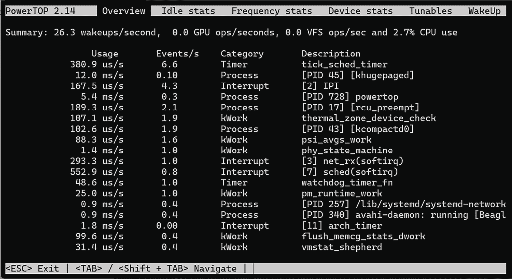

# 第十四章：管理电源

对于使用电池供电的设备，电源管理至关重要。我们能做的任何减少功耗的事情都会延长电池寿命。即便是使用主电源的设备，减少功耗也能降低能源成本并减少散热需求。本章将介绍电源管理的四个原则：

+   如果不急，就不要着急。

+   不要为空闲而感到羞耻。

+   关闭不使用的设备。

+   没有其他事情做时就去休息吧。

更技术性地说，电源管理系统应当降低 CPU 时钟频率。在空闲时，应选择最深的睡眠状态；应通过关闭未使用的外设来减轻负载；并应确保整个系统进入挂起状态，同时确保电源状态的切换迅速。

Linux 具有解决这些问题的功能。我将逐一描述每个功能，并提供示例和如何将其应用于嵌入式系统的建议。

一些术语，如 **C-state** 和 **P-state**，取自 **高级配置和电源接口**（**ACPI**）规范。我们将在讨论时详细描述这些术语。该规范的完整参考可见于 *进一步学习* 部分。

本章将涵盖以下主题：

+   测量功耗

+   调整时钟频率

+   选择最佳空闲状态

+   关闭外设电源

+   将系统置于睡眠状态

# 技术要求

要跟随示例，确保你拥有以下设备：

+   一台 Ubuntu 24.04 或更高版本的 LTS 主机系统

+   一张 microSD 卡和读卡器

+   balenaEtcher for Linux

+   一根以太网线和一个有可用端口的路由器，用于网络连接

+   一条带有 3.3 V 逻辑电平的 USB 到 TTL 串口电缆

+   BeaglePlay

+   一款能够提供 3 A 电流的 5 V USB-C 电源

本章中使用的代码可以在本书 GitHub 仓库的章节文件夹中找到：[`github.com/PacktPublishing/Mastering-Embedded-Linux-Development`](https://github.com/PacktPublishing/Mastering-Embedded-Linux-Development)。

# 测量功耗

本章的示例需要使用真实硬件，而非虚拟硬件。这意味着我们需要一个具备正常电源管理的 BeaglePlay。BeaglePlay 的 **电源管理集成电路**（**PMIC**）所需的固件可能在 `meta-ti` 层中，但我并未深入调查。我们将使用预构建的 Debian 镜像。

在 BeaglePlay 上安装 Debian 的过程与*第十二章*相同。如果还没有，重新访问 *在 BeaglePlay 上安装 Debian* 部分，并用 Debian Bookworm 刷写 eMMC。移除 BeaglePlay 上的任何 microSD 卡，并从 eMMC 启动。通过 SSH 连接到 `beaglebone.local` 并以 `debian` 用户登录。

验证是否正在运行正确版本的 Debian：

```
debian@BeagleBone:~$ cat /etc/os-release
PRETTY_NAME="Debian GNU/Linux 12 (bookworm)"
NAME="Debian GNU/Linux"
VERSION_ID="12"
VERSION="12 (bookworm)"
VERSION_CODENAME=bookworm
ID=debian
HOME_URL="https://www.debian.org/"
SUPPORT_URL="https://www.debian.org/support"
BUG_REPORT_URL="https://bugs.debian.org/" 
```

现在检查电源管理是否正常工作：

```
debian@BeagleBone:~$ cat /sys/power/state
freeze mem disk 
```

如果你看到所有三个状态，那么一切正常。如果只看到`freeze`，那么电源管理子系统没有工作。请返回并仔细检查之前的步骤。

现在我们可以继续进行功耗测量了。有两种方法：*外部*和*内部*。要进行外部功耗测量，我们需要一个安培计来测量电流，一个伏特计来测量电压，然后将两者相乘得到功率。你可以使用基本的仪表读取数据，然后记录下来，或者使用更复杂的设备，集成数据记录功能，以便你可以看到功率随负载波动的变化，精确到毫秒级。为了本章的目的，我使用 USB-C 端口为 BeaglePlay 供电，并使用一个便宜的 USB-C 电源监视器，这种监视器的价格只需要几美元。

另一种方法是使用内建于 Linux 的监控系统。你会发现很多信息通过`sysfs`向你报告。还有一个非常有用的程序叫做**PowerTOP**，它从各种来源收集信息并集中展示。PowerTOP 是一个适用于 Yocto 项目和 Buildroot 的包，也可以在 Debian 上安装。

要在 Debian Bookworm 上为 BeaglePlay 安装 PowerTOP，请运行以下命令：

```
debian@BeagleBone:~$ sudo apt update
<…>
debian@BeagleBone:~$ sudo apt install powertop
[sudo] password for debian:
Reading package lists... Done
Building dependency tree... Done
Reading state information... Done
Suggested packages:
  cpufrequtils laptop-mode-tools
The following NEW packages will be installed:
  powertop
0 upgraded, 1 newly installed, 0 to remove and 39 not upgraded.
Need to get 183 kB of archives.
After this operation, 649 kB of additional disk space will be used.
Get:1 http://deb.debian.org/debian bookworm/main arm64 powertop arm64 2.14-1+b2 [183 kB]
Fetched 183 kB in 0s (1279 kB/s)
Selecting previously unselected package powertop.
(Reading database ... 72376 files and directories currently installed.)
Preparing to unpack .../powertop_2.14-1+b2_arm64.deb ...
Unpacking powertop (2.14-1+b2) ...
Setting up powertop (2.14-1+b2) ... 
```

更新可用包列表并安装 PowerTOP 之前，别忘了将 BeaglePlay 连接到以太网。

这是 PowerTOP 在 BeaglePlay 上运行的一个例子：



图 14.1 – PowerTOP 概览

在这张截图中，我们可以看到系统处于空闲状态，仅使用了 2.7%的 CPU。稍后我将在本章的*使用 CPUFreq*和*CPUIdle 驱动程序*小节中展示更多有趣的例子。

既然我们有了测量功耗的方法，接下来我们来看看在嵌入式 Linux 系统中管理电源的一个重要调整项：时钟频率。

# 调整时钟频率

如果跑步一公里消耗的能量比走路更多，那么也许将 CPU 运行在较低频率下能节省能源。让我们来看看。

CPU 在执行代码时的功耗是静态组件和动态组件的总和，静态组件主要由门电流泄漏引起，动态组件由门切换引起：

*P*[cpu] *= P*[static] *+ P*[dyn]

动态功耗组件依赖于被切换的逻辑门的总电容、时钟频率和电压的平方：

*P*[dyn] *= CFV*[2]

仅仅改变频率本身并不能节省能量，因为对于给定任务，需要完成相同数量的 CPU 周期。如果我们将频率降低一半，同时保持电压不变，那么完成任务的时间将是原来的两倍，尽管所消耗的总能量是相同的。事实上，降低频率可能会实际上增加功耗，因为 CPU 进入空闲状态所需的时间更长。特别是当没有其他竞争任务时，CPU 的空闲状态是非常节能的。因此，在这种情况下，最好使用尽可能高的频率，以便 CPU 可以快速返回空闲状态。这被称为 **竞速空闲**。

**重要注意事项**

降低频率的另一个动机是：**热管理**。有时可能需要以较低的频率运行，以保持封装温度在允许范围内。但这不是我们这里关注的重点。

因此，如果我们想要减少功耗，我们必须能够调整 CPU 核心的工作电压。但对于任何给定的电压，都有一个最大频率，超过该频率，晶体管门的切换将变得不可靠。更高的频率需要更高的电压，因此两者需要一起调整。许多 SoC 实现了这样的功能，这被称为 **动态电压和频率调节** (**DVFS**) 。制造商计算出核心频率和电压的最佳组合。每个组合被称为 **工作性能点** (**OPP**) 。ACPI 规范将它们称为 **P 状态**，其中 `P0` 是具有最高频率的 OPP。虽然 OPP 是频率和电压的组合，但它通常仅按频率来称呼。

需要一个内核驱动程序来在 P 状态之间进行切换。接下来，我们将查看该驱动程序及其控制的调节器。

## CPUFreq 驱动

Linux 有一个名为 **CPUFreq** 的组件，用于管理不同 OPP（工作性能点）之间的转换。它是每个 SoC 包的板级支持的一部分。CPUFreq 包含驱动程序，用于实现从一个 OPP 到另一个 OPP 的过渡，以及一组调节器（governors），用于实现何时切换的策略。它是通过 `/sys/devices/system/cpu/cpuN/cpufreq` 目录对每个 CPU 进行控制，其中 `N` 是 CPU 编号。在该目录下，我们可以找到一些文件，其中最有趣的包括：

+   `cpuinfo_cur_freq`、`cpuinfo_max_freq` 和 `cpuinfo_min_freq`：这些是该 CPU 的当前频率，以及最大频率和最小频率，单位为 KHz。

+   `cpuinfo_transition_latency`：这是从一个 OPP 切换到另一个 OPP 所需的时间，单位为纳秒。如果值未知，则设置为 `-1`。

+   `scaling_available_frequencies`：这是该 CPU 上可用的 OPP 频率列表。

+   `scaling_available_governors`：这是该 CPU 上可用的调节器列表。

+   `scaling_governor`：这是当前使用的 CPUFreq 调节器。

+   `scaling_min_freq`和`scaling_max_freq`：这是调度器在 KHz 中的可用频率范围。

+   `scaling_setspeed`：这是一个文件，允许在调度器为`userspace`时手动设置频率，我将在本小节最后描述。

调度器设置更改 OPP 的策略。它可以在`scaling_min_freq`和`scaling_max_freq`的限制之间设置频率。调度器命名如下：

+   `performance`：这始终选择最高的频率。

+   `powersave`：这始终选择最低频率。

+   `userspace`：这是用户空间程序设置频率的地方。

+   `ondemand`：这根据 CPU 的利用率更改频率。如果 CPU 空闲时间少于 20%，它会将频率设置为最大值。如果 CPU 空闲时间超过 30%，它会随着空闲时间的增加而降低频率。

+   `conservative`：这类似于`ondemand`，只是它以 5%的步长切换到更高的频率，而不是立即切换到最大频率。

+   `schedutil`：这个旨在与 Linux 调度器更好地集成。

Debian Bookworm 启动时的默认调度器是`performance`：

```
$ cd /sys/devices/system/cpu/cpu0/cpufreq
$ cat scaling_governor
performance 
```

BeaglePlay 的 TI Linux 内核仅内置了两个调度器：

```
$ cat scaling_available_governors
performance schedutil 
```

其他调度器可以通过`cpupower`或`modprobe`动态加载：

```
debian@BeagleBone:~$ sudo modprobe cpufreq_userspace 
```

要从 Debian Bookworm 在 BeaglePlay 上安装`cpupower`，运行以下命令：

```
debian@BeagleBone:~$ sudo apt install linux-cpupower
Reading package lists... Done
Building dependency tree... Done
Reading state information... Done
The following additional packages will be installed:
  libcpupower1
The following NEW packages will be installed:
  libcpupower1 linux-cpupower
0 upgraded, 2 newly installed, 0 to remove and 39 not upgraded.
Need to get 1953 kB of archives.
After this operation, 2174 kB of additional disk space will be used.
Do you want to continue? [Y/n] Y
Get:1 http://deb.debian.org/debian bookworm-updates/main arm64 libcpupower1 arm64 6.1.124-1 [960 kB]
Get:2 http://deb.debian.org/debian bookworm-updates/main arm64 linux-cpupower arm64 6.1.124-1 [992 kB]
Fetched 1953 kB in 0s (8989 kB/s)
Selecting previously unselected package libcpupower1.
(Reading database ... 72409 files and directories currently installed.)
Preparing to unpack .../libcpupower1_6.1.124-1_arm64.deb ...
Unpacking libcpupower1 (6.1.124-1) ...
Selecting previously unselected package linux-cpupower.
Preparing to unpack .../linux-cpupower_6.1.124-1_arm64.deb ...
Unpacking linux-cpupower (6.1.124-1) ...
Setting up libcpupower1 (6.1.124-1) ...
Setting up linux-cpupower (6.1.124-1) ...
Processing triggers for libc-bin (2.36-9+deb12u9) ... 
```

要切换到`ondemand`调度器，运行以下命令：

```
debian@BeagleBone:~$ sudo cpupower frequency-set -g ondemand
Setting cpu: 0
Setting cpu: 1
Setting cpu: 2
Setting cpu: 3 
```

`ondemand`调度器用来决定何时更改 OPP 的参数可以在`/sys/devices/system/cpu/cpufreq/ondemand/`找到并设置。

`ondemand`和`conservative`调度器都会考虑改变频率和电压所需的努力。这个 CPUFreq 值是`cpuinfo_transition_latency`。这个计算仅适用于具有普通调度策略的线程。如果线程被实时调度，两个调度器都会立即选择最高的 OPP，以便线程能够满足其调度截止时间。

`userspace`调度器允许通过用户空间守护进程来选择 OPP 的逻辑。示例包括`cpudyn`和`powernowd`，尽管这两者都偏向于 x86 架构的笔记本电脑，而非嵌入式设备。

现在我们知道了有关 CPUFreq 驱动程序的运行时详细信息所在的位置，让我们来看一下如何在编译时定义 OPP。

## 使用 CPUFreq

查看 BeaglePlay，我们发现 OPP 在设备树中进行了编码。以下是`k3`-`am625.dtsi`中的摘录：

```
a53_opp_table: opp-table {
	compatible = "operating-points-v2-ti-cpu";
	opp-shared;
	syscon = <&wkup_conf>;
	opp-200000000 {
		opp-hz = /bits/ 64 <200000000>;
		opp-supported-hw = <0x01 0x0007>;
		clock-latency-ns = <6000000>;
	};
	opp-400000000 {
		opp-hz = /bits/ 64 <400000000>;
		opp-supported-hw = <0x01 0x0007>;
		clock-latency-ns = <6000000>;
	};
	opp-600000000 {
		opp-hz = /bits/ 64 <600000000>;
		opp-supported-hw = <0x01 0x0007>;
		clock-latency-ns = <6000000>;
	};
	opp-800000000 {
		opp-hz = /bits/ 64 <800000000>;
		opp-supported-hw = <0x01 0x0007>;
		clock-latency-ns = <6000000>;
	};
	opp-1000000000 {
		opp-hz = /bits/ 64 <1000000000>;
		opp-supported-hw = <0x01 0x0006>;
		clock-latency-ns = <6000000>;
	};
	opp-1250000000 {
		opp-hz = /bits/ 64 <1250000000>;
		opp-supported-hw = <0x01 0x0004>;
		clock-latency-ns = <6000000>;
		opp-suspend;
	};
}; 
```

我们可以通过查看可用的频率来确认这些是运行时使用的 OPP：

```
$ cd /sys/devices/system/cpu/cpu0/cpufreq
$ cat scaling_available_frequencies
200000 400000 600000 800000 1000000 1250000 1400000 
```

选择`userspace`调度器：

```
debian@BeagleBone:~$ sudo cpupower frequency-set -g userspace
Setting cpu: 0
Setting cpu: 1
Setting cpu: 2
Setting cpu: 3 
```

列出可用的频率步骤：

```
debian@BeagleBone:~$ sudo cpupower frequency-info
analyzing CPU 0:
  driver: cpufreq-dt
  CPUs which run at the same hardware frequency: 0 1 2 3
  CPUs which need to have their frequency coordinated by software: 0 1 2 3
  maximum transition latency: 6.00 ms
  hardware limits: 200 MHz - 1.40 GHz
  available frequency steps:  200 MHz, 400 MHz, 600 MHz, 800 MHz, 1000 MHz, 1.25 GHz, 1.40 GHz
  available cpufreq governors: ondemand userspace performance schedutil
  current policy: frequency should be within 200 MHz and 1.40 GHz.
                  The governor "userspace" may decide which speed to use
                  within this range.
  current CPU frequency: 1.25 GHz (asserted by call to hardware) 
```

现在我们可以使用 USB-C 电源监测器来测量每个 OPP 的功耗。这些测量不太准确，所以不要太当真。

通过写入`scaling_setspeed`来设置频率：

```
# echo 200000 > /sys/devices/system/cpu/cpufreq/policy0/scaling_setspeed 
```

在 BeaglePlay 上构建并运行`MELD/Chapter14/do-work`程序：

```
$ cd MELD/Chapter15/do-work
$ make
$ ./do-work -l 80828 
```

如果我们在变化频率的同时保持恒定负载，那么我们观察到以下现象：

| **频率 (MHz)** | **CPU 利用率 (%)** | **功率 (mW)** |
| --- | --- | --- |
| 200 | 88 | 1,160 |
| 400 | 44 | 1,160 |
| 600 | 29 | 1,160 |
| 800 | 22 | 1,210 |
| 1,000 | 18 | 1,210 |
| 1,250 | 14 | 1,210 |
| 1,400 | 13 | 1,210 |

表 14.1 – 不同频率下的功耗

这表明在较低频率下大约节省了 4%的功率。

在大多数情况下，`ondemand` 调节器是最佳选择，因为它会根据 CPU 负载在不同的 OPP 之间切换。要选择特定的调节器，可以通过配置内核，使用默认调节器如`CPU_FREQ_DEFAULT_GOV_ONDEMAND`，或者使用`init`脚本在启动时更改调节器。有关 Debian 如何使用 SysVinit 的示例，请参见`MELD/Chapter14/cpufrequtils`。

有关 CPUFreq 驱动程序的更多信息，请查看 Linux 内核源代码树中`Documentation/cpu-freq`目录下的文件。

在本节中，我们关注的是 CPU 忙碌时的功耗。在下一节中，我们将探讨如何在 CPU 空闲时节省功耗。

# 选择最佳空闲状态

当处理器没有更多工作要做时，它会执行**停止指令**并进入空闲状态。在空闲状态下，CPU 的功耗较低。当发生硬件中断等事件时，CPU 会退出空闲状态。大多数 CPU 有多个空闲状态，每个状态消耗的功率不同。通常，功率使用和延迟之间存在权衡，即退出空闲状态所需的时间。在 ACPI 规范中，这些状态被称为**C 状态**。

在更深的 C 状态中，更多的电路会关闭，代价是失去一些状态，因此恢复到正常操作所需的时间更长。例如，在某些 C 状态下，CPU 缓存可能会关闭，因此当 CPU 重新运行时，可能需要从主内存重新加载一些信息。这是非常昂贵的，因此只有在 CPU 有较大的概率在此状态下保持一段时间时，才应执行此操作。不同系统之间的状态数量不同，每个状态从休眠到完全激活都需要一些时间。

选择正确的空闲状态的关键是要有一个清晰的了解，CPU 将会有多长时间处于不活动状态。预测未来总是具有挑战性，但有一些因素可以提供帮助。其中之一是当前的 CPU 负载：如果当前负载很高，短期内很可能继续保持这种状态，这时深度休眠将没有太大好处。即使负载较低，也值得查看是否存在即将到期的定时事件。如果没有负载也没有定时器，那么进入更深的空闲状态是合理的。

选择最佳空闲状态的部分代码是 CPUIdle 驱动程序。有关它的详细信息，可以查看 Linux 内核源代码树中的`Documentation/driver-api/pm/cpuidle.rst`文件。

## CPUIdle 驱动程序

与 CPUFreq 子系统类似，**CPUIdle**由 BSP 的一部分驱动程序和决定策略的调度器组成。与 CPUFreq 不同，调度器无法在运行时更改，并且没有供用户空间调度器使用的接口。在撰写本文时，Debian Bookworm 并未支持 BeaglePlay 的 CPUIdle，因此我只能在此进行描述。

CPUIdle 暴露了`/sys/devices/system/cpu/cpu0/cpuidle`目录中每个空闲状态的信息。在该目录中，每个睡眠状态都有一个名为`state0`到`stateN`的子目录。`state0`是最轻的睡眠状态，`stateN`是最深的。请注意，编号与 C 状态不匹配，并且 CPUIdle 没有与`C0`（运行）对应的状态。每个状态下有以下文件：

+   `desc`：此状态的简短描述

+   `disable`：通过向此文件写入`1`来禁用此状态的选项

+   `latency`：当退出此状态时，CPU 核心恢复正常操作所需的时间（单位：微秒）

+   `name`：此状态的名称

+   `power`：在此空闲状态下消耗的功率，单位为毫瓦

+   `time`：在此空闲状态下花费的总时间（单位：微秒）

+   `usage`：该状态被进入的次数

CPUIdle 有两个调度器：

+   `ladder`：根据上一个空闲期的持续时间，逐步向下或向上进入空闲状态。它适用于常规的定时器滴答，但不适用于动态滴答。

+   `menu`：根据预期的空闲时间选择一个空闲状态。它适用于动态滴答系统。

您应根据`NO_HZ`的配置选择其中之一，我将在本节末尾描述该配置。

再次强调，用户交互是通过`sysfs`文件系统进行的。在`/sys/devices/system/cpu/cpuidle`目录下，您将找到两个文件：

+   `current_driver`：这是 CPUIdle 驱动程序的名称。

+   `current_governor_ro`：这是调度器的名称。

这些文件显示正在使用哪个驱动程序和哪个调度器。

即使 CPU 完全处于空闲状态，大多数 Linux 系统仍然配置为在接收到系统定时器中断时定期唤醒。为了节省更多的电力，我们需要将 Linux 内核配置为无滴答操作。

## 无滴答操作

一个相关的话题是无滴答操作或`NO_HZ`选项。如果系统完全空闲，最可能的中断源是系统定时器，它被编程为以每秒`HZ`次的频率生成定时滴答，其中`HZ`通常为`100`。历史上，Linux 使用定时滴答作为测量超时的主要时间基准。

然而，如果没有注册定时器事件，在某个特定时刻唤醒 CPU 来处理定时器中断是显然浪费的。动态滴答内核配置选项`CONFIG_NO_HZ_IDLE`会在定时器处理例程结束时查看定时器队列，并在下一个事件发生时安排下次中断。这避免了不必要的唤醒，使 CPU 可以长时间处于空闲状态。在任何对电源敏感的应用中，都应该配置内核启用此选项。

虽然 CPU 消耗了嵌入式 Linux 系统中的大部分电力，但系统中也有其他组件可以关闭以节省能源。

# 关闭外设电源

直到现在，我们讨论的都是 CPU 以及如何在其运行或空闲时减少功耗。现在是时候关注系统的其他部分，看看是否能在这里实现节能了。

在 Linux 内核中，这由**运行时电源管理系统**（runtime power management system）管理，简称**运行时电源管理（runtime pm）**。它与支持运行时电源管理的驱动程序配合工作，关闭未使用的设备，并在需要时再次唤醒它们。

它是动态的，且应对用户空间透明。设备驱动程序决定如何关闭硬件电源。通常，运行时电源管理包括关闭子系统时钟，也称为时钟门控（clock gating），以及在可能的情况下关闭核心电路。

运行时电源管理通过`sysfs`接口暴露。每个设备都有一个名为`power`的子目录，在这里你可以找到以下文件：

+   `control`：这允许用户空间决定是否在此设备上使用运行时电源管理（runtime pm）。如果设置为`auto`，则启用运行时电源管理；但如果设置为`on`，设备始终开启，且不使用运行时电源管理。

+   `runtime_enabled`：此项报告运行时电源管理是否`启用`或`禁用`，如果`control`设置为`on`，则报告`禁止`。

+   `runtime_status`：这报告设备的当前状态。它可能是`活动`、`挂起`或`不支持`。

+   `autosuspend_delay_ms`：这是设备挂起之前的时间。`-1`表示永远等待。如果挂起设备硬件的代价较高，某些驱动程序会实现此功能，因为它可以防止设备快速挂起和恢复循环。

以具体示例为例，让我们来看一下 BeaglePlay 上的 MMC 驱动：

```
# cd /sys/devices/platform/bus@f0000/fa00000.mmc/mmc_host/mmc1/power
# grep "" *
async:enabled
grep: autosuspend_delay_ms: Input/output error
control:auto
runtime_active_kids:0
runtime_active_time:0
runtime_enabled:disabled
runtime_status:unsupported
runtime_suspended_time:0
runtime_usage:0 
```

因此，运行时电源管理已被禁用，设备当前不受支持，我们无法确定再次挂起时会有多少延迟。

有关运行时电源管理的更多信息，请查看 Linux 内核源代码中的`Documentation/power/runtime_pm.rst`。

现在我们知道了运行时电源管理是什么以及它是如何工作的，让我们看看它是如何实际应用的。

# 使系统进入休眠状态

还有一种电源管理技术需要考虑：将整个系统置于睡眠模式，预期它一段时间内不会再被使用。在 Linux 内核中，这被称为**系统睡眠**。通常由用户发起：用户决定设备应关闭一段时间。例如，当我准备回家时，我合上笔记本电脑的盖子并将其放进包里。Linux 中对系统睡眠的大部分支持来自笔记本电脑的支持。在笔记本电脑世界中，通常有两种选择：

+   挂起

+   休眠

第一个选项，也叫做**挂起到内存**，关闭除了系统内存之外的所有内容，因此机器仍然会消耗一点电量。当系统恢复时，内存会保留所有之前的状态，我的笔记本几秒钟内就能恢复工作。

如果我选择**休眠**选项，内存的内容会被保存到硬盘。系统完全不消耗电力，因此可以无限期地处于此状态。唤醒时，需要一些时间从硬盘恢复内存。休眠在嵌入式系统中很少使用，主要是因为闪存的读写速度较慢，也因为它对工作流程有侵入性。

如需更多信息，请查看内核源树中的`Documentation/power`目录。

挂起到内存和休眠选项对应于 Linux 支持的四种睡眠状态中的两种。接下来，我们将讨论这两种系统睡眠类型以及其他 ACPI 电源状态。

## 电源状态

在 ACPI 规范中，睡眠状态被称为**S 状态**。Linux 支持四种睡眠状态（**freeze**、**standby**、**mem** 和 **disk**），这些状态与相应的 ACPI S 状态（[`S0`]、`S1`、`S3` 和 `S4`）对应，具体如下：

+   `freeze` ([S0])：这会停止（冻结）所有用户空间的活动，同时 CPU 和内存继续正常工作。

节能的原因在于没有运行任何用户空间代码。ACPI 没有等效的状态，因此 S0 是最接近的匹配。S0 是运行系统的状态。

+   `standby` (S1)：这类似于`freeze`，不同的是，除了启动 CPU 外，它会将所有 CPU 下线。

+   `mem` (S3)：这会关闭系统电源并将内存置于自刷新模式。也被称为**挂起到内存**。

+   `disk` (S4)：这将内存保存到硬盘，并关闭系统电源。也被称为**挂起到硬盘**。

不是所有系统都支持所有状态。要了解哪些状态是可用的，请读取`/sys/power/state`文件，如下所示：

```
debian@BeaglePlay:~$ cat /sys/power/state
freeze mem disk 
```

要进入其中一个系统睡眠状态，只需将所需状态写入`/sys/power/state`。

对于嵌入式设备，最常见的需求是使用`mem`选项挂起到内存。例如，我可以像这样挂起 BeaglePlay：

```
# echo mem > /sys/power/state 
```

设备在不到一秒的时间内关闭电源，然后电力消耗下降至 10 毫瓦，用我的基础万用表测量得出的数据。但如何再次唤醒它呢？这就是接下来的主题。

## 唤醒事件

在暂停设备之前，你必须有一种方式将其重新唤醒。内核在这方面会帮助你。如果没有至少一个唤醒源，系统将拒绝暂停并返回以下信息：

```
No sources enabled to wake-up! Sleep abort. 
```

当然，这意味着系统的某些部分必须保持开启，即使是在最深的休眠状态下。这通常涉及到**电源管理集成电路**（**PMIC**）和**实时时钟**（**RTC**），并可能还包括如 GPIO、UART、以太网和 Wi-Fi 等接口。

唤醒事件通过`sysfs`进行控制。`/sys/device`中的每个设备都有一个名为`power`的子目录，其中包含一个`wakeup`文件，文件内容为以下字符串之一：

+   `enabled`：表示该设备将生成唤醒事件

+   `disabled`：表示该设备不会生成唤醒事件

+   （空）：表示该设备无法生成唤醒事件

若要获取能够生成唤醒事件的设备列表，请搜索所有`wakeup`包含`enabled`或`disabled`的设备：

```
$ find /sys/devices/ -name wakeup | xargs grep "abled" 
```

我们已经了解了如何将设备挂起并通过外部接口（如 UART）事件唤醒它。如果我们希望设备在没有外部交互的情况下自我唤醒，该怎么办呢？这时 RTC 就发挥作用了。

## 来自实时时钟的定时唤醒

BeaglePlay 具有一个 RTC，可以生成最长 24 小时内的警报中断。如果存在，`/sys/class/rtc/rtc1`目录将存在。该目录应包含`wakealarm`文件。将一个数字写入`wakealarm`文件会导致它在指定秒数后生成警报。如果你还启用了来自`rtc1`的唤醒事件，RTC 将恢复一个挂起的设备。

例如，以下`rtcwake`命令会将系统置于`freeze`状态，并在 5 秒后通过 RTC 唤醒：

```
debian@BeagleBone:~$ sudo su –
root@BeagleBone:~# rtcwake -d /dev/rtc1 -m freeze -s 5
rtcwake: assuming RTC uses UTC ...
rtcwake: wakeup from "freeze" using /dev/rtc1 at Thu Jan  1 00:06:21 1970 
```

相应的`journalctl`输出如下所示：

```
Feb 08 01:21:53 BeagleBone kernel: PM: suspend entry (s2idle)
Feb 08 01:21:59 BeagleBone kernel: Filesystems sync: 0.000 seconds
Feb 08 01:21:59 BeagleBone kernel: Freezing user space processes
Feb 08 01:21:59 BeagleBone kernel: Freezing user space processes completed (elapsed 0.001 seconds)
Feb 08 01:21:59 BeagleBone kernel: OOM killer disabled.
Feb 08 01:21:59 BeagleBone kernel: Freezing remaining freezable tasks
Feb 08 01:21:59 BeagleBone kernel: Freezing remaining freezable tasks completed (elapsed 0.001 seconds)
Feb 08 01:21:59 BeagleBone kernel: printk: Suspending console(s) (use no_console_suspend to debug)
Feb 08 01:21:59 BeagleBone kernel: wlcore: down
Feb 08 01:21:59 BeagleBone kernel: wlcore: down
Feb 08 01:21:59 BeagleBone kernel: am65-cpsw-nuss 8000000.ethernet eth0: Link is Down
Feb 08 01:21:59 BeagleBone kernel: ti-sci 44043000.system-controller: ti_sci_resume: wakeup source: 0xFF
Feb 08 01:21:59 BeagleBone kernel: am65-cpsw-nuss 8000000.ethernet: set new flow-id-base 19
Feb 08 01:21:59 BeagleBone kernel: am65-cpsw-nuss 8000000.ethernet eth0: PHY [8000f00.mdio:00] driver [RTL8211F-VD Gigabit Ethernet]>
Feb 08 01:21:59 BeagleBone kernel: am65-cpsw-nuss 8000000.ethernet eth0: configuring for phy/rgmii-rxid link mode
Feb 08 01:21:59 BeagleBone kernel: wlcore: using inverted interrupt logic: 2
Feb 08 01:21:59 BeagleBone kernel: wlcore: PHY firmware version: Rev 8.2.0.0.243
Feb 08 01:21:59 BeagleBone kernel: wlcore: firmware booted (Rev 8.9.0.0.83)
Feb 08 01:21:59 BeagleBone kernel: OOM killer enabled.
Feb 08 01:21:59 BeagleBone kernel: Restarting tasks ... done.
Feb 08 01:21:59 BeagleBone kernel: PM: suspend exit 
```

BeaglePlay 上的**电源**按钮也是一个唤醒源，因此在没有串口控制台的情况下，你可以使用它从`freeze`状态恢复。确保按下**电源**按钮，而不是旁边的**重置**按钮；否则，板子将重新启动。

这篇文章结束了我们对四种 Linux 系统休眠模式的讨论。我们了解了如何将设备挂起至`mem`或`freeze`电源状态，并通过来自 RTC 或**电源**按钮的事件唤醒它。虽然 Linux 中的运行时电源管理主要是为笔记本电脑创建的，但我们可以利用这一支持来为也依靠电池供电的嵌入式系统服务。

# 总结

Linux 具有复杂的电源管理功能。在本章中，我描述了四个主要组件：

+   **CPUFreq**根据每个处理器核心的工作负载变化来调整 OPP，减少忙碌但仍有部分带宽剩余的核心的功耗，从而使我们能够降低频率。OPP 在 ACPI 规范中称为 P 状态。

+   **CPUIdle**选择更深的空闲状态，当 CPU 预期一段时间内不会被唤醒时。空闲状态在 ACPI 规范中被称为 C 状态。

+   **运行时电源管理（Runtime pm）**会关闭不需要的外设。

+   **系统睡眠**模式会将整个系统置于低功耗状态。通常由最终用户控制，例如，通过按下待机按钮。系统睡眠状态在 ACPI 规范中称为 S 状态。

大部分电源管理工作由 BSP（主引导程序）为你完成。你的主要任务是确保其为你预期的使用场景配置正确。只有最后一个组件，即选择系统睡眠状态，需要你编写一些代码，使最终用户能够进入和退出该状态。

本书的下一部分将讨论嵌入式应用程序的编写。我们将从打包和部署 Python 代码开始，然后探索容器化技术。

# 进一步学习

+   *高级配置与电源管理接口规范*，UEFI 论坛公司 – [`uefi.org/sites/default/files/resources/ACPI_Spec_6_5_Aug29.pdf`](https://uefi.org/sites/default/files/resources/ACPI_Spec_6_5_Aug29.pdf)

# 加入我们的 Discord 社区

加入我们社区的 Discord 空间，与作者和其他读者进行讨论： https://packt.link/embeddedsystems


