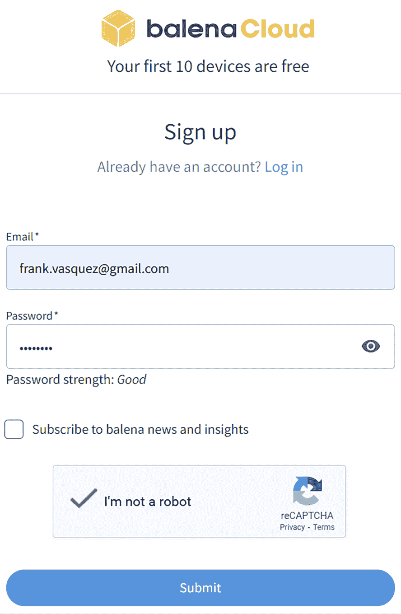

# 16

# 部署容器镜像

在本章中，我将介绍 DevOps 运动的基本原则，并展示如何将它们应用到嵌入式 Linux 中。首先，我们将学习如何使用 Docker 将 Python 应用和其用户空间环境打包成一个容器镜像。接下来，我们将为 Python 蓝牙服务器应用设置一个基于 Docker 的**持续集成和持续交付**（**CI/CD**）管道。然后，我将演示如何将 Docker 快速添加到 Raspberry Pi 4 的 Yocto 镜像中。最后，我们将部署一个容器化的软件更新到运行 Docker 的 Raspberry Pi 4 上。

在本章中，我们将涵盖以下主题：

+   什么是 DevOps？

+   DevOps 与嵌入式 Linux

+   使用 Docker 部署 Python 应用

+   为 Python 应用设置 CI/CD 管道

+   将 Docker 添加到 Yocto 镜像中

+   使用 Docker 更新软件

# 技术要求

为了跟随示例，请确保你拥有以下内容：

+   一台至少有 90GB 可用磁盘空间的 Ubuntu 24.04 或更高版本的 LTS 主机系统

+   在主机系统上具有管理员或 sudo 权限的用户帐户

+   Yocto 5.0（Scarthgap）LTS 版本

+   一台 microSD 卡读卡器和卡

+   `balenaEtcher` for Linux

+   一根以太网电缆和带有可用端口的路由器以提供网络连接

+   一台 Raspberry Pi 4

+   一台能够提供 3A 电流的 5V USB-C 电源

你应该已经在*第六章*构建了 5.0（Scarthgap）LTS 版本的 Yocto。如果没有，请参考*兼容的 Linux 发行版*和*构建主机软件包*部分，按照[*Yocto 项目快速构建*](https://docs.yoctoproject.org/brief-yoctoprojectqs/)指南中的说明在 Linux 主机上构建 Yocto。

本章中使用的代码可以在本书的 GitHub 仓库的章节文件夹中找到：[`github.com/PacktPublishing/Mastering-Embedded-Linux-Development/tree/main/Chapter16`](https://github.com/PacktPublishing/Mastering-Embedded-Linux-Development/tree/main/Chapter16)。

## 获取 Docker

在 Ubuntu 24.04 LTS 上安装 Docker：

1.  更新软件包仓库：

    ```
    $ sudo apt update 
    ```

1.  安装 Docker：

    ```
    $ sudo apt install docker.io 
    ```

1.  启动 Docker 守护进程并启用其在启动时自动启动：

    ```
    $ sudo systemctl enable --now docker 
    ```

1.  将自己添加到`docker`组：

    ```
    $ sudo usermod -aG docker <username> 
    ```

1.  重启 Docker 守护进程：

    ```
    $ sudo systemctl restart docker 
    ```

在*步骤 4*中将`<username>`替换为你的用户名。我建议创建你自己的 Ubuntu 用户帐户，而不是使用默认的`ubuntu`用户帐户，因为该帐户应该保留用于管理任务。

# 什么是 DevOps？

自 2009 年起，**DevOps 运动**已席卷软件行业。Patrick Debois 在观看 2009 年 Velocity 大会的演讲《*每天部署 10 次*》后，创造了**DevOps**这一术语。Patrick 是《*DevOps 手册*》的四位共同作者之一，其他三位作者是 Gene Kim、Jez Humble 和 John Willis。《*DevOps 手册*》首次出版于 2016 年，系统地阐述了这一运动的原则。这些理念源自精益生产和敏捷软件开发社区。DevOps 实践与敏捷方法论如 Scrum 和 Kanban 紧密相关。这些方法的目标始终是更快速地将高质量的产品交付给客户。

DevOps 力图将组织内的开发和运维团队融合在一起。在历史上，公司中负责操作软件的人与开发这些软件的人是分开的。有时会有一支专门的系统管理员（IT）团队，负责配置服务器和部署计划中的软件发布。这样的职责分离，再加上“大爆炸式”部署，往往会导致长时间的延迟和故障。开发与运维之间的关系会变得对立，失败时大家相互指责。相反，DevOps 鼓励密切合作、快速迭代和实验。错误是我们学习的方式。

## 持续集成和持续部署

精益生产的两个核心概念是**价值流**和与之相关的**交付时间**。精益哲学源自汽车工业，尤其是丰田生产系统。如果把价值流看作工厂的生产线，那么交付时间就是从客户提出需求到需求得到满足的时间。交付时间是衡量价值流表现的指标之一。减少交付时间使工厂能够更快地生产汽车。这个理念同样适用于软件。

在软件中，我们可以将交付时间看作从提交功能请求到该功能部署到生产环境的时间。每次开发人员提交并推送代码更改时，自动化构建过程会被触发。自动化构建会对新更改的代码运行一组单元测试。只有当构建成功并且测试套件通过时，代码更改才能合并到主分支。这些检查都是通过脚本自动执行的。构建软件和执行测试所需的时间越长，交付时间也就越长。

集成代码只是价值流的一部分。要向客户交付价值，软件必须部署到生产环境中。这通常意味着标记一个版本、在云端启动服务器，并将新版本安装到这些服务器上。为了确保部署顺利进行，可以采用几种技术。首先运行集成测试。在整个服务器集群上逐步推出版本。如果软件更新出现问题，可以回滚到先前的版本。只有当软件每天多次部署到生产环境中时，才能最大化开发人员的生产力。价值流即是**CI/CD**流水线。

## 基础设施即代码

我们需要的不仅仅是源代码来构建和部署大多数软件。如今，现代软件开发大多涉及 Docker。一个应用程序通常需要一个 Dockerfile、makefile 和 shell 脚本来构建和打包软件以供发布。在 CI/CD 流水线的不同阶段，这些项会由一个 YAML 文件来调用。由于它们并不是实际软件的一部分，我们可能不会将这些项视为代码。然而，它们与源代码一起存储在版本控制中，同样需要进行审查和维护。由于软件的构建和打包完全由脚本控制，因此这一任务是可以轻松重复的。

在部署过程中，涉及的 YAML 文件量会增加。像 Terraform 和 CloudFormation 这样的云原生工具是基于 YAML 的。我们通过应用声明式的 YAML 文件，使用这些工具来配置云基础设施并将软件版本发布工件部署到其中。部署由与构建和打包相同的顶级 YAML 文件驱动。这样，整个过程可以实现端到端自动化。尽管它们看起来不像代码，但 YAML 文件实际上是代码，应该遵循与高层编程语言（如 Python）编写的代码相同的质量标准。

## 安全是共同责任

当市场时间至关重要时，安全常常被放在次要位置。与部署类似，安全往往被委托给运维部门。像 2022 年的 Log4j 漏洞和 2024 年的 `xz` 后门等高调事件，展示了安全对日常业务至关重要。DevOps 认为，安全问题在开发的每个阶段都应该考虑，而不是事后才想到。知识产权和客户数据始终是加密的。像密钥和密码等机密信息会安全地存储在版本控制之外。安全最佳实践是每个人的责任，必须从一开始就加以执行。

## 监控与可观察性

通过系统统计、日志和追踪收集遥测数据，让我们能够了解应用程序的健康状况和性能。一旦获取了遥测数据，可以将其显示在 Grafana 仪表盘上进行分析。这样，我们可以在问题导致昂贵的服务中断之前，及时发现性能回退、资源泄漏等系统性问题。实时洞察能够触发快速响应和解决问题。更重要的是，遥测数据为我们提供了关于我们作为开发者表现的即时反馈，让我们能够学习和改进。

## 持续改进

精益制造提倡短周期、小变动和快速迭代。埃里克·里斯的《*精益创业*》推广了**最小可行产品**（**MVP**）的概念。MVP 是具有足够功能的产品版本，初步用户可以就该产品提供反馈。这些反馈会被审查，并迅速做出改进以推出下一个版本。软件的 CI/CD 流水线能比工厂生产线更快地推出 MVP。

持续反馈激励开发者更频繁地发布小规模的增量改进。MVP 方法让团队能够在投入更多时间和资源之前，看到哪些有效，哪些无效。通过这种方式，可以进行调整，确保为用户提供更多的价值。DevOps 认为，尽早整合小的改动会带来更好的结果。这与让单一开发者在没有用户反馈的情况下，孤军奋战于长期存在的功能分支是完全不同的做法。

## 透明度

如果一个组织的文化不鼓励合作，那么合作就不太可能发生。恐惧充斥着功能失调的组织。个人通过隐藏信息来采取战略性行动，防止别人受益。这种行为导致了信息孤岛，所有的沟通只能在私人会议和需要知道的情况下进行。错误被隐藏，因为害怕惩罚（例如，领导“杀信使”）。DevOps 心态是开放的。成功、失败和创意会在组织内分享，以促进最佳实践。如果你在某个任务上遇到困难，你应该向团队求助。

# DevOps 和嵌入式 Linux

硬件很难。PCB 布局、合同制造和板卡修订需要消耗大量时间和金钱。与软件相比，硬件的风险更大。交货周期更长，错误可能会带来灾难性后果。嵌入式 Linux 作为硬件和软件之间的桥梁。

嵌入式 Linux 工程师与电气工程师紧密合作，处理板子启动过程中出现的问题。要求电气工程师重新布线或添加上拉电阻并不罕见。PCB 布局非常复杂。没有人是完美的，因此新板子在第一次启动时几乎不会成功。

鉴于如此高的风险，DevOps 原则似乎并不适用于硬件产品。像**测试驱动开发**（**TDD**）这样的行业趋势，经常被经验丰富的嵌入式开发人员认为不切实际。在处理真实硬件时，自动化测试更加困难，但并非不可能。一旦功能开始快速交付，投入时间和精力建立 CI/CD 管道将带来丰厚的回报。管理层可能会质疑你为何在前期做这么多流程工作，但当新产品提前交付时，他们的态度会发生变化。

## 持续集成与交叉编译

Linux 及其上层的大多数中间件是主要用 C 语言编写的，这意味着它必须针对目标的**指令集架构**（**ISA**）进行本地编译。在云端，这个 ISA 通常是运行在 Intel 或 AMD CPU 上的 x86-64 架构。而在能够运行 Linux 的嵌入式设备上，ISA 越来越倾向于 64 位 Arm 架构。由于大多数云基础设施运行在 Intel 和 AMD 的 CPU 上，为嵌入式 Linux 构建软件需要一个交叉编译工具链。然而，交叉编译并不是 GitHub Actions 或 GitLab CI 等云端 CI/CD 服务的常见用例。

Buildroot 和 Yocto 都旨在交叉编译嵌入式 Linux 镜像，但在云端运行这些工具可能会遇到挑战。它们需要大量的磁盘空间，且较长的构建时间让人望而却步。通过采用增量构建和智能缓存（例如 Yocto 的共享` sstate-cache`），可以提高构建效率。另一种方法是将 Docker 与 QEMU 结合使用，为 64 位 Arm 交叉编译容器镜像。这种容器化的方式对用户空间很有效，但模拟目标架构会减慢编译速度。

## 在真实硬件上的自动化测试

交付硬件时面临的最大挑战之一是实现**硬件在环**（**HIL**）测试。像交叉编译一样，自动化测试可以通过 QEMU 在云端轻松完成，但没有什么能替代在预定硬件上进行软件测试。当安全性成为问题时，HIL 测试不仅仅是一个预防性措施，而是一项必要的工作。挑战在于如何实现自动化，这也是为什么 HIL 测试往往需要投入与编写软件同等的努力。

最有效的 HIL 测试形式是模拟现实世界。硬件通过传感器和执行器与现实世界进行交互。它从传感器接收输入，并通过 I2C、SPI 和 CAN 等通信接口将输出发送到执行器。我们通过软件建模来模拟现实世界。这个软件模型运行在独立的 Linux 机器上。它像实际系统中的传感器和执行器一样，通过各种通信接口发送和接收消息。例如，为了测试电动汽车充电器，我们会将 PCB 连接到测试台上的模拟电池，并运行我们的模型进行测试。

## 持续交付与 OTA 更新

当云中的部署失败时，我们只需删除有问题的服务器并启动新的实例。我们不需要担心服务器砖化，因为我们可以随时从头开始。在云中，重新配置服务器是相对快速且不痛苦的。对于现场的消费类设备则无法如此处理。如果设备无法启动，那么它就没用了。同样，如果一个连接的设备突然与互联网断开，那么它就无法接收关键的 OTA 更新。

OTA 更新是嵌入式系统中软件持续交付的方式。OTA 更新需要在意外断电的情况下具备容错性。失败的 OTA 更新不能导致部分或未知的闪存镜像。否则，设备可能会变得无法启动。Buildroot 和 Yocto 支持像 Mender、RAUC 和 SWUpdate 这样的容错 OTA 更新解决方案。尽管这些工具可以防止你的设备群被砖化，但你仍然应该在全面发布之前充分测试软件版本。没有什么比糟糕的用户体验更能快速葬送新产品发布了。

## 基础设施即代码和构建系统

Buildroot 依赖于 makefile。Yocto 由 BitBake 食谱组成。就像定义云基础设施的 YAML 文件一样，这些构建元数据也可以视为代码，应当存储在版本控制中。这包括 Buildroot 的板定义配置和包定义。对于 Yocto，构建元数据包括 BSP 和发行版层。通过定义 Dockerfile 将你的嵌入式 Linux 构建环境容器化也很有益。这可以更容易地启动 CI/CD 管道，为你的目标设备构建镜像，也让其他人更容易重现你的构建环境，从而在他们的机器上进行本地开发。

## 保护边缘设备

互联网充满了危险。臭名昭著的 Mirai 僵尸网络最初是由一些想要攻击竞争 Minecraft 服务器的孩子们发起的。这个想法演变成了大规模的**分布式拒绝服务**（**DDoS**）攻击。Mirai 劫持了消费者的物联网设备，如网络摄像头和家用路由器，并将它们指向选定的网站。确保启动和 OTA 更新过程的安全性可以防止像 Mirai 这样的恶意软件在用户设备上运行。有关如何确保启动和 OTA 更新过程安全性的机制，请参见*第十章*。在边缘设备上，安全性至关重要，因为一旦你的设备群被劫持，你是无法找回它们的。

安全启动意味着设备只能从由设备制造商加密签名的镜像启动。启动时会插入签名验证步骤，以确保通过 OTA 更新应用的最新镜像的真实性。用户还希望所有设备上的数据都能加密以保护隐私。自动解锁加密卷需要在启动时输入密码。设备在运行时所需的任何密钥或密码应安全地存储在 TPM 或安全元件中。

## 边缘设备的监控与可观测性

从消费设备收集遥测数据非常困难，因为这些设备部署在用户的家中和办公室里。像所有其他连接到互联网的设备一样，任何想要将遥测数据传输到云端的新产品都必须通过防火墙。这通常需要用户在 Wi-Fi 路由器上打开一个外向端口。用户可能不够了解网络，或者出于隐私原因反对这样做。尽管像 MQTT 这样的标准 IoT 协议可以用于遥测，但它们并不总是适合每一个应用场景。在这个领域，像 Golioth 和 Memfault 这样的初创公司仍有很大的创新空间。

够多的理论和理论依据了。现在让我们将这些原则付诸实践。我们将从执行一个容器化的软件部署开始。您应该已经根据《*获取 Docker*》部分的说明，在您的 Linux 主机上安装了 Docker。

# 使用 Docker 部署 Python 应用程序

Docker 提供了另一种将 Python 代码与其他语言编写的软件捆绑的方法。Docker 背后的理念是，您不需要将应用程序打包并安装到一个预配置的服务器环境中，而是构建并分发一个包含您的应用程序及其所有运行时依赖的容器镜像。容器镜像更像是一个虚拟环境，而非虚拟机。虚拟机是一个完整的系统镜像，包括内核和操作系统。而容器镜像是一个最小的用户空间环境，只包含运行应用程序所需的二进制文件。

虚拟机运行在模拟硬件的虚拟机监控器上，而容器则直接运行在主机操作系统之上。与虚拟机不同，容器能够共享相同的操作系统和内核，而无需使用硬件模拟。容器依赖于 Linux 内核的两个特殊功能来实现隔离：命名空间和控制组。Docker 并没有发明容器技术，但他们是第一个构建使容器易于使用的工具的公司。由于 Docker 使构建和部署容器镜像变得如此简单，曾经的“在我的机器上能运行”这一借口不再成立。

## Dockerfile 的结构

一个 **Dockerfile** 描述了 Docker 镜像的内容。每个 Dockerfile 都包含一组指令，指定使用哪个环境以及要运行哪些命令。我们将使用一个现有的项目模板中的 Dockerfile，而不是从零开始编写 Dockerfile。这个 Dockerfile 为一个非常简单的 Flask Web 应用程序生成 Docker 镜像，您可以扩展该镜像以满足自己的需求。该 Docker 镜像是基于 Debian Bookworm 构建的。除了 Flask，Docker 镜像还包括 uWSGI 和 Nginx，以提高性能。

首先，在浏览器中打开 GitHub 上的`uwsgi-nginx-flask-docker`项目页面（[`github.com/tiangolo/uwsgi-nginx-flask-docker`](https://github.com/tiangolo/uwsgi-nginx-flask-docker)）。然后，点击`README.md`文件中的`python-3.12` Dockerfile 链接。

现在，查看该 Dockerfile 中的第一行：

```
FROM tiangolo/uwsgi-nginx:python3.12 
```

这个`FROM`命令告诉 Docker 从 Docker Hub 的`tiangolo`命名空间拉取一个名为`uwsgi-nginx`的镜像，并且包含`python3.12`。Docker Hub 是一个公共注册中心，用户可以在其中发布自己的 Docker 镜像供他人获取和部署。如果你愿意，也可以使用像 AWS ECR 或 Quay 这样的服务设置自己的镜像注册中心。你需要在命名空间前面插入注册中心服务的名称，像这样：

```
FROM quay.io/my-org/my-app:my-tag 
```

否则，Docker 会默认从 Docker Hub 拉取镜像。`FROM`就像 Dockerfile 中的`include`语句，它将另一个 Dockerfile 的内容插入到你的 Dockerfile 中，以便你可以在其基础上构建。我喜欢把这种方式看作是图层化镜像。Debian Bookworm 是基础层，接着是 Python 3.12，然后是 uWSGI 加 Nginx，最后是你的 Flask 应用程序。你可以通过深入研究[`hub.docker.com/r/tiangolo/uwsgi-nginx`](https://hub.docker.com/r/tiangolo/uwsgi-nginx)上的`python3.12` Dockerfile 来了解更多有关镜像图层化的工作原理。

这是 Dockerfile 中下一个值得注意的行：

```
RUN pip install --no-cache-dir -r /tmp/requirements.txt 
```

`RUN`指令用于运行命令。Docker 会按顺序执行 Dockerfile 中的`RUN`指令，以构建最终的 Docker 镜像。如果你查看 Git 仓库中的`requirements.txt`文件，你会看到这个`RUN`指令会在系统的`site-packages`目录中安装 Flask。我们知道`pip`可用，因为`uwsgi-nginx`基础镜像也包括了 Python 3.12。

我们跳过 Nginx 的环境变量，直接进入复制操作：

```
COPY ./app /app 
```

这个特定的 Dockerfile 位于一个 Git 仓库中，并与其他几个文件和子目录一起存放。`COPY`指令将主机 Docker 运行环境中的一个目录（通常是仓库的 Git 克隆）复制到正在构建的容器中。

你正在查看的`python3.12.dockerfile`文件位于`tiangolo/uwsgi-nginx-flask-docker`仓库的`docker-images`子目录中。在`docker-images`目录中，有一个名为`app`的子目录，里面包含一个 Hello World Flask Web 应用程序。这个`COPY`指令将`app`目录从示例仓库复制到 Docker 镜像的根目录：

```
WORKDIR /app 
```

`WORKDIR`指令告诉 Docker 从容器内的哪个目录开始工作。在这个例子中，它刚刚复制的`/app`目录成为工作目录。如果目标工作目录不存在，`WORKDIR`会创建它。Dockerfile 中后续出现的任何非绝对路径都将相对于`/app`目录。

现在让我们来看一下如何在容器内设置一个环境变量：

```
ENV PYTHONPATH=/app 
```

`ENV`指令告诉 Docker 后面的内容是环境变量定义。`PYTHONPATH`是一个环境变量，它扩展成一个以冒号分隔的路径列表，Python 解释器会在这些路径中查找模块和包。

接下来，我们跳到第二个`RUN`指令：

```
RUN chmod +x /entrypoint.sh 
```

`RUN`指令告诉 Docker 从 Shell 运行一个命令。在这个例子中，运行的命令是`chmod`，它用于更改文件权限。在这里，它使`/entrypoint.sh`变为可执行文件。

Dockerfile 中的下一行是可选的：

```
ENTRYPOINT ["/entrypoint.sh"] 
```

`ENTRYPOINT`是这个 Dockerfile 中最有趣的指令。当启动容器时，它会暴露一个可执行文件到 Docker 主机的命令行。这允许你从命令行将参数传递给容器内的可执行文件。你可以在命令行中`docker run` `<image>`后附加这些参数。如果 Dockerfile 中有多个`ENTRYPOINT`指令，那么只有最后一个`ENTRYPOINT`会被执行。

Dockerfile 中的最后一行是：

```
CMD ["/start.sh"] 
```

与`ENTRYPOINT`指令类似，`CMD`指令在容器启动时执行，而非构建时执行。当在 Dockerfile 中定义了`ENTRYPOINT`指令时，`CMD`指令定义了要传递给`ENTRYPOINT`的默认参数。在这个例子中，`/start.sh`路径是传递给`/entrypoint.sh`的参数。`/entrypoint.sh`中的最后一行执行`/start.sh`：

```
#! /usr/bin/env sh
set -e
# If there's a prestart.sh script in the /app directory, run it before 
# starting
PRE_START_PATH=/app/prestart.sh
echo "Checking for script in $PRE_START_PATH"
if [ -f $PRE_START_PATH ] ; then
    echo "Running script $PRE_START_PATH"
    . $PRE_START_PATH
else
    echo "There is no script $PRE_START_PATH"
fi
# Start Supervisor, with Nginx and uWSGI
exec /usr/bin/supervisord 
```

`/start.sh`脚本来自`uwsgi-nginx`基础镜像。`/start.sh`在`/entrypoint.sh`配置完容器运行环境后启动 Nginx 和 uWSGI。当`CMD`与`ENTRYPOINT`一起使用时，`CMD`设置的默认参数可以通过 Docker 主机命令行进行覆盖。

大多数 Dockerfile 中没有`ENTRYPOINT`指令，因此 Dockerfile 的最后一行通常是一个`CMD`指令，它会在前台运行，而不是使用默认参数。你可以利用这个 Dockerfile 技巧保持一个通用的 Docker 容器在开发时运行：

```
CMD tail -f /dev/null 
```

除了`ENTRYPOINT`和`CMD`外，这个`python-3.12` Dockerfile 中的所有指令只在容器构建时执行。

## 构建一个 Docker 镜像

在我们能够构建 Docker 镜像之前，我们需要一个 Dockerfile。你可能已经在系统中拥有一些 Docker 镜像。

要查看 Docker 镜像的列表：

```
$ docker images 
```

现在，让我们获取并构建我们刚刚分析过的 Dockerfile：

1.  克隆包含 Dockerfile 的仓库：

    ```
    $ git clone https://github.com/tiangolo/uwsgi-nginx-flask-docker.git 
    ```

1.  切换到仓库中的`docker-images`子目录：

    ```
    $ cd uwsgi-nginx-flask-docker/docker-images 
    ```

1.  将`python3.12.dockerfile`复制到名为`Dockerfile`的文件中：

    ```
    $ cp python3.12.dockerfile Dockerfile 
    ```

1.  从 Dockerfile 构建一个镜像：

    ```
    $ docker build -t my-image . 
    ```

镜像构建完成后，它会出现在你的本地 Docker 镜像列表中：

```
$ docker images 
```

新构建的`my-image`应该出现在列表中。

## 运行一个 Docker 镜像

现在我们已经构建了一个 Docker 镜像，可以将其作为容器运行。

要获取系统上运行中的容器列表：

```
$ docker ps 
```

要运行基于`my-image`的容器：

```
$ docker run -d --name my-container -p 80:80 my-image 
```

如果前面的命令因端口 `80` 被占用而失败，则将端口 `80` 替换为 `8080`。现在查看你运行中的容器的状态：

```
$ docker ps 
```

你应该在列表中看到一个名为 `my-container` 的容器，它基于一个名为 `my-image` 的镜像。`docker run` 命令中的 `-p` 选项将容器端口映射到主机端口。所以，在这个例子中，容器端口 `80` 映射到主机端口 `80`。这种端口映射允许在容器内运行的 Flask Web 服务器处理 HTTP 请求。

停止 `my-container`：

```
$ docker stop my-container 
```

现在再次检查你运行中的容器的状态：

```
$ docker ps 
```

`my-container` 应该不再出现在运行中的容器列表中。容器消失了吗？没有，它只是停止了。你仍然可以通过在 `docker` `ps` 命令中添加 `-a` 选项来查看 `my-container` 及其状态：

```
$ docker ps -a 
```

稍后我们将看看如何删除不再需要的容器。

## 拉取 Docker 镜像

在本节前面，我提到过 Docker Hub、AWS ECR 和 Quay 等镜像注册表。事实证明，我们从克隆的 Git 仓库构建的本地 Docker 镜像已经发布在 Docker Hub 上。从 Docker Hub 拉取预构建的镜像比在本地系统上自己构建它更快。该项目的 Docker 镜像可以在 [`hub.docker.com/r/tiangolo/uwsgi-nginx-flask`](https://hub.docker.com/r/tiangolo/uwsgi-nginx-flask) 上找到。

从 Docker Hub 拉取我们构建的名为 `my-image` 的相同 Docker 镜像：

```
$ docker pull tiangolo/uwsgi-nginx-flask:python3.12 
```

现在再次查看你的 Docker 镜像列表：

```
$ docker images 
```

你应该在列表中看到一个新的`uwsgi-nginx-flask`镜像。

要运行这个新拉取的镜像：

```
$ docker run -d --name flask-container -p 80:80 tiangolo/uwsgi-nginx-flask:python3.12 
```

如果你不想键入完整的镜像名称，你可以用 `docker images` 中对应的镜像 ID（哈希值）替换前面的 `docker run` 命令中的完整镜像名称（`repo:tag`）。

## 发布 Docker 镜像

要将 Docker 镜像发布到 Docker Hub，你必须首先拥有一个账户并登录。你可以通过访问 [`hub.docker.com`](https://hub.docker.com) 网站创建一个账户并注册。注册成功后，你就可以将现有镜像推送到你的 Docker Hub 仓库：

1.  从命令行登录 Docker Hub 镜像注册表：

    ```
    $ docker login 
    ```

1.  在提示时输入你的 Docker Hub 用户名和密码。

1.  给一个已有的镜像打上一个新标签，标签名以你的仓库名称开头：

    ```
    $ docker tag my-image:latest <repository>/my-image:latest 
    ```

1.  将前面命令中的 `<repository>` 替换为你在 Docker Hub 上的仓库名称（与用户名相同）。你也可以将要推送的另一个已有镜像名称替换为 `my-image:latest`。

1.  将镜像推送到 Docker Hub 镜像注册表：

    ```
    $ docker push <repository>/my-image:latest 
    ```

1.  再次进行与*步骤 3*相同的替换。

默认情况下，推送到 Docker Hub 的镜像是公开可用的。要访问你新发布镜像的网页，请访问[`hub.docker.com/repository/docker/<repository>/my-image`](https://hub.docker.com/repository/docker/repository/my-image)。将前面 URL 中的`<repository>`替换为你在 Docker Hub 上的仓库名称（与用户名相同）。如果实际推送的镜像名称不同，也可以将`my-image:latest`替换为该镜像的名称。如果你点击网页上的**Tags**标签，你应该能看到获取该镜像的`docker pull`命令。

## 清理

我们知道`docker images`列出镜像，`docker ps`列出容器。在删除 Docker 镜像之前，我们必须先删除所有引用该镜像的容器。要删除 Docker 容器，首先需要知道容器的名称或 ID：

1.  查找目标 Docker 容器的名称：

    ```
    $ docker ps -a 
    ```

1.  如果容器正在运行，请停止它：

    ```
    $ docker stop flask-container 
    ```

1.  删除 Docker 容器：

    ```
    $ docker rm flask-container 
    ```

将前面两个命令中的`flask-container`替换为*步骤 1*中的容器名称或 ID。每个出现在`docker ps`中的容器也都有与之相关联的镜像名称或 ID。一旦你删除了所有引用该镜像的容器，就可以删除该镜像。

Docker 镜像名称（`repo:tag`）可能会很长（例如，`tiangolo/uwsgi-nginx-flask:python3.12`）。因此，我发现删除镜像时直接复制并粘贴镜像的 ID（哈希值）更方便：

1.  查找 Docker 镜像的 ID：

    ```
    $ docker images 
    ```

1.  删除 Docker 镜像：

    ```
    $ docker rmi <image-ID> 
    ```

将前面的命令中的`<image-ID>`替换为*步骤 1*中的镜像 ID。

如果你仅仅想清除系统中不再使用的所有容器和镜像：

```
$ docker system prune -a 
```

`docker system prune`会删除所有已停止的容器和悬挂镜像。

我们已经看到如何使用`pip`来安装 Python 应用程序的依赖项。你只需在 Dockerfile 中添加一个调用`pip install`的`RUN`指令。由于容器是沙箱环境，它们提供了许多与虚拟环境相同的好处。但与`conda`和`venv`虚拟环境不同，Buildroot 和 Yocto 都支持 Docker 容器。Buildroot 有`docker-engine`和`docker-cli`软件包。Yocto 有`meta-virtualization`层。如果你的设备由于 Python 包冲突需要隔离，你可以通过 Docker 实现这一点。

`docker run`命令提供了将操作系统资源暴露给容器的选项。指定绑定挂载允许将主机上的文件或目录挂载到容器内，以供读写。默认情况下，容器不会向外界发布任何端口。当你运行`my-container`镜像时，你使用了`-p`选项将容器的端口`80`发布到主机的端口`80`。`--device`选项将主机设备文件添加到非特权容器中的`/dev`目录。如果你希望授予对主机上所有设备的访问权限，可以使用`--privileged`选项。

容器的强项在于部署。能够推送一个 Docker 镜像，然后在任何主要的云平台上轻松拉取并运行，这一功能彻底改变了 DevOps 运动。由于像 balena 这样的 OTA 更新解决方案，Docker 在嵌入式 Linux 领域也在取得进展。Docker 的一个缺点是运行时的存储占用和内存开销。Go 二进制文件有点臃肿，但 Docker 在四核 64 位 Arm 单板计算机（如 Raspberry Pi 4 和 BeaglePlay）上运行得很好。如果你的目标设备有足够的性能，那么就在上面运行 Docker。你的软件开发团队会感谢你的。

**重要提示**

Podman 是 Docker 的替代品，提供了一个更轻量的无守护进程架构。与 Docker 不同，Podman 不需要一个持续在后台运行的服务，这使得它更加高效。它对无根容器的支持增强了安全性，并且它与 OCI 标准的兼容性确保了灵活性。

# 为 Python 应用设置 CI/CD 流水线

Docker 不仅仅是为了将软件部署到云端。基于云的 CI/CD 服务可以构建并发布 64 位 Arm 容器镜像，以便部署到边缘设备。容器化的软件更新比完整的 A/B 镜像更新更不具破坏性，因为它们不需要重启。即使只是片刻，用户看到他们的设备掉线时也会感到紧张。

容器化软件更新的风险比完整的 A/B 镜像更新小，因为它们不包括 Linux 内核。边缘设备可能因为内核更新错误而无法启动。如果没有 fail-safe 机制，设备实际上就会变砖。随着硬件老化，上游内核模块会失修。内核升级尤其危险，因为它们可能导致内核崩溃。

在*第七章*的*基于现有 BSP 构建*一节中，我们为 Raspberry Pi 4 的 Yocto 镜像添加了一个用于 Python 蓝牙服务器应用的自定义层。我们可以使用 Docker 将相同的应用部署到一批 Raspberry Pi 4 上。

Python 蓝牙服务器的源代码存放在一个公开的 Git 仓库中（[`github.com/fvasquez/gattd`](https://github.com/fvasquez/gattd)）。每当提交推送到该仓库时，GitHub Actions 可以尝试构建并发布容器镜像。

## 创建 Dockerfile

要在容器内运行 `gattd`，首先需要一个 Dockerfile。由于 `gattd` 是一个 **蓝牙低能耗** (**BLE**) GATT 服务器，它依赖于在运行时可用的蓝牙硬件和软件。幸运的是，Raspberry Pi 4 内置了蓝牙，因此已经有了完善的内核支持来支持 BLE。我们的 `gattd` 容器镜像需要包含 BlueZ 软件栈，以便利用所有这些蓝牙支持。BlueZ 又依赖于 D-Bus，因此它也必须包含在我们的镜像中。**D-Bus** 是一种基于消息的中间件，能够实现同一计算机上多个进程之间的通信。D-Bus 中的 *D* 代表 *desktop*（桌面），但服务器也依赖它进行进程间通信。D-Bus 支持请求-响应和发布/订阅消息，并且与 `systemd` 深度集成。

由于 `gattd` 是一个 Python 应用，Dockerfile 中没有编译步骤。Python 发行版并不是通过 Yocto 编译的，而是 Dockerfile 顶部指定的基础 Linux 发行版或基础层的一部分。我选择了 Ubuntu 作为我的基础层，因为 Ubuntu LTS 版本经过充分的实际硬件测试，比如 Raspberry Pi 4。

依赖 Ubuntu 作为用户空间省去了构建自己发行版和进行所有相关测试的麻烦。既然 Canonical 已经为你做好了这件事，为什么还要费心维护一个 Linux 发行版层呢？选择 Ubuntu 可以节省宝贵的开发时间。你的软件团队不需要再学习 Yocto 或安装 eSDK。Ubuntu 是一个成熟的系统。

这是我提交到 `gattd` 仓库根目录的 Dockerfile：

```
# Dockerfile
FROM arm64v8/ubuntu:24.04
LABEL maintainer="fvasquez@gmail.com"
RUN apt update && apt-get install -y \
    bluez \
    dbus \
    python3-dbus \
    python3-gi
# Your app code, binaries, or other instructions
COPY . /app
WORKDIR /app
# Example app run
CMD ./entrypoint.sh 
```

**Docker 官方镜像** (**DOI**) 托管在 Docker Hub 上。DOI 计划的主要目标之一是发布针对 amd64 以外架构的容器镜像。DOI 支持的一个架构是 arm64v8，这是 Raspberry Pi 4 的指令集架构 (ISA)。Docker Hub 上的 `arm64v8` 组织代表 DOI 计划发布和维护大量容器镜像，其中包括 Debian、Ubuntu 和 Python 的官方 arm64v8 容器镜像。当我编写这个 Dockerfile 时，24.04 是最新的 Ubuntu LTS 版本。

`gattd` 应用主要依赖于 Python 标准库。唯一的其他 Python 包依赖是 D-Bus 的绑定和 GObject introspection 库的绑定。这两个包不需要额外的 `pip install` 步骤，因为 Ubuntu 上已有现成的包可用。与 JavaScript 不同，后者标准库非常有限，Python 提供了“随附电池”功能，因此你的应用可能不需要除 `apt` 外的其他包管理器。

请记住，`COPY` 指令将源文件从 Git 仓库复制到正在构建的容器中。等我解释完 `gattd` 容器镜像的发布方式后，我会再讲解 `entrypoint.sh` 脚本。

## 创建 GitHub Actions 工作流

GitHub Actions 是 GitHub 提供的免费 CI/CD 服务。每当向 `gattd` 仓库推送更改时，GitHub Actions 可以构建容器镜像并将其发布到 **GitHub 容器注册表**（**GHCR**）。**GitHub Packages** 是 GitHub 的软件包托管服务，用于软件发布。GHCR 是 GitHub Packages 的一部分，因此除了使用属于你或你所在组织的仓库之外，访问 GHCR 不需要额外的步骤。我拥有 `gattd` 仓库，它是我从 [`github.com/Jumperr-labs/python-gatt-server`](https://github.com/Jumperr-labs/python-gatt-server) 叉出来的。Python 代码由 Dan Shemesh 编写，追溯到 2017 年。

像大多数 CI/CD 服务一样，GitHub Actions 工作流是作为 YAML 文件定义的。默认的工作流文件名为 `main.yml`。对工作流文件的更改会被提交到仓库的 `.github/workflows` 目录中。由于这些文件与它们构建和部署的源代码一起存储在版本控制中，因此工作流文件构成了基础设施即代码。

下面是我为 `gattd` 仓库定义的 `main.yml` 工作流文件的内容：

```
name: Publish Docker Image to GHCR
on:
  push:
    branches: [ "master" ]
permissions:
  contents: read
  packages: write
jobs:
  build-and-push:
    runs-on: ubuntu-24.04-arm
    steps:
      # 1) Check out the code
      - name: Check out code
        uses: actions/checkout@v4
      # 2) Log in to GitHub Container Registry
      - name: Log in to GHCR
        uses: docker/login-action@v2
        with:
          registry: ghcr.io
          username: ${{ github.repository_owner }}
          password: ${{ secrets.GITHUB_TOKEN }}
      # 3) Build and Push the Docker image
      - name: Build and push Docker image
        uses: docker/build-push-action@v4
        with:
          context: .
          file: ./Dockerfile
          platforms: linux/arm64
          push: true
          tags: |
            ghcr.io/${{ github.repository_owner }}/${{ github.event.repository.name }}:latest 
```

该 `main.yml` 文件也包含在书籍 Git 仓库的 `Chapter16` 文件夹中。

一个简单的三步工作流就足以将容器镜像发布到 GHCR。每当将提交推送到仓库的 `master` 分支时，工作流都会被触发。

**重要提示**

在为你自己的仓库创建 GitHub Actions 工作流时，确保在 `main.yml` 文件的 `branches` 列表中将 `master` 替换为 `main`。否则，如果没有名为 `master` 的分支，工作流将失败。尽管 `main` 现在是 GitHub 上默认分支的名称，但当你创建新仓库时，Git 中的默认分支仍然是 `master`。

另一个需要注意的点是 `runs-on: ubuntu-24.04-arm`，它指示 GitHub Actions 为此工作流使用 arm64 托管的运行器。这意味着 GitHub 为此工作流启动的任何托管运行器都将在真实的 64 位 Arm CPU 核心上运行，从而无需进行交叉编译或仿真。

工作流的 *Step 3* 会构建并推送由仓库的 Dockerfile 定义的容器镜像。注意，`platforms` 只指定了 `linux/arm64`。`platforms` 元素用于使用 Docker `buildx` 构建多平台容器镜像。Docker `buildx` 利用 QEMU 为非本地架构（即“平台”）编译容器镜像。由于 `gattd` 针对 Raspberry Pi 4，因此只需要为本地的 `linux/arm64` 平台构建容器镜像。Docker `buildx` 正在积极开发中。了解更多关于该插件以及构建多平台镜像的信息，请访问 [`github.com/docker/buildx`](https://github.com/docker/buildx)。

创建 GitHub Actions 工作流：

1.  从你的仓库，点击顶部栏中的 **Actions** 图标。

1.  在 **Get started with GitHub Actions** 下，点击 **Skip this and set up a workflow yourself**。

1.  将`main.yml`的内容粘贴到**编辑**窗口中。

1.  点击绿色的**提交更改...**按钮。

1.  在**提交更改**对话框中，点击绿色的**提交更改**按钮。


图 16.1 – 提交更改

点击绿色的**提交更改**按钮会触发 GitHub Actions 工作流。GitHub 随后会启动一个托管运行器来构建仓库的 Dockerfile，并将任何生成的容器镜像推送到 GHCR。如果一切顺利，你会看到提交的状态为**成功**，并且在**构建并推送**任务旁边会有一个绿色圆圈中的白色勾号。这项工作流我第一次运行时花了 58 秒，现在每当提交推送到`master`分支时都会触发。

## 拉取并运行最新镜像

Docker 需要空间来写入它拉取的容器镜像。大多数嵌入式 Linux 文件系统要么是只读的，要么太小，无法存储像`gattd:latest`这样的容器镜像。这就是为什么你需要在树莓派 4 上安装一个通用的 Linux 发行版，比如 Ubuntu Server，以便进行本练习。最简单的方法是使用来自 raspberrypi.org 的官方树莓派映像工具。

首先，将树莓派映像工具下载并安装到你的 Linux 主机。有关如何操作的说明可以在 raspberrypi.com 上找到。

要将 Ubuntu Server 下载并安装到 microSD 卡：

1.  将 microSD 卡插入你的 Linux 主机。

1.  启动树莓派映像工具。

1.  选择**树莓派 4**作为你的**树莓派设备**。

1.  选择**其他通用操作系统**作为你的操作系统。

1.  在**操作系统**菜单中，选择**Ubuntu**。

1.  然后选择**Ubuntu Server 24.04.1 LTS**（64 位）或最接近的可用版本。

1.  当询问**是否应用操作系统自定义设置？**时，点击**编辑设置**按钮。

1.  如图所示，在**一般设置**页面输入用户名和密码：


图 16.2 – 一般设置

1.  将`frank`替换为你想要的用户名。

1.  在**服务**页面勾选**启用 SSH**，如图所示：


图 16.3 – 服务

1.  点击红色的**保存**按钮。

1.  选择 microSD 卡作为存储设备。

1.  将 Ubuntu Server 镜像写入 microSD 卡。由于树莓派映像工具会格式化 microSD 卡上的所有可用空间，这个过程需要几分钟时间。

1.  在树莓派映像工具完成写入后，弹出 microSD 卡。

1.  将 microSD 卡插入你的树莓派 4。

1.  通过 USB-C 端口为树莓派 4 供电。

要通过 SSH 连接到树莓派 4：

```
$ ssh <username>@raspberrypi.local 
```

将`<username>`替换为你在安装 Ubuntu Server 时创建的账户用户名。登录时，使用该账户创建的密码。

要在树莓派 4 上安装并配置 Docker：

1.  更新软件包元数据：

    ```
    $ sudo apt update 
    ```

1.  安装 Docker 守护进程：

    ```
    $ sudo apt install docker.io 
    ```

1.  配置系统在启动时启动 Docker 守护进程：

    ```
    $ sudo systemctl enable --now docker 
    ```

1.  将用户添加到`Docker`组：

    ```
    $ sudo usermod -aG docker <frank> 
    ```

1.  用你在安装 Ubuntu Server 时创建的账户用户名替换 `<frank>`。

1.  重启 Docker 守护进程：

    ```
    $ sudo systemctl restart docker 
    ```

1.  关闭会话：

    ```
    $ exit 
    ```

再次通过 SSH 连接到 Raspberry Pi 4。

从 GHCR 拉取最新的 `gattd` 容器镜像：

```
frank@raspberrypi:~$ docker pull ghcr.io/fvasquez/gattd:latest
latest: Pulling from fvasquez/gattd
820619057a1c: Pull complete
84a50057c1f4: Pull complete
b6caffbfe56a: Pull complete
4f4fb700ef54: Pull complete
Digest: sha256:85ad5878bda3a390fe33d7474d88c2e921f51a7df314351be9d2e00a4c3ba8f1
Status: Downloaded newer image for ghcr.io/fvasquez/gattd:latest
ghcr.io/fvasquez/gattd:latest 
```

要运行最新的 `gattd` 容器镜像：

```
frank@raspberrypi:~$ docker run --net=host --privileged -t ghcr.io/fvasquez/gattd:latest
 * Starting system message bus dbus                                        [ OK ]
 * Starting bluetooth                                                      [ OK ]
Waiting for services to start... done! (in 2 s)
/app/gatt_server_example.py:25: PyGIDeprecationWarning: GObject.MainLoop is deprecated; use GLib.MainLoop instead
  mainloop = GObject.MainLoop()
checking adapter /org/bluez, keys: dict_keys([dbus.String('org.freedesktop.DBus.Introspectable'), dbus.String('org.bluez.AgentManager1'), dbus.String('org.bluez.ProfileManager1'), dbus.String('org.bluez.HealthManager1')])
checking adapter /org/bluez/hci0, keys: dict_keys([dbus.String('org.freedesktop.DBus.Introspectable'), dbus.String('org.bluez.Adapter1'), dbus.String('org.freedesktop.DBus.Properties'), dbus.String('org.bluez.BatteryProviderManager1'), dbus.String('org.bluez.GattManager1'), dbus.String('org.bluez.Media1'), dbus.String('org.bluez.NetworkServer1'), dbus.String('org.bluez.LEAdvertisingManager1')])
found adapter /org/bluez/hci0
returning adapter /org/bluez/hci0
adapter: /org/bluez/hci0
checking adapter /org/bluez, keys: dict_keys([dbus.String('org.freedesktop.DBus.Introspectable'), dbus.String('org.bluez.AgentManager1'), dbus.String('org.bluez.ProfileManager1'), dbus.String('org.bluez.HealthManager1')])
checking adapter /org/bluez/hci0, keys: dict_keys([dbus.String('org.freedesktop.DBus.Introspectable'), dbus.String('org.bluez.Adapter1'), dbus.String('org.freedesktop.DBus.Properties'), dbus.String('org.bluez.BatteryProviderManager1'), dbus.String('org.bluez.GattManager1'), dbus.String('org.bluez.Media1'), dbus.String('org.bluez.NetworkServer1'), dbus.String('org.bluez.LEAdvertisingManager1')])
found adapter /org/bluez/hci0
returning adapter /org/bluez/hci0
Registering GATT application...
GetManagedObjects
GetAll
returning props
GATT application registered
Advertisement registered
Battery level: 98
Battery level: 96
Battery level: 94
Battery level: 92
Battery level: 90
Battery level: 88 
```

这是当运行 `gattd` 容器镜像时执行的 `entrypoint.sh` 脚本：

```
#!/bin/bash
# Start services
systemctl start dbus
systemctl start bluetooth
# Wait for services to start
msg="Waiting for services to start..."
time=0
echo -n $msg
while [[ "$(pidof start-stop-daemon)" != "" ]]; do
    sleep 1
    time=$((time + 1))
    echo -en "\r$msg $time s"
done
echo -e "\r$msg done! (in $time s)"
# Reset Bluetooth adapter by restarting it
hciconfig hci0 down
hciconfig hci0 up
# Start application
python3 /app/gatt_server_example.py 
```

这个 `entrypoint.sh` 文件来自 Thomas Huffert 在 Medium 上写的一篇博文，内容是如何使用 BlueZ 运行容器化的蓝牙应用程序。链接到他的原始文章包含在本章结尾的 *进一步学习* 部分。

# 将 Docker 添加到 Yocto 镜像

我们不需要在 Raspberry Pi 4 上安装 Ubuntu 就能利用 Docker。Buildroot 和 Yocto 都能够为嵌入式目标构建 Docker。将 Docker 添加到 Yocto 镜像是非常简单的。只需将软件包附加到现有镜像中即可。我们将利用 *第七章*中 *在现有 BSP 基础上构建* 部分的 `rpi-test-image`。

## 添加 `meta-virtualization` 层

Yocto 的 `meta-virtualization` 层包含启用云工具支持的配方。随着时间的推移，项目的重点已经从虚拟化技术（如 Xen、KVM 和 libvirt）转向了更受欢迎的容器化工具。Bruce Ashfield 已经领导了 `meta-virtualization` 的维护超过十年，致力于跟上云计算领域的最新创新。

选择容器化工具时，有如此多的竞争者，很难知道从哪里开始。`meta-virtualization` 层对于容器运行时的选择是中立的，Docker、Podman、containerd 和 Kubernetes 都得到完全支持。我决定专注于 Docker，因为它仍然是部署容器镜像的最流行工具。

以下练习假设你已经完成了 *第七章*中 *构建现有 BSP* 的练习，并且 `poky` 克隆的目录位于你的主目录中。

要添加 `meta-virtualization` 层：

1.  首先，导航到克隆 `poky` 的目录上一级：

    ```
    $ cd ~ 
    ```

1.  接下来，设置你的 BitBake 工作环境：

    ```
    $ source poky/oe-init-build-env build-rpi 
    ```

1.  该脚本设置了一些环境变量，并将你带回之前构建 `rpi-test-image` 的 `build-rpi` 目录。

1.  然后，将 `meta-virtualization` 层添加到你的镜像中：

    ```
    $ bitbake-layers layerindex-fetch --branch scarthgap --fetchdir ~ meta-virtualization 
    ```

1.  该命令将克隆 `meta-virtualization` 层及其所有依赖层到你的主目录。

1.  验证所有必要的层是否已被添加到镜像中：

    ```
    $ bitbake-layers show-layers 
    ```

1.  命令的输出应该如下所示：

    ```
    layer                 path                                         priority
    ===========================================================================
    core                  /home/frank/poky/meta                               5
    yocto                 /home/frank/poky/meta-poky                          5
    yoctobsp              /home/frank/poky/meta-yocto-bsp                     5
    openembedded-layer    /home/frank/meta-openembedded/meta-oe               5
    meta-python           /home/frank/meta-openembedded/meta-python           5
    networking-layer      /home/frank/meta-openembedded/meta-networking       5
    multimedia-layer      /home/frank/meta-openembedded/meta-multimedia       5
    raspberrypi           /home/frank/meta-raspberrypi                        9
    filesystems-layer     /home/frank/meta-openembedded/meta-filesystems      5
    selinux               /home/frank/meta-selinux                            5
    webserver             /home/frank/meta-openembedded/meta-webserver        5
    virtualization-layer  /home/frank/meta-virtualization                     8 
    ```

如果你的输出缺少 `meta-raspberrypi` 层及以上层次的内容，则返回到 *第七章*，重复 *构建现有 BSP* 练习，然后再试添加 `meta-virtualization` 层。

## 安装 Docker

`meta-virtualization`层包含了构建和安装 Docker 所需的配方。一旦该层被添加，我们可以将`docker`包追加到 Yocto 镜像中。有多种方法可以实现这一目标，包括创建自定义镜像配方或发行版层。我选择在`rpi-test-image`的基础上进行修改，并在`build-rpi`目录中的`conf/local.conf`文件进行更改。这样做纯粹是为了方便。修改`conf/local.conf`并不是一种可维护的方式。

Docker 守护进程依赖 SSL 证书来验证镜像注册表的真实性。SSL 证书有设定的有效期限，因此需要某种准确的时间源。大多数计算机在启动时会根据从互联网获取的**网络时间协议**（**NTP**）来更新系统时钟。因此，除了需要在目标设备上安装 Docker 之外，你还需要一种同步系统时钟的方式，才能拉取容器镜像。

在`rpi-test-image`上安装 Docker：

1.  将以下行添加到你的`conf/local.conf`文件中：

    ```
    IMAGE_INSTALL:append = " ntp-utils docker" 
    ```

1.  将以下行添加到你的`conf/local.conf`文件中：

    ```
    EXTRA_USERS_PARAMS = "\
        groupadd -r docker; \
        usermod -a -G docker root; \
    " 
    ```

1.  构建镜像：

    ```
    $ bitbake rpi-test-image 
    ```

1.  *第 2 步*创建了一个名为`docker`的组，并将`root`用户添加到该组中。这样，我们就可以在以`root`身份登录时运行 Docker 命令。`rpi-test-image`允许通过 SSH 进行`root`登录，无需密码。此镜像仅用于演示。

一旦镜像构建完成，`tmp/deploy/images/raspberrypi4-64`目录中应该会有一个名为`rpi-test-image-raspberrypi4-64.rootfs.wic.bz2`的文件。使用 Etcher 将该镜像写入 microSD 卡，并将其在你的 Raspberry Pi 4 上启动：

1.  将 microSD 卡插入主机。

1.  启动 Etcher。

1.  在 Etcher 中点击**Flash from file**。

1.  定位到你为 Raspberry Pi 4 构建的`wic.bz2`镜像并打开它。

1.  在 Etcher 中点击**Select target**。

1.  选择你在*第 1 步*中插入的 microSD 卡。

1.  在 Etcher 中点击**Flash**以写入镜像。

1.  当 Etcher 完成闪存写入时，弹出 microSD 卡。

1.  将 microSD 卡插入你的 Raspberry Pi 4。

1.  通过 Raspberry Pi 4 的 USB-C 端口为其供电。

通过将 Raspberry Pi 4 连接到以太网，并观察网络活动灯是否闪烁，来确认 Pi 4 是否成功启动。

## 验证 Docker 守护进程是否在运行

在上一个练习中，我们为 Raspberry Pi 4 构建了一个包含 Docker 的可启动镜像。现在设备已经启动并通过以太网连接到本地网络，接下来我们来验证 Docker 守护进程是否在运行。请按以下步骤操作：

1.  我们构建的镜像的主机名为`raspberrypi4-64`，所以你应该可以通过 SSH 以`root`身份登录到设备：

    ```
    $ ssh root@raspberrypi4-64.local 
    ```

1.  在系统提示是否继续连接时输入`yes`。不会提示输入密码。如果在`raspberrypi4-64.local`没有找到主机，可以使用`arp-scan`等工具定位你的 Raspberry Pi 4 的 IP 地址，然后通过该 IP 地址 SSH 连接，而不是通过主机名连接。

1.  列出当前正在运行的 Docker 版本信息：

    ```
    # docker info
    Client:
     Version:    25.0.3
     Context:    default
     Debug Mode: false
    <…>
    WARNING: No memory limit support
    WARNING: No swap limit support
    WARNING: No kernel memory TCP limit support
    WARNING: No oom kill disable support 
    ```

1.  更新系统时钟：

    ```
    # ntpdate pool.ntp.org
    14 Jan 04:22:49 ntpdate[783]: step time server 45.33.53.84 offset +216229384.417735 sec 
    ```

1.  拉取并运行`hello-world`容器镜像：

    ```
    # docker run hello-world
    Unable to find image 'hello-world:latest' locally
    latest: Pulling from library/hello-world
    478afc919002: Pull complete
    Digest:
    sha256:5b3cc85e16e3058003c13b7821318369dad01dac3dbb877aac3c28182255c724
    Status: Downloaded newer image for hello-world:latest
    Hello from Docker!
    This message shows that your installation appears to be working correctly. 
    ```

大多数现代 Linux 发行版依赖于`systemd-timesyncd`来自动更新系统时钟。这消除了安装和运行`ntp-utils`的需要。Yocto 的 Poky 参考发行版默认使用 SysVinit 作为其初始化系统。为了利用`systemd-timesyncd`，我们需要将启动系统从 SysVinit 切换到`systemd`。如果你希望在 Poky 中使用 systemd，请在`conf/local.conf`中选择`"poky-altcfg"`作为你的发行版配置。

从`SysVinit`切换到`systemd`的原因不仅仅是为了时间同步。由于`systemd`是为进程监控而设计的，因此它非常适合监控微服务。微服务通常以容器的形式部署。将`systemd`与 Docker 结合使用来启动、停止和重启 Linux 系统上的容器是有意义的。或者，你也可以使用 Docker Compose 来运行多容器应用，但这需要在你的 Yocto 镜像中添加另一个工具。

# 使用 Docker 更新软件

Balena 使用 Docker 容器来部署软件更新。设备运行 balenaOS，这是一个基于 Yocto 的 Linux 发行版，内置有 balenaEngine，这是 balena 兼容 Docker 的容器引擎。OTA 更新会通过 balenaCloud 自动推送，balenaCloud 是一个托管服务，用于管理设备的队列。Balena 也可以在**本地模式**下操作，这样更新就来自于你本地主机上运行的服务器，而不是来自云端。我们将在接下来的练习中坚持使用本地模式。

Balena 由 balena.io 编写和支持（[`balena.io`](https://balena.io)）。与 Mender 类似，balenaCloud 是一个付费的 OTA 更新服务。前十台设备免费，但如果超过此数量，你必须选择按月或按年计费的计划。关于该软件的更多信息，可以在 balena.io 的**参考**部分找到在线文档。由于我们的目标是部署并自动更新少量设备的软件以加速开发，因此我们不会深入探讨 balena 的工作原理。

Balena 为流行的开发板（如 Raspberry Pi 4 和 BeaglePlay）提供了预构建的 balenaOS 镜像。下载这些镜像需要一个 balenaCloud 账户。

## 创建账户

即使你只打算在本地模式下操作，首先需要做的就是注册一个 balenaCloud 账户。你可以通过访问[`dashboard.balenacloud.com/signup`](https://dashboard.balenacloud.com/signup)并输入你的电子邮件地址和密码来完成注册，如下所示：



图 16.4 – balenaCloud 注册

点击**提交**按钮提交表单，处理完成后，你将被提示输入个人资料信息。你也可以选择跳过此表单，届时你将进入**balenaCloud**仪表盘，使用新账户查看。

如果您退出登录或会话过期，您可以通过导航到[`dashboard.balena-cloud.com/login`](https://dashboard.balena-cloud.com/login)，并输入您注册时使用的电子邮件地址和密码，重新登录到仪表板。

## 创建应用程序

在我们将 Raspberry Pi 4 添加到 balenaCloud 帐户之前，我们首先需要创建一个舰队。


图 16.5 – 创建舰队

这里是在 balenaCloud 上为 Raspberry Pi 4 创建舰队的步骤：

1.  使用您的电子邮件地址和密码登录**balenaCloud**仪表板。

1.  点击位于左上角的**创建舰队**按钮，在**舰队**旁边，打开**创建舰队**对话框。

1.  为新舰队输入名称，并选择**Raspberry Pi 4 (使用 64 位操作系统)**作为**默认设备类型**。

1.  点击**创建新舰队**按钮在**创建舰队**对话框中提交表单。

新的舰队应该出现在**balenaCloud**仪表板的**舰队**页面上。

## 添加设备

现在我们在 balenaCloud 上有了一个舰队，让我们向其中添加一个 Raspberry Pi 4：

1.  使用您的电子邮件地址和密码登录**balenaCloud**仪表板。

1.  点击我们创建的新舰队。

1.  在舰队**摘要**页面上点击**添加设备**按钮。

1.  点击按钮会弹出**添加新设备**对话框。

1.  确保选择的设备类型为**Raspberry Pi 4 (使用 64 位操作系统)**。由于您已将应用程序创建为**Raspberry Pi 4 (使用 64 位操作系统)**作为默认设备类型，因此应已选择该选项。

1.  确保选择的操作系统为**balenaOS**。

1.  确保选择的 balenaOS 版本是最新的。由于**添加新设备**默认为最新可用版本的 balenaOS，并将其标记为**推荐**，所以应该已经选择了该选项。

1.  将**开发**选为 balenaOS 的版本。需要开发映像以启用更好的测试和故障排除的本地模式。


图 16.6 – 添加新设备

1.  选择**Wifi + Ethernet**作为**网络**。您也可以选择**仅以太网**，但自动连接到 Wi-Fi 是一个非常方便的功能。

1.  在相应的字段中输入您的 Wi-Fi 路由器的 SSID 和密码。请在以下截图中用您的 Wi-Fi 路由器的 SSID 替换**ATTCXR2Xjn**：


图 16.7 – Wifi + Ethernet

1.  点击**Flash**按钮上的下箭头。

1.  将压缩的镜像文件保存到您的主机上。

现在我们有一个 microSD 卡镜像可以用来为您的测试舰队中的任意数量的 Raspberry Pi 4 进行配置。

从您的主机机器为 Raspberry Pi 4 配置舰队的步骤现在应该已经很熟悉了。找到从 balenaCloud 下载的 balenaOS `img.zip` 文件，并使用 Etcher 将其写入 microSD 卡。将 microSD 卡插入 Raspberry Pi 4，并通过 USB-C 端口上电。

等待一两分钟，Raspberry Pi 4 会出现在你的 balenaCloud 仪表板的**设备**页面上：


图 16.8 – 设备

既然我们已经将 Raspberry Pi 4 连接到 balena 应用程序，我们需要启用本地模式，这样我们就可以从附近的主机机器而非云端部署 OTA 更新到它。

1.  在你的 balenaCloud 仪表板的**设备**页面上点击你的目标 Raspberry Pi 4。我的设备名为**evil-tree**，你的设备会有不同的名称。

1.  点击**设置**，进入你的 Raspberry Pi 4 的设置页面。

1.  从**设置**页面启用**本地模式**：


图 16.9 – 启用本地模式

一旦启用了本地模式，**日志**面板将不再出现在设备的**概述**页面上。

在目标设备上启用本地模式后，我们几乎准备好将一些代码部署到它上面了。在此之前，我们需要安装 balena CLI。

## 安装 CLI

以下是在 Linux 主机上安装 balena CLI 的说明：

1.  打开浏览器并导航到最新的 balena CLI 发布页面：[`github.com/balena-io/balena-cli/releases/latest`](https://github.com/balena-io/balena-cli/releases/latest)。

1.  点击最新的 Linux ZIP 文件进行下载。查找以`balena-cli-vX.Y.Z-linux-x64-standalone.zip`格式命名的文件名，其中 X、Y 和 Z 分别为主版本号、次版本号和补丁版本号。

1.  将 ZIP 文件的内容解压到你的主目录：

    ```
    $ cd ~
    $ unzip Downloads/balena-cli-v20.2.9-linux-x64-standalone.zip 
    ```

1.  解压后的内容被封装在一个`balena-cli`目录中。

1.  将`balena-cli`目录添加到你的`PATH`环境变量中：

    ```
    $ export PATH=$PATH:~/balena-cli 
    ```

1.  如果你希望这些对`PATH`变量的更改保持有效，请在你的主目录下的`.bashrc`文件中添加如下行。

1.  验证安装是否成功：

    ```
    $ balena version
    20.2.9 
    ```

1.  本文写作时，最新版本的 balena CLI 是 20.2.9。

现在我们有了一个工作的 balena CLI，让我们扫描本地网络，查找我们配置的 Raspberry Pi 4：

```
$ sudo env "PATH=$PATH" balena device detect
Scanning for local balenaOS devices... Reporting scan results
-
  host:          bf04eba.local
  address:       192.168.1.183
  osVariant:     development
  dockerInfo:
    Containers:        1
    ContainersRunning: 1
    ContainersPaused:  0
    ContainersStopped: 0
    Images:            1
    Driver:            overlay2
    SystemTime:        2025-03-06T05:10:40.708637573Z
    KernelVersion:     6.1.77-v8
    OperatingSystem:   balenaOS 6.4.1+rev1
    Architecture:      aarch64
  dockerVersion:
    Version:    v20.10.43
    ApiVersion: 1.41 
```

注意扫描输出中`bf04eba.local`的主机名和`192.168.1.83`的 IP 地址。你的 Raspberry Pi 4 的主机名和 IP 地址会有所不同。请记录这两项信息，因为我们将在接下来的练习中使用它们。

## 推送项目

让我们通过本地网络将一个 Python 项目推送到 Raspberry Pi：

1.  克隆一个项目来运行一个简单的“Hello World！”Python Web 服务器：

    ```
    $ git clone https://github.com/balena-io-examples/balena-python-hello-world.git 
    ```

1.  进入项目目录：

    ```
    $ cd balena-python-hello-world 
    ```

1.  将代码推送到你的 Raspberry Pi 4：

    ```
    $ balena push 192.168.1.183 
    ```

1.  将你的设备 IP 地址替换为`192.168.1.183`这个参数。

1.  等待 Docker 镜像构建并启动完成，并让应用程序在前台运行，以便它将日志输出到`stdout`。

1.  从浏览器发出对`http://192.168.1.183`的请求。将你的设备 IP 地址替换为`192.168.1.183`。

在 Raspberry Pi 4 上运行的 Web 服务器应该显示一个包含**Welcome to balena**的欢迎页面，并且如下所示的行应该出现在`balena push`的实时输出中：

```
[Logs]    [2025-03-06T05:16:46.546Z] [balena-hello-world] 192.168.1.177 - - [06/Mar/2025 05:16:46] "GET / HTTP/1.1" 200 - 
```

日志条目中的 IP 地址应该是你发起 Web 请求的机器的 IP 地址。每次刷新网页时都会出现新的日志条目。要停止追踪日志并返回到 Shell，输入*Ctrl + C*。容器将在目标设备上继续运行，Web 服务器也会继续处理请求。

我们可以随时通过发出以下命令来重新开始追踪日志：

```
$ balena device logs 192.168.1.183 
```

用你的设备的 IP 地址替换`192.168.1.183`这个参数。

这个简单 Web 服务器的 HTML 文件可以在项目目录中的`index.html`文件里找到：

```
tree
.
├── balena.yml
├── CHANGELOG.md
├── docker-compose.yml
├── Dockerfile.template
├── license.md
├── logo.png
├── README.md
├── repo.yml
├── requirements.txt
├── src
│   └── app.py
├── VERSION
└── views
    ├── index.html
    └── public
        ├── bootstrap.min.css
        ├── confetti.js
        ├── favicon.ico
        ├── logo.svg
        └── main.css 
```

现在，让我们对项目源代码进行轻微修改并重新部署：

1.  在你喜欢的编辑器中打开`views/index.html`。

1.  将`Welcome to balena!`替换为`Welcome to banana!`并保存更改。

1.  以下是`git diff`输出的更改：

    ```
    $ git diff
    diff --git a/views/index.html b/views/index.html
    index c5fcddd..7796f5a 100644
    --- a/views/index.html
    +++ b/views/index.html
    @@ -26,7 +26,7 @@
         <div class="container mt-5 mb-5 p-0 pb-5">
           <div class="row d-flex flex-column align-items-center">
    -        <h1>Welcome to balena!</h1>
    +        <h1>Welcome to banana!</h1>
             <p class="text-center pl-5 pr-5 pt-0 pb-0">Now that you've deployed code to your device,<br /> explore the resources below to continue on your journey!</p>
           </div> 
    ```

1.  将新代码推送到你的 Raspberry Pi 4：

    ```
    $ balena push 192.168.1.183 
    ```

1.  用你的设备的 IP 地址替换`192.168.1.183`这个参数。

1.  等待 Docker 镜像更新。由于名为**Livepush**的智能缓存功能，过程这次应该会更快，这是本地模式独有的特性。

1.  从 Web 浏览器向`http://192.168.1.183`发起请求。用你的设备的 IP 地址替换`192.168.1.183`。

在 Raspberry Pi 4 上运行的 Web 服务器应该显示**Welcome to banana!**

我们可以通过 IP 地址 SSH 连接到本地目标设备：

```
$ balena device ssh 192.168.1.183
Last login: Thu Mar  6 05:59:21 2025 from 192.168.1.124
root@bf04eba:~# 
```

用你的设备的 IP 地址替换`192.168.1.183`。由于应用运行在 Docker 容器内，这一点并没有特别大的用处。

要通过 SSH 连接到运行 Python Web 服务器的容器并观察其操作，我们需要在`balena`的`ssh`命令中包含服务名称：

```
$ balena device ssh 192.168.1.183 balena-hello-world
root@6a4ef89e6f10:/usr/src/app# ls
CHANGELOG.md         VERSION             logo.png          views
Dockerfile           balena.yml          repo.yml
Dockerfile.template  docker-compose.yml  requirements.txt
README.md            license.md          src 
```

这个启动应用的服务名称是`balena-hello-world`，如实时日志输出中所示。

恭喜！你已经成功创建了一个 balenaOS 镜像和主机开发环境，供你和你的团队使用，方便在项目代码上进行迭代并快速重新部署到目标设备。这可不是一件小事。以 Docker 容器的形式推送代码更改是全栈工程师非常熟悉的常见开发流程。借助 balena，他们现在可以利用自己熟悉的技术，在实际硬件上开发嵌入式 Linux 应用。

# 总结

在这一章节中，我们完成了很多事情。你现在知道如何为你的软件项目创建 Dockerfile 和 YAML 工作流。CI/CD 管道使用这种基础设施作为代码，自动构建并推送容器化的软件更新到边缘设备。你还利用容器在真实硬件上进行本地开发，然后再将更改推送到其他设备。像这样的现代 DevOps 实践使软件团队能够在不破坏系统的情况下更快地推进工作。

在下一章，我们将详细探讨 Linux 进程模型，描述什么是进程，进程与线程的关系，线程如何协作以及如何进行调度。如果你想创建一个稳健且可维护的嵌入式系统，理解这些内容非常重要。

# 进一步学习

+   *DevOps 手册，第二版*，作者：Gene Kim、Jez Humble、Patrick Debois 和 John Willis

+   *Docker 文档*，Docker 公司 – [`docs.docker.com/reference/cli/docker/`](https://docs.docker.com/reference/cli/docker/%0D%0A)

+   *如何运行容器化的蓝牙应用程序与 BlueZ*，作者：Thomas Huffert – [`medium.com/omi-uulm/how-to-run-containerized-bluetooth-applications-with-bluez-dced9ab767f6`](https://medium.com/omi-uulm/how-to-run-containerized-bluetooth-applications-with-bluez-dced9ab767f6)
