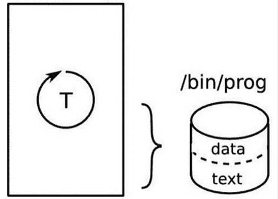
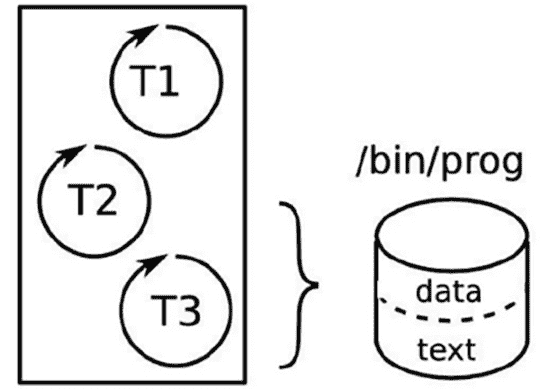
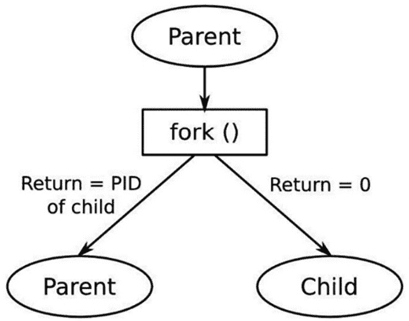
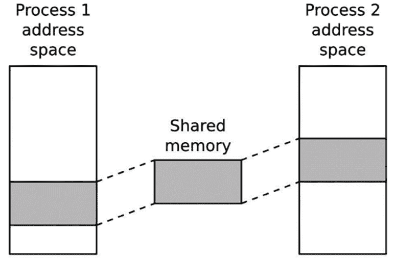

# 第十七章：进程和线程的学习

在前面的章节中，我们考虑了创建嵌入式 Linux 平台的各个方面。现在，到了开始了解如何利用该平台创建工作设备的时候了。在这一章中，我将讨论 Linux 进程模型的含义，以及它如何涵盖多线程程序。我将探讨使用单线程和多线程进程的优缺点，以及进程之间的异步消息传递和协程。最后，我将讲解调度，并区分时间共享调度和实时调度策略。

虽然这些话题并非嵌入式计算的专属内容，但对于任何嵌入式设备的设计师来说，了解这些话题是很重要的。关于这些主题有很多优秀的参考资料，其中一些我会在本章末尾列出，但一般来说，它们并没有考虑嵌入式的使用案例。因此，我将专注于概念和设计决策，而非函数调用和代码。

在这一章中，我们将讨论以下主题：

+   进程还是线程？

+   进程

+   线程

+   ZeroMQ

+   调度

# 技术要求

为了跟上示例的进度，请确保你已经具备以下条件：

+   Python：Python 3 解释器及标准库

+   Miniconda：用于 `conda` 包和虚拟环境管理的最小安装程序

如果你还没有安装 Miniconda，请参见**第十五章**中关于`conda`的部分，里面有安装 Miniconda 的步骤。本章的练习还需要 GCC C 编译器和 GNU Make，但这些工具通常在大多数 Linux 发行版中已经预装。

本章中使用的代码可以在本书 GitHub 仓库的`Chapter17`文件夹中找到：[`github.com/PacktPublishing/Mastering-Embedded-Linux-Development/tree/main/Chapter17`](https://github.com/PacktPublishing/Mastering-Embedded-Linux-Development/tree/main/Chapter17)。

# 进程还是线程？

许多熟悉**实时操作系统**（**RTOS**）的嵌入式开发人员认为 Unix 进程模型较为繁琐。另一方面，他们发现 RTOS 任务与 Linux 线程之间存在相似性，并倾向于将现有设计通过将 RTOS 任务一对一映射到线程的方式进行转移。我曾多次看到设计中整个应用程序是通过一个包含 40 个以上线程的进程来实现的。我想花些时间考虑这种做法是否明智。让我们从一些定义开始。

**进程**是一个内存地址空间和一个执行线程，如下图所示。地址空间对进程是私有的，因此不同进程中的线程无法访问它。这种**内存隔离**是由内核中的内存管理子系统创建的，它为每个进程维护一个内存页映射，并在每次上下文切换时重新编程内存管理单元。我将在*第十八章*中详细描述这一过程。部分地址空间被映射到一个文件，该文件包含程序运行时的代码和静态数据，如下所示：



图 17.1 – 进程

随着程序的运行，它将分配资源，例如堆栈空间、堆内存、文件引用等。当进程终止时，这些资源将被系统回收：所有内存将被释放，所有文件描述符将被关闭。

进程可以通过**进程间通信**（**IPC**）进行相互通信，例如本地套接字。我稍后会谈到 IPC。

**线程**是进程中的一个执行线程。所有进程从一个线程开始，该线程运行`main()`函数，并被称为主线程。你可以创建额外的线程，例如，使用`pthread_create(3)` POSIX 函数，这会导致多个线程在相同的地址空间中执行，如下图所示：



图 17.2 – 多个线程

线程位于同一进程中，彼此共享资源。它们可以读取和写入相同的内存，并使用相同的文件描述符。线程之间的通信是简单的，只要你处理好同步和锁的问题。

基于这些简要细节，你可以想象出两种极端的设计方案，用于一个假设的系统，将 40 个 RTOS 任务移植到 Linux。

你可以将任务映射到进程，并通过 IPC 使 40 个独立程序相互通信，例如，通过套接字发送消息。你将大大减少内存损坏的问题，因为每个进程中运行的主线程都被保护起来，免受其他进程的影响，同时减少资源泄漏，因为每个进程在退出后都会被清理。然而，进程之间的消息接口相当复杂，当一组进程紧密协作时，消息的数量可能会很大，进而成为系统性能的限制因素。此外，其中任何一个进程可能会终止，可能是由于程序中的 bug 导致崩溃，剩下的 39 个进程继续运行。每个进程都必须处理其邻近进程不再运行的情况，并且能够优雅地恢复。

在另一个极端，你可以将任务映射到线程，并将系统实现为一个包含 40 个线程的单一进程。因为它们共享相同的地址空间和文件描述符，合作变得更加容易。发送消息的开销减少或消除，线程之间的上下文切换比进程之间的切换更快。缺点是，你引入了一个可能性——即某个任务可能会破坏另一个任务的堆或栈。如果任何线程遇到致命错误，整个进程会终止，所有线程也会一起终止。最后，调试一个复杂的多线程进程可能会变得非常棘手。

你应该得出的结论是，没有一个设计是完美的，确实有更好的方式来处理。但在我们达到那个点之前，我会深入探讨一下进程和线程的 API 以及它们的行为。

# 进程

一个进程持有线程运行的环境：它包含内存映射、文件描述符、用户和组 ID 等。第一个进程是 `init` 进程，由内核在启动时创建，PID 为 1。此后，进程通过一种称为 **分叉** 的操作进行创建。

## 创建新进程

创建进程的 POSIX 函数是 `fork(2)`。这个函数很特别，因为对于每次成功调用，它会返回两次：一次是在发出调用的进程中，称为 **父进程**，另一次是在新创建的进程中，称为 **子进程**，如以下图所示：



图 17.3 – 分叉

在调用之后，子进程是父进程的精确副本：它有相同的栈、相同的堆和相同的文件描述符，并且执行相同的代码行——也就是紧跟在 `fork` 后的那一行。

程序员唯一可以区分它们的方式是查看 `fork` 的返回值：对于子进程来说，它是 *零*，对于父进程来说，它是 *大于零*。实际上，返回给父进程的值是新创建的子进程的 PID。还有第三种可能性，即返回值为负，这表示 `fork` 调用失败，仍然只有一个进程。

尽管这两个进程大体相同，但它们在不同的地址空间中。一个进程对变量的修改，另一个进程是无法看到的。在底层，内核并不会对父进程的内存做物理复制，这样的操作会非常慢，并且不必要地消耗内存。相反，内存是共享的，但会标记为 **写时复制** (**CoW**) 标志。如果父进程或子进程修改了这段内存，内核会进行复制，并写入复制后的内存。这使得分叉操作更加高效，同时也保持了进程地址空间的逻辑分离。我将在 *第十八章* 中详细讨论 CoW。

## 终止进程

一个进程可以通过调用`exit(3)`函数自愿停止，或者通过接收到一个未处理的信号被强制停止。特别是`SIGKILL`信号，无法被处理，因此它将始终终止一个进程。在所有情况下，终止进程将停止所有线程，关闭所有文件描述符，并释放所有内存。系统会向父进程发送一个`SIGCHLD`信号，通知其子进程已经终止。

进程有一个返回值，通常由`exit`的参数组成，如果进程正常终止；如果进程被终止，则由信号编号组成。这个返回值的主要用途是在 shell 脚本中：它允许你测试程序的返回值。按照惯例，`0`表示成功，其他任何值都表示某种类型的失败。

父进程可以通过`wait(2)`或`waitpid(2)`函数收集返回值。这会导致一个问题：在子进程终止与父进程收集返回值之间会有延迟。在这段时间内，返回值必须存储在某个地方，并且已终止进程的 PID 号不能被重用。处于这种状态的进程被称为**僵尸进程**，在`ps`和`top`命令中显示为`state Z`。只要父进程在接收到子进程终止通知时（通过`SIGCHLD`信号；有关信号处理的详细信息，请参阅*Linux 系统编程*，Robert Love 著，O'Reilly Media，或*The Linux Programming Interface*，Michael Kerrisk 著，No Starch Press），调用`wait`或`waitpid`，通常僵尸进程存在的时间太短，无法出现在进程列表中。如果父进程未能收集返回值，它们将成为问题，因为最终将没有足够的资源来创建更多进程。

`MELD/Chapter17/fork-demo`中的程序演示了进程创建和终止：

```
#include <stdio.h>
#include <stdlib.h>
#include <unistd.h>
#include <sys/types.h>
#include <sys/wait.h>
int main(void)
{
    int pid;
    int status;
    pid = fork();
    if (pid == 0) {
        printf("I am the child, PID %d\n", getpid());
        sleep(10);
        exit(42);
    } else if (pid > 0) {
        printf("I am the parent, PID %d\n", getpid());
        wait(&status);
        printf("Child terminated, status %d\n", WEXITSTATUS(status));
    } else {
        perror("fork:");
    }
    return 0;
} 
```

`wait`函数会阻塞，直到子进程退出并存储退出状态。运行时，您会看到类似如下的内容：

```
I am the parent, PID 13851
I am the child, PID 13852
Child terminated with status 42 
```

子进程会继承父进程的大部分属性，包括用户和组 ID、所有打开的文件描述符、信号处理和调度特性。

## 运行不同的程序

`fork`函数创建一个运行中的程序的副本，但它并不运行不同的程序。要实现这一点，你需要使用`exec`系列函数之一：

```
int execl(const char *path, const char *arg, ...);
int execlp(const char *file, const char *arg, ...);
int execle(const char *path, const char *arg, ..., char * const envp[]);
int execv(const char *path, char *const argv[]);
int execvp(const char *file, char *const argv[]);
int execvpe(const char *file, char *const argv[], ..., char *const envp[]); 
```

每个进程都会加载并运行一个程序文件路径。如果函数成功，内核会丢弃当前进程的所有资源，包括内存和文件描述符，并为正在加载的新程序分配内存。当调用`exec*`的线程返回时，它不会返回到调用后的代码行，而是返回到新程序的`main()`函数中。在`MELD/Chapter17/exec-demo`中有一个命令启动器示例：它会提示输入命令，例如`/bin/ls`，然后进行分叉并执行你输入的字符串。以下是代码：

```
#include <stdio.h>
#include <stdlib.h>
#include <string.h>
#include <unistd.h>
#include <sys/types.h>
#include <sys/wait.h>
int main(int argc, char *argv[])
{
    char command_str[128];
    int pid;
    int child_status;
    int wait_for = 1;
    while (1) {
        printf("sh> ");
        scanf("%s", command_str);
        pid = fork();
        if (pid == 0) {
            /* child */
            printf("cmd '%s'\n", command_str);
            execl(command_str, command_str, (char *)NULL);
            /* We should not return from execl, so only get
              to this line if it failed */
            perror("exec");
            exit(1);
        }
        if (wait_for) {
            waitpid(pid, &child_status, 0);
            printf("Done, status %d\n", child_status);
        }
     }
     return 0;
} 
```

运行时，你会看到如下内容：

```
# ./exec-demo
sh> /bin/ls
cmd '/bin/ls'
bin etc lost+found proc sys var
boot home media run tmp
dev lib mnt sbin usr
Done, status 0
sh> 
```

你可以通过输入*Ctrl + C*来终止程序。

可能看起来很奇怪，为什么会有一个函数来复制现有进程，而另一个函数则丢弃资源并将不同的程序加载到内存中，尤其是因为通常 `fork` 会紧接着调用 `exec` 函数。大多数操作系统将这两个操作合并为一个单独的调用。

然而，这种方式有显著的优势。例如，它使得在 shell 中实现重定向和管道变得非常容易。假设你想获取一个目录列表。以下是事件的顺序：

1.  你在 shell 提示符中输入 `ls`。

1.  Shell 创建了其子进程的副本。

1.  Shell 等待子进程完成。

1.  子进程执行 `/bin/ls`。

1.  `ls` 程序将目录列表打印到 `stdout`（文件描述符 1），即终端。你将看到目录列表。

1.  `ls` 程序终止，shell 恢复控制。

现在，假设你希望将目录列表重定向到一个文件中，而不是直接显示在屏幕上。此时，事件顺序如下：

1.  你输入 `ls > listing.txt`。

1.  Shell 创建了其子进程的副本。

1.  Shell 等待子进程完成。

1.  子进程打开并截断 `listing.txt` 文件，并使用 `dup2(2)` 将文件描述符 1（`stdout`）复制到该文件的文件描述符上。

1.  子进程执行 `/bin/ls`。

1.  程序像之前一样打印目录列表，但这次它将输出写入 `listing.txt` 文件。

1.  `ls` 程序终止，shell 恢复控制。

    **重要提示**

    在*第 4 步*中，有机会在执行程序之前修改子进程的环境。`ls` 程序不需要知道它是在写入文件而不是终端。`stdout` 可以连接到管道，这样 `ls` 程序仍然保持不变，可以将输出发送到另一个程序。这是 Unix 哲学的一部分，强调将许多小组件组合在一起，每个组件都能高效地完成任务，正如 Eric Steven Raymond 和 Addison Wesley 在《Unix 编程艺术》一书中描述的，特别是在*管道、重定向与过滤器*章节中。

到目前为止，我们在本节中查看的所有程序都在前台运行。但后台程序如何呢？它们等待某些事件的发生。让我们来看一下。

## 守护进程

我们已经在多个地方遇到过守护进程。**守护进程**是一个在后台运行的进程，由 `init` 进程拥有，并且不连接到控制终端。创建守护进程的步骤如下：

1.  调用 `fork` 来创建一个新进程，父进程退出，从而创建一个孤儿进程，这个孤儿进程将被重新归到 `init` 进程下。

1.  子进程调用 `setsid(2)`，创建一个新的会话和进程组，子进程是唯一的成员。这里的具体细节并不重要；你可以简单地将其视为一种将进程与任何控制终端隔离的方法。

1.  将工作目录更改为根目录。

1.  关闭所有文件描述符，并将`stdin`、`stdout`和`stderr`（描述符`0`、`1`和`2`）重定向到`/dev/null`，以确保没有输入，且所有输出都被隐藏。

幸运的是，所有前述步骤都可以通过一个函数调用`daemon(3)`来实现。

## 进程间通信

每个进程都是一个独立的内存岛。你可以通过两种方式将信息从一个进程传递到另一个进程。首先，你可以将其从一个地址空间移动到另一个地址空间。其次，你可以创建一个共享内存区域，两个进程都可以访问并共享数据。

第一个通常与队列或缓冲区结合使用，以便在进程之间传递一系列消息。这意味着消息需要被复制两次：首先复制到一个临时存储区，然后再复制到目的地。一些例子包括套接字、管道和消息队列。

第二种方式不仅需要一种方法来创建可以同时映射到两个（或更多）地址空间的内存，而且还需要一种同步访问该内存的方式，例如使用信号量或互斥锁。

POSIX 为所有这些提供了函数。还有一个较老的 API 集，称为**System V IPC**，它提供了消息队列、共享内存和信号量，但它没有 POSIX 等价物灵活，因此我在这里不做描述。`svipc(7)`手册页提供了这些设施的概述，更多细节可以参阅 Michael Kerrisk 的《Linux 程序接口》和 W. Richard Stevens 的《Unix 网络编程，第 2 卷》。

基于消息的协议通常比共享内存更易于编程和调试，但如果消息较大或数量很多，它们的速度会较慢。

### 基于消息的 IPC

有几种基于消息的 IPC 选项，我将简要总结如下。区分它们的属性如下：

+   消息流是否是单向或双向。

+   数据流是否是没有消息边界的字节流，还是保留边界的离散消息。在后一种情况下，消息的最大大小是一个重要因素。

+   消息是否带有优先级标签。

以下表格总结了这些属性在 FIFO、套接字和消息队列中的表现：

| **属性** | **FIFO** | **Unix 套接字：流** | **Unix 套接字：数据报** | **POSIX 消息队列** |
| --- | --- | --- | --- | --- |
| 消息边界 | 字节流 | 字节流 | 离散消息 | 离散消息 |
| 单向/双向 | 单向 | 双向 | 单向 | 单向 |
| 最大消息大小 | 无限 | 无限 | 100 KB 至 200 KB 范围内 | 默认：8 KB，绝对最大：1 MB |
| 优先级级别 | 无 | 无 | 无 | 0 到 32767 |

表 17.1 – FIFO、套接字和消息队列的属性

我们将首先探讨的基于消息的 IPC 形式是 Unix 套接字。

### Unix（或本地）套接字

**Unix 套接字**满足大多数要求，结合套接字 API 的熟悉度，是迄今为止最常见的机制。

Unix 套接字通过 `AF_UNIX` 地址族创建，并绑定到一个路径名。对套接字的访问权限由套接字文件的访问权限决定。与互联网套接字一样，套接字类型可以是 `SOCK_STREAM` 或 `SOCK_DGRAM`，前者提供双向字节流，后者提供带有保留边界的离散消息。Unix 套接字的数据报是可靠的，这意味着它们不会丢失或重排序。数据报的最大大小是系统相关的，可以通过 `/proc/sys/net/core/wmem_max` 获取。通常是 100 KB 或更大。

Unix 套接字没有机制来指示消息的优先级。

### FIFO 和命名管道

**FIFO** 和 **命名管道** 只是同一事物的不同术语。它们是匿名管道的扩展，用于在实现 shell 中的管道时在父子进程之间进行通信。

FIFO 是一种特殊的文件，通过 `mkfifo(1)` 命令创建。与 Unix 套接字一样，文件的访问权限决定了谁可以读取和写入。它们是单向的，这意味着通常有一个读取者和一个写入者，虽然也可以有多个写入者。数据是纯字节流，但它保证了小于与管道相关的缓冲区大小的消息的原子性。换句话说，写入小于此大小的数据不会被分割成多个小的写入，因此只要你一端的缓冲区足够大，你就可以一次性读取整个消息。现代内核的默认 FIFO 缓冲区大小为 64 KB，可以通过 `fcntl(2)` 和 `F_SETPIPE_SZ` 增加，最大值为 `/proc/sys/fs/pipe-max-size` 中的值，通常为 1 MB。没有优先级的概念。

### POSIX 消息队列

消息队列通过一个以斜杠开头并仅包含一个 `/` 字符的名称来标识。消息队列保存在 `mqueue` 类型的伪文件系统中。你可以通过 `mq_open(3)` 创建一个队列并获取对现有队列的引用，该函数返回一个文件描述符。每个消息都有一个优先级，消息按优先级顺序读取，然后按年龄顺序读取。消息的最大长度是 `/proc/sys/kernel/msgmax` 字节。

默认值为 8 KB，但你可以通过将值写入 `/proc/sys/kernel/msgmax` 设置为 128 字节到 1 MB 之间的任何大小。由于引用是文件描述符，因此可以使用 `select(2)`、`poll(2)` 和其他类似的函数来等待队列中的活动。

有关更多细节，请参考 Linux `mq_overview(7)` 手册页。

## 基于消息的进程间通信概述

Unix 套接字最常被使用，因为它们提供了所需的一切，除了可能的消息优先级。它们在大多数操作系统上实现，因此具有最大可移植性。

FIFO（先进先出队列）较少使用，主要是因为它缺少类似于**数据报**的功能。另一方面，API 非常简单，因为它提供了正常的`open(2)`、`close(2)`、`read(2)`和`write(2)`文件调用。

消息队列是这一组中使用最少的。内核中的代码路径没有像套接字（网络）和 FIFO（文件系统）调用那样得到优化。

还有一些更高层次的抽象，如 D-Bus，它们正在从主流 Linux 转向嵌入式设备。D-Bus 在底层使用 Unix 套接字和共享内存。

## 基于共享内存的进程间通信（IPC）

共享内存消除了在地址空间之间复制数据的需求，但引入了同步访问的难题。进程间同步通常通过使用信号量来实现。

### POSIX 共享内存

为了在进程之间共享内存，必须创建一个新的内存区域，然后将其映射到每个想要访问它的进程的地址空间，如下图所示：



图 17.4 – POSIX 共享内存

命名 POSIX 共享内存段遵循我们在消息队列中遇到的模式。这些段通过以/字符开头并且仅包含一个这样的字符的名称来标识：

```
#define SHM_SEGMENT_NAME "/demo-shm" 
```

`shm_open(3)`函数接受名称并返回相应的文件描述符。如果该内存段尚不存在，并且设置了`O_CREAT`标志，则会创建一个新的段。最初，它的大小为零。你可以使用（名字具有误导性的）`ftruncate(2)`函数将其扩展到所需的大小：

```
int shm_fd;
struct shared_data *shm_p;
/* Attempt to create the shared memory segment */
shm_fd = shm_open(SHM_SEGMENT_NAME, O_CREAT | O_EXCL | O_RDWR, 0666);
if (shm_fd > 0) {
    /* succeeded: expand it to the desired size (Note: dont't
       do this every time because ftruncate fills it with zeros) */
    printf("Creating shared memory and setting size=%d\n",
    SHM_SEGMENT_SIZE);
    if (ftruncate(shm_fd, SHM_SEGMENT_SIZE) < 0) {
        perror("ftruncate");
        exit(1);
    }
    <…>
} else if (shm_fd == -1 && errno == EEXIST) {
    /* Already exists: open again without O_CREAT */
    Shm_fd = shm_open(SHM_SEGMENT_NAME, O_RDWR, 0);
    <…>
} 
```

一旦你获得了共享内存的描述符，就可以使用`mmap(2)`将其映射到进程的地址空间，以便不同进程中的线程可以访问该内存：

```
/* Map the shared memory */
shm_p = mmap(NULL, SHM_SEGMENT_SIZE, PROT_READ | PROT_WRITE, MAP_SHARED, shm_fd, 0); 
```

`MELD/Chapter17/shared-mem-demo`中的程序提供了一个使用共享内存段进行进程间通信的示例。以下是`main`函数：

```
static sem_t *demo_sem;
<…>
int main(int argc, char *argv[])
{
    char *shm_p;
    printf("%s PID=%d\n", argv[0], getpid());
    shm_p = get_shared_memory();
    while (1) {
        printf("Press enter to see the current contents of shm\n");
        getchar();
        sem_wait(demo_sem);
        printf("%s\n", shm_p);
        /* Write our signature to the shared memory */
        sprintf(shm_p, "Hello from process %d\n", getpid());
        sem_post(demo_sem);
    }
    return 0;
} 
```

该程序使用共享内存段来在进程之间传递消息。消息内容是`Hello from process string`，后跟其 PID。`get_shared_memory`函数负责创建内存段（如果它不存在）或获取文件描述符（如果已存在）。它返回指向内存段的指针。请注意，存在一个信号量用于同步对内存的访问，以防止一个进程覆盖另一个进程的消息。

要尝试此功能，你需要在两个不同的终端会话中运行程序的两个实例。在第一个终端中，你会看到类似这样的内容：

```
# ./shared-mem-demo
./shared-mem-demo PID=271
Creating shared memory and setting size=65536
Press enter to see the current contents of shm
Press enter to see the current contents of shm
Hello from process 271 
```

因为这是程序第一次运行，它会创建内存段。最初，消息区域是空的，但在执行一次循环后，它包含了该进程的 PID，即 271。现在，你可以在另一个终端中运行第二个实例：

```
# ./shared-mem-demo
./shared-mem-demo PID=279
Press enter to see the current contents of shm
Hello from process 271
Press enter to see the current contents of shm
Hello from process 279 
```

它不会创建共享内存段，因为该内存段已经存在，并且它显示已经包含的消息，即另一个程序的 PID。按下 *Enter* 后，它会写入自己的 PID，第一个程序能够看到它。通过这种方式，两个程序可以相互通信。

POSIX IPC 函数是 POSIX 实时扩展的一部分，因此你需要将它们与 `librt` 链接。奇怪的是，POSIX 信号量是通过 POSIX 线程库实现的，因此你还需要将其与 `pthreads` 库链接。因此，在你针对 64 位 Arm SoC 进行编译时，编译参数如下所示：

```
$ aarch64-buildroot-linux-gnu-gcc shared-mem-demo.c -lrt -pthread -o shared-mem-demo 
```

这就结束了我们对 IPC 方法的调研。当我们介绍 ZeroMQ 时，会重新回到基于消息的 IPC。现在，是时候看看多线程进程了。

# 线程

线程的编程接口是 POSIX 线程 API，该接口最初在 *IEEE POSIX 1003.1c 标准（1995）* 中定义，通常称为 **pthreads**。它作为 `libpthread.so.0` C 库的附加部分实现。过去 20 年左右，`pthreads` 有过两种实现：**LinuxThreads** 和 **Native POSIX Thread Library**（**NPTL**）。后者对规范的遵循更为严格，尤其是在信号和进程 ID 的处理方面。现在，NPTL 已占主导地位。如果你遇到任何仍然使用 `LinuxThreads` 的 C 标准库，我建议避免使用它。

## 创建一个新线程

你可以用来创建线程的函数是 `pthread_create(3)`：

```
int pthread_create(pthread_t *restrict thread, const pthread_attr_t *restrict attr, typeof(void *(void *)) *start_routine, void *restrict arg); 
```

它创建了一个新的执行线程，线程从 `start_routine` 函数开始执行，并将描述符放置在 `pthread_t` 中，该描述符由 `thread` 指向。它继承了调用线程的调度参数，但这些参数可以通过传递指向线程属性的指针 `attr` 来覆盖。线程将立即开始执行。

`pthread_t` 是在程序中引用线程的主要方式，但也可以使用诸如 `ps -eLf` 这样的命令从外部查看线程：

```
UID PID PPID LWP C NLWP STIME TTY TIME CMD
<...>
chris 6072 5648 6072 0 3 21:18 pts/0 00:00:00 ./thread-demo
chris 6072 5648 6073 0 3 21:18 pts/0 00:00:00 ./thread-demo 
```

BusyBox `ps` 小程序不支持 `-eLf` 选项，因此请确保在嵌入式目标上安装完整的 `procps` 包。

在前面的输出中，`thread-demo` 程序有两个线程。`PID` 和 `PPID` 列显示它们都属于同一个进程，并且具有相同的父进程，正如你所期望的那样。然而，`LWP` 列是很有趣的。**LWP** 代表 **Light Weight Process**，在这里，它是线程的另一种称呼。该列中的数字也被称为 **Thread ID** 或 **TID**。在主线程中，TID 与 PID 相同，但对于其他线程，它是不同（更高）的值。你可以在文档中要求提供 PID 的地方使用 TID，但要注意，这种行为特定于 Linux，并不具有可移植性。下面是一个简单的程序，展示了线程的生命周期（代码位于 `MELD/Chapter17/thread-demo`）：

```
#include <stdio.h>
#include <unistd.h>
#include <pthread.h>
#include <sys/syscall.h>
static void *thread_fn(void *arg)
{
    printf("New thread started, PID %d TID %d\n",
        getpid(), (pid_t)syscall(SYS_gettid));
    sleep(10);
    printf("New thread terminating\n");
    return NULL;
}
int main(int argc, char *argv[])
{
    pthread_t t;
    printf("Main thread, PID %d TID %d\n",
        getpid(), (pid_t)syscall(SYS_gettid));
    pthread_create(&t, NULL, thread_fn, NULL);
    pthread_join(t, NULL);
    return 0;
} 
```

请注意，在 `thread_fn` 函数中，我通过 `syscall(SYS_gettid)` 获取线程 ID。在 `glibc` 2.30 之前，必须通过 `syscall` 直接调用 Linux，因为当时 C 库没有为 `gettid()` 提供包装函数。

给定内核能够调度的线程总数是有限制的。这个限制会根据系统的大小而变化，从小型设备上的约 1,000 到大型嵌入式设备上的数万个不等。实际数字可以在 `/proc/sys/kernel/threads-max` 中查看。一旦达到此限制，`fork` 和 `pthread_create` 将会失败。

## 终止一个线程

当以下任一情况发生时，线程会终止：

+   它达到了其 `start_routine` 的结束。

+   它调用了 `pthread_exit(3)`。

+   它被另一个线程通过调用 `pthread_cancel(3)` 取消。

+   包含线程的进程会终止，例如，因为某个线程调用了 `exit(3)`，或者进程收到了未处理、未屏蔽或未忽略的信号。

请注意，如果多线程程序调用 `fork`，则只有发出调用的线程会在新的子进程中存在。`fork` 不会复制所有线程。

线程有一个返回值，是一个空指针。一个线程可以通过调用 `pthread_join(2)` 等待另一个线程终止并收集其返回值。正如我们在前面的部分提到的，`thread-demo` 代码中有一个这样的例子。这会产生一个类似于进程僵尸问题的问题：线程的资源，如堆栈，必须等到另一个线程与之连接后才能释放。如果线程保持 *未连接* 状态，程序将发生资源泄漏。

## 编译带有线程的程序

POSIX 线程的支持是 `libpthread.so.0` 库中 C 库的一部分。然而，构建包含线程的程序不仅仅是链接库：必须对编译器生成代码的方式进行修改，以确保某些全局变量，如 `errno`，每个线程都有一个实例，而不是整个进程共享一个实例。

**提示**

在构建多线程程序时，添加 `-pthread` 开关。添加 `-pthread` 会自动将 `-lpthread` 添加到编译器驱动的链接命令中。

## 线程间通信

线程的一个大优点是它们共享地址空间，并且可以共享内存变量。这也是一个大缺点，因为它需要同步，以保持数据一致性，类似于进程之间共享内存段的方式，但提供了线程可以共享所有内存的条件。事实上，线程可以使用 **线程局部存储**（**TLS**）创建私有内存，但我在这里不会讨论这一点。

`pthreads` 接口提供了实现同步所需的基本功能：互斥锁和条件变量。如果你需要更复杂的结构，就必须自己构建。

值得注意的是，我们之前描述的所有 IPC 方法——即套接字、管道和消息队列——在同一进程中的线程之间同样有效。

## 互斥

要编写健壮的程序，你需要使用互斥锁保护每个共享资源，并确保每个读取或写入该资源的代码路径首先锁定互斥锁。如果你始终遵守这个规则，大多数问题应该能得到解决。剩下的问题与互斥锁的基本行为相关。我将在这里简要列出它们，但不会过多细谈：

+   **死锁**：当互斥锁永远被锁住时，就会发生死锁。一个经典的情况是**致命的拥抱**，在这种情况下，两个线程各自需要两个互斥锁，并且成功锁住了其中一个，但没有锁住另一个。每个线程都会阻塞，等待对方持有的锁，因此它们保持在原地。避免致命拥抱问题的一个简单规则是确保互斥锁始终按照相同的顺序进行锁定。其他解决方案包括超时和回退时间。

+   **优先级反转**：等待互斥锁造成的延迟可能导致实时线程错过截止日期。优先级反转的具体情况发生在一个高优先级线程被阻塞，等待一个低优先级线程持有的互斥锁。如果低优先级线程被其他中等优先级线程抢占，那么高优先级线程就会被迫等待一个不确定长度的时间。存在名为**优先级继承**和**优先级上限**的互斥锁协议，通过在内核中为每个锁定和解锁操作增加更多的处理开销来解决这一问题。

+   **性能差**：只要线程大部分时间不需要在互斥锁上阻塞，互斥锁对代码的开销是最小的。然而，如果你的设计中有一个资源被很多线程需要，那么竞争比例就会变得显著。这通常是一个设计问题，可以通过使用更细粒度的锁定或不同的算法来解决。

互斥锁并不是线程间同步的唯一方式。我们在讲解 POSIX 共享内存时见证了两个进程如何使用信号量互相通知对方。线程也有类似的机制。

## 条件变化

协作线程需要能够相互提醒，告诉对方某些事情已经改变，需要关注。这就是所谓的**条件**，而这个提醒是通过**条件变量**（或**condvar**）发送的。

条件只是你可以测试以得到真或假结果的东西。一个简单的例子是一个缓冲区，它包含零个或若干个项目。一个线程从缓冲区取出项目，缓冲区为空时它会休眠。另一个线程将项目放入缓冲区，并向其他线程发出信号，表明条件发生了变化。如果它正在休眠，它需要醒来并做点什么。唯一的复杂性是，条件根据定义是共享资源，因此必须通过互斥锁来保护。

下面是一个有两个线程的简单程序。第一个是生产者：它每秒醒来一次，将一些数据放入全局变量中，然后发出信号，表明数据已经发生变化。第二个线程是消费者：它等待条件变量，并在每次醒来时测试条件（即缓冲区中有一个非零长度的字符串）。你可以在`MELD/Chapter17/condvar-demo`中找到代码：

```
#include <stdio.h>
#include <stdlib.h>
#include <pthread.h>
#include <unistd.h>
#include <string.h>
char g_data[128];
pthread_cond_t cv = PTHREAD_COND_INITIALIZER;
pthread_mutex_t mutx = PTHREAD_MUTEX_INITIALIZER;
void *consumer(void *arg)
{
    while (1) {
        pthread_mutex_lock(&mutx);
        while (strlen(g_data) == 0)
            pthread_cond_wait(&cv, &mutx);
        /* Got data */
        printf("%s\n", g_data);
        /* Truncate to null string again */
        g_data[0] = 0;
        pthread_mutex_unlock(&mutx);
    }
    return NULL;
}
void *producer(void *arg)
{
    int i = 0;
    while (1) {
        sleep(1);
        pthread_mutex_lock(&mutx);
        sprintf(g_data, "Data item %d", i);
        pthread_mutex_unlock(&mutx);
        pthread_cond_signal(&cv);
        i++;
    }
    return NULL;
} 
```

请注意，当消费者线程在条件变量上阻塞时，它是在持有锁定的互斥锁的情况下进行的，这似乎为死锁埋下了伏笔——下次生产者线程尝试更新条件时会发生死锁。为了避免这种情况，`pthread_cond_wait(3)`在线程被阻塞后会解锁互斥锁，然后在线程醒来并从等待中返回之前再次锁定它。

## 划分问题

现在我们已经覆盖了进程和线程的基础知识以及它们如何进行通信，是时候看看我们可以用它们做些什么了。

下面是我在构建系统时使用的一些规则：

+   **规则 1**：将交互较多的任务放在一起：重要的是通过将密切交互的线程放在同一个进程中来减少开销。

+   **规则 2**：不要把所有线程放在一个篮子里：另一方面，尽量将相互作用有限的组件放在不同的进程中，以提高弹性和模块化。

+   **规则 3**：不要在同一个进程中混合关键线程和非关键线程：这是对*规则 2*的进一步说明：系统的关键部分，可能是机器控制程序，应该尽可能保持简单，并且比其他部分写得更为严格。即使其他进程失败，它也必须能够继续运行。如果你有实时线程，按照定义，它们必须是关键线程，应该单独放入一个进程中。

+   **规则 4**：线程不应过于亲密：编写多线程程序时的一个诱惑是将线程之间的代码和变量交织在一起，因为这是一个集成的程序，做起来很容易。保持线程的模块化，并定义清晰的交互。

+   **规则 5**：不要认为线程是免费的：创建额外的线程非常容易，但协调它们的活动所需的额外复杂性代价很高。

+   **规则 6**：线程可以并行工作：线程可以在多核处理器上同时运行，从而提供更高的吞吐量。如果有一个大型计算任务，您可以为每个核心创建一个线程，并充分利用硬件。有一些库可以帮助您做到这一点，比如 OpenMP。您应该避免从头开始编写并行编程算法。

Android 设计是一个很好的例证。每个应用程序都是一个独立的 Linux 进程，有助于模块化内存管理，并确保一个应用崩溃不会影响整个系统。该进程模型还用于访问控制：一个进程只能访问其 UID 和 GID 允许的文件和资源。每个进程中都有一组线程。有一个用于管理和更新用户界面，一个用于处理来自操作系统的信号，几个用于管理动态内存分配和释放 Java 对象，以及至少两个线程的工作池，用于使用 Binder 协议从系统其他部分接收消息。

总结一下，进程提供了弹性，因为每个进程都有受保护的内存空间，当进程终止时，所有资源，包括内存和文件描述符，都会被释放，减少资源泄漏。另一方面，线程共享资源，可以通过共享变量轻松通信，并通过共享对文件和其他资源的访问来合作。线程通过工作池和其他抽象提供并行性，在多核处理器中非常有用。

# ZeroMQ

套接字、命名管道和共享内存是进程间通信的手段。它们充当大多数非平凡应用程序中的消息传递过程的传输层。并发原语如互斥锁和条件变量用于管理共享访问和协调同一进程内运行的线程之间的工作。多线程编程是非常困难的，套接字和命名管道也有它们自己的一套注意事项。需要一个更高级别的 API 来抽象异步消息传递的复杂细节。这就是 ZeroMQ 的用武之地。

**ZeroMQ** 是一个异步消息传递库，类似于并发框架。它支持进程内、进程间、TCP 和多播传输，以及包括 C、C++、Go 和 Python 在内的各种编程语言绑定。这些绑定以及 ZeroMQ 基于套接字的抽象使团队可以轻松地在同一个分布式应用程序中混合使用不同的编程语言。该库还内置了常见的消息传递模式，如请求/回复、发布/订阅和并行管道。ZeroMQ 中的 *zero* 指的是 *零成本*，而 *MQ* 部分代表 *消息队列*。

我们将使用 ZeroMQ 探索基于消息的进程间和进程内通信。让我们首先为 Python 安装 ZeroMQ。

## 获取 pyzmq

我们将使用 ZeroMQ 的官方 Python 绑定来完成以下练习。我推荐在一个新的虚拟环境中安装`pyzmq`包。如果你的系统上已经安装了`conda`，创建一个 Python 虚拟环境非常简单。以下是使用`conda`提供所需虚拟环境的步骤：

1.  导航到包含示例的`zeromq`目录：

    ```
    (base) $ cd MELD/Chapter17/zeromq 
    ```

1.  创建一个名为`zeromq`的新虚拟环境：

    ```
    (base) $ conda create --name zeromq python=3.12 pyzmq 
    ```

1.  激活你的新虚拟环境：

    ```
    (base) $ conda activate zeromq 
    ```

1.  检查 Python 版本是否为 3.12：

    ```
    (zeromq) $ python –-version 
    ```

1.  列出你环境中已安装的包：

    ```
    (zeromq) $ conda list 
    ```

如果在包列表中看到`pyzmq`及其依赖项，那么你现在可以开始运行以下练习了。

## 进程间消息传递

我们将从一个简单的回显服务器开始探索 ZeroMQ。服务器期望从客户端接收一个字符串形式的名称，并回复`Hello <name>`。代码位于`MELD/Chapter17/zeromq/server.py`：

```
import time
import zmq
context = zmq.Context()
socket = context.socket(zmq.REP)
socket.bind("tcp://*:5555")
while True:
    # Wait for next request from client
    message = socket.recv_pyobj()
    print(f"Received request: {message}")
    # Do some 'work'
    time.sleep(1)
    # Send reply back to client
    socket.send_pyobj(f"Hello {message}") 
```

服务器进程创建一个`REP`类型的套接字用于响应，将该套接字绑定到端口`5555`，并等待接收消息。在接收到请求并发送回回复之间，使用 1 秒的睡眠来模拟一些工作。

回显客户端的代码位于`MELD/Chapter17/zeromq/client.py`：

```
import zmq
def main(who):
    context = zmq.Context()
    # Socket to talk to server
    print("Connecting to echo server...")
    socket = context.socket(zmq.REQ)
    socket.connect("tcp://localhost:5555")
    # Do 5 requests, waiting each time for a response
    for request in range(5):
        print(f"Sending request {request} ...")
        socket.send_pyobj(who)
        # Get the reply.
        message = socket.recv_pyobj()
        print(f"Received reply {request} [ {message} ]")
if __name__ == '__main__':
    import sys
    if len(sys.argv) != 2:
        print("usage: client.py <username>")
        raise SystemExit
    main(sys.argv[1]) 
```

客户端进程接受一个用户名作为命令行参数。客户端为请求创建一个`REQ`类型的套接字，连接到在端口`5555`上监听的服务器进程，并开始发送包含传入用户名的消息。与服务器中的`socket.recv()`一样，客户端中的`socket.recv()`也会阻塞，直到队列中收到消息。

为了查看回显服务器和客户端代码的运行效果，激活你的`zeromq`虚拟环境，并在`MELD/Chapter17/zeromq`目录中运行`planets.sh`脚本：

```
(zeromq) $ ./planets.sh 
```

`planets.sh`脚本会启动三个客户端进程，分别为`Mars`、`Jupiter`和`Venus`。我们可以看到，三个客户端的请求是交错进行的，因为每个客户端在发送下一个请求之前会等待来自服务器的回复。由于每个客户端发送五个请求，我们应该从服务器接收到总共 15 个回复。使用 ZeroMQ 进行基于消息的进程间通信非常简单。现在，让我们结合 Python 的内建`asyncio`模块和 ZeroMQ 来进行进程内消息传递。

## 进程内消息传递

`asyncio`模块是在 Python 3.4 版本中引入的。它增加了一个可插拔的事件循环，用于通过协程执行单线程并发代码。**协程**（也称为*绿色线程*）在 Python 中使用`async`/`await`语法声明，这一语法从 C#中引入。与 POSIX 线程相比，协程的开销更小，更像是可恢复的函数。由于协程在事件循环的单线程上下文中操作，我们可以将`pyzmq`与`asyncio`结合使用，实现基于套接字的进程内消息传递。

这里是一个稍微修改过的协程示例，来自 [`github.com/zeromq/pyzmq`](https://github.com/zeromq/pyzmq) 仓库：

```
import asyncio
import time
import zmq
from zmq.asyncio import Context, Poller
url = 'inproc://#1'
ctx = Context.instance()
async def ping() -> None:
    """print dots to indicate idleness"""
    while True:
        await asyncio.sleep(0.5)
        print('.')
async def receiver() -> None:
    """receive messages with polling"""
    pull = ctx.socket(zmq.PAIR)
    pull.connect(url)
    poller = Poller()
    poller.register(pull, zmq.POLLIN)
    while True:
        events = await poller.poll()
        if pull in dict(events):
            print("recving", events)
            msg = await pull.recv_multipart()
            print('recvd', msg)
async def sender() -> None:
    """send a message every second"""
    tic = time.time()
    push = ctx.socket(zmq.PAIR)
    push.bind(url)
    while True:
        print("sending")
        await push.send_multipart([str(time.time() - tic).encode('ascii')])
        await asyncio.sleep(1)
async def main() -> None:
    tasks = [asyncio.create_task(coroutine()) for coroutine in [ping, receiver, sender]]
    await asyncio.wait(tasks)
if __name__ == "__main__":
    asyncio.run(main()) 
```

注意，`receiver()` 和 `sender()` 协程共享相同的上下文。`url` 部分指定的 `inproc` 传输方法用于线程间通信，比我们在前一个示例中使用的 `tcp` 传输要快得多。`PAIR` 模式将两个套接字独占连接。与 `inproc` 传输一样，这种消息传递模式仅在进程内工作，旨在实现线程间的信号传递。`receiver()` 和 `sender()` 协程都没有返回。`asyncio` 事件循环在两个协程之间交替执行，在线程阻塞或 I/O 完成时挂起和恢复每个协程。

要从你当前的 `zeromq` 虚拟环境中运行协程示例，使用以下命令：

```
(zeromq) $ python coroutines.py 
```

`sender()` 向 `receiver()` 发送时间戳，后者显示这些时间戳。使用 *Ctrl + C* 终止进程。恭喜！你刚刚见证了不使用显式线程的进程内异步消息传递。关于协程和 `asyncio` 还有很多内容可以学习和讨论。这个示例只是让你感受一下 Python 与 ZeroMQ 配合使用时的新功能。暂时让我们抛开单线程事件循环，回到 Linux 的话题。

# 调度

本章我想要讨论的第二个大主题是调度。Linux 调度程序有一个准备好运行的线程队列，它的工作是将这些线程调度到可用的 CPU 上。每个线程都有一个调度策略，可能是时间共享的或实时的。时间共享线程有一个 **niceness** 值，决定了它们获得 CPU 时间的优先级。实时线程有 **优先级**，较高优先级的线程会抢占较低优先级的线程。调度程序是与线程打交道，而不是进程。每个线程都会被调度，无论它是在哪个进程中运行。

调度程序在以下任何情况下都会运行：

+   线程通过调用 `sleep()` 或其他阻塞系统调用被阻塞。

+   时间共享线程耗尽了它的时间片。

+   中断会导致线程解除阻塞，例如，I/O 完成时。

关于 Linux 调度程序的背景信息，我推荐你阅读 Robert Love 的《*Linux 内核开发（第 3 版）*》中关于进程调度的章节。

## 公平性与确定性

我将调度策略分为两类：时间共享和实时。时间共享策略基于*公平性*原则。它们旨在确保每个线程获得公平的处理器时间，并且没有线程能够独占系统。如果一个线程运行时间过长，它将被放到队列的末尾，以便其他线程也能运行。同时，公平性策略需要适应那些执行大量工作的线程，并为它们提供足够的资源来完成任务。时间共享调度非常好，因为它能根据各种工作负载自动进行调整。

另一方面，如果你有一个实时程序，公平性就没有帮助了。在这种情况下，你需要一个**确定性**策略，它至少能保证实时线程在正确的时间被调度，以便它们不会错过截止时间。这意味着实时线程必须抢占时间共享线程。实时线程还有一个静态优先级，调度器可以根据这个优先级在有多个线程同时运行时选择哪个线程先执行。Linux 的实时调度器实现了一个相当标准的算法，它会运行优先级最高的实时线程。大多数实时操作系统调度器也是按照这种方式编写的。

两种类型的线程可以共存。需要确定性调度的线程会先被调度，其余的时间会分配给时间共享线程。

## 时间共享策略

时间共享策略旨在实现公平性。从 Linux 2.6.23 开始，使用的调度器是**完全公平调度器**（**CFS**）。它不像传统的时间片轮转调度那样使用固定的时间片。相反，它会计算一个线程应该获得的 CPU 时间量，并将其与线程实际运行的时间进行平衡。如果线程超出了它的应得时间，并且有其他时间共享线程等待运行，调度器会暂停当前线程，改为运行一个等待的线程。

时间共享策略如下：

+   `SCHED_NORMAL`（也叫 `SCHED_OTHER`）：这是默认的调度策略。绝大多数 Linux 线程使用该策略。

+   `SCHED_BATCH`：这与 `SCHED_NORMAL` 类似，唯一不同的是，线程的调度粒度较大；即线程运行的时间较长，但必须等待更长时间才能再次被调度。其目的是减少背景处理（批处理任务）中的上下文切换次数，并减少 CPU 缓存的切换。

+   `SCHED_IDLE`：这些线程只有在没有其他策略的线程准备好运行时才会运行。它的优先级是最低的。

你可以使用两对函数来获取和设置线程的策略和优先级。第一对函数以 PID 作为参数，影响进程中的主线程：

```
struct sched_param {
    <…>
    int sched_priority;
    <…>
};
int sched_setscheduler(pid_t pid, int policy,
    const struct sched_param *param);
int sched_getscheduler(pid_t pid); 
```

第二对函数操作 `pthread_t`，可以改变进程中其他线程的参数：

```
int pthread_setschedparam(pthread_t thread, int policy,
    const struct sched_param *param);
int pthread_getschedparam(pthread_t thread, int *policy,
    struct sched_param *param); 
```

有关线程策略和优先级的更多信息，请参见`sched(7)`手册页。现在我们知道了时间共享策略和优先级是什么，让我们来谈谈 nice 值。

### nice 值

一些时间共享线程比其他线程更重要。你可以通过 nice 值来表示这一点，nice 值通过缩放因子来调整线程的 CPU 分配。这个名字来自于函数调用`nice(2)`，它从 Unix 的早期就已经存在。通过减少对系统的负载或通过增加负载，线程变得更 nice。nice 值的范围是从`19`，表示非常 nice，到`-20`，表示非常不 nice。默认值是`0`，表示适中或一般 nice。

可以改变`SCHED_NORMAL`和`SCHED_BATCH`线程的 nice 值。要降低 nice 值，这会增加 CPU 负载，你需要`CAP_SYS_NICE`权限，该权限默认只授予`root`用户。有关权限的更多信息，请参见`capabilities(7)`手册页。

几乎所有关于改变`nice`值的函数和命令的文档（如`nice(2)`及`nice`和`renice`命令）都从进程角度讨论。然而，它实际上是与线程相关的。正如我们在前一节中提到的，你可以使用 TID 代替 PID 来改变单个线程的`nice`值。`nice`的标准描述中还有另一个不一致之处：`nice`值被称为线程的优先级（或有时错误地被称为进程的优先级）。我认为这是误导性的，并将概念与实时优先级混淆了，而实时优先级是完全不同的概念。

## 实时策略

实时策略旨在确保确定性。实时调度器总是会运行准备好的优先级最高的实时线程。实时线程总是抢占时间共享线程。本质上，通过选择实时策略而非时间共享策略，你表示你已经掌握了该线程预期调度的内部信息，并希望覆盖调度器内置的假设。

有两种实时策略：

+   `SCHED_FIFO`：这是一种**运行至完成**算法，意味着一旦线程开始运行，它将继续执行，直到被更高优先级的实时线程抢占，或在系统调用中被阻塞，或者直到它终止（完成）。

+   `SCHED_RR`：这是一种**轮转**算法，如果线程超出了时间片（默认是 100 毫秒），它将在同一优先级的线程之间进行轮换。从 Linux 3.9 开始，可以通过`/proc/sys/kernel/sched_rr_timeslice_ms`控制`timeslice`值。除此之外，它的行为与`SCHED_FIFO`相同。

每个实时线程的优先级范围是`1`到`99`，其中`99`是最高优先级。

要给线程分配实时策略，你需要`CAP_SYS_NICE`权限，默认情况下该权限仅授予 root 用户。

实时调度的一个问题，无论是在 Linux 还是其他地方，都是当一个线程变成计算密集型时，通常是因为某个 bug 导致它无限循环，这将阻止低优先级的实时线程与所有共享时间线程一起运行。在这种情况下，系统会变得不稳定，甚至可能完全死锁。防止这种情况发生的方法有几种。

首先，自 Linux 2.6.25 以来，调度器默认将 5%的 CPU 时间保留给非实时线程，这样即使一个失控的实时线程也无法完全停止系统。通过两个内核控制来配置：

+   `/proc/sys/kernel/sched_rt_period_us`

+   `/proc/sys/kernel/sched_rt_runtime_us`

它们的默认值分别为 1,000,000（1 秒）和 950,000（950 毫秒），这意味着每秒保留 50 毫秒用于非实时处理。如果希望实时线程能够占用 100%的时间，则将`sched_rt_runtime_us`设置为`-1`。

第二个选项是使用看门狗，无论是硬件还是软件，来监控关键线程的执行，并在它们开始错过截止日期时采取行动。我在*第十三章*中提到了看门狗。

## 选择一种策略

实际上，时间共享策略满足了大多数计算工作负载。I/O 密集型线程会花费大量时间被阻塞，并且总是有一些剩余的配额。当它们解除阻塞时，将几乎立即被调度。同时，CPU 密集型线程自然会占用所有剩余的 CPU 周期。可以对不太重要的线程应用正的 nice 值，对更重要的线程应用负的 nice 值。

当然，这只是平均行为；没有保证每次都会这样。如果需要更确定的行为，则需要实时策略。将线程标记为实时的标准如下：

+   它有一个必须生成输出的截止日期。

+   错过截止日期会影响系统的有效性。

+   它是事件驱动的。

+   它不是计算密集型的。

实时任务的例子包括经典的机器人臂伺服控制器、多媒体处理和通信处理。我将在稍后的*第二十一章*中讨论实时系统设计。

## 选择实时优先级

选择适合所有预期工作负载的实时优先级是一项复杂的任务，也是避免使用实时策略的一个充分理由。

选择优先级的最常用方法被称为**速率单调分析**（**RMA**），它来源于 Liu 和 Layland 在 1973 年发表的论文。它适用于具有周期性线程的实时系统，这是一个非常重要的类别。每个线程都有一个周期和一个利用率，利用率是该周期内线程将执行的时间比例。目标是平衡负载，使所有线程能够在下一个周期开始前完成执行阶段。RMA 指出，如果以下条件成立，就能实现这一目标：

+   优先级最高的线程是那些周期最短的线程。

+   总利用率小于 69%。

总利用率是所有单个利用率之和。它还假设线程之间的交互或在互斥锁等上被阻塞的时间可以忽略不计。

# 摘要

Linux 中内建的悠久 Unix 遗产和随附的 C 库几乎提供了编写稳定且具有韧性的嵌入式应用所需的一切。问题在于，对于每项工作，至少有两种方法可以实现你想要的结果。

本章重点讨论了系统设计的两个方面：将任务划分为多个独立进程，每个进程有一个或多个线程来完成工作，以及调度这些线程。我希望我能对这些内容有所阐明，并为你们进一步学习打下基础。

在下一章，我将探讨系统设计的另一个重要方面：内存管理。

# 进一步学习

+   *《Unix 编程艺术》*，作者：Eric Steven Raymond

+   *《Linux 系统编程，第 2 版》*，作者：Robert Love

+   *《Linux 内核开发，第 3 版》*，作者：Robert Love

+   *《Linux 编程接口》*，作者：Michael Kerrisk

+   *《UNIX 网络编程，第 2 卷：进程间通信，第 2 版》*，作者：W. Richard Stevens

+   *《POSIX 线程编程》*，作者：David R. Butenhof

+   *《硬实时环境中的多程序调度算法》*，作者：C. L. Liu 和 James W. Layland，发表于《ACM 期刊》，1973 年，第 20 卷，第 1 期，第 46-61 页

# 加入我们社区的 Discord

加入我们社区的 Discord 空间，与作者和其他读者进行讨论：[`packt.link/embeddedsystems`](https://packt.link/embeddedsystems)


