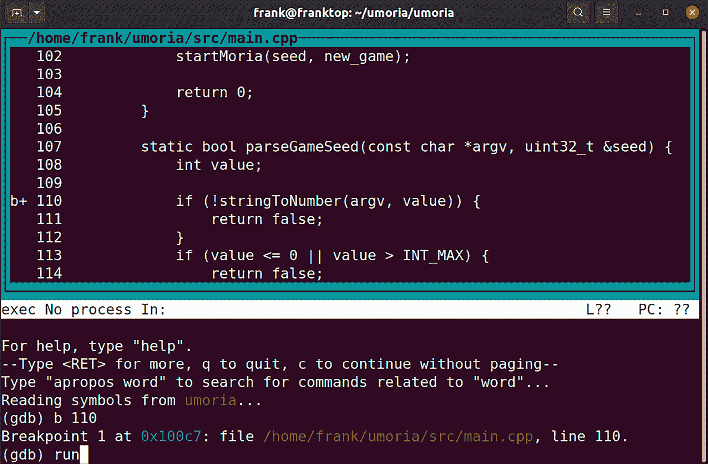
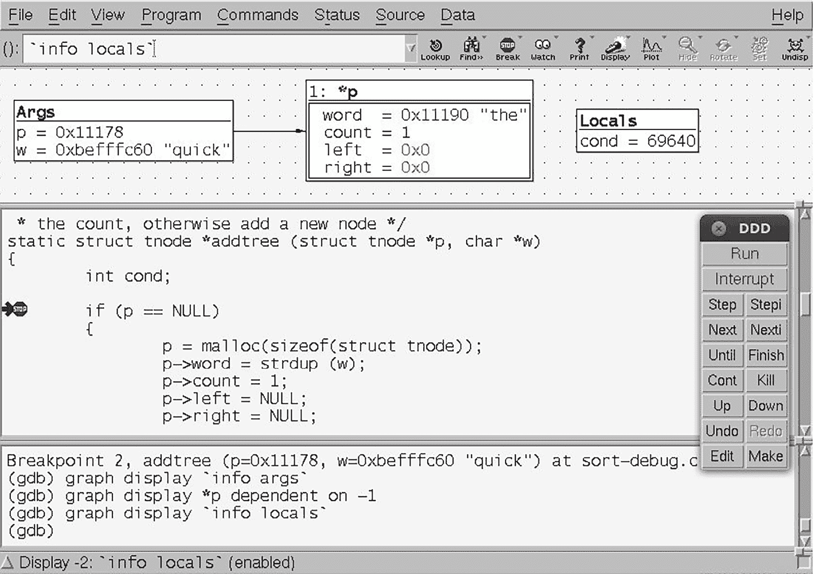
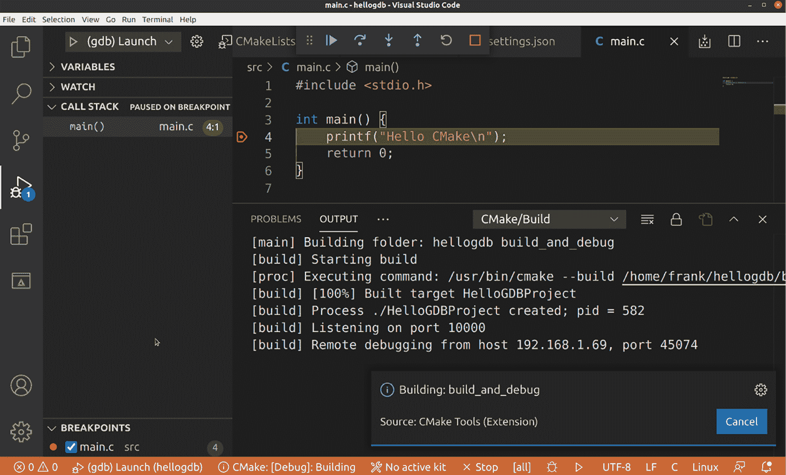

# 第十九章：使用 GDB 调试

错误是不可避免的，识别并修复它们是开发过程的一部分。找到并表征程序缺陷有许多不同的技术，包括静态和动态分析、代码审查、跟踪、性能分析和交互式调试。我们将在下一章讨论跟踪器和性能分析器，但这里我想专注于通过调试器查看代码执行的传统方法，在我们的案例中是**GNU 调试器**（**GDB**）。GDB 是一个强大且灵活的工具。你可以用它来调试应用程序、检查程序崩溃后生成的后期文件（核心文件），甚至逐步调试内核代码。

本章将介绍以下内容：

+   GNU 调试器

+   准备调试

+   调试应用程序

+   即时调试

+   调试分支和线程

+   核心文件

+   GDB 用户界面

+   调试内核代码

# 技术要求

为了跟上示例的进度，请确保你已经准备好了以下内容：

+   一台运行 Ubuntu 24.04 或更高版本 LTS 的主机系统，且至少有 90 GB 的空闲磁盘空间

+   Buildroot 2024.02.6 LTS 版本

+   Yocto 5.0（Scarthgap）LTS 版本

+   一个 microSD 卡读卡器和卡

+   适用于 Linux 的 balenaEtcher

+   一根以太网电缆和一台具有可用端口的路由器，用于网络连接

+   一条带有 3.3 V 电平的 USB 转 TTL 串口电缆

+   一台 Raspberry Pi 4

+   一款能够提供 3 A 电流的 5 V USB-C 电源

你应该已经安装了 Buildroot 的 2024.02.6 LTS 版本，参考*第六章*。如果没有，请在按照*第六章*的说明在你的 Linux 主机上安装 Buildroot 之前，参考*系统要求部分*的*Buildroot 用户手册*（[`buildroot.org/downloads/manual/manual.html`](https://buildroot.org/downloads/manual/manual.html)）。

你应该已经在*第六章*中构建了 Yocto 的 5.0（Scarthgap）LTS 版本。如果还没有，请参考*兼容的 Linux 发行版*和*构建主机包*部分的*Yocto 项目快速构建*指南（[`docs.yoctoproject.org/brief-yoctoprojectqs/`](https://docs.yoctoproject.org/brief-yoctoprojectqs/)），然后按照*第六章*中的说明在你的 Linux 主机上构建 Yocto。

本章使用的代码可以在本书 GitHub 仓库的章节文件夹中找到：[`github.com/PacktPublishing/Mastering-Embedded-Linux-Development/tree/main/Chapter19`](https://github.com/PacktPublishing/Mastering-Embedded-Linux-Development/tree/main/Chapter19)。

# GNU 调试器

GDB 是一个源级调试器，主要用于编译语言，如 C 和 C++，但也支持多种其他语言，如 Go 和 Objective-C。你应该阅读你所使用的 GDB 版本的说明，以了解对不同语言的支持情况。

项目网站是[`www.gnu.org/software/gdb/`](https://www.gnu.org/software/gdb/)，上面包含了很多有用的信息，包括 GDB 用户手册《*调试与 GDB*》。

默认情况下，GDB 有一个命令行用户界面，虽然有些人觉得它不太友好，但实际上只需一些练习就能轻松使用。如果你不喜欢命令行界面，有很多 GDB 的前端用户界面可以选择，我将在本章稍后描述其中的三个。

# 准备调试

你需要用调试符号编译你想调试的代码。GCC 为此提供了两个选项：`-g`和`-ggdb`。后者添加了专门针对 GDB 的调试信息，而前者生成适用于你所使用的目标操作系统的格式信息，使其更具可移植性。由于 GDB 是 Linux 上的默认调试器，因此最好使用`-ggdb`。这两个选项都允许你指定调试信息的级别，从`0`到`3`：

+   `0`：这不生成任何调试信息，等同于省略`-g`或`-ggdb`选项。

+   `1`：这生成最少的信息，但包括函数名称和外部变量，足以生成回溯。

+   `2`：这是默认设置，包含关于本地变量和行号的信息，以便你可以进行源代码级别的调试并逐步执行代码。

+   `3`：这包括额外的信息，其中包括使 GDB 能够正确处理宏展开。

在大多数情况下，`-g`就足够了：如果你在逐步执行代码时遇到问题，尤其是当代码包含宏时，可以保留`-g3`或`-ggdb3`。

下一步需要考虑的是代码优化的级别。编译器优化往往会破坏源代码行与机器代码之间的关系，这使得逐步调试变得不可预测。如果你遇到此类问题，很可能需要在不进行优化的情况下编译，省略`-O`编译选项，或者使用`-Og`，该选项启用不会干扰调试的优化。

一个相关的问题是栈帧指针，这是 GDB 生成函数调用回溯所必需的。在某些架构中，GCC 在更高级别的优化（`-O2`及以上）下不会生成栈帧指针。如果你遇到必须使用`-O2`编译但仍希望生成回溯的情况，你可以通过`-fno-omit-frame-pointer`来覆盖默认行为。此外，注意一些经过手动优化的代码，它通过添加`-fomit-frame-pointer`来省略栈帧指针：你可能需要暂时去除这些部分。

# 调试应用程序

你可以通过两种方式使用 GDB 调试应用程序：如果你正在开发运行在桌面和服务器上的代码，或者在任何你编译并运行代码的相同机器环境下，运行 GDB 本地化是很自然的。然而，大多数嵌入式开发是使用交叉工具链完成的，因此你希望调试在设备上运行的代码，但从交叉开发环境中控制它，在那里你有源代码和工具。我将重点讲解后者的情况，因为它是嵌入式开发者最常见的场景，但我也会展示如何设置一个本地调试的系统。我在这里不会描述 GDB 的基本使用方法，因为已经有很多很好的参考资料了，包括 GDB 用户手册和本章末尾建议的*进一步学习*部分。

## 使用 gdbserver 进行远程调试

远程调试的关键组件是调试代理 **gdbserver**，它运行在目标设备上并控制被调试程序的执行。`gdbserver` 通过网络连接或串口接口连接到主机上运行的 GDB 副本。

通过 `gdbserver` 进行调试几乎与本地调试相同，但并不完全一样。主要的区别集中在涉及两台计算机的事实上，它们必须处于正确的状态才能开始调试。以下是一些需要注意的事项：

+   在调试会话开始时，你需要通过 `gdbserver` 将你要调试的程序加载到目标设备上，然后从主机上的交叉工具链中单独加载 GDB。

+   GDB 和 `gdbserver` 需要在调试会话开始之前相互连接。

+   GDB 需要知道在主机上哪里可以找到调试符号和源代码，特别是对于共享库。

+   GDB `run` 命令不被支持。

+   `gdbserver` 在调试会话结束时会终止，如果你想进行另一次调试会话，你需要重新启动它。

+   你需要调试符号和源代码来调试主机上的二进制文件，但不需要在目标设备上。这是因为目标设备上通常没有足够的存储空间存放这些符号和代码，它们需要在部署到目标设备之前被剥离。

+   GDB/`gdbserver` 组合并不支持本地运行 GDB 的所有功能：例如，`gdbserver` 不能在 `fork` 后跟踪子进程，而本地 GDB 可以。

+   如果 GDB 和 `gdbserver` 来自不同版本的 GDB，或者它们是相同版本但配置不同，可能会发生奇怪的情况。理想情况下，它们应该使用你喜欢的构建工具从相同的源代码构建。

调试符号会显著增加可执行文件的大小，有时会增加 10 倍。如 *第五章* 所述，移除调试符号而不重新编译所有内容是很有用的。用于此目的的工具是交叉工具链中 `binutils` 包中的 `strip`。你可以通过这些开关来控制剥离级别：

+   `--strip-all`：此选项会移除所有符号（默认设置）。

+   `--strip-unneeded`：此选项会移除不需要用于重定位处理的符号。

+   `--strip-debug`：此选项仅移除调试符号。

    **重要说明**

    对于应用程序和共享库，`--strip-all`（默认设置）是可以的，但当涉及到内核模块时，你会发现它会导致模块无法加载。应该使用`--strip-unneeded`。我仍在为`--strip-debug`寻找一个用例。

牢记这一点，让我们来看一下使用 Yocto 项目和 Buildroot 进行调试时的具体细节。

## 设置 Yocto 项目进行远程调试

使用 Yocto 项目进行远程调试时需要做两件事：你需要将`gdbserver`添加到目标镜像中，并且需要创建一个包含 GDB 并具有调试符号的 SDK，针对你打算调试的可执行文件。关于如何设置 Yocto 进行远程调试，有详细的文档可以参考[`docs.yoctoproject.org/dev-manual/debugging.html#using-the-gdbserver-method`](https://docs.yoctoproject.org/dev-manual/debugging.html#using-the-gdbserver-method)。

首先，为了将`gdbserver`包含到目标镜像中，你可以通过在`conf/local.conf`中显式添加以下内容来实现：

```
IMAGE_INSTALL:append = " gdbserver" 
```

如果没有串口控制台，还需要添加一个 SSH 守护进程，这样你就能通过某种方式在目标设备上启动`gdbserver`：

```
EXTRA_IMAGE_FEATURES:append = " ssh-server-openssh" 
```

或者，你可以将`tools-debug`添加到`EXTRA_IMAGE_FEATURES`中，这样就会将`gdbserver`、原生`gdb`和`strace`添加到目标镜像中（我将在下一章中讲解`strace`）：

```
EXTRA_IMAGE_FEATURES:append = " tools-debug ssh-server-openssh" 
```

然后重新构建目标镜像：

```
$ bitbake core-image-minimal-dev 
```

对于第二部分，你只需要按照我在*第六章*中描述的方式构建一个 SDK：

```
$ bitbake -c populate_sdk core-image-minimal-dev 
```

SDK 包含一个 GDB 副本，还包含目标的`sysroot`，其中有所有程序和库的调试符号。最后，SDK 还包含可执行文件的源代码。你也可以直接使用 Yocto 构建中的 sysroot，而不是 SDK（[`docs.yoctoproject.org/sdk-manual/extensible.html#when-using-the-extensible-sdk-directly-in-a-yocto-build`](https://docs.yoctoproject.org/sdk-manual/extensible.html#when-using-the-extensible-sdk-directly-in-a-yocto-build)）。

为版本 5.0.<n>的 Raspberry Pi 4 构建的 Yocto 项目的 SDK 默认安装在`/opt/poky/5.0.<n>/`中。目标的`sysroot`位于`/opt/poky/5.0.<n>/sysroots/cortexa72-poky-linux/`。程序位于`/bin/`、`/sbin/`、`/usr/bin/`和`/usr/sbin/`中，这些路径相对于`sysroot`，而库文件则位于`/lib/`和`/usr/lib/`中。在这些目录中，你会找到一个名为`.debug/`的子目录，里面包含每个程序和库的符号。GDB 会在`.debug/`中查找符号信息。可执行文件的源代码存储在`/usr/src/debug/`，相对于`sysroot`。

## 设置 Buildroot 进行远程调试

Buildroot 不区分构建环境和应用程序开发环境：没有 SDK。假设您正在使用 Buildroot 内部工具链，您需要启用这些选项以将 GDB 复制到主机并将 `gdbserver` 复制到目标设备：

+   `BR2_TOOLCHAIN_EXTERNAL`，在 **工具链** | **工具链类型** | **外部工具链**

+   `BR2_TOOLCHAIN_EXTERNAL_GDB_SERVER_COPY`，在 **工具链** | **将 gdb server 复制到目标设备**

+   `BR2_PACKAGE_GDB`，在 **目标软件包** | **调试、性能分析和基准测试** | **gdb**

需要外部工具链，因为 Buildroot 2024.02.6 构建的工具链无法编译 `gdbserver`。

您还需要构建带有调试符号的可执行文件，这需要在 **构建选项** | **构建带调试符号的软件包** 中启用 `BR2_ENABLE_DEBUG`。

这将会在 `output/host/<arch>/sysroot` 中创建带有调试符号的库。

## 开始调试

现在您已经在目标设备上安装了 `gdbserver`，并且在主机上有一个交叉编译的 GDB，您可以开始调试会话了。

### 连接 GDB 和 gdbserver

GDB 和 `gdbserver` 之间的连接可以通过网络或串行接口。在网络连接的情况下，您启动 `gdbserver` 时需要指定 TCP 端口号来监听，或者可选地指定一个 IP 地址来接受连接。大多数情况下，您不关心哪个 IP 地址将进行连接，因此只需提供端口号即可。在这个例子中，`gdbserver` 等待来自任何主机的 `10000` 端口的连接：

```
# gdbserver :10000 /usr/bin/helloworld
Process /usr/bin/helloworld created; pid = 581
Listening on port 10000 
```

接下来，启动从您的工具链复制 GDB，指向一个未剥离的程序副本，以便 GDB 可以加载符号表：

```
$ aarch64-poky-linux-gdb helloworld 
```

在 GDB 中，使用 target remote 命令连接到 `gdbserver`，并提供目标设备的 IP 地址或主机名以及它等待的端口号：

```
(gdb) target remote raspberrypi4-64:10000 
```

当 `gdbserver` 检测到来自主机的连接时，它会打印以下信息：

```
Remote debugging from host 192.168.1.123, port 50696 
```

对于串行连接，过程类似。在目标设备上，您告诉 `gdbserver` 使用哪个串行端口：

```
# gdbserver /dev/ttyAMA0 /usr/bin/helloworld 
```

您可能需要事先使用 `stty(1)` 或类似程序配置端口的波特率。一个简单的例子如下：

```
# stty -F /dev/ttyAMA0 115200 
```

`stty` 有许多其他选项，详情请阅读手册页。值得注意的是，端口不能被用于其他任何用途。例如，您不能使用正在作为系统控制台的端口。

在主机上，您可以使用 `target remote` 命令加上连接线另一端的串口设备来连接 `gdbserver`。在大多数情况下，您需要先设置主机串口的波特率，使用 GDB 命令 `set serial baud`：

```
(gdb) set serial baud 115200
(gdb) target remote /dev/ttyUSB0 
```

即使 GDB 和 `gdbserver` 已经连接，我们仍然没有准备好设置断点并开始逐步调试源代码。

### 设置 sysroot

GDB 需要知道在哪里找到你正在调试的程序和共享库的调试信息和源代码。在本地调试时，路径是已知的，并且内建在 GDB 中。但在使用交叉工具链时，GDB 无法猜测目标文件系统的根目录在哪里。你必须提供这些信息。

如果你使用 Yocto 项目 SDK 构建了你的应用程序，`sysroot` 就在 SDK 内，因此你可以在 GDB 中这样设置它：

```
(gdb) set sysroot /opt/poky/5.0.<n>/sysroots/cortexa72-poky-linux 
```

如果你使用 Buildroot，你会发现 `sysroot` 在 `output/host/<toolchain>/sysroot` 中，而 `output/staging` 是它的一个符号链接。所以，对于 Buildroot，你可以这样设置 `sysroot`：

```
(gdb) set sysroot /home/frank/buildroot/output/staging 
```

GDB 还需要找到你正在调试的文件的源代码。GDB 有一个源代码搜索路径，你可以通过 `show directories` 命令查看：

```
(gdb) show directories
Source directories searched: $cdir:$cwd 
```

这是默认值：`$cwd` 是在主机上运行的 GDB 实例的当前工作目录；`$cdir` 是源代码被编译的目录。后者通过标签 `DW_AT_comp_dir` 被编码到目标文件中。你可以使用 `objdump --dwarf` 查看这些标签，方法如下：

```
$ aarch64-poky-linux-objdump --dwarf helloworld | grep DW_AT_comp_dir
<…>
<23a> DW_AT_comp_dir : (indirect line string, offset: 0xfc): /home/frank/helloworld
<…> 
```

在大多数情况下，默认值 `$cdir` 和 `$cwd` 是足够的，但如果目录在编译和调试之间发生了移动，就会出现问题。一个这样的情况发生在 Yocto 项目中。深入查看一个使用 Yocto 项目 SDK 编译的程序的 `DW_AT_comp_dir` 标签，你可能会注意到这一点：

```
$ aarch64-poky-linux-objdump --dwarf helloworld | grep DW_AT_comp_dir
<1e> DW_AT_comp_dir : (indirect string, offset: 0x1b): /usr/src/debug/glibc/2.39+git/csu
<4f> DW_AT_comp_dir : (indirect line string, offset: 0): /usr/src/debug/glibc/2.39+git/csu
<1c5> DW_AT_comp_dir : (indirect line string, offset: 0): /usr/src/debug/glibc/2.39+git/csu
<209> DW_AT_comp_dir : (indirect string, offset: 0x1b): /usr/src/debug/glibc/2.39+git/csu
<23a> DW_AT_comp_dir : (indirect line string, offset: 0xfc): /usr/src/debug/helloworld/1.0
<3e0> DW_AT_comp_dir : (indirect string, offset: 0x1b): /usr/src/debug/glibc/2.39+git/csu
<…> 
```

在这里，你可以看到多次提到目录`/usr/src/debug/glibc/2.39+git`，但它在哪里呢？答案是它在 SDK 的 `sysroot` 中，所以完整路径是`/opt/poky/5.0.6/sysroots/cortexa72-poky-linux/usr/src/debug/glibc/2.39+git`。SDK 包含了目标镜像中所有程序和库的源代码。GDB 有一个简单的方式来应对整个目录树被移动的情况：`substitute-path`。因此，在使用 Yocto 项目 SDK 进行调试时，你需要使用这些命令：

```
(gdb) set sysroot /opt/poky/5.0.<n>/sysroots/cortexa72-poky-linux
(gdb) set substitute-path /usr/src/debug /opt/poky/5.0.<n>/sysroots/cortexa72-poky-linux/usr/src/debug 
```

你可能有其他共享库存储在 `sysroot` 外部。在这种情况下，你可以使用 `set solib-search-path`，它可以包含一个以冒号分隔的目录列表，用来搜索共享库。GDB 只有在无法在 `sysroot` 中找到二进制文件时，才会搜索 `solib-search-path`。

告诉 GDB 寻找源代码的第三种方式，无论是库还是程序，是使用 `directory` 命令：

```
(gdb) directory /home/frank//lib_mylib
Source directories searched: /home/frank//lib_mylib:$cdir:$cwd 
```

以这种方式添加的路径优先级更高，因为它们在 `sysroot` 或 `solib-search-path` 之前被搜索。

### GDB 命令文件

每次运行 GDB 时，有一些操作是必须进行的，比如设置 `sysroot`。将这些命令放入命令文件中，并在每次启动 GDB 时运行它们非常方便。GDB 会从 `$HOME/.gdbinit` 读取命令，然后从当前目录中的 `.gdbinit` 文件读取，再从通过 `-x` 参数指定的文件中读取命令。然而，GDB 的最新版本出于安全原因会拒绝加载当前目录中的 `.gdbinit` 文件。你可以通过在 `$HOME/.gdbinit` 中添加如下行来覆盖这种行为：

```
set auto-load safe-path / 
```

或者，如果你不想全局启用自动加载，可以像这样指定一个特定目录：

```
add-auto-load-safe-path /home/frank/myprog 
```

我个人的偏好是使用 `-x` 参数指向命令文件，这样可以暴露文件的位置，避免忘记它。

为了帮助你设置 GDB，Buildroot 创建了一个包含正确 `sysroot` 命令的 GDB 命令文件，该文件位于 `output/staging/usr/share/buildroot/gdbinit`。该文件包含如下行：

```
set sysroot /home/frank/buildroot/output/host/aarch64-buildroot-linux-gnu/sysroot 
```

现在 GDB 正在运行并能找到所需的信息，让我们看看可以执行的一些命令。

### GDB 命令概览

GDB 还有许多其他命令，具体描述请参考在线手册和*进一步学习*部分提到的资源。为了帮助你尽快上手，下面列出了最常用的命令。在大多数情况下，命令有简短的形式，具体列在以下表格中。

#### 断点

以下是管理断点的命令：

| **命令** | **简短命令** | **用途** |
| --- | --- | --- |

|

```
break <location> 
```

|

```
b <location> 
```

| 在函数名、行号或行上设置断点。位置示例有 `main`、`5` 和 `sortbug.c:42`。 |
| --- |

|

```
info breakpoints 
```

|

```
i b 
```

| 列出断点。 |
| --- |

|

```
delete breakpoint <N> 
```

|

```
d b <N> 
```

| 删除断点 `<N>`。 |
| --- |

#### 运行与单步执行

以下是控制程序执行的命令：

| **命令** | **简短命令** | **用途** |
| --- | --- | --- |

|

```
run 
```

|

```
r 
```

| 将程序的一个新副本加载到内存并开始运行。*这对使用 gdbserver 进行远程调试无效*。 |
| --- |

|

```
continue 
```

|

```
c 
```

| 从断点继续执行。 |
| --- |
| *Ctrl + C* | - | 停止调试中的程序。 |

|

```
step 
```

|

```
s 
```

| 单步执行一行代码，*进入*任何被调用的函数。 |
| --- |

|

```
next 
```

|

```
n 
```

| 单步执行一行代码，*跳过*函数调用。 |
| --- |

|

```
finish 
```

| - | 运行直到当前函数返回。 |
| --- | --- |

#### 获取信息

这些是获取调试器信息的命令：

| **命令** | **简短命令** | **用途** |
| --- | --- | --- |

|

```
backtrace 
```

|

```
bt 
```

| 列出调用栈。 |
| --- |

|

```
info threads 
```

|

```
i th 
```

| 显示程序中当前执行的线程信息。 |
| --- |

|

```
info sharedlibrary 
```

|

```
i share 
```

| 显示当前程序加载的共享库信息。 |
| --- |

|

```
print <variable> 
```

|

```
p <variable> 
```

| 打印变量的值。例如，`print foo`。 |
| --- |

|

```
list 
```

|

```
l 
```

| 列出当前程序计数器周围的代码行。 |
| --- |

在我们开始单步调试程序之前，首先需要设置一个初始断点。

### 运行到断点

`gdbserver`将程序加载到内存中，并在第一条指令处设置断点。然后它会等待 GDB 的连接。当连接建立时，你将进入调试会话。然而，你会发现如果你立即尝试单步执行，你会看到以下信息：

```
Cannot find bounds of current function 
```

这是因为程序在汇编代码中暂停，该代码为 C/C++程序创建运行时环境。C/C++代码的第一行是`main()`函数。要在`main()`处停下，你需要在该处设置断点，然后使用`continue`命令（缩写`c`）告诉`gdbserver`从程序开始处继续并停在`main()`处：

```
(gdb) break main
Breakpoint 1, main (argc=1, argv=0xbefffe24) at helloworld.c:8 printf("Hello, world!\n");
(gdb) c 
```

此时，你可能会看到以下内容：

```
Reading /lib/ld-linux.so.3 from remote target...
warning: File transfers from remote targets can be slow. Use "set sysroot" to access files locally instead. 
```

在 GDB 的旧版本中，你可能会看到以下信息：

```
warning: Could not load shared library symbols for 2 libraries, e.g. /lib/libc.so.6. 
```

在这两种情况下，问题是你忘记设置`sysroot`！请再看看前面关于`sysroot`的部分。

这与本地启动程序非常不同，在本地你只需输入`run`。事实上，如果你在远程调试会话中尝试输入`run`，你将看到一条消息，提示远程目标不支持`run`命令，或者在 GDB 的旧版本中，它会挂起而没有任何解释。

### 使用 Python 扩展 GDB

我们可以将一个完整的 Python 解释器嵌入到 GDB 中，以扩展其功能。这是通过在构建前使用`--with-python`选项配置 GDB 来实现的。GDB 有一个 API，将其内部状态暴露为 Python 对象。这个 API 允许我们定义自己的自定义 GDB 命令，作为 Python 脚本编写。这些额外的命令可能包括一些有用的调试辅助功能，比如跟踪点和漂亮的打印器，这些功能并没有内建在 GDB 中。

#### 构建带有 Python 支持的 GDB

我们已经讲解了*为远程调试设置 Buildroot*。为了在 GDB 中启用 Python 支持，还需要一些额外步骤。我们不能使用 Buildroot 生成的工具链来构建具有 Python 支持的 GDB，因为它缺少一些必要的线程支持。

要构建支持 Python 的交叉 GDB，请执行以下步骤：

1.  进入你安装 Buildroot 的目录：

    ```
    $ cd buildroot 
    ```

1.  复制你希望为其构建镜像的板子的配置文件：

    ```
    $ cd configs
    $ cp raspberrypi4_64_defconfig rpi4_64_gdb_defconfig
    $ cd .. 
    ```

1.  清除`output`目录中的先前构建的产物：

    ```
    $ make clean 
    ```

1.  激活你的配置文件：

    ```
    $ make rpi4_64_gdb_defconfig 
    ```

1.  开始自定义你的镜像：

    ```
    $ make menuconfig 
    ```

1.  通过进入**Toolchain** | **Toolchain type** | **External toolchain**并选择该选项来启用外部工具链的使用。

1.  退出**外部工具链**，然后打开**工具链**子菜单。选择一个已知有效的工具链，比如**Linaro AArch64 2018.05**，作为你的外部工具链。

1.  从工具链页面选择**为主机构建交叉 GDB**，并启用**TUI 支持**和**Python 支持**。

1.  从**工具链**页面进入**GDB 调试器版本**子菜单，选择 Buildroot 中可用的最新版本 GDB。

1.  返回 **工具链** 页面并进入 **构建选项**。选择 **构建包含调试符号的包**。

1.  返回 **构建选项** 页面，进入 **系统配置**，并选择 **启用密码登录为 root 用户**。打开 **Root 密码** 并在文本框中输入一个非空密码。

1.  返回 **系统配置** 页面，进入 **目标包** | **调试、性能分析和基准测试**。选择 **gdb** 包以将 `gdbserver` 添加到目标镜像中。

1.  返回 **调试、性能分析和基准测试**，进入 **目标包** | **网络应用**。选择 **dropbear** 包以启用 `scp` 和 `ssh` 访问目标。请注意，`dropbear` 不允许没有密码的 `root` 用户通过 `scp` 和 `ssh` 进行访问。

1.  添加 **haveged** 熵守护进程，该进程可以在 **目标包** | **杂项** 下找到，以便在启动时更快地提供 SSH 服务。

1.  向镜像中添加另一个包，以便有东西可以调试。我选择了 `bsdiff` 二进制补丁/差异工具，它是用 C 编写的，可以在 **目标包** | **开发工具** 下找到。

1.  保存更改并退出 Buildroot 的 `menuconfig`。

1.  保存你对配置文件所做的更改：

    ```
    $ make savedefconfig 
    ```

1.  为目标设备构建镜像：

    ```
    $ make 
    ```

如果你想跳过之前的 `menuconfig` 步骤，可以在本章的代码归档中找到 Raspberry Pi 4 的现成 `rpi4_64_gdb_defconfig` 文件。将该文件从 `MELD/Chapter19/buildroot/configs/` 复制到你的 `buildroot/configs` 目录，并在其上运行 `make`。

当构建完成时，应该会在 `output/images/` 目录下生成一个可启动的 `sdcard.img` 文件，你可以使用 Etcher 将其写入 microSD 卡。将该 microSD 卡插入目标设备并启动它。通过以太网线将目标设备连接到本地网络，并使用 `arp-scan --localnet` 查找其 IP 地址。通过 SSH 以 `root` 身份登录设备，并输入配置镜像时设置的密码。我为我的 `rpi4_64_gdb_defconfig` 镜像指定了 `temppwd` 作为 `root` 密码。

现在，让我们使用 GDB 远程调试 `bsdiff`：

1.  首先，导航到目标设备上的 `/usr/bin` 目录：

    ```
    # cd /usr/bin 
    ```

1.  然后，像之前调试 `helloworld` 一样，使用 `gdbserver` 启动 `bdiff`：

    ```
    # gdbserver :10000 ./bsdiff /usr/bin/bzless /usr/bin/bzmore ~/patchfile
    Process ./bsdiff created; pid = 197
    Listening on port 10000 
    ```

1.  在你的 Linux 主机上，将 `tp.py` 复制到主目录：

    ```
    $ cd ~
    $ cp MELD/Chapter19/tp.py . 
    ```

1.  接下来，启动工具链中的 GDB，并指向未剥离的程序副本，以便 GDB 可以加载符号表：

    ```
    $ cd ~/buildroot/output/build/bsdiff-4.3
    $ ~/buildroot/output/host/bin/aarch64-linux-gdb bsdiff 
    ```

1.  在 GDB 中，像这样设置 `sysroot`：

    ```
    (gdb) set sysroot ~/buildroot/output/staging 
    ```

1.  然后，使用命令 `target remote` 连接到 `gdbserver`，并提供目标的 IP 地址或主机名及其监听的端口：

    ```
    (gdb) target remote 192.168.1.127:10000 
    ```

1.  当 `gdbserver` 看到来自主机的连接时，它会打印以下信息：

    ```
    Remote debugging from host 192.168.1.123, port 36980 
    ```

1.  现在，我们可以将 Python 脚本如 `tp.py` 加载到 GDB 中，并像这样调用这些命令：

    ```
    (gdb) source ~/tp.py
    (gdb) tp search
    Breakpoint 1 at 0x555b7b9154: file /home/frank/buildroot/output/build/bsdiff-4.3/bsdiff.c, line 170. 
    ```

在这种情况下，`tp` 是 *tracepoint* 命令的名称，`search` 是 `bsdiff` 中一个递归函数的名称。

1.  在 `main()` 处设置断点：

    ```
    (gdb) break main
    Breakpoint 2 at 0x555b7b8e50: file /home/frank/buildroot/output/build/bsdiff-4.3/bsdiff.c, line 216. 
    ```

1.  继续：

    ```
    (gdb) c
    Continuing.
    Breakpoint 2, main (argc=4, argv=0x7ff2c99ec8) at /home/frank/buildroot/output/build/bsdiff-4.3/bsdiff.c:216
    216             if(argc!=4) errx(1,"usage: %s oldfile newfile patchfile\n",argv[0]); 
    ```

1.  继续：

    ```
    (gdb) c
    Continuing.
    search @ /home/frank/buildroot/output/build/bsdiff-4.3/bsdiff.c:170
            x(off_t: <optimized out>) [8]
            y(off_t: <optimized out>) [8]
    <…>
    search @ /home/frank/buildroot/output/build/bsdiff-4.3/bsdiff.c:170
            x(off_t: <optimized out>) [8]
            y(off_t: <optimized out>) [8]
    [Inferior 1 (process 251) exited normally]
    Tracepoint 'search' Count: 10
    (gdb) 
    ```

`bsdiff`程序执行二进制差异比较，接受三个参数：`oldfile`，`newfile`和`patchfile`。`bsdiff`生成的`patchfile`作为输入传递给`bspatch`程序，用于修补二进制文件。我们在目标平台上启动`bsdiff`程序，参数为`/usr/bin/bzless`，`/usr/bin/bzmore`和`~/patchfile`。来自 GDB *追踪点*命令的输出表明，`bsdiff.c`中*第 170 行*的`search`函数在整个过程中被调用了 10 次。

GDB 中的 Python 支持也可以用来调试 Python 程序。GDB 可以查看 CPython 的内部实现，而标准的 Python 调试器`pdb`无法做到这一点。它甚至可以向正在运行的 Python 进程中注入 Python 代码。这使得创建像内存分析工具这样的强大 Python 调试工具成为可能，这在其他情况下是无法实现的。

## 本地调试

在目标平台上运行本地版的 GDB 并不像远程调试那样常见，但也是可行的。除了将 GDB 安装到目标镜像中，你还需要安装你希望调试的可执行文件的未去除符号版本以及它们对应的源代码。Yocto 项目和 Buildroot 都允许你这么做。

**重要提示**

虽然本地调试并不是嵌入式开发人员常做的活动，但在目标平台上运行性能分析和追踪工具却是非常常见的。这些工具通常在目标平台上具有未去除符号的二进制文件和源代码时效果最佳，这正是我在这里所要讲的内容的一部分。我将在下一章中回到这个话题。

### Yocto 项目

首先，通过将以下内容添加到`conf/local.conf`中，将`gdb`添加到目标镜像：

```
EXTRA_IMAGE_FEATURES:append = "tools-debug dbg-pkgs src-pkgs" 
```

你需要调试的包的调试信息。Yocto 项目会构建包含调试信息和从二进制文件中去除的符号的包的调试版本。你可以通过将`<package name>-dbg`添加到`conf/local.conf`，选择性地将这些调试包添加到目标镜像中。或者，像之前所示，你可以通过将`dbg-pkgs`添加到`EXTRA_IMAGE_FEATURES`来一次性安装所有调试包。需要注意的是，这会大幅增加目标镜像的大小，可能增加几百兆字节。

类似地，你可以通过将`<package name>-src`添加到`conf/local.conf`中，将源代码包添加到目标镜像中。或者，你也可以通过将`src-pkgs`添加到`EXTRA_IMAGE_FEATURES`来安装所有源代码包。再次强调，这将显著增加目标镜像的大小。源代码将被安装到目标镜像中的`/usr/src/debug/<package name>`目录下。这意味着 GDB 将能够自动找到它，而无需运行`set substitute-path`。

### Buildroot

使用 Buildroot，你可以通过启用这个选项，告诉它将本地版 GDB 安装到目标镜像中：

+   **目标包** | **调试、性能分析和基准测试** | **完整调试器**中的`BR2_PACKAGE_GDB_DEBUGGER`

然后，要构建带有调试信息的二进制文件并将其安装到目标镜像中而不去除符号，请启用这两个选项中的第一个并禁用第二个：

+   **构建选项**中的`BR2_ENABLE_DEBUG` | **带调试符号的构建包**

+   **构建选项**中的`BR2_STRIP_strip` | **剥离目标二进制文件**

这就是我关于本地调试的所有内容。再次强调，这种做法在嵌入式设备上并不常见，因为额外的源代码和调试符号会增加目标镜像的体积。接下来，我们来看看另一种形式的远程调试。

# 即时调试

有时，程序在运行一段时间后开始表现异常，这时你可能想知道它在做什么。GDB 的`attach`功能正是用来实现这一点的。我称之为即时调试。它适用于本地和远程调试会话。

在远程调试的情况下，你需要找到要调试的进程的 PID，并通过`--attach`选项将其传递给`gdbserver`。例如，如果 PID 是 109，你可以输入：

```
# gdbserver --attach :10000 109
Attached; pid = 109
Listening on port 10000 
```

这会强制进程停止，就像它处于断点一样，让你以正常的方式启动交叉 GDB 并连接到`gdbserver`。完成后，你可以分离调试器，让程序在没有调试器的情况下继续运行：

```
(gdb) detach
Detaching from program: /home/frank/helloworld, process 109
Ending remote debugging. 
```

按 PID 附加到正在运行的进程无疑是很方便的，但多进程或多线程程序怎么办？也有使用 GDB 调试这类程序的技术。

# 调试 fork 和线程

当你调试的程序创建子进程时会发生什么？调试会话是跟随父进程还是子进程？这个行为由`follow-fork-mode`控制，可能的值是`parent`或`child`，默认值是`parent`。不幸的是，当前版本的`gdbserver`不支持此选项，因此它仅适用于本地调试。如果你在使用`gdbserver`时确实需要调试子进程，一个解决方法是修改代码，使得子进程在`fork`后立即在一个变量上进行循环，从而给你机会附加一个新的`gdbserver`会话到它，并设置该变量以使其退出循环。

当多线程进程中的一个线程命中断点时，默认行为是所有线程都停止。在大多数情况下，这是最好的做法，因为它允许你查看静态变量，而不会被其他线程更改。当你恢复线程的执行时，所有停止的线程都会重新启动，即使你在逐步调试，尤其是这种情况可能会导致问题。可以通过一个名为`scheduler-locking`的参数来修改 GDB 处理停止线程的方式。通常它是`off`，但如果将其设置为`on`，只有在断点停下的线程会恢复，其他线程保持停止状态，这样你就可以看到该线程独立的行为，不受干扰。直到你将`scheduler-locking`关闭之前，这种状态会持续下去。`gdbserver`支持这个特性。

# 核心文件

核心文件捕获了在程序终止时程序失败的状态。你甚至不需要在调试器旁边，当错误表现出来时就能抓取到核心文件。所以，当你看到`Segmentation fault (core dumped)`时，不要只是耸耸肩；要调查**核心文件**，并从中提取宝贵的信息。

第一个观察结果是，核心文件默认是不会创建的，只有当进程的核心文件资源限制不为零时才会创建。你可以使用`ulimit -c`命令更改当前 Shell 的设置。要移除对核心文件大小的所有限制，请输入以下命令：

```
$ ulimit -c unlimited 
```

默认情况下，核心文件被命名为`core`，并保存在进程的当前工作目录中，这个目录是由`/proc/<PID>/cwd`指向的。这个方案有不少问题。首先，当查看一个设备上有多个名为`core`的文件时，无法明显知道每个文件是由哪个程序生成的。其次，进程的当前工作目录可能是在一个只读文件系统中，可能没有足够的空间来存储核心文件，或者进程可能没有写入当前工作目录的权限。

有两个文件控制核心文件的命名和存放位置。第一个是`/proc/sys/kernel/core_uses_pid`。将`1`写入该文件会导致死掉的进程的 PID 编号被附加到文件名中，这在你能从日志文件中将 PID 编号与程序名称关联时，还是相当有用的。

更有用的是`/proc/sys/kernel/core_pattern`，它可以让你对核心文件有更多的控制。默认的模式是 core，但你可以将其更改为由这些元字符组成的模式：

+   `%p`：PID

+   `%u`：被转储进程的实际 UID

+   `%g`：被转储进程的实际 GID

+   `%s`：导致转储的信号编号

+   `%t`：转储的时间，以自纪元起的秒数表示，1970-01-01 00:00:00 +0000 (UTC)

+   `%h`：主机名

+   `%e`：可执行文件名

+   `%E`：可执行文件的路径名，其中的斜杠（/）被感叹号（!）替换

+   `%c`：被转储进程的核心文件大小软资源限制

你还可以使用以绝对目录名称开头的模式，将所有核心文件集中在一个地方。例如，以下模式将所有核心文件放入`/corefiles`目录，并以程序名和崩溃时间命名：

```
# echo /corefiles/core.%e.%t > /proc/sys/kernel/core_pattern 
```

在核心转储之后，你会看到类似这样的内容：

```
# ls /corefiles
core.sort-debug.1431425613 
```

有关更多信息，请参考`core(5)`手册页。

## 使用 GDB 查看核心文件

这是一个查看核心文件的 GDB 会话示例：

```
$ arm-poky-linux-gnueabi-gdb sort-debug /home/chris/rootfs/corefiles/core.sort-debug.1431425613
<…>
Core was generated by './sort-debug'.
Program terminated with signal SIGSEGV, Segmentation fault.
#0 0x000085c8 in addtree (p=0x0, w=0xbeac4c60 "the") at sort-debug.c:41
41 p->word = strdup (w); 
```

这表明程序在*第 41 行*停止。`list`命令显示了附近的代码：

```
(gdb) list
37 static struct tnode *addtree (struct tnode *p, char *w)
38 {
39     int cond;
40
41     p->word = strdup (w);
42     p->count = 1;
43     p->left = NULL;
44     p->right = NULL;
45 
```

`backtrace`命令（简写为`bt`）显示我们是如何到达此处的：

```
(gdb) bt
#0 0x000085c8 in addtree (p=0x0, w=0xbeac4c60 "the") at sort-debug.c:41
#1 0x00008798 in main (argc=1, argv=0xbeac4e24) at sort-debug.c:89 
```

这是一个明显的错误：`addtree()`被传入了一个空指针。

GDB 最初是一个命令行调试器，许多人至今仍然以这种方式使用它。尽管 LLVM 项目的 LLDB 调试器正在日益流行，但 GCC 和 GDB 仍然是 Linux 上主要的编译器和调试器。到目前为止，我们一直专注于 GDB 的命令行界面。现在我们将看看一些 GDB 的前端界面，它们逐渐拥有更现代的用户界面。

# GDB 用户界面

GDB 通过 GDB 机器接口（GDB/MI）在低级别进行控制，GDB/MI 可用于将 GDB 包装在用户界面中或作为更大程序的一部分，并大大扩展了可用选项的范围。

在本节中，我将介绍三种非常适合调试嵌入式目标的工具：**终端用户界面**（**TUI**）、**数据展示调试器**（**DDD**）和**Visual Studio Code**。

## 终端用户界面

**终端用户界面**（**TUI**）是标准 GDB 包中的一个可选部分。其主要特点是一个代码窗口，显示即将执行的代码行以及所有断点。这比命令行模式下的`list`命令有了明显的改进。

TUI 的吸引力在于它无需额外设置就能正常工作，并且由于它是文本模式，因此可以在 SSH 终端会话中使用，例如，在目标上本地运行`gdb`时。大多数交叉工具链都配置了带有 TUI 的 GDB。只需在命令行中添加`-tui`，你将看到如下界面：



图 19.1 – TUI

如果你仍然觉得 TUI 不够完善，并且更倾向于使用真正的图形前端来操作 GDB，GNU 项目也提供了这样的一个工具（[`www.gnu.org/software/ddd`](https://www.gnu.org/software/ddd)）。

## 数据展示调试器

**数据展示调试器**（**DDD**）是一个简单的独立程序，它为 GDB 提供了一个图形用户界面，且操作简便，尽管 UI 控件看起来有些过时，但它完成了所有必要的功能。

`--debugger`选项告诉 DDD 使用你工具链中的 GDB，且你可以使用`-x`参数指定 GDB 命令文件的路径：

```
$ ddd --debugger aarch64-poky-linux-gdb -x gdbinit sort-debug 
```

以下截图展示了其中一个最棒的功能：数据窗口，里面有一个网格，你可以随意调整其中的项目。如果双击指针，它会展开为一个新的数据项，并且链接会显示带箭头的形式：



图 19.2 – DDD

如果这两个 GDB 前端都不可接受，因为你是一个习惯使用行业内最新工具的全栈 Web 开发人员，那么我们依然有解决方案。

## Visual Studio Code

**Visual Studio Code**是微软推出的一个非常流行的开源代码编辑器。由于它是一个用 TypeScript 编写的 Electron 应用，Visual Studio Code 比像 Eclipse 这样的完整 IDE 更轻量和响应迅速。通过社区贡献的扩展，它支持多种语言的丰富功能（代码补全、跳转到定义等）。还可以通过扩展将远程 GDB 调试集成到 Visual Studio Code 中，支持 C/C++。



图 19.3 – Visual Studio Code

没有规定的工作流程来将 Visual Studio Code 与 Buildroot 或 Yocto 集成。要启用远程 GDB 调试，你需要编辑项目文件，如`settings.json`和`launch.json`。这些项目文件指向工具链和`sysroot`，并包含目标 IP 地址和 SSH 登录凭证。

# 调试内核代码

你可以使用`kgdb`进行源级调试，方式类似于使用`gdbserver`进行远程调试。还有一个自托管的内核调试器`kdb`，它适用于一些轻量级任务，比如查看指令是否被执行并获取回溯以找出程序如何到达当前状态。最后，还有内核的*Oops*信息和恐慌信息，它们能够告诉你内核异常的原因。

## 使用 kgdb 调试内核代码

当使用源代码调试器查看内核代码时，必须记住，内核是一个复杂的系统，具有实时行为。不要指望调试像应用程序那样简单。逐步调试可能会因为修改内存映射或切换上下文而产生奇怪的结果。

**kgdb**是指内核 GDB 存根，已经是主线 Linux 的一部分多年了。内核的 DocBook 中有用户手册，你可以在[`kernel.org/doc/html/v6.6/dev-tools/kgdb.html`](https://kernel.org/doc/html/v6.6/dev-tools/kgdb.html)找到在线版本。

在大多数情况下，你将通过串行接口连接到`kgdb`，该接口通常与串行控制台共享。因此，这种实现被称为**kgdboc**，即**通过控制台的 kgdb**。为了正常工作，它需要一个支持 I/O 轮询而非中断的`tty`驱动程序，因为`kgdb`在与 GDB 通信时必须禁用中断。一些平台支持通过 USB 进行`kgdb`，也有通过以太网工作的版本，但不幸的是，这些版本没有进入主流 Linux 内核。

与优化和堆栈帧相关的相同注意事项也适用于内核，唯一的限制是内核被写成假定优化级别至少为`-O1`。你可以通过在运行`make`之前设置`KCFLAGS`来覆盖内核的编译标志。

这些就是你需要进行内核调试的内核配置选项：

+   `CONFIG_DEBUG_INFO`位于**内核调试** | **编译时检查和编译器选项** | **调试信息** | **依赖工具链的默认 DWARF 版本**菜单中。

+   `CONFIG_FRAME_POINTER`可能是你架构的一个选项，位于**内核调试** | **编译时检查和编译器选项** | **使用帧指针编译内核**菜单中。

+   `CONFIG_KGDB`位于**内核调试 | 通用内核调试工具 | KGDB：内核调试器**菜单中。

+   `CONFIG_KGDB_SERIAL_CONSOLE`位于**内核调试 | 通用内核调试工具** | **KGDB：内核调试器** | **KGDB：通过串行控制台使用 kgdb**菜单中。

内核镜像必须是 ELF 对象格式，这样 GDB 才能将符号加载到内存中。这个文件就是在 Linux 构建目录中生成的`vmlinux`。在 Yocto 中，你可以要求将它的副本包含到目标镜像和 SDK 中。它作为名为`kernel-vmlinux`的包构建，你可以像安装其他软件包一样安装它，例如，通过将其添加到`IMAGE_INSTALL`列表中。

文件被放入`sysroot`引导目录，文件名大致如下：

```
/opt/poky/5.0.<n>/sysroots/cortexa72-poky-linux/boot/vmlinux-<version string>-v8 
```

在 Buildroot 中，你会在内核构建的目录下找到`vmlinux`，路径为`output/build/linux-<version string>/vmlinux`。

你需要告诉`kgdb`使用哪个串行端口，可以通过内核命令行或通过`sysfs`在运行时指定。对于第一个选项，将`kgdboc=<tty>,<baud rate>`添加到内核命令行：

```
kgdboc=ttyS0,115200 
```

## 一个调试会话示例

展示`kgdb`如何工作的最佳方式是通过一个简单的示例。但在你可以使用`kgdb`之前，首先需要构建它。要构建`kgdb`和`kdb`，请完成*构建带有 Python 支持的 GDB*，然后执行以下步骤：

1.  导航到你安装 Buildroot 的目录：

    ```
    $ cd buildroot 
    ```

1.  从输出目录清理之前的构建产物：

    ```
    $ make clean 
    ```

1.  在`board/raspberrypi4-64/config_4_64bit.txt`中注释掉`miniuart-bt`的`dtoverlay`：

    ```
    #dtoverlay=miniuart-bt 
    ```

1.  将以下行追加到`board/raspberrypi4-64/config_4_64bit.txt`：

    ```
    enable_uart=1
    dtoverlay=uart 
    ```

1.  激活你保存的配置文件：

    ```
    $ make rpi4_64_gdb_defconfig 
    ```

1.  构建你保存的配置：

    ```
    $ make 
    ```

1.  开始定制你的内核：

    ```
    $ make linux-menuconfig 
    ```

1.  通过导航到**Kernel hacking** | **编译时检查和编译器选项** | **调试信息**并选择**依赖工具链的默认 DWARF 版本**来启用内核调试。

1.  取消选择**减少调试信息**。

1.  退出**调试信息**，然后选择**用帧指针编译内核**菜单。

1.  退出**编译时检查和编译器选项**，并深入到**通用内核调试工具** | **KGDB: 内核调试器**。

1.  选择**KGDB: 使用串行控制台上的 kgdb**和**KGDB_KDB: 包含 kgdb 的 kdb 前端**。

1.  退出**内核黑客**，并深入到**内核功能**。

1.  取消选择**随机化内核镜像地址**。

1.  保存更改并退出`linux-menuconfig`。

1.  重新构建内核：

    ```
    $ make linux-rebuild 
    ```

1.  删除 microSD 卡映像：

    ```
    $ rm output/images/sdcard.img 
    ```

1.  重新生成 microSD 卡映像：

    ```
    $ make 
    ```

构建完成后，应该会在`output/images/`目录下生成一个可引导的`sdcard.img`文件，你可以使用 Etcher 将其写入 microSD 卡。将 microSD 卡插入目标设备中。将 USB 到 TTL 串行电缆连接到 Raspberry Pi 4（[`learn.adafruit.com/adafruits-raspberry-pi-lesson-5-using-a-console-cable/connect-the-lead`](https://learn.adafruit.com/adafruits-raspberry-pi-lesson-5-using-a-console-cable/connect-the-lead)）。启动设备。

使用以太网电缆将目标设备连接到本地网络，使用`arp-scan --localnet`查找其 IP 地址。以`root`身份 SSH 登录设备，输入在配置映像时设置的密码。我为我的`rpi4_64_gdb_defconfig`映像指定了`temppwd`作为`root`密码。将终端名称写入`/sys/module/kgdboc/parameters/kgdboc`文件：

```
# echo ttyS0 > /sys/module/kgdboc/parameters/kgdboc 
```

请注意，你不能通过这种方式设置波特率。如果它与控制台使用的是相同的`tty`，那么它已经被设置。如果不是，请使用`stty`或类似程序。

现在，你可以在主机上启动 GDB，选择与正在运行的内核匹配的`vmlinux`文件：

```
$ cd buildroot
$ output/host/bin/aarch64-buildroot-linux-gnu-gdb output/build/linux-custom/vmlinux 
```

GDB 从`vmlinux`加载符号表并等待进一步输入。

接下来，关闭任何连接到控制台的终端模拟器：你将要用它进行 GDB 调试，如果两个同时活动，一些调试信息可能会被损坏。

现在，你可以返回 GDB 并尝试连接到`kgdb`。然而，你会发现此时从目标远程设备收到的响应并没有帮助：

```
(gdb) set serial baud 115200
(gdb) target remote /dev/ttyUSB0
Remote debugging using /dev/ttyUSB0
Ignoring packet error, continuing...
warning: unrecognized item "timeout" in "qSupported" response 
```

问题在于此时`kgdb`并未监听连接。你需要中断内核，才能进入与其交互式的 GDB 会话。不幸的是，仅仅在 GDB 中输入*Ctrl + C*，像操作应用程序那样，并不起作用。你必须通过启动另一个 shell（例如，通过 SSH 连接到目标设备），并向目标板的`/proc/sysrq-trigger`文件写入`g`，强制内核触发一个陷阱：

```
# echo g > /proc/sysrq-trigger 
```

目标在这一点上停止了。现在，你可以通过电缆主机端的串行设备连接到`kgdb`：

```
(gdb) target remote /dev/ttyUSB0
Remote debugging using /dev/ttyUSB0
warning: multi-threaded target stopped without sending a thread-id, using first non-exited thread
[Switching to Thread 4294967294]
arch_kgdb_breakpoint () at ./arch/arm64/include/asm/kgdb.h:21
21              asm ("brk %0" : : "I" (KGDB_COMPILED_DBG_BRK_IMM));
(gdb) 
```

最后，GDB 掌控了局面。你可以设置断点、检查变量、查看回溯等等。举个例子，在`__sys_accept4`上设置一个断点：

```
(gdb) break __sys_accept4
Breakpoint 1 at 0xffffffc0089ffe40: file net/socket.c, line 1938.
(gdb) c
Continuing. 
```

现在目标设备重新启动。退出你的 SSH 会话并尝试重新连接到目标设备。重新连接会调用`__sys_accept4`并触发断点：

```
[New Thread 523]
[Switching to Thread 171]
Thread 79 hit Breakpoint 1, __sys_accept4 (fd=3, upeer_sockaddr=0x7ffa494848, upeer_addrlen=0x7ffa4946bc, flags=flags@entry=0)
    at net/socket.c:1938
1938    {
(gdb) 
```

如果你已经完成了调试会话，并且想禁用`kgdboc`，只需将`kgdboc`终端设置为 null：

```
# echo "" > /sys/module/kgdboc/parameters/kgdboc 
```

就像用 GDB 附加到正在运行的进程一样，这种将内核捕获并通过串口控制台连接到`kgdb`的技术，一旦内核启动完成就能工作。但如果因为 bug 内核一直无法完成启动呢？

## 调试早期代码

上面的示例适用于系统完全启动后执行的代码。如果你需要在早期介入，可以通过在`kgdboc`选项后将`kgdbwait`添加到命令行来让内核在启动时等待：

```
kgdboc=ttyS0,115200 kgdbwait 
```

现在，当你启动时，你将在控制台上看到这个：

```
[ 1.103415] console [ttyS0] enabled
[ 1.108216] kgdb: Registered I/O driver kgdboc.
[ 1.113071] kgdb: Waiting for connection from remote gdb... 
```

此时，你可以关闭控制台，并通过常规方式从 GDB 进行连接。

## 调试模块

调试内核模块带来了额外的挑战，因为代码在运行时被重定位，因此你需要找出它所在的地址。这些信息通过`sysfs`提供。每个模块部分的重定位地址存储在`/sys/module/<module name>/sections`中。请注意，由于 ELF 节以点（`.`）开头，因此它们显示为隐藏文件，如果你想列出它们，需要使用`ls -a`。重要的部分有`.text`、`.data`和`.bss`。

以一个名为`mbx`的模块为例：

```
# cat /sys/module/mbx/sections/.text
0xffffffc000cd9000
# cat /sys/module/mbx/sections/.bss
0xffffffc000cdb380 
```

现在，你可以在`kgdb`中使用这些数字来加载该模块在这些地址处的符号表：

```
(gdb) add-symbol-file /home/frank/buildroot/output/build/mbx-driver-1.0.0/mbx.ko 0xffffffc000cd9000 -s .bss 0xffffffc000cdb380
add symbol table from file "/home/frank/buildroot/output/build/mbx-driver-1.0.0/mbx.ko" at
        .text_addr = 0xffffffc000cd9000
        .bss_addr = 0xffffffc000cdb380
(y or n) y
Reading symbols from /home/frank/buildroot/output/build/mbx-driver-1.0.0/mbx.ko... 
```

现在一切应该正常工作：你可以像在`vmlinux`中一样设置断点并检查模块中的全局和局部变量：

```
(gdb) break mbx_write
Breakpoint 1 at 0xffffffc000cd9280: file /home/frank/buildroot/output/build/mbx-driver-1.0.0/./mbx.c, line 91.
(gdb) c
Continuing. 
```

然后，强制设备驱动调用`mbx_write`，它会触发断点：

```
[New Thread 231]
[Switching to Thread 227]
 Thread 97 hit Breakpoint 1, mbx_write (file=0xffffff8041e83300, buffer=0x559dae9790 "hello\n", length=6, offset=0xffffffc00a083dc0)
    at /home/frank/buildroot/output/build/mbx-driver-1.0.0/./mbx.c:91
91      {
(gdb) 
```

如果你已经使用 GDB 调试用户空间的代码，那么调试内核代码和模块时使用`kgdb`应该会让你感到非常熟悉。接下来我们来看一下`kdb`。

## 使用 kdb 调试内核代码

尽管`kdb`没有`kgdb`和 GDB 的功能，但它仍然有其用途，而且由于是自托管的，因此不需要担心外部依赖。`kdb`有一个简单的命令行界面，可以在串口控制台上使用。你可以用它来检查内存、寄存器、进程列表和`dmesg`，甚至可以设置断点以在特定位置停下来。

要配置你的内核，以便通过串口控制台调用`kdb`，请按照之前的步骤启用`kgdb`，然后启用这个额外的选项：

+   **Kernel hacking** | **Generic Kernel Debugging Instruments** | **KGDB: kernel debugger** | **KGDB_KDB: include kdb frontend for kgdb**中的`CONFIG_KGDB_KDB`

现在，当你强制让内核进入陷阱时，控制台上将显示`kdb`的 shell，而不是进入 GDB 会话：

```
# echo g > /proc/sysrq-trigger
Entering kdb (current=0xffffff8041b0be00, pid 176) on processor 2 due to Keyboard Entry
[2]kdb> 
```

在 `kdb` shell 中，你可以做很多事情。`help` 命令会列出所有选项。以下是概览：

+   **获取信息**：

    +   `ps`：显示活动进程。

    +   `ps A`：显示所有进程。

    +   `lsmod`：列出模块。

    +   `dmesg`：显示内核日志缓冲区。

+   **断点**：

    +   `bp`：设置断点。

    +   `bl`：列出断点。

    +   `bc`：清除断点。

    +   `bt`：打印回溯信息。

    +   `go`：继续执行。

+   **检查内存和寄存器**：

    +   `md`：显示内存。

    +   `rd`：显示寄存器内容。

这里是设置断点的一个简短示例：

```
[2]kdb> bp __sys_accept4
Instruction(i) BP #0 at 0xffffffc0089ffe40 (__sys_accept4)
    is enabled   addr at ffffffc0089ffe40, hardtype=0 installed=0
[2]kdb> go 
```

内核恢复运行，控制台显示正常的 shell 提示符。如果你尝试重新连接到目标，它会触发断点并再次进入 `kdb`：

```
Entering kdb (current=0xffffff8041b05d00, pid 175) on processor 2 due to Breakpoint @ 0xffffffc0089ffe40
[2]kdb> 
```

`kdb` 不是一个源级调试器，所以你无法查看源代码或逐步执行。然而，你可以使用 `bt` 命令显示回溯信息，这对于了解程序流程和调用层次结构非常有用。

## 查看 Oops 信息

当内核执行无效的内存访问或非法指令时，内核 **Oops** 消息会被写入内核日志。最有用的部分是回溯信息，我将展示如何使用其中的信息来定位导致故障的代码行。我还会讨论如何在 Oops 信息导致系统崩溃时保留这些信息。

该 Oops 消息是通过写入 `MELD/Chapter19/mbx-driver-oops` 中的邮箱驱动程序生成的：

```
Unable to handle kernel NULL pointer dereference at virtual address 0000000000000000
Mem abort info:
  ESR = 0x0000000096000005
  EC = 0x25: DABT (current EL), IL = 32 bits
  SET = 0, FnV = 0
  EA = 0, S1PTW = 0
  FSC = 0x05: level 1 translation fault
Data abort info:
  ISV = 0, ISS = 0x00000005
  CM = 0, WnR = 0
user pgtable: 4k pages, 39-bit VAs, pgdp=0000000041fd3000
[0000000000000000] pgd=0000000000000000, p4d=0000000000000000, pud=0000000000000000
Internal error: Oops: 0000000096000005 [#1] PREEMPT SMP
Modules linked in: mbx(O) ipv6
CPU: 1 PID: 191 Comm: sh Tainted: G           O       6.1.61-v8 #1
Hardware name: Raspberry Pi 4 Model B Rev 1.1 (DT)
pstate: 80000005 (Nzcv daif -PAN -UAO -TCO -DIT -SSBS BTYPE=--)
pc : mbx_write+0x2c/0xf8 [mbx]
lr : vfs_write+0xd8/0x420
sp : ffffffc00a23bcb0
x29: ffffffc00a23bcb0 x28: ffffff8041f89f00 x27: 0000000000000000
x26: 0000000000000000 x25: 0000000000000000 x24: ffffffc00a23bdc0
x23: 000000558cfee770 x22: 0000000000000000 x21: 0000000000000000
x20: 000000558cfee770 x19: 0000000000000006 x18: 0000000000000000
x17: 0000000000000000 x16: 0000000000000000 x15: 0000000000000000
x14: 0000000000000000 x13: 0000000000000000 x12: 0000000000000000
x11: 0000000000000000 x10: 0000000000000000 x9 : 0000000000000000
x8 : 0000000000000000 x7 : ffffffc00a23c000 x6 : ffffffc00a238000
x5 : ffffffc00a23bda0 x4 : ffffffc000cd9270 x3 : ffffffc00a23bdc0
x2 : 0000000000000006 x1 : 000000558cfee770 x0 : ffffffc008322638 
```

该 Oops 信息中的 `pc` 行显示为 `mbx_write+0x2c/0xf8 [mbx]`，它告诉你大部分你想知道的内容：最后一条指令是在名为 `mbx` 的内核模块的 `mbx_write` 函数中。更进一步，它位于该函数开始处偏移 `0x2c` 字节的位置，而该函数的总长度为 `0xf8` 字节。

接下来，查看回溯信息：

```
Call trace:
 mbx_write+0x2c/0xf8 [mbx]
 vfs_write+0xd8/0x420
 ksys_write+0x74/0x100
 __arm64_sys_write+0x24/0x30
 invoke_syscall+0x54/0x120
 el0_svc_common.constprop.3+0x90/0x120
 do_el0_svc+0x3c/0xe0
 el0_svc+0x20/0x60
 el0t_64_sync_handler+0x90/0xc0
 el0t_64_sync+0x15c/0x160
Code: aa0103f4 d503201f f94066b5 f110027f (f94002b6)
---[ end trace 0000000000000000 ]--- 
```

在这种情况下，我们并没有学到太多，仅仅是 `mbx_write` 是从虚拟文件系统函数 `_vfs_write` 被调用的。

如果能找到与 `mbx_write+0x2c` 相关的代码行，那将非常有帮助。我们可以使用 GDB 命令 `disassemble` 并加上 `/s` 修饰符，这样它会显示源代码和汇编代码。此示例中，代码位于 `mbx.ko` 模块中，因此我们将其加载到 `gdb` 中：

```
$ output/host/bin/aarch64-buildroot-linux-gnu-gdb output/build/mbx-driver-oops-1.0.0/mbx.ko
<…>
(gdb) disassemble /s mbx_write
Dump of assembler code for function mbx_write:
/home/frank/buildroot/output/build/mbx-driver-oops-1.0.0/./mbx.c:
96      {
   0x00000000000002a0 <+0>:     stp     x29, x30, [sp, #-48]!
   0x00000000000002a4 <+4>:     mov     x29, sp
   0x00000000000002a8 <+8>:     stp     x19, x20, [sp, #16]
   0x00000000000002ac <+12>:    stp     x21, x22, [sp, #32]
   0x00000000000002b0 <+16>:    mov     x21, x0
   0x00000000000002b4 <+20>:    mov     x0, x30
   0x00000000000002b8 <+24>:    mov     x19, x2
   0x00000000000002bc <+28>:    mov     x20, x1
   0x00000000000002c0 <+32>:    bl      0x2c0 <mbx_write+32>
97              struct mbx_data *m = (struct mbx_data *)file->private_data;
   0x00000000000002c4 <+36>:    ldr     x21, [x21, #200]
98
99              if (length > MBX_LEN)
   0x00000000000002c8 <+40>:    cmp     x19, #0x400
   0x00000000000002cc <+44>:    ldr     x22, [x21]
   0x00000000000002d0 <+48>:    b.ls    0x344 <mbx_write+164>  // b.plast
101             m->mbx_len = length;
   0x00000000000002d4 <+52>:    mov     w0, #0x400                      // #1024
   0x00000000000002d8 <+56>:    mov     x1, #0x7ffffffc00               // #549755812864
100                     length = MBX_LEN;
   0x00000000000002dc <+60>:    mov     x19, #0x400                     // #1024
101             m->mbx_len = length;
   0x00000000000002e0 <+64>:    str     w0, [x21, #8]
<…> 
```

从 *line 97* 可以看到，`m` 的类型是结构体 `mbx_data *`。这是该结构体定义的位置：

```
#define MBX_LEN 1024
struct mbx_data {
    char mbx[MBX_LEN];
    int mbx_len;
}; 
```

看起来 `m` 变量是一个空指针，这就是导致 Oops 的原因。查看 `m` 初始化的代码，我们可以看到少了一行。通过初始化指针，如以下代码块所示，Oop 错误被消除了：

```
static int mbx_open(struct inode *inode, struct file *file)
{
    if (MINOR(inode->i_rdev) >= NUM_MAILBOXES) {
        printk("Invalid mbx minor number\n");
        return -ENODEV;
    }
    file->private_data = &mailboxes[MINOR(inode->i_rdev)];  // HERE
    return 0;
} 
```

并不是每个 Oops 都这么容易定位，特别是当它发生在内核日志缓冲区内容还未显示时。

## 保留 Oops 信息

解码 Oops 只有在你能够捕获它的情况下才可能。如果系统在启动时崩溃，且在控制台启用之前，或在挂起之后，你将无法看到它。虽然有机制可以将内核 Oops 和消息记录到 MTD 分区或持久内存中，但这里有一种简单的技术，在许多情况下有效，且不需要太多预先考虑。

只要内存的内容在重置过程中没有被破坏（通常不会），你可以重启进入引导加载程序并使用它来显示内存。你需要知道内核日志缓冲区的位置，记住它是一个简单的文本消息环形缓冲区。符号是 `__log_buf`。你可以在内核的 `System.map` 中查找这个符号：

```
$ grep __log_buf output/build/linux-custom/System.map
ffffffc0096ce718 b __log_buf 
```

**重要提示**

从 Linux 3.5 版本开始，内核日志缓冲区中的每一行都包含一个 16 字节的二进制头部，编码了时间戳、日志级别以及其他信息。关于这一点，有一篇 Linux 每周新闻的讨论，标题为 *Towards more reliable logging*，链接为 [`lwn.net/Articles/492125/`](https://lwn.net/Articles/492125/)。

在本节中，我们探讨了如何使用 `kgdb` 在源代码级别调试内核代码。接着我们研究了在 `kdb` shell 中设置断点和打印回溯信息。最后，我们学习了如何通过 `dmesg` 或 U-Boot 命令行读取内核 Oops 消息。

# 总结

学会如何使用 GDB 进行交互式调试是嵌入式系统开发者工具箱中的一项有用工具。它是一个稳定、文档齐全且知名的工具。它具有通过在目标上放置代理来进行远程调试的能力，无论是用于应用程序的 `gdbserver` 还是用于内核代码的 `kgdb`，虽然默认的命令行用户界面需要一些时间来适应，但也有许多替代的前端。我提到的三种前端是 TUI、DDD 和 Visual Studio Code。Eclipse 是另一个流行的前端，它通过 CDT 插件支持与 GDB 一起调试。我会在 *Further study* 部分的参考文献中提供如何配置 CDT 以支持交叉工具链并连接到远程设备的信息。

另一种同样重要的调试方法是收集崩溃报告并离线分析它们。在这个类别中，我们研究了应用程序核心转储和内核 Oops 消息。

然而，这只是识别程序缺陷的一种方式。在下一章中，我将讨论性能分析和跟踪作为分析和优化程序的方式。

# 进一步学习

+   *《使用 GDB、DDD 和 Eclipse 调试的艺术》*，作者：Norman Matloff 和 Peter Jay Salzman

+   *《GDB 口袋参考》*，作者：Arnold Robbins

+   *《Python 解释器在 GNU 调试器中的应用》*，作者：crazyguitar – [`www.pythonsheets.com/appendix/python-gdb.html`](https://www.pythonsheets.com/appendix/python-gdb.html%0D%0A)

+   *《用 Python 扩展 GDB》*，作者：Lisa Roach – [`www.youtube.com/watch?v=xt9v5t4_zvE`](https://www.youtube.com/watch?v=xt9v5t4_zvE%0D%0A)

+   *掌握 Eclipse：交叉编译* – [`2net.co.uk/tutorial/eclipse-cross-compile`](https://2net.co.uk/tutorial/eclipse-cross-compile%0D%0A)

+   *掌握 Eclipse：远程访问和调试* – [`2net.co.uk/tutorial/eclipse-rse`](https://2net.co.uk/tutorial/eclipse-rse)
