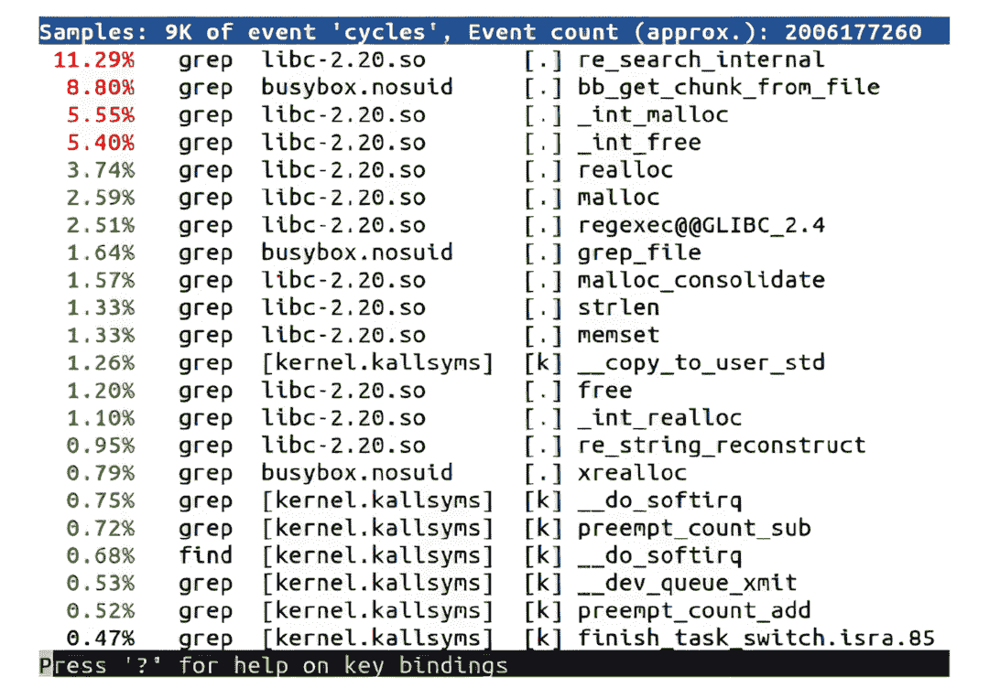
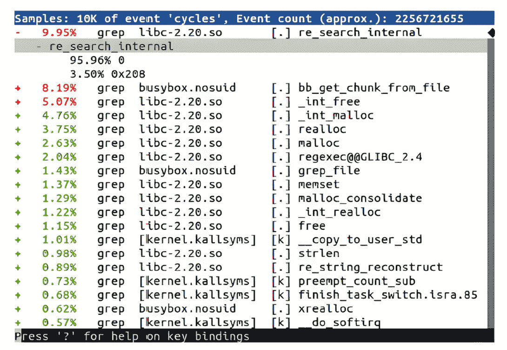
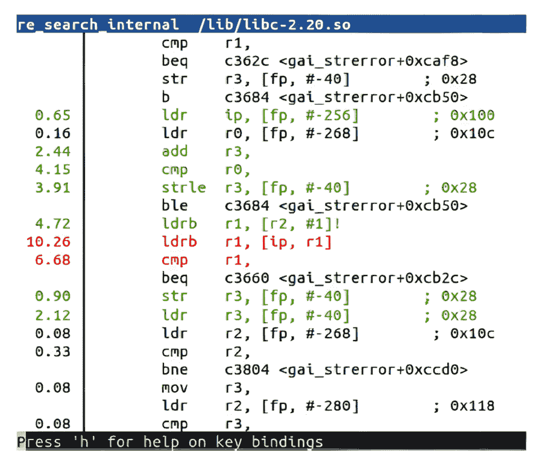
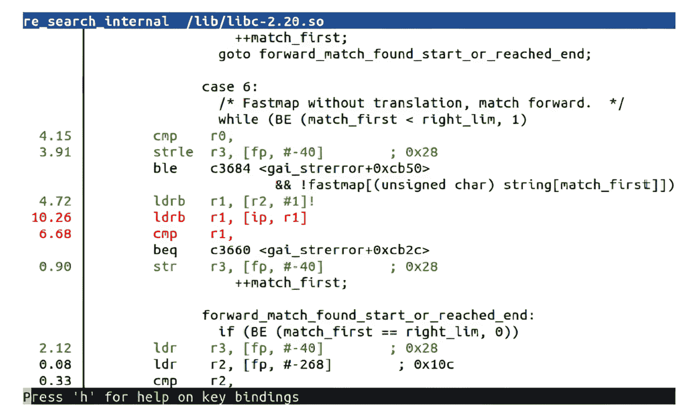

# 第二十章：性能分析与追踪

使用源代码级调试器进行交互式调试，如上一章所述，可以帮助你深入了解程序的工作原理，但它将你的视野限制在一小部分代码上。在本章中，我们将从更宏观的角度来看，是否系统按预期执行。

程序员和系统设计师通常不擅长猜测瓶颈在哪里。因此，如果你的系统存在性能问题，明智的做法是从整体系统开始分析，然后逐步深入，随着进展使用更复杂的工具。本章中，我将从广为人知的 `top` 命令开始，作为了解概况的手段。通常，问题可能局限于某个程序，你可以使用 Linux 性能分析工具 `perf` 进行分析。如果问题没有那么局限，并且你想获得更广泛的视角，`perf` 也能做到。为了诊断与内核相关的问题，我将介绍一些追踪工具——Ftrace、LTTng 和 eBPF——作为获取详细信息的手段。

我还将介绍 Valgrind，它因其沙盒执行环境，可以监控程序并报告程序运行时的代码。我将通过描述一个简单的追踪工具`strace`来完成本章，它通过追踪程序发出的系统调用，揭示程序的执行过程。

在本章中，我们将讨论以下主题：

+   观察者效应

+   开始进行性能分析

+   使用 `top` 进行性能分析

+   使用 GDB 进行性能分析

+   介绍 `perf`

+   追踪事件

+   介绍 Ftrace

+   使用 LTTng

+   使用 eBPF

+   使用 Valgrind

+   使用 `strace`

# 技术要求

要跟随示例进行操作，请确保你拥有以下内容：

+   一台运行 Ubuntu 24.04 或更高版本 LTS 的主机系统，至少有 90 GB 的空闲磁盘空间

+   Buildroot 2024.02.6 LTS 版本

+   一个 microSD 卡读卡器和卡

+   适用于 Linux 的 balenaEtcher

+   一根以太网线和一个可用端口的路由器，用于网络连接

+   Raspberry Pi 4

+   一台能够提供 3A 电流的 5V USB-C 电源

你应该已经在 *第六章* 中安装了 Buildroot 2024.02.6 LTS 版本。如果没有，请参考 *Buildroot 用户手册* 中的 *系统要求* 部分 ([`buildroot.org/downloads/manual/manual.html`](https://buildroot.org/downloads/manual/manual.html))，然后按照 *第六章* 中的说明在你的 Linux 主机上安装 Buildroot。

本章中使用的代码可以在本书 GitHub 仓库中的章节文件夹中找到：[`github.com/PacktPublishing/Mastering-Embedded-Linux-Development/tree/main/Chapter20/buildroot`](https://github.com/PacktPublishing/Mastering-Embedded-Linux-Development/tree/main/Chapter20/buildroot)。

# 观察者效应

在深入了解工具之前，先让我们谈谈这些工具会向你展示什么。就像许多领域一样，测量某个特性会影响到观察本身。测量电源线中的电流需要测量小电阻上的电压降。然而，电阻本身会影响电流。分析也是如此：每一次系统观察都会消耗 CPU 周期，这些资源就不再用在应用程序上。测量工具还会干扰缓存行为，占用内存空间，写入磁盘，这一切都会使情况变得更糟。没有开销就没有测量。

我经常听到工程师说，他们做的分析工作完全误导。这通常是因为他们在某些非真实的情况下进行测量。始终尽量在目标系统上进行测量，运行发布版本的软件，并使用有效的数据集，最好是从实际环境中获得，尽量减少额外的服务。

发布构建通常意味着构建完全优化过的二进制文件，而没有调试符号。这些生产要求会严重限制大多数分析工具的功能。

一旦我们的系统启动并运行起来，我们会立刻遇到一个问题。虽然观察系统的自然状态很重要，但工具往往需要额外的信息才能理解事件。

一些工具需要特殊的内核选项。对于我们在本章中讨论的工具，这适用于`perf`、Ftrace、LTTng 和 eBPF。因此，你可能需要为这些测试构建并部署一个新的内核。

调试符号在将原始程序地址转换为函数名和源代码行号时非常有用。部署带有调试符号的可执行文件不会改变代码的执行，但确实要求你拥有二进制文件副本，并且至少对你想要分析的组件，内核需要带有调试信息。一些工具在目标系统上安装这些内容会更有效，比如`perf`。这些技巧与一般调试相同，正如我在*第十九章*中讨论的那样。

如果你希望工具生成调用图，你可能需要编译时启用堆栈帧。如果你希望工具能准确地将地址与源代码中的行号匹配，你可能需要使用较低级别的优化进行编译。

最后，一些工具需要将仪器插入程序中以捕获样本，因此你需要重新编译这些组件。这适用于内核的 Ftrace 和 LTTng。

请注意，你改变被观察系统的程度越大，你所做的测量与生产系统之间的关系就越难以建立。

**提示**

最好采取等待观察的方法，只有在需要时才进行更改，并时刻注意，每次更改时，你都会改变你正在测量的内容。

由于分析结果可能非常模糊，建议在使用更复杂和入侵性较强的工具之前，先从一些简单、易用且 readily available 的工具入手。

# 开始分析

在查看整个系统时，一个好的起点是使用像`top`这样简单的工具，它能快速提供概览。它显示了正在使用的内存量、哪些进程消耗了 CPU 周期，以及这些消耗如何分布在不同的核心和时间上。

如果`top`显示单个应用程序占用了所有的用户空间 CPU 周期，那么你可以使用`perf`对该应用程序进行分析。

如果两个或更多进程的 CPU 使用率很高，可能是它们之间有某种关联，可能是数据通信。如果大量时间花费在系统调用或处理中断上，那么可能是内核配置或设备驱动程序出现问题。在任何情况下，你需要首先使用`perf`对整个系统进行分析。

如果你想了解更多关于内核和事件顺序的内容，可以使用 Ftrace、LTTng 或 eBPF。

可能会有其他`top`无法帮助你发现的问题。如果你有多线程代码，并且遇到锁死问题，或者数据出现随机性损坏，那么`pidstat`（`sysstat`的一部分）或 Valgrind 加上 Helgrind 插件可能会有所帮助。内存泄漏也属于这一类别；我在*第十八章*中介绍了与内存相关的诊断。

在深入探讨这些更高级的分析工具之前，我们先从大多数系统中都能找到的最基本的工具开始，包括生产环境中的系统。

## 使用 top 进行分析

**top**程序是一个简单的工具，不需要任何特殊的内核选项或符号表。BusyBox 中有一个基本版本，而`procps`包中有一个功能更全的版本，后者在 Yocto 项目和 Buildroot 中都可以找到。你可能还想考虑使用`htop`，它与`top`功能相似，但界面更加友好。

首先，关注`top`的概要行，如果你使用的是 BusyBox，则它是第二行；如果你使用的是`procps`中的`top`，则是第三行。下面是一个例子，使用 BusyBox 的`top`：

```
Mem: 57044K used, 446172K free, 40K shrd, 3352K buff, 34452K cached
CPU: 58% usr 4% sys 0% nic 0% idle 37% io 0% irq 0% sirq
Load average: 0.24 0.06 0.02 2/51 105
PID PPID USER STAT   VSZ %VSZ %CPU COMMAND
105  104 root    R 27912   6%  61% ffmpeg -i track2.wav
<…> 
```

概要行显示了在不同状态下运行的时间百分比，如下表所示：

| **procps** | **BusyBox** | **描述** |
| --- | --- | --- |
| `us` | `usr` | 默认优先级值的用户空间程序 |
| `sy` | `sys` | 内核代码 |
| `ni` | `nic` | 优先级非默认值的用户空间程序 |
| `id` | `idle` | 空闲 |
| `wa` | `io` | I/O 等待 |
| `hi` | `irq` | 硬件中断 |
| `si` | `sirq` | 软件中断 |
| `st` | `-` | Steal 时间：仅在虚拟环境中相关 |

表 20.1 – procps top 与 BusyBox top 的对比

在前面的示例中，几乎所有时间（58%）都花费在用户模式下，系统模式下的时间较少（4%），所以这是一个在用户空间中受 CPU 限制的系统。总结后的第一行显示，只有一个应用程序负责：`ffmpeg`。任何减少 CPU 使用的努力都应集中在这里。

这是另一个示例：

```
Mem: 13128K used, 490088K free, 40K shrd, 0K buff, 2788K cached
CPU: 0% usr 99% sys 0% nic 0% idle 0% io 0% irq 0% sirq
Load average: 0.41 0.11 0.04 2/46 97
PID PPID USER STAT   VSZ %VSZ %CPU COMMAND
 92   82 root    R  2152   0% 100% cat /dev/urandom
<…> 
```

这个系统几乎将所有时间都花费在内核空间（99% `sys`），这是由于 `cat` 从 `/dev/urandom` 读取数据所导致。在这个人工案例中，仅仅对 `cat` 进行分析并不会帮助，但分析 `cat` 调用的内核函数可能会有所帮助。

`top`的默认视图只显示进程，因此 CPU 使用率是进程中所有线程的总和。按 *H* 键可以查看每个线程的详细信息。同样，它会汇总所有 CPU 的时间。如果你使用的是 `procps` 版本的 `top`，可以按 *1* 键查看每个 CPU 的摘要信息。

一旦通过 `top` 确定了问题进程，我们就可以将 GDB 附加到它上面。

## 使用 GDB 进行分析

你可以仅通过使用**GDB**在任意间隔停止应用程序，查看它的状态。这就是**穷人分析器**。它易于设置，是收集分析数据的一种方式。

过程很简单：

1.  使用 `gdbserver`（用于远程调试）或 GDB（用于本地调试）附加到进程。进程会停止。

1.  查看程序停止时所在的函数。你可以使用 `backtrace` GDB 命令查看调用栈。

1.  输入 `continue`，让程序继续执行。

1.  一段时间后，按 *Ctrl + C* 停止程序，然后返回到 *步骤 2*。

如果你重复执行*步骤 2* 到 *4* 多次，你很快就能了解程序是否在循环或进展，如果你足够频繁地重复这些步骤，你就能了解代码中的热点所在。

有一个完整的网页专门讲解这个方法，地址是[`poormansprofiler.org/`](https://poormansprofiler.org/)，并且提供了一些脚本，让这个过程变得更简单。多年来，我在各种操作系统和调试器中多次使用过这个技巧。

这是**统计分析**的一个示例，其中你在一定间隔内对程序状态进行采样。经过一段时间的采样后，你可以开始了解函数执行的统计概率。令人惊讶的是，实际上你所需要的样本数非常少。其他统计分析工具包括 `perf record`、OProfile 和 `gprof`。

使用调试器进行采样具有侵入性，因为程序在采样期间会停止很长时间。其他工具可以以更低的开销进行采样。一个这样的工具是 `perf`。

# 引入 perf

**perf** 是 Linux **性能事件计数子系统** `perf_events` 的缩写，也是与 `perf_events` 交互的命令行工具的名称。自 Linux 2.6.31 以来，它们已成为内核的一部分。在 Linux 源代码树中的 `tools/perf/Documentation` 以及 [`perfwiki.github.io`](https://perfwiki.github.io) 上有大量有用的信息。

开发 `perf` 的初衷是提供一种统一的方式来访问 **性能测量单元** (**PMU**) 的寄存器，PMU 是大多数现代处理器核心的一部分。一旦 API 被定义并集成到 Linux 中，扩展它以涵盖其他类型的性能计数器便变得合乎逻辑。

从本质上讲，`perf` 是一个事件计数器集合，具有关于何时主动收集数据的规则。通过设置规则，您可以从整个系统、仅内核、仅一个进程及其子进程中捕获数据，并且可以跨所有 CPU 或仅一个 CPU 进行操作。它非常灵活。使用这个工具，您可以从查看整个系统开始，然后集中关注可能导致问题的设备驱动程序、运行缓慢的应用程序，或执行时间似乎比预期更长的库函数。

`perf` 命令行工具的代码是内核的一部分，位于 `tools/perf` 目录下。该工具和内核子系统是同步开发的，这意味着它们必须来自同一个版本的内核。`perf` 功能强大。在本章中，我将仅作为分析器来探讨它。关于其其他功能的描述，请阅读 `perf` 手册并参考本节开头提到的文档。

除了调试符号之外，我们还需要设置两个配置选项，以完全启用内核中的 `perf`。

## 为 perf 配置内核

您需要一个已配置 `perf_events` 的内核，并且需要将 `perf` 命令交叉编译，以便在目标上运行。相关的内核配置是 `CONFIG_PERF_EVENTS`，位于 **General setup** | **Kernel Performance Events and Counters** 菜单中。

如果您希望使用 tracepoints 进行分析——稍后会详细讲解——还需要启用有关 Ftrace 部分中描述的选项。同时，在这里启用 `CONFIG_DEBUG_INFO` 也是值得的。

`perf` 命令有许多依赖项，这使得交叉编译变得相当复杂。然而，Yocto 项目和 Buildroot 都有针对它的目标包。

您还需要为您感兴趣的二进制文件启用目标的调试符号；否则，`perf` 将无法解析地址到有意义的符号。理想情况下，您希望为整个系统（包括内核）启用调试符号。对于后者，请记住，内核的调试符号位于 `vmlinux` 文件中。

## 使用 Yocto 项目构建 perf

如果您使用的是标准的 `linux-yocto` 内核，`perf_events` 已经启用，因此无需进行更多操作。

要构建 `perf` 工具，您可以将其显式添加到目标镜像的依赖项中，或者您可以添加 `tools-profile` 特性。您还需要在目标镜像以及内核 `vmlinux` 镜像中启用调试符号。总的来说，您在 `conf/local.conf` 中需要配置以下内容：

```
EXTRA_IMAGE_FEATURES:append = " tools-profile dbg-pkgs src-pkgs"
IMAGE_INSTALL:append = " kernel-vmlinux binutils" 
```

将 `perf` 添加到 Buildroot 镜像中涉及多个步骤。

## 使用 Buildroot 构建 perf

许多 Buildroot 内核配置不包括`perf_events`，因此你应该首先检查内核是否包括前面章节提到的选项。

要交叉编译`perf`，运行 Buildroot 的`menuconfig`并选择以下选项：

+   在**内核** | **Linux 内核工具** | **perf**中选择`BR2_PACKAGE_LINUX_TOOLS_PERF`

+   在**内核** | **Linux 内核工具** | **perf**中选择`BR2_PACKAGE_LINUX_TOOLS_PERF_TUI` | **启用 perf TUI**

要构建带有调试信息的二进制文件并将它们安装到目标上而不剥离，启用这两个选项中的第一个并禁用第二个：

+   在**构建选项**中选择`BR2_ENABLE_DEBUG` | **构建带调试符号的包**

+   在**构建选项**中选择`BR2_STRIP_strip` | **剥离目标二进制文件**

要将未剥离的`vmlinux`文件复制到目标映像中，选择以下选项：

+   在**内核** | **内核二进制格式** | **vmlinux**中选择`BR2_LINUX_KERNEL_VMLINUX`

+   在**内核** | **将内核映像安装到目标的/boot 目录**中选择`BR2_LINUX_KERNEL_INSTALL_TARGET`

为了增加根文件系统的大小以适应未剥离的二进制文件和`vmlinux`文件：

+   选择**文件系统映像** | **ext2/3/4 根文件系统** | **精确大小**，然后在文本框中输入`960M`。

然后运行`make clean`，接着运行`make`。

一旦你完成了所有构建，你将需要手动将`vmlinux`复制到目标映像中。

## 使用 perf 进行性能分析

你可以使用`perf`通过事件计数器采样程序状态，并在一段时间内累积样本来创建性能分析报告。这是另一种统计性能分析的方法。默认事件计数器叫做`cycles`，它是一个通用硬件计数器，映射到一个 PMU 寄存器，表示在核心时钟频率下的周期计数。

使用`perf`创建分析报告是一个两阶段的过程：`perf record`命令捕获样本并将其写入名为`perf.data`的文件，然后`perf report`命令分析结果。两个命令都在目标上运行。收集的样本会过滤出特定进程及其所有子进程的相关数据。以下是对一个查找`linux`字符串的 shell 脚本进行分析的示例：

```
# perf record -a sh -c "find /usr/share | xargs grep linux > /dev/null"
[ perf record: Woken up 1 times to write data ]
[ perf record: Captured and wrote 0.176 MB perf.data (2677 samples) ]
# ls -l perf.data
-rw------- 1 root root 190024 Mar  9 14:28 perf.data 
```

现在你可以使用`perf report`命令显示`perf.data`中的结果。

有三种用户界面可供选择：

+   `--stdio`：这是一个纯文本界面，没有用户交互。你需要分别启动`perf report`和`annotate`来查看每个跟踪视图。

+   `--tui`：这是一个基于文本的简单菜单界面，可以在屏幕之间进行导航。

+   `--gtk`：这是一个图形界面，功能与`--tui`相同。

默认情况下是 TUI，如本示例所示：



图 20.1 – perf 报告 TUI

`perf`能够记录由进程执行的内核函数，因为它在内核空间收集样本。

列表按照最活跃的函数排在前面。在这个例子中，除了一个，所有函数都是在运行 `grep` 时捕获的。有些在库中，`libc-2.20`，有些在程序中，`busybox.nosuid`，还有些在内核中。我们能够获取程序和库函数的符号名，因为所有的二进制文件都已经安装在目标机器上并包含了调试信息，而内核符号是从 `/boot/vmlinux` 中读取的。如果你的 `vmlinux` 存放在其他位置，记得在 `perf report` 命令中加上 `-k <path>` 参数。你也可以通过使用 `perf record -o <文件名>` 将样本保存到不同的文件中，然后用 `perf report -i <文件名>` 进行分析，而不是将样本存储在 `perf.data` 中。

默认情况下，`perf record` 使用 `cycles` 计数器以 1,000 Hz 的频率进行采样。

**提示**

1,000 Hz 的采样频率可能比你实际需要的更高，也可能是观测者效应的原因。尝试较低的采样率；100 Hz 足以应对大多数情况。你可以使用 `-F` 选项来设置采样频率。

这仍然没有真正简化工作；列表顶部的函数大多是低级别的内存操作，且你可以相当肯定这些函数已经被优化过了。幸运的是，`perf record` 还为我们提供了向上爬取调用堆栈并查看这些函数被调用位置的能力。

## 调用图

如果能够回溯并查看这些高开销函数的周围上下文，那就更好了。你可以通过向 `perf record` 传递 `-g` 选项来捕获每个样本的回溯信息。

现在，`perf report` 显示一个加号（`+`）表示该函数是调用链的一部分。你可以展开追踪，查看链条中更低位置的函数：



图 20.2 – perf report（调用图）

**重要提示**

生成调用图依赖于从堆栈中提取调用帧的能力，就像 GDB 中的回溯信息一样。解开堆栈所需的调试信息被编码在可执行文件中。对于某些架构和工具链的组合，由于二进制文件缺乏必要的调试信息，因此无法生成调用图。

回溯信息很有用，但这些函数的汇编代码在哪里，或者更好的是，源代码在哪里？

## perf annotate

现在你已经知道了要查看哪些函数，接下来可以深入查看代码，并获得每个指令的命中次数。这就是 `perf annotate` 的作用，它通过调用目标机器上的 `objdump` 副本来实现。你只需将 `perf annotate` 替换为 `perf report` 即可。

`perf annotate` 需要可执行文件和 `vmlinux` 的符号表。以下是一个注释过的函数示例：



图 20.3 – perf annotate（汇编代码）

如果你想看到与汇编代码交织在一起的源代码，可以将相关源文件复制到目标设备。如果你使用的是 The Yocto Project 并且通过 `src-pkgs` 附加镜像特性构建，或者已经安装了单独的 `<package>-src` 包，那么源代码将已经安装在 `/usr/src/debug` 中。否则，你可以查看调试信息，查找源代码的位置：

```
$ cd ~/buildroot/output
$ host/aarch64-buildroot-linux-gnu/bin/objdump --dwarf target/lib/libc.so.6 | grep DW_AT_comp_dir | grep libgcc
<41f4dd> DW_AT_comp_dir : (indirect string, offset: 0x2d355): /home/frank/buildroot/output/build/host-gcc-initial-12.4.0/build/aarch64-buildroot-linux-gnu/libgcc 
```

目标路径必须与 `DW_AT_comp_dir` 中看到的路径*完全相同*。

下面是源代码与汇编代码的注释示例：



图 20.4 – perf annotate（源代码）

现在我们可以看到 `cmp r0` 上方和 `str r3, [fp, #-40]` 指令下方的相应 C 源代码。

这就是我们对`perf`的介绍。虽然在`perf`之前还有其他统计采样分析器，比如 OProfile 和 `gprof`，但这些工具近年来已经不再被广泛使用，因此我选择将它们省略。接下来，我们将讨论事件跟踪工具。

# 跟踪事件

到目前为止我们看到的所有工具都使用统计采样。你通常希望了解更多关于事件顺序的信息，以便你能查看它们并将它们相互关联。函数跟踪涉及通过在代码中加入跟踪点来捕捉事件信息，可能包括以下一些或全部内容：

+   时间戳

+   上下文信息，例如当前的 PID

+   函数参数和返回值

+   调用栈

它比统计分析更具侵入性，并且可能会生成大量数据。后者的问题可以通过在采样时应用过滤器以及稍后查看跟踪时应用过滤器来减轻。

我将在这里介绍三种跟踪工具：内核函数跟踪器 Ftrace、LTTng 和 eBPF。

# 引入 Ftrace

内核函数跟踪器 **Ftrace** 起源于 Steven Rostedt 等人为了追踪实时应用中高调度延迟的原因而开展的工作。Ftrace 出现在 Linux 2.6.27 中，并且自那时以来一直在积极开发。内核源代码中的 `Documentation/trace` 目录包含了许多关于内核跟踪的文档。

Ftrace 由多个跟踪器组成，可以记录内核中的各种活动。在这里，我将讨论 `function` 和 `function_graph` 跟踪器以及事件跟踪点。在*第二十一章*中，我将再次提到 Ftrace，并讨论实时延迟。

`function` 跟踪器为每个内核函数添加了跟踪点，以便记录和时间戳化调用。它通过 `-pg` 选项编译内核，以注入这些跟踪代码。`function_graph` 跟踪器更进一步，记录了函数的入口和出口，从而生成调用图。事件跟踪点功能记录与调用相关的参数。

Ftrace 具有非常适合嵌入式的用户界面，完全通过 `debugfs` 文件系统中的虚拟文件实现，这意味着你不必在目标上安装任何工具即可使其工作。不过，如果你愿意，也有其他用户界面可供选择：`trace-cmd` 是一个命令行工具，用于记录和查看跟踪，且可以在 Buildroot (`BR2_PACKAGE_TRACE_CMD`) 和 The Yocto Project (`trace-cmd`) 中使用。还有一个图形化的跟踪查看器 **KernelShark**，它作为 The Yocto Project 的一个软件包提供。

像 `perf` 一样，启用 Ftrace 需要设置一些内核配置选项。

## 准备使用 Ftrace

Ftrace 及其各种选项在内核配置菜单中进行配置。至少需要以下选项：

+   **Kernel hacking** | **Tracers** | **Kernel Function Tracer** 菜单中的 `CONFIG_FUNCTION_TRACER`

强烈建议你开启这些选项：

+   **Kernel hacking** | **Tracers** | **Kernel Function Tracer** | **Kernel Function Graph Tracer** 菜单中的 `CONFIG_FUNCTION_GRAPH_TRACER`

+   **Kernel hacking** | **Tracers** | **Kernel Function Tracer** | **Enable/disable function tracing dynamically** 菜单中的 `CONFIG_DYNAMIC_FTRACE`

+   **Kernel hacking** | **Tracers** | **Kernel Function Tracer** | **Kernel function profiler** 菜单中的 `CONFIG_FUNCTION_PROFILER`

由于整个过程在内核中执行，因此无需进行用户空间的配置。

## 使用 Ftrace

在你使用 Ftrace 之前，你必须挂载 `debugfs` 文件系统，它位于 `/sys/kernel/debug` 目录下：

```
# mount -t debugfs none /sys/kernel/debug 
```

所有 Ftrace 控制项都在 `/sys/kernel/debug/tracing` 目录下；这里甚至有一个迷你版的 `HOWTO` 文件在 `README` 中。

这是内核中可用的跟踪器列表：

```
# cat /sys/kernel/debug/tracing/available_tracers
blk function_graph function nop 
```

当前使用的跟踪器由 `current_tracer` 显示。最初，它将是空跟踪器 `nop`。

要捕获跟踪，请通过将 `available_tracers` 中某个跟踪器的名称写入 `current_tracer` 来选择跟踪器。然后，启用短时间的跟踪：

```
# echo function > /sys/kernel/debug/tracing/current_tracer
# echo 1 > /sys/kernel/debug/tracing/tracing_on
# sleep 1
# echo 0 > /sys/kernel/debug/tracing/tracing_on 
```

在这一秒钟内，跟踪缓冲区将被填充上内核调用的每个函数的详细信息。跟踪缓冲区的格式是纯文本，如 `Documentation/trace/ftrace.txt` 中所描述。你可以通过 `trace` 文件读取跟踪缓冲区：

```
# cat /sys/kernel/debug/tracing/trace
# tracer: function
#
# entries-in-buffer/entries-written: 40051/40051   #P:1
#
#                   _-----=> irqs-off
#                  / _----=> need-resched
#                 | / _---=> hardirq/softirq
#                 || / _--=> preempt-depth
#                 ||| /     delay
# TASK-PID  CPU#  |||| TIMESTAMP  FUNCTION
#    | |      |   ||||    |         |
    sh-361  [000] ...1 992.990646: mutex_unlock <-rb_simple_write
    sh-361  [000] ...1 992.990658: __fsnotify_parent <-vfs_write
    sh-361  [000] ...1 992.990661: fsnotify <-vfs_write
    sh-361  [000] ...1 992.990663: __srcu_read_lock <-fsnotify
    sh-361  [000] ...1 992.990666: preempt_count_add <-__srcu_read_lock
    sh-361  [000] ...2 992.990668: preempt_count_sub <-__srcu_read_lock
    sh-361  [000] ...1 992.990670: __srcu_read_unlock <-fsnotify
    sh-361  [000] ...1 992.990672: __sb_end_write <-vfs_write
    sh-361  [000] ...1 992.990674: preempt_count_add <-__sb_end_write
<…> 
```

你可以在仅仅一秒钟内捕获大量数据点——在此情况下，超过 40,000 个。

和分析器一样，像这样的平面函数列表很难理解。如果你选择 `function_graph` 跟踪器，Ftrace 会捕获如下的调用图：

```
# tracer: function_graph
#
# CPU   DURATION               FUNCTION CALLS
# |      |   |                  |   |   |   |
 0) + 63.167 us   |              } /* cpdma_ctlr_int_ctrl */
 0) + 73.417 us   |            } /* cpsw_intr_disable */
 0)               |            disable_irq_nosync() {
 0)               |              __disable_irq_nosync() {
 0)               |                __irq_get_desc_lock() {
 0)   0.541 us    |                  irq_to_desc();
 0)   0.500 us    |                  preempt_count_add();
 0) + 16.000 us   |                }
 0)               |                __disable_irq() {
 0)   0.500 us    |                  irq_disable();
 0)   8.208 us    |                }
 0)               |                __irq_put_desc_unlock() {
 0)   0.459 us    |                  preempt_count_sub();
 0)   8.000 us    |                }
 0) + 55.625 us   |              }
 0) + 63.375 us   |            } 
```

现在你可以看到函数调用的嵌套，使用大括号 `{` 和 `}` 分隔。在终止的大括号处，会显示该函数的执行时间，如果超过 10 微秒，会有一个加号（`+`）标注；如果超过 100 微秒，会有一个感叹号（`!`）标注。

你通常只对由单个进程或线程引起的内核活动感兴趣，这时你可以通过将线程 ID 写入`set_ftrace_pid`来将追踪限制为一个线程。

## 动态 Ftrace 和 trace 过滤器

启用`CONFIG_DYNAMIC_FTRACE`允许 Ftrace 在运行时修改函数追踪位置，这有几个好处。首先，它触发了额外的构建时处理追踪函数探针，这使得 Ftrace 子系统能够在启动时定位它们并用`nop`指令覆盖，从而将函数追踪代码的开销减少到几乎为零。你可以在生产环境或接近生产环境的内核中启用 Ftrace，而不会影响性能。

第二个好处是你可以选择性地启用函数追踪位置，而不是追踪所有内容。函数的列表被放入`available_filter_functions`中。你可以通过将名称从`available_filter_functions`复制到`set_ftrace_filter`来按需启用函数追踪。要停止追踪该函数，向`set_ftrace_notrace`写入其名称。你还可以使用通配符并将名称追加到列表中。例如，假设你对`tcp`处理感兴趣：

```
# cd /sys/kernel/debug/tracing
# echo "tcp*" > set_ftrace_filter
# echo function > current_tracer
# echo 1 > tracing_on 
```

运行一些测试，然后查看`trace`：

```
# cat trace
# tracer: function
#
# entries-in-buffer/entries-written: 590/590   #P:1
#
#                     _-----=> irqs-off
#                   / _----=> need-resched
#                  | / _---=> hardirq/softirq
#                  || / _--=> preempt-depth
#                  ||| /     delay
#   TASK-PID CPU#  ||||   TIMESTAMP  FUNCTION
#      | |     |   ||||      |         |
dropbear-375 [000] ...1 48545.022235: tcp_poll <-sock_poll
dropbear-375 [000] ...1 48545.022372: tcp_poll <-sock_poll
dropbear-375 [000] ...1 48545.022393: tcp_sendmsg <-inet_sendmsg
dropbear-375 [000] ...1 48545.022398: tcp_send_mss <-tcp_sendmsg
dropbear-375 [000] ...1 48545.022400: tcp_current_mss <-tcp_send_mss
<…> 
```

`set_ftrace_filter`函数还可以包含命令，用于在某些函数执行时启动和停止追踪。这里没有足够的空间详细说明这些内容，但如果你想了解更多，阅读`Documentation/trace/ftrace.txt`中的*Filter commands*部分。

## Trace 事件

`function`和`function_graph`追踪器只记录函数执行的时间。Trace 事件特性还记录与调用相关的参数，使追踪更加可读和具有信息性。例如，追踪事件不仅记录`kmalloc`函数已被调用，还会记录请求的字节数和返回的指针。Trace 事件在`perf`、LTTng 以及 Ftrace 中都被使用，但开发 trace 事件子系统的推动力来自于 LTTng 项目。

创建 trace 事件需要内核开发人员的努力。它们在源代码中使用`TRACE_EVENT`宏进行定义，现在有超过一千个。你可以在运行时查看`/sys/kernel/debug/tracing/available_events`中可用事件的列表。它们的命名格式为<`subsystem`: `function`>（例如，`kmem:kmalloc`）。每个事件还通过`tracing/events/<subsystem>/<function>`中的子目录进行表示：

```
# ls events/kmem/kmalloc
enable filter format id trigger 
```

这些文件是：

+   `enable`：你可以向此文件写入`1`来启用事件。

+   `filter`：这是一个表达式，事件必须评估为`true`才能被追踪。

+   `format`：这是事件及其参数的格式。

+   `id`：这是一个数字标识符。

+   `trigger`：这是一个命令，当事件发生时会执行，语法定义在`Documentation/trace/ftrace.txt`的*Filter commands*部分。

我将展示一个涉及`kmalloc`和`kfree`的简单示例。事件跟踪不依赖于函数跟踪器，因此可以从选择`nop`跟踪器开始：

```
# echo nop > current_tracer 
```

接下来，通过单独启用每个事件来选择要跟踪的事件：

```
# echo 1 > events/kmem/kmalloc/enable
# echo 1 > events/kmem/kfree/enable 
```

你也可以将事件名称写入`set_event`，如下所示：

```
# echo "kmem:kmalloc kmem:kfree" > set_event 
```

现在，当你阅读跟踪时，你可以看到函数及其参数：

```
# tracer: nop
#
# entries-in-buffer/entries-written: 359/359   #P:1
#
#                      _-----=> irqs-off
#                     / _----=> need-resched
#                    | / _---=> hardirq/softirq
#                    || / _--=> preempt-depth
#                    ||| /     delay
#   TASK-PID   CPU#  ||||   TIMESTAMP  FUNCTION
#      | |       |   ||||      |         |
     cat-382   [000] ...1  2935.586706: kmalloc:call_site=c0554644 ptr=de515a00 bytes_req=384 bytes_alloc=512 gfp_flags=GFP_ATOMIC|GFP_NOWARN|GFP_NOMEMALLOC
     cat-382   [000] ...1  2935.586718: kfree: call_site=c059c2d8 ptr=(null) 
```

在`perf`中可见的跟踪事件与 tracepoint 事件完全相同。

由于没有臃肿的用户空间组件需要构建，Ftrace 非常适合部署到大多数嵌入式目标设备上。接下来，我们将看一下另一种流行的事件跟踪器，它的起源早于 Ftrace。

# 使用 LTTng

**Linux Trace Toolkit**（**LTT**）项目由 Karim Yaghmour 发起，目的是跟踪内核活动，并且是最早为 Linux 内核提供的跟踪工具之一。后来，Mathieu Desnoyers 接手了这个想法，并将其重新实现为下一代跟踪工具，**LTTng**。之后，项目扩展到了包括用户空间的跟踪。项目官网在[`lttng.org/`](https://lttng.org/)，并包含了一本全面的用户手册。

LTTng 由三个组件组成：

+   一个核心会话管理器

+   一个作为一组内核模块实现的内核跟踪器

+   一个作为库实现的用户空间跟踪器

除了这些，你还需要一个跟踪查看器，比如**Babeltrace**（[`babeltrace.org/`](https://babeltrace.org/)）或**Eclipse Trace Compass**插件，用于在主机或目标设备上显示和过滤原始跟踪数据。

LTTng 需要一个配置了`CONFIG_TRACEPOINTS`的内核，当你选择**Kernel hacking** | **Tracers** | **Kernel Function Tracer**时，会启用该选项。

以下描述指的是 LTTng 版本 2.13。其他版本可能会有所不同。

## LTTng 和 Yocto 项目

你需要将这些包添加到`conf/local.conf`中的目标依赖项：

```
IMAGE_INSTALL:append = " lttng-tools lttng-modules lttng-ust" 
```

如果你想在目标设备上运行 Babeltrace，也需要添加`babeltrace2`包。

## LTTng 和 Buildroot

你需要启用以下选项：

+   **Target packages** | **Debugging, profiling and benchmark** | **lttng-modules**菜单中的`BR2_PACKAGE_LTTNG_MODULES`

+   **Target packages** | **Debugging, profiling and benchmark** | **lttng-tools**菜单中的`BR2_PACKAGE_LTTNG_TOOLS`

对于用户空间的跟踪，请启用以下选项：

+   **Target packages** | **System tools** | **util-linux** | **uuidd**菜单中的`BR2_PACKAGE_UTIL_LINUX_UUIDD`

+   **Target packages** | **Libraries** | **Other** | **lttng-libust**菜单中的`BR2_PACKAGE_LTTNG_LIBUST`

+   **Host utilities** | **host babeltrace2** 菜单中的`BR2_PACKAGE_HOST_BABELTRACE2`

目标设备上有一个名为`babletrace2`的包。Buildroot 在`output/host/usr/bin/babeltrace2`中为主机安装了`babeltrace2`。

## 使用 LTTng 进行内核跟踪

LTTng 可以使用前面描述的 Ftrace 事件集作为潜在的跟踪点。最初，它们是禁用的。

LTTng 的控制接口是`lttng`命令。您可以使用以下命令列出内核探针：

```
# lttng list --kernel
Kernel events:
-------------
writeback_nothread (loglevel: TRACE_EMERG (0)) (type: tracepoint)
writeback_queue (loglevel: TRACE_EMERG (0)) (type: tracepoint)
writeback_exec (loglevel: TRACE_EMERG (0)) (type: tracepoint)
<…> 
```

跟踪是在会话上下文中捕获的，例如，在这个示例中称为`test`：

```
# lttng create test
Session test created.
Traces will be written in /home/root/lttng-traces/test20150824-140942
# lttng list
Available tracing sessions:
1) test (/home/root/lttng-traces/test-20150824-140942) [inactive] 
```

现在在当前会话中启用几个事件。您可以使用`--all`选项启用所有内核跟踪点，但请记住有关生成过多跟踪数据的警告。让我们从几个与调度器相关的跟踪事件开始：

```
# lttng enable-event --kernel sched_switch,sched_process_fork 
```

检查所有设置是否已完成：

```
# lttng list test
Tracing session test: [inactive]
    Trace path: /home/root/lttng-traces/test-20150824-140942
    Live timer interval (usec): 0
 === Domain: Kernel ===
 Channels:
-------------
- channel0: [enabled]
 Attributes:
      overwrite mode: 0
      subbufers size: 26214
      number of subbufers: 4
      switch timer interval: 0
      read timer interval: 200000
      trace file count: 0
      trace file size (bytes): 0
      output: splice()
 Events:
      sched_process_fork (loglevel: TRACE_EMERG (0)) (type: tracepoint) [enabled]
      sched_switch (loglevel: TRACE_EMERG (0)) (type: tracepoint) [enabled] 
```

现在开始跟踪：

```
# lttng start 
```

运行测试负载，然后停止跟踪：

```
# lttng stop 
```

会话的跟踪结果将写入会话目录，`lttng-traces/<session>/kernel`。

使用 Babeltrace 查看器以文本格式转储原始跟踪数据。在本例中，我在主机上运行了它：

```
$ babeltrace2 lttng-traces/test-20150824-140942/kernel 
```

输出内容过于冗长，无法完全显示在本页上，所以我会留给您的练习是以这种方式捕获和显示跟踪。使用 Babeltrace 的文本输出的优点是可以使用`grep`和类似命令轻松搜索字符串。

图形跟踪查看器的一个不错选择是 Eclipse 的**Trace Compass**插件，它现在是 Eclipse IDE 的一部分，适用于 C/C++开发者包。将跟踪数据导入 Eclipse 通常有些复杂。请按照以下步骤操作：

1.  打开**跟踪**视图。

1.  通过选择**文件** | **新建** | **跟踪项目**来创建新项目。

1.  输入项目名称，然后单击**完成**。

1.  在**项目资源管理器**菜单中右键单击**新建项目**选项，然后选择**导入**。

1.  展开**跟踪**，然后选择**跟踪导入**。

1.  浏览到包含跟踪的目录（例如，`test-20150824-140942`），选中要包括的子目录（可能是**kernel**），然后单击**完成**。

1.  展开项目，展开**跟踪[1]**，然后双击**kernel**。

现在，让我们远离 LTTng，直接跳入最新和最伟大的 Linux 事件跟踪器。

# 使用 eBPF

**伯克利数据包过滤器**（**BPF**）是一项技术，最早于 1992 年引入，用于捕获、过滤和分析网络流量。2013 年，Alexi Starovoitov 在 Daniel Borkmann 的帮助下重写了 BPF。他们的工作，后来称为**扩展 BPF**（**eBPF**），在 2014 年合并到内核中，自 Linux 3.15 版本以来一直可用。eBPF 为在 Linux 内核内运行程序提供了一个沙盒执行环境。eBPF 程序用 C 语言编写，并且**即时编译**（**JIT**）成本地代码。在这之前，eBPF 中间字节码必须通过一系列安全检查，以防止程序崩溃内核。

尽管 eBPF 起源于网络，但现在已经成为一个在 Linux 内核中运行的通用虚拟机。通过使得在特定内核和应用程序事件上运行小程序变得简单，eBPF 已迅速成为 Linux 最强大的跟踪工具。就像 cgroups 对容器化部署的影响一样，eBPF 有潜力通过使用户能够全面监控生产系统，彻底革新可观察性。Netflix 和 Facebook 在其微服务和云基础设施中广泛使用 eBPF 进行性能分析，并防止 **分布式拒绝服务**（**DDoS**）攻击。

eBPF 周围的工具正在不断发展，**BPF 编译器集合**（**BCC**）和 **bpftrace** 已经成为两个最突出的前端工具。Brendan Gregg 深度参与了这两个项目，并在他的书籍《*BPF 性能工具：Linux 系统和应用程序可观察性*》中广泛撰写了有关 eBPF 的内容。由于 eBPF 涉及的范围如此广泛，许多可能性可能让人感觉不知所措。但和 cgroups 一样，我们并不需要理解 eBPF 的具体工作原理，就能开始利用它。BCC 提供了多个现成的工具和示例，我们可以直接从命令行运行。

## 为 eBPF 配置内核

一个名为 **ply** 的软件包（[`github.com/iovisor/ply`](https://github.com/iovisor/ply)）于 2021 年 1 月 23 日合并到 Buildroot 中，并将在 Buildroot 2021.02 LTS 版本中包含。**ply** 是一个轻量级的动态跟踪器，利用 eBPF 使得探针可以附加到内核中的任意位置。与依赖 BCC 的 `bpftrace` 不同，`ply` 不依赖 LLVM，并且除了 `libc` 之外没有其他外部依赖。这使得它更容易移植到嵌入式 CPU 架构，如 `arm` 和 `powerpc`。

让我们从为 Raspberry Pi 4 配置启用 eBPF 的内核开始：

```
$ cd buildroot
$ make clean
$ make raspberrypi4_64_defconfig
$ make linux-configure 
```

`make linux-configure` 命令将在获取、解压并配置内核源代码之前，下载并构建一些主机工具。来自 Buildroot 2024.02.6 LTS 版本的 `raspberrypi4_64_defconfig` 指向了 Raspberry Pi 基金会 GitHub 分支中的自定义 6.1 内核源代码 tarball。检查你的 `raspberrypi4_64_defconfig` 内容，以验证你使用的内核版本。一旦 `make linux-configure` 配置了内核，我们可以重新配置它以支持 eBPF：

```
$ make linux-menuconfig 
```

要从交互式菜单中搜索特定的内核配置选项，请按 */* 并输入搜索字符串。搜索结果应返回一个匹配项的编号列表。输入某个编号即可直接跳转到该配置选项。

至少需要选择以下选项，以启用内核对 eBPF 的支持：

```
CONFIG_BPF=y
CONFIG_BPF_SYSCALL=y 
```

以下项是为 BCC 设计的，但添加它们不会有害：

```
CONFIG_NET_CLS_BPF=m
CONFIG_NET_ACT_BPF=m
CONFIG_BPF_JIT=y 
```

添加这些选项，以便用户能够编译并附加 eBPF 程序到 `kprobe`、`uprobe` 和 `tracepoint` 事件：

```
CONFIG_HAVE_EBPF_JIT=y
CONFIG_BPF_EVENTS=y 
```

为了让 `ply` 正常工作，需要选择以下项：

```
CONFIG_KPROBES=y
CONFIG_TRACEPOINTS=y
CONFIG_FTRACE=y
CONFIG_DYNAMIC_FTRACE=y
CONFIG_KPROBE_EVENTS_ON_NOTRACE=y 
```

在退出`make` `linux-menuconfig`时确保保存你的更改，以便它们能被应用到`output/build/linux-custom/.config`中，然后再构建你的 eBPF 启用内核。

## 使用 Buildroot 构建 ply

让我们构建`ply`并安装该工具及一些示例脚本。`ply`脚本被打包在`MELD/Chapter20/`目录下的`ebpf`包中，便于安装。要将它们复制到你的 2024.02.06 LTS 版 Buildroot 中：

```
$ cd ~
$ cp -a MELD/Chapter20/buildroot/* buildroot 
```

现在构建适用于 Raspberry Pi 4 的`ply`镜像：

```
$ cd buildroot
$ make rpi4_64_ply_defconfig
$ make 
```

如果你的 Buildroot 版本是 2024.02.06 LTS，并且你正确地从`MELD/Chapter20`复制了`buildroot`叠加文件，那么`ply`镜像应该能够成功构建。为该镜像构建的内核已为 eBPF 配置，因此不需要执行之前的`linux-menuconfig`步骤。`ply`镜像还会在`/sys/kernel/debug`自动挂载`debugfs`，因此`ply`在启动时已经准备好运行。

将已完成的 microSD 卡插入到你的 Raspberry Pi 4 中，使用以太网电缆将其连接到本地网络，并启动设备。使用`arp-scan`定位你的 Raspberry Pi 4 的 IP 地址，并使用你在上一节中设置的密码通过 SSH 以`root`身份登录。我在`configs/rpi4_64_ply_defconfig`中设置的`root`密码是`temppwd`，它包含在我提供的`MELD/Chapter20/buildroot`叠加文件中。现在，我们准备好亲身体验 eBPF 的实验了。

## 使用 ply

使用 eBPF 几乎做任何事情，包括运行`ply`工具和示例，都需要`root`权限，这就是我们通过 SSH 启用了`root`登录的原因。另一个前提是挂载`debugfs`。如果你的`/etc/fstab`中没有`debugfs`条目，则需要从命令行挂载`debugfs`：

```
# mount -t debugfs none /sys/kernel/debug 
```

我们从按功能统计系统范围内的`syscalls`开始：

```
# ply 'k:__arm64_sys_* { @syscalls[caller] = count(); }'
^C
@syscalls:
{ __arm64_sys_ppoll }: 1
{ __arm64_sys_rt_sigaction }: 2
{ __arm64_sys_rt_sigreturn }: 3
{ __arm64_sys_writev }: 12
{ __arm64_sys_brk }: 13
{ __arm64_sys_pselect6 }: 19
{ __arm64_sys_perf_event_open }: 174
{ __arm64_sys_epoll_pwait }: 176
{ __arm64_sys_newfstatat }: 188
{ __arm64_sys_close }: 205
{ __arm64_sys_ioctl }: 247
{ __arm64_sys_read }: 370
{ __arm64_sys_openat }: 383 
```

注意，`ply`会话会在用户按下*Ctrl + C*时终止，并显示追踪结果。你可能需要重复按*Ctrl + C*，直到`ply`会话最终终止。

`ply`脚本所在的目录不在`PATH`环境变量中，因此请导航到该目录以便更轻松地执行：

```
# cd /root 
```

我们从一个系统范围的脚本开始，该脚本显示读取大小的直方图：

```
# ./read-dist.ply
^C
@:
{ retsize }:
        [   2,    3]           1 ┤▏                               │
        ...
        [   8,   15]           1 ┤▏                               │
        [  16,   31]           1 ┤▏                               │
        ...
        [ 256,  511]         181 ┤███████████████████████████████▌│ 
```

`tcp-send-recv.ply`脚本按可执行文件和方向统计 TCP I/O：

```
# ./tcp-send-recv.ply &
# redis-cli --latency
min: 0, max: 1, avg: 0.29 (1033 samples)^C
# fg %1
./tcp-send-recv.ply
^C
@:
{ dropbear       , recv    }: 26
{ redis-cli      , recv    }: 1033
{ redis-cli      , send    }: 1033
{ redis-server   , send    }: 1033
{ redis-server   , recv    }: 1034
{ dropbear       , send    }: 1048 
```

在这个例子中，我在运行 Redis 客户端/服务器延迟测试时，追踪所有对`tcp_sendmsg`和`tcp_recvmsg`的调用。我是在 SSH 终端中进行测试的，所以也会报告`dropbear`的 TCP I/O。显示的样本数从`0`增加到`1033`，这解释了`dropbear`发送的`1048`次。

`heap-allocs.ply`脚本显示堆分配次数。我在 Redis 上进行了 100,000 个键的 LRU 缓存仿真：

```
# redis-cli flushall
OK
# ./heap-allocs.ply &
# redis-cli --lru-test 100000
40500 Gets/sec | Hits: 18606 (45.94%) | Misses: 21894 (54.06%)
41000 Gets/sec | Hits: 32880 (80.20%) | Misses: 8120 (19.80%)
40250 Gets/sec | Hits: 35996 (89.43%) | Misses: 4254 (10.57%)
41000 Gets/sec | Hits: 38091 (92.90%) | Misses: 2909 (7.10%)
41000 Gets/sec | Hits: 38766 (94.55%) | Misses: 2234 (5.45%)
41000 Gets/sec | Hits: 39277 (95.80%) | Misses: 1723 (4.20%)
41000 Gets/sec | Hits: 39597 (96.58%) | Misses: 1403 (3.42%)
41000 Gets/sec | Hits: 39807 (97.09%) | Misses: 1193 (2.91%)
41000 Gets/sec | Hits: 39916 (97.36%) | Misses: 1084 (2.64%)
^C
# fg %1
./heap-allocs.ply
^C
@heap_allocs:
{ redis-cli      ,   215 }: 1027 
```

请注意，`PID` 为 `215` 的 `redis-cli` 实例进行了 `1027` 次堆内存分配。至此，我们已经介绍了 Linux 事件追踪工具：Ftrace、LTTng 和 eBPF。它们都至少需要一些内核配置才能工作。而 Valgrind 提供了更多的分析工具，完全在用户空间中运行，使用起来更为便捷。

# 使用 Valgrind

我在 *第十八章* 中介绍了 **Valgrind**，作为使用 `memcheck` 工具识别内存问题的工具。Valgrind 还有其他用于应用程序分析的有用工具。我在这里要讨论的两个工具是 Callgrind 和 Helgrind。由于 Valgrind 通过在沙箱中运行代码的方式工作，它可以在代码执行时检查代码并报告某些行为，而本地的追踪器和分析器无法做到这一点。

## Callgrind

**Callgrind** 是一个生成调用图的分析器，它还收集有关处理器缓存命中率和分支预测的信息。如果你的瓶颈在于 CPU，Callgrind 会非常有用。如果涉及到重度 I/O 或多个进程，Callgrind 就不太适用了。

Valgrind 不需要内核配置，但需要调试符号。它在 The Yocto Project 和 Buildroot 中作为一个目标包提供（`BR2_PACKAGE_VALGRIND`）。

你可以在目标系统上通过 Valgrind 运行 Callgrind，命令如下：

```
# valgrind --tool=callgrind <program> 
```

这将生成一个名为 `callgrind.out.<PID>` 的文件，你可以将其复制到主机上，并使用 `callgrind_annotate` 进行分析。

默认情况下，它会将所有线程的数据捕获到一个单独的文件中。如果你在捕获时添加 `--separate-threads=yes` 选项，则每个线程都会有各自的分析文件，文件名为 `callgrind.out.<PID>-<thread id>`。

Callgrind 可以模拟处理器的 L1/L2 缓存，并报告缓存未命中的情况。使用 `--simulate-cache=yes` 选项来捕获跟踪数据。L2 缓存未命中的代价要高于 L1，因此要特别注意具有高 `D2mr` 或 `D2mw` 计数的代码。

Callgrind 的原始输出可能会非常复杂且难以整理。像 **KCachegrind** 这样的可视化工具（[`kcachegrind.github.io/html/Home.html`](https://kcachegrind.github.io/html/Home.html)）可以帮助你浏览 Callgrind 收集的大量数据。

## Helgrind

**Helgrind** 是一个线程错误检测工具，用于检测 C、C++ 和 Fortran 程序中包含 POSIX 线程的同步错误。

Helgrind 可以检测三类错误。首先，它可以检测 API 使用不当的情况。例如，解锁已经解锁的互斥锁、解锁由不同线程锁定的互斥锁，或者没有检查某些 `pthread` 函数的返回值。其次，它监控线程获取锁的顺序，以检测可能导致死锁（也称为致命拥抱）的循环。最后，它检测数据竞争，当两个线程在没有使用适当的锁或其他同步机制来确保单线程访问时，访问共享内存位置，就会发生数据竞争。

使用 Helgrind 很简单；你只需要以下命令：

```
# valgrind --tool=helgrind <program> 
```

它在找到问题和潜在问题时会打印出来。你可以通过添加`--log-file=<文件名>`将这些信息导入到文件中。

Callgrind 和 Helgrind 依赖于 Valgrind 的虚拟化技术来进行性能分析和死锁检测。这种重量级的方法会减慢程序的执行速度，增加观察者效应的可能性。

有时，我们程序中的 bug 是如此容易重现且容易隔离，以至于只需要一个简单、低侵入性的工具，就能快速调试它们。这种工具往往就是`strace`。

# 使用 strace

我以一个简单且普遍使用的工具`top`开始本章，我将以另一个工具结束：**strace**。它是一个非常简单的跟踪器，捕捉程序及其子进程的系统调用。你可以用它来做以下事情：

+   学习一个程序所执行的系统调用。

+   查找那些失败的系统调用及其错误代码。如果程序启动失败，但没有打印错误信息，或者错误信息过于笼统，我发现这个功能非常有用。

+   查找一个程序打开了哪些文件。

+   查明一个正在运行的程序正在执行哪些`syscalls`，例如，看看它是否卡在某个循环中。

网上有很多更多的示例。只需搜索`strace`的技巧和窍门。每个人都有一个自己喜欢的`strace`故事，例如，[`alexbilson.dev/plants/technology/debug-a-program-with-strace/`](https://alexbilson.dev/plants/technology/debug-a-program-with-strace/)。

`strace`使用`ptrace(2)`函数来挂钩从用户空间到内核的调用。如果你想了解更多关于`ptrace`是如何工作的，手册页非常详细且出乎意料的易懂。

获取 trace 的最简单方法是将命令作为参数传递给`strace`（为了清晰，列表已编辑）：

```
# strace ./helloworld
execve("./helloworld", ["./helloworld"], [/* 14 vars */]) = 0
brk(0)                                  = 0x11000
uname({sys="Linux", node="beaglebone", ...}) = 0
mmap2(NULL, 4096, PROT_READ|PROT_WRITE, MAP_PRIVATE|MAP_ANONYMOUS, -1, 0) = 0xb6f40000
access("/etc/ld.so.preload", R_OK)      = -1 ENOENT (No such file or directory)
open("/etc/ld.so.cache", O_RDONLY|O_CLOEXEC) = 3
fstat64(3, {st_mode=S_IFREG|0644, st_size=8100, ...}) = 0
mmap2(NULL, 8100, PROT_READ, MAP_PRIVATE, 3, 0) = 0xb6f3e000
close(3)                                = 0
open("/lib/tls/v7l/neon/vfp/libc.so.6", O_RDONLY|O_CLOEXEC) = -1
ENOENT (No such file or directory)
<…>
open("/lib/libc.so.6", O_RDONLY|O_CLOEXEC) = 3
read(3, "\177ELF\1\1\1\0\0\0\0\0\0\0\0\0\3\0(\0\1\0\0\0$`\1\0004\0\0\0"..., 512) = 512
fstat64(3, {st_mode=S_IFREG|0755, st_size=1291884, ...}) = 0
mmap2(NULL, 1328520, PROT_READ|PROT_EXEC, MAP_PRIVATE|MAP_DENYWRITE, 3, 0) = 0xb6df9000
mprotect(0xb6f30000, 32768, PROT_NONE)  = 0
mmap2(0xb6f38000, 12288, PROT_READ|PROT_WRITE,
MAP_PRIVATE|MAP_FIXED|MAP_DENYWRITE, 3, 0x137000) = 0xb6f38000
mmap2(0xb6f3b000, 9608, PROT_READ|PROT_WRITE,
MAP_PRIVATE|MAP_FIXED|MAP_ANONYMOUS, -1, 0) = 0xb6f3b000
close(3)
<…>
write(1, "Hello, world!\n", 14Hello, world!)         = 14
exit_group(0)                           = ?
+++ exited with 0 +++ 
```

大多数的 trace 展示了运行时环境是如何创建的。特别是，你可以看到库加载器是如何寻找`libc.so.6`的，最终在`/lib`中找到它。最后，它开始运行程序的`main()`函数，打印出消息并退出。

如果你希望`strace`跟踪原始进程创建的任何子进程或线程，可以添加`-f`选项。

**提示**

如果你使用`strace`跟踪创建线程的程序，几乎可以肯定你会想使用`-f`选项。更好的是，使用`-ff`和`-o <文件名>`，这样每个子进程或线程的输出将被写入一个单独的文件，文件名为`<filename>.<PID | TID>`。

`strace`的一个常见用途是发现程序在启动时尝试打开的文件。你可以通过`-e`选项限制跟踪的系统调用，并且可以使用`-o`选项将跟踪结果写入文件，而不是`stdout`：

```
# strace -e open -o ssh-strace.txt ssh localhost 
```

这展示了`ssh`在建立连接时打开的库文件和配置文件。

你甚至可以将`strace`作为一个基本的性能分析工具。如果你使用`-c`选项，它会累计系统调用所花费的时间，并打印出如下总结：

```
# strace -c grep linux /usr/lib/* > /dev/null
% time     seconds  usecs/call     calls    errors syscall
------ ----------- ----------- --------- --------- ---------
 78.68    0.012825         1       11098      18    read
 11.03    0.001798         1        3551            write
 10.02    0.001634         8         216      15    open
  0.26    0.000043         0         202            fstat64
  0.00    0.000000         0         201            close
  0.00    0.000000         0          1             execve
  0.00    0.000000         0          1       1     access
  0.00    0.000000         0          3             brk
  0.00    0.000000         0         199            munmap
  0.00    0.000000         0          1             uname
  0.00    0.000000         0          5             mprotect
  0.00    0.000000         0         207            mmap2
  0.00    0.000000         0         15       15    stat64
  0.00    0.000000         0          1             getuid32
  0.00    0.000000         0          1             set_tls
------ ----------- ----------- --------- --------- ----------
100.00    0.016300                 15702      49 total 
```

`strace` 极其多功能。我们只是略微触及了该工具的表面。

我推荐下载 *使用 strace 监视你的程序*，这是 Julia Evans 编写的免费杂志，网址是 [`wizardzines.com/zines/strace/`](https://wizardzines.com/zines/strace/)。

# 总结

没有人会抱怨 Linux 在分析和跟踪方面缺乏选项。本章为您概述了一些最常见的工具。

当遇到一个系统性能不如预期时，从 `top` 开始并尝试识别问题。如果问题出在某个特定的应用程序，那么你可以使用 `perf record`/`report` 对其进行分析。请记住，你需要配置内核以启用 `perf`，并且需要调试符号来支持二进制文件和内核。如果问题并不容易定位，可以使用 `perf` 或 `ply` 来获取系统范围的视图。

当你对内核的行为有具体问题时，Ftrace 显得尤为重要。`function` 和 `function_graph` 追踪器提供了函数调用关系和顺序的详细视图。事件追踪器则允许你提取更多关于函数的信息，包括参数和返回值。

LTTng 执行类似的功能，利用事件追踪机制，并增加高速环形缓冲区，以便从内核提取大量数据。

Valgrind 具有在沙箱中运行代码的优势，并且能够报告其他方式难以追踪的错误。使用 Callgrind 时，它可以生成调用图并报告处理器缓存的使用情况，而使用 Helgrind 时，则能报告与线程相关的问题。

最后，不要忘记`strace`。它是一个很好的备用工具，可以帮助你查明程序正在执行哪些系统调用，从跟踪文件打开调用到查找文件路径名，甚至检查系统唤醒和接收信号。

在此期间，务必注意并尽量避免观察者效应，确保你的测量结果适用于生产系统。在下一章中，我们将深入探讨有助于量化目标系统实时性能的延迟追踪器。

# 进一步学习

+   *使用 perf 进行分析和追踪*，由 Julia Evans 编写

+   *系统性能：企业与云计算，第 2 版*，由 Brendan Gregg 编写

+   *BPF 性能工具：Linux 系统与应用程序可观察性*，由 Brendan Gregg 编写

+   *ply：轻量级 eBPF 追踪*，由 Frank Vasquez 编写：[`www.youtube.com/watch?v=GuEEJlU9Mr8`](https://www.youtube.com/watch?v=GuEEJlU9Mr8)

+   *使用 strace 监视你的程序*，由 Julia Evans 编写
