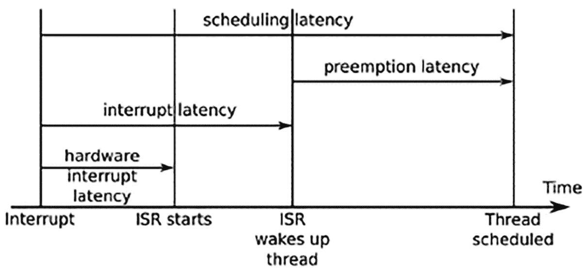
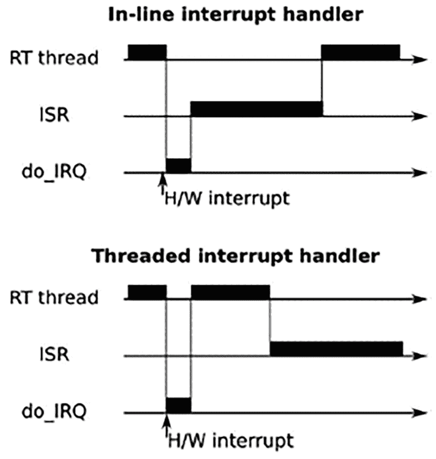
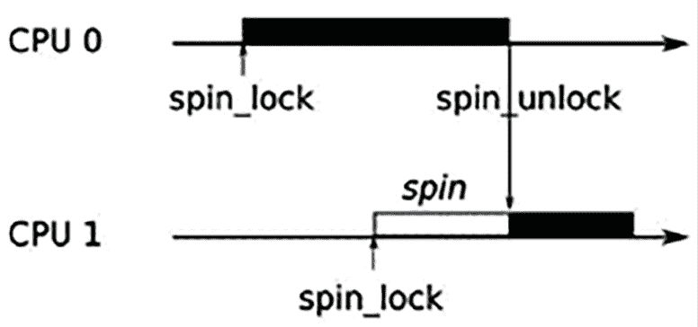

# 实时编程

计算机系统与现实世界之间的大部分交互都发生在实时中，因此这是嵌入式系统开发者需要关注的重要主题。我已经在多个地方讨论了实时编程：在*第十七章*中，我们研究了调度策略和优先级反转，在*第十八章*中，我描述了页面错误的问题以及内存锁定的必要性。现在是时候将这些话题结合起来，深入探讨实时编程了。

在本章中，我将首先讨论实时系统的特性，然后考虑这些特性对系统设计的影响，涉及应用层和内核层。我将描述实时`PREEMPT_RT`内核补丁，并展示如何获取它并将其应用到主线内核中。最后的部分将描述如何使用两个工具**cyclictest**和**Ftrace**来表征系统延迟。

还有其他方法可以在嵌入式 Linux 设备上实现实时行为，例如，使用专用微控制器或在 Linux 内核旁边运行一个单独的实时内核，像 Xenomai 和 RTAI 那样。我在这里不讨论这些方法，因为本书的重点是使用 Linux 作为嵌入式系统的核心。

在本章中，我们将涵盖以下主题：

+   什么是实时？

+   识别非确定性的来源

+   理解调度延迟

+   内核抢占

+   可抢占内核锁

+   高分辨率定时器

+   避免页面错误

+   中断屏蔽

+   测量调度延迟

# 技术要求

要跟随示例进行操作，请确保您已经具备以下条件：

+   一个 Ubuntu 24.04 或更高版本的 LTS 主机系统，至少有 90 GB 的空闲磁盘空间

+   Yocto 5.0（Scarthgap）LTS 版本

+   一个 microSD 卡读卡器和卡

+   用于 Linux 的 balenaEtcher

+   一根以太网线和一个具有可用端口的路由器用于网络连接

+   一个 BeaglePlay

+   一个能够提供 3A 电流的 5V USB-C 电源

您应该已经构建了 Yocto 的 5.0（Scarthgap）LTS 版本，详见*第六章*。如果没有，请在按照*第六章*中的说明在 Linux 主机上构建 Yocto 之前，参考*兼容的 Linux 发行版*和*构建主机软件包*部分，内容请见*Yocto 项目快速构建*指南([`docs.yoctoproject.org/brief-yoctoprojectqs/`](https://docs.yoctoproject.org/brief-yoctoprojectqs/))。

# 什么是实时？

实时编程的性质是软件工程师们喜爱长篇讨论的主题之一，通常会给出一系列相互矛盾的定义。我将首先阐述我认为关于实时最重要的内容。

一个任务是实时任务，如果它必须在某个特定时间点之前完成，这个时间点被称为**截止时间**。通过考虑在编译 Linux 内核时播放音频流的情况，可以区分实时任务和非实时任务。播放音频流是实时任务，因为有数据流不断到达音频驱动程序，必须按播放速率将音频样本块写入音频接口。而编译则不是实时的，因为没有截止时间。你只是希望它尽快完成；无论是 10 秒钟还是 10 分钟都不会影响内核二进制文件的质量。

另一个需要考虑的重要因素是错过截止时间的后果，这可能从轻微的烦恼到系统故障，甚至在极端情况下可能导致伤害或死亡。以下是一些例子：

+   **播放音频流**：截止时间大约在几十毫秒。如果音频缓冲区下溢，你会听到一个咔嚓声，这很烦人，但你很快就能适应。

+   **移动和点击鼠标**：截止时间也是在毫秒级别的。如果错过了，鼠标会不规则移动，按钮点击会丢失。如果问题持续存在，系统将变得无法使用。

+   **打印纸张**：纸张进给的截止时间在毫秒级别，如果错过了，可能会导致打印机卡纸，需要有人去修复。偶尔的卡纸是可以接受的，但没有人会购买一台经常卡纸的打印机。

+   **在生产线瓶子上打印保质期**：如果某个瓶子没有打印，整个生产线必须停止，瓶子被移除，并重新启动生产线，这样会非常昂贵。

+   **烤蛋糕**：大约有 30 分钟的截止时间。如果错过几分钟，蛋糕可能会烤坏。如果错过很长时间，房子可能会着火。

+   **电涌检测系统**：如果系统检测到电涌，必须在 2 毫秒内触发断路器。未能做到这一点会导致设备损坏，并可能造成伤害甚至死亡。

换句话说，错过截止时间会带来很多后果。我们通常会谈论这些不同的类别：

+   **软实时**：截止时间是理想的，但有时会错过，而系统不会因此被认为是失败。前面列表中的前两个例子就是这种情况的例子。

+   **硬实时**：在这种情况下，错过截止时间会产生严重后果。我们可以进一步将硬实时系统细分为任务关键型系统，其中错过截止时间会带来一定代价（如第四个例子），以及安全关键型系统，在这些系统中，错过截止时间可能会危及生命安全（如最后两个例子）。我加入烤蛋糕的例子是为了说明并非所有硬实时系统的截止时间都以毫秒或微秒为单位。

为安全关键系统编写的软件必须符合各种标准，以确保其具备可靠执行的能力。对于像 Linux 这样复杂的操作系统来说，满足这些要求是非常困难的。

对于任务关键系统，Linux 常常被用于各种控制系统，并且这种做法是可行且常见的。软件的需求取决于截止时间和置信度的组合，通常可以通过广泛的测试来确定。

因此，要说一个系统是实时的，必须在最大预期负载下测量其响应时间，并证明它在一定比例的时间内满足截止时间。作为经验法则，配置良好的使用主线内核的 Linux 系统适用于具有几十毫秒截止时间的软实时任务，而使用`PREEMPT_RT`补丁的内核适用于具有几百微秒截止时间的软硬实时任务关键系统。

创建实时系统的关键是减少响应时间的可变性，这样你就能更有信心确保不会错过截止时间；换句话说，你需要让系统变得更具确定性。通常，这会以牺牲性能为代价。例如，缓存通过缩短访问数据项的平均时间来加速系统运行，但在缓存未命中的情况下，最大时间会更长。缓存使系统变得更快，但确定性更差，这正是我们不希望的。

**提示**

实时计算的一个误区是认为它很快。事实并非如此；一个系统越是确定性，最大吞吐量就越低。

本章的其余部分将讨论识别延迟的原因以及可以采取的减少措施。

# 确定非确定性来源

从根本上说，实时编程是确保控制实时输出的线程在需要时能够被调度，从而在截止时间前完成工作。任何阻止这一点的因素都是问题。以下是一些常见的问题领域：

+   **调度**：实时线程必须优先调度，因此它们必须采用实时策略，如`SCHED_FIFO`或`SCHED_RR`。此外，它们应该按优先级降序分配，首先是具有最短截止时间的线程，这符合我在*第十七章*中描述的速率单调分析理论。

+   **调度延迟**：内核必须能够在事件发生时（如中断或定时器触发）立即重新调度，而不应受到无界延迟的影响。减少调度延迟是本章后续讨论的一个关键主题。

+   **优先级倒置**：这是基于优先级调度的一个后果，当一个高优先级线程被低优先级线程持有的互斥锁阻塞时，会导致无界延迟，正如我在 *第十七章* 中所描述的那样。用户空间有优先级继承和优先级天花板互斥锁；在内核空间，我们有 RT-互斥锁，它实现了优先级继承，稍后我会在实时内核部分讨论它们。

+   **精确计时器**：如果你想管理低毫秒级或微秒级的截止时间，你需要相应的计时器。高分辨率计时器至关重要，几乎所有内核都提供这个配置选项。

+   **页面错误**：在执行代码的临界区时发生页面错误将打乱所有的时间估算。你可以通过锁定内存来避免它们，正如我稍后所描述的那样。

+   **中断**：中断发生在不可预测的时刻，如果中断突然大量涌入，可能会导致意外的处理开销。避免这种情况有两种方法。一种是将中断作为内核线程运行，另一种是在多核设备上，屏蔽一个或多个 CPU 的中断处理。我将在后续部分讨论这两种可能性。

+   **处理器缓存**：这些提供了 CPU 与主内存之间的缓冲区，像所有缓存一样，处理器缓存是非确定性的来源，尤其是在多核设备上。不幸的是，这超出了本书的范围，但你可以参考本章末尾的参考资料以获取更多详细信息。

+   **内存总线争用**：当外设通过 DMA 通道直接访问内存时，它们会占用一部分内存总线带宽，这会导致 CPU 核心（或多个核心）访问变慢，从而增加程序执行的非确定性。然而，这是一个硬件问题，也超出了本书的范围。

我将在接下来的部分扩展讨论最重要的问题，并探讨如何应对这些问题。

# 理解调度延迟

实时线程需要在有任务时立即调度。然而，即使没有其他同等或更高优先级的线程，从唤醒事件发生的时刻（中断或系统定时器）到线程开始运行之间，总是存在一定的延迟。这就是所谓的调度延迟。它可以分解成几个组成部分，如下图所示：



图 21.1 – 调度延迟

首先，硬件中断延迟是指从中断发生到 **中断服务例程**（**ISR**）开始运行之间的时间延迟。这其中有一小部分是中断硬件本身的延迟，但最大的问题是由于中断在软件中被禁用。最小化这个 *IRQ 关闭时间* 非常重要。

接下来是中断延迟，这是从中断服务例程（ISR）处理完中断并唤醒等待该事件的线程的时间。它主要取决于 ISR 的编写方式。通常，它应该只需要很短的时间，单位为微秒。

最后的延迟是抢占延迟，即从内核被通知线程准备好运行，到调度程序实际运行该线程的时间。它取决于内核是否可以被抢占。如果内核正在执行关键区段的代码，那么重新调度将不得不等待。延迟的长度取决于内核抢占的配置。

# 内核抢占

抢占延迟发生的原因是当前线程的执行并不总是安全或可取的去抢占，并调用调度程序。主线 Linux 提供了三种抢占设置，通过 **内核特性** | **抢占模式** 菜单进行选择：

+   `CONFIG_PREEMPT_NONE`：无抢占。

+   `CONFIG_PREEMPT_VOLUNTARY`：启用对抢占请求的额外检查。

+   `CONFIG_PREEMPT`：允许内核被抢占。

当抢占设置为 `none` 时，内核代码将继续执行，直到通过 `syscall` 返回到用户空间，此时总是允许抢占，或者遇到一个使当前线程停止的睡眠等待。由于它减少了内核和用户空间之间的过渡次数，并且可能减少总的上下文切换次数，因此该选项在牺牲较大的抢占延迟的情况下，能获得最高的吞吐量。它是服务器和一些桌面内核的默认设置，在这些情况下吞吐量比响应性更为重要。

第二个选项启用显式抢占点，如果设置了 `need_resched` 标志，调度程序将被调用，这减少了最坏情况下的抢占延迟，代价是吞吐量略微降低。一些发行版会在桌面上设置此选项。

第三个选项使内核可以被抢占，这意味着只要内核不在原子上下文中执行，外部中断就可以导致立即的调度。这减少了最坏情况下的抢占延迟，因此，在典型的嵌入式硬件上，总的调度延迟可以缩短至几毫秒左右。

这通常被描述为软实时选项，大多数嵌入式内核都配置为这种方式。当然，这会导致总体吞吐量稍微降低，但相比于为嵌入式设备提供更具确定性的调度，这通常并不那么重要。

## 实时 Linux 内核（PREEMPT_RT）

长期以来，一项致力于进一步减少延迟的工作被称为内核配置选项**PREEMPT_RT**。该项目由 Ingo Molnar、Thomas Gleixner 和 Steven Rostedt 发起，多年来得到了更多开发者的贡献。内核补丁可以在[`www.kernel.org/pub/linux/kernel/projects/rt`](https://www.kernel.org/pub/linux/kernel/projects/rt)找到，同时也有一个维基页面：[`wiki.linuxfoundation.org/realtime/start`](https://wiki.linuxfoundation.org/realtime/start)。

**重要提示**

`PREEMPT_RT`已于 2024 年 9 月 20 日完全合并并启用在主线 Linux 内核中。`PREEMPT_RT`对 x86、x86-64、arm64 和 riscv 架构的支持包含在 2024 年 11 月 17 日发布的 Linux 6.12 LTS 版本中。

中心计划是减少内核在**原子上下文**中运行的时间，在这种上下文中，调用调度程序并切换到其他线程是不安全的。典型的原子上下文包括内核处于以下状态时：

+   正在运行中断或陷阱处理程序。

+   持有自旋锁或处于 RCU 关键区段。自旋锁和 RCU 是内核锁原语，其细节在这里不做探讨。

+   在调用`preempt_disable()`和`preempt_enable()`之间。

+   硬件中断被禁用（**IRQs off**）。

`PREEMPT_RT`所包含的更改有两个主要目标：一个是通过将中断处理程序转换为内核线程来减少中断处理的影响，另一个是使锁可抢占，以便线程在持有锁时能够休眠。显然，这些更改有较大的开销，这使得平均情况下的中断处理变得较慢，但却更加确定性，这正是我们所追求的。

## 线程化中断处理程序

不是所有的中断都会触发实时任务，但所有的中断都会从实时任务中窃取周期。线程化中断处理程序允许为中断分配优先级，并在适当的时间安排它，如下图所示：



图 21.2 – 内联与线程化中断处理程序

如果中断处理程序代码以内核线程的形式运行，则没有理由不能被更高优先级的用户空间线程抢占，因此中断处理程序不会导致用户空间线程的调度延迟。线程化中断处理程序自 2.6.30 版本以来成为主线 Linux 的一个特性。你可以通过使用`request_threaded_irq()`来注册一个中断处理程序，从而将其线程化，取代普通的`request_irq()`。你还可以通过配置内核参数`CONFIG_IRQ_FORCED_THREADING=y`来使线程化的 IRQ 成为默认，这将使所有的中断处理程序变成线程，除非它们明确通过设置`IRQF_NO_THREAD`标志来防止这一点。当启用`PREEMPT_RT`时，中断默认被配置为以这种方式作为线程。下面是一个你可能会看到的示例：

```
# ps -Leo pid,tid,class,rtprio,stat,comm,wchan | grep FF
  PID   TID CLS RTPRIO STAT COMMAND         WCHAN
   21    21 FF      99 S    migration/0     smpboot_thread_fn
   22    22 FF       1 S    irq_work/0      smpboot_thread_fn
   25    25 FF       1 S    irq_work/1      smpboot_thread_fn
   26    26 FF      99 S    migration/1     smpboot_thread_fn
   32    32 FF       1 S    irq_work/2      smpboot_thread_fn
   33    33 FF      99 S    migration/2     smpboot_thread_fn
   39    39 FF       1 S    irq_work/3      smpboot_thread_fn
   40    40 FF      99 S    migration/3     smpboot_thread_fn
   66    66 FF      50 S    watchdogd       kthread_worker_fn
   78    78 FF      50 S    irq/14-4d000000 irq_thread
  <…>
  103   103 FF      50 S    irq/256-8000000 irq_thread
  107   107 FF      50 S    irq/293-xhci-hc irq_thread
  111   111 FF      50 S    irq/294-mmc0    irq_thread
  112   112 FF      50 S    irq/294-s-mmc0  irq_thread
  119   119 FF      50 S    irq/346-User Ke irq_thread
  120   120 FF      50 S    irq/476-mmc1    irq_thread
  121   121 FF      50 S    irq/476-s-mmc1  irq_thread
  123   123 FF      50 S    irq/295-mmc2    irq_thread
  124   124 FF      50 S    irq/295-s-mmc2  irq_thread
  127   127 FF      50 S    irq/472-fa00000 irq_thread 
```

**重要提示**

中断线程都被赋予了默认的`SCHED_FIFO`策略，并且优先级为`50`。然而，将它们保持在默认值上没有意义；现在是你根据中断与实时用户空间线程的重要性来分配优先级的机会。

这是一个建议的线程优先级降序排列顺序：

+   POSIX 计时器线程`posixcputmr`应该始终具有最高优先级。

+   与最高优先级实时线程相关的硬件中断。

+   优先级最高的实时线程。

+   逐渐较低优先级的实时线程的硬件中断，随后是线程本身。

+   下一个最高优先级的实时线程。

+   非实时接口的硬件中断。

+   软件 IRQ 守护进程`ksoftirqd`，在 RT 内核中负责运行延迟的中断例程，并且在 Linux 3.6 之前，负责运行网络栈、块 I/O 层以及其他任务。

你可能需要尝试不同的优先级级别以达到平衡。你可以在启动脚本中使用类似以下命令的`chrt`命令来更改优先级：

```
# chrt -f -p 90 `pgrep irq/293-xhci-hcd:usb1` 
```

`pgrep`命令是`procps`软件包的一部分。

既然我们已经通过线程化的中断处理程序了解了实时 Linux 内核，接下来让我们更深入地探讨其实现。

# 可抢占内核锁

将大多数内核锁设置为可抢占是`PREEMPT_RT`所做的最具侵入性的更改。

问题出现在自旋锁上，许多内核锁就是使用自旋锁的。自旋锁是一种忙等待互斥锁，在竞争的情况下不需要上下文切换，因此只要锁持有时间较短，它就非常高效。理想情况下，它们的锁持有时间应该小于两次重新调度所需的时间。

以下图显示了两个不同 CPU 上运行的线程在争用同一个自旋锁的情况。**CPU 0**先获得自旋锁，迫使**CPU 1**进入自旋状态，直到锁被解锁：



图 21.3 – 自旋锁

持有自旋锁的线程无法被抢占，因为这样做可能导致新线程进入相同的代码，并在尝试锁定相同的自旋锁时发生死锁。因此，在主线 Linux 中，锁定自旋锁会禁用内核的抢占，创建一个原子上下文。这意味着持有自旋锁的低优先级线程可能会阻止高优先级线程被调度，这种情况通常被称为**优先级反转**。

**重要说明**

`PREEMPT_RT`采用的解决方案是将几乎所有自旋锁替换为 RT 互斥锁。互斥锁比自旋锁慢，但它是完全可抢占的。不仅如此，RT 互斥锁实现了优先级继承，因此不会受到优先级反转的影响。

现在我们对`PREEMPT_RT`补丁的内容有了一些了解。那么，如何获得这些补丁呢？

## 获取 PREEMPT_RT 补丁

历史上，RT 开发者并没有为每个内核版本创建补丁集，因为这需要大量的移植工作。平均而言，他们为每隔一个内核版本创建补丁。从内核版本 5.9 开始，情况发生了变化，从那时起，每个内核版本都会生成一个补丁。本文写作时，支持的最新内核版本如下：

+   `6.13-rt`

+   `6.12-rt`

+   `6.11-rt`

+   `6.10-rt`

+   `6.9-rt`

+   `6.8-rt`

+   `6.7-rt`

+   `6.6-rt`

+   `6.5-rt`

+   `6.4-rt`

+   `6.3-rt`

+   `6.1-rt`

    **重要说明**

    这些补丁可以在[`www.kernel.org/pub/linux/kernel/projects/rt`](https://www.kernel.org/pub/linux/kernel/projects/rt)获取。从`6.12-rt`版本开始，补丁包含了尚未合并到官方内核中的功能和优化。

如果你正在使用 Yocto 项目，已经有 RT 版本的内核了。否则，你可能已经从获取内核的地方获得了包含`PREEMPT_RT`补丁的版本。如果没有，你就必须自己应用这个补丁。首先，确保`PREEMPT_RT`补丁的版本和你的内核版本完全匹配；否则，你将无法干净地应用这些补丁。然后，按正常方式应用它，如以下命令行所示。然后，你就可以通过`CONFIG_PREEMPT_RT_FULL`配置内核：

```
$ cd linux-6.6.74
$ zcat patch-6.6.74-rt48.patch.gz | patch -p1 
```

前一段有个问题。`RT`补丁仅在你使用兼容的主线内核时才能应用。你可能没有使用，因为这正是嵌入式 Linux 内核的特点。因此，你需要花一些时间查看失败的补丁，修复它们，然后分析目标板的支持情况，并添加缺失的实时支持。这些细节再次超出了本书的范围。如果你不确定该怎么办，应该向你使用的内核供应商或内核开发者论坛寻求支持。

## Yocto 项目与 PREEMPT_RT

Yocto 项目提供了两个标准的内核食谱：`linux-yocto` 和 `linux-yocto-rt`，并且已经应用了实时补丁。假设你的目标硬件被 Yocto 内核支持，你只需要选择 `linux-yocto-rt` 作为首选内核，并声明你的机器兼容。

由于我们使用 `meta-ti-bsp` 层为 BeaglePlay 构建 TI 内核，因此需要在 `conf/local.conf` 中添加以下两行，以构建实时内核：

```
PREFERRED_PROVIDER_virtual/kernel = "linux-ti-staging-rt"
COMPATIBLE_MACHINE_beagleplay-ti = "beagleplay-ti" 
```

现在我们知道如何获取实时 Linux 内核，让我们换个话题，聊一聊计时。

# 高分辨率计时器

如果你有精确的计时要求，计时器分辨率就非常重要，这对于实时应用程序来说是典型的。Linux 中的默认计时器是一个以可配置速率运行的时钟，嵌入式系统通常为 100 Hz，服务器和桌面为 250 Hz。两个计时器滴答之间的间隔称为 **jiffy**，在之前给出的例子中，嵌入式 SoC 上是 10 毫秒，服务器上是 4 毫秒。

Linux 从 2.6.18 版本开始，借助实时内核项目获得了更精确的计时器，现在只要有高分辨率计时器源和设备驱动，它们就可以在所有平台上使用——这几乎总是成立的。你需要通过配置内核 `CONFIG_HIGH_RES_TIMERS=y` 来启用它。

启用此功能后，所有内核和用户空间的时钟将精确到底层硬件的粒度。找到实际的时钟粒度是困难的。显而易见的答案是通过 `clock_getres(2)` 提供的值，但它总是声称分辨率为 1 纳秒。

`cyclictest` 工具有一个选项可以分析时钟报告的时间，以猜测分辨率：

```
# cyclictest -R
# /dev/cpu_dma_latency set to 0us
WARN: reported clock resolution: 1 nsec
WARN: measured clock resolution approximately: 60 nsec 
```

你也可以查看内核日志消息，查找与时钟相关的字符串，例如：

```
# dmesg | grep clock
[    0.000000] clocksource: arch_sys_counter: mask: 0x3ffffffffffffff max_cycles: 0x2e2049d3e8, max_idle_ns: 440795210634 ns60563 Min:     13 Act:   67 Avg:   67 Max:     241
[    0.000001] sched_clock: 58 bits at 200MHz, resolution 5ns, wraps every 4398046511102ns
[    0.028415] clocksource: jiffies: mask: 0xffffffff max_cycles: 0xffffffff, max_idle_ns: 1911260446275000 ns
[    0.058173] PTP clock support registered
[    0.060830] clocksource: Switched to clocksource arch_sys_counter
[    0.685471] clk: Disabling unused clocks 
```

这两种方法提供了明显不同的数字，且都低于 1 微秒。内核日志显示的是计时器的基础分辨率（例如，jiffies、HPET、TSC），而不是应用时间保持调整后的有效分辨率。`cyclictest` 测量的是实际的唤醒延迟，这取决于调度器的唤醒延迟、IRQ 延迟和计时器硬件的准确性。

高分辨率计时器能够以足够的精度测量延迟的变化。现在，让我们来看几个减轻这种非确定性的方法。

# 避免页面错误

页面错误发生在应用程序读取或写入尚未提交到物理内存的内存时。页面错误的发生时间是不可预测的（或非常难以预测），因此它们是计算机中的另一个非确定性来源。

幸运的是，有一个函数可以让你提交进程使用的所有内存并将其锁定，以确保它不会引发页面错误。这个函数是 `mlockall(2)`。它有两个标志：

+   `MCL_CURRENT`：锁定当前映射的所有页面。

+   `MCL_FUTURE`：锁定将来映射的页面。

通常在应用程序启动时调用 `mlockall`，并设置这两个标志以锁定所有当前和未来的内存映射。

**提示**

`MCL_FUTURE` 不是魔法，分配或释放堆内存时，使用 `malloc()/free()` 或 `mmap()` 时仍然会有非确定性的延迟。这类操作最好在启动时完成，而不是在主控制循环中。

堆栈上分配的内存更为棘手，因为它是自动完成的，如果你调用一个使堆栈比之前更深的函数，你会遇到更多的内存管理延迟。一个简单的解决方法是在启动时将堆栈增长到一个比你认为会需要的更大的大小。代码可能如下所示：

```
#define MAX_STACK (512*1024)
static void stack_grow (void)
{
    char dummy[MAX_STACK];
    memset(dummy, 0, MAX_STACK);
    return;
}
int main(int argc, char* argv[])
{
    <…>
    stack_grow ();
    mlockall(MCL_CURRENT | MCL_FUTURE);
    <…> 
```

`stack_grow()` 函数在堆栈上分配一个大变量，然后将其清零，以强制这些内存页面提交给此进程。

中断是我们应该防范的另一种非确定性来源。

# 中断屏蔽

使用线程化的中断处理程序有助于通过以比不影响实时任务的中断处理程序更高的优先级运行某些线程，从而减少中断开销。如果你使用的是多核处理器，你可以采取不同的方法，完全屏蔽一个或多个核心的中断处理，使它们专门用于实时任务。这在正常的 Linux 内核或 `PREEMPT_RT` 内核中都有效。

实现这一目标的问题在于将实时线程绑定到一个 CPU 上，并将中断处理程序绑定到另一个 CPU 上。你可以使用 taskset 命令行工具设置线程或进程的 CPU 亲和性，或者使用 `sched_setaffinity(2)` 和 `pthread_setaffinity_np(3)` 函数。

要设置中断的亲和性，首先注意在 `/proc/irq/<IRQ number>` 中，每个中断编号都有一个子目录。中断的控制文件在其中，包括 `smp_affinity` 中的 CPU 掩码。将一个位掩码写入该文件，位设置为允许处理该 IRQ 的每个 CPU。

堆栈增长和中断屏蔽是提高响应性的巧妙技术，但如何判断它们是否真的有效呢？

# 测量调度延迟

所有的配置和调优都将毫无意义，如果你不能证明你的设备能够满足截止时间。你将需要自己的基准测试进行最终测试，但我在这里将描述两个重要的测量工具：`cyclictest` 和 `Ftrace`。

## cyclictest

`cyclictest` 最初由 Thomas Gleixner 编写，现在在大多数平台上以名为 `rt-tests` 的软件包提供。

如果你正在构建 Yocto 实时内核，你可以通过构建实时镜像配方来创建一个包含 `rt-tests` 的目标镜像：

```
$ bitbake core-image-rt 
```

如果你正在为 BeaglePlay 构建 TI 实时内核，那么请使用 `CONFIG_ARM_PSCI_IDLE=y` 配置内核，以便 `cyclictest` 可以写入 `/dev/cpu_dma_latency` 套接字。

如果您正在为 BeaglePlay 构建 TI 实时内核，然后通过修改`conf/local.conf`将`rt-tests`附加到您的镜像：

```
IMAGE_INSTALL:append = " rt-tests" 
```

构建最小镜像配方以在 BeaglePlay 的镜像上安装`rt-tests`：

```
$ bitbake core-image-minimal 
```

如果您使用 Buildroot，则需要在**Target packages** | **Debugging, profiling and benchmark** | **rt-tests**菜单中添加`BR2_PACKAGE_RT_TESTS`包。

`cyclictest`通过比较休眠所需的实际时间和请求的时间来测量调度延迟。如果没有延迟，它们将相同，报告的延迟将为 0。`cyclictest`假设定时器分辨率小于 1 微秒。

它具有大量命令行选项。首先，您可以尝试在目标上以`root`身份运行此命令：

```
# cyclictest -l 100000 -m -p 99
# /dev/cpu_dma_latency set to 0us
policy: fifo: loadavg: 0.00 0.00 0.00 1/119 430
T: 0 (  422) P:99 I:1000 C: 100000 Min:      5 Act:    7 Avg:    7 Max:      48 
```

所选选项如下：

+   `-l N`: 循环 N 次（默认为无限次）。

+   `-m`: 使用`mlockall`锁定内存。

+   `-p N`: 使用实时优先级 N。

结果行从左到右显示以下内容：

+   `T: 0`: 这是线程 0，本次运行中的唯一线程。您可以使用`-t`参数设置线程数。

+   `( 422)`: 这是 PID 422。

+   `P:99`: 优先级为 99。

+   `I:1000`: 循环之间的间隔为 1,000 微秒。您可以使用`-i N`参数设置间隔。

+   `C:100000`: 此线程的最终循环计数为 100,000。

+   `Min: 5`: 最小延迟为 5 微秒。

+   `Act: 7`: 实际延迟为 7 微秒。*实际延迟*是最近的延迟测量值，仅在您观察`cyclictest`运行时才有意义。

+   `Avg: 7`: 平均延迟为 7 微秒。

+   `Max: 48`: 最大延迟为 48 微秒。

这是在运行`linux-ti-staging-rt`内核的空闲系统上进行的快速演示工具。要真正有用，您需要在运行预期的最大负载的同时至少 24 小时内运行测试。`cyclictest`是调度延迟的标准度量。但是，它不能帮助您识别和解决特定的内核延迟问题。为此，您需要使用 Ftrace。

## 使用 Ftrace

内核函数跟踪器有助于跟踪内核延迟，这也是它最初编写的目的。这些跟踪器捕获运行期间检测到的最坏情况延迟的跟踪，显示导致延迟的函数。

兴趣跟踪器以及内核配置参数如下：

+   `irqsoff`: `CONFIG_IRQSOFF_TRACER`跟踪禁用中断的代码，记录最坏情况。

+   `preemptoff`: `CONFIG_PREEMPT_TRACER`类似于`irqsoff`，但跟踪内核抢占被禁用的最长时间（仅适用于可抢占内核）。

+   `preemptirqsoff`: 结合前两个跟踪器，记录禁用`irqs`和/或抢占的最长时间。

+   `wakeup`: 跟踪并记录最高优先级任务在唤醒后调度所需的最大延迟。

+   `wakeup_rt`: 这与 wakeup 相同，但仅适用于具有`SCHED_FIFO`、`SCHED_RR`或`SCHED_DEADLINE`策略的实时线程。

+   `wakeup_dl`: 这是相同的，但仅适用于具有`SCHED_DEADLINE`策略的期限调度线程。

请注意，运行 Ftrace 每次捕获新的最大值时都会增加大量延迟，通常在几十毫秒左右，而 Ftrace 本身可以忽略这些延迟。然而，这会扭曲`cyclictest`等用户空间追踪工具的结果。换句话说，如果你在捕获追踪时运行`cyclictest`，请忽略其结果。

选择追踪器的方法与我们在*第二十章*中看到的函数追踪器相同。下面是一个示例，展示了在禁用抢占的情况下捕获最大时长的追踪，持续 60 秒：

```
# echo preemptoff > /sys/kernel/debug/tracing/current_tracer
# echo 0 > /sys/kernel/debug/tracing/tracing_max_latency
# echo 1 > /sys/kernel/debug/tracing/tracing_on
# sleep 60
# echo 0 > /sys/kernel/debug/tracing/tracing_on 
```

结果追踪，经过大量编辑，类似这样：

```
# cat /sys/kernel/debug/tracing/trace
# tracer: preemptoff
#
# preemptoff latency trace v1.1.5 on 3.14.19-yocto-standard
# -----------------------------------------------------------
# latency: 1160 us, #384/384, CPU#0 | (M:preempt VP:0, KP:0, SP:0 HP:0)
# ----------------
# | task: init-1 (uid:0 nice:0 policy:0 rt_prio:0)
# ----------------
# => started at: ip_finish_output
# => ended at: __local_bh_enable_ip
#
#
#           _------=> CPU#
#          / _-----=> irqs-off
#         | / _----=> need-resched
#         || / _---=> hardirq/softirq
#         ||| / _--=> preempt-depth
#         |||| /     delay
# cmd pid |||||   time | caller
#   \ /   |||||      \ | /
 init-1   0..s.    1us+: ip_finish_output
 init-1   0d.s2   27us+: preempt_count_add <-cpdma_chan_submit
 init-1   0d.s3   30us+: preempt_count_add <-cpdma_chan_submit
 init-1   0d.s4   37us+: preempt_count_sub <-cpdma_chan_submit
 <…>
 init-1   0d.s2 1152us+: preempt_count_sub <-__local_bh_enable
 init-1   0d..2 1155us+: preempt_count_sub <-__local_bh_enable_ip
 init-1   0d..1 1158us+: __local_bh_enable_ip
 init-1   0d..1 1162us!: trace_preempt_on <-__local_bh_enable_ip
 init-1   0d..1 1340us : <stack trace> 
```

在这里，你可以看到在运行追踪时，禁用内核抢占的最长时间为`1160`微秒。这个简单的事实可以通过读取`/sys/kernel/debug/tracing/tracing_max_latency`得到，但之前的追踪进一步提供了导致该测量的内核函数调用序列。标记为`delay`的列显示了每个函数调用的点，最后是`trace_preempt_on()`在`1162us`时被调用，这时内核抢占重新启用。有了这些信息，你可以回溯调用链并（希望）弄清楚这是否是一个问题。

其他提到的追踪器工作原理相同。

## 结合 cyclictest 和 Ftrace

如果`cyclictest`报告了异常长的延迟，你可以使用`breaktrace`选项来中止程序，并触发 Ftrace 以获取更多信息。

你可以使用`-b<N>`或`--breaktrace=<N>`来调用`breaktrace`，其中`N`是触发追踪的延迟微秒数。你可以使用`-T[tracer name]`或以下选项选择 Ftrace 追踪器：

+   `-C`: 上下文切换

+   `-E`: 事件

+   `-f`: 函数

+   `-w`: 唤醒

+   `-W`: 唤醒-实时

例如，当测量到大于`100`微秒的延迟时，这将触发 Ftrace 函数追踪器：

```
# cyclictest -a -t -p99 -b100 
```

我们现在有两个互补的工具来调试延迟问题。`cyclictest`检测暂停，Ftrace 提供详细信息。

# 总结

*实时*这个术语没有意义，除非你用一个截止时间和可接受的丢失率来限定它。当你拥有这两项信息时，你可以判断 Linux 是否适合作为操作系统，如果适合，接下来就可以开始调优你的系统以满足这些要求。调整 Linux 和你的应用程序以处理实时事件意味着使其更加确定性，从而保证实时线程能够可靠地按时完成任务。确定性通常是以总吞吐量为代价的，因此实时系统无法处理像非实时系统那样多的数据。

不能提供数学证明来表明像 Linux 这样的复杂操作系统总能满足给定的截止日期，因此唯一的做法是通过使用如`cyclictest`和 Ftrace 等工具进行广泛测试，更重要的是，使用您自己针对自己应用程序的基准测试。

为了提高确定性，您需要同时考虑应用程序和内核。在编写实时应用程序时，您应遵循本章关于调度、锁定和内存的指导方针。

内核对系统的确定性有很大影响。幸运的是，这些年来在这方面做了很多工作。启用内核抢占是一个很好的第一步。如果你仍然发现它比你希望的更频繁地错过截止日期，那么你可能需要考虑`PREEMPT_RT`。它确实可以产生低延迟，但你可能会遇到将 `PREEMPT_RT` 内核补丁与旧版（6.12 之前）供应商内核集成到特定板上的问题。你可能还需要，或者需要额外，使用 Ftrace 和类似工具来寻找延迟的原因。

这让我来到了嵌入式 Linux 解剖的结尾。作为嵌入式系统工程师需要具备非常广泛的技能，其中包括对硬件的低级了解以及内核如何与硬件交互。你需要成为一名出色的系统工程师，能够配置用户应用程序并调整它们以高效运行。所有这些都必须在硬件上完成，而这些硬件往往只是勉强能完成任务。这里有一句话总结了这一点：*一个工程师能用一美元做别人用两美元做的事*。希望你能通过本书中提供的信息实现这一点。

# 进一步学习

+   *硬实时计算系统：可预测的调度算法与应用*，作者：Giorgio Buttazzo

+   *多核应用程序编程：适用于 Windows、Linux 和 Oracle Solaris*，作者：Darryl Gove

# 加入我们的 Discord 社区

加入我们社区的 Discord 空间，与作者和其他读者讨论：[`packt.link/embeddedsystems`](https://packt.link/embeddedsystems)


[packt.com](https://www.packt.com)

订阅我们的在线数字图书馆，全面访问超过 7,000 本书籍和视频，以及帮助您规划个人发展并推动职业生涯的行业领先工具。欲了解更多信息，请访问我们的网站。

# 为什么订阅？

+   通过来自超过 4,000 名行业专业人士的实用电子书和视频，将学习时间减少，编程时间增加

+   利用特别为您定制的技能计划提高您的学习效率

+   每月获得一本免费的电子书或视频

+   完全可搜索，轻松访问重要信息

+   复制粘贴、打印和书签内容

在 [www.packt.com](https://www.packt.com)，你还可以阅读一系列免费的技术文章，注册各种免费的新闻通讯，并获得 Packt 图书和电子书的独家折扣和优惠。

# 你可能会喜欢的其他书籍

如果你喜欢本书，可能也对 Packt 出版的其他书籍感兴趣：


**嵌入式 Linux 安全手册**

Matt St. Onge

ISBN: 978-1-83588-564-2

+   理解如何根据设计标准确定最优硬件平台

+   认识到安全设计在嵌入式系统中的重要性

+   实现先进的安全措施，如 TPM、LUKS 加密和安全启动过程

+   发现安全生命周期管理的最佳实践，包括设备更新和升级机制

+   高效创建安全的软件供应链

+   通过控制设备上的访问和资源来实现防篡改功能


**Linux 设备驱动开发（第二版）**

John Madieu

ISBN: 978-1-80324-006-0

+   下载、配置、构建并定制 Linux 内核

+   使用设备树描述硬件

+   编写功能丰富的平台驱动程序，并利用 I2C 和 SPI 总线

+   充分利用新并发管理的工作队列基础设施

+   理解 Linux 内核时间管理机制并使用与时间相关的 API

+   使用 regmap 框架来提取代码并使其通用

+   使用 DMA 卸载 CPU 进行内存拷贝

+   使用 GPIO、IIO 和输入子系统与现实世界进行交互

# Packt 正在寻找像你这样的作者

如果你有兴趣成为 Packt 的作者，请访问 [authors.packtpub.com](https://authors.packtpub.com) 并立即申请。我们与成千上万的开发者和技术专业人士合作，帮助他们与全球技术社区分享他们的见解。你可以提交一般申请，申请我们正在招募作者的特定热门话题，或者提交你自己的想法。

# 分享你的想法

现在你已经完成了 *《深入掌握嵌入式 Linux 开发（第四版）》*，我们非常期待听到你的想法！如果你是在亚马逊购买的本书，请 [点击这里直接前往亚马逊的评论页面](https://packt.link/r/1803232595)，分享你的反馈或留下评论。

你的评论对我们和技术社区都很重要，能够帮助我们确保提供高质量的内容。
