# 第一章：1  

# 部署 Ubuntu Server  

Ubuntu Server 是一款功能极其强大的 Linux 发行版，专为服务器和网络设备设计。无论你是在设置高端数据库还是小型办公室文件服务器，Ubuntu Server 的灵活性都能够满足并超越你的需求。在本书中，我们将介绍所有常见的使用案例，帮助你最大限度地发挥这个令人兴奋的平台的优势。Ubuntu Server 结合了现代开发框架和稳定性，硬件支持使得它可以安装在最新的服务器硬件上。  

在本章中，我将引导你完成从头到尾部署 Ubuntu Server 的过程。我们将从一些最佳实践的讨论开始，然后我们将获取软件并创建我们的安装介质。接下来，我将为你提供一个逐步的安装过程。到本章结束时，你将拥有一个属于你自己的 Ubuntu Server 安装，可以在本书的其余部分中使用。此外，由于 Canonical（Ubuntu 的开发者）现在为 Raspberry Pi 提供官方支持，我们也将探讨如何设置 Raspberry Pi。  

本章中，我们将涵盖：  

+   技术要求  

+   确定服务器的角色  

+   选择服务器设备  

+   获取安装介质  

+   创建可启动的闪存驱动器  

+   安装 Ubuntu Server  

+   在 Raspberry Pi 上安装 Ubuntu Server

为了开始，我们将首先查看一些部署 Ubuntu 服务器的技术要求。  

# 技术要求  

为了跟随本书中的示例，你需要安装一个 Ubuntu Server 进行操作。一般来说，以下规格是成功安装 Ubuntu Server 的估计最低要求：  

+   64 位 CPU  

+   1 GB RAM  

+   10 GB 硬盘（推荐 16 GB 或更多）  

64 位 CPU 支持现在成为一个要求，唯一的例外是 Raspberry Pi 版本。这是因为 Canonical 不再为 32 位 PC 和服务器处理器提供 Ubuntu 版本。虽然这看起来像是一个缺点，但如今所有售出的计算机都支持 64 位操作系统，并且自 2003 年起，消费级 CPU 就已经具备 64 位能力。即使你有一台旧 PC，觉得它可能无法运行 64 位操作系统，实际上你会惊讶地发现，甚至是较旧的 Pentium IV（尽管已经很老）也支持这一点，所以这个要求应该不难满足。现在不用担心这些细节，我们将在本章后面详细讨论这些要求。  

现在我们了解了 Ubuntu Server 的技术要求，接下来让我们考虑一下我们的服务器将在组织中扮演什么角色。  

# 确定服务器的角色  

你很兴奋要设置一个 Ubuntu Server 安装，这样你可以按照本书中的示例进行操作。同样重要的是了解在现实世界中如何执行典型的服务器推出。每台服务器都必须有一个目的或*角色*。这个角色可以是数据库服务器、Web 服务器、文件服务器等等。简而言之，角色是服务器为你或你的组织增加的价值。有时，服务器可能仅用于测试实验性代码的目的。这也很重要——拥有测试环境是一个非常常见（也是值得的）做法。

一旦你了解了服务器在组织中的角色，你可以为其实施计划。这个系统是关键任务吗？如果由于某种原因这个服务器出现故障，它将如何影响你的组织？根据这个问题的答案，你可能只需为这个任务设置一个服务器，或者你可能希望计划冗余，以使服务器不成为故障的中心点。一个例子是 DNS 服务器，它会影响同事解析本地主机名和访问所需资源的能力。在某些情况下，添加第二个 DNS 服务器以在主服务器出现故障时接管可能是合理的。

另一个需要考虑的项目是服务器上驻留数据的机密性对你的环境有多重要。这直接关系到我们即将执行的安装过程，因为你将被询问是否想要使用加密。Ubuntu Server 在安装过程中提供的加密称为静态加密，它指的是存储在服务器内部存储卷中的数据。如果你的服务器注定要存储机密数据（会计信息、信用卡号码、员工或客户记录等），你可能要考虑利用这个选项。

加密你的硬盘是一个非常好的主意，可以防止那些有本地访问权限的坏人窃取数据。只要攻击者没有你的加密密钥，他们就无法窃取这些机密信息。然而，值得一提的是，任何有物理访问权限的人都可以轻松地销毁数据（无论是否加密），所以请记住保持服务器房间上锁！

在这本书的这一部分，我绝对不是要求你创建详细的实施图表或类似的东西，而是要记住在设置新服务器时应始终包含在对话中的一些概念。它需要有存在的理由，必须了解服务器数据的关键性和机密性，然后相应地设置服务器。一旦你练习了这些概念以及安装过程，你可以制定自己的服务器推出计划，以便在你的组织中使用。总而言之，理解基础设施中每个组件的目的是一种很好的思维方式。

到此为止，我们已经了解了如何为我们的服务器确定角色以及它如何融入我们的组织。在接下来的部分，我们将实际查看安装 Ubuntu Server 的过程，这样我们至少可以有一台测试机器用于书中的示例。

# 为我们的服务器选择设备

我敢打赌，你一定很兴奋想要设置自己安装的 Ubuntu Server，并深入探索。但在我们开始之前，我们必须决定到底要安装在哪个设备上。就本书的目的而言，硬件没有特别要求。你只需要一个 Ubuntu Server 安装版本，如果可以，设置多个服务器也是有益的——它们不必都是同一种设备类型。拥有多个服务器将帮助你在后续章节中进行网络实验。但现在，关键是利用你现有的设备来启动 Ubuntu 安装。

特别地，以下列表包括了你可以考虑用于安装 Ubuntu Server 的最常见设备：

+   物理服务器

+   物理桌面

+   笔记本电脑

+   虚拟机

+   虚拟私人服务器

+   树莓派

让我们更详细地看看这些选项。

## 物理服务器

现在，找到价格合理的二手物理服务器非常容易。戴尔 PowerEdge 是一种非常常见的型号，特别是 R610 和 R710 是很好的选择，二手市场上很容易找到。这些服务器通常在公司升级到更新型号后进入转售市场。虽然 R610 和 R710 已经有些年头，但它们的配置仍然适合测试用途。如果你能以合理的价格找到更新型号（如 R720），那就更好了。

物理服务器的缺点是它们占用大量空间，且往往消耗大量电力（并且噪音较大）。确保在不使用时关闭它们，并查看你所在地区的电力费用——这些服务器的运行成本可以非常低，也可以非常高，具体取决于你的电价。

## 物理桌面

如果你没有物理服务器，可以考虑在桌面上运行 Ubuntu Server。一些电脑用户在升级到新的设备后，往往会继续保留旧的 PC。因此，与其让你的旧桌面电脑积灰，不如让它发挥作用？当然，你的老旧电脑可能无法运行当今的高端游戏，但对于我们的目的来说这并不重要。Ubuntu Server 在老旧硬件上也能运行得非常好。实际上，很多家庭学习者都使用小型机箱 PC（如英特尔 NUC）来实现这一目的。此外，使用物理桌面也相较于物理服务器有一些优势。它们通常比服务器硬件消耗更少的电力，且噪音也较小。

在生产服务器（用于你组织内部的 Ubuntu Server 安装）方面，台式电脑通常并不是一个好的选择。根据不同的型号，实际的服务器硬件可能会具备一些台式电脑所没有的额外硬件和功能。例如，真正的服务器构建通常会配备硬件 RAID、**错误更正码** (**ECC**) 内存、多处理器等功能。尽管台式电脑机箱通常缺少这些功能，但如果你在旧电脑上安装 Ubuntu Server，它仍然是一个有效的服务器，和实际的服务器机箱没有什么不同——尽管它在数据中心的扩展性较差。不过，由于我们现在只是学习，所以这些对我们当前的使用场景并不重要。

## 笔记本电脑

另一个值得考虑的选择是将 Ubuntu Server 安装在笔记本电脑上。如果你有一台不再使用的旧笔记本电脑，它可能是学习 Ubuntu Server 的一个很好的选择。如果你决定使用笔记本电脑来完成这个任务，那么与使用台式电脑时相同的因素也适用于此。

然而，我之所以决定在这里单独列出笔记本电脑，是因为它们具备一些额外的优势，值得我们利用。对于真实的数据中心服务器机架，你通常会接入**键盘、视频和鼠标** (**KVM**) 。这可能意味着你可以将物理显示器、键盘和鼠标连接到服务器，或者使用集成这三者的特殊设备。数据中心内的服务器还会配备**不间断电源** (**UPS**)，即使断电，它们也能继续运行一段时间。

当谈到笔记本电脑时，它具备了相同的功能。笔记本电脑内置了键盘、鼠标和显示器。如果笔记本电脑中安装的电池正常工作，那么你也就有了不间断电源（UPS）。正因为这些原因，笔记本电脑可能在整体上相较于台式电脑具有一定的优势。

然而，就像台式电脑一样，笔记本电脑通常不适合在实际的数据中心使用。对于我们的使用场景而言，我们只需要安装一个或多个 Ubuntu Server 实例来完成本书中的示例任务。为了这个目的，专门使用任何你当前不使用的电脑就足够了。

## 虚拟机

如果你无法访问物理机器，可以考虑使用**虚拟机** (**VM**)。如今大多数计算机都支持运行虚拟机的能力。**VirtualBox** 是一个很好的解决方案，它易于使用，并且可以在所有主要操作系统上使用。就像 Ubuntu 本身一样，VirtualBox 是免费的，因此通常是开始的最低成本选项。而且，VirtualBox 允许你轻松创建 Ubuntu 安装的快照，这样你可以在进行本书中的示例之前创建一个时间点备份，并在需要时恢复它，以便重复执行任务。仅仅是快照功能，就使得虚拟机对我们的需求尤其有吸引力。

使用 VirtualBox 的缺点是，您需要至少分配 1GB RAM 给您的 Ubuntu 服务器 VM，并且您的 CPU 需要支持虚拟化扩展，如果您的设备支持，则需要在计算机设置中启用它。

可以在这里下载 VirtualBox：[`www.virtualbox.org`](https://www.virtualbox.org)。

## 虚拟专用服务器

诸如 Amazon Web Services、Google Cloud、Linode、Microsoft Azure、Digital Ocean 等的服务允许您在云中设置 Ubuntu 服务器，以便通过 OpenSSH 连接和管理。选择**虚拟专用服务器**（**VPS**）选项有一些好处；您无需为大型物理服务器寻找空间，也不必担心电力使用问题。另一个好处是，在本章中甚至无需经历安装过程；当您选择在其平台上部署 Ubuntu 服务器时，云提供商将为您执行此操作。然而，主要缺点是 VPS 实例并非免费——您需要查看在此类服务器上运行 Ubuntu 的相关成本，并决定这种成本是否合理。一些 VPS 服务允许您每月以至少 5 美元的价格设置实例，这可以低于在某些地区运行物理服务器所需的电费成本。

## 树莓派

**树莓派**单元正在迅速成为用户喜爱的服务器使用案例。它们价格低廉（某些型号甚至低于 40 美元），并且电力消耗非常少——你可以将它们 24/7 保持通电，几乎不会对电费产生显著影响。事实上，它们的功耗大约相当于充电一部高端手机所需的电力。另一个好处是，树莓派通常比入门级 VPS 更强大。最便宜的 VPS 实例通常只有 1 个 CPU 核心和 1GB RAM，但现代树莓派配备四核 CPU，并且具有 2GB、4GB 或 8GB 的 RAM，具体取决于购买的型号。这意味着树莓派可能比更便宜的 VPS 实例性能更好。树莓派的缺点是，由于它们使用 ARM CPU 而不是 x86，因此某些应用程序不可用。这意味着本书中的一些示例在树莓派上将无法运行（尽管大多数示例可以）。

一旦选择了要在其上安装 Ubuntu 服务器的设备，我们可以继续进行。如果选择使用 VPS，您可以跳转到下一章，*第二章*，*管理用户和权限*，因为您不需要详细介绍安装过程。对于树莓派，如果您选择了这个平台，您可以跳到本章末尾，查看专门设置的部分。对于其他所有设备，请继续阅读 Ubuntu 服务器 Live 安装程序的详细步骤。

# 获取安装媒体

是时候开始了！如果你决定使用物理服务器、桌面、笔记本电脑或虚拟机作为测试服务器，那么你需要完成安装过程来设置 Ubuntu。别担心——这非常简单，甚至比你想象的还要简单，因为与旧版本相比，整个过程的步骤要少得多。如果你选择使用 VPS 或树莓派，则无需经过这个过程，因为 VPS 提供商会为你完成这个步骤，而树莓派有一种完全不同的设置方法（我们将在本章后面的*在树莓派上安装 Ubuntu*部分介绍）。

假设你已经决定使用一个需要通过安装程序的设备，我们需要下载 Ubuntu Server，然后创建可启动的安装介质来安装它。如何操作很大程度上取决于你的硬件。你的设备有光驱吗？它能从 USB 启动吗？请查阅设备的文档以了解详细信息。

如果可以的话，建议使用闪存驱动器进行安装，最好是使用 USB 3.0 或更高版本，因为它比 USB 2.0 更快。推荐使用闪存驱动器的原因是它们通常比 DVD 更快。

然而，如果你的设备较旧，你将没有选择的余地，因为老旧设备根本无法从 USB 启动。一般来说，如果可能的话，使用闪存驱动器，如果没有选择，才选择 DVD。

过去，Ubuntu Server 的 ISO 镜像可以用来创建可启动的 CD 或 DVD。但现在，可写 CD 的空间不足以支持下载大小。因此，如果你选择将其刻录到可启动的光盘介质上，至少需要一个可写的 DVD。

不幸的是，典型数据中心中服务器的年龄差异会带来一些不可预测性，尤其是在如何启动安装介质方面。刚开始接触服务器时，所有标准的机架式服务器通常都配有 3.5 英寸软盘驱动器，甚至一些更高端的服务器还配有光驱。而如今，服务器通常既没有软盘驱动器，也没有光驱。如果服务器有光驱，它可能会长时间没有使用，直到下次有人尝试使用它时才发现它可能已经坏了。有些服务器可以从 USB 启动，有些则不行。继续之前，请查阅硬件的文档并做相应的计划。你的服务器功能决定了你需要创建哪种类型的介质。

无论我们计划创建可启动的 USB 还是 DVD，我们只需要下载一个文件。在浏览器中导航到以下网站开始：[`www.ubuntu.com/download/server`](https://www.ubuntu.com/download/server)。

在这个页面上，我们将通过点击**选项 2 – 手动服务器安装**按钮来下载 Ubuntu 22.04 LTS：

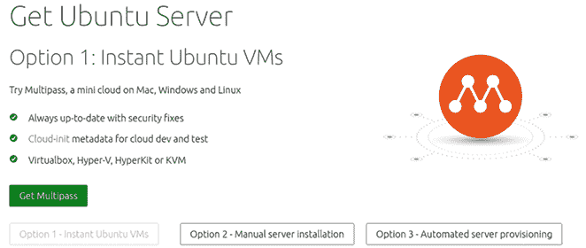

图 1.1：Ubuntu Server 22.04 下载页面

接下来，您将看到一个或多个版本的 Ubuntu Server 可供下载：

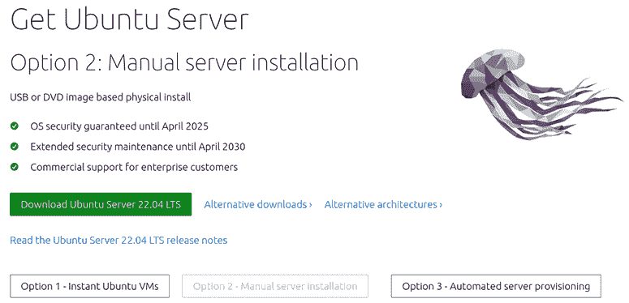

图 1.2：展示 Ubuntu Server 22.04 下载选项

截至本章撰写时，Ubuntu Server 22.04 是最新版本，并作为主要下载选项显示。根据您阅读本书的时间，页面上可能还列出了其他版本的 Ubuntu Server，例如 22.10 和 23.04。Ubuntu 每六个月发布一次新版本。然而，本书仅涵盖 **长期支持**（**LTS**）版本，因为它享有五年的支持。

相比之下，非 LTS 版本（或“过渡发布版”）仅支持九个月，因此不适合用作生产服务器。组织通常不会使用非 LTS 版本，除非是为了在正式发布之前测试即将推出的功能，所以为了我们的目的，我们将坚持使用 LTS 版本。下载完成后，我们将得到一个 ISO 镜像文件，可以用来创建可引导的安装介质。

如果您是在设置虚拟机，那么从 Ubuntu 下载页面下载的 ISO 文件就是您所需要的；您不需要创建可引导的 DVD 或闪存驱动器。在这种情况下，您只需要创建虚拟机，将 ISO 文件附加到虚拟光驱上并启动它。接下来，安装程序应该会自动启动，您可以按照本章稍后“安装 Ubuntu Server”部分中描述的安装步骤继续操作。由于在虚拟化解决方案之间，启动 ISO 镜像的过程有所不同，因此逐一详细说明每种方法会是一项非常困难的任务。幸运的是，这个过程通常很简单，您可以在虚拟化管理程序的文档中找到详细信息。在大多数情况下，过程就像是将下载的 ISO 镜像附加到虚拟机上并启动它一样简单。

如果您的设备不支持从 USB 启动，且您需要创建一个可引导的 DVD，通常只需要下载 ISO 文件，然后右键单击该文件。在操作系统的右键菜单中，您应该有一个类似“刻录到磁盘”的选项。这适用于 Windows 以及大多数安装了刻录应用程序的 Linux 图形桌面环境。

具体步骤因系统而异，主要是因为这里涉及大量的软件组合。例如，我见过许多 Windows 系统，其中右键点击菜单中的刻录 DVD 选项被已安装的 CD/DVD 刻录软件删除。在这种情况下，你必须首先打开 CD/DVD 刻录软件并找到从下载的 ISO 文件创建介质的选项。尽管我很想在这里列出完整的过程，但通常没有两台 Windows 电脑预装相同的 CD/DVD 刻录软件。最好的经验法则是尝试右键点击文件，看看是否有该选项，如果没有，就参考你所用应用程序的文档。请记住，*数据光盘*并不是我们需要的类型，所以一定要寻找从 ISO 镜像创建介质的选项，否则你的光盘将对我们的目的毫无用处。

到此时，你应该已经下载了 Ubuntu Server 的 ISO 镜像文件。如果你打算使用 DVD 来安装 Ubuntu，你也应该已经创建好它。在接下来的部分，我将概述如何创建一个可引导的闪存驱动器，用于安装 Ubuntu Server。

# 创建一个可引导的闪存驱动器

创建一个可引导的 USB 闪存驱动器来安装 Ubuntu 的过程，过去在不同平台间差异很大。具体步骤根据你的工作站或笔记本电脑当前使用的是 Linux、Windows 还是 macOS 而有所不同。幸运的是，现在有了一种更简单的方法。如今，我推荐使用**Etcher**来创建可引导的介质。Etcher 的优势在于它将方法抽象化，使得无论你使用哪种操作系统，过程都是相同的，而且它将过程简化到最简单的形式。

我喜欢的另一个功能是 Etcher 很安全；它能防止你在制作可引导介质的过程中破坏当前操作系统。过去，你可能会使用 Linux 上的 `dd` 命令将 ISO 文件写入闪存驱动器。然而，如果你设置 `dd` 命令不正确，可能会把 ISO 文件写入当前操作系统，从而擦除整个硬盘。Etcher 不会让你犯这样的错误。

在继续之前，你需要准备一只 USB 闪存驱动器，它必须是空的，或者是你不介意被清空的。这一过程将完全擦除其内容，所以确保该设备上没有你可能需要的信息。闪存驱动器的容量应至少为 2 GB 或更大。考虑到现在很难找到小于 4 GB 的闪存驱动器，这应该比较容易获取。

首先，前往[`www.balena.io/etcher/`](https://www.balena.io/etcher/)，从他们的网站下载最新版本的应用程序并打开它。启动后，窗口看起来会类似于以下截图：

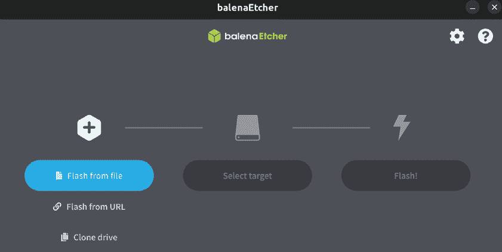

图 1.3：使用 Etcher 创建可引导的闪存驱动器

此时，点击 **从文件闪存**，这将打开一个新窗口，允许你选择之前下载的 ISO 文件。一旦选择了 ISO，点击 **打开**：

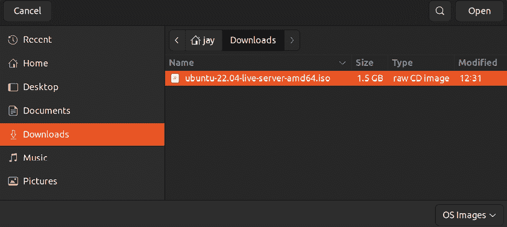

图 1.4：使用 Etcher 选择 ISO 镜像

如果你的闪存驱动器已经插入到计算机中，Etcher 应该会自动检测到它。如果你连接了多个闪存驱动器，或者 Etcher 选择了错误的驱动器，你可以点击 **更改** 并选择你希望使用的闪存驱动器：

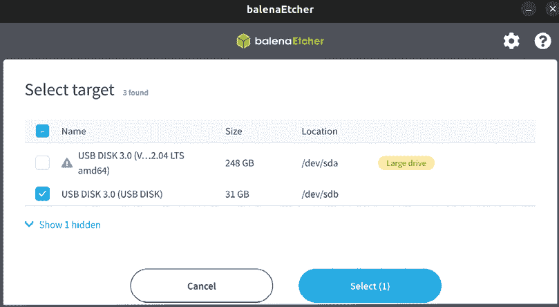

图 1.5：使用 Etcher 选择不同的闪存驱动器

最后，点击 **继续** 启动该过程。此时，闪存驱动器将被转换为 Ubuntu Server 安装介质，可以用来启动安装过程：

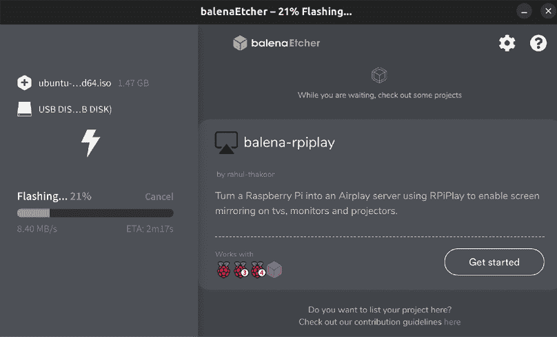

图 1.6：Etcher 正在写入闪存驱动器

几分钟后（时间长短取决于你的硬件），**闪存** 过程将完成，你将能够继续并开始一些安装操作。在继续之前，我们应该先快速讨论一下分区问题。

## 规划分区布局

**分区** 硬盘允许你将硬盘划分成多个部分，为不同的应用程序或用途分配专门的存储空间。例如，你可以为 Apache 网络服务器共享的文件分配一个分区，这样对其他分区的更改就不会影响它。你甚至可以为你的网络文件共享分配一个分区——可能性是无穷的。每个分区都会挂载（附加）到一个特定的目录，任何发送到该目录的文件都会被写入到该独立分区。你为分区挂载目录起的名字是任意的，实际上你叫什么名字并不重要。Linux 系统的存储灵活性使你在分区和目录命名上都可以发挥创意，因为 Linux 文件系统在将存储设备挂载到特定文件夹时提供了更大的灵活性。

诚然，我们有些急于求成了。毕竟，我们才刚刚开始，本章的重点是帮助你设置一个基础的 Ubuntu Server 安装，以便为接下来的内容奠定基础。在安装过程中，我们将接受默认设置。然而，本节的目的是给你提供一些选项供你以后参考。到某个时候，你可能会想要发挥创意，尝试不同的分区布局。

使用自定义分区，你可以做一些非常巧妙的事情。例如，经过正确配置后，你可以在不丢失用户数据、日志等的情况下清除并重新加载操作系统。这是因为 Ubuntu Server 允许你在安装过程中根据需要划分存储。如果你已有包含数据的分区，你可以选择保持不变，并将其带到新的安装中。你只需要将挂载目录路径设置为与之前相同，恢复配置文件，应用程序就会像什么都没发生一样继续工作。

现实世界中常见的自定义分区例子之一是将`/home`目录单独分割成一个分区。由于用户通常在这里存储文件，你可以配置服务器，以便重新加载操作系统时不会影响他们的文件。当他们在服务器刷新后重新登录时，所有的文件都会在原来的位置。你甚至可以将 Apache Web 服务器共享的文件放在它们自己的分区上，这样也能保持这些文件不被丢失。这里可以做很多创新的配置。

这可能不言而喻，但在重新安装 Ubuntu 时，你应该备份那些包含不希望被擦除数据的分区（即使你不打算格式化这些分区）。原因是，一旦出错（实际上只需勾选一个框），你就可能轻易擦除该分区上的所有数据。在刷新服务器时，始终备份你的数据。

使用独立分区的另一个理由可能是创建边界或限制。如果你在服务器上运行的某个应用程序容易占满大量存储空间，你可以将该应用程序指向一个独立的分区，且该分区的大小有限。例如，日志文件就是一个很好的应用场景。日志文件是任何系统管理员在存储方面的噩梦。

日志在帮助你找出为什么某个程序崩溃时非常有用，但如果不小心，它们会很快占满硬盘。在我的经验中，服务器因为日志文件占满了服务器上唯一分区的所有可用空间，导致服务器突然停顿。这个分区就是整个磁盘，应用程序没有其他的边界。

尽管有更好的方法来处理过度的日志记录（如日志轮转、磁盘配额等），但使用单独的分区无疑会有所帮助。如果应用程序的日志目录在一个单独的分区上，它只会填满那个分区，而不会影响整个硬盘，这虽然会导致一些问题，但不会影响整个服务器。作为管理员，你需要权衡这些策略的优缺点，避免服务器过载，并制定一个最适合你组织需求的分区方案。

维护服务器的成功在于高效管理资源、用户和安全性——一个好的分区方案无疑是其中的一部分。有时候，这只是为了让自己省事，万一需要重新加载操作系统时，能够减少工作量。为了跟上本书的内容，Ubuntu Server 的安装或分区方式并不重要。关键是要成功安装——你可以随时练习分区。毕竟，学习的一部分就是搭建平台，观察可能出现的问题，然后进行修复。

下面是一些关于分区的基本技巧：

+   至少需要为根文件系统（由正斜杠表示）创建一个分区。

+   `/var` 目录包含大多数日志文件，因此它是一个很好的分区候选，原因如本节前面所述。

+   `/home` 目录存储所有用户文件。将其分离成一个独立的分区是有益的，因为这样可以让你的用户文件在重新安装 Ubuntu 时得以保留。

+   如果你以前使用过 Linux，可能会熟悉 **交换分区** 的概念，它是一个特殊的分区，当内存满时可以作为虚拟内存来使用。不过在新的 Ubuntu 版本中，这已经不再是必需的——**交换文件** 将会自动创建。

在下一节的安装过程中，我们将选择默认的分区方案，让你快速入门。不过，我建议你在未来某个时候再次回到安装过程，尝试不同的分区方式。你可能会想出一些巧妙的方式来划分存储。但这并不是必须的——根据你的需求，所有内容放在一个分区也是可以的。

现在我们已经了解了分区的概念，我们应该已经涵盖了所有必要的主题，能够实际开始安装 Ubuntu Server。让我们现在开始吧。

# 安装 Ubuntu Server

到此为止，我们应该已经准备好开始安装 Ubuntu Server。在接下来的步骤中，我会带你一步步完成安装过程。

要开始，你只需要将安装介质插入服务器或设备，并按照屏幕上的说明打开启动菜单。启动过程开始时按的键因机器而异，但通常是*F10*、*F11* 或 *F12*。如果不确定，请参考你的文档，尽管大多数电脑和服务器都会在开始时提示你按哪个键。你可能在前几次会错过这个时机，这没关系——直到今天，我似乎仍然需要重启机器一两次才能及时按下正确的键。

一旦你成功启动设备并使用你的 Ubuntu Server 安装介质，安装程序的导航就相对简单了。你只需使用方向键上下移动，选择不同的选项，然后按*Enter*键确认选择。*Esc*键将允许你退出子菜单。一旦熟悉了操作，安装程序中的导航非常容易。

一旦安装程序启动，你将看到第一个选择屏幕。第一个选项，**Ubuntu Server**，允许你启动 Ubuntu Server 安装程序。第二个选项，**测试内存**，运行一个特殊程序，帮助你确定设备内存条是否有物理缺陷。我总是建议每年至少测试一次设备的内存，尤其是在首次安装操作系统之前。内存问题虽然很少见，但你会感到惊讶。为了保险起见，测试一下内存也许是个不错的主意。

如果你希望测试设备的内存，可以继续进行此操作。不过，为了继续下去，我们需要选择**Ubuntu Server**选项，以便启动安装程序：

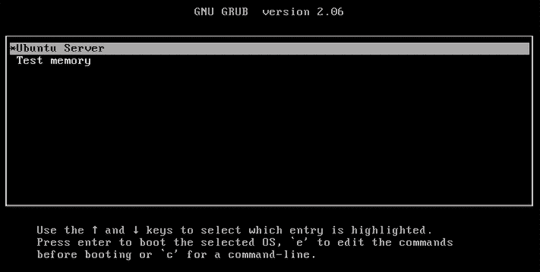

图 1.7：Ubuntu Server 安装介质的初始启动屏幕

接下来，你将看到一个允许你选择语言的屏幕，如下图所示：

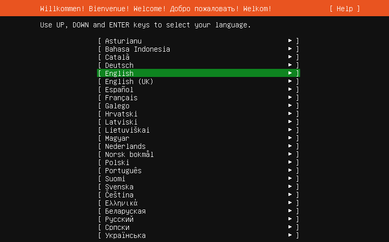

图 1.8：安装过程开始时的语言选择

如果你的语言是英语以外的其他语言，你可以在这里选择。一旦你对所选择的键盘布局满意，继续选择屏幕底部的**完成**。

选择语言后，你将进入一个屏幕，可以设置你的**键盘配置**。如果没有自动选择正确的键盘布局，你可以在这里进行更改。

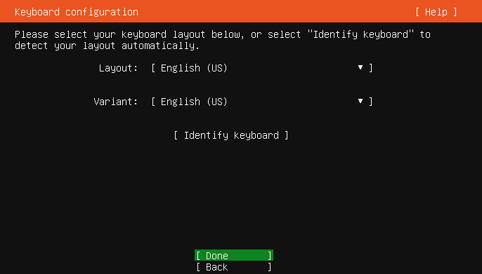

图 1.9：设置你的键盘布局

接下来，我们将看到一个选项来安装**Ubuntu Server**，或者**Ubuntu Server（最小化）**。在这里，我们选择第一个选项。选择安装最小化版本的 Ubuntu Server 可能适合创建较小的安装，但对于本书而言，我们将专注于常规安装类型。

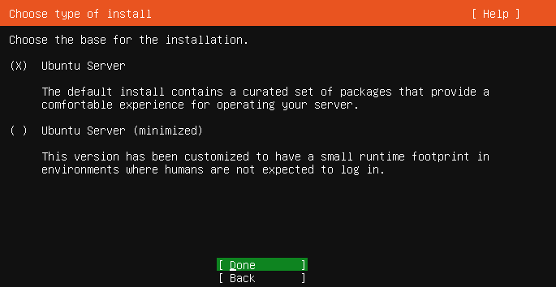

图 1.10：选择你的安装类型

接下来，Ubuntu Server 安装程序将尝试自动检测适合你的网络卡的参数。默认情况下，它应该通过**动态主机配置协议**（**DHCP**）自动检测合适的设置。我们将在后续章节中详细讲解 DHCP，特别是*第十一章*，*设置网络服务*。现在，默认设置应该是可以的。选择**完成**以继续。

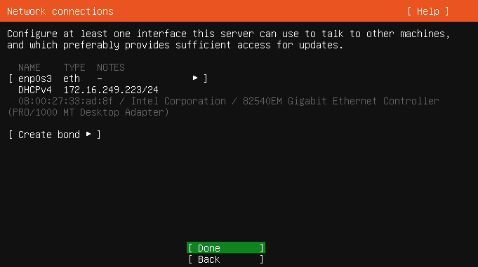

图 1.11：Ubuntu Server 安装程序中的网络配置

接下来，屏幕将给我们一个机会来设置代理地址（如果需要的话）。大多数读者不需要这个功能，只有那些需要的用户可能已经从网络管理员那里获得了特定的代理设置。因此，我们选择**完成**继续：

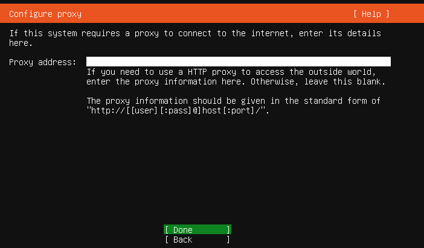

图 1.12：Ubuntu Server 安装程序中的代理设置

下一屏幕会显示设置镜像地址的选项。正如我们在*第三章*《*管理软件包*》中进一步讨论的那样，这个地址指的是可以下载可安装应用程序（软件包）的在线源。在某些情况下，一个组织可能会托管自己的软件仓库。

因此，在这个界面上，如果你有自己的服务器，可以选择不同的服务器来提供软件。对于我们的需求，我们将选择**完成**以接受默认设置并继续：

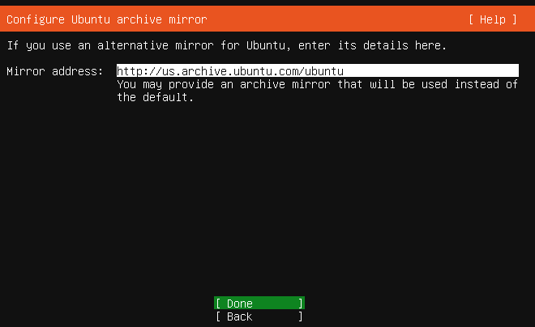

图 1.13：Ubuntu Server 安装程序中的镜像设置

接下来，我们会看到存储设置。特别是，这里是我们可以配置硬盘布局以进行安装的地方。在本章早些时候，我提到过采用自定义分区方案是一种常见做法。如果你有首选的分区布局，这是你可以通过选择**自定义存储布局**来输入决策的屏幕。

然而，这样做有点跳过了书中的内容，因此我建议选择**完成**来接受默认设置，这将覆盖整个硬盘：

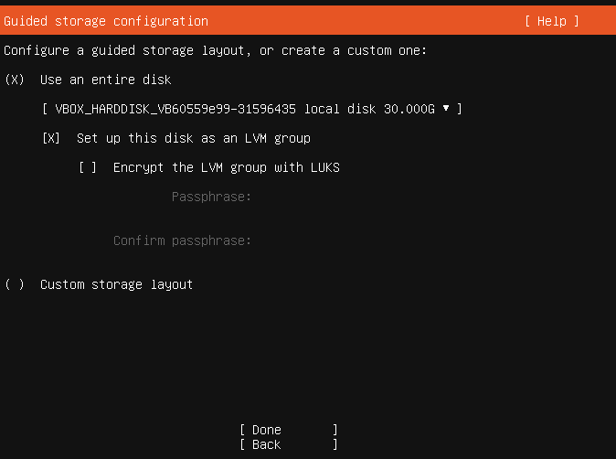

图 1.14：安装 Ubuntu Server 时配置存储

在告诉安装程序如何设置服务器上的存储设备后，我们会看到一个屏幕，汇总了我们在配置存储时的选择。由于我们选择了默认布局，这个屏幕会展示一个基本布局。如果你决定设置一个自定义的分区方案，你需要确保这里显示的选择与您设想的相符。如果你对这些内容感到困惑，不必太担心。我们将在*第九章*《*管理存储卷*》中更详细地讲解存储相关内容。现在，选择**完成**接受默认的存储布局：

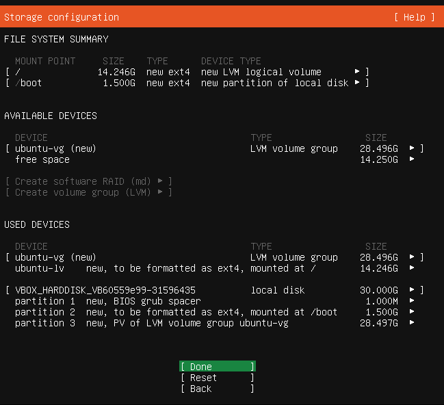

图 1.15：安装 Ubuntu Server 时的存储配置总结屏幕

如果你还不知道，这个过程将会清除你设备硬盘上的所有数据，并用新的 Ubuntu Server 安装替代它。这意味着，如果你没有备份设备上可能保存的重要数据，你将永远丢失这些信息。接下来的屏幕将解释这是在擦除硬盘并安装 Ubuntu Server 之前的最后一步。如果你确定你的硬盘上没有重要数据，可以选择**继续**：

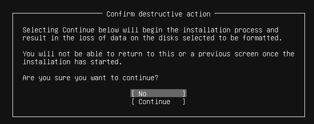

图 1.16：确认安装并擦除硬盘的数据

当我们安装 Ubuntu Server 时，它将为我们创建一个初始用户账户作为安装过程的一部分。此用户将用于配置和维护服务器。在安装程序的这一部分，我们将有机会为此用户命名并设置密码。

在这个屏幕上填写您的信息，就像我在下面的截图中所做的那样。需要记住的一件重要事情是，您在这里创建的用户将具有管理员访问权限。稍后您可以创建其他用户，但在这里创建的用户将拥有特殊权限。完成后，箭头移到**Done**并按*Enter*键：

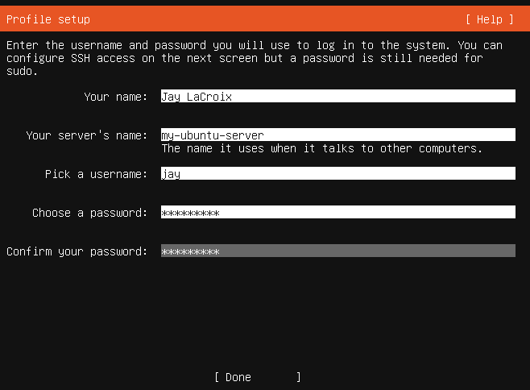

图 1.17：Ubuntu Server 安装程序，配置用户详细信息

接下来，你将看到一个**安装 OpenSSH 服务器**的选项。我建议你启用它。在远程管理 Ubuntu 服务器时，OpenSSH 是我们最常用的工具，详细内容在*第十章* *连接到网络*中有讲解。现在，让我们启用这个选项，这样以后我们就少一件事要做了。要这么做，你可以在光标位于选项上时按空格键，在其复选框中添加一个星号符号，表示选择。完成后，选择**Done**继续：

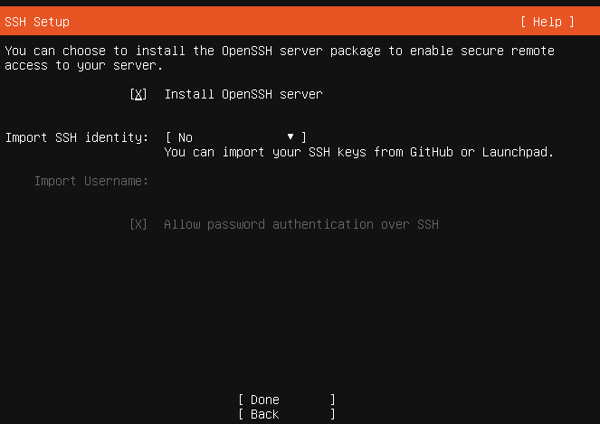

图 1.18：在安装 Ubuntu Server 时选择是否设置 OpenSSH

接下来，我们将看到一些常用应用程序的选择，这些应用程序可以在 Ubuntu Server 上运行。例如，我们在这个屏幕上有 Nextcloud、Docker 等选择。现在，我们会忽略这些，因为在本书中我们将手动设置许多服务。因此，现在选择**Done**继续：

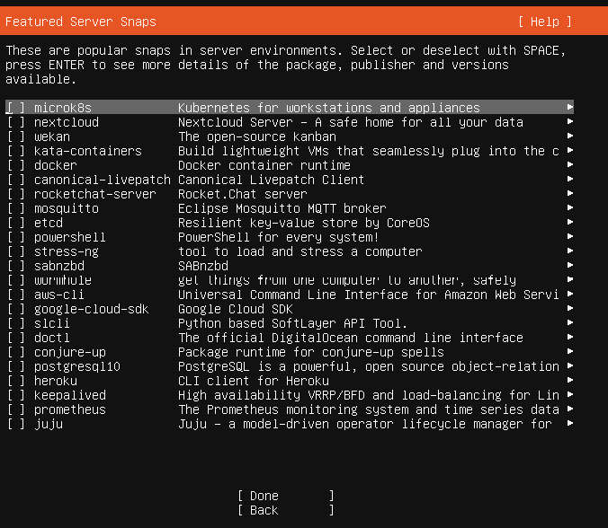

图 1.19：特色应用程序选择

就这样了 —— 安装程序将继续进行，因为它已经从您那里获得了所有需要的信息。完成后，在屏幕底部您将看到一个**重新启动**选项；请继续选择它：

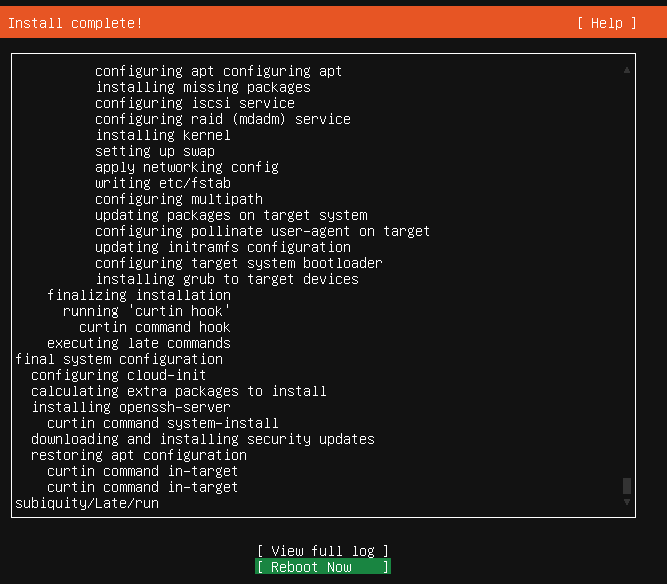

图 1.20：安装完成，待重启

此时，您的服务器将重新启动，然后 Ubuntu Server 应该会立即启动。恭喜！您现在拥有自己的 Ubuntu Server 安装！

除了特定服务器硬件和虚拟机之外，Ubuntu Server 也可以安装在树莓派上，在下一节我们将详细了解这一点。

# 在树莓派上安装 Ubuntu

Raspberry Pi 平台已成为业界一个非常有价值的资产，并且是一个有用的服务器平台。这些微型计算机现在配备了四核处理器和最多 8GB 的 RAM，非常节能，且其性能足够强大，可以真正将它们转化为实际的服务器。在我的实验室里，我的网络上有几台 Raspberry Pi，每台都负责执行特定的任务或功能。在很多情况下，你甚至无法察觉它们是硬件性能较低的设备。也许更令人惊讶的是，Raspberry Pi 4 能够超越一些低端云实例，在不需要高端 CPU 的情况下，为你提供一个强大的服务器，且没有每月费用。所有这些，都是在如此小巧的外形中——这些设备比你的咖啡杯垫还要小！

Ubuntu Server 支持 Raspberry Pi 2、3 和 4 型号。要开始，只需访问 Raspberry Pi 版本的 Ubuntu 官方下载页面：[`ubuntu.com/download/raspberry-pi`](https://ubuntu.com/download/raspberry-pi)。这将带你到如下界面：

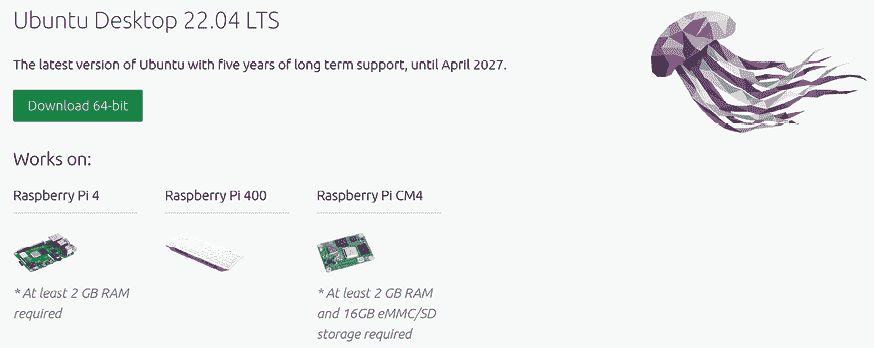

图 1.21：官方 Ubuntu 网站上 Raspberry Pi 的下载区

一旦进入，你会看到多个可供下载的 Pi 版本列表。参考前面的截图查看可用选项，但请记住，Ubuntu 随时可能重新设计其网页。因此，作为经验法则，下载与您所拥有的 Raspberry Pi 类型匹配的版本，如果有 64 位版本，最好选择 64 位版本（Raspberry Pi 2 只提供 32 位版本）。

Pi 版本的下载文件将以压缩镜像的形式提供，可以直接写入 SD 卡。为了开始这个过程，打开之前下载的 Etcher。打开 Etcher 后，点击**Flash from file**：

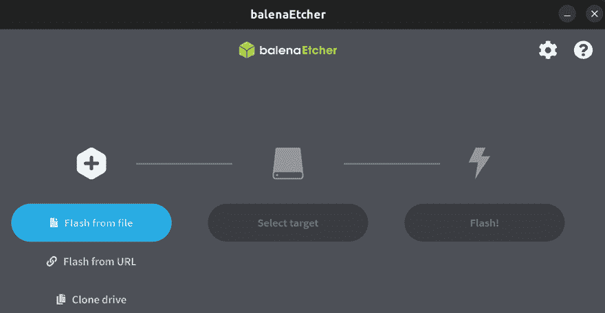

图 1.22：Etcher，准备开始操作

现在，选择之前下载的文件并点击**Open**：

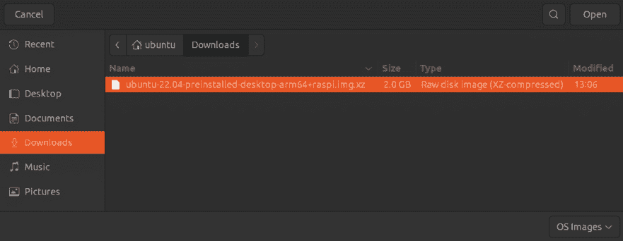

图 1.23：选择要写入 SD 卡的文件

接下来，将一张 SD 卡插入计算机，这张卡将专门用于 Ubuntu Server。Etcher 会完全擦除 SD 卡，因此请确保你不需要卡上的任何数据。如果你的电脑没有 SD 卡槽，可以使用 USB 卡读卡器。如果没有选择正确的设备，可以点击**Select target**来选择要使用的 SD 卡，如*图 1.24*所示。然后点击**Continue**：

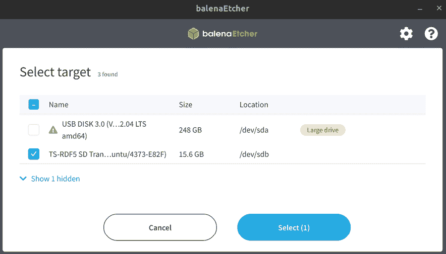

图 1.24：为 Raspberry Pi 选择使用的 SD 卡

一旦你选择了要使用的镜像文件和目标 SD 卡，你就可以开始了。点击**Flash!**开始写入镜像的过程：

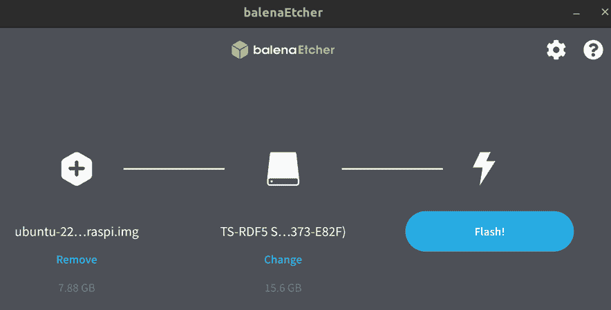

图 1.25：Etcher，准备开始刷写 SD 卡

现在，Etcher 将准备目标设备并写入源镜像文件。根据硬件速度，过程可能需要 5 到 15 分钟：

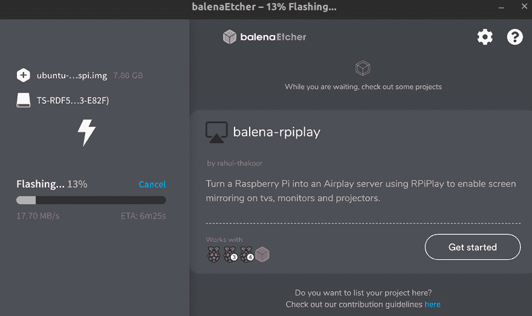

图 1.26：Etcher 正在进行中

一旦 Etcher 完成向 SD 卡写入数据，你可以将其从电脑中弹出并插入 Pi 中，该设备可以通过 SSH 远程访问。当它第一次启动完成后，你可以登录并像使用其他任何 Ubuntu Server 安装一样开始使用它（用户名和密码默认为`ubuntu`）。从那里，你可以为自己创建一个新用户，安装应用程序并进行实验。

# 摘要

在本章中，我们详细介绍了几种不同的安装场景。与大多数 Linux 发行版一样，Ubuntu Server 是可扩展的，可以安装在各种服务器类型上。物理设备、虚拟机甚至 Raspberry Pi 都有可用的 Ubuntu 版本。安装过程已逐步讲解，现在你应该已经有了自己的 Ubuntu Server 实例，可以根据需要进行配置。本章还涉及了确定服务器角色、创建可启动媒体的过程，以及如何在你的服务器设备上（以及 Raspberry Pi 上）设置 Ubuntu Server 的详细步骤。现在，你已经开始掌握 Ubuntu Server 了！

在下一章中，我们将向你展示如何管理用户。你将能够创建用户、删除用户、更改用户、管理密码过期等。我们还将讨论权限，以便你可以确定用户在服务器上可以执行的操作。到时见！

# 相关教程

+   从 LearnLinuxTV 安装 Ubuntu Server（视频教程）：[`linux.video/install-ubuntu-server`](https://linux.video/install-ubuntu-server)

# 加入我们的 Discord 社区

加入我们社区的 Discord 频道，与作者和其他读者讨论：

[`packt.link/LWaZ0`](https://packt.link/LWaZ0)

