# 第二章：管理用户和权限

在上一章中，我们设置了自己的 Ubuntu 服务器安装，现在我们可以开始学习如何维护它，从管理谁能够使用我们的服务器开始。

作为 Ubuntu 服务器的管理员，用户既可以是你最大的资产，也可能是你最大的头痛。在你的职业生涯中，你将添加无数的新用户，管理他们的密码，在他们离开公司时删除他们的帐户，并授予或撤销他们对网络资源的访问权限。即使在你是唯一用户的服务器上，你也会发现自己在管理用户帐户，因为即使是系统进程也是以用户身份运行的。要成功地管理 Linux 服务器，你还需要知道如何管理权限、创建密码策略并限制谁可以在机器上执行管理命令。在本章中，我们将深入探讨这些概念，以便你清楚地了解如何管理用户及其资源。

具体来说，我们将涵盖：

+   理解用户和组的目的

+   理解何时使用`root`

+   创建和删除用户

+   理解`/etc/passwd`和`/etc/shadow`文件

+   使用`/etc/skel`分发默认配置文件

+   在用户之间切换

+   管理组

+   管理密码和密码策略

+   使用`sudo`配置管理员访问权限

+   设置文件和目录的权限

在第一部分，我们将简要讨论管理用户的性质。

# 理解用户和组的目的

当谈到服务器时，用户非常重要——如果没有用户可供服务，那么根本就不需要服务器。在 IT 领域，用户管理这一主题本身是相当广泛的。关于认证的单个方法已经有整本书籍被写成，并且存在围绕它的技术（如**轻量级目录访问协议**，或**LDAP**）。在本章中，我们将重点介绍如何管理存在于我们服务器本地的用户以及帮助定义他们权限的组。

由于 Ubuntu Server 是一个 Linux 发行版，它采用了 Unix 风格的用户帐户、组和权限管理方式。尽管我们的重点是 Ubuntu，但本章中你将学习到的许多与用户管理相关的命令也适用于其他平台。有一些命令允许你添加、删除和更改用户，还有一些命令可以改变权限。

在服务器的上下文中，用户指的是谁（或什么）能够使用该服务器。例如，你可能有一个名叫 Susan 的会计，或一个名叫 Haneef 的 IT 管理员，他们都需要访问服务器。也许 Susan 只需要访问一个文件共享目录来存取与会计相关的文件，而 Haneef 可能作为系统管理员需要更多的访问权限。我们在服务器上创建的用户帐户将代表实际使用服务器的人。

组（Groups）允许我们将对特定文件和目录的访问进行隔离。正如我们稍后将学到的，文件和目录有用户和组的分配。当与权限结合使用时，我们就可以管理用户在服务器上可以执行的操作。

然而，用户并不总是指人类。我们的服务器上也有系统用户，这些用户可能会被应用程序和运行中的进程用于后台或自动化任务。一个例子可能是备份任务，可能有一个备份用户在后台运行任务，将重要文件复制到其他位置。你现在不需要担心与系统相关的用户，只需要知道它们的存在。随着我们阅读本书，你将会看到更多此类的例子。

更高级的组织可能会有一个中央登录服务器，例如**Active Directory**（**AD**）或标准的 LDAP。除此之外，还有其他类似的技术。本书中我们不会深入讨论这些技术，但请记住，中央认证服务器是你所在组织可能会采用的一种选择，若你决定进一步了解这方面的内容。

然而，最强大的用户是`root`。这个特殊的用户赋予我们最大权限，但正如你将在下一节看到的那样，这也伴随着一定的风险。

# 理解何时使用 root 用户

在上一章中，我们设置了自己独立的 Ubuntu 服务器安装。在安装过程中，我们被要求创建一个作为系统管理员的用户账户。所以，到目前为止，我们的服务器上应该至少有两个用户：前面提到的管理员用户，以及`root`用户。我们当然可以创建其他具有不同访问权限的用户账户（我们将在本章中进行此操作），但在我们开始之前，关于你创建的管理员账户以及为你创建的`root`用户的讨论是必要的。

`root`用户账户存在于所有 Linux 发行版中，是地球上最强大的用户账户。`root`用户账户可以用来在服务器内做任何事情，真的是*任何*事情。如果想在文件系统中的几乎任何地方创建文件和目录？想要安装软件？这些操作都可以通过`root`轻松完成。甚至，`root`账户可以通过一次打错字或错误命令摧毁整个安装：如果你指示`root`删除整个硬盘上的所有文件，它将毫不犹豫地执行这一操作。在 Linux 系统中，假定你正在使用`root`时，意味着你知道自己在做什么。因此，在以`root`身份执行任何命令时，通常不会有确认提示。它会按照指示执行，不论好坏。

正因为如此，我用过的每一个 Linux 发行版都表示，或者至少强烈建议，你在安装过程中创建一个标准用户。Linux 社区普遍建议，管理员应拥有自己的账户，并在需要`root`权限来完成任务时切换到`root`。这种做法不太可能因不小心的输入错误或错误命令而毁掉你的服务器。一些管理员会始终严格使用`root`，但同样，建议仅在必须时使用`root`。

大多数发行版要求你在安装过程中设置一个`root`密码，以保护该账户。即便是基于 Debian 的 Ubuntu，也要求你在安装过程中设置一个`root`密码。Ubuntu 只是决定做一些不同的事情。这样做的原因是，与许多其他发行版不同，Ubuntu 默认会完全锁定`root`账户。虽然默认情况下`root`账户不可用，但你仍然可以在登录后启用`root`，或者切换到`root`用户。默认禁用只是意味着`root`账户不像平时那样容易访问。如果你需要启用该账户，我会在本章稍后介绍如何操作。

这一规则的例外是一些 VPS 提供商，比如 Linode，即使是在它们的 Ubuntu 服务器上，也会启用`root`账户。有时，`root`密码会被随机生成并通过电子邮件发送给你。不过，你仍然应该创建一个具有管理员权限的用户账户。

Ubuntu（包括其服务器版本）推荐使用`sudo`，而不是直接使用`root`。具体来说，`sudo`使你能够以提升的权限运行单个命令，而不需要一直以`root`身份登录。

## 使用 sudo 运行特权命令

我会在本章稍后介绍如何管理`sudo`，但现在请记住，`sudo`的目的是让你可以使用用户账户执行通常只有`root`才能做的事情。例如，作为一个普通用户，你不能像下面这样发出安装软件包的命令（别担心现在的`apt`命令，我们将在*第三章*，*软件包管理*中介绍）：

```
apt install tmux 
```

反而，你会收到一个错误信息：

```
E: Could not open lock file /var/lib/dpkg/lock-frontend - open (13: Permission denied)
E: Unable to acquire the dpkg frontend lock (/var/lib/dpkg/lock-frontend), are you root? 
```

但是，如果你在命令前加上`sudo`（假设你的用户账户有权限使用它），命令将正常工作：

```
sudo apt install tmux 
```

当您使用`sudo`时，系统会要求您输入用户密码以确认，然后命令将被执行。后续带有`sudo`前缀的命令可能不会再提示您输入密码，因为系统会缓存您的密码一段时间，直到超时或终端关闭。理解这一点应该能够澄清在安装期间创建的用户帐户的实用性。我之前提到这个用户是一个管理帐户，但实际上它只是一个能够使用`sudo`的用户帐户。Ubuntu Server 在安装期间会自动为第一个创建的用户帐户授予`sudo`访问权限。

所期望的是，您将使用该帐户来管理系统，而不是`root`。当您创建额外的用户帐户时，默认情况下它们将无法访问`sudo`，除非您明确授予它们权限。

# 创建和删除用户

在 Ubuntu 中创建用户可以通过两个命令之一完成：`adduser`和`useradd`。这一开始可能会有些混淆，因为这两个命令执行的是相同的操作（方式不同），并且命名非常相似。我会首先介绍`useradd`命令，然后解释`adduser`的区别。您甚至可能更喜欢后者，但我们稍后会详细讨论。

## 使用`useradd`

首先，这里是`useradd`命令实际应用的一个例子：

```
sudo useradd -d /home/jdoe -m jdoe 
```

使用此命令，我创建了一个名为`jdoe`的用户。通过`-d`选项，我澄清我希望为此用户创建一个主目录，并且在此之后，我指定`/home/jdoe`作为用户的主目录。`-m`标志告诉系统我希望在过程中创建主目录；否则，我将不得不自己创建目录。最后，我指定了我的新用户的用户名（在本例中为`jdoe`）。

随着我们在本书中的进展，会有需要`root`权限才能执行的命令。前面的命令就是一个例子。对于需要这种权限的命令，我会在命令前加上`sudo`。当您看到这些命令时，这意味着需要`root`权限才能运行。对于这些命令，您也可以登录为`root`（如果`root`已启用），或者切换到`root`以执行这些命令。但是，如我之前提到的，强烈建议使用`sudo`而不是使用`root`帐户。

现在，使用以下命令列出`/home`的存储：

```
ls -l /home 
```

您应该会看到一个列出我们新用户的文件夹：

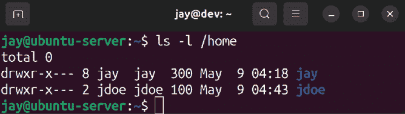

图 2.1：在我们创建第一个用户后列出`/home`目录的内容

那么如何为我们的用户设置密码呢？由于使用了 `sudo`，可能会要求输入当前用户的密码，但并没有要求为新用户设置密码。要为用户创建密码，我们可以使用 `passwd` 命令。`passwd` 命令默认允许你更改当前登录用户的密码，但如果以 `root` 用户身份或通过 `sudo` 执行，它也允许你为任何其他用户设置密码。如果你单独输入 `passwd`，命令会首先要求你输入当前密码，然后是新密码，最后再确认一次新密码。如果在命令前加上 `sudo` 并指定其他用户帐户，你就可以为任何用户设置密码。以下是此过程的输出示例：

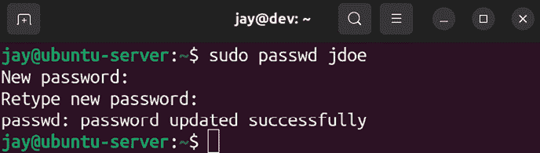

图 2.2：更改用户的密码

正如你在上一个截图中看到的，当使用 `passwd` 命令输入密码时，你不会看到任何星号或其他类型的输出。这是正常的。虽然你不会看到输入的视觉指示，但你的输入已经被识别。

现在我们有了一个新用户，并且我们已经为该用户设置了密码。`jdoe` 用户现在可以使用我们选择的密码访问系统。默认情况下，该用户无法使用 `sudo`，但我们将在本章稍后讲解如何更改这一点。

## 使用 adduser

之前，我提到过 `adduser` 命令作为创建用户的另一种方式。这个命令的区别（和便捷性）一旦使用后就会立刻显现。去尝试一下吧；执行 `adduser` 并指定你想创建的用户的用户名。以下是该过程的示例：

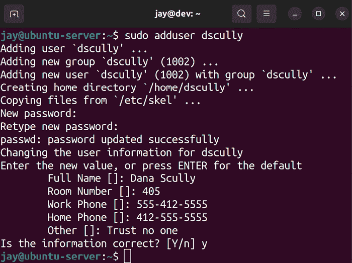

图 2.3：使用 `adduser` 命令创建用户

在前述过程中，我执行了 `sudo adduser dscully`（修改用户的命令需要 `sudo` 或 `root` 权限），然后我被问到一系列关于如何创建用户的问题。我被要求输入密码（两次）、`全名`、`房间号`、`工作电话` 和 `家庭电话`。在 `其他` 字段中，我输入了评论 `Trust no one`，这是管理用户时非常好的心态。最后的提示（在最终确认之前）都是可选的：我不必输入 `全名`、`房间号` 等等。如果我想跳过这些提示，我可以直接按 *Enter* 键。真正必须的只有用户名和密码。

从输出中，我们可以看到`adduser`命令为我们做了不少工作。该命令默认将`/home/dscully`作为用户的主目录，帐户被分配了下一个可用的**用户 ID**（**UID**）和**组 ID**（**GID**），其值为`1002`，并且它还将`/etc/skel`中的文件复制到了我们新用户的`home`目录中。实际上，`adduser`和`useradd`命令都会从`/etc/skel`复制文件，但`adduser`在执行操作时更加详细。

如果你还不明白`UID`、`GID`和`/etc/skel`是什么，不用担心，我们稍后会讲解这些概念。

总而言之，`adduser`命令在创建用户时更加方便，它会提示你输入各种选项，而无需记住命令行选项。它还会提供关于它所做操作的详细信息。此时，你可能会想，既然`adduser`看起来如此方便，为什么还要使用`useradd`呢？不幸的是，`adduser`并不是所有 Linux 发行版都提供的。最好还是熟悉一下`useradd`，以防你在一个非 Ubuntu 的 Linux 系统上遇到问题。

你可能会觉得看到`adduser`命令到底是什么很有趣。它甚至不是一个二进制程序——它是一个**Shell 脚本**。Shell 脚本其实就是一个可以作为程序执行的文本文件。现在你不需要太担心脚本的内容，因为我们会在*第六章*中讲解，*提高你的命令行效率*。就`adduser`而言，它是一个用**Perl**编写的脚本，Perl 是一种有时用于管理任务的编程语言。由于它不是二进制文件，你甚至可以在文本编辑器中打开它，查看它在后台执行的所有代码。然而，请确保不要在带有`root`权限的文本编辑器中打开该文件，以免不小心保存更改并破坏脚本。以下命令将在 Ubuntu Server 系统中打开`adduser`脚本：

```
nano /usr/sbin/adduser 
```

使用上下箭头以及*Page Up*和*Page Down*键在文件中滚动。当完成后，按下*Ctrl* + *x*退出文本编辑器。如果编辑器提示你保存更改，请不要保存。无论如何，你们这些眼睛尖锐的人可能会注意到，`adduser`脚本调用了`useradd`来执行实际的工作。所以，不管怎样，你实际上是直接或间接地使用了`useradd`。

既然我们知道了如何创建用户，了解如何删除它们也是很有用的。

## 删除用户

当用户不再需要访问系统时，删除或禁用帐户非常重要，因为未管理的帐户往往会成为安全隐患。要删除用户帐户，我们将使用`userdel`命令。

然而，在删除账户之前，你应该问自己一个非常重要的问题：你（或其他人）是否需要访问该用户的文件？大多数公司都有文件保留政策，详细说明了当员工离职时应该如何处理用户的数据。有时，这些文件会被复制到存档中进行长期存储。通常，经理、同事或新员工可能需要访问前用户的文件，或许是为了继续完成某个项目。理解这一政策对管理用户非常重要。如果你没有明确规定离职用户文件的保留要求，最好与管理团队合作制定一项政策。

默认情况下，`userdel`命令不会删除用户的`home`目录的内容。在这里，我们使用以下命令将`dscully`从系统中删除：

```
sudo userdel dscully 
```

我们可以通过输入以下命令来查看`dscully`用户的文件是否仍然存在：

```
ls -l /home 
```

前面的命令将会产生以下输出：

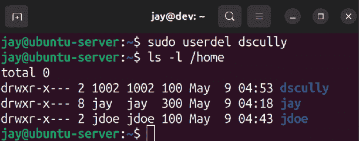

图 2.4：尽管我们已经删除了用户，但`dscully`的主目录仍然存在。

由于`dscully`的`/home`目录仍然存在，我们可以将该目录的内容移动到任何我们想要的地方。例如，如果我们有一个名为`/store/file_archive`的目录，我们可以轻松地将文件移动到那里：

```
sudo mv /home/dscully /store/file_archive 
```

当然，最终存储的目录由你决定，但你明白我的意思。

如果你还不知道，你可以使用`mkdir`命令来创建一个新目录。你可以在任何你的登录用户有权限访问的目录中创建一个目录。以下命令将创建我在前面示例中提到的`file_archive`目录：

```
sudo mkdir -p /store/file_archive 
```

`-p`标志只是会在父目录不存在时创建父目录。

如果你确实希望在删除账户时同时删除用户的主目录，只需添加`-r`选项。这样可以一并删除该用户及其数据：

```
sudo userdel -r dscully 
```

如果在账户删除后仍需要删除`/home`目录（如果你第一次没有使用`-r`参数），可以使用`rm -r`命令像删除任何其他目录一样删除它：

```
sudo rm -r /home/dscully 
```

可能不言而喻，但`rm`命令可能非常危险。如果你以`root`身份登录或在使用`rm`时使用了`sudo`，如果不小心，可能会轻易摧毁你整个已安装的系统。*不要运行此命令*，但作为一个假设性的示例，以下命令（乍一看似乎无害）很可能会完全摧毁你整个文件系统：

```
sudo rm -r / home/dscully 
```

请注意错字：我不小心在第一个斜杠后面输入了一个空格。我实际上不小心告诉我的系统删除整个文件系统的内容。如果执行该命令，下次我们尝试启动服务器时，它可能甚至无法引导。所有用户和程序数据都将被清除。如果有一个单一的原因让我们保护 `root` 账户，那就是 `rm` 命令绝对是其中之一！

到目前为止，我们知道如何添加和删除用户。在下一节中，我们将更深入地了解密码。

# 理解 `/etc/passwd` 和 `/etc/shadow` 文件

现在我们知道如何在服务器上创建（和删除）用户账户，我们已经可以管理用户了。但是这些信息究竟存储在哪里？我们知道用户将其个人文件存储在 `/home` 中，但是是否有某种数据库可以追踪我们系统上的用户账户？实际上，用户账户信息存储在两个特殊的文本文件中：

+   `/etc/passwd`

+   `/etc/shadow`

您可以使用以下命令显示这两个文件的内容。请注意，任何用户都可以查看 `/etc/passwd` 的内容，而只有 `root` 用户可以访问 `/etc/shadow`：

```
cat /etc/passwd 
sudo cat /etc/shadow 
```

随便看看这两个文件（只是不要做任何更改），我将帮助您理解它们。

## 理解 `/etc/passwd` 文件

首先，让我们来看一下 `/etc/passwd` 文件。接下来是我测试服务器上此文件的一些示例输出。为了简洁起见，我将输出限制为最后八行：

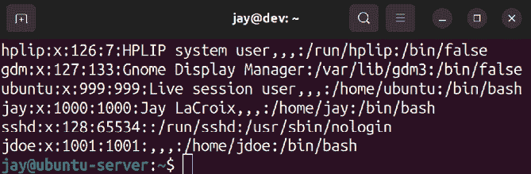

图 2.5：示例 `/etc/passwd` 文件

此文件中的每一行对应系统上的一个用户账户。条目被分割成由冒号（`:`）分隔的列。用户名在第一列，因此您可以看到我创建了用户 `jay` 和 `jdoe`。每个条目的下一列只是一个 `x`。稍后我会解释这意味着什么。现在，让我们跳到第三和第四列，它们分别引用 UID 和 GID。

在 Linux 系统上，用户账户和用户组实际上是通过它们的 ID 引用的。虽然我们更容易通过名称管理用户，但用户名和组名只是放在 UID 和 GID 上的标签，以帮助我们更轻松地识别它们。

例如，尝试记住 `jdoe` 在我们服务器上的 UID `1001` 可能会很烦人。通过引用账户名 `jdoe` 来管理它对人类来说更容易，因为我们不太能记住数字，而是名字。但是对于 Linux 系统来说，每次我们引用用户 `jdoe`，实际上我们只是引用 UID `1001`。当创建用户时，默认情况下系统会自动为账户分配下一个可用的 UID。如果您管理多个 Ubuntu 服务器，请注意 UID 在不同系统之间不会匹配，因此请记住 UID 在安装之间不会同步。

在我的例子中（如*图 2.5*所示），每个用户的 UID 与其 GID 相同。这只是我系统中的一个巧合，实际使用中不一定是这样。虽然我稍后会在本章讨论创建组的内容，但需要理解的是，创建组的过程与创建用户相似，都是通过分配下一个可用的 GID 来进行的，类似于为新用户分配下一个可用的 UID。当你创建一个用户时，该用户的主组与其用户名相同（除非你要求其它方式）。例如，当我创建了`jdoe`时，系统也自动创建了一个名为`jdoe`的组。

这就是你实际看到的内容——用户的 UID，以及用户主组的 GID。我们稍后会详细讨论组。

你可能还注意到，你系统中的`/etc/passwd`文件包含了比我们自己创建的用户更多的条目。这是完全正常的，因为 Linux 使用用户帐户来处理后台运行的各种进程和服务。你可能永远不会与默认帐户交互，尽管你或许会在某一天为某个进程创建自己的系统用户。例如，也许你会为自动化数据处理脚本创建一个数据处理帐户来运行。

好的，回到我们的`/etc/passwd`文件。第五列用于存储用户信息，通常是用户的名字和姓氏。在我的例子中，`jdoe`的第五列是空的，因为我通过`useradd`命令创建了`jdoe`，该命令没有提示我输入名字和姓氏。这个字段也被昵称为`GECOS`字段，你在阅读文档时可能会看到它以这种方式被提及。

在第六列，显示了每个用户的主目录。对于`jdoe`来说，它被设置为`/home/jdoe`。最后，我们为用户指定了默认的 shell 为`/bin/bash`。这个字段指的是用户将使用的默认 shell，当使用`adduser`命令创建帐户时，默认的 shell 是`/bin/bash`，而使用`useradd`命令创建时，默认是`/bin/sh`。（如果你没有偏好，`/bin/bash`对大多数人来说是最好的选择。）如果我们希望用户使用不同的 shell，可以在这里指定（不过本书并未涉及`/bin/bash`以外的 shell）。如果我们愿意，也可以将用户的 shell 更改为一个无效的值，从而完全禁止他们登录。这在需要快速禁用帐户时非常有用。

## 理解/etc/shadow 文件

既然这些已经解释清楚了，让我们来看看`/etc/shadow`文件。我们可以像其他文本文件一样使用`cat`命令显示其内容，但与`/etc/passwd`不同，我们需要`root`权限才能查看它。所以，赶紧显示这个文件的内容，我会带你逐步分析：

```
sudo cat /etc/shadow 
```

这将显示以下输出：

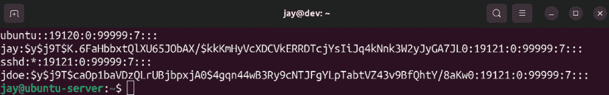

图 2.6：示例/etc/shadow 文件

上面的截图，*图 2.6*，显示了我服务器上该文件的最后四行。首先，我们在第一列看到用户名——没有什么惊讶的。请注意，输出中没有显示每个用户的 UID。系统根据`/etc/passwd`文件知道哪个用户名对应哪个 UID，因此这里无需重复显示。第二列显示的似乎是一些乱码。实际上，这是整个文件中最重要的部分。那是用户密码的实际哈希值。

密码哈希是将实际密码转换为一个不同的字符串，代表原始密码。这是一个单向转换，因此你不能通过逆向工程哈希来找到实际密码。在`/etc/passwd`文件中，存储的是密码的哈希，而不是实际密码，这是出于安全考虑。

如果你还记得，在`/etc/passwd`文件中，每个用户条目在第二列都有一个`x`，我提到过稍后会解释这个。`x`表示的是用户的密码被加密，并且没有直接存储在`/etc/passwd`中，而是存储在`/etc/shadow`中。毕竟，`/etc/passwd`文件是所有人都可以查看的，因此如果任何人都能打开该文件并看到每个人的密码，那将极大地危及安全性。

在过去的日子里，你实际上可以将用户的密码存储在`/etc/passwd`中，但现在已经不再这么做了。每当你在现代 Linux 系统上创建用户账户时，用户的密码会被加密（在`/etc/passwd`的第二列会为该用户放置一个`x`），而实际的密码哈希会存储在`/etc/shadow`的第二列，以防止被窥视。希望现在你已经明白了这两个文件之间的关系。

记得我之前提到`root`用户账户默认是锁定的吗？好吧，让我们看看它是如何工作的。执行以下命令，查看`/etc/shadow`中的`root`用户账户条目：

```
sudo cat /etc/shadow | grep root 
```

在我的系统上，我得到以下输出：

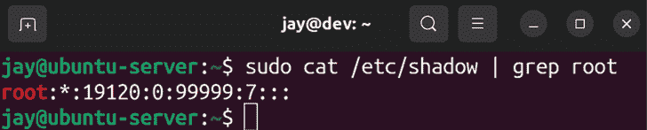

图 2.7：示例 /etc/shadow 文件

你应该立即注意到，`root`用户账户根本没有密码哈希。相反，密码哈希的位置会显示一个星号。实际上，在这里放置一个星号或感叹号是一种锁定账户的方法。更简单的方法是，你可以使用`passwd -l`命令来锁定一个账户，而无需编辑文件。但无论哪种方式，我们仍然可以随时切换到`root`账户（稍后我会向你展示如何做到这一点）。在第二列输入一个星号或感叹号会创建一个限制，使得我们不能直接从 shell 或通过网络登录该用户。我们必须先以普通用户身份登录系统，然后如果需要，还可以切换到该用户。

在讨论完密码哈希后，`/etc/shadow`文件中还有一些字段我们应该理解。这里有一行构造的示例：

```
mulder:$6$TPxx8Z.:16809:0:99999:7::: 
```

继续讨论第三列，我们可以看到自**Unix 纪元**以来密码最后一次更改的天数。对于不清楚的人来说，Unix 纪元是 1970 年 1 月 1 日。因此，我们可以将该列解读为密码是在 Unix 纪元后第 16,809 天更改的。

个人而言，我喜欢使用以下命令来更方便地查看密码最后一次更改的时间：

```
sudo passwd -S <username> 
```

这将导致输出类似于以下内容：

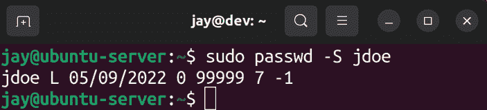

图 2.8：检查用户最后一次密码更改的日期

执行此命令后，你可以查看系统中任何账户的信息。第一列显然是用户名。第二列与密码的状态有关，在这种情况下是`L`，表示该用户的密码被锁定。如果密码已设置且可用，则显示`P`，如果用户没有密码，则显示`NP`。

该命令输出的第三列显示了用户最后一次密码更改的实际日期。第四列告诉我们用户在再次更改密码之前需要等待多少天。在这个例子中，`jdoe`可以随时更改密码，因为最小天数设置为`0`。我们稍后会在本章中讲解如何设置最小天数，但我会简要解释一下这个设置的含义。起初，要求用户等待一定天数才能更改密码似乎有些傻。然而，千万不要低估用户的反抗心理。当要求用户更改密码时，用户往往会为了满足历史要求而更改密码，但随后会迅速将其更改回原来的密码。通过设置最小天数，你强制要求用户在两次密码更改之间有一个等待期，这样就不那么方便用户直接更改回原来的密码。

第五列，顾名思义，是密码更改之间允许的最大天数。如果你要求用户在每隔一定天数后更改密码，你将在这一列看到相应的数字。默认情况下，这个值设置为`99999`天。这个天数远远超过人的寿命，所以实际上可以认为它是无限的。

继续讲解第六列，我们列出了在密码过期前，用户会被提醒需要更改密码的天数。在第七列中，我们设置了密码过期后可以过去多少天，在这种情况下，账户将会被禁用。对于我们的示例用户，暂时没有设置此项。最后，在第八列（该列不可见）中，我们可以看到自 Unix 纪元以来，账户将被禁用之前经过的天数（在我们的例子中，这里没有内容，因此没有设置禁用日期）。

我们稍后会讲解如何设置这些字段，但现在希望你能更好地理解`/etc/shadow`文件的内容。

如果在任何时候你需要进一步的说明，随时可以查看 Ubuntu 的手册页。手册页（man page 的缩写）可以提供关于命令和文件的更多信息。例如，以下命令会显示`ls`命令的手册页：

```
man ls 
```

针对本节内容，你也可以检索`/etc/shadow`文件的手册页：

```
man passwd
man shadow 
```

按下键盘上的*q*退出手册页。随时可以查看本书中任何命令的手册页，以便更深入了解。

现在我们已经完全理解了如何管理用户，我们还可以看看如何为他们的主目录提供默认文件。

# 使用 `/etc/skel` 分发默认配置文件

在典型的组织中，通常会有一些推荐的默认文件和配置供用户使用。

例如，在进行软件开发的公司中，通常会有推荐的文本编辑器和版本控制系统的设置。位于`/etc/skel`目录中的文件会在创建新用户时复制到他们的主目录中（假设你在设置用户时选择了创建主目录）。

事实上，你现在就可以亲自验证这一点。执行以下命令：

```
ls -la /etc/skel 
```

现在，你应该能够查看`/etc/skel`目录的内容：

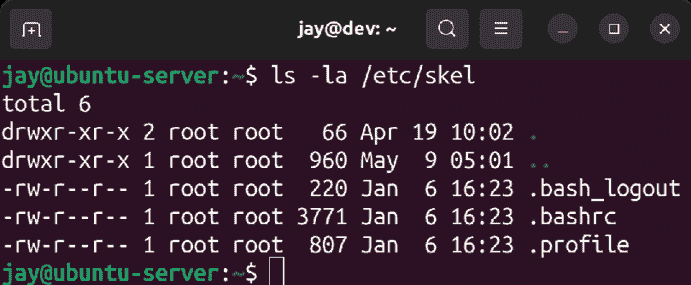

图 2.9：默认的 `/etc/skel` 文件

你可能已经知道如何列出目录中的文件，但我添加了`-a`选项，因为我想查看隐藏文件。默认情况下，`/etc/skel`中包含的文件是隐藏的（它们的文件名以句点开头）。我还加了`-l`参数，因为它显示的是长格式列表，我觉得这种格式更易读。

每次创建新用户并要求同时创建主目录时，这三个文件（如*图 2.9*所示）会被复制到用户的主目录中，除此之外，任何你在此处创建的文件也会一同复制。你可以通过列出已创建用户的主目录存储内容来验证这一点。一个用户主目录中的`.bashrc`文件应该和其他任何用户的相同，除非他们对其进行了修改。

掌握了这些知识后，创建新用户的默认文件应该变得非常简单。例如，你可以使用自己喜欢的文本编辑器创建一个名为`welcome`的文件，并将其放置在`/etc/skel`目录中。也许你会创建一个包含公司新员工帮助电话和信息的文件。然后，在你创建账户时，这个文件会自动复制到新用户的主目录中。用户登录后，会在其主目录中看到该文件并查看相关信息。更实际一点，如果你的公司有特定的编辑器设置，适合写代码，你也可以将这些文件包含在`/etc/skel`中，以确保用户遵循这些设置。事实上，你可以为公司使用的任何应用程序包含默认配置文件。

赶紧试试吧。随便创建一些随机文本文件，然后创建一个新用户，接着你会看到这些文件会自动进入你系统中新账户的主目录中。

现在我们已经有了多个用户，并且了解了如何管理它们的默认文件，我们可以看看如何在用户之间切换。

# 切换用户

现在我们系统中已经有了多个用户，我们需要知道如何在它们之间切换。当然，你可以随时以某个用户身份登录到服务器，但实际上，你可以在任何时候切换到任何用户账户，只要你知道该用户的密码或拥有`sudo`权限。

切换用户时，你将使用`su`命令。如果你输入`su`而不带任何选项，它将默认假设你要切换到`root`用户，并会要求你输入`root`密码。正如我之前提到的，Ubuntu 默认锁定了`root`账户，所以此时你可能没有`root`密码。

即使 Ubuntu 默认不为`root`创建密码，某些**虚拟专用服务器**（**VPS**）提供商会解锁`root`密码，并让你以`root`用户身份登录。解锁`root`账户并不是 Ubuntu 的标准做法，而是某些云服务提供商的定制。

解锁`root`账户其实非常简单；你只需要创建一个`root`密码。为此，你可以以任何拥有`sudo`权限的用户身份执行以下命令：

```
sudo passwd 
```

命令将要求你创建并确认`root`密码。从此以后，你将能够像使用其他账户一样使用`root`账户。你可以直接以`root`身份登录，或者切换到`root`——现在它完全可用了。然而，实际上你并不需要解锁`root`账户就可以使用它。你当然可以解锁它，但有办法在不解锁`root`的情况下切换到`root`，通常最好保持`root`账户锁定，除非你有非常特殊的原因需要解锁它。以下命令将允许你从具有`sudo`权限的用户账户切换到`root`：

```
sudo su - 
```

现在你将以`root`身份登录，并且可以执行任何你想要的命令，不会有任何限制。要返回到之前登录的账户，只需输入`exit`。你可以通过`bash`提示符开头的值来判断自己当前以哪个用户身份登录。

如果你想切换到`root`以外的账户怎么办？当然，你可以直接注销并以该用户身份重新登录。但其实你不需要这么做。只要知道账户的密码，下面的命令就能帮你完成切换：

```
su - <username> 
```

Shell 会要求输入该用户的密码，然后你将以该用户的身份登录。同样，当你使用完账户后，输入`exit`将返回到你之前使用的账户。

如果你知道用户的密码，这个命令是没问题的，但通常你并不会知道。通常，在企业环境中，你会创建一个账户，强制用户在首次登录时更改密码，然后你将无法知道该用户的密码。

由于你拥有`root`和`sudo`权限，你可以随时更改他们的密码，然后以他们的身份登录。但如果他们的密码突然失效，他们肯定会发现问题——你不是在窃听吧？有了`sudo`权限，你可以使用`sudo`切换到任何你想要的用户，即使你不知道他们的密码。只需要在之前的命令前加上`sudo`，你只需要输入你自己账户的密码，而不是他们的：

```
sudo su - <username> 
```

切换到另一个用户账户对于支持工作（尤其是故障排除权限问题）通常非常有帮助。举个例子，假设某个用户找你抱怨无法访问特定目录的内容，或者无法运行某个命令。在这种情况下，你可以登录到服务器，切换到他们的用户账户，尝试重现他们的问题。这样，你不仅可以亲自看到他们的问题，还可以测试你的修复是否解决了问题，然后再回复他们。

现在我们已经完全理解了用户账户，甚至知道如何在它们之间切换。在接下来的部分，我们将探讨**用户组**，它允许我们对用户进行分类。

# 管理用户组

现在我们理解了如何创建、管理和切换用户账户，我们还需要了解如何管理**用户组**。Linux 中的用户组概念与其他平台并没有太大区别，基本上是为了实现相同的目的。有了用户组，你可以更高效地控制用户对服务器资源的访问。通过将用户组分配给某个资源（如文件、目录等），你可以通过简单地将用户添加或移除该组来允许或拒绝他们的访问。

在 Linux 中，工作方式是每个文件或目录都有一个用户和一个组来对其进行拥有。这与 Windows 等平台不同，Windows 允许一个资源被多个组分配。而 Linux 是一对一的拥有：每个文件或目录只分配一个用户和一个组。如果你列出 Linux 系统上某个目录的内容，你可以亲眼看到这一点：

```
ls -l 
```

以下是我其中一台服务器上某个目录的输出示例：

```
-rw-r--r-- 1 root bind  490 2022-04-15 22:05 named.conf 
```

在这种情况下，我们可以看到 `root` 拥有这个文件，并且组 `bind` 也被分配给了它。暂时忽略其他字段；当我们讲解关于权限的章节时，我会详细解释。现在，只需记住，每个文件或目录都分配了一个用户和一个组。

虽然每个文件或目录只能有一个组分配，但任何用户帐户都可以是多个组的成员。仅执行 `groups` 命令而不带任何选项，可以告诉你当前登录用户是哪些组的成员。如果你在 `groups` 命令后添加用户名，你将看到该用户是哪些组的成员。可以尝试一下带或不带用户名的 `groups` 命令，了解一下其作用。

在 Ubuntu Server 平台上，你很可能会发现每个用户帐户都是一个名为与用户名相同的组的成员。正如我之前提到的，当你创建一个用户帐户时，你也在创建一个与用户同名的组。然而，在某些 Linux 发行版中，用户的主要组会默认是名为 `users` 的组。如果你在 Ubuntu 桌面平台上执行 `groups` 命令，你可能会看到更多的组。这是因为，面向服务器平台的 Linux 发行版通常更加精简，而桌面平台上的用户需要访问更多的对象，如打印机、声卡等。一些可以安装的包也会为服务器添加额外的系统用户。

如果你想知道你的服务器上存在哪些组，你只需要执行 `cat` 命令来查看 `/etc/group` 文件的内容。与我们之前介绍的 `/etc/passwd` 文件类似，`/etc/group` 文件包含了系统中已创建的组的信息。快去查看你系统上的这个文件：

```
cat /etc/group 
```

以下是我其中一台服务器上该文件的示例输出：

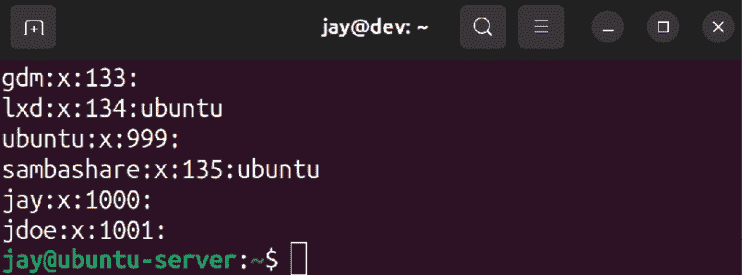

图 2.10：/etc/group 文件的示例输出

和之前一样，文件中的列是用冒号分隔的，不过每行只有四列。在第一列，我们有组的名称，这一点并不意外。在第二列，我们可以存储组的密码，但这不常用，因为这样做实际上会带来安全风险。在第三列，我们有`GID`，它的概念与我们讨论用户时的`UID`类似。最后，在最后一列，我们（会）看到一个以逗号分隔的成员列表，列出每个组的成员。

有些条目根本没有显示任何组成员。每个用户确实是自己组的成员，所以虽然文件中没有明确写出这一点，但这是隐含的。如果你查看`/etc/passwd`文件中用户的条目，你会看到他们的主组（作为第三列显示，以`GID`的形式）引用了`/etc/group`文件中的一个组。

在系统中创建新组非常简单，也是分类用户及其权限的好方法。比如你可以为会计人员创建一个`accounting`组，为 IT 部门的员工创建`admins`组，为销售人员创建一个`sales`组。`groupadd`命令可以用来创建新组。

如果你愿意的话，也可以直接编辑`/etc/group`文件，手动添加一行新的组信息，不过我认为使用`groupadd`命令可以省去一些工作，还能确保组条目正确创建。直接编辑组和用户文件通常是不推荐的（而且一个拼写错误可能导致严重问题）。无论如何，接下来是使用`groupadd`命令创建新组的示例：

```
sudo groupadd admins 
```

如果你在添加新组后再次查看`/etc/group`文件，你会看到文件中创建了一行新内容，并且为你选择了一个`GID`（第一个尚未使用的 GID）。删除组同样简单。只需要执行`groupdel`命令，后面跟上你想要删除的组名：

```
sudo groupdel admins 
```

接下来，我们将了解`usermod`命令，它可以让你将用户与组关联起来。`usermod`命令可以说是瑞士军刀式的工具；它有很多功能（将用户添加到组只是其中之一）。如果我们想要把一个用户添加到`admins`组，可以执行以下命令：

```
sudo usermod -aG admins myuser 
```

在这个例子中，我们提供了`-a`选项，意味着追加，然后紧接着使用`-G`，表示我们希望修改次要组成员资格。我把这两个选项合并为一个（`-aG`），但你也可以分别使用它们（`-a -G`）。我给出的示例只是将用户添加到附加的组，而不会替换他们的主组。

注意不要遗漏`-a`选项，因为这样做会将所有当前的组成员资格替换为新的组，这通常不是你想要的。`-a`选项意味着附加，即将该用户的现有组成员资格列表添加到新组中。

如果你想更改用户的主组，可以使用`-g`选项（使用小写的*g*，而不是我们之前使用的大写*G*）：

```
sudo usermod -g <group-name> <username> 
```

随时查看`usermod`命令的手册页，了解它允许你管理与用户相关的所有有用功能。你可以使用以下命令查看`usermod`命令的手册页：

```
man usermod 
```

另一个例子是更改用户的`/home`目录。假设你的某个用户进行了改名，你希望更改他们的用户名，并将他们原来的`home`目录（以及文件）移动到新的位置。以下命令将完成这个操作：

```
sudo usermod -d /home/jsmith jdoe -m 
sudo usermod -l jsmith jdoe 
```

在这个例子中，我们将`jdoe`的主目录移动到`/home/jsmith`，在第二个例子中，我们将用户名从`jdoe`更改为`jsmith`。

如果你希望将用户从某个组中移除，可以使用`gpasswd`命令。`gpasswd -d`就可以完成这个操作：

```
sudo gpasswd -d <username> <grouptoremove> 
```

实际上，`gpasswd`也可以代替`usermod`，将用户添加到组中：

```
sudo gpasswd -a <username> <group> 
```

现在，你已经知道如何管理组了。通过有效地管理组，你将能够更好地管理服务器上的资源。当然，如果不解释如何管理权限，组将相对无用（否则，任何成员都无法访问资源）。在本章稍后的部分，我们将介绍权限管理，以便你能完整了解如何管理用户访问。

# 管理密码和密码策略

在本章中，我们已经讲解了一些密码管理的内容，因为我给了你一些`passwd`命令的例子。如果你还记得，`passwd`命令允许我们更改当前登录用户的密码。此外，使用`passwd`命令作为`root`（并提供用户名），我们可以更改系统上任何用户账户的密码。但这并不是这个命令唯一的功能。

## 锁定和解锁用户账户

我之前没有提到的关于`passwd`命令的一件事是，你可以用它来锁定和解锁用户账户。有许多原因可能需要这么做。例如，如果一个用户要去度假或休长假，你可能想要锁定他们的账户，以便他们不在外出期间使用它。毕竟，活跃账户越少，你的攻击面就越小。要锁定账户，使用`-l`选项：

```
sudo passwd -l <username> 
```

要解锁账户，可以使用`-u`选项：

```
sudo passwd -u <username> 
```

但是，锁定账户不会阻止用户登录，如果他们通过 SSH 使用公钥认证访问服务器。在这种情况下，你需要撤销他们使用 SSH 的权限。一种常见的做法是将 SSH 访问限制为某个特定组的成员。当你锁定账户时，只需将他们从该组中移除。如果你对 SSH 部分不太熟悉，不必过于担心。我们将在 *第二十一章*，*保护你的服务器* 中讨论如何保障 SSH 服务器的安全。目前只需要记住，你可以使用 `passwd` 来锁定或解锁账户，如果你使用 SSH，你将需要将用户锁定，以防止他们登录。

然而，密码管理不仅仅是 `passwd` 命令，我们还可以实施自己的策略，例如查看或调整密码过期的详细信息。

## 设置密码过期信息

之前我提到过，你可以为用户的密码设置过期日期（在我们讨论 `/etc/shadow` 文件时）。在这一节中，我们将介绍如何实际操作。具体来说，`chage` 命令为我们提供了这个能力。我们可以使用 `chage` 来修改用户密码的过期周期，但它也是比查看 `/etc/shadow` 文件更方便的方式来查看当前的过期信息。通过 `chage` 的 `-l` 选项，并提供用户名，我们可以看到相关信息：

```
sudo chage -l <username> 
```

使用 `sudo` 或 `root` 并不是运行 `chage` 的必要条件。你可以在不提升权限的情况下查看自己用户名的过期信息。然而，如果你想查看除自己账户以外的任何用户账户的过期信息，你需要使用 `sudo`。

在接下来的示例中，我们可以看到来自一个示例用户账户的命令输出：

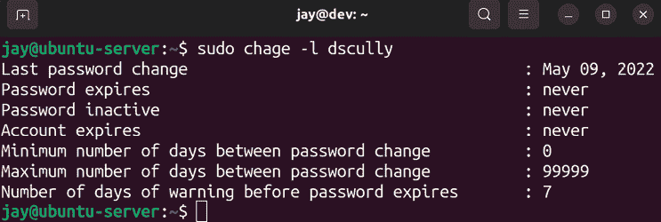

图 2.11：`chage` 命令的输出

在输出中，我们可以看到有关密码过期日期、密码更改的最大天数等信息。基本上，它包含了存储在 `/etc/shadow` 中的相同信息，但更易于阅读。

如果你希望更改这些信息，`chage` 将再次是首选工具。下面提供的第一个示例是非常常见的。当创建用户账户时，你肯定希望用户在首次登录时更改密码。

不幸的是，并不是每个人都乐意这样做。`chage` 命令允许你强制用户在首次登录时更改密码。基本上，你可以将他们的密码过期天数设置为 `0`，如下所示：

```
sudo chage -d 0 <username> 
```

如果你再次对刚修改过的用户账户运行`chage -l`，你将立即看到该命令的结果：

```
sudo chage -l <username> 
```

输出将显示有关密码更改的信息：

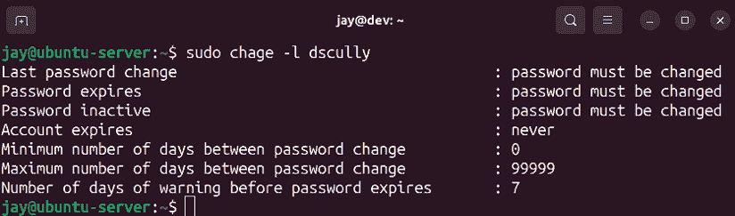

图 2.12：使用 `chage` 命令列出设置了密码过期周期的用户

要设置用户账户在一定天数后强制要求更改密码，以下操作可以实现：

```
sudo chage -M 90 <username> 
```

在这个例子中，我将用户账户设置为在 90 天后过期并要求更改密码。当即将到达密码更改日期前 7 天时，用户登录时将看到一条警告信息。

如我之前提到的，用户通常会尽可能地绕过密码要求，可能在满足初始密码更改要求后，再把密码改回原来的密码。你可以使用 `-m` 参数设置最小天数，如下例所示，我们将其设置为 5 天：

```
sudo chage -m 5 dscully 
```

设置最小密码年龄的诀窍是，将其设置为用户修改密码回原密码时感到不方便，但你仍然希望用户在需要时能够更改密码（因此也不要设置得太长）。如果用户想在最小天数还没到之前更改密码（例如，如果用户觉得他们的账户可能已经被泄露），他们可以随时让你为他们更改密码。然而，如果你让密码要求对用户来说过于不便，也可能会适得其反。

## 设置密码策略

接下来，我们应该讨论如何设置密码策略。毕竟，如果用户将密码更改为简单的密码（如 `abc123`），强制用户更改密码也没有多大意义。密码策略允许你强制用户遵守一些要求，例如密码长度、复杂性等。

为了方便，我们可以使用 **Pluggable Authentication Module**（**PAM**）。PAM 为我们提供了额外的认证功能，并且提供了我们可以使用的额外插件，扩展认证并添加更多功能。虽然本书没有详细讲解 PAM，但我建议你保持对它的记忆，以防你以后想添加更多的功能。

针对设置密码策略的主题，我们可以安装一个 PAM 模块来启用这个功能，这需要安装一个新的软件包：

```
sudo apt install libpam-cracklib 
```

接下来，让我们看看以下文件，这是 Ubuntu 提供的。你可以使用文本编辑器（如 `nano`）打开它，我们需要对其进行编辑：

```
sudo nano /etc/pam.d/common-password 
```

在修改与认证相关的配置文件（如密码要求、`sudo` 权限、SSH 等）时，一个非常重要的提示是，在进行更改时，始终保持一个 `root` shell 开放，并在另一个 shell 中测试这些更改。在你完全确认更改已经过充分测试之前，不要退出最初的 `root` 窗口。在测试策略时，确保不仅用户能够登录，管理员也能登录。否则，你可能会失去登录服务器并进行更改的能力。

要启用密码历史要求（即系统记住用户使用过的最后几个密码，防止他们重复使用），我们可以在文件中添加以下行：

```
password   required   pam_pwhistory.so remember=99 use_authok 
```

在示例的 `config` 行中，我使用了 `remember=99`，这（你可能猜到）将使我们的系统记住每个用户的最后 99 个密码，并防止他们再次使用这些密码。如果你之前配置了密码的最小使用期限，例如 5 天，那么如果考虑到用户每 5 天更改一次密码 99 次，用户将需要 495 天才能返回到他们的原密码。这几乎不可能让用户重新使用他们的旧密码。

在 `/etc/pam.d/common-password` 文件中，另一个值得提及的部分是读取 `difok=3` 的配置项。此配置要求密码必须至少有三个字符与旧密码不同，才能被视为可接受。否则，密码会被认为与旧密码过于相似而被拒绝。你可以将此值更改为任何你喜欢的数字；默认值通常是 `5`，但在 Ubuntu 中，它将其默认设置为 `3`。此外，文件中还会看到 `obscure` 配置项，它防止使用简单密码（如常见的字典词汇等）。

设置密码策略是提高服务器安全性的一个好方法。然而，同样重要的是不要过度限制。为了在安全性和用户挫败感之间找到平衡，挑战在于制定足够的限制来提高安全性，同时尽量减少用户的挫败感。当然，单单提到“密码”这个词就足以让普通用户感到沮丧，所以你不可能让每个人都满意。但从整体系统安全的角度来看，我相信你的用户会感激你作为管理员已经采取了必要的预防措施，以确保他们（以及你们公司的）数据安全。最终，还是要用你最好的判断。

既然我们已经讨论了安全性问题，那么也应该看看如何配置 `sudo` 本身，这将在下一节中进行处理。

# 配置管理员访问权限使用 `sudo`

到目前为止，我们已经在本书中使用了很多次 `sudo`。此时，你应该已经意识到 `sudo` 允许你以其他用户的身份执行命令，默认情况下是 `root` 用户。然而，我们还没有正式讨论过它，也没有讨论如何修改哪些用户账户能够使用 `sudo`。

在所有 Linux 系统中，你应该用强密码保护你的 `root` 账户，并将其限制为尽可能少的人使用。在 Ubuntu 中，`root` 账户默认是锁定的，所以除非你通过设置密码解锁了它（或者你使用的是由 VPS 提供商提供的 Ubuntu 版本），否则无法用它登录系统。使用 `sudo` 是一种替代直接以 `root` 用户身份登录执行命令的方法，因此你可以通过 `sudo` 给管理员提供执行需要 `root` 权限的任务的权限，而不需要给他们 `root` 密码或解锁 `root` 账户。事实上，`sudo` 让你可以更加精细化管理。直接使用 `root` 基本上就是全有或全无——如果有人知道 `root` 密码并且 `root` 账户已启用，那么此人没有任何限制，可以随意操作。而使用 `sudo` 时，也可以出现类似情况，但你实际上可以限制某些用户只能使用特定的命令，从而限制他们在系统中能做的事情。例如，你可以给管理员提供安装软件更新的权限，但不允许他们重启服务器。

默认情况下，`sudo` 组的成员可以不受限制地使用 `sudo`。基本上，这个组的成员可以做任何 `root` 能做的事情（也就是一切）。在安装过程中，你创建的用户帐户已成为 `sudo` 组的成员。要为其他用户提供 `sudo` 权限，你只需要将他们添加到 `sudo` 组即可：

```
sudo usermod -aG sudo <username> 
```

并非所有发行版默认使用 `sudo` 组，甚至有的不会自动安装 `sudo`。其他发行版需要你手动安装 `sudo`，并且可能使用另一个组（如 `wheel`）来管理对 `sudo` 的访问。

但再说一次，这样会给予那些用户一切权限，而这可能是你想要的，也可能不是。要实际配置 `sudo`，我们使用 `visudo` 命令。这个命令帮助你编辑 `/etc/sudoers` 文件，这是一个控制 `sudo` 访问的配置文件。虽然你可以用文本编辑器直接编辑 `/etc/sudoers`，但强烈不建议用这种方式配置 `sudo`。`visudo` 命令会检查你的修改是否遵循正确的语法，并帮助防止你不小心破坏文件。这是一个非常好的方法，因为如果你在 `/etc/sudoers` 文件中犯了错误，可能会导致没有人能够获得服务器的管理员控制权。虽然有办法从这样的错误中恢复，但显然，这并不是一个你想要面对的局面！所以，这里要记住的一点是，永远不要直接编辑 `/etc/sudoers` 文件；始终使用 `visudo` 来编辑它。

下面是 `visudo` 命令在你犯错误时显示的警告类型的示例：

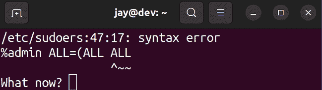

图 2.13：`visudo` 命令显示错误

如果你看到这个错误，按 *e* 返回编辑文件，然后纠正错误。

这个过程的工作方式是，当你在终端运行`visudo`时，它会将你带入一个文本编辑器，并打开`/etc/sudoers`文件。然后，你可以像编辑其他文本文件一样，修改并保存文件。默认情况下，Ubuntu 在使用`visudo`时会打开`nano`文本编辑器。在`nano`中，你可以使用*Ctrl* + *w*保存更改，使用*Ctrl* + *x*退出文本编辑器。

所以，`visudo`允许你更改谁能够访问`sudo`。但你究竟如何进行这些更改呢？你可以滚动浏览`visudo`打开的`/etc/sudoers`文件，你应该能看到类似以下的行：

```
%sudo   ALL=(ALL:ALL) ALL 
```

这是启用任何属于`sudo`组的成员访问`sudo`权限的配置行。你可以将组名更改为你喜欢的任何名称，例如，你可能希望创建一个名为`admins`的组。如果你做了这个更改，确保在编辑`/etc/sudoers`文件或注销之前，实际上已经创建了该组，并将你自己和你的团队添加为该组的成员；如果你发现自己被锁定，无法访问服务器的管理员权限，那可就尴尬了。

当然，你不必通过组来启用访问权限。你实际上也可以指定一个用户名。在`/etc/sudoers`文件中，组名前会有一个`%`符号，而用户名则没有。例如，文件中也有如下行：

```
root    ALL=(ALL:ALL) ALL 
```

这里，我们调用了一个用户名（在这个例子中是`root`），但这一行的其他部分和我之前提到的行是一样的。虽然你当然可以复制这一行并粘贴一遍或多遍（将`root`替换为其他用户名），以授予其他人访问权限，但使用组的方式实际上是最好的方法。将用户添加或移出一个组（如`sudo`组）要比每次使用`visudo`要容易得多。

到此为止，你可能在想，`/etc/sudoers`配置行上的各个选项到底是什么意思。目前为止，两个例子都使用了`ALL=(ALL:ALL) All`。为了完全理解`sudo`，理解其他字段非常重要，所以让我们通过它们（再次使用`root`这一行作为例子）来逐一了解。

第一个`ALL`表示`root`可以从任何终端使用`sudo`。第二个`ALL`表示`root`可以使用`sudo`冒充任何其他用户。第三个`ALL`表示`root`可以冒充任何其他组。最后一个`ALL`表示该用户能够使用的命令；在这种情况下，是他们想使用的任何命令。

为了帮助理解，我将提供一些额外的示例。这里有一个假设的例子：

```
charlie    ALL=(ALL:ALL) /sbin/reboot,/sbin/shutdown 
```

在这里，我们允许用户`charlie`执行`reboot`和`shutdown`命令。如果用户`charlie`尝试做其他事情（例如安装软件包），他们将收到错误信息：

```
Sorry, user charlie is not allowed to execute '/usr/bin/apt install tmux' as root on ubuntu. 
```

然而，如果`charlie`想要在服务器上使用`reboot`或`shutdown`命令，他们将能够执行这些操作，因为我们在为该用户设置`sudo`权限时明确指定了这些命令。我们可以进一步限制，通过将第一个`ALL`改为机器名称，在本例中为`ubuntu`，来引用我在示例中使用的服务器主机名。我还修改了`charlie`被允许执行的命令：

```
charlie    ubuntu=(ALL:ALL) /usr/bin/apt 
```

在编辑`sudo`权限时，最好使用命令的完整路径，而不是简化版本。例如，我们在这里使用了`/usr/bin/apt`，而不是仅仅使用`apt`。这是非常重要的，因为用户可以创建一个名为`apt`的脚本，做一些我们通常不允许他们做的恶意行为。通过使用完整路径，我们限制了用户只能使用该路径下存储的二进制文件。

现在，`charlie`只能使用`apt`。他们可以使用`apt update`、`apt dist-upgrade`以及`apt`的任何其他子命令。但如果他们尝试重启服务器、删除受保护的文件、添加用户，或者做其他我们未明确设置的操作，他们将被阻止。

但是，我们遇到了另一个问题。我们正在允许`charlie`模拟其他用户。鉴于安装软件包的上下文，这可能并不完全糟糕（模拟另一个用户在没有权限安装软件包的情况下是没有意义的），但除非我们确实需要这样做，否则允许这种行为是不合适的。在这种情况下，我们可以完全删除这一行中的`(ALL:ALL)`，从而防止`charlie`使用`sudo`的`-u`选项以其他用户身份运行命令：

```
charlie    ubuntu= /usr/bin/apt 
```

另一方面，如果我们确实希望`charlie`能够模拟其他用户（但仅限于特定用户），我们可以通过设置这些值来指定`charlie`被允许代表的用户名和组：

```
charlie    ubuntu=(dscully:admins) ALL 
```

在这个例子中，`charlie`能够代表用户`dscully`和组`admins`运行命令。

当然，`sudo`远远不止我在这一节中提到的内容。关于`sudo`可以写出整本书（事实上，已经有很多了），但你在日常管理这款工具时，99%的需求都涉及如何为用户添加访问权限，并明确规定每个用户能够做什么。作为最佳实践，尽可能使用组（例如，你可以有一个`apt`组、一个`reboot`组等等），并尽量具体地规定谁能做什么。通过这种方式，你不仅可以保持`root`账户的私密性（或者更好的是禁用它），还可以提高服务器的责任性。

现在我们已经探索了如何授予`sudo`访问权限，接下来我们将看看权限设置，它让我们对用户能够访问的内容有更高的控制权。

# 设置文件和目录的权限

在本节中，我们之前在本章所做的所有用户管理工作都将汇聚在一起。我们已经学会了如何添加帐户、管理帐户并保护它们，但我们实际上还没有处理有关谁能够访问这些资源的管理工作。在本节中，我将简要概述 Ubuntu Server 中权限的工作原理，然后提供一些自定义权限的示例。

## 查看权限

我相信到现在你已经明白如何使用`ls`命令列出目录的内容。谈到查看权限时，`-l`标志特别有用，因为长格式列出的输出可以让我们查看对象的权限：

```
ls -l 
```

以下是一些示例性的假设文件列表：

```
-rw-rw-rw- 1 doctor   5        Jan 11   12:52 welcome 
-rw-r--r-- 1 root     root   665      Feb 19   profile 
-rwxr-xr-x 1 dalek   dalek   35125    Nov  7   exterminate 
```

在每一行中，我们可以看到几个信息字段。第一列是对象的权限字符串（例如，`-rw-r—r--`），稍后我们会更详细地讲解。我们还可以看到对象的链接数（第二列）。链接超出了本章的范围，但将在*第五章*、*管理文件和目录*中讨论。接着，文件的拥有者显示在第三列，文件所属的组显示在第四列，大小（以字节为单位）显示在第五列，文件最后修改的日期显示在第六列，最后是文件的名称。

请记住，根据你的 shell 配置，输出可能会有所不同，字段可能位于不同的位置。为了讨论权限，我们真正关注的是权限字符串，以及拥有者用户和组。在本例中，我们可以看到第一个文件（名为`welcome`）由名为`doctor`的用户拥有。第二个文件名为`profile`，由`root`拥有。最后，我们有一个名为`exterminate`的文件，拥有者是名为`dalek`的用户。

对于这些文件，我们有`-rw-rw-rw-`、`-rw-r--r--`和`-rwxr-xr-x`的权限字符串。如果你以前没有接触过权限，它们可能看起来很陌生，但其实当你把它们拆解开来时，理解起来非常简单。每个权限字符串可以分解为四个部分，如下表所示：

| **对象类型** | **用户** | **组** | **世界** |
| --- | --- | --- | --- |
| - | `rw-` | `rw-` | `rw-` |
| - | `rw-` | `r--` | `r--` |
| - | `rwx` | `rwx` | `r-x` |

我将每个示例权限字符串分解成了四个组。基本上，我将它们拆分到第一个字符处，然后每三个字符拆分一次。权限字符串的第一部分只有一个字符。在这些示例中，它都是一个破折号。这表示对象的类型是什么。是目录吗？文件吗？链接吗？在我们的例子中，这些权限字符串都是文件，因为权限字符串的第一个位置都是破折号。如果对象是目录，第一个字符应该是`d`，而不是`-`。如果对象是链接，那么该字段应该是`l`（小写字母*L*）。

在下一部分，每个对象的第二列有三个字符，分别是`rw-`、`rw-`和`rwx`。这表示适用于拥有文件的用户的权限。例如，以下是第一个权限字符串：

```
-rw-rw-rw- 1 doctor doctor    5 Jan 11 12:52 welcome 
```

前面的代码输出的第三部分显示，`doctor`是拥有该文件的用户。因此，回到表格，权限字符串的第二列（`rw-`）特别适用于用户`doctor`。接下来，权限字符串的第三列也有三个字符，在这种情况下是`rw-`。这一部分权限字符串指的是拥有该文件的组。在本例中，该组也叫`doctor`，正如你在前面的代码输出中的第四列看到的那样。最后，权限字符串的最后一部分，在表格中可视化（再次是`rw-`），指的是`world`，也称为*其他*。这基本上指的是除了拥有文件的用户和组以外的任何人。因此，实际上其他每个人对该对象都至少拥有`rw-`权限。

单独来看，`r`代表*读取*，`w`代表*写入*。因此，我们可以读取第二列（`rw-`），这表示用户（`doctor`）有权限读取和写入该文件。第三列（再次是`rw-`）告诉我们，`doctor`组也有读取和写入该文件的权限。权限字符串的第四列相同，因此其他任何人也会对该文件拥有读取和写入权限。

我给出的第三个权限字符串看起来有点不同。这里再次展示：

```
-rwxr-xr-x 1 dalek dalek      35125 Nov  7  exterminate 
```

在这里，我们看到设置了`x`属性。`x`属性表示能够将文件作为脚本执行。因此，考虑到这一点，我们知道该文件可能是一个脚本，可以被用户、组和其他人执行。鉴于文件名为`exterminate`，这有点可疑，如果它是一个真实文件，我们可能需要进一步调查。

如果某个权限未设置，则它会简单地显示为单个破折号，而不是`r`、`w`或`x`。这与表示某个权限被禁用是一样的。以下是一些示例：

+   `rwx`：对象为该字段设置了读取、写入和执行权限。

+   `r-x`：对象具有启用读取、禁用写入并启用执行权限。

+   `r--`: 对象具有读取权限，写入禁用，执行禁用

+   `---`: 对象没有启用此字段的任何权限

将这个讨论推向结尾，以下是更多的权限字符串：

```
-rw-r--r-- 1   sue   accounting      35125  Nov  7  budget.txt 
drwxr-x--- 1   bob   sales           35125  Nov  7  annual_projects 
```

在这些示例中的第一个，我们看到 `sue` 是 `budget.txt` 的所有用户，并且该文件被分配给一个会计组。该对象对 `sue` 可读可写，对其他所有人（`group` 和 `world`）也可读。这可能不好，因为这是一个预算文件，可能是机密的。我们稍后会更改它。

`annual_projects` 对象是一个目录，我们可以从第一列的 `d` 看出这一点。该目录由 `bob` 用户和 `sales` 组拥有。然而，由于这是一个目录，每个权限位具有不同的含义。在以下两张表中，我将分别列出这些位在文件和目录中的含义：

+   文件：

| **Bit** | **含义** |
| --- | --- |
| `r` | 文件可以被读取 |
| `w` | 文件可以被写入 |
| `x` | 文件可以作为程序执行 |

+   目录：

| **Bit** | **含义** |
| --- | --- |
| `r` | 目录内容可以查看 |
| `w` | 目录内容可以被更改 |
| `x` | 用户或组可以使用 `cd` 进入目录 |

如你所见，权限的读取方式根据其上下文不同而有所不同：它们适用于文件还是目录。在 `annual_projects` 目录的例子中，`bob` 对该目录有 `rwx` 权限。这意味着用户 `bob` 可以执行所有操作（查看内容、添加或删除内容，以及使用 `cd` 将当前 shell 目录切换到该目录）。对于一个组，`sales` 组的成员能够查看该目录的内容并进入该目录。然而，`sales` 组中的任何人都无法向目录中添加或删除项目。在该对象上，*其他* 没有设置任何权限。这意味着没有其他人可以对该对象进行任何操作，甚至无法查看其内容。

## 更改权限

所以，现在我们理解了如何读取文件和目录的权限。很好，但我们如何更改它们呢？如前所述，`budget.txt` 文件对所有人（*其他*）都是可读的。这不好，因为该文件是机密的。要更改对象的权限，我们将使用 `chmod` 命令。该命令允许我们以几种不同的方式更改文件和目录的权限。

首先，我们可以通过从其他字段中移除读取权限来简单地去除 `sue` 用户对预算文件的读取权限。我们可以通过以下示例来实现：

```
chmod o-r budget.txt 
```

如果我们当前不在文件所在的目录中，需要提供完整路径：

```
chmod o-r /home/sue/budget.txt 
```

如果你对不是自己拥有的文件使用 `chmod` 命令，你需要使用 `sudo`。

不管怎样，你应该已经理解了。以这个示例为例，我们将从*other*（`o-r`）移除`r`权限位。如果我们想要添加这个权限位，我们只需要用`+`代替`-`。以下是一些`chmod`实际应用的额外示例：

+   `chmod u+rw <filename>`：该对象在`user`列中添加了`rw`权限

+   `chmod g+r <filename>`：拥有组被赋予读取权限

+   `chmod o-rw <filename>`：*Other*移除`rw`权限位

此外，你还可以使用八进制值来管理和修改权限。这实际上是更改权限的最常用方法。我喜欢将其看作一个评分系统。虽然它并非真正的评分系统，但将每种访问类型看作有自己价值的方式，更容易理解。基本上，每个权限位（`r`、`w` 和 `x`）都有其对应的八进制值，如下所示：

+   读取：`4`

+   写入：`2`

+   执行：`1`

使用这种风格时，结合这些八进制值时，你能得到的数字组合不多（每个值只能使用一次）。因此，我们可以通过以不同的组合添加（或不添加）这些数字来得到`0`、`1`、`2`、`3`、`4`、`5`、`6`和`7`。其中一些你几乎永远不会看到，比如一个对象有写入权限但没有读取权限。大多数情况下，你会看到`0`、`4`、`5`、`6`和`7`最常用与`chmod`。例如，如果我们将`读取`和`写入`加起来，我们得到`6`。如果我们将`读取`和`执行`加起来，我们得到`5`。如果我们将三者都加起来，我们得到`7`。如果我们不加任何权限，我们得到`0`。我们为每一列（`User`、`Group`和`Other`）重复这个过程，得出一个三位数的字符串。以下是一些示例：

+   `600`：`User`拥有读取和写入权限（4+2）。没有其他权限被设置。

    这与`-rw-------`是相同的。

+   `740`：`User`拥有读取、写入和执行权限。`Group`拥有读取权限。`Other`没有任何权限。

    这与`-rwxr-----`是相同的。

+   `770`：`User`和`Group`都拥有完全的访问权限（读取、写入和执行）。`Other`没有任何权限。

    这与`-rwxrwx---`是相同的。

+   `777`：每个人都有所有权限。

    这与`-rwxrwxrwx`是相同的。

回到`chmod`，我们可以在实践中使用这种编号系统：

+   `chmod 600 filename.txt`

+   `chmod 740 filename.txt`

+   `chmod 770 filename.txt`

希望你能理解。如果你想更改一个目录的权限，`-R`选项可能会对你有帮助。它使更改具有递归性，这意味着你不仅会更改该目录的权限，还会一次性更改它下面所有文件和子目录的权限：

```
chmod 770 -R mydir 
```

虽然使用`-R`选项配合`chmod`可以节省一些时间，但如果你在更改权限的目录下有文件和子目录混合的情况，它也可能引发问题。前面的例子将权限`770`授予`mydir`及其所有内容。如果目录内有文件，这些文件将被赋予可执行权限给用户和组，因为`7`包括了执行位（值为`1`）。这可能不是你想要的效果。我们可以使用`find`命令来区分这些情况。虽然`find`命令超出了本章内容的范围，但通过以下命令的使用，应该能相对简单地理解它们的功能，以及它们如何有用：

```
find /path/to/dir/ -type f -exec chmod 644 {} \; 
find /path/to/dir/ -type d -exec chmod 755 {} \; 
```

基本上，在第一个例子中，`find`命令定位到`/path/to/dir/`路径下的所有文件（`-type f`），并对其执行`chmod 644`操作。第二个例子是定位该路径下的所有目录，并将它们的权限更改为`755`。这里没有详细介绍`find`命令，因为它很容易成为一章内容，但我将其包含在此，因为希望这些示例能对你有所帮助，并成为你自己有用命令列表中的一部分。

## 更改对象的所有权

最后，我们需要知道如何更改文件和目录的所有权。通常情况下，某个特定的用户可能需要访问某个对象，或者我们可能需要更改所有组。我们可以使用`chown`命令来更改文件或目录的用户和组所有权。例如，如果我们希望将文件的所有者更改为`sue`，我们可以执行以下命令：

```
sudo chown sue myfile.txt 
```

在处理目录时，我们还可以使用`-R`标志来更改目录本身的所有权，以及它可能包含的所有文件和子目录的所有权：

```
sudo chown -R sue mydir 
```

如果我们希望更改对象的组分配，我们可以按照以下语法执行：

```
sudo chown sue:sales myfile.txt 
```

注意冒号（:）用来分隔用户和组。在这个命令中，我们确定了希望`sue`用户和`sales`组拥有该资源。我们还可以使用`-R`选项，如果目标是目录并且想要递归更改。

另一个值得了解的命令是`chgrp`命令，它允许你直接更改文件的组所有权。使用该命令时，你可以执行`chgrp`命令，并跟上你希望拥有该文件的组名，再加上文件名。例如，之前的`chown`命令可以简化为以下命令，因为我们只是修改了文件的组分配：

```
sudo chgrp sales myfile.txt 
```

就像`chown`命令一样，我们也可以使用`-R`选项与`chgrp`命令一起使用，以便在处理目录时递归地更改权限。

好了，你现在应该能管理服务器上的文件和目录权限了。如果你以前没有在 Linux 系统上处理过权限，可能需要几次尝试才能掌握。最好的方法就是多练习。创建一些文件和目录（以及用户）并管理它们的权限。尝试删除用户对某个资源的访问权限，然后作为该用户尝试访问该资源，看看会遇到什么错误。修复这些错误并尝试更多示例。通过练习，你应该能很快掌握这项技能。

# 总结

在 Linux 管理和相关领域，管理用户和权限是你会经常做的事情。新用户会加入你的组织，而其他用户则会离开，因此这将成为你思维工具集的一部分。即使你是唯一使用服务器的人，考虑到进程如果无法访问其所需资源就无法运行，你也会发现自己需要管理应用程序的权限。

在这一章中，我们深入探讨了用户、组和权限的管理。我们学习了创建和删除用户、分配权限，以及使用 `sudo` 管理管理员访问权限。请在你的服务器上实践这些概念。当你掌握了这些技能，我们将在下一章见面，届时我们将讨论与软件包管理相关的所有内容。这将是一次史诗级的学习之旅。

# 相关视频

+   Linux 崩溃课程 – 管理用户 (LearnLinuxTV): [`linux.video/lcc-users`](https://linux.video/lcc-users)

+   Linux 崩溃课程 – 理解文件与目录权限 (LearnLinuxTV): [`linux.video/lcc-perm`](https://linux.video/lcc-perm)

+   Linux 崩溃课程 – usermod (LearnLinuxTV): [`linux.video/lcc-usermod`](https://linux.video/lcc-usermod)

+   Linux 崩溃课程 – sudo (LearnLinuxTV): [`linux.video/lcc-sudo`](https://linux.video/lcc-sudo)

+   Linux 崩溃课程 – 用户账户与密码过期 (LearnLinuxTV): [`linux.video/lcc-userexp`](https://linux.video/lcc-userexp)

+   Linux 崩溃课程 – 管理组 (LearnLinuxTV): [`linux.video/lcc-groups`](https://linux.video/lcc-groups)

# 进一步阅读

+   文件权限（Ubuntu 社区 Wiki）：[`learnlinux.link/ubuntu-perms`](https://learnlinux.link/ubuntu-perms)

+   用户管理（Ubuntu 文档）: [`learnlinux.link/sec-users`](https://learnlinux.link/sec-users)

# 加入我们的 Discord 社区

加入我们社区的 Discord 讨论空间，与作者及其他读者互动：

[`packt.link/LWaZ0`](https://packt.link/LWaZ0)


