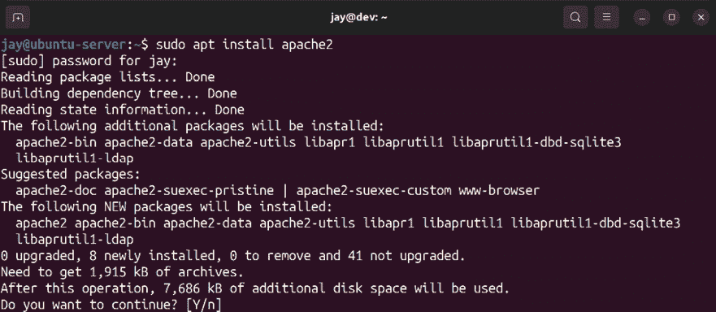
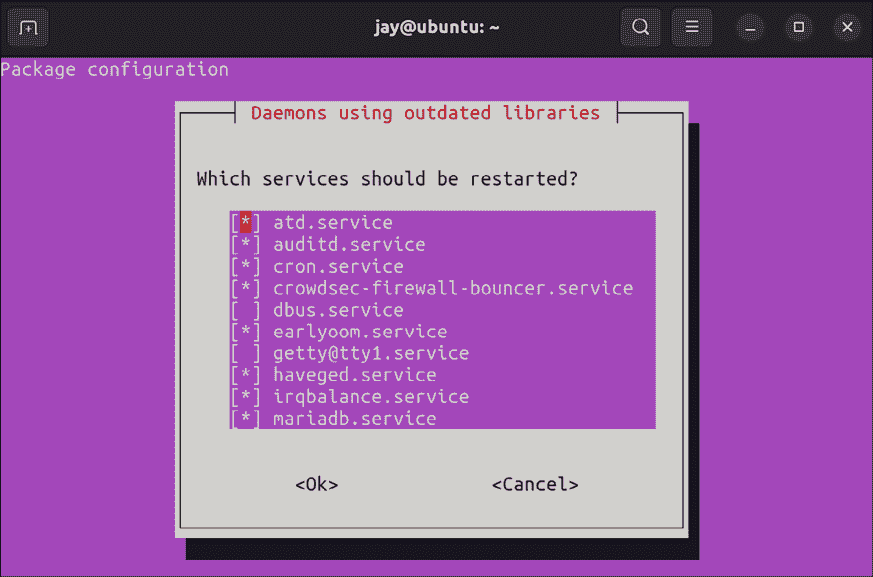
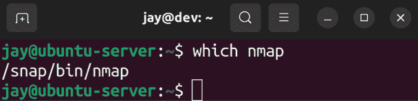
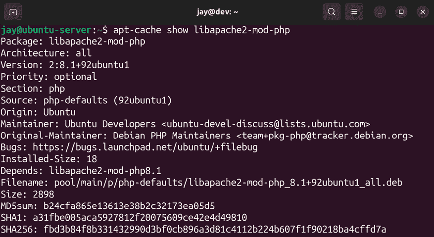
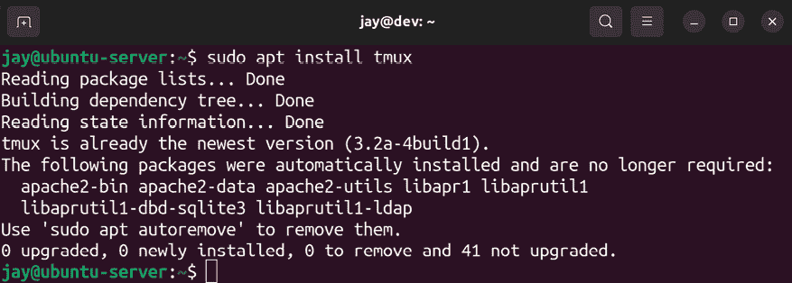
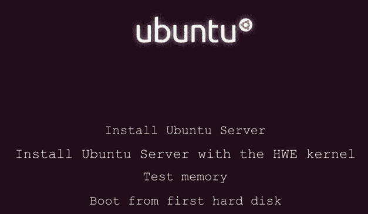

# 管理软件包

现在你已经设置好了服务器安装，并且知道如何管理服务器上的用户，是时候来了解如何管理软件了。Ubuntu 平台提供了大量的软件，从服务器管理到游戏应有尽有。事实上，在我写这章内容的时候，Ubuntu 的仓库中已经有超过 60,000 个软件包。这是非常多的软件包，在这一章里，我们将看看如何管理它们。我们将介绍如何安装、卸载和更新软件包，以及如何使用相关的工具。

在我们讲解这些概念时，我们将涵盖：

+   理解 Linux 包管理

+   理解 Debian 包和 Snap 包的区别

+   安装和卸载软件

+   查找软件包

+   管理软件包仓库

+   备份和恢复 Debian 软件包

+   清理孤立的 APT 软件包

+   利用硬件启用更新

为了开始，让我们了解一下 Ubuntu 中软件包的分发方式，以及包管理概念的基本原理。

# 理解 Linux 包管理

如今，*应用商店*在大多数平台上都非常流行；通常，你会有一个集中位置来获取应用程序，从中安装到你的设备上。即便是手机和平板电脑也利用一个集中的软件仓库，在其中软件被策划并提供。Android 平台有 Google Play，Apple 有它的 App Store，等等。对于那些已经使用 Linux 一段时间的人来说，这个概念并不新鲜。软件仓库的概念与应用商店类似，并且早在移动电话还没有彩屏之前，Linux 社区就已经有了这个概念。

Linux 从 90 年代开始就有了包管理功能，最初由**Debian**推广，然后是**Red Hat**。软件仓库通常以**镜像**的形式提供，服务器会订阅这些镜像。镜像在多个地理区域都有提供，所以通常情况下，你的 Ubuntu Server 安装会订阅离你最近的镜像。这些镜像里包含了你可以安装的软件包。许多软件包依赖其他软件包，因此在 Linux 平台上有各种工具可以自动处理这些依赖关系。并不是所有 Linux 发行版都具有包管理和依赖关系解决功能，但 Ubuntu 当然具备，因为它继承了 Debian 已经打下的基础。

这些镜像中的软件包在不断变化。传统上，一个被称为**软件包维护者**的个人负责一个或多个软件包，并将新版本提交到软件库进行审批，最终分发到镜像中。对于 Ubuntu 的软件库来说，负责维护软件包的是一组开发人员，而不仅仅是一个维护者。大多数情况下，软件包的新版本是为了修复安全漏洞，但没有其他新功能。由于 Ubuntu 的大多数软件包都是开源的，任何人都可以查看源代码，发现问题并报告。发现漏洞后，负责的团队会审查报告并发布更新版本进行修复。这个过程非常迅速，我曾见过在漏洞报告当天就发布了修复版本。可以说，Ubuntu 的开发人员在处理安全问题方面非常专业。

软件包的新版本有时也是功能更新，这些更新发布是为了引入一些新功能，这些新功能不一定与安全漏洞有关。这可能是桌面应用程序的新版本，例如 Firefox，或者服务器软件包的新版本，例如 MySQL。然而，大多数时候，版本差异较大的新软件包会等到下一个 Ubuntu 版本发布时才会推出。原因在于，过多的变化可能导致你的服务器不够稳定，可能会出现应用程序甚至整个操作系统崩溃的情况。相比之下，已知的稳定软件包是首选；然而，由于 Ubuntu 每六个月发布一次，你不必等得太久。

具体来说，Ubuntu 版本中的功能更新必须经过审批流程，才能在默认的软件库中发布，这些功能更新被特别称为**稳定发布更新**（**SRUs**）。关于这些更新的审批流程有一个完整的过程，但总体的理解是，在一个稳定的长期支持 Ubuntu 版本中，进行大版本更新应该有充分的理由。

作为服务器管理员，你经常需要在安全性和功能更新之间做出选择。安全更新是最重要的，它允许你在面对安全漏洞时修补服务器。有时，功能更新会在你的组织中变得必要，因为决定新增的功能可能会对你有所帮助，或者可能成为当前目标所必需的。在这一章中，我们不会重点讨论安装安全更新（我们会在*第二十一章*，*保护你的服务器*中处理这部分内容），但理解为什么会有新的软件包发布给你是非常重要的。

在 Ubuntu 中，软件包管理通常非常方便，安全更新和漏洞修复定期发布。只需一条命令（我们稍后会介绍），你就可以安装一个软件包及其所有依赖项。亲自处理过手动依赖解决的我可以告诉你，自动处理依赖项是非常棒的事情。

在 Linux 服务器上维护软件包的主要好处是，通常你不需要在互联网上搜索下载软件包，因为 Ubuntu 的仓库包含了你所需的大多数软件包。随着本章的深入，你将了解管理这些软件所需的一切。

# 理解 Debian 和 Snap 软件包之间的区别

现在，在我们深入了解如何管理软件包之前，实际上有两种完全不同类型的软件包可供选择，你应该理解它们之间的区别。撰写本文时，Linux 中的软件管理方式正处于一个十字路口。

传统上，每个发行版都有自己的软件包格式和用于管理它们的工具。Ubuntu 使用 **Debian 软件包**（软件包名以 `.deb` 结尾）作为主要的软件包格式，这一格式是 Ubuntu 从 Debian 发行版继承而来的（Ubuntu 是从 Debian 分支出来的，这意味着它以 Debian 为基础）。Ubuntu 和 Debian 使用 `apt` 和 `dpkg` 命令来管理软件包。另一方面，CentOS 和 Red Hat 等发行版使用 **RPM 软件包** 及 `dnf` 命令来管理它们。还有其他的发行版和软件包格式，但在本书中，我们将主要讨论 Ubuntu 中的内容。首先，让我们讨论一下 Debian 软件包。

## Debian 软件包

**Debian 软件包**一直是 Ubuntu 中的主要软件包类型，至今为止 Ubuntu 的整个版本都在使用这种类型。当你在线搜索如何在 Ubuntu 中安装某个软件时，通常你会安装一个 Debian 软件包。这些软件包之所以被称为 Debian 软件包，是因为 Ubuntu 是基于 Debian 源构建的，并且使用相同的命令来安装这些软件包。所以，尽管 Ubuntu 不是 Debian（Debian 是一个完全不同的发行版），它们主要使用相同的软件包格式。

对于新手来说，命名可能会让人感到困惑，因为如果 Ubuntu 被认为是一个与 Debian 不同的发行版，那为什么要把它的软件包称为“Debian”软件包呢？Debian 软件包的文件名以 `.deb` 结尾，这种软件包格式起源于 Debian。Ubuntu 并没有开发自己的软件包类型；它使用与 Debian 相同的软件包格式。因此，无论我们是在 Debian 还是 Ubuntu 中安装软件包，使用像 `apt` 这样的命令时，Debian 软件包都是两者使用的软件包类型。

如果你在阅读本书之前已经使用过 Ubuntu，那么很可能你已经使用过 `apt` 系列命令来进行包管理。Debian 包非常适合与 `apt` 命令配合使用，因为它们易于操作，并且能够帮助你处理依赖关系的解析。然而，它们也带来了一些挑战和重大缺点。

首先，发行版的大部分内容由 Debian 包组成。这意味着 Linux 内核、系统包、库和安全更新都是在你安装 Ubuntu Server 时安装的 Debian 包。当你安装安全更新时，实际上是安装了 Debian 包。这个问题的原因在于，你将要安装的其他软件（例如 Apache、MariaDB 等）也是 Debian 包，这可能与系统包发生冲突，尤其是当一个包需要一个与另一个包冲突的前置包时。

这可能会导致无法安装任何软件包的情况。软件包维护者通常能够避免这种情况，因此如今冲突并不常见。

然而，使用 Debian 包时，如果系统库遭到损坏，实际上所有依赖于它的软件都会出现故障。Ubuntu 开发者对此非常关注，因此你通常不会遇到问题。但事实上，这对于 Ubuntu 的维护者来说是一项巨大的工作。

另一个与 Debian 包相关的问题是软件的可用性。当一个包的新主版本发布时，通常不会在下一次发行版发布之前提供给你。这意味着，如果你需要比当前 Ubuntu 版本中提供的更新版本的 PHP、Apache 或其他软件，通常是无法获得的。你通常需要等待下一次整个发行版的更新发布。有些例外情况，例如桌面版本的 Ubuntu 中的 Firefox。正如之前所提到的，新的主要包版本是规则的例外，来自 SRU 审批过程。虽然可用经过广泛测试的成熟软件能够提供更好的稳定性，但有时你可能需要比现有版本更新的软件，这可能会促使你考虑其他来源。毕竟，你不需要为了安装更新的应用程序而重新安装新版的 Windows 或 macOS！

**通用包**是 Linux 的一个新概念，旨在提供一种多种发行版都能识别的单一包格式。其理念是开发者只需要编译一个包（而不是为每个发行版编译独立的包），用户则只需下载一个包，而无需考虑其选择的 Linux 发行版。下一节将讨论一种名为 Snaps 的通用包类型。

## Snap 包

当前，开发者需要创建多种包类型来支持 Linux。也许他们会为 Debian 本身和 Ubuntu 创建 Debian 包，然后为 CentOS、Red Hat Enterprise Linux 和 SuSE 创建 RPM 包。虽然你可能认为需要创建两种包类型并不算太糟糕，但考虑到每个基于 RPM 的发行版需要其特定的 RPM 包，你就能理解开发者每次发布软件时，需要创建五个或更多不同包的情况会是多么繁琐。

因此，推动采用一种单一的包格式，每个发行版都可以安装，并且这种格式与系统包类型无关。这个概念被称为 **通用包**，其目的是拥有一个标准的包格式，可以在任何 Linux 发行版上安装。因此，开发者只需要创建一个包，就能让他们的应用程序在所有流行的发行版上运行。

Linux 社区通常使用 *distro* 这个词作为 *distribution*（发行版）的缩写。

通用包的另一个好处是，它们内置了所有依赖项，因此冲突发生的可能性较小；应用程序所需的一切都包含在一个单独的包中。这非常好，因为使用通用包时，发生包冲突的可能性几乎是不存在的。

就像 IT 行业中的一切一样，我们无法集体满足并决定哪种技术是最合适的。因此，社区中对于多种类型的通用包哪一种最合适存在争论。我在本书中不会深入政治性讨论，因为每种技术都有其优缺点。但对于我们来说，尤其是关于 Ubuntu Server，实际上只有一种适合服务器安装的技术。用于通用包的竞争技术包括 Flatpak、AppImage 和 Snap 包。

Ubuntu 的开发商 Canonical 理解开发人员和用户在使用过程中遇到的痛点，并且一直在努力改变包管理的方式。为了解决这些问题，他们开发的通用包类型被称为 **Snap 包**。像所有通用包一样，Snap 包（或更简洁地称为 *Snaps*）对底层的 Debian 包没有任何影响，且是完全独立的，从而避免了与系统包发生冲突的可能性。这使得你可以安装比原本可用版本更新的应用版本。由于 Snaps 是与底层 Debian 包独立安装的，因此没有理由不安装它们。Snap 包在各方面都表现得更好，是一个很棒的概念。唯一的缺点可能是它们是较大的包，因为它们不仅包括应用程序本身，还将所有必需的库包含在一个单独的包中。然而，它们其实并没有那么大，不会导致磁盘空间问题。这些包的大小与 macOS 或 Windows 上的典型应用程序差不多。

那么，应该选择哪一个呢？其实这取决于你的使用场景。每种通用包类型在某些方面都表现得很好，但也有其缺点。Flatpaks 和 AppImages 也是很好的技术，但对于我们的使用场景，它们的短板在于不太支持服务器（非**图形用户界面**，即非**GUI**）应用程序。这意味着，这些包类型最适合安装你通常会在桌面版 Ubuntu 上找到的应用程序，例如音乐播放器、浏览器、图形化文本编辑器等等。Snap 包则支持*图形用户界面*和非图形用户界面应用。由于服务器安装通常根本没有图形用户界面，这就决定了我们的选择。或许未来 Flatpaks 和 AppImages 会更好地支持非 GUI 应用，但目前，选择通用包格式的问题非常简单。

然而，现阶段，我们安装的大多数软件包将是 Debian 包，因为 Snap 包的普及有些缓慢。它们在稳步进展，但行业如何接受它们还需观察。目前，最好是在 Snap 包可用时进行评估，并根据可用性、安全性、版本和支持情况选择最合适的包类型。

在了解了 Snaps 和 Debian 包之间的区别后，让我们通过一些例子来实际管理我们服务器上的软件。我们将查看搜索可用软件包的命令，然后我们将安装和卸载它们。

# 安装和卸载软件

在我们开始之前，我们需要对想要安装的应用程序进行一些研究。在 Ubuntu 中，安装软件有多种方法，所以最好的方法是通过访问我们想要安装的应用程序的官方网站来查看文档。通常，Google 搜索就能找到（只要确保检查域名并访问正确的网站）。大多数软件会提供适用于各种平台的安装说明，包括 Ubuntu。通常，它会告诉你通过`apt install`命令下载 Debian 软件包格式。其他时候，软件可能会提供 Snap 格式，甚至是 PPA 仓库（我们将在本章后面讨论 PPA 仓库）。让我们通过查看用于安装 Debian 软件包的`apt`命令，来开始我们的包管理之旅。

## 使用 apt 管理 Debian 软件包

**APT**，即**高级包管理工具**，是一套允许我们安装、删除和更新 Debian 软件包的工具。这个工具套件由多个子命令组成，接下来我们将逐一介绍。`apt`命令中最常用的变体是`apt install`。如果你曾经阅读过在 Ubuntu 上执行某些操作的说明，可能已经运行过这个命令来安装软件包。这正是它的功能：通过命令行安装 Ubuntu 的软件包。例如，以下命令将安装`openssh-server`软件包：

```
sudo apt install openssh-server 
```

你还可以通过用空格分隔每个软件包来一次性安装多个软件包，而不必一个个地安装。以下示例将安装三个不同的软件包：

```
sudo apt install <package1> <package2> <package3> 
```

在一些书籍、博客和文章中，你可能会看到更长版本的`apt`命令，比如`apt-get install`，而不仅仅是`apt install`。能够将诸如`apt-get install`这样的命令简化为`apt install`是 Debian 和 Ubuntu 中`apt`的一个相对较新的特性。两种方法都是有效的，但未来推荐使用简化后的`apt`命令。

那么，当你使用`apt`安装软件包时，究竟发生了什么？如果你之前已经执行过这个过程，你可能已经习惯了。但通常情况下，这个过程从`apt`计算依赖开始。大多数软件包需要其他软件包才能正常工作，因此`apt`会检查确保你请求的软件包以及它的依赖项都可用。

首先，你会看到`apt`希望对你的服务器进行的更改的总结。以在未配置的 Ubuntu 服务器上安装`apache2`软件包为例，我输入以下命令：

```
sudo apt install apache2 
```

当它开始安装时，我在系统上看到以下输出：



图 3.1：在示例服务器上安装 Apache

即使我只要求安装`apache2`，`apt`仍然会通知我，它还需要安装`apache2-bin`、`apache2-data`、`apache2-utils`和`libapr1`（以及其他一些软件包），以满足`apache2`软件包的依赖。`apt`还建议我安装`apache2-doc`、`apache2-suexec-pristine`以及其他一些软件包，尽管它们是可选的，并不必要。你可以通过在`apt install`命令中添加`--install-suggests`选项来安装这些建议的软件包，但这并不总是一个好主意，因为它可能会安装许多你不需要的软件包。当然，你也可以通过使用`apt`命令单独选择性安装某些建议的软件包。

然而，大多数时候，你可能不想这样做；通常，最好将已安装的软件包保持在最小范围，只安装你需要的软件包。正如我们在*第二十一章*《保护你的服务器》中将讨论的那样，安装的软件包越少，服务器的攻击面就越小。

在通过`apt`安装或更新软件包时，你可能会看到一个消息，询问你是否愿意在过程中重启后台服务：



图 3.2：软件包安装/升级过程中的服务重启提示

我们将在*第七章*《控制和管理进程》中讨论进程管理相关的概念，所以现在不必太关注这个问题。为了让你暂时了解一下，所有 Linux 服务器上都在后台运行服务，每个服务提供特定的功能。重启服务将确保它以最新的补丁和调整重新启动，但任何连接到你重启的服务的用户都会被断开。现在，你可以在看到这个消息时随时按回车接受默认设置。

另一个常见的通过`apt`安装软件包时的选项是`-y`选项，它假定你选择*是*，自动跳过确认提示，询问你是否继续。例如，我之前的输出中包括了`Do you want to continue? [Y/n]`这一行。如果使用了`-y`选项，命令将会在没有任何确认的情况下继续安装软件包。这对于急于操作的管理员来说可能很有用，尽管我个人认为除非你在脚本中进行软件包安装，否则没有必要使用这个选项。事实上，有时它可能是一个不好的主意，因为假定*是*可能意味着你确认了一些你之后会后悔的操作。

Ubuntu Server 的另一个巧妙的默认设置是，它会自动配置大多数软件包，使其守护进程启动并启用，以便在每次启动时自动启动。以之前提到的`apache2`为例，一旦你安装了该软件包，`apache2`服务将启动，应用程序也会自动运行。

为了方便起见，这可能看起来是个不错的主意，但并非每个人都偏好这种自动化。如我所提到的，服务器上安装的包越多，攻击面就越大，而正在运行的服务（也称为守护进程或单元）每个都可能成为恶意分子入侵的途径，前提是存在安全漏洞。因此，一些发行版在安装包时不会自动启用和启动守护进程。然而，我个人认为，你只应安装那些你打算实际使用的包，因此，如果你特意去安装像`apache2`这样的包，那你大概率是希望开始使用它的。

当你使用`apt`命令安装包时，它会在本地数据库中查找你指定的包。如果没有找到，它会抛出一个错误。有时，这个错误可能是因为该包不可用，或者`apt`希望安装的版本已经不存在。Ubuntu 的仓库更新速度非常快；新版本的包几乎每天都会被添加。当一个包的新版本被添加时，它的旧版本可能会被删除。因此，建议你定期更新包源。这样做很简单，只需要使用以下命令：

```
sudo apt update 
```

这个命令实际上并不会更新任何包；它仅仅是与本地镜像进行对接，查看是否有新的包被添加或移除，并更新本地索引。这个命令很有用，因为如果源不更新，包的安装可能会失败。在大多数情况下，症状表现为当`apt`在查找某个包时无法找到时，进程会报错，而这个包通常是正常情况下可用的。

移除包也非常简单，语法与安装包非常相似；你只需要将`install`关键字替换为`remove`即可：

```
sudo apt remove <package> 
```

就像使用`install`选项一样，你也可以同时移除多个包。以下示例将移除三个包：

```
sudo apt remove <package1> <package2> <package3> 
```

如果你不仅想移除一个包，还希望删除它的配置文件，你可以使用`--purge`选项：

```
sudo apt remove --purge <package> 
```

这不仅会移除包，还会删除它的配置目录（应用程序通常会将它们的配置文件存储在`/etc`的子目录中）。

所以，这就总结了使用`apt`管理 Debian 包的基础知识。现在，让我们继续学习如何管理 Snap 包。

## 使用 snap 管理 Snap 包

要管理 Snap 包，我们使用`snap`命令。`snap`命令有几个选项，允许我们搜索、安装和移除服务器或工作站上的 Snap 包。

首先，我们可以使用`snap find`命令配合关键字来显示与该关键字匹配的可用 Snap 包列表：

```
snap find <keyword> 
```

基本上，你只需要简单地输入`snap find`命令并加上搜索词来查找。例如，`nmap`应用程序就是一个很有用的工具，尤其是当我们在管理网络时：

```
snap find nmap 
```

对于`nmap`，该工具在 Ubuntu 的默认仓库中可用，因此你无需使用 Snap 包进行安装。然而，通常 Snap 版本会比 APT 仓库中提供的版本更新，并且具有更多功能。如果我们希望安装 Snap 版本，可以使用以下命令：

```
sudo snap install nmap 
```

使用`install`选项时，我们需要使用`sudo`，因为安装包的操作会对服务器进行更改。而对于简单的`find`命令，则可以省略`sudo`。

现在我们已安装了`nmap`，可以使用`which`命令检查`nmap`二进制文件的位置。我们可以使用`which`命令查找命令的二进制文件位置——如果安装了相应的包，它将显示二进制文件的路径。如果命令不可用，`which`命令将没有输出。因此，如果我们运行以下命令，我们现在应该能看到该二进制文件的路径打印到屏幕上：

```
which nmap 
```

这将返回以下输出，显示`nmap`的 Snap 版本是从一个特殊位置运行的：



图 3.3：检查 nmap 二进制文件的位置

现在，当我们运行`nmap`时，实际上是从`/snap/bin/nmap`运行的。如果我们通过`apt`安装`nmap`，它将从`/usr/bin/nmap`运行。如果我们还从 Ubuntu 的 APT 仓库安装了`nmap`工具，那么我们可以随时通过指定要运行的二进制文件的完整路径来运行任意一个，因为 Snap 包与 APT 包是独立的。例如，如果我们通过`snap`和`apt`都安装了`nmap`，我们可以通过运行`/usr/bin/nmap`来运行 Ubuntu 的版本，通过运行`/snap/bin/nmap`来运行 Snap 版本。

移除已安装的 Snap 包很容易。我们只需使用`remove`选项：

```
sudo snap remove nmap 
```

如果我们执行该命令，那么`nmap`（或我们指定的任何 Snap 包）将从系统中移除。

要更新一个包，我们使用`refresh`选项，并指定要更新的包名：

```
sudo snap refresh <package> 
```

使用该命令，包将更新到最新版本。如果进一步操作，我们还可以尝试使用相同的命令更新服务器上的所有 Snap 包（无需指定包名）：

```
sudo snap refresh 
```

正如你所看到的，管理 Snap 包相当简单。使用`snap`命令套件，我们可以从服务器或工作站安装、更新或移除包。`snap find`命令允许我们查找新的 Snap 包以供安装。也许随着技术的发展，我们将会比安装 Debian 包更多地安装 Snap 包，但这仍有待观察。现在，有两个安装新软件的选择是一个不错的优势。

除了能够安装包之外，还有一些额外的技巧和注意事项，帮助我们搜索包。毕竟，如果你不知道有哪些包可用，你是无法安装的。我们将在下一节探讨如何搜索包。

# 搜索包

不幸的是，Ubuntu Server 中软件包的命名约定并不总是显而易见。更糟糕的是，即使是同一软件，不同的发行版中的软件包名称也往往大相径庭。尽管本书和其他在线教程会列出安装软件的确切步骤，但如果你独立操作，而不知道要安装的软件包的名称，那就没什么帮助了。在本节中，我将尽量揭开搜索软件包的神秘面纱。

在上一节中，我们已经讲解了如何搜索 Snap 软件包，所以这里就不再重复了。APT 工具套件也提供了搜索软件包的功能，使用的命令是`apt search`。我们可以使用以下命令，通过提供关键字来搜索软件包：

```
apt search <search term> 
```

该命令的输出将显示与搜索条件匹配的软件包列表，包括它们的名称和描述。例如，如果你想安装 Apache 的 PHP 插件，但还不知道关联的包名，以下命令可以帮助你缩小范围：

```
apt search apache php 
```

在输出中，我们会看到一个不止一项的软件包列表，但我们可以从输出中的软件包描述中推测出`libapache2-mod-php`很可能是我们需要的那个。然后，我们可以像平常一样使用`apt`安装它。

如果我们不确定这是否是我们想要的真正软件包，我们可以使用`apt-cache show`命令查看关于这个（或任何其他）软件包的更多信息：

```
apt-cache show libapache2-mod-php 
```

该命令的输出在以下截图中进行了展示：



图 3.4：展示 Debian 软件包的信息

使用这个命令，我们可以看到关于我们考虑安装的软件包的更多细节。在这个例子中，我们了解到`libapache2-mod-php`软件包还依赖于 PHP 本身，这意味着如果我们安装这个软件包，我们不仅会得到 PHP 插件，还会安装 PHP 本身。

另一种搜索软件包的方法（如果你有可用的网页浏览器）是访问*Ubuntu 软件包搜索*页面：[`packages.ubuntu.com/`](https://packages.ubuntu.com/)，你可以通过该页面在其数据库中浏览当前支持版本的 Ubuntu 所有的软件包。虽然在工作中你不总是能访问网页浏览器，但当你能够使用时，这是一个非常有用的方式来搜索软件包、查看它们的依赖关系、描述等信息。

使用 `apt search` 命令以及 `snap find` 命令，应该能帮助你在确定要安装的包名时走得更远。软件包管理技能需要随着时间积累，因此不要指望立即就能知道应该安装哪些包。如果有疑问，只需进行 Google 搜索，研究你要运行的软件的文档，学习如何在 Ubuntu 上安装它。通常，安装说明会引导你使用正确的命令。本书中我们将讲解的示例，将引导你完成 Ubuntu Server 最常见的使用案例。

在这一点上，我们应该已经对不同类型的软件包及其管理方式有了清晰的理解。然而，有时我们需要在服务器上运行一些软件，而这些软件在标准仓库中没有可用的包。因此，在下一部分，我们将学习如何添加额外的仓库，从中安装软件。

# 管理软件包仓库

通常，Ubuntu 自带的仓库已经足够满足大多数通过 APT 安装的 Debian 包。但偶尔，你可能需要安装一个额外的仓库，以便使用 Ubuntu 通常不提供的软件，或者是比你通常能获取到的软件包版本更新的版本。添加额外的仓库允许你订阅额外的软件源，并像从其他源一样安装软件包。

然而，添加额外的仓库应当被视为最后的手段。当你安装额外的仓库时，实际上是在将你组织的服务器交给该仓库的作者信任。尽管我亲眼未曾见过这种情况，但理论上，软件作者可能会在软件包中加入后门或恶意软件（无论是有意还是无意的），并通过软件仓库提供给其他人。因此，你应该仅添加那些你有理由信任的来源的仓库。

此外，有时会发生仓库的维护者干脆放弃维护该仓库并消失。我亲眼见过这种情况。在这种情况下，仓库可能会下线（这会在`apt`事务中显示错误，表示无法连接到仓库），更糟糕的是，仓库保持在线，但从未提供安全更新，导致你的服务器易受到攻击。有时，你可能别无选择。你需要一个特定的应用程序，而 Ubuntu 默认并未提供。你唯一的选择可能是从源代码编译一个应用程序或添加一个仓库。这个决定由你做，但尽可能时要考虑安全问题。如果有疑虑，除非这是获取你所需内容的唯一方法，否则避免添加仓库。如果你添加了一个额外的仓库，且长时间没有看到来自该仓库的包更新，考虑这是一个红旗，调查该仓库是否已被弃用。已弃用的仓库应被移除，替换为其他可用仓库。

## 添加额外的仓库

软件仓库本质上是一个存储在文本文件中的 URL，存储在两个地方之一。主 Ubuntu 仓库列表存储在`/etc/apt/sources.list`中。在该文件中，你会找到多个仓库，供 Ubuntu 的包管理器拉取包。此外，扩展名为`.list`的文件会从`/etc/apt/sources.list.d/`目录中读取，并且在你使用`apt`时也会被使用。我将演示这两种方法。

这两个文件中的典型仓库行会类似于以下内容：

```
deb http://us.archive.ubuntu.com/ubuntu/ jammy main restricted 
```

每行的第一部分将是`deb`或`deb-src`，指示`apt`命令是否会在那里找到二进制包（`deb`）或源代码包（`deb-src`）。接下来是`apt`用来访问仓库的实际 URL。在第三部分，我们有发行版的代号；在这个例子中，它是`jammy`（指的是 Ubuntu 22.04 的代号，`Jammy Jellyfish`）。

如果你还不知道，每个 Ubuntu 发行版的代号都是基于一种动物。通常，所选的动物会比较稀有。例如，上一个 LTS 版本的代号是“fossa”，它是一种来自马达加斯加的动物，长得像猫，但耳朵是弯曲的。这次的代号是“jellyfish”，我相信大多数读者已经熟悉这种动物。

接下来，每个仓库行的第四部分是`Component`，它表示该仓库是否包含自由和开源的软件，并且是否得到 Canonical（负责 Ubuntu 开发的公司）的官方支持。该组件可以是`main`、`restricted`、`universe`或`multiverse`。带有`main`组件的仓库包含官方支持的软件，这通常意味着这些软件包有源代码可用，因此 Ubuntu 开发者能够修复 bug。标记为`restricted`的软件仍然得到支持，但可能存在有问题的许可。`universe`软件包由社区提供支持，而不是 Canonical 本身。最后，`multiverse`软件包包含既不自由也不受支持的软件，使用这些软件需要自行承担风险。

正如您从查看服务器上的`/etc/apt/sources.list`文件中看到的那样，一个仓库行可以包含来自多个组件的软件。每个仓库 URL 可能包含来自多个组件的软件包，而您区分它们的方法是只订阅该仓库所需的组件。在我们之前的示例中，仓库行同时包括`main`和`restricted`组件。这意味着，在这个特定示例中，`apt`工具将从该仓库索引自由（`main`）和非自由（`restricted`）软件包。

您可以将新的仓库添加到`/etc/apt/sources.list`文件中（它仍然可以正常工作），但这通常不是首选方法。正如我之前提到的，`apt`会扫描`/etc/apt/sources.list.d/`目录，查找以`.list`扩展名结尾的文本文件。这些文本文件的格式与`/etc/apt/sources.list`文件相同，即每行包含一个额外的仓库，但这种方法使您能够通过创建文件来轻松添加新仓库，也可以通过删除该文件来删除仓库。

这种方法比直接编辑`/etc/apt/sources.list`文件更安全，因为直接编辑时总有可能打错字，导致您无法从甚至官方仓库下载软件包。

此外，您可能需要为新的仓库安装**GNU 隐私保护**（**GnuPG**）密钥，但此过程因应用程序而异。通常，文档会概述整个过程。此密钥的作用是保护您，确保您正在安装签名的软件包。并非所有开发者都以这种方式保护他们的应用程序，但这绝对是一种值得做的好事。

一旦您在服务器上安装了仓库（以及可能的密钥），您需要运行以下命令来更新软件包索引：

```
sudo apt update 
```

如本章前面所提到的，这个命令更新你本地的缓存，显示远程服务器上有哪些可用的软件包。APT 只知道它数据库中的软件包，所以你需要在使用这个命令之前同步它，这样才能实际安装仓库中的软件。

## 添加个人软件包存档

在 Ubuntu 平台上，还有另一种类型的仓库，称为**个人软件包存档**（**PPA**）。PPA 本质上是 APT 仓库的另一种形式，你仍然可以像平常一样使用`apt`命令与它们的包进行交互。PPA 通常是非常小的仓库，通常只包含一个应用程序，服务于一个特定的用途。可以把 PPA 看作是*迷你仓库*。当一个厂商没有提供自己的仓库，而只将应用程序以源代码的形式提供，用户需要手动下载、编译并安装时，PPA 非常常见。通过 PPA 平台，任何人都可以从源代码编译一个包，并轻松地将其提供给其他人下载。

PPAs 和常规仓库一样，也存在相同的安全问题（你需要信任供应商等），但考虑到软件通常根本没有经过审计，它们的安全性可能更差。此外，如果 PPA 服务器出现故障，你将停止收到从中安装的应用程序的安全更新。只有在确实需要时，才使用 PPA。

有一个可能非常有吸引力的 PPA 用例，特别适用于那些标准仓库无法很好处理的服务器平台，尤其是在软件版本管理方面。正如我之前提到的，像 PHP 或 MySQL 这样的主要服务器组件，可能会随着每次 Ubuntu Server 的发布而锁定在特定的主版本中。如果你需要使用 Ubuntu Server，但所需的应用程序版本在你组织要求的版本中不可用时，该怎么办？过去，你基本上只能在发行版和软件包之间做出选择，一些组织甚至会使用不同的 Linux 发行版，仅仅是为了满足在特定版本下运行特定应用程序的需求。你当然可以从源代码编译应用程序（假设源代码是可用的），但这样会带来额外的麻烦，因为你需要负责自己编译新的安全补丁，每当有新补丁发布时。PPAs 可以让你访问那些通常在默认仓库中不可用的应用程序，和/或访问比通常提供的版本更新的软件包。这使得你，作为服务器管理员，能够选择最适合自己目标的方式。

PPAs 通常通过`apt-add-repository`命令添加到你的服务器中。语法通常是使用`apt-add-repository`命令，后接冒号，再跟上用户名，最后是 PPA 名称。以下命令是一个假设的示例：

```
sudo apt-add-repository ppa:username/myawesomesoftware-1.0 
```

要开始这个过程，你可以访问 Ubuntu 的 PPA 网站，网址是[`launchpad.net/ubuntu/+ppas`](https://launchpad.net/ubuntu/+ppas)。在那里，你可以在可用的 PPA 中进行搜索。

在将 PPA 添加到服务器之前，最好先研究一下它是否得到了良好的维护。例如，如果 PPA 很长时间没有更新软件包，那么这就值得关注——大多数软件包都会有安全修复。如果一个软件包没有定期更新，已经变得“过时”，那么最好避免使用它，因为它可能会带来更多的负面影响。

一旦你找到一个想要添加到服务器的 PPA，你可以通过找到 PPA 的名称，然后使用 `apt-add-repository` 命令将其添加到你的服务器中。

然而，你应该查看一下 PPA 的页面，以防有不同的说明。大部分情况下，`apt-add-repository` 命令应该能够正常工作。每个 PPA 通常都有一套附带的说明，因此这里不需要进行猜测。

那么，`apt-add-repository` 命令到底做了什么呢？说实话，它并不特别神奇。当你安装 PPA 时，它本质上是自动化了将一个仓库文件添加到 `/etc/apt/sources.list.d` 目录并安装其密钥的过程。因此，你可以通过简单地删除其文件来卸载 PPA。

如果谨慎使用，PPA 是一个非常有用的功能。PPA 为 Ubuntu 提供了一种灵活的方式来添加通常不会提供的额外软件，尽管你需要关注这些仓库，确保它们在出现漏洞时得到妥善修补，并且仅在绝对必要时使用。始终优先选择来自 Ubuntu 默认仓库以及 Snaps 的软件包，但 PPA 为你提供了另一种选择，以防你在其他地方找不到所需的软件。

在你维护服务器一段时间后，或者完成了为特定目标设置服务器的工作，你会安装大量的软件包以适应其目的。导出已安装的软件包列表可以让你在需要时更容易地重建服务器，下一部分我们将讨论一种实现方法。

# 备份和恢复 Debian 软件包

随着你维护服务器，已安装的软件包列表会不断增加。如果因为某些原因，你需要重建服务器，你需要精确复现之前安装的所有内容，这可能会非常麻烦。通常建议你通过变更控制流程记录所有对服务器的修改，但至少，跟踪已安装的软件包是绝对必须的。在某些情况下，服务器可能只包含一两个额外的软件包来实现目标，但在其他情况下，你可能需要一个特定的软件和库组合才能让服务器像之前一样工作。幸运的是，`dpkg` 命令允许我们导出和导入要安装的软件包列表。

要导出已安装包的列表，我们可以使用以下命令：

```
dpkg --get-selections > packages.list 
```

此命令将把包选择列表导出到一个标准文本文件。如果你打开它，你将看到已安装包的列表，每行一个。导出的文件中的典型行如下所示：

```
tmux install 
```

使用这个列表，我们可以将选择的包重新导入到服务器中，如果我们需要重新安装 Ubuntu Server，或者导入到一个新服务器中，使其执行类似的功能。首先，在管理任何包之前，我们应该更新索引：

```
sudo apt update 
```

接下来，我们需要确保安装了`dselect`包。`dselect`包在管理 Debian 包时提供了额外的功能。它的细节超出了本章的范围，但对于我们当前的目标，我们可以使用它从导出的列表中恢复包。在你的命令行提示符下，键入`which dselect`，你应该会看到类似如下的输出：

```
/usr/bin/dselect 
```

如果你没有看到输出，你需要使用`apt`安装`dselect`包：

```
sudo apt install dselect 
```

完成后，你可以导入之前保存的包列表，并重新安装服务器上缺失的包。以下命令将完成此过程：

```
sudo dselect update
sudo dpkg --set-selections < packages.list
sudo apt-get dselect-upgrade 
```

通常，我们现在使用`apt`而不是`apt-get`，但奇怪的是，`dselect-upgrade`命令仅在`apt-get`下有效。

在你执行了这些命令后，包列表中包含但尚未安装的包将在你确认更改后安装。这种方法可以让你轻松地恢复之前在服务器上安装的包，如果因为某些原因需要重建服务器时，也可以为新服务器的配置提供相似的设置。

现在我们已经了解了如何导出和导入已安装包的列表，我们还可以看看如何清理不需要的包，确保我们的服务器尽可能不含多余的臃肿。

# 清理孤立的 apt 包

当你在服务器上管理包时，最终会遇到这样一种情况：系统中有一些已安装但没有被任何东西需要的包。这种情况发生在移除具有依赖关系的包时，或者安装包的依赖关系发生变化时。你可能还记得，当你安装一个需要其他包的包时，这些依赖包也会一并安装。但是，如果你删除了那个需要它们的包，这些依赖包不会被自动移除。

为了说明这种情况，如果我从我的一台服务器上移除`apache2`包，当我尝试安装其他东西时，会看到以下额外信息：



图 3.5：显示孤立包的输出

在这个例子中，我移除了`apache2`（这是在截图前完成的），然后我安装了`tmux`。我尝试安装的包是任意的；重要的是你在截图中看到的文字，那里写着`The following packages were automatically installed and are no longer required`。基本上，如果你的系统上有孤立的包，Ubuntu 会在你使用 APT 工具套件时定期提醒你。在这种情况下，我移除了`apache2`，因此所有为了支持`apache2`包而安装的依赖包都不再需要。

在截图中，我看到了一些 APT 认为我不再需要的包列表。它可能是对的，但我们需要进一步调查。按照输出中的指示，我们可以以`root`身份或使用`sudo`命令来移除这些包。这是保持已安装包清洁的好方法，但需要小心使用。如果你最近刚刚移除了某个包，手动清理可能是安全的。

虽然我们还没有讲解更新包的内容（我们将在*第二十一章*，*保护你的服务器*中进行讲解），但以后可能会遇到一种情况，你的内核版本过旧，可以通过`autoremove`选项进行清理。这些内核包会以与前面截图中显示的孤立包相同的方式显示，但名称中会包含`linux-image`。处理这些时要小心；在你验证新安装的内核工作正常并且服务器没有出现任何不必要或意外的行为之前，绝不要移除过时的内核。通常来说，当涉及到内核包时，你可能会想至少等一周才执行`apt autoremove`。

对于其他包，通常可以安全地通过`apt autoremove`命令移除，因为它们大多数是作为另一个已不在系统中的包的依赖而安装的。然而，在移除这些包之前，请务必仔细检查你是否真的想要移除它们。如果你不小心移除了某个包，可以随时重新安装它，并且作为附加好处，如果你重新安装了一个标记为自动移除的包，它以后不会再在输出中显示为孤立包。

如你所见，Ubuntu 在管理软件方面有许多选项，作为管理员，你可以选择最适合你的目标的方法。还有一种特殊类型的更新可以提高硬件支持，适用于硬件比你的 Ubuntu 版本更新的情况，或者为以前没有支持的硬件提供兼容性。

# 利用硬件启用更新

Linux 行业的一个问题是硬件支持。在各种 Linux 发行版中，这是一个问题，因为你可能会遇到这样的情况：你正在使用一台发布时配备了最新处理器和芯片组的服务器（甚至是台式机或笔记本），但你的 Linux 发行版还没有发布包含更新驱动程序的新版，无法支持它。与 Windows 等平台不同，硬件驱动通常直接集成在 Linux 内核中。所以，如果你使用的是旧版（该版本包含较旧的内核），你可能就无法获得硬件支持，直到下一个 Linux 发行版发布。

幸运的是，Ubuntu 想出了一个系统来解决这个问题，这也是它与其他发行版不同的许多优点之一。Ubuntu 提供了一组称为**硬件启用**（**HWE**）堆栈的更新，这是**长期支持**（**LTS**）版本的独有功能。我们在*第一章*、*部署 Ubuntu 服务器*中讨论过 LTS 版本和常规版本的区别。HWE 更新是可选的，但它们为当前 LTS 版本发布之后的较新硬件提供了额外的兼容性。新的 HWE 堆栈通常包括新的内核和驱动包。然而，由于驱动程序通常是直接集成到 Linux 内核中的，因此你还将获得对新视频卡以外的其他硬件（例如新发布的网卡）的支持。

HWE 更新通常从 LTS 版本的第二个点发布开始提供，然后每次随后的点发布中都会提供，直到下一个 LTS 版本发布。新的兼容性堆栈是从最新的非 LTS 版本**回溯**过来的，这意味着你可以在保持 LTS 版本的同时，享受最新非 LTS 版本的兼容性。例如，当 Ubuntu 20.04.2 在 2021 年 2 月 4 日发布时，它包含了从 Ubuntu 20.10 回溯过来的内核和驱动包。这意味着你可以在保持 20.04 LTS 的同时，利用 Ubuntu 20.10 的较新硬件支持，并享受 LTS 版本的更长支持周期。

截至撰写时，Ubuntu 22.04 是最新的 LTS 版本，因此尚未添加硬件启用。根据历史经验，硬件启用可能会像以往版本一样在 22.04 LTS 中展开。如果是这样，那么更新的包将在 Ubuntu 22.04.2 发布后提供。

一旦新的硬件启用堆栈（HWE）可用，你可以选择安装它，或者继续使用原来的 22.04 内核而不做任何更改。对于 Ubuntu 桌面版来说，喜欢玩电脑游戏的人会从这些更新中受益匪浅，因为新的驱动程序能在显卡方面提供更好的性能，并且支持更新的游戏硬件。就本书的范围而言，新的硬件启用对我们来说的好处比桌面用户少一些。原因是，如果你的服务器运行正常没有问题，那么实际上没有必要安装新的硬件启用堆栈，除非更新的内核包含你希望利用的新特性。

有时会遇到一个让人沮丧的情况，那就是 Ubuntu 报告说没有可用的网络卡，尽管你实际上有一张。通常在购买新服务器，特别是包含最新硬件的物理服务器时，我遇到这种情况最为频繁。当你启动一台崭新的服务器时，却发现根本无法建立网络连接，这种情况非常让人沮丧。这是需要更新兼容性堆栈的经典症状。也许你的网络卡是在当前 Ubuntu 版本发布之后才发布的。这种情况正好说明了硬件启用更新存在的原因，也解释了为什么你迟早可能需要使用它们。

如果你没有选择硬件启用更新，你的服务器将始终保持与首次发布你所安装的 LTS 版本时相同的硬件启用（内核、驱动程序等）。在这种情况下，只有在安装新的安全更新时，才会更新内核和相关软件包。稍后，你可以手动选择是否安装硬件启用更新。通常，只有当你向物理服务器添加了需要新内核的新硬件时，才会这样做。如果你的服务器运行正常，并且没有添加新硬件，那么可能没有必要安装新的硬件启用堆栈。

如果你决定使用这些更新，有两种方法可以实现。你可以在安装 Ubuntu Server 时选择更新的硬件启用堆栈，或者手动安装所需的软件包。在撰写本文时，Ubuntu 22.04 刚刚发布，因此是否会在 22.04.2 发布时提供更新的软件包尚未可知，但鉴于 Ubuntu 的历史，这种可能性很大。以下截图展示了 Ubuntu 20.04.4 安装程序的第一个界面。假设 Ubuntu 22.04 按照相同的计划进行，届时你很可能会看到类似下图所示的选项，一旦 22.04.2 发布：



图 3.6：Ubuntu 20.04.4 安装程序的主菜单

请注意**使用 HWE 内核安装 Ubuntu Server**选项。如果你选择此选项，那么你的 Ubuntu Server 安装将立即包含新的 HWE 软件包。

如果你已经安装了 Ubuntu 服务器，并且希望之后安装 HWE 更新，可以通过终端进行安装。例如，在 Ubuntu 20.04 中，你可以使用以下命令切换到 HWE 内核：

```
sudo apt install --install-recommends linux-generic-hwe-20.04 
```

当 Ubuntu 22.04 发布更新的 HWE 堆栈时，很可能会使用类似的命令来安装它。如果你需要更新的 HWE 内核，请在那个时候参考 Ubuntu 文档页面中的说明。

# 概述

在本章中，我们对包管理的世界进行了快速入门。正如你所看到的，Ubuntu 服务器提供了大量的软件包和各种工具，我们可以利用它们来管理这些包。我们从讨论 Ubuntu 的包管理如何工作开始，接着介绍了安装软件包、搜索软件包和管理仓库的过程。同时，我们还涉及了 Snap 包，这是一种较新的技术，旨在增强 Ubuntu 上的软件分发。

在*第四章*，*导航与基础命令*中，我们将探讨一些基础命令，用于导航 Linux Shell，了解文件系统布局等。

# 相关视频

+   Linux 快速入门 - APT (LearnLinuxTV): [`linux.video/lcc-apt`](https://linux.video/lcc-apt)

# 进一步阅读

+   LTSEnablementStack (Ubuntu wiki): [`learnlinux.link/lts-es`](https://learnlinux.link/lts-es)

+   Ubuntu 服务器指南: [`ubuntu.com/server/docs`](https://ubuntu.com/server/docs)

# 加入我们的 Discord 社区

加入我们社区的 Discord 频道，与作者和其他读者讨论：

[`packt.link/LWaZ0`](https://packt.link/LWaZ0)


