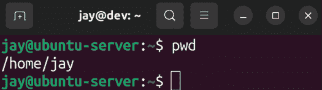
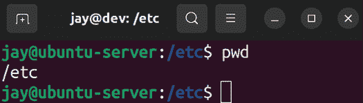
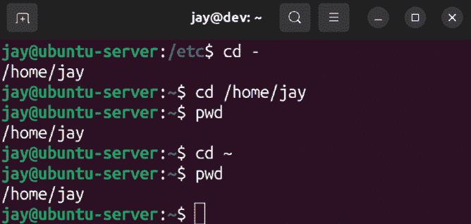
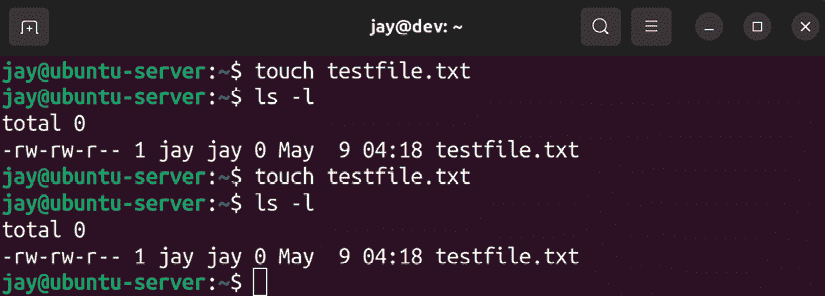
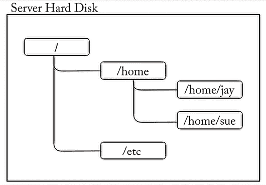
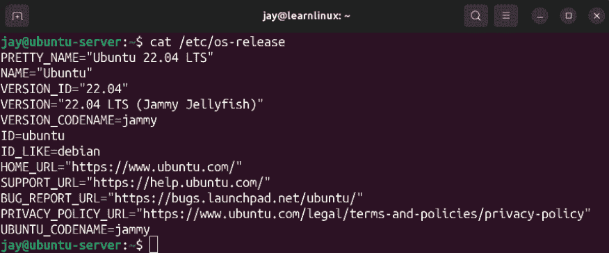
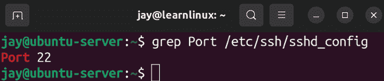

# 导航和基本命令

在我们旅程的这个阶段，我们已经覆盖了许多内容——我们学会了如何部署 Ubuntu 服务器，如何管理用户，最近还学会了如何管理软件包。在继续之前，我们应该花点时间学习一些重要的概念和命令，这些内容将帮助我们建立更多的基础知识，这些知识将对本书的后续部分乃至更远的未来有所帮助。这些基础概念包括用于浏览 shell、Linux 文件系统结构、查看文件内容甚至查看日志文件的核心 Linux 命令。具体来说，本讨论将包括：

+   学习基本的 Linux 命令

+   理解 Linux 文件系统结构

+   查看文件内容

+   查看应用程序日志文件

让我们花点时间学习一些基本的 Linux 命令，这些命令将帮助我们增强命令行技能。

# 学习基本的 Linux 命令

在命令行上建立坚实的能力至关重要，这将有效地赋予任何系统管理员或工程师超能力。我们的新能力虽然无法让我们一跃而过高楼，但绝对能让我们像命令行忍者一样执行终端命令。虽然我们在这一部分不能完全掌握使用命令行的艺术（那只能通过多年的经验积累），但我们一定会变得更加自信。

首先，让我们来谈谈如何在 Linux 文件系统中从一个位置移动到另一个位置。具体来说，所谓“Linux 文件系统”指的是你在 Ubuntu 安装中默认的各种文件夹（也称为“目录”）的结构。Linux 文件系统包含许多重要的目录，每个目录都有其指定的用途，我们将在本章后续部分详细讨论这些目录。

在我们进一步探索之前，我们需要先学习如何从一个目录切换到另一个目录。我们将在本节中介绍的第一个与浏览文件系统相关的命令将帮助你明确当前所在的目录。为此，我们有 `pwd` 命令。它代表 **print working directory**，用于显示你当前所在的文件系统位置。如果你运行它，你可能会看到如下输出：



图 4.1：查看当前工作目录

在这个例子中，当我运行`pwd`时，输出告诉我当前工作目录是`/home/jay`。这个目录就是你的家目录，默认情况下，每个用户都有一个（正如我们在*第二章*，*管理用户与权限*中讨论的）。默认情况下，所有与你的用户账户相关的文件都会存储在这里。当然，你可以在任何你想要的位置创建文件，即使是在家目录之外，如果你有权限或者使用`sudo`。但是，仅仅因为你*可以*这样做，并不意味着你*应该*。正如你将在本章中学到的那样，Linux 文件系统几乎为所有内容都有一个指定的位置。但你的家目录，位于`/home/<用户名>`，是属于你的。你拥有它，你控制它——它是你在服务器上的家。在 2000 年代初期，带图形用户界面的 Linux 安装系统甚至通过一个房子图标来表示你的家目录。

通常，你在家目录中创建的文件，其权限字符串大致如下：

```
-rw-rw-r-- 1 jay  jay      0 Jul  5 14:10 testfile.txt 
```

我们已经讨论了权限，并且在*第二章*，*管理用户与权限*中讲解了如何读取权限字符串，但你可以看到，默认情况下，你在家目录中创建的文件由你自己、你的用户组拥有，并且可以被三类用户（用户、组、其他）读取。

要更改当前目录并导航到另一个目录，我们可以使用`cd`命令并指定目标路径：

```
cd /etc 
```

现在，我还没有查看文件和目录布局，所以我随便选择了`/etc`目录。前面的斜杠表示文件系统的开始。稍后会详细讲解。现在，我们在`/etc`目录中，并且我们的命令提示符也发生了变化：



图 4.2：切换目录后，命令提示符和 pwd 命令的输出

正如你可能猜到的，`cd`命令代表*切换目录*，它用于在导航时将当前工作目录从一个目录切换到另一个目录。例如，你可以使用以下命令返回家目录：

```
cd /home/<user> 
```

实际上，有多种方法可以返回家目录，以下截图展示了其中几种方法：



图 4.3：其他进入家目录的方法

第一个命令，`cd -`，其实并不专门与家目录有关。它是一个巧妙的技巧，可以让你返回到你最近所在的目录。对我来说，`cd -`命令把我带回到我之前所在的目录，而那个目录恰好是`/home/jay`。第二个命令，`cd /home/jay`，直接把我带到了家目录，因为我指定了完整路径。最后一个命令，`cd ~`，也把我带到了家目录。这是因为`~`是家目录路径的简写，因此你不需要每次都输入完整路径`/home/<user>`，只需使用`~`来代替。

另一个基本命令是`ls`。`ls`命令列出当前工作目录的内容。我们可能还没有在主目录中存放任何内容。但是，如果我们通过执行`cd /etc`（就像之前做的那样）导航到`/etc`，然后执行`ls`，我们会看到`/etc`目录中有许多文件。试试看吧：

```
cd /etc
ls 
```

实际上，我们并不需要改变工作目录到`/etc`来列出内容。我们可以直接执行以下命令：

```
ls /etc 
```

更好的是，我们可以运行：

```
ls -l /etc 
```

这将以长列表的形式显示内容，我认为这样更容易理解。它会将每个目录或文件条目显示在单独的一行上，并附上权限字符串。但你可能已经记得`ls`和`ls -l`，这两者在*第二章*，*用户与权限管理*中提到过，所以我在这里不再详细说明。那例子中`ls`命令的`-l`部分被称为**参数**。我并不是指 Linux 社区中关于哪个命令行文本编辑器最好（无疑是 Vim）的永无休止的辩论，而是指在 Shell 命令中，参数可以让你覆盖默认设置，或者以某种方式为命令提供选项，就像在这个例子中，我们将`ls`的输出格式化为长列表。

`rm`命令是我们在*第二章*，*用户与权限管理*中提到的另一个命令，当时我们讨论了手动删除已从系统中移除的用户的主目录。因此，到现在为止，你可能已经很熟悉这个命令及其功能（它用于删除文件和目录）。这是一个潜在危险的命令，因为你可能会不小心删除不该删除的内容。在那一章中，我们使用了以下命令来删除用户`dscully`的主目录：

```
rm -r /home/dscully 
```

如你所见，我们使用`-r`参数来改变`rm`命令的行为，默认情况下，`rm`不会删除目录，只会删除文件。`-r`参数指示`rm`递归地删除一切，甚至是目录。`-r`参数还会删除路径中的子目录，因此你在使用此命令时一定要小心。正如我在书中早些时候提到的，如果你与`rm`一起使用`sudo`，你甚至有可能删除整个 Ubuntu 系统！

`rm`提供的另一个选项是`-f`参数，代表*force*（强制），它告诉`rm`在删除前不要进行确认提示。这个参数不常用，它的使用案例超出了本章的范围。但请记住它的存在，万一需要的话。

另一个值得了解的基础命令是`touch`，它实际上有两个用途。首先，假设你在当前工作目录中有权限，`touch`命令将创建一个空文件（如果文件尚不存在的话）。其次，`touch`命令将更新文件或目录的修改时间（如果它已经存在的话）：



图 4.4：使用`touch`命令进行实验

为了说明这一点，在相关的截图中，我运行了几个命令。首先，我运行了以下命令来创建一个空文件：

```
touch testfile.txt 
```

之前那个文件并不存在，所以当我之后运行`ls -l`时，它显示了新创建的文件，大小为 0 字节。接下来，我在一分钟后再次运行了`touch testfile.txt`命令，你可以在截图中看到，修改时间从`15:12`变成了`15:13`。

关于查看文件内容，我们将在本章稍后讨论。我们肯定还需要学习更多的命令，以建立我们的基础。但现在，让我们暂时从基础概念中休息一下，来更好地理解 Linux 文件系统布局，这对我们稍后将要学习的一些命令来说是必不可少的。

# 理解 Linux 文件系统布局

如我之前提到的，Linux 安装中的每个目录都有一个指定的用途。这不是硬性规则，而是关于某些内容应该放置位置的强烈推荐。

你当然可以不遵循这些推荐；最终，你对你的安装拥有完全的控制权。但是，如果你习惯将文件放在奇怪的地方，可能会惹恼你的同事。在这一节中，我们将介绍最常见的目录并讨论它们的用途。

在 Linux 世界中，*文件系统*一词本身可能会让人感到困惑，因为它可以指代两个不同的事物——默认的目录结构，以及在格式化磁盘如硬盘或闪存驱动器时选择的实际文件系统（如 ext4、XFS 等）。在本节中，我们将快速了解 Linux 文件系统，重点关注默认的目录结构。

在 Linux 中（Ubuntu 使用 Linux 内核和相关工具，因此它是 Linux 的一个*发行版*），文件系统从一个单独的斜杠`/`开始。这被认为是文件系统的起点，目录和子目录从这里分支出来。例如，考虑`/home`目录。这个目录存在于文件系统的根级别，你可以通过它以斜杠开始来看到这一点。我的系统上的主目录是`/home/jay`，这意味着它是`home`目录中的`jay`目录，而这个目录位于文件系统的起始位置。

起初可能会感到困惑，但一旦习惯了，就会变得非常合乎逻辑。如果您熟悉 Microsoft Windows，那么您可以将 `/` 技术上视为 `C:` 驱动器。实际上比这复杂一些，但如果我们忽略一些怪癖，这个比较是成立的。为了更好地理解这一点，请在服务器上对几个目录执行 `ls` 命令。如果您执行 `ls /`，您将看到文件系统根目录下的所有目录。

在结果中您会看到 `home` 目录，以及许多其他目录。对于那些更喜欢视觉表现的人，以下截图展示了一个文件系统示例：



图 4.5：典型 Linux 文件系统部分的图表

正如您所见，Linux 文件系统类似于一棵树，有一个主干向外延伸，目录之间相互分支。这个默认的目录结构是 **文件系统层次结构标准**（**FHS**）的一部分，它是一组指南，定义了目录结构的布局方式。该规范定义了目录的名称、位置以及用途。发行版有时会违反这里的一些定义，但大部分时间还是遵循得比较严格的。这就是为什么您可能会在 Ubuntu 以外的 Linux 发行版上看到非常相似（如果不是完全相同）的目录结构。

那么，这为何重要呢？正如我所提到的，每个目录通常都有其用途。关于默认布局有时会有一些争议，并且偶尔会有一些更改。但就 Linux 而言，文件系统布局的更改频率通常低于其他方面。

FHS 的完整详细解释将非常庞大，但在本章末尾我包含了该规范的链接，如果您决定进一步了解它，可以查阅。然而，有一些目录确实是您必须了解的。以下是一些比较重要的。

| **目录** | **用途** |
| --- | --- |
| `/` | 文件系统的开始；所有目录都位于其下 |
| `/etc` | 系统范围的应用配置 |
| `/home` | 用户主目录 |
| `/root` | root 用户的主目录（root 用户在 /home 下没有目录） |
| `/media` | 可移动媒体，如闪存驱动器 |
| `/mnt` | 长时间挂载的卷 |
| `/opt` | 额外的软件包（某些程序安装在这里，不太常见） |
| `/bin` | 用户必需的二进制文件（如 ls、cp 等） |
| `/proc` | 用于操作系统级组件的虚拟文件系统 |
| `/usr/bin` | 大多数用户命令 |
| `/usr/lib` | 库文件 |
| `/var/log` | 日志文件 |

`/etc`目录值得额外讨论，因为你肯定会频繁地使用它。正如前表所述，这个目录包含了应用程序的配置文件，这些配置文件是系统范围内需要被遵守的。例如，如果你在服务器上运行 OpenSSH 守护进程，默认情况下你会监听 22 号端口的连接。（别担心，我们会在后续章节中进一步讨论这些具体概念。）OpenSSH 服务器的配置文件位于`/etc/ssh`目录中。由于 OpenSSH 是一个作为后台进程在系统上运行的服务，它的配置文件存储在该目录中的`sshd_config`文件内。如果你删除了提供 OpenSSH 的包，配置文件仍然会保留（默认情况下，删除包并不会删除配置文件），所以如果你稍后重新安装 OpenSSH，下次会有相同的配置。如果我们希望在卸载软件包时同时删除配置文件，可以使用`apt remove`命令的`--purge`选项，正如我们在*第三章*《管理软件包》中所看到的那样。

本书中会随着主题的推进讨论其他重要的目录。如果现在某些内容让你感到困惑，不用担心；随着时间的推移，你会理解的。这里的关键点是，系统中有很多目录，每个目录都有其特定的用途。如果你想了解某个特定目录的用途，可以查阅 FHS。如果你想知道应该在服务器上放置某些文件的位置，同样也可以查阅 FHS。但再强调一次，不必过于担心去查阅本书以外的资料，因为我们会在后续章节中覆盖所有必要的内容。

现在我们对默认的文件系统布局和一些常见目录的用途有了更好的理解。在下一节中，我们将探索如何查看存储在这些目录中的文件内容。

# 查看文件内容

Linux 文件系统包含许多目录和文件。对于文件，我们需要学习如何读取和操作它们，以完善我们的知识。我们将在下一章中覆盖更多关于文件管理的话题。现在，我们可以通过查看如何查看现有文件的内容来获得一些帮助。

我们可以使用`cat`命令将文件内容打印到屏幕上，并提供文件名作为参数。例如，以下命令可以用来查看当前工作目录中`testfile.txt`的内容，这是我们在本章讨论`touch`命令时创建的文件。虽然这个练习有些无意义，因为该文件为空，但它提供了一个很好的初步示例：

```
cat testfile.txt 
```

由于文件为空，因此没有输出。那么，让我们看一个更实际的例子。以下是一个我们可以用`cat`命令查看的文件，它实际上包含了内容：

```
cat /etc/os-release 
```

该命令的输出如下所示：



图 4.6：查看/etc/os-release 的内容

`/etc/os-release`文件是许多发行版中都存在的一个文件。它是一个特殊的文件，提供有关当前安装的 Linux 发行版的一些信息。如果你连接到一台 Linux 服务器并想知道它运行的是哪个发行版，查看该文件的内容是一种了解方法。你也可以通过以下命令查看以简化形式呈现的一些相同信息：

```
lsb_release -a 
```

这个命令在各种发行版上都能工作，但我更喜欢使用`/etc/os-release`文件，因为它包含更多的信息。无论如何，这个练习的核心目的是演示`cat`命令允许你查看文件内容。差不多，还有其他命令也能实现同样的功能。我的意思是，你也可以尝试用`more`或`less`查看`/etc/os-release`的内容：

```
more /etc/os-release
less /etc/os-release 
```

`more`命令使你更容易查看较大的文件，因此对于像`/etc/os-release`这样较短的文件，其优势不会立即显现。如果你使用`more`查看一个较长的文件，它将在填满屏幕后停止输出，并允许你按*Enter*键继续查看下一行。

`less`命令允许你做相同的事情，但它还允许你使用箭头键以及*Enter*键查看更多输出；它还允许你向前或向后滚动。因此，本质上，`less`命令比`more`命令提供了更多功能。

此外，我们还可以使用`grep`命令。它通常不用于仅仅查看文件内容，但它绝对是一个值得了解的好命令，能够帮助你查看你特别想要查看的部分，而不是整个文件。

如果你在首次安装 Ubuntu Server 时选择安装了 OpenSSH 服务器，你应该在安装中包含了它的配置文件，并且可以像平常一样使用`cat`命令查看该文件的内容：

```
cat /etc/ssh/sshd_config 
```

当然，这将把该文件的内容打印到屏幕上，而文件的内容远远超过典型显示器一次性能够显示的内容。我们可能对某一特定行或单词感兴趣，因此需要能够将文件缩小到我们实际关心的部分。我们将在*第十章*《连接网络》中更详细地讨论 OpenSSH 服务器，所以目前不用担心这个配置文件的意义。假设我们只关心 OpenSSH 监听的端口，我们可以使用`grep`命令来打印出`/etc/ssh/sshd_config`文件中与此特定配置相关的行：

```
grep Port /etc/ssh/sshd_config 
```

此命令将输出以下内容：



图 4.7：使用 grep 查看/etc/ssh/sshd_config 文件的内容，以查找包含“Port”的行

本质上，我们所做的是指示`grep`仅打印出`/etc/ssh/sshd_config`文件中包含`Port`字符串的行。在截图中，只有一行包含了该字符串的匹配，因此显示出来。相比于在文件的 123 行文本中滚动查找，看到这个输出无疑更有效，尤其是当我们只关心与端口相关的行时。

默认情况下，`grep`是区分大小写的。这意味着，如果我们使用`grep`查找“port”（小写的 P）匹配的行，我们将完全得不到任何输出。我们可以简单地添加`-i`参数来使搜索不区分大小写。

将`grep`命令与其他命令（例如`cat`）搭配使用是非常常见的：

```
cat /etc/ssh/sshd_config | grep Port 
```

这是一个完全有效的命令，并且会做相同的事情。然而，它有些冗余。我们将在下一章介绍输出重定向的概念，但本质上，这个命令将`cat`命令的输出重定向作为`grep`命令的输入。使用`cat`先打印出文件，然后让`grep`抓取该文件的内容并搜索字符串，这是一个两步过程，而实际上只需要一步。但话说回来，它仍然是一个有效的命令。

直到今天，我仍然习惯性地使用`cat`命令配合`grep`来做同样的事情，因为这就是我刚开始使用 Linux 时，所有新用户被教导的方法。你甚至会在我的 YouTube 视频中看到我这么做——老习惯很难改掉！

日志文件是了解服务器后台发生情况的宝贵信息来源，特别是在故障排除时非常有用。接下来我们将转入关于如何查看这些文件以及与日志相关的命令的讨论。

# 查看应用程序日志文件

在本章的最后一节，我们来稍微探讨一下日志文件，因为它们包含了我们已经讨论过的一些概念，形成了一个完整的循环。我们回顾了默认目录结构，练习了查看文件，并学习了如何搜索文件中的字符串。稍后我们会更详细地讨论日志文件，但现在我们可以利用这些概念初步了解如何查看日志文件。

如果你还记得，在本章前面讨论 Linux 文件系统布局时，我们展示了一张表格，列出了其中一些最常见的目录。在那张表格中的项目中，我提到了`/var/log`目录。尽管日志记录方式正在过渡到另一种风格（更多内容会在*第二十二章*，《Ubuntu 服务器故障排除》中讲到），但我们在`/var/log`目录中会有一系列日志文件。自己运行一下`ls`命令，你会看到那里面有相当多的文件。虽然我不会在本章中详细讲解它们，但让我们来看一下`/var/log/syslog`。

这个文件的内容将包含相当多的行。这是系统日志，用于查看关于 Ubuntu 在你的服务器上运行时的背景信息消息，并且还会显示警告和错误。如果你遇到某个功能不正常的情况，你可能会在系统日志中看到一些输出，提供某种错误信息，你可以通过搜索引擎查找并尝试找到解决方法。例如，如果你的连接出现问题，你可以使用`grep`查看包含搜索词*Network*的行：

```
grep Network /var/log/syslog 
```

这只是一个假设的示例，但它可能显示相关的行。根据你的需求调整搜索词，以便找到你想要的信息。

现在也是介绍`head`和`tail`命令的好时机。这些命令分别显示文件的前十行或最后十行。这对`/var/log/syslog`文件很有用，因为该文件非常大，你可能只对某些行感兴趣。你还可以使用`-n`选项调整`head`和`tail`命令显示的行数，指定你想要的行数。例如，要查看文件的最后`100`行：

```
tail -n 100 /var/log/syslog 
```

也许更有用的是`-f`选项：

```
tail -f /var/log/syslog 
```

这使得你能够在（几乎）实时中跟踪（查看）文件。使用`-f`选项时，终端会继续显示文件中新添加的行，因此你可以监控日志文件，举个例子，当某人尝试重现问题时。你可以按下键盘上的*Ctrl* + *c*来退出跟踪模式并返回到命令提示符。

当然，还有更多我们可以讲解的基础命令和概念，但我认为现在这些已经足够了。在下一章中，我们将进一步扩展这些内容。但现在，我建议你先练习这一章中的所有概念，直到你熟悉它们为止，再继续前进。

# 总结

Linux 命令比你能记住的要多。我们大多数人只记住我们喜欢的命令和命令的变体，随着学习和知识的扩展，你将会形成自己的命令菜单。在这一章中，我们介绍了许多基础命令，大部分是必需的。我们探讨了如`grep`、`cat`、`cd`、`ls`等命令。下一章本质上是这一章的延续，但我想将基础概念分为两章，而不是一章巨大的篇幅。

在下一章中，我们将通过更深入的文件管理知识来扩展我们的基础知识，包括编辑文件、输入/输出流和符号链接，甚至会揭示生活的秘密。嗯，也许不是最后一个，但下一章仍然会很精彩。到时见！

# 相关视频

+   Linux 速成课程 – 浏览 Linux 文件系统（LearnLinuxTV）：[`linux.video/lcc-navigating`](https://linux.video/lcc-navigating)

# 进一步阅读

+   文件系统层次结构标准： [`learnlinux.link/fhs-doc`](https://learnlinux.link/fhs-doc)

+   使用终端： [`learnlinux.link/using-term`](https://learnlinux.link/using-term)

# 加入我们的 Discord 社区

加入我们的社区 Discord 空间，与作者和其他读者进行讨论：

[`packt.link/LWaZ0`](https://packt.link/LWaZ0)


