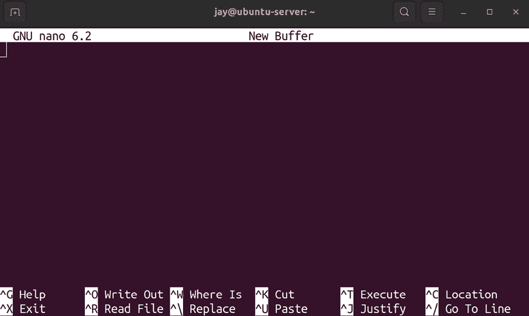
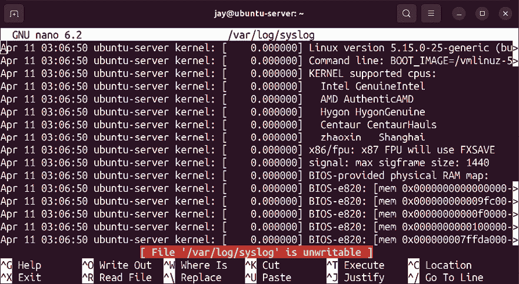
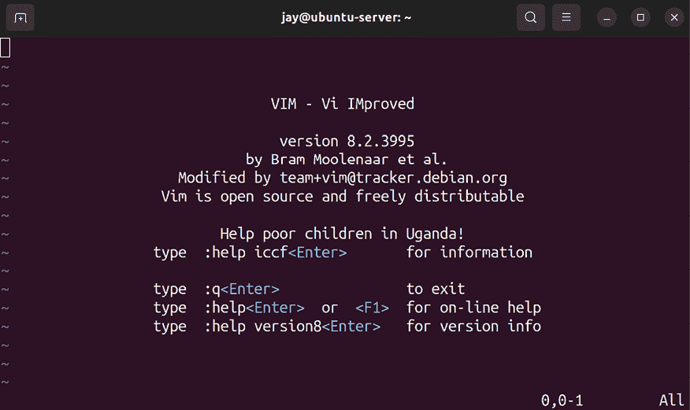
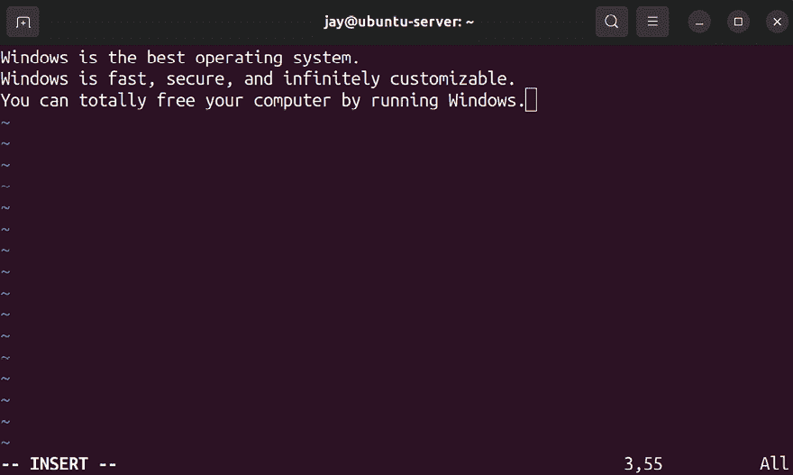
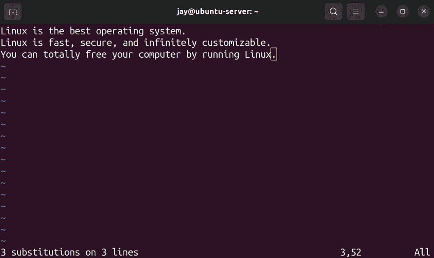
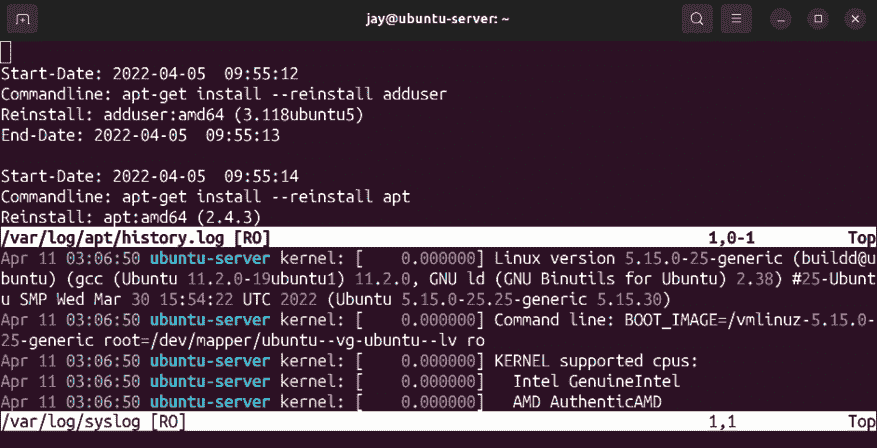
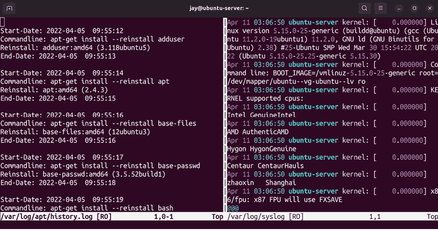
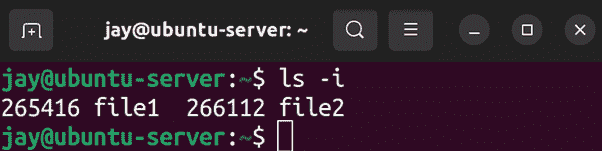
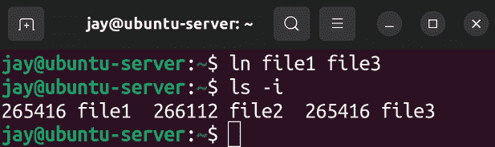
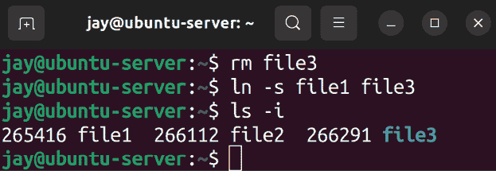

# 第五章：管理文件和目录

在 *第四章*，*导航和基本命令* 中，我们开始深入了解 Linux 命令。我们回顾了最基本的命令，讲解了文件系统的布局，以及查看文件内容的各种方法。在这一章（以及下一章）中，我们将继续扩展命令行知识，提高使用终端的效率。这一次，我们将进一步讨论文件管理，研究输入/输出流，并了解符号链接。在这个过程中，我们还将涉及：

+   复制、移动和重命名文件和目录

+   使用 Nano 和 Vim 文本编辑器编辑文件

+   输入和输出流

+   使用符号链接和硬链接

让我们从一些方法开始，看看我们如何在文件系统中修改文件和目录，比如复制和移动它们。

# 复制、移动和重命名文件和目录

此时，你应该知道如何在文件系统中移动（例如 `cd` 命令）、检查目录内容（`ls`），甚至如何创建空文件（`touch` 命令）。我们也知道如何删除文件，例如对文件或目录执行 `rm` 命令。但直到现在，我们还没有深入了解如何在你的 Ubuntu 文件系统中移动文件。

首先，要复制文件或目录，我们使用 `cp` 命令。复制文件相对简单，类似于以下的命令：

```
cp file1 file2 
```

在这个例子中，`file2` 是 `file1` 的精确副本。复制文件在许多情况下都很有用，以下是其中一些最常见的情况：

+   将文件复制到备份介质，例如外部硬盘或网络共享

+   在进行更改之前创建文件的副本，比如在编辑一个非常重要的文本文件之前

+   复制日志文件以进行时间点分析

让我们看一下最后一个要点作为另一个很好的例子。我们可以通过执行以下命令捕获系统日志并将其保存在当前工作目录中：

```
sudo cp /var/log/syslog /home/<username>/syslog 
```

`cp` 命令相当简单：我们提供一个文件的路径来复制，然后输入目标路径和所需的文件名。由于 `syslog` 默认情况下可能无法被普通用户读取，我们还需要使用 `sudo`。在这个命令中，原始的 `syslog` 文件副本将保存在当前工作目录中。

在这个特定的例子中，日志文件不断地被写入。如果文件一直在扩展，有时很难排查发生在某个特定时间的问题。 但这并不是唯一的原因。我们当然不希望意外更改日志文件，并冒着污染或丢失重要信息的风险。

上一个命令实际上可以稍微简化一下：

```
sudo cp /var/log/syslog . 
```

在这个示例中，我们移除了目标路径和名称，并用一个句点替代。这之所以有效，是因为句点表示我们的当前工作目录。这不仅适用于`cp`命令。实际上，每个目录中都有一个名为句点的目录，它本质上是当前目录的指针。因此，如果你已经进入了希望复制文件的目录，就不需要输入路径。如果你希望文件名和源文件相同，那么也不需要输入名称。

复制文件（以及移动文件，我们接下来将讨论）可能是破坏性的。如果目标路径和名称已经存在，那么目标文件将被覆盖。默认情况下，在目标文件被覆盖之前，你不会看到任何确认提示。和所有命令一样，请小心你所指示命令行解释器执行的操作。

当涉及到复制目录时，单独使用`cp`命令是无法完成的：

```
sudo cp /var/log/apt . 
```

`/var/log/apt`目录包含记录通过`apt`命令执行的事务的日志文件。保持对其他管理员所安装内容的监控是很有用的。然而，在这个示例中，之前的命令会因为以下错误而失败：

```
cp: -r not specified; omitting directory '/var/log/apt' 
```

错误信息会明确告诉你如何处理，它基本上是在告诉你目录默认情况下是被忽略的。为了复制目录，你需要加上`-r`选项。`-r`代表*递归*，这是许多 Linux 命令可能会使用的选项。它告诉命令行解释器，不仅要抓取你指定路径的对象，还要递归地包含子对象。因此，以下命令将有效：

```
sudo cp -r /var/log/apt . 
```

使用该命令时，`/var/log/apt`目录及其内容将会存储在当前工作目录中。

当涉及到将文件或目录从一个地方移动到另一个地方时，我们使用`mv`命令。其语法几乎与`cp`命令完全相同。不同之处在于，我们不是复制文件或目录，而是移动它。就这点而言，它的工作原理可能是不言自明的。考虑以下示例命令：

```
mv file1 /path/to/new/directory/file1
mv file1 file2 
```

在第一个示例中，我们假设`file1`位于当前工作目录中。我们将该文件抓取并移动到`/path/to/new/directory`，并在新目录中使用相同的文件名`file1`。就像使用`cp`命令一样，我们可以省略目标文件名，因为它保持不变。如果目标目录中已经存在同名文件，它将被覆盖。因此，`mv`命令也是潜在的破坏性命令，但相比于`cp`命令，其破坏性更大，因为你是在移动文件，而不是复制。

第二个`mv`命令稍微有点不同，因为在这个例子中我们正在重命名一个文件。在 Linux 中，没有专门的重命名命令，因此`mv`命令被用来完成这个任务。事实上，`mv`可以算是一把瑞士军刀，因为它具有多种功能。通过它，你可以移动文件或目录、重命名文件，甚至将一个文件移动到另一个位置以覆盖另一个文件。具体操作取决于源路径和目标路径。如果目标文件存在，它将被覆盖；如果目标文件不存在，文件将被重命名和/或移动到该路径。

在管理文件时，你肯定会遇到需要管理多个文件或目录的情况。值得注意的是，`cp`命令和`mv`命令都可以一次处理多个对象；例如，如果你有三个目录，比如`dir1`、`dir2`和`dir3`，并且需要将它们移动到一个新的子目录中。你可以执行三条`mv`命令分别移动每个目录，但你也可以用一条`mv`命令一次性将三个目录全部移动：

```
mv dir1 dir2 dir3 /path/to/new/location 
```

`cp`和文件的情况相同；`cp`和`mv`命令都可以让你通过一个命令来移动或复制多个目录或文件。

现在我们知道如何移动文件了，接下来我们也应该了解如何编辑文件。在 Ubuntu 平台上，我们有许多可用的文本编辑器，其中 Nano 和 Vim 是最常用的。接下来的部分，我们将介绍这两种编辑器的基本操作。

# 使用 Nano 和 Vim 文本编辑器编辑文件

现在我们知道如何复制和移动文件了，接下来了解如何编辑文件会非常有用。Ubuntu 提供了多种文本编辑器，其中一些在命令行中可用，另一些则是在图形环境下使用的，比如桌面版的文本编辑器。

有些人可能会觉得命令行文本编辑器比**图形用户界面**（**GUI**）编辑器更复杂（老实说，确实可能如此），但它的主要优点是，无论你是否有 GUI，你都可以使用相同的编辑器。从某种意义上来说，这意味着非图形编辑器更具便携性，且更加可靠。几乎所有的 Ubuntu 安装都包括`nano`文本编辑器，你可以更多地依赖它，而不必担心某个特定的 GUI 编辑器是否可用。此外，`vim`编辑器也是另一个流行的选择。它比`nano`更为高级，但在我看来，功能也更强大。在接下来的部分，我们将一起学习`nano`和`vim`的使用。

## 使用 Nano 编辑器

`nano`编辑器虽然在功能上较为基础，但依然有相当多的用户群体。事实上，如果你还没有注意到，选择编辑器其实在 Linux 社区中能引发一场小小的辩论。启动`nano`编辑器非常简单，只需运行`nano`命令。如果你不提供文件名，`nano`将会启动一个空白的窗口，如下图所示：



图 5.1：`nano`文本编辑器，未选择文件

你可以马上开始输入，当你想保存文件时，只需按*Ctrl + o*即可。在`nano`屏幕的底部，你会看到快捷键的概述，包括我刚提到的保存文件的方法（它称之为**写入文件**）。如你所见，*Ctrl + x*是退出编辑器并返回命令行的方法。

我喜欢的一个技巧是（它也适用于`vim`），当你在使用`nano`时，按住*Ctrl*，然后按*t*再按*z*，这会让它消失。通常，你不需要按*Ctrl*和*t*来将进程放入后台，但在`nano`的情况下是个例外。

实际上，这就像是将其最小化。你可以通过执行`fg`来将`nano`窗口恢复回来，`fg`是*foreground*的缩写。能够在终端中将应用程序放入后台或恢复到前台是进程管理的一部分，实际上这是我们将在*第七章*，*控制与管理进程*中讨论的内容，但我们提前给你这个小技巧，帮助你顺利前进！在编辑文件时，有时将编辑器发送到后台然后稍后再回来是很有意义的。

如你所料，你也可以使用`nano`命令，并提供目标路径和文件名，使编辑器直接打开一个已打开的文件。例如：

```
sudo nano /var/log/syslog 
```

这个命令会导致文件在`nano`中打开：



图 5.2：`nano`文本编辑器，打开了 syslog 文件

公平地说，直接编辑日志文件在实践中可能不是个好主意，但这个例子是有效的。`syslog`是你可能想要打开并检查的文件，但最好先通过`ls -lh /var/log/syslog`命令检查`syslog`文件的大小，确保它不是过大，否则会拖慢服务器速度。

抛开这些不谈，重点是你可以通过直接提供文件路径来用`nano`打开文件。在编辑器窗口内，你可以像在图形化编辑器中一样使用箭头键进行移动。你还可以通过按*Ctrl + w*来搜索特定的文本字符串，这在底部的操作列表中有提到。

此外，注意截图中以红色高亮显示的文字。它只是告诉我们我们没有权限编辑该文件。在那个示例中，我没有使用`sudo`，因为我并不打算对文件进行任何更改。

有时，我会在一个没有写权限的编辑器中打开文件，这样可以防止我不小心进行更改（如果没有`sudo`，我将无法保存文件）。要进行真正的更改，我可以关闭文件，然后使用`sudo`重新打开它。

无论如何，`nano` 编辑器相当简洁。它除了这些还有更多功能吗？当然有，但最重要的是了解如何打开文件、编辑文件并保存文件，这些我们在本节中已经讲解过了。当然，你可以通过窗口底部提供的操作来练习，超越正常使用。

现在，让我们来看一下 Vim。

## 使用 Vim 编辑

Vim 是我最喜欢的编辑器，也是我使用最频繁的编辑器。它稍微有些进阶，但并不会让人感到沮丧。默认情况下，它并没有安装。就个人而言，我更喜欢安装 `vim-nox` 包，可以通过执行以下命令进行安装：

```
sudo apt install vim-nox 
```

你安装哪个版本的 `vim` 其实并不重要。每个版本都会添加一些自己的功能。以 `vim-nox` 为例，它内置了对脚本语言的支持，但在其他方面与标准的 `vim` 并没有太大区别。你在这里学到的概念并不限于这个版本。就像 `nano` 一样，你可以通过输入 `vim` 命令来调用 `vim` 编辑器，不带任何选项，或者带上文件路径，比如 `vim /home/myuser/myfile.txt`。如果没有选择文件，`vim` 会显示默认的帮助文本。它会给出一些默认命令，比如 `:q` 用于退出编辑器：



图 5.3：vim 文本编辑器，未打开文件

启动 `vim` 时，你会进入 *命令模式*，这是编辑器的多种模式之一。在命令模式下，你不能直接编辑文本。正如其名，命令模式允许你运行命令，这样可以以非常巧妙的方式操作文本。

如果你想像在 `nano` 中那样编辑文件，你需要切换到 *插入模式*。你可以通过按键盘上的 *Insert* 键，或 *i* 键来切换到插入模式。一旦进入插入模式，你可以像在任何其他编辑器中那样开始输入文本。你可以用方向键移动光标，并在任何地方插入文本。除了插入模式之外，你也可以使用 *h*、*j*、*k* 和 *l* 键代替方向键来进行导航（有些用户实际上更喜欢这种方式）。要退出插入模式，你可以按 *Esc* 键。那样就会回到命令模式。

一开始，`vim` 的不同模式可能会让新手有些困惑。对我来说，它有点像一种超能力。使用 `vim`，你有一个专门用于编辑文本的模式，还有一个专门用于操作文本的模式。谈到文本操作，这也是 `vim` 最强大的功能之一。比如，考虑以下这个假设文件：



图 5.4：vim 文本编辑器，显示一个示例文件

我不知道为什么，但总觉得这个文件有些不对劲。我们需要做一个非常重要的修改来尝试修复它。首先，你可以从截图中看到编辑器停留在了插入模式。要进行文本操作，我们需要先按 *Esc* 键返回到命令模式。一旦进入命令模式，我们就可以准备输入一个命令。我们要输入的命令是：

```
:%s/Windows/Linux/g 
```

我不知道你怎么想，但就我个人而言，我认为在执行了那个命令后，文件看起来更好了：



图 5.5：运行示例命令后的 vim 文本编辑器

从技术上讲，Linux 是一个内核，而不是操作系统。Ubuntu 作为 Linux 的一个发行版，是我们最接近的操作系统。但暂且不提这一点。在我看来，这个版本的文件更准确！

这是一个更高级的 `vim` 使用示例，通常超出了本书的范围。我想给你展示这个强大编辑器的一个例子，查找和替换文本只是我们可以用它做的众多操作之一。有些人（包括我自己）甚至安装插件，把 `vim` 转变成 **集成开发环境** (**IDE**)。在我们刚才使用的例子中，我们能够将所有出现的字符串替换成另一个字符串。这也是我们在命令模式下执行的任务之一，命令模式允许我们操控文本并输入更高级的命令。通过这个尽管有些牵强的例子，你可以立刻看到 `vim` 多模式的价值。

我已经使用 `vim` 大约十年了，因为我似乎永远也弄不明白如何退出它。好吧，公平地说，这个笑话现在有点过时了。如果你已经使用 Ubuntu 或其他 Linux 发行版一段时间了，可能会对这个笑话有些许反感。如果这是你第一次看到这个笑话，那我很高兴是我向你介绍了它——因为某种原因，`vim` 有个很难退出的声誉。但其实并不是真的，它其实非常简单。在命令模式下，你只需输入 `:q` 即可退出编辑器：

```
:q 
```

如果你进行了更改，`:q` 命令将无法退出，但你可以通过添加感叹号强制退出，命令变成 `:q!`。如果你还想在退出时保存更改，可以加上 `w`，那么在 `vim` 中的命令就变成了：

```
:wq 
```

本质上，我们是在同时退出编辑器（`q`）并写入文件（`w`）。在命令模式下，命令以冒号（`:`）开头，后跟实际命令。由于有太多命令可以使用，所以不可能在一章中全部讲完。那么我会提到一些我认为最重要的命令。

首先，实际上可以通过使用以下命令，在不退出 `vim` 的情况下运行一个 shell 命令：

```
:! <shell command> 
```

感叹号允许你运行一个命令，然后输入实际的命令。例如：

```
:! ls -l /var/log 
```

上一个示例会显示`/var/log`目录的内容，然后你可以按*Enter*键返回到`vim`。`:sp`命令是*split*的简写：

```
:sp /path/to/file 
```

在这种情况下，`vim`能够在同一窗口中同时显示多个文件，通过有效地分割窗口来展示这两个文件。使用`:split`，或者简写为`:sp`（两者作用相同），它将把文件分成两个视图（每个视图中显示相同的文件），或者如果你提供了文件名，它会在另一个分割视图中显示一个独立的文件。这个命令会水平分割文件：



图 5.6：vim 文本编辑器，两个文件在同一窗口中打开

前面的截图显示了两个文件正在打开，`/var/log/apt/history.log`和`/var/log/syslog`。你可能还注意到，每个文件底部的状态栏显示了`RO`。正如你所猜测的，这表示*只读*，它显示在屏幕上是因为我正在查看只有`root`用户才能更改的文件，并且我没有使用`sudo`。

要在两个文件之间切换，我们可以按住*Ctrl*键的同时，连续按两次*w*键。这样，我们的插入点就会从一个分割窗口移动到另一个分割窗口。要退出每个独立的缓冲区（或者如果我们只打开了一个文件，就是退出编辑器本身），我们可以按*Esc*键返回到命令模式，然后输入`:q`或`:q!`命令退出而不保存更改，或者输入`:wq`命令退出并保存更改，就像以前一样。

`:split`的替代命令是`:vsplit`，或者简写为`:vs`。它与`:split`的作用相同，但会垂直分割窗口。考虑到现在大多数计算机显示器都是宽屏（甚至是超宽屏），垂直分割通常在实际使用中更加方便：



图 5.7：vim 文本编辑器，两个文件在垂直分割的窗口中打开

说实话，前面的截图效果看起来并不是特别好，原因在于书本中的一页宽度不足以真正展示这种分割的好处。你可以试试看，亲自体验一下。

到目前为止，我们已经介绍了`vim`的两种模式——命令模式和插入模式。但还有一种我们尚未讨论的常用模式——*可视模式*。可视模式允许你选择文本，然后执行如复制和粘贴等任务。

要做到这一点，确保你处于命令模式，然后将光标移动到你想要复制的文本的第一个字符。接着，按下键盘上的*v*键，并用箭头键移动选择区域。

你会发现，随着光标的移动，你会选中更多的文本。当你选中想要复制的所有文本后，按 *y* 键，选中的部分会消失。此时，你就相当于将选中的文本复制到了 `vim` 相当于剪贴板的地方，类似于桌面操作系统的剪贴板。然后，你可以（仍然在命令模式下）按 *p* 键，在光标所在位置粘贴文本。可能需要几次尝试才能掌握这个工作流程，但可以试试。如果你犯了错误，你可以在命令模式下按 *u* 键来 *撤销*，这样可以恢复任何更改。

再次强调，`vim` 是一个相对高级的编辑器。学习其基本功能相对简单，因此掌握如何打开、编辑、关闭和保存文件是你可以很快学会的。`vim` 的功能集非常庞大，尽管我已经使用它多年，我依然在不断学习新技巧。不过，为了确保你掌握基本操作，我们可以总结一下 `vim` 的基本工作流程，帮助你记忆。大致流程如下：

1.  打开 Vim 可以通过单独输入 `vim`，或者指定文件名：`vim <filename>`。

1.  你从 *命令模式* 开始。这个模式非常适合运行 `vim` 命令。按 *Insert* 或 *i* 键可以切换到 *插入模式*。

1.  在插入模式下，你可以通过键盘输入文本并用箭头键移动光标来编辑文本。

1.  当你编辑完文件后，按 *Esc* 键返回命令模式。

1.  如果想在不保存更改的情况下退出，可以输入 `:q` 或 `:q!` 命令。如果你确实想保存更改，可以单独输入 `:w` 保存并保持在编辑器中，或者输入 `:wq` 同时保存并退出 `vim`。

关于 `vim` 可以写整本书（实际上也有这样的书），所以本书不可能详细讲解所有内容。事实上，如果你有兴趣了解更多，我还专门制作了一系列关于 `vim` 的视频教程，地址是 [www.learnlinux.tv](http://www.learnlinux.tv)。但现在，我会给你一些我认为你应该知道的有用技巧。

在命令模式下，你可以按 *x* 键删除光标所在位置的一个字符。你也可以连续按 *d* 键 *两次* 来删除整行。当你这么做时，这一行内容会被复制到粘贴缓冲区；你可以按 *p* 键将这一行粘贴出来。

此外，我曾多次提到，你可以通过按 *i* 或 *Insert* 键切换到插入模式。你也可以通过按 *a* 键（无论是否按住 *Shift*）来进入插入模式。如果不按 *Shift*，你将从光标右侧开始插入一个字符。对我来说，这个操作并不是很有用，但我发现自己经常输入大写的 *A*，它可以让你进入插入模式并将光标移至当前行的末尾。由于我常常需要在句子的末尾开始输入，这对我来说非常实用。

此外，在命令模式下，你可以按*Shift + g*立即跳转到文件的最后一行。或者，你也可以连续按两次*g*键跳转到文件的顶部。

另一个我喜欢的小技巧是启用行号。这在某些情况下非常有用，尤其是当日志文件中的错误消息提到与特定行相关的文件时。以下命令可以启用行号：

```
:set number 
```

以下命令禁用行号：

```
:set nonumber 
```

如果你希望默认情况下始终看到行号，可以编辑你主目录下的`.vimrc`文件。每次启动`vim`时，`vim`都会读取该文件。

请注意，`.vimrc`文件以点（.）开头，这意味着该文件是隐藏的。通常情况下，当你使用`ls`命令列出目录内容时，隐藏文件不会显示。使用`ls`命令的`-a`选项可以显示所有文件，包括那些通常隐藏的文件。

现在可以打开编辑器中的`.vimrc`文件：

```
vim ~/.vimrc 
```

对你来说，这很可能是一个空文件，因为默认情况下`.vimrc`文件并不存在。我们可以在文件中添加许多命令来调整`vim`编辑器的行为，内容繁多，无法在一章中一一列举。不过，以下这一行非常有用，它确保了行号默认启用：

```
set number 
```

在这一行前省略冒号是故意的；在`.vimrc`文件中并不需要冒号。从此以后，每次你打开新的`vim`会话时，行号将会默认启用。当然，你仍然可以像之前一样，通过`vim`中的`:set nonumber`命令来禁用行号。此外，你还可以通过`.vimrc`文件为`vim`添加许多其他自定义设置，但这里无法一一列举。目前，只需要知道，使用配置文件来定制`vim`是完全可行的。

现在我们知道了如何编辑文件，我们也应该更加深入地了解流，流使我们能够以多种方式操作输入和输出。

# 输入输出流

在我们对 Ubuntu Server 的探索过程中，我们已经在终端中做了不少工作。我们能够查看文件内容、向文件中插入文本等等。其实，在整个过程中，我们一直在使用**流**，只是没有意识到而已。在这一部分，我们将更详细地讨论这个话题。

如果你曾学习过计算机科学，你可能已经知道，*输出*指的是从计算机打印出来的内容（例如，文本打印到屏幕上，或从打印机打印到纸上），而*输入*则指的是输入到计算机中的数据，无论是在命令行、文件中还是其他地方。

Linux 将这个概念延伸得更远。在 Linux 中，流（streams）指的是一种处理输入和输出的特殊方式，除了输入流和输出流，我们还有第三种流，专门用于处理错误。

在 Linux 中，输出流被称为**标准输出**，而输入流被称为**标准输入**。这两个术语分别简写为**stdout**和**stdin**。将输入/输出这一简单概念扩展成一个独立概念的原因是，在 Linux 的 shell 中，我们可以以不同的方式处理这些流，并且可以对它们执行不同的任务。

到目前为止，我们在整本书中一直在处理标准输出。所有打印到终端的内容都是标准输出。例如，当你之前运行了`sudo apt install vim-nox`命令时，那条命令的结果（显示包安装状态的文字信息）就是标准输出。当你使用`cat /var/log/syslog`命令将`/var/log/syslog`的内容显示在屏幕上时，显示的内容就是标准输出。标准输出是你最常接触到的部分。

为了更好地理解标准输出的概念，让我们来看看重定向。以下命令就是一个例子：

```
cat /var/log/syslog > ~/logfile.txt 
```

通过该命令，我们使用`cat`来显示`/var/log/syslog`的内容。但与其仅仅在屏幕上显示内容，我们使用`>`符号将标准输出重定向到一个文件`~/logfile.txt`。这意味着标准输出（显示文件内容）将完全不再显示，因为我们已经将其重定向到了文件中。类似地，我们也可以运行：

```
cat /var/log/syslog 1> ~/logfile.txt 
```

请注意，我在*大于*符号前添加了一个`1`。标准输出通过文件描述符 1 来指定。因此，通过这个命令，我特别指定了我要将标准输出，*仅*标准输出，重定向到文件中。标准输出是默认的，因此我没有必要包括`1`。这就是为什么简单地使用*大于*符号就可以将标准输出重定向到文件的原因。

如果你想追加文件而不是完全覆盖它，可以使用两个*大于*符号（`>>`）来追加，而不是覆盖。例如，以下命令会将`syslog`文件的内容追加到`logfile.txt`文件的末尾，而不是覆盖整个文件：

```
cat /var/log/syslog >> ~/logfile.txt 
```

标准输入也有一个文件描述符，即 0。标准输入是命令接收数据的方式。本质上，接受用户输入的命令通过接受`stdin`来获取数据。标准输入在例子中有点难以展示，但以下方式可以实现：

```
cat /var/log/syslog | grep -i <keyword> 
```

使用这个命令，我正在获取 `/var/log/syslog` 文件的内容，并将其传递给 `grep` 命令，这样可以只显示包含特定术语的行。每个 `syslog` 文件都不会相同，因为每个服务器都可以有不同的配置。但如果你正在调查某个特定的应用或服务，你可以使用 `grep` 在日志中查找你认为合适的关键词。如果你加上 `-i` 选项，`grep` 将执行不区分大小写的搜索。在这个例子中，`cat` 命令的输出成为了 `grep` 命令的标准输入。这个命令可以用任何你选择的搜索词来执行。

我也可以运行：

```
cat < /var/log/syslog | grep Network 
```

在这个例子中，我使用 *小于号* 符号将 `/var/log/syslog` 文件的内容重定向为 `cat` 命令的标准输入。`cat` 命令通常将传给它的文本打印到屏幕上作为标准输出，但在这里，我使用管道符号 `|` 来获取该输出，并将其作为标准输入传递给 `grep` 命令。

这个概念一开始可能有些令人困惑，但如果你持续练习，它一定会变得清晰。让我们再看一个例子，这样我们也能理解标准错误（**stderr**）：

```
find / -name "syslog" 
```

`find` 命令允许你查找符合特定条件的文件，例如在这个例子中查找名为 `syslog` 的文件。这里，我们正在搜索整个文件系统，因为我们从 `/` 开始了搜索。问题是我没有权限读取文件系统中的所有文件，并且没有使用 `sudo`。这将导致屏幕上出现许多错误，例如这些：

```
find: '/var/lib/netdata/health': Permission denied
find: '/var/lib/netdata/registry': Permission denied
find: '/var/lib/netdata/cloud.d': Permission denied
find: '/var/lib/udisks2': Permission denied 
```

由于 `find` 命令被用来搜索整个文件系统，包括我没有权限查看的地方，我们的终端将被错误信息淹没。这些错误通过标准错误显示，标准错误的文件描述符是 2。如果我们想隐藏这些错误，可以这样做：

```
find / -name "syslog" 2> /dev/null 
```

使用这个命令时，运行时不会显示任何错误。这是因为我们指示解释器捕获标准错误并将其重定向到 `/dev/null`。`/dev/null` 是一个特殊的设备，任何放到那里东西都会永远消失。如果你将某物移到或重定向到那里，它基本上就被删除了。由于标准错误的文件描述符是 2，我们将其与 *大于号* 符号结合形成 `2>`，这基本上指示 shell 执行重定向，但只重定向标准错误，保持标准输出不变。我们还可以选择在单个命令中将多个流重定向到不同的地方：

```
find / -name "syslog" 1> stdout.txt 2> stderr.txt 
```

在这个变体中，我将成功的输出重定向到 `stdout.txt`，而错误信息则重定向到 `stderr.txt`。这样我们就可以完全控制成功和失败信息的输出位置。这在故障排除时非常有帮助，因为我们可能只想专注于错误信息，去掉成功的输出可以减少我们需要查看的行数。

我建议你尽量多练习这个概念；这绝对是你希望牢记的内容。你不必现在就完全掌握这个概念，但了解基本知识会为你提供一个很好的基础。

接下来，我们来讨论文件管理的另一个方面——链接。有时，你需要将一个东西链接到另一个东西，并且有几种方法可以实现这一点，同时也有一些最佳实践建议。

# 使用符号链接和硬链接

如果你已经使用图形操作系统超过一周，那么你可能对快捷方式这个概念非常熟悉。无论是在桌面上还是在菜单中，你都会看到指向文件和应用程序的快捷方式。这些快捷方式可能指向你的主页或个人目录、一个应用程序、单个文件等等。Linux 中也有相同的概念。

使用 Linux，我们可以将文件链接到其他文件，这使我们能够创建自己的快捷方式，这实际上类似于图形操作系统中的快捷方式，但不需要 GUI。这些快捷方式以 *符号链接和硬链接* 的形式存在，它们是两种不同的链接方式。符号链接和硬链接非常相似，但要解释它们，你首先需要理解 **inode** 的概念。

inode 是一个数据对象，包含有关文件系统中文件的元数据。尽管对 inode 概念的完整讲解会相当长，但可以将 inode 看作一种数据库对象，存储了你磁盘上实际存储项目的元数据。inode 中存储的信息包括文件的所有者、权限、最后修改日期和类型（是目录还是文件）等详细信息。inode 通过一个整数表示，你可以使用 `ls` 命令的 `-i` 选项查看。在我的系统中，我创建了两个文件：`file1` 和 `file2`。这两个文件分别是 inode `265416` 和 `266112`。你可以在以下截图中看到运行 `ls -i` 命令的输出。这些信息很快就会派上用场：



图 5.8：`ls -i` 的输出

正如我之前提到的，Linux 中有两种类型的链接：符号链接和硬链接。虽然这两种链接的实现方式不同，但它们的目的几乎相同。基本上，链接允许我们在文件系统的其他地方引用某个文件。

举个实际的例子，让我们创建一个硬链接。在我的例子中，我在一个 `test` 目录下有几个文件，因此我可以为它们中的任何一个创建链接。要创建链接，我们将使用 `ln` 命令：

```
ln file1 file3 
```

这里，我正在创建一个指向 `file1` 的硬链接（`file3`）。为了实验，你可以尝试在系统上创建一个文件的链接。如果我们再次使用 `ls` 命令并加上 `-i` 选项，我们会看到一些有趣的事情：



图 5.9：第二次 `ls -I` 命令的输出

如果仔细观察输出，你会发现`file1`和`file3`具有相同的 inode 编号。从本质上讲，硬链接是一个重复的目录项，两个目录项都指向相同的数据。在这种情况下，我们创建了一个指向另一个文件的硬链接。创建了这个硬链接后，我们可以将`file3`移动到文件系统中的另一个位置，它仍然会指向`file1`。然而，硬链接有几个限制。首先，你不能创建指向目录的硬链接，只能是文件。其次，硬链接不能被移动到不同的文件系统。这是有道理的，因为每个文件系统都有自己的 inode。在我的系统上，inode `265416`当然不会指向另一个系统上的同一文件，假设该 inode 编号在另一个系统上存在的话。

为了克服这些限制，我们可以考虑使用软链接。软链接（也叫做**符号链接**或**符号连接**）是一个指向另一个目录或文件的条目。这与硬链接不同，因为硬链接是一个引用 inode 的重复条目，而符号链接引用的是特定的路径。符号链接不仅可以在不同的文件系统之间移动，我们还可以创建指向目录的符号链接。为了说明符号链接是如何工作的，我们来创建一个。在我的情况下，我将删除`file3`并将其重新创建为符号链接。我们将再次使用`ln`命令：

```
rm file3
ln -s file1 file3 
```

使用`ln`的`-s`选项，我正在创建一个符号链接。首先，我通过`rm`命令删除了原始的硬链接（这不会影响原始文件`file1`），然后创建了一个名为`file3`的符号链接。如果我们再次使用`ls -i`，会发现`file3`的 inode 编号与`file1`不同：



图 5.10：创建符号链接后使用`ls -i`命令的输出

请注意，每个文件的 inode 编号都是不同的。此时，与硬链接相比，主要的区别应该变得显而易见。符号链接并不是原始文件的克隆；它只是指向原始文件路径的一个指针。你对`file3`执行的任何命令，实际上都是针对符号链接指向的目标执行的。而硬链接则直接指向文件。

在实践中，符号链接在服务器管理中非常有用。然而，重要的是不要疯狂地在整个文件系统中创建大量的符号链接。如果你是服务器上唯一的管理员，这自然不是问题，但如果你辞职，别人接替你的职位，他们会为弄清楚你所有的符号链接并映射它们指向的位置而头疼。当然，你可以为你的符号链接创建文档，但那样你就得追踪它们并不断更新文档。我的建议是，只有在没有其他选项时，或者这样做对你的组织有利并简化文件布局时，才创建符号链接。

回到符号链接与硬链接的话题，你可能在想应该使用哪一种以及何时使用它们。硬链接的主要好处是你可以将任一文件（链接或原始文件）移动到同一文件系统的任何位置，链接都不会断开。然而，符号链接并非如此；如果你移动原始文件，符号链接将指向一个在该位置已不存在的文件。硬链接基本上是指向同一对象的重复条目，因此它们有相同的 inode 号码，因此两者将具有相同的文件大小和内容。符号链接是指向文件路径的指针——仅此而已。

然而，尽管我刚才谈到了硬链接的几个好处，我实际上推荐在大多数使用场景中使用符号链接。符号链接可以跨文件系统，可以链接到目录，并且从输出中更容易判断它们指向哪里。如果你移动硬链接，可能会忘记它们最初的位置或哪个文件实际上指向哪个。没错，使用几个命令你可以轻松找到并映射它们。但总的来说，从长远来看，符号链接更为方便。只要你在移动原始文件时留意重新创建符号链接（并且仅在需要时使用它们），你就不会遇到问题。

# 总结

在这一章中，我们将终端操作技巧提升到一个新水平，并探讨了移动和复制文件等概念。接着，我们讨论了两个流行的文本编辑器，Nano 和 Vim。然后，我们深入探讨了流的概念，并以理解符号链接和硬链接的区别以及如何创建它们作为本章的结束。

在*第六章*，*提升你的命令行效率*中，我们将深入探讨一些命令行技巧，包括讨论 Bash 历史、编写基础脚本等内容。

# 相关视频

+   Linux Crash Course – 数据流（LearnLinuxTV）：[`linux.video/se-data-streams`](https://linux.video/se-data-streams)

+   Linux Crash Course – nano（LearnLinuxTV）：[`linux.video/le-nano`](https://linux.video/le-nano)

+   Linux Crash Course – 符号链接（LearnLinuxTV）：[`linux.video/se-symlinks`](https://linux.video/se-symlinks%20)

+   Vim 文本编辑器教程系列：[`learnlinux.link/vim`](https://learnlinux.link/vim)

# 加入我们的 Discord 社区

加入我们社区的 Discord 空间，与作者及其他读者进行讨论：

[`packt.link/LWaZ0`](https://packt.link/LWaZ0)


