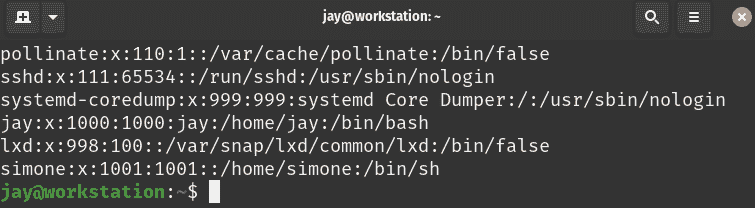
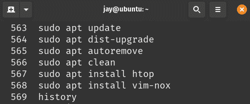

# 第六章：提高命令行效率

在本书中，我们一直在大量使用命令行。通过使用 shell，我们安装了软件包、创建了用户、编辑了配置文件等等。在上一章中，我们探讨了文件管理，以进一步提升我们的终端技能。这一章，我们将专门用一整章的内容讲解 shell，目标是提高我们的效率。在这里，我们将利用已经掌握的知识，加入一些有用的节省时间的技巧，介绍循环、变量等内容，甚至还会编写脚本。

在这一章中，我们将涵盖以下主题：

+   理解 Linux shell

+   理解 Bash 历史

+   学习一些有用的命令行技巧

+   理解变量

+   编写简单脚本

+   将所有内容结合起来：编写 `rsync` 备份脚本

让我们从进一步讨论 Linux shell 开始，这将帮助我们更好地理解在输入命令时与服务器的交互方式。

# 理解 Linux shell

当谈到 Linux shell 时，理解这个术语的真正含义非常重要。我们在本书中反复使用命令行，但至今我们还没有正式讨论过实际输入命令的接口。

本质上，我们一直在通过一个命令解释器输入命令，这个命令解释器被称为**Bourne Again Shell**，简称**Bash**。Bash 只是你可以用来输入命令的许多不同*shell*之一。

还有其他选择，包括**Zsh**、**Fish**和**ksh**，但是 Bash 是大多数 Linux 发行版的默认命令 shell。它甚至可以在 macOS 上使用（尽管在该平台上默认的是 Zsh），通过安装 Windows Subsystem for Linux（WSL）还可以在 Windows 上使用。因此，通过理解 Bash 的基础知识，你的知识将与其他发行版和平台兼容。虽然学习其他 shell（如 Zsh）也很有趣，但如果你刚开始使用，Bash 无疑是最值得集中精力的。

你可能会想知道，那么，在哪儿配置你的用户账户使用的 shell。回想一下*第二章*《管理用户和权限》，我们查看过 `/etc/passwd` 文件。相信你还记得，这个文件保存了系统上所有用户账户的列表。你可以通过输入以下命令，查看这个文件来刷新一下记忆：

```
cat /etc/passwd 
```

这将产生类似*图 6.1*中所示的输出：



图 6.1：示例 /etc/passwd 文件的最后几行

你看到每个条目的最后一个字段了吗？那是我们配置用户登录或启动新终端会话时启动哪个 shell 的地方。除非你已经更改过，否则你账户的条目应该是 `/bin/bash`。

你会在这个文件中看到其他变体，例如`/bin/false`或`/usr/sbin/nologin`。这些实际上是无效的 shell，当某个用户的默认 shell 设置为这些时，就会阻止该用户登录系统。虽然设置一个阻止登录的 shell 看起来很奇怪，但这种做法其实相当常见——并不是所有的用户账户都需要登录服务器。

系统账户与普通用户账户并存，这些账户是为后台工作创建的。系统用户不需要实际登录系统来执行工作，因此通常会进一步将系统用户的 shell 设置为无效的 shell，这样即使该账户被外部威胁者控制，也无法用来登录服务器（账户能做的事越少，就越安全）。

Shell 程序本身负责读取你输入的命令，并让 Linux 内核执行它们。某些 shell，特别是 Bash，具有额外的功能，如*history*，这些功能对于管理员非常有用。

# 理解 Bash 历史

说到 history，让我们深入探讨这个概念。默认情况下，Bash 会记录你在会话期间输入的所有命令，这样你就可以在需要时回忆起之前输入的命令。History 还有另一个用途，就是查看其他用户的活动。不过，由于用户可以编辑自己的历史记录来掩盖痕迹，因此这个功能在这个方面并不总是有用的。

如果你曾经按过 shell 中的上下箭头来回忆之前使用过的命令，你可能已经见过 Bash 的历史功能。如果你还不知道可以这么做，试试看吧。你会发现，按上下箭头可以浏览你之前使用过的命令。

另一个技巧是，你也可以在 shell 中直接输入`history`，并查看之前输入过的命令列表，如*图 6.2*所示：



图 6.2：history 命令的输出

此时，你可以从这个列表中复制并粘贴一个之前使用过的命令再次执行。实际上，还有一种更简单的方法。你注意到每个命令左侧的数字了吗？我们可以利用这个数字快速回忆起之前使用过的命令。在我的截图中，项`566`是我运行`sudo apt update`时的位置。如果我想再次运行相同的命令，只需输入以下命令：

```
!566 
```

在这种情况下，我只输入了四个字符，就能够回忆起之前使用过的命令，这个命令执行的操作与输入以下内容相同：

```
sudo apt update 
```

这节省了很多输入，真是太好了，因为我们管理员希望尽可能少打字（除非我们在写书）。

让我们来看一些额外的历史命令。首先，如果我们想从历史记录中删除某个条目，我们可以简单地执行以下命令：

```
history -d 566 
```

在这个例子中，我们从 Bash 的历史记录中删除了条目`563`。要删除其他历史记录条目，只需将`563`替换为我们想要删除的条目的编号。你可能会想，为什么从历史记录中删除某些内容是必要的。这个问题的答案很简单：有时我们会犯错。也许我们打错了什么，而我们不希望某个初级管理员查看历史记录并重新执行一个无效的命令。更糟糕的是，如果我们不小心将密码保存到了历史记录中，那么它将会被所有人看到。我们肯定会想要删除那条记录，这样密码就不会以明文形式保存在历史文件中。一个非常常见的例子是 MySQL 或 MariaDB。当你进入 MySQL 或 MariaDB 的 shell 时，可以使用`-p`选项并在一行中输入密码。它可能是这样子的：

```
mariadb -u root -pSuperSecretPassword 
```

这个命令看起来很有用，因为它可以让你通过一个命令以数据库服务器的`root`用户身份登录。然而，这也是我非常不喜欢的一点——我真的不喜欢有人在命令中直接写明密码。将`root`密码保存在 shell 历史记录中是一个巨大的安全隐患。这只是你不希望出现在 Bash 历史记录中的一个例子。我在这里的主要目的是提醒你，在输入命令时要考虑安全。如果你的命令历史中有潜在的敏感信息，你应该将其删除。事实上，你实际上可以输入一个命令，但不将它保存在历史记录中。只需在命令前加一个空格。如果你这样做，它将不会被记录在历史文件中。试试看，亲自体验一下吧。

在 Bash 中，前缀为空格的命令被忽略，实际上是 Ubuntu Server 默认启用的自定义选项。并非所有的发行版都默认启用此功能。如果你使用的发行版没有默认启用这个功能，可以将以下内容添加到你的`.bashrc`文件中（我们稍后会详细讲解这个文件）。

```
HISTCONTROL=ignoreboth 
```

这一配置行还会导致重复的命令不被写入历史记录文件，从而可以压缩历史记录文件。

那么，你可能会问，这些历史记录信息到底存储在哪里呢？查看一下`.bash_history`文件，它位于你的主目录中（对于`root`用户来说是`/root`目录）。当你退出 shell 时，历史记录会被复制到这个文件中。如果你删除这个文件，实际上就是清空了历史记录。但我不建议你养成删除它的习惯。保留命令历史记录非常有用，特别是当你可能不记得上次是如何解决某个问题的时候。Bash 中的历史记录可以帮助你避免重复查找命令。要了解更多关于`history`命令的功能，查看相关的 man 页面，命令是`man history`。

学习使用命令行的新技巧，使我能更高效地工作，这是一个很棒的感觉，至少对我来说是这样。在接下来的部分，我们将探讨一些在使用 shell 时可以利用的有用技巧。

# 学习一些有用的命令行技巧

利用 shell 提高生产力的技巧是我最喜欢的事情之一，和音乐、电子游戏、健怡可乐一样。没有什么比你发现一个可以节省时间或提高效率的有用功能时的感觉更好了。我在这条路上发现了许多事情，真希望我早些知道它们。我写这本书的目标之一，就是教你我学得比我愿意承认的还要慢的那些东西。在这一部分，按顺序不分先后，我将介绍一些提高我工作流的技巧。

首先，在终端输入 `!!`（两个感叹号）将重复你上次使用的命令。单独使用这个功能看起来可能没什么特别的。毕竟，你可以按一次上箭头键，然后按 *Enter* 来回忆上一个命令并执行它。但是，当与 `sudo` 一起使用时，`!!` 变得更有趣了。想象一下，你输入了一个需要 `root` 权限的命令，但忘记加上 `sudo`。我们都犯过这个错误。实际上，直到我写这本书的时候，我已经用了 20 年的 Linux 了，但我*仍然*时不时忘记使用 `sudo`。当我们忘记加 `sudo` 时，我们必须重新输入命令。或者，我们可以直接这么做：

```
sudo !! 
```

就这样，你用 `sudo` 前缀加上了之前使用的命令，而不必重新输入它。

说到避免不必要的输入，一个非常简单（但极其有用）的功能是**Tab 完成**。通常，Bash shell 可以自动完成你输入的部分命令。如果你开始输入命令或路径的几个字符，按下键盘上的*Tab*键，如果你输入的字符足以缩小结果范围，shell 会为你完成路径。你也可以连续按两次*Tab*，以查看与已输入字符匹配的所有可能选项。试试看吧。举个例子，你可以输入 `ls` 和你主目录的路径，故意漏掉一些字符，然后按下*Tab*，看看命令是否会自动完成。例如，我可以在终端输入以下内容：

```
ls /home/j 
```

然后按下 *Tab*，它就自动完成了命令：

```
ls /home/jay 
```

此外，还有一些特殊的键盘快捷键可以帮助你更快速地导航命令行。下面是一个包含一些最有用的键盘快捷键的表格：

| **键盘快捷键** | **结果** |
| --- | --- |
| *Ctrl + a* | 将光标移动到行首 |
| *Ctrl + e* | 将光标移动到行尾 |
| *Ctrl + l* | 清屏 |
| *Ctrl + k* | 删除光标到行尾的字符 |
| *Ctrl + u* | 删除当前行输入的所有内容（在输入密码时也能清除文本） |
| *Ctrl + w* | 删除光标左侧的一个单词 |

进一步探讨命令历史，我们还可以在 shell 中按 *Ctrl + r* 来启动搜索。按下这两个键后，我们可以开始输入一个命令，并且会看到一个与输入内容匹配的命令预览，随着输入更多字符，这个预览会进一步缩小范围。这是我很难描述的事情，截图也不太有帮助，所以不妨试试看。例如，按下 *Ctrl + r* 然后开始输入 `sudo apt`。你上次使用该命令时的记录应该会出现，你可以再次按 *Ctrl + r*，这样会看到包含这些字符的历史命令的更多实例。当你熟练掌握这一技巧时，它实际上比 `history` 命令更高效，但这需要一些时间来适应。

另一个有趣的技巧是，在文本编辑器中编辑你之前输入的命令。我知道这听起来很奇怪，但请耐心听我解释。假设你按了上箭头键，输入了一个非常长的命令，而你只想编辑其中的一部分，而不必执行整个命令，比如像这样：

```
sudo apt update && sudo apt install apache2 
```

假设你想安装 `nginx` 而不是 `apache2`，但其余的命令是正确的。如果你按住 *Ctrl* 然后按 *x* 再按 *e*，命令会在文本编辑器中打开。在那里，你可以更改命令。修改完毕后，一旦保存文件，命令就会执行。坦白说，这通常只有在你有非常长的命令，需要更改其中的一部分时才有用。虽然这有点奇怪，但计算机本身也挺奇怪的。

你注意到之前命令中的两个 `&` 符号了吗？这是另一个有用的技巧；你实际上可以将多个命令链接在一起。在之前的命令示例中，我们告诉 shell 执行 `sudo apt update`。接着，我们告诉 shell 执行 `sudo apt install apache2`。双重和号被称为逻辑 `AND` 运算符，因此第二个命令只有在第一个命令成功时才会执行。如果第一个命令成功，第二个命令会紧接着执行。另一种链接命令的方法是：

```
sudo apt update; sudo apt install apache2 
```

与分号的区别在于，我们告诉 shell 执行第二个命令，*无论*第一个命令是否成功。你可能会想，什么才算 shell 上的成功呢？一个显而易见的答案可能是“没有错误信息就是成功”。虽然这通常是对的，但 shell 使用退出码来编程地标识成功或失败。你可以通过在上一个命令完成后立即输入以下命令来查看命令的退出码：

```
echo $? 
```

`0`的退出代码表示成功；其他任何代码则表示某种错误。不同的程序会为不同类型的失败分配不同的代码，但`0`始终表示成功。通过这个命令，我们实际上是在打印一个变量的内容。`$?`实际上是一个变量，在这种情况下它仅用于存储退出代码。`echo`命令本身可以用于向终端打印文本，但它常常被用来打印变量的内容（我们将在*理解变量*部分详细讨论这个）。

现在，到了我最喜欢的节省时间的小技巧——命令别名的时候了。别名的概念很简单：它允许你创建一个命令，实际上是另一个命令的别名。这让你可以将命令简化为一个单词或几个字母。比如，考虑这个命令：

```
alias install="sudo apt install" 
```

当你输入前面的命令时，实际上不会有任何输出。但发生的事情是你现在拥有了一个新命令——`install`。这个命令通常是不可用的，你刚刚通过这个命令创建了它。

你可以通过运行`alias`命令来验证别名是否成功创建，这会显示当前在 shell 中存在的别名列表。如果你创建了新的别名，你应该能在输出中看到它。你还会看到输出中出现你没有创建的其他别名，这是因为 Ubuntu 默认设置了一些别名。事实上，连`ls`命令本身也是一个别名！

创建这个新的别名后，每次在命令行中执行`install`时，实际上是在执行`sudo apt install`。现在，安装软件包变得更简单了：

```
install tmux 
```

就这样，你安装了`tmux`。你不需要输入`sudo apt install tmux`，你只是将命令中的前三个词简化成了`install`。事实上，你甚至可以将它进一步简化：

```
alias i='sudo apt install' 
```

现在，你可以使用以下命令安装软件包：

```
i tmux 
```

使用别名，你可以发挥很大的创造力。这是我个人最喜欢的一些别名。

查看消耗 CPU 最多的前 10 个进程：

```
alias cpu10='ps -L aux | sort -nr -k 3 | head -10' 
```

查看消耗 RAM 最多的前 10 个进程：

```
alias mem10='ps -L aux | sort -nr -k 4 | head -10' 
```

查看所有已挂载的文件系统，并以干净的标签页布局展示信息：

```
alias lsmount='mount | column -t' 
```

通过简单地输入`c`来清除屏幕：

```
alias c=clear 
```

你能想出其他的别名吗？想一想你可能经常使用的命令，并简化它。

但是有一个问题，那就是当你退出终端窗口时，你的别名会被清除。如何保留它们呢？这就引出了我的下一个提高效率的小技巧，编辑你的`.bashrc`文件。这个文件位于你的主目录中，并且每次你启动一个新的终端会话时都会被读取。你可以在其中添加所有的`alias`命令；只需将它们添加到文件中的某个位置（例如，文件末尾）。你需要包括整个命令，从`alias`开始，到命令的引号结束。如果你想复制我的示例别名，你可以将以下几行添加到你的`.bashrc`文件中的某个位置：

```
alias i='sudo apt install'
alias cpu10='ps -L aux | sort -nr -k 3 | head -10'
alias mem10='ps -L aux | sort -nr -k 4 | head -10'
alias lsmount='mount |column -t' 
```

当然，我们还可以讨论更多节省时间的技巧，但 Bash 的复杂性足以让我们写一本书（而且很多人确实这么做了）。随着本章的进行，我会给你更多的提示。现在，给你一个最后的技巧，它会将你的工作目录切换回你之前所在的目录：

```
cd - 
```

这个简单的命令在*第四章*，*导航和基本命令*中有提到，但值得再提一遍——不客气！接下来，让我们看看 shell 变量，它们允许我们存储信息，以便在其他命令中轻松访问。

# 理解变量

Bash 不仅仅是一个 shell。你可以说它非常类似于一个完整的编程语言，这样的说法并不错误。Bash 有一个内建的脚本引擎（稍后我们将讨论脚本编写），关于脚本语言和编程语言的区别存在很多争议，随着新语言的出现，这两者之间的界限也越来越模糊。

与任何脚本语言一样，Bash 也支持变量。Bash 中变量的概念非常简单，但我觉得有必要单独（相对简短地）讲解这一部分，以确保你理解基础知识。你可以通过如下命令设置变量：

```
myvar='Hello world!' 
```

当 Bash 遇到等号后面的字符串时，它认为你正在创建一个变量。在这里，我们创建了一个名为`myvar`的变量，并将其设置为`Hello world!`然而，每次引用变量时，我们需要明确告诉 Bash 我们正在请求一个变量，方法是用美元符号（`$`）前缀它。考虑一下这个命令：

```
echo $myvar 
```

如果你像我一样设置了变量，执行该命令将会将`Hello world!`打印到`stdout`。`echo`命令在打印变量内容时非常有用。这里需要记住的关键是，当你*设置*一个变量时，不需要加`$`符号，但在获取变量时需要加上。另外，请记住等号两边不能有空格。

在使用各种 Linux 服务器时，你会看到变量名格式的不同变体。例如，你可能会看到全大写的变量名、驼峰命名法（`MyVar`）等其他变体。这些变体都是有效的，具体使用哪种形式取决于创建者的背景（开发者、管理员等），因此你可能会看到不同的变量命名方式。内建的变量通常会采用全大写的命名方式，这也非常常见。

变量也可以在 shell 的其他方面使用，而不仅仅是与`echo`一起。考虑一下这个：

```
mydir="/etc"
ls $mydir 
```

在这里，我们将一个目录名称存储在变量中，并使用 `ls` 命令列出其内容。这看起来可能相对无用，但在编写脚本时，这将为你节省时间。任何你需要多次引用的内容，都应该放在变量中。这样，在脚本中，你只需修改一次该变量的内容，脚本中的所有地方都会引用到它。

还有一些在你的 shell 中自动存在的变量，这些是你没有明确设置的。执行以下命令来试试看：

```
env 
```

哇！你应该能看到很多变量，特别是如果你在 Ubuntu 的桌面版本中输入它的话。

这些变量是由系统设置的，但仍然可以像其他变量一样通过 `echo` 访问。其中一些值得注意的包括 `$SHELL`（存储当前处理你的 shell 的二进制文件名）、`$USER`（存储当前用户名）和 `$HOST`（存储你设备的主机名）。这些变量可以随时访问，甚至在脚本中也能发挥作用。

我们已经在上一章讲解了**标准输出**（**stdout**）、**标准错误**（**stderr**）和**标准输入**（**stdin**）。我们在这里再次使用标准输入，当我们捕获输入并将其存储为变量时。尝试执行以下命令：

```
read age 
```

当你运行此命令时，你会被带到一个空白行，没有任何提示说明你应该做什么。继续输入你的年龄，然后按 *Enter*。接下来，执行这个：

```
echo $age 
```

在脚本中，你需要告知用户他们应该输入什么，所以你可能会使用类似于以下的命令：

```
echo "Please enter your age"
read age
echo "Your age is $age" 
```

我们在上一章讨论了标准输入，这里我们可以再次看到它的应用，我们从用户获取输入并将其存储在一个变量中。

自动化是我们将在本书剩余部分多次探讨的主题，其中将包括更多高级主题，如配置管理。编写脚本是最简单的自动化形式，它让你能够将命令写入文本文件并逐一执行。这就是我们接下来要探讨的内容。

# 编写简单脚本

这是我们到目前为止讨论的所有内容开始汇聚的部分。编写脚本既有趣又有回报，因为它们允许你自动化大任务，或简化那些你反复执行的操作。关于脚本的最重要一点是：如果是你需要做多次的事情，确实应该将其写成脚本。这是一个非常好的习惯。

脚本是一个非常简单的概念；它只是一个包含 shell 要逐一执行命令的文本文件。专门为 Bash 执行编写的脚本被称为 Bash 脚本，这就是我们在本节中将要创建的脚本类型。

目前，我假设你已经在 Linux 上使用过文本编辑器。不管你是使用 Vim 还是 Nano。既然我们之前已经编辑过文本文件（我们在 *第五章*，*文件和目录管理* 中讲过），我假设你已经知道如何创建和编辑文件了。我们将使用文本编辑器来创建一个简单的脚本作为示例，使用以下命令：

```
nano ~/myscript.sh 
```

如果你还不清楚，波浪线（`~`）只是指代用户主目录的快捷方式。因此，在我的系统上，前面的命令就相当于我输入了：

```
nano /home/jay/myscript.sh 
```

在文件中，输入以下内容：

```
#!/bin/bash
echo "My name is $USER"
echo "My home directory is $HOME" 
```

保存文件并退出编辑器。为了将此文件作为脚本运行，我们需要将它标记为可执行：

```
chmod +x ~/myscript.sh 
```

要执行它，我们只需要调用文件的路径和文件名：

```
~/myscript.sh 
```

输出应该类似于以下内容：

```
My name is jay
My home directory is /home/jay 
```

第一行 `#!/bin/bash` 可能会让你觉得奇怪，如果你以前没见过它。通常，带有井号（`#`）符号的行会被解释器忽略。但是第一行是一个例外。我们在第一行看到的 `#!/bin/bash` 叫做 **哈希 bang** 或 **shebang**。基本上，它只是告诉内核应该使用哪个解释器来执行脚本中的命令。如果我们写的是 Python 脚本，可能会使用 `#!/usr/bin/python`。但是因为我们编写的是 Bash 脚本，所以使用了 `#!/bin/bash`。

后面的几行是简单的打印语句。每一行都使用了系统变量，所以你不需要声明这些变量，因为它们已经存在。在这里，我们打印了当前用户的用户名和主目录。

脚本的概念变得更加有价值，当你开始考虑那些你日常做的事情，你可以用自动化来替代它们时。作为一名有效的 Linux 管理员，采用自动化思维方式非常重要。再说一遍，如果你需要做某项工作超过一次，那就写个脚本吧。这里有另一个示例脚本，帮助你理解这个概念。这一次，这个脚本将会稍微有点用：

```
#!/bin/bash
sudo apt install -y apache2
sudo apt install -y libapache2-mod-php8.1
sudo a2enmod php8.1
sudo systemctl restart apache2 
```

我们在这里做的，理论上是脚本化了一个 Web 服务器的设置。我们可以进一步扩展这个脚本，让它将网站内容复制到 `/var/www/html`，启用配置文件等等。但从上面的脚本来看，你可能已经看出，脚本可以帮助你减少工作量。这个脚本可以是一个高级的 Web 服务器安装脚本，你可以将它直接复制到新服务器上然后运行。

请注意，示例中使用了`apt`的`-y`选项。如果你之前没有注意到，这会自动回答*yes*，以应对在过程中可能出现的提示。脚本通常是非交互式的，这意味着可能没有管理员在旁边处理提示问题。另外，使用`a2enmod`命令启用`php8.1`实际上并不必要，因为它在安装`libapache2-mod-php8.1`包时已经会自动启用。但我想你明白我的意思；我们希望在脚本中明确写出，给出我们希望的具体状态。

现在，让我们更深入一点编写脚本。之前的脚本只是安装了一些包，实际上我们可能也可以通过复制和粘贴命令到 shell 中轻松完成。让我们把这个脚本做得更进一步。让我们编写一个条件语句。这是之前脚本的修改版本：

```
#!/bin/bash
# Install Apache if it's not already present
if [ ! -f /usr/sbin/apache2 ]; then
    sudo apt install -y apache2
    sudo apt install -y libapache2-mod-php8.1
    sudo a2enmod php8.1
    sudo systemctl restart apache2
fi 
```

现在它变得有趣起来了。哈希标记之后的第一行是一个注释，告诉我们脚本的作用：

```
# Install Apache if it's not already present 
```

注释被解释器忽略，但它们有助于让我们知道代码块在做什么。

接下来，我们开始一个`if`语句：

```
if [ ! -f /usr/sbin/apache2 ]; then 
```

Bash，像任何脚本语言一样，支持分支，`if`语句就是实现分支的一种方式。在这里，它正在检查`apache2`二进制文件是否存在。这里的`-f`选项表示我们正在查找一个文件。我们可以将其更改为`-d`来检查目录是否存在。感叹号表示取反。它基本上意味着我们在检查某个东西*是否*不存在。如果我们想检查某个东西*是否*存在，我们将省略感叹号。基本上，我们正在设置脚本，如果 Apache 已经安装，就不执行任何操作。在这种情况下，在方括号中我们只是执行一个 shell 命令，然后检查结果。`if`语句中的命令只是安装包。

最后，我们用*if*的反向词（`fi`）来结束我们的`if`语句。如果你忘记这么做，脚本将会失败。

关于`if`语句的概念，我们也可以比较值。请看以下例子：

```
#!/bin/bash
myvar=1
if [ $myvar -eq 1]; then
    echo "The variable equals 1"
fi 
```

通过这个脚本，我们只是检查一个变量的内容，并在其等于某个特定数字时采取行动。注意，我们在创建变量时没有使用引号，因为这里只是设置了一个数字（整数）。只有当我们想把变量值设置为字符串时，才会使用引号。如果`if`语句不匹配，我们也可以采取行动：

```
#!/bin/bash
myvar=10
if [ $myvar -eq 1]; then 
    echo "The variable equals 1" 
else 
    echo "The variable doesn't equal 1" 
fi 
```

这是一个愚蠢的例子，我知道，但它有助于说明如何在 Bash 中创建`if`/`else`逻辑块。`if`语句检查变量是否等于`1`。它不是，所以执行`else`块。

命令中的`-eq`部分类似于大多数编程语言中的`==`。它是在检查某个值是否等于某个值。或者，我们可以使用`-ne`（不等于）、`-gt`（大于）、`-ge`（大于或等于）、`-lt`（小于）等。

在这一点上，我建议你暂停阅读，进一步练习脚本编写（练习是将概念牢记在心的关键）。尝试以下挑战：

+   要求用户输入信息，例如他们的年龄，并将其保存到一个变量中。如果用户输入的数字小于 30，告诉他们他们还年轻。如果数字大于或等于 30，使用`echo`打印出一个告诉他们已经老了的语句。

+   编写一个脚本，将一个文件从一个地方复制到另一个地方。让脚本先检查文件是否存在，如果文件不存在，使用`else`语句打印错误信息。

+   想想我们在本书中已经学习过的任何主题，并尝试将其自动化。

现在，让我们来看看另一个概念，那就是循环。循环的基本思想就是反复执行某个操作，直到满足某个条件。考虑以下示例脚本：

```
#!/bin/bash
myvar=1
while [ $myvar -le 15 ] 
do 
    echo $myvar 
    ((myvar++)) 
done 
```

让我们逐行分析脚本，以理解它在做什么。

```
myvar=1 
```

通过这个新脚本，我们创建了一个控制变量，名为`myvar`，并将其设置为`1`。

```
while [ $myvar -le 15 ] 
```

接下来，我们设置一个`while`循环。`while`循环会持续执行，直到满足某个条件。在这里，我们告诉它重复执行代码块中的语句，直到`$myvar`等于`15`。事实上，如果你输入不正确的条件，`while`循环可能会永远执行下去，这就是所谓的**无限循环**。无限循环是危险的，可能导致服务器停止响应。如果你用了`-ge 0`，你就创建了一个这样的循环。

```
do 
```

使用`do`，我们告诉`for`循环准备开始执行某些操作。

```
 echo $myvar 
```

在这里，我们打印出当前`$myvar`变量的内容——没有什么令人惊讶的地方。

```
 ((myvar++)) 
```

通过这个语句，我们使用了所谓的增量器来将变量的值增加`1`。双重括号告诉 shell 我们正在进行一个算术运算，因此解释器不会误认为我们在处理字符串。

```
done 
```

当我们编写完`while`循环时，必须用`done`来关闭代码块。如果你正确输入了脚本，它应该从`1`计数到`15`。

另一种类型的循环是`for`循环。`for`循环会对集合中的每个项执行一条语句。例如，你可以让`for`循环对目录中的每个文件执行一个命令。考虑这个例子：

```
#!/bin/bash
turtles='Donatello Leonardo Michelangelo Raphael'
for t in $turtles
do
    echo $t
done 
```

让我们深入探讨一下我们在这里做了什么：

```
turtles='Donatello Leonardo Michelangelo Raphael' 
```

在这里，我们创建了一个列表并将其填充上名字。每个名字都是列表中的一个项目。我们将这个列表命名为`turtles`。我们可以像查看任何其他变量一样，使用`echo`查看该列表的内容：

```
echo $turtles 
```

接下来，让我们看看如何设置`for`循环：

```
for t in $turtles 
```

现在，我们告诉解释器准备对列表中的每一项执行某些操作。这里的`t`是任意的，我们可以使用任何字母，甚至是更长的字符串。我们只是设置了一个临时变量，用来保存脚本正在处理的当前项。

```
do 
```

使用`do`，我们告诉`for`循环准备开始执行某些操作。

```
 echo $t 
```

现在，我们将当前`t`的值打印到`stdout`。

```
done 
```

就像我们在使用`while`循环时做的那样，我们输入`done`来让解释器知道这是`for`循环的结束。实际上，我们刚刚创建了一个`for`循环，用来独立地打印列表中的每一项：

```
Donatello
Leonardo
Michelangelo
Raphael 
```

我们在列表中包含了四个乌龟的名字，我们能够遍历它们并逐个打印出来。

尽管我喜欢乌龟（尤其是忍者神龟），但是这个脚本对于服务器管理来说并不是特别实用或有用。接下来，我们将编写一个实际上非常有用的脚本。

# 把所有内容放在一起——编写一个 rsync 备份脚本

让我们用一个 Bash 脚本来结束这一章，它不仅非常实用，还能帮助你提高技能。`rsync`工具是我最喜欢的工具之一；它在将数据从一个地方复制到另一个地方时非常有用，也有助于设置备份任务。让我们使用以下的`rsync`命令来练习自动化：

```
rsync -avb --delete --backup-dir=/backup/incremental/08-17-2022 /src /target 
```

这个示例`rsync`命令使用了`-a`（归档）选项，它保留了文件的元数据（例如时间戳和所有者）在目标中复制的文件。`-v`选项提供了详细输出，这样我们可以准确看到`rsync`正在做什么。`-b`选项启用了备份模式，这意味着如果目标文件将被源文件覆盖，那么目标文件的旧版本将被重命名以防被覆盖。将这三个选项结合在一起，我们简化为`-avb`，而不是输入`-a -v -b`。`--delete`选项告诉`rsync`删除目标中不存在于源中的任何文件（由于我们使用了`-b`，被删除的文件会被保留）。

`--backup-dir`选项告诉`rsync`，每当一个文件会被这样重命名（或删除）时，改为将其复制到另一个目录。在这种情况下，我们将所有可能被覆盖的文件发送到`/backup/incremental/08-16-2022`目录。

让我们编写这个`rsync`任务的脚本。我们可以立刻修复的一个问题是目录中日期的存在，这个日期是我们在`--backup-dir`中使用的目录路径的一部分。日期每天都会变化，所以我们不应该将其写死在代码中。因此，让我们从解决这个问题开始脚本：

```
#/bin/bash
curdate=$(date +%m-%d-%Y) 
```

我们正在创建一个名为`curdate`的变量。我们将其设置为`$(date +%m-%d-%Y)`命令的输出。你可以在终端窗口中执行`date +%m-%d-%Y`来查看它具体做了什么。在这种情况下，将命令（例如`date`）放在括号中，并在前面加上美元符号意味着我们在**子 Shell**中执行该命令。命令会运行，我们将捕获该命令的结果并存储在`curdate`变量中。

接下来，让我们确保`rsync`已经安装，如果没有安装，则进行安装：

```
if [ ! -f /usr/bin/rsync ]; then 
    sudo apt install -y rsync 
fi 
```

在这里，我们仅仅是检查是否没有安装`rsync`。如果没有安装，我们将通过`apt`进行安装。这与我们在本章前面检查`apache2`是否存在的方式类似。

现在，我们添加最后一行：

```
rsync -avb --delete --backup-dir=/backup/incremental/$curdate /src /target 
```

如果你还没有发现，Bash 中的变量魔力现在肯定能让你看得清楚。我们在命令中包含了`$curdate`，它被设置为当前实际日期。当我们把这些拼凑在一起时，我们的脚本如下所示：

```
#/bin/bash
curdate=$(date +%m-%d-%Y)
if [ ! -f /usr/bin/rsync ]; then 
    sudo apt install -y rsync 
fi
rsync -avb --delete --backup-dir=/backup/incremental/$curdate /src /target 
```

这个脚本在运行时会执行一个`rsync`任务，将内容从`/src`复制到`/target`。（确保更改这些目录，以匹配你想要备份的源目录和目标复制目录。）这样做的好处是，`/target`可以是一个外部硬盘或网络共享。因此，简而言之，你可以实现自动化的夜间备份。由于我们使用了`-b`选项并配合`--backup-dir`，这个备份将允许你从`/backup/incremental`目录中恢复文件的先前版本。你可以自由地发挥创意，决定在哪里放置先前的文件版本，以及将备份存储在哪里。

当然，不要忘记将脚本标记为可执行文件，前提是它被保存为像`backup.sh`这样的文件名：

```
chmod +x backup.sh 
```

此时，你可以将此脚本放入定时任务中以自动运行。为了做到这一点，最好将脚本放在一个可以找到的中心位置，比如`/usr/local/bin`：

```
sudo mv backup.sh /usr/local/bin 
```

你可以考虑为这个脚本创建一个定时任务，使其定期运行。我们将在*第七章*，*控制和监控进程*中详细介绍这一点，紧接着就是本章内容。通过定时任务，你可以设置不同的任务在不同时间运行，从而让你的服务器基本上代替你完成工作。

# 总结

在本章中，我们深入探讨了与 Shell 命令相关的一些更高级的概念，如重定向、Bash 历史记录、命令别名、一些命令行技巧等等。与 Shell 的工作无疑是你将继续提升的技能，所以如果你在记忆这些知识时遇到困难，不必担心。在我从事 Linux 工作超过 20 年的过程中，我仍然在不断学习新的东西。本章的主要收获是为你提供一个起点，拓宽你的命令行技巧，并为未来的探索奠定基础。

在下一章，我们将探讨如何管理进程，包括作业管理、驯服不良进程等内容。我们下次见！

# 相关视频

+   Linux 入门课程 – Bash 历史（LearnLinuxTV）：[`linux.video/le-bash-history`](https://linux.video/le-bash-history)

+   Linux 命令行技巧与窍门（LearnLinuxTV）：[`linux.video/cli-tips`](https://linux.video/cli-tips)

# 深入阅读

+   Bash 的比较运算符：[`learnlinux.link/c-ops`](https://learnlinux.link/c-ops)

+   Commandlinefu：[`learnlinux.link/c-fu`](https://learnlinux.link/c-fu)

+   Bash 参考手册：[`learnlinux.link/bash-man`](https://learnlinux.link/bash-man)

# 加入我们在 Discord 上的社区

加入我们社区的 Discord 空间，与作者和其他读者讨论：

[`packt.link/LWaZ0`](https://packt.link/LWaZ0)


