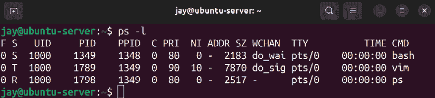

# 第七章：控制和管理进程

在典型的 Linux 服务器上，任何时候都可能有超过一百个进程在运行。这些进程的用途从系统服务（例如 **网络时间协议**（**NTP**）服务），到为其他进程提供服务的进程（如 Apache web 服务器）不等。作为 Ubuntu 服务器的管理员，你需要能够管理这些进程，以及管理它们所使用的资源。在本章中，我们将探讨进程管理，包括 `ps` 命令、管理作业控制命令等。

在我们学习这些概念的过程中，我们将涉及以下主题：

+   管理作业

+   理解 `ps` 命令

+   更改进程优先级

+   处理异常进程

+   管理系统进程

+   使用 `cron` 调度任务

为了开始探索进程管理，首先让我们来看一下作业管理。这不仅有助于我们更好地理解这些概念，还能帮助我们更好地理解后台和前台操作。

# 管理作业

直到现在，我们在 shell 中做的每一件事都直接呈现在我们面前，从执行到完成。我们安装了应用程序，运行了程序，走过了各种命令。每次，我们的 shell 控制权都会被夺走，直到上一个任务完成，我们才能开始下一个任务。例如，如果我们用 `apt install` 命令安装 `vim-nox` 包，我们只能眼睁睁看着 `apt` 为我们获取包并安装它。

在此期间，我们的光标消失，shell 会为我们完成任务，而不会让我们排队执行其他命令。我们可以随时打开一个新的 shell 会话到服务器，利用同时打开两个窗口来进行多任务处理，每个窗口执行不同的任务。但在使用命令行时，这可能不是最有效的多任务处理方式。

相反，我们实际上可以将一个进程放到后台，而不必等待它完成，然后可以将该进程带回前台，继续处理它，或者检查它是否成功完成。可以将这看作类似于窗口化桌面环境或 Windows 或 macOS 操作系统上的用户界面。我们可以在使用某个应用程序时，将它最小化以便不妨碍操作，再将其最大化以继续工作。实际上，这与在 Linux shell 中将进程放到后台的概念是一样的。

那么，究竟如何将进程放入后台或前台呢？这个概念有点难以解释。在我看来，学习新概念最简单的方法是亲自尝试，而我能想到的最简单的例子就是（再次）使用文本编辑器。我保证这次以文本编辑器为例不会无聊。事实上，这个例子非常有用，可能会成为你日常工作流的一部分。为了完成这个练习，你可以使用任何你喜欢的命令行文本编辑器，比如 Vim 或 Nano。在 Ubuntu Server 中，`nano`通常是默认安装的，因此如果你想使用它，你已经有了。如果你更喜欢使用 Vim，可以随时安装`vim-nox`包（如果你还没有安装的话）：

```
sudo apt install vim-nox 
```

你实际上可以安装`vim`而不是`vim-nox`，但我总是默认安装`vim-nox`，因为它内置支持脚本语言。

再次说明，随意使用你感到舒服的文本编辑器。在以下的例子中，我将使用`nano`，但如果你使用`vim`，只需每次看到`nano`时都将其替换为`vim`。

无论如何，为了查看后台操作的实际效果，打开你的文本编辑器。你可以选择打开一个文件，或者只启动一个空白会话。（如果不确定，可以输入`nano`并按*Enter*。）文本编辑器打开后，我们可以随时通过按下键盘上的*Ctrl + z*将其放入后台。

如果你使用`vim`而不是`nano`，你只能在*非插入模式*下将`vim`放到后台，因为它会捕获*Ctrl + z*，而不是将其传递给 shell。

你看到了发生了什么吗？你会立刻被带离编辑器，返回到 shell，这样你就可以继续执行命令了。你应该会看到类似以下的输出：

```
[1]+ Stopped nano 
```

在这里，我们可以看到进程的`job`编号、其状态以及进程名称。即使文本编辑器的进程显示状态为`Stopped`，它仍然在运行。你可以通过以下命令确认这一点：

```
ps au | grep nano 
```

在我的情况下，我看到`nano`进程正在运行，PID 为`43231`：

```
jay        43231  0.0  0.1   5468  3632 pts/0    T    11:27   0:00 nano 
```

此时，我可以执行其他命令，浏览我的文件系统，并完成其他工作。当我想将文本编辑器恢复到前台时，我可以使用`fg`命令将进程放到前台，这样它就会恢复运行。如果我有多个后台进程，`fg`命令会将我最近操作的那个进程恢复到前台。

我给你举了一个`ps`命令的例子，展示进程仍在后台运行，但实际上有一个专门的命令用于此目的，那就是`jobs`命令。

如果你执行`jobs`命令，你会看到输出中列出所有后台运行的进程：


图 7.1：在将两个`nano`进程放入后台后运行`jobs`命令

输出显示我有两个正在使用的`nano`会话，一个在修改`file1.txt`，另一个在修改`file2.txt`。如果我执行`fg`命令，它将把编辑`file2.txt`的`nano`会话调回前台，因为那是我最近在使用的会话。不过，这不一定是我想要返回编辑的文件。由于我左侧有作业 ID，我可以通过`fg`命令使用其 ID 来调回特定的后台进程：

```
fg 1 
```

了解如何将进程放入后台可以极大地提高工作效率。例如，假设我正在编辑一个服务器应用程序的配置文件，如 Apache。在编辑配置文件时，我需要查阅 Apache 的文档（手册页面），因为我忘记了某个语法。我可以打开一个新的 Shell 和 SSH 会话，查看另一个窗口中的文档。如果打开太多的 Shell 窗口，可能会变得非常混乱。将当前的`nano`会话放入后台，查看文档，然后用`fg`命令将进程调回前台继续工作，所有操作都可以在一个 SSH 会话中完成，这样会更加简便！

要将一个进程放入后台，你不一定需要使用*Ctrl + z*；实际上，你可以在执行命令时，直接通过在命令末尾加上&符号（`&`）来将进程放入后台。为了演示这个操作，我将使用`htop`作为示例。虽然这可能不是最实际的例子，但它可以有效地展示如何启动一个进程并立即将其放入后台。

我们可能还没有安装`htop`，但现在如果没有安装，请随意安装此软件包（如果尚未安装），然后使用&符号运行它：

```
sudo apt install htop 
htop & 
```

如你所知，第一个命令将在我们的服务器上安装`htop`软件包。第二个命令会打开`htop`，但会立即将其放入后台。当它被放入后台时，我会看到它的作业 ID 和进程 ID（接下来会详细讲解）。现在，在任何时候，我都可以使用`fg`将`htop`调回前台。由于我刚刚将其放入后台，`fg`会将`htop`带回前台，因为它被视为最近的任务。如你所知，如果它不是最近的任务，我可以通过`fg`命令引用它的作业 ID 来将其带回，即使它不是我最近使用的任务。试着练习一下，使用命令中的&符号并将其带回前台。以`htop`为例，这种操作很有用，启动它、将其放入后台，然后在需要检查服务器性能时随时将其带回前台。

不过请记住，当你退出 Shell 时，所有后台进程都会关闭。如果你在文本编辑器中有未保存的工作，你将会丢失正在处理的内容。因此，如果你使用后台进程，在注销之前，最好先执行`jobs`命令检查是否有待处理的任务仍在运行。

此外，你可能会注意到，一些应用程序能够平稳地置于后台运行，而其他应用程序则不能。以使用文本编辑器和`htop`为例，这些应用会在后台保持暂停状态，允许我们执行其他任务，然后再返回这些命令。然而，一些应用即使被置于后台，仍可能会定期在主窗口输出诊断文本。为了更好地控制你的 Bash 会话，你可以学习如何使用多路复用器，如`tmux`或`screen`，让这些进程在它们自己的会话中运行，这样就不会打断你的工作。虽然本书不打算详细介绍如何使用`tmux`这类程序，但如果你感兴趣，它是一个非常有用的工具。

能够将进程置于后台和前台运行，使我们能更有效地管理命令行上的任务，这绝对是有用的。现在，我们可以扩展这一点，看看如何查看服务器上的其他进程，包括那些我们没有手动启动的进程，比如文本编辑器。在接下来的部分中，我们将详细了解`ps`命令，它可以帮助我们理解服务器上实际运行的进程。

# 理解`ps`命令

在管理我们的服务器时，我们需要了解哪些进程正在运行，并且如何管理它们。在本章后续的部分中，我们将学习如何启动、停止和监控进程。但在讲解这些概念之前，我们首先需要能够确定服务器上实际运行的进程。`ps`命令可以帮助我们完成这项工作。

## 使用`ps`查看正在运行的进程

当`ps`命令单独执行时，它会显示由调用该命令的用户运行的进程列表：


图 7.2：当以普通用户身份运行`ps`命令且没有选项时的输出

在*图 7.2*中，你可以看到当我作为自己的用户运行`ps`命令且没有任何选项时，它显示了我以自己身份运行的进程列表。在这个例子中，我有一个`vim`会话正在运行（在后台），并且在最后一行，我们还看到了`ps`本身，它也包含在输出中。

在输出的左侧，你会看到每个正在运行的进程的编号。这被称为**进程 ID**（**PID**），我们在*管理作业*部分中提到过。为了继续之前，PID 是你应该熟悉的内容，所以我们不妨现在就来讲解一下。

服务器上运行的每个进程都会分配一个 PID，这使它与系统上的其他进程区分开来。你可能会理解一个进程是`vim`、`top`或其他某个名称。但是，我们的服务器通过进程的 ID 来识别它们。当你打开一个程序或启动一个进程时，内核会为其分配一个 PID。当你管理服务器时，你会发现知道 PID 非常有用，特别是对于本章将要介绍的命令。例如，如果你想终止一个表现不正常的进程，一个典型的工作流程是先找到该进程的 PID，然后在杀死进程时引用该 PID（稍后我会展示如何做）。实际上，PID 比单纯分配给运行进程的数字要复杂，但本章的主要目的是帮助你记住这个概念。

如果你知道进程的名称，你也可以使用`pidof`命令来查找进程的 PID。例如，我曾向你展示过一个`vim`进程的截图，PID 为`1385`。你也可以通过运行以下命令来做到这一点：

```
pidof vim 
```

输出将给出进程的 PID，而无需使用`ps`命令。

## 配置`ps`的参数

继续使用`ps`命令，你可以通过提供几个有用的参数来改变输出的方式。如果你使用`a`选项，你会看到比正常情况更多的信息：

```
ps a 
```

这将产生如下所示的输出：


图 7.3：`ps a`命令的输出

使用`ps a`，我们看到的输出与之前相同，但附加了更多的信息，并且顶部有了列标题。现在我们看到了`PID`、`TTY`、`STAT`、`TIME`和`COMMAND`的标题。从这个新的输出中，你可以看到我正在运行的`vim`进程正在编辑一个名为`testfile.txt`的文件。这很有用，因为如果我有多个`vim`会话打开，而其中一个会话表现异常，我可能想知道需要停止的是哪一个。

我们已经看到了`PID`和`COMMAND`字段，尽管我们没有看到顶部的正式标题。我们已经讨论过`PID`列，所以我就不再详细介绍了。`COMMAND`字段告诉我们实际正在运行的命令，如果我们想确保管理的是正确的进程，或者想查看某个用户正在运行的程序，这非常有用（稍后我会演示如何显示其他用户的进程）。

`STAT` 字段是新的；我们在单独运行 `ps` 时并没有看到它。`STAT` 字段告诉我们进程的状态码，表示该进程当前所处的状态。状态可以是不可中断的睡眠（`D`）、僵尸进程（`Z`）、停止（`T`）、可中断的睡眠（`S`）和运行队列（`R`）。还有分页（`W`），但现在不再使用，因此不需要讨论。不可中断的睡眠是一种进程状态，通常表示该进程在等待输入，无法处理额外的信号（我们稍后会简要介绍信号）。僵尸进程（也称为僵尸进程）在所有实际情况下已经完成了任务，但仍在等待父进程执行清理操作。僵尸进程实际上并没有运行，但会保留在进程列表中，通常会自行关闭。如果这样的进程无限期地保留在列表中并没有关闭，它就可能成为 `kill` 命令的候选对象，我们稍后会讨论该命令。停止的进程通常是已被发送到后台的进程，这将在下一节中讨论。可中断的睡眠表示程序处于空闲状态：它在等待输入，以便唤醒。

`TTY` 列告诉我们进程附加到哪个 TTY。TTY 是指**打字机**，这是一个来自不同历史时期的术语。过去，在大型主机时代，用户使用“终端”来操作计算机——这种终端设备由显示器和键盘组成，通过电缆与主机相连。这些设备只能显示从主机接收到的输出，并接收键盘上输入的数据。打字机就是用来指代这类设备的术语。显然，现在我们不再使用这样的设备，但从虚拟的角度来看，概念是相似的。

在我们的服务器上，我们使用键盘向一个设备发送输入，然后该设备将输出显示到另一个设备上。在我们的例子中，输入设备是我们的键盘，输出设备是我们的屏幕，屏幕要么直接连接到服务器，要么连接到我们的计算机，计算机通过像 SSH 这样的服务与服务器相连。在 Linux 系统中，大多数进程运行在 TTY 上，TTY 是（从实际应用的角度来说）一个终端，它接收输入并管理输出，类似于虚拟意义上的打字机。终端是我们与服务器交互的方式。

在*图 7.3*中，我们看到一个进程正在`tty1`的 TTY 上运行，其他进程则在`pts/0`上运行。我们看到的 TTY 是实际的终端设备，而`pts`指代的是一个虚拟（伪）终端设备。我们的服务器实际上能够运行多个`tty`会话，通常是 1 到 7 个。每个 TTY 会话都可以运行自己的程序和进程。为了更好地理解这一点，尝试按下*Ctrl + Alt +* 任意功能键，从*F1*到*F7*（如果你插入了物理键盘到物理服务器）。每按一次，你应该看到屏幕清空，然后转到另一个终端。每个终端都是独立的。每个功能键代表一个特定的 TTY，所以按下*Ctrl + Alt + F6*时，你会把显示切换到 TTY 6。

本质上，你是在从 TTY 1 切换到 TTY 7，每个 TTY 都可以容纳自己正在运行的进程。如果你再次运行`ps a`，你会看到你在这些 TTY 上启动的任何进程会以`tty`会话的形式显示在输出中，例如`tty2`或`tty4`。你在终端模拟器中启动的进程会被标记为`pts`，因为它们并不在一个实际的 TTY 上运行，而是运行在伪 TTY 上。

这是一个看似复杂但实际上很简单的讨论（TTY 或伪 TTY），但通过掌握这些知识，你应该能够区分一个进程是在实际服务器上运行还是通过一个终端外壳运行。

接下来，让我们看看`ps`命令输出中的`TIME`字段。这个字段表示 CPU 为该特定进程分配的总时间。然而，在我提供的截图中，每个进程的时间显示为`0:00`。刚开始可能会有些困惑。就我而言，特别是`vim`进程自从我截图以来已经运行了大约 15 分钟，但它们现在仍然显示为`0:00`的利用时间。实际上，这并不是进程运行的时间，而是进程与 CPU 进行交互的时间。对于`vim`而言，每个进程只是一个打开了文件的缓冲区。为了进行对比，我现在正在写这章的 Linux 机器的进程 ID 为`759`，时间为`92:51`。PID `759`属于我的 X 服务器，它提供了我的**图形用户界面**（**GUI**）和窗口功能。然而，当前这台笔记本的正常运行时间为 6 天 22 小时，也就是大约 166 小时，这与 PID `759`在`TIME`列中报告的时间并不相同。因此，我们可以推测，尽管我的笔记本已经连续运行了 6 天，但 X 服务器实际利用的 CPU 时间仅为 92 小时 51 分钟。总结一下，`TIME`列指的是进程需要 CPU 的时间以便计算某些东西，它不一定等于进程已经运行的时间，也不等于图形进程在屏幕上显示的时间。

让我们继续探讨`ps`命令，并查看一些额外的选项。首先，让我们看看当我们在之前的例子中添加`u`选项时，会得到什么结果，下面是相应的命令：

```
ps au 
```

这将产生类似于以下内容的输出：


图 7.4：`ps au`命令的输出

当你运行时，你应该立刻注意到与`ps a`命令的不同。使用这种变体，你会看到列出的是由你的用户 ID 以及其他用户运行的进程。当我运行时，我看到输出中列出了我的用户（`jay`）的进程，以及一个`root`的进程。`u`选项将是你可能会常用的选项，因为在大多数管理服务器的情况下，你可能更关心的是监控你的用户在做些什么。但是，`ps`命令最常用的变体可能是以下这种：

```
ps aux 
```

加上 `x` 选项后，我们不再将输出限制于 TTY 内的进程（无论是本地的还是伪终端的）。结果是我们将看到更多的进程，包括那些不与我们自己启动的进程相关的系统级进程。试试看吧。不过在实践中，`ps aux` 命令最常与 `grep` 一起使用，以查找特定的进程或字符串。例如，假设你想查看所有 `nginx` 工作进程的列表。为此，你可以执行如下命令：

```
ps aux | grep nginx 
```

在这里，我们像之前一样执行 `ps aux` 命令，但我们将输出通过管道传输到 `grep`，并只查找包含字符串 `nginx` 的输出行。在实践中，这是我常用 `ps` 的方式，也是我注意到很多其他管理员常用的方式。使用 `ps aux` 后，我们可以看到更多的输出，然后通过管道传输到 `grep` 来用搜索条件进一步缩小范围。然而，如果我们只想显示包含特定字符串的进程，我们也可以执行以下命令：

```
ps u -C nginx 
```

这将输出匹配 `nginx` 的进程列表及相关详细信息。`ps` 命令的另一个有用变体是通过按 CPU 使用率排序来排序进程：

```
ps aux --sort=-pcpu 
```

不幸的是，该命令会显示大量的输出，我们需要滚动回到顶部才能看到最上面的进程。根据你的终端配置，你可能无法回滚太多（甚至根本无法回滚），因此以下命令将进一步缩小输出范围：

```
ps aux --sort=-pcpu | head -n 5 
```

这可真有用！在这个示例中，我使用 `ps aux` 命令并加上 `--sort` 选项，按照 CPU 使用百分比（`-pcpu`）排序。然后，我将输出传送到 `head` 命令，指示它只显示前五行（`-n 5`）。本质上，这给了我自开机以来使用最多 CPU 的前五个进程列表。事实上，我也可以做到同样的事情，只不过是按使用最多内存来排序：

```
ps aux --sort=-pmem | head -n 5 
```

如果你想确定哪些进程表现异常并占用大量内存或 CPU，那么这些命令将帮助你缩小范围。`ps` 命令是管理员工具箱中非常有用的命令。你可以在我提供的示例之外自由实验，想要了解更多技巧，你可以查阅 `ps` 命令的手册页。实际上，`ps` 命令的手册页第二部分（在 *examples* 下）提供了更多有趣的示例，供你尝试。

现在我们已经知道如何检查正在运行的进程，在接下来的部分中，我们将了解如何更改进程的优先级，确保更重要的进程能够获得 CPU 更多的关注。

# 更改进程的优先级

Linux 系统上的进程可以以更改后的优先级运行，从而让某些进程拥有更高的优先级，其他进程则拥有较低的优先级。这为你作为管理员提供了充分的权限，确保系统中最重要的进程得到足够的优先级。为此，我们有专门的命令：`nice`和`renice`。这些命令允许你启动一个具有特定优先级的进程，或者更改已经运行中的进程的优先级。

现在，管理员们手动编辑进程的优先级已经不像以前那么常见了。拥有 32 个核心（甚至更多）的处理器已经不是什么稀奇事，几百 GB 的内存也是如此。如今的服务器无疑比以前更强大，且不像过去的机器那样资源紧张。许多服务器（例如虚拟机）和容器被专门用于执行单一任务，因此进程调优可能已经不再那么重要。然而，数据处理公司和使用深度学习功能的公司可能仍然需要进行某些细节调整。

无论是否优先处理进程对你有直接用处，至少理解这一概念是个好主意，免得有一天你需要增加或减少某个进程的优先级时能够应对。让我们重新查看一下`ps`命令，这次加上`-l`参数：

```
ps -l 
```

该命令的输出将如下所示：


图 7.5：`ps -l`命令的输出

从`ps -l`命令的输出中，可以注意到`PRI`和`NI`列。`PRI`表示优先级，`NI`表示“niceness”值，我们稍后将在本节中详细讨论。在这个例子中，我运行的每个进程的`PRI`都是`80`，`NI`是`0`。我没有改变或调整这些值；这些是我启动没有特别调整的进程时的默认值。`PRI`的值`80`是所有进程的初始值，并会随着“niceness”值的增加或减少而变化。

正如我所提到的，我们有专门的命令来允许我们更改优先级，分别是`nice`和`renice`。选择使用哪个命令，取决于进程是否已经在运行。关于*图 7.5*中的进程，我们需要使用`renice`来更改它们的优先级，因为这些进程都已经在运行。如果我们想从一开始就启动一个具有特定优先级的进程，我们应该使用`nice`。

例如，让我们改变我正在运行的`vim`会话的进程。确实，这是一个有些无聊的例子，因为`vim`并不是一个非常重要的进程。在现实中，你会优先处理那些真正重要的进程。以我为例，既然`vim`进程的 PID 是`1789`，那么我需要运行的命令来改变优先级将是这个：

```
renice -n 10 -p 1789 
```

该命令的输出将如下所示：


图 7.6：使用 renice 更改进程优先级

如果我们再次运行`ps -l`，可以看到`vim`的新的 nice 值：



图 7.7：更改进程优先级后`ps -l`命令的输出

现在，`vim`的新的 nice 值`10`在`NI`列中显示，`PRI`值也增加到`90`。现在，这个`vim`实例将以比其他任务更低的优先级运行，因为 nice 值越高，优先级越低。注意，当我更改优先级时，并没有使用`sudo`。在这个例子中，这是可以的，因为我只是增加了进程的 nice 值，这是允许的。但是，让我们尝试在没有`sudo`的情况下减少 nice 值，使用以下命令：

```
renice -n 5 -p 1789 
```

正如你在以下输出中看到的，我并没有成功：


图 7.8：尝试降低进程的优先级

我尝试将 nice 值从 10 降低到 5 被阻止了。如果我能够降低 nice 值，那么我的进程将以更高的优先级运行。相反，我收到了一个`Permission denied`错误。所以，本质上，用户可以增加他们进程的 nice 值，但不能减少，哪怕是自己启动的进程。如果你希望减少 nice 值，必须使用`sudo`。所以，本质上，如果你想“更友善”一些，你可以继续进行。如果你想“更严苛”一些，你需要`root`权限。此外，用户无法更改他们不拥有的进程的优先级。因此，如果你试图使用`renice`更改另一个用户正在运行的任务的 nice 值，你将收到`Operation not permitted`错误。

此时，我们知道如何使用`renice`重新调整正在运行的进程的优先级。现在，让我们看一下如何使用`nice`启动一个具有特定优先级的新进程。请看以下命令：

```
nice -n 10 vim 
```

在这里，我们启动了一个新的`vim`实例，但一开始就将优先级设置为特定的值。如果我们稍后想再次更改`vim`的优先级，我们需要使用`renice`。正如我之前提到的，`nice`用于启动一个具有特定优先级的新进程，而`renice`则用于更改已存在进程的优先级。在这个例子中，我们通过一个命令启动了`vim`并将其 nice 值设置为`10`。

将像`vim`这样的文本编辑器的优先级改变可能看起来是一个奇怪的测试用例，确实是这样。但`vim`编辑器是无害的，因为我们改变它的优先级导致系统崩溃的可能性极小。我想不出有什么实际理由需要重新调整像文本编辑器这样的程序的优先级。不过值得注意的是，你*可以*改变运行在服务器上的进程的优先级。在真实的服务器上，你可能有一个重要的进程，它生成报告并且必须按时交付。或者你可能有一个进程生成一个数据导出，客户需要这些数据来完成按时交付。所以，从更广阔的视角来看，你可以用对你或你的组织真正重要的进程名来替换`vim`。

你可能会好奇，`nice`和`renice`命令中的`nice`是什么意思。`nice`值本质上指的是一个进程对其他用户的“友好程度”。nice 值越高，优先级越低。所以，值为 20 比值为 10 更“友好”。在这种情况下，nice 值为 20 的进程以较低的优先级运行，因此对系统中的其他进程更加友好。nice 值的范围是从-20 到 19。nice 值为-20 的进程优先级最高，而 19 是最低的优先级。整个系统比这个简单的描述要复杂得多。尽管我将 nice 值称作优先级，但它实际上并不是。nice 值用于计算实际的优先级。不过现在，如果我们将 nice 值简化为代表优先级，并且假设 nice 值越高优先级越低，那就足够了。

到目前为止，我们一直在使用`nice`和`renice`命令，并结合`-n`选项直接设置 nice 值。不过值得注意的是，你可以简化`renice`命令，省略`-n`选项：

```
renice 10 42467 
```

该命令将进程的 nice 值设置为正数 10，类似于我们之前的其他示例。如果我们想提高优先级，也可以使用负数来设置 nice 值：

```
sudo renice -10 42467 
```

虽然省略`-n`选项并不会大幅减少我们打字的工作量，但现在你知道这是一个可行的选项。与这个例子不同的是，由于我在降低优先级值（稍后会详细介绍），我需要使用`sudo`。

在使用`nice`命令时，我们也可以省略`-n`选项，但在这方面命令的行为略有不同。下面的命令将无法正常工作：

```
nice 15 vim 
```

`nice`的语法略有不同，所以直接给它一个正数并不会像在`renice`中那样有效。为此，我们需要在数字前面加上一个短横线：

```
nice -15 vim 
```

当你查看这个命令时，可能会认为我们在应用一个负数。实际上，情况并非如此。由于`nice`的语法不同，我们使用的`-15`值实际上会转换为正数 15。我们在值前加上连字符是为了告诉`nice`我们正在将该值作为选项应用。如果我们确实想在不使用`-n`选项的情况下使用负值与`nice`命令配合使用，我们需要使用两个连字符：

```
nice --10 vim 
```

我认为这两个命令在使用`-n`选项时的语法差异有点令人困惑，因此我建议直接在`nice`和`renice`中都使用`-n`选项，因为这样它们会更加一致：

```
nice -n 10 vim
sudo nice -n -10 vim
renice -n 10 42467
sudo renice -n -10 42467 
```

这些示例展示了如何使用`-n`选项分别操作`nice`和`renice`命令，并设置正值和负值。由于这两个命令中`-n`选项的使用方式相同，因此可能更容易将其记住，而不是关注具体的细节。如前所述，我在设置负值时使用了`sudo`，因为只有`root`用户才能将进程的优先级设置为低于`0`。如果你试图这样做，你将收到以下错误：

```
nice: cannot set niceness: Permission denied 
```

这种类型的保护是有一定重要性的，因为你可能会遇到一些用户，他们认为自己的进程是最重要的，试图将它们的优先级提升到`-19`。归根结底，最好由系统管理员来决定哪些进程可以将优先级设置为负值。

作为 Ubuntu 服务器的管理员，决定哪些进程应该运行，且运行时的优先级是多少，是你的责任。然后，你将确定最佳的方式以实现合适的系统状态，调优进程优先级可能是其中的一部分。如果没有别的，学习`nice`和`renice`命令将为你的工具集增添另一项实用功能。

# 处理不正常的进程

关于`ps`命令，到目前为止你已经知道如何显示服务器上正在运行的进程，并且可以通过字符串或资源使用情况来缩小输出范围。但你实际上能做些什么呢？尽管我们不愿承认，但有时服务器上运行的进程会失败或表现不正常，这时你可能需要重启它们。如果某个进程无法正常关闭，你可能需要终止该进程。在本节中，我们介绍了`kill`和`killall`命令来执行这一操作。

`kill`命令接受 PID 作为参数，并尝试优雅地关闭一个进程。在一个典型的工作流中，当你需要终止一个无法自行关闭的进程时，你首先会使用`ps`命令找到该进程的 PID。然后，知道 PID 后，你可以尝试`kill`该进程。例如，如果 PID 为`31258`的进程需要被终止，你可以执行以下命令：

```
sudo kill 31258 
```

如果一切顺利，进程将结束。你可以重新启动它，或者通过查看日志来调查它为什么失败。

为了更好地理解`kill`命令的作用，你首先需要理解**Linux 信号**的基础知识。信号由管理员和开发者使用，可以通过内核、另一个进程或手动命令发送给一个进程。信号指示进程执行请求或更改，有时甚至是完全终止。例如，`SIGHUP`信号告诉进程它们的控制终端已经退出。一个可能发生这种情况的情况是你打开了一个终端模拟器，里面运行着几个进程。如果你关闭终端窗口（而没有停止你正在运行的进程），这些进程将会收到`SIGHUP`信号，基本上告诉它们退出（本质上意味着 shell 已退出或挂起）。

其他示例包括`SIGINT`（当应用程序在前台运行时，按下*Ctrl + c*会停止它），以及`SIGTERM`，当发送到进程时，请求它干净地终止。还有一个例子是`SIGKILL`，它强制进程以不干净的方式终止。除了名称，每个信号还由一个值表示，例如`SIGTERM`的值是`15`，`SIGKILL`的值是`9`。逐一介绍所有信号超出了本章的范围（信号的高级主题主要对开发者有用），但如果你感兴趣的话，可以通过查阅 man 页查看更多信息：

```
man 7 signal 
```

在本节中，我们最关注的两种信号是`SIGTERM(15)`和`SIGKILL(9)`。当我们想要停止一个进程时，我们向它发送其中一个信号，而`kill`命令正是允许我们做到这一点。默认情况下，`kill`命令会发送信号`15`（`SIGTERM`），告诉进程干净地终止。如果成功，进程将释放其内存并优雅地关闭。通过我们之前的`kill`命令，我们向进程发送了信号`15`，因为我们没有明确指定发送哪个信号。

使用`SIGKILL(9)`终止进程被认为是一种极端的最后手段。当你向一个进程发送信号`9`时，相当于把地毯从它下面撕掉，或者用一根炸药棍把它炸飞。进程会被强制关闭，完全没有反应的时间，因此，这是一种你应该避免使用的手段，除非你已经尝试了所有能想到的办法。理论上，发送信号`9`可能会导致文件损坏、内存问题或其他异常情况。至于我，虽然我自己使用过它，但从未遇到过长期的损害，但理论上是有可能发生的，因此你只应该在极端情况下使用它。一个可能需要使用此信号的情况是有关`defunct`或**僵尸进程**的情况，当它们无法自行关闭时。这些进程基本上已经“死了”，通常是等待其父进程来回收它们。

如果父进程从未尝试这样做，它们将一直保留在进程列表中。单从这个角度看，这可能并不算什么大问题，因为这些进程技术上并没有做任何事情。但如果它们的存在引发了问题，而你又无法终止它们，可以尝试向进程发送`SIGKILL`信号。消除僵尸进程应该不会带来任何危害，但你还是希望它们能有时间被清除。

要向进程发送`9`信号，你需要使用`kill`命令的`-9`选项。尽管不言而喻，但还是要确保你执行的是正确的进程 ID。

```
sudo kill -9 31258 
```

就这样，PID 为`31258`的进程会毫无痕迹地消失。它正在写入的任何数据将会处于悬空状态，并且会立即从内存中删除。如果出于某种原因，该进程仍然继续运行（这非常罕见），你可能需要重启服务器来彻底清除它，这种情况我只在极为罕见的几个案例中见过。例如，僵尸进程就是这样一种情况，它出现在进程列表中，但无论发送什么信号，它都不会受到影响，因为这种进程根本不会被调度占用 CPU 时间。总的来说，如果`kill -9`不能清除进程，那么就没有什么能做到的了。

另一种终止进程的方法是使用`killall`命令，这比`kill`命令更安全（至少在没有其他原因的情况下，误终止错误进程的可能性较小）。与`kill`类似，`killall`允许你向进程发送`SIGTERM`信号，但与`kill`不同，你可以通过进程名称来执行。此外，`killall`不仅会终止一个进程，它会终止所有与给定名称匹配的进程。要使用`killall`，你只需执行`killall`并指定一个进程的名称：

```
sudo killall myprocess 
```

和`kill`命令一样，你也可以向进程发送`9`信号：

```
sudo killall -9 myprocess 
```

同样，只有在必要时才使用该方法。实际上，你可能不会经常使用`killall -9`（甚至从未使用过），因为多个同名进程被锁住的情况很少发生。如果确实需要发送`9`信号，尽量使用`kill`命令。

`kill`和`killall`命令在进程卡住的情况下非常有用，但这些命令最好不是经常使用的。进程卡住通常发生在应用程序遇到无法恢复的情况时，因此，如果你经常需要终止进程，可能需要检查负责服务的软件包是否有更新，或者检查服务器是否存在硬件问题。

在下一节中，我们将查看在后台运行并为我们或我们的用户提供服务的系统进程，例如 web 服务器进程或 DHCP 服务器。

# 管理系统进程

系统进程，也称为**守护进程**，是在服务器后台运行的程序，通常会在服务器启动时自动启动。我们通常不会直接管理这些服务，因为它们在后台运行并执行其职责，无论是否需要我们的输入。例如，如果我们的服务器是一个 DHCP 服务器并且运行`isc-dhcp-server`进程，那么该进程将在后台运行，监听 DHCP 请求并为它们分配新的 IP 地址。通常，当我们安装一个作为服务运行的应用程序时，Ubuntu 会配置它在启动时自动启动，因此我们不需要手动启动它。假设该服务没有出现问题，它将继续执行其工作，直到我们告诉它停止。在 Linux 中，服务由 init 系统管理，也称为 PID 1，因为 Linux 系统的 init 系统总是获得该 PID。在近年来，Ubuntu Server 中进程管理的方式发生了很大变化。Ubuntu 已经切换到`systemd`作为其`init`系统，之前一直使用 Upstart，直到几年前。Ubuntu 16.04 是首个使用`systemd`的 LTS 版本，并且这一标准在 Ubuntu 22.04 中继续沿用。由于`systemd`已经成为标准一段时间，我们将重点介绍与其一起使用的命令来管理服务。旧的`init`系统正在逐渐淘汰。

在`systemd`中，服务被称为**单元**，但在实际使用中，“服务”、“守护进程”和“单元”这几个术语本质上是相同的。自从 20 多年前开始使用 Linux 以来，我依然习惯性地将`systemd`的单元称为服务。为了帮助我们管理这些“单元”，`systemd`包括了`systemctl`命令，它允许你启动、停止并查看服务器上单元的状态。为了帮助说明这一点，我将以 OpenSSH 为例。单元的名称并不重要，因为`systemctl`命令的语法无论我们操作的是哪个单元名称都是相同的。你可以使用`systemctl`启动、停止或重新启动 Apache 实例、数据库服务器，甚至用它重新启动整个网络堆栈。`systemctl`命令如果没有任何选项或参数，会默认使用`list-units`选项，列出单元的列表到你的 shell 中。不过，这可能会有点杂乱，所以如果你已经知道你要查找的单元名称，你可以将输出通过管道传递给`grep`，并搜索字符串。在你可能不知道单元的确切名称，但知道部分名称的情况下，这非常方便：

```
systemctl | grep ssh 
```

如果你想检查某个单元的健康状况，最好的方法是使用`status`关键字，它会显示有关该单元的一些非常有用的信息。这些信息包括该单元是否正在运行、是否已启用（意味着它已配置为在启动时自动启动），以及该单元的最新日志条目：

```
systemctl status ssh 
```

这个命令将产生类似以下的输出：


图 7.9：使用 systemctl 检查单元的状态

大多数情况下，你实际上可以在不需要 `root` 权限的情况下检查单元的状态，但你可能看不到所有可用的信息。在截图中，你可以看到几个关于 `ssh` 服务的日志条目，但某些单元在没有 `sudo` 权限的情况下不会显示这些条目。特别是对于 `ssh` 单元，我们在使用或不使用 `sudo` 时都会看到日志条目。

你可能在截图中注意到的另一件事是，`ssh` 单元的名称实际上是 `ssh.service`，但你不需要包含 `.service` 部分，因为默认情况下它是隐含的。有时，在使用 `systemctl` 查看进程状态时，输出可能会被压缩以节省屏幕空间。为了避免这种情况并查看完整的日志条目，可以添加 `-l` 选项：

```
systemctl status -l ssh 
```

另一件需要注意的事情是单元的 `vendor preset`。大多数包含 `systemd` 服务文件的 Ubuntu 软件包会自动启用它，但其他发行版通常默认不会启动和启用单元（例如 CentOS）。以 `ssh` 为例，你可以看到 `vendor preset` 被设置为 `enabled`。这意味着一旦安装 `openssh-server` 包，`ssh.service` 单元将自动启用。你可以通过检查 `Active` 行来确认这一点（例如输出中显示 `active (running)`），它告诉我们该单元正在运行。`Loaded` 行则明确指出该单元是 `enabled`，所以我们知道下次启动服务器时，`ssh` 将会自动加载。虽然在 Ubuntu 中安装包时，`systemd` 单元通常会被自动启用并启动，但这仍然会有所不同。在安装新软件包时，确保检查该单元的状态，以便了解它的设置。

启动和停止单元同样简单；你只需将 `systemctl` 中使用的关键字更改为 `start` 或 `stop`，即可实现所需的效果：

```
sudo systemctl stop ssh 
sudo systemctl start ssh 
```

还有一些其他关键字，例如 `restart`（它一次性处理前两个命令示例的功能），一些单元甚至提供 `reload`，允许你在不关闭整个应用程序的情况下激活新的配置设置。一个有用的例子是 Apache，它向本地或外部用户提供网页服务。如果你停止 Apache，所有用户将与网站断开连接。如果你添加了一个新的网站，可以使用 `reload` 而不是 `restart`，这样可以在不打断现有连接的情况下激活你所做的任何新配置。我们将在*第十四章*《提供网页内容》中查看 Apache，所以现在不必过多担心 Apache。它只是一个具有附加功能的单元的好例子，并不是所有单元都有 `reload` 选项，因此你应当查阅提供该单元的应用程序文档，以确保这一点。

由于我在之前的示例中提到了启动和停止 OpenSSH 单元的操作，有一个有趣的补充是，执行这些操作不会中断当前的 SSH 会话，如果你已经打开了 SSH 会话。停止 `ssh` 服务不会断开你的连接。现有的连接会被保持，停止 SSH 只会阻止新的连接建立。因此，与其他单元（例如 Apache）不同，SSH 在重新启动时不会中断现有连接。

如我之前所提到的，如果你希望一个单元在服务器启动时自动启动，则该单元需要被启用。大多数单元默认是自动启用的，但如果你遇到一个没有启用的单元，你可以通过 `enable` 关键字来启用它：

```
sudo systemctl enable ssh 
```

禁用一个单元同样也很简单：

```
sudo systemctl disable ssh 
```

你可以将启用一个单元的过程与启动它的过程结合在一起：

```
sudo systemctl enable --now ssh 
```

`--now` 参数告诉 `systemctl` 在启用单元后立即启动它，而不是等待下次启动时才执行，或者需要你在单独的命令中运行 `start` 参数。

虽然 `systemd` 主要用于管理单元，但它实际上是一个管理 Linux 系统多个方面的平台，包括 DNS 解析、网络等。`systemd` 甚至还处理日志记录，并且提供了 `journalctl` 命令，我们可以使用它来查看日志信息（这也是为什么 `systemctl status ssh` 的输出能够显示日志条目的原因）。

我们在*第四章*《导航和基本命令》中已经讨论过一些日志记录内容，接下来在*第二十二章*《故障排除 Ubuntu 服务器》中，我们将更详细地讨论这方面内容（其中还会包括对 `journalctl` 命令的进一步讨论）。

目前，只需要理解 `systemd` 在管理系统中的各个方面非常广泛。对于本章而言，如果你了解如何启动、停止、启用、禁用并检查单元的状态，那么你现在就可以继续往下进行。

# 使用 cron 调度任务

在本章前面，我们已经学习了如何启动进程并使其在后台运行，以及确保它们在服务器启动时立即启动。在某些情况下，您可能需要一个应用程序在特定时间执行任务，而不是始终在后台运行。这就是`cron`的用武之地。通过`cron`，您可以设置一个进程、程序或脚本在特定时间运行，甚至到分钟级别。每个用户可以拥有自己的`cron`配置（称为`crontab`），可以执行任何用户通常可以执行的功能。`root`用户也有一个`crontab`，允许执行系统范围的管理任务。每个`crontab`包含一个`cron`任务列表（每行一个），我们马上就会介绍。要查看用户的`crontab`，我们可以使用`crontab`命令：

```
crontab -l 
```

使用`-l`选项，`crontab`命令将显示执行命令的用户的作业列表。如果以`root`身份执行它，您将看到`root`帐户的`crontab`。如果以用户`jdoe`身份执行它，您将看到`jdoe`的`crontab`，依此类推。如果您想查看除您自己以外的用户的`crontab`，您可以使用`-u`选项并指定一个用户，但需要以`root`或`sudo`权限执行才能查看其他用户的`crontab`：

```
sudo crontab -u jdoe -l 
```

默认情况下，没有用户具有`crontab`，直到您创建一个或多个任务。因此，当您检查当前用户时，您可能会看到类似以下的输出：

```
no crontab for jdoe 
```

要创建一个`cron`任务，请首先登录为您希望该任务在其下运行的用户帐户。然后，发出以下命令：

```
crontab -e 
```

如果您的系统上有多个文本编辑器，您可能会看到类似以下的输出：


图 7.10：选择与`crontab`命令一起使用的编辑器

在这种情况下，当您创建您的`cron`任务时，您只需按下对应于您想使用的文本编辑器的数字。要设置一个指定编辑器的环境变量，并用单个命令编辑您的`crontab`，以下命令将准确完成此操作：

```
EDITOR=vim crontab -e 
```

在这个例子中，您可以用您喜欢的文本编辑器替换`vim`。此时，您应该进入一个文本编辑器，并打开您的`crontab`文件。每个用户的默认`crontab`文件都包含一些有用的注释，这些注释提供了关于`cron`如何工作的一些有用信息。要添加一个新的任务，您需要滚动到文件的底部（在所有注释之后）并插入一行。格式在这里非常重要，文件中的示例注释会给出每行布局的一些线索。特别是这部分：

```
m h dom mon dow command 
```

每个`cron`任务有六个字段，每个字段之间至少由一个空格或制表符分隔。如果你使用多个空格或制表符，`cron`足够智能，能够正确解析文件。在第一个字段中，我们设置任务执行的分钟数。在第二个字段中，我们设置 24 小时制的小时数，范围从 0 到 23。第三个字段表示月份中的天数。在该字段中，你可以填写 5（5 号）、23（23 号）等。第四个字段对应于月份，比如 3 代表 3 月，12 代表 12 月。第五个字段是星期几，数字从 0 到 6，分别表示星期日到星期六。最后一个字段是要执行的命令。以下是几个`crontab`行的示例：

```
3 0 * * 4 /usr/local/bin/cleanup.sh 
* 0 * * * /usr/bin/apt update 
0 1 1 * * /usr/local/bin/run_report.sh 
```

在第一个例子中，位于`/usr/local/bin`的`cleanup.sh`脚本将在每周四凌晨 12:03 运行。我们知道这一点，因为分钟列设置为`3`，小时列设置为`0`（午夜），日期列为`4`（星期四），而命令列显示了完全限定的命令`/usr/local/bin/cleanup.sh`。

命令的*完全限定*是什么意思？基本上，命令完全限定意味着完全写出负责该命令的二进制文件的完整路径。在第二个例子中，我们本可以简单地输入`apt update`命令，并且可能能够正常运行。然而，不包括程序的完整路径被认为是糟糕的`cron`习惯。虽然没有完全限定的命令可能仍然能成功运行，但其成功与否取决于调用该命令的用户路径中是否能找到该应用程序。并非所有服务器都以相同的方式设置，因此根据外壳的设置，可能无法运行。如果包含完整路径，则无论底层外壳如何配置，任务都应能正常运行。

如果你不知道完全限定的命令是什么，只需使用`which`命令。这个命令，当与你想要运行的命令名称一起使用时，将返回该命令在系统中的完全限定路径。

继续第二个例子，我们正在运行`/usr/bin/apt update`来每天凌晨 12 点更新服务器的仓库索引。每一行的星号代表*任何*，因此分钟列为`*`时，意味着此任务可以在任何分钟执行。基本上，我们唯一明确的是小时字段，我们将其设置为`0`，表示凌晨 12 点。

在第三个例子中，我们在每个月的第一天凌晨 01:00 运行`/usr/local/bin/run_report.sh`脚本。如果你注意到，我们将第三列（**日**）设置为`1`，这与 2 月 1 日、3 月 1 日等相同。这个任务将在每月的第一天执行，但只有在当前时间也是凌晨 01:00 时才会执行，因为我们填充了第一列和第二列，分别代表分钟和小时。

一旦你编辑并保存了用户的`crontab`，`cron`会被更新，从那时起，它将在你选择的时间执行任务。`crontab`将根据你服务器上的当前时间和日期执行，所以你要确保时间是正确的，否则你的任务会在意外的时间执行。你可以通过简单地运行`date`命令查看你服务器上的当前日期和时间。

要掌握使用`cron`创建作业，最好的方法（一如既往）是多加练习。第二个示例`cron`作业可能是一个不错的实验对象，因为更新你的仓库索引不会带来任何坏处。

# 总结

在本章中，我们学习了如何管理进程。我们首先查看了`ps`命令，可以用它来查看当前正在运行的进程列表。我们还了解了如何管理作业，以及如何终止一些因某些原因而不正常的进程。我们还讨论了如何改变进程的优先级，以确保我们可以完全控制哪些进程获得更多的处理时间，并且我们还学会了如何使用`cron`安排任务在稍后的时间和日期执行。

在*第八章*，*监控系统资源*中，我们将探讨一些方法，通过它们我们可以关注服务器上可用的资源，在这里我们将学习如何检查磁盘使用情况，理解内存使用情况和交换空间，同时也会看一些可以让资源管理变得轻松的工具。

# 相关视频

+   开始使用 tmux（LearnLinuxTV）：[`linux.video/tmux-guide`](https://linux.video/tmux-guide)

+   Linux 中的后台与前台进程管理（LearnLinuxTV）：[`linux.video/bg-fg`](https://linux.video/bg-fg)

# 进一步阅读

+   Ham Vocke, *tmux 快速简易指南*：[`learnlinux.link/tmux-article`](https://learnlinux.link/tmux-article)

+   Tmux 备忘单和快速参考：[`learnlinux.link/tcs`](https://learnlinux.link/tcs)

+   crontab 大师：[`learnlinux.link/ctg`](https://learnlinux.link/ctg)

# 加入我们的 Discord 社区

加入我们的社区 Discord 空间，与作者和其他读者讨论：

[`packt.link/LWaZ0`](https://packt.link/LWaZ0)


